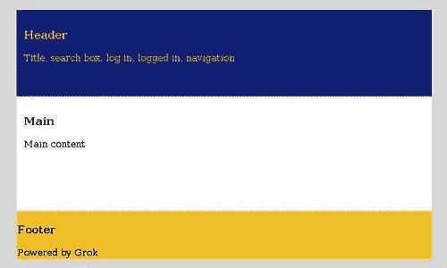
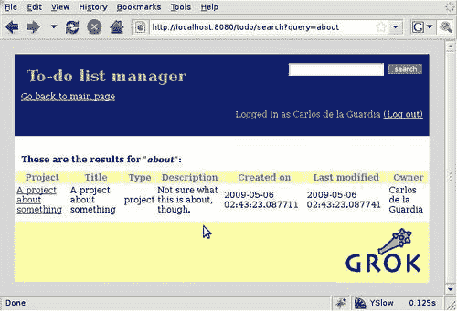
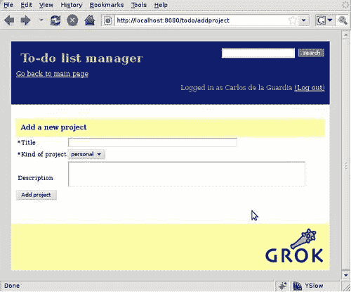
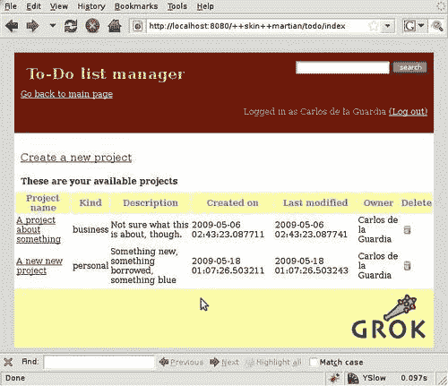

# 第八章。应用程序展示和页面布局

到目前为止，我们已经开发了一个相当简单但完整的应用程序。显然，还有一些粗糙的边缘需要抛光。例如，我们使用的模板都有不同的布局，尽管它们使用或多或少相同的样式和颜色，但缺乏统一性。

在本章中，我们将学习如何布局应用程序。我们将涵盖的一些重要点包括：

+   视图小部件管理器和视图小部件

+   使用视图小部件进行布局定义

+   将表单插入视图小部件

+   层和皮肤

+   定义应用程序的替代皮肤

# 视图小部件和视图小部件管理器

在典型的 Web 应用程序中，其布局的许多部分几乎需要在每个页面上重复。有时这些部分需要以不同的组合出现。例如，如果用户已经登录，则不应显示登录提示，但搜索框应始终可见。

Grok 通过允许开发者将网页拆分成称为**视图小部件**的小块 HTML，然后将它们按要求组装在给定的视图中来解决此问题。

## 视图小部件

视图小部件提供了一种将页面不同组件分离成独立部分（如页眉、页脚和导航）的机制。可以将这些部分进一步分解成 HTML 片段，这些片段可以根据上下文信息显示在页面上或不显示。这个概念使我们能够在组装页面时具有很大的灵活性。

与旨在显示完整页面的视图不同，视图小部件是 HTML 片段的表示，通常具有一个清晰的功能。当使用视图小部件时，我们可以将页面视为这些片段的集合。

## 视图小部件管理器

为了避免创建视图，跟踪所有可能的视图小部件组合。视图小部件分配给特定的视图小部件管理器。**视图小部件管理器**可以表示页面布局的一部分，例如，例如标题。视图小部件向此管理器注册，以便它负责它们的顺序和渲染。在我们的标题视图小部件管理器中，例如，我们可以有标题、登录、搜索框和主要导航视图小部件。

这意味着视图小部件永远不会直接从模板中调用。相反，它们的视图小部件管理器被调用，然后它依次调用其注册的每个视图小部件，并按所需顺序在页面上渲染它们。视图小部件管理器还有其他一些职责：

+   聚合注册到管理器的所有视图小部件。

+   应用一组过滤器以确定视图小部件的可用性。

+   根据实施的政策对视图小部件进行排序。默认情况下，按它们声明的顺序显示它们，Grok 还可以根据视图的`grok.order([number])`指令对它们进行数字排序。

+   提供视图小部件渲染的环境。

+   渲染本身，包含视图小部件的 HTML 内容。

视图小部件也可以与特定的视图、上下文或权限相关联，因此整个系统非常灵活，并且比带有条件标签的宏集合更容易管理。

# 理解各个部分如何组合

我们现在有了 Grok 构建页面布局的所有组成部分。当一个 Grok 应用程序服务一个页面时，幕后发生的事情如下：

1.  浏览器发出请求，其中包含所需的 URL 以及任何表单输入，以及通常的 `HTTP` 头信息，发送给 Grok。

1.  根据 URL 的部分，Grok 从根开始遍历（遍历）网站，继续到 URL 的下一部分，直到它到达最后一个模型对象。这个模型对象被称为**上下文**。

1.  当找到模型对象时，Grok 会使用 URL 的剩余部分并将其用作视图的名称。如果没有 URL 剩余，则使用名称 "index"。

1.  一旦有了视图的名称，Grok 就会找到它并初始化视图，将上下文和用于找到视图的请求传递给它。

1.  视图通常分配了一个模板，该模板用于将响应渲染到浏览器。

1.  模板可能包含对多个视图管理器的调用，这些视图管理器反过来调用它们包含的视图小部件来组装将返回的响应中的 HTML。

模板是调用 Grok 应用程序后的最终结果，它代表了视图的渲染。视图反过来与一个上下文相关联，这是分配给该视图的模型对象。

Grok 向模板传递大量信息，以便让开发者使用所有这些部分。这些信息是以变量形式存在的，这些变量指向以下对象，开发者可以使用这些对象来构建模板：

+   `request:` 浏览器发送的 `HTTP` 请求，包括所有头信息。

+   `context:` 由请求的 URL 指向的模型对象。在我们的应用程序中，这可能是一个项目或待办事项列表项。

+   `view:` 根据其名称配置用于上下文的视图。这是与当前模板相关联的代码。

+   `viewlet:` 在视图小部件模板内部，这个变量代表视图小部件对象。

+   `viewletmanager:` 在视图小部件模板内部，这个变量指向负责当前视图小部件的视图管理器。

## 视图方法和属性

这些方法和属性是`view`变量的一个部分，并且可以在模板内部被开发者使用。

| 视图方法和属性 | 描述 |
| --- | --- |
| `context` | 视图所呈现的对象。这通常是一个`grok.Model`类的实例，但也可以是一个`grok.Application`、一个`grok.Container`对象或任何类型的 Python 对象。 |
| `request` | `HTTP 请求`对象。 |
| `response` | 与请求相关联的`HTTP 响应`对象。这也可以作为`self.request.response`提供，但`response`属性提供是为了方便。 |
| `static` | 包含视图包静态文件的目录资源。 |
| `redirect(url)` | 重定向到指定的 URL。 |
| `url(obj=None, name=None, data=None)` | 构建 URL。如果没有提供任何参数，则构建到视图本身的 URL。如果只提供了`obj`参数，则构建到`obj`的 URL。如果只提供了第一个参数`name`，则构建到上下文/名称的 URL。如果同时提供了对象和名称参数，则构建到`obj/name`的 URL。可选地，您可以传递一个作为`cgi`查询字符串添加到 URL 中的`data`关键字参数。 |
| `default_namespace()` | 返回模板实现期望始终可用的命名空间字典。此方法不打算被应用程序开发者重写。 |
| `namespace()` | 返回一个字典，该字典将注入到模板命名空间中，除了默认命名空间之外。此方法打算由应用程序开发者重写。 |
| 视图方法和属性 | 描述 |
| `update(**kw)` | 此方法旨在由`grok.View`子类实现。它将在渲染视图的关联模板之前被调用，并可用于为模板预计算值。`update()`可以接受任意关键字参数，这些参数将从请求中填充（在这种情况下，它们*必须*存在于请求中）。 |
| `render(**kw)` | 视图可以通过关联的模板进行渲染，或者它可以实现此方法以从 Python 本身进行渲染。如果视图的输出不是 XML/HTML，而是在 Python 中计算（例如纯文本、PDF 等），则这很有用。`render()`可以接受任意关键字参数，这些参数将从请求中填充（在这种情况下，它们*必须*存在于请求中）。 |
| `application_url(name=None)` | 返回层次结构中最接近的应用程序对象的 URL，或相对于最接近的应用程序对象的命名对象（name 参数）的 URL。 |
| `flash(message, type='message')` | 向用户发送简短的消息。 |

## 视图小部件方法和属性

在视图小部件模板内部，以下方法和属性可供开发者使用：

| 视图小部件方法和属性 | 描述 |
| --- | --- |
| `context` | 通常，这是在此视图小部件的上下文中渲染的模型对象。 |
| `request` | `Request`对象。 |
| `view` | 对视图的引用，视图小部件在其中提供。 |
| `viewletmanager` | 对渲染此视图小部件的`ViewletManager`的引用。 |
| `update()` | 在渲染视图小部件之前调用此方法，可用于执行预计算。 |
| `render(*args, **kw)` | 此方法渲染由该视图小部件提供的内容。 |

## 视图小部件管理器方法和属性

`viewletmanager`变量在视图小部件内部对开发者可用。这些是它包含的方法和属性：

| 视图管理器方法和属性 | 描述 |
| --- | --- |
| `context` | 这通常是 `ViewletManager` 在上下文中渲染的模型对象。 |
| `request` | `Request` 对象。 |
| `view` | 对 `ViewletManager` 提供的视图的引用。 |
| `update()` | 在 `ViewletManager` 渲染之前调用此方法，可以用来执行预计算。 |
| `render(*args, **kw)` | 此方法渲染由该 `ViewletManager` 提供的内容。通常这意味着渲染和连接由该 `ViewletManager` 管理的所有视图。 |

除了这些方法外，视图管理器内部包含的视图可以使用标准的 Python 字典语法访问。

# 待办事项管理器布局

对于我们的应用程序，我们将使用视图来生成布局。首先，让我们定义我们的布局结构，它将大致是我们现在的样子。看看下面的截图：



这是一个非常简单的布局。三个部分（标题、**主要**和**页脚**）分别代表一个视图管理器以及这些部分内的事物列表，它们指的是所需视图。要在页面模板中实现这一点，我们需要使用一种特殊的模板表达式，称为**提供者**。我们的主模板将如下所示：

```py
<!DOCTYPE html PUBLIC "-//W3C//DTD XHTML 1.0 Transitional//EN" "http://www.w3.org/TR/xhtml1/DTD/xhtml1-transitional.dtd">
<html  xml:lang="en" lang="en">
<head>
<tal:headslot content="structure provider:headslot" />
</head>
<body>
<div id="header">
<tal:header content="structure provider:header" />
</div>
<div id="main">
<tal:main content="structure provider:main" />
</div>
<div id="footer">
<tal:footer content="structure provider:footer" />
</div>
</body>
</html>

```

在考虑我们应用程序的最终展示时，首先要注意的是我们插入了一个正确的 `<DOCTYPE>` 声明。我们还从标题中移除了 `<title>` 和 `<style>` 标签，因为它们现在将放入视图内。

我们定义了四个布局区域：headslot、header、main 和 footer。每个区域的内容将由一个单独的视图管理器提供。`provider:name` 表达式告诉 Grok 查找一个具有此名称的视图管理器，渲染其所有已注册的视图，并按配置的顺序返回它们。如您所回忆的，`structure` 前缀意味着将函数调用返回的内容解释为要渲染的 HTML。

## 在应用程序代码中定义视图管理器

我们首先查看模板，以了解它如何与所需的布局相关联，但实际上我们需要定义一些视图管理器和视图来使这成为可能。幸运的是，Grok 有 `Viewlet` 和 `ViewletManager` 类，我们可以使用这些类。首先，让我们定义我们的视图管理器：

```py
class HeadSlot(grok.ViewletManager):
grok.context(Interface)
grok.name('headslot')
class Header(grok.ViewletManager):
grok.context(Interface)
grok.name('header')
class Main(grok.ViewletManager):
grok.context(Interface)
grok.name('main')
class Footer(grok.ViewletManager):
grok.context(Interface)
grok.name('footer')

```

就这些了。我们只需从 `grok.ViewletManager` 继承，Grok 就会为我们做大部分工作。关键部分是 `grok.name` 类声明，因为我们在这里使用的名称将用于模板中的提供者表达式。`grok.context` 指令使用 `Interface`，因为它是最通用的声明，所以这样做将使所有应用程序视图和模型中的管理器生效。

## 注册视图

要使视图小部件运行，我们需要对我们的应用程序进行一些修改。到目前为止，我们一直在使用单独的视图来定义每个页面上发生的事情以及谁可以看到它。从我们刚刚定义的主模板中可能很明显，这现在将是视图小部件本身的职责。

要将我们的应用程序转换为使用视图小部件，第一步是从`dashboard.pt`模板中提取我们想要转换为视图小部件的部分，并将它们放入它们自己的模板中。我们将首先以标题为例。在项目中创建一个名为`apptitle.pt`的文件，并将以下代码输入其中：

```py
<div id="apptitle">
<h1 tal:content="context/title">To-Do list manager</h1>
</div>

```

目前，这仅包含标题，但我们可以最终包括标志和其他类似元素。

要将此视图小部件注册到视图小部件管理器中，使用`Viewlet`类作为基类，并调用`grok.viewletmanager`类：

```py
class AppTitle(grok.Viewlet):
grok.viewletmanager(Header)
grok.context(Interface)
grok.order(2)

```

就这样。此视图小部件将与之前定义的`Header`视图小部件管理器注册。视图小部件还需要一个上下文，以便视图小部件管理器知道它们是否要在当前上下文中显示。与视图小部件管理器的情况一样，我们使用`Interface`作为上下文，这样视图小部件就可以在应用程序的任何地方启用。还要注意`grok.order`指令，它在指定视图小部件管理器在渲染视图小部件时应使用的顺序时很有用。如果不使用`grok.order`，视图小部件将按照它们定义的顺序渲染。

`Viewlet`类与视图非常相似。它有一个`update`方法来准备它进行渲染，以及一个`render`方法来进行实际的渲染。如果省略了这些方法，Grok 将简单地渲染相应的模板，在这种情况下是`apptitle.pt`。

现在让我们来处理其他简单的视图小部件。头部部分的模板`head.pt`看起来是这样的：

```py
<meta tal:attributes="http-equiv string:Content-Type; content string:text/html;;charset=utf-8" />
<title tal:content="context/title">To-Do list manager</title>
<link rel="stylesheet" type="text/css" tal:attributes="href static/styles.css" />

```

搜索框的模板`searchbox.pt:`：

```py
<div id="searchbox">
<form id="search" tal:attributes= "action python:view.url('search')">
<input type="text" name="query" />
<input class="new_button" type="submit" value="search" />
</form>
</div>

```

登录信息和注销链接`loggedin.pt`如下所示：

```py
<div id="loggedin">
<p>
<span tal:content="string:Logged in as ${request/principal/title}"> </span>
<a tal:attributes="href python:view.url('logout')">(Log out)</a>
</p>
</div>

```

以及一个简单的导航辅助工具`navigation.pt`，定义为：

```py
<div id="navigation">
<a tal:attributes="href python:view.url('index')">Go back to main page</a>
</div>

```

对于页脚，我们将使用一个简单的**由 Grok 提供支持**的消息，以及 Grok 的标志，该标志将在`grokpowered.pt:`中定义：

```py
<div id="grokpowered">
<a href="http://grok.zope.org">

</a>
<span id="poweredtext">Powered by Grok!</span>
</div>

```

现在我们将把这些视图小部件与它们的管理器注册。我们只需在`app.py`中添加适当的类声明，如下所示：

```py
class Head(grok.Viewlet):
grok.viewletmanager(HeadSlot)
grok.context(Interface)
class SearchBox(grok.Viewlet):
grok.viewletmanager(Header)
grok.context(Interface)
grok.order(1)
class LoggedIn(grok.Viewlet):
grok.viewletmanager(Header)
grok.context(Interface)
grok.order(4)
class Navigation(grok.Viewlet):
grok.viewletmanager(Header)
grok.context(Interface)
grok.order(3)
class GrokPowered(grok.Viewlet):
grok.viewletmanager(Footer)
grok.context(Interface)

```

这样，`Header`视图小部件管理器已按特定顺序注册了四个视图小部件。目前`Footer`只有一个视图小部件。

## 修改现有视图以使用主模板

我们的应用程序中已经有了几个工作的视图。为了使它们使用在主模板中定义的新布局，我们需要做两件事：

+   让它们使用主模板

+   创建显示旧模板主要部分的视图小部件

第一部分很简单；我们只需使用`grok.template`指令强制每个视图使用主模板，如下所示：

```py
class DashBoard(grok.View):
grok.context(Todo)
grok.name('index')
grok.require('todo.view')
grok.template('master')

```

视图小部件本身与我们定义的其他视图非常相似，增加了几行：

```py
class DashBoardViewlet(grok.Viewlet):
grok.viewletmanager(Main)
grok.context(Todo)
grok.template('dashboard_viewlet')
grok.view(DashBoard)

```

我们使用`grok.template`指令来强制视图组件使用`dashboard_viewlet`模板。接下来使用`grok.view`指令，以使此视图组件仅在`DashBoard`视图中显示。我们必须这样做，以防止注册到`Main`视图组件管理器的多个视图组件同时出现在每个视图中。换句话说，这意味着当用户浏览应用程序的默认视图时，`DashBoardViewlet`将仅在`Main`视图组件管理器中渲染，而这个默认视图恰好是`DashBoard`视图。

要使这生效，我们需要额外的步骤。目前，我们在`app_templates`目录中有模板`dashboard.pt`。我们不能保留这个名称，因为这样`DashBoard`视图将有两个可能的模板可以使用，Grok 将拒绝猜测使用哪一个。因此，我们将名称更改为`dashboard_viewlet.pt`，这是我们放在`grok.template`指令中的名称。

最后一步是更改模板本身，并从中删除所有结构。这些结构现在包含在`master.pt`模板中。这是结果：

```py
<div id="dashboard">
<p class="create"><a href="add">Create a new project</a></p>
<h2 tal:define="projects context/values" tal:condition="projects">These are your available projects</h2>
<div class="projects">
<table>
<tr>
<th>Project name</th>
<th>Kind</th>
<th>Description</th>
<th>Created on</th>
<th>Last modified</th>
<th>Owner</th>
<th>Delete</th>
</tr>
<tr tal:repeat="project context/values">
<td>
<a href="" tal:attributes="href python:view.url(project)" tal:content="project/title">title</a>
</td>
<td tal:content="project/kind">type</td>
<td tal:content="project/description">type</td>
<td tal:content="project/creation_date">type</td>
<td tal:content="project/modification_date">type</td>
<td tal:content="project/creator">type</td>
<td>
<a tal:define="url python:view.url('deleteproject')" tal:attributes="href string:${url}?project=${project/__name__}">

</a>
</td>
</tr>
</table>
</div>
</div>

```

我们必须执行相同的步骤来使`TodoSearch`和`UserList`视图工作。我们将得到`TodoSearchViewlet`和`UserListViewlet`声明，以及`todosearch_viewlet.pt`和`userlist_viewlet.pt`模板。`ProjectIndex`视图需要额外的工作，因为它使用了 JavaScript。我们将在本章后面看到如何解决这个问题。

目前，您可以查看下一张截图，看看布局是如何工作的：



## 将表单插入到视图组件中

由于“添加用户”和“添加项目”表单是自动生成的，它们仍然没有使用我们新的布局。我们必须将这些表单放入视图组件中，以便我们可以利用布局。这需要更多的工作，因为视图组件需要渲染表单。

```py
class AddProject(grok.View):
grok.context(Todo)
grok.template('master')
class AddProjectViewlet(grok.Viewlet):
grok.viewletmanager(Main)
grok.context(Todo)
grok.view(AddProject)
def update(self):
self.form = getMultiAdapter((self.context, self.request), name='add')
self.form.update_form()
def render(self):
return self.form.render()

```

我们之前定义了`AddProjectForm`并给它命名为“add”。此代码直接使用该表单来渲染视图组件。首先，我们定义一个将使用主模板的视图。我们保持与实际表单相同的上下文，在这个例子中是`Todo`。

接下来，我们创建一个视图组件，并在相同上下文中将其注册到`Main`视图组件管理器中。我们将此视图组件分配给刚刚定义的视图。这里的技巧是获取表单，我们通过使用从`zope.component`导入的`getMultiAdapter`方法来实现。我们将在第十一章中更多地讨论适配器，但就目前而言，请相信这个调用将使我们得到当前上下文中的名为“add”的表单。一旦我们有了表单，我们就将其存储在视图组件中，并在视图组件的`render`方法中使用它，以便从实际表单中提取渲染。

那就是全部了，我们只需要将`dashboard_viewlet.pt`中的链接更改为指向“addproject”而不是“add”，我们就会得到我们想要的结果，如下面的截图所示：



## 使用视图组件插入不同的静态资源

我们几乎已经将整个应用程序转换为使用我们新的布局。唯一缺少的是项目视图。这个视图的问题在于它使用了一些在其他地方没有使用的 JavaScript 代码，因此我们需要以某种方式将其包含在标题中。

由于我们已经有了一个`headslot`视图组件管理器，完成这个任务的最简单方法是通过这个管理器注册一个视图组件，该视图组件只应用于项目视图。我们之前已经这样做过了。技巧是使用`grok.view`指令使视图组件只对选定的视图显示：

```py
class ProjectJavascript(grok.Viewlet):
grok.viewletmanager(HeadSlot)
grok.context(Project)
grok.view(ProjectIndex)

```

我们现在可以添加一个名为`projectjavascript.pt`的新模板，该模板将包括我们的 JavaScript 调用：

```py
<script type="text/javascript" tal:attributes = "src static/todo.js">
</script>
<script tal:define="url python:view.url('settitle')"
tal:content="string:window.onload = hideControls;; settitleurl = '${url}';;">
</script>

```

现在这个视图中的 JavaScript 代码将正常工作，并且项目视图组件可以无问题地显示。

# 层和皮肤

我们已经展示了如何通过使用视图组件来构建一个灵活的布局。Grok 通过使用层和皮肤，为我们提供了更多的灵活性。

我们应用程序的外观和感觉是通过结合一些视图组件并使用适当的 CSS 样式创建的。最终的组合可以被认为是应用程序的“主题”。在 Grok 中，我们为这个主题使用的名字是“皮肤”。

**皮肤**代表我们应用程序的外观和感觉。应该能够重新排列所有的视图组件并编辑样式，以创建一个完全不同的外观和感觉，而无需改变应用程序的工作方式。因此，有一个处理皮肤的机制，使我们能够轻松地为我们的应用程序创建主题或为其他用途创建特殊的皮肤，例如移动浏览器展示、响应特定 HTTP 动词的视图（称为 REST 视图，实际上在 Grok 内部就是这样构建的），或者根据登录用户的不同而创建的特殊高级用户皮肤。

为了简化皮肤的制作和使用，它们由多个层组成，每个层将只包含它们特有的外观和感觉部分。这使得重用应用程序的大部分 UI 变得容易，只需关注特定皮肤的特定部分。

## Grok 中的皮肤

在 Grok 中，所有视图和视图组件都必须分配给一个层。到目前为止，这已经在后台发生了，因为默认情况下有一个所有视图都使用的层。这被称为**默认浏览器层**。Grok 中的所有应用程序都有一个默认皮肤，它没有名字，只由一个层组成。

然而，皮肤和层之间的区别是微妙的。实际上它们非常相似，但皮肤有一个用户将知道的名字，而层则是匿名的。目的是让皮肤由多个层组成，并使用名字来引用结果。

# 将主题添加到我们的应用程序中

让我们通过使用皮肤为我们的应用程序添加不同的主题。现在我们将使其非常简单。我们已经有了一个包含我们的样式表 `<link>` 标签的视图组件。为了设计一个主题，我们将简单地创建一个覆盖此视图组件并使用不同样式表的层。这样，我们只需添加七行代码、一个模板和一个样式表，就可以创建一个新的主题。

我们正在使用蓝色为我们应用程序的页眉。我们将添加第二个主题，它使用红色，还有一个使用绿色。由于这些名称将为人所知，我们将使用花哨的名称：红色主题将被称为“martian”，绿色主题将被称为“forest”。

在 Grok 中，一个层需要从 `zope.publisher` 中定义的 `IDefaultBrowserLayer` 继承。因此，我们首先需要做的是导入它：

```py
from zope.publisher.interfaces.browser import IDefaultBrowserLayer

```

我们现在可以在 `app.py` 中定义皮肤，如下所示：

```py
class MartianLayer(IDefaultBrowserLayer):
grok.skin('martian')
class ForestLayer(IDefaultBrowserLayer):
grok.skin('forest')

```

对于每一层皮肤，我们只需基于 `IDefaultBrowserLayer` 定义一个类，然后使用 `grok.skin` 指令为其命名。这个名称将被用来浏览皮肤。

## 覆盖视图组件

现在我们有了皮肤，我们可以覆盖定义样式表的 `Head` 视图组件。这个视图组件由 `HeadSlot` 视图组件管理器管理。要覆盖一个视图组件，我们只需创建另一个具有相同名称的组件：

```py
class HeadMartian(grok.Viewlet):
grok.viewletmanager(HeadSlot)
grok.context(Interface)
grok.name('head')
grok.template('head_martian')
grok.layer(MartianLayer)
class HeadForest(grok.Viewlet):
grok.viewletmanager(HeadSlot)
grok.context(Interface)
grok.name('head')
grok.template('head_forest')
grok.layer(ForestLayer)

```

注意 `HeadMartian` 和 `HeadForest` 视图组件与它们覆盖的 `Head` 视图组件具有完全相同的视图组件管理器、上下文和名称。区别在于它们将使用另一个模板。为了使 `HeadMartian` 视图组件仅在 `MartianLayer` 皮肤上工作，我们添加了 `grok.layer` 指令并将其传递给皮肤。请记住，`grok.layer` 可以用于我们定义的任何视图组件或视图，因此我们可以覆盖应用程序中的任何内容，或者创建仅在特定皮肤上使用的新视图或视图组件。

在这种情况下，这就是我们需要添加到这两个主题中的所有代码。我们只需添加模板和样式，然后我们就完成了。对于 martian 主题，我们指导视图组件使用 `head_martian` 模板，因此我们创建一个名为 `head_martian.pt` 的文件，并向其中添加以下代码：

```py
<meta tal:attributes="http-equiv string:Content-Type; content string:text/html;;charset=utf-8"/>
<title tal:content="context/title">To-Do list manager</title>
<link rel="stylesheet" type="text/css" tal:attributes="href static/styles_martian.css" />

```

唯一的改变是 `<link>` 标签中样式表的名称。

对于 forest 主题，我们将创建 `head_forest.pt` 文件，并添加相同的文本，但我们必须将 CSS 文件名更改为 `styles_forest.css` 以使用正确的样式表。

现在剩下的只是添加新的样式表。为了使事情简单，我们只需将 `styles.css` 文件复制到 `styles_martian.css` 和 `styles_forest.css`，然后进行一些颜色替换。使用您喜欢的文本编辑器，将 `martian` 中的所有 `#223388` 替换为 `#883322`，在 `forest` 中替换为 `#338822`。除此之外，主题将完全相同，但我们将能够轻松地看到差异。如果您喜欢，可以自由地进行更多样式更改。

## 使用新的皮肤

要真正看到新皮肤，我们需要告诉 Grok 使用默认皮肤以外的其他皮肤。最简单的方法是在 URL 中使用特殊的`++skin++`名称，并附带皮肤名称。Grok 会看到这个，并使用正确的皮肤。

例如，如果我们把浏览器指向以下 URL：[`localhost:8080/++skin++martian/todo`](http://localhost:8080/++skin++martian/todo)，我们就能看到火星皮肤。注意`++skin++`名称紧接在主机名之后。如果我们把`++skin++`放在 URL 的其他位置，Grok 将会发出错误信号。要查看森林皮肤，只需在上面的 URL 中将单词`martian`改为`forest`。查看下一张截图，看看火星皮肤的样子：



我们已经完成了。如果我们浏览应用程序，我们会看到现在所有页面都显示了带有相应背景色的标题。

当然，要求用户在 URL 中输入皮肤名称并不适合生产使用。在第十一章中，我们将看到如何通过偏好设置菜单让用户选择皮肤，并让 Grok 自动应用正确的皮肤。

# 摘要

在本章中，我们学习了 Grok 的布局和展示功能，包括视图组件、层和皮肤。我们通过使用这些工具修改了我们的应用程序，使其外观和感觉保持一致。接下来，我们将学习 ZODB 以及 Grok 如何使用它。
