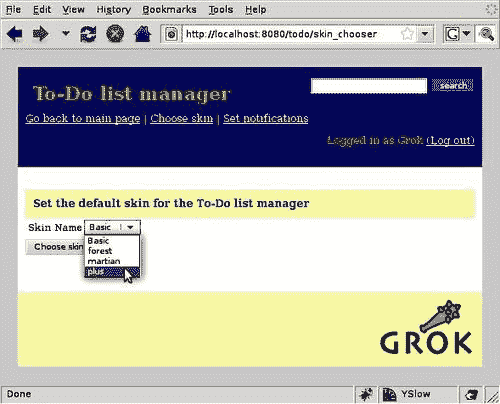
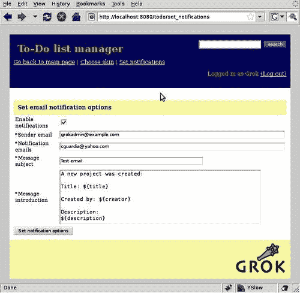

# 第十一章. Grok 背后的关键概念

在本书的第一章中，我们讨论了 Grok 的特点，强调了**Zope 工具包**（**ZTK**）和**Zope 组件架构**（**ZCA**）的重要性。我们还提到 Grok 提供了一种敏捷的方式来使用这些工具。

在前面的章节中，我们使用了几个 ZTK 包，并采用了许多 ZCA 模式，在需要时介绍和解释它们。我们还看到了 Grok 如何敏捷，因为我们逐步增长我们的应用程序，同时从一开始就拥有一个功能齐全的应用程序。

就目前为止我们所覆盖的材料而言，我们可以创建相当复杂的应用程序，但要真正充分利用 Grok，就必须在更详细的层面上解释 ZCA 背后的概念以及提供 Grok 灵活性的工具。

尽管 ZCA 及其模式的完整解释超出了本书的范围，但本章至少将讨论其更重要的概念，并通过对我们待办事项应用的小幅增加和扩展来展示它们的实用性。作者认为，一旦我们看到了这些概念在实际应用中的使用实例，我们就可以在解释它们时参考。

在本章中，我们将详细探讨这些概念。特别是，我们将讨论：

+   ZCA 是什么

+   接口

+   适配器、实用工具和事件

+   通过事件扩展应用程序

+   通过适配器扩展应用程序

# Zope 组件架构

许多敏捷的 Web 应用程序框架被设计成专门允许从想法到工作应用程序的快速转换。这是好事，但有时对快速开发周期的强调会导致对可扩展性和代码重用等事物的关注减少。相比之下，Grok 基于一系列模式，其主要关注点是应用程序的可维护性和可扩展性。实际上，Grok 应用程序甚至可以从外部扩展，而无需接触它们的代码。允许这种扩展的模式集被称为**Zope 组件架构**。

尽管 Zope 这个词出现在它的名字中，但 ZCA 是一组通用的 Python 包，可以用来创建基于组件的应用程序，独立于 Zope 网络应用程序服务器或 ZTK。实际上，我们可以使用 ZCA 来创建任何类型的 Python 应用程序，并且它特别适合于大型系统的开发。

ZCA 通过将 Python 对象的功能封装到一个称为**组件**的实体中来工作，该组件具有由一个称为**接口**的单独对象定义的良好行为，该接口有助于开发者了解如何使用给定的组件，甚至可以通过实现其中表达的所有功能来完全替换它。

由于将系统的功能拆分为多个组件的概念需要开发者跟踪大量可能的组件，ZCA 提供了一个注册表，可以根据它们的接口注册和检索组件。这确实是 Zope 组件架构的关键部分，因为与之交互主要涉及以各种方式与注册表交互。

## 接口

我们在第五章中介绍了“接口”，当时我们使用它们来自动生成表单。在第五章中，我们解释了接口用于记录对象的外部行为。

一个在接口中定义其功能的对象被称为 *提供* 该接口。接口定义了一个对象可以做什么，但对象如何内部遵守此协议完全由实现者决定。

ZCA 中的接口用于在注册表中注册和查找组件。这使得我们能够根据组件的功能来查找它们，并轻松地替换、扩展或覆盖应用程序中的特定功能。

当一个类包含接口中描述的功能时，它就被说成是 *实现* 该接口。尽管如此，接口是独立于类的。一个特定的接口可能被任何数量的类实现。此外，一个类可以实现任何数量的接口。

让我们看看第六章中定义的接口，以便使项目、列表和条目可搜索：

```py
class ISearchable(interface.Interface):
title = interface.Attribute('title')
kind = interface.Attribute('kind')
description = interface.Attribute('description')
creator = interface.Attribute('creator')
creation_date = interface.Attribute('creation date')
modification_date = interface.Attribute('modification date')
checked = interface.Attribute('checked')
content_type = interface.Attribute('content type')
project_name = interface.Attribute('project name')
def searchableText():
"""return concatenated string with all text fields to search"""

```

接口是一个类，它继承自 `zope.interface` 包中定义的 `Interface` 类。`ISearchable` 接口描述了一个可搜索对象必须提供的属性和方法。类似于我们的待办事项列表应用程序，我们可能有几种不同的内容类型，但只要它们的类定义承诺实现 `ISearchable`，我们就可以在它们上面使用相同的搜索代码而不会出现问题。

注意到 `searchableText` 方法定义中不包含 Python 类中使用的 `self` 参数。这是因为尽管接口记录了方法，但它永远不会被实例化，因此在这里不需要 `self`。

一旦我们定义了一个接口，我们就可以创建实现它的类。在我们的应用程序中，`ISearchable` 接口由几个类实现。例如，以下是 `Project` 内容类型如何声明其遵守 `ISearchable` 协议的意图：

```py
class Project(grok.Container):
grok.implements(IProject, IMetadata, ISearchable)

```

在 Grok 中，我们使用 `implements` 类注解来声明一个类实现了一个或多个接口。我们可以看到，除了 `ISearchable`，`Project` 类还实现了 `IProject` 和 `IMetadata`。

一旦我们创建了一个实际的 `Project` 对象，它就被说成是 *提供* `ISearchable`，这意味着类实现接口，而这些类的实例提供了它们。

接口也可以用来定义表单生成的模式。我们在整个应用程序代码中大量使用了这种方法。以下是一个示例：

```py
class ITodoList(interface.Interface):
title = schema.TextLine(title=u'Title', required=True, constraint=check_title)
description = schema.Text(title=u'Description', required=False)
next_id = schema.Int(title=u'Next id' ,default=0)

```

我们已经看到，通过使用 `grok.AutoFields` 指令，我们可以将此模式定义转换为表单上的 HTML 控件。

由于接口在组件注册表中用作键，因此可以找到实现该接口的所有对象。这对于找到属于某些类型的对象非常有用，但也可以用于更有趣的事情，例如创建仅与提供接口的对象一起工作的方法，或者扩展实现它的任何类的功能。

这通常在不需要为某些接口定义特殊功能时很有用，因此有时我们可能会遇到空接口定义，称为**标记接口**。它们基本上将对象标记为属于某个类型，这使得注册表可以找到它们并将其他组件注册为与它们一起工作。到目前为止，在我们的应用程序中我们还没有需要它们，但它们可以是我们工具箱中非常有用的补充。

## 适配器

ZCA 的一个原则是使用组件而不是继承来扩展应用程序的行为，这样我们就可以将不同的组件相互连接，以获得所需的结果。

这种方法需要三件事：

+   明确定义的组件，这就是我们使用接口的原因。它们将组件标记为提供特定的行为，并为该功能提供一种蓝图或合同。

+   跟踪多个组件的简单方法。我们已经提到 ZCA 有一个注册表，接口被用作键来根据其定义的功能检索组件。这也使得可以完全替换一个组件为完全不同的一个，只要它实现了相同的接口。

+   一种使不同接口的组件协同工作的方式，即使它们具有完全不同的接口。这就是适配器发挥作用的地方。

**适配器**简单地说是一段代码，它接受具有特定接口的对象，并使其提供额外的接口。换句话说，它适应了组件，使其提供新的行为，而无需对其代码进行任何更改。

### 现实世界的适配器

将其视为现实世界中的物体可能会有所帮助。如今，手机无处不在，许多人依赖它们来满足他们的通信需求。然而，它们的电池寿命相当短，需要不断充电。当我们购买一部新手机时，我们通常会得到一个交流适配器，这允许我们将手机插入任何墙壁插座并为其充电。在某些情况下，我们可能无法使用墙壁插座，例如，在长途汽车旅行期间。在这种情况下，我们当然可以使用车载适配器，通过使用车辆的电源插座来为手机充电。

ZCA 的适配器与这些电话适配器非常相似。它们适配电源，无论是汽车还是插座，并使其以不同的接口呈现，以便手机可以充电。电源和手机都不会有任何改变，甚至不需要了解所使用的特定适配器的任何信息，只要它们符合既定的电源和手机连接接口（现在你明白术语的来源了）。

### 定义和使用适配器

到目前为止，我们尚未明确定义或使用适配器，所以让我们快速看一下在 Grok 中如何进行此操作。假设我们想要显示待办事项列表应用程序中任何内容上次修改过去的天数。如果我们为每种内容类型添加方法，我们将有很多重复的代码，并且任何对某个方法逻辑的更改都需要对所有内容类型进行更改。通过使用适配器，我们可以在一个地方获得所有代码，如下所示：

```py
import datetime
class IDayCalculations(Interface):
def daysOld():
"number of days since the content was created"
def daysFromLastModification():
"number of days since the last modification"
class DaysOld(grok.Adapter):
grok.implements(IDayCalculations)
grok.adapts(ISearchable)
def daysOld(self):
return (datetime.datetime.now() - self.context.creation_date).days
def daysFromLastModification(self):
return (datetime.datetime.now() - self.context.modification_date).days

```

首先，我们定义我们的“天”计算方法的接口。为了演示目的，我们将保持其简单性。`grok.Adapter`组件用于定义适配器。我们创建了一个适配器，并使用`grok.implements`指令来表示它将实现我们在接口中刚刚定义的方法。

我们应用程序中的所有内容已经实现了`ISearchable`接口，因此为了使每个待办事项应用程序对象都提供此接口，我们使用`grok.adapts`指令。因此，`DaysOld`是一个适配器，它接受任何提供`ISearchable`的对象，并为它提供`IDayCalculations`。

适配器实例将同时具有`context`和`request`属性。这是因为适配器总是接收它所适配的对象作为参数，以便能够访问它们的属性并在实现中使用它们。在这个例子中，`self.context`指的是被适配的`context`对象，它可以是`TodoList`、`Project`、`TodoListItem`等。由于所有这些对象都实现了`ISearchable`接口，我们知道`modification_date`和`creation_date`将可用于计算。

我们可以在以下方式中使用此适配器在我们的内容类型之一的任何视图中：

```py
class ProjectView(grok.View):
grok.context(Project)
def update(self):
self.days_old = IDayCalculations(self.context).daysOld()
self.days_modified = IDayCalculations( self.context).daysFromLastModification()

```

在这个例子中，我们使用`update`方法将`days_modified`和`days_old`属性插入到视图中，以便在渲染时它们将可用于视图模板。要从注册表中获取适配器，我们调用`IDayCalculations`接口本身，并将`context`对象作为参数，在这种情况下是一个`Project`。一旦我们有了适配器，我们就可以简单地调用它的方法，它将表现得好像这些方法是`Project`组件的一部分。

当刚开始了解它们时，适配器可能看起来是一种绕弯路的方式来获取我们需要的组件，但请记住，整个系统都是为了易于扩展和进化而设计的。通过使用适配器，我们可以在其他包内部覆盖组件，同时系统仍然可以正常工作，无需以任何方式修改原始代码。

### 我们在应用程序中使用的适配器

为了在 Grok 中使用适配器，它们首先需要注册到 ZCA 中。Grok 本身在应用程序启动时会执行一系列注册。实际上，我们已经在代码中使用了这些。在第七章中，我们向我们的应用程序添加了身份验证，并决定为每个新创建的用户添加特定的角色，以简化权限管理。

Grok 站点对角色分配一无所知，因此为了能够为某个主体定义角色，它使用了一个角色管理器。这个**角色管理器**是一个适配器，它使得站点能够提供角色管理器接口。看看我们使用的代码：

```py
def addUser(self, username, password, real_name, role):
session = Session()
result = session.query(Account).filter_by(name = username).first()
if result is None:
user = Account(username, password, real_name, role)
session.add(user)
role_manager = IPrincipalRoleManager(grok.getSite())
if role==u'Project Manager':
role_manager.assignRoleToPrincipal('todo.ProjectManager', username)
elif role==u'Application Manager':
role_manager.assignRoleToPrincipal('todo.AppManager', username)
else:
role_manager.assignRoleToPrincipal('todo.ProjectMember', username )
transaction.commit()

```

在这里，我们正在添加一个新用户，紧接着我们就为该用户分配了一个角色。正如我们之前提到的，站点将这项责任委托给角色管理器。角色管理器是一个适配器，它注册为实现了 Grok 站点的`IPrincipalRoleManager`接口，因此我们需要使用这些信息查询注册表以获取实际的经理。执行此操作的行是：

```py
role_manager = IPrincipalRoleManager(grok.getSite())

```

该接口本身执行注册查找，请求一个已注册的组件，并将其提供给实现 Grok 站点接口的对象。请注意，Grok 站点本身作为参数传递，而不是其接口，但 ZCA 足够智能，能够找到正确的组件，如果它已注册。

在这种情况下，查询为我们提供了一个实现`IPrincipalRoleManager`接口的角色管理器对象，因此我们知道`assignRoleToPrincipal`方法将可用于为我们的新用户分配正确的角色。

适配器可以被命名，这样我们就可以通过它的名字来获取一个特定的`IPrincipalRoleManager`组件。此外，一个适配器同时适配多个组件也是可能的，在这种情况下，它被称为**多适配器**。例如，Grok 中的所有视图都是请求和上下文的多适配器：

```py
class TodoListUpdateItems(grok.View):
grok.context(TodoList)
grok.name('updateitems')
grok.require('todo.changeitems')

```

上下文通过`grok.context`指令在类体中指定，请求指的是当前的浏览器请求。在前面的代码中，`TodoListUpdateItems`是一个请求和一个`TodoList`的多适配器。它使用名称`updateitems`。这个多适配器/视图只有在用户在浏览`TodoList`对象时请求`updateitems`视图时，才会被 Grok 调用。

我们还在我们的待办事项列表管理器代码中明确使用了多适配器：

```py
class AddProjectViewlet(grok.Viewlet):
grok.viewletmanager(Main)
grok.context(Todo)
grok.view(AddProject)
def update(self):
self.form = getMultiAdapter((self.context, self.request), name='add')
self.form.update_form()
def render(self):

```

在第八章中，我们展示了如何获取在视图组件中渲染的表单，并看到我们需要获取创建该特定表单的特定组件。在这里，注册表查找是通过从`zope.component`导入的`getMultiAdapter`方法执行的。我们特别想要一个项目的“添加表单”，因为我们想要渲染`AddProjectViewlet`。由于上面的`grok.context`指令，我们知道我们有一个请求，上下文是一个`Todo`应用程序，因此如果我们调用`getMultiAdapter`并传递请求、上下文以及所需表单的名称，ZCA 机制将为我们找到它。

## 实用程序

正如我们所见，组件注册表主要是由注册到特定接口的适配器组成。在某些情况下，注册不适应任何东西但提供我们需要能够覆盖或替换的某种服务也是很有用的。数据库连接、身份验证后端和用户源就是这类服务的例子。

ZCA 有概念来覆盖这种情况。**实用程序**只是一个具有声明接口的组件，它也可能有一个名称。ZCA 中的实用程序可以是本地的也可以是全局的。

### 全局实用程序

**全局实用程序**是在 Grok 启动时创建和注册的，但它不是持久的（也就是说，其状态没有保存在 ZODB 中）。我们使用过的全局实用程序的例子包括数据库连接和会话凭证。

让我们看看第七章中我们集成到应用程序中的身份验证服务时添加的实用程序：

```py
class MySessionCredentialsPlugin(grok.GlobalUtility, SessionCredentialsPlugin):
grok.provides(ICredentialsPlugin)
grok.name('credentials')
loginpagename = 'login'
loginfield = 'login'
passwordfield = 'password'

```

要定义全局实用程序，我们继承自`grok.GlobalUtility`组件，并通过使用`grok.provides`指令声明组件提供的接口。命名实用程序也需要使用`grok.name`指令来注册它们的名称。

要从注册表中获取全局实用程序，我们使用`zope.component`中定义的`getUtility`函数。在这种情况下，`credentials`实用程序不是直接由我们的代码调用，而是由身份验证机制本身调用。然而，如果我们想使用这个实用程序，我们会像以下这样获取它：

```py
from zope.component import getUtility
credentials_plugin = getUtility(ICredentialsPlugin, 'credentials')

```

### 本地实用程序

**本地实用程序**与全局实用程序非常相似，但它会被保存在数据库中，因此其状态和配置是持久的。Zope Toolkit 目录和我们在应用程序中使用的可插拔身份验证机制都是本地实用程序的例子。

我们可以查看第七章中定义的`UserAuthenticatorPlugin`，以了解如何定义本地实用程序：

```py
class UserAuthenticatorPlugin(grok.LocalUtility):
grok.implements(IAuthenticatorPlugin)
grok.name('users')

```

我们可以看到，这与全局实用程序的工作方式完全相同，只是我们继承自`grok.LocalUtility`而不是它。然而，我们实际上不能使用本地实用程序，除非我们明确将其添加到`grok.Container`组件中。看看`Todo`应用程序的主应用程序组件：

```py
class Todo(grok.Application, grok.Container):
grok.implements(ITodo)
grok.local_utility(
UserAuthenticatorPlugin, provides=IAuthenticatorPlugin,
name='users',
)
grok.local_utility(
PluggableAuthentication, provides=IAuthentication,
setup=setup_authentication,
)

```

我们的应用程序包含两个本地实用工具。有一个名为 `UserAuthenticatorPlugin` 的实用工具，因为我们可能需要与多个用户源一起工作。还有一个名为 `PluggableAuthentication` 的实用工具，它将处理我们网站的认证需求，因此不需要通过名称与其他类似实用工具区分开来。

实际上，我们的应用程序还包含第三个本地实用工具，即“目录”，它在应用程序创建时由 Grok 自动添加。目录不是一个命名实用工具。

要使用这些实用工具之一，我们使用与我们的全局实用工具相同的 `getUtility` 函数：

```py
users = component.getUtility(IAuthenticatorPlugin, 'users')
auth = component.getUtility(IAuthentication)

```

关于本地实用工具的一个重要注意事项是，由于它们是在应用程序创建时添加并存储在数据库中的，因此更改一个实用工具的初始化代码在应用程序创建后不会有任何效果。在这种情况下，使修改后的本地实用工具工作最简单的方法是删除应用程序实例并重新创建它。

## 事件

Zope 工具包定义了一系列生命周期事件，每当对对象执行某些操作时（如创建或修改）都会触发这些事件。一个**事件**可以有一个或多个订阅者，每当订阅的事件发生时都会调用这些订阅者。这些订阅者被称为**事件处理器**，Grok 提供了一种简单的方式来定义它们。

这里是我们可以通过使用 Grok 订阅的一些事件：

| 事件 | 描述 | 事件属性 |
| --- | --- | --- |
| `IObjectModifiedEvent` | 一个对象已被修改。这是一个通用事件，涵盖了持久对象的所有更改，如添加、移动、复制或删除对象。 | `object` `descriptions` |
| `IContainerModifiedEvent` | 容器已被修改。容器修改是针对子对象的添加、移除或重新排序的特定操作。继承自 `grok.IObjectModifiedEvent`。 | `object` `descriptions` |
| `IObjectMovedEvent` | 一个对象已被移动。 | `object` `oldParent` `oldName` `newParent` `newName` |
| 事件 | 描述 | 事件属性 |
| `IObjectAddedEvent` | 一个对象已被添加到一个容器中。 | `object` `oldParent` `oldName` `newParent` `newName` |
| `IObjectCopiedEvent` | 一个对象已被复制。 | `object` `original` |
| `IObjectCreatedEvent` | 一个对象已被创建。此事件旨在在对象被持久化之前发生，即其位置属性（`__name__` 和 `__parent__`）通常为 `None`。 | `object` |
| `IObjectRemovedEvent` | 一个对象已被从一个容器中移除。 | `object` `oldParent` `oldName` |
| `IBeforeTraverseEvent` | 发布者即将遍历一个对象。 | `object` `request` |

我们可以通过使用 `grok.subscriber` 装饰器在 Grok 中定义事件处理器：

```py
@grok.subscribe(Project, grok.IObjectAddedEvent)
def handler(obj, event):
"New project added: %s." % obj.title

```

每次向容器添加新的 `Project` 时，都会执行此代码。处理程序接收两个参数 `obj`，它包含涉及的对象，以及 `event`，它包含前面表格中列出的属性。

由于订阅实际上是一种适配器，`grok.subscribe` 装饰器的第一个参数可以是任何接口，因此我们可以使订阅尽可能通用或具体。在早期示例中，我们传递了 `Project` 作为参数，因此只有当添加 `Project` 时，处理程序才会执行，但我们可以传递 `Interface`，以便获取所有事件的实例，无论对象类型如何。可以添加额外的订阅者来处理同一事件，但它们被调用的顺序无法预先知道，因此不要依赖它。

# 从外部扩展 Grok 应用程序

毫无疑问，Zope 组件架构最令人愉悦的特性之一是它使得在不触及代码的情况下扩展或覆盖应用程序的功能变得非常容易。

许多 Grok 组件，如视图和实用工具，都可以在不进行任何特殊操作的情况下被覆盖。其他对象，如视图小部件，可能需要一些小的修改来添加新功能。

在本节中，我们将展示如何通过创建一个独立的包来扩展 Grok 应用程序，该包为我们的待办事项应用程序添加新的功能，从而使其变得非常容易。我们刚刚获得的关于 ZCA 的知识将在这个任务中派上用场，因此希望当我们的附加组件准备好时，我们能对其有更好的理解。

## 准备原始应用程序

当然，如果我们尽量减少对原始应用程序的修改，这个演示将更有说服力。幸运的是，我们只需要对 `app.py` 模块进行一个小小的添加，并对 `navigation.pt` 模板进行简单的修改。

在 `app.py` 的顶部添加以下两行，位于 `import` 语句之下：

```py
master_template = grok.PageTemplateFile('app_templates/master.pt')
form_template = grok.PageTemplateFile('custom_edit_form.pt')

```

这将允许我们通过使用简单的 `import` 语句来使用新应用程序中的主页面和表单模板。

我们将做出的唯一其他更改是在导航视图小部件中添加额外的视图管理器，以便其他应用程序可以轻松地在那里插入导航选项。为此，我们需要将视图管理器定义添加到 `app.py` 中，如下所示：

```py
class ExtraNav(grok.ViewletManager):
grok.context(Interface)
grok.name('extranav')

```

我们还需要修改导航模板，以考虑新的视图管理器。将 `app_templates/navigation.pt` 修改如下：

```py
<div id="navigation">
<a tal:attributes="href python:view.application_url('index')"> Go back to main page</a>
<tal:extranav content="structure provider:extranav" />
</div>

```

我们在这里添加的唯一内容是“提供者”行，用于在链接之后插入新的视图小部件，以便返回主页。

为了使待办事项应用程序准备好由第三方包扩展，我们只需要做这些。当然，我们本可以在一开始就添加这段代码，但展示你需要添加多少代码是有教育意义的，即使你一开始没有考虑可扩展性。

## 待办事项+包

想象一下，我们在网上某个地方找到了待办事项应用程序，我们认为它几乎满足了我们对列表管理器的所有要求，只要它有更多一些功能。

代码是可用的，因此我们可以直接扩展应用程序。然而，由于我们无法控制其开发，我们基本上是在分叉代码，这意味着任何由原始开发者添加到应用程序中的新功能都需要合并到我们的代码中，以便我们能够利用它们。此外，原始应用程序的代码风格可能与我们习惯的不同，我们不希望有混合的风格。

对我们来说最好的做法是创建一个完全独立的包，该包扩展原始应用程序，并且完全在我们控制之下。如果我们真的不需要大量修改原始应用程序，这就是我们应该采取的方法。让我们创建一个“待办事项+”包，该包向现有的“待办事项”包添加一些功能，我们将将其声明为依赖项。

### 创建新包

在现实生活中，待办事项包将作为一个“egg”提供，我们可以在新的 Grok 项目中使用它，但由于我们仍然处于开发阶段，我们只需将一个新的包添加到我们的项目中，而不是创建另一个。

我们用来初始化项目的 grokproject 脚本创建的`buildout`有一个`src`目录，我们可以向其中添加我们的新包。进入该目录，并输入以下命令：

```py
$ ../bin/paster create -t basic_package todo_plus

```

此脚本将提出一些问题，但到目前为止，你可以在每个问题后只需按下*Enter*键，以接受默认值。将创建一个名为`todo_plus`的新目录。此目录将包含我们的新包。

首先，我们需要确保这个包在启动时被解析，因此我们包含`grok`，并解析当前包。由于这个包依赖于原始的`todo`应用程序的存在，我们必须确保其依赖项也被解析。在`todo_plus/todo_plus`目录内创建一个`configure.zcml`文件，内容如下：

```py
<configure   >
<include package="grok" />
<includeDependencies package="." />
<grok:grok package="." />
</configure>

```

注意，与为我们原始项目创建的`todo`包不同，`todo_plus`包有两个子目录级别，因此请务必在第二级`todo_plus`目录内创建此文件。

接下来，创建 Grok 应用程序使用的`app_templates`和`static`目录：

```py
$ mkdir todo_plus/todo_plus/app_templates
$ mkdir todo_plus/todo_plus/static 

```

此外，你必须在`todo_plus/setup.py`文件的`requires`部分添加`todo`包，如下所示：

```py
install_requires=[
'todo',
]

```

最后，需要更新`buildout.cfg`文件以包含新包。在将`todo_plus`包添加到所需部分后，文件顶部应如下所示（将在第十四章中更详细地讨论 buildout）：

```py
[buildout]
develop = .
src/todo_plus
parts = eggbasket app i18n test data log
newest = false
extends = versions.cfg
# eggs will be installed in the default buildout location
# (see .buildout/default.cfg in your home directory)
# unless you specify an eggs-directory option here.
find-links = http://download.zope.org/distribution/
versions = versions
[app]
recipe = zc.recipe.egg
eggs = todo
todo_plus
z3c.evalexception>=2.0
Paste
PasteScript
PasteDeploy
interpreter = python-console
site.zcml = <include package="todo_plus" />

```

在`develop`行中，我们正在告诉`buildout`，除了当前目录中的包（即`todo`包本身）之外，我们还将添加我们的新`todo_plus`开发包。这将创建一个`todo_plus`的开发“egg”，应该添加到`[app]`部分的 eggs 行下方，紧挨着原始的待办事项包。

现在，我们可以重新运行`buildout`，我们的包将准备好工作：

```py
$ bin/buildout

```

## 将皮肤选择表单添加到应用程序中

在第八章中，我们向应用程序添加了主题，尽管查看默认主题之外的主题的唯一方法是在 URL 中使用丑陋的`++skin++`遍历助手。正如我们当时提到的，我们不希望用户这样做，因此从表单中选择所需皮肤的方法会很方便。

让我们将此作为`todo_plus`包将添加到待办事项列表应用程序中的第一个功能。目标是有一个表单，我们可以从中获取可用屏幕的列表，选择一个，然后保存它。之后，Grok 应该在我们导航通过待办事项应用程序时自动使用所选皮肤。

### 添加新皮肤

首先，我们的包将包含自己的皮肤层，以添加到原始应用程序中可用的三个皮肤中。当然，我们需要从待办事项应用程序中导入一些东西，但这一切都非常直接。在`src/todo_plus/todo_plus`目录内创建一个名为`app.py`的文件，并向其中添加以下代码行：

```py
import grok
from zope.interface import Interface
from zope.publisher.interfaces.browser import IBrowserSkinType, IDefaultBrowserLayer
from todo.app import ITodo, IProject, Todo, HeadSlot, ExtraNav, Main, master_template, form_template
class PlusLayer(IDefaultBrowserLayer):
grok.skin('plus')
class HeadPlus(grok.Viewlet):
grok.viewletmanager(HeadSlot)
grok.context(Interface)
grok.name('head')
grok.template('head_plus')
grok.layer(PlusLayer)

```

因为我们需要为此皮肤层向`HeadSlot`添加一个视图组件，我们必须从`todo.app`中导入它。我们需要的其他所有东西，我们已经在第八章中完成了。我们添加了一个新层，并使用`grok.skin`指令将其转换为皮肤。之后，我们添加了一个视图组件，并使用名称`head`将其注册到该层，覆盖了默认皮肤中的原始视图组件。当然，我们需要为新视图组件创建一个模板。将以下代码添加到`app_templates/head_plus`的顶部：

```py
<meta tal:attributes="http-equiv string:Content-Type; content string:text/html;; charset=utf-8" />
<title tal:content="context/title">To-Do list manager</title>
<link rel="stylesheet" type="text/css" tal:attributes="href static/styles_plus.css" />

```

最后，我们可以将原始应用程序中的`styles.css`文件复制并保存为`styles_plus.css`。为了保持简单，就像我们在第八章中所做的那样，做一些明显的修改，例如更改页眉背景颜色，然后暂时保持这样。

正常重启待办事项应用程序，使用 paster 然后导航到[`localhost/++skin++plus/todo/index`](http://localhost/++skin++plus/todo/index)，你将看到新皮肤。就这样。对于一个简单的热身来说，还不错。从一个完全独立的包开始，我们已经添加了一个新皮肤，该皮肤可以透明地与待办事项应用程序集成。

### 皮肤选择表单

现在，我们已经准备好添加表单。我们需要一个包含所有可用皮肤名称的下拉列表，目前这些皮肤包括基本（默认）、火星、森林和加号。我们可以使用一个`schema.Choice`字段并将这些值传递给它，但这样，如果原始应用程序添加了新的皮肤或者第三方推出了包含新皮肤的另一个附加包，我们的皮肤列表就会过时。我们需要一种动态指定皮肤名称值的方法，这样我们就不必在代码中跟踪所有皮肤名称。

幸运的是，正如我们将在想要向 Grok 应用程序添加新功能时经常发现的那样，Zope Toolkit 已经有一个名为`zc.sourcefactory`的包可以帮助我们。我们可以通过将其添加到`src/todo_plus/setup.py`文件的`install_requires`部分来使用此包，如下所示：

```py
install_requires=[
'todo',
'zc.sourcefactory',
]

```

重新运行`buildout`，包将像往常一样被下载和安装。现在我们可以用它来定义一个动态选择字段：

```py
from zope import schema
from zope.component import getAllUtilitiesRegisteredFor, getMultiAdapter, getUtility
from zc.sourcefactory.basic import BasicSourceFactory
class SkinNameSource(BasicSourceFactory):
def getValues(self):
values = ['Basic']
skin_tag = 'grokcore.view.directive.skin'
skin_names = [s.getTaggedValue(skin_tag)
for s in getAllUtilitiesRegisteredFor(IBrowserSkinType) if skin_tag in s.getTaggedValueTags()]
values.extend(skin_names)
return values
class ISkinChooser(Interface):
skin_name = schema.Choice(source=SkinNameSource(), title=u'Skin Name', description=u'Name of the new default skin')

```

**源**只是一个返回用于方案字段内部值的方法，而不是静态列表。`BasicSourceFactory`子类用于定义源。

我们之前已经创建了一个表单方案，所以在`ISkinChooser`方案定义中唯一的新事物是`Choice`字段中的`source=SkinNameSource()`参数。这告诉 Grok 使用名为`SkinNameSource`的源工厂来提供皮肤名称值。

要创建一个源，我们只需从`BasicSourceFactory`派生，并添加一个`getValues`方法，该方法将返回一个皮肤名称列表。要获取皮肤名称本身，我们必须使用组件注册表。在 Zope 中，皮肤被注册为具有`IBrowserSkinType`接口和皮肤名称的命名实用工具。 

我们如何获取注册为此接口的所有实用工具？`zope.component`包包含一个名为`getAllUtilitiesRegisteredFor`的函数，它可以完成这项工作。为了将它们与 Zope 皮肤区分开来，Grok 为其皮肤组件添加了一个标签，以标识它们为 Grok 层。这个标签是`grokcore.view.directive.skin`，在前面代码中分配给`skin_tag`。要获取 Grok 皮肤名称，我们从一个包含值'Basic'的列表开始，以考虑到默认皮肤，它没有被 Grok 标记。然后我们遍历每个注册的皮肤，检查它是否有`skin_tag`。如果有，我们就将它添加到列表中。

以这种方式，每次从 Grok 包添加新的皮肤层时，它将自动列在我们的“皮肤选择器”表单中。组件注册表为我们处理可用的皮肤。

现在我们需要添加表单，以及一个包含表单的`SkinChooser`视图和视图组件。我们在第八章中已经完成了所有这些，所以应该看起来很熟悉：

```py
from zope.app.session.interfaces import Isession
class SkinChooserForm(grok.Form):
grok.context(ITodo)
grok.name('skin_chooser_form')
form_fields = grok.AutoFields(ISkinChooser)
label = "Set the default skin for the To-Do list manager"
template = form_template
def setUpWidgets(self, ignore_request=False):
super(SkinChooserForm,self).setUpWidgets(ignore_request)
session = ISession(self.request)['todo_plus']
self.widgets['skin_name'].setRenderedValue(session.get( 'skin_name''Basic'))
@grok.action('Choose skin')
def choose(self, **data):
session = ISession(self.request)['todo_plus']
session['skin_name'] = data['skin_name']
return self.redirect(self.url('skin_chooser'))
class SkinChooser(grok.View):
grok.context(ITodo)
grok.name('skin_chooser')
grok.require('todo.changeitems')
def render(self):
return master_template.render(self)
class SkinChooserViewlet(grok.Viewlet):
grok.viewletmanager(Main)
grok.context(ITodo)
grok.view(SkinChooser)
def update(self):
self.form = getMultiAdapter((self.context, self.request), name='skin_chooser_form')
self.form.update_form()
def render(self):
return self.form.render()

```

`SkinChooserForm`从`grok.Form`继承，因为我们想要一个与内容无关的表单。其上下文是`ITodo`，使其仅在根应用程序级别显示。我们使用我们在前面创建的`ISkinChooser`接口中定义的字段。

我们需要一种方法来存储皮肤选择，以便在用户在应用程序中导航时可用。为此，我们将使用在`zope.app.session`包中定义的会话机制（是的，Zope 工具包再次救命）。会话是请求的适配器，因此我们可以通过发出`ISession(self.request)`来获取它。我们使用`todo_plus`包名作为会话键，以避免与其他会话对象发生命名空间冲突。

在表单的`updateWidgets`方法中，我们尝试从会话中获取`skin_name`的值（如果`skin_name`尚未初始化，则返回`'Basic'`）。有了这个值，我们可以通过在选项小部件上调用`setRenderedValue`来显示当前所选的皮肤。

最后，在表单操作中，我们将会话的`skin_name`键设置为用户提交的表单数据返回的值，并将用户重定向到'皮肤选择'视图。



视图和视图小部件定义没有新增内容，但请注意我们如何使用从原始待办应用导入的组件来执行注册。视图被分配`ITodo`作为其上下文，视图小部件则注册到该包的 Main 视图小部件管理器。

### 使用事件来显示所选皮肤

到目前为止，我们有一个可以保存所选皮肤名称到当前会话的`skin_chooser`表单，但我们还需要在每个页面视图中自动使用该名称设置皮肤。为此，我们将利用 Grok 的事件功能，这在本章的*Zope 组件架构*部分有讨论。

ZCA 提供了一个注册了`IBeforeTraverseEvent`接口的事件，我们可以使用它来在每个请求上设置皮肤。Grok 有一个非常方便的`grok.subscribe`装饰器，它允许我们轻松添加此事件的处理器：

```py
from zope.app.publication.interfaces import IbeforeTraverseEvent
from zope.publisher.browser import applySkin
@grok.subscribe(ITodo, IBeforeTraverseEvent)
def choose_skin(obj, event):
session = ISession(event.request)['todo_plus']
skin_name = session.get('skin_name','Basic')
skin = getUtility(IBrowserSkinType,skin_name)
applySkin(event.request, skin)

```

我们将`ITodo`接口与`IBeforeTraverse`事件注册，这意味着在 Grok 显示待办应用实例内的视图之前，我们的`choose_skin`处理程序将被调用。

在处理程序内部，我们获取会话对象并找到当前浏览器会话所选的皮肤名称。然后我们使用`getUtility`函数通过此名称获取实际的皮肤对象，并使用从`zope.publisher.browser`导入的`applySkin`函数设置皮肤。结果是所选的皮肤将在页面显示之前及时设置。

## 在内容创建时发送电子邮件通知

在多用户系统中，通常请求的一个功能是用户可以对其他用户的内容进行操作，即更改的电子邮件通知。如果我们向待办加号包中添加此功能，它肯定会赢得其'plus'名称。

我们需要一个表单来设置通知属性，例如目标电子邮件和消息主题。当然，为了保持网站布局的一致性，我们还需要进行我们通常的表单在视图组件中的注册舞蹈。这些是我们已经知道如何做到的事情。更有趣的是，我们将如何通过事件订阅来设置我们的电子邮件处理程序，以及实际的电子邮件将如何发送。让我们开始吧。

目前，此功能将在创建项目时向指定的电子邮件列表发送通知消息。为此，我们首先需要一个表单模式的接口定义：

```py
class ISetNotifications(Interface):
enabled = schema.Bool(title=u'Enable notifications', description=u'Email will only be sent if this is enabled')
sender = schema.TextLine(title=u'Sender email', description=u'Email address of sender application')
emails = schema.TextLine(title=u'Notification emails', description=u'One or more emails separated by commas')
subject = schema.TextLine(title=u'Message subject')
message = schema.Text(title=u'Message introduction')

```

`enabled`字段将允许管理员打开或关闭通知。如果它们被打开，将向`emails`字段中指定的电子邮件列表发送包含指定消息和`subject`字段信息的电子邮件。

### 对象注释

在我们继续进行表单定义之前，我们需要决定如何存储通知属性。我们不能使用会话，就像我们在皮肤选择器中做的那样，因为通知属性将是应用程序的全局属性。实际上，它们可以被认为是`Todo`实例本身的一部分，因此理想的做法是将它们存储在那里。但这需要更改原始代码以添加这些属性，对吗？

嗯，不是的。Grok 提供了一个名为`annotation`的特殊组件，可以用于在特定上下文对象内部存储信息，而无需直接修改它。这是通过为上下文对象注册持久适配器来实现的。也就是说，在幕后，有一个`IAnnotation`接口为任何实现`IAnnotatable`接口的注册表中的对象提供这项写入服务。

如往常一样，Grok 通过一个方便的组件简化了设置，我们可以通过它进行子类化，称为`grok.Annotation`。如前所述，让我们将我们的`annotation`组件注册到主应用的`ITodo`接口：

```py
class SetNotificationsAnnotation(grok.Annotation):
grok.implements(ISetNotifications)
grok.context(ITodo)
sender = 'grokadmin@example.com'
emails = ''
subject = 'New project created'
message = ''
enabled = False

```

`grok.context`指令表明，将向具有`ITodo`接口的组件添加注释，我们知道这是主应用对象。`grok.implements`指令告诉 Grok 将此注释适配器注册到`ISetNotifications`接口，这是我们将在注册表中找到它的方式。注意，此接口与我们将在“通知属性”表单中使用的接口相同。之后定义的变量代表存储属性的默认值。

### 创建表单

如我们现在知道属性将存储在哪里，我们可以继续创建表单。表单定义的代码看起来像这样：

```py
class SetNotificationsForm(grok.Form):
grok.context(ITodo)
grok.name('set_notifications_form')
form_fields = grok.AutoFields(ISetNotifications)
label = 'Set email notification options'
template = form_template
def setUpWidgets(self, ignore_request=False):
super(SetNotificationsForm,self).setUpWidgets(ignore_request)
todo_annotation = ISetNotifications(self.context)
self.widgets['sender'].displayWidth = 80
self.widgets['emails'].displayWidth = 80
self.widgets['subject'].displayWidth = 50
self.widgets['message'].height = 7
self.widgets['emails'].setRenderedValue( ','.join(todo_annotation.emails))
self.widgets['enabled'].setRenderedValue( todo_annotation.enabled)
self.widgets['sender'].setRenderedValue( todo_annotation.sender)
self.widgets['message'].setRenderedValue( todo_annotation.message)
self.widgets['subject'].setRenderedValue( todo_annotation.subject)
@grok.action('Set notification options')
def set_options(self, **data):
todo_annotation = ISetNotifications(self.context)
todo_annotation.emails = data['emails'].split(',')
todo_annotation.enabled = data['enabled']
todo_annotation.subject = data['subject']
todo_annotation.message = data['message']
return self.redirect(self.url('set_notifications'))

```

我们使用`grok.AutoFields`指令通过使用我们在`ISetNotifications`接口中先前定义的字段自动构建表单。与`skin_chooser`表单一样，我们使用从原始应用导入的表单模板，以保持网站的外观和感觉相同。

在`setUpWidgets`方法中，我们通过调用`ISetNotifications(self.context)`获取`annotation`对象，该调用在注册表中搜索实现`ISetNotification`并注册到当前上下文（即`todo`应用程序）的适配器。一旦我们有了这个适配器，我们就使用每个小部件的`setRenderedValue`方法来使表单在显示时显示当前存储的值。我们还改变了各种文本字段的大小（尽管，目前这并不重要）。

在`set_options`表单提交处理程序中，我们再次获取注释对象，但这次我们将提交的值存储在其对应的属性中。之后，我们只需将用户重定向到相同的表单。

剩下的工作是将表单插入到视图中，然后将该视图添加到视图中的`Main`视图管理器。相应的代码如下：

```py
class SetNotifications(grok.View):
grok.context(ITodo)
grok.name('set_notifications')
grok.require('todo.addprojects')
def render(self):
return master_template.render(self)
class SetNotificationsViewlet(grok.Viewlet):
grok.viewletmanager(Main)
grok.context(ITodo)
grok.view(SetNotifications)
def update(self):
self.form = getMultiAdapter((self.context, self.request), name='set_notifications_form')
self.form.update_form()
def render(self):
return self.form.render()

```

这里没有新的内容。只需注意，要编辑“电子邮件通知”属性，需要添加项目的权限。以下截图显示了表单的实际应用：



### 发送电子邮件

要发送电子邮件，我们需要一个邮件投递机制。当然，Zope Toolkit 有一个名为`zope.sendmail`的包可以完成这个任务，所以我们只需将其添加到我们的`setup.py`文件中，然后重新运行`buildout`，以便使用它。编辑`setup.py`文件，并将其添加到`install_requires`行：

```py
install_requires=[
'todo',
'zc.sourcefactory',
'zope.sendmail',
]

```

重新运行`buildout`。现在，我们必须配置邮件投递服务。与迄今为止我们使用的 Grok 包不同，这个 Zope Toolkit 包需要使用基于 XML 的 Zope 配置语言 ZCML 进行配置。打开`todo_plus`包中的`configure.zcml`文件，并修改它以看起来像这样：

```py
<configure  xmlns:mail=http://namespaces.zope.org/mail >
<include package="grok" />
<includeDependencies package="." />
<grok:grok package="." />
<mail:smtpMailer
name="todoplus.smtp"
hostname="mail.example.com"
port="25"
username="cguardia"
password="password"
/>
<mail:queuedDelivery
name="mailer"
permission="zope.Public"
mailer="todoplus.smtp"
queuePath="mailqueue"
/>
</configure>

```

注意文件顶部添加了`mail`命名空间。这允许我们在正常的 Grok 配置之后使用邮件指令。`smtpMailer`指令代表一个命名的 SMTP 服务器。其参数是`host, port, username`和`password`。如果你的邮件主机不需要密码，只需省略`username`和`password`参数。

`queuedDelivery`指令设置了一个队列，用于发送邮件消息。这在一个独立的线程中完成，以便在发送大量电子邮件时应用程序仍能继续工作。`permission`参数指的是发送电子邮件所需的权限。请确保使用与上面 SMTP 邮件器定义中使用的`mailer`参数相同的名称。

现在，我们准备注册发送电子邮件的事件。我们将使用`grok.subscribe`指令将我们的处理程序注册到`Project`对象的`IObjectAddedEvent`。

```py
import email.MIMEText
import email.Header
from zope.sendmail.interfaces import IMailDelivery
@grok.subscribe(IProject, grok.IObjectAddedEvent)
def send_email(obj, event):
todo_annotation = ISetNotifications(obj.__parent__)
if not todo_annotation.enabled:
return
sender = todo_annotation.sender
recipient = todo_annotation.emails
subject = todo_annotation.subject
body = todo_annotation.message
body = body.replace('${title}',obj.title)
body = body.replace('${description}',obj.description)
body = body.replace('${creator}',obj.creator)
msg = email.MIMEText.MIMEText(body.encode('UTF-8'), 'plain', 'UTF-8')
msg["From"] = sender
msg["To"] = ','.join(recipient)
msg["Subject"] = email.Header.Header(subject, 'UTF-8')
mailer = getUtility(IMailDelivery, 'todoplus')
mailer.send(sender, recipient, msg.as_string())

```

处理程序首先找到`annotation`对象并检查`enabled`属性的值。如果是`False`，该方法将直接返回而不做其他任何事情；如果是`True`，我们将获取属性值并借助 Python 电子邮件模块来组合消息。我们在这里使用的一个简单技巧是允许消息通过简单的字符串替换插入新创建项目的标题、创建者和描述。查看本章“创建表单”部分的截图，看看这是如何工作的。

`zope.sendmail`包通过名为`IMailDelivery`的接口注册了邮件工具，因此我们导入这个接口并使用`zope.component`中的`getUtility`函数来找到它，最终发送电子邮件。

## 显示额外的导航链接

到目前为止，待办事项应用程序有“用户管理”和“皮肤选择器”表单，但它们没有显示在网站导航中。我们在原始应用程序中为此设置了一个视图管理器，所以我们只需将视图小部件注册到该管理器并添加一个模板，就完成了。这将演示在 Grok 中插入任意页面片段是多么容易，前提是原始视图计划了这一点。

让我们添加两个视图小部件，一个用于常规用户选项，另一个用于仅管理员选项：

```py
class ManagerOptions(grok.Viewlet):
grok.viewletmanager(ExtraNav)
grok.context(Interface)
grok.require('zope.ManageApplication')
class UserOptions(grok.Viewlet):
grok.viewletmanager(ExtraNav)
grok.context(Interface)
grok.require('todo.changeitems')

```

这两个视图小部件都注册了来自待办事项应用程序的`ExtraNav`视图小部件管理器，但一个只需要`todo.changeitems`权限，而另一个需要`zope.ManageApplication`权限，这通常分配给网站管理员。页面模板只包含几个链接。首先，在`manageroptions.pt`内部，我们有：

```py
| <a tal:attributes="href python:view.application_url('userlist')">Manage users</a>

```

确实如此，只需一个指向`userlist`视图的链接，视图管理器会将其插入正确的位置。

另一个模板`useroptions.pt`几乎同样简单：

```py
| <a tal:attributes="href python:view.application_url('skin_chooser')">Choose skin</a>
| <a tal:attributes="href python:view.application_url('set_notifications')"> Set notifications</a>

```

这就是所有需要的。你可以在本章前两个截图的导航部分看到结果。这个功能的好处是，其他第三方包也可以添加导航链接，并且它们将与现有的导航选项透明地集成，甚至无需了解这些其他包的存在。

# 摘要

本章讨论了 Zope 组件架构背后的主要概念，并展示了如何使用 ZCA 的一些模式来扩展我们的应用程序。最重要的是，我们展示了如何在不接触其代码的情况下扩展一个包。在下一章中，我们将看到 Grok 如何使用一个名为 Martian 的库来实现敏捷配置，并学习如何从中受益，用于我们的工作。
