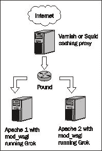

# 第十四章。部署

到目前为止，我们一直在开发环境中工作，以“前台”模式在控制台运行我们的应用程序，以便我们可以看到输出以进行调试和确认。

现在我们有一个或多或少完整的应用程序，我们可能希望部署它。即使是为了有限的受众测试，我们也希望部署的应用程序在后台运行。稍后，我们可能希望使用完整的网络服务器，如 Apache，来为我们提供应用程序服务，也许还有其他应用程序。最后，对于预期会有大量流量和众多访客的应用程序，我们可能希望在我们的应用程序的多个实例之间平衡负载。

本章将讨论如何使用标准 paster 服务器部署我们的应用程序。然后我们将了解如何在 Apache 服务器后面运行应用程序，首先是通过使用简单的代理配置，然后是使用`mod_wsgi`。最后，我们将探讨 ZEO 如何为我们提供应用程序的水平扩展性，并简要讨论如何通过添加缓存和负载均衡来使网站支持高流量负载。

我们将涵盖的一些特定主题包括：

+   使用 paster 进行简单部署

+   使用代理传递在 Apache 服务器后面运行

+   使用 `mod_wsgi` 在 Apache 服务器后面运行

+   设置 ZEO 集群

+   缓存和负载均衡

# 将应用程序迁移到生产模式

在考虑我们将为部署使用哪个网络服务器之前，我们需要为每个生产应用程序执行一个步骤。Grok 为应用程序服务器提供了一个“开发者模式”，该模式启用了一些旨在帮助开发者更容易地调试和测试其应用程序的功能。

开发者模式最明显的影响是，对模板所做的任何更改都会自动由服务器考虑，无需重启。这会对应用程序性能造成惩罚，因为服务器必须轮询文件以确定是否对模板进行了更改。

建议在准备发布应用程序时关闭此功能。对模板的进一步更改将需要重启，但在网络开发中，任何性能提升都应受到欢迎。

要关闭开发者模式，编辑由`grokproject`生成的包中包含的`etc/zope.conf.in`文件。找到显示`devmode on`的行，并将其修改为如下所示：

```py
# Comment this line to disable developer mode. This should be done in
# production
# devmode on 

```

通过注释掉粗体显示的行，将应用默认设置，即开发模式关闭。然而，请注意，这并不是实际的配置文件，而是一个用于生成它的模板。

要使更改生效，请重新运行 buildout，以便实际配置文件`parts/etc/zope.conf`被重写。当你下次启动应用程序时，它将在生产模式下运行。

# 在后台运行 paster 服务器

到目前为止，部署我们的应用程序最简单的方法是使用我们在整本书的开发过程中一直使用的相同的 paster 服务器。我们唯一需要做的是以“守护进程”模式启动服务器，这样我们的应用程序就可以在后台运行：

```py
$ bin/paster serve --daemon parts/etc/deploy.ini 

```

然后进程将在后台启动。该进程的 PID 将存储在`paster.pid`文件中，可以用来获取运行中服务器的状态信息。默认情况下，其他`paster serve`命令假定`paster.if`文件名，因此例如，要获取进程状态，您可以输入：

```py
$ bin/paster serve --status parts/etc/deploy.ini
$ Server running in PID 11482 

```

当我们需要停止服务器时，我们使用`stop-daemon`选项，如下所示：

```py
$ bin/paster serve --stop-daemon parts/etc/deploy.ini 

```

还有其他一些选项可能很有用。我们可能希望服务器在出现任何原因导致服务器死亡的情况下自动重启；这正是`monitor-restart`选项的作用：

```py
$ bin/paster serve --daemon --monitor-restart parts/etc/deploy.ini 

```

最后，我们可能更喜欢在后台持续运行服务器，并在我们更改某些文件时自动重启。这可以通过`reload`选项实现：

```py
$ bin/paster serve --daemon --reload parts/etc/deploy.ini 

```

这种设置可以被认为是 Grok 部署架构的最小版本，其部分如下所示：


# 在 Apache 网络服务器后面运行 Grok

使用默认 paster 配置进行生产的问题在于，我们网站的网络地址必须包含应用程序名称。在某些情况下这可能可以接受，但几乎总是不够好。克服这个问题的最简单方法是将应用程序放在一个网络服务器后面，比如 Apache，并使用大多数网络服务器中可用的强大 URL 重写工具从所需的任何 URL 提供我们的应用程序。

此外，如果我们的网站将运行除我们开发的以外的其他应用程序，通常让 Apache 或其他网络服务器负责集中处理网站上的多个应用程序的请求是个好主意。

## 使用 mod_rewrite 从 Apache 服务器提供我们的应用程序

要设置此配置，您需要安装 Apache 网络服务器，它适用于所有平台。大多数 Linux 发行版都允许您通过使用它们的包管理工具来安装它。

例如，在 Ubuntu 或 Debian 上，您可以简单地输入：

```py
$ sudo apt-get install apache2 

```

一旦 Apache 准备就绪，下一步就是配置它以使用`mod_rewrite`模块。通常，这样做的方法是编辑`httpd.conf`文件，该文件应位于服务器`/etc`目录中的`apache2`或`httpd`子目录中。

要加载所需的模块以使`mod_rewrite`工作，需要以下一般配置：

```py
LoadModule rewrite_module /usr/lib/apache2/modules/mod_rewrite.so
LoadModule proxy_module /usr/lib/apache2/modules/mod_proxy.so
LoadModule proxy_http_module /usr/lib/apache2/modules/mod_proxy_http.so
ProxyRequests off 

```

前三条加载所需的模块，而`ProxyRequests`行确保服务器不能被第三方用作非自愿的代理。不要省略此行。

现在已经启用了“重写”功能，我们需要创建一个虚拟主机来为我们应用程序的请求提供服务。这个虚拟主机将包括“重写”规则，允许我们的应用程序由 Apache 提供。一个示例虚拟主机定义如下：

```py
<VirtualHost *:80>
ServerName grok.example.com
RewriteEngine On
RewriteRule ^/(.*) http://localhost:8080/todo/++vh++http:grok.example.com:80/++/$1 [P,L]
</VirtualHost>

```

在这个简单的示例中，我们只设置了服务器名称，开启了重写引擎，并设置了一个重写规则。在执行任何其他操作之前，请确保服务器名称是正确的。

重写规则是配置中的重要部分。Apache 的 `mod_rewrite` 使用正则表达式语法来匹配将触发规则的 URL 部分。在上面的配置中，规则的第一部分告诉引擎匹配以斜杠开头的任何 URL，这当然会匹配由这个虚拟主机提供的任何 URL。

在正则表达式中，当你用括号括起一个子表达式时，这意味着与括号内文本匹配的任何内容都必须保存到一个变量中。匹配此文本的第一个括号内的表达式存储在变量 `$1` 中，第二个在 `$2` 中，依此类推。在这种情况下，斜杠之后的所有内容，即请求的完整路径，将被存储在 `$1` 中。

规则的第二部分依赖于 Grok 的虚拟主机工具。这将是由规则查询以获取实际内容的 URL，以便在匹配的位置提供服务。对于虚拟主机，Grok 期望我们发布的应用的完整 URL（http://localhost:8080/todo），后面跟着特殊的虚拟主机语法，这将包括协议、服务器名称和端口号，Grok 将使用这些信息来转换响应中存在的所有 URL，以便其中的每个链接都指向正确的宿主。注意，在 Grok `++vh++` 规则之后，通过使用之前解释的 `$1` 变量，将请求的完整路径附加到末尾。

规则的第三和最后一部分指示 Apache 这是一个代理请求（P），并且当匹配时（L），这个规则应该是最后一个应用的规则。

这就是我们需要设置我们的应用程序与 `mod_rewrite` 一起使用的所有内容。为了测试这一点，首先确保 paster 进程正在运行，并且 Apache 正在使用我们添加的配置。通常，服务器在安装时会自动启动，所以你可能需要告诉它重新加载配置。在 Ubuntu 或 Debian 中，这样做的方式是：

```py
$ /etc/init.d/apache2 reload

```

现在，您可以访问配置中定义的 URL（在我们的示例中是 http://grok.example.com），并查看您的应用程序在 Apache 后面运行。

## 在 mod_wsgi 下安装和设置 Grok

在 Apache 后面提供 Grok 应用程序的另一个优秀选项是 `mod_wsgi`，这是一个在 WSGI 协议下提供应用程序的 Apache 模块。在本节中，我们将学习 WSGI 是什么，以及如何使用 `mod_wsgi` 模块设置 Apache 以提供我们的应用程序。

### WSGI：Python 网络服务器网关接口

WSGI 是一个 Python 标准，用于指定网络应用程序如何与网络服务器和应用程序服务器通信。其目标是提供一个简单的接口，以支持网络服务器和 Web 框架（如 Grok）之间的大多数交互。

WSGI 还支持“中间件”组件，这些组件可以用于预处理或后处理请求。这意味着它被用来创建“插入”到我们的应用程序中的 Python WSGI 工具，并执行诸如性能分析、错误处理等功能。

Grok 可以在任意 WSGI 服务器后面运行。现在我们将探讨如何在全新的 Linux 虚拟服务器上安装 Grok，以及 `mod_wsgi`。

### Grok 和 WSGI

对于 Python 网络开发者来说，WSGI 是 Python 网络开发未来的关键。由于存在许多重要的网络开发框架，Python 的强大功能使得快速创建新框架变得非常容易，因此与多个框架中开发的最佳应用程序交互可能会很快成为创建新 Python 网站的最佳方式。

直到相对较近的时期，Zope 3 及其一些衍生应用程序，如 Grok，还有可能错过 WSGI 的聚会，但现在已经不是这样了。Grok 1.0 与 WSGI 兼容，因此可以与当今 Python 世界中广泛可用的各种基于 WSGI 的技术集成。

### 为什么使用 Apache 和 mod_wsgi 为 Grok？

可用的 WSGI 服务器有很多，但本章将重点介绍使用 `mod_wsgi`，这是一个 Apache 的 WSGI 适配器模块。这样做有几个原因。

首先，Apache 是最受欢迎的网页托管平台，因此许多网络开发人员和网站管理员已经熟悉它。例如，Grok 就是使用 `mod_rewrite` 在 Apache 后面安装用于生产服务器的。

其次，还有许多 Python 应用程序已经在 Apache 下通过使用 `mod_python` 运行。为此模块也有几个 WSGI 适配器，但 `mod_wsgi` 是用 C 语言编写的，与这些适配器相比，内存开销更低，性能更好。

此外，`mod_wsgi` 的一个目标就是打入低成本的商品化网络托管市场，这对 Python、Grok 和 Zope 都是有益的。

### 设置干净的 Linux 服务器

在接下来的讨论中，我们将使用 Linux 作为操作系统，因为它是迄今为止部署网络应用程序最受欢迎的方式。我们将介绍 Ubuntu 发行版，但这些步骤同样适用于任何基于 Debian 的发行版。其他发行版使用不同的软件包管理器，可能还有不同的系统路径，但无论如何，你应该能够轻松地找出你需要的东西。

我们可以从安装最新版本的 Ubuntu GNU/Linux 的干净安装开始。第一步是安装必要的软件包，以支持正确的 Python 版本（Grok 目前需要 Python 2.5）和 Apache 服务器。

在此之前，需要安装编译和构建软件所需的软件包，以便使用 Ubuntu（其他发行版通常不需要此步骤）。请注意，软件包安装和 Apache 模块添加通常需要 root 权限。在命令块中，带有`$`的提示符是用户提示符，带有`#`的提示符是 root 提示符，您可以通过执行`sudo -s`命令获得。在本部分中，您将使用 root 终端，这样就不需要在每个命令前加上`sudo`。在其他部分中，您将使用用户终端，如果需要以 root 身份执行某些操作，请在命令前加上`sudo`。您可以将一个终端作为 root 打开，另一个终端作为用户打开。

```py
$ sudo -s
# apt-get install build-essential 

```

接下来，安装 Python 和 Apache 的软件包。与大多数打包的 Linux 发行版一样，Ubuntu 需要为每个软件组件的开发库进行单独安装：

```py
# apt-get install python2.5 python2.5-dev
# apt-get install apache2 

```

`apache2`软件包通常安装`apache2-mpm-worker`，但您可能已安装了另一个版本，即`apache2-mpm-prefork`。要检查已安装哪个版本，您可以执行以下命令：

```py
# dpkg -l|grep apache2 

```

接下来，安装相应的开发包，如果已安装`apache2-mpm-worker`，则安装`apache2-threaded-dev`；如果已安装`apache2-mpm-prefork`，则安装`apache2-prefork-dev`：

```py
# apt-get install apache2-threaded-dev 

```

Grok 使用 Python 的`setuptools`，因此也需要这个包：

```py
# apt-get install python-setuptools 

```

有可能 Ubuntu 软件包提供的版本不是最新的。如果您想对安装的`setuptools`版本有更多控制，并在新版本可用时自行更新它，可以使用以下方法。手动下载`setuptools-0.6c9-py2.5.egg`（或最新版本，选择 py2.5）并执行以下命令：

```py
# sh setuptools-0.6c9-py2.5.egg 

```

您可以稍后使用以下命令进行更新：

```py
sudo easy_install-2.5 -U setuptools 

```

### 安装和配置 mod_wsgi

现在，服务器已准备好安装`mod_wsgi`。在 Ubuntu 中有一个名为`libapache2-mod-wsgi`的软件包，但建议您构建最新版本，部分原因是因为`mod_wsgi`必须使用与 Grok 相同的 Python 编译。如果您之前已安装该软件包，请将其删除。我们需要直接从下载站点获取源代码，然后进行构建：

```py
$ wget http://modwsgi.googlecode.com/files/mod_wsgi-2.6.tar.gz
$ tar xzf mod_wsgi-2.6.tar.gz
$ cd mod_wsgi-2.6
$ ./configure --with-python=/usr/bin/python2.5
$ make
$ sudo make install 

```

再次提醒，必须使用您将用于运行网站的相同 Python 编译`mod_wsgi`。由于 Grok 需要 2.5 版本，因此使用了`--with-python`选项来指向我们需要的 Python 版本。

一旦安装了`mod_wsgi`，Apache 服务器就需要知道这一点。在 Apache 2 中，这是通过将加载声明和任何配置指令添加到`/etc/apache2/mods-available/`目录来完成的。

模块的加载声明需要放在一个名为`wsgi.load`的文件中（位于`/etc/apache2/mods-available/`目录），该文件只包含以下一行代码：

```py
LoadModule wsgi_module /usr/lib/apache2/modules/mod_wsgi.so

```

配置指令位于名为`wsgi.conf`的文件中，该文件位于`wsgi.load`文件旁边。我们现在不创建它，但如果您有多个 WSGI 应用程序需要服务，它可能会很有用。

然后，你必须使用以下命令激活`wsgi`模块：

```py
# a2enmod wsgi 

```

注意，`a2enmod`代表“apache2 enable mod”，这是一个为你创建符号链接的可执行文件。实际上，`a2enmod wsgi`等同于：

```py
# cd /etc/apache2/mods-enabled
# ln -s ../mods-available/wsgi.load
# ln -s ../mods-available/wsgi.conf # if it exists 

```

对于 Apache 1.3 或使用旧目录布局的 Apache 2，你可能需要在 Apache 的`/etc`目录中的`httpd.conf`文件内放置`LoadModule`行和配置指令（你将在后面看到），在这种情况下，上述软链接将不再必要。

### 在 mod_wsgi 下配置 Grok 站点

Grok 可以使用`setuptools`安装，并且可以使用包含的`grokproject`工具轻松创建 Grok 站点。如前所述，Grok 可以在任何 WSGI 服务器后面运行，而不仅仅是默认使用的 paster 服务器。现在我们有了工作的`mod_wsgi`，我们将看看如何在它后面运行 Grok。

### 准备待办事项应用程序以供 mod_wsgi 使用

WSGI 应用程序使用入口点来让 WSGI 服务器知道如何运行程序。**入口点**通常是一个简单的 Python 脚本，它提供了一个用于调用应用程序并传递适当的初始化文件给服务器的函数。一些服务器，例如 paster 服务器，只需要`.ini`文件的路径，这是我们通常用来启动 Grok 应用程序的方式。这并不意味着 paster 没有入口点脚本。实际上，入口点是在`setup.py`文件中定义的，这是在初始化新项目时由`grokproject`创建的。看看文件的最后几行：

```py
[paste.app_factory]
main = grokcore.startup:application_factory
debug = grokcore.startup:debug_application_factory

```

标题`paste.app_factory`告诉服务器在哪里找到`.ini`文件每个部分的工厂函数。在 Grok 中，一个通用应用程序工厂函数定义在`grokcore.startup`包中，这是 paster 用来启动应用程序的。

然而，`mod_wsgi`需要一个指向工厂的路径，这在我们配置中可能会很麻烦，因为这意味着它需要指向`grokcore.startup` egg 内的一个文件。由于 egg 包含版本号，简单的更新可能会导致如果删除旧 egg，我们的站点崩溃。最好在我们的应用程序包内部定义自己的工厂。

由于工厂代码对于不同的项目几乎可以完全相同，因此在我们创建项目时自动包含它会更好，以避免每次都需要重新创建相同的脚本。幸运的是，对于 Grok 使用 buildout 的情况，这非常有帮助，因为有一个 buildout 配方可以为我们创建 WSGI 应用程序工厂。

该食谱名为 `collective.recipe.modwsgi`。要使用它，只需在 buildout 中添加一个名为 `wsgi_app` 的部分。该食谱需要两个参数，第一个是必须提供给运行 WSGI 应用程序的 Python 进程的 eggs，第二个是用于站点的配置文件路径。最后一个参数 `value` 是我们一直在使用的 `parts/etc/deploy.ini` 路径，用于在 paster 下运行应用程序。就是这样。按照以下方式编辑 `buildout.cfg` 文件的 `parts` 列表：

```py
parts =
eggbasket
app
i18n
test
mkdirs
zpasswd
zope_conf
site_zcml
zdaemon_conf
wsgi_app
deploy_ini
debug_ini

```

接下来，在文件的任何位置添加以下部分：

```py
[wsgi_app]
recipe = collective.recipe.modwsgi
eggs = ${app:eggs}
config-file = ${buildout:directory}/parts/etc/deploy.ini

```

注意，`eggs` 参数只是简单地指向在 buildout 开始处定义的主要 egg 部分，以避免重复。

当再次运行 buildout 时，我们会找到一个 `parts/wsgi_app` 目录（或我们为 buildout 部分使用的任何名称）。在该目录内，将有一个 `wsgi` 文件，可以直接由 `mod_wsgi` 使用来运行应用程序。

### 配置 Apache 站点以使用 mod_wsgi

最后一步是将站点添加到使用 `mod_wsgi` 服务的 Apache 服务器。这是标准的 `mod_wsgi` 配置；我们只需添加我们之前创建的应用程序工厂的路径。

要设置虚拟主机，在 `/etc/apache2/sites-available` 目录中创建一个文件，例如命名为 "grok"。向其中添加以下代码，假设你的待办事项应用位于 `/home/cguardia/grok/todo:`。

```py
WSGIPythonHome /usr
WSGIDaemonProcess grok user=cguardia group=cguardia threads=4 maximum-requests=10000
<VirtualHost *:80>
ServerName wsgi.example.com
WSGIScriptAlias /todo /home/cguardia/grok/todo/parts/wsgi_app/wsgi
WSGIProcessGroup grok
WSGIPassAuthorization On
WSGIReloadMechanism Process
SetEnv HTTP_X_VHM_HOST http://wsgi.example.com/todo
</VirtualHost>

```

这将使 `mod_wsgi` 以 'daemon' 模式运行，这意味着它将启动多个进程以运行配置的 WSGI 应用程序，而不是使用 Apache 进程。如果你使用 virtualenv，运行它的虚拟 Python 的 `site-packages` 目录需要传递给 `WSGIPythonHome` 变量。为了告诉 `mod_wsgi` 要运行哪个 WSGI 应用程序，我们使用 `WSGIScriptAlias` 指令，并传递我们之前创建的应用程序工厂的路径。

注意，我们分配了一个用户和组来运行进程。必须要求此用户有权访问应用程序目录。

#### PYTHON_EGG_CACHE 目录

注意，当应用程序启动时，所有 eggs 将会自动提取到 `PYTHON_EGG_CACHE` 目录中，通常是 `~/.python-eggs`。此目录依赖于 `HOME` 环境变量。`HOME` apache 用户 `www-data` 是 `/var/www`。如果你没有在 `WSGIDaemonProcess` 指令中配置用户或 `python-eggs` 变量，你可能会在 `error.log` apache 文件中遇到错误 **[Errno 13] Permission denied: '/var/www/.python-eggs'**。你也可以添加一个 `python-eggs` 参数来告诉 `mod_wsgi` 使用一个替代目录作为 egg 缓存：

```py
WSGIDaemonProcess grok threads=4 maximum-requests=10000 python-eggs=/tmp/python-eggs

```

在这个例子中，该进程属于 `www-data`。`www-data` 和 `python-eggs` 缓存目录将是 `/tmp/python-eggs`。

### 运行应用程序

一旦配置就绪，我们需要在 Apache 中启用站点，因为我们刚刚创建了它。这仅在第一次运行时是必要的：

```py
$ sudo a2ensite grok 

```

此命令将在 Apache 的`sites-enabled`目录中创建一个指向我们刚刚配置的“grok”站点的链接，这足以使其生效。然后，我们可以通过简单地重新加载服务器的配置来从 Apache 开始服务我们的应用程序：

```py
$ sudo /etc/init.d/apache2 reload 

```

当你在浏览器中访问网站([`wsgi.example.com/todo`](http://wsgi.example.com/todo))时，你应该看到 Grok 管理 UI。你应该能够使用管理员登录名和密码登录。

## 添加 ZEO 服务器

默认情况下，`mod_wsgi`将使用单个进程来运行应用程序。由于此配置旨在用于生产环境，可能希望有更多的进程可供应用程序服务。Grok 使用的 ZODB 附带一个名为**Zope 企业对象**（ZEO）的服务器，它允许我们将尽可能多的进程添加到我们的配置中，提供无限的水平扩展性。通常，建议的进程数是系统处理器的每个核心一个。让我们设置一个 ZEO 服务器并配置 Grok 进程连接到它。

### ZEO 配置的 Buildout 配方

再次强调，让 ZEO 运行的最简单方法就是使用现有的 buildout 配方。这次我们将使用名为`zc:zodbrecipes`的配方。将`zeo_server`部分添加到您的`buildout.cfg`文件中，如下所示：

```py
parts =
eggbasket
app
i18n
test
mkdirs
zpasswd
zope_conf
site_zcml
zdaemon_conf
zeo_server
wsgi_app
deploy_ini
debug_ini

```

接下来，添加一个`zeo_server`部分，如下所示：

```py
[zeo_server]
recipe = zc.zodbrecipes:server
zeo.conf =
<zeo>
address 8100
</zeo>
<blobstorage 1>
blob-dir ${buildout:directory}/var/blobstorage
<filestorage 1>
path ${buildout:directory}/var/filestorage/Data.fs
</filestorage>
</blobstorage>
<eventlog>
level info
<logfile>
path ${buildout:directory}/parts/log/zeo.log
</logfile>
</eventlog>

```

这将添加 ZEO 服务器，并将其配置为监听端口 8100。其余的配置基本上是样板，所以只需在需要 ZEO 的新项目中复制它。`blobstorage`部分设置了一个启用 blob 处理的文件存储；`logfile`部分告诉服务器在哪里存储日志文件。

接下来，我们需要 buildout 添加启动和停止 ZEO 的脚本。这可以通过将`ZODB3` egg 添加到我们的应用程序部分轻松实现：

```py
[app]
recipe = zc.recipe.egg
eggs = gwsgi
z3c.evalexception>=2.0
Paste
PasteScript
PasteDeploy
ZODB3

```

### 配置 ZEO 客户端

目前，我们使用的 Grok 应用程序正在与常规的 Zope 服务器一起工作。要使用 ZEO，我们需要更改配置以连接到端口 8100 的服务器。幸运的是，所需更改已经包含在 Grok 项目内部创建的常规`zope.conf`文件中，所以我们只需要取消注释那些行。在 Grok 项目的`etc`目录中的`zope.conf.in`文件内取消注释以下行：

```py
# Uncomment this if you want to connect to a ZEO server instead:
<zeoclient>
server localhost:8100
storage 1
# ZEO client cache, in bytes
cache-size 20MB
# Uncomment to have a persistent disk cache
#client zeo1
</zeoclient>

```

这里重要的一行是带有 ZEO 服务器地址的行。在这种情况下，我们使用与 Grok 应用程序相同的宿主，以及我们在上一节中定义的 ZEO 配置中的端口。

### 启动 ZEO 服务器

再次运行 buildout 后，我们将准备好在后台启动 ZEO 服务器。为此，我们只需要运行为我们自动创建的服务器脚本。该脚本的名称与 buildout 中配置服务器的部分名称相同：

```py
$ bin/zeo_server start 

```

我们的可视化应用现在正在运行！要停止它，你可以使用以下命令：

```py
$ bin/zeo_server stop 

```

### 增加进程数量

回想一下，我们之前提到 `mod_wsgi` 默认情况下在一个进程中运行应用程序。为了真正利用 ZEO，我们希望有更多的进程可用。我们需要对我们的 `mod_wsgi` Apache 虚拟主机配置进行一些小的修改。将 `WSGIDaemonProcess` 行，靠近顶部，修改如下代码：

```py
WSGIDaemonProcess grok user=cguardia group=cguardia processes=2 threads=4 maximum-requests=10000

```

记得重新加载 Apache 配置，以便能够看到新设置的效果。在这个例子中，我们将有两个进程运行，每个进程有四个线程。通过使用 ZEO 和 `mod_wsgi`，我们现在有一个可扩展的网站。

# 更高的可扩展性：添加缓存和负载均衡

我们刚才讨论的配置对于大多数类型的网站来说已经足够了。然而，有时一个网站需要处理高流量负载，并且需要采取措施确保它在压力下不会崩溃。

## 缓存代理

可以做的一件非常有效的事情是在 Apache 服务器前添加一个缓存代理。一个**缓存代理**通过保存网站最常使用的页面的副本并在后续请求中直接提供该副本，从而减少带宽并提高响应时间，而不是再次连接到服务器。

两个非常流行的缓存代理是 Squid ([`www.squid-cache.org`](http://www.squid-cache.org)) 和 Varnish ([`www.varnish-cache.org`](http://www.varnish-cache.org))。如何设置这些代理的详细讨论超出了本章的目标，但有趣的是，有自动设置它们的 buildout 脚本可用。查看 Python 包索引，看看这些脚本如何帮助构建和配置缓存代理。对于 Squid，有 `plone.recipe.squid` ([`pypi.python.org/pypi/plone.recipe.squid/`](http://pypi.python.org/pypi/plone.recipe.squid/))，而对于 Varnish，相应的 `plone.recipe.varnish` ([`pypi.python.org/pypi/plone.recipe.varnish`](http://pypi.python.org/pypi/plone.recipe.varnish))。

## 负载均衡器

**负载均衡器**位于应用程序的两个或多个实例之前，并将传入的请求均匀地分配给它们。当你有多个机器提供服务时，这是一个非常强大的解决方案。

有几个开源的负载均衡器可用；例如，Apache 本身就有一个负载均衡模块。然而，与基于 Zope Toolkit 的应用程序一起使用最流行的负载均衡器之一是 "Pound" ([`www.apsis.ch/pound/`](http://www.apsis.ch/pound/))。

Pound 不仅仅只是分配负载。它可以保持会话信息，并将来自同一来源浏览器的请求发送到第一次请求时使用的同一目标服务器。Pound 还可以根据其 URL 在服务器之间分配请求。最后，它可以作为一个故障转移服务器，因为它足够智能，能够注意到后端服务器何时失败，并且会在服务器恢复之前停止向其发送请求。

当然，有一个 buildout 脚本可用于设置 Pound，其名称恰当地命名为 `plone.recipe.pound` ([`pypi.python.org/pypi/plone.recipe.pound`](http://pypi.python.org/pypi/plone.recipe.pound))。

## Grok 的高流量架构

现在我们已经了解了一些提高我们应用程序性能的机制，可视化不同部分之间的关系可能会有所帮助。在我们的案例中，组织一个支持高流量负载的系统的好方法是在前端放置一个缓存代理，例如 Varnish，并将其配置为将请求传递给 Pound 负载均衡器。

Pound 将被配置为在多个单独的服务器之间分配负载，每个服务器都运行配置了 `mod_wsgi` 的 Apache，并运行多个进程，这些进程将与运行我们的 Grok 应用程序的多个 ZEO 客户端进行通信。使用以下图中所示的这种架构，我们可以扩展我们的应用程序以处理非常高的流量。



# 摘要

本章讨论了如何处理应用程序部署，并探讨了部署我们的示例应用程序的各种可能性，从简单的设置到具有 ZEO 的可扩展配置。

我们与 Grok 的旅程已经结束。希望你会觉得 Grok 是你网络工具箱中一个很好的补充，并且会考虑其优势如何帮助你实现目标，无论何时你需要开发一个网络应用程序。在这个互联网时代，联系并与人沟通以获得各种技术的帮助非常容易。Grok 的开发者和用户也不例外，所以请不要犹豫，通过使用 Grok 的邮件列表或 IRC 频道寻求建议。我们将很高兴帮助你，并且会为你在 Grok 上尝试而感到高兴。
