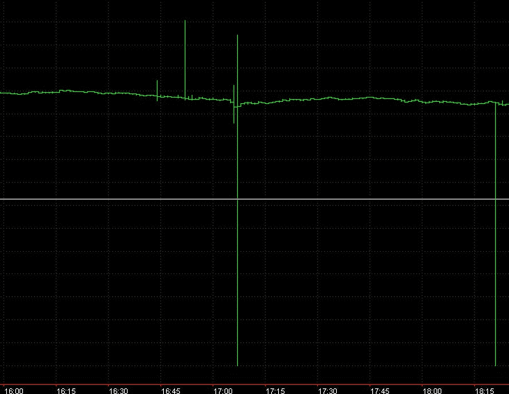
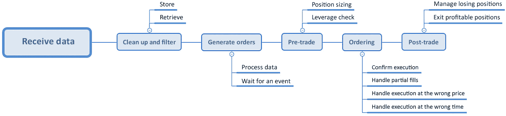

# 第一章：开发交易策略——为什么它们不同

多年来，我在各种市场中进行交易，教育开发者进行交易，并教授交易者一些基本的编程和算法（algo）开发。最终，我得出结论，两组（开发者和交易者）面临的主要问题不是编程知识的缺乏，而是对主题领域，即金融市场及其机制的不正确或理解不足。

这对我来说是个很大的惊喜。我以为编码、调试和错误处理应该是主要障碍，但现实中，问题在于寻找有关市场、其结构和运营的有用、正确和充足的信息，尤其是在算法交易方面。我并不是说这些信息以某种方式未公开或对公众隐藏——绝不是这样。问题在于，很难找到一个来源，它不仅涵盖了从市场结构到资金和风险管理的一切，而且还显示了市场非常具体的特征与交易算法为了在这个市场中取得成功所应具备的较为不具体的特征之间的明确联系。

例如，许多作者认为，在交易策略中，入场和出场可以立即执行，并且在任何时刻都能以相同成功执行。然而，在现实市场中，情况并非如此。我看到许多策略仅在纸上有效，因为它们的开发者没有考虑到他们正在处理的是一个真实、复杂且具有许多限制和缺陷的结构，而不是一个抽象的理想化模型。

这个例子非常简单，但我希望它能解释许多研究人员和开发者忽视的最重要的一点：我们不是在处理具有相等价值的数据集和时间序列，在任何时刻都可以以相等可能性采取任何行动；我们正在处理一个非常复杂的结构，它具有许多使这个结构成为一个*动态非平稳系统*的特征。而要在算法交易中取得成功，这些特征必须得到考虑。

如果不了解市场是如何组织和运作的，我们的交易算法迟早会失败。

如果用更积极的方式来说，理解市场将有助于我们使交易算法更加稳健。

这本书是我谦逊地尝试弥合量化交易世界（由数字驱动）与现实市场（由人类驱动）之间的差距。我坚信，今天，任何长期成功的交易都只能通过掌握两者良好的知识来实现。

让我们从基础知识开始。我们将了解非常基本的市场术语和交易策略的基本概念，熟悉各种形式和方面的风险，特别关注订单和交易风险，并非常概括地提及市场数据处理。

在本章中，我们将讨论以下主题：

+   交易策略 – 这一切都关乎你如何管理风险

+   自动交易 – 运营风险和监管限制

+   制定实际交易决策 – 交易逻辑和信用风险

+   下单 – 交易风险

+   交易应用的一般架构

# 交易策略 – 这一切都关乎你如何管理风险

让我们从定义开始，从源头开始。我知道这听起来像是一本学术教科书，但我保证这会很快变得更有趣。

根据[Investopedia](https://www.investopedia.com/terms/t/trade.asp)的定义，**交易**是“*不同经济行为者之间自愿交换商品或服务*。”这意味着，如果我用钱交换肉类或蔬菜，那么我就在一个杂货市场。如果我用钱交换未来买卖活牛或小麦的义务，那么我就在衍生品市场。如果我用钱交换另一种类型的货币，我就在**外汇**、**外汇市场**或**FX 市场**。

在特定市场中我买进或卖出的东西被称为**资产**。如果我买进或卖出的东西可以交付（如小麦、黄金、股票甚至货币），它被称为**基础资产**。如果我买进或卖出一个义务或在未来以特定价格买卖基础资产的权利，那么它被称为**衍生品**。

基础资产和衍生品在**交易场所**进行交易 – 以前，这些是像交易所这样的物理地点，但如今，更多是电子网络，在这里，交易者、流动性提供者、做市商和其他市场参与者匹配他们的订单。

如果我去杂货市场卖土豆，那么我就在**卖方**。如果我来买土豆，我就在**买方**。在金融市场中，买方市场参与者通常被称为**价格接受者**（因为他们只能接受卖方提供的价格），而卖方市场参与者被称为**价格提供者**。

并非所有交易场所都欢迎所有人作为直接参与者。其中大多数通过一个**经纪人**网络运作 – 这些实体接受客户的订单并将它们路由到一个或多个交易场所，可能内部对冲客户头寸，有时甚至作为客户的交易对手方。

在*第三章*“从开发者角度的 FX 市场概述”中，我们将更详细地考虑所有这些实体，以了解为什么我们应该特别关注它们的行为，以及如何实际使用它们来使我们的交易策略更加稳健。

让我们快速了解一下交易策略的本质，并看看系统化或算法交易业务中固有的主要风险。

## 交易策略 – 我们如何在金融市场赚钱

交易策略是一套规则，告诉我如果我是买方，何时买入和卖出资产；如果我是卖方，何时以及提供多少给市场。但无论如何，*交易策略的最终目标是* *赚钱*。

如果我是买方，我只能以下两种方式赚钱：

+   我低价买入，高价卖出，或者相反（赚取价格差异）

+   我买入并收到股息

前者被称为**活跃交易**，后者通常被称为**投资**，或获得被动收入。在这本书中，我们将只考虑活跃交易。

买方活跃交易策略主要有两大类。第一类被称为**方向性交易**，本质上就是买入、等待、卖出。如果我们能以高于买入价的价格卖出，我们就能赚钱。

买方交易策略的第二类是**套利**。这种策略识别出同一资产在不同交易场所被不同定价的时刻（所谓*真实*或*纯粹*套利），或者当标的资产价格与衍生品、不同衍生品，甚至更复杂的由多种工具组成的设置（所谓**统计套利**或**stat arb**）之间存在可交易的价格差异时。

听起来有点令人不知所措？别担心，我们现在将更详细地考虑每个案例。

## 交易应用 – 有什么能比这更简单？

到目前为止，如果你在应用开发方面有足够的经验，并对市场有合理的了解，你可能会大声喊出以下内容：

“*为什么我们需要所有这些？构建交易应用真是太简单了：你只需要获取市场数据，计算入场和出场订单，并将它们发送给* *经纪人!*”

因此，从这个角度来看，建议的交易应用的一般架构可能看起来就像这样简单：

图 1.1 – 交易应用初始架构

然而，正如我们很快就会看到的，这是一个过于简化的观点，它至少缺少一个使开发交易策略与其他应用程序开发不同的关键特征：它不包括风险管理。

## 那么，那个风险怎么办？

在讨论交易中赚钱的方法之前，让我们首先更关注避免损失 – 至少因为根据所有统计数据，超过 70%的活跃交易者，不幸的是，都在亏损。

在我们继续之前，让我指出，以下风险分类并不完全对应官方的法律和学术分类。这里使用这种非正式分类是为了简化，以便快速而舒适地整理出复杂的问题。

活跃交易中的所有风险可以大致分为三大类，如下所示：

+   **操作风险**是指与你的交易方式相关联的风险，这取决于你自己的业务流程以及第三方，如经纪人、交易场所和监管机构。

+   **系统性风险**是指与市场本身及其交易策略逻辑相关联的风险。

+   **交易风险**是指使订单执行与预期不同的风险；这是许多在纸上看起来可行的策略在现实中无法赚钱的主要原因。

既然我们对交易策略的概念已经更加熟悉，并且知道任何系统交易者应该解决的主要问题是风险缓解，那么让我们更深入地探讨算法交易业务特有的风险。

# 自动交易 – 操作风险和监管限制

操作风险是指由于内部程序、人员、系统不足或失败，或外部事件（国际清算银行，*巴塞尔银行监管委员会*，《新巴塞尔资本协议操作风险支持文件》（巴塞尔：BIS，2002 年），第 2 页，[`www.bis.org/publ/bcbsca07.pdf`](https://www.bis.org/publ/bcbsca07.pdf)）导致的直接或间接损失风险。

由于在这本书中，我们将主要讨论使用 Python 开发交易算法，而不是关于运营交易业务，因此在这样的背景下，主要的操作风险可能是你没有遵循自己的策略或随意干预算法交易过程。

另一个可能被视为操作风险（尽管它通常被视为资金管理）的风险是不当使用杠杆。本质上，杠杆是经纪人提供的信用额度，允许你购买比你账户中更多的资产。如果杠杆过高，你将面临无法进入市场的风险，或者在某些情况下，甚至更糟 – 损失快速缩水的头寸。

经纪人风险也可以归因于操作风险，因为经纪人是你进入市场的实体，为你提供信用额度以开设头寸，并执行清算和结算。一些经纪人还代表客户作为做市商，内部对冲他们的头寸，并作为他们客户的交易对手，这可能导致利益冲突，甚至更糟 – 如果经纪人没有足够的资本来执行这些操作，可能会损失资金。

最后，但同样重要的是，我们应该注意，在某些司法管辖区，算法交易和/或自动化交易可能完全或部分被禁止。因此，请始终与相应的市场监管机构联系，以确保你可以运行你的算法交易。

关键要点

总是对所有交易对手进行背景调查，尤其是你的经纪人。小心使用杠杆，并检查当地关于算法交易的监管文件。

关于操作风险就说到这里——至少对于快速入门来说——让我们继续讨论另一种对于任何交易活动都普遍存在，但对于算法交易尤其成问题的风险：基于错误市场数据的交易决策风险。

# 获取市场数据——质量和一致性是成功的关键

市场数据通常被认为对系统化交易的整体风险没有贡献。然而，这是一个巨大的错误。与市场数据相关的有两个关键风险：

+   接收数据的问题

+   接收数据的问题

在接下来的两个小节中，我们将更深入地探讨前面的风险。

## 接收数据——当规模很重要时

我们获取市场数据有两种形式：实时或历史。在两种情况下，我们都从数据供应商、经纪人或直接从交易所获取。区别在于实时数据用于实际交易（因为它反映了市场当前的实际情况），而历史数据仅用于研究和开发，以重建假设交易并估计交易算法的理论表现。

接收数据的问题主要与实时数据相关。

现在我们需要添加一些更多的定义，因为我们需要掌握一些常见的术语以便继续进行市场数据和订单处理。

以某一价格购买资产的请求被称为**出价**。这就像你走到市场上大声喊道：“*我想以这个价格购买这个资产。有人愿意卖给我吗？*”

以某一价格出售资产的请求被称为**要价**或**报价**。这意味着你准备好以你接受的价格将其卖给任何愿意的人。

在金融市场中，这两种请求都通过买方交易者通过**限价单**（参见*第十章*，*Python 中订单类型及其模拟*，以详细讨论订单类型）来实现。

当另一个交易对手方同意以订单价格进行交易时，就会注册一条新交易，并将其信息包含在数据流中，并分发到数据供应商、经纪人和其他接收者。这样的记录被称为**tick**。换句话说，tick 是市场数据中的最小信息单元，通常包括以下字段：

+   `date`

+   `time`

+   `price`

+   `traded volume`

+   `counterparty1`

+   `counterparty2`

最后两个字段包含有关实际交易对手方的信息，通常不会公开或分发，以保护市场参与者。交易量指的是已交易的资产数量（合同数量，或者如果我们谈论外汇，就是金额）。

接收原始形式的市场数据的主要问题是它简单得过于庞大。有如此多的市场参与者和交易场所，仅一个资产（也称为“金融工具”）的所有交易流可能轻易达到每秒兆字节级别——接收它本身就是一项挑战（别担心，我们在这本书中不会处理这类数据流）。接下来，即使我们能够接收具有如此吞吐量的数据流，我们也需要以某种方式存储和处理这些数据，因此需要一个非常快速的数据库。最后，我们需要能够以足够的速度处理这些数据量，因此我们需要极其快速的计算机。

但有好消息。尽管有一些策略（主要是套利和高频交易），我们确实需要以所描述的格式（也常被称为**时间和销售**数据）的原始市场数据来识别交易机会，因为大多数方向性交易算法对每笔交易信息缺乏的敏感度远低于对信息的全面掌握。因此，数据供应商以压缩格式提供数据。这是可能的，因为大部分原始市场数据包含相同价格的连续跳动序列，去除这些序列不会扭曲价格走势。这种情况发生是因为可能有众多市场参与者几乎同时以相同价格进行交易，因此通过排除这些序列，我们虽然失去了每笔交易的信息，但保留了价格变化的任何信息。这种市场数据流通常被称为*过滤*或*清洁*的。除此之外，一些交易是在买入价进行的，而另一些是在卖出价进行的，尽管买入价和卖出价保持不变，但这些交易形成了价格似乎不同的交易序列。然而，在现实中，它们始终处于买入价和卖出价之间的差价。这种差价并不意味着市场价格发生变化。这种现象被称为**反弹**，通常也会从清洁数据中排除。

一些供应商和经纪商甚至更进一步，发送市场数据的*快照*而不是过滤后的数据流。快照以固定的时间间隔发送，例如，每 100 毫秒或 1 秒，并且只包含以下信息：

+   日期

+   时间

+   间隔开始时的价格（也称为*开盘价*，或简称为*O*）

+   间隔内的最高价格（也称为*高点*，或*H*）

+   间隔内的最低价格（也称为*低点*，或*L*）

+   间隔结束时的价格（也称为*收盘价*，或*C*）

+   交易量

因此，我们收到的不是数千个跳动，而是一个包含七个数据字段的跳动。这种方法大大降低了吞吐量，但显然对数据有一定的破坏性，快照数据可能不适合某些策略。

主要收获

在选择数据源时要小心，尤其是对于实时交易，并始终确保它包含足够的信息来支持你的策略。

## 接收到的数据——从批判的角度来看

在我们成功接收到数据后，我们应该确保其合理。通常，数据，尤其是分笔数据，可能包含错误的价格。这些价格可能是由于多种原因接收到的，我们将在*第五章*，*使用 Python 检索和处理市场数据*中详细讨论。

*错误*，也称为*非市场价格*，可能会给系统性交易者带来麻烦，因为一个单独的*错误*报价可能会触发一个算法进行买入或卖出操作，而根据策略逻辑，这种交易本不应该发生。

有时候，如果将这些错误报价绘制在图表上，我们可以看到它们。人类眼睛直观地期望数据点在某个合理的范围内，并且很容易捕捉到异常值，如下面的图表所示：

图 1.2 – 在分笔图中看到的非市场价格

如果我们收到快照或其他压缩数据，当我们没有收到报价时，可能会有缺失的间隔。这可能是因为以下原因：

+   市场关闭（计划内或因紧急情况）

+   数据服务器宕机

+   连接中断

关键要点

一个健壮的交易应用应该有一个模块能够检查数据一致性以及连接持久性。

好的，我们现在已经了解了操作风险，也知道不正确处理市场数据可能造成的危害。还有其他什么吗？当然，接下来是主要风险：系统性。

# 制定实际交易决策——交易逻辑和信用风险

在趋势交易中，系统性风险主要在你或你的交易策略预期价格会向一个方向变动，但实际情况却是相反方向时显现出来。不用担心，这种情况对于系统性交易来说绝对是正常的，没有人能保证任何策略会生成 100%的胜率。

交易策略主要有两种类型：数据驱动和事件驱动。**数据驱动**策略分析价格时间序列（我们在*检索市场数据——质量和一致性是成功的关键*部分讨论过），以寻找某种模式或序列，然后触发订单。事件驱动策略等待某个事件发生——例如，在某个价格和一定量上的新分笔，或者政治新闻或经济指标的发布。在两种情况下，交易应用都应该有规则，不仅能够开仓，还能够平仓——再次强调，基于价格数据或事件（或两者）。

通常，如果一个策略产生了一些胜利和一些损失，它赚钱的途径只有两种：

+   产生更多的胜利而非损失

+   平均收益大于平均损失

如果你的交易算法没有处理市场与持仓相反情况的标准程序，那么在统计上具有显著数量的交易中，平均损失很可能会大于平均收益，使用这种策略赚钱将变得非常困难。

不要忘记外汇交易是使用杠杆进行的，这意味着你可以交易比你账户中实际拥有的金额多得多的资金。如果你的交易算法风险管理逻辑差，仓位大小不正确，当价格反向变动时，一个开放的头寸可能会迅速耗尽你的账户资金至零，甚至更糟——一些经纪商甚至允许你出现负数，你将背负债务而不是利润。

关键要点

系统性风险管理算法和仓位大小算法是算法交易应用的关键部分。

系统性风险非常重要，但对于系统性交易者来说，有一个好消息：在投入生产前，通过仔细测试策略并调整策略以最小化系统性风险，可以减轻这种风险。但还有一个在研发阶段难以减轻的风险：交易风险。

# 下单 – 交易风险

交易风险是套利首先面临的问题，但它们也影响方向性策略。简单来说，这是一个以下风险：

+   在错误的价格进入或退出市场

+   在错误的时间进入或退出市场

+   以错误的大小进入或退出市场

+   完全不进入或退出市场

所有四种情况在所有市场中都是可能的，甚至在流动性不足的时期相当频繁（参见*第三章*，*从开发者的角度看外汇市场概述*，以了解更多关于流动性问题的讨论）。

关键要点

交易风险由一组算法管理，这些算法也是任何交易应用的基本组成部分。

嗯，我们已经穿越了各种风险，现在我们明白，一个具有简单直接线性逻辑的交易应用在现实生活中肯定不会奏效。现在，我们可以提出一些（不幸的是）更复杂，但（幸运的是）更现实的建议。

# 交易应用的一般架构

现在，我们可以改进我们最初的图（见*图 1.1*）来表示交易应用架构。尽管它仍然非常通用且处于较高层次，但它现在与最初我们提出的建议有根本性的不同：

图 1.3 – 交易应用更完整的一般架构

在这里，我们可以看到实际的交易应用包含了许多块或模块，其中一些模块会接收来自其他模块的反馈。在我们收到市场数据后，我们应该对其进行清理并添加存储和检索功能，因为数据片段可能在后续的代码中被重复使用。然后，我们根据策略逻辑生成交易信号。但在将这些信号以订单的形式发送到市场之前，我们应该进行一些检查，以确保订单大小对策略和市场来说都是舒适的。之后，我们实际上进行交易——向市场发送订单并控制其执行。最后，我们跟踪开放的头寸并根据运行中的盈亏来管理风险。

# 摘要

在本章中，我们熟悉了外汇市场的核心术语和关键概念，了解了交易对手和交易，理解了市场数据内在的问题，回顾了各种风险，并草拟了交易应用架构的第一个原型。我们现在知道，一个稳健的交易应用更多的是关于风险管理，检查交易前后可能发生的各种情况，并在实时进行纠正。这就是交易应用开发与众不同的地方。

在下一章中，让我们看看如何在算法交易中使用 Python 如何帮助提高交易应用的研究和开发。
