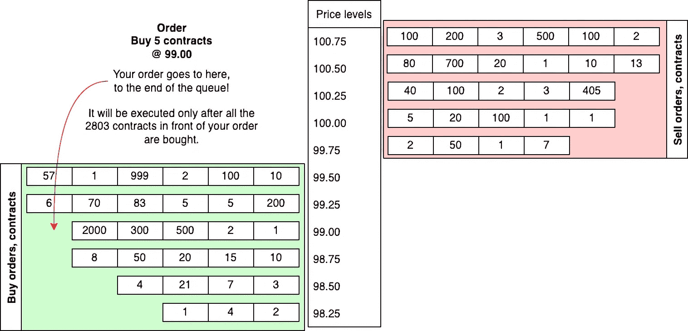
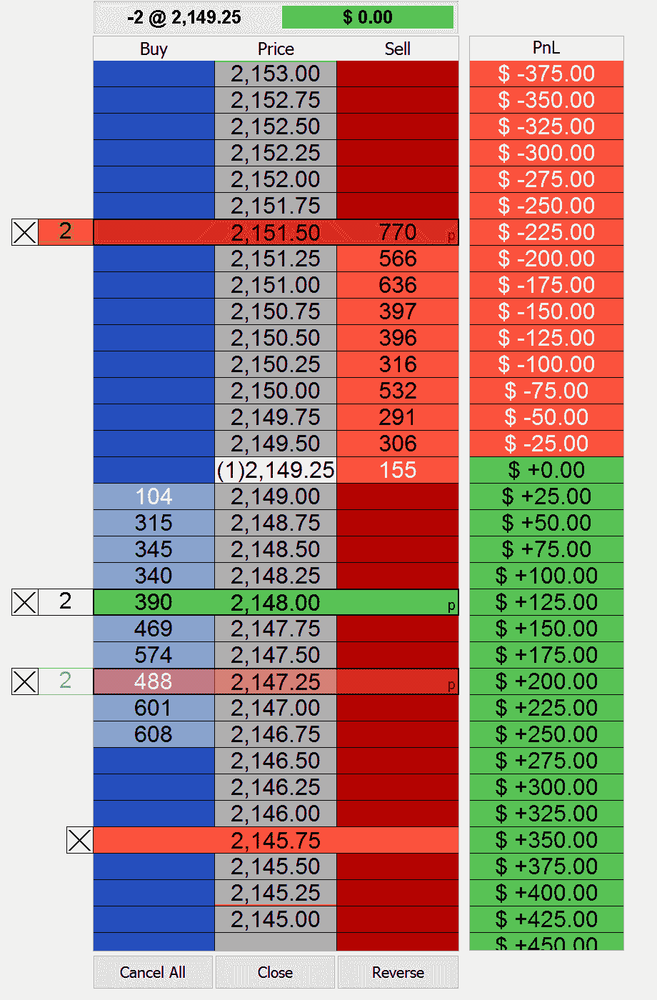
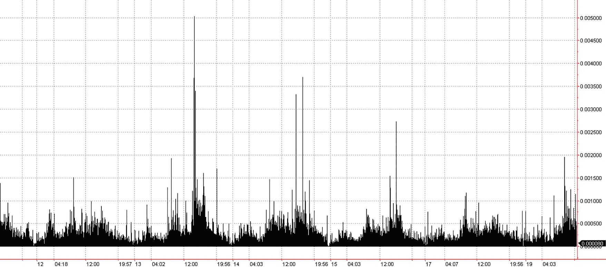
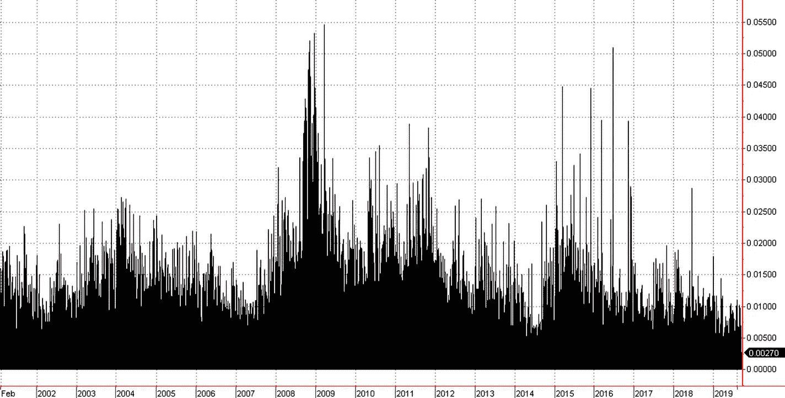

# 3

# 从开发者的角度看外汇市场概述

外汇市场长期以来对开发者来说一直非常有吸引力，主要是因为与这个市场相关的免费东西很多，比如市场数据、交易软件和各种第三方解决方案。然而，这些免费解决方案的质量通常非常低，实际上根本无法用于任何严肃的交易。

外汇市场交易的主要问题是其强烈的碎片化。从历史上看，外汇是一个没有专用中心的银行间市场。因此，交易场所不仅提供不同的交易平台，还提供不同的市场数据、不同类型的订单和不同的流动性接入。这种碎片化可能相当令人困惑，因此，为了避免犯错误，有时这些错误可能相当痛苦，获得足够的理解是至关重要的。

在本章中，我们将从开发者的角度审视这个市场，以发现一些重要且被忽视的特征，这些特征可能对任何 FX 算法交易项目的整体成功至关重要。我们将从这个市场的组织结构开始，看看它为开发者创造的障碍。我们将了解市场参与者的基本类型，为什么价格会变动，以及特定的变动是否是我们能从中赚钱的。我们还将考虑各种进入这个市场的方式，它们在各种实际交易应用中的优缺点，并估计这可能需要多少成本。

所有这些知识对于在 FX 算法交易中持续成功至关重要。这个市场是变化最快的市场之一。如果不理解这些变化可能如何影响你的交易策略的表现，从长期来看，在这个市场中生存将非常困难。在本章中，我们将涵盖以下主题：

+   交易场所——金钱相遇的地方……其他金钱

+   交易机制——再次，一些术语

+   做市商——舒适、复杂、昂贵

+   流动性提供者——支撑这个星球的巨鲸

+   ECN——看起来像一场公平的游戏，但真的是这样吗？

+   聚合——寻找最佳价格

+   交易外汇市场——交易什么和如何交易

+   我为什么需要所有这些？

# 交易场所——金钱相遇的地方……其他金钱

首先，让我指出，尽管这本书整体上使用了口语化的语言，但我始终努力坚持传统的学术方法，遵循相同的范式：定义 | 逻辑结论 | 理论 | 实验 | 证明。如果没有适当的定义，尤其是在我们谈论学科领域的基础时，我们将无法得出逻辑结论，提出一个理论，或者测试并最终证明一个理论——在我们的情况下，这意味着赚钱。用更简单的话说，如果没有对主题的全面理解，我们将无法提出适当的方法来使用它。

因此，正如我们在**第一章**中提到的，金融市场通过称为**交易场所**的特殊市场促进资产买卖。这有点过于模糊，不太有用，对吧？那么，让我们具体来看看。

## 组织混乱——交易场所的类型

金融世界的交易场所是买家和卖家相遇的地方——无论是物理上还是电子上。存在不同类型的交易场所，每种都有其优势和劣势，并需要特殊的交易方法。

今天交易场所的正式分类基于许多标准，包括监管环境、市场参与者的类型、市场信息在他们之间的传播方式等等。因此，这种分类非常复杂，肯定超出了本书的范围。

好消息是，对于我们这些买方交易应用的开发者来说，并非所有这些标准都重要。我们将尝试提出一些非正式的标准，以开发者的视角来看待这个主题领域。

从结构角度来看，交易场所之间的关键区别在于市场价格的确定方式。为了更好地理解这一点，我们再次考虑我们的农民市场例子。

## 拍卖（公开叫价）

买家和农民站在人群中，大声喊出他们想要购买或出售的数量以及他们的价格。一旦双方找到对方，就会签订合同。

这正是许多世纪甚至数千年来交易一直进行的方式。在金融世界中，这样的市场被称为**交易所**，而买家和卖家叫价的地方被称为**交易池**。尽管这种方法看起来公平，但它有一个全球性的内在限制：市场无法物理上容纳所有愿意交易的人。因此，交易者很快变成了精英，他们可以无限制地获得流动性，并开始代表他人进行交易以获取佣金。当然，这样的特权位置要求人们行为不端，许多交易者无法抗拒与客户对冲以翻倍利润的诱惑——这反过来又导致了法规的变化和严厉的惩罚。尽管非常有趣，但这又是另一个故事。

在过去 15 年中，其自然形式的**交易池交易**几乎完全消失。电子交易使市场对几乎任何人（尽管有重要的限制和约束——一如既往）都更加民主化和可获取，因此不再需要交易池交易者。

尽管如此，这种市场结构，其中通过**拍卖**中多方之间的直接沟通进行**价格发现**，仍然非常受欢迎。现代交易场所虽然电子化运营，但使用相同的范式。

我们可以看到，在这样的市场中，买方订单可以有两种下单方式。我们只需大声喊出，“**我要买**！”或“**我要卖**！”这样的订单将以最先出现的价格执行。这种订单被称为**市价订单**（参见*第十章**，Python 中订单类型及其模拟），如果将市价订单发送到市场，我们说我们在**市价**买入或卖出。

或者，我们可以喊出，“**我愿意以 100 美元或更低的价格买入**！”或“**我愿意以 200 美元或更高的价格卖出**！”然后这样的订单只有在有卖家或买家愿意以这样的价格进行交易时才会执行。这种订单被称为**限价订单**（同样，参见*第十章**，Python 中订单类型及其模拟*，详情请见），将这样的订单发送到市场称为**以特定价格**买入或卖出。

注意

尽管限价订单有助于限制价格（避免买高卖低），但并不能保证这样的订单一定会被执行：可能没有买家愿意以你的价格从你那里购买，或者没有卖家愿意以你期望的价格向你出售。

就像任何拍卖一样，交易资产的 价格可能会迅速上涨或下跌。因此，对于我们作为算法交易开发者来说，记住在这样一个市场中遵循一些有用的指南是很重要的：

+   在检查供应之前，永远不要在市价买入。这样的行为意味着“**我愿意以任何价格买入**”并且你将以最糟糕的价格成交。

+   永远不要在市价卖出。始终指定你愿意卖出的价格。提前发送你的卖出订单，标明你愿意卖出的价格是至关重要的。

## 交易所和订单簿

买家和农民到达市场，但并不进入。相反，他们被一位官员欢迎，官员在册子上记录他们的出价（买入订单）和出价（卖出订单）。如果一位新的买家带着 10 美元的出价进入，而官员的册子上已经有 10 美元的订单，那么这位新来者的订单将被放入队列，并且只有在先前的订单被执行之后才会被填满。

同样，农民不会在货架上展示他们的商品；相反，同样的官员会记录他们的出价（他们愿意以什么价格卖出商品）。与买家类似，如果一位新的农民带着以 11 美元的价格卖出的出价进入，而已经有另一位农民愿意以 11 美元的价格卖出，那么新来者的订单将在现有订单之后记录在册，并且只有在先前的订单被填满之后才会执行。

只要买家出价低于出价，而农民不愿意以更低的价格卖出，就不会达成合同，也不会发生交易。

因此，在这样的市场中，交易发生的唯一方式如下：

+   一个买家同意以更高的价格买入

+   一个农民同意以更低的价格卖出

虽然从常识的角度来看可能有点尴尬，但这样的市场组织有一个明显的优势：所有买家和卖家都按照**先进先出**（**FIFO**）的原则服务，并且有平等的机会。

以这种方式运作的市场也被称为交易所，而登记出价和要价的官员今天已被计算机取代，通常被称为**撮合引擎**。记录出价和要价的簿称为**订单簿**。簿中订单的信息称为**市场深度**或**DOM**。

注意

开放式喊价和订单簿交易可以在同一交易所和同一市场上共存。例如，股票交易时段从开盘拍卖开始，然后通过订单簿继续交易。

最高出价和最低要价之间的差额称为**价差**。当有人达成交易时，这被称为**跨越****价差**。

从程序员的视角来看，我们有一个二维结构，其中价格沿垂直轴，订单沿水平轴。当新的订单到来时，它们会被发送到每个价格水平上的相应 FIFO 队列，并被称为**限价订单**。*图 3.1*展示了这种结构的示意图，其中水平通道中的每个方块代表作为限价订单大小的发送到订单簿的合约数量：

图 3.1 – 订单簿的二维性质

重要提示

如果你发送了一个订单，并且已经有 10 个订单在待处理中，你的订单将只有在所有 10 个先前的订单都处理完毕后才会被处理。

这就是为什么许多使用限价订单的交易策略仅在**纸上**有效，也就是说，它们依赖于所有生成订单的保证执行，而在现实中，只有 40-50%的这些订单确实被执行。我们将在*第十章**，Python 中订单类型及其模拟的详细探讨中探讨这个问题和其他问题。*图 3.2*显示了交易所交易资产的典型 DOM。

图 3.2 – DOM 屏幕显示了每个价格水平的综合流动性（二级数据） – 来源：MultiCharts

这个窗口显示了综合流动性而不是单个订单：特定价格水平的所有订单的大小被汇总，总和显示在价格轴的左侧或右侧。

重要提示

二级数据通常不包含关于单个订单的信息，因此你永远不知道 1000 个合约意味着一个来自大量交易者的单一订单，还是零售交易者通过每个合约发送的 1000 个订单。

交易所实际上是股票（股票、交易所交易基金等）、商品和一些衍生品的行业标准交易场所。在 FX 世界中，主要是衍生品，如货币期货，在交易所交易。大部分现金、掉期和远期合约都是在**场外**（**OTC**）交易的。

## 场外交易市场

农民来到市场，但并不展示他们的商品。买家在他们之间走动，询问价格。农民看着买家，根据买家的外观决定提供什么价格。

这种情况听起来可能确实很荒谬，但它很好地展示了场外交易市场是如何运作的。

如前所述，在交易所交易市场中，任何时刻的所有市场参与者都知道*三个*关键价格：

+   最佳买价

+   最佳卖价

+   最后交易

这些价格对每个人都是相同的，专业市场参与者与非专业市场参与者之间的主要区别在于数据馈送延迟和数据压缩（有关市场数据及相关问题的讨论，请参阅*第一章**，开发交易策略 - 为什么它们不同*）。因此，在交易所交易市场中，这三个价格通常被称为**市场价格**。

在金融世界中，*OTC*一词意味着只要价格满足买方和卖方，就可以在几乎任何价格下签订合同——无论之前的合同是在什么价格下签订的。

从本质上讲，这在很大程度上使市场价格的概念变得毫无意义，因为并非所有这些价格都被报告并公开。因此，在场外交易市场中，没有像交易所交易市场那样的公开报价，而是使用*指示性价格*，这是最后交易价格或最后几个交易价格的近似表示。

到目前为止，我想你自然会问，“哇，但是谁使用这些市场，为什么？”答案非常简单，可以在交易所交易市场的结构中找到。

希望你能从上一节中回忆起来，任何交易所交易市场都是基于订单簿的。订单簿中的订单数量形成了该市场的流动性。

现在，想象一下，当一个大型的市场参与者（如对冲基金、共同基金、投资银行等）带着购买大量资产的愿望进入市场，而这个数量*超过了现有的流动性*。这样的行动会在一瞬间将最后交易价格移动到之前的读数非常远，甚至更糟的是——使订单簿的一侧完全空出。当然，这是一个所有市场参与者和交易所本身都希望避免的场景。

因此，这就是 OTC 市场。如果你是银行交易员，你可以在自己的联系网络中找到你大宗订单的最佳价格，并且可以私下进行，而不需要太多的喧嚣。

场外交易市场的另一个重要特征是，它们比常规的交易所交易市场受到的监管要少得多。有人试图对这些市场进行监管，其中最引人注目的可能是 MiFID 和 MiFID II，但仍然，OTC 市场要宽松得多。如果你对市场法规及其对定价、流动性和整体交易的影响感兴趣，我建议从[`tokenist.com/investing/guide-to-forex-regulations-in-the-us/`](https://tokenist.com/investing/guide-to-forex-regulations-in-the-us/)开始学习，那里解释了基础知识。我还建议阅读与 NatWest 交易和销售交付部门负责人 Phil Lloyd 的访谈[`www.natwest.com/corporates/insights/regulation/regulation-and-market-structure-what-to-look-out-for-in-2021.html`](https://www.natwest.com/corporates/insights/regulation/regulation-and-market-structure-what-to-look-out-for-in-2021.html)，他提供了关于全球挑战、法规变化及其与市场关系的非常有趣的见解。

理解场外交易市场（OTC）的结构可以引导我们得出许多非常重要的结论。

首先，场外交易市场非常适合大宗交易。如果你是一个小型零售交易者，那么在 OTC 市场进行交易可能会遇到问题，因为价格是任意的——你可以确信小型交易者总是得到他们订单最糟糕的执行。

第二，如果你发送一个市价订单（一个立即购买，无论价格的订单），你实际上无法知道你的订单将以什么价格执行。你永远无法就交易的价格进行争论。

注意

如前所述的直接推论，你应该始终检查你的订单实际执行的价格，并在测试时从你模型的预期回报中减去一定金额。这将使理论结果至少稍微接近现实。

第三个，也许是最反直觉的结论是，在 OTC 市场中，对于同一金融工具可能会有多个不同的价格。每个流动性提供者、做市商、银行、基金以及任何其他市场参与者都为同一产品提供自己的价格，并且这些价格在同一个时间点同时存在，这是正常的。

这种市场分割可以通过**套利策略**来利用：寻找在不同交易场所同一工具报价不同的情况。在价格差异足够的情况下，他们通过同时在不同的交易场所买卖同一工具来赚钱。

注意

可以使用 Python 开发和测试套利策略，但无法实际运行它们，因为套利机会通常只持续几毫秒。套利策略的生产代码通常用 C 或 C++编写，或者使用 Numba 或 Cython（见*第二章*，*使用 Python 进行交易策略*）。

第四，你永远不能在这个市场上提出自己的价格——与交易所交易市场不同，在交易所交易市场中，任何订单，即使是来自零售交易者的一个合约订单，都会进入**同一订单簿**，对每个人来说都是相同的。你只能接受有权将价格发布到这个市场的其他市场参与者的价格。这些市场参与者被称为**流动性提供者**或**做市商**（尽管重要的是要注意，这些不是同义词），他们通常被称为**价格提供者**，而零售交易者（或任何只接受报价的其它交易者）被称为**价格接受者**。

最后，对我们这些外汇交易员来说最糟糕的消息是，大约 90%的外汇市场是在场外交易（OTC）进行的。因此，我们必须接受这个现实，并找到合适的解决方案来在这个相当不友好的环境中生存下去。

## 流动性和订单限制

在金融世界中，交易场所不仅是一个买方和卖方相遇的地方，而且交易是在场所管理机构的监督下进行的。因此，从这个角度来看，一个传统的农贸市场不是一个金融交易场所，而证券交易所肯定是一个。关键的区别在于，在交易场所的交易总是受到监督或调节的。例如，如果有人进入一个杂货市场，并提出购买卖家当时拥有的任何产品，那么很可能会发生的情况是，农民会卖掉产品，市场将在下周日关闭。如果在金融世界中发生类似的事情，那将是一场真正的灾难。因此，交易场所总是调节进入的订单，如果请求的交易规模太大，订单将被拒绝（或者更准确地说，被视为**阻塞订单**并按特殊方式处理——见*第十章**，Python 中的订单类型及其模拟*）。

订单执行的另一个可能问题是**部分成交**。这发生在订单簿中的流动性不足以完全填满订单时，因此只有订单的一部分被填满。通常，你可以明确指定订单类型，以决定在流动性不足的情况下订单是被拒绝还是部分成交。在任何情况下，你都必须在你的交易应用中添加一个订单执行控制模块，该模块处理、拒绝和部分成交订单。

以非期望的价格完成订单可能是你最不希望发生的事情，但如果你使用市价订单（记住，市价订单意味着“我想要现在买/卖，不管价格如何”），这种情况还是相当可能的。现在，你理解了为什么订单可能会以*意外*的价格成交——那些相同的流动性问题。因此，在生产环境中，即使策略假设在市场上买卖，考虑使用限价订单而不是市价订单也是合理的。

订单将在*第十章*“订单类型及其在 Python 中的模拟”中详细讨论。

现在我们对最常见的交易场所类型有了一定的了解，是时候让我们熟悉它们的市场参与者了。这将使我们更好地理解交易是如何进行的，以及我们应该在市场上预期和避免哪些风险。

但在我们继续讨论市场参与者之前，让我们学习一些新术语。

# 交易机制——再次，一些术语

当双方会面并同意相互买卖时，就完成了交易。这些方被称为**对手方**。

如果我用一百万欧元兑换成美元，并且汇率是 1.1，那么我支付了 110 万美元来持有 1 百万 EURUSD 的*头寸*。我将持有这个头寸，直到我以等值的美元卖回这些欧元，从而*清算*我的头寸，再次成为*市场中性*，直到我开设新的头寸。

如果我通过发送低于先前最佳出价的出价来提高要价，那么我向市场*提供流动性*。

如果我同时提高*要价*和*出价*，并且其他交易者成为双方的对手方，那么我就*制造市场*。制造市场意味着赚取价差（出价和要价之间的差额）同时保持市场中性。主要业务是制造市场的市场参与者被称为**做市商**。

与成为市场或*价格提供者*相反，接受交易另一方的交易者被称为*价格接受者*。价格接受者只能以价格提供者提供的价格买卖，而且与价格提供者不同，价格接受者*总是支付**价差*。

重要

如果一个价格接受者使用市价订单开设任何头寸，那么在头寸开设的瞬间，其运行利润就已经进入了负值区域。

这是因为，在大多数市场中，卖出价格总是高于买入价格，而价格接受者只能以卖出价格买入，以买入价格卖出。因此，如果你购买了一种资产，这意味着你支付了卖出价格。如果你想立即平仓你的头寸，你只能以买入价格这样做。如果自你进入市场以来市场价格没有变化，你将损失买入和卖出价格之间的差额——这就是价差。这就是为什么我们说价格接受者总是向价格提供者支付价差，而价格提供者反过来赚取价差。

如果我购买了一种资产，那么我就有一个**多头**头寸。这个术语来自股票交易，意味着你购买了一些东西，现在持有它（通常，投资者会长期持有股票）。如果我出售了一种资产，并且这次出售不是之前开立的多头头寸的平仓，那么我就有一个**空头**头寸。同样，这个术语有相同的起源，意味着你在没有拥有它的情况下出售了某物。

你可能会想知道如何卖出你并不拥有的东西。好吧，在金融市场这真的很简单。如果我们谈论股票交易，那么大多数经纪人都有一份**库存**，交易者可以从这份库存中借来出售。如果以这种方式出售的资产价格进一步下跌，那么交易者就会平仓头寸，将资产归还给经纪人，并从中获得一些利润。如果资产价格上升……好吧，交易者无论如何都会平仓头寸，将资产归还给经纪人，并支付差额——这意味着这次会亏损。

如果我持有头寸，那么我的利润（或亏损）将计算为平仓价格与购买价格之间的差额。如果我开了一个多头头寸，并且平仓价格高于开仓价格，那么我就赚了钱；如果它更低，那么我就亏损。对于空头头寸来说，情况是对称的：如果平仓价格低于开仓价格，那么我就赚了钱，反之亦然。

只要我持有开放的头寸，我的**潜在**利润或亏损可以在任何时刻重新计算，即使头寸尚未平仓。这种潜在利润或亏损被称为**滚动利润或亏损**（**滚动 PnL**或**P/L**）。

要能够向市场发送订单，我必须要么成为有权直接访问订单簿的交易所的成员（这相当昂贵），要么使用第三方服务，该服务接受我的订单并将它们带到市场。这样的第三方被称为**经纪人**。

重要提示

在外汇交易中，经纪人和做市商之间存在着很多混淆。请仔细阅读以下部分，因为我们将要一次性澄清这种混淆。

如果我有 100 美元，欧元兑美元的汇率为 1.1，那么我可以购买大约 91 欧元。但如果经纪人给我提供**信用额度**，那么我可以用 100 美元购买从 3000 欧元到 9000 欧元，甚至更多。这个信用额度被称为**保证金**，而我能够不使用保证金购买的数量与使用保证金可以购买的数量之比称为**杠杆率**。通常，外汇市场上的杠杆率对非专业人士高达 30:1，对专业交易者高达 100:1。

如果我在保证金上开仓，并且市场价格变动对我不利，以至于我的交易账户中没有任何资金，那么我就进入了被称为**保证金追缴**的情况。从历史上看，这意味着经纪人会联系客户，要求向账户添加资金以维持仓位。这种做法现在很难找到，至少在零售经纪人中是这样。今天，经纪人更愿意强制平仓那些将客户的账户推入负区的仓位，否则，这不仅可能给客户带来问题，也可能给经纪人带来问题。

如果我在保证金上开仓，那么我的仓位大小被称为**名义金额**。这意味着，如果我使用账户中的 100 美元以 100:1 的杠杆在 EURUSD 上开了一个多头仓位，那么我实际上并不拥有 9000 欧元。我有一个名义上的 9000 欧元仓位，我必须在任何**实际**资金进入（或从）交易账户之前将其平仓。

如果我直接购买资产，那么它是一个**现货**资产。如果我购买一个给予我或使我未来有权或义务买卖资产金融工具，那么它是一个**衍生品**资产。实际上，衍生品可能比这更复杂，但它们主要只对专业市场参与者可用。关于衍生品的讨论超出了本书的范围。

如果我购买了一个在未来某个日期以某个价格买卖资产的**义务**，那么我就是在购买一个**期货合约**，或者简单地称为**期货**。这个日期被称为**到期日**或简单地称为**到期**。例如，当前资产的价格是 10 美元，但我可能购买一个保证在一个月、一个季度或任何其他时间段内以 9 美元将同一资产卖给我的期货合约。那么，这个月、这个季度或这个其他时间段就是该期货合约的到期期限。如果资产本身的价格在其到期日时高于 9 美元，那么我就赚钱了：期货的卖方有义务以 9 美元的价格将资产卖给我，而我可以立即以更高的价格将其转售。如果资产在到期日的价格低于 9 美元，那么我就亏损了，因为我现在有义务以 9 美元的价格购买资产，并且我可以随意处理它（最可能的是出售并承担损失）。

如果我购买*在未来以特定价格购买或出售资产的权利*，那么我是在购买一个**期权**。期权交易是一个相当复杂的话题，本书不予考虑。

关于术语就讲到这里。现在我们已经了解了关于关键市场参与者的所有需要学习的内容，我们需要知道他们做什么，以及我们如何实际上参与这个市场。

# 做市商——舒适、复杂、昂贵

“做市商”这个术语实际上有两个不同的含义，尽管它们非常接近。

在买家和卖家需要在单个**市场**（在大多数情况下，如我们之前所见，这是一个交易所）相遇的情况下——这种市场被称为**双边市场**。在双边市场中，做市商为市场提供流动性，这项活动将在*流动性提供者——支持这个* *星球* *的鲸鱼*部分进行考虑。

在场外交易市场中，情况不同。在这些市场中，只有专门的市场参与者可以发布他们的出价或要价，在某些情况下，它们甚至根本不发布。因此，寻找交易对手方进行交易可能比在双边市场中更加复杂，而且由于报价不是公开的，你可能会以非常令人惊讶的价格执行你的订单（当然，这不会是一个愉快的惊喜）。

因此，在这个时候，我们来看看做市商。在场外交易市场中，做市商既作为流动性提供者，也作为他们自己客户的对手方。

这意味着什么呢？

## 提供流动性的交易对手方

如果你来到一个交易所，那么你的订单对所有其他市场参与者都是可见的，任何人都可以接受订单的另一面。比如说，你只想买一份货币期货合约——那么你实际上可以从零售交易员和大型银行那里购买（但，你很可能永远不知道卖家是谁）。但是如果你与做市商交易，那么正是这个做市商——而不是其他人——将成为你所有订单的对手方。只有这个做市商才会始终从你这里购买并向你出售。

这意味着做市商是专业的市场参与者，*为他们的客户提供市场报价*。这些报价对不同客户而言是不同的，主要取决于客户的交易量和订单规模。

## 做市商是如何赚钱的？

做市商通过赚取*价差*（出价和要价之间的差额）来获得回报，在这方面，他们的业务与流动性提供者的业务非常相似。做市商总是以高于他们准备购买的价格出售。因此，在存在多个客户且这些客户产生持续**订单流**（几乎同时购买和出售的订单流）的情况下，我们的做市商会同时买入和卖出，赚取出价和要价之间的差额。

正如你所见，做市商的利润来源与他们的客户截然不同。作为*价格提供者*（见*场外交易市场*部分），做市商保持*市场中性*，而他们的客户由于客户购买了某物但尚未出售的情况，在市场上开仓和平仓*头寸*。

然而，我从那里购买并随后将我的头寸卖出的做市商在我不持有头寸时保持市场中性，因为他们有多个客户，而且很可能在我从做市商那里购买 100 万欧元/美元的同时，另一个客户正在向他们出售 100 万欧元/美元。因此，做市商赚取了价差，我和另一个未知的交易者带着两个头寸离开了：我持有多头头寸，而那个未知的交易者持有空头头寸。

这看起来像是一顿免费的午餐（当然，对于做市商来说）和一种不公平的优势（再次，对于做市商），但在现实中，这仅仅是另一种有风险的业务——因为世界上的一切交易都是如此。想象一下这种情况：有人从做市商那里购买了东西，但没有人出售。现在，想象这种情况发生了一次，然后很快又发生了。当大多数交易者认为价格将朝着某个方向移动，并开始大量买入或卖出时，这种场景很容易出现。对于做市商来说，这意味着他们不再赚取价差。更糟糕的是，在这种情况下，做市商在市场上持有开放的头寸——而不是市场中性——并且变成了一个交易者，他们的损益现在取决于价格变动！此外，这个头寸立即为做市商创造了一个浮动的损失（浮动意味着该头寸尚未清算，因此损失可能会随着每个新点的变动而减少或进一步增加）。当然，做市商不喜欢持有头寸，因此他们保护自己。

## 市场风险以及做市商如何缓解它

做市商缓解市场风险有两个基本的选择。

首先，做市商可以在其他地方对冲他们的净头寸。为了更好地理解这一点，让我们来看一个例子。

在所谓的正常交易时间内，平均而言，开仓的多头和空头头寸的数量或多或少是相同的。正如我们已经知道的，OTC 市场总体上以及外汇市场特别缺乏公开可用的数据，但即使从公开来源，我们也可以看到这个说法非常接近现实。例如，FXSSI 有一些很好的工具，可以可视化交易者的情绪、开仓的多头和空头头寸的比例以及市场深度的快照。您可以在[`fxssi.com/tools/`](https://fxssi.com/tools/)找到这些工具，并自行检查。特别注意开仓头寸比例([`fxssi.com/tools/ratios`](https://fxssi.com/tools/ratios))。这些图表报告了来自多个交易场所的头寸，很明显，交易场所的客户基础越大，开仓头寸比例的图表就越线性。这实际上意味着这个比例在时间上变化不大，并且新开仓的多头头寸与新的空头头寸是平衡的。

如果我们将所有多头头寸相加，并从这个总数中减去这个市场制造者目前开仓的所有空头头寸的数量，那么我们就得到了这个市场制造者的所谓**净头寸**。在正常市场条件下，并且假设市场制造者有足够的客户，这个净头寸总是接近零。

如果市场出现恐慌，或者由于任何原因，大多数交易者开始开仓的多头头寸多于空头（或反之），或者只有一个但规模非常大的交易者开仓了一个非常大的头寸，那么市场制造者的净头寸将大大超过零。在这种情况下，市场制造者将开仓另一个与自己的净头寸相等但方向相反的头寸。比如说，市场制造者有一个客户的净多头头寸为 100 万，那么市场制造者将开仓一个 100 万的空头头寸。在这种情况下，市场制造者保持市场中性。

你可能会想知道市场制造者如何为自己开仓。这是可能的，因为场外交易市场非常分散，有许多大型的和小型的市场参与者，他们可能直接或间接地连接。例如，市场制造者可以轻松地获取大型银行提供的流动性，因此可以在那里对冲他们的净头寸，但他们的客户，即零售交易者，实际上不太可能获得相同的流动性。

市场制造者为了保护自己可以采取的第二件事是增加点差。正如你将记得的，在 OTC 市场中，点差不是由所有市场参与者决定的，因为没有集中的交易所和单一订单簿。相反，任何价格提供者都可以提供自己的价格，市场制造者也不例外。通常，市场制造者能够获得比提供给客户的更好的买卖价格。从这个意义上说，市场制造者充当零售商，以较低的价格购买批发流动性，并以较高的价格向零售商重新销售。

当然，宽泛的点差对交易者来说并不好。然而，有几个原因，我们将在本节末尾更详细地讨论，这些原因可能会让我们考虑更宽的点差作为我们为了获得一些好处而支付的额外交易成本。

现在，我们已经到了引起许多交易者批评的非常关键的一点。

问题是，在 OTC 市场中，由于价格发现不统一，同一资产的价格在不同交易场所、一个价格提供者到另一个价格提供者之间都有所不同，尤其是在监管薄弱的 OTC 市场中，市场制造者对他们自己的客户进行欺诈的可能性相当大。

这种行为（或者更确切地说，这种不当行为）在 21 世纪初尤为普遍，当时外汇交易正变得越来越流行。许多自称为**经纪人**的市场制造者出现，提供荒谬的杠杆率，如 200:1、500:1，甚至 1000:1，承诺**在真实外汇中为客户开设头寸**，并接受微不足道的账户，如 100 美元、10 美元，甚至 1 美元。这些市场制造者的主要收入来源不是点差，而是他们的客户账户，因为在如此极端的风险条件下，超过 80%的客户在不到一个月内就完全损失了他们的资金。

显然，一个持续赢利的客户对这种市场制造者来说是一场灾难。任何以盈利平仓的头寸都是这种业务的直接损失。因此，这种类型的市场制造者经常通过提供更差的报价，甚至没有任何严重理由地拒绝他们的订单，来与自己的客户进行对赌。他们的唯一目标就是让成功交易者的交易变得非常不舒服，以至于他们宁愿关闭账户，在其他地方尝试运气。

这种不公平和恶劣的行为？

当然。

与市场制造者进行交易是否是零售和机构交易者在外汇市场上进行交易的唯一方式？

不，有其他选择，我们将在本章后面讨论它们。

但为什么还要与市场制造者进行交易呢？

好吧，原因不止一个，而且它们都很充分。

## 与市场制造者进行交易的原因

首先，自零售外汇交易初期以来，法规已经得到改善，如今，这种（不当）行为对于受监管的市场制造者几乎是不可能的。

此外，法规要求市场做市商明确称自己为市场做市商，经纪商明确称自己为经纪商。这结束了近二十年来两者之间的几乎所有的混淆，这损害了许多公平企业的声誉，以及外汇市场本身，至少在零售交易者的眼中。

第二，监管机构要求受监管的市场做市商必须保持流动性和在任何时候几乎都能报价市场，即使市场出现恐慌。这意味着你可以随时开仓或平仓，这与你在交易所开仓或平仓的方式正好相反。高级交易者甚至可以利用这一点，在重要经济新闻发布前后进行交易，市场流动性迅速蒸发，价格可能在不同交易场所之间差异很大——这为套利交易开辟了极好的机会。我们将在*第九章**，交易策略及其*核心要素*中考虑各种形式的套利。

为了能够在最灾难性的价格变动中生存下来，监管机构要求市场做市商拥有足够的资本。2015 年著名的**货币崩溃**，瑞士法郎在几分钟内对欧元升值近一倍，清楚地显示了哪些市场做市商满足了监管要求：他们仍在营业，而其他人则被淘汰。如果你对 2015 年 1 月 15 日发生的事情感兴趣了解更多信息，我建议阅读这篇文章([`fbs.com/analytics/news/5-years-aninversary-of-the-notorious-eurchf-usdchf-crash-7595`](https://fbs.com/analytics/news/5-years-aninversary-of-the-notorious-eurchf-usdchf-crash-7595))，这篇文章更多地关注事件的宏观经济方面，或者阅读这篇文章([`fxssi.com/swiss-franc-15-january-2015`](https://fxssi.com/swiss-franc-15-january-2015))，从更技术性的角度审视事件的顺序。

第三，市场做市商非常适合大量交易者。如果你需要填写超出当前订单簿典型流动性的订单，你只有两个选择：将你的订单分成几部分逐一填写（在此过程中没有任何保证价格保持不变）或者向市场做市商索要报价，一次性填写整个金额。这确实是一个很大的优势，不是吗？

第四，市场做市商通常提供的产品在双边市场中很难找到。一个很好的例子可能是二元期权（根据某个事件是否发生，结果为*全有或全无*的合约，类似于赌博）或结构化产品（例如，固定收益、货币和股票作为单一合约交易）。

最后，做市商可以提供与标的资产定价非常接近的衍生品，但技术上并不被视为该资产本身。最著名的衍生品之一是**差价合约**（**CFDs**）——这是一种与做市商签订的合约，根据该合约，如果购买合约后标的资产价格上升（或者如果卖出合约后资产价格下降），做市商有义务向你支付价差。因此，CFD 通常作为资产的代理。使用 CFD 而不是标的资产的原因是，在某些司法管辖区，CFD 交易的任何收入都不征税。这不是考虑与信誉良好的受监管做市商进行交易的好理由吗？

当然，做市商并不是外汇市场中唯一重要的市场参与者。让我们来了解另一种同样重要的市场参与者类型。

# 流动性提供者——支撑这个星球的大鲸鱼

在上一节中，我们已经指出，做市商的一些活动与**流动性提供者**（**LPs**）的活动相似。LPs 是一种市场参与者，其业务是通过向市场提供流动性来赚取价差，也就是说，始终在订单簿的两边同时维持买卖订单。因此，与做市商的情况一样，LPs 作为价格提供者赚取价差。

在双边交易所交易市场中，很难区分做市商和流动性提供者。然而，在场外交易市场中，这一点变得至关重要。

在场外交易市场中，做市商是一个为自身客户报价并为它们提供市场报价的实体。流动性提供者通常确实有客户，这些客户直接与他们交易，无论客户是小型零售客户还是大型基金。LPs 只为订单簿——或者多个订单簿——提供流动性，因为场外交易市场非常分散，同一金融工具存在多个交易场所（参见*场外交易市场*部分）。因此，典型的 LP 客户是银行、ECNs 和经纪商。

许多交易者认为 LPs 是市场的*寄生虫*，如果没有他们，定价将更加透明，他们的订单执行将更好，最终，他们将会赚更多钱（或者更确切地说，他们将会赚钱而不是亏损）。这是一个常见的错觉，我们将探讨原因。

你还记得我们在*交易所和订单簿*部分看到的典型订单簿吗？它清楚地显示了市场当前存在的流动性。在那个特定的例子中，每个价格水平都列出了几百个订单，对于一个大型市场来说实际上并不多。那么，如果一个大订单，比如购买几千份合约的订单进入市场会发生什么呢？

这样的订单将立即扫清订单簿，首先从最优卖价水平开始购买所有报价，然后是下一个价格水平，接着是下一个，再下一个，推动价格不断上升，越来越高。所有这些都会在千分之一秒内发生，以至于其他市场参与者没有时间做出反应。

相反，如果订单簿中有足够的流动性，那么价格波动就会变得更加温和，因为推动价格上下大幅变动变得更加困难。

注意

因此，LP 在 OTC 市场中扮演着非常重要的角色：他们促进了大量交易——不仅对大型交易者，而且对任何买方交易者，包括零售商。

同时，LP（流动性提供者）使得投机者的生活更加困难，因为市场流动性越大，价格波动越小，基于古老原则“买低，卖高”的买方投机获利就越困难。

每个投机交易者都必须明白，市场不是为了投机而发明的。任何金融市场的目的是促进商品或货币的交换，并找到它们的最优价格。通过投机赚钱的可能性只是市场的副作用，而不是市场本身的目的。

## 流动性和波动性——如何相互转化

随着 LP 数量的增加，市场价格变得越来越**不稳定**。波动性是市场价格和交易策略回报的关键指标之一。简单来说，波动性意味着价格移动的容易程度：波动性越大，意味着价格在同一时间段内预期会上下跳动的距离越大，而波动性越小，意味着价格在同一时间段内**不**预期会移动到任何显著的距离。有许多方法可以衡量波动性，这个主题本身也非常复杂和多元（甚至有一个专门的术语**波动性交易**），但这超出了本书的范围。现在，只需记住，波动性意味着价格在任意方向移动的容易程度。

我们可以通过计算固定时间段内最高价和最低价之间的差异，并将其绘制成直方图来表示波动性。*图 3.3*显示了欧元对美元的波动性，以一分钟为间隔进行采样：

图 3.3 – 一天内波动性的简单表示（图表由 MultiCharts 提供）

在这个示例中，我们可以清楚地看到，这个市场**日内**波动性（测量采样率小于 24 小时的波动性）是周期性的，并且在夜间总是较低。这是非常自然的，因为大多数大型市场参与者在正常工作时间进行交易。

然而，这个说明并没有给我们一个关于 LPs 如何影响波动性的概念。为了看到这种影响，我们需要看一个更大的图景。让我们绘制每日时间间隔的波动性相同表示，并查看其历史，追溯到 21 世纪初。*图 3.4*显示了欧元对美元的波动性图表：

图 3.4 – 每日波动性，EURUSD（由 MultiCharts 制作）

在这个说明中，我们可以看到从金融危机（明显表现为日波动性增加）开始的多年周期，以及随后持续 4-5 年的波动性连续下降。

这种现象的一个可能解释是，在危机时期，LPs 和做市商是首先遭受需求或供应急剧增加的受害者，因为他们有义务在市场中维持流动性。因此，在卖方最初的一系列重大损失和买方的保证金调用之后，LPs 审查他们的风险指标，并开始从市场中撤出流动性。我们已经知道，当流动性下降时，波动性就会上升；这就是我们，作为交易员，观察到的剧烈价格波动，而世界其他地方称之为*危机*或*灾难*。

总的来说，LPs 和做市商在保持市场稳定和确保其效率方面发挥着非常重要的作用——即在任何时候都能以任何数量买卖资产的能力。

我们已经熟悉了两个最重要的卖方市场参与者，并且我们已经知道包括我们自己在内的许多买方市场参与者。但是，我们是如何找到彼此的呢？所有的订单都发送到哪里，又是如何匹配的呢？

# ECN – 看起来像是一场公平的游戏，但真的是这样吗？

当我谈论场外交易市场的结构，特别是其中的价格仅由少数市场参与者提供，并且对于不同的买方客户可能会有很大差异时，许多交易员会说，“这并不公平！为什么外汇不能像其他有中央交易所的受监管市场一样工作，任何人都可以改善价格？”

对于这个问题，没有单一的简单答案。

首先，外汇市场是货币对货币的交易，而不是任何资产对货币的交易。它的原始目的是促进货币兑换，而不是使用各种金融工具进行投机交易。幸运的是，我们不必去交易所只是为了兑换一些英镑换成欧元，或者印度卢比换成美元。因此，场外交易对于这个目的来说是非常自然的，货币兑换店就是一个很好的场外交易例子。

其次，外汇市场由多种金融工具组成，这些工具在规格上相当灵活。例如，现金只占这个市场的一小部分，而远期合约占其日交易量的 50%。这些远期合约可以在银行和其他市场参与者之间直接进行，无需任何交易所的介入。我们将在本章稍后讨论外汇工具，在*外汇工具*部分。

然而，随着时间的推移和市场越来越计算机化，交易者认为这种市场设计还不够公平。许多专业买方交易员、做市商、LP 和经纪人都有同样的看法。买方交易员寻求更好的、更有效的方法来寻找市场中的最佳价格，而不仅仅是通过电话联系多家银行并与交易员交谈。卖方交易员热衷于提供最佳的买卖报价，因为这增加了赚取价差的盈利机会。

当然，这不仅适用于外汇市场，也适用于任何市场：争夺最佳执行的战斗有着悠久的历史。1969 年，第一个允许合格市场参与者进行买卖报价的电子网络被引入。这是一个革命性的改进，使得谈判价格和寻找最佳买卖报价比以前快得多。**证券交易委员会**（**SEC**）认可了这个网络，并将其命名为**电子通信网络**（**ECN**）。1975 年，SEC 通过了《证券法》的修正案（这是规范美国证券交易的主要法律文件），为 ECN 和电子交易的爆炸性增长打开了大门。

那么，ECN 究竟是什么呢？

## ECN 的组织结构

如果你连接到 ECN 并从那里检索市场数据，你将看到与从交易所获得的市场深度数据非常相似的东西。你将看到每个价格水平上的多个价格水平和流动性。根据你的订阅，你可能只能看到顶级水平、前 5 个水平、前 10 个水平，或者整个订单簿。你可以等待你的交易策略所需的价格，然后发送一个买入或卖出的订单——这基本上就像你在交易所做的那样。

那么，我们可以说 ECN 是一个*交易所*吗？

不，不是这样。

ECN 与交易所之间的关键区别是其订单簿的可用性。在交易所，其订单簿对任何市场参与者发出的任何订单都是可用的。任何人都可以发送任何大小的订单，它将进入单一、通用的订单簿。在 ECN 中，只有**合格的市场参与者**可以向订单簿发送他们的买卖报价。在外汇市场中，这些主要是银行、LP、做市商和其他专业卖方市场参与者。简单来说，你很可能无法在 ECN 的订单簿中发送自己的买卖报价。

在这一点上，我们应该回顾一下正在交易所进行的交易机制描述。如果你发送一个限价订单——即以分别低于或高于当前最后价格的价格买入或卖出资产——那么你的订单将进入相应的价格级别，并添加到队列的末尾（见*交易所和订单簿*部分）。市场中的任何人都可以看到这个订单，因为在这个价格级别的流动性将会增加。

然而，如果你在 ECN 上做同样的事情，订单簿在视觉上不会改变。相反，你的订单被 ECN 匹配引擎保留，并且只有在最后价格接近这个订单时才会执行。没有人，包括你自己，会在订单簿中看到你的订单，你也没有能力改善最佳买入价和最佳卖出价。只有合格的 ECN 成员才能改善最佳买入价和卖出价。

## ECN – 并非所有市场参与者都是平等的

因此，回到本节开头关于市场**公平性**的讨论，我们现在可以这样说，ECN 是一个**公平**的市场吗？好吧，如果与交易所相比——可能不是。但它解决了场外交易市场的主要问题：它促进了多个卖方市场参与者之间的价格发现，增加了他们之间的竞争，从而改善了卖方的最佳买入/卖出价。

使用 ECN 进行交易最初仅限于专业市场参与者，但超过十年，它几乎对任何人都是可用的。你只需要找到一个支持**直通处理**（**STP**）业务模式的经纪人。STP 意味着经纪人不会作为其客户的市商行事，他们只将客户订单路由到 ECN。

让我们再次回顾一下使用 ECN 的交易。LP 和市场制造者提交他们的买入和卖出报价，而买方交易者消耗这种流动性。

现在，让我们进行同样的想象实验——对这种结构进行压力测试，就像我们对交易所订单簿所做的那样。让我们想象一个大量买方交易者带着一个订单进入，要买入或卖出比订单簿中现有的更多的资产。

在大多数情况下，这样的订单将扫清订单簿中的全部流动性，使其中一边暂时为空——这对 LP 来说是不太可接受的。所以，如果交易者只做一次，那么很可能会没有反应——LP 会重新平衡他们的订单簿，流动性重新出现在市场上。但如果这个交易者重复这个动作，那么这种活动被认为是**掠夺性**的，而交易者产生的订单流被称为**有毒**的。可能会随之而来一系列的制裁，从经纪人的电话到 ECN 的永久禁止。

你可能认为这个问题与小型交易者，如零售交易者，无关，但实际上是有关的。

让我们回顾一下有毒订单流量的定义：它是一系列系统性地、持续性地试图洗劫订单簿的订单，也就是说，消耗（出价或要价）两边的全部流动性。

在正常营业时间内，使用小订单量确实很难实现。但是，不要忘记并非所有 LP（流动性提供者）都全天候工作。此外，有时会有一些时刻，甚至持续几分钟的时间段，ECN 的流动性实际上非常接近零（参见本章“外汇工具”部分中关于银行结算和相关问题的解释）。如果在这样的时刻，即使是小型零售交易者发送一个小订单，也会完全耗尽微薄的订单簿，导致以荒谬的价格执行该订单，并且经纪人或交易所会打电话来询问交易者的行为，这些问题可能令人不快。

注意

如果你与一个 ECN 进行交易，在发送任何订单之前，一定要检查订单簿中的流动性，以避免真正不愉快的情况。

今天，在 ECN 上进行交易确保了第二高效的定价发现过程。但是，最有效的是什么，你可能想知道。好吧，我们现在将要讨论*聚合*。

# 聚合——寻找最佳价格

你还记得吗？在一般情况下，任何场外交易市场，尤其是外汇市场，都是高度分割的？在相同的时间，有多个市场参与者为同一资产提供不同的价格。

这对任何市场参与者以及任何交易场所都适用，ECN 也不例外。如果 ECNs 是封闭系统，没有任何与外界联系，那么价格可能潜在地与外汇市场的其他价格非常不同。确实，如果我们有一个类似交易所的交易场所，尽管只有一小部分合格成员发布出价和要价，但价格将由供需决定，就像在任何其他市场中一样。这意味着价格接受者将是那些推动价格上涨或下跌的人。在一个封闭系统中，价格仅由该系统的成员决定。

从理论上讲，似乎没有任何东西可以阻止同一欧元兑美元的价格在一个 ECN 上是 1，在另一个 ECN 上是 2，在第三个 ECN 上是 10——只要第三个 ECN 的成员认为欧元应该值那么多！

然而——幸运的是——这并不是真的。如果每个 ECN 都交易一种**单独**的资产，比如一种独特的货币，那么的确，其价格将仅由这个 ECN 的供需决定。但是，只要他们都在交易相同的资产，就像我们的例子一样，有人可以在一个 ECN 以 1 美元的价格购买同一欧元，然后在另一个 ECN 以 10 美元的价格卖出。请确信这些聪明的交易者总是存在于任何市场中。他们被称为**套利者**，他们的交易策略被称为**套利**。

此外，ECN 不是封闭系统。所有 LPs 都参与多个 ECNs 和其他流动性池；其中许多运行自己的交易台或作为其客户的做市商。此外，一个 ECN 还可以作为另一个 ECN 的 LP！

因此，除了集中市场之外，我们还可以看到一个非常碎片化、非常复杂的网络，其中市场参与者相互连接，并与其他群体相连，然后这些群体也相互连接，如此等等。买方交易者（套利者）和卖方市场参与者（LPs 和做市商）使整个外汇市场的价格比我们之前简化的例子中更加统一。

尽管我们不再期望从一个交易场所到另一个交易场所的价格差异达到 1000%那么剧烈，但由于外汇市场的内在碎片化，价格仍然在这里那里略有不同。例如，同样的欧元在一个 ECN 报价为 1.13458，而在另一个 ECN 报价为 1.13459，同时市场做市商可能报价为 1.13461，而银行报价为 1.13456。这种差异非常微小，按照描述在今天的 FX 市场中进行经典套利是非常困难的。然而，我们可以从另一个角度看待这种价格多样性：如果我们能够通过检查所有可用的价格来找到市场中的绝对最佳价格会怎样？

这就是**价格聚合**的核心思想。聚合器本身并不是一个交易场所，因为它没有自己的订单簿和流动性提供者（LPs）。相反，聚合器会扫描交易场所，寻找绝对最佳的买入和卖出价格，然后将订单路由到相应的场所。

由于聚合的性质，通常在极短的时间内，比如毫秒或更短，最佳买入价格会**高于**最佳卖出价格。想想看！你可以买入的价格低于你可以卖出的价格！难怪聚合器很快就成为了套利交易者的首选交易场所——而且不仅仅是他们。实际上，价格聚合是在碎片化的场外交易市场中获得最佳执行的方式。

不幸的是，目前聚合器仅对专业市场参与者，如银行和经纪人开放。因此，ECN 交易在更广泛的受众中仍然是效率最高的。

# 外汇市场交易——交易什么以及如何交易

我们已经讨论了很多关于在哪里可以进行交易的问题，但等等！我们完全忘记了讨论可以交易什么以及如何进行交易。让我们立即填补这个空白。

## 外汇工具

你可能听说过外汇市场是世界上最大的市场，日交易量超过 2 万亿美元。但你有没有想过在这样的巨额交易中，交易的是什么工具？你想象的是现金堆或金币吗？也许是从一个银行账户到另一个银行账户的即时转账？

当然不是，这个市场并不是这样运作的。当我们说*外汇*时，我们通常是指交易一种货币兑换另一种货币的义务。

如果我来到一家货币兑换店，用 100 欧元兑换等值的英镑，那么这样的交易会立即完成。作为卖方，我交付欧元，作为买方，商店交付英镑给我，这一切都是在达成交易的那一刻完成的。

然而，如果我想用 100 万欧元兑换相应数量的英镑，我宁愿打电话给我的银行询问价格。银行会很乐意提供一个特别报价，因为兑换的金额非常有吸引力。这个报价将远远优于现金兑换店能提供的任何报价。

现在明白了吗？这就是在 OTC 市场中同一资产可能存在多个价格的原因。

我甚至可以更进一步，与各种金融机构检查价格，特别是那些专门从事货币兑换和国际货币转移的机构——而且，很可能会找到我同意进行交易的最佳报价。

但金融机构给出的价格绝不是市场上可能给出的最佳报价。然后他们会去*大型*外汇市场，以高于从我这购买欧元的价格出售欧元兑换英镑。

这可能看起来简单直接，但实际上并非如此。

问题是我现在得到了一个交易，但我的钱从我的银行账户转移到选择的进行兑换的金融机构可能需要时间。汇率已经与我确定。因此，对于这家金融机构来说，能够在与我达成交易的那一刻立即对冲其头寸或清算它至关重要，而不是在稍后，因为市场价格可能完全不同，他们可能会因这种操作而遭受损失。

因此，金融机构将其报价放在所谓的远期市场上。远期合约是在合约签订时即确定价格，并在特定日期交付实物商品（或，在货币市场上，货币）的义务。例如，同一家金融机构可以出售一份远期合约，意味着，“我们现在将欧元对英镑的汇率固定在 0.85，但我会在稍后向您交付欧元。”

在一个工作日，金融机构可以与各种交易对手方签订许多远期合约。为了了解他们欠谁的债务以及其他人欠他们多少，有一个特殊的过程叫做**结算**。这是对所有市场参与者的相互义务进行净额结算，并计算他们的每日盈亏。

注意

对于大多数涉及美元的货币对，结算时间是纽约时间下午 5 点。在这一点上，特别小心进行交易非常重要，因为市场流动性几乎为零。总是最好在结算前 15 分钟和结算后 15-30 分钟内避免交易。

在众多远期合约中，交易量大的合约包括以下几种：

+   **今日**（**TOD**）- 一种在当天交易日的交割远期合约，或称 *T*

+   **次日**（**TOM**）- 一种在下一个交易日交割的远期合约，或称 *T+1*

+   **即期**（**SPOT**）- 一种在 2 个交易日后交割的远期合约，或称 *T+2*

截至 2022 年，所有外汇市场的日均交易量约为 6.6 万亿美元。即期是远期平均日均交易量中最大的一部分，价值约为 2 万亿美元。其他远期合约再贡献 1 万亿美元。剩余的 3.6 万亿美元主要被**互换合约**或**互换**占据。

互换是非常有趣的金融工具，主要被制造商和进出口商用来对冲他们的货币风险。如果我与你签订一个互换合约，这意味着我给你一定数量的欧元，而你给我一定数量的英镑（或任何其他货币），并且我们固定汇率。然后，在一段时间后，通常是 1 年或更长时间，我们将交换我们的货币——而且最重要的是，在这一点上，我们将以最初交易的相同汇率交换。

因此，货币互换合约为我们每个人承担了货币风险，因为在我们的互换协议期限内，远期市场的汇率可能会发生相当大的变化。但这种风险可以通过溢价出售，这就是互换交易者赚钱的方式。

我们将不考虑这类金融工具。如果你对它们感兴趣并想了解更多，我建议从[`www.investopedia.com/terms/c/currencyswap.asp`](https://www.investopedia.com/terms/c/currencyswap.asp)开始学习。

除了现金、远期和互换市场外，还有许多衍生品——这些合约可能或可能不涉及资产的实物交割。最著名的货币衍生品之一是货币期货，可以在**芝加哥商业交易所**（**CME**）进行交易。

注意

对于零售交易者和活跃的投机者来说，最重要的市场是即期和货币期货。这两大市场将是本书进一步讨论的内容。

## 命名规范

让我们快速澄清货币市场如何使用其工具的名称。

国际标准（具体为 ISO 4217）假定每种货币都有一个三位数的数字代码和一个三位字母代码。因此，欧元的数字代码是 978，字母代码是 EUR。

外汇市场是一个特殊的市场，因为我们不是用钱购买商品，而是用钱买卖钱。因此，这个市场中的任何工具都是一个货币对及其相应的代码（通常称为股票代码），由两个字母货币代码组成。

货币对中的第一种货币是报价货币，第二种货币是报价货币。换句话说，第一种货币充当资产，第二种充当计量单位。例如，EURUSD 表示 1 欧元中有多少美元，USDJPY 表示 1 美元中有多少日元，等等。

注意

在外汇股票代码上要极其小心！始终记住你买的是什么，你卖的是什么，因为这很容易混淆。

外汇市场的价格以分数形式报价。例如，如果 EURUSD 报价为 1.0345，这意味着如果我卖出 10,000 欧元，我将得到 10,345 美元，而报价为 113.78 USDJPY 意味着我需要支付 11,378 日元来换取 100 美元。如果你将比率乘以相应的 10 的幂次来消除分数，计算起来非常简单。

在几十年的时间里，外汇市场大多有四位和两位的价格，例如前一个例子中的那些。最小的价格波动——即第四位或第二位的最小变化——被称为**价格利息点**（pip）。

然而，几年前，他们增加了一个额外的数字。所以，我们现在有 5 位价格，如 1.23456，而不是像 1.2345 这样的 4 位价格，同样，我们用三位数字代替两位数字。

注意

虽然现在大多数价格使用五位或三位数字表示法，但 pip 仍然被认为是第四位或第二位。所以，这个额外的数字被称为分数 pip 或分数价格。

这种额外数字被添加的可能解释之一可能是外汇市场一直在快速发展，大量的 LPs（流动性提供商）实际上用钱涌入市场。你还记得我们在“流动性和波动性：一个如何转化为另一个”部分中的讨论吗？好吧，流动性越大，波动性越低，如果我们继续使用旧的 4 位价格，那么价差（买价和卖价之间的差异）为零。反过来，这意味着卖方市场参与者不再能从流动性提供中获利。因此，引入更精细的价格水平是解决过度流动性问题的唯一合理解决方案。

因此，引入更精细的价格是一个可靠的指标，表明市场流动性在增长。这是好是坏？

初看之下，这无疑是好消息：流动性越大，签订合同就越容易，因此，交易者能更好地执行他们的订单。然而，如果每个买家和卖家都能立即满足他们的需求，价格就会停止波动。因此，高流动性市场对卖方有吸引力，但对于买方投机者来说，使用方向性交易策略赚钱变得越来越困难。

为了让您了解流动性如何影响买方投机者的表现：在 2001-2004 年，可以使用相当简单的趋势跟踪交易策略，如果这种策略每次交易平均赚取大约 10 个点，被认为是正常的。如今，在 FX 主要货币中，跟随趋势几乎完全失效，每次交易的平均利润下降到 1 个点。这是交易者为更有效地填充订单所付出的代价。

## 我该如何下单？

好吧，既然我们已经知道了我们可以交易什么，现在是时候弄清楚我们如何能够做到这一点了。

在现金兑换的情况下，情况大致如此：我可以去交易所商店，或者去银行。但别忘了，在这种情况下，我必须得到一个价格，而这个价格很可能与市场上最好的价格相差甚远。

如果我想从流动性巨大且价格极具竞争力的市场中获益，我需要能够以某种方式访问它。除非我自己是一家金融机构（这很可能不是情况），否则我必须使用各种中介机构的服务，这些中介机构将我介绍到市场并提供进入交易场所的途径。这些中介机构被称为**经纪商**。

经纪商是市场参与者，其业务是从客户那里路由订单到交易场所，同时检查市场风险，并在必要时提供杠杆（参见*交易机制：再次一些* *术语* 部分）。

同样，就像在市场做市商的情况下，许多人对**外汇经纪商**这个词都有负面印象。难怪在零售外汇交易的早期，许多不诚实的公司自称经纪商，但实际上，他们从未将任何订单路由到任何地方。这并不奇怪，1990 年代末现货外汇市场的最低交易量是 100 万基础货币，而在 2000 年代初下降到 10 万——低 10 倍，但对于小型零售交易者来说仍然太高。因此，那些*经纪商*提供了*迷你合约*和*微型合约*，当然，这些合约从未离开这个经纪商的封闭系统。

因此，在零售业的早期，如果外汇交易经纪商想要与小型零售账户合作，他们只有两种选择：

+   为其客户提供做市商服务

+   对客户的头寸进行内部净额结算，并在*大*市场中对净额进行对冲

不幸的是，许多所谓的经纪人选择了第三种选择——什么都不做，只是从他们的客户那里窃取金钱。因此，我们可以理解为什么提到外汇经纪人和一般意义上的“外汇”这个词有时会引起相当强烈的反应。

然而——幸运的是——时代已经改变。现在，大多数幸存下来的经纪人都是受监管的，至少可以保证客户账户的安全。当然，这并不是保证交易不会亏损，但这完全是另一回事。

除了这个之外，自 2000 年代初以来，外汇市场的结构发生了巨大的变化。如果在本世纪初，市场主要由银行组成，那么如今，买卖双方的参与者种类非常多样，几乎任何人都可以选择的交易场所数量相当可观。

今天，检查经纪人是否受到监管非常容易，你可以要求他们提供直接访问流动性池或 ECN 的权限——然后以相当类似的方式与专业市场参与者进行交易，就像你在中心化受监管的交易所交易一样。

注意

当我们用 Python 开发交易应用时，我假设我们直接连接到一个交易场所，例如 ECN，避免使用 MetaTrader 或专有交易平台，因为它们只会给我们的订单增加不必要的延迟。MetaTrader 可以用作监控工具，用于监视开放的头寸并检查订单执行的准确性。

这已经是一个相当长的章节，也是一次相当漫长的对外汇市场世界的探索——有时清晰直接，有时奇怪而诡异。但我想肯定的是，在你阅读上述所有信息的过程中，一定有一个问题已经在你的脑海中盘旋了很久。

# 我为什么需要所有这些？

嗯，实际上你不需要这样做。当然，你可以从不知名的地方快速下载不清晰的历 史价格数据，使用你不完全理解的工具开发一个模型，并使用这些数据进行优化，然后连接到一个不知名的经纪人并开始交易。问题是：这样的交易会成功吗？很可能是不会的。

如果你仔细阅读这一章，你很可能已经理解了原因。

首先，当你计划为你的模型使用某些历史价格数据时，你应该意识到你到底要使用什么：是最后成交价、买入价、卖出价，还是两者都有，或者其他任何东西。你应该检查历史数据是否包含正确的时间戳，以及没有哪个 tick 的时间早于前一个。你可能想确保你使用的数据包含交易量的信息——否则，你将无法开发出广泛的交易策略。你应该确保数据是干净且一致的，并且没有错误的报价，这些报价可能会影响你在开发策略时的参数。

其次，你应该仔细选择适合你策略的正确交易场所。它是否交易大量？它是否频繁交易？它是否试图在市场流动性稀薄的*问题时期*进行交易？对所有这些问题的回答将帮助你做出正确的选择。

最后（可能本应首先考虑的事情）——你应该确保你的策略产生的交易是可执行的，并且回报将覆盖所有交易成本，包括市场差价和你的经纪人向你收取的任何佣金。

因此，在这个时候，我建议你现在再次阅读这一章，并在未来不时地回到它，以保持你的发展与实际市场保持一致。

# 摘要

在这一章中，我们了解了市场可以组织和管理的方式。我们熟悉了诸如交易所、订单簿和流动性等关键概念，注意了各种因素对价格行为可能产生的影响，并发现了可能对交易策略表现产生负面影响的内在重要因素。在掌握所有这些基本知识后，我们准备深入研究交易应用架构的细节，看看我们应该使用什么来应对现代外汇市场的挑战。这就是我们在下一章将要做的。

# 第二部分：交易应用的一般架构及其组件的详细研究

熟悉主题领域对于任何软件开发都是至关重要的，*第一部分*介绍了外汇市场的基础知识和交易应用典型的关键特征。现在，是时候概述此类应用的架构，并更详细地考虑其主要组件了。

*第二部分*提出了用于检索和处理市场数据的几种解决方案，解释了基本面分析和技术分析之间的区别，从市场过程的角度关注了经典**技术分析**（**TA**）指标的含义，并提供了这些指标在 Python 中的可能实现，这些实现与进一步的发展兼容。我们还将熟悉简单数据可视化的基础知识，这通常用于快速检查市场数据和计算的正确性，并生成入场和出场订单。

本部分包括以下章节：

+   *第四章*，*交易应用——里面有什么？*

+   *第五章*，*使用 Python 检索和处理市场数据*

+   *第六章*，*基本面分析的基础及其在外汇交易中的可能用途*

+   *第七章*，*技术分析及其在 Python 中的实现*

+   *第八章*，*使用 Python 进行外汇交易中的数据可视化*
