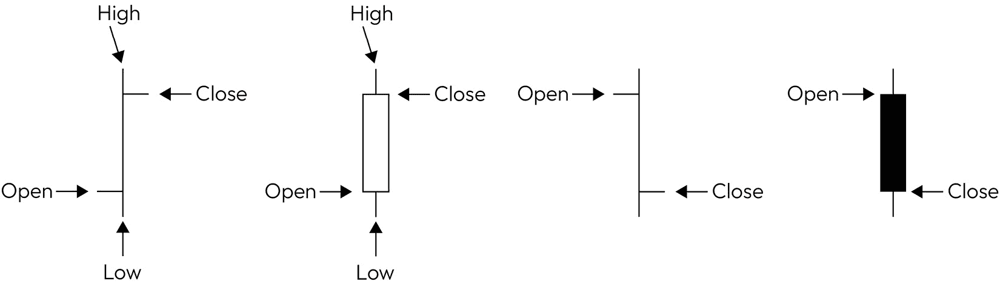
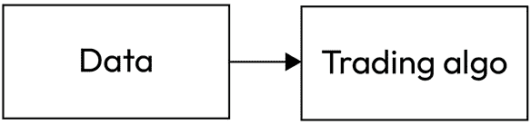
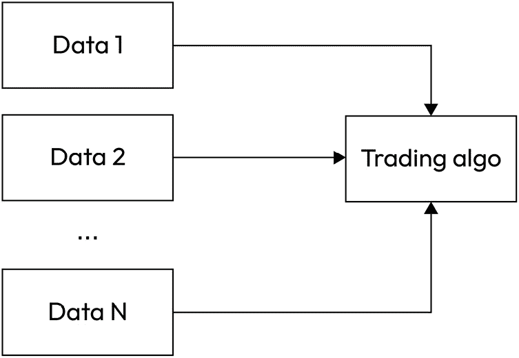
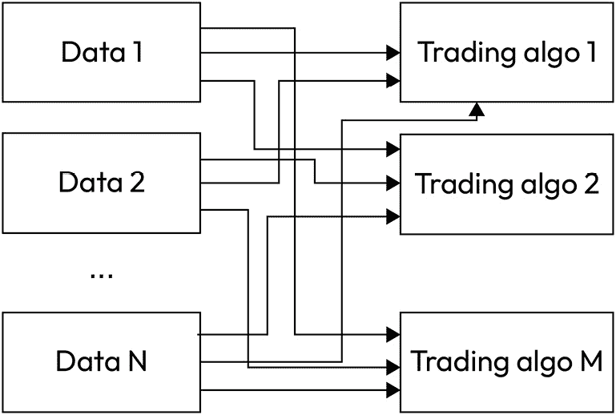
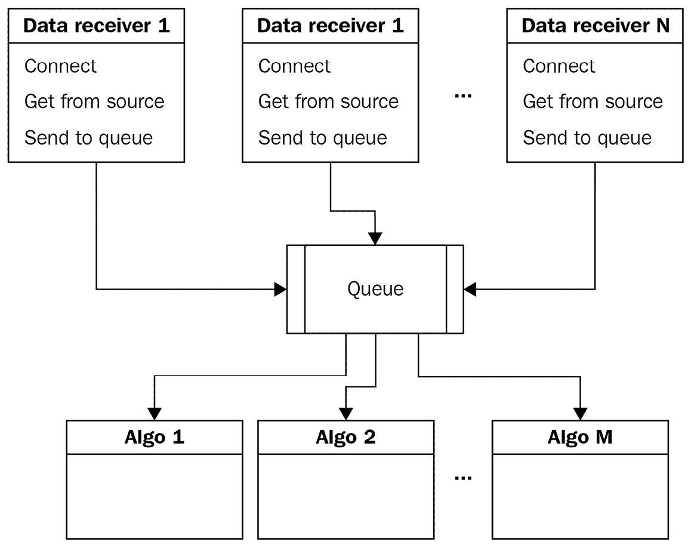
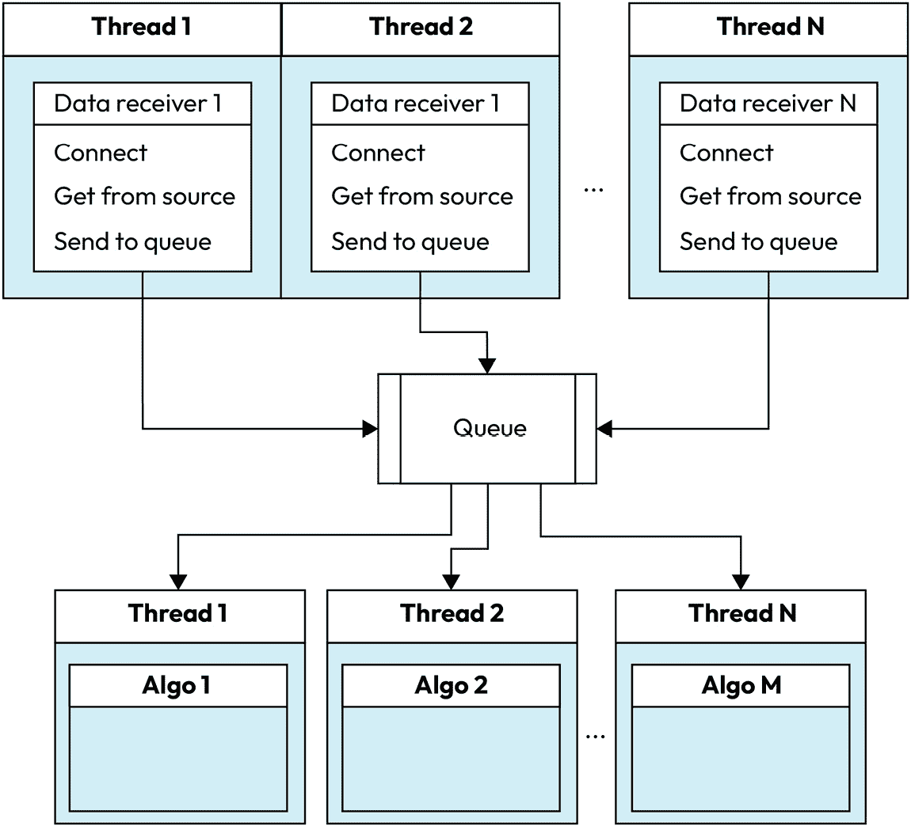

# 5

# 使用 Python 检索和处理市场数据

如果你查看我们设计的交易应用程序架构的一般逻辑图，该图在*第一章*“开发交易策略——为什么它们不同”中有所描述，你会发现我们现在正从第一个名为`Receive data`的模块转向第二个模块，即`Cleanup and filter`，该模块具有**存储**和**检索**功能。

在前面的章节中，我们多次提到，任何算法交易应用程序都是基于市场数据的，而算法交易的成功（即赚钱而不是亏损的能力）取决于数据的质量和一致性。因此，让我们继续确定我们真正需要收集哪些数据，以及如何确保收集到的数据是一致的，然后决定交易应用程序的内部格式，以及存储、更新、检索和删除数据（如果需要）的方式。

在完成这一章后，你将对处理和加工市场数据的最有效方法有一个清晰的理解，最重要的是，你将学会如何使你的交易应用通用，以便它可以连接到几乎任何数据源，无论是实时数据还是历史数据，而无需重写所有代码。

在本章中，我们将涵盖以下主题：

+   数据导航

+   数据压缩——将数量保持在合理的最低水平

+   与保存的和实时数据一起工作——保持你的应用通用

# 数据导航

数据收集的问题始于一开始：每个数据提供商都提供自己的数据，很多时候是以自己的格式提供。一些数据提供商只提供压缩数据或快照（见本章后面），而其他数据提供商则广播逐 tick 数据；非常少的数据提供商也提供订单簿（**市场深度**或**DOM**；见*第三章*“从开发者的角度来看的 FX 市场概述”）数据。

因此，首先也是最重要的，你应该决定数据粒度：你的交易算法是否需要逐 tick 数据或压缩数据，以及你是否需要 DOM 数据。在这个阶段，你可能对这些问题的感觉会有些迷茫，但不用担心——当你完成这本书的后续章节时，你会对你的数据需求有一个非常清晰的理解。

让我们考虑所有三种情况，看看我们如何实际处理 tick、快照和 DOM 市场数据。

## Tick 数据和快照

我要重申，当我们谈论第三方数据、格式和协议时，关于支持什么以及第三方文档是如何完成的准确信息的最终来源是你的经纪人。

然而，一般来说，所有数据提供商都支持两种类型的市场数据：tick 和快照。

让我们快速回顾一下术语：

+   **tick**是指交易资产（如：买入价、卖出价（报价）和最新价）中的任何一种价格的变化。

+   **Bid** 是市场制造者、流动性提供者和其他价格提供者同意购买的价格——因此，这也是价格接受者可以出售的价格

+   **Ask** 或 **offer** 是价格提供者愿意出售的价格——因此，这也是价格接受者可以购买的价格

+   最后一个是最新实际交易的价格

让我们考虑一个例子。这是你可以从 LMAX 收到的示例 tick 数据（有关连接和检索此**电子通信网络**（**ECN**）数据的更多示例，请参阅上一章）：

```py
{
    "type": "TICKER",
    "instrument_id": "eur-usd",
    "timestamp": "2022-07-29T11:10:54.755Z",
    "best_bid": "1.180970",
    "best_ask": "1.181010",
    "trade_id": "0B5WMAAAAAAAAAAS",
    "last_quantity": "1000.0000",
    "last_price": "1.180970",
    "session_open": "1.181070",
    "session_low": "1.180590",
    "session_high": "1.181390"
}
```

首先，前面的 JSON 指定了数据的类型。在这个例子中，`type` 是 `TICKER`，这意味着我们正在处理单个 tick。它后面跟着工具名称。

重要提示

许多数据提供者对同一工具名称使用不同的表示法。例如，EUR/USD 可以表示为 `eur-usd`、`EURUSD`、`EUR/USD`，甚至 `@EURUSD`。因此，请始终检查数据提供者的文档，并且不要忘记将提供者表示法中的工具名称替换为应用程序中使用的内部名称。

例如，如果你使用传统的 `CCY1/CCY2` 表示法，那么你可能想使用以下代码，它将 LMAX 使用的 `ccy1-ccy2` 表示法转换为传统表示法：

```py
instrument_id.replace("-", "/").upper()
```

这里，`instrument_id` 是从数据提供者收到的带有 tick 的工具名称，`replace()` 是内置的字符串方法，用于将一个字符替换为另一个字符，而 `upper()` 是另一个内置方法，它将整个字符串转换为大写。

接下来是时间戳，时间戳带来了另一个不确定性，因为数据提供者使用不同的标准来表示时间戳。我们将在本节稍后讨论市场数据的时间戳。

以下字段是自解释的：

+   `best_bid` 和 `best_ask` 表示订单簿的顶部

+   `trade_id` 是在此 ECN 上最新交易的唯一标识符

+   `last_quantity` 和 `last_price` 是最新交易的大小和价格

+   `session_open`、`session_low` 和 `session_high` 表示交易时段的第一个价格（当市场开盘时），以及从市场开盘到收到 tick 的时间内的最低价和最高价

如我们所见，tick 中的大多数字段都是自解释的，易于使用，但有一个重要的例外：`timestamp`。

## 时间戳——注意比较苹果和苹果！

在前一节中，当我们分析 tick 的结构时，我们注意到它包含一个时间戳，而这个时间戳可能会成为开发者的另一个头疼之源。这是因为每个数据提供者都认为他们使用的是最方便的数据格式。一如既往，请参考提供者的文档，并参考任何关于处理时间戳的教程。如果你不熟悉时间戳及其标准，我建议从 Avinash Navlani 在 *Dataquest* 上关于在 Python 中处理时间戳的优秀教程开始（[`www.dataquest.io/blog/python-datetime-tutorial`](https://www.dataquest.io/blog/python-datetime-tutorial)）。

无论如何，为了简化问题，时间戳是一个按照某种标准格式化的字符串，这种格式化通常是通过空格、特殊字符或普通字符来完成的。在前一节的 LMAX 示例中，日期部分通过字母 `T` 与时间部分分开，整个时间戳以字母 `Z` 结尾。

Python 提供了一个 `datetime` 库，它可以灵活地处理时间戳。这个库引入了同名的 `datetime` 对象，它具有多种方法可以将字符串转换为时间戳，反之亦然。在接下来的示例中，我们将使用 `strptime()` 将时间戳从字符串转换为原生的 `datetime` 对象。

通过使用 `strptime()` 和其他方法，你所需要做的只是指定输入时间戳的格式，使用正确的指定符（有关指定符的完整列表，请参阅 Python 文档中的 [`docs.python.org/2/library/datetime.html#strftime-and-strptime-behavior`](https://docs.python.org/2/library/datetime.html#strftime-and-strptime-behavior)）。

因此，让我们将 LMAX 示例中的时间戳转换为原生的 `datetime` 对象。首先，我们从 `datetime` 库中导入 `datetime`（是的，它看起来很荒谬，但又能怎么办呢？）然后进行转换：

```py
from datetime import datetime
ts_str1 = '2022-07-29T11:10:54.755Z'
ts1 = datetime.strptime(ts_str1, '%Y-%m-%dT%H:%M:%S.%fZ')
```

在这里，我们假设 `ts_str1` 是从 LMAX 收到的 tick 中已提取的时间戳，作为 XML（JSON）。如果我们运行此代码并检查 `ts1` 的值，那么我们将看到以下内容：

```py
In [21]: ts1
Out[21]: datetime.datetime(2022, 7, 29, 11, 10, 54, 755000)
```

这意味着转换已经正确完成，现在我们可以单独访问时间戳的任何组件。例如，`ts1.day` 返回 `29`（月份中的日期），而 `ts1.microsecond` 返回 `755000`，这实际上是 `755` 毫秒。

使用 `datetime` 对象的真正优势是它们可以像数字一样排序。例如，如果我们收到一个新的时间戳，它只是比原始时间戳晚 1 毫秒（`ts_str2 = '2022-07-29T11:10:54.756Z'`），并将其转换为新的 `datetime` 对象（`ts2 = datetime.strptime(ts_str2, '%Y-%m-%dT%H:%M:%S.%fZ')`），那么我们可以轻松地比较两个时间戳，如下所示：

```py
In [27]: ts1 > ts2
Out[27]: False
```

随后，我们可以按升序或降序对它们进行排序。

重要提示

永远不要使用字符串作为市场数据时间序列的时间戳 ID。你将无法轻松按到达的确切时间排序数据，因此处理数据将极其低效。请使用原生的`datetime`或 pandas 时间戳（参见下一节）。

## 存储和检索 tick 数据

在 Python 中存储和处理 tick 数据主要有三种方法：

+   使用高级对象

+   使用底层对象

+   使用 pandas

高级对象通常用于存储大量数据或处理整个历史数据（参见*第二章**，使用 Python 进行交易策略*）。在这种情况下，我们创建一个单一的对象，其属性包括列表（如果我们打算逐个存储数据样本并按索引引用它们）或字典（如果我们使用时间戳来引用数据样本）。

使用字典允许通过时间戳快速轻松地处理数据，因此这是存储市场数据的首选方法。让我们看一个例子：

1.  让我们从创建一个通用类开始：

    ```py
    class data:
    ```

    ```py
        def __init__ (self):
    ```

    ```py
            self.series = {}
    ```

这个`main`字典将存储所有使用时间戳作为关键字的数据样本。

1.  现在，让我们添加一个方法，将新的数据样本添加到`main`字典中：

    ```py
    def add(self, sample):
    ```

    ```py
            ts = datetime.strptime(sample["timestamp"], '%Y-%m-%dT%H:%M:%S.%fZ')
    ```

    ```py
            self.series[ts] = sample
    ```

在这里，我们假设数据样本的形式类似于 LMAX 使用的形式——即 JSON，其中包含*ISO 8601*格式的时间戳。由于 JSON（或通用的 XML）基本上与原生的 Python 字典相同，我们在字典中添加了一个字典。现在，通过时间戳作为关键字引用`self.series`将返回另一个包含数据样本本身的字典。这就是我们在本节开头提到的*底层对象*。

重要注意事项

只有在数据馈送不发送具有相同时间戳的 tick 时，我们才能通过时间戳引用 tick。这种情况通常出现在来自交易场所的直接馈送中。建议的代码将始终用具有相同时间戳的最后一个接收到的值重写 tick 的内容，因此如果你真的需要保留所有存储的 tick，请考虑为它们添加**唯一标识符**（**UIDs**）。本书中用于开发和测试目的的公共 LMAX 数据馈送从未发送具有相同时间戳的 tick。

1.  因此，现在，让我们添加一个基本函数，通过时间戳查找数据样本：

    ```py
    def get(self, ts, key):
    ```

    ```py
            return self.series[ts][key]
    ```

注意，这里使用了两个关键字（`[ts]`和`[key]`），一个紧接着另一个。这正是因为刚刚解释的数据结构：我们有一个字典中的字典，所以第一个关键字`[ts]`检索数据样本字典，而第二个关键字——`[key]`——实际上返回值。

这里需要注意的是，通过时间戳检索刻度的这种方法假设我们知道确切的毫秒级时间戳。如果我们不确定或者想要提取例如在 1 秒或甚至 1 分钟内到达的几个刻度，我们可以使用以下代码，它将返回一个时间戳以相同时间开始的刻度列表（实际上，我们在`timestamp`键中查找子字符串）：

```py
result = [(key, value) for key, value in self.series.items() if key.startswith("2022-07-29T11:10:54")]
return result
```

1.  好的——让我们尝试一下我们的代码。让我们使用之前的例子——创建一个新的数据序列对象，向其中添加一个样本，并读取`trade_id`值：

    ```py
    sample = {
    ```

    ```py
        "type": "TICKER",
    ```

    ```py
        "instrument_id": "eur-usd",
    ```

    ```py
        "timestamp": "2022-07-29T11:10:54.755Z",
    ```

    ```py
        "best_bid": "1.180970",
    ```

    ```py
        "best_ask": "1.181010",
    ```

    ```py
        "trade_id": "0B5WMAAAAAAAAAAS",
    ```

    ```py
        "last_quantity": "1000.0000",
    ```

    ```py
        "last_price": "1.180970",
    ```

    ```py
        "session_open": "1.181070",
    ```

    ```py
        "session_low": "1.180590",
    ```

    ```py
        "session_high": "1.181390"
    ```

    ```py
    }
    ```

    ```py
    series = data()
    ```

    ```py
    series.add(sample)
    ```

    ```py
    timestamp = datetime.strptime(sample["timestamp"], '%Y-%m-%dT%H:%M:%S.%fZ')
    ```

    ```py
    print(series.get(timestamp, "trade_id"))
    ```

如果我们运行此代码（不要忘记在开头添加`from datetime import datetime`），我们将得到`0B5WMAAAAAAAAAAS`，这确实是存储的刻度数据样本的交易 ID。

这样，我们可以轻松地实现创建、添加和从我们的存储中读取数据，而不需要使用任何数据库。当然，这种方法将在某种程度上限制通过其他键检索和聚合数据的能力——例如，检索所有具有相同价格或交易数量位于某个范围内的刻度。

记住

忽略或篡改数据，尤其是接收到的刻度或条形图顺序，很可能会让你开发出一个仅在损坏数据上才能工作的策略，而无法与真实市场数据兼容。

因此，对于大多数实际交易应用来说，最好只能通过时间戳以外的任何关键词来获取数据。然而，如果你从事某种学术研究并且确实需要特殊的数据检索模式，那么对你来说是个好消息：pandas 允许你做到这一点（我们将在*第八章*，*使用 Python 进行外汇交易中的数据可视化*)进行简要介绍）。

存储市场数据的另一种方式是将数据存储在列表中，而不是字典中。这样，我们可以忘记时间戳，并逐个读取数据样本，使用索引——这在使用历史数据进行回测时特别有用。

然而，将市场数据存储在列表中存在一个显著问题。如果你需要添加任何过去的数据样本，你必须扫描列表以找到插入新样本的正确位置，而这个操作相当耗时。因此，使用以时间戳为关键词的字典总是更可取。

你可能会认为在过去的某个时间插入一个样本听起来很荒谬，而且几乎不需要。好吧，继续阅读这一章，在专门介绍清理市场数据的部分，你会看到这种能力是多么受欢迎。

## 订单簿（市场深度）

一些数据提供商（实际上并不多）非常慷慨，不仅提供顶部的订单簿（最佳买价和卖价），还提供一些市场深度（参见*第三章*的*“交易所和订单簿”部分，*从开发者角度的 FX 市场概述*）。一般来说，接收订单簿数据与接收股票行情数据没有太大区别。唯一的区别是，股票行情数据包含每个买价、卖价和最后价格的单个值，而订单簿数据包含多个买价和卖价的值，并且不包含任何最后值。

## 存储和检索订单簿数据

如果我们查看 LMAX 在其 API 文档中提供的示例，我们可以看到表示订单簿信息的 JSON 可以被 Python 解释如下：

+   **最高级别**：一个类似于股票行情数据的字典，但没有最后交易和会话信息

+   **低级别**：一个按价格降序和升序排序的买价和卖价列表

+   **最低级别**：另一个包含每个买价和卖价的实际价格和数量的字典：

    ```py
    {
    ```

    ```py
        "type": "ORDER_BOOK",
    ```

    ```py
        "instrument_id": "eur-usd",
    ```

    ```py
        "timestamp": "2022-07-29T11:10:54.755Z",
    ```

    ```py
        "status": "OPEN",
    ```

    ```py
        "bids":
    ```

    ```py
          [
    ```

    ```py
                {
    ```

    ```py
                    "price": "1.181060",
    ```

    ```py
                    "quantity": "500000.0000"
    ```

    ```py
                },
    ```

    ```py
                {
    ```

    ```py
                    "price": "1.181050",
    ```

    ```py
                    "quantity": "200000.0000"
    ```

    ```py
                }
    ```

    ```py
          ],
    ```

    ```py
          "asks": [
    ```

    ```py
                {
    ```

    ```py
                    "price": "1.181100",
    ```

    ```py
                    "quantity": "250000.0000"
    ```

    ```py
                },
    ```

    ```py
                {
    ```

    ```py
                    "price": "1.181110",
    ```

    ```py
                    "quantity": "350000.0000"
    ```

    ```py
                }
    ```

    ```py
          ]
    ```

    ```py
    }
    ```

因此，我们可以使用与最初用于存储、添加和读取 tick 数据完全相同的代码。我们只需要添加另一个索引级别和关键字来访问实际值。例如，如果我们添加前面的示例，那么我们可以通过以下代码使用时间戳检索最佳买价：

```py
best_bid = series.get(timestamp, "bids")[0]["price"]
```

这行的开头与上一节中来自股票行情数据的示例相同，然后是索引 `[0]`，它用于检索最佳买价（由于买价和卖价都已排序，列表中的第一个元素总是包含最佳买价或卖价），最后是另一个关键字—`price`，用于从价格/量对中检索价格信息。

现在，我们可以检索 tick 数据，但请记住，它可能在内存或磁盘上占用太多空间。所以，只使用特定交易策略所需的数据量会更好。这就是我们进行数据压缩的原因。

# 数据压缩——将数量保持在合理的最低水平

在上一节中，我们已经考虑了数据提供商使用的一种最流行的数据压缩技术：快照。区别在于，一个 tick 代表一个单一事件（如新交易或买价或卖价的变化）和一个单一的价格值，但快照会丢弃关于单个 tick 的信息，并用每个周期内的以下价格来替换：

+   周期第一个 tick 的价格（或**开盘价**）

+   周期最高价格（或**最高价**）

+   周期最低价格（或**最低价**）

+   周期最后一个 tick 的价格（或**收盘价**）

例如，如果周期为 1 分钟，在这 1 分钟内进行了 100 次交易，那么快照将用仅仅 4 个价格来替换 100 个 tick（或 100 个价格）。

当在图表上绘制时，产生的快照被称为柱状图。非常频繁地，交易者和开发者使用*柱状图*而不是*快照*。从图形上看，柱状图通常表示为带有两个虚线的垂直线。正如你在以下图中可以看到的，指向左侧的虚线表示该柱状图所代表区间的开盘（第一）价格，指向右侧的虚线表示同一区间的最后（收盘）价格，而垂直线的顶部和底部分别代表区间的最高价和最低价。这些柱状图被称为**开盘-最高-最低-收盘柱状图**或**OHLC 柱状图**：



图 5.1 – 柱状图和日本蜡烛图作为数据压缩的视觉表示

如果左侧的虚线低于右侧的虚线，我们说柱状图*收盘价上升*或在该时间段（在该柱状图期间）价格走势是上升的。如果右侧的虚线低于左侧的虚线，我们说柱状图*收盘价下降*或价格走势是下降的。

表示柱状图的另一种方式被称为**日本蜡烛图**。它们左右没有虚线，而是将开盘价和收盘价之间的范围绘制为矩形。为了显示开盘价是否高于或低于收盘价，我们使用颜色编码：通常是白色或绿色表示柱状图收盘价上升（收盘价高于开盘价），黑色或红色表示柱状图收盘价下降。

那么，数据压缩是好事还是坏事？

当然，答案取决于使用数据压缩的预期目的。一般来说，数据压缩可以让我们显著减少存储空间。仅为了给你一个概念：将 4 年的历史市场数据压缩成 1 分钟柱状图，如果保存为美国信息交换标准代码（ASCII）CSV 文件，大约需要 152 MB。同样时间段的时间戳数据，根据时间戳数据的类型（是否仅传输最后交易作为时间戳，或者包括每次买卖价格的变化），大约需要 1.4 到 3 GB。

除了这些，使用压缩格式的数据可以极大地加快回测过程（记住，回测意味着使用预先存储的历史价格数据来模拟算法生成的交易）。处理 10 万条记录比处理 100 万条记录快得多，这并不令人惊讶。

因此，当你使用数据供应商的历史数据或从你的经纪人的网站上下载时，很可能会将其压缩到 1 分钟、10 秒或 1 秒，但无论如何，不太可能是原始的时间戳数据。

在开发交易策略时，我们通常使用更少粒度的分辨率，例如 1 小时、4 小时、1 天，有时甚至 1 周或 1 个月。

然而，使用压缩数据对开发者来说有一个严重的缺点。由于单个 tick 已经消失，我们无法在单个条中说出哪个价格先出现，第二个，以此类推。在*第十章*，“Python 中的订单类型及其模拟”，我们将考虑与使用压缩数据进行交易模拟相关的一些严重问题，并看看我们如何最大限度地减少犯错的几率。

由于我们现在熟悉数据压缩的概念，让我们看看我们如何实际使用它。我们将从检索已压缩数据开始，然后看看我们如何在我们的代码中压缩数据。

## 获取压缩数据

一些数据供应商、经纪人和交易场所使用压缩数据进行实时流，但大多数用于历史数据。在这种情况下，您可以将其下载为 XML 格式，或者更常见的是，作为传统的 CSV 文件。内容（就像往常一样！）取决于数据供应商的自由意志，但至少应该包含时间戳和开盘价、最高价、收盘价和最低价（OHLC）数据。一些数据供应商还包括交易量数据，甚至包括上涨和下跌的次数（价格分别上涨或下跌的时刻），如下所示：

```py
Date,Time,Open,High,Low,Close,UpVolume,DownVolume,TotalVolume,
UpTicks,DownTicks,TotalTicks
1/27/2015,13:29:00,1.12942,1.12950,1.12942,1.12949,200,150,639,3,2,8
1/27/2015,13:30:00,1.12947,1.12959,1.12941,1.12941,230,438,888,4,7,12
1/27/2015,13:31:00,1.12953,1.12970,1.12951,1.12965,400,240,650,9,4,14
1/27/2015,13:32:00,1.12944,1.12944,1.12883,1.12883,90,609,749,2,10,13
```

现在，让我们看看我们如何高效地读取、存储和检索历史压缩价格数据：

1.  首先，我们需要做一些准备工作。显然，我们需要`datetime`模块，用于存储所有数据的存储空间（字典），以及用于存储单个数据样本的存储空间（另一个字典）：

    ```py
    from datetime import datetime
    ```

    ```py
    historical_data = {}
    ```

    ```py
    sample = {}
    ```

1.  然后，我们需要读取数据。如果我们正在处理 CSV 文件，这可以非常容易地完成，如下所示：

    ```py
    file_name = '/path/to/the/data/file'
    ```

    ```py
    f = open(file_name)
    ```

1.  让我们读取第一行（标题行），以避免在解析价格数据时可能出现的错误：

    ```py
    f.readline()
    ```

1.  接下来，我们将逐行读取文件：

    ```py
    for line in f:
    ```

1.  在循环体中，我们删除任何结尾的换行符，并将接收到的行解析为`values`列表：

    ```py
        values = line.rstrip("\n").split(",")
    ```

1.  现在，我们将日期和时间合并成一个单独的字符串，并将其转换为`datetime`对象：

    ```py
        timestamp_string = values[0] + " " + values[1]
    ```

    ```py
        ts = datetime.strptime(timestamp_string, "%m/%d/%Y %H:%M:%S")
    ```

1.  然后，我们将其余的信息收集到一个字典中：

    ```py
        sample["open"] = float(values[2])
    ```

    ```py
        sample["high"] = float(values[3])
    ```

    ```py
        sample["low"]  = float(values[4])
    ```

    ```py
        sample["close"]= float(values[5])
    ```

    ```py
        sample["UpVolume"] = int(values[6])
    ```

    ```py
        sample["DownVolume"] = int(values[7])
    ```

1.  现在，使用`timestamp`作为关键字，将新样本添加到全局数据集字典中：

    ```py
          historical_data[ts] = sample
    ```

1.  现在，如果我们检查数据集中的第一条记录，我们将得到以下结果：

    ```py
    {'open': 1.12942, 'high': 1.1295, 'low': 1.12942, 'close': 1.12949, 'UpVolume': 200, 'DownVolume': 150}
    ```

1.  现在，如果我想在某个特定日期和特定时间检索收盘价的特定值，我可能想使用以下类似的方法：

    ```py
    historical_data[timestamp]['close']
    ```

其中时间戳表示您想要检索收盘价的时间戳。

在运行回测时，我们并不是通过时间戳来检索数据样本的；相反，我们希望有一个方法可以连续逐个按严格的时序顺序获取样本。Python 的本地字典通常包含未排序的数据；然而，有一个解决方案允许我们通过关键字排序数据——使字典键排序，并自动确保数据样本始终按正确的时序顺序排序。或者，您可以使用 Python 本地`dict`对象的子类`OrderedDict`，它实现了一个键预先排序的字典（您可以在[`www.tutorialspoint.com/ordereddict-in-python`](https://www.tutorialspoint.com/ordereddict-in-python)找到关于`OrderedDict`的简单教程）。

要做到这一点，我们使用内置的`sorted`方法，它默认按升序返回任何可迭代对象的排序值列表——这正是我们想要的：

```py
for ts in sorted(historical_data):
    print(historical_data[ts])
```

上述代码将按严格的时序顺序打印从第一个到最后一个的所有数据样本（不要用大量数据集运行此代码，因为它将花费大量时间来显示！）。

现在，我们可以读取历史数据，按正确的时序顺序对其进行排序，并逐个检索——这就是我们为算法回测所需要的一切。

## 在 Python 中压缩市场数据

即使数据提供者提供了完整的价格数据流，我们仍然可能希望对其进行压缩，而不仅仅是节省磁盘存储空间。这种压缩的原因可能更为重要，例如，我们的交易算法可能能够生成一些信号或使用压缩的历史数据计算一些辅助指标。因此，我们还需要以类似的方式向算法提供压缩数据。尽管价格数据提供了更多信息，我们仍然可能希望对其进行压缩，以使其与交易逻辑兼容。

将数据从价格数据压缩到 OHLC（开盘价、最高价、最低价、收盘价）条的最正确的方法是有一个接收价格数据的方法，每个价格数据点重新计算 OHL（开盘价、最高价、最低价）值，然后在适当的时候添加 C（收盘价）值。例如，如果我们想将价格数据压缩成 1 分钟条，这个方法将在每分钟的开始处创建一个新的条，并在分钟间隔过去时完成它。让我们通过一个例子来更好地理解这一点：

1.  假设我们有一个本地文件中的历史价格数据（我们将看到如何编写良好的代码使我们能够快速从文件切换到任何其他数据源）：

    ```py
    file_name = '<your_path_name>/EURUSD 1 Tick.csv'
    ```

    ```py
    f = open(file_name)
    ```

    ```py
    f.readline()
    ```

我们立即读取文件的第一行，并且永远不会将其用作第一行，因为它只是标题。

1.  接下来，我们不要忘记导入`datetime`并创建两个字典——一个用于整个数据系列，另一个用于单个条目：

    ```py
    from datetime import datetime
    ```

    ```py
    bars = {}
    ```

    ```py
    bar = {}
    ```

1.  接下来，我们为我们的新形成的时间条设置分辨率。我建议在这里使用一个通用的测量单位。例如，如果您使用的是相对较慢的交易策略，那么您可能希望按分钟计算时间。为了获得更高的精度和粒度，您可能希望降低到秒。所以，让我们使用秒作为单位，形成 1 分钟的条目（1 分钟条目等于 60 秒）：

    ```py
    resolution = 60
    ```

1.  接下来，我们应该从文件中读取另一行，仍然在主循环之外，以获取第一个时间戳。我们将比较所有后续的时间戳与这个时间戳，一旦两个时间戳之间的距离（时间）大于分辨率（在我们的例子中是 60 秒），我们就会开始一个新的条目：

    ```py
    values = f.readline().rstrip("\n").split(",")
    ```

    ```py
    timestamp_string = values[0] + " " + values[1]
    ```

    ```py
    last_sample_ts = datetime.strptime(timestamp_string, "%m/%d/%Y %H:%M:%S.%f")
    ```

最后，主循环开始：

```py
for line in f:
    values = line.rstrip("\n").split(",")
    timestamp_string = values[0] + " " + values[1]
    ts = datetime.strptime(timestamp_string, "%m/%d/%Y %H:%M:%S.%f")
```

到目前为止，循环体的代码与我们之前所做的完全相同——我们读取一行新内容并解析它。但是，然后我们比较接收到的时间戳与最后一个形成的条目或样本的时间戳：

```py
    delta = ts - last_sample_ts
```

在这里，您可以感受到使用日期时间格式的时间戳的所有美丽。您可以像处理常规数字一样添加或减去它们。

神经质者的笔记

Python 支持多种处理日期和时间的类型。除了`datetime`之外，还有一个有用的类型——`timedelta`，它允许轻松定义时间跨度。如果您想了解更多关于`timedelta`及其如何高效使用的信息，请尝试这个教程：[`tutorial.eyehunts.com/python/python-timedelta-difference-two-date-time-datetime/`](https://tutorial.eyehunts.com/python/python-timedelta-difference-two-date-time-datetime/)。

1.  现在，当新标记的时间戳与上一个完全形成的条目时间戳之间的时间增量大于分辨率时，我们将当前条目添加到我们的`bars`全局字典中，并通过用相同的价格（最后标记的价格）替换其值来开始一个新的条目。别忘了在途中将字符串转换为数字：

    ```py
        if delta.seconds >= resolution:
    ```

    ```py
            bars[ts] = bar
    ```

    ```py
            bar["open"]  = float(values[2])
    ```

    ```py
            bar["high"]  = float(values[2])
    ```

    ```py
            bar["low"]   = float(values[2])
    ```

    ```py
            last_sample_ts = ts
    ```

或者，如果时间增量仍然小于分辨率（在我们的例子中，它小于 1 分钟），那么我们只需更新当前条目的值：

```py
    else:
       bar["high"] = max([bar["high"], float(values[2])])
       bar["low"] = min([bar["low"], float(values[2])])
       bar["close"] = float(values[2])
```

看起来我们的编码工作已经完成了。好吧——让我们运行我们的代码，我们会立即得到一个错误：

```py
File "/.../example5.py", line 36, in <module>
    bar["high"] = max([bar["high"], float(values[2])])
KeyError: 'high'
```

这意味着我们形成当前条目的字典中没有`high`关键字。这是怎么发生的？当然，这是在形成第一个条目时发生的：在我们保存至少一个条目之前，它的任何属性（开盘价、最高价、最低价或收盘价）都是不可用的。因此，我们通过添加一个`try`...`except`语句来修复我们的代码：

```py
else:
        try:
            bar["high"] = max([bar["high"], float(values[2])])
            bar["low"] = min([bar["low"], float(values[2])])
            bar["close"] = float(values[2])
        except:
            print('first bar forming...')
```

现在，在形成第一个条目时，我们只能在屏幕上看到`First bar forming...`。您可以替换这条消息，或者通过将`print`语句替换为`pass`来完全删除它。

1.  再次运行代码，我们可以看到现在它已经成功执行了。如果我们检查`bars`变量中的最后 4 条记录，我们可以看到这些条目的时间戳确实大约有 1 分钟的增量：

    ```py
    datetime.datetime(2022, 8, 8, 18, 53, 8, 64000): {'open': 1.01973,
    ```

    ```py
      'high': 1.01984,
    ```

    ```py
      'low': 1.01972,
    ```

    ```py
      'close': 1.01972},
    ```

    ```py
     datetime.datetime(2022, 8, 8, 18, 54, 8, 347000): {'open': 1.01973,
    ```

    ```py
      'high': 1.01984,
    ```

    ```py
      'low': 1.01972,
    ```

    ```py
      'close': 1.01972},
    ```

    ```py
     datetime.datetime(2022, 8, 8, 18, 55, 10, 731000): {'open': 1.01973,
    ```

    ```py
      'high': 1.01984,
    ```

    ```py
      'low': 1.01972,
    ```

    ```py
      'close': 1.01972},
    ```

    ```py
     datetime.datetime(2022, 8, 8, 18, 56, 12, 81000): {'open': 1.01973,
    ```

    ```py
      'high': 1.01984,
    ```

    ```py
      'low': 1.01972,
    ```

    ```py
      'close': 1.01972}}
    ```

但是等等！时间戳是正确的，但为什么所有条形图中的相应价格（比较开盘到开盘、收盘到收盘等）都是相同的？！

这里，我们有一个问题，这实际上是 Python 作为非常成熟面向对象语言的最突出特征之一。我们在代码中实际执行的动作序列如下：

1.  我们创建`object1`（`bars`字典）。

1.  我们创建`object2`（`bar`字典）。

1.  我们使用`new`关键字将`object2`添加到`object1`中。

1.  然后，我们*修改*`object2`。

1.  再次，我们使用`new`关键字将`object2`添加到`object1`中。

1.  ...然后重复这个循环。

看到了吗？我们原本以为每次想要向`bars`中添加新的条形图时，都会添加一个新的对象，但实际上，我们添加的是*相同的*对象——相同的`bar`字典——只是值被修改了。我知道一开始这可能很难理解，所以试着这样想：`bars[ts] = bar`这个赋值操作意味着将`bar`对象保存为`bars`对象中的*链接*，使用`ts`关键字。在这种情况下，一旦`bar`对象本身被修改，`bars`对象中对它的引用保持不变，所以当我们尝试从`bars`中检索`bar`对象时，我们总是得到修改后的值。

但我们实际上在这里想要做什么呢？当然，我们想要保存*每个条形图单独*，这样如果我们在`bars`对象外部更新`bar`对象，其新值*不会影响*已经存储在`bars`对象中的任何内容。

实际上，我们想要保存的是`bar`对象的*副本*，这样当我们未来更新`bar`对象时，它将保持未修改。为此，我们只需将`bars[ts] = bar`替换为`bars[ts] = dict(bar)`。在这里，`dict`是一个类，可以从任何可迭代对象、映射对象或关键字参数生成*新*字典。在我们的情况下，它相当简化，因为我们使用一个现成的字典（`bar`）作为映射对象。

如果我们现在运行代码，进行这个编辑，我们可以看到，不仅时间戳是正确的，`bars`中的价格数据也是正确的：

```py
datetime.datetime(2022, 8, 8, 18, 53, 8, 64000): {'open': 1.01982,
  'high': 1.02007,
  'low': 1.01982,
  'close': 1.02001},
 datetime.datetime(2022, 8, 8, 18, 54, 8, 347000): {'open': 1.01996,
  'high': 1.01998,
  'low': 1.01979,
  'close': 1.01981},
 datetime.datetime(2022, 8, 8, 18, 55, 10, 731000): {'open': 1.01977,
  'high': 1.01982,
  'low': 1.01965,
  'close': 1.01965},
 datetime.datetime(2022, 8, 8, 18, 56, 12, 81000): {'open': 1.01968,
  'high': 1.01971,
  'low': 1.01964,
  'close': 1.01968}}
```

因此，现在，我们有了由 tick 数据形成的 1 分钟条形图。

*但是它们的* *时间戳代表什么意思呢？*

*它们实际上参考的是哪个时间点呢？*

*那么为什么这些时间戳的秒值不是零（正如我们期望的 1 分钟分辨率那样），而且条形图* *到条形图之间也略有不同呢？*

为了回答第一个问题，我们当前的算法保存的是时间间隔的最后一次 tick 的*时间戳*。这是因为我们开始形成新条形图的触发器是`if delta.seconds >= resolution`。所以，`if`语句在接收到新 tick 时立即开始新条形图（并且不能早于！）新 tick 的时间戳与其直接前驱的时间戳之间的差值（称为`timedelta`）大于`resolution`。换句话说，如果我们将`resolution`设置为 1 秒，那么只有当我们收到一个时间戳与当前正在形成的条形图的开盘（开始）相差 1,000 毫秒或更多的新 tick 时，我们才会开始新的条形图。

这也回答了两个剩余的问题。由于接收到的第一个 tick（数据文件中的第一个 tick）的时间戳可能不是一个*整数*，并且分钟数没有零秒，所以我们不是从分钟的开始计算 60 秒，而是从任意时刻开始计算。

你可能会问，“*这是好是坏？*”。

两者都不是。

正确的问题应该是“*它适合我的交易算法吗？*”。

答案取决于你算法的逻辑。如果它只分析价格序列（或者如果数据提供者提供了量，那么可能是量），那么是的——这种方法工作得很好，并且很容易实现。然而，如果你的策略逻辑假设在分钟的真正边缘（或任何其他时间间隔）触发订单或进行计算，那么这种方法就不适用。

幸运的是，我们可以轻松修改我们的代码，使其生成具有精确 1 分钟分辨率的 K 线。问题是，没有通用的方法来做这件事，选择取决于你是与实时数据流还是与保存的 tick 数据进行工作。为了更好地理解这一点，让我们首先快速回顾一下从外部数据源检索数据并保持你的交易应用模块化和可扩展的问题。然后，你就会理解在这个范式下如何优雅地解决生成正确时间戳的问题。所有这些内容将在下一节中介绍！

# 处理保存的和实时数据——保持你的应用通用

在上一章中，我们快速了解了从 LMAX 获取市场数据的方法，LMAX 是外汇市场最重要的 ECN 之一。在不深入太多技术细节的情况下，我们可以假设大多数其他经纪商、交易场所和数据供应商使用的是基于套接字连接的更多或更少的相同协议和 API。因此，重新适配你的代码以从新的数据源检索数据应该不会是问题。

然而，从上一章，我希望你也能记住，尽管连接的传输层有相似之处，几乎每个数据源都有其独特的特性，这些特性只能在它的文档中找到（有时，不幸的是，只有在与它的技术支持直接交谈时才能找到）。

这意味着即使你为例如——**金融信息交换**（**FIX**）协议版本 4.4 实现了一个经纪商，当你想要连接到另一个经纪商时，你很可能需要在你的代码或 FIX 字典中修改某些内容。对于专有 API，情况显然更加复杂，有时整个代码都应该重写（包括传输层之上的所有内容，如套接字连接）。

因此，在构建交易应用时，一个好的做法是确保它具有模块化结构，其中模块通过使用内部、内置的通用传输基础设施相互通信。这种基础设施应在模块之间传输价格信息，而不管它们的特定实现如何，即使它们由第三方提供。在这种情况下，一旦你想切换到另一个数据源，你不需要修改整个应用程序：你只需要编写一个新的模块，如果你愿意，还可以编写一个新的插件，该插件将连接到新的源，但以与应用程序其余模块兼容的相同内部格式提供数据。

通常，我们希望创建一个如图 *图 5**.2* 所示的架构：



图 5.2 – 交易应用最简单的数据传输基础设施

然而，这种简单的架构存在明显的缺陷：

+   它只支持一个数据源

+   它只支持一个交易算法

因此，我们可能想要稍微升级我们的架构，为我们的交易算法添加多个数据流，如下所示：



图 5.3 – 使用单个交易算法的多个数据源

好吧，这个架构揭示了一个新的问题：如何同步多个数据流？如果我们有多个来源，我们如何决定将哪个 tick 传递给算法？我们如何请求这些来源？如果我们从全局无限循环（例如从文件读取数据时的 `for line in file` 或套接字连接时的 `while True`）这样做，那么切换到另一个数据源将会非常困难，因为这几乎需要重写整个代码。

此外，如果我们想并行运行多个交易算法，使用多个数据源，我们很快就会陷入混乱：



图 5.4 – 以错误的方式使用多个数据源和多个算法

现在，我们清楚地理解了构建稳健基础设施所需的内容。我们需要：

+   能够在不相互干扰的情况下并行运行多个数据检索进程

+   能够将接收到的数据存储在通用的弹性存储中，该存储正在填充新数据，并在较老的 tick 被交易算法处理后被清空

因此，我们正在讨论一个如图 *图 5**.5* 所示的架构，具有多个数据连接器，每个连接器都有连接、获取数据和将其写入某种队列的方法，以及多个交易算法（关于其内部架构我们目前一无所知），它们使用通用 *弹性存储* 交换信息，如前所述：



图 5.5 – 交易应用数据传输层更好的架构

Python 确实以非常流畅和方便的方式（一如既往）提供了对这两个问题的原生解决方案。运行数据连接器的并发能力由**线程**提供，而之前提到的“弹性存储”是一个**队列**。让我们对两者进行一些深入了解。

**线程**是程序代码的独立执行分支，它**并发**地运行与主代码或与其他线程**并行**。它只能在**面向对象编程**（**OOP**）的范式内实现，在那里我们不再有一个单一的算法，它只有一个开始和一个结束点，而是有具有自己行为的对象，它们可以共存而不相互干扰或相互作用，这取决于其创造者的意愿。因此，线程是一个在与其他所有事物并行运行函数（方法）的对象。这正是我们从多个来源检索数据而不需要同步时所需要的，对吧？

**队列**...嗯，就像圣诞节时你在收银台看到的队列一样。顾客是按照先到先服务的原则被服务的。Python 队列中的数据被以同样的方式处理：任何进入队列的数据都会随着旧数据的处理而移动。一旦检索到新元素，它就会被从队列中移除，为新数据腾出空间。

为了更好地理解队列的工作原理，让我们考虑一个非常简单的例子：

```py
import queue
q = queue.Queue()
q.put("Sample 1")
q.put("Sample 2")
print(q.get())
```

如果你运行这段代码，它将打印`Sample 1`，因为队列中的第一个元素是`Sample 1`字符串。然而，如果你在一个交互式控制台中再次输入`print(q.get())`（或者只是将另一个`print(q.get())`语句添加到代码中），那么这个第二个`print`语句将打印`Sample 2`，因为`Sample 1`已经被`.get()`方法检索并从队列中删除。

现在我们已经知道了线程和队列是什么，我们可以为我们的交易应用数据传输层的架构提出一个最终草案：



图 5.6 – 交易应用数据传输层架构的最终草案

让我们现在尝试将其在代码中实现。

## 通用数据连接器

让我们从必要的准备工作开始：

1.  我们需要指定源数据文件，读取标题，并进行一些导入：

    ```py
    file_name = '<your_file_path>/EURUSD 1 Tick.csv'
    ```

    ```py
    f = open(file_name)
    ```

    ```py
    f.readline()
    ```

    ```py
    from datetime import datetime
    ```

    ```py
    import threading
    ```

    ```py
    import queue
    ```

    ```py
    import time
    ```

1.  现在，让我们创建一个通用数据流，所有检索到的数据都将写入其中。当然，它是一个 Python 的`queue`类的实例：

    ```py
    datastream = queue.Queue()
    ```

1.  现在，让我们创建我们的第一个检索数据的方法，这次是从本地文件中检索：

    ```py
    def get_tick():
    ```

    ```py
        tick = {}
    ```

    ```py
        values = f.readline().rstrip("\n").split(",")
    ```

    ```py
        timestamp_string = values[0] + " " + values[1]
    ```

    ```py
        ts = datetime.strptime(timestamp_string, "%m/%d/%Y %H:%M:%S.%f")
    ```

    ```py
        tick[ts] = float(values[2])
    ```

    ```py
        return tick
    ```

你能看到已经熟悉的代码吗？是的，当然——这只是一个复制了我们之前所做的，但这次被封装在一个函数中。到目前为止，与之前没有区别。区别在于以下两个函数：

```py
def emulate_tick_stream():
    while True:
        time.sleep(1)
        temp = get_tick()
        datastream.put(temp)
def trading_algo():
    while True:
      temp = datastream.get()
        print('Received tick ', temp)
```

第一个函数`emulate_tick_stream()`，每秒从文件中读取一个新的 tick 并将其放入`datastream`队列中。

注意

这里添加的 1 秒延迟只是为了演示目的——真实的数据检索方法不应该包含任何延迟！

第二个函数只是一个原型——一个模拟的交易算法。它什么也不做，只是报告它成功接收了一个新的数据样本。

1.  现在，是时候并行运行这两个过程了——检索和处理数据。Python 线程的时代到来了：

    ```py
    data_source_thread = threading.Thread(target = emulate_tick_stream)
    ```

    ```py
    data_receiver_thread = threading.Thread(target = trading_algo)
    ```

这样，我们创建了两个`Thread`类的实例，一个用于检索数据（`data_source_thread`），一个用于处理数据（`data_receiver_thread`）。作为唯一的参数，我们传递了希望在线程中运行的函数的名称。

注意

我们传递函数名，并不调用函数本身！如果你输入像`threading.Thread(target = trading_algo())`这样的内容，函数将在它被传递到线程中的那一刻被调用，所以*线程永远不会*真正启动！

1.  我们现在需要做的就是同时运行两个线程：

    ```py
    data_source_thread.start()
    ```

    ```py
    data_receiver_thread.start()
    ```

就这样！现在如果我们在一个新的控制台窗口中运行代码，我们会看到类似这样的内容：

```py
('Received tick ', {datetime.datetime(2022, 8, 8, 13, 50, 30, 446000): 1.01896})
('Received tick ', {datetime.datetime(2022, 8, 8, 13, 50, 31, 505000): 1.01895})
('Received tick ', {datetime.datetime(2022, 8, 8, 13, 50, 33, 619000): 1.019})
('Received tick ', {datetime.datetime(2022, 8, 8, 13, 50, 36, 793000): 1.01901})
```

每秒会出现一条新行（因为我们`get_tick()`函数中有一个 1 秒的延迟）。

即使在这个简单的例子中，我们也能看到使用面向对象的方法开发交易应用以及特别是使用线程和队列的强大功能。现在，你可以重写`get_tick()`函数以连接到完全不同的数据源，而你的其余代码将保持完全、绝对的不变！你可以用从套接字读取、从 REST API 读取或从你（或你的经纪人）可能想象的一切来替换从文件读取。只要你的新`get_tick()`函数返回相同格式的数据，它就不会影响你的其余代码。

现在，我们可以回到之前章节中突然中断的数据压缩讨论。

## 数据压缩再探讨

记住，我们将 tick 数据压缩成了 1 分钟的柱状图，但实际的分钟开始和结束并不是当秒数为零时，而是在一分钟间隔内的任意一点。那时，我们无法解决这个问题，因为我们只能以我们不知道的速度逐个从文件中读取数据样本。

但有了线程和队列的力量，当新柱状图在正好 00 秒开始时，我们可以以完美的精度形成*正确*的 1 分钟（或任何 N 分钟）柱状图。我们需要的只是添加一个新函数并在一个线程中运行它。

注意

注意现在定制数据处理是多么容易。我们不再重写整个代码——我们只需添加新的功能或修改一个函数。

因此，让我们创建一个函数，它将使用系统计时器将我们的传入数据流拆分成 1 分钟的柱状图：

1.  我们将从一个用于当前正在形成的柱状图的字典开始（如前例所示），并且，正如在应该在工作线程内工作的函数中一样，我们从一个无限循环开始：

    ```py
    def compressor():
    ```

    ```py
          bar = {}
    ```

    ```py
          while True:
    ```

1.  然后，我们将从数据流中读取数据：

    ```py
              tick = datastream.get()
    ```

注意，这个调用对任何数据接收者都是通用的，无论是交易策略、数据压缩器、数据库还是其他任何东西。

1.  接下来，我们将检查当前时间（系统时间），如果其秒值为零，我们将保存形成的柱状图并开始一个新的柱状图：

    ```py
              current_time = datetime.now()
    ```

    ```py
              if current_time.second == 0:
    ```

    ```py
                  bars[current_time] = dict(bar)
    ```

    ```py
                  bar["open"]  = tick.values()[0]
    ```

    ```py
                  bar["high"]  = tick.values()[0]
    ```

    ```py
                  bar["low"]   = tick.values()[0]
    ```

    ```py
                  print(bars)
    ```

代码的其余部分与前面提到的示例相同，它处理在第一根柱状图未完成时引发的异常：

```py
            else:
                try:
                    bar["high"] = max([bar["high"], tick.values()[0]])
                    bar["low"] = min([bar["low"], tick.values()[0]])
                    bar["close"] = tick.values()[0]
                except:
                    print(str(current_time), ' bar forming...')
```

你可以看到，这个函数几乎完全复制了我们之前在*Python 中压缩市场数据*部分使用的代码，唯一的重大修改是现在，我们不是比较单个 tick 的时间戳，而是通过*系统计时器*来最终确定柱状图。一旦*系统时间*超过一分钟，这意味着其秒值为零，我们就开始一个新的柱状图。

实际上，时间同步是算法交易中最大的问题之一。交易服务器的系统时间可能与数据供应商的时钟不同，而经纪商或 ECN 的时钟可能又与两者都不同。幸运的是，在接下来的示例中，我们将只使用 1 秒的实时数据快照和 1 分钟的的历史数据柱状图，因此现在可以暂时忽略时钟同步的问题。

如果你使用预先保存的历史 tick 数据运行此代码，你会看到类似这样的情况：

```py
{datetime.datetime(2022, 8, 10, 20, 4, 0, 287224): {}, datetime.datetime(2022, 8, 10, 20, 5, 0, 456837): {'high': 1.01947, 'close': 1.01947, 'open': 1.01918, 'low': 1.01918}, datetime.datetime(2022, 8, 10, 20, 6, 0, 639863): {'high': 1.0195, 'close': 1.01925, 'open': 1.01945, 'low': 1.01925}}
```

你可以看到，第一根柱状图没有价格数据，因为它是在第一分钟结束之前开始的。所有随后的柱状图都有 OHLC 值，这些值对应于系统计时器触发新柱状图时的*最后几秒钟的 tick*。

现在，我希望你理解为什么来自经纪商的历史压缩数据总是有很好的*圆形*时间戳：它们并不对应实际的 tick；它们只是被系统计时器分割成柱状图。

你可以看到，这个方法与从经纪商、交易场所或类似来源接收的实时数据配合得非常好。它并不适合处理预先保存的历史数据，因为它可以从磁盘以严重超过从市场接收 tick 的实际速度读取。因此，对于历史数据，最好使用我们在本章前面*Python 中压缩市场数据*部分考虑的*tick-to-tick 时间戳比较*方法。

如果你不太熟悉线程和队列，并且想了解如何在你的交易应用中使用它们，我建议从这里开始一个简单的教程([`realpython.com/intro-to-python-threading/`](https://realpython.com/intro-to-python-threading/))，然后参考这里的官方 Python 文档([`docs.python.org/3/library/threading.html`](https://docs.python.org/3/library/threading.html))以获取技巧和深入了解。

# 摘要

在本章中，我们学习了如何处理实时和历史市场数据，更重要的是，如何以高效的方式进行。我们现在熟悉了基于时间的时间条，这在交易策略中应用最为广泛。我们还了解到了一种解决方案，它有助于保持我们的交易应用灵活，并能快速从一种数据源切换到另一种数据源，这在未来从测试切换到生产时将有所帮助。

现在，我们已经准备好将处理过的市场数据应用于我们的交易策略中。让我们看看在下一章我们将如何做到这一点。
