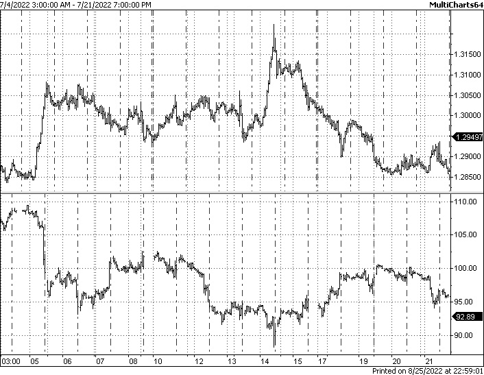

# 第六章：基本面分析的基础及其在 FX 交易中的可能用途

我确信，几乎所有曾经对交易感到好奇的人都知道基本面和技术分析。正如许多流行术语一样，两者都存在很多误解。

很可能，你知道存在分析师这一职业，并且这个职业在金融行业中很受欢迎。你可能甚至考虑过自己从事这一职业，因为你听说现代分析师使用先进的计算机技术，并来自数据科学领域。然而，这两个概念之间存在一个关键的区别；因此，与每个概念一起使用的数学和计算机库存截然不同。此外，它们在实际交易算法中的应用也相当不同。让我们深入了解这两个概念，看看我们如何在我们的应用中使用它们（以及是否可以使用）。

我们将回顾基本面和技术分析的关键原则，了解市场如何对重要的经济、政治和其他事件做出反应，并熟悉分析价格行为的两种方法：一种基于非价格信息，另一种仅使用价格时间序列。

在本章中，我们将涵盖以下主题：

+   基本面分析

+   从基本面分析的角度看经济新闻

+   政治事件

+   行业特定信息

# 基本面分析 – 直观但实际应用有限

基本面分析的理念很容易理解：市场众所周知会对各种外部信息做出反应，因此让我们研究这种反应，以帮助我们预测市场行为。所涉及的外部信息取决于市场，可能存在显著差异。

让我们从显然对市场价格有明确影响的因素开始：经济新闻。

# 经济新闻

这是最知名的基本数据类型。用通俗的话说，经济状况越好，资产的价格就越高。例如，如果全国经济显示出增长，最流动的股票也会增长。是的，当然，有例外、细微差别等，但总体而言，主要宏观经济指标与股市增长之间存在正相关关系。

但等等，我们为什么在谈论股市，而我们真正感兴趣的是**外汇**（**FX**）呢？

在外汇市场中，如**国内生产总值**（**GDP**）、**失业率**、**核心价格指数**（**CPI** – 主要通胀指标）等经济指标并没有任何真正的长期影响。为什么？因为货币有一个使其与其他任何资产类别完全不同的特征：它们有**利率**。

要理解利率的概念，我们应该回忆一下将资金带入经济的机制。中央银行或类似的机构（如美国的联邦储备）**发行**货币。在早期，这意味着铸造硬币，然后印刷纸币，而今天，这也（主要是）意味着在电子数据库中进行更改。

但无论如何，资金流入经济的路径都要经过银行。中央银行不会免费向银行提供资金——银行以随后被称为**利率**的利率向中央银行支付**利息**。银行也会以不同的利率向他们的客户——零售商、企业和其他银行——贷款，这些利率当然高于他们从中央银行借款的利率。而且当你的经纪人提供信用额度以便利保证金交易（参见*第三章*，*从开发者的角度看外汇市场概述*，在*交易机制——一些术语*部分），他们并不是免费提供，而是以略高于他们可以借到的利率提供。

这种结构乍一看可能有点令人困惑，但你应该记住的关键点是以下这些：

+   在银行结算日之间，你当天所做的任何事情都不会计入任何利息

+   一旦你持有外汇头寸过夜，你要么支付利息，要么收取利息——这取决于交易货币对中货币之间的利率差异

让我们考虑一个例子。2007 年，日元可以以接近零的利率借出，而英镑的利率超过 5%，在 2007 年 7 月达到 5.75%。如果你在 2007 年购买了 GBPJPY——记住这意味着你通过卖出日元来购买英镑——你将每年获得大约 5%的利率差异，你将每晚**收取**这笔利息。相反，如果你在 2007 年卖出 GBPJPY，那么你将每晚**支付**利息。现在，将这些数字乘以经纪人提供的杠杆（而且回到 2007 年，在某些情况下，对于选定客户可以达到 700:1！）你可以想象一种外汇交易的圣杯，这被称为**持仓交易**。

持仓交易

持仓交易指的是购买一种资产并持有相当长的时间，不仅旨在通过在更高的价格卖出资产来获利，而且还收集利息。如果你对了解更多关于持仓交易感兴趣，我建议从 Investopedia 上的入门文章开始：[`www.investopedia.com/articles/forex/07/carry_trade.asp`](https://www.investopedia.com/articles/forex/07/carry_trade.asp)。

当然，套息交易不会持续太久，因为利率会变化，自 2008 年金融危机后引入的**零利率政策**（**ZIRP**）以来，套息交易已经大幅下降。然而，理解市场上的钱都不是免费的这一事实，有助于理解为什么宏观经济指标对货币市场的影响不像对股票和股权那样具有长期性。

尽管如此，宏观经济新闻对货币市场确实有一定的影响。这里的要点是，尽管股票和股权更多地受到经济新闻背景的影响，但它们都是**为了金钱**而购买的。因此，尽管不是立即的，利率也会影响股票和股权的投资成本。因此，重要宏观经济新闻的发布（尤其是 GDP、失业率和 CPI）受到货币交易者的密切关注，这就是为什么我们通常预期在这些经济指标发布前后货币价格会有快速变动。

为了说明这一点，让我们回顾一下历史上的几个例子。

## 美国非农就业人数

美国非农就业人数（**NFP**）是最受关注的几个关键宏观经济指标之一。它代表除农业外全国所有行业的就业岗位新增数量。通常，这个指标读数越大，被认为国家的经济状况越好。因此，股市通常随着新就业岗位的增长而增长，国内货币相对于其他货币升值。

在外汇市场中，我们经常观察到在美国 NFP 发布时价格急剧变动。这通常发生在发布的读数与之前预测值有显著偏差时。读数本身是正还是负并不那么重要。例如，如果预测预测新就业岗位增长 5%，而实际发布的值只有 2%，那么尽管这个值是正的，市场反应很可能是负面的——因为这个值低于预期。*图 6.1*显示了 2022 年 8 月 5 日美国 NFP 发布后几秒钟 EURUSD 价格变动的良好例子：

图 6.1 – 美国 NFP 发布后 EURUSD 的急剧价格变动

这种变动可以用流动性来解释（参见*第三章*，*从开发者角度的外汇市场概述*）。让我们一步一步地重建这种情况：

1.  在新闻发布前几分钟，流动性提供者更倾向于在发布前从订单簿中撤回流动性，以避免可能的损失。我们已经知道，流动性越少，价格变动越快、越大。

1.  在新发布的那一刻，订单簿中的流动性极低，几乎没有。价差可能达到正常水平的 10 倍，甚至更多。

1.  新闻发布后，价格接受者发送的第一个订单可能会大幅移动价格。这通常在实时图表上观察时被视为一个非常快速的跳跃。

1.  后续订单可能会进一步推动价格向原始方向移动，或部分或完全反转。

1.  在新闻发布一段时间后，流动性返回市场，价格变动的幅度恢复到中值。

让我们放大 8 月 5 日发生的事情，并查看个别逐点数据。*图 6.2*显示了美国 NFP 发布时刻的历史数据逐点：

图 6.2 – 2022 年 8 月 5 日美国 NFP 发布时 EURUSD 的逐点图表

因此，我们现在可以看到，在事件发生时，流动性如此稀薄，以至于价格在一个逐点中下跌了 20 点。

注意

这意味着实际上在 1.0210 和 1.0230 之间没有任何交易机会。如果你在那个时刻尝试发送市价订单，它很可能会以更低的价格成交，因为很可能你不是流动性池中最快的交易者。

## 国内生产总值（GDP）

让我们考虑另一个类似事件的例子——这次是 2022 年 8 月 12 日英国 GDP 数据的发布。*图 6.3*显示了 GBPUSD（英镑兑美元）的 1 分钟图表，展示了事件周围的价格变动。我们可以看到，这一次，情况不同；我们可以看到事件发生后（图表上的 8:00 a.m.，GMT+2 时间），价格急剧变动，但随后几乎立即下降，价格迅速回到了事件之前的价格水平：

图 6.3 – 2022 年 8 月 12 日英国 GDP 发布，1 分钟图表

让我们通过查看实际交易数据来看看市场发生了什么。*图 6.4*显示了同一事件周围的价格变动逐点图表：

图 6.4 – 2022 年 8 月 12 日英国 GDP 数据发布期间 GBPUSD 的交易图表

同样，正如美国 NFP 的情况一样，在这条经济新闻发布后，几乎没有流动性，因此，在发布后立即或发布前立即尝试交易真的是一个问题。我们可以看到，事件发生后 1-2 秒，价格稳定在一个比发布前大约高 16-20 点的价格水平。这意味着到那时，流动性提供者已经回到市场，但现在，他们的出价和要价比仅仅几秒钟前显著提高。

# 从基本面分析角度看的经济新闻

那么，在两种情况下，基本面分析师会说什么呢？让我们阅读一份典型的市场报告：

*“今天每周的首次失业救济金申请人数为 234k，高于早上 8:30 发布的预期 220K，对美元相对于其对手货币的影响微乎其微。我们将在上午 10 点发布 4 月份的现有房屋销售数据。市场参与者将对费城联邦储备银行行长哈克和亚特兰大联邦储备银行行长博斯蒂克今天在达拉斯会议上对昨日联邦公开市场委员会会议纪要的评论感兴趣。”*（来源：OFX，[`sitecore.prd.ofx.com/en-us/forex-news/daily-and-weekly-market-news/20180524/fomc-minutes-followed-up-by-fed-speakers-todays/`](https://sitecore.prd.ofx.com/en-us/forex-news/daily-and-weekly-market-news/20180524/fomc-minutes-followed-up-by-fed-speakers-todays/).）

我们在这里只能看到一些已知事实的陈述，以及对*市场参与者*将*感兴趣*的模糊提及。因此，这种分析对实际即时交易没有用处：它没有给我们任何关于可能的价格变动情景的想法，这些情景可能被利用。

机构基本面研究要复杂得多，包括许多因素，但长期来看，它们只能产生长期预测或投资建议。这是因为现代市场之间联系紧密，这些联系非常复杂（同时，影响市场价格的因素数量众多），使用宏观经济事件的基本面分析进行实际交易变得非常困难。

那么，这意味着我们可以安全地忽视基本面分析和宏观经济事件吗？

当然不是！

上述例子清楚地说明了在重要经济指标发布时，外汇市场在其微观层面通常会发生什么。虽然很难预测新闻发布后价格变动的确切方向，但我们可以说，几乎有 100%的概率，会有流动性不足和价格剧烈波动，总体而言，进行交易将非常危险。我从不建议您轻信我的话——我鼓励您下载历史外汇价格数据以及过去经济事件列表，并查看在重要指标发布时此类价格行为的其他例子。您自己会看到的：在 10 个案例中，有 9 个案例只证实了以下重要结论。

注意

请避免在重要宏观经济新闻发布时进行交易。如果您的交易逻辑建议您保持已开放的头寸，您可以这样做，但在事件前后直到流动性返回订单簿之前，请避免立即开仓或平仓。

# 政治事件

政治事件（如总统选举、战争、全球条约和宣言等）也会影响市场，此类事件前后价格行为与对常规经济新闻的反应有些相似。这并不令人惊讶，因为背后的机制是相同的——众所周知，这是一个重大事件，没有人愿意承担过度的风险，流动性提供者从账簿中撤出流动性，任何新的订单，即使规模很小，也可能瞬间将价格推至任何位置。

政治事件与常规经济事件之间的区别可能在于事件发生后价格波动的持续时间。让我们考虑几个例子。

## 美国总统选举，2016 年 11 月 8 日

在这一天，唐纳德·特朗普当选美国总统。他的胜利并不顺利：他是唯一一个在普选中失利但仍当选的第五位总统。因此，如果我们查看那天 EURUSD 的图表，我们可以清楚地看到市场情绪是如何从乐观（认为特朗普不会赢）转变为悲观（当开始变得明显他的胜率高于预期时）。*图 6.5* 以一分钟图表的形式讲述了这个史诗般的故事：

图 6.5 – 唐纳德·特朗普选举当天 EURUSD 的一分钟图表

我们可以看到比我们在常规经济新闻发布期间观察到的价格波动更加稳定。首先，价格在 3-4 小时内上涨了近 300 点，这对于这个市场来说是非常大的，这种波动是由希拉里·克林顿将赢得比赛的预期所推动的。但随后，大约午夜时分，情况变得不那么明确了，当美国有线电视新闻网在凌晨 2:30（图表上标记为垂直红色线条）正式宣布特朗普获胜后，美元价格急剧上升（别忘了我们是在看欧元兑美元的汇率：美元越高，汇率越低——因此，当我们说“美元上涨”时，从视觉上看，EURUSD 的图表就会下降）。

## 英国脱欧，2016 年 6 月 23 日

2016 年充满了前所未有的政治事件，而英国脱欧无疑是其中之一。对于这次公投的可能结果没有明确的共识，但所有分析师都同意，如果英国离开欧盟，其国内货币（英镑，GBP）的价值将急剧下降。这正是发生的事情，我们可以通过查看那天 GBPUSD 的一分钟图表来回顾这一场景：

图 6.6 – 英国脱欧当天 GBPUSD 的一分钟图表

你可以看到，官方民调结果的公布导致 GBPUSD 汇率在 2 分钟内下跌了 600 点。这是整个外汇市场历史上主要货币对中最快的波动之一。这次急剧下跌在随后的 20-30 分钟内几乎完全被回补，再次，这并不令人惊讶，因为流动性正在回归市场。然而，随后的下跌价格运动持续了不止几分钟，甚至不止几小时，而是持续了数日。因此，至少从理论上讲，英国脱欧再次提供了一个投机交易的机会——在脱欧日卖出 GBPUSD，然后在几小时或甚至几天后平仓。

我们可以看到，重大政治事件与常规经济指标发布之间的主要区别是，前者的价格波动持续时间更长。因此，这些事件可能是基本面分析真正起作用并帮助我们获利的最理想时机。

现在我们已经考虑了所谓的“所有市场”的新闻，那么让我们快速了解一下仅影响某个市场，有时甚至某个特定资产的基本面因素。

# 行业特定信息

通常，这类基本面信息几乎不会影响货币汇率，因为其影响范围太窄。你可以将货币视为最大的市场指数，它包括一个特定国家的所有行业和经济的各个方面，并将它们与另一个国家的货币对进行比较。大多数发达国家都竭尽全力保持其经济的平衡和多元化。因此，如果只发生某些事情，比如，仅在微电子、汽车制造、农业或医疗保健领域，嗯，是的，它可能只会对汇率产生非常有限的影响，但这种影响将非常小，几乎可以忽略不计，因此，货币交易者通常不会考虑这类基本面信息。

尽管有一些明显的例外。有些国家的经济与仅一个或两个行业紧密相连。对于这些国家，特定于关键行业的基本面因素确实会影响整个经济。让我们考虑一个最突出的例子，看看行业特定新闻和单一商品的价格如何可能与国内货币汇率高度相关。

## 原油与加拿大元

加拿大经济与石油紧密相连是众所周知的。加拿大元兑美元汇率与原油价格表现出强烈的关联性并不足为奇。*图 6**.7*清楚地展示了这种关联。

注意

为了做到“货比三家”，我们需要在同一张图表中用相同的货币来报价这两个工具。然而，在下面的图表中并非如此。加拿大元的汇率以 USDCAD 表示，这意味着*一加元中有多少美元*。因此，顶部的图表显示的不是以美元计价的加拿大元，而是以加元计价的美元。而底部的图表显示了美原油的价格。因此，我们应该（在心理上）反转顶部的图表，以便两个工具（加元和美原油）都使用相同的货币（美元）报价。

图 6.7 – 加拿大元和油价显示出强烈的关联

在这个图表中，我们可以看到从 2018 年中到大约 2021 年底的加拿大元和美原油的每日图表。我们可以看到，底部的图表非常接近顶部图表的镜像版本，如果我们记住 USDCAD 的汇率是*镜像*到 CADUSD 的话，这显示了非常高的正相关。

此外，即使我们放大并查看日内数据，我们仍然会看到加拿大元和美原油之间强烈的关联。*图 6.8*展示了在 1 小时图表中这种关联的一个例子（别忘了，我们应该反转 USDCAD 的图表，以便比较两种价格都以美元计价）。

图 6.8 – 美元加元和美原油的日内（每小时）图表

因此，我们可以假设来自石油行业的基本面因素可能影响 USDCAD，并且可能被用于交易这一货币对。

# 摘要

我们可以看到，基本面因素确实会影响货币的价格，但我们也可以看到使用这些因素进行自动化交易的关键问题，例如：（a）宏观经济新闻的发布大多导致价格运动的不可预测方向，这些运动通常不足以进行交易，并且持续时间不长；（b）政治事件导致价格运动时间较长，并且可能可以进行交易，但它们很少发生，手动交易它们比程序化交易更容易；（c）使用行业特定的基本面因素可能是最有希望的，但需要对相关行业进行彻底分析，并且仅适用于特定货币。

在任何情况下，系统交易者（那些基于一套规则而不是直觉或情绪来进入和退出位置的交易者）长期以来一直在寻找一种替代的、*定量*分析市场数据的方法，而不是*定性*基本面分析。这种定量分析可以开辟许多新的机会，因为它消除了人为的判断、情绪和任何偏见，因为所有交易决策都仅基于数字。这种定量分析被称为**技术分析**。我们将在下一章中了解更多关于这种分析类型的内容。
