# 7

# 技术分析及其在 Python 中的实现

在上一章中，我们考虑了基本因素，并看到了它们如何可能影响市场价格。我们指出，尽管这种影响可能非常显著，并且可能对交易非常有利可图，但大多数时候，很难提出一个能够生成明确的交易规则（何时进入市场、朝哪个方向以及何时退出）的定量模型，而这些规则不需要人为判断。为了清楚起见，请注意，存在各种完全定量的方法来评估基本因素，甚至包括政治因素，但它们基于复杂的跨学科主题，如语义分析，因此需要对这些科学有扎实的知识。是否有可能避免这种复杂性，并找到一种仅使用价格数据来分析市场行为的方法？或者，也许，一些额外的数据，但仅以数字形式？

答案是肯定的，这种市场分析被称为**技术分析**。在本章中，我们将考虑其前提，了解最常见的技术指标，并发现它们如何被用来定量描述市场上发生的过程。我们还将考虑关键技术指标在 Python 中的实现，并介绍滑动窗口的概念，该概念将在所有未来的代码中使用。

在本章中，你将学习以下主题：

+   技术分析——适合计算，但缺少真实市场过程

+   动量和 RSI 作为衡量市场速度的指标

+   数字滤波器和移动平均线

+   范围指示器

+   波动性指标

+   在 Python 中实现技术指标

# 技术分析——适合计算，但缺少真实市场过程

技术分析（或简称**TA**）的基础主要思想是*价格包含了一切*。从这个角度来看，如果我们看到价格上升或下降，大或小，我们并不真正想知道这种运动的背后原因；相反，我们只是承认它是由于某些基本因素造成的，并试图仅关注观察到的价格运动相关的未来价格走势。

当然，技术分析可以分析一系列数据，而不仅仅是单个数据点。在这方面，技术分析研究有助于识别价格时间序列中的*模式*或重复的序列，它们彼此相似。技术分析建议，如果我们观察到过去已经看到的模式，那么接下来的价格走势也将类似于过去发生的情况；因此，我们可以做好准备并利用它。

使用技术分析（TA），我们不想也不需要知道影响价格的实际基本因素，我们只是在寻找幕后发生的事情的*痕迹*，然后根据这些痕迹的形式采取行动。

现在我们已经了解了基本面分析和技术分析基础上的差异，让我们看看这种差异如何影响任何市场分析的两大主要实践点：其时间范围和精度。

基本面分析侧重于宏观经济因素，这些因素在本质上总是长期性的，因此基本面预测的时间范围通常是几天以上，直至数年。相反，技术研究可能分析极其短暂的过程（例如，订单簿中的即时不平衡），因此，技术研究的预测范围可能为 1 秒、1 毫秒，有时甚至几微秒，这是正常的。

基本面分析和技术分析之间的主要区别总结在下表中：

|  | **基本面分析** | **技术分析** |
| --- | --- | --- |
| 关键关注点 | 宏观经济、政治、行业新闻和投资者的情绪 | 价格、成交量、开盘兴趣、价差、流动性和其他定量参数 |
| 预测范围 | 天到年 | 微秒到天，很少见的是周和月 |
| 预测精度 | 非常波动 | 取决于时间框架 |

表 7.1 – 基本面分析和技术分析的关键区别

任何技术分析研究的基石是一个**指标**。它是由价格、时间、成交量以及/或任何其他可以定量测量的市场数据组合而成的。

指标通常以线条、点、直方图和其他图形对象的形式绘制在价格图表上，位于价格图表下方，或者两者都有。通常，技术分析师使用两个到五个指标，每个指标都显示所考察的价格时间序列的特定特征。*图 7.1*显示了这种技术分析指标组合在单个图表中的典型例子：

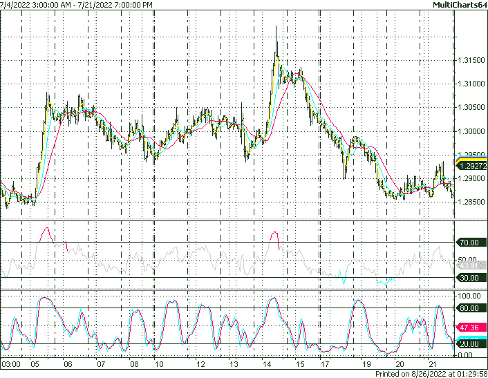

图 7.1 – 技术分析指标与价格图表的典型布局

过度使用技术分析指标可能导致混乱，真的很难理解每个指标显示的是什么，以及这个混乱的作者真正想要实现什么。你可能无法相信，但下图中所示的例子不是我的幻想，而是我在各种交易论坛上亲眼所见多次的类似情况！

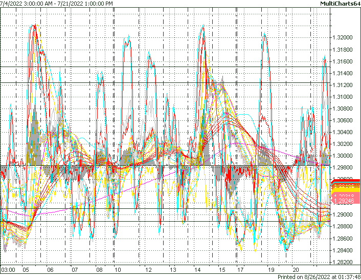

图 7.2 – 过度使用技术分析指标可能导致滥用

所有技术分析指标都有一个共同点 – 它们的值总是与它们所基于的原价时间序列保持同步。

这意味着如果我们基于 1 分钟图表构建一个指标，那么这个指标的价值将每分钟更新一次；对于小时图表，值将每小时更新一次，依此类推。

如您所见，如果我们使用 tick 图表作为计算技术指标值的源数据，那么这些值将在每个 tick 上更新。当我们处理实时数据流时，技术指标对于所有历史柱显示固定、未更改的值（嗯，我们无法改变历史，对吧？），但对于尚未完成的柱，会随着每个新 tick 的到来更新最新的读数。

不论它们的复杂性如何，几乎所有技术指标都可以分为四大主要类别：市场速度、数字滤波器、范围指标和波动性指标。让我们逐一考虑它们。

在我们继续之前，请注意一个重要事项

在所有以下关于技术指标讨论中，我们将使用术语**当前柱**。这并不意味着我们只谈论图表上最后的（最右侧）柱。这意味着当我们绘制图表、指标、回测策略等时，我们总是从左到右移动（想象中），从历史较老的数据到历史当前的数据，并且我们在遇到的每一根柱上计算任何东西。这根柱，对于我们在此时计算任何值的，被称为**当前柱**。我们使用这个术语是因为当我们将我们的开发上线时，当前柱实际上将意味着我们此刻收到的价格数据，所以我们不需要在我们的研究或策略代码中做任何修改。

在这个重要事项的提示下，让我们继续前进。

## 市场速度

这些指标试图回答问题，“价格移动有多快？”。确实，如果我们比较外汇市场的一个正常平均日与重要经济新闻发布或政治事件，那么我们可以清楚地看到差异。当然，能够定量评估这种差异会更好。我们将仅考虑这类指标中最著名的两个——动量和 RSI——但任何更复杂的市场速度指标都将不可避免地建立在相同的原则之上。

### 动量

这可能是最古老的技术指标，并且绝对是最简单的。一个简单的公式真的很难想象：

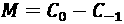

在这里，*C*0 表示当前收盘价，而*C*-1 表示前一根柱的收盘价。

如果我们为每一根柱计算这些差异，将它们存储在一个数组中，并在图表下方绘制指标，我们会看到其值不再跟随价格变动，整体上看起来更像噪声，而不是一个清晰的趋势价格模式。然而，这种噪声非常有信息量。即使快速浏览*图 7.3*，我们也可以得出几个重要结论：

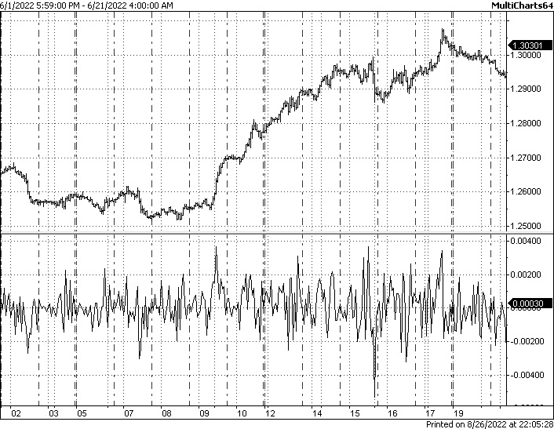

图 7.3 – 基本动量绘制在价格图表下方

首先，我们可以看到动量的读数很少连续超过两个或三个数据点。由于动量的值是两个相邻柱子的当前和上一个收盘价之间的差异，我们可以说，在这个市场中，价格连续增长或下降超过三根柱子是不寻常的。换句话说，如果我们看到超过两根柱子收盘价上涨，我们可能会预期一根柱子收盘价下跌，而不是另一根柱子收盘价上涨。技术分析师将这些柱子称为**纠正**；它们甚至可能出现在相当长且稳定的趋势中，如*图 7.3*所示，但它们不会打破趋势。因此，总的来说，我们可以说这个市场真的很容易发生纠正。

其次，如果我们估计动量指标的范围，我们可以看到它在不同的市场阶段是不同的。当市场保持或多或少*平稳*（图表的开始部分）时，动量的幅度几乎没有超过 0.002 点，但随着上升趋势的发展，其绝对值增加到 0.004 – 也就是说，是*闲置*市场的两倍。因此，我们可以假设*市场速度*与市场阶段有一定的相关性，并且我们可以在自己的研究中潜在地使用它。

通常，动量指标有一个参数 – 我们计算差异的柱子数。在本节开头提到的经典公式中，我们比较了两个相邻柱子的收盘价；当然，我们可以比较当前柱子的价格与过去任何柱子的价格。如果我们继续对每一根柱子这样做，我们将得到一个修改后的公式：

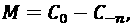

在这里，*n*表示从当前柱子往回数的柱子数。

例如，如果我们把*n*设为 24，那么我们计算当前柱子和 24 小时前的收盘价之间的差异（对于一个小时图来说，这意味着严格 24 小时或 1 天前的价格），我们将看到一幅不同的画面，如图*图 7.4*所示：

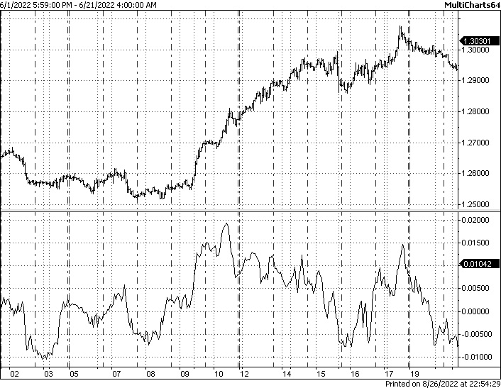

图 7.4 – 基于小时图的 24 小时动量表示 24 小时的价格变动率

我们可以看到，*市场速度*，或者说 24 小时的价格变动率，与前一张图表中我们考虑的两个相邻柱子的收盘价差异完全不同。这里不再有*噪声*；相反，我们观察到动量值的长周期变化。但之前我们做出的观察（关于*市场速度*与范围/趋势市场之间的纠正和相关性）仍然有效，因为这些现象的规模和比例只是增加了。

因此，总结一下，动量指标对于确定市场闲置阶段（当其读数接近零时）和高度活跃的市场（当其读数超过某个阈值时）是有用的。然而，我希望你能看到这个指标在当前形式下的明显不足——要决定当前市场是否活跃，我们必须指定我们刚才提到的这个*特定阈值*。

这个阈值是什么？在第一个例子（*图 7**.3*）中，动量值从未超过 0.006，而在第二个例子（*图 7**.4*）中，它达到了几乎 0.02，这是*一个数量级*的差距。因此，如果我们说市场速度超过 0.004 是*异常大*的，那么我们必须同意在第二个例子中，市场有一半的时间处于*异常大*模式。

对于经典动量指标，没有这样一个作为单一唯一数值的阈值。它取决于市场、数据分辨率和动量周期。如果能自动调整阈值值，而不需要每次都手动进行，那就太好了，从而消除可能的人为判断偏差。

那么，我们如何在设置这样的阈值时消除主观性呢？

### RSI

在上一节讨论的关键问题“*是否足够大或仍然很小*”的问题，在 1978 年由*J.* *Welles Wilder Jr.*为动量指标解决了。在他的著作《新技术交易系统概念》中，他介绍了**相对强弱指数**（**RSI**），这是一种新的技术分析指标，他建议使用它来确定市场的*超买*和*超卖*状态。在他的术语中，*超买*对应于价格增长*过快*的情况，基本上意味着我们之前讨论的市场速度太高。*超卖*区域对应于价格下跌*过快*的情况，意味着动量在绝对值上仍然大于平均水平，但带有负号。

RSI 通过*归一化*其值来解决为动量指标指定一个通用阈值的难题。归一化是一个将数据缩放以便所有值都适合一定范围的过程。例如，我们有两个数据集：

```py
{0, 1, 2, 3, 4, 5, 6, 7, 8, 9, 10}
{0, 0.1, 0.4, 0.05, 0.1, 0.3, 0.2}
```

我们希望能够比较*苹果与苹果*，因此我们希望将它们都缩放，使得每个数据集的最小值和最大值相同。通常，使用 0 到 100 的范围（这很方便：如果我们将数据归一化到这个范围，我们就可以将值视为百分比）。因此，如果我们将第一个数据集缩放到*0:100*的范围，我们将得到一个明显的序列：

```py
{0, 10, 20, 30, 40, 50, 60, 70, 80, 90, 100}
```

但当我们缩放第二个数据集时，`0`仍然是`0`，最大值，即`0.4`，变成了`100`，因此缩放系数是`100/0.4 = 250`。然后，归一化后的数据集将如下所示：

```py
{0, 25, 100, 12.5, 25, 75, 50}
```

现在我们可以比较，例如，两个数据集数据点的变化率，尽管最初第二个数据集包含的值比第一个数据集小*一个数量级*。

因此，技术分析指标标准化的想法是*自动*缩放它们，使它们的值始终保持在*0:100*范围内，有时是*-100:100*。让我们为动量做这件事。

威尔·威尔德建议分两步计算 RSI：首先，我们计算**相对强度**（**RS**），然后计算 RSI。

注意

不要忘记，与其他任何技术分析指标一样，RSI 使用*周期*，这是一个确定我们考虑的数据点数量的参数。在前一节中动量指标的第一个例子中，周期是 1，而在第二个例子中，它是 24。

要计算 RS，我们首先应该计算该期间的*盈利*和*亏损*。在威尔德的说法中，盈利发生在柱状图收盘价上涨时，亏损发生在柱状图收盘价下跌时。然后，我们分别计算盈利和亏损的平均值。最后，我们计算该期间的相对强度：

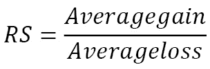

这个公式与原始动量类似，只是动量衡量的是价格的*差异*，而 RS 衡量的是*比率*。当我们想要摆脱原始值域的依赖时，使用比率总是更受欢迎，例如从 0.1 中减去 0.01 将得到 0.09，而从 100 中减去 10 将得到 90，很明显 90 和 0.09 相差*4 个数量级*，因此无法直接比较。然而，将 0.01 除以 0.1 和将 10 除以 100 会产生完全相同的结果，即 0.1，因此从市场速度的角度来看，这个值确实是相同的。

现在，我们通过保持 RS 始终在 0 到 100 的范围内来标准化 RS：

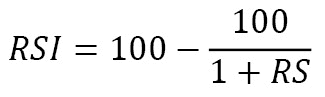

如果我们现在将 RSI 与动量在同一张图表上绘制，我们可以看到这两个指标非常相似：

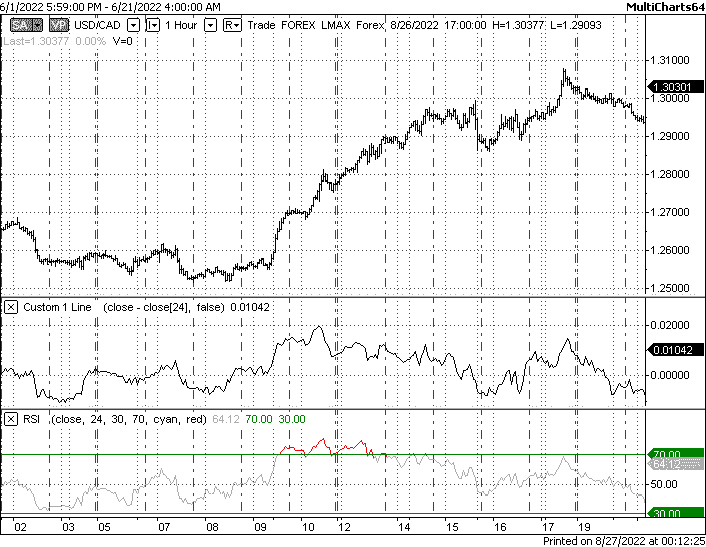

图 7.5 – 动量（顶部）和 RSI（底部）在同一价格图表上绘制

由于 RSI 被标准化到 0 到 100 的范围内，通常，高于 70 的值被认为是*超买*的市场，而低于 30 的值则被认为是*超卖*。在前面的图表中，*超买*的市场对应上涨趋势，而*超卖*状态的不存在可以解释为市场情绪强烈的看涨倾向。

市场速度指标比动量和 RSI 更多，但它们都用于确定以下市场状态：

+   悠闲与活跃市场（价格移动缓慢或快速）

+   超买/超卖区域（价格*过高*或*过低*）

+   由于流动性问题导致的剧烈价格波动（动量图上的*尖峰*）

因此，动量对于检测相对短暂的市场情况是好的。但关于长期的东西呢？有没有指标可以显示给我们更全局的情绪，长期趋势？让我们继续探讨另一类通常用于此目的的技术分析指标。

## 数字滤波器

如果你听过任何类型的音乐，我希望你确实听过，那么你很可能熟悉高通滤波器、低通滤波器和均衡器。任何汽车音响、桌面或移动音频播放器都提供这种功能。我确实希望，如果你在一生中至少调整过一次音频设置，你会记得如果你关闭高音并将低音提升到最大——那就是，你现在听到的不再是音乐，而是只有*砰砰砰*的声音。

然而，如果你想要专注于节奏、低音线，也许还有和弦和基音（而不是泛音）的话，截断更高频率的数据也可以非常有用。这正是许多技术分析师梦寐以求的——从市场价格中剥离所有*噪声*，只留下*低音线*或*节奏*——也就是说，关键趋势和持续时间相对较长的主要价格变动，这可能会带来利润。

惊讶或不惊讶的是，所有执行这项工作的技术分析指标都和音频中的低通或高通滤波器*完全相同*，因为它们基于*完全相同*的数学原理。这就是为什么我们将它们都放在一个部分：数字滤波器。

### 移动平均线

移动平均线也是最早的技术指标之一。它是通过计算周期内的价格平均值来计算的，并且在每个柱上重新计算。

注意

当我们讨论技术分析指标时，我们总是使用两个术语：*周期*和*当前柱*。所以，让我快速提醒你一下，一个*周期*指的是技术分析指标分析的数据点（tick、柱、任何其他时间序列样本）的数量，而*当前柱*会一个接一个地变化，从左到右，随着我们重建指标的历史值以及市场价格本身的历史值。

为了给你一个简单的例子，让我们考虑以下数据集：

```py
A = {0, 1, 2, 3, 2, 1, 0, 1, 2, 3}
```

让我们从最左边的一个数据点开始计算三个数据点的平均值。对于原始数据集中的第一个元素，这是不可能的，因为我们只有一个数据点，而我们需要三个。第二个数据点也是如此。因此，我们可以从第三个数据点开始计算移动平均线，其值如下：

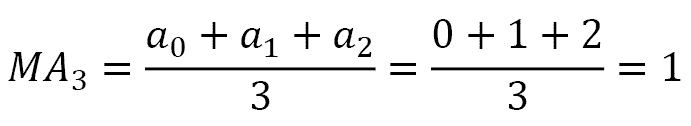

然后，我们移动到第四个数据点，并再次计算移动平均线的值，但这次，我们从我们的数据集中的第二个元素开始计算：

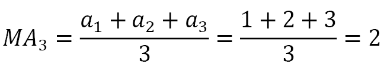

按照这种方式进行，我们将得到一个新的数据集，它表示连续三个数据点的平均值，并从左到右对每个数据点重新计算。因此，对于前两个数据点，我们没有任何值（因为原始数据点的数量不足以计算三个点的平均值）：

```py
= {NaN, NaN, 1, 2, 2.33, 2, 1, 0.66, 1, 2}
```

注意

我希望你们已经明白了：我们总是从数据集中取三个样本，计算平均值，将这个值存储在新数据集中，然后继续下一个样本。这种技术被称为**移动窗口**，是所有技术分析指标计算的基础。

通常，**移动平均线（MAs**）是基于柱状图的收盘价计算的，但没有任何东西阻止我们使用其他价格（如高、低或交易）或非价格数据（如成交量、流动性等）。

显然，周期为 1 的移动平均线等于原始时间序列。那么，周期更长的移动平均线的值将如何对应原始数据？

让我们以点而不是柱状图的形式绘制原始价格时间序列，其中每个点将表示柱状的收盘价。然后让我们绘制 3 个不同的移动平均线，分别以 2、3、5 和 10 个周期与原始序列一起绘制：

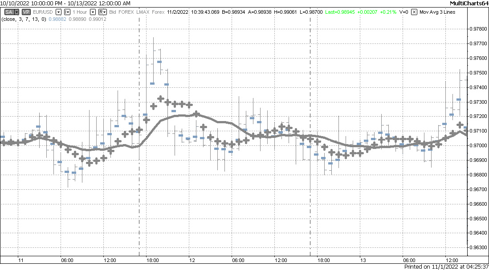

图 7.6 – 在 EURUSD 收盘价 1 小时图表上绘制的 3、7 和 13 周期移动平均线

*图 7.6* 以柱状图形式绘制原始时间序列，以及 3、7 和 13 周期的移动平均线分别以虚线、交叉线和实线表示。我们可以看到，移动平均线的周期越小，其值越接近原始序列，周期越大，移动平均线值的变动就越*平滑*。

这种*平滑*正是低通滤波器的效果。令人惊讶的是，使用简单数学计算的移动平均线*确实*是一个数字滤波器，与音频处理中使用的那些相当接近。移动平均线的周期越长，通过该滤波器的最大频率就越低。因此，如果应用于音频信号，这样的滤波器将只留下*砰砰*声，现在我们可以在市场价格中看到这种*砰砰*声。最终，使用 20、50 或 200 周期的移动平均线将只显示市场价格的长周期变化，将较小的价格变动视为高频噪声。

*图 7.7* 展示了 EURUSD 的相同小时图表，只有收盘价，以大黑点表示，并在其上方绘制了 20、50 和 200 周期的移动平均线：

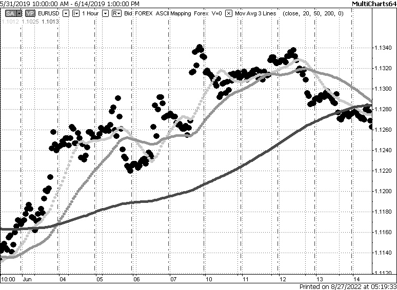

图 7.7 – 在 EURUSD 收盘价 1 小时图表上绘制的 20、50 和 200 周期移动平均线

在这个例子中，我们可以看到，周期最长的移动平均线（200）只随着增长率的一点点变化而增长，而周期较短的移动平均线则增长和下降，移动平均线的周期越小，其值就越接近原始序列。

因此，移动平均线是最简单的数字滤波器，旨在检测*趋势*而不是即时活动。它们在技术分析（TA）中用于解决以下问题：

+   为了确定长期和中期趋势

+   为了区分牛市和熊市（通常，当每日价格收盘价高于 200 周期移动平均线时，市场被认为是牛市，反之亦然）

+   为了平滑偶尔或异常剧烈的价格波动

非常常见的是，移动平均线（MAs）与动量指标结合使用 – 例如，移动平均线可以用来判断市场是否看涨（收盘价高于 200 周期移动平均线），而动量可以确定市场速度高的时刻，因此，这可能是一个买入的好时机。

然而，你可能已经听说过那些在价格已经过高时买入或价格已经过低时卖出而损失财富的交易者。我希望现在我们已经彻底研究了市场速度指标和数字滤波器的设计，你已经发现了这里的瓶颈 – 过高或过低。但我们是怎样决定它已经过高或仍然不算高呢？答案将在下一节中揭晓。

## 范围指标

解决识别当前价格是否处于任何极端区域（过高或过低）的最常见方法之一是使用范围指标。通常，**价格范围**是最高价和最低价之间的差异，嗯（我确信你说过），在一个*周期*内。像往常一样，与技术指标一样，我们被限制在某个时间段内，一个沿着图表从左到右滑动的移动窗口。因此，当我们谈论范围时，我们必须定义这个范围是针对哪个周期计算的。

让我们看看*图 7*.*8*中显示的图表。矩形显示了 24 个周期内的最高价和最低价（由于这是一个小时图表，这意味着矩形对应 1 天）：

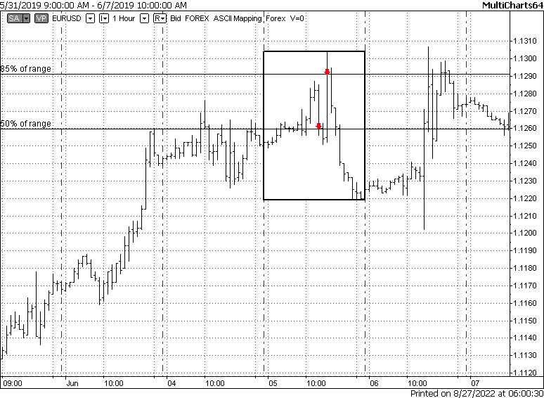

图 7.8 – 24 小时价格范围，显示为范围百分比的 2 个收盘价，EURUSD，1 小时

两个收盘价用小箭头标记。通过这些收盘价画水平线，以可视化价格水平相对于范围而不是绝对值。因此，对于第一个（从左到右）收盘价，绝对值是 1.1260，但相对于范围，它正好是 50%。第二个收盘价是 1.1292，但相对于范围，它大约是 85%。

明白了？我们可以用相对价格水平来代替没有太多信息的绝对价格值，这些水平可以解释得和解释 RSI 值（见*RSI*部分）差不多。例如，我们可以说，当价格高于范围水平的 80%时，那么价格就是*过高*的，而当价格低于范围水平的 20%时，那么价格就是*过低*的。

最著名且广为人知的范围指标是 **随机振荡器**。

### 随机振荡器

**随机**在交易者中是一个非常流行的词，但不幸的是，它经常被错误地使用。在数学中，*随机* 这个术语意味着各种随机过程。为了理解它的含义，让我们考虑一个例子。

如果你出去买一些面包，那么你很可能会走相同的街道，在同一个当地杂货店结束你的路线，并且花费的时间与平时差不多。这是一个 *确定性过程* 的例子——尽管在路上可能会有一些 *波动* 或偏差（例如，你决定走这条或那条街道），但整体路线和目的地保持不变。

现在，想象一下，你出去时没有特定的目标，在任何你喜欢的商店、酒吧或电影院停下来，在每个地方花费任意时间，并通过抛硬币来决定下一步去哪里。每次你进行这样的旅行，其轨迹、目的地以及在每个阶段和整个旅程中所花费的时间都会不同。尽管你旅行的区域是有限的，并且你访问了相同的地方，但由于你决策的 *随机性*，你实际移动的地图将会不同。这样的过程被称为 *随机*、*随机* 或 *概率*。

许多研究人员也将市场价格变动视为随机或随机过程，他们提出了各种概率模型来描述价格行为。尽管这种观点也可以受到批评，但这种学术辩论显然超出了本书的范围，所以我们应该从这次简短的 *抒情插叙* 中吸取的主要观点如下：

+   具有明确轨迹、目标和时间的过程被称为 **确定性**。

+   每下一步都有一定概率，并且你永远不知道它何时何地达到任何目标的过程被称为 **随机**。

+   市场价格的变化可以被视为一个 **随机过程**。

+   随机振荡器与 **随机过程** 没有任何共同之处。

随机振荡器在其原始形式中恰好显示了我们在上一节最后所考虑的内容——它显示了当前价格作为某个价格范围的百分比。因此，为了计算随机振荡器，我们应该选择一个周期（数据点数量），然后找到这个周期内的最高价和最低价，然后计算随机振荡器的值：

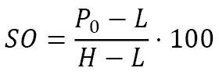

在这里，*P*0 表示当前价格，*L* 表示该期间内的最低价格，而 *H* 表示该期间内的最高价格。

让我们再次打开一个货币对的每小时图表，但这次，为了改变一下，我们来看日元，并在其下方绘制这个指标，周期为 24（因此跟踪价格作为一天范围内的百分比变化）：

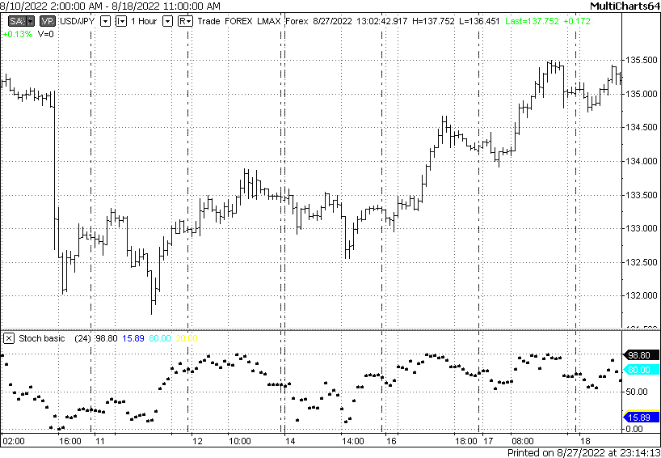

图 7.9 – 美元/日元 1 小时图表下的基本 24 周期随机振荡器

在*图 7.9*中，我们可以看到随机振荡器确实在 0 到 100 的范围内*振荡*（真是个惊喜）。在趋势期间（图片的右半部分），它倾向于保持在 50 以上，而在横向市场中（图片的中间部分）它可以全范围振荡。

那么，随机振荡器可能的用途是什么？

首先，它被用来回答价格是否*过高*或*过低*的问题（我希望你能记住上一节末尾的这个问题）。例如，我们可以这样说，当价格高于 80 的水平时——这意味着价格高于价格范围的 80%——那么它确实*过高*。同样，低于 20%的范围可能意味着价格*过低*。

其次，一些技术交易者喜欢使用随机振荡器及其类似振荡器来确定趋势。我们已经看到，在趋势期间，随机振荡器往往会保持在（对于上升趋势）或低于（对于下降趋势）范围 50%以上相当长的时间。因此，趋势是特殊的市场状态，其中价格修正幅度较小，持续时间比趋势方向的移动时间短得多。所以，价格确实会在范围的上下半部分保持许多小时、几天，有时甚至几周。

随机振荡器有许多修改版本。例如，将其值添加到移动平均线（我们记得我们可以将移动平均线添加到任何时间序列，而不仅仅是价格）给我们一个所谓的*慢速随机振荡器*。一些作者建议在同一图表上使用原始指标和平均指标，但本质仍然是相同的——这是一个范围振荡器，因此可以用来解决以下问题：

+   识别价格是否*过高*或*过低*

+   当价格高于或低于 50%的范围时，识别趋势作为长期时期

+   当振荡器从*过低*水平开始上升时，提出买入信号

+   当振荡器从*过高*水平开始下降时，提出卖出信号

现在我们有一个速度指标（动量或 RSI），它告诉我们市场正在快速移动，一个数字滤波器（移动平均线）确认市场的主要趋势仍然是积极的，以及一个范围指标（随机振荡器）显示资产目前超卖，看起来现在是买入的好时机。

但是！

即使我们将进入市场的时机计算得非常完美，市场仍然保持随机过程（记得本节开头我们提到的吗？）并且价格可能一段时间内对你不利是正常的。这里的关键问题是这种不利的价格变动是否只是一个小幅修正，并且明智地等待直到红色变为绿色，或者你的交易决策是错误的（顺便说一句，这也是绝对正常的），你应该在账户被完全耗尽之前平仓亏损头寸。

通常，这个问题是通过将波动性研究添加到交易策略逻辑中解决的。

## 波动性指标

如果我们查阅 Merriam-Webster 对波动性的定义，第一个建议的含义将是*快速且不可预测地变化的倾向*。听起来不错，但我们如何衡量这种倾向，这种变化的能力？

维基百科（[`en.wikipedia.org/wiki/Volatility_(finance)`](https://en.wikipedia.org/wiki/Volatility_(finance))）提出了不同的定义：*“波动性（通常用σ表示）是交易价格序列随时间变化的程度，通常通过对数收益的标准差来衡量。”* 如果你对数学统计学不熟悉，这可能会听起来像一门外语，但别担心，让我们快速浏览一下概率论的理论。

让我们用同样的例子，在酒吧和电影院周围进行随机漫步。让我们测量起点（你的家，假设）和终点（你决定当天结束散步的地方）之间的距离。每天，你都会得到不同的值，因为你随机做出旅行决定。然而，我们可以计算平均值，并说平均每次散步你走了大约三公里。

恶魔总是在细节中，平均的恶魔被称为**分散度**。这是衡量某个随机变量的实际值与平均值或*均值*差异的程度。让我们考虑两个例子。

首先，让我们回顾一下当你去当地杂货店时的确定性过程。我们记录每次旅行的距离，并将它们放入数据集中：

```py
S = {1.8, 1.9, 1.85, 1.79, 1.78, 1.81, 1.85, 1.82, 1.89, 1.2}
```

现在，让我们计算这个数据集的平均值：

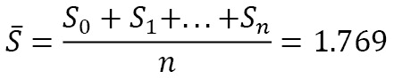

现在，从这个原始数据集的每个元素中减去这个平均值：

```py
D = {0.03, 0.13, 0.08, 0.02, 0.01, 0.04, 0.08, 0.05, 0.12, -0.57}
```

我们可以看到，几乎所有记录的值与它们的平均值之间的差异都比平均值本身小一个数量级。唯一的例外是`D`数据集中的最后几个值：它与平均值的差异与它本身的值相当。这样的值被称为**异常值**，最可能是由错误的测量或你在路上遇到的某些异常情况所解释。

现在，让我们记录你每次在本地酒吧和电影院周围随机漫步时走过的距离。在某些情况下，你几乎在你离开家的时候就能找到一个不错的住处；在其他情况下，你走了相当长的一段路，但仍然不满意地回到家，因此你每次走过的距离有所不同。我们将得到一个类似这样的数据集：

```py
S1 = {0.7, 2, 1.5, 0.3, 2.6, 1.1, 1.8, 0.45, 3.1, 2.9}
```

它的平均值是 1.645。如果我们现在像之前一样做（即从数据集的每个元素中减去这个平均值），我们会看到差异现在与平均值相当，在某些情况下，几乎超过了它：

```py
D = {-0.94, 0.35, -0.14, -1.34, 0.95, -0.54, 0.15, -1.19, 1.45, 1.25}
```

当值与其平均值之间的差异远小于值本身时，这个过程被称为**确定性过程**，现在我们有一个更数学化的定义（尽管它仍然不是正式正确的）。相反，当值与其平均值之间的差异与平均值本身相当的过程是一个**随机**或**随机**过程。

那么，回到市场相关的话题。如果我们对价格做同样的数学运算（例如，记录每个柱状图的价格变化，然后计算它们的平均值和差异），那么我们可以使用这个差异作为**波动性**的衡量标准。这确实符合 Merriam-Webster 的定义——所讨论的差异越大，值就越不可预测，价格的可能变化就越快。

在实践中，为了确定市场波动性，通常会使用稍微复杂一些的计算。用于估计“数据集的值与其平均值之间差异程度”的常用指标被称为**标准差**。如果您想了解更多关于它以及波动性概念背后的数学知识，我鼓励您首先阅读有关数学统计学的基础知识，以便熟悉术语和关键概念。维基百科上的文章（[`en.wikipedia.org/wiki/Mathematical_statistics`](https://en.wikipedia.org/wiki/Mathematical_statistics)）可以作为一个良好的起点。同时，我们以一种较为非正式的方式继续讨论，并记住标准差被用来估计任何随机过程以及特别是市场价格的波动性。

我相信你现在完全理解了**标准差**（或简称为**stddev**）也需要一个周期，就像其他任何技术分析指标一样。这个周期是我们用来测量波动性的数据集长度。因此，我们绘制的如下：

```py
S = stddev(close, 24)
```

这可以用以下形式的方程表示：

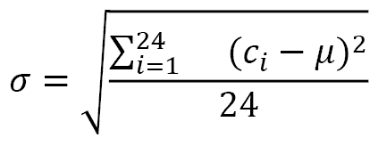

这里，*c*i 表示第 *i* 个柱状图的收盘价，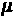 表示平均值，*24* 表示我们计算`stddev`的数据点（柱状图的收盘价）数量。

*图 7.10*显示了与上一个例子中相同的 GBPUSD 1 小时图表，但现在在下面添加了 24 周期标准差指标：

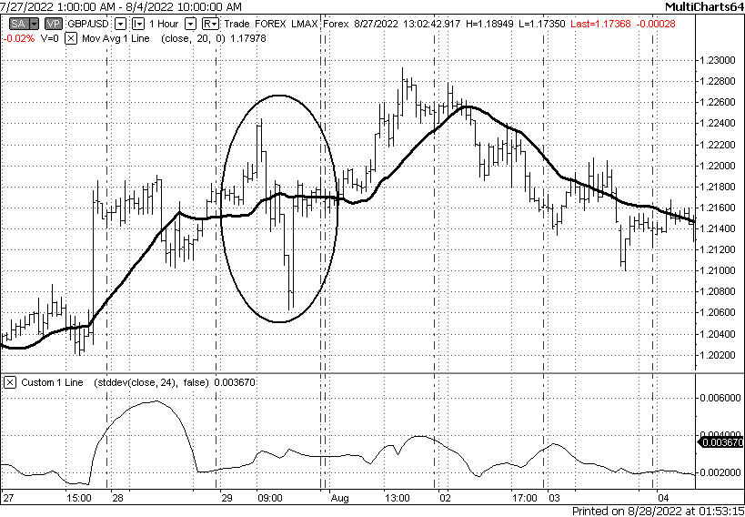

图 7.10 – GBPUSD 的每小时图表，显示收盘价的标准差

我们可以看到，波动性与市场价格的走势或趋势/横向市场制度之间没有明显的关联。尽管如此，我们可以观察到一些重要的观察结果：

+   标准差始终为正；它不考虑价格变动的方向

+   市场活动突然增加确实会增加收盘价标准差值

+   价格在新水平上停留的时间越长（参见 7 月 27 日的价格跳跃以及次日的拥堵区域），标准差值增加得就越大

+   `stddev`指标中的最大值和最小值与价格图中的最大值和最小值不对应

很有趣的画面，但这里有一个值得怀疑的假设，我希望你已经喊出了，“**等等！但我们测量的是错误数据集的标准差！为什么我们应该测量价格本身的标准差，而不是**价格变动**的标准差呢？”。

事实上，从多个角度来看，市场过程可以被视为一个随机过程。我们可以将每个收盘价视为随机过程的独立值，或者我们可以将价格变动视为随机游走过程，我们只对价格自上次观察（柱）以来变化了多少感兴趣。因此，我们与其计算**收盘价**的标准差，不如计算每个柱的**价格变动**的标准差：

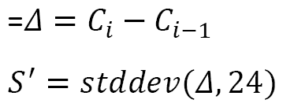

这里，*C*i 代表当前柱，*C*i-1 代表前一个柱，而 delta 符号代表每根柱的价格变动（正或负——这是与计算价格标准差的关键区别，因为它们只能为正）。

让我们看看收盘价的标准差和收盘价**差异**的标准差之间是否有任何区别。**图 7.11**仍然显示了 GBPUSD 的相同图表，其中两个标准差都绘制在其下方：

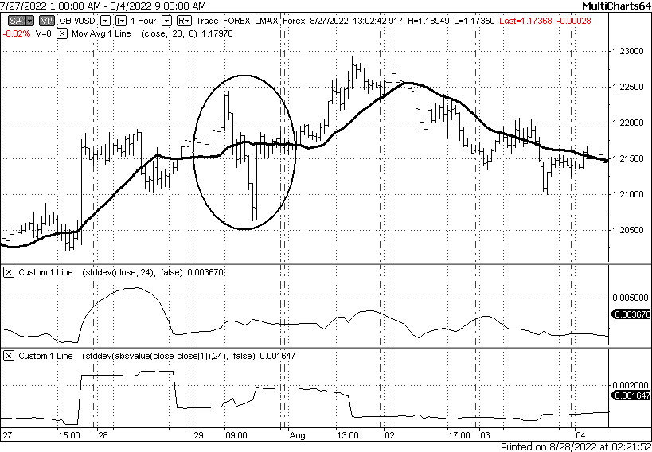

图 7.11 – 基于标准差波动性的两种版本指标

差异是微不足道的！波动性不再有**平滑**的变化。相反，我们观察到高波动性和低波动性突然从一个切换到另一个。现在这幅图更符合我们在市场上观察到的实际情况：

+   急剧的价格变动总是立即导致我们的波动性指标跳跃

+   高波动性通常意味着价格的反转

+   长期趋势（图表的右侧）伴随着低波动性（惊讶！）

突然的价格变动会导致波动率急剧增加的事实被用于*波动率突破*策略；其理念是在已经开始的急剧价格变动方向上买入或卖出资产。而波动率在趋势期间相对较低的事实被用于各种*趋势跟踪*或*均值回归*策略。

没有包括最著名且最受欢迎的技术分析指标之一，布林带，我们的波动率研究肯定是不完整的。

### 布林带

该指标由约翰·布林格在 1980 年代提出。其理念是确定资产价格是否位于*正常*范围之外。在这个指标中，*正常*范围被定义为平均值加减两个标准差（或两个*sigma*）。因此，布林带由*两条*线组成，一条始终位于价格之上（*B+*），另一条始终位于价格之下（*B-*）：

B+ = 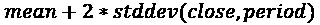

B- = 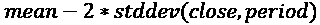

为什么是两个*stddev*而不是一个？如果你想了解正确、正式的答案，我建议你参考任何一本关于数学统计学的书籍或之前提到的相同维基百科文章。不深入细节，我们只需假设对于随机过程，90%的数据点都落在平均值*± 2* sigma 范围内。因此，布林带的理念是在距离平均值*2* sigma 的位置画线可以帮助隔离异常值——也就是说，那些位于*±2* stddev 范围之外的价格。

让我们看看现实中的样子。*图 7.12* 显示了一个带有 20 期布林带的 AUDUSD 1 分钟图表：

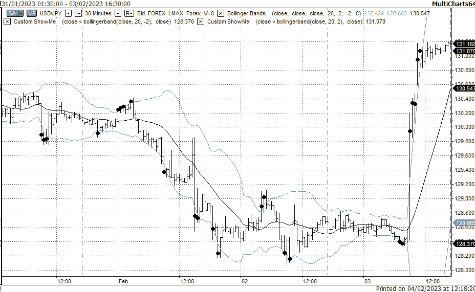

图 7.12 – 带有布林带的 AUDUSD 1 分钟图表

此图表表示平均值或移动平均（中间的实线）和两条布林带（上方的灰色线和下方的灰色线）。粗体黑点标记的是位于上轨之上或下轨之下的收盘价。这两者都是*异常值*。

技术交易者像使用其他技术分析指标一样，使用布林带用于各种目的，尽管如此：

+   异常值可以解释为突破——价格开始向某个方向移动的时刻——因此可以用于尝试买入或卖出*伴随*该移动的策略

+   异常值可以解释为流动性问题，因此被认为是均值回归的好点——因此可以用作买入或卖出*逆*当前价格变动的入场点

## 关键要点 – 技术指标的全部内容及其使用方法

技术指标的世界确实非常广泛。然而，其中大部分只是四种主要类型经典指标的变化形式：

+   动量，或*市场速度*

+   数字滤波器

+   范围

+   波动率

当你遇到一个承诺*神奇*结果的*独特*新指标时，别忘了这一点。首先对其进行彻底检查，你就会看到它实际上显示的内容。

不要忘记，没有任何指标能为你构建一个稳健的交易策略。它们仅用于定量识别市场中的各种情况，而如何实际利用这些情况在你的代码逻辑中，则取决于你作为交易策略开发者。

现在，是时候看看我们如何在原生 Python 代码中实现技术指标了。

# 在 Python 中实现 TA 指标

我相信你记得任何 TA 指标都使用一个特定时期作为参数。这个时期意味着我们考虑的数据点的数量。为了在每个条形图上计算指标，我们从最老的开始（图表最左边的一个），然后逐个移动，每次添加新的条形图来更新我们的数据集。

由于我们正在讨论一个所有 TA 基础都绝对必要的事情，让我在这里非常详细地说明——可能过于详细——但我希望以下概念和代码示例中没有任何歧义或误解。

让我们从时间序列处理的核心概念开始：滑动窗口。

## 滑动窗口

让我们回到上一节中考虑的随机游走（围绕酒吧和电影）的例子。整个数据集，或历史数据，由 10 个数据点组成：

```py
S1 = {0.7, 2, 1.5, 0.3, 2.6, 1.1, 1.8, 0.45, 3.1, 2.9}
```

现在，如果我们只想分析最近 3 天的活动，那么我们会得到以下子集：

```py
S1_1 = {0.7, 2, 1.5}
S1_2 = {2, 1.5, 0.3}
...
S1_8 = {0.45, 3.1, 2.9}
```

然后，我们逐个将 TA 指标应用于每个子集，从左到右，从旧到新。

这种技术被称为**滑动窗口**，是所有技术交易的基础，从绘制简单的指标到回测和优化。

## 提前查看

在使用滑动窗口处理历史数据时，主要问题是潜在的*提前查看*能力，或看到未来（参见*第四章*，*交易应用——里面有什么？*，在*交易逻辑——这里的一个小错误可能代价巨大*部分，关于提前查看问题的讨论）。如果我们从`S1`数据集（参见本章的*随机振荡器*部分）重建你的随机游走动作，我们应该特别注意*不要*在分析今天发生的事情时使用*明天的*数据。让我们给我们的数据样本添加日期以使其更清晰：

```py
S1 =  {{01/01/2001,0.7}
      {01/02/2001, 2}
      {01/03/2001, 1.5}
      {01/04/2001, 0.3}
      {01/05/2001, 2.6}
      {01/06/2001, 1.1}
      {01/07/2001, 1.8}
      {01/08/2001, 0.45}
      {01/09/2001, 3.1}
      {01/10/2001, 2.9}}
```

如果我们重建 2001 年 1 月 6 日或之前发生的事情，我们只能考虑前期数据。我们*不能，也不应该，没有权利*使用 1 月 7 日或之后的数据。如果我们这样做，我们将面临这种提前查看的问题。

现在，想象一下你正在开发一个交易策略，并想使用过去的数据对其进行测试。这种测试的目标是重建在特定时间那天，如果您的策略当时确实有效，会发生什么。如果你重建了你在 1 月 6 日会采取的策略，你就没有权利提前查看并使用 1 月 7 日的数据，即使是在测试日期后的 1 秒钟，因为你没有时光机（或者至少我是这样假设的），当你实时运行你的策略时，你也将无法从未来检索数据。

然而，意外地，提前查看是一个相当常见的错误，这就是为什么我在这里对此问题进行了如此详细的说明。记住，*如果你的策略产生了不切实际的优秀回报，那么它们很可能确实不是现实的，并且是由* *提前查看* *引起的*。

那么如何在不经意间偶尔提前查看呢？好吧，如果你将价格时间序列存储在列表或任何类似的可迭代结构中，并通过索引检索数据来进行计算，这非常简单。在先前的例子中，我可以通过调用`S1[4:7]`来获取 1 月 7 日的数据，同时测试 1 月 6 日的策略。即使你使用字典，你也可以通过使用错误指定的日期时间索引来检索错误的数据。

但话虽如此，有没有一种方法可以保证你的代码永远不会尝试从未来检索数据？让我们来看看！

## 提前查看问题的最终解决方案

要提出这样的解决方案，我们应该回想一下，当我们使用*实时*数据时，我们实际上无法从未来获取数据，因为交易应用会逐个接收跳动或任何其他数据包。因此，如果我们想在开发测试阶段完全保证不提前查看数据，我们可能需要模拟实际传入的数据流，并像计划与实时数据而不是存储在磁盘上的历史数据一起工作一样编写其余的代码。

向这种通用架构迈出的第一步是在*第五章*中，*使用 Python 检索和处理市场数据*，我们建议使用队列和线程来适应接收大量传入的跳动。现在，让我们从相同的角度来看待计算技术指标的问题。

我相信你记得，*任何*技术分析指标都是分析价格时间序列的一个子集，而这个子集的长度被称为**周期**。当我们查看图表时，我们总是注意到，为了在历史价格数据上重建指标值，我们需要将这个周期从左到右移动，从最老的数据点到最新的数据点。我们将这种方法称为**滑动窗口**。

但现在让我们思考一下，如果我们试图在市场数据实时传入时*即时*构建指标值，我们应该怎么做。没有历史，没有存储的值，只有实时跳动。那么我们如何创建这样的滑动窗口呢？

答案很明显：我们确实创建了一个*窗口*，但我们没有创建一个*滑动*窗口，因为没有可以滑动的东西。

让我们回顾一下队列是如何工作的（也参见*第五章*，*使用 Python 检索和处理市场数据*)。一般来说，队列是一个具有以下属性的列表：

+   当新元素到来时，它将被添加到队列的末尾

+   当我们从队列中检索一个元素时，它将从开始处取出并移除

现在，让我们创建一个特殊的队列，其中最旧的元素（那些在开始处的元素）不会被检索，而是在新元素添加时自动移除。让我们看看*图 7.13*中的图解，看看它是如何工作的：

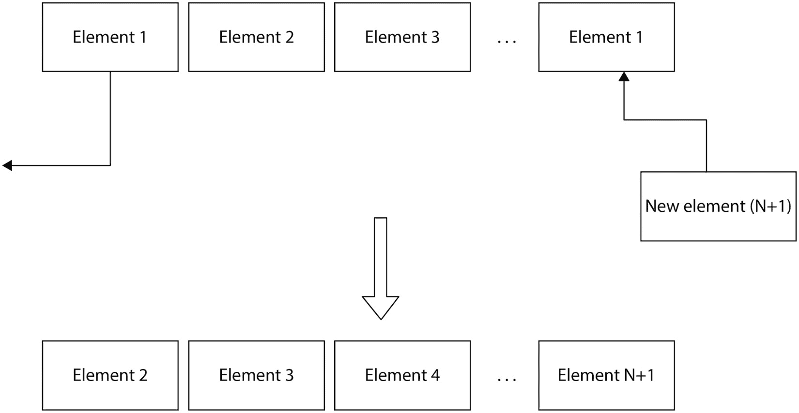

图 7.13 – 固定长度队列，新元素到来时自动移除最旧的元素

现在，让我们开始用价格时间序列填充这个队列，从最旧的数据点开始。那么我们得到什么呢？

让我们用前面例子中的`S1`样本数据来做这件事。想象一下，我们创建了一个长度为三的队列。然后，我们开始向这个队列推送数据点，随着新点的到来，移除最旧的点。我们将得到以下子集：

```py
S1_1 = {{01/01/2001,0.7}
      {01/02/2001, 2}
      {01/03/2001, 1.5}}
S1_2 = {{01/02/2001, 2}
      {01/03/2001, 1.5}
      {01/04/2001, 0.3}}
S1_3 = {{01/03/2001, 1.5}
      {01/04/2001, 0.3}
      {01/05/2001, 2.6}}
...
```

然后依次类推。

这些子集现在是什么？

哇，这正是我们使用滑动窗口得到的结果！

现在，我们不再将数据存储在数据库或其他存储中，然后为了构建 TA 指标的目的检索它，而是在新数据到来时*即时*进行。在这种情况下，我们将永远无法提前查看，因为我们永远无法从未来接收数据。我们唯一需要做的是使用历史数据模拟数据源。

这个解决方案还有一个明显的巨大好处：如果我们使用模拟数据源开发我们的应用程序，那么我们可以切换到实时数据源，而无需更改任何一行代码。因此，这种方法不仅保证了我们测试的结果始终是诚实的，而且我们还通过从一开始就开发一个*通用*应用程序来节省了大量时间。

言语已经足够，让我们开始编码吧。

## 滑动窗口作为队列

现在，我们准备好使用 Python 队列实现滑动窗口：

1.  让我们先为我们的滑动窗口创建一个类：

    ```py
    class sliding_window:
    ```

    ```py
        def __init__(self, length):
    ```

    ```py
            self.data = ([0]*length)
    ```

在这里，我们为我们的滑动窗口创建一个容器并将其填充为零。

1.  现在，让我们添加一个唯一的方法，该方法将新元素追加到这个窗口中，并立即删除最旧的元素：

    ```py
        def add(self, element):
    ```

    ```py
            self.data.append(element)
    ```

    ```py
            self.data.pop(0)
    ```

1.  现在，创建一个长度仅为`5`（用于演示目的）的该类实例：

    ```py
    sw = sliding_window(5)
    ```

就这样！

1.  现在，让我们使用我们在*第五章*中创建的代码，*使用 Python 检索和处理市场数据*。它已经包含了可以用于将任何数据从任何对象或模块传输到任何其他对象的全球队列（数据流）。我们现在只想添加两个函数：一个用于从压缩文件（条形图）中读取数据并将其发送到全局数据流，另一个用于从该数据流中读取条形图并将其推送到滑动窗口：

    ```py
    def get_sample(f):
    ```

    ```py
        sample = {}
    ```

    ```py
        values = f.readline().rstrip("\n").split(",")
    ```

    ```py
        timestamp_string = "0" + values[0] + " " + values[1]
    ```

    ```py
        ts = datetime.strptime(timestamp_string, "%m/%d/%Y %H:%M:%S")
    ```

    ```py
        sample["open"] = float(values[2])
    ```

    ```py
        sample["high"] = float(values[3])
    ```

    ```py
        sample["low"]  = float(values[4])
    ```

    ```py
        sample["close"]= float(values[5])
    ```

    ```py
        sample["UpVolume"] = int(values[6])
    ```

    ```py
        sample["DownVolume"] = int(values[7])
    ```

    ```py
        sample["Datetime"] = ts
    ```

    ```py
        return sample
    ```

您可以看到，当我们学习如何处理存储在文件中的数据时，我们完全重新使用了在*第五章*中创建的函数，*使用 Python 检索和处理市场数据*。在这里，我们从 CSV ASCII 文件中读取一个条形图，解析它，并将其转换为字典。

1.  现在，让我们将这个样本发送到全局队列：

    ```py
    def emulate_bar_stream():
    ```

    ```py
        while True:
    ```

    ```py
            time.sleep(1)
    ```

    ```py
            datastream.put(get_sample(f))
    ```

再次强调，这与我们在上一章中做的是类似的，唯一的区别是我们现在使用了一个不同的函数来从文件中获取数据。无论如何，结果是相同的：我们将新的样本放入全局数据流。

注意

不要忘记，这里的延迟只是为了调试和演示的目的，以模拟样本逐个到达应用程序。

现在，我们已经完成了模拟传入数据的代码。让我们看看它：从这一点开始编写的任何代码，以及从全局队列中检索数据，都将与任何特定的数据源无关。如果您想更换源或从测试切换到实时交易，那么您需要做的就是重新编写`emulate_bar_stream()`函数。其余的代码将保持不变。

最后，我们需要一个函数，它从全局数据队列中读取并执行一些有意义的事情。

1.  在我们当前的情况下，我们将只取条形图的收盘价，将其推送到滑动窗口，然后调用任何计算技术分析（TA）指标的函数：

    ```py
    def retrieve_bars():
    ```

    ```py
        while True:
    ```

    ```py
            sw.add(datastream.get()["close"])
    ```

    ```py
            # calling a TA indicator function here
    ```

    ```py
            print(sw.data)
    ```

从函数中向控制台输出内容绝对是一种不良做法，但在这里只是临时添加，以便在调试期间快速检查代码的正确性。

1.  现在，让我们启动两个线程：一个用于从文件（或在未来，从任何其他来源）读取数据，另一个用于处理接收到的数据。别忘了导入`threading`模块：

    ```py
    import threading
    ```

    ```py
    data_source_thread = threading.Thread(target = emulate_bar_stream)
    ```

    ```py
    data_receiver_thread = threading.Thread(target = retrieve_bars)
    ```

    ```py
    data_source_thread.start()
    ```

    ```py
    data_receiver_thread.start()
    ```

如果您一切操作正确，您应该在控制台看到类似以下内容：

```py
[0, 0, 0, 0, 1.12949]
[0, 0, 0, 1.12949, 1.12941]
[0, 0, 1.12949, 1.12941, 1.12965]
[0, 1.12949, 1.12941, 1.12965, 1.12883]
[1.12949, 1.12941, 1.12965, 1.12883, 1.12894]
[1.12941, 1.12965, 1.12883, 1.12894, 1.12925]
```

您现在可以看到我们的滑动窗口是如何从右到左填充值的，将旧值推出——*完全*像屏幕上的条形图或 tick 图。所以，在任何给定时刻，我们都有一个*就绪*的、指定长度的滑动窗口，其中填充了我们需要计算指标或执行任何其他我们只能想象的事情所需的数据。

现在，让我们看看我们如何轻松地使用这种方法构建指标。

## 移动平均 – 实现

使用我们的设置计算移动平均（MA），我们只需要计算窗口内所有值的平均值：

```py
def moving_average(data):
    return sum(data) / len(data)
```

确实很简单！我们不必担心任何参数，因为我们从`sliding_window`类实例化时已经指定了滑动窗口的长度，当我们用数据填充窗口时，也指定了数据类型（在我们的例子中，是收盘价）。

如果我们现在运行我们的程序，我们会得到以下类似的结果：

```py
0.225898
0.45178
0.67771
0.903476
1.129264
1.129216
1.129208
```

这解释了为什么我们总是忽略长度为*N*的滑动窗口中的前*N-1*个值；直到窗口中的所有元素都填充了有意义的数值，指标值才具有意义，否则应该被忽略。因此，在我们的例子中*N == 5*，我们忽略前 4 个值。

## 随机振荡器——实现

现在我们来看看如何计算像随机振荡器这样的范围指标。由于这个指标需要每个柱状图三个值（`high`、`low`和`close`），我们可能需要稍微修改一下我们的代码：

1.  首先，让我们将我们的滑动窗口的通用名称从`sw`改为`close`，并添加两个用于高点和低点的滑动窗口：

    ```py
    close = sliding_window(5)
    ```

    ```py
    high = sliding_window(5)
    ```

    ```py
    low = sliding_window(5)
    ```

1.  现在，让我们编写计算随机指标值的函数：

    ```py
    def stochastic(high, low, close):
    ```

    ```py
        max_price = max(high)
    ```

    ```py
        min_price = min(low)
    ```

    ```py
        return (close[-1] - min_price) / (max_price - min_price)
    ```

这里，`close[-1]`代表最后一个可用的收盘价（如果我们实时运行代码，我们将接收到的那个）。

1.  最后，让我们稍微修改一下`retrieve_bars()`函数，使其向所有三个滑动窗口（`high`、`low`和`close`）添加数据点，并计算随机指标值：

    ```py
    def retrieve_bars():
    ```

    ```py
        while True:
    ```

    ```py
            data_point = datastream.get()
    ```

    ```py
            close.add(data_point["close"])
    ```

    ```py
            high.add(data_point["high"])
    ```

    ```py
            low.add(data_point["low"])
    ```

    ```py
            ma = moving_average(close.data)
    ```

    ```py
            stoch = stochastic(high.data, low.data,
    ```

    ```py
                               close.data)
    ```

    ```py
            print(close.data[-1], ma, stoch)
    ```

如果我们现在运行我们的代码，我们会得到以下类似的结果：

```py
(1.12949, 0.22589800000000002, 0.9999911465250112)
(1.12941, 0.45178, 0.9998406501473985)
(1.12965, 0.67771, 0.9999557404620697)
(1.12883, 0.9034760000000001, 0.9992298840400107)
(1.12894, 1.129264, 0.1914893617022131)
(1.12925, 1.129216, 0.5212765957448215)
(1.12937, 1.129208, 0.6489361702128061)
```

同样，一如既往，我们应该忽略前*N-1*个值，所以合理的读数从*第 5 行*开始。

# 概述

好吧，这已经是一次漫长且——我希望——有趣的旅程了，现在是时候总结一下我们学到了什么。

技术分析假设价格包含了自身的一切，并试图找到重复的行为模式，这表明在类似模式之后的交易价格行动也将与过去已经发生的情况相似。

尽管乍一看它们的视觉多样性很大，但技术分析只有四大主要类别：市场速度或动量、数字滤波器、范围和波动性。每种类型的研究都可以用来检测市场中的某种情况，但没有任何一种研究可以单独产生一个现成的盈利交易策略。

所有技术分析的基础是滑动窗口，而技术交易的大敌是在开发和测试过程中提前查看。使用队列来模拟传入的数据流和组织滑动窗口可以一劳永逸地解决提前查看的问题。

此外，这种方法使你的应用程序可扩展、灵活且模块化，在测试后能够连接到实时数据源而无需重写交易代码。

现在我们有足够的数据点，我们肯定想可视化所有这些数据，以便能够快速检查结果，甚至进行实时交易。所以，让我们进入下一章。
