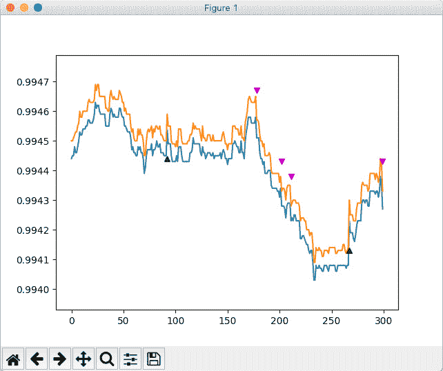

# 8

# 使用 Python 进行外汇交易中的数据可视化

在前面的章节中，我们学习了如何接收和存储市场数据，如何处理它，以及如何计算各种技术指标。然而，处理大量时间序列数据时，经常会遇到由令人沮丧的错误引起的错误，例如，使用错误的数据源或错误的戳记。除此之外，当处理技术指标时，检查计算结果的可视化是非常明智的 – 例如，您想使用大周期移动平均来确定长期价格走势，但您犯了一个错误，输入了一个小的周期值，然后发现自己陷入调试中，因为找不到真正的长期趋势。使您的调查可视化有助于非常快速地识别各种错误，并节省大量时间。

在本章中，我们将学习如何使用行业标准库之一 `matplotlib` 来可视化数据，然后继续使用 `mplfinance` 库绘制条形图和蜡烛图，我们将看到如何创建具有实时更新和使用价格图表的附加图形的图表。

在本章中，将涵盖以下主题：

+   绘图和绘图基础知识 – 如何使用 Python 中的图形库

+   使用脚本或交互式控制台进行快速绘图

+   可视化历史市场数据

+   创建条形图和蜡烛图

+   可视化实时市场数据

+   向价格图表添加其他对象

# 技术要求

要运行本章中的实际示例，您只需要 Python 3.9 或更高版本。

# 使用 Python 绘图的基础知识

有许多库实现了 Python 中的图表功能，但在撰写本文时，其中两个是行业标准 – `matplotlib` 和 `plotly`：

+   `numpy` 数组，支持多种类型的图表，包括金融图表（这正是我们所需要的！），对图表对象有完全控制权，具有几乎无限的图表定制功能，并且可以与不同的后端一起使用。

+   `matplotlib`，因此两者之间的选择并不明显。在交互性和通过 API 与图表对象一起工作时，Plotly 一定胜出，但在速度和定制能力方面则输给了竞争。

我们选择哪一个？一般来说，如果您不打算开发商业级 GUI 应用程序，那么 `matplotlib` 是一个明显的选择，因为它易于使用，文档非常完善，并且拥有良好的社区支持。

在我们开始之前，让我们快速了解一下 `matplotlib`（以及一般类似的图表库）是如何工作的，并明确决定我们将要做什么，以及我们特别不打算做什么。我们将了解不同的后端，考虑实时数据和静态数据绘制的特殊性，并熟悉图形引擎的内部组织和它们与 *外部世界*（您的代码）的交互。

## 图形后端

任何与 Python 一起使用的绘图包都有各种**后端**——这些后端是渲染屏幕上图形的引擎。开箱即用，我们有四种后端可供选择：Agg、**PS**（**postscript**）、PDF（是的，用于文档的标准 PDF 格式）和 SVG（矢量图形的标准）。

后端有**绑定**——简单来说，是便于从 Python 调用后端的包装器。一些后端提供开箱即用的交互式工具和控制；在这种情况下，你只需绘制一个图表，然后你可以使用后端提供的内置控件进行平移和缩放。使用其他后端需要完全实现用户界面，如果你想要定制和润色你的应用程序以达到商业级水平，这很好；但如果你只想快速查看一些数据，这会很烦人。

我们将使用标准的`matplotlib`，因此你不需要在代码中使用任何特殊命令。

## 静态数据与实时数据及其相关问题

重要的是要注意可视化静态数据和动态数据之间的关键区别。我们所说的**静态数据**是指只读取一次、接收、计算等，并且不在实时中被修改的数据。通常，它用于研发阶段，当你开发、测试和优化你的交易策略时。在这种情况下，我们与存储在磁盘上的历史数据或通过 API 从我们的经纪人那里检索的数据一起工作——但在任何情况下，它都不是实时修改的。这意味着图表库都可以在没有开发者付出太多努力的情况下完美工作；一旦数据集形成，就可以用一条命令进行绘制。

然而，一旦我们切换到实时数据可视化，我们会遇到问题，因为我们需要定期更新图表或根据事件更新——例如，在收到新的 tick 时。在这里，我们可能会遇到与多线程相关的问题。为了更好地理解这些问题，让我们快速回顾一下。

你还记得我们在*第五章*“使用 Python 检索和处理市场数据”中讨论的多线程概念吗？并行运行多个进程并通过队列连接它们使我们的交易应用程序通用，从某种意义上说，我们只需开发一次所有逻辑，然后就可以在数据源之间切换，以便从研发过渡到生产。

然而，当我们向我们的应用程序添加图形时，我们有时会遇到问题，这些问题源于图形也在一个单独的线程中运行。这个线程由一个独立的机制控制，而不是我们用来组织数据接收和处理线程的那个机制。

因此，将绘图添加到另一个线程以使其与主线程完全分离是非常棘手的，至少可以说。所以，我们将牺牲我们应用程序的通用性，以保持图形使用的简单性。

关于线程、循环和进程终止的重要注意事项

多线程的问题在于线程的终止。如果你启动了一个线程，并且没有添加任何检查以确定是否继续运行或终止，那么它将几乎无限期地运行。为了保持你的代码正确，你可能想要在任何一个线程和/或整个程序（它也是一个线程）中始终添加一个退出条件。然而，当使用 `matplotlib` 时，你并没有对渲染图形的线程有明确的控制权，因此你可能想要使用操作系统的回调。因此，尽管有被编程纯粹主义者批评的风险，我个人在 IDE 内使用键盘终止来停止图形循环——考虑到在生产中，我们不需要这样做，因为我们永远不会在生产代码中包含图表。如何处理这个问题取决于你，但在我看来，越简单越好。

因此，我们*将要*做的是将一些基本的图表集成到主模块的主线程中。它将只用于快速可视化，没有任何意图将其用作通用的图表软件，并且在从开发模式切换到生产模式之前将被禁用或移除。

我们*不会*编写复杂的代码，以提供给我们应用一个复杂的 GUI，该 GUI 将完全模仿商业应用程序，例如 MetaTrader 或 MultiCharts。

足够的讨论了——让我们开始编码。

## 安装 Matplotlib

除非你使用的是干净的 Python 安装，否则你很可能已经安装了 `matplotlib`，所以在尝试安装之前先检查一下。只需在控制台中输入 `import matplotlib` 并查看结果。

如果你还没有安装 `matplotlib`，你可以使用标准安装：

```py
python -m pip install -U pip
python -m pip install -U matplotlib
```

如果你使用 Conda 软件包，你可以使用以下命令安装 `matplotlib`：

```py
conda install matplotlib
```

通常来说，所有主要的第三方 Python 发行版，如 Anaconda、ActiveState、ActivePython 和 WinPython，都将 `matplotlib` 作为其一部分。

## 在你的代码中使用 Matplotlib

`matplotlib` 是一个相当大的库，我们实际上只需要其中的一部分——即进行绘图的模块。一如既往，我强烈建议使用 `import` 而不是 `from ... import` ——以保持命名空间分离：

```py
import matplotlib.pyplot as plt
```

这导入了 `pyplot` 模块，它实际上创建并处理图表。让我们创建我们的第一个图表：

```py
y = range(10)
plt.plot(y)
plt.show()
```

结果将看起来像以下图：


图 8.1 – 一个基本的 Matplotlib 图表

让我们看看实际上发生了什么：

1.  图形库创建了一个图形——即所有后续图表都应该制作的**画布**。

1.  然后，在图中创建了**坐标轴**——在我们的例子中，是一个从 0 到 10 的刻度矩形框。

1.  然后，一个图形对象被添加到坐标轴上——在我们的例子中，它是对角线。

1.  最后，调用了 `plt.show()` ——这是实际上在屏幕上显示图表的方法。

多线程：回顾

当你运行这段代码时，你现在会看到一个单独的进程。这个进程是由`plt.show()`方法创建的，其名称是`python`。不要把它与 Python 解释器混淆！这个新的进程只处理当前在屏幕上显示的图表。如果你杀掉它，`matplotlib`主循环将终止，图表将消失，但其他线程将继续运行！所以，一个更好的主意是从 IDE 停止代码的执行，以杀死包括这个`python`进程在内的所有线程。

如您所见，我们在`y`列表中有 10 个元素，水平轴相应地进行了刻度，从 0 到 10。很明显，当前的图表显示了`y = x`的线性函数，其中参数是整数。然而，如果我们想计算分数参数的相同函数——比如说，相同的 10 个点，但取值范围在 0 到 1 之间，而不是 0 到 10 呢？

让我们试一试：

1.  首先，像往常一样，我们导入`pyplot`：

    ```py
    import matplotlib.pyplot as plt
    ```

1.  然后，我们导入`numpy`——这是 Python 的通用数学库，它增加了对向量和矩阵的支持，以及无数的数学函数。我们将使用`arange`，它在某种程度上类似于原生的 Python 范围，但支持分数步长：

    ```py
    import numpy as np
    ```

1.  接下来，我们确定要显示的范围：

    ```py
    y = np.arange(0, 1, 0.1)
    ```

1.  代码的其他部分没有改变——只是创建一个图表并在屏幕上显示：

    ```py
    plt.plot(y)
    ```

    ```py
    plt.show()
    ```

然后，你应该会看到一个类似于以下图表的图形：


图 8.2 – 在 0 到 1 范围内的线性函数的图表——错误的 X 轴刻度

但等等！我们的图表有些问题。是的，现在*Y*轴已经从 0 增加到 1，步长为 0.1，但*X*轴仍然从 0 增加到 10。这是因为我们绘制了新的数组，但没有做任何事情来告诉`plt.plot()`方法关于新的刻度，即*X*轴——默认情况下，这个方法假设我们绘制任何数组与它的元素索引相对应，这始终是一个整数数组。

1.  让我们通过添加正确的`X`轴数据来修复这个错误：

    ```py
    x = np.arange(0, 1, 0.1)
    ```

让我们也修改`plot()`方法的调用：

```py
plt.plot(x, y)
```

现在，我们将看到正确的图表，如下面的图所示：


图 8.3 – 在 0 到 1 范围内的线性函数的图表——现在正确的 X 轴刻度

现在我们对`plot()`方法的工作原理有了一些了解，让我们绘制一些实际的市场数据。

# 市场数据的简单图表

在接下来的示例中，我们将只使用历史数据。我们将在本章的后面学习如何绘制从经纪人那里接收到的实时数据。

有许多方法可以读取和处理市场数据，其中一些在第五章*“使用 Python 获取和处理市场数据”*中考虑过。现在，我们将学习一些替代方法，以便你能够根据当前的研究和开发需求做出最佳选择。

让我们从最直接的方法开始，它只使用原生 Python 数据结构。正如我们在 *第五章* 中看到的，由于与 JSON 标准的完全兼容性以及能够通过关键字提取必要数据的能力，存储和操作市场数据的首选方式是字典。我们将从字典开始：

1.  首先，我们仍然需要做一些导入：

    ```py
    import matplotlib.pyplot as plt
    ```

    ```py
    import csv
    ```

`csv` 模块包含非常方便的方法来读取和解析 **逗号分隔值**（**CSV**）文件，这是存储历史市场数据的既定标准。

1.  现在，让我们打开一个数据文件并创建一个 `DictReader()` 对象：

    ```py
    f = open("/Volumes/Storage HDD/Data/LMAX EUR_USD 1 Minute.txt")
    ```

    ```py
    csvFile = csv.DictReader(f)
    ```

`DictReader()` 方法将 CSV 文件解析为字典或一组字典，并返回一个 `DictReader` 对象。它使用文件的第一个行作为关键字源，所以请确保你在源数据中有它。在我使用的示例文件中，标题（第一行）看起来如下所示：

```py
Date,Time,Open,High,Low,Close,UpVolume,DownVolume,
TotalVolume,UpTicks,DownTicks,TotalTicks
```

因此，这些就是在我使用 `DictReader()` 读取文件并解析它时将在字典中出现的非常关键词。

1.  现在，我们需要将这个对象转换为列表：

    ```py
    all_data = list(csvFile)
    ```

如果我们现在通过输入 `print(all_data[-3:])` 来查看列表中的最后三个元素，我们会看到如下内容：

```py
[{'Date': '11/12/2020', 'Time': '17:45:00', 'Open': '1.18136', 'High': '1.18143', 'Low': '1.18125', 'Close': '1.18140', 'UpVolume': '249', 'DownVolume': '494', 'TotalVolume': '743', 'UpTicks': '7', 'DownTicks': '5', 'TotalTicks': '12'}, {'Date': '11/12/2020', 'Time': '17:46:00', 'Open': '1.18140', 'High': '1.18156', 'Low': '1.18138', 'Close': '1.18154', 'UpVolume': '399', 'DownVolume': '299', 'TotalVolume': '698', 'UpTicks': '8', 'DownTicks': '4', 'TotalTicks': '12'}, {'Date': '11/12/2020', 'Time': '17:47:00', 'Open': '1.18154', 'High': '1.18156', 'Low': '1.18145', 'Close': '1.18155', 'UpVolume': '500', 'DownVolume': '650', 'TotalVolume': '1150', 'UpTicks': '5', 'DownTicks': '6', 'TotalTicks': '11'}]
```

因此，我们现在确实有了以 OHLC 条形图形式表示的 1 分钟数据，以及一些关于成交量以及每个区间（1 分钟）的刻度数的信息。每个条形图都由一个单独的字典表示，而字典被收集在一个列表中。

1.  现在，我们需要提取我们想要绘制的仅有的数据 – 比如，收盘价。为了避免绘制过多数据可能引起的问题，让我们只绘制最后 100 个数据点。有许多方法可以做到这一点；我们将使用列表推导式：

    ```py
    close = [float(bar['Close']) for bar in all_data[-100:]]
    ```

其余的代码都是相同的：

```py
plt.plot(close)
plt.show()
```

如果你一切操作正确，你应该会看到一个类似于以下截图所示的图表：


图 8.4 – 简单的收盘价折线图

1.  太好了，但关于 *X* 轴标签怎么办呢？哦，它只是简单地计数数据点，从 0 到 100，但我们希望看到更有意义的内容。让我们回忆一下，`plot()` 方法实际上是在一个可迭代对象与另一个可迭代对象之间绘制，所以我们将从时间戳创建标签：

    ```py
    time = [bar['Time'] for bar in all_data[-100:]]
    ```

    ```py
    plt.plot(time, close)
    ```

现在，我们可以看到沿 *X* 轴的数字确实被替换了，但这个“替换”的内容真的很难阅读和理解：


图 8.5 – 使用未正确格式化的时间戳作为 X 轴标签会导致结果不稳定

毫不奇怪，标签（时间戳）相当长，有很多，它们一个接一个地显示，使得结果无法使用。因此，我们希望以某种方式格式化它们，只打印每 10、20 或 100 个刻度处的标签，并将它们旋转以节省屏幕空间。

为了做到这一点，我们应该回忆一下由调用`plot()`方法触发的事件序列，这在本章的*在代码中使用 matplotlib*部分中有所解释。首先，创建了一个*figure*（一个空白画布），添加了一个*axis*（带有轴的矩形框），然后绘制了实际的*plot*。这三个对象都是通过单个调用`plot()`方法自动创建的。然而，为了能够修改图表的可视表示，我们需要直接访问`axes`对象。现在，我们想要重写整个绘图代码，以便分离上述三个对象。

1.  因此，在我们形成了`time`列表并在调用`plot()`之前，我们添加以下内容：

    ```py
    fig = plt.figure()
    ```

1.  这创建了一个新的空图对象，并返回了对`fig`变量的句柄。然后，我们添加以下内容：

    ```py
    ax = fig.add_subplot()
    ```

1.  这创建了一个新的子图，或轴——我们想要定制的矩形。太好了——现在我们可以通过`ax`变量访问它。所以，让我们限制沿*X*轴打印的刻度标签数量：

    ```py
    ax.set_xticks(np.arange(0, len(time) + 1, 15))
    ```

`set_xticks()`方法在这里只使用一个参数——一个可迭代对象，它指定了我们想要绘制的`time`列表中那些元素的索引。在我们的例子中，我们使用了一个`numpy`的`arange`，它包含以 15 为步长的整数数字，以绘制每个 15 个时间戳。

1.  最后，为了使我们的图表更加易于阅读，让我们将标签旋转 45°并绘制结果：

    ```py
    plt.xticks(rotation=45)
    ```

    ```py
    plt.plot(time, close)
    ```

    ```py
    plt.show()
    ```

如果你一切操作正确，你应该看到以下这样的图表：


图 8.6 – 略微更好看的简单价格图表

到目前为止，我们只为最后 100 个数据点绘制了图表，但如果我们想绘制过去某一天的市场数据呢？

1.  现在，让我们重写整个代码，以便将我们迄今为止所学的一切内容放在一起：

    ```py
    import csv
    ```

    ```py
    import matplotlib.pyplot as plt
    ```

    ```py
    import numpy as np
    ```

    ```py
    f = open("/Volumes/Storage HDD/Data/LMAX EUR_USD 1 Minute.txt")
    ```

    ```py
    csvFile = csv.DictReader(f)
    ```

    ```py
    all_data = list(csvFile)
    ```

到目前为止，没有区别；我们只是导入了必要的模块并读取了数据文件。现在，我们想要从 2019 年 12 月 12 日午夜开始绘制 100 个条形图。因此，我们在字典列表`all_data`中找到与`Date`关键字相关值的字典位置：

```py
starting_bar_number = 0
for bar in all_data:
    if bar['Date'] == '12/12/2019':
        break
    starting_bar_number += 1
```

1.  然后，我们提取绘图所需的数据：

    ```py
    close = [float(bar['Close']) for bar in all_data[starting_bar_number:starting_bar_number + 100]]
    ```

    ```py
    time = [bar['Time'] for bar in all_data[starting_bar_number:starting_bar_number + 100]]
    ```

然后，我们实际上使用一些漂亮的格式进行绘图：

```py
fig = plt.figure()
ax = fig.add_subplot()
ax.set_xticks(np.arange(0, len(time) + 1, 15))
plt.xticks(rotation=45)
plt.plot(time, close)
plt.show()
```

就这样！现在，我们可以享受我们的图表了：


图 8.7 – 指定日期和时间的数据的简单价格图表

在这里，我们省略了 `matplotlib` 的所有功能，包括标题格式化、使用颜色、多个子图以及更多内容——毕竟，这本书不是 `matplotlib` 教程。如果你对学习这个可靠的图表包感兴趣，我建议从其官方网站 ([`matplotlib.org`](https://matplotlib.org)) 开始，在那里你可以找到很多示例、教程和一般文档。

好的，现在我们知道了如何绘制基本的价格图表——简单的收盘价（或任何其他价格）与时间戳的简单线形图。然而，我们都知道在金融世界中，最常见的图表格式是柱状图或蜡烛图。我们如何使用 `matplotlib` 绘制这样的图表呢？

好吧，几年前，`matplotlib` 本身曾经有一个 `finance` 模块，支持相关的图表。然而，现在它已被弃用。因此，我们只有两个选择——要么使用 matplotlib 的 `bar()` 方法逐条构建金融图表，要么选择一个相对较新但功能强大的包，`mplfinance`。这个包提供了非常简单直接的方法来绘制价格图表，但它不会绘制存储在原生 Python 结构（如列表或字典）中的数据。相反，它使用 **pandas** 来处理市场数据。

那么，pandas 是什么，我们如何使用它？

# 使用 pandas 可视化静态市场数据

根据其官方网页 [`pandas.pydata.org`](https://pandas.pydata.org) 上的声明，pandas 是 *“一个快速、强大、灵活且易于使用的开源数据分析和管理工具，建立在 Python 编程语言之上”*。它最初正是为了处理时序数据，特别是市场价格数据而开发的。

与原生的 Python 列表或 NumPy 数组不同，pandas 使用 **DataFrames** 作为核心数据对象。你可以将 DataFrame 视为一个表格，其中列代表各种命名的时序数据（或任何其他序列），而行包含实际数据，第一行总是包含序列的名称。这与我们迄今为止使用的历 史市场数据文件非常相似吗？是的，这也使得使用 pandas 的学习曲线非常陡峭。

pandas 提供了添加、删除和重新排列列、创建和修改索引、切片和创建子集、合并和重塑 DataFrame 以及处理缺失数据的方法。

注意

pandas 是一个相当全面的包，提供了各种方法来处理数据，以满足非常不同的需求。这本书绝不是 pandas 教程；我们将只使用那些完成绘制市场数据任务所需的方法。如果你对学习 pandas 感兴趣，我建议从 [`www.w3schools.com/python/pandas/default.asp`](https://www.w3schools.com/python/pandas/default.asp) 上的简单教程开始。

## 安装 pandas

官方的 pandas 网站推荐安装 Anaconda，它自带 pandas，并将其他安装方法称为 *高级*。然而，它们并没有真正高级。你可以使用标准的 PyPI 安装：

```py
pip install pandas
```

或者，你可以使用 Conda：

```py
conda install pandas
```

## 使用 pandas 读取 CSV 文件中的数据

pandas 提供了一种直接从 CSV 文件读取数据的方法。让我们尝试以下代码：

```py
import mplfinance as mpf # this is for future use with charting
import pandas
file_name = "/Volumes/Storage HDD/Data/LMAX EUR_USD 1 Minute.txt"
source_data = pandas.read_csv(file_name)
print(source_data)
```

当然，像往常一样，你想要将 `file_name` 的值替换为本地存储的历史数据 CSV 文件的实际路径。

如果你一切操作正确，你会看到以下输出：

```py
               Date      Time     Open  ...  UpTicks  DownTicks  
TotalTicks
0         1/27/2015  13:29:00  1.12942  ...        3          2
           8
1         1/27/2015  13:30:00  1.12947  ...        4          7
          12
2         1/27/2015  13:31:00  1.12953  ...        9          4
          14
3         1/27/2015  13:32:00  1.12944  ...        2         10
          13
4         1/27/2015  13:33:00  1.12876  ...        5          4
          12
...             ...       ...      ...  ...      ...        ...
         ...
2136274  11/12/2020  17:43:00  1.18134  ...        4          7
          11
2136275  11/12/2020  17:44:00  1.18124  ...        7          4
          11
2136276  11/12/2020  17:45:00  1.18136  ...        7          5
          12
2136277  11/12/2020  17:46:00  1.18140  ...        8          4
          12
2136278  11/12/2020  17:47:00  1.18154  ...        5          6
          11
[2136279 rows x 12 columns]
```

你可以看到，第一行用于创建列名，其余部分形成了实际的数据。

注意，在从文件读取的数据前面，有一个额外的没有命名的列，它只包含从 0 到 2,136,278（在我的示例文件中）的整数。这是 **DataFrame 索引**。我们可以通过这些数字引用任何特定的记录——再次，这与我们使用列表时几乎一样。当然，这很不方便，因为我们希望能够通过引用特定的日期或时间范围来检索任何历史数据。幸运的是，pandas 提供了一种为 DataFrame 建立自定义索引的方法，所以让我们继续我们的代码。

## 为 dataframe 设置索引

首先，让我们从 `date` 和 `time` 字段形成时间戳：

```py
source_data['Timestamp'] = pandas.to_datetime(source_data['Date']) + pandas.to_timedelta(source_data['Time'])
```

在这里，我们使用内置方法 `to_datetime()` 和 `to_timedelta()`，它们将字符串值转换为单个 `Timestamp` 对象。

在 pandas 中引用列

在前面的代码中，你可以看到 pandas 如何允许你通过名称引用某个列。这非常类似于在字典中通过关键字查找值，但在 pandas 中，返回的是整个列，而不是一个标量值。

将值赋给一个不存在的列名（在我们的例子中是 `Timestamp`）实际上创建了一个具有该名称的新列。

创建了新列后，让我们将其设置为索引：

```py
source_data.set_index(source_data['Timestamp'], inplace=True)
```

如果我们现在检查 `source_data` 的内容，我们会看到新索引已生成并添加到 DataFrame 中：

```py
                           Date      Time  ...  TotalTicks
           Timestamp
Timestamp                                  ...
2015-01-27 13:29:00   1/27/2015  13:29:00  ...           8 2015-01-27 13:29:00
2015-01-27 13:30:00   1/27/2015  13:30:00  ...          12 2015-01-27 13:30:00
2015-01-27 13:31:00   1/27/2015  13:31:00  ...          14 2015-01-27 13:31:00
2015-01-27 13:32:00   1/27/2015  13:32:00  ...          13 2015-01-27 13:32:00
2015-01-27 13:33:00   1/27/2015  13:33:00  ...          12 2015-01-27 13:33:00
...                         ...       ...  ...         ...
                 ...
2020-11-12 17:43:00  11/12/2020  17:43:00  ...          11 2020-11-12 17:43:00
2020-11-12 17:44:00  11/12/2020  17:44:00  ...          11 2020-11-12 17:44:00
2020-11-12 17:45:00  11/12/2020  17:45:00  ...          12 2020-11-12 17:45:00
2020-11-12 17:46:00  11/12/2020  17:46:00  ...          12 2020-11-12 17:46:00
2020-11-12 17:47:00  11/12/2020  17:47:00  ...          11 2020-11-12 17:47:00
[2136279 rows x 13 columns]
```

太好了！现在我们已经通过时间戳索引了所有我们的数据点（分钟柱状图）。现在让我们创建一个简单的柱状图，用于之前使用的相同 1 分钟历史数据。

## 使用 pandas 和 mplfinance 创建简单的柱状图

当然，我们不想在一张图表中绘制所有数据。我在本章使用的数据文件包含大约 5 年的 1 分钟柱状图，或超过 200 万条记录，所以创建一个包含超过 200 万个柱子的图表将永远冻结渲染。让我们只为一段历史创建一个图表，指定日期、开始时间和结束时间：

```py
sample_date = '23-03-2020'
start_time = '00:01:00'
day_close_time = '23:00:00'
```

我文件中的数据位于 GMT+1 时区，所以这里的 23:00 等于纽约时间的 17:00，这是外汇市场的银行结算时间（参见 *第三章* 中的 *Trading the FX market – what and how* 部分，*从开发者的角度来看的外汇市场概述*）。此外，请注意，一天中的第一个时间戳（`start_time` 变量）是午夜过后的 1 分钟；对于柱状图，时间戳表示最后一笔交易的时间或区间的收盘价（参见 *第五章* 中的 *Universal data connector* 部分，*使用 Python 获取和处理市场数据*，以获取数据压缩和时间戳的详细解释）。

## 在 pandas 中制作切片和子集

从 DataFrame 中提取子集最常用的方法是 `.loc()`。它的使用同样非常直观，因为它与原生 Python 列的切片非常相似；你只需要指定新子 DataFrame 的起始和结束索引，如以下伪代码所示：

```py
sub_dataframe = original_dataframe[start : end]
```

在我们的实际代码中，它将看起来像以下这样：

```py
all_day_sample = source_data.loc[sample_date + " " + start_time: sample_date + " " + day_close_time]
```

最后，我们希望去除所有不必要的数据，只保留 `Open`、`High`、`Low` 和 `Close`。同样，使用 pandas，只需指定要保留的列的列表即可完成，其余的将被丢弃：

```py
OHLC_data = all_day_sample[['Open', 'High', 'Low', 'Close']]
```

注意双括号；外层一对括号表示我们根据指定的列集创建一个子 DataFrame，而内层一对括号实际上指定了列表中的列。这一切都完成了——现在，是时候创建我们的第一个柱状图了。

## 使用 mplfinance 绘制市场图表

所有由 `mplfinance` 创建的图表默认都是柱状图，所以让我们从最简单的开始：

```py
mpf.plot(OHLC_data)
```

如果你一切操作正确，你应该会看到一个像下面的图：


图 8.8 – 使用 mplfinance 绘制的默认柱状图

乍一看，它看起来像同一条线形图，但这是因为我们在相对较小的画布上放置了太多的柱子。在这里，我们可以利用 `matplotlib`（`mplfinance` 是基于 `matplotlib` 构建的）默认使用的 `TkAgg` 后端是交互式的；你可以点击放大镜图标并放大图表的任何部分——比如，白天中间的峰值：


图 8.9 – 使用 TkAgg 后端的交互性进行缩放和放大

有几种选项可以自定义 `mplfinance` 图表。例如，我们可以绘制蜡烛图而不是柱状图，甚至可以向其中添加多个移动平均线：

```py
mpf.plot(OHLC_data, type = 'candle', mav = (20, 50, 200))
```

这里，`mav` 代表 **移动平均线**，它们的周期由元组指定。结果如图所示：


图 8.10 – 使用 mplfinance 绘制的带有移动平均线的蜡烛图

现在，我们可以使用 Matplotlib 的`pyplot`和`mplfinance`来创建以简单折线图或漂亮的条形图或蜡烛图形式的价格图表。然而，到目前为止，我们只处理了静态且不实时更新的保存数据。那么，当我们从经纪人或数据供应商那里实时接收数据时，我们该怎么办？让我们看看如何使用通用数据连接器方法来解决这个问题。

# 可视化实时市场数据

在我们继续之前，我强烈建议你重新阅读*第五章*中的*使用保存和实时数据——保持你的应用通用*部分，以及*第七章*中的*滑动窗口*部分，*使用 Python 检索和处理市场数据*和*在 Python 中实现技术分析及其应用*。我们将使用相同的架构来创建市场数据的实时图表。

重要提醒

无论我们从实时数据源接收什么数据，都应该进入队列。这应该在单独的线程中完成。然后，数据从队列中读取到滑动窗口中，该窗口控制实际数据的数量——用于任何处理或绘图。

当我们处理静态历史数据时，我们使用了非常方便的方法，允许我们用一行代码将整个数据集读入内存，然后导航它。当然，任何便利性都是要付出代价的，在这种情况下，代价是冒着提前查看的风险（参见*第四章*中的*交易逻辑——这里一个小错误可能损失一大笔钱*部分，*第七章*通过使用滑动窗口和线程，并逐个将数据点喂入其中，无论它们是本地保存的还是从经纪人那里接收的，有效地解决了这个问题）。

所以，换句话说，到目前为止，我们在本章中所做的是方便的，但它与构建一个既适合研究又适合实时交易的全能交易应用的理念相矛盾。

那么，你们可能想知道，我们为什么要做所有这些？

有两个原因。

首先，别忘了我们只使用图表在研究阶段**要么**直观地确认一个想法，**要么**在生产中检查实时订单的一致性。当我们致力于交易想法的开发时，能够立即可视化某些历史数据会非常方便，尤其是如果你在一个交互式环境中工作，比如 IPython。这就是使用 pandas 与`mplfinance`可能是正确选择的地方。

其次，可视化不仅用于绘制市场数据，还（可能甚至更频繁地）用于绘制回测结果，在历史数据上运行模拟交易。由于回测按定义是某种*刻在石头上*的东西——也就是说，不会实时更新——因此，我们在此章前面考虑的方法将非常适合我们的目的。

总的来说，我们希望可视化实时市场数据，以检查其正确性，查看各种指标，以及/或跟踪订单执行。让我们看看它是如何完成的。

## 绘制实时 tick 数据

和往常一样，我们从几个导入开始：

```py
import json
import threading
import queue
import matplotlib.pyplot as plt
```

`json`模块将帮助我们解析数据服务器的响应；我们已熟悉其他模块

然后，我们从`websocket`库导入建立 WebSocket 连接的方法：

```py
from websocket import create_connection
```

接下来，我们创建一个实现滑动窗口的类（请参阅*第六章*，*基本面分析的基础及其在* *FX 交易* *中的可能用途*中的*滑动窗口*部分）：

```py
class sliding_window:
    def __init__(self, length):
        self.data = ([0]*length)
    def add(self, element):
        self.data.append(element)
        self.data.pop(0)
```

然后，我们添加一个函数来创建并维护与市场数据服务器的 WebSocket 连接。此函数有三个参数：

+   连接的 URL

+   我们发送给服务器以订阅市场数据的消息

+   我们放置传入 tick 的队列

如果你计划构建一个具有多个连接的复杂应用程序，你也可以将此函数实现为`class`方法：

```py
def LMAX_connect(url, subscription_msg, ticks_queue):
```

创建连接：

```py
    ws = create_connection(url)
```

然后，发送订阅消息，我们将在后面指定，将其放在函数代码之外（如果你将函数实现为`class`方法，你可能想将订阅消息作为参数传递或将其作为`class`属性）：

```py
    ws.send(subscription_msg)
```

订阅成功后，函数等待传入的 tick 并将它们放入队列：

```py
    while True:
        tick = json.loads(ws.recv())
        ticks_queue.put(tick)
        print(tick)
```

`print(tick)`语句仅用于调试目的。所有准备工作都已完成，现在，让我们继续：

```py
url = "wss://public-data-api.london-demo.lmax.com/v1/web-socket"
subscription_msg = '{"type": "SUBSCRIBE","channels": [{"name": "ORDER_BOOK","instruments": ["eur-usd"]}]}'
```

在这里，我们指定要连接的服务器和我们将发送以订阅市场数据的消息。请参阅*第五章*，*使用 Python 检索和处理市场数据*，以获取 LMAX 数据结构的详细描述，以及*第四章*，*交易应用程序——里面有什么？*中的*检索数据——垃圾进，垃圾出*部分，以刷新你对接收和处理数据的重要问题的记忆。

接下来，我们将创建队列以存储传入的 tick：

```py
pipe = queue.Queue()
```

我们还将创建一个线程来检索数据：

```py
data_receiver_thread = threading.Thread(target = LMAX_connect, args = (url, subscription_msg, pipe))
data_receiver_thread.start()
```

如果你一切操作正确并运行了代码，你将看到来自 WebSocket 的订单簿数据：

```py
{'type': 'ORDER_BOOK', 'instrument_id': 'eur-usd', 'timestamp': '2022-10-28T09:12:26.000Z', 'status': 'OPEN', 'bids': [{'price': '0.995350', 'quantity': '1000000.0000'}, {'price': '0.995340', 'quantity': '2000000.0000'}, {'price': '0.995330', 'quantity': '500000.0000'}, {'price': '0.995320', 'quantity': '500000.0000'}, {'price': '0.995310', 'quantity': '1500000.0000'}, {'price': '0.987800', 'quantity': '1000000.0000'}, {'price': '0.985000', 'quantity': '13000000.0000'}, {'price': '0.980000', 'quantity': '13000000.0000'}], 'asks': [{'price': '0.995410', 'quantity': '500000.0000'}, {'price': '0.995420', 'quantity': '1000000.0000'}, {'price': '0.995430', 'quantity': '1500000.0000'}, {'price': '0.995440', 'quantity': '2000000.0000'}, {'price': '0.995450', 'quantity': '3000000.0000'}, {'price': '0.995810', 'quantity': '410000.0000'}]}
```

我们只想绘制书籍的顶部——也就是说，当前的最佳买入价和最佳卖出价——所以让我们添加另一个函数，该函数将解析传入的 tick 并将`bid`和`ask`值发送到相应的滑动窗口。我们实现此函数时没有参数，因为它与代码的图表部分共享数据结构（`bid`和`ask`滑动窗口）：

```py
def get_ticks(ticks_queue):
    while True:
        tick = ticks_queue.get()
        if 'bids' in tick.keys():
            bid = float(tick['bids'][0]['price'])
            ask = float(tick['asks'][0]['price'])
            bids.add(bid)
            asks.add(ask)
            print(bid, ask)
```

此函数从队列中获取跳动，提取买卖双方，并将它们发送到相应的滑动窗口（`bids`和`asks`）。让我们创建它们——首先，我们指定滑动窗口的长度（让我们将其设置为 60，这样将显示大约 1 分钟的数据，考虑到 LMAX 以大约每秒 1 跳的速度发送更新）：

```py
window_size = 60
```

然后，添加两个窗口，分别用于`bids`和`asks`：

```py
bids = sliding_window(window_size)
asks = sliding_window(window_size)
```

现在，我们将处理函数包装进一个线程中：

```py
trading_algo_thread = threading.Thread(target = get_ticks, args = (pipe,))
trading_algo_thread.start()
```

如果我们现在运行到目前为止所开发的代码，我们将看到每秒大约更新一次的买卖对：

```py
0.99626 0.99631
0.99626 0.99629
0.99624 0.9963
0.99624 0.9963
0.99624 0.99629
```

干得好！现在，我们想在图表中绘制实时数据。

到目前为止，最自然的做法是创建第三个线程，并在其中完成所有绘图，以保持三个过程（检索数据、处理和绘图）彼此以及与主线程的分离。

可惜，使用`matplotlib`（以及许多其他图表套件）来做这件事非常复杂（尽管并非不可能）。所以，不幸的是，我们必须接受图表只能在主线程中（轻易地）可用的事实。

首先，让我们等待滑动窗口中的所有数据都填充了有意义的值：

```py
while bids.data[0] == 0:
    pass
```

然后，我们分别创建图形和坐标轴（就像我们在本章前面自定义坐标轴标签时做的那样）：

```py
fig = plt.figure()
ax = fig.add_subplot()
```

接下来，我们为我们的两个数据系列（买卖双方）添加两条线：

```py
line1, = ax.plot(bids.data)
line2, = ax.plot(asks.data)
```

最后，我们启动主绘图循环，该循环将每秒绘制线条并刷新图形：

```py
while True:
    line1.set_ydata(bids.data)
    line2.set_ydata(asks.data)
```

以下命令在图表上方和下方添加了小的边距，只是为了提高视觉感知：

```py
    plt.ylim(min(bids.data) - 0.0001, max(asks.data) + 0.0001)
```

然后，我们实际绘制图表：

```py
    fig.canvas.draw()
```

我们等待 1 秒钟，直到图形被渲染并出现在屏幕上；否则，循环会阻塞渲染，我们不希望在这次暂停期间让它运行：

```py
    plt.pause(1)
```

简单！如果你一切都做对了，你应该看到以下类似的图形，每秒更新一次：

注意

填充整个滑动窗口需要时间。在我们的例子中，大约需要 60 秒才能出现图形。


图 8.11 – 一个简单的实时价格跳动图表，显示买卖双方

好吧，现在我们可以绘制市场价格的实时图表，这已经变得相当简单直接——但仅以每跳的线条形式。如果我们想聚合数据然后绘制条形图或蜡烛图呢？让我们在下一节中找到解决方案。

## 绘制实时条形图或蜡烛图

在本章的早期，我们处理过柱状图和蜡烛图，我们知道最流畅的方式是使用`mplfinance`库。想法是在循环中使用`mplfinance.plot()`方法，并更新，类似于我们刚刚对 tick 数据的线形图所做的。所以，我们现在想要做的是添加一个新的函数，该函数将根据一定的规则将传入的 tick 数据流分割成柱，将形成的柱添加到 DataFrame 中，并将结果 DataFrame 发送到图表循环：

1.  让我们从导入开始。一些导入的模块与上一个例子相同，因为我们需要它们从 WebSocket 连接中再次检索数据：

    ```py
    import json
    ```

    ```py
    import threading
    ```

    ```py
    import queue
    ```

    ```py
    from websocket import create_connection
    ```

1.  然后，我们导入`datetime`方法，因为我们将会将字符串时间戳转换为`datetime`对象：

    ```py
    from datetime import datetime
    ```

1.  最后，我们有一些导入语句以方便图表绘制：

    ```py
    import matplotlib.pyplot as plt
    ```

    ```py
    import pandas
    ```

    ```py
    import mplfinance as mpf
    ```

然后，我们将重用*绘图实时 tick 数据*部分的一些代码 – `sliding_window`类、`url`和`subscription_msg`变量的赋值，以及`pipe`、`window_size`、`bids`和`asks`的初始化。我们还将重用`LMAX_connect()`函数而不做任何修改。

1.  现在，我们将创建一个新的队列，我们将向其中发送用于绘图的 DataFrames：

    ```py
    data_for_chart = queue.Queue()
    ```

我们还将创建一个新的函数，该函数将执行将传入的 tick 数据流分割成柱的任务：

```py
def make_bars():
    bars = pandas.DataFrame(columns=['Timestamp', 'Open', 'High', 'Low', 'Close'])
    bars.set_index('Timestamp', inplace=True)
```

1.  我们创建了一个空的 DataFrame，设置了列标题，并将`Timestamp`设置为索引。接下来，我们将时间框架（分辨率）设置为 10 秒，并初始化时间戳：

    ```py
        resolution = 10
    ```

    ```py
        last_sample_ts = 0
    ```

现在，就像往常一样，如果我们使用线程处理无限过程，我们就开始循环，在这个循环中我们读取一个 tick，提取其时间戳和最后出价（我们假设我们想要绘制出价；如果你想要绘制订单簿中的任何其他数据，只需在字典中选择适当的关键字和值即可），并且如果这是我们收到的第一个 tick，初始化即将到来的柱的`open`、`high`、`low`和`close`值，并将`last_sample_ts`设置为`ts`：

```py
    while True:
        tick = pipe.get()
        ts = datetime.strptime(tick['timestamp'], "%Y-%m-%dT%H:%M:%S.%fZ")
        last_bid = float(tick['bids'][0]['price'])
        if last_sample_ts == 0:
            last_sample_ts = ts
            open = high = low = close = last_bid
```

1.  现在，我们指定启动新柱的条件。在这种情况下，一旦当前时间(`ts`)与上一柱时间(`last_bar_sample`)之间的差异大于存储在`resolution`变量中的值，我们就立即执行：

    ```py
            delta = ts – last_sample_ts
    ```

    ```py
            if delta.seconds >= resolution:
    ```

    ```py
                bar = pandas.DataFrame([[open, high, low, close]], columns = ['Open', 'High', 'Low', 'Close'], index = [ts])
    ```

    ```py
                bars = pandas.concat([bars, bar])
    ```

1.  因此，一旦一个新的 10 秒间隔开始，我们就使用`Open`、`High`、`Low`和`Close`值以及当前时间戳创建一个新的 DataFrame 柱，并将其添加到主 DataFrame `bars`中。该函数其余部分的代码相当明显；首先，我们再次初始化所有四个价格变量，更新最后柱的时间戳，并将 DataFrame 放入队列：

    ```py
                last_sample_ts = ts
    ```

    ```py
                open = high = low = close = last_bid
    ```

    ```py
                data_for_chart.put(bars)
    ```

当然，如果条件不是`true`（柱子开启的时间没有超过分辨率阈值），我们只需更新价格变量：

```py
        else:
            high = max([high, last_bid])
            low = min([low, last_bid])
            close = last_bid
```

1.  诀窍已经完成；现在，让我们创建两个线程：

    ```py
    data_receiver_thread = threading.Thread(target = LMAX_connect)
    ```

    ```py
    data_receiver_thread.start()
    ```

    ```py
    trading_algo_thread = threading.Thread(target = make_bars)
    ```

    ```py
    trading_algo_thread.start()
    ```

1.  创建图形并获取坐标轴句柄：

    ```py
    fig = mpf.figure()
    ```

    ```py
    ax1 = fig.add_subplot(1,1,1)
    ```

然后，运行绘图循环：

```py
while True:
    chart_data = data_for_chart.get()
    ax1.clear()
    mpf.plot(chart_data, ax = ax1, type='candle', block = False)
    plt.pause(1)
```

`mpf.plot()`方法的`block = False`可选参数告诉渲染器在绘制后释放图表，并允许在其中添加或修改对象（这样我们就可以进行实时更新）。别忘了添加一个暂停（`plt.pause(1)`）；否则，循环将一直忙碌，不会让系统在屏幕上显示图表。

如果你运行这段代码，你首先会看到一个巨大的蜡烛图，因为我们还没有足够的数据：


图 8.12 – 实时蜡烛图初始视图

然后，图表将每 10 秒更新一次，4 分钟后，你将看到以下截图所示的内容：


图 8.13 – 使用实时价格数据制作的 10 秒蜡烛图

1.  随着我们接收越来越多的数据，图表上会有越来越多的蜡烛，所以到了某个点，它将变得难以阅读。因此，你可能想在将 DataFrame 放入`data_for_chart`队列之前，添加一个限制并丢弃最老的一行，当新的一行到来时：

```py
            if len(bars) > 100:
                bars = bars.iloc[1:, :]
            data_for_chart.put(bars)
```

在这里，我指定了显示 100 根蜡烛，一旦达到这个限制，较老的蜡烛将从屏幕上消失——这和在 MetaTrader、MultiCharts、TradeStation 或任何其他图表应用中几乎一样。

非常频繁地，我们需要在价格数据旁边绘制其他内容。这可能是一个技术指标、趋势线、标记一个入场或退场，或者任何其他内容。让我们看看在下一节中我们如何做到这一点。

# 向价格图表添加对象

如果我们知道它们的坐标，添加任何对象到图表并不困难，因为所有的`matplotlib`方法总是绘制一个类似于另一个数组对象。所以，基本上，我们添加任何特殊对象到图表所需要做的就是计算它们在列表中的位置，或者沿*X*轴的数组以及沿*Y*轴的相应值。

让我们考虑一个简单但很有价值的例子。在*第三章*，“从开发者角度的 FX 市场概述”中，我们了解到价格接受者只能以要价买入，以出价卖出。我们还看到，大订单可以移动价格几个点（pip），因为它消耗了订单簿中几个级别的流动性。因此，我们可以有相当大的信心假设，如果最佳出价在上一刻突然大于最佳要价，那么这可能是一个重大买入订单的迹象。反之亦然——如果我们观察到最佳要价低于上一最佳出价，那么这可能是一个重大卖出订单的痕迹。

让我们通过添加三角形标记来可视化这两种情况，分别指向上下，以表示假设的买入和卖出。为此，我们将使用我们编写的用于可视化实时 tick 数据的代码（见*实时 tick 数据绘图*部分），并添加几行：

1.  首先，我们需要添加两个新的对象来显示标记。我们就在创建显示买卖报价的对象（`line1`和`line2`）的下方添加它们：

    ```py
    line3, = ax.plot(buy_signals_x, buy_signals_y, 'g^')
    ```

    ```py
    line4, = ax.plot(sell_signals_x, sell_signals_y, 'mv')
    ```

这里的特殊修饰符表示图形的颜色和样式 – `'g^'`表示一个向上的绿色三角形，`'mv'`表示一个向下的洋红色三角形。你可以在[`matplotlib.org/stable/api/_as_gen/matplotlib.pyplot.plot.html#matplotlib.pyplot.plot`](https://matplotlib.org/stable/api/_as_gen/matplotlib.pyplot.plot)找到`pyplot.plot()`方法的可选参数的完整列表。

1.  接下来，我们需要计算这些标记的坐标（位置）。我们将在主绘图循环的非常开始处（在`while True:`之后立即）做这件事。让我们添加四个相应的列表来存储坐标：

    ```py
    while True:
    ```

    ```py
        buy_signals_x = []
    ```

    ```py
        buy_signals_y = []
    ```

    ```py
        sell_signals_x = []
    ```

    ```py
        sell_signals_y = []
    ```

然后，在最佳买入价大于前一个最佳卖出价或最佳卖出价低于前一个最佳买入价的所有发生处填充它们：

```py
    for i in range(1, window_size):
```

1.  注意，我们从 1 开始计数，而不是从 0 开始，因为我们想将列表中的值与`bids.data[0]`到`bids.data[-1]`进行比较，这实际上是列表中的**最后一个**元素，而不是**前一个**元素：

    ```py
            if bids.data[i] > asks.data[i - 1]:
    ```

    ```py
                buy_signals_x.append(i)
    ```

    ```py
                buy_signals_y.append(bids.data[i] - 0.0001)
    ```

    ```py
            if asks.data[i] < bids.data[i - 1]:
    ```

    ```py
                sell_signals_x.append(i)
    ```

    ```py
                sell_signals_y.append(asks.data[i] + 0.0001)
    ```

我们在*Y*轴上的值中添加了 1`pip`的边距，这样标记就会稍微远离主图表。

1.  其余的与绘制买卖报价相同；只需添加对`set_xdata()`和`set_ydata()`方法的调用：

    ```py
        line3.set_xdata(buy_signals_x)
    ```

    ```py
        line3.set_ydata(buy_signals_y)
    ```

    ```py
        line4.set_xdata(sell_signals_x)
    ```

    ```py
        line4.set_ydata(sell_signals_y)
    ```

就这样！如果我们现在运行我们的脚本，我们将看到绿色和洋红色的标记指向假设的大规模买入或卖出的确切位置：



图 8.14 – 添加了价差交叉标记的 tick 图表

哇！这个图表显示的是确切的买卖点吗？看起来我们找到了一个优秀的交易策略。现在，唯一剩下的事情就是自动化它，并寻找一个有可靠保险箱的银行来存储赚取的现金？

当然不是。只需看看下面的截图，你就会看到，有时候追逐**大钱**可能是一种相当令人失望的经历：


图 8.15 – 另一个展示价差交叉的例子 – 价格反转并朝相反方向移动

因此，正如我在整本书中一直强调的那样，没有免费的午餐，在交易中也没有圣杯，这意味着仅靠一条神奇的交易规则，不可能在相当长的时间内持续赚钱。相反，我们需要制定一个交易策略，这需要结合交易逻辑（我们何时进入和退出市场以及为什么，这通常包括许多规则）、资金管理（我们交易多少）和风险管理（事情出错时我们做什么，或者最好是预测这种情况并避免交易）。这正是我们在本书剩余部分将要考虑的内容。

# 摘要

在本章中，我们学习了使用 Python 处理图表的一般原则。现在，我们可以快速找到所需的历史数据部分，并将其绘制成线形图或蜡烛图。我们还学习了如何绘制实时市场数据并实时更新图表。最后，我们学习了如何向价格图表添加自定义图形，并发现跨价差确实可能是一个有价值的潜在交易信号。我们已经准备好可视化任何数据，无论是市场价格还是我们交易算法的表现，因此现在是时候进入交易策略的领域，了解它们是如何以及为什么有效，并为进一步的发展做出正确的选择。这就是我们在下一章将要考虑的内容。

# 第三部分：订单、交易策略及其表现

在前面的部分中，我们学习了外汇市场，了解了它们的运作方式，并发现了如何避免固有的风险。我们还考虑了大多数交易算法的基本组成部分，这些算法旨在解决该领域的特殊性。

*第三部分* 通过解释大多数交易策略背后的理念来推进，包括所有时代的经典策略，如趋势跟踪、动量、均值回归，以及更高级的套利和统计套利、市场制作和高频交易。我们还将学习最常见的订单类型、它们执行的典型问题以及减轻相关风险的方法。最后，我们将构建我们的第一个交易应用，对其进行测试，并了解量化交易者中最常见的错误之一。

本部分包括以下章节：

+   *第九章*，*交易策略及其核心要素*

+   *第十章*，*订单类型及其在 Python 中的模拟*

+   *第十一章*，*回测和理论表现*
