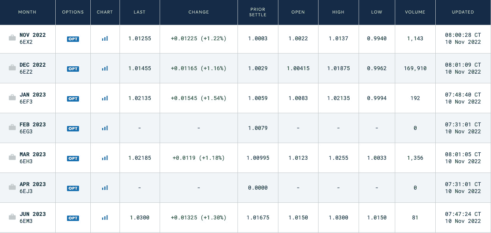

# 9

# 交易策略及其核心要素

在前面的章节中，我们从两个角度考虑了**算法交易**（**algo**）和系统化交易：我们学习了市场本身、其参与者、其运作方式以及所有这些如何反映在定价上；另一方面，我们在编程方面做了一些准备工作，因此现在我们可以检索和处理市场数据，构建技术指标，并进行一些图表和绘图。换句话说，我们已经拥有了未来交易应用身体的灵魂和骨架，现在是时候添加大脑和四肢了：生成订单的交易逻辑，以及最终将应用与最终目的地——交易所、经纪商或**电子通信网络**（**ECN**）连接的订单执行控制机制。

在本章中，我们将考虑通常用于交易外汇市场的最重要的交易策略类别。我们将了解盈利来源，考虑典型的交易想法及其实际应用，并了解它们的技术要求。

注意，我们不会开发实现所有这些类型策略的实际代码。其中一些可能仅对机构交易员可用，而另一些则需要复杂且昂贵的基础设施，例如直接与交易所或 ECN 服务器放置的交易服务器，特殊硬件如**现场可编程门阵列**（**FPGAs**）等。我们在这本书中提到它们有两个原因。首先，了解算法交易的替代方法肯定是有用的。其次，你永远不知道未来你会在哪里：例如，作为银行交易员或对冲基金的研究员，在这种情况下，这种知识，即使是非常表面的，也将非常有帮助。

在本章中，你将学习以下主题：

+   阿尔法和贝塔作为盈利来源

+   期权定价——最消耗科学的风险模型

+   阿尔法经典——趋势跟踪、均值回归和突破

+   套利——让我们从他人的错误中获利

+   统计套利

+   事件驱动交易策略

+   做市商——从提供流动性和相关风险中获利

+   高频，低延迟——Python 失败的地方

# 阿尔法与贝塔——广泛使用，广泛混淆

如果你曾经阅读过任何关于算法交易或系统化交易的文章或书籍，或者只是曾经听过 CNBC，你很可能已经听说过**阿尔法**和**贝塔**生成程序（策略、系统、基金等）。正如经常使用的大量术语一样，使用它们的人并不一定真正理解它们的含义。让我们来澄清这个术语，因为理解它将真正有助于整理出千变万化的交易策略。

## 阿尔法——从价格变动中获利

根据 alpha（α）的一般定义（例如，您可以在 InvestmentU 上找到，见[`investmentu.com/what-is-alpha-investing/`](https://investmentu.com/what-is-alpha-investing/)），**alpha**（α）“*是衡量投资价值的一种特定测量，基于其相对于市场的表现。具体来说，alpha 衡量的是投资超越*市场回报*的能力。””

听起来熟悉吗？如果您对市场和交易感兴趣，很可能是的（否则，您为什么会读这本书？）

但这清楚易懂吗？不，因为这个*定义*用一个未知术语（*alpha*）替换了另一个（*beat the market*，这通常也被称为**优势**）。

文章继续说“*alpha 等同于异常回报率。”*为什么*异常*？因为有效市场理论声称没有一种方法可以系统地超越市场，因此任何超额回报都可以被认为是*异常的*。这更有意义，因为我们现在理解 alpha 是一个比较策略、投资组合或投资回报与基准（在上一篇文章中称为**广泛市场**）的指标。

用更简单的语言来说，有一个基准和交易策略的回报。如果后者大于前者，那么该策略就产生了 alpha。

简单吗？是的，但我们必须提出两个重要的观点。

首先，在这里必须注意的是，通过*超越市场*，alpha 方法仅考虑对基础资产的操纵，例如卖空、退出头寸并在不同价格重新进入、改变投资组合中资产的比例等等。

注意

换句话说，产生 alpha 通常意味着对资产本身的积极操纵，而不使用衍生品或卖方活动，如做市。

第二，有一个经常被忽视的问题：我们确实需要那个我们将要比较交易策略回报的基准。

当我们谈论投资时，基准是显而易见的：一个股票指数。这类最受欢迎的基准之一是标准普尔 500 指数——500 家大型美国公司的指数。您可以从这些公司中购买股票，并通过持有它们来跟踪指数，例如，持有 1 年。或者，您可以选择购买与指数比例不同的股票，购买不同的股票，卖出一些股票并用其他股票替换，或者进行任何其他积极投资——但当你比较你在那一年的回报与指数回报时，并且*如果您通过操纵市场敞口比指数本身做得更好，那么您可以说您*产生了 alpha*。

为什么这种方法在股票投资中合理？

如果我们审视标准普尔 500 指数的整个历史，我们可以立即看出美国股市总是随着时间的推移而增长。是的，有经济衰退，甚至还有大萧条，但在非常长的时期内，如果你从这个指数中的所有公司购买股票并等待超过 30 年，那么你几乎可以肯定能获得利润。

不要轻信我的话：检查任何标准普尔 500 指数历史数据的来源，你自己就会看到。以下是由雅虎财经提供的半对数图表（你自己去[`yhoo.it/3U6I5rm`](https://yhoo.it/3U6I5rm)查看）：

图 9.1 – 标准普尔 500 指数的历史数据显示，美国股市有很强的增长趋势

在外汇交易中，情况更为复杂和令人困惑，因为货币通常不作为长期投资工具使用——至少不像股票那样广泛。原因是货币具有利率，这使得它们与传统投资资产（参见*第六章*中的[*“经济新闻”*]部分，讨论[*“基本分析及其在 FX 交易中的可能用途”*]，关于[*“息差交易”*]的讨论）有根本性的不同，而这些利率会根据中央银行的决定而随时间变化。因此，当你购买并持有股票时，通常能带来股息，或者在最坏的情况下，如果董事会决定今年不支付股息，你将一无所获。然而，如果你购买并持有货币，你很可能要为在投资组合中拥有这种货币的奢侈付费——如果一对货币之间的利率差异为负。

将 S&P 500 作为基准的使用和滥用

由于标准普尔 500 指数的巨大普及度，它经常被用作各种事物的基准，而不仅仅是股票投资。我甚至目睹过将这个指数与高频交易基金的业绩进行比较。当然，这与 alpha、beta 和其他指标的传统意义毫无共同之处。

因此，很明显，我们需要一个适合外汇市场特定情况的基准。那么，我们可以用什么呢？

外汇交易策略的最简单基准可能是货币本身。

## 将汇率作为基准

我们可以使用与股票指数完全相同的方法：比较交易策略的回报与同一给定时期内货币本身的回报。例如，如果我们查看 2021 年 1 月至 2022 年 1 月的历史汇率 EURUSD，我们可以看到它们从大约 1.2240 下降到大约 1.1290，下降了 8%。所以，如果你在 2021 年初购买了欧元并持有到同年年底，那么你的“投资”将亏损大约 8%（实际上，由于利率差异，亏损可能更大）。但如果你在利率下降时积极管理你的投资，关闭多头头寸并开仓空头头寸，你可能只会亏损大约 5%。从技术上讲，你甚至可以说你“打败了市场”，尽管从实际角度来看，这样的投资几乎没有什么意义。

外汇交易的好消息是你可以轻松地买卖货币——这与股票不同，卖空你并不拥有的股票（从价格下跌中获利）可能存在问题。因此，在外汇交易中产生 alpha 的最合理方式是根据市场价格走势的方向改变你的头寸方向。

但如果你交易的不是单一货币对，而是一篮子货币呢？在这种情况下，有没有可以用来评估 alpha 的基准？

是的，这类最被认可的基准之一就是**美元指数**（**USDX**）。

## 常见的外汇基准——美元指数

美元指数（代号 DXY）是“**美元相对于一篮子其他货币的表现的实时衡量指标**”（参见 Forex.com，[`www.forex.com/en-us/news-and-analysis/what-is-the-dollar-index/`](https://www.forex.com/en-us/news-and-analysis/what-is-the-dollar-index/))。如果我们从投资的角度来解释它，那么它与股票投资非常相似，但不同的是，你购买或出售的是美元相对于一篮子货币（目前包括欧元、英镑、瑞士法郎、加拿大元、日元和瑞典克朗）。

例如，如果 DXY 在年初的价值是 100，而到了年底，其价值是 110，那么这相当于 10%的收益。如果你在年初用这篮子货币购买了美元，那么你的投资收益将是 10%——同样，这是相对于同一篮子外国货币而言的。

美元指数对于评估外汇交易策略和投资组合非常有用，因为它已经消除了利率的影响，我们可以说它以最纯粹的形式呈现了外汇市场的潜在 alpha 值。

如果我们查看以下图表中美元指数的历史值，我们可以看到，它与标准普尔 500 指数截然不同，不能用作长期投资——这与任何单一货币的情况相同：

图 9.2 – USDX 的历史图表（由 TradingView 提供）

一般而言，如果你通过操作其中的货币（买入、卖出或调整篮子中的比例）超越这个指数，你相对于这个指数就产生了 alpha。

USDX 并非唯一的 FX 指数。许多大型机构提供他们自己的指数，旨在评估 FX 市场的各个部分或甚至各种交易或投资方法。让我们看看一些由最重要的国际银行提供的指数，因为这些指数不仅经常被用作被动投资的基准，也常被用作主动交易的基准。

## 银行指数 – 更多细节，更多困惑

这些指数有时仅起指示性作用；而另一些则是可交易工具。例如，德意志银行列出了许多 FX 指数（[`index.db.com/dbiqweb2/home.do?redirect=productpagelist&region=All&regionHidden=All&assetClass=FX&assetClassHidden=FX&returnStream=ALL&returnStreamHidden=ALL`](https://index.db.com/dbiqweb2/home.do?redirect=productpagelist&region=All&regionHidden=All&assetClass=FX&assetClassHidden=FX&returnStream=ALL&returnStreamHidden=ALL)）。其中一些代表经典的买入并持有策略，而另一些则追踪德意志银行的自身主动投资。因此，如果你开发了一个产生 alpha 的策略，那么与这些指数之一进行比较更有意义。让我们考虑一个例子。

假设你开发了一个篮子交易策略，该策略购买低估的货币并卖出高估的货币。那么，将你的策略的表现与德意志银行 FX 动量美元指数（[`index.db.com/dbiqweb2/servlet/indexsummary?redirect=benchmarkIndexSummary&indexid=99800323&currencyreturntype=USD-Local&rebalperiod=2&pricegroup=STD&history=4&reportingfrequency=1&returncategory=ER&indexStartDate=20191103&priceDate=20221103&isnew=true`](https://index.db.com/dbiqweb2/servlet/indexsummary?redirect=benchmarkIndexSummary&indexid=99800323&currencyreturntype=USD-Local&rebalperiod=2&pricegroup=STD&history=4&reportingfrequency=1&returncategory=ER&indexStartDate=20191103&priceDate=20221103&isnew=true)）进行比较是有意义的，如果你的策略在较低波动性的情况下提供了更高的回报，那么太好了 – 你通过你的策略创造了 alpha：

图 9.3 – 德意志银行 FX 动量美元指数图表

总体来说，货币汇率并不倾向于随着时间的推移持续增长。这就是为什么使用单一货币或货币篮子的汇率作为基准，并不像使用股票指数作为投资基准那样有意义。

让我们总结一下。在 FX 交易的世界里，通过生成 alpha，我们假设我们将通过积极操纵投资组合中的货币，超越任何相关的 FX 指数——包括单一货币的买入并持有回报。从这个意义上说，几乎所有*买方*策略都属于这一类别（参见*第一章*，“开发交易策略——为什么它们不同”，以刷新你对买方和卖方市场参与者的记忆）。这正是本书将进一步考虑的策略类型。

主要收获

以最简单的术语来说，在 FX 交易中，我们所说的 alpha 是指无论价格上涨还是下跌，都能从中获利。因此，对于生成 alpha 的策略来说，最糟糕的市场就是价格没有足够波动的市场。

但这真的是一个问题吗？这些市场存在吗——那些价格没有实质性变化的市场？

当然，它们确实会。任何 FX 市场都可能或多或少地变得波动，这主要归功于流动性的变化，有时也归功于中央银行施加的特殊条件。例如，让我们看看 2012 年 4 月至 9 月欧元对瑞士法郎的图表，当时**瑞士国家银行**（**SNB**）决定人为地将瑞士法郎的汇率与欧元挂钩：

图 9.4 – EURCHF 历史报价图表（来源：TradingView）

我们可以看到，这个货币对在近 5 个月内仅在 26 个基点的狭窄范围内交易！仅作比较，截至 2022 年 11 月，同一货币对的平均每日波动范围为 60 个基点。显然，在这样的*稳定*市场中几乎不可能产生任何 alpha。

但有没有一种方法可以在价格没有变动的情况下仍然获利？

答案是肯定的，现在进入戏剧的第二个人物：beta。

## Beta – 从波动性中获利

beta 的概念也起源于股票投资。它指的是投资组合实现的回报波动性——并且，就像 alpha 的情况一样，与基准相比。当然，在股票交易的情况下，这通常也是一个股票指数，S&P 500 再次是最常见的例子。

我们已经在*第七章*的*“波动性指标”*部分讨论了市场波动性。投资或交易策略的回报波动性可以通过或多或少相似的方式进行研究。在投资和交易中，beta 是衡量你为了实现预期利润可能承担的损失风险的指标。

为了更好地理解回报的波动性，让我们考虑旅行的例子。比如说，你想从伦敦到纽约。从起点到达目标最直接的方式是乘坐直飞航班。这条路线将是我们的基准。你也可以享受一个两周的海上之旅，这将慢得多，也不那么直接。否则，你可以开车去法国，然后乘坐火车和公共汽车去挪威，然后乘船去冰岛，然后乘飞机去加拿大，然后从那里开车、乘火车或公共汽车去纽约。

你看出了区别吗？在所有三种情况下，你都是从起点到达目标，但你的路径波动性会有很大的不同。

返还情况也是如此：让我们绘制两种交易策略（或投资组合，这并不重要）随时间推移的假设回报。其中一种策略的波动性会小一些，另一种则会更大：

图 9.5 – 同样的起点和目的地，不同波动性的公路旅行或投资

很明显，右侧图表的回报波动性大于左侧图表，任何正常的投资者或交易者都会更喜欢后者。在风险度量语言中，我们说*右侧图表的 beta 大于左侧图表的 beta*。

如果我们现在从上一节相同的视角来看外汇市场，我们可以看到，就像 alpha 一样，评估*投资与基准之间的差异*是很困难的，因为没有人像股票那样投资货币。所以在外汇交易中，beta 可以解释为市场的波动性本身，如果一个策略从这种波动性中获利，那么我们就说这是一个产生 beta 的策略。

我们如何从波动性中获利，而不是从价格变动中获利呢？

这可以通过使用最复杂但也是最强大的金融工具之一——期权来实现。

# 期权——稳定的收入与无限的风险

这个副标题听起来很荒谬，不是吗？稳定的收入怎么可能和无限的风险并存呢？

要理解它，我们首先需要了解期权是什么，以及如何进行交易。

**期权**是一种衍生品（参见*第一章*，*开发交易策略 – 为什么它们不同*，其中对标的资产和衍生品进行了简要解释），它赋予其持有者在未来以特定价格买卖标的资产的权利，但没有义务。

我知道一开始理解起来真的很困难，所以让我们考虑一个例子。比如说，现在是十月，一公斤苹果的价格是 1 美元。我认为到十二月，它的价格会增长到 2 美元，但另一个市场参与者认为，即使价格上涨，也不会超过 1.5 美元。所以，这个市场参与者写了一个在十二月以 1.5 美元购买苹果的期权，并将这个期权以溢价卖给我。

现在，如果我是错的，12 月份一公斤苹果的价格确实低于 1.5 美元，那么我会损失我支付给对方的溢价金额，而对方将获得（正是这个溢价）利润，但如果是我的判断正确，一公斤苹果的价格是 2 美元或更高，那么我就实现了以 1.5 美元购买苹果的权利，并立即以 2 美元的价格卖出，从而获利。而这个利润显然是由卖给我这种权利的对方承担的。

如你所见，*期权卖方纯粹从波动性中获利*：对他们来说，价格走向真的无关紧要；只要波动性不超过某个水平，他们就能获利。

你能在这里看到问题吗？

对于期权卖方或写作者来说，利润总是固定的，等于溢价，但潜在损失是无限的。在我们的例子中，如果苹果的价格是 20 美元而不是 2 美元会怎样？这种意外和急剧的价格上涨可能会对期权卖方造成重大损失。

为了说明通过卖出期权赚钱的可能性，让我们回顾一下上一节中提到的 EURCHF 的例子。如果市场在一个狭窄的范围内交易，就有可能卖出购买该范围之上的期权（它们被称为**看涨期权**）和卖出该范围之下的期权（它们被称为**看跌期权**），并收取溢价，这可以作为稳定的收入。

但我们都知道，没有无风险的交易，如果市场突然超出范围（坦白说，这不是一个“是否”的问题，而是一个“何时”的问题），期权卖方可能会遭受严重的损失。

让我们看看同样的 EURCHF 是如何实际发生的。瑞士国民银行（SNB）维持了法郎与欧元的汇率挂钩，这导致市场交易在一个狭窄的范围内，正如我们之前看到的。但有一天——2015 年 1 月 15 日——SNB 决定将法郎从欧元中脱钩。结果，EURCHF 在瞬间下跌超过 20 个点（一个点等于 100 个基点）或几乎 20%，卖出看跌期权的期权卖方（看跌期权是卖出特定价格的权利）遭受了难以置信的损失，因为他们没有机会清算他们大量亏损的头寸。*图 9.6*展示了这一价格跳跃（或者说，更确切地说，是一次小行星般的下跌），你可以看到波动性在几分钟内超过了任何可想象和可信的极限：

图 9.6 – SNB 决定将法郎从欧元中脱钩后 EURCHF 的急剧下跌

总的来说，尽管不是无风险的，但无论价格的实际走势方向如何，都有可能在波动性上进行交易，这类策略被称为产生β的策略。

通常，期权交易者使用各种波动率模型来帮助计算*安全*的价格水平和撰写期权的适当溢价。这种方法被称为**期权定价**，它是算法交易中最科学密集的领域之一。我们不会在本书中考虑它，因为它需要相当高级的特定数学领域的知识。

现在我们已经熟悉了生成 alpha 和 beta 的想法，让我们考虑一些最受欢迎的 alpha 生成策略。

# Alpha 经典策略 – 趋势跟踪、均值回归、突破和动量

让我们快速回顾一下生成 alpha 的想法：我们希望通过积极管理市场中的头寸来打败市场或表现优于指数（或在外汇交易中只是利率本身）。这意味着我们试图在预期价格上升时买入，在预期价格下降时卖出。

因此，为了成功生成 alpha，我们基本上只有两个选择：要么我们假设价格将继续按照已经确立的方向移动，要么我们预测一个变化。在前一种情况下，我们试图在价格上升时买入，在价格下降时卖出。在后一种情况下，我们试图在价格下降时买入，在价格上升时卖出。

仅供专业人士参考

在这里的所有讨论和例子中，我故意没有深入数学。我们专注于这些现象的定性方面，以便更好地理解它们的本质，我们将在本书的后面部分考虑一些描述这些现象的具体数学模型。我还故意留下了一些市场模型和交易策略没有实际应用，因为它们太复杂，无法在一个章节内考虑。

既然我们已经了解了我们的（某种程度上有限）选择，我们将详细考虑每个选项。让我们从一个试图加入已经确立的价格走势并保持其走势的经典策略开始。

## 趋势跟踪

这可能是迄今为止最著名的交易策略。它起源于股票市场，正如我们所知，股票市场往往会随着时间的推移而持续增长。因此，在交易股票时，跟随整体上涨趋势进行买入并持有确实是合理的。

有趣的是，交易中的趋势是那些没有严格正式定义的术语之一。一些作者将趋势定义为市场价格中一系列更高的高点和更高的低点，或者相反——更低的高点和更低的低点，但这样的定义是模糊的，因为它忽略了波动性（参见*Beta – 从波动性中获利*部分中的例子）。我们可以这样说，如果以下情况在给定时间段内适用，则市场处于趋势中：

+   价格发生显著变化（即，观察区间开始和结束之间的价格差异的绝对值大于平均值）

+   市场贝塔值低 – 即波动性小于价格变化

+   观察的时间间隔相当大：其持续时间比单个样本的持续时间大几个数量级（例如，如果数据分辨率为 1 天，那么我们可以考虑 50-200 天的趋势时间跨度）

让我们看看几个例子。这些图表说明了趋势（在右侧图表中）和非趋势（在左侧图表中）市场：

图 9.7 – 根据基于贝塔的定义（Multicharts 图表）的趋势（右侧）和非趋势（左侧）市场

此图清楚地显示了经典趋势定义的不一致性（更高的高点和更低低点或更低的高点和更低低点）。在两个图表中，价格都存在一定的下降趋势。在两个图表中，我们都可以看到一系列更低的高点和更低的低点。然而，考虑到贝塔值，可以清楚地看出左侧图表代表非趋势市场，而右侧图表描绘的是趋势市场。

如果我们将波动性计算为标准差，并在中间回归线之上和之下绘制，我们可以看到左侧图表中产生的回归通道宽度更大，而价格本身在右侧图表中的变化绝对值更大。为了简化分析，我们在每个图表下方添加了一个指标，该指标绘制了考虑期间标准差的最大值 – 因此，该线代表最新的实际波动值。您可以看到，在右侧图表中，alpha 值更大，beta 值低于左侧图表，因此我们可以说，根据我们的定义，右侧图表代表一个真正的趋势。

如果我们能够识别出趋势，最好是开始时，加入这个长期的价格运动，并在它反转之前退出，那么我们有可能产生 alpha。当然，由于我们是系统交易，我们需要一个*技术交易设置*，一套数学公式，以一定程度的概率确定趋势或非趋势市场。我故意现在不深入数学；本章的目的只是让你熟悉这些概念。有一些经典的技术设置用于识别趋势，大多基于移动平均线（见*第七章*，*技术分析和其在 Python 中的实现*）和线性回归。我们将在*第十二章*，*样本策略 – 趋势跟踪*中看到这种技术的实现。

## 均值回归

这种交易策略背后的想法最初在股票交易中再次出现。尽管从长远来看，市场总是倾向于增长，但在短期内，我们总能看到市场价格的起伏。因此，我们可以假设存在一个随时间增长的平均价格，并将偏差视为暂时的，因此价格最终会回到那个均值值。

从这个角度来看，即使是大萧条也只是一个偏差，事实上，如果你在 20 世纪 30 年代足够大胆地买入美国股票，并且活的时间足够长，直到 1950 年持有它们，那么你很容易就能使你的财富翻倍或三倍，至少是其名义价值（如果你不考虑通货膨胀，那么你可能会非常惊讶地发现，你不能用三倍的钱购买三倍数量的商品）。

因此，**均值回归**的关键在于观察的时间间隔。如果我们考虑一个较短的时间跨度，比如说，1 年或更少，我们可以在那里看到任何类型的市场效应：上升趋势（或**牛市**）、区间波动、平缓或下降趋势（或**熊市**）。然而，从长期角度来看，似乎几乎所有熊市都只是从不断增长的假设均值值中的一次暂时回调。

正如我们已知的那样，货币市场并不像股票市场那样表现出相同的长期上涨倾向，因此不可能简单地购买每一次显著的回调，并在 10-20 年内保持正面。相反，我们有一个优势：我们可以轻松地买卖任何货币与任何其他货币。因此，货币市场的均值回归概念略有不同：如果我们能识别当前价格与理论均值相差太远，那么我们就进入市场，朝着这个均值的方向进行交易，也就是说，与价格运动当前方向相反。

均值回归也经常被称为**逆势交易**（或者更准确地说，逆势交易是均值回归的一种变体），因为在逆势交易中，我们不仅买入或卖出，然后长时间持有头寸，而是相对于主要价格运动的方向进入市场进行相对较短时间的交易。以下图示了在相当稳定的趋势中进行的可能的逆势交易：

图 9.8 – 在长期趋势期间假设的逆势交易（由 Multicharts 图表）

在这个图表中，大的灰色向下箭头标记了潜在的逆势入场点（即我们能够卖出英镑并买入日元的时刻），细黑线标记了如果我们保持逆势头寸这么长时间可能实现的潜在利润（假设我们在每条线的末端退出）。正如你所看到的，逆势交易的时间比趋势跟踪短得多，而且它们出现的频率也更高。

你可能会问：如果我们可以在 2020 年 9 月买入 GBPJPY 并在 2021 年 5 月卖出，为什么还要进行逆势交易？

这有两个严重的原因。

首先，货币市场的趋势相当罕见。趋势跟踪策略可能在 3 年内只进行 4-6 次交易，而且不能保证所有这些交易都会盈利（就像任何系统交易一样）。

其次，我们保持头寸的时间越长，市场最终与我们作对的风险就越大。除此之外，趋势跟踪头寸的回报波动性（回报的 beta 值）将很高，因为它会复制市场的波动性。因此，放置多个逆势交易，这些交易在市场上停留的时间相对较短，可能会提高整体策略表现的 beta 值。

货币市场还有一个非常有趣的特点：时间跨度越短，市场越具有均值回归性。使用每日数据，虽然数量不多，但可以找到真正长期的趋势。如果你考虑以 4 小时为间隔采样市场数据（你可以在*第五章*的*数据压缩 – 保持数量在合理最低值*部分中刷新你对市场数据采样的记忆），那么识别可交易趋势就已经变得有难度了：在每日数据上有效的方法会产生大量*虚假*趋势。如果你将数据压缩到 1 小时、1 分钟或更短，你会发现趋势与非趋势市场阶段的持续时间比例会大幅下降，以至于均值回归几乎成为唯一可以成功使用的交易技术。

为什么会发生这样的事情？

在货币市场中，导致趋势跟踪在较短时间内失效的关键因素之一是它们都表现出强烈的日内周期性。这种周期性是由市场的性质决定的：它每周开放 24 小时，5 天，但市场参与者的活动在一天中的不同时间差异很大。

中午时分（从现在开始假设我们处于 GMT 时区）具有更高的流动性和更大的交易量，同样，在伦敦和纽约的工作时间内也会发布同等重要的经济新闻。夜间总是具有较低的流动性和较低的交易量，除了亚太地区外，没有重要的经济新闻。因此，日内价格波动不可避免地表现出强烈的周期性，这使得识别可交易的日内趋势相当困难。在*图 9*.*9*中，你可以看到波动性（仅指每个柱子的范围，即柱子的高点和低点之间的差异）的最简单表示，很明显，在 FX 市场中日内周期性非常强：

图 9.9 – 日内（1 分钟）价格图表和波动性（由 Multicharts 图表）

在这个图表中，我们可以清楚地看到（从左到右）看起来像趋势的东西，但它只持续了 2 天，之后转变为横向（区间）市场。同时，波动性（在价格图表下方简单地表示为每个柱子的高低差）保持这种强烈的周期性，如果你仔细观察图表，你会看到每天，无一例外，我们都有价格缓慢变化和快速变化的时期。因此，这个因素显著地影响了货币市场的整体日内价格行为，比趋势更倾向于均值回归。

与趋势跟踪一样，我们不会深入讨论特定交易设置来交易均值回归。通常，技术指标如 RSI 或随机振荡器被用来确定价格变动的方向以及*超买*和*超卖*区域，然后一旦价格进入这样的区域，就会进行与该变动相反的交易。在*第十四章*“现在去哪里？”中，我将提供一些关于这些技术设置的链接，您可以在自己的策略中使用。

市场活动中突出的日内周期性应该让我们思考：有没有一种方法可以系统地交易这个过程？答案是肯定的，尽管不是直接也不是在所有市场中。让我们看看突破交易技术。

## 突破

趋势跟踪和均值回归都是试图交易价格本身的变化。**突破**是另一种不同的生物：它是试图交易波动性的变化。

突破背后的想法基于市场在狭窄范围内交易和突然出现剧烈价格波动的周期交替的假设。在波动率的语言中，这意味着低波动率期最终会转变为高波动率期。因此，突破市场模型假设价格波动只由这两个阶段组成：低波动和高波动，如果我们能识别前者，那么我们就可以在价格一旦离开其“舒适区”并加入新建立的价格运动时立即进入市场。在突破交易中，我们不在乎趋势、均值回归或任何其他因素；我们只关注从低波动率到高波动率的相对短期变化过程。

下图说明了典型的突破设置。我们可以看到，从 11:30 到大约 13:30，GBPJPY 在狭窄的范围内交易（在价格图表上由两条水平线表示），波动率也很低（低于下方的波动率图表上的水平线表示的平均值）。然后，发生了某种情况；价格离开了范围，并稳步上升，距离是原始范围宽度的三倍。波动率也增加了，并在整个运动过程中保持在平均值之上。

图 9.10 – 典型的突破日内交易设置（图表由 Multicharts 提供）

虽然突破交易看起来非常吸引人，对于日内交易来说，由于日内低波动和高波动期的内在交替，这似乎非常自然，但它并不是交易的圣杯——就像任何交易技术一样。我故意向您展示了一个**理想**的突破图表，但在现实中，这种情况在所有外汇市场中都相当罕见。此外，突破设置的界定非常模糊，具有许多自由度。

事实上，我们说价格首先应该在**狭窄的范围内**交易，但如何定义**狭窄**呢？然后，我们说价格应该离开这个范围，波动率也应该超过其平均值，即使在这样一个理想化的例子中，我们也可以看到许多**假突破**——当波动率超过平均值时，但价格却没有移动。

因此，为了利用突破机会，我们需要有一个稳健的正式数学描述，即什么是**狭窄范围**，**价格离开范围**意味着什么，以及我们如何认为波动率是**大于平均**的。

现在，我们已经了解了最流行的 alpha 生成交易策略，这些策略就是我们接下来要深入探讨的内容。不幸的是，在一本书中不可能对各种交易策略进行同等详细的讨论（否则它将变成一部多卷本的百科全书！），但我们将会快速浏览它们，以便你知道系统性和算法交易的世界是极其广泛和多样化的。也许这会激发你对算法交易其他应用的兴趣，或者——谁知道呢？——也许这会帮助你实现金融职业。

# 套利——让我们从他人的错误中获利

在金融市场上的**套利**意味着利用同一资产在不同交易场所价格不同的情况。这种情况通常被称为**定价错误**（这个术语还有其他含义，我们将在下一节关于统计套利的下一节中回到这个话题）。由于外汇市场的巨大碎片化（参见*第三章*，*从开发者角度的外汇市场概述*），定价错误并不少见，因此套利策略看起来相当直接：一旦我们看到，比如说，EURUSD 在 LMAX 的价格是 1.00012，而在 IS Prime 的价格是 1.00013，那么我们就同时在 LMAX 买入，在 IS Prime 卖出，赚取十分之一的点差。

我想你可以清楚地看到套利中存在的一些问题，这些问题直接源于其描述。

首先，单次交易的潜在利润非常小，因此您必须进行大量的交易才能持续盈利。别忘了交易成本：佣金、交易服务器维护费等等。您的交易应该覆盖所有这些成本；否则，您只会实现交易者所说的**纸上利润**。

经典套利的第二个（也是主要问题）是套利者的数量——他们行动如此迅速，以至于在您的订单执行之前价格可能已经改变。然后，您有两个选择：要么等待希望价格回到交易有利可图的水平，要么以损失了结您的头寸。从这个意义上说，套利的风险类型与市场做市商的风险类型有些相似（参见*市场做市商——舒适、复杂、昂贵*部分*第三章*，*从开发者角度的外汇市场概述*），尽管前者是生成 alpha 的买方交易活动，而后者是赚取 beta 的卖方交易活动。

外汇市场还特有一种独特的套利形式，被称为**三角形套利**。这种套利之所以存在，仅仅是因为我们不是用货币买卖资产，而是用货币相互交易。因此，我们可以在所谓的合成货币对中寻找定价错误的机会。让我们来看一个例子。

假设 EURUSD 的汇率为 0.99745。同时，USDJPY 的汇率为 146.336。如果我们使用这两个汇率来计算欧元对日元的汇率，我们将得到 EURJPY 的汇率为 145.963，但当我们查看实际市场时，我们发现特定交易场所 EURJPY 的实际汇率为 145.972。实际货币对（EURJPY）与我们的合成计算汇率之间的差异为 0.9 个点。因此，我们立即卖出 USDJPY（因此，我们拥有 JPY 并卖出了 USD），以及 EURUSD（因此，我们拥有 USD 并卖出了 EUR），这有效地在 EURJPY 上创造了一个空头头寸。同时，我们从被错误定价的汇率处买入 EURJPY，从中获利 0.9 个点。

当然，三角形套利容易受到与*普通*套利相同的疾病的影响：速度至关重要，潜在损失总是远大于潜在利润。因此，通常，套利是金融机构的领域，我们在这里只是简要地讨论了它，以便你知道它是如何工作的（并且让我再次重复，谁知道你明年会在哪里工作？）

# 统计套利

如前所述，套利基于错误定价的想法：资产被错误定价的情况。但要说某物定价是否正确，我们需要一个已知定价正确的参考，不是吗？

在经典套利中，这样的参考是资产价格本身，我们利用同一资产在不同交易场所之间的错误定价。**统计套利**（**stat arb**）使用公允价值的概念来确定资产是否被错误定价。简单来说，在经典套利中，我们比较同一时刻存在的资产价格与另一资产价格。在统计套利中，我们比较资产价格与一个理论上的公允价值，我们期望价格在未来会回归到这个价值。

在某种意义上，统计套利是对均值回归概念的修改或扩展。确实，一个成功的均值回归策略是基于对各种价格-量-波动性设置的统计分析，假设如果价格偏离某个均值太远，那么它迟早会回归到这个均值。统计套利将均值替换为公允价值，这可以从多个因素中得出，从资金流动到政治局势。

统计套利最流行的应用之一是**衍生品交易**。我们已经在*第三章*的*交易机制 – 再次一些术语*部分中简要提到了衍生品，*从开发者的角度来看的 FX 市场概述*。让我们更深入地探讨这个复杂但非常有趣的领域。

简单来说，衍生品是一种金融工具，它赋予其所有者购买或出售资产的权利，或者在某些日期以特定价格购买或出售资产的责任。注意衍生品的这两个强制性属性：*在特定日期以特定价格*。这使得衍生品的价格与资产（称为**标的资产**）不同——因为它们都有**到期日**，即最终结算应进行的日期。

如果你不太熟悉衍生品，这确实听起来很复杂，但实际上却相当简单。让我们来看一个例子。

假设今天是 1 月 1 日，EURUSD 的当前价格为 1.00000。我认为价格将在 3 月的第三个星期五增长到 1.02000。你认为它不会超过 1.01000。因此，你卖出**期货合约**，即以 1.01000 的价格出售欧元的义务，而我购买了这份合约，对我来说，这意味着在相同的日期——3 月的第三个星期五——从你那里购买欧元的义务。这个日期被称为期货合约的到期日，到期日相互买卖的过程称为**结算**。

我认为在到期日我们的头寸可能发生什么应该是很清楚的。如果我说对了，欧元的价格确实上涨到了 1.02000，那么我将以 1.01000 的价格从你那里购买欧元，并立即以 1.02000 的价格卖出，这意味着我赚了 100 个点。随后，你必须以 1.01000 的价格将欧元卖给我，考虑到其市场价格现在是 1.02000，你将损失 100 个点。

到期日显著影响期货合约的价格。通常，到期日越远，与今天的价格或现货价格相比，相应的期货合约价格差异就越大。以下图表说明了这种差异：

图 9.11 – 不同到期日的 CME 外汇欧元期货价格（来源：CME）

你可以看到，到期日越远，相应的期货合约价格就越高。这意味着在这个快照时刻的市场整体情绪是看涨的——大多数交易者认为欧元将会随着时间的推移而增长。

当然，这种情绪不能直接交易——因为标的资产的价格可能会下跌，然后期货合约的价格也会下降。然而，价格差异为统计套利打开了大门：我们可以假设最终——到到期日——期货的价格应该回归到**公平价值**，这将等于欧元本身的现货价格。因此，购买到期日较早的合约并卖出到期日较晚的合约，或者相反，可以在衍生品市场之间进行一种统计套利。

通常，统计套利设置包括数百个市场，有时甚至数千个，寻找统计上确认的潜在定价错误（潜在——因为它们不会在某一时刻存在，但可能在将来实现）。我们不会详细考虑统计套利，因为这个领域如此之大，值得有一本单独的书来讨论。

然而，与经典套利不同，统计套利对任何交易者（只要有足够的资金来承担数十个同时开放的头寸）都是可用的，所以如果你对它感兴趣并想了解更多，我建议从一些数学知识开始，即学习关于相关性([`en.wikipedia.org/wiki/Correlation`](https://en.wikipedia.org/wiki/Correlation))和协整([`en.wikipedia.org/wiki/Cointegration`](https://en.wikipedia.org/wiki/Cointegration))，然后阅读 Sabir Jana，CFA 写的一篇简短但信息量很大的文章([`medium.com/analytics-vidhya/statistical-arbitrage-with-pairs-trading-and-backtesting-ec657b25a368`](https://medium.com/analytics-vidhya/statistical-arbitrage-with-pairs-trading-and-backtesting-ec657b25a368))，其中作者解释了使用股票构建统计套利设置的基本原理——但同样的方法也可以应用于货币及其衍生品。

到目前为止，我们已经考虑了基于价格、成交量以及波动率等不同设置的 alpha 生成策略。然而，存在一类策略根本不考虑这种市场信息，或者至少部分不考虑。这些是事件驱动策略——而且不要把它们与应用程序的事件驱动架构混淆！

# 事件驱动交易策略

事件驱动策略主要依赖于非市场数据，如经济或政治新闻。我们已经考虑了这些事件对市场价格的影响（参见*第六章*，*基本面分析的基础及其在 FX 交易中的可能用途*)。因此，事件驱动策略可以在重大新闻冲击市场时尝试进入，并在之后不久退出。

同一章节中也详细考虑了这类策略的问题：由于新闻发布时流动性不足，价格可能在任意距离上几乎向任何方向跳跃，因此你几乎没有机会在期望的价格上成交。同时，流动性的回归可能会将价格推向相反方向，几分钟内完全消除盈利的可能性（再次参见*第六章*中的例子，涉及英镑和英国 GDP 数据的发布）。

我可以确认，在 2000 年代初，曾经存在过盈利的新闻交易员，但自 2010 年以来，要使这种交易持续下去确实非常困难。因此，我们不会在我们的策略中出于任何目的使用非价格信息，除了可能是在潜在的高影响新闻发布之前停止策略的执行。

# 做市——从流动性提供和相关风险中获利

我们已经在*第三章*的“做市商——舒适、复杂、昂贵”部分详细考虑了做市，所以在这里没有必要重复。我们在这里仅为了保持一致性，将其作为一个卖方交易策略的例子提及。如果我们想要将做市归类为与 alpha 或 beta 生成策略相关，我们可能可以将它归类为 beta 生成策略。然而，与此同时，高 beta 值对做市是有害的。一般来说，做市要求交易者不仅要有足够的资金，还要满足各种监管要求，这使得这项活动主要对机构开放。

做市需要不仅能够直接访问订单簿，并有能力在那里更新最佳买入价和卖出价，而且还假定你能够比其他人更快地发送自己的买入价和卖出价以及匹配客户订单。通过这种方式，我们进入了低延迟和高频交易（HFT）的领域。

# 高频、低延迟——Python 的失败之处

如果不提及高频交易（HFT），我们的概述将是不完整的。其根源在于 2008 年的金融危机，当时流动性成为大多数，如果不是所有发达市场的主要问题。交易所开始向提供流动性的个人提供激励，取消了之前要求流动性提供者受监管的许多限制。因此，许多市场参与者开始提供流动性，或者更确切地说，在订单簿中展示了这种流动性——因为他们只发送了一个订单，几毫秒后从簿中撤回。换句话说，他们开始制造骗局，创造流动性的错觉。

当然，要想在这里取得成功，你需要能够每秒处理数千笔交易，并将延迟（即从订单发送到交易所到订单出现在订单簿中的时间）降低到绝对最小。这就是为什么高频交易（HFT）需要位于非常昂贵的数据中心、尽可能靠近交易所服务器的昂贵计算机。

高频交易受到了严厉的批评，尤其是在两次被称为 **闪电崩盘** 的事件之后：在这些情况下，价格在没有明显原因的情况下大幅下跌（超过 10%）。完全有可能的是，如果一位高频交易员发送了一个大订单，那么买方市场参与者决定与这个订单进行交易，并且高频交易员在交易前的一小部分毫秒内撤回了订单，那么买方订单就会扫清订单簿，将价格移动到当然既不是预期也不是希望达到的水平（参见 *第三章* 中的 *“交易所和订单簿”* 部分，*从开发者角度的 FX 市场概述*）。

因此，很明显，由于速度问题，Python 将会在高频交易（HFT）领域失败。大多数高频交易算法是用 C++ 编写的，有时也用 C 编写，其中最关键的部分有时是用汇编语言编写的。再次值得一提的是，像 Numba 或 Cython 这样的编译器可以显著提高 Python 代码的速度；然而，它们无法达到编译后的 C 或 C++ 代码的速度。除此之外，所有基于 Python 的解决方案对 FPGA 的支持都非常有限，因此有时专业的算法交易员会说 Python 只适合于 *慢速 HFT* 算法（这些算法以毫秒而不是微秒为单位工作）。

考虑到所有这些因素，我们在这本书中不会考虑高频交易策略也就不足为奇了。只是当你看到订单簿中一个不错的订单时，要意识到你并不总能抓住它以获取利润！

# 摘要

在本章中，我们学习了系统交易和算法交易的关键术语和概念。我们熟悉了 alpha 和 beta 作为投资中的风险指标，同时，作为算法交易中利润生成的方法。我们考虑了几种流行的 alpha 生成交易策略，并了解了它们的优点、缺点和相关的风险。我们还简要介绍了期权交易这一复杂领域，作为在市场 beta 上盈利的主要方法，并快速浏览了其他交易策略，如套利、统计套利、做市和 HFT。

现在我们知道了某些策略可能进入或退出市场的情况，我们通往第一个交易应用的道路上的最后一个障碍就是根据策略规则生成订单、将它们发送到市场并控制它们执行机制的机制。回忆一下本章开头提到的类比，现在我们已经为我们的交易应用添加了大脑，现在是时候添加它将能够移动的肢体了。这正是我们将在下一章中开发的。
