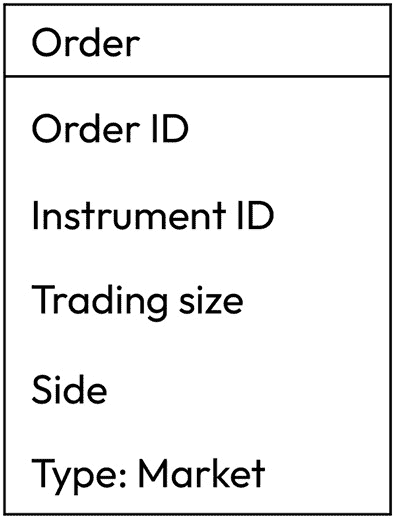

# 10

# 订单类型及其在 Python 中的模拟

在上一章中，我们考虑了在 FX 交易中通常采用的一些经典交易策略。所有这些都可以自动化——也就是说，是否进行交易的决策可以仅基于定量数据，而将交易放入市场可以通过算法完成。因此，我们现在需要找到一种适当的方式来放置交易并控制其执行。

我们已经提到（见*第一章*，*开发交易策略——为什么它们不同*），任何交易，无论是手动还是自动化，都可以通过使用订单在市场上进行：向经纪人（或任何其他中介）发出买入或卖出的指令。还有什么能比这更简单？然而，现实总是更复杂。你可能希望在某个价格进行交易，不低于某个价格，不超过从某个价格指定的 pip（点）数，等等。除此之外，在真实市场中，存在真实的流动性，这总是非常远离无限，因此你的订单可能会被拒绝，部分成交，或者以*错误*的价格执行，以及许多其他未预料到和不受欢迎的事情，如果你没有做好准备的话。

现在，是我们学习大多数 FX 流动性池通常支持的主要订单类型的时候了，考虑根据订单类型的不同执行差异，了解根据目标选择订单类型，并准备好概述订单模拟引擎的架构，该引擎模仿可能的执行问题，并随着交易逻辑一起，帮助你测试和改进你的策略，以便在实际投入真金白银之前适应现实生活条件。

在本章中，我们将涵盖以下主题：

+   订单票据——你发送的即你得到的

+   市场订单——控制交易风险的最大方式

+   限价订单——保证价格，但不保证执行

+   有效期限——更好地控制执行

+   止损订单——最大未受控风险

+   复合订单

# 订单票据——你发送的即你得到的

让我们从起草一份通用订单票据的原型开始——这是发送给交易场所的东西。

通常，订单以 FIX 消息（见*第四章*，*交易应用——内部结构是什么？*）或根据场所规格的 JSON 格式发送。正如我们在*第四章*中提到的，每个场所都有自己的数据和订单接口，但订单的核心属性始终是相同的。

实际上，这些属性的列表相当合理。让我们准备一个空表单，并逐个填写其字段。

首先，每个订单都应该附带一个 ID。否则，我们或交易场所如何引用它？如果我们进行实时交易，那么交易场所将生成一个订单 ID 供我们接收，但如果我们运行回测并想要修改之前发送的订单，我们需要一个内部生成的订单 ID。无论如何，在我们的订单表格中，第一项是**订单 ID**：

图 10.1 – 订单的第一个属性是订单 ID

接下来，我们需要让场所知道我们想要在哪个市场进行交易。一如既往，请记住，每个交易场所都有自己的规定。例如，EURUSD 可以发送为*EURUSD*、*EUR/USD*、*eur-usd*等等。所以，在实际上发送订单之前，请检查场所的文档。让我们将第二个记录添加到订单单据中 – **工具 ID**：

图 10.2 – 添加了工具 ID

我们还需要指定我们想要交易的数量或交易大小。交易大小可以用手数（再次，请参考场所文档了解一手是多少）或直接用货币来指定。

例如，在 LMAX，购买 1 手 EUR USD 的订单意味着购买 1,000 欧元并卖出相应数量的美元，而在 Interactive Brokers，卖出 100,000 美元 JPY 的订单实际上意味着卖出 100,000 美元并买入相应数量的日元。在指定订单大小时要小心！现在，我们的订单单据由三个记录组成：

图 10.3 – 订单中指定的交易大小

当然，我们还应该指定交易的哪一方：我们是要买还是卖。一些场所仅使用*买*和*卖*指定符，而其他场所建议使用*买入价*和*卖出价*来表示方向，所以正如你所见，咨询场所文档是算法交易中唯一稳定的东西。总的来说，现在我们的订单单据上有四个记录：

图 10.4 – 指定交易的哪一方

我们准备好了吗？看起来是这样，但实际上并没有。交易场所期望我们指定一些其他交易参数：我们应该说明我们希望如何执行订单，*在什么价格*，以及*何时*。这三个额外参数中的第一个被称为订单类型，我们通常区分*市价订单*、*限价订单*和*止损订单*。还有一些所谓的**复合**或**条件订单**，它们本质上是由这三种基本订单类型的组合，但并非所有场所都支持。因此，我们只将详细考虑这三种主要订单类型。

# 市价订单 – 获取最大交易风险控制的途径

让我们从最简单（至少从第一眼看来）的订单类型开始：市价订单。**市价订单**是购买或出售一定数量的资产以**市价**的订单。通过市价，我们通常假设最佳买入价或最佳卖出价（参见*第三章*，*从开发者角度的 FX 市场概述*，关于最佳买入价和卖出价的解释），并且大多数交易策略开发者仅使用最佳买入/卖出历史数据来测试他们的想法。因此，我们可以在我们的订单票证原型中添加另一条记录，这条记录代表订单类型：

图 10.5 – 指定订单类型

我们已经看到（再次参见*第三章*，*从开发者角度的 FX 市场概述*），流动性可能对实际订单执行方式有重大影响，并且当单个大订单在执行过程中可能移动最佳买入价或卖出价时，这种情况被认为是相当常见的。因此，在将订单发送到市场之前，确保订单将以最接近订单簿中立即看到的最优买入价或最优卖出价的价格执行是很重要的。

使用这种订单类型可以确保如果订单被执行，那么你将获得订单中指定的交易资产的准确数量。同时，它并不保证平均执行价格将与订单簿的顶部相同，因为这种执行方法允许购买或出售订单簿中目前存在的全部金额。

例如，让我们回顾一下*第三章*（*交易所和订单簿*部分中的*图 3.1*）中显示的订单簿示例。想象一下，我们发送一个市价订单购买 1,000 份合约。它会被执行吗？是的，因为订单簿中有超过 1,000 份合约。但将以什么价格成交呢？

发送订单时的订单簿中，最优卖出价（2,149.25）有 155 份合约，然后是 2,149.50 的 306 份合约，接着是 2,149.75 的 291 份合约，最后是 2,150.0 的 532 份合约。因此，我们的订单将消耗前三个价格水平上的所有流动性，以及第四个价格水平上的 248 份合约。结果平均执行价格可以使用标准加权平均公式计算：

![公式 B19145_10_001.jpg]

在这里，*P*代表加权平均价格，*p*表示订单簿中的价格，而*q*表示数量，即在价格*p*下成交的合约数量。在我们的例子中，它将是大约 2,149.658，这比 2,145.25 要远得多，后者是我们发出订单时的最佳卖出价。

订单以更差的市场价格执行或根据现有流动性分部分填充订单的现象称为**滑点**。

因此，当我们需要填补确切的交易规模时，市价单可能是有用的，但这也可能导致以低于预期的价格填补。那么，为什么我们说市价单是*控制交易风险的最大途径*呢？

原因在于，使用市价单，我们可以尽可能地对订单进行细粒度和精确的排序。确实，没有什么阻止我们开发一个算法，该算法首先检查订单簿中的流动性，然后只发送不会破坏流动性的订单。如果你需要用大额订单（例如，如果你为金融机构工作）来填补订单，你可以将这个订单分成几部分，并依次发送多个市价单，直到整个金额被填补——再次强调，不要过多地干扰订单簿。

如果我可以这么说的话，使用市价单的另一个*好处*是，这是唯一一种所有交易场所都接受而没有例外的情况。虽然我们将会考虑其他类型的订单，例如限价和止损，但请记住，它们并不总是由你计划与之合作的场所支持。

## 可能的执行问题

除了刚才讨论的流动性和平均价格填补问题外，市价单的主要问题是，这样的订单（如果没有指定有效期——见本章后面的内容）将以当前市场中的任何价格执行。是的，99% 的时间，它不会引起真正的问题，因为流动性相当充足，尤其是如果你交易主要货币对（构成美元指数的那些货币对，见*第九章*，*交易策略及其核心要素*，*常见外汇基准——美元指数*部分），但你记得在重要经济新闻发布时会发生什么吗？快速回顾一下*第六章*，*基本面分析的基础及其在 FX 交易中的可能用途*中的*图 6.2*和*图 6.4*，并刷新一下美国**非农就业人数**（**NFP**）和英国 GDP 案例：在这些事件发生期间，相邻价格跳动之间的差距或距离可能达到几十个点。

因此，如果我们考虑美国 NFP 案例，并假设你希望在 NFP 发布前的一秒以市价单卖出 1.0230，那么订单很可能会在新闻发布后的第一个跳动时执行，即 1.0210——距离期望价格有 20 个点的差距！

好吧，看来市价单的情况大致是清晰的：我们说*买入*或*卖出*，然后立即成交（无论是否有流动性相关的问题）。但如果我们想以*某个特定价格*买入或卖出，或者更精确地说，以不差于某个价格的价格执行我们的订单，我们该怎么办？嗯，这就是限价单的作用。

# 限价单 - 保证价格，但不保证执行

简要来说，**限价订单**是在指定价格或更好的价格买入或卖出指定数量的资产的一种订单。

这里“更好”是什么意思？

这意味着如果我发送一个以 1.0100 买入 EURUSD 的限价订单，那么任何低于 1.0100 的价格都将匹配我的订单。相反，如果我发送一个以 1.0100 卖出 EURUSD 的限价订单，那么任何高于这个水平的价格都将匹配。换句话说，通过使用限价订单，我表示*我愿意以订单中指定的任何不低于该价格的价格买入或卖出*。

如果你以比当前市场价格更好的价格发送限价订单会发生什么？例如，以低于当前卖出价的*买入限价*订单？嗯，这取决于你的经纪商或执行场所使用的限价订单的具体实现。如果你在交易所交易（例如，如果你交易货币期货），那么你的订单将直接进入订单簿。

如果你交易现货或远期合约，那么这样的订单很可能会留在交易场所的系统里，直到市场价格触及订单水平，然后订单将被转换为市价订单。如果市场价格从未达到订单水平，订单可能会被取消，或者可能在实际意义上永远留在经纪商的订单簿中（当然，不是真的永远，每个经纪商都有自己的规则来处理*被遗忘*的限价订单）。

如果我们以比当前市场价格更差的价格发送限价买入订单会发生什么？例如，以高于当前卖出价的*买入限价*订单？在这种情况下，订单将立即执行，并且它将从订单簿的级别开始吸收流动性，推动价格不断上升，但*这个过程将在触及限价时停止*。因此，以低于市场价格的价格发送的限价订单可以被视为*带有保护的市价订单*。

现在我们知道，除了市价订单外，我们还可以使用限价订单，如果我们使用它们，我们应该在我们的订单票证原型中指定一个新字段：*订单价格*。

图 10.6 – 为停止和限价订单添加的价格属性

到目前为止，看起来限价订单在所有情况下都是最好的选择，但这真的是真的吗？当然，正如在交易中没有免费的午餐也没有圣杯一样，限价订单并不是执行问题的万能药。让我们深入探讨这个领域，因为限价订单的执行问题远不如市价订单的明显。

## 可能的执行问题

尽管市价订单的主要执行问题是它们保证了执行本身但并不保证执行价格，限价订单的主要问题正好相反：限价订单保证了执行价格（仅凭其定义）但并不保证执行本身。

事实上，让我们仔细考虑这两种情况：如果我们向交易所发送一个以*更好的价格*（即，对于*买单限价*低于当前价格，对于*卖单限价*高于当前价格）执行的限价单，以及如果我们向经纪人或 ECN 发送这样的订单。

如果我们与交易所合作，限价单会直接进入订单簿（实际上并不是真的直接：首先它们会通过经纪人的风险管理系统，检查你是否拥有足够的保证金来发送这样的订单，但在当前情况下这并不重要）。然而，我们应该记住，订单簿在现实中是二维的（参见*第三章*中的*图 3.2*，*从开发者角度的 FX 市场概述*，在*交易所和订单簿*部分），并且我们的订单将始终以相同的价格水平放在当前订单队列的末尾。因此，当市场价格触及订单水平时，即有人实际上以订单价格进行了交易，并不能保证该交易的规模足以匹配同一价格水平上的所有订单——包括我们的订单。

备注

在算法交易项目的研究和开发阶段，最常见的错误之一是假设所有限价单都会被执行，即使它们的价位只被一个价位点触及。这种错误的假设通常会导致各种*圣杯*交易策略的产生，这些策略只在纸上有效。

如果我们与外汇经纪人或 ECN 交易，那么我们的限价单很可能不会进入任何订单簿，除了那个经纪人之外没有人会看到它——直到市场价格达到订单水平。此时，限价单将转换为市价单并实际上发送到市场。采用这种方法，我们可能会遭受与使用市价单交易时相同的疾病——可能以比限价单价格更差的价格执行，这与限价单的定义正好相反。

对于这个问题有几种解决方案，其中大多数解决方案都是由执行场所实施的。大多数方案在发送市场订单之前都会检查订单簿中的流动性：如果订单规模超过了最佳买价/卖价的流动性，那么订单只执行部分，直到实际可用的金额。这样，就模仿了传统交易所订单簿的传统行为。

听起来令人失望？

好吧，实际上，一些（不幸的是，并非所有）执行场所允许对订单执行有更大的控制。在发送订单之前检查订单簿中的流动性是一种好习惯，但与一些交易技术提供商合作，我们还可以使用特殊条件或指定条件来控制订单的有效时间。

# 有效时间 – 更好的执行控制

之前提到的指定通常被称为**有效期**条件，尽管，正如你将在本章稍后看到的那样，对于其中的一些，这并不真正明显或直观。

重要区分

通常，这些执行方法指定被称为**订单类型**。这不仅在一些经纪商的文档中可以找到，而且在交易书籍和学术研究中也可以找到。所以，当你遇到任何文档中的*订单类型*或*有效期*时，一定要非常小心，并确保你确切地理解作者的想法：订单类型本身（市价、限价、止损等）、其有效的期间，或者订单应该如何在流动性方面执行！

在以下小节中，我们将详细考虑不同的订单指定。

## 立即成交或取消

附带在市价订单上的**立即成交或取消**（**IOC**）指令意味着：我想以市价（即当前最佳买入/卖出价）最多买入或卖出 X 欧元、美元、手数、合约等，但价格不能低于这个价格，而且*我不在乎是否不能得到全部的 X 欧元、美元等，只希望得到更少的数量*。如果市场流动性不足以满足我的订单，那么就填入可用的部分，并取消剩余的部分。

换句话说，*使用 IOC，我优先考虑价格* *而非数量*。

例如，我发送一个 IOC 市场订单以购买 1,000,000 EUR USD。当前卖出价是 1.01234，当前卖出价处的可用数量是 500,000。那么，我将购买 500,000 EURUSD，以 1.01234 的价格，而我剩余的订单（另外 500,000）将被取消。

使用 IOC 订单可能是防止以不希望的价格成交的最好方法，但你应该记住，使用它可能会导致部分成交 – 因此，你的交易算法应该以某种方式考虑到这种情况。

## 全部成交或取消

**全部成交或取消**（**FOK**）指令意味着：我想以市价买入或卖出*正好 X*欧元、美元、手数、合约等，但如果最佳买入/卖出价处的流动性不足以完成整个订单，则根本不执行此订单（或*取消*此订单）。

换句话说，*使用 FOK，我优先考虑订单的完整性而非其执行*。

在相同的例子中，如果我发送一个 1,000,000 EURUSD 的市场买入 FOK 订单，但最佳卖出价处只有 500,000，那么整个订单将被取消（取消），并且不会执行部分成交。

你可能会想知道为什么 IOC 和 FOK 都被认为是有效期指定：两者都假设订单立即、即时执行。答案可能就在问题中：使用 IOC 或 FOK，我们指定订单应该尽快执行；这样，我们就指定了它的有效期。

大多数执行场所只支持市价订单的 IOC 或 FOK，但也有一些允许将 IOC 或 FOK 添加到限价订单中。这很有意义，因为一些执行场所会在限价订单的价格被市场触及时将其转换为市价订单，因此在这种情况下，市价订单的时间有效指定符变得绝对有效。

当然，还有其他时间有效指定符，可以为订单提供比 IOC 或 FOK 更长的生命周期。最常见的是**当日有效**和**取消前有效**。

## 当日有效（GTD）和取消前有效（GTC）

这两个指定符都假设订单可以部分成交，并设定了它可以成交的时间框架。

GTD（当日有效）订单试图以最佳买卖价填充可用的部分，剩余的部分将保留在交易场所的订单簿中直到当天结束（在大多数情况下，即纽约时间下午 5 点）。任何时刻，当价格回到订单水平时，订单的另一部分将被执行。

GTC 订单的行为方式类似，但没有明确指定订单保持有效的具体时间。交易者应该手动或自动地关注所有 GTC 订单。

在现实中，这两个指定符都与限价订单一起使用，仅仅意味着这样一个订单将保持有效的时间，因为如果我们通过检查流动性采取所有适当的措施，那么在大多数情况下，限价订单将立即被执行。

现在我们已经熟悉了时间有效指定符，是时候更新我们提出的订单票结构了：

图 10.7 – 添加了时间有效属性

到目前为止，我们已经讨论了市价订单（*我现在买入*）和限价订单（*我以这个价格或更好的价格买入*）。但如果我们有一个*以这个价格或更好的价格*的订单，那么应该存在一个*以这个价格或更差的价格*的订单，不是吗？是的，这种订单类型确实存在，它被称为止损订单。

# 止损订单 – 最大不可控风险

从本质上讲，**止损订单**是一种以指定价格*或更差的价格*买入或卖出指定数量资产的订单。

你可能会在这个时候问：我为什么要以低于我愿意的价格买入或卖出呢？

答案非常简单：*更好*和*更差*只是指订单价格相对于当前市场价格的关系。

例如，如果当前 EURUSD 的价格是 0.99673，而我发送了一个在 0.9989 的买入止损订单，那么我的订单将在任何等于或高于 0.9989 的价格被执行。与限价订单类似，止损订单将存在于经纪商的订单簿中，直到市场价格触及订单价格，然后转换为市价订单。请注意，与限价订单不同，即使你与交易所交易，止损订单也永远不会立即发送到订单簿。这是非常自然的：如果我向订单簿发送限价订单，那么我就提高了市场的流动性，因为其他人可能成为我的交易对手，然后我在某种意义上成为他们的流动性提供者。但是，如果止损订单被发送到订单簿，它将立即与那里的某个限价订单匹配，并立即以不可预测的距离移动价格。

实际上，让我们考虑一个例子。假设我们有一个 EURUSD 的订单簿，当前市场价格（最佳买价/卖价）是 1.00000/1.00005。有一些限价订单以 0.99999、0.99998 等价格买入，还有一些限价订单以 1.00006、1.00007 等价格卖出。现在，想象一下有人发送了一个以 1.0020 买入的止损订单，并且这个订单被发送到订单簿。当然，卖方（那些在*卖价*一侧的人）会非常乐意以 1.0020 的价格卖出，而不是 1.0010 或 1.00008。因此，发送到订单簿的止损订单将触发最远离当前最佳买价/卖价的订单簿水平，这与订单簿的基本理念正好相反。

注意

并非所有执行场所都支持止损订单。许多机构流动性池只支持市价和限价订单（其中一些只支持市价订单）。因此，始终模拟本地止损订单是一个好主意。

因此，回到我们可能想要使用止损订单的原因的问题，现在我们理解了，当我们想要执行以下两个动作之一时，我们可以使用它：

+   如果我们想要买入，则在高于当前价格的价格进入市场；如果我们想要卖出，则在低于当前价格的价格进入市场。

+   当价格与你的头寸相反时退出头寸——也就是说，亏损。这种情况发生在当前价格低于多头头寸（买入）的入场价格，或者当前价格高于空头头寸（卖出）的入场价格。

如果我们使用止损订单从亏损的头寸中退出，那么它被称为**止损订单**。

注意

很频繁地，停止订单与止损订单混淆。然而，停止订单可以用来进入和退出市场，而止损订单始终只用于退出亏损仓位。换句话说，*停止订单*是一个更广泛的概念，与一般交易相关，而*止损*是一个狭窄的概念，仅与交易逻辑相关。从交易场所的角度来看，用于开仓或平仓的停止订单之间没有区别，因此*止损订单*可能只会在特定经纪商的文档中提及，而不是交易场所的文档。

既然我们知道停止订单在一定程度上是*人为的*，并且实际上作为条件市价订单执行，我们就可以理解它们执行的典型问题。

## 可能的执行问题

当然，停止订单的主要执行问题与市价订单类似：停止订单的滑点可能是无限的。如果我们发送一个买入停止订单，那么它将在等于或高于订单价格的价格执行。这类似于卖出停止订单：它将在等于或低于订单价格的价格执行。

停止订单保证了执行，但不能保证价格——从这个意义上说，它们与市价订单有些相似。让我们再次回到*第六章*中的*图 6**.2*，*基本面分析的基础及其在 FX 交易中的可能用途*，它说明了美国 NFP 数据发布前后交易（tick）的顺序。想象一下，我们在新闻发布前持有多头仓位，并在 1.02250 处设置了一个保护性停止（止损）订单。在新闻发布后的第一个 tick，这个停止订单将被执行——但不是在 1.02250 处。它将在第一个可用的价格执行，这可能是 1.02100 或更低（更低）。

总要记住，即使你放置了止损订单，这也并不意味着你通过订单的价格水平限制了你的损失。它可能会在请求价格之外执行，从而增加损失。

值得注意的是，一些做市商提供*保证止损执行*。这意味着在像美国 NFP 或类似情况这样的事件期间，当价格可能在一次 tick 内跳过停止订单价格时，他们仍然会在请求的价格执行订单，而不是市场价格。只有做市商才能做到这一点，因为他们为你这个价格接受者报价。当然，这里也没有免费的午餐，所以做市商会为此服务收取溢价。这种溢价通常意味着更宽的价差或更高的佣金。

使用*保证*止损订单是否有意义？嗯，这取决于你模型中的交易逻辑及其统计数据。如果你将止损订单作为退出头寸的常规手段，即使在*平静*的市场中也是如此，那么答案可能是否定的，因为你会在价差和佣金上损失更多。如果你只将其作为应对意外灾难性市场价格变动的保护措施，那么答案可能是肯定的，因为这种灾难性变动可以在一个 tick 内摧毁你的账户——只需回忆一下瑞士国家银行将瑞士法郎（CHF）汇率与欧元脱钩的案例，该案例在*第九章*“交易策略及其核心要素”中的*图 9**.6*中描述。

考虑到所有这些，经纪商处的止损订单大多被用作保护性止损订单，用于退出亏损头寸并削减持续亏损。如果你的策略逻辑假设随着价格变动进入市场，例如典型的突破策略，那么本地模拟此类止损订单并将其作为市价订单甚至限价订单发送到市场，以防止不良执行，总是一个更好的主意。

现在，我们可以提出我们的一般订单单据的最终草案，该草案将支持所有三种主要类型的订单（市价、限价和止损）以及发送订单到经纪商所需的所有基本属性：

图 10.8 – 订单单据现在支持所有类型的订单

与限价订单类似，IOC 和 FOK 不与止损订单一起使用，但 GTD 和 GTC 可以。除此之外，一些执行场所还提供触发止损订单的额外条件，即将止损订单转换为市价订单：无论是当买入价或卖出价触及订单水平时触发。然而，这个指定器并不常见。

市价、限价和止损订单是实际上被几乎所有交易场所接受的标准化订单。然而，一些场所提供其他类型的订单，这些订单通常被称为复合订单，我们将在下一节中探讨。它们并不常见，也不是必需的，但至少值得知道它们存在以及它们在非常一般意义上的工作方式。

# 复合订单

**复合订单**是指那些在执行过程中假设一定逻辑链的订单。这就是为什么它们也被称为**条件订单**。严格来说，此类订单不是一个单独的订单：它是一系列依次触发的订单。

作为最常见的例子，让我们考虑一个**止损限价单**。与止损或限价单不同，它需要指定两个价格：止损价和限价。如果将此类订单发送到执行场所，首先，该场所的匹配引擎会等待市场（最佳买价/卖价）价格触及订单的止损价。之后，订单将使用其限价价格执行，就像执行限价单一样。因此，止损限价单是两者的结合。

例如，如果当前 EUR USD 的价格为 1.01015，而我想要以 1.0102 的价格买入，我可以使用止损单进入市场——但我记得在止损单执行过程中，我可能会得到一个可能无限大的滑点。因此，我发送了一个包含两个价格的止损限价单：止损价为 1.0102，限价为 1.01025。然后，一旦市场（这意味着要价或出价变为等于或大于 1.0102；参见前一部分中关于止损订单的特殊执行条件说明）触及 1.0102，实际上就会执行一个 1.01025 的限价买单。因此，我将以 1.0102（止损价）和 1.01025（限价）之间的任何价格买入 EURUSD。

值得注意的是，止损限价单仅用于进入市场，永远不会用作止损单。止损单必须确保整个订单量被完全成交，但止损限价单，就像任何限价单一样，不能保证整个订单量的执行。

# 摘要

现在，我们已经熟悉了三种主要类型的订单，并且知道在哪些情况下我们更喜欢使用市价、止损和限价单，在哪些情况下我们宁愿避免使用它们。除此之外，从之前的章节中，我们记得如何接收和处理市场数据，如何使用技术分析，并且我们记得关键风险，并至少有一些关于如何缓解这些风险的想法。因此，我们为任何算法交易员在研究和开发阶段的最终、终极任务做好了准备：我们即将开始起草一个交易应用，这将接收数据，处理数据，生成交易信号，将它们转换为订单，将订单发送给经纪人，处理经纪人的响应，并收集交易统计数据，这些数据最终可以证明或反驳交易想法。这就是我们在下一章将要做的。
