# 11

# 回测和理论性能

这已经是一段漫长且希望是充满趣味的旅程——尽管有时也很艰难。我们用了十章来熟悉市场结构的所有基本要素以及构建系统化和算法交易基础的关键概念。现在，我们已经接近这本书的结尾。是时候将所有碎片拼凑在一起，开始开发我们的第一个既可以用于研究也可以用于生产的交易应用了。

我们将开发一个通用原型，您只需重新编写部分内容而不修改整个结构，就可以使用和重用。我们将追踪从接收 tick 到下单的所有路径——同时检查我们所有行动的一致性。我们将学习如何保持交易应用各部分的同步，并了解为什么这样做如此重要。最后，我们将收集一些示例交易策略的基本统计数据，并计算其理论性能——在整个研究和开发过程中最重要的逻辑点。

在本章中，我们将涵盖以下主题：

+   交易应用架构——修订和改进

+   多线程——方便但充满惊喜

+   带有实时数据流的交易应用

+   回测——加速研究

# 交易应用架构——修订和改进

在*第一章*，*开发交易策略——为什么它们不同*中，我们提出了一个交易应用的通用架构。简要来说，它包括以下组件：

+   **数据接收器**：从市场检索实时数据或从本地存储检索历史数据的组件；参见*第五章*，*使用 Python 检索和处理市场数据*

+   **数据清理**：一个消除非市场价格的组件；参见*第一章*，*开发交易策略——为什么它们不同*

+   **交易逻辑**：交易应用的大脑，负责做出交易决策（参见*第六章*，*基本面分析基础及其在 FX 交易中的可能应用*，*第七章*，*技术分析及其在 Python 中的实现*，以及*第九章*，*交易策略及其核心要素*），通常还包含集成的事前风险管理

+   **订单界面**：接收交易逻辑的交易信号，将它们转换为订单，并跟踪其执行情况；参见*第十章*，*Python 中的订单类型及其模拟*

+   **交易后风险管理**和**开放头寸管理**，例如跟踪运行亏损和清算亏损头寸或所有头寸

总之，这个简化的架构列出了基本组件，但没有说明它们之间是如何相互通信的。当然，可以使用线性架构，其中所有组件都作为依赖的代码片段依次执行。这种解决方案很简单，但存在显著的缺点：

+   您无法添加更多交易逻辑组件以并行运行多个策略

+   您无法向多个交易场所发送订单

+   您无法在交易逻辑中接收关于实际综合市场头寸的信息

+   您无法重用相同的代码（至少在部分上）用于开发和生产

让我们暂时停下来，谈谈这四个缺点。

关于前两点，你可能可能会说，您不会运行多个策略并在多个交易场所进行交易，因为我们只是刚开始接触算法交易，而且跨场所和跨交易逻辑更像是一种机构活动。我可以说，在现实中，私人交易者做所有这些事情是非常正常的，但这两个点的重要性不如剩下的两个点。

要理解第三点的重要性，我们必须引入一个新术语：**综合** **市场头寸**。

想象一下，您有几种策略，它们都在同一个市场上交易——比如说，EURUSD。第一个策略购买了 10 万欧元，第二个策略卖出了 8 万，第三个策略购买了 5 万。这是为什么？这是一个相当常见的情况：例如，您运行了一个短期均值回归策略，一个长期突破策略，以及一个长期趋势跟踪策略（见*第九章*，*交易策略及其核心要素*）；它们独立生成交易信号，但只要它们都在同一个市场上交易，它们都会对当前交易的资产数量做出贡献。这个数量被称为综合市场头寸。

在我们的例子中，每个策略的个别头寸是 100,000 多，80,000 空，还有另一个 50,000 多，所以综合头寸是*70,000 多*。这是您的实际市场敞口，所有头寸规模计算都应该基于这个数字。

但这样的综合头寸的入场价格是多少呢？

在*第十章*，*订单类型及其在 Python 中的模拟*中，我们探讨了部分执行订单的平均执行价格。同样的方法可以用来计算综合市场头寸的平均入场价格。让我们用我们三个开放头寸的例子来做这个简单的数学计算。

假设第一个（100,000 多单）头寸是在 1.0552 时*打开*的，第二个（80,000 空单）是在 1.0598 时，第三个（50,000 多单）是在 1.0471 时。首先，我们计算这些价格乘以相应交易规模的和。别忘了将空单（实际上减少了综合市场头寸）计为负数：

`S = 100000 * 1.0552 – 80000 * 1.0598 + 50000 * 1.0471 =` `73091`

现在，我们将总和，*S*，除以实际的综合市场头寸，*MP*，它等于*70,000*，我们得到平均入场价格：

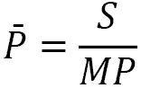

在我们的例子中，综合平均价格大约为 1.0442。乍一看，这似乎很荒谬，因为它远远低于实际交易价格中的最低价。但确保它是正确的其实非常简单。

假设当前市场价格为 1.0523。让我们计算每个头寸的运行**利润或亏损**（通常称为运行**PnL**或运行**P/L**；参见*第三章*，*从开发者角度的 FX 市场概述*，*交易机制——再次一些术语*部分）:它只是当前价格与入场价格之间的距离乘以交易规模。在 1.0523 的运行 PnL 等于(1.0523 – 1.0552) * 100,000 = -$290，第二个头寸的运行 PnL 等于(1.0523 – 1.0598) * -80,000 = $600，第三个头寸的运行 PnL 等于(1.0523 – 1.0471) * 50,000 = $260。因此，对于综合市场头寸，运行 PnL 等于$570。

现在，让我们只使用一个综合市场头寸的价格和规模来做同样的数学计算。鉴于它是在 1.0442 时*打开*的，当前市场价格为 1.0523，其运行 PnL 为(1.0523 – 1.0442) * 70,000 = $567，这并不完全等于$570，仅仅是因为我们将平均价格四舍五入到第四位。因此，我们确实可以使用综合市场头寸的平均价格和结果交易规模，而不是分别计算每个头寸的 PnL。

知识分子笔记

这种将所有订单及其相应的交易量平均计算的综合头寸通常被称为**量加权平均价格**（**VWAP**）。然而，VWAP 通常仅用于评估通过多个同一方向的头寸累积的头寸，只要我们讨论的是作为双边交易结果的网络头寸，我更喜欢使用*综合*，尽管它不是一个常规术语。

综合市场头寸对于正确实施风险管理至关重要。如果你不知道这个头寸，你就不知道你的运行利润或亏损，因此你不知道何时平仓亏损头寸——这可能导致灾难性的损失。此外，你可能甚至不知道要平仓多少，而是打开一个新头寸，而不是仅仅弥补损失。

即使你在单一市场中运行一个策略，了解实际市场中存在的确切市场位置也同样重要：不要忘记，由于多种原因，某些订单可能无法执行或以不同于预期的价格执行（见*第十章*，*订单类型及其在 Python 中的模拟*）。因此，如果你不让你代码从经纪人向交易逻辑提供反馈，你可能很难管理你的头寸。

第四个缺点希望更加明显：如果我们能提出一个灵活、模块化和可重用的架构，那么它相对于每次想要切换数据源时都需要完全修改的东西具有优势。

因此，考虑到所有这些因素，我们建议如何使我们的交易应用架构满足所提到的所有要求？

我们已经知道解决方案，并在*第五章*，*使用 Python 获取和处理市场数据*中相当成功地使用了它。这个解决方案是使用*线程*和*队列*使应用组件独立工作。我强烈建议你通过参考该章节的*与保存和实时数据一起工作 – 保持你的应用通用*部分来刷新你对线程和队列的记忆。

现在，让我们重新绘制应用架构图，这次稍微低一些级别，更接近传输层，而不仅仅是业务逻辑。

和往常一样，我们将从开始：接收实时（订阅）市场数据。

## 市场数据组件

此组件应能够从几乎任何来源接收订阅数据，对其进行清理，将其转换为整个应用中使用的单一格式，并将它们放入数据队列：

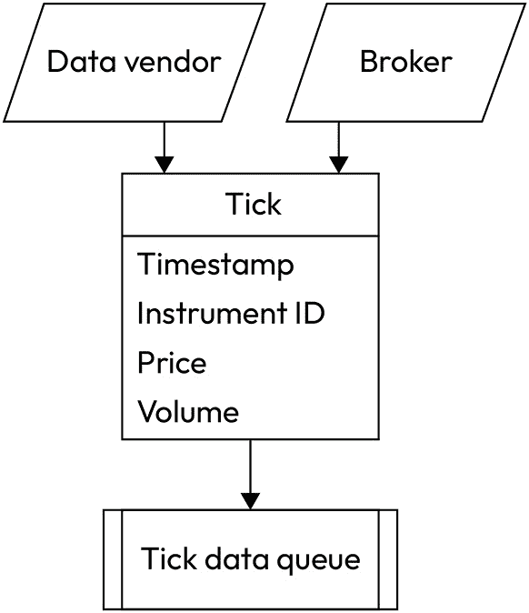

图 11.1 – 订阅数据接收组件

这种方法的优点在于，一旦订阅数据被发送到订阅队列，我们就可以忘记它。这个过程现在与整个应用的其他部分隔离，如果我们需要更改数据供应商或经纪人，我们可以通过重写相应的模块来完成，而无需在其余代码中进行任何更改。

许多策略都需要订阅数据。例如，套利策略（见*第九章*，*交易策略及其核心要素*）可以使用*仅*订阅数据来工作。然而，大多数交易策略使用基于压缩数据的逻辑，而不是订阅数据。因此，我们需要添加一个组件，可以将订阅数据聚合为条形图（见*第五章*，*使用 Python 获取和处理市场数据*，*数据压缩 – 将金额保持在合理的最低限度*部分）。

## 数据聚合组件

此模块不仅应该能够将实时 tick 数据聚合为 bars。当我们开发策略时，我们通常使用已经存储在本地并以压缩形式存储的历史市场数据，因此在测试运行期间没有必要浪费时间聚合 tick 数据。因此，我们必须将以下部分添加到我们的应用架构中：

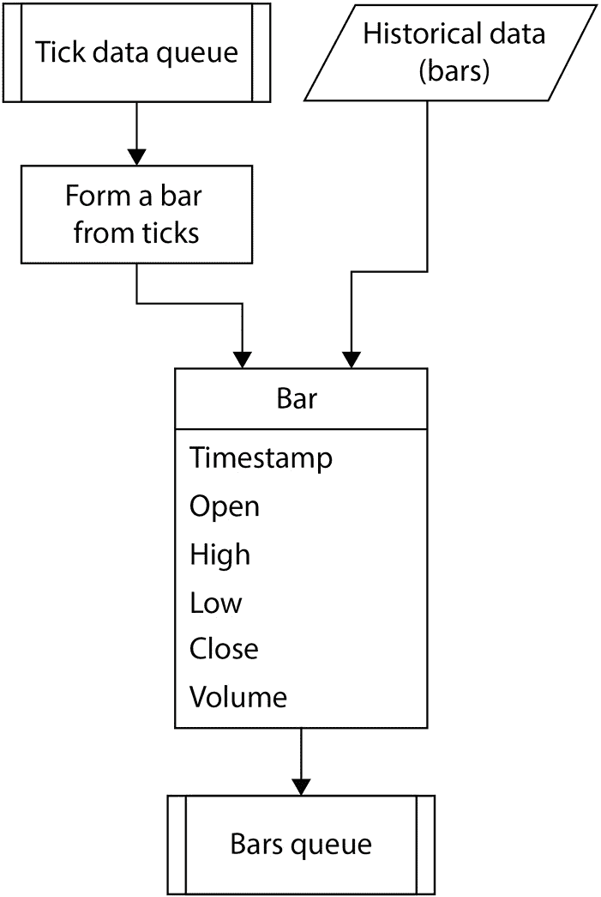

图 11.2 – 从存储中读取 bars 或从 ticks 形成 bars

同样，正如前一个案例一样，此过程被隔离于应用的其他部分，因此我们可以一次性实现它，直到我们需要修改将 tick 数据聚合为 bars 的方式。

接下来，我们应该实现交易逻辑。

## 交易逻辑组件

此组件可以使用 tick 数据和 bar 数据作为输入，并生成订单作为输出。此输出应进入交易应用的订单执行控制组件，因此再次使用另一个队列是很自然的：隔离订单执行组件与其他应用部分的订单队列。

然而，除了发送订单之外，我们还需要在交易逻辑和订单执行组件之间建立另一个连接。此连接应提供订单执行的反馈给交易逻辑。我们如何建立这样的连接？

此时可能首先想到的想法是再使用另一个队列。然而，在这种情况下，这并不方便。当您希望数据进入队列后立即触发某个过程时，队列是非常好的——换句话说，它们非常适合事件驱动的过程。但是，市场位置或权益值并不会自行触发任何过程：它们只是被交易应用的各种组件作为辅助值使用。因此，我们不会使用队列，而是创建一个对象来存储关于实施交易策略的所有必要数据，并将此对象共享给交易应用的所有组件。

此对象可以包含任何策略元数据，例如市场位置、权益时间序列（见下文）、运行 PnL、实现利润或损失、各种统计指标等：

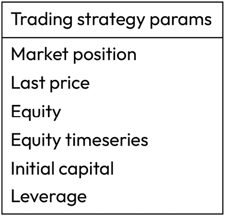

图 11.3 – 存储交易策略元数据的对象原型

最后价格指的是与上一个 tick（或 bar）收到的报价，它用于计算两个 tick（或 bar）之间的运行损益：如果头寸是*多头*且价格*上涨*，则运行损益也*增加*，如果头寸是*空头*且价格*下跌*，则运行损益仍然*增加*，依此类推。如果我们从策略开始到现在的每个 tick 或 bar 的运行损益变化进行汇总，那么我们将得到总损益，这通常被交易者称为**权益**。这是一个有点专业术语的词汇，因为正式来说，权益是归因于企业所有者的价值（例如，参见[`corporatefinanceinstitute.com/resources/valuation/equity/`](https://corporatefinanceinstitute.com/resources/valuation/equity/)以获取详细信息），但在算法交易中，*权益*通常只指实现的损益，加上未平仓头寸的价值。

我们还可以在每个 tick 或 bar 上保存权益价值，从而创建一个时间序列。这个时间序列通常被称为权益曲线，它是交易策略性能最常见的说明：策略过去的表现以及何时以及赚了多少钱（或亏损）。这些信息也可以由交易逻辑使用，连同市场价格数据和市场头寸。

我们还包含了两个与资金管理相关的参数：**初始资本**和**杠杆**。这些值可以用来检查我们是否有足够的资金进行交易，也可以用来确定我们订单的实际交易规模。

现在我们已经添加了一个在交易逻辑和订单执行组件之间传输策略元数据的通用对象，我们可以将交易逻辑组件添加到我们的架构图中：

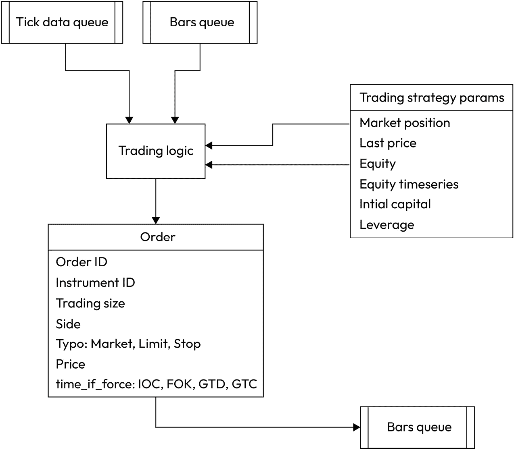

图 11.4 – 交易逻辑和常见交易策略参数容器

需要添加的最后一个强制性组件是订单执行组件。

## 订单执行组件

此组件不仅实现了与经纪商的订单接口或本地模拟订单执行，它还将对策略性能进行一些基本分析——以满足交易逻辑的需求。它应该处理订单，将其发送给经纪商或本地模拟，接收执行状态，处理此状态（例如，如果订单被拒绝，决定如何操作：取消或再次提交），计算运行中的损益，并构建权益曲线。让我们将其添加到我们的图中：

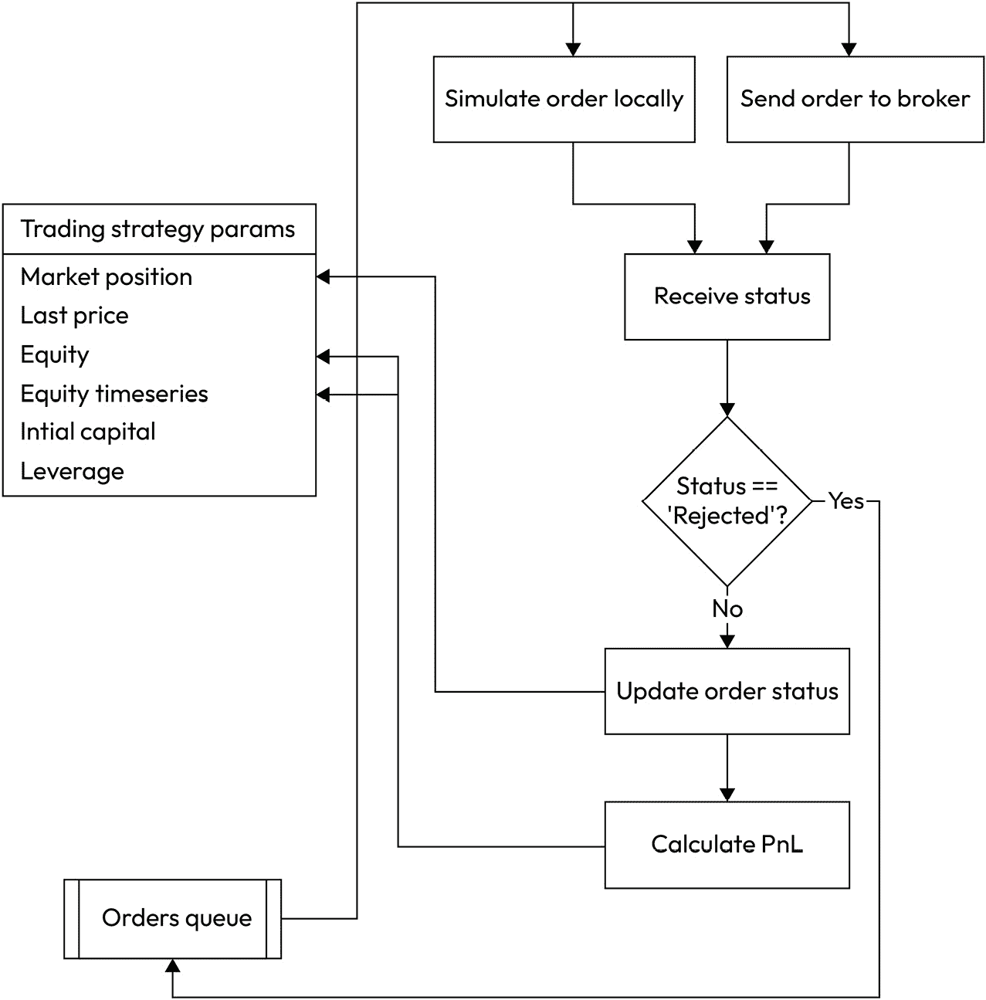

图 11.5 – 订单执行控制模块及其与交易策略属性对象的交互

让我们看看它是如何工作的。首先，我们从订单队列中接收一个或多个订单。这些订单是由交易逻辑生成并放入队列中的。然后，我们将订单发送给经纪人或本地模拟其执行并接收订单状态。如果订单已执行，则更新损益并添加另一个数据点到股本时间序列。如果订单被拒绝，我们将它返回到订单队列，整个过程将自动重新开始。

注意，策略元数据（市场位置、股本等）会随着每笔处理过的订单进行更新。这确保了在做出交易决策和控制实际市场敞口时的最终精度。

太好了！我们现在对整个交易应用架构有一个全面的了解。最令人愉快的是，它被分割成小而相对简单的组件。我们知道这些组件应该如何相互通信，我们知道数据格式，也知道它们应该按什么顺序操作，所以似乎我们知道了实现交易应用所需的一切。

但在我们开始编码之前，我想强调一下建议的架构的两个优势，这两个优势非常难以高估。

## 模块化架构的优势

首先，这种架构确保了**你的交易应用在研究阶段（使用历史数据时）永远不会提前查看**。在此阶段，我建议你刷新一下关于提前查看的记忆，这在*第四章*，*交易应用 – 内部结构是什么？*，*交易逻辑 – 这里的一个小错误可能代价巨大*部分中进行了详细讨论——我相信你会欣赏我们交易应用建议的架构。

其次，这种架构提供了一种灵活的模块化代码，符合通用交易应用的概念：你可以快速切换数据源和交易场所，并使用相同的应用程序进行研究和生产。

看起来我们已经涵盖了开始编写我们的第一个交易应用所需的所有内容。然而，有一个极端重要的问题却经常被许多开发者忽视：线程同步的问题。为了理解这个问题并找到正确的解决方案，让我们简要地**抒情地**谈谈多线程。

# 多线程 – 方便但充满惊喜

我们已经使用多线程（参见*第五章*，*使用 Python 检索和处理市场数据*，*通用数据连接器*部分），我们发现当开发模块化可扩展的应用程序时，使用多个线程会使生活变得容易得多。然而，我们从未探索过 Python 中多线程的实现方式。

两个概念经常被混淆：**多进程** 和 **多线程**。它们之间的区别在于前者使用隔离进程的概念，每个进程都有一个 **全局解释器锁**（**GIL**），从而能够使用单独的物理或逻辑处理器或处理器核心（所谓的 **真正并行**）来启用并行执行，而后者运行一个不关心处理器或核心数量的单个进程：它以小部分执行线程，允许每个线程运行几毫秒，然后切换到另一个线程。当然，从人类的角度来看，它看起来像进程是并行运行的。在大多数情况下，我们甚至不会考虑哪个线程在何时执行。但在实现事件驱动进程时，了解先发生什么变得至关重要：例如，如果我们试图在收到市场数据之前生成订单，最坏的情况可能会导致错误。

为了了解真正的多线程是如何工作的，让我们编写一些简单的代码，使用三个线程来模拟我们的交易应用的相关组件：

```py
from threading import Thread
import time
def t1(): # A thread that emulates data receiving
    while True:
        print('Receive data')
        time.sleep(1)
def t2(): # A thread that emulates trading logic
    while True:
        print('Trading logic')
        time.sleep(1)
def t3(): # A thread that emulates order execution
    while True:
        print('Processing orders')
        time.sleep(1)
thread1 = Thread(target=t1)
thread2 = Thread(target=t2)
thread3 = Thread(target=t3)
thread1.start()
thread2.start()
thread3.start()
```

由于我们是逐个启动线程的（1、2，然后是 3），我们可能会看到显示“接收数据”、“交易逻辑”和“处理订单”的消息，并按此顺序重复。然而，当我们运行代码时，我们会看到一些不同的情况：

```py
Receive data
Trading logic
Processing orders
Receive dataProcessing orders
Trading logic
Processing ordersReceive data
Trading logic
Processing orders
Receive data
Trading logic
Trading logic
Processing orders
Receive data
Trading logicProcessing orders
Receive data
Processing ordersReceive data
Trading logic
```

我们可以看到，尽管每种类型消息的平均数量大致相同，但它们出现的顺序几乎是随机的，使得输出变得混乱。这是因为默认情况下，没有任何线程有优先级，每个线程一旦有机会就会运行一小部分。

当然，这样的行为不适合交易应用：我们想确保首先接收 tick 数据，然后处理它，然后生成订单，最后将其发送执行 – 按照这个顺序，而不是其他任何顺序！

解决这个问题有几个方案。我们将使用两种：使用数据流作为同步的事件，以及使用 `threading.Event()` 对象在线程之间切换。我们将在接下来的章节中详细讨论每种方法。

让我们先实现一个与实时 tick 数据交互的版本交易应用，然后看看我们如何轻松地将它转换成一个强大的回测工具（如果你不记得回测的含义，只需跳回到 *第二章*，*使用 Python 进行交易策略*，*什么是纸交易和* *回测？* 部分）。

# 带有实时数据流的交易应用

和往常一样，我们首先进行一些导入：

```py
import json
import threading
import queue
from datetime import datetime
from websocket import create_connection
```

接下来，我们创建一个包含策略元数据的类（参见 *交易逻辑* *组件* 部分）：

```py
class tradingSystemMetadata:
    def __init__(self):
        self.initial_capital = 10000
        self.leverage = 30
        self.market_position = 0
        self.equity = 0
        self.last_price = 0
        self.equity_timeseries = []
```

现在，我们准备三个（！）tick 数据队列：

```py
tick_feed_0 = queue.Queue()
tick_feed_1 = queue.Queue()
tick_feed_2 = queue.Queue()
```

为什么是三个？这是在 *多线程 – 方便但充满* *惊喜* 部分中解释的线程同步问题的一种解决方案。

第一个队列（`tick_feed_0`）将市场数据接收器与 tick 聚合组件连接起来，该组件形成条形图。每次第一个队列中有新的 tick 时，该组件就会被激活。组件完成后，它将相同的 tick 放入第二个队列（`tick_feed_1`）。

`tick_feed_1` 将 tick 聚合器与交易逻辑连接起来，并且只有在`tick_feed_1`中有新的 tick 时才会调用交易逻辑。但它在第一个组件完成工作后才能进入这个队列！因此，交易逻辑不能在处理完新的 tick 之前被调用。然后，类似地，交易逻辑组件将相同的 tick 放入第三个队列（`tick_feed_2`）。

`tick_feed_2` 将交易逻辑与订单执行组件连接起来，并且该组件只有在 `tick_feed_2` 中有新的 tick 时才会被调用。因此，使用三个队列将组件相互连接确保了操作的正确顺序。

重要提示

这种同步线程的方法只有在 tick 之间的间隔大于由它触发的所有线程完成工作的往返时间时才会有效。这对于大多数数据源都是有效的，因为我们通常每秒接收不到 10 个 tick，往返处理时间通常在 0.0001 秒左右。这种方法不适用于通过`ITCH`协议接收的重负载交易所市场数据，它有时每秒接收超过 10,000 个 tick。然而，这仅限于机构交易，我们在这本书中不考虑此类解决方案。

接下来，我们必须添加一个队列来处理聚合的市场数据（`bar_feed`），一个队列来存储订单（`orders_stream`），创建系统元数据类的实例，并指定连接到数据源所需的参数（在我们的例子中，我们使用`LMAX`作为市场数据源）：

```py
bar_feed = queue.Queue()
orders_stream = queue.Queue()
System = tradingSystemMetadata()
url = "wss://public-data-api.london-demo.lmax.com/v1/web-socket"
subscription_msg = '{"type": "SUBSCRIBE","channels": [{"name": "ORDER_BOOK","instruments": ["eur-usd"]}]}'
```

现在，我们可以在*Plotting live tick data*部分重用我们在*第八章*，*使用 Python 进行外汇交易中的数据可视化*中开发的代码：

```py
def LMAX_connect(url, subscription_msg):
    ws = create_connection(url)
    ws.send(subscription_msg)
    while True:
        tick = json.loads(ws.recv())
```

现在，我们必须将 tick 放入第一个 tick 队列。但在这样做之前，我们必须检查接收到的市场数据的一致性。我们在*第一章*中讨论了非市场价格，*《开发交易策略 – 为什么它们不同*》，所以让我们快速回顾一下：非市场价格*太远*于市场价格。当然，有时很难判断它是*太远*还是*不太远*，但本质上，我们至少可以过滤掉那些买卖价差（也称为价差）比正常情况下大几倍的 tick。这类事件相当罕见，但我幸运地捕捉到了在绘制 tick 图表时（见*第八章*，*使用 Python 进行外汇交易中的数据可视化*）的一个这样的时刻。以下图展示了这样一个*不良 tick*，其买入价远低于应有的水平：

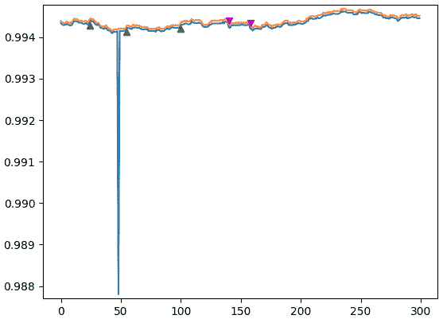

图 11.6 – 非市场价格

为了过滤掉至少这种类型的坏 tick，让我们添加一个简单的检查：如果价差大于 10 点，则跳过这个 tick：

```py
        if 'instrument_id' in tick.keys():
            bid = float(tick['bids'][0]['price'])
            ask = float(tick['asks'][0]['price'])
            if ask - bid < 0.001:
        tick_feed_0.put(tick)
```

接下来，我们需要实现 tick 聚合器。在我们的例子中，让我们形成 10 秒的条形图，这样我们可以更快地测试我们的应用程序并检查一切是否正常工作（而不必等待 1 分钟或 1 小时的条形图完成）。

我们将仅使用市价数据来形成条形图以简化问题。为什么这是可能的呢？因为大多数时候（除了重要新闻发布、银行结算时间以及一周的开始/结束时段），价差（买价和卖价之间的差异）或多或少是恒定的。因此，如果我们想模拟订单的实际执行，那么我们可以使用实时买价和卖价在 tick 数据流中，但对于交易逻辑，我们可以使用仅使用一个价格的条形图。当然，对于某些策略，如套利，买价和卖价数据都是必不可少的（有时还包括最后成交价和这两个价格），但现在，我们正在构建一个原型，当你熟悉一般方法时，你将能够自定义你想要的方式。

在将 tick 聚合到条形图中时，我们几乎使用了与*第八章*中相同的代码，*使用 Python 进行外汇交易数据可视化*，在*实时 tick 数据绘图*部分，因此这里不需要太多的注释：

```py
data_resolution = 10
def getBarRealtime(resolution):
    last_sample_ts = datetime.now()
    bar = {'Open': 0, 'High': 0, 'Low': 0, 'Close': 0}
    while True:
        tick = tick_feed_0.get(block=True)
        if 'instrument_id' in tick.keys():
            ts = datetime.strptime(tick['timestamp'], "%Y-%m-%dT%H:%M:%S.%fZ")
            bid = float(tick['bids'][0]['price'])
            delta = ts - last_sample_ts
            bar['High'] = max([bar['High'], bid])
            bar['Low'] = min([bar['Low'], bid])
            bar['Close'] = bid
```

我们创建了一个条形图，收到了一个 tick，并更新了条形图的高、低和收盘价。现在，一旦条形图开盘以来的时间大于或等于 10 秒，我们就开始一个新的条形图：

```py
        if delta.seconds >= resolution - 1:
            if bar['Open'] != 0:
                bar_feed.put(bar)
                last_sample_ts = ts
                bar = {'Open': bid, 'High': bid, 'Low': bid, 'Close': bid}
        tick_feed_1.put(tick)
```

注意这个函数的最后一行。它将收到的相同 tick 放入`tick_feed_1`。这样做是为了触发下一个组件，即交易逻辑：

```py
def tradeLogic():
    while True:
        tick = tick_feed_1.get()
        try:
            bar = bar_feed.get(block=False)
            print('Got bar: ', bar)
```

现在，是时候添加一些交易逻辑了。

注意

对于测试目的，我们不在乎我们的测试策略是否盈利——我们只想尽可能多地生成订单来观察模拟执行。

因此，让我们实现以下简单的逻辑：

+   如果条形图收盘价上涨（`close > open`），则卖出

+   如果条形图收盘价下跌（`close < open`），则买入

使用这个"*策略*"，我们可能预期会快速生成许多订单，因此我们将能够测试我们的应用程序而无需等待太久：

```py
            ####################################
            #      trade logic starts here      #
            ####################################
            open = bar['Open']
            close = bar['Close']
            if close > open and System.market_position >= 0:
```

在这里，我们正在检查条形图的收盘价是否高于`开盘价`，并且当前的综合市场位置是正的。我们这样做是因为我们不希望在同一个方向上打开多个仓位。换句话说，如果我们已经在市场上做多，我们只等待一个做空仓位打开，反之亦然：

```py
                order = {}
                order['Type'] = 'Market'
                order['Price'] = close
                order['Side'] = 'Sell'
```

以下 `if...else` 语句检查我们是否是第一次开仓。如果是，那么在订单生成时我们没有任何当前市场仓位，所以在我们的例子中，交易量是 10,000。但如果已经有一个开仓，并且我们想要在相反方向上开一个新仓，那么*我们首先应该关闭现有仓位*，然后*再开新仓*，这实际上需要两倍的交易量。我们必须用 `10000` 来关闭，用 `10000` 来开新仓，这意味着交易量是 2 * 10,000 = 20,000：

```py
                if System.market_position == 0:
                    order['Size'] = 10000
                else:
                    order['Size'] = 20000
```

最后，我们必须将订单放入订单队列：

```py
                orders_stream.put(order)
                print(order) # added for testing
```

现在，我们必须对买入订单做完全相反的操作：

```py
            if close < open and System.market_position <= 0:
                order = {}
                order['Type'] = 'Market'
                order['Price'] = close
                order['Side'] = 'Buy'
                if System.market_position == 0:
                    order['Size'] = 10000
                else:
                    order['Size'] = 20000
                orders_stream.put(order)
                print(order)
            ####################################
            #      trade logic ends here      #
            ####################################
        except:
            pass
        tick_feed_2.put(tick)
```

为什么我们使用 10,000 作为基础货币的交易量？

如果我们交易 EURUSD，一个报价为 4 或 5 位数的货币对，那么买入或卖出 10,000 欧元（见*第三章*，*从开发者角度的 FX 市场概述*，*命名约定*部分）意味着 1 个点值是 1 美元。因此，我们可以将我们的测试结果既解释为金钱，也解释为点数。由于外汇市场高度杠杆化（见*第三章*，*从开发者角度的 FX 市场概述*中的*交易机制-再次一些术语*部分），使用点数计算所有 PnL 更方便，然后使用杠杆进行缩放。

注意，这个函数使用了一个 `try...except` 语句。原因是，我们使用了两个队列：`tick_feed_1` 用于接收 tick，`bar_feed` 用于接收实际的 bar。然而，tick 只在这个函数中用于触发其执行（见本节开头详细解释），而 bar 用于做出实际的交易决策。问题是，bar 通常比 tick 到达的频率低得多，所以我们不能等到 `bar_feed` 队列中有 bar；否则，我们应用程序的正常执行会被中断。这就是为什么我们在从 `bar_feed` 队列中读取时使用 `block = False` 属性。然而，如果 `tick_feed_1` 中有一个新的 tick，但 `bar_feed` 中没有 bar，那么尝试从那里读取会引发异常。因此，我们捕获这个异常，在我们的当前实现中，只是什么也不做，等待队列中出现新的 bar。

我们交易应用程序的最终组件是订单执行。我们通过在 `tick_feed_2` 中接收到的 tick 来调用这个函数，它是由 `tradeLogic()` 放入的：

```py
def processOrders():
    while True:
        tick = tick_feed_2.get(block = True)
        current_price = float(tick['bids'][0]['price'])
```

每次收到 tick，我们都会更新交易系统的权益价值。记住，在交易者的行话中，“权益”是指在每个 tick 或 bar 上计算的所有 PnL 值的总和。如果我们持有多头仓位，并且当前价格高于前一个价格，那么在这个 tick/bar 上的权益价值会增加。相反的情况也是成立的：如果我们持有空头仓位，并且当前价格低于前一个价格，那么在这个 tick/bar 上的权益价值也会增加。

我相信你已经明白了：如果我们是多头，价格下降，或者如果我们是空头，价格上升，那么在这个 tick 或 bar 上，权益会减少。为了计算当前 tick 的实际权益值，我们将当前 tick 和前一个 tick 之间的价格差异乘以市场头寸的价值：

```py
        System.equity += (current_price - System.last_price) * System.market_position
        System.equity_timeseries.append(System.equity)
        System.last_price = current_price
        print(tick['timestamp'], current_price, System.equity) # for testing purposes
```

现在，我们开始扫描订单队列，并按照它们出现的顺序执行订单。请注意，我们再次使用`block = False`属性，所以我们永远不会在订单队列中等待订单：如果在收到新的 tick 之前没有订单，我们就继续进行主循环：

```py
        while True:
            try:
                order = orders_stream.get(block = False)
```

在我们收到订单后，我们应该进行风险管理检查：是否有足够的资金执行这个订单。为了计算可用资金，我们应该将当前权益（正或负）加到初始资本上，并减去目前开放市场头寸所需的保证金，即这个市场头寸的价值除以杠杆率：

```py
                available_funds = (System.initial_capital + System.equity) * System.leverage - System.market_position / System.leverage
```

如何计算可用资金

我们在代码中使用可用资金的计算并不完全正确。问题是，在市场上有可能持有巨大的头寸，同时有一些正的运行 PnL。在这种情况下，我们的公式会表明我们有足够的资金，但事实上，直到这个巨大的头寸关闭，我们的交易账户可能没有足够的钱。所以，为了使这个计算完全精确，我们应该向系统元数据中引入另一个变量，它只计算已实现的 PnL（通过关闭的头寸计算）。然而，我们现在不会这样做，为了简单和透明起见。

现在，如果订单大小小于交易账户中的可用资金，我们可以执行订单。稍后，我们将编写一个单独的函数来模拟订单执行。在生产环境中，这个函数可以被替换为对经纪商 API 的实际调用：

```py
                if order['Size'] < available_funds:
                    emulateBrokerExecution(tick, order)
```

在尝试执行订单后，其状态会变为`'Executed'`或`'Rejected'`（或任何其他由你的经纪商返回的状态），所以让我们决定如何处理它。当然，如果订单成功执行，我们只更新策略元数据（并打印结果以供测试）：

```py
                if order['Status'] == 'Executed':
                    System.last_price = order['Executed Price']
                    print('Executed at ', str(System.last_price), 'current price = ', str(current_price), 'order price = ', str(order['Executed Price']))
                    if order['Side'] == 'Buy':
                        System.market_position = System.market_position + order['Size']
                    if order['Side'] == 'Sell':
                        System.market_position = System.market_position – order['Size']
```

如果订单被拒绝，我们将它返回到同一个订单队列：

```py
                elif order['Status'] == 'Rejected':
                    orders_stream.put(order)
```

再次强调，在现实中，你可能需要更复杂的订单处理，但这将取决于你将要运行的策略类型以及你的经纪商提供的订单状态类型。

最后，我们将添加`except`子句，以便在没有订单在订单队列中的情况下不发生任何事情：

```py
            except:
                order = 'No order'
                break
```

我们几乎完成了！现在我们只需要添加一个模拟经纪商订单执行的函数。对于我们的模拟器第一个版本，我们将只实现市场订单的执行：

```py
def emulateBrokerExecution(tick, order):
    if order['Type'] == 'Market':
        if order['Side'] == 'Buy':
```

是时候进行最后的预飞检查了：在发送订单之前确保市场有足够的流动性！

```py
            current_liquidity = float(tick['asks'][0]['quantity'])
```

不要混淆买价和卖价！如果我们买入，我们检查出价（卖价）的流动性并在卖价处执行，而如果我们卖出，我们使用买价：

```py
            price = float(tick['asks'][0]['price'])
            if order['Size'] <= current_liquidity:
                order['Executed Price'] = price
                order['Status'] = 'Executed'
            else:
                order['Status'] = 'Rejected'
        if order['Side'] == 'Sell':
            current_liquidity = float(tick['bids'][0]['quantity'])
            if order['Size'] <= current_liquidity:
                order['Executed Price'] = price
                order['Status'] = 'Executed'
            else:
                order['Status'] = 'Rejected'
```

现在，让我们回顾一下我们迄今为止添加的交易应用组件：

+   交易系统元数据对象（`class tradingSystemMetadata`）

+   价格数据和订单的队列（`tick_feed_0`，`tick_feed_1`，`tick_feed_2`，`bar_feed`和`orders_stream`）

+   一个连接数据源的功能（`LMAX_connect(url, subscription_msg)`）

+   一个从刻度生成条形图的功能（`getBarRealtime()`）

+   一个做出交易决策的功能（`tradeLogic()`）

+   一个处理订单的功能（`processOrders()`）

+   一个在经纪人处模拟订单执行的功能（`emulateBrokerExecution(tick, order)`）

我们只需要在我们的代码最后添加一个初始化并启动所有四个线程的块：

```py
data_receiver_thread = threading.Thread(target = LMAX_connect, args = (url, subscription_msg))
incoming_price_thread = threading.Thread(target = getBarRealtime, args = (data_resolution,))
trading_thread = threading.Thread(target = tradeLogic)
ordering_thread = threading.Thread(target = processOrders)
data_receiver_thread.start()
incoming_price_thread.start()
trading_thread.start()
```

我们刚刚开发出了我们的第一个交易应用！现在是时候运行它并检查它是否如我们所期望的那样工作。我会运行它并等待第二个订单执行（因为我想要确保在策略在市场上有一个开仓位置以及没有开仓位置的情况下，我都提交了正确的订单）。如果你正确地重复了所有这些步骤，你应该会看到以下输出：

```py
2022-12-12T12:03:20.000Z 1.05658 0.0
... (7 ticks omitted from output to save space)
2022-12-12T12:03:28.000Z 1.05664 0.0
```

我们从`12:03:20`开始，所以收到了九个刻度（记住，LMAX 不发送实际的刻度，而是市场数据的 1 秒快照）。在第 10 秒，我们形成一个条形图：

```py
Got bar:  {'Open': 1.05658, 'High': 1.05668, 'Low': 1.05658, 'Close': 1.05666}
```

条形的收盘价高于条形的开盘价，因此根据我们的测试策略逻辑，这是一个卖出信号——而且确实，有条形图紧随其后：

```py
{'Type': 'Market', 'Price': 1.05666, 'Side': 'Sell', 'Size': 10000}
```

注意，订单大小是`10000`，因为我们刚刚第一次开仓，我们在市场上还没有任何开仓。我们检查第 10 个刻度以确保其价格等于条形的收盘价和订单价格：

```py
2022-12-12T12:03:29.000Z 1.05666 0.0
```

现在，我们可以看到执行报告：

```py
Executed at  1.05666 current price =  1.05666 order price =  1.05666
```

到目前为止，一切顺利。让我们等待下一个条形图的形成：

```py
2022-12-12T12:03:30.000Z 1.05663 0.2999999999997449
... (7 ticks omitted from output to save space)
Got bar:  {'Open': 1.05666, 'High': 1.05666, 'Low': 1.05663, 'Close': 1.05665}
```

我们很幸运：紧接着的下一个条形图以相反的方向收盘（收盘价小于开盘价），所以是时候生成一个买入订单了：

```py
{'Type': 'Market', 'Price': 1.05665, 'Side': 'Buy', 'Size': 20000}
```

注意，这次订单大小是`20000`：我们需要关闭目前`10000`的开仓，然后使用剩余的`10000`开一个新仓。让我们检查刻度价格以确保条形的收盘价和订单价格是正确的：

```py
2022-12-12T12:03:38.000Z 1.05665 0.09999999999843467
```

太好了，一切看起来都很正常。现在，让我们继续进行订单执行...

```py
Executed at  1.05672 current price =  1.05665 order price =  1.05672
```

停止。那是什么？最后一个刻度的价格是`1.05665`，但订单是在`1.05672`执行的！为什么？

这是因为我们只使用买价形成条形图，并在实际市场价格处执行订单——卖价订单使用买价，买价订单使用卖价。第一个订单是卖出，所以我们使用了买价，所有价格（条形图、刻度、订单和执行）都一致。但第二个订单是买入，但我们仍然只使用买价来形成条形图——这就是为什么执行价格大于条形的收盘价。

市场价差的重视

这个问题完美地说明了在运行测试时考虑价差（买价和卖价之间的差异）的重要性。所以许多开发者忘记了这一点，只用买价进行测试 - 你知道，为了简单起见。这些测试不足以反映真实市场，而且经常产生只有在你能以相同价格买卖时才盈利的交易逻辑，实际上是在任何时候都假设价差为零。现在，你知道如何避免这个陷阱并确保你的测试始终是现实的。

在我们继续之前，让我们快速回顾一下我们的代码，看看它是否符合在*第一章*中概述的要求，*开发交易策略 - 为什么它们* *不同*：

+   它过滤传入的 tick 数据流并排除非市场价格

+   它是事件驱动的 - 一旦交易逻辑确认交易，它就会生成并执行订单

+   它进行一些基本的风险管理检查 - 仓位大小、杠杆和可用资金

+   它能够模拟不良订单执行并处理这些情况

+   而且可能是主要的好处：这段代码永远不会 - 永远不会！ - 窥视未来，无论是在测试中还是在生产中（参见*第四章*，*交易应用 - 它里面有什么？*，*交易逻辑 - 这里的一个小错误可能会造成* *巨大的损失*部分）

因此，我们已经开发了一个适合严肃生产的健壮应用程序！当然，它可以进一步改进，但它的核心几乎不会改变。然而，我们没有经过测试的策略来运行。我们如何开发这样的策略？

这时我们可以使用我们之前提到的回测概念，几乎是在这本书的开头。

# 回测 - 加速研究过程

开发交易策略的过程（我的意思是交易逻辑，而不是应用程序）是一个无限循环：

1.  提出一个假设。

1.  编写代码。

1.  运行测试。

1.  如果结果不满意，调整参数并重复。

1.  如果什么都没有帮助，寻找一个替代假设。

问题是：在*第 3 步*中，我们应该使用哪种应用程序进行测试？

当然，我们可以使用我们现有的交易应用，草拟一些策略逻辑，然后以测试模式运行它，就像我们刚才做的那样，收集订单并分析股票时间序列。但如果我们想在不同市场条件下测试策略，单个测试可能需要几天、几周甚至几个月。你认为这有点太长了？我同意。这就是为什么，出于研究和开发的目的，我们使用回测。

我们在*第二章*中讨论了回测，*使用 Python 进行交易策略*部分，在*纸交易和回测——系统交易员风险管理的重要组成部分*。本质上，我们不是使用实时数据流来模拟订单执行，而是使用预先保存的历史市场数据来模拟数据流本身。在这种情况下，我们可以显著加快测试速度，因为计算机可以每秒处理数十万个 tick 或柱状图，将数月的实时测试压缩到几分钟或几秒钟的回测中。当然，由于其本质，回测不能保证策略的未来表现，仅仅因为它使用过去的数据进行测试。但无论如何，它帮助我们了解策略在各种市场条件下的行为。一般来说，如果回测显示模拟的权益在过去大部分时间都在增长，那么我们可能会假设它将继续增长，反之亦然：如果我们看到模拟的权益随着时间的推移只呈下降趋势，或者最多在零点附近波动，那么我们应该非常谨慎地对待这种策略，因为它很难想象为什么它在投入生产后会突然开始赚钱。

我希望你能理解我们的想法：我们将使用保存的数据而不是实时数据来运行我们的代码，这样我们就可以在 1 秒钟内处理 1,000 或 10,000 甚至更多的历史数据秒数。

现在，我相信你会欣赏我们开发代码时采取的方法：如果你有预先保存的 tick 历史数据，那么你只需要修改一个函数——接收数据提供者提供的 tick 的那个函数——并让它从本地文件接收数据。

就这些。

这不令人印象深刻吗？是的，你可以使用相同的代码进行研究和生产，从而将出错的可能性降低到几乎为零。

然而，你并不总是能获取到历史 tick 数据。此外，对于使用更高时间框架的策略（例如 1 小时、4 小时、1 天、1 周等），等待我们的应用程序从 tick 中形成每个柱状图将是一种时间的浪费。因此，我们可能想要对我们的代码进行以下修改：

+   它现在应该能够从本地文件读取数据，而不是从数据供应商接收数据。

+   它应该能够处理已经压缩的数据（柱状图），而无需接收任何 tick 数据。

+   它应该能够模拟订单执行，这可能发生在单个柱状图（例如，如果策略的逻辑基于 1 小时柱状图，那么我们应该能够模拟 hh:00 和 hh:59 之间的订单执行，其中 hh 代表小时值）的持续时间之内。

查看我们现有代码的架构，这似乎是一个相当直接的任务。然而，有一个需要注意的地方。

你还记得我们在现有代码中使用 tick 数据的方式吗？是的，我们将其聚合为条形图，但除此之外，tick 数据还作为系统时钟为整个应用程序的组件提供同步。如果我们根本不使用 tick 数据，我们如何同步它们呢？

在这里，我们可以使用另一种控制线程执行的方法——使用事件。

## 使用事件同步线程

让我们快速回到本章前面“多线程——方便但充满惊喜”部分中我们草拟的代码。那个代码的问题在于每个线程都在**可能**的时候运行，因此在一定程度上产生了随机的输出。而我们希望所有三个线程依次工作——`t1`、`t2`、`t3`，然后再次是`t1`，以此类推。

Python 的线程模块提供了几个非常高效的方法来解决控制线程的问题。其中之一是使用`Event()`对象。

一个`threading.Event()`对象被放置在线程的代码中，它就像交通灯一样工作。它有两种可能的状态：设置或清除。当事件被设置时，线程正常工作。当事件被清除时，线程停止。

除了清除和设置事件之外，还可以指示线程**等待**直到事件被设置。在这种情况下，线程等待事件，一旦它再次被设置，它就会继续工作。

如果我们希望线程以特定的顺序运行，那么我们应该坚持以下指南：

+   我们需要的事件数量应该和线程数量一样多

+   控制特定线程的事件应该在**内部**清除，但在**外部**设置

现在，让我们对代码进行一些修改。

首先，我们需要三个事件：

```py
f1, f2, f3 = threading.Event(), threading.Event(), threading.Event()
```

在我们的例子中，`f1`将控制`t1`线程，`f2`将控制`t2`，而`f3`将控制`t3`。

接下来，在`t1()`函数的末尾，我们执行以下操作：

+   我们清除`f1`事件（它控制第一个线程）

+   我们设置`f2`事件（为`t2`线程提供绿灯）

+   我们将线程`t1`设置为等待`f1`事件再次被设置

修改后的代码将如下所示：

```py
def t1():
    while True:
        print('Receive data')
        time.sleep(1)
        f1.clear()
        f2.set()
        f1.wait()
```

我们以同样的方式修改`t2()`和`t3()`函数（以便每个线程控制其下一个邻居）并运行所有三个线程：

```py
def t2():
    while True:
        print('Trading logic')
        time.sleep(1)
        f2.clear()
        f3.set()
        f2.wait()
def t3():
    while True:
        print('Processing orders')
        time.sleep(1)
        f3.clear()
        f1.set()
        f3.wait()
thread1 = threading.Thread(target=t1)
thread2 = threading.Thread(target=t2)
thread3 = threading.Thread(target=t3)
thread1.start()
thread2.start()
thread3.start()
```

现在，我们可以以完全正确的顺序享受输出：

```py
Trading logic
Processing orders
Receive data
Trading logic
Processing orders
Receive data
Trading logic
Processing orders
Receive data
```

...等等。

注意

可能对于前两个执行循环，输出仍然可能以错误的顺序进行：这可能会发生，直到两个事件被清除并等待，而只有一个事件被设置。

既然我们已经熟悉了`threading.Event()`对象，现在是时候修改我们的回测应用了。为了清晰和易于使用，我将在这里重现其全部代码，并指出我们做了任何修改的确切位置。

## 带有历史数据馈送的历史回测平台

和往常一样，我们从几个导入开始：

```py
import csv
import threading
import queue
import time
from datetime import datetime
```

然后，我们重用相同的`tradingSystemMetadata`类，并只为控制线程添加三个事件。我们称它们为`F1`、`F2`和`F3`（标志）：

```py
class tradingSystemMetadata:
    def __init__(self):
        self.initial_capital = 10000
        self.leverage = 30
        self.market_position = 0
        self.equity = 0
        self.last_price = 0
        self.equity_timeseries = []
        self.F1, self.F2, self.F3 = threading.Event(), threading.Event(), threading.Event()
```

接下来，我们需要数据和订单队列。由于我们不再使用 tick 数据来同步线程，因此不需要多个 tick 数据队列——我们只需要一个用于 K 线的队列，另一个用于订单：

```py
bar_feed = queue.Queue()
orders_stream = queue.Queue()
```

接下来，我们必须创建系统元数据对象的实例，并将历史数据从文件中读取到`all_data`中。我们还必须启动计时器（`time.perf_counter()`方法）以跟踪各种操作所花费的时间——纯粹出于好奇。

注意，我们使用`csv.DictReader()`读取数据，这样我们接收到的每个 K 线都是一个字典——这确保了与我们在本章早期开发的原始生产代码的最大兼容性：

```py
System = tradingSystemMetadata()
start_time = time.perf_counter()
f = open("<your_file_path>/LMAX EUR_USD 1 Minute.txt")
csvFile = csv.DictReader(f)
all_data = list(csvFile)
end_time = time.perf_counter()
print(f'Data read in {round(end_time - start_time, 0)} second(s).')
```

接下来，我们需要一个修改后的函数，该函数从读取的数据中逐个获取 K 线，将必要的字段从`str`转换为`float`，并将 K 线放入队列。我们还必须为了调试目的在第一个 10 个 K 线后中断此循环的执行：

```py
def getBar():
    counter = 0
    for bar in all_data:
        bar['Open'] = float(bar['Open'])
        bar['High'] = float(bar['High'])
        bar['Low'] = float(bar['Low'])
        bar['Close'] = float(bar['Close'])
        bar_feed.put(bar)
        counter += 1
        if counter == 10:
            break
        System.F1.clear()
        System.F2.set()
        System.F1.wait()
    print('Finished reading data')
```

注意函数末尾的三个标志（`System.F1`、`System.F2`和`System.F3`）：它们控制线程的执行，并确保首先读取一个 K 线，然后生成一个订单，最后执行——或者更确切地说，模拟这个订单的执行。

此外，请注意，我们不检查数据一致性，也不排除任何数据点：当我们处理保存的历史数据时，我们假设这些数据已经清洗过。

接下来是`tradeLogic()`函数。这里最好的消息是，其主要逻辑部分保持完全不变——在原始代码中的`trade logic starts here`和`trade logic ends here`注释之间不需要任何修改！我们只在这个函数的开始和结束处进行修改。

在开始时，我们必须添加一个`try...except`语句，当所有数据都被处理时，将终止相应的线程。为此，我们必须将`get()`方法的超时属性设置为`1`。这意味着`get()`将等待`1`秒，以在队列中出现新的 K 线，如果在 1 秒后没有 K 线，则生成异常。在异常发生时，我们只需中断循环，从而有效地终止线程：

```py
def tradeLogic():
    while True:
        try:
            bar = bar_feed.get(block=True, timeout=1)
        except:
            break
        ####################################
        #     trade logic starts here      #
        ####################################
        ####################################
        #       trade logic ends here      #
        ####################################
        bar_feed.put(bar)
        System.F2.clear()
        System.F3.set()
        System.F2.wait()
```

我们省略了整个交易逻辑，因为它确实与我们用于我们交易应用第一个版本的逻辑相同。

注意，在函数代码的末尾，我们将 K 线返回到队列中：其数据将被订单处理组件所需要。并且，就像上一个函数的情况一样，我们设置`F3`标志，为下一个操作（订单处理）发出绿灯，清除`F2`，并停止交易逻辑线程，直到`F2`标志被设置。

接下来，我们必须相当大幅度地重写订单执行模拟器：生产版本和回测版本之间的区别在于，在回测时，我们只处理压缩数据，因此在每个 tick 上检查订单执行不再有意义。

## 回测期间模拟订单执行

让我们先模拟市场订单，因为它们最容易实现，并坚持以下指南：

+   我们假设只有当交易逻辑在 bar 的收盘时间才能生成市场订单

+   我们只在 bar 的收盘价时模拟市场订单的执行

+   我们假设市场中的流动性总是充足的，因此我们不需要在执行订单之前检查它

+   我们假设实际执行价格与请求的订单价格相同，因为我们没有实时 tick 数据来测试执行

考虑到所有这些因素，修改后的`emulateBrokerExecution`函数现在看起来会简单得多：

```py
def emulateBrokerExecution(bar, order):
    if order['Type'] == 'Market':
        order['Status'] = 'Executed'
        if order['Side'] == 'Buy':
            order['Executed Price'] = bar['Close']
        if order['Side'] == 'Sell':
            order['Executed Price'] = bar['Close']
```

我们在这里没有添加任何标志，因为这个函数是在`processOrders`函数内部被调用的。让我们添加这个函数：你会看到它的逻辑与我们之前使用的非常相似，使用了实时 tick 数据：

```py
def processOrders():
    while True:
        try:
            bar = bar_feed.get(block = True, timeout = 1)
        except:
            break
```

我们从一个类似的`try...except`语句开始，当 bars 队列中没有更多数据时，终止线程的执行。接下来，我们对系统元数据进行相同的更新，与之前不同的是，我们使用 bar 的收盘价而不是最后 tick 的价格：

```py
        System.equity += (bar['Close'] - System.last_price) * System.market_position
        System.equity_timeseries.append(System.equity)
        System.last_price = bar['Close']
```

订单处理逻辑与 tick 驱动的代码非常相似，主要区别是没有风险管理检查（我们是否有足够的资金进行交易）和拒绝订单的处理：在回测期间，我们假设所有订单都得到了执行：

```py
        while True:
            try:
                order = orders_stream.get(block = False)
                emulateBrokerExecution(bar, order)
                if order['Status'] == 'Executed':
                    System.last_price = order['Executed Price']
                    if order['Side'] == 'Buy':
                        System.market_position = System.market_position + order['Size']
                    if order['Side'] == 'Sell':
                        System.market_position = System.market_position - order['Size']
            except:
                order = 'No order'
                break
        System.F3.clear()
        System.F1.set()
        System.F3.wait()
```

在函数代码的末尾，我们再次添加相应的标志来控制线程的执行顺序。

好吧，这就完成了！我们现在必须做的就是检查回测所花费的时间（只是为了好玩）并启动线程：

```py
start_time = time.perf_counter()
incoming_price_thread = threading.Thread(target = getBar)
trading_thread = threading.Thread(target = tradeLogic)
ordering_thread = threading.Thread(target = processOrders)
incoming_price_thread.start()
trading_thread.start()
ordering_thread.start()
```

但我们如何检查代码是否产生正确的结果呢？

当然，我们可以添加几个打印语句，就像我们在实时交易应用中做的那样，但回测的目标是不同的：我们希望在尽可能短的时间内处理尽可能多的数据，然后分析收集到的数据。5 年的 1 分钟历史数据 bar 超过 200 万个数据点，所以如果我们只是在每个 bar 上打印更新的权益价值，就会超过 200 万个打印——这将花费很长时间，因为`print()`是速度最慢的指令之一。那么，系统交易者如何分析策略的表现呢？

## 权益曲线和统计数据

当使用我们刚刚编写的代码运行回测时，我们保存一些基本统计数据：每个 tick 或 bar 更新的权益价值。如果我们绘制权益时间序列，我们得到一个**权益曲线**：这是交易系统随时间利润和损失动态的视觉表示。这样的图表是在回测完成后首先要检查的东西：

+   如果权益曲线显示随着时间的增长，那么策略未来可能表现良好（但不是保证！）的机会就存在

+   如果权益曲线随着时间的推移表现出稳定的系统性损失，这再次可能不是真的坏：考虑反转交易逻辑的规则

+   如果权益曲线围绕零振荡，这可能是最坏的情况，因为这个策略逻辑未来不太可能赚钱

让我们在回测完成后，在我们的代码中添加绘制权益曲线的代码。我们将使用我们在*第八章*，*使用 Python 进行外汇交易中的数据可视化*中讨论的技术，所以我建议在这个时候复习一下使用`matplotlib`。

`matplotlib`的主循环不能在线程中运行（至少不容易），因此我们必须在主线程中添加图表（就像我们在*第八章*，*使用 Python 进行外汇交易中的数据可视化*)中绘制实时 K 线图表时做的那样），并关注`incoming_price_feed`线程：当它存活时，我们只需等待并做任何事情，但一旦它完成工作，我们就绘制权益曲线。

因此，我们只需在代码开头的`import`部分添加`import matplotlib.pyplot as plt`，并在所有线程启动后，将其末尾添加以下简单的无限循环：

```py
while True:
    if incoming_price_thread.is_alive():
        time.sleep(1)
    else:
        end_time = time.perf_counter()
        print(f'Backtest complete in {round(end_time - start_time, 0)} second(s).')
        plt.plot(System.equity_timeseries)
        plt.show()
        break
```

如果你一切操作正确，并且使用了与我相同的历 史数据文件，你将看到以下图表：

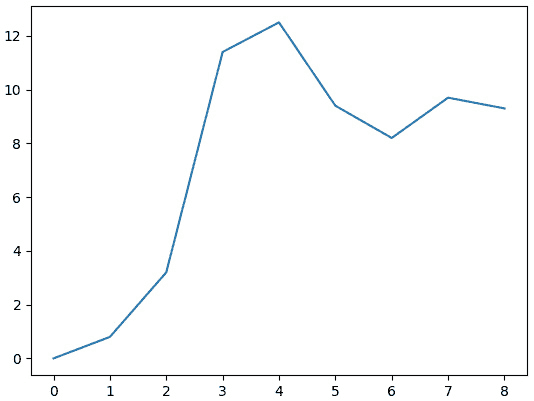

图 11.7 – 基于前 10 根 K 线的样本策略的权益曲线

这看起来很棒，但我们如何确保这个结果是正确的？如果回测器模拟性能不正确，我们就不能依赖回测结果。

幸运的是，检查这个结果并不困难。如您所记得，我们故意使用了一个非常简单的测试策略，该策略几乎在每一根 K 线上都生成订单。因此，我们可以手动重建一个类似的权益曲线，例如使用 MS Excel 或 OpenOffice，并将其与我们的回测应用程序生成的图表进行比较。

让我们打开数据文件并删除不必要的列（`UpVolume`、`DownVolume`、`TotalVolume`、`UpTicks`、`DownTicks`和`TotalTicks`）。

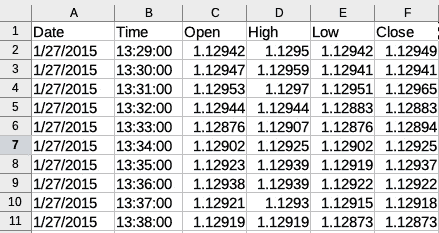

图 11.8 – 源数据文件的前 10 根 K 线

接下来，我们必须重现策略逻辑：如果 K 线收盘价上涨（`close > open`），则我们买入；如果 K 线收盘价下跌，则我们卖出。我们将添加一个包含我们交易方向的新的列：

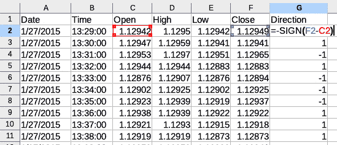

图 11.9 – 确定模拟交易的方向

然后，我们必须添加一个列，通过将 K 线收盘价之间的差异乘以方向和交易量来计算每根 K 线的实际 PnL：

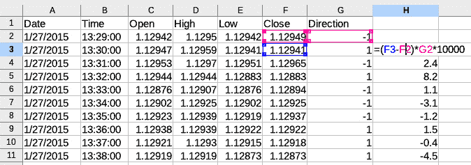

图 11.10 – 计算每根 K 线的回报

最后，我们必须计算每条柱状图的累计回报总和，这实际上就是权益时间序列：

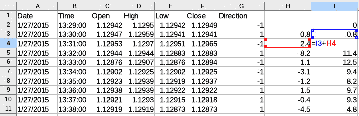

图 11.11 – 计算权益时间序列

现在，如果我们通过基于 I 列数据创建折线图来绘制权益曲线，我们会看到以下内容：

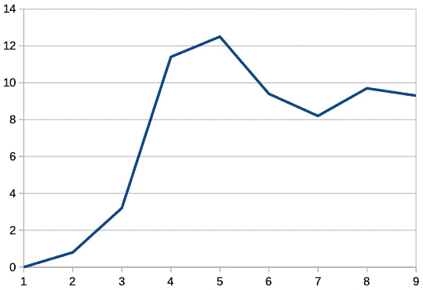

图 11.12 – 在 LibreOffice 中手动重建权益曲线

我们可以看到，权益曲线与我们代码绘制的曲线完全一致——这意味着我们的回测是可靠的！检查过一次之后，我们现在可以在进行任何测试时都信任其结果。

我敢打赌你迫不及待地想看到我们伟大策略的长期表现报告，而不仅仅是 10 条柱状图。记住，我们源数据文件中的 1 条柱状图代表 1 分钟，所以 10 分钟的回测并不具有代表性。让我们对前 1 百万条柱状图进行测试，这相当于大约 32 个月的历史。我们只需要修改代码中的一行：在`getBar()`函数中的`if counter == 1000000:`处将`10`替换为`1000000`。

现在，我们还可以根据控制台输出估计回测速度。在我的（远非最新）笔记本电脑（2012 年款 Macbook Pro，配备四核 Core i7 处理器、SSD 驱动器和 16 GB 内存）上，读取文件数据花费了 12 秒，处理 1 百万条柱状图花费了 93 秒。还不错：我们可以在不到 2 分钟内模拟 32 个月的时间！

那么，从这样一个长期的角度来看，权益曲线又是怎样的呢？这里就是：

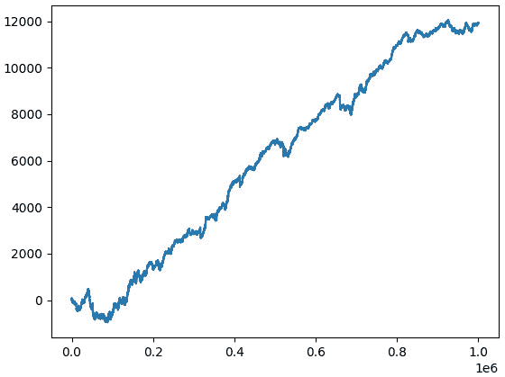

图 11.13 – 使用前 1,000,000 个数据点计算得到的样本策略的理论表现（权益曲线）

哇！看起来就像是交易的圣杯！这样的原始策略真的能够在如此长的时间内产生如此稳定的回报吗？

一般而言，每次你得到这样乐观的结果时，都要专注于寻找错误。在我们的案例中，我们怀疑我们没有在交易逻辑上犯错误——它太原始了，我们手动测试过。那么，我们在回测中可能遗漏了什么导致了这个不切实际的良好结果？或者，这个结果确实是现实的？

当然，不幸的是，它并不是。

让我们再次回到`emulateBrokerExecution`函数。我们假设任何订单都是在收盘时执行的——这很好，因为我们没有回测的 tick 数据。但是我们的代码在执行买入和卖出订单时没有区别：它们都以相同的价格执行，在我们的例子中是出价。但是当我们在本章早期测试实时交易应用时，我们发现以实际价格（卖出订单的出价和买入订单的询价）执行订单可能会在损益表（PnL）上产生很大的差异。因此，由于我们的历史数据中没有询价，让我们来模拟它：我们将典型价差加到收盘价上，从而考虑到出价和询价之间的差异：

```py
        if order['Side'] == 'Buy':
            order['Executed Price'] = bar['Close'] + 0.00005
```

在现实中，EURUSD 的价差可能从 0 低至 0.0010 甚至更高（通常在重要经济新闻发布之前；参见*第六章*，*基本面分析的基础及其在 FX 交易中的可能用途*)，但可以安全地假设 1/2 点足以模拟平均价差。

让我们再次运行回测并查看权益曲线：

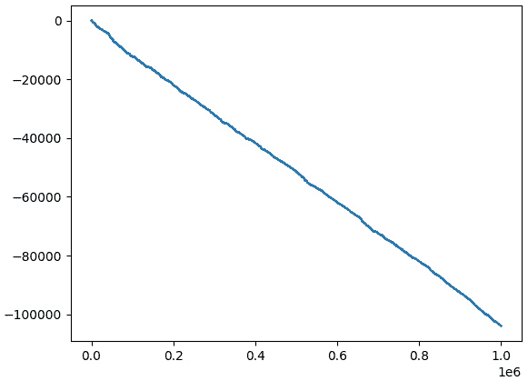

图 11.14 – 测试策略更现实的模拟权益曲线

这是一个多么激进的变化！现在，策略不再是稳步盈利，而是稳步亏损，而且亏损速度非常快：它仅通过交易一个所谓的迷你合约（10,000 基础货币）在不到 3 年的时间里亏损了 100,000 美元。

这是怎么发生的？

尽管策略在纸上没有考虑价差的情况下盈利，但平均而言，它每笔交易产生的纸面金额非常小：它甚至少于价差。一旦我们正确地模拟了以出价和询价执行订单，圣杯就消失得无影无踪，而令人悲伤的真相被揭露。

注意

当你进行任何市场研究和发展任何策略时，这个故事应该始终牢记在心。始终确保尽可能真实地模拟市场条件——以避免得到过于乐观的理论结果和在生产中遭受的痛苦失望。

所有这些之后最伟大的新闻是，你现在有一个可以信赖的工具：我们的回测平台。

# 总结 – 我们接下来该去哪里？

恭喜你在我们的学习中走这么远！我知道这一章非常长，但希望不会无聊。我们几乎涵盖了开发实时交易应用和回测器的所有方面，所以现在，你拥有了强大的工具，这些工具应该能帮助你开发出优秀的交易策略。

让我们快速总结一下本章学到的内容，并概述一些前景。

我们现在完全理解了任何交易应用的所有四个基本组成部分：接收数据、处理数据、生成订单以及控制它们的执行。

我们还熟悉最典型的技术问题，例如错误地模拟订单执行或处理非市价价格，我们也知道如何解决这些问题。

然后，我们学习了如何通过使用队列和线程事件对象来同步多个线程，我们也知道如何确保交易应用中的每个组件都恰好运行在预期的时刻。

接下来，我们学习了如何手动重建策略性能的部分来检查测试或实时订单生成和执行的准确性。现在，我们可以 100%确信我们可以信赖我们编写的代码。

我们甚至创造了我们交易的第一件圣杯——通过批判性地审查代码，我们立即将其拆解成碎片，从而学到了系统交易的主要教训：任何最微小的细节都不能被忽视，无论是故意还是偶然，在将结果用于生产之前，你应该检查你的结果两次，以避免在用真钱交易时遇到非常不愉快的惊喜。

现在，让我们指出我们可以在我们的开发中更进一步的地方。

首先，目前，我们的平台仅支持市价订单。是的，你们可能还记得，在前一章中，在许多情况下，市价订单是首选的，我们可以用市价订单来模拟所有其他类型的订单。然而，至少从开发目的来看，添加对限价和止损订单的模拟会很好。

在当前形式下，该代码在仓位和策略层面均未实现任何风险管理。添加至少基本的止损订单对于保护交易账户免受意外灾难性场景的影响是至关重要的。

同时，计算策略性能的一些非常基本的统计数据也会很棒：目前，我们只能分析权益时间序列，但我们想了解更多关于平均交易价值、交易次数、盈利交易百分比等信息。

当然，我们还可以通过添加多个策略、将它们分组到投资组合中，并通过添加多个实时数据流来实现平台的进一步复杂化，以达到最高水平的复杂性。尽管这肯定超出了本书的范围，但我鼓励你们大胆好奇，就像任何真正的研究者应该做的那样，玩转现有的代码并尝试改进它——你们会发现，从长远来看，你们的努力将得到高度回报。

本书剩余的章节致力于实现特定类型的交易策略。我们将为本章创建的回测平台添加一些组件，但不会进行重大更改。相反，我们将专注于开发战略逻辑并分析其理论性能。

# 第四部分：策略、性能分析和展望

在前面的部分中，我们获得了足够的知识，能够开发出一个既适合回测又适合——经过最小修改——实时交易的平台。我们甚至编写了一个模拟策略，并如预期的那样发现，如果没有经过适当的测试，它是无法赚钱的。

*第四部分* 解释了如何构建一个盈利的交易策略，从寻找交易想法到将其编码实现。我们还将学习如何生成最重要的策略性能数据，并分析它，以最终判断这样的策略是否可以在现实生活中使用。然后，我们将看到如何正确地实施限价和止损订单，并考虑另一种基于完全不同交易想法的交易策略。最后，最后一章提出了一些关于算法交易进一步自我发展的指导方针，并附有链接到有用和有价值的资源。

本部分包括以下章节：

+   *第十二章*，*示例策略——趋势跟踪*

+   *第十三章*，*交易还是不交易——性能分析*

+   *第十四章*，*现在该去哪里？*
