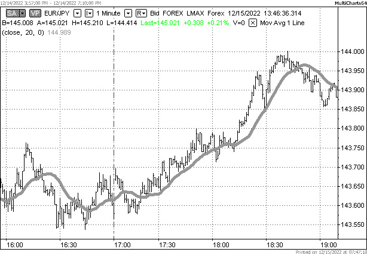
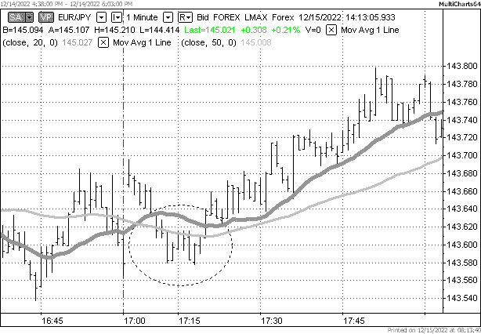
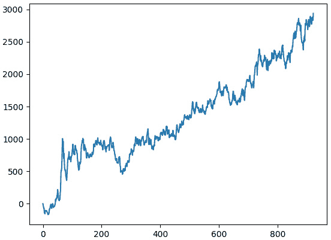

# 第十二章：样本策略 – 趋势跟踪

在上一章中，我们开发了两个交易应用：一个用于生产，另一个用于促进交易策略的测试和研究。更好的说法是，这些都是同一应用的两个版本，具有不同的数据处理模块。我们设计它们，以便在回测应用中开发的交易逻辑可以在生产应用中使用，无需修改（或在复杂情况下只需进行最小修改）。我们还使用一个样本“策略”测试了代码，发现代码运行正确，但“策略”一直在亏损——幸运的是，只是在纸上（这就是为什么我始终用斜体这个词的原因）。

现在，是时候学习研究并开发应用于外汇市场的一种最流行的经典交易策略的过程了。我们已经在书中讨论过它，但只是从定性而不是定量的角度。现在我们将提出一个正式的数学模型，并在代码中实现它。当然，我们还将进行回测，以检查结果是否可用于实际交易。

在本章中，我们将考虑趋势跟踪策略，并学习以下主题：

+   回顾趋势跟踪 – 交易设置

+   选择市场和准备数据

+   趋势跟踪策略 – 实施

# 回顾趋势跟踪 – 交易设置

在第九章《交易策略及其核心要素》中，我们考虑了趋势跟踪，并得出结论，尽管它是最简单和最直观的交易策略之一，我们仍然需要一套规则来确定以下内容：

+   市场中是否存在趋势

+   趋势是向北还是向南（即上升或下降）

+   当是时候加入趋势时（分别买入或卖出）

+   当是时候退出现有头寸时（因此我们预计趋势将结束和/或反转）

让我们在接下来的章节中了解更多。

## 确定趋势，第一部分 – 市场模型

如果我问你户外是晴天还是雨天，我确信在大多数情况下你不会犹豫给出答案。你可以很容易地区分它们，因为你非常熟悉许多帮助你做出决定的属性。确实，区分光明与黑暗、温暖与寒冷、湿润与干燥等都很简单。

现在，假设我问你是否有轻微的雨或雾，并在半夜这么做。我想象你会很难区分它们。很可能会出去，试图感受皮肤上的空气，闻闻空气，最后带着某种像“嗯，看起来像是在下雨。”这样的东西回来。在这种情况下，你必须进行多项测试并使用它们的结果来做出判断。

你为什么能够进行这些测试并使用它们的结果？

因为你在心中有一个*模型*，一个天气模型。除非你是这个职业，否则你不会去想它。在大多数情况下，你都会直觉和即时地做出决定。然而，如果你处于压力之下，你可以找到一些或多或少正式的属性——如湿度、温度和风——来决定天气，再次在天气模型的框架内。

现在，让我们以天气为例，开发一个市场趋势模型。

首先，最重要的是，我们应该决定趋势是始终存在还是偶尔发生。如果我们将这两个模型（永久趋势和偶尔趋势）与我们的天气例子进行比较，我们会看到以下类比：

| **市场** | **天气** |
| --- | --- |
| 市场总是处于上升趋势或下降趋势。趋势可能更明显或不太明显。 | 风总是吹着，只是有时强有时弱。 |
| 市场可以是*趋势模式*或*非趋势模式*。 | 有时风在吹，有时风根本就不吹。 |

表 12.1 – 市场趋势与天气之间的类比

尽管看起来相当简单，但这个表格完美地说明了在建模过程（市场或天气）的方法上的基本差异。模型开发者必须决定观察到的过程只能处于一种状态（只有趋势；只有风在吹）或者可以处于多种状态（市场例子中的趋势或非趋势；天气例子中的有风或无风）。

话虽如此，我们得出一个非常重要的结论。

没有这样的东西叫做*真*或*假*模型。模型只是试图以一定的精确度解释观察到的现象，并服务于做出决策的目的。

因此，模型帮助做出实际决策的能力是模型有效性的唯一标准。如果你通过看窗外就能知道如何为一天穿衣，那么天气模型就是有效的。如果你通过咨询复杂的设备来决定是否带伞，但仍然经常全身湿透，那么很可能，这个复杂设备中使用的模型是无效的。

在市场中，情况类似。如果我们能提出一个简单的市场模型，尽管如此，它仍然能够持续优于基准（见*第九章*，*交易策略及其核心要素*），那么这是一个可接受的模型。同时，我们可能有一个极其复杂的模型，它使用人工智能和量子力学，但如果从长远来看它不能打败市场，那么它可能只对学术研究有吸引力。

随着我们迈出算法交易的第一步，让我们从简单的事物开始。如果简单的模型不起作用，我们可以在之后使我们的模型更加复杂。

在我们目前的案例中，我们应该决定如何从趋势的角度来建模市场。

+   市场总是处于趋势中，无论是上升还是下降；只是这些趋势的持续时间可能长或短

+   市场处于趋势或非趋势状态，我们在确定上升趋势或下降趋势之前应该区分这两种状态

当然，第一个模型更简单：我们不需要提出一个区分趋势和非趋势的方法，现在我们只关注那些能够区分上升趋势和下降趋势的技术设置。如果这种方法不起作用，我们可以回到这个决策点，改变我们的模型，然后从头开始研究。

因此，我们在我们的清单上确定了第一个要点：我们选择“始终处于趋势”的市场模型进行进一步研究。

既然我们已经确定了市场模型，接下来让我们寻找一个合适的工具来区分上升趋势和下降趋势。同样，我们从这个最简单的解决方案开始：移动平均线。

## 确定趋势，第二部分 – 移动平均线

经常用于确定趋势的经典技术分析研究之一是移动平均线。在*第七章*《技术分析及其在 Python 中的应用》中，我们已经考虑了移动平均线，并发现它们作为数字滤波器，消除高频（短期价格波动），并保留低频，我们将这些视为价格运动中的主导长期趋势。让我们通过在价格图表上绘制 20 周期移动平均线（MA20）来快速更新我们的知识。



图 12.1 – EURJPY 1 分钟图表上的 20 周期移动平均。图表由 Multicharts 提供

我们可以看到，有时，柱状图的收盘价倾向于保持在 MA20 之上，而有时则低于它。合理地假设，只要这些收盘价保持在 MA20 之上，市场就处于上升趋势，而如果它们保持在之下，市场就处于下降趋势。

这个技术设置的问题有时价格在移动平均线之上或之下停留的时间太短。我们之前已经同意，在我们的模型中市场总是处于趋势中，我们不区分任何特殊的非趋势条件。然而，可能存在更好的技术设置，某种能够更好地指示上升趋势或下降趋势，而不需要那么多*短期趋势*，这是我们直觉上甚至不愿意称之为*趋势*的。

是的，有，这是最古老的技术交易设置之一：我们使用两个移动平均线，一个短期，另一个长期。然后，我们只有在以下两个条件都满足时才认为存在上升趋势：

+   价格高于短期移动平均线

+   短期移动平均线本身位于长期移动平均线之上

对于下降趋势来说，情况类似：

+   价格低于短期移动平均线

+   短期移动平均本身位于长期移动平均之下

让我们看看它在图表上可能是什么样子。



图 12.2 – 添加长期移动平均有助于排除不希望出现的情况

在前面的图中，我添加了一个 50 期移动平均（MA50）到现有的 MA20，并放大了图形以查看更多细节。由虚线椭圆形包围的区域说明了添加第二个移动平均如何过滤掉某些（但当然不是所有）不希望出现的情况。如果我们仅仅通过收盘价高于或低于 MA20 来决定是上升趋势还是下降趋势，那么在*图 12.2*中显示的阶段，我们就必须决定是否存在下降趋势。然而，如果我们使用我们之前建议的设置（即价格应该在 MA20 和 MA50 之下），那么我们既不能将其认定为上升趋势也不能认定为下降趋势。因此，在交易逻辑中，我们简单地跳过这个区间——然后我们可以看到随后的价格变动发展成为一个*真正的*上升趋势。

太好了，现在我们已经覆盖了我们列表中的两个要点——我们知道市场何时有趋势以及其方向。现在我们需要决定何时实际进入和退出市场中的头寸。

## 进入和退出规则

在确定技术交易设置的各个要素之后，关键问题仍然是何时实际进入和退出头寸。在某些情况下，这可能是一个非平凡的问题，对这个问题的回答可能会严重影响策略的结果性能。然而，在我们的简单模型中，我们可以假设一旦满足趋势条件，我们就可以进入市场。这意味着当以下条件成立时，我们就会开立新的多头头寸：

+   条的收盘价高于短期移动平均

+   短期移动平均位于长期移动平均之上

+   目前，我们在市场上没有多头头寸（因此我们不会增加现有头寸，如果我们已经多头，我们也不会再买入）

至于退出开放的头寸——同样，在我们的市场模型中，实际上没有必要退出头寸，因为该模型假设市场总是处于趋势中。因此，我们只在开立空头头寸时退出多头头寸，反之亦然。

换句话说，我们计划一个*始终在市场*的策略，并在检测到趋势变化时立即改变交易的方向。

与市场模型一样，如果我们测试当前简单模型的结果不可接受，我们可以稍后改变这种方法。

## 资金管理

**资金管理**意味着每次新订单你将交易多少。有许多资金管理理论和技巧，从非常简单到相当复杂。不幸的是，我们无法在一个章节中涵盖所有这些内容——那需要一本书！但既然我们现在保持简单，并且更感兴趣于了解交易逻辑是如何在一般情况下工作的，那么我们也使用最简单的资金管理概念：我们将对所有交易使用相同的恒定交易规模，当我们应该从多头转为空头或从空头转为多头时，我们将将其翻倍。我们在上一章开发回测平台时已经这样做过了。

一个经验法则是：如果你的策略在恒定交易规模下表现良好，那么通过资金管理可以进一步提高其表现。如果策略在恒定交易规模下表现不佳，那么尝试通过使用各种资金管理规则来提高其表现通常会失败。

因此，我们已经成功覆盖了我们在本章开头概述的四个关键点：

+   我们知道市场何时处于趋势中

+   我们知道趋势的方向

+   我们知道何时进入市场

+   我们知道何时退出市场

此外，我们还知道每次交易我们有多少风险。

太好了，现在我们可以继续选择我们将要使用趋势跟踪进行交易的市场，并准备相关数据。

# 选择市场和准备数据

关于系统交易有一个非常常见的误解：人们认为技术交易策略应该在任何市场上都有效。我希望前几章已经消除了这个神话。举个例子，让我们回忆一下著名的 EURCHF 市场，当时瑞士国家银行正在将瑞士法郎的汇率钉住欧元（参见*第九章*，*交易策略及其核心要素*）——如果价格几乎没有任何变动，就去用趋势跟踪策略进行交易吧！

即使我们将这样的极端例子放在一边，选择市场本身也可以是一个非同寻常的任务。大多数时候，即使我们能够对哪种策略应该表现更好有一个明智的猜测，我们也必须尝试许多市场。然而，现在我们将使用一些一般性的指导方针。

首先，由于我们专注于趋势跟踪，我们希望交易一个充满趋势的市场（尽管这听起来可能像是一个不言而喻的真理）。如果我们处于外汇领域，我们可能希望关注两种货币之间利率差异最大的货币对（参见*第六章*的[*基本分析*](https://wiki.example.org/fundamental_analysis)部分，其中简要讨论了利率和息差交易，以了解利率和息差交易），因为这是非常少数可能导致形成或多或少长期趋势的因素之一。因此，像澳大利亚元或新西兰元与日元或甚至美元（尤其是当美国利率较低时）这样的货币对可能是一个好的开始。

选择澳大利亚元作为趋势跟踪策略交易的原因之一是，澳大利亚经济依赖于黄金生产，就像加拿大经济依赖于石油（尽管可能程度较小）。因此，澳大利亚元的汇率容易受到黄金和其他出口商品价格相应变化的影响。由于商品价格由于生产周期而表现出周期性行为，我们可以看到这一点在 AUDUSD 或 AUDJPY 中有所反映。因此，考虑到这两个因素，选择 AUDUSD 作为尝试趋势跟踪策略的第一个货币对似乎是一个自然的选择。

第二，我们应该决定时间框架或数据分辨率。尽管之前使用移动平均线的样本图表是以 1 分钟分辨率制作的，但日内数据实际上并不适合趋势跟踪策略。原因是日内外汇市场在波动模式上表现出强烈的周期性行为（参见*第三章*的[*流动性和波动性 – 如何一个转化为另一个*](https://wiki.example.org/liquidity_and_volatility)部分，从开发者的角度来看，外汇市场概述）。这些市场在白天活跃，在夜间缓慢。这种周期性会产生许多*虚假趋势*，使确定*真实趋势*的任务变得显著更加困难。同时，日时间框架没有这种特性，我们可能期望在这个数据分辨率（当然，取决于市场是否倾向于趋势）上有更稳定的趋势行为。因此，当我们有选择通过向交易逻辑中添加一个模块来使我们的模型更加复杂，该模块可以区分*真实*和*虚假*趋势时，我们宁愿使用更高分辨率的 数据来完全消除这个问题。

因此，我们已经确定了市场（让我们从 AUDUSD 开始）和数据分辨率（每日）。一如既往，让我指出，如果我们得到不满意的结果，我们可以尝试不同的市场和时间框架。

现在我们已经确定了所有先决条件，让我们开始编码。

## 将数据压缩到日时间框架

让我们从编写一个简单的实用程序开始，该实用程序将市场数据压缩到所需的分辨率，并将其转换为所需的格式，与我们的回测和实时交易代码兼容（见*第十一章*，*回测和理论表现*）。我们将使用实时版本的`getBarRealtime()`函数，并稍作修改作为独立的实用程序。

此实用程序应执行以下操作：

+   读取源数据文件（tick 或 1 分钟条）

+   将数据聚合到任何更大的时间框架

+   使用与回测兼容的格式将数据保存到磁盘

像往常一样，我们从导入开始：

```py
import csv
from datetime import datetime
```

我们添加了一个类似于*第六章*，*基本面分析的基础及其在 FX 交易中的可能用途*中使用的滑动窗口类，但我们将以不同的方式使用它：在当前条形图和上一个条形图上存储任何参数（价格、时间、成交量或任何其他）的值。因此，我们添加了两个相应的方法来快速检索这些值：

```py
class slidingWindow:
    def __init__(self, len):
        self.data = [0 for i in range(len)]
    def add(self, element):
        self.data.pop(0)
        self.data.append(element)
    def last(self):
        return self.data[-1]
    def previous(self):
        return self.data[-2]
```

然后，我们指定源文件和目标文件，并读取保存的数据（tick 或 1 分钟数据）——这与我们在上一章中做的大致相同：

```py
source_file = open("LMAX AUD_USD 1 Minute.txt")
dest_file = open("AUDUSD_daily.csv", "w")
csvFile = csv.DictReader(source_file)
all_data = list(csvFile)
```

我们立即将第一行写入目标文件——这一行将作为进一步处理文件作为 CSV 的标题：

```py
dest_file.write(("Date,Time,Open,High,Low,Close\n"))
```

然后，我们创建`slidingWindow`类的实例，并初始化第一个条形图，我们将对其进行聚合并保存到目标文件：

```py
timestamp = slidingWindow(2)
bar = {'Open': 0, 'High': 0, 'Low': 0, 'Close': 0}
```

现在，我们开始遍历源文件中的所有样本，转换数据，并将时间戳添加到时间滑动窗口中：

```py
for sample in all_data:
    open = float(sample[' <Open>'])
    high = float(sample[' <High>'])
    low = float(sample[' <Low>'])
    close = float(sample[' <Close>'])
    ts = datetime.strptime(sample['<Date>'] + 'T' + sample[' <Time>'] + 'Z', "%m/%d/%YT%H:%M:%SZ")
    timestamp.add(ts)
```

备注

源文件的标题格式可能不同。在我这本书中使用的文件中，至少有两种不同的格式：普通单词（`'Open'`，`'High'`等）和三角括号中的单词（`<Open>`等）。请小心，不要忘记根据你将要使用的数据源调整这段代码！

如果时间戳的日期与上一个时间戳的日期不相等——这意味着新的一天开始了——我们将保存更新的每日条形图到目标文件，并重新初始化条形图：

```py
    if timestamp.previous() != 0:
        if timestamp.last().date() != timestamp.previous().date():
            if bar['Open'] != 0:
                dest_file.write(','.join(map(str,[*bar.values()])) + "\n")
            bar = {'Date': timestamp.last().date(), 'Time': timestamp.last().time(), 'Open': open, 'High': high, 'Low': low, 'Close': close}
```

最后，我们更新正在形成的条形图：

```py
    bar['High'] = max([bar['High'], high])
    bar['Low'] = min([bar['Low'], low])
    bar['Close'] = close
    bar['Time'] = timestamp.last().time()
```

在`for`循环完成后，不要忘记关闭目标文件：

```py
dest_file.close()
```

如果你使用与我相同的 AUDUSD 1 分钟历史数据运行此代码（你可以在 GitHub 上找到它以及代码），你将得到一个 CSV 文件，其中`'Time'`列有两个不同的时间：`17:00`和`23:59`。为什么会这样？

实际上，这是一个非常重要的问题，值得一个深刻的答案。

## 注意时间！

不，这并不意味着你应该每隔一分钟就看看你的手表。这意味着在处理市场数据时，时间是导致混淆的非常因素，尤其是在处理来自如外汇等去中心化市场的数据时。

使用来自集中交易所的数据相对容易一些：在这种情况下，我们始终知道交易所位于哪个时区以及其工作时间。因此，从这个交易所获取的任何市场数据中，所有时间戳都将与交易所所在的时区相同，并且仅在市场开盘和收盘之间。

在外汇市场中，情况不同。我们知道这个市场没有单一的交易所，并且它几乎每周工作 24 小时，5 天。

请注意，是“几乎”。

首先，我们必须考虑时区。每个外汇数据供应商和每个外汇经纪商都可能以他们认为正确的任何时区提供数据。最常用的是 GMT（UTC）或 BST（UTC+1）用于伦敦，CET（UTC+1）或 CEST（UTC+2）用于法兰克福，以及 EST（UTC-5）或 EDT（UTC-4）用于纽约。在处理时间戳之前，你应该检查数据源使用的时区。

其次，我们必须考虑工作时间。大多数外汇交易场所周日大约在下午 5 点开始交易（纽约时间；纽约银行结算时间；参见*第三章*，*从开发者角度的外汇市场概述*），但有些可能更晚开始。同样，周末收盘时间：大多数场所周五在纽约的同一时间下午 5 点关闭，但有些甚至提供周末交易。我们无法认真考虑这种周末交易，因为周末交易的成交量可以忽略不计，但你可能会从提供周末交易的场所获取市场数据，这些周末数据将给你的研究过程带来相当多的混乱。如果你计划交易外币，很可能是它们只在各自国家中央银行的工作时间内或稍长一点的时间内进行交易。

除了正常的工作时间外，还有一些例外，大多在节假日。例如，如果你在圣诞节前后看到提前收盘或延迟开盘，不要感到惊讶。

第三，我们必须考虑如何解释 0:00 时间。一些数据提供商将这个时间视为新的一天的开始，而另一些则认为它指的是前一天。此外，一些数据提供商甚至没有这样的时间戳，他们数据中的最后时间是 23:59（对于 1 分钟数据）。

这个 0:00 的时间很令人困惑。当我们处理以条形图压缩的数据时，条形图的时间戳表示条形图关闭的时间。因此，0:00 表示条形图在午夜关闭。但它们仍然代表午夜之前发生的价格变动，所以它们属于刚刚结束的那一天！所以，如果你在处理时间时想绝对精确，你可能需要在你的代码中添加一些额外的检查，以考虑我们刚才讨论的问题。

现在，让我们看看我们例子中使用的数据，看看我们实际上做了什么。这些数据是在纽约时区，所以一周的最后时间是 17:00 – 这就是我们每周五压缩的每日数据中所看到的。这个数据提供商将 0:00 视为新一天的第一时间，因此由于我们按日期划分日期而不考虑时间，一天的最后时间现在是 23:59。

我们可能想要修改条形图工具代码中的新一天条件。一个可能的解决方案可能是这样的条件：

```py
if (timestamp.last().date() != timestamp.previous().date() and str(timestamp.last().time()) != '00:00:00') or (str(timestamp.previous().time()) == '00:00:00'):
```

如果我们现在运行修改后的代码，我们会得到正确压缩的数据，但请注意，现在 0:00 的时间戳表示一天的结束，而不是开始！

现在我们已经准备好了所有数据，是时候尝试编写我们第一个策略的代码了。

# 跟随趋势策略 – 实现

由于我们打算使用上一章中开发的回测代码（参见*第十一章*，*回测和理论表现*）中的*带有历史数据馈送回测平台*部分），我们只需要添加支持所需对象的小段代码。

注意

不要忘记将数据源更改为我们刚刚创建的包含每日 AUDUSD 数据的文件！

让我们从添加`slidingWindow`类来实现移动平均开始。显然，我们从上一节中的代码中复制它。代码（像类声明一样）通常放在导入之后和第一个函数声明之前：

```py
class slidingWindow:
    def __init__(self, len):
        self.data = [0 for i in range(len)]
    def add(self, element):
        self.data.pop(0)
        self.data.append(element)
```

随着你逐渐开发各种策略，迟早你会发现在大多数策略中都会使用到许多类或函数，因此你可以将它们移动到一个单独的模块中，并将该模块导入到任何策略原型中。

我们添加两个滑动窗口来实现移动平均：

```py
data_window_small = slidingWindow(5)
data_window_large = slidingWindow(20)
```

为什么移动平均周期使用`5`和`20`？嗯，没有特别的原因：当我们处理每日数据时，`5`通常用来表示一个工作周，而`20`表示一个工作月。这些值通常可以在技术分析研究中找到。其他流行的周期是`50`（代表一个季度）和`200`（代表一年）。无论如何，这只是一个草案，所以我们将在评估策略性能后，能够修改这些值。

然后我们有实际计算移动平均值的函数：

```py
def moving_average(data):
    return sum(data) / len(data)
```

我们现在需要修改的是`tradeLogic()`函数的一部分。它是位于`trade logic starts here`和`trade logic ends here`注释之间的代码块：

```py
        ####################################
        #     trade logic starts here     #
        ####################################
```

首先，我们检索一个新的收盘价并将其添加到两个滑动窗口中。然后我们计算移动平均值：

```py
        close = bar['Close']
        data_window_small.add(close)
        data_window_large.add(close)
        ma_small = moving_average(data_window_small.data)
        ma_large = moving_average(data_window_large.data)
```

现在是主要部分：入场条件。如果收盘价低于短期移动平均线，且短期移动平均线低于长期移动平均线，我们就卖出。别忘了，我们只有在没有已经开放空头头寸的情况下才这样做（参见*第十一章*中的*带有实时数据流的交易应用*部分，*回测和理论表现*）：

```py
        if close < ma_small and ma_small < ma_large and System.market_position >= 0:
```

`'Sell'`子句中的其余交易逻辑代码保持不变，我将其复制在这里只是为了保持完整性：

```py
            order = {}
            order['Type'] = 'Market'
            order['Price'] = close
            order['Side'] = 'Sell'
            if System.market_position == 0:
                order['Size'] = 10000
            else:
                order['Size'] = 20000
            orders_stream.put(order)
```

对于买入订单来说是对称的：当收盘价高于短期移动平均线，且短期移动平均线高于长期移动平均线时，我们买入：

```py
        if close > ma_small and ma_small > ma_large and System.market_position <= 0:
            order = {}
            order['Type'] = 'Market'
            order['Price'] = close
            order['Side'] = 'Buy'
            if System.market_position == 0:
                order['Size'] = 10000
            else:
                order['Size'] = 20000
            orders_stream.put(order)
        ####################################
        #      trade logic ends here      #
        ####################################
```

就这样。不需要对其他任何内容进行修改。

你准备好测试你的第一个交易策略了吗？让我们运行代码并查看权益曲线。

如果你到目前为止一切操作正确，你应该会看到一个类似于*图 12.3*中所示的权益曲线。



图 12.3 – 使用 AUDUSD 每日数据对趋势跟踪策略进行回测的权益曲线

还不错！在*第十一章*的*回测和理论表现*中，我们讨论了权益曲线，并指出交易者（尤其是投资者！）正在寻找能够随着时间的推移展示持续增长的策略。由于我们的权益曲线是我们趋势跟踪策略的 PnL 每日表示，我们可以同意这个策略确实展示了权益的增长。

然而，这个结果引发了一些进一步的问题。*x*轴和*y*轴上的数字意味着什么？我们如何从金钱或百分比增长的角度来解释这个结果？我们能否说回测展示的增长是一致的？这些问题以及其他问题将在下一章中进行讨论。

# 摘要

让我们快速回顾一下本章所学的内容。这确实是所有我们在前几章中获得的知识和技能汇聚并转化为一个工作交易应用的关键点。不仅如此，实际上，我们现在拥有了一个可扩展的*交易平台*，适用于研究和实时交易。我们提出了一种稳健的平台设计，保持了架构的模块化和可扩展性。我们学习了如何同步线程，以确保平台模块执行的正确顺序，同时保持这些模块的隔离。我们看到了使用各种数据源的实用示例，这些数据源允许平台同时处理实时数据流和历史数据。我们将交易逻辑完全从应用程序的其他部分隔离出来，因此现在我们可以使用回测来开发策略，然后立即将代码复制粘贴到我们平台的版本中。最后，利用前几章中关于外汇市场的知识，我们开发了一个简单的趋势跟踪策略，对其进行了测试，并看到了有希望的结果。

现在是时候分析我们的结果，以全面了解策略的行为和性能了。
