# 第十三章：交易与否——性能分析

在上一章中，我们开发了一个简单的趋势跟踪策略，进行了回测，并生成了我们的第一条权益曲线（策略随时间利润和损失的视觉表示）。直观地，我们已知盈利策略的权益曲线应该随时间增长，增长越陡峭，越好。乍一看，我们的策略似乎符合这一要求，但当然，如果能基于事实而不是情绪来发表意见会更好。因此，我们希望有一个可以用来作为指标的定量指标：如果其值大于某个值，则策略是好的。如果它更小，则策略不好。

如你所猜想的，这样的单一、通用的指标并不存在。交易策略是一个非常复杂的结构，即使其逻辑看似简单，其表现也应该从不同的角度进行分析。我们感兴趣的不只是特定策略可能带来的多少金钱，还包括为了实现这样的收益我们应该投入多少作为风险资本。同样，不仅整体净利润，而且利润（和损失！）随时间分布的情况也很重要。最终，我们想要确保策略确实可交易：在真实市场中进行的交易将与回测期间模拟的交易或多或少相似。

这章远非交易策略性能分析的终极指南：这个主题如此广泛，以至于可能需要一本书，甚至多本书。在这里，我们将考虑最关键的指标，看看它们如何帮助评估策略的表现，并做出我们的主要决定——是否尝试这个策略或将其搁置。

在本章中，你将了解以下主题：

+   交易分析

+   平均交易和交易成本

+   衡量性能——alpha 和 beta 重访

+   净利润与持有

+   回撤

+   杠杆的力量——或者我需要交易多少？

# 交易分析

如你所记，交易和投资之间的区别，从广义上讲，是交易的数量。如果你在资产中持有头寸 1 年或更长时间，那么它就是投资。如果你在同年内多次买卖同一资产或不同资产，那么它就是交易。

为什么是一年？

根据大多数税法，持有头寸 1 年零 1 天可以将其视为投资，由此产生的任何利润将以折扣税率征税。如果你持有的头寸少于 1 年，则被视为交易，由此产生的利润将按全额收入税率征税。这条规则主要适用于股票交易，但至少使用 1 年作为参考期限是有意义的。

因此，策略在给定期间内积极开仓和平仓。无论整个期间的总净收益（或亏损）如何，首先，最重要的是，我们感兴趣的是每笔交易对整体结果贡献了多少——至少在平均意义上。

# 平均交易和交易成本

平均交易是衡量指标中最基本且最简单的之一：它只是策略实现的总净收益与总交易次数的比率：

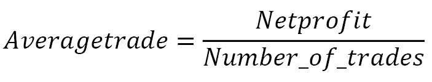

我们为什么需要这个值？

为了回答这个问题，我们应该再次回顾一下理论中的几个要点。

在*第三章*，[*从开发者角度的 FX 市场概述*]中，我们考虑了市场的组织方式，并了解到我们能够买入和卖出的价格之间总是存在差异——即点差。无论策略中使用的订单类型如何，市场价格至少必须移动点差距离，才能将新开仓位从负区域移动到盈亏平衡点。

此外，别忘了在*第十章*[*Python 中订单类型及其模拟*]中考虑的各种流动性和订单执行问题。如果策略使用市价订单，它可能会遇到滑点、部分成交或拒绝（取决于 TIF 规范，参见同一章节中的*时间有效：更好地控制执行*）。无论如何，这只是交易成本中应被策略覆盖的另一个成本。

最后，别忘了经纪商和交易场所会收取佣金，这笔费用也应由交易策略承担。

因此，平均交易价值应该大于点差、典型滑点以及经纪商和/或交易场所佣金的总额。只有在这种情况下，策略才能在真实市场中盈利。

现在，让我们看看基于我们在上一章中开发的策略表现的实际数据。为了获得必要的值，让我们在策略代码中添加几行。首先，我们将向`tradingSystemMetadata`类添加一个`list_of_orders`属性——在这里，我们将保存所有已执行的订单。接下来，在`processOrders()`函数中，我们将在`if order['Status'] == 'Executed':`行之后添加以下语句：

```py
System.list_of_orders.append(order)
```

最后，在回测代码的末尾，紧接在`plt.plot(System.equity_timeseries)`之后（参见*第十一章*的*历史数据回测平台*，*回测和理论表现*）：

```py
total_trades = len(System.list_of_orders)
print("Total trades:", total_trades)
print("Average trade:", System.equity / total_trades)
```

如果你现在再次使用相同的数据（澳元/美元每日数据）进行回测，你应该得到 37 笔总交易和平均交易价值约为 79.41。

这好还是不好？

关于交易次数，一般来说，次数越多越好。为什么？因为用来评估策略表现的指标都是基于统计的，而统计在数据集规模较大时效果最佳。我不会深入探讨这个意义上的“显著”的确切含义，因为这是一个过于复杂的话题，但为了简单起见，让我们假设我们需要至少 20-30 个数据点，这样统计指标才开始有意义。从这个角度来看，37 次交易看起来是令人满意的。

现在来看平均交易本身。它的价值是 79.41，但单位是什么？美元？澳大利亚元？也许还有其他？

在这里，我们应该回忆一下即期外汇交易总是以保证金进行（参见[*第三章*的*交易机制：再次一些术语*部分，从开发者的角度来看的外汇市场概述）以及 1 个点的货币价值取决于交易规模。在*第十一章*的*带有实时数据流的交易应用*部分，*回测和理论表现*中，我们已经指出，对于回测，我们可能希望使用一个交易规模，使得 1 个点等于 1 美元。这就是为什么我们选择了 10,000 的交易规模进行回测，现在我们可以将平均交易解释为*79.41 个点*。然后，我们最终可以决定这是否足够。

让我们总结一下这里提到的所有交易成本：点差、滑点费和佣金。

## 点差

点差取决于流动性提供者或经纪商（后者通常将他们自己的费用添加到点差中，这种做法称为**加价**），以及一天中的时间。今天 AUD/USD 的行业平均点差在 0.5 到 2 个点之间，很少增加到 5 个点以上，通常在经济新闻发布前。因此，可以安全地假设我们应该从平均交易价值中减去 1 个点，以考虑到市场在相对流动性较低的时间段的点差（记住，我们的策略在午夜下单，那时流动性比正常工作时间要薄）。 

注意

如果你使用未经修改的`emulateBrokerExecution`函数进行回测代码，那么其中已经包含了 0.5 个点的点差。每次你用新的货币对运行新的策略时，都可以修改它，或者完全删除，并从最终的平均交易中减去点差。

## 滑点费

滑点主要取决于订单簿中的交易规模和流动性。如果你的订单规模从未超过订单簿顶部的流动性，那么在绝大多数情况下，滑点将为零。为了得到更精确的估计，我们需要分析交易时的订单簿顶部数据。如果你通过零售经纪商交易，那么你可能很难获得订单簿数据——通常，经纪商不会公布它。如果你使用经纪商作为 STP 以直接访问交易场所，那么你将至少获得带有成交量的订单簿顶部数据。让我们使用 LMAX 数据来进行估计。

我们的战略只在每天结束时进行交易，即午夜（纽约时间，EST/EDT）。这不是最流动的时间，但平均来看，在那个时间我们可以看到 50,000 到 200,000 AUD 在订单簿的顶部。因此，如果你的订单规模不超过 50,000 AUD，那么你可以安全地假设滑点可以忽略不计。然而，如果你的订单规模超过 50,000 AUD，那么你很可能会体验到高达 1 个点的滑点——这取决于实际的交易量。如果交易规模超过 500,000 AUD，那么滑点可能增加到 2 个点甚至更多。

我们应该使用哪个估计值？你如何知道你将使用哪个交易规模？

让我们再次回顾一下，外汇市场是以保证金交易。这意味着你不需要在经纪商账户中有全部的资金来开仓：经纪商将根据你的状态（零售或专业）提供的杠杆为你提供信用额度。如果你是零售交易员，那么你很可能会得到 30:1 的杠杆。如果你是专业交易员，那么 100:1 这样的高杠杆是可用的。然而，正如你将在本章后面看到的那样（见*杠杆的力量——我需要多少来交易它？*部分），你使用超过 10:1 的杠杆的可能性非常高。最有可能的是，它将在 2:1-5:1 的范围内。在我们的例子中，为了以 10:1 的杠杆开仓 200,000 AUD/USD 的头寸，你需要大约以下金额：

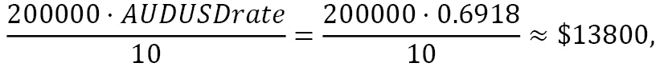

0.6918 是过去 52 周（一个工作年）的平均 AUD/USD 汇率。实际上，你可能需要更多一些，因为开仓头寸应该能够承受回撤（见本章以下内容），但本质上，大约 15,000 美元的估计似乎是足够的。没有任何在口袋里数钱的意图，让我假设如果你是一个零售交易员，那么你几乎不会开仓超过 200,000 AUD 的头寸，因此可以安全地假设 1 个点的滑点将为我们的估计提供足够的额外空间。

注意

我们所有估计背后的主要思想是假设一个理论上的最坏情况，这种情况在现实交易中可能不会实现。如果我们已经考虑了所有可能的负面影响后，策略仍然能在纸上赚钱，那么它很可能在现实生活中也能赚钱。

然而，如果你与一家金融机构合作，那么平均订单量很可能会至少增加 10 倍，因此滑点开始发挥相当重要的作用。我建议在订单量中至少减去每 10 万 1 个点来考虑在夜间等流动性较差的时间进行交易时的滑点。

交易规模、滑点和执行

在现实生活中，超过订单簿顶部的订单很少直接作为市价订单发送到市场，以避免在不受欢迎的价格执行。如果你真的需要填补一个大订单，考虑重新编写`processOrders()`函数，将大订单拆分成几部分，并逐一执行。

## 佣金

交易成本的最后一部分似乎就是佣金。通常，一个交易场所会收取大约 25-40 **美元每百万**（**DPM**）。我们如何将其重新计算成我们交易的美元价值？

在回测中使用的交易规模是 10,000 AUD/USD。这意味着我们买入或卖出 10,000 澳大利亚元，或者（使用平均汇率 AUD/USD 约为 0.6920）大约 7000 美元。以 30 DPM 的费率计算，经纪商佣金大约为 0.21 美元。现在，如果我们回想一下在我们的回测中 1 美元等于 1 个点，我们可以这样说，佣金大约是 0.21 个点。

到目前为止，我们已经计算了合理的价差、滑点和经纪商佣金的估计值。这是我们应该考虑的全部吗？

不，还有另一个许多交易者经常忘记的成本：隔夜掉期。

## 隔夜掉期

在*第六章*的[*“基本面分析基础及其在 FX 交易中的可能应用”*](https://wiki.example.org/fundamentals_of_fundamental_analysis_and_its_possible_use_in_fx_trading)部分中，“*经济新闻*”部分我们已经提到了外汇市场最奇特的特征之一：一对货币之间的利率差异。这种差异可能是正的，也可能是负的：例如，如果英镑的年利率为 5%，而日元的年利率为 0%，那么 GBP/JPY 的差异为正（5%），而 JPY/GBP 的差异为负（-5%）。

一旦你持有隔夜未平仓的头寸（超过纽约银行结算时间），你要么获得利息（如果差异为正），要么支付利息（如果差异为负）。在我们的例子中，如果你买入 GBP/JPY（或卖出 JPY/GBP，两者相同），那么你会获得利息；如果你卖出 GBP/JPY 或买入 JPY/GBP，那么你需要支付利息。

在我们的当前策略中，我们持有 AUD/USD 多日，有时长多，有时短空，所以我们可能会根据头寸方向和当前利率差异获得或支付利息。

我们必须考虑到这些隔夜费用，通常被称为**掉期**。

备注

不要将掉期与金融工具混淆，我们在*第三章*的*“外汇工具”*部分进行了讨论，*“从开发者角度的外汇市场概述”*。

然而，这竟然是一个相当复杂的任务。这里有两个问题：

+   首先，这些掉期利率会随时间变化，因为它们是基于中央银行（通常称为基准利率）设定的利率，这些利率也会变化。所以，至少我们需要基准利率的历史数据。

+   第二，每个经纪商都会在自己的基准利率上添加自己的溢价或加价，而且在大多数情况下，这种溢价是公开未知的。鉴于经纪商不存储他们的隔夜掉期利率的历史数据，可靠地恢复货币对利率差异的历史就变得有困难了。

尽管如此，我们可以尝试一下。首先，我们需要历史利率数据。它比历史市场数据要少一些，但有一些资源可以免费提供——例如，[Global-rates.com](https://Global-rates.com)。访问[`www.global-rates.com/en/interest-rates/central-banks/central-banks.aspx`](https://www.global-rates.com/en/interest-rates/central-banks/central-banks.aspx)，在那里您将找到美联储和澳大利亚储备银行利率数据的链接。

如您所见，数据变化相当不频繁，不超过每月一次——因为利率决策是由一个特殊的中央银行委员会做出的，并且通常他们每月都有会议。我们不需要在计算上绝对精确：从长远来看，隔夜掉期将只是几分之一个点，所以同步一个月的数据就足够了。我将数据复制到了 Excel 表格中，这是我的结果：

| **RBA** |  | **FED** |  | **利率差异** |
| --- | --- | --- | --- | --- |
| 12/06/22 | 3.10% | 12/14/22 | 4.50% | -1.40% |
| 11/01/22 | 2.85% | 11/02/22 | 4.00% | -1.15% |
| 10/04/22 | 2.60% |  | 3.25% | -0.65% |
| 09/06/22 | 2.35% | 09/21/22 | 3.25% | -0.90% |
| 08/02/22 | 1.85% | 07/28/22 | 2.50% | -0.65% |
| 07/06/22 | 1.35% | 06/15/22 | 1.75% | -0.40% |
| 06/07/22 | 0.85% | 05/04/22 | 1.00% | -0.15% |
| 05/03/22 | 0.35% | 03/16/22 | 0.50% | -0.15% |
| 11/03/20 | 0.10% | 03/15/20 | 0.25% | -0.15% |
| 03/19/20 | 0.25% | 03/03/20 | 1.25% | -1.00% |

表 13.1 – RBA 和美联储的历史中央银行利率

如果我们从后者减去前者，我们将得到澳元/美元货币对之间的利率差异。我们可以看到，它从低至 0.15%变化到 1.4%。现在的问题是它在金钱上意味着多少。

要计算这个，我们首先应该回忆起一年有 365 天，然后我们应该将表格最后一列的值除以 365。让我们用最新的值来做：

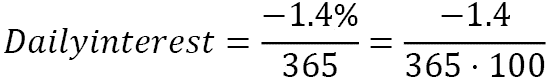

接下来，我们应该将每日利息乘以交易量。在我们的例子中，我们交易 10,000 澳元，所以我们将每日利息乘以 10,000。最后，如果我们想知道以美元计价的掉期价值，而不是澳元，我们应该将结果乘以实际的汇率，即澳元/美元的市场价格。

我想在这里已经很明显了，掉期利率的变化不仅是因为中央银行改变利率，还因为货币对的市场价格变化。为了我们的粗略估计，我们可以使用现货价格的 52 周平均值，因此将最终结果乘以 0.68。因此，在我们的例子中，我们得到：

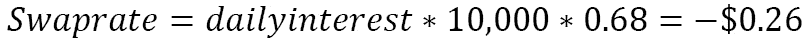

我们如何解释这个结果？

这个结果意味着，如果我们买入 10,000 澳元/美元并持有这个头寸过夜，那么我们需支付 26 美分。看起来微不足道，但仅仅是因为 10,000 的交易量相当小：别忘了外汇市场是按保证金交易的，即使零售杠杆为 30:1，你只需要账户中有 300 美元就能开一个 10,000 美元的头寸。很多时候，零售交易都是以 100,000 为基础货币进行的，而机构交易通常*从*1,000,000 开始。如果你持有 100,000 的头寸过夜，你需支付 2.6 美元——不多，但如果每晚都这样做，那么它逐渐积累成相当大的金额。如果你作为机构交易员进行交易，那么你每晚开始支付 26 美元，平均每周 130 美元，等等。

好吧，我听到你在说，“*很显然，当我们持有澳元/美元多头时，我们需要支付费用，但如果我们是空头，我们每晚应该收到等额的金额，不是吗？*”

不幸的是，现实生活（就像往常一样）比任何理论都要复杂。问题是每个经纪商都会在自己的隔夜利率上添加自己的加价。这并不令人惊讶：经纪商也必须借款来为你提供信用额度，他们不能直接从中央银行借款，因此对他们来说，利率已经更高了。这意味着负值变得更负，而正值……好吧，在大多数情况下也是负的！我鼓励你检查任何经纪商的隔夜掉期利率，将它们与我们计算出的*公允价值*进行比较，看看差异。实际上，截至今天（2023 年 1 月初），我能找到的最佳隔夜掉期利率是 100,000 澳元/美元多头头寸为-5.30 美元，空头头寸为-0.30 美元。

此外，请记住，在周三，你将需要额外支付费用，因为我们进行的是现货交易，现货是在 T+2 的基础上交付的（再次提醒，请参阅*第三章*，*从开发者角度的外汇市场概述*)。

我们可以使用一个估计，在最坏的情况下，我们为持有头寸过夜支付大约 0.5 个点的费用。点——因为，我希望，你记得使用 10,000 澳元/美元的交易规模可以使我们既以美元又以点来解释结果，这对于进一步的计算非常方便。

现在！终于！让我们总结一下到目前为止所讨论的所有成本。

交易成本计算

每笔交易的总交易成本 = 1 个点差 + 1 个点滑点 + 0.21 个点佣金 + 0.5 个点隔夜掉期 * 平均 20 天持有头寸 = 2.71 个点。

这是我们必须从平均交易中扣除的，如果剩余金额仍然是正数，那么我们的策略至少在纸上可以赚钱。

显然，现在我们可以看到，平均 79 个点的交易量是巨大的，因为即使成本过高，也几乎无法达到预期回报的 15%。这是一个真正了不起的结果，而且只有长期交易策略才能实现。

注意

策略在市场中的位置、此类策略的平均交易价值以及其回报的波动性之间存在密切关系：我们待在一个位置的时间越长，我们预期的平均交易量就越大，不幸的是，此类策略的回报波动性也会更大。这一事实甚至可以通过定理从数学上得到证明，但它远远超出了本书的范围，所以我现在建议你把它当作理所当然的事情。

总体而言，交易成本分析显示，我们的策略在这方面非常稳健（并且相信我，你未来自己开发的绝大多数策略甚至无法通过这个第一个测试——但对于研究和开发来说这是正常的）。接下来是什么？

接下来，我们必须重新审视本书中已经提到的一些概念。

# 衡量性能——重提α和β

在第九章《交易策略及其核心要素》中，我们提到了两个主要用于分析性能的重要概念：α和β。当时，我们从稍微不同的角度看待它们：我们是在寻找在市场上系统获利的机会，并且只从那个角度考虑所有这些指标。然而，不要忘记，它们最初是建议用于评估投资表现的——如果用简单的话说，就是判断投资是否优于或*击败*市场。

注意

我将故意简化α和β的概念，并避免使用它们的精确数学公式。使用它们需要良好的概率论理论掌握，并且我知道从我的以往经验来看，这正是许多读者感到困惑的数学领域。所以，请原谅我，数学纯粹主义者，但我只是想让每个人都能理解这些相对复杂的话题。

让我们从更常见且简单的指标α开始。

## 投资和交易中的α

Alpha 代表超额回报；这是最终决定你在给定时间段内是否战胜市场的指标。

通常，在资本管理中，alpha 是根据以下公式计算的：

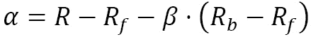

在这里，R 代表投资组合的回报，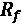 表示所谓的*无风险*回报率，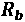 代表基准回报，而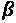 代表回报的波动性（见下文）。

听起来很复杂吗？

嗯，它并没有乍一看那么复杂。我们只需要更好地理解这个方程中每个元素的含义。

通常，回报指的是在给定时间段内获得（或损失）的金额。在投资组合投资中，回报通常按月和按年估算，在主动交易中，我们也考虑日回报 – 在某些情况下，甚至更细的时间框架。

对于投资的回报或交易策略的回报，这应该是直观的，但什么是*无风险*回报率？在交易或投资中，什么可以被认为是无风险的？

通常，无风险回报被理解为当前各自债券收益率与通货膨胀率之间的差额。对于以美元计价的美国投资，我们可以使用国债。对于欧元区的投资，通常认为德国债券是一种*无风险*投资，等等。

现在我们又看到了一个*基准*。正如我们在*第九章*的*使用货币汇率作为基准*部分所讨论的，*交易策略及其核心要素*，为外汇交易找到一个合适的基准可能相当困难。因此，我们通常使用货币对价格的变化来查看我们的策略是否比市场做得更好。

如果我们想尽可能简单明了地说明这一切，我们可以使用市场增长和回报的线性模型，假设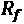 = 0（没有免费的午餐，对吧？）和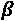 = 1（回报的波动性与市场本身的波动性完全相同）。例如，如果*x*轴代表时间，比如天数，而*y*轴代表回报，那么 alpha 恰好是两个函数值之间的差异：

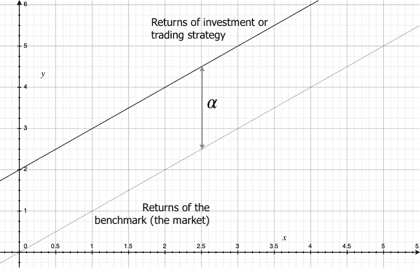

图 13.1 – 返回和 alpha 的简化模型

要使关于 alpha 的故事完整，我应该指出，有时，特别是在分析主动交易策略的表现而不是投资时，alpha 被认为是从经典的线性方程形式中推导出来的：

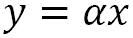

如我们之前的例子，这是一个非常、非常简化的模型，展示了回报随时间增长的情况。如果我们假设市场本身以线性增长，其增长率为 1（y = x），那么任何 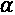 > 1 就意味着投资的回报增长速度比市场快，并且投资实际上击败了市场。同样，任何 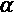< 1 就意味着投资的回报增长速度比市场本身慢。在这种情况下，即使这项投资给账户带来一些资金，它也没有击败市场：你通过简单地购买市场本身（股票、商品甚至货币可以构成相应的市场基准）可能会赚得更多。这个简单的假设在下面的图中展示：

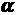 = 1, 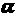 > 1, 和 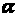 < 1]

假设基准（市场）以 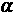 = 1（黑色线条）的速度增长。任何  > 1（在我们的例子中  = 2）的函数将增长得更快，而任何 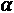 < 1（在我们的例子中 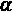 = 0.5）的函数将比基准增长得慢。

备注

这种对 alpha 的解释并不常见，且不能用于经典资本管理理论。我仅提供这个不寻常的观点供您参考。

现在，我希望关于 alpha 的所有方面都更加清晰，但 beta 呢？

## 贝塔

贝塔是衡量回报波动性的指标。还记得我们在 *第九章* 的 *Beta – earn on volatility* 部分讨论的类比吗？不仅我们能从 A 点到达 B 点的事实很重要，而且我们如何到达那里，即路径的直或弯也很重要。如果我们想说明这种比较，我们可以再次使用线性函数作为直线路径的例子，以及添加周期性成分的相同线性函数作为额外波动路径的例子：

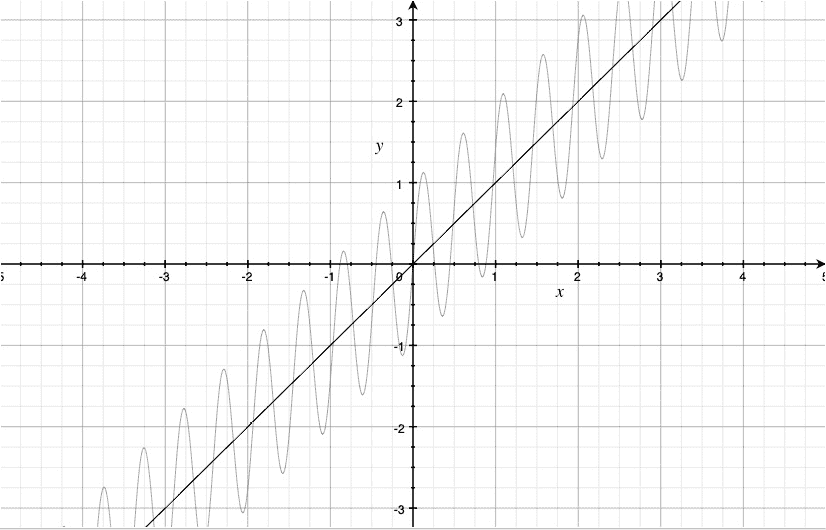

图 13.3 – 带有和未添加波动性的线性函数

我们可以看到，两个函数都从点 **(0,0)** 到 **(2,2)**，但线性函数做得更快。现在，让我们想象这两个图表都描绘了某种投资的回报。那么，*x*-轴代表时间，*y*-轴代表在一定时期内赚得或损失的资金量。因此，当我们看到曲线在增长时，这意味着资金在账户中积累，而当我们看到它在下降时，这意味着账户在亏损。

现在，让我们对我们的样本投资活动进行定期快照，并测量两个指标：

+   从上一个快照时间到当前快照时间的价值变化了多少

+   在给定时间段内的快照期间价值变化了多少

在下面的图中，我放大了并标记了图上的相应值：

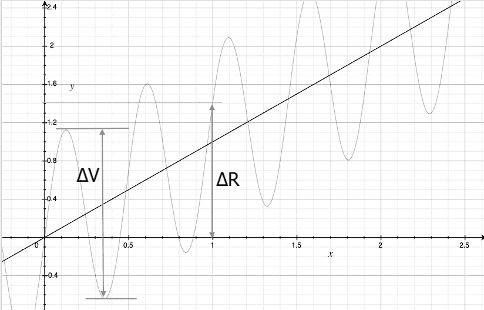

图 13.4 – 简化模型中的回报及其波动性

在这个例子中，我们检查了回报（**R**）和波动性（**V**）在每一个整数值（1，2，3 等等）。

让回报的前一个值（在 0 处测量）与当前值（1）之间的差值是**ΔR**。在我们的例子中，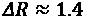。

然后，我们注意到回报首先增长（从 0 到大约 1.3），然后下降到大约-0.65，然后再次增长到 1.6，然后下降到-0.15，最后再次增长到大约 1.4。因此，在从 0 到 1 的快照期间，函数已经经历了几个极值，包括最大值和最小值。设**ΔV**为局部最大值与紧随其后的下一个局部最小值之间的差值，这个最小值紧随最大值之后（而不是相反！）在我们的例子中，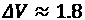。

ΔV 的值被称为**回撤**，并且是任何投资或交易策略的关键性能指标之一。

那么，我们如何现在估算（非常粗略，但无论如何）回报的 beta 值？

我们对回报与回撤的比率感兴趣：

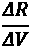

我们希望这个比率的值尽可能高。如果我们有两个或更多策略可供选择，那么我们更喜欢回报与回撤比率更高的那个。

在我们的例子中，显然的选择是*线性*策略，因为它只会带来收益而没有损失。这意味着这种策略的价值ΔV = 0，因此所讨论的比率是无限的。当然，在现实中这种情况永远不会发生，但它清楚地说明了任何投资者乌托邦式目标。

第二种策略的特点是回报与回撤的比率约为 0.77。这意味着尽管这种策略能赚钱，但投资者在进入正区之前会有很多绝望的时刻：这种策略的回报波动性大于回报本身！

我们刚才考虑的方法当然是一个非常简化的方法。在实际应用中，贝塔通常被计算为回报的波动性，而不是与相同策略或投资的回报相比，而是与基准相比，就像 alpha 和其他投资绩效指标一样。除此之外，评估整个投资或交易期间的回报与回撤比率，以及首先计算多个较小期间的这些比率，然后平均它们，最后计算这些值的分散度，从而了解这个比率随时间的变化或这个给定策略或投资的回报波动性是否一致，这会更加正确。

然而，我承诺在这本书中保持简单，不要求从概率论的理论中获取具体知识，所以在我们第一次接触绩效指标时，我们不会走得太远。如果你想深入了解这个非常有趣且非常复杂的话题，我建议从 Investopedia 上的框架文章开始（[`www.investopedia.com/investing/measure-mutual-fund-risk`](https://www.investopedia.com/investing/measure-mutual-fund-risk)），并跟随那里提供的所有链接：很快，你将发现自己置身于均值、标准差、方差和协方差的热带雨林中，但从长远来看，这将是一次相当有回报的经历。

重要提示

本章前面提到的经典资本管理公式中使用的贝塔估计与这里建议的贝塔不同。这里引入它只是为了解释回报波动性的本质，更好地理解接下来讨论的基本绩效指标。

好的，我们已经刷新了对 alpha 和 beta 的记忆，但你有没有注意到，到目前为止，我们一直在谈论 alpha 作为投资的绩效指标？投资和交易之间有什么区别，我们还能否继续使用 alpha 来评估交易策略的表现？

两者之间的主要区别在于，投资假设购买资产并长期持有，而交易意味着你在同一时间段内积极买卖资产。因此，在投资中，我们可以通过选择表现优于整个市场（通过指数或其他基准）的资产来有可能超越市场，而在主动交易中，我们试图通过持有较短的时间来超越资产本身。

使用 alpha 和 beta 相关指标来分析交易策略的表现的主要问题是缺乏适合此目的的相关基准。我们已经在*第九章*《交易策略及其核心要素》中提到了这个问题，并指出使用特定的 FX 基准来评估 FX 交易策略的表现会更加合理。

然而，有时真的很难找到一个合适的基准来比较苹果和苹果：例如，如果我们试图评估日内策略的表现，该策略每天开仓和平仓多个头寸，理想情况下，我们应该将其与用作参考的类似日内策略进行比较，但找到这样的参考本身就是一个相当大的挑战！那么，在没有这样的基准的情况下，我们如何才能充分评估交易策略的表现呢？

嗯，这就是为什么大多数用于评估交易策略表现的性能指标只使用相同的表现数据，有时与资产价格数据结合使用。这些指标可以被认为是*代理*对*真实 alpha*或*真实 beta*，如果结合起来，可以提供相当全面的分析，这有助于回答交易的主要问题：是否用这个策略下注。

让我们从旨在估计交易策略回报 alpha 值的指标开始。

# 净利润与买入并持有

这是在确认平均交易大于覆盖所有交易成本所需的绝对最低值之后需要检查的第一件事。买入并持有意味着我们购买与回测中使用的相同数量的货币，在整个回测期间持有该头寸，然后查看价格时间序列的最后一条记录上的最终**盈亏**（**PnL**）。在我们的例子中，我们应该*购买*10,000 澳元/美元，持有大约 3 年，然后查看这笔单一交易的回报。

我建议比较策略的净收益和买入并持有，以及权益曲线：这将让我们了解在两种情况下权益随时间的变化情况。

让我们快速创建一个买入并持有策略的权益曲线。如您所记，我们将交易逻辑隔离到一个单独的函数中，`tradeLogic()`，因此我们只需重写`交易逻辑开始于此`和`交易逻辑结束于此`注释之间的部分，同时保持其余代码不变。首先复制`tradeLogic()`函数并给它一个合适的名字——例如，`buyAndHold()`，在修改代码之前是一个好主意：

```py
        if System.market_position == 0:
            close = bar['Close']
            order = {}
            order['Type'] = 'Market'
            order['Price'] = close
            order['Side'] = 'Buy'
            order['Size'] = 10000
            orders_stream.put(order)
```

如您所见，`buyAndHold()`和`tradeLogic()`之间的唯一区别是我们移除了所有交易逻辑，并用在第一个条上的单一交易替换了它。在回测的其余部分不再放置其他交易。

如果我们现在运行回测，我们将看到我们假设的买入并持有*投资*的权益曲线。请注意，*x*轴和*y*轴的含义与简化插图中的相同：*x*轴代表时间——在我们的回测中，天数（因为我们使用的是日数据）——而*y*轴代表回报。

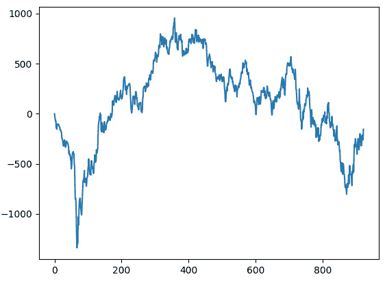

图 13.5 – 买入并持有回报，澳元/美元

并且控制台输出如下：

```py
Total trades: 1
Average trade: -153.9999999999997
```

这意味着如果我们 3 年前用美元购买了 10,000 澳大利亚元（并且历史价格数据从 2020 年开始），那么我们就会获得丰厚的回报-153 美元（！），相当于 3 年内的-1.53%（！）。而且这还没有提到在我们取得如此惊人的结果之前，我们几乎有 1,500 美元或 15%的回撤。

好吧，我希望你感受到了我的讽刺：现在你可以看到为什么我总是对关于货币市场*投资*的任何说法都变得非常怀疑：即使在如此短暂的 3 年时间内，也很难找到一个能够提供与股票市场*常态*（在这里，我指的是牛市，当股票指数每年、每个季度甚至有时每月都在增长。让我们现在先不考虑熊市，以免破坏这样一个理想化的画面）相当的回报。如果不积极管理头寸（买入和卖出），在 FX 市场中实现任何可接受的回报都是不可能的。让我们切换回来——用`tradeLogic()`替换`buyAndHold()`函数，并再次运行回测：

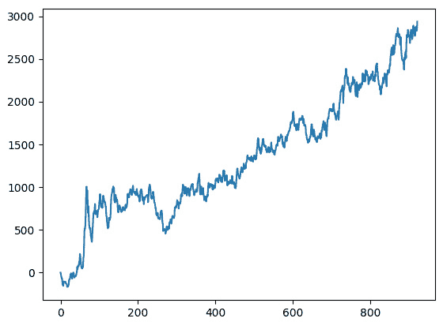

图 13.6 – 样本趋势跟踪交易策略的回报，澳元/美元

控制台输出现在如下所示：

```py
Total trades: 37
Average trade: 79.40540540540536
```

这意味着在相同的 3 年测试期内，我们通过交易相同规模的 10,000 澳元/美元，赚取了近 3,000 美元。无需任何评论，就可以明显看出这个结果是如何超越买入并持有策略的：它在 3 年内等于 30%，而买入并持有策略为-1.53%。

让我们计算一下趋势跟踪策略的 alpha 估计值。策略回报为 30%，无风险回报率可以估计为-2.85%（3 年期的国债收益率为 4.25%，减去 2022 年的通货膨胀率 7.1%），基准回报为-1.53%，鉴于贝塔值，或者说回报的波动性，至少不比基准差（仅从这两个图表来看，这显然是正确的），那么我们的策略在 3 年内的 alpha 大约为 31.53%。

因此，我们可以这样说，该策略已经通过了两个检验：它具有平均交易价值，这使得策略能够真正进行交易（而不仅仅是纸上谈兵），它还产生了 alpha（优于基准），并且其回报与传统投资（例如，投资于标普 500 ETF 在同样的 3 年内回报约为 18%）相当。

现在让我们转向评估贝塔值，或者说回报的波动性。正如之前所提到的，我们不会提供在资本管理中使用的经典贝塔定义，因为它需要概率理论方面的特定知识。相反，我们将考虑回撤，这是平均交易和整体回报之后第三重要的指标，并展示为什么它可以作为评估回报波动性的*代理*。

# 回撤

根据 CFI（最大回撤：[`corporatefinanceinstitute.com/resources/capital-markets/maximum-drawdown/`](https://corporatefinanceinstitute.com/resources/capital-markets/maximum-drawdown/))上发布的一篇文章，“最大回撤（MDD）衡量投资价值的最大下跌，这是通过最低谷值与之前最高峰值的差来给出的。”我们已经在*图 13*4 中看到了回撤的说明，它相当容易理解。然而，实际的权益曲线永远不会像用于说明目的的理想正弦波那样看起来，因此回撤不是一个恒定值；它会随时间变化，这些变化也可能说很多关于回报波动性的信息。

因此，我们想要根据以下算法计算一个新的时间序列：

1.  让权益曲线的第一个（最左侧）数据点作为当前历史高点（最大值）。

1.  将下一个值与当前值进行比较。

1.  如果下一个值大于当前值，则下一个值成为新的历史高点。

1.  如果下一个值小于当前值，则将此值与当前历史高点之间的差值存储为回撤。

1.  当权益曲线达到新的历史高点时完成回撤的更新，并重复整个算法。

如您所见，如果我们处理时间序列或任何其他序列，可迭代对象，数组等，我们可以在仅两步中更有效地实现相同的计算：

1.  形成一个新序列，其中下一个元素要么等于前一个元素，要么更大。

1.  从结果序列中减去原始序列。

这将给我们一个回撤序列。

为了更好地理解回撤是什么以及它是如何计算的，让我们考虑一个简单的例子。

让我们创建一个包含一系列非负值的列表：

```py
a = [1,2,4,3,5,8,7,6,2,9,10]
```

然后，准备一个空列表，我们将在这里存储结果：

```py
m = [] # m stands for 'maximum'
```

并初始化一个变量，该变量应存储初始列表中的当前高点（最大值）：

```py
x = 0
```

现在，我们遍历列表中的所有元素，`a`，将它们与最后一个最大值进行比较，选择新的最大值，更新它，并将其追加到结果列表`m`中：

```py
for el in a:
    if el > x:
        x = el
    m.append(x)
```

如果你一切操作正确，那么`m`应包含以下序列：`[1, 2, 4, 4, 5, 8, 8, 8, 8, 9, 10]`。如果我们现在从`m`中减去原始序列`a`，那么我们得到一系列回撤：

```py
[x - y for x, y in zip(a, m)]
```

这将返回`[0, 0, 0, -1, 0, 0, -1, -2, -6, 0, 0]`。这是在原始序列的每个数据点计算出的回撤列表。

我们可以通过从左到右扫描原始序列中的数据来验证结果。`a`中的第二个元素大于第一个，所以下跌为 0，最新高点为 2。第三个元素大于最新高点，所以下跌再次为 0，最新高点更新为 4。`a`中的第四个元素比最新高点低 1，所以`m`中的第四个元素为-1，最新高点保持为 4。你可以继续这个计算，并确保所有下跌值都计算正确——并且你现在完全理解了下跌的含义。

使用`numpy`数组可以更快地完成这个操作：

```py
import numpy as np
a = [1,2,4,3,5,8,7,6,2,9,10]
m = np.maximum.accumulate(a)
dd = a - m
```

这段简单的代码将生成与之前相同的下跌序列，唯一的区别现在是将使用`numpy`数组而不是原生的 Python 列表：

```py
>>> dd
array([ 0,  0,  0, -1,  0,  0, -1, -2, -6,  0,  0])
```

现在我们完全理解了什么是下跌以及它是如何计算的，让我们为我们趋势跟踪策略的权益时间序列进行计算。

首先，最重要的是，我们应该在代码的非常开始处添加`import numpy`，以及其他导入。

接下来，让我们稍微修改回测代码的末尾，其中调用`matplotlib`的`plot()`函数：

```py
dd = System.equity_timeseries - np.maximum.accumulate(System.equity_timeseries)
plt.subplot(2,1,1)
plt.plot(System.equity_timeseries)
plt.subplot(2,1,2)
plt.plot(dd)
plt.show()
```

你可以看到一个新的命令：`plt.subplot()`。它用于在同一画布上放置多个图表或图形（参见*第八章*，*使用 Python 进行外汇交易中的数据可视化*，以刷新你对`matplotlib`绘图对象模型的记忆）。为了节省时间和空间，我建议你浏览一下[`www.w3schools.com/python/matplotlib_subplot.asp`](https://www.w3schools.com/python/matplotlib_subplot.asp)上的教程，以了解`subplot()`参数的含义。

现在，如果你已经正确地完成了所有操作并再次运行回测（当然，使用相同的源价格数据！），你现在将看到与之前相同的权益曲线，但下面是下跌图表：

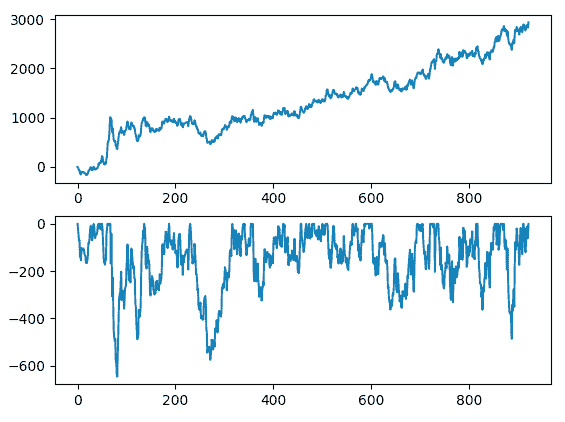

图 13.7 – 样本趋势跟踪策略的权益曲线和下跌

现在，我们对我们的策略了解得更多了，特别是关于与之相关的风险。即使没有进行精确的计算（这可能相当复杂）并且只是对生成的图表进行表面观察，我们也可以得出一些重要的结论，这些结论将在下一节中讨论。

## 风险/回报和下跌回报

首先，我们想了解在回测期间下跌是否分布得更均匀或更不均匀。这非常重要，因为如果存在随机的重大下跌，那么这是一个警告信号：这意味着市场中有一些偶尔的过程没有被交易策略中使用的模型所考虑，迟早，这些过程中的一个可能会完全摧毁策略。

在我们继续之前，我建议你回顾一下均值和标准差的概念，我们之前在*第六章*的*“波动性指标”*部分讨论过这些概念，*基本面分析基础及其在* *外汇交易* *中的可能用途*。

我们可以通过在交互式控制台中运行回测并在初始图表显示后输入以下内容来快速分析结果：

```py
mean_dd = dd.mean()
```

这计算了回撤的均值。以下命令返回回撤的标准差：

```py
std_dd = dd.std()
```

现在，在图表中添加三条线：均值回撤、均值减去 1 个标准差和均值减去 2 个标准差：

```py
plt.plot(range(len(dd)), [mean_dd] * len(dd))
plt.plot(range(len(dd)), [mean_dd - std_dd] * len(dd))
plt.plot(range(len(dd)), [mean_dd - 2*std_dd] * len(dd))
```

如果你一切操作正确，你应该在下面的图中看到类似的内容：

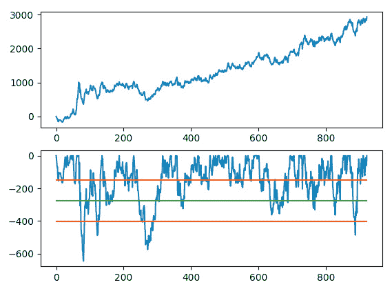

图 13.8 – 抽样均值减去 1 和 2 个标准差的回撤

我们如何解释这个结果？

位于 2 个标准差之外（图表中的底部水平线）的回撤被称为异常值。它们值得特别注意，因为通常它们是由策略逻辑中没有考虑到的因素引起的。在我们的例子中，幸运的是，这些异常值不多，而且至少第一个异常值可以很容易地用 COVID-19 恐慌初期市场的波动性来解释。

均值和 2 个标准差之间的回撤在时间上分布得或多或少均匀。这意味着它们只是由策略中使用的市场模型的不完美性引起的系统性回撤。

大多数回撤都高于均值，并且再次，它们沿着时间轴均匀分布——所以，这让我们有理由相信市场模型对市场是合适的。

在进行初步的定性分析之后，让我们转向数字。我们策略的最大回撤（也可以通过在交互式控制台中输入 `min(dd)` 或者在代码中添加 `print(min(dd))` 来找到）为 646 点。这是大还是小？如果你投资 10,000 美元并暂时损失 646 美元，这意味着你承担了账户大约 6.5% 的风险。这是一个中等到低风险，这在大多数投资者看来是可以接受的。

然而，一个更重要的指标是风险/回报比。这个指标的含义相当直观：比率越低，回报的波动性越小，因此整体投资风险也越小。

让我们为我们的例子做简单的数学计算。我们的策略在 3 年内的总净盈利略高于 3,000 点。即使我们假设它每年都产生相同的回报（这并不成立），那么平均每年大约有 1,500 点的回报。这意味着通过承担 646 美元的风险，我们可能期望获得大约 1,500 美元，因此风险/回报比约为 0.43。

再次提出神圣的问题：这是*好*还是*坏*？

通常来说，任何小于 1 的风险/回报比都是好的，因为这意味着你冒的风险小于你可能期望赢得的。关于风险/回报比（以及所有其他性能指标）的*最优*值存在争议，但大多数作者认为任何小于 0.5 的值都为投资金融产品提供了潜在绿灯。

注意

严格来说，关于风险/回报比的问题也与基准问题密切相关。不幸的是，这个主题过于广泛和复杂，无法在本书中仔细考虑，但提供的粗略估计可以作为你研究的起点。

另一个本质上与风险/回报比相反的指标是回撤回报率。唯一的区别是后者通常以百分比计算，而不是以分数值计算。这个指标的含义也非常直观：它表示预期的风险溢价——如果我们冒一定数量的钱，我们期望的回报。

在我们的例子中，回撤回报率为 1,500/646*100 = 232.2%，在 2 年内。换句话说，你可能会期望大约是你能承担分配给这个策略的风险的两倍。

在这一点上，你可能会惊呼，“为什么，但在这章的早期，我们计算出的 alpha 值只有大约 30%，现在我们怎么得到了如此*巨大*的回报？”

这可能是外汇交易中最令人困惑的部分，我们将在下一节详细讨论。

# 杠杆的力量——我需要多少来交易？

最后，我们将回答任何投资者面临的主要问题：我需要在交易账户中有多少钱，以及我可以期望从中获得多少？

在我们继续之前，让我提醒你注意关于外汇交易的一个重要事实。

注意

不要将投资回报率作为性能指标与实际投资的实际回报率混淆！

要理解这一点，我们再次回顾杠杆交易的本质以及它与无杠杆的常规投资和交易有何不同。

当你进行无杠杆投资或交易时，你只能购买你账户中金额对应的资产（股票、商品等）。例如，如果你交易股票，股票价格为 100 美元，你账户中有 10,000 美元，那么你最多只能购买 100 股股票（实际上因为交易成本会少一些）。

然而，如果你进行杠杆交易，那么你只需要支付所需金额的一部分，其余部分将由你的经纪人以信用额度提供。在我们的例子中，如果你账户中有 10,000 美元，你的经纪人提供 30:1 的零售杠杆，那么你理论上可以购买多达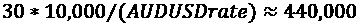澳大利亚元。

能够用交易账户中的资金购买比通常可能购买更多的资产，这使得保证金交易对许多新手交易者非常有吸引力。然而，杠杆是一把双刃剑。让我们做一些简单的数学计算，看看为什么它可能非常危险。

你还记得我们一直以点数计算一切，而不是以货币计算吗？现在我们可以从中受益，因为我们只需要根据所选的杠杆调整点数价值，并按比例调整所有性能指标。

所以，当我们交易 10,000 澳元/美元时，净回报大约是 3,000 点，最大回撤是 646 点。如果我们账户中有相同的 10,000 美元，这意味着我们没有使用杠杆进行交易，而对于无杠杆交易，回报确实会达到大约 30%，而回撤将保持在可接受的低水平，大约 6.5%。

现在，我们以 30:1 的杠杆进行交易。这意味着现在一个点的价值等于 30 美元，而不是 1 美元。那么，回报将是$30 * 3000 = $90,000——多么丰厚的利润！如果我们把这个数字作为初始投资的百分比增长来表示，那么在仅仅 3 年内，我们就会有一个令人难以置信的 900%的价值。所以，保证金交易是一个巨大的好处，也是一条可行的道路，不是吗？

但我们忘记了回撤。我们还需要将其放大，因为现在 1 点价值 30 美元。这样，646 点的回撤就转化为$30 * 646 = $19,380。

哎呀。

现在的回撤是账户总初始资本的的两倍！这意味着实际上，我们从未达到预期的回报。此外，我们不仅没有盈利，反而会损失账户中所有的钱，面临一个臭名昭著的称为*保证金追缴*的灾难：当经纪商要求向账户添加资金时，否则，无法维持开放的头寸。大多数零售经纪商不会等到客户向他们的账户添加资金，而是简单地以损失了结这样的头寸。因此，如果我们以 30:1 的杠杆进行交易，我们会在第一次回撤时损失账户中所有的钱。

那么，我们如何选择可接受的杠杆？

在保证金交易中，我们通常从相反的一端开始。不是首先从策略指标计算预期的回报，而是首先尝试估算一个杠杆，使得我们的头寸在整个交易期间保持开放。

我们知道最大回撤是 646 点，我们在交易账户中有 10,000 美元。因此，可能的最大杠杆应该使点数价值不超过 10,000/646，大约是 15 美元。因此，绝对可能的最大杠杆是 15:1，比经纪商提供的 30:1 低一半。

现在，让我们仔细看看结果。

我们能否以 15:1 的杠杆进行交易？从理论上讲，是的，但实际上不行，因为在这种情况下，回撤将占满整个交易账户。我无法想象任何交易者，更不用说投资者了，能够承受这样的回撤，即使只是心理上。

在现实中，正确的杠杆计算按以下顺序进行：

1.  定义最大损失水平。这并不是策略的最大回撤，而是投资者可接受的最大回撤。

1.  计算点值，以便这个可接受的损失水平等于策略的回撤。

1.  定义杠杆为预期点值与原始点值的比率。

1.  定义交易规模为原始交易规模乘以杠杆。

让我们假设一个平均投资者可以承受初始投资的 10% 的回撤，来计算我们策略的杠杆。让我们还假设初始投资是 $10,000。因此，账户中的最大损失永远不应超过 $1,000。以 646 点的最大策略回撤计算，1 点的价值可以是 $1,000/646 = $1.54。所以，我们只使用 1.5:1 的杠杆（不是 15:1，不是 30:1，当然也不是许多经纪商提供的 100:1！）现在，我们回想一下，当我们每笔交易 $10,000 时，我们可以获得 $1 的点值。我们将原始交易规模（10,000）乘以杠杆（1.5），我们得到只有 15,000 AUD/USD。

那么，回报如何呢？之前我们计算了两个指标——alpha 和回撤回报——它们给出了两个非常不同的值：前者约为 30%，后者超过 200%。以我们可接受的 10% 损失率和 1.5:1 的杠杆率计算，我们预计在 2 年内获得 3,000 点 * $1.5 = $4,500 的回报。这相当于初始投资 $10,000 的 45%。

现在，让我们总结本章中讨论的所有关键要点。

备注

Alpha 是针对无杠杆投资计算的，并给出了可能的最低回报估计。

回撤回报是根据最大可能的杠杆计算的，并给出了可能的回报上限估计（假设回撤可能达到初始投资的 100%）。

现实回报是基于所选风险水平计算的，并且始终介于 alpha 和回撤回报之间。

# 摘要

在本章中，我们熟悉了最基本但最重要的性能指标。我们现在明白，有三个主要方面有助于评估策略性能：交易分析、与 alpha 相关的指标，如回报，以及与 beta 相关的指标，如回报的波动性和回撤分析。我们了解了始终对性能产生负面影响的主要因素，例如点差、滑点、佣金和隔夜掉期，并了解了我们如何在评估中现实地考虑它们。

我们已经对资本管理的基础进行了初步了解，并考虑了阿尔法（alpha）和贝塔（beta），以简化的形式，但至少在帮助改善我们对策略的判断方面是足够的。最后，我们仔细考虑了杠杆，看到了它的双刃剑性质，并采用了为保证金交易市场，如外汇市场选择杠杆的正确方式。

当然，本章只是对资本管理和风险评估这个庞大、复杂但有趣的世界的一个简介，正如整本书也只是在一般意义上介绍了系统外汇交易的世界。然而，即使本书中考虑的基本事实和技术也足以开始你自己的作业。希望这项作业能够持续下去——因为任何成功的交易员，从长远来看，都是市场的不懈学习者。

我鼓励你测试你遇到的任何想法——既然你知道如何去做，就使用本章概述的方法，批判性地分析结果——并且继续你的学习，将我的评论“遗憾的是，这超出了本书的范围”作为自己进一步学习的邀请。有一天，你可能会发现你管理着一个在众多市场中运行的策略组合，这既给你带来了从体面的工作中获得的精神满足，也带来了相当可观的经济回报。
