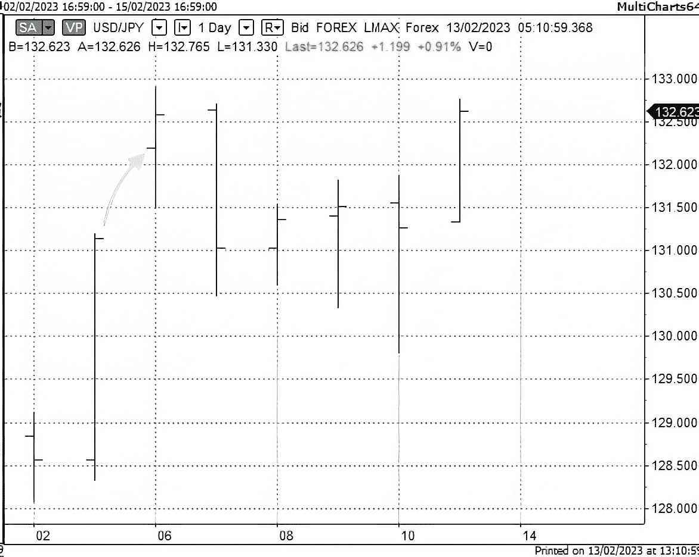
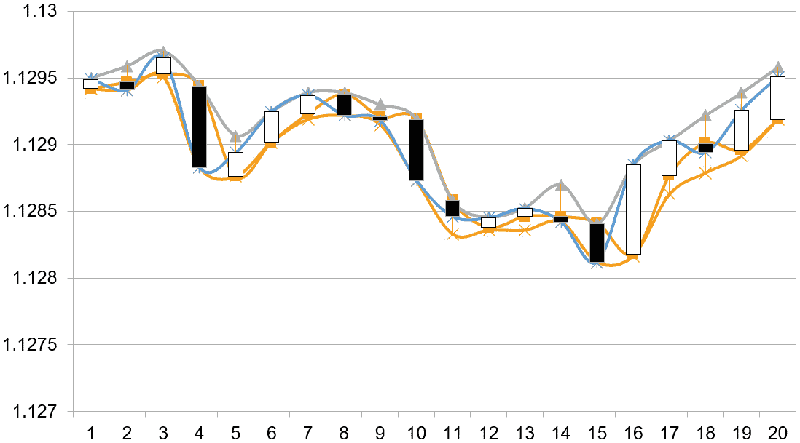
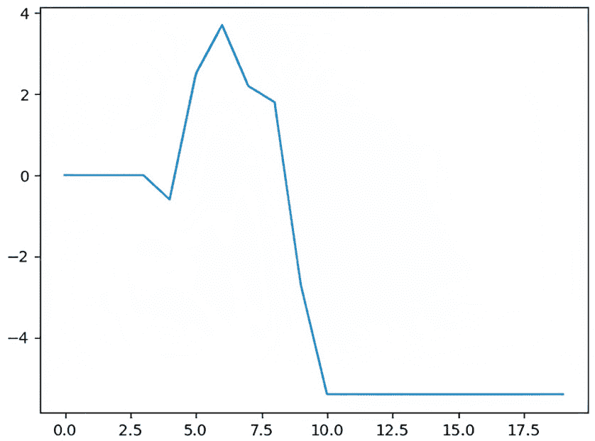
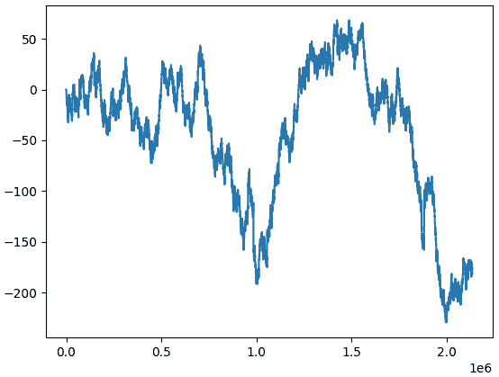
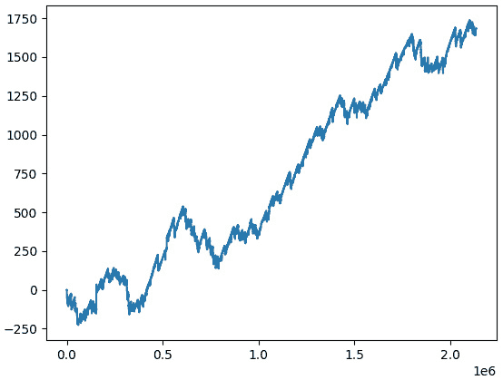
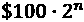

# 14

# 现在去哪里？

尽管上一章听起来像是书的结尾，但我认为不给你一些关于进一步发展你在外汇市场和创建交易算法（算法）的知识和技能的指导是不公平的。与之前的章节不同，其中每一章都专注于一个大型主题，这一章是关于外汇算法交易不同方面的短篇故事集，旨在为你提供进一步研究的起点。

掌握任何复杂主题都需要努力，而交易可能是耗时和劳动密集型活动，它需要结合科学家和商人的心态的非常特殊的态度。任何成功的交易策略或算法都是许多小时工作的结果，其中只有 10-20%的时间用于实际的编码、调试和重构；大部分时间总是花在研究市场上，寻找交易想法和无数试验和错误的证明概念。本章将给你提示，如何在市场上找到自己的优势，并使你的交易应用更加健壮。

不要忘记，我们都是市场的终身学生，只要你在算法交易这个复杂而激动人心的行业中，你将不断学习。

在本章中，你将学习以下主题：

+   实施限价单和止损单

+   计算交易次数的正确方法

+   从交易想法到实施——使用限价单和止损单的另一个示例策略

+   资金管理和处理多个入场

+   重新审视策略表现——更多指标

+   关于算法交易特定风险的更多内容

+   经典的技术交易设置

+   优化——算法交易的祝福与诅咒

# 实施限价单和止损单

在*第十章*“在 Python 中考虑订单类型及其模拟”中，我们考虑了三种主要的订单类型：市价单、限价单和止损单。然而，到目前为止，我们只在实际代码中使用了市价单。虽然我们指出，实际交易应用可能永远不会使用止损单和限价单，因为它们可以在客户端模拟，并在必要时作为市价单发送到市场，但在回测器中实现这两种类型的订单肯定是有用的，以简化交易策略的开发。

让我们快速回顾一下限价单和止损单的精髓。

**限价单**总是以等于订单价格或更好的价格执行。这意味着如果市场价格目前是 100，并且发送了一个低于市场的买入限价单，例如，在 99，那么它只有在价格变为 99 或更低时才会被填充。如果发送了一个高于市场的买入限价单，例如，在 101，那么它将立即执行，其价格将作为订单执行期间可能出现的价格上涨的限制。

同样，**停损单**总是以等于订单价格或更差的价格执行。使用相同的例子，如果发送一个低于市场的买入停损单，那么它将立即执行；如果发送一个高于市场的停损单，那么它将只在市场价格达到订单水平时执行。在执行停损单时，对价格在执行过程中的增长没有限制。

对于卖出订单，情况是对称的。

当我们使用 tick 数据模拟执行限价单和停损单时，我们总能检查某个 tick 是否满足订单条件，然后假设它为执行订单的价格。然而，当我们处理压缩数据时，例如 1 分钟、1 小时、1 天等，我们不知道订单会在哪个 tick 实际执行。相反，我们假设如果 K 线的最高价或最低价穿过订单水平，那么订单应该被成交。*表 14.1*总结了限价单和停损单所有可能的成交条件：

| **订单类型** | **方向** | **成交条件** | **成交价格** |
| --- | --- | --- | --- |
| 限价 | 买入 | K 线最低价 < 订单价格 | 订单价格和 K 线开盘价的最小值 |
| 限价 | 卖出 | K 线最高价 > 订单价格 | 订单价格和 K 线开盘价的最大值 |
| 停损 | 买入 | K 线最高价 > 订单价格 | 订单价格和 K 线开盘价的最大值 |
| 停损 | 卖出 | K 线最低价 < 订单价格 | 订单价格和 K 线开盘价的最小值 |

表 14.1 – 触发限价单和停损单的条件及其假设执行价格

你可以看到，当使用压缩数据进行回测时，我们假设订单执行的价格并不一定等于订单价格。在某些情况下，它可能是 K 线的开盘价。为什么？

要回答这个问题，我们应该回想一下市场价格不是连续的，有时相邻的 tick 之间价格差异可能相当显著。在 K 线图中，这可以看作是 K 线收盘和下一根 K 线开盘之间的*空隙*。这些空隙被称为**缺口**。

通常，外汇市场的 K 线图在周五市场收盘和周日晚些时候重新开盘之间会有缺口。通常，这些缺口并不很大，但有时它们可能非常显著，尤其是在周末期间有重要的经济或政治新闻。以下图表展示了 2023 年 2 月 6 日 USD/JPY 的周末缺口：



图 14.1 – USD/JPY 的周末缺口（由 Multicharts 图表）

市场于 2023 年 2 月 3 日星期五收盘价为**131.141**，并于 2023 年 2 月 6 日星期一开盘价为**132.194**。这两个价格之间的差异由灰色箭头表示。这个差异超过 100 点，与平均每日价格波动相当。如果在周五收盘时我们发送了一个以 131.50 为买入止损订单，那么实际上，这个订单只会以 132.194 的价格成交（实际上，由于市场开盘后流动性较差的时间段的滑点，可能甚至更差）。如果我们周五收盘时卖出，即使我们用止损单保护我们的头寸——实际上这只是一种止损订单——嗯...我们只能希望头寸大小足够小，不至于因为一次巨大的损失而毁掉交易账户。

不管怎样，我们现在可以理解为什么我们总是检查订单价格是否超过条的开盘价，以及为什么我们建议根据*第 14.1 表*中的**成交价格**列计算实际执行价格。

现在我们已经了解了如何现实地模拟限价和止损订单，让我们继续编码。我们将使用我们在*第十一章*，*回测和理论表现*中开发的回测代码，我们将修改`emulateBrokerExecution()`函数，因为订单执行被隔离在其中（还记得保持代码逻辑模块化的理念吗？现在，我们开始真正从这种方法中受益）。

目前，`emulateBrokerExecution()`函数只包含市场订单的实现。让我们直接在其下方添加以下代码块：

```py
    if order['Type'] == 'Limit':
        if order['Status'] == 'Created':
            order['Status'] = 'Submitted'
        if order['Status'] == 'Submitted':
            if order['Side'] == 'Buy' and bar['Low'] <= order['Price']:
                order['Status'] = 'Executed'
                order['Executed Price'] = min(order['Price'], bar['Open'])
            if order['Side'] == 'Sell' and bar['High'] >= order['Price']:
                order['Status'] = 'Executed'
                order['Executed Price'] = max(order['Price'], bar['Open'])
```

我希望代码足够透明，以便可以看到它只是实现了在第 14.1 表中概述的逻辑。

如果你想模拟限价订单典型的执行问题，那么你可能想在代码中将`<=`替换为`<`，将`>=`替换为`>`，以检查条的价格是否与订单价格匹配。在这种情况下，你假设限价订单有一个保证的成交（参见*第十章*，*Python 中的订单类型及其模拟*）。

现在，让我们添加一个非常相似的代码块来模拟止损订单的执行：

```py
    if order['Type'] == 'Stop':
        # print('Begin processing limit order',
                Broker.orders_list)
        if order['Status'] == 'Created':
            # Here we actually send orders to the API
            order['Status'] = 'Submitted'
        if order['Status'] == 'Submitted':
            if order['Side'] == 'Buy' and bar['High'] >= order['Price']:
                order['Status'] = 'Executed'
                order['Executed Price'] = max(order['Price'], bar['Open'])
            if order['Side'] == 'Sell' and bar['Low'] <= order['Price']:
                order['Status'] = 'Executed'
                order['Executed Price'] = min(order['Price'], bar['Open'])
```

代码与限价订单模拟的代码绝对是对称的。

如果你想要模拟止损订单典型的滑点，那么你可能想在执行价格上添加或减去一小部分金额。通常，如果我们交易流动性较高的市场，如 EUR/USD，并且从早上 7 点交易到 GMT 晚上 9:50，我们可能不需要添加或减去任何东西。如果我们交易流动性较低的货币对，如 AUD/USD，那么 0.00001 到 0.00005 点的滑点看起来是合理的。如果你交易的是更不寻常的货币对，如 TRY/MXN，那么检查订单簿（如果你的经纪商甚至提供这样的对！）。再次参见*第十章*，*Python 中的订单类型及其模拟*，以获取关于止损订单和滑点的详细信息。

注意我们对待市价、限价或止损订单的方式之间的重要区别。市价订单的状态在订单被`emulateBrokerExecution()`函数接收后立即设置为`已执行`，但限价或止损订单的状态首先设置为`已提交`。`已提交`状态被分配，因为这些订单一旦生成，应该保留在订单队列中，直到它们被执行或取消。

现在我们已经添加了两种新的订单类型，我们应该检查我们是否一切都做得正确。正如我们在*第十章*中测试市价订单执行时所做的，我们将使用相同的源数据文件，它包含 EUR/USD 的 1 分钟记录。我们只将读取前 20 条记录，并执行一个限价订单和一个止损订单，以确保它们被正确模拟。

在我们进行任何测试之前，让我们在任何文本编辑器中打开源数据文件，复制前 21 行，并将它们粘贴到 Excel 电子表格中。然后，我们将使用**金融**图表类型构建一个图表：



图 14.2 – 使用 EUR/USD 源数据文件的前 20 条记录制作的测试图表

价格数据从大约**1.1295**开始，在第四条记录时跌至**1.1290**。太好了，让我们在**1.1290**处放置一个买入限价订单。然后，我们可以看到价格开始上涨，但最终跌至**1.1285**，所以让我们在这个水平放置一个卖出止损订单——从而模拟止损（记住，止损可以保护开放头寸免受过度损失，并且总是放置在头寸相反的一侧，所以在我们这个例子中，它将是一个卖出止损）。这个止损订单应该在第 11 条记录时执行。

现在，让我们开始编码：

1.  首先，在`getBar()`函数中，我们设置从文件中读取的最大条数：

    ```py
     if counter == 20:
    ```

    ```py
         break
    ```

1.  接下来，我们实现*策略*逻辑，使其只产生两个订单：

    ```py
            if close == 1.12949 and System.market_position == 0:
    ```

    ```py
                order = {}
    ```

    ```py
                order['Type'] = 'Limit'
    ```

    ```py
                order['Price'] = 1.1290
    ```

    ```py
                order['Side'] = 'Buy'
    ```

    ```py
                order['Size'] = 10000
    ```

    ```py
                order['Status'] = 'Created'
    ```

    ```py
                orders_stream.put(order)
    ```

    ```py
                order = {}
    ```

    ```py
                order['Type'] = 'Stop'
    ```

    ```py
                order['Price'] = 1.1285
    ```

    ```py
                order['Side'] = 'Sell'
    ```

    ```py
                order['Size'] = 10000
    ```

    ```py
                order['Status'] = 'Created'
    ```

    ```py
                orders_stream.put(order)
    ```

如果我们现在尝试运行回测，它将不会产生任何输出，因为我们还没有处理`processOrders()`函数的订单状态。这个处理逻辑相当简单：如果订单状态是**已提交**，我们应该将其返回到订单队列。

然而，我们在将订单返回队列时应该非常小心。别忘了`processOrders()`函数使用了一个内部无限循环，它从队列中检索订单，并且只有当没有订单剩下时才会停止工作。如果我们在这个无限循环中返回提交的订单回队列，我们将永远无法从中退出。

再次，这个问题有几种不同的解决方案，也许你会建议一个更好的方案，但现在让我们使用最直接的方法。让我们添加临时存储，我们将在这里存储已处理但未执行的订单，然后在所有订单处理完毕后将它们放回订单队列。

让我们从在`tradingSystemMetadata`类的构造函数中添加`self.orders_buffer = []`临时存储开始。然后，在`processOrders()`函数中`if order['Status'] == 'Executed':`逻辑块下方添加以下代码：

```py
if order['Status'] == 'Submitted':
    System.orders_buffer.append(order)
```

这将把提交的订单添加到缓冲区。最后，我们将重写`except:`子句如下：

```py
for order in System.orders_buffer:
    orders_stream.put(order)
    break
```

策略是，如果没有更多的订单在订单队列中，它将引发一个异常，因此我们可以安全地将暂时积累在缓冲区中的所有提交的订单返回到队列中。

现在，让我们运行回测并查看产生的权益曲线：



图 14.3 – 权益曲线

我们可以看到，买入限价订单确实在第四个柱上执行（记住我们从零开始计数），然后权益开始增长，然后下降，最后在第十一根柱上执行了卖出止损订单。在控制台中，我们可以检查交易次数和平均交易价值的信息：

```py
Total trades: 2
Average trade: -2.6999999999999247
```

但等等！现在有些不对劲。根据执行订单的价格水平，入场和出场之间的距离应该是正好 5 个点，但平均交易是-2.7 个点，甚至不是一个整数值。发生了什么？为了回答这个问题，我们应该修改我们计算交易次数的方式。

# 计算交易次数的正确方法

当我们在*第十二章*中处理趋势跟踪策略时，*示例策略 – 趋势跟踪*，我们只打开新的仓位，每次打开都会关闭之前打开的仓位。这对于始终在市场中的策略来说是正常的。在这种情况下，确实，交易次数与执行订单次数相匹配。

在我们的限价和止损订单示例中，我们使用两个订单实际上只执行一笔交易：买入然后以盈利或亏损退出市场。因此，我们应该只使用入场订单的数量来计算平均交易。我们如何区分开仓和平仓订单？

有多种方法可以做到这一点。其中一种可能的选择是在订单顺序中添加另一个键，其值为`Entry`或`Exit`，但我们将采用不同的方法：我们将在`tradingSystemMetadata`类中添加一个新的属性，该属性将保存实际的交易次数，并且我们只会在订单执行后的市场位置不为零时更新它，也就是说，最后执行的订单不是一个平仓订单：

1.  首先，让我们在`tradingSystemMetadata`类的构造函数中添加`self.number_of_trades = 0`。这是我们保存交易次数的地方。

1.  接下来，我们需要修改我们计算交易的方式。正确的地方是在`processOrders()`函数中更新市场头寸时。目前，我们使用只更新市场头寸而不检查在执行最后一个订单后市场头寸是否为零的代码：

    ```py
    if order['Side'] == 'Buy':
    ```

    ```py
        System.market_position = System.market_position + order['Size']
    ```

    ```py
    if order['Side'] == 'Sell':
    ```

    ```py
        System.market_position = System.market_position – order['Size']
    ```

1.  现在，我们将用以下代码替换这段代码：

    ```py
    if order['Side'] == 'Buy':
    ```

    ```py
        System.market_position = System.market_position + order['Size']
    ```

    ```py
        if System.market_position != 0:
    ```

    ```py
            System.number_of_trades += 1
    ```

    ```py
    if order['Side'] == 'Sell':
    ```

    ```py
        System.market_position = System.market_position - order['Size']
    ```

    ```py
        if System.market_position != 0:
    ```

    ```py
            System.number_of_trades += 1
    ```

你可以看到，这段代码检查交易后市场头寸是否变为非零，并且只有在这种情况下才会增加交易次数。因此，如果最后一个订单只是关闭了头寸而没有打开新的头寸，它将不会被考虑。

1.  现在唯一要修复的是代码的末尾，在那里我们打印交易次数并计算平均交易：

    ```py
    print("Total trades:", System.number_of_trades) # introduced number_of_trades
    ```

    ```py
    print("Average trade:", System.equity / System.number_of_trades)
    ```

1.  如果我们现在重新运行回测，我们将看到正确的输出：

    ```py
    Total trades: 1
    ```

    ```py
    Average trade: -5.399999999999849
    ```

差不多完成了！交易次数是正确的，但奇怪的是平均交易价值中多出了 0.4 个点——根据我们在策略逻辑中指定的水平，平均交易应该是正好-5 个点，而不是-5.4 个点。差异是从哪里来的？

1.  要回答这个问题，我们应该再次批判性地审查`processOrders()`函数。当我们开发它来处理仅在 K 线结束时生成的市价订单时，我们在`while True`循环之前放置了以下三行代码，该循环处理订单队列：

    ```py
    System.equity += (bar['Close'] - System.last_price) * System.market_position
    ```

    ```py
    System.equity_timeseries.append(System.equity)
    ```

    ```py
    System.last_price = bar['Close']
    ```

因此，在开始处理订单之前，函数首先根据 K 线的收盘价重新计算权益。如果我们只使用市价订单，那就没问题，我们在处理订单时更新`System.last_price`的值，它将始终与 K 线的收盘价一致。然而，现在订单可以在 K 线的低点和高点之间任何位置执行，所以我们有额外的`processOrders()`函数步骤如下：

1.  让我们将更新权益的三行代码块从代码的顶部（在`while True`循环之前）移动到末尾（在`while True`循环之后）。参见`Stop and limit orders.py`代码和`processOrders()`函数。

1.  在`if order['Status'] == 'Executed'`之后，让我们添加以下行：

    ```py
    System.equity += (order['Executed Price'] - System.last_price) * System.market_position
    ```

这样，我们通过将前一个 K 线的收盘价（在执行此行时存储在`System.last_price`中）与订单执行的价格之间的价格差异乘以市场头寸，*即订单执行之前存在的头寸*来更新权益值。然后，在`processOrders()`函数的末尾，权益再次更新，这次是通过计算订单价格与 K 线收盘价之间的差异，*乘以新的市场头寸*。这为我们提供了策略权益的完美精确计算，从而也提供了平均交易的价值。

注意

我故意没有在这本书中发布修改后的回测代码的完整代码。我的目标现在是训练你在发现新的不足并提出解决方案的心理过程。在你完成所有修改后，我建议你从 GitHub 下载我的代码并与之比较——这将为你提供一个极好的机会来提高你在升级代码逻辑方面的技能，这是算法交易整个开发过程中最重要和最敏感的部分。

1.  如果我们现在运行最终代码，我们将得到绝对精确的值：

    ```py
    Total trades: 1
    ```

    ```py
    Average trade: -4.999999999999449
    ```

现在我们已经掌握了限价和止损订单，让我给你一些关于进一步开发回测和实盘交易应用的提示。

# 从交易想法到实施——使用限价和止损订单的另一个示例策略

让我们考虑一下我们刚刚实施的限价和止损订单的实际应用。我喜欢使用这个例子，因为它说明了在编写代码之前拥有交易想法的重要性，并表明交易想法不必复杂。在实践中，交易想法越简单，它在生产中成功的可能性就越大。

如您从*第三章*《从开发者角度的 FX 市场概述》中可能记得，大多数外汇市场都经历一个银行结算程序，这个程序在纽约时间下午 5 点进行。结算时的价格非常重要，因为它被用来评估许多其他金融工具，并且用于任何双方之间的所有现金交易的结算。因此，将日内价格与最后结算价格进行比较，可以给我们这个市场的整体情绪提供一个想法：如果它大于最后结算价格，那么情绪是积极的——如果它低于，那么情绪是消极的。

接下来，我们可能想要假设，如果整体市场情绪是积极的，那么我们可以尝试开多仓，如果它是消极的，那么开空仓。

然后，我们必须决定何时进行这样的操作。自然，这应该是下一次结算的时间，因为在一天中，外部因素如新闻的发布可能会使价格上下波动多次。然而，记住，在下午 5 点时发送订单是不可能的，因为那时市场已经关闭，订单将被拒绝。除此之外，在结算前几分钟，流动性变得越来越稀薄，所以在结算前 1 分钟进行交易，即使交易规模很小，也可能有问题。因此，我们将尝试在结算时间前 10 分钟进入市场。

最后，我们必须决定我们在市场中的停留时间，或者在我们以哪个价格平仓头寸。让我们不要贪婪，只以 5 点的微小利润退出。我们将使用限价订单在入场价格的一定距离处退出头寸——这样的订单通常被称为**盈利目标**。然而，如果市场向相反方向发展，我们将以亏损平仓头寸，因此我们将使用止损订单来完成这个目的。问题是我们在哪个水平放置这个止损订单。

关于这个问题，有很多不同的观点。许多作者认为，止损应该始终小于潜在利润，否则，看起来你冒的风险比你可能赢得的要多。其他人则认为，不仅赢和输的大小很重要，它们的概率也很重要。事实上，如果我们赢的百分比大于 67%，即使平均损失是平均赢利的 2 倍，我们仍然可以赢得比赛。

我们有快速测试这两种方法的奢侈：让我们首先尝试将止损金额设定与盈利目标相同，然后增加它以保持头寸更长时间，希望迟早会达到我们的盈利目标水平。

如您所见，我们再次构建市场模型，就像我们在*第十一章*中所做的那样，但这次，模型的目标不是解释整个价格时间序列。相反，这个模型只描述了相当短期的市场过程，这种过程可能会在市场上定期发生。一般来说，如果我们找到足够数量的定期出现的市场过程，我们甚至可以用这种方式模拟整个价格序列。

因此，总结一下，交易算法应该是这样的：

+   在下午 5 点纽约时间，我们将收盘价作为参考。

+   在第二天下午 4:50 纽约时间，我们将价格与参考价进行比较。如果差异为正，则买入。如果差异为负，则卖出。

+   我们设定盈利目标为 5 点，止损为 5 点。

+   我们在市场中的停留时间，直到盈利目标或止损被触及。

就这些了吗？

不。当其中任何一个订单被执行时，我们必须取消*盈利目标-止损*对中的另一个订单。否则，当市场位置为平仓（零）时，剩余的订单可能会被触发，这将打开一个意外且不希望出现的头寸，我们将无法管理。依赖于其他订单执行的订单被称为**权限订单**。

## 权限订单

本书开发的后测试和实时交易代码假设任何订单都发送给经纪人，然后永远不会修改。然而，有时你想要修改已经提交但尚未执行的订单中的某些内容。例如，你发送了一个止损订单，但市场条件发生了变化，你现在想要增加或减少订单价格。

我们的代码不支持这项功能，而且并非所有经纪商都支持。如果您想实现它，最简单的方法是为每个订单添加一个唯一标识符，然后在需要修改时在订单队列中引用它。首先，您必须从队列中删除旧订单，然后发出新订单。这将与几乎任何经纪商兼容，因为这是经纪商侧修改订单的首选方式。

我们现在不会实现一个需要引入订单 ID 和适当的订单处理方法的通用订单管理解决方案，因为这超出了本书的范围。我们将在`processOrders()`函数中添加一小段代码，以便在限价或止损订单执行后立即清除整个订单队列。这样，我们可以有效地实现附带利润目标和止损订单。

重要提示

建议的解决方案仅在我们只有一个附带订单对时有效。如果您想实现一个更复杂的策略，该策略利用多个附带订单，除了添加订单 ID 并实现处理单个订单的例程外，没有其他方法可以做到。

要实现我们的简单解决方案，让我们在`processOrders()`函数的`if order['Status'] == 'Executed':`分支末尾添加以下代码，紧接在`System.last_price = order['Executed Price']`之后：

```py
if order['Type'] == 'Limit' or order['Type'] == 'Stop':
    System.orders_buffer = []
    orders_stream.queue.clear()
```

这段代码的思路是，如果任何附带订单已被执行（记住，我们将此添加到**已执行**订单状态的处理中），那么我们将取消所有其他订单。让我再次重复一遍，这个解决方案只在我们只有一个附带订单对在订单队列中，且没有其他订单时才有效。

我们现在需要做的只是添加策略逻辑。一如既往，我们只修改位于`trade logic starts here`和`trade logic ends here`注释之间的代码。代码非常简单，实现了刚刚描述的四步逻辑：

```py
        close = bar['Close']
        if bar['Time'] == '23:00:00':
            ref_close = close
        if bar['Time'] == '22:50:00' and System.market_position == 0:
            order = {}
            order['Type'] = 'Market'
            order['Price'] = close
            if close < ref_close:
                order['Side'] = 'Sell'
            if close > ref_close:
                order['Side'] = 'Buy'
            order['Size'] = 10000
            order['Status'] = 'Created'
            orders_stream.put(order)
            order = {}
            order['Type'] = 'Limit'
            if close < ref_close:
                order['Side'] = 'Buy'
                order['Price'] = close - 0.0005
            if close > ref_close:
                order['Side'] = 'Sell'
                order['Price'] = close + 0.0005
            order['Size'] = 10000
            order['Status'] = 'Created'
            orders_stream.put(order)
            order = {}
            order['Type'] = 'Stop'
            if close < ref_close:
                order['Side'] = 'Buy'
                order['Price'] = close + 0.0005
            if close > ref_close:
                order['Side'] = 'Sell'
                order['Price'] = close - 0.0005
            order['Size'] = 10000
            order['Status'] = 'Created'
            orders_stream.put(order)
```

我们检查价格是高于还是低于参考价格，使用市价单开仓，然后立即发送一个限价单以获取利润和一个止损单以亏损退出。

我不会在这里考虑整个策略代码，因为其中大部分代码与在第*第十章*中开发的内容相同，而引入限价和止损订单的修改已在本章早期讨论（见*实现限价和止损订单*部分）。您可以从 GitHub 下载代码，分析所做的更改，并运行它以确保您得到正确的结果。

如果我们使用 EUR/USD 1 分钟 K 线作为源数据运行代码，我们将得到这样的权益曲线：



图 14.4 – 具有紧止损策略的权益曲线

我们还将获得以下基本性能指标：1,464 笔总交易，平均交易约为-0.12 点。

显然，这个策略不起作用，我们甚至不需要深入分析其表现。因此，将止损点设置与利润目标相同距离的想法是无效的。如果我们现在将止损点设置为 50 点而不是 5 点，再次运行代码会怎样呢？

在下面的图表中，您可以看到结果现在有了戏剧性的变化：



图 13.5 – 具有更宽止损策略的权益曲线

现在，我们有 1,428 笔交易，平均交易为 1.18 点。

这个策略可交易吗？

首先，我们需要了解平均交易是否可以覆盖所有交易成本。这里交易的工具，欧元兑美元，在 FX 市场中远比其他货币流动性高，因此在入场时，点差大约为 0.00001-0.00002 点，至少有 100,000 到 500,000 个订单簿顶部（取决于交易场所）。因此，如果我们保持合理的交易规模，就不应该遭受滑点，从表面上看，我们实际上可以交易这个策略。

我鼓励您遵循*第十三章*中考虑的所有步骤，“交易还是不交易 – 性能分析”，并就这个策略做出最终决定。

提示

不要忘记考虑隔夜掉期。看看它们如何影响策略表现。

然而，无论这个策略是否可交易，让我再次强调代码背后的交易理念的重要性。交易理念不是凭空出现的：它们都是基于特定市场的各种特定因素。我甚至可以说，*交易理念始终基于将市场从随机过程中区分开来的因素*，从数学意义上讲。这就是为什么我们在本书中花费了大量时间研究市场基本面，并希望您能够在我们所考虑的大量事实中找到许多其他交易理念。

到目前为止，我们只使用那些只在市场位置为零或需要反转当前开放头寸时才开新头寸的策略。在这种情况下，策略逻辑的优势在于其正确地把握进出时机。然而，存在一类策略，通过管理同一方向上的多个开放头寸来获得优势。在这种情况下，我们说策略在*资金管理*方面具有优势。

# 资金管理和多重入场

为了让您了解资金管理是什么以及它可能如何影响策略表现，让我向您介绍可能是最著名或臭名昭著的资金管理技术，即**马丁格尔**。

马丁格尔的起源在于赌博。想象一下最简单的赌博游戏——抛硬币。你抛硬币，如果正面朝上，你赢；如果反面朝上，你输。我们可以用`1`表示赢，用`-1`表示输，投掷序列可以用以下序列表示：

```py
S = {1, -1, -1, 1, -1, 1, 1, 1, -1, -1, 1, -1, ...}
```

如果你每次投掷硬币时都下注相同数量的钱，我们可以将序列乘以那个数量，并写成如下形式：

```py
S1 = {b, -b, -b, b, -b, b, b, b, -b, -b, b, -b, ...}
```

在这里，`b`指的是赌注的大小。显然，你在游戏中的总赢利是整个数列的和。在一个理想化的模型中，每次投掷的结果是相互独立的，硬币正面或反面的概率严格为 50%。因此，从长远来看，数列的和将始终围绕零，没有赢得这个游戏的机会。

这个数列的和确实为零。然而，如果你开始使用马丁格尔形式的资金管理，情况将发生戏剧性的变化。每次新的亏损后，你将你的赌注翻倍，每次新的胜利后，你将赌注大小重置为其初始值。然后，胜负序列将转变为以下形式：

```py
S2 = {b, -b, -2b, 4b, -b, 2b, b, b, -b, -2b, 4b, -b, ...}
```

很明显，现在序列的和与零相差甚远；在我们的例子中，它是 5b。这意味着通过使用资金管理，有可能以等概率的结果赢得游戏。

初看之下，马丁格尔似乎是一种赢得任何游戏的终极方法，但有两个陷阱：

+   这种方法可能只适用于结果真正独立的游戏。在概率论中，这类过程被称为**随机**（参见*第六章*，*基本分析及其在 FX 交易中的可能用途*）。在学术研究中，金融时间序列通常被认为是随机的，至少在分笔级别上，但我们已经知道，在某些时刻甚至相对较长的时期，这并不成立：例如，在发布重要经济新闻后，很明显，上涨或下跌将占主导地位一段时间，这取决于新闻的共鸣（再次参见*第六章*，*基本分析及其在* *FX 交易* *中的可能用途*）。

+   即使是**纯粹**的随机游走过程，只有在长期（为了绝对精确，只有在无限长的序列中）才能实现结果的等概率。如果我们分析结果的短期子序列，我们可能会看到一系列相同的结果，而且没有人能保证这样的序列一定会以某个特定的结果数结束——正是因为新结果发生的概率不依赖于先前结果！如果你最初只有 100 美元，每次亏损后都将赌注翻倍，那么在 n 次亏损后，你必须在桌面上放美元。在第三次亏损后，你将不得不赌 800 美元，在第四次亏损后，1600 美元，以此类推，如果你不幸连续遭遇 10 次亏损，那么你应该打电话给你的银行，要求他们提供信用额度，因为现在你不得不赌 102,400 美元！

我希望你能理解为什么马丁格尔策略在说明书中如此受欢迎，但在实际应用中却**高度不推荐**。

在交易中，有一种马丁格尔策略的变体，称为**平均下降**。假设我们开了一个多头仓位，但市场价格下跌。我们不会平仓这个仓位或只是等待价格回到初始水平，而是开立新的多头仓位，增加交易规模并将平均入场价格向下移动。例如，如果我们最初以 100.00 的价格开了一个 1 手的多头仓位，然后以 90.00 的价格再增加 1 手，那么我们实际上有一个在 95.00 的价格开立的 2 手仓位。

马丁格尔策略和平均策略可能只有有限的用途，通常情况下，使用这些策略的投资者会对持仓的最大规模施加一些限制。

像许多其他作者一样，我使用马丁格尔策略和平均下降策略是为了说明目的：仅仅因为它们能非常清楚地说明资金管理是什么。还有更多保守的资金管理策略，其中一些相当复杂。如果你对学习更多关于资金管理策略感兴趣，并希望找到一个单一的资源，我推荐由资金管理大师范·瑟普撰写的终极指南，《**定位大小策略的终极指南**》（[Definitive Guide to Position Sizing Strategies](https://wiki.example.org/definitive_guide_to_position_sizing_strategies)）。如果你对这一主题有更学术的兴趣，或者更倾向于从各种来源收集信息，我建议从了解一般随机过程（[`zh.wikipedia.org/wiki/随机过程`](https://zh.wikipedia.org/wiki/随机过程)）和特定随机游走（[`zh.wikipedia.org/wiki/随机游走`](https://zh.wikipedia.org/wiki/随机游走)）开始，然后参考拉尔夫·文斯所著的书籍，《**金钱管理的数学：交易者的风险分析技术**》（[The Mathematics of Money Management: Risk Analysis Techniques for Traders](https://www.amazon.com/Mathematics-Money-Management-Analysis-Techniques/dp/0471547387)）。

要使用资金管理策略，你应该非常小心地处理订单大小。目前，我们只与那些以固定大小开仓并在开新仓之前关闭的策略合作。如果你通过同一方向的多笔订单增加仓位，当你尝试平仓时，你应该仔细计算订单大小。如果你出错，策略可能会留下一个或多个未平仓的仓位，这可能会严重影响策略的表现。因此，通常情况下，本章中提到的订单处理方法对于正确实施资金管理策略是必需的。

我很高兴继续我们关于外汇市场、系统交易和算法交易的讨论，但遗憾的是，本书的篇幅有限，所以我只能就一些更重要的主题提供一些一般性指导，供你自己进一步研究。它们在这里作为独立主题呈现，它们之间没有明显的逻辑联系。

# 策略性能回顾——更多指标

在*第十三章*《交易还是不交易——性能分析》中，我们只考虑了非常基本的性能指标。当然，还有很多其他同样重要的指标。我建议从*Quantinsti*提供的良好概述开始（[`blog.quantinsti.com/performance-metrics-risk-metrics-optimization/`](https://blog.quantinsti.com/performance-metrics-risk-metrics-optimization/)），在代码中实现每个指标，然后你可以像市场专业人士一样分析你的策略。

# 更多关于算法交易特定风险的介绍

我们已经考虑了任何交易中的主要风险：操作风险、系统风险和交易风险。让我们强调另一种特定于算法交易的风险。

当你使用压缩数据开发和回测策略，并使用限价或止损订单时，存在一个风险，即这些订单中的多个可能会在同一根 K 线上被模拟。通常情况下，这发生在订单价格彼此过于接近且数据分辨率不够细粒度时。例如，如果你在彼此相距 5 个点的地方放置限价和止损订单，并使用每日数据运行回测，那么在大多数日子里，这两个订单都应该在同一根 K 线上被执行。这是你无论如何都要避免的事情，因为回测器根本不知道价格在这根 K 线内的实际移动情况，因此没有人知道哪两个订单会首先被触发，哪个会随后触发。因此，正确选择数据分辨率对于使回测结果真实至关重要。

选择数据分辨率的经验法则

总是选择一个柱状图平均范围（柱状图的高值和低值之间的差）小于订单价格之间距离的数据分辨率。如果你放置 100+点数的限价或止损订单，那么你可以使用日数据。如果你使用 20+点数的限价或止损订单，那么可能 30 分钟的时间框架会工作。如果你使用像前一个例子中的紧止损或限价，那么 1 分钟分辨率是最佳选择。记住，只有使用 tick 数据进行测试才能给出最终正确的画面，尽管这种回测会花费很多时间。

# 经典技术交易设置

在*第七章*《技术分析及其在 Python 中的应用》中，我们考虑了多个经典的技术分析指标，例如 RSI、随机振荡器、移动平均线和布林带。我们看到了每个指标都能聚焦于价格时间序列的某个特定属性：例如，布林带是波动性指标，而移动平均线是去除价格数据中高频的数字滤波器。然而，我们没有考虑任何经典交易设置与这些指标的结合。为什么？

这个问题的答案有两个方面。首先，这些设置可以在任何关于技术分析的书或网络出版物中找到。你可以从 Investopedia（[`www.investopedia.com/terms/t/technicalindicator.asp`](https://www.investopedia.com/terms/t/technicalindicator.asp)）上的技术指标概述开始，然后通过链接到特定指标的文章来了解它们应该如何被用来生成交易信号。

我们在这里不深入探讨这些经典设置的第二和更重要的原因是，它们中的任何一个都无法直接创造出盈利的交易策略。你可以尝试通过实施任何经典设置来构建一个简单的策略，然后在多个市场使用不同的数据分辨率运行它，你会发现不幸的是，没有任何组合能够提供令人满意的表现。

为什么会发生这种情况？这难道意味着技术分析指标对实际交易没有用吗？

这是因为所有经典指标都是为突出特定市场在特定时间发生的特定过程而开发的。

例如，RSI 的创造者 Welles Wilder 在 20 世纪 70 年代进行商品期货交易时开发了这一指标。当时，市场相对流动性较差，每天只开放几个小时。只有少数交易者可以访问它，交易要么在交易池中进行，要么通过电话进行——这就是 20 世纪 70 年代的商品期货市场。相反，现在的外汇市场全天 24 小时开放，流动性充足，市场参与者种类繁多，从大型银行到零售交易者。其计算机化订单可以每秒处理数千笔交易。比较这两个市场，你就会明白为什么旧日的指标可能无法指示它们应该指示的内容。

对于第二个问题——是否古典技术指标在当今已经无用——的回答是否定的。如果我们理解它们确切显示的内容，我们仍然可以使用这些指标中的任何一个或全部。这就是为什么我试图关注它们的含义，而不仅仅是列出众所周知的用例，例如移动平均线交叉（见[`www.investopedia.com/terms/c/crossover.asp`](https://www.investopedia.com/terms/c/crossover.asp)）或通过 RSI 或随机振荡器确定的超买/超卖区域（见[`www.investopedia.com/ask/answers/121214/what-are-best-indicators-identify-overbought-and-oversold-stocks.asp`](https://www.investopedia.com/ask/answers/121214/what-are-best-indicators-identify-overbought-and-oversold-stocks.asp))）。

尽管现在的电子外汇市场与过去良好的场内交易期货市场大不相同，但我强烈推荐阅读由技术指标创造者撰写的经典书籍——因为在这本书中，他们解释了*为什么建议*使用特定的指标，*他们试图通过指标识别哪种市场过程*，以及*我们如何从建议的配置中获利*。

在彻底阅读上花费几天时间可能比试图将一个特定的知名技术交易设置拟合到一个本质上不适合市场的市场上浪费几周和几个月的时间更有价值。我可以推荐从 Welles Wilder Jr.的经典著作《技术交易系统的新概念》开始，其中他仔细解释了*他是如何注意到某些可能有利可图的市场过程的*，*他是如何尝试使它们形式化的*，*他最终形成了一套技术指标*，以及*他实际上是如何使用它们来获利的*。专注于这个*心理过程*，而不仅仅是数字，你将更好地理解制定交易策略的过程。

请记住，任何公式和任何代码背后都应有一个交易理念，而交易理念只能通过市场分析找到，而不是在数字处理或将不相关的模型拟合到市场上。在下一节中，我们将看到过度拟合不仅可能适得其反，而且可能危险。

# 优化——算法交易的祝福与诅咒

你还记得我们在这章早期创建的一个简单隔夜策略的表现，当我们将 5 点的紧止损替换为 50 点的宽止损时，其表现是如何彻底改变的吗？

但这个事实又提出了另一个重要问题：为什么是 5 点和 50 点？为什么不是 6 点和 45 点？或者 10 点和 76 点？

任何量化策略都依赖于其参数的值，而寻找最佳参数组合以获得最佳回测结果的过程被称为**优化**。

优化是一个庞大的主题。我甚至可以说它非常庞大且复杂。乍一看，这似乎很简单：让我们找到最佳参数值的组合，然后使用这些值实时运行策略。然而，问题在于我们总是使用过去的数据来测试和优化我们的策略。我希望你已经理解和很好地记住了市场根本不是平稳过程。这意味着价格行为可能会在未来发生变化，并且使用相同参数组合的相同*最佳*策略将开始亏损。

注意

当一个策略使用不足的数据或不适当的逻辑进行优化，然后在实盘交易中开始亏损的情况被称为**过度拟合**或**曲线拟合**。这被认为是所有算法交易中的瘟疫，也是为什么许多交易员仍然对其持怀疑态度的原因。

如何减轻这种具体风险？

有各种解决方案，**前向测试**可能是最受欢迎的。在进行前向测试时，我们首先使用整个过去市场数据的一个子集来优化策略参数，然后为回测生成性能报告，在另一个数据子集上运行。例如，如果我们有 2015 年到 2023 年的数据，那么我们可能希望使用 2015 年到 2017 年的数据来优化策略，然后使用 2018 年到 2023 年的数据来测试。使用第一个子集进行的回测被称为**样本内**回测，使用第二个子集进行的回测被称为**样本外**回测。如果样本外策略的表现与样本内策略相当，我们可以估计它将在未来继续有效（尽管在现实中，事情可能要复杂得多）。

另一种方法是仅对相对少量的样本外数据进行前向测试，然后使用新数据重新优化策略，并在另一个新的样本外数据部分上重复前向测试，依此类推。在我们的例子中，我们可以使用 2015 年到 2017 年的数据来优化策略，然后仅对 2018 年进行前向测试，然后使用 2016 年到 2018 年的数据重新优化策略，对 2019 年进行前向测试，依此类推。这种方法被称为**前向优化**。

如你所可能已经意识到的，优化是一个极其耗费资源和时间的流程。确实，我们需要使用一组参数值运行回测，然后保存结果，修改参数，再次运行回测，并重复这个过程。在我们的样本策略中，如果我们想要在 5 到 50 点之间，以 5 点的步长找到最佳止损和盈利目标值，这将需要运行整个回测 100 次，这在大多数计算机上可能需要数小时。这就是为什么优化算法大多数情况下都是使用 Python 的编译版本开发的，例如 Cython 或 Numba。

如果你想要真正理解优化，我建议从 Davide Scassola 在*Triality*上简洁而优美的介绍开始，阅读[《优化算法在交易策略中的应用介绍》](https://www.trality.com/blog/an-introduction-to-optimization-algorithms-for-trading-strategies)，然后阅读 Robert Pardo 的书籍，《交易策略的评估与优化》*策略*([`www.amazon.com/Evaluation-Optimization-Trading-Strategies/dp/0470128011`](https://www.amazon.com/Evaluation-Optimization-Trading-Strategies/dp/0470128011))。

# 最后的话

好吧，任何故事迟早都会结束，这本书也不例外。即使你一开始对 FX 市场和算法交易一无所知，现在你无疑已经提升到了一个新的水平。你对 FX 市场的了解与初出茅庐的专业交易员相当。你知道如何开发用于实时交易和生成可靠回测的交易应用。你还了解与交易相关的风险，特别是算法交易的风险。你有许多道路可以选择——在资金管理、性能分析和优化方面——但有一件事我真心希望你无论做什么都始终记住：

任何好的交易策略都一定有其背后的交易理念。如果策略只是随机选择的技术分析和参数的组合，那么再复杂的数学、再好的资金管理或再优化的算法都无法帮助。在市场中寻找灵感，并使用数学和编程工具来实施、测试和运行它们——不要害怕或贪婪。
