# 1

# PyCharm 简介 – 最受欢迎的 Python 集成开发环境

欢迎来到《PyCharm 实战应用开发》的第二版！大多数程序员的目标是构建健壮、高质量的软件，这些软件能够经受时间的考验。实现这一目标最重要的步骤是选择正确的语言。在这么多语言中，哪一种是最好的选择呢？一位杰出的程序员会考虑很多关于语言的因素。在编程语言中需要考虑的最重要方面之一是开发阶段所需的工具支持。据说 **Python** 编程语言与其他许多语言相比，能够极大地提高生产力。Python 著名的 *batteries included* 哲学通过捆绑一个强大的标准库、一个代码编辑器和调试器来体现这一理念。所有这些都被整合到了语言的正常安装程序中，可以从 [`www.python.org`](https://www.python.org) 获取。但至少对我来说，有一个小问题——微软。

我知道你们在想什么。你们已经在心理上准备好听一位那些 **Unix**/**Linux** 的人抱怨微软这个大坏蛋了。但我不打算这么做，因为我并不确定自己是不是一个 Linux 的人。我的意思是，我确实有很多条卡其裤在衣柜里。我无法控制自己。它们真是太宽松了，你可以携带所有东西而不需要拖着包走来走去。我还要承认，我有很多带有徽章、标志或可能只有我遇到的 5%的人能理解的说法的 T 恤。这些 T 恤非常有趣，但我得到的唯一笑容都是来自我的同事。越想越觉得，我并不是一个 Linux 的人。对我来说，Linux 只是一个工具。有时候，它是正确的选择，但有时候，它并不是。既然我不是一个 Linux 迷，那么这不能成为我声称微软是问题的原因。真正的理由正好相反。大约 30 年前，微软做了一件非常正确的事情。他们创造了第一个真正好的商业化的 **集成开发** **环境** (**IDE**)。

事实上，这可能是 30 多年前的事情了，也许在此之前就有其他类似的产品。然而，今天软件行业的许多“资深开发者”都是从微软的**Visual Basic**（**VB**）产品开始起步的。好吧；这就是那些语言精英们开始嘲笑并皱起鼻子，好像刚刚被端上了一盘卷心菜，或者可能是一块脏尿布，但让我们回到正题。30 年前，那些拥有家用电脑的人只有少数几个选择。**所有用途符号指令代码**（**BASIC**）几乎与 1978 年以后的每台计算机一起发货。那是一个连苹果公司都没有在其**操作系统**（**OS**）上提供**图形用户界面**（**GUI**）的时代。这种情况直到 1983 年苹果发布 Lisa 才改变。我们有了鼠标，可以创建能够与指针设备协同工作的程序，但操作系统没有窗口系统。当时，计算机一次只能运行一个程序，所以不需要窗口系统。

为那些缺乏 Windows 操作系统级别支持的计算机编写桌面软件是件困难的事情。没有**软件开发工具包**（**SDK**）或**应用程序编程接口**（**API**）来处理任何繁重的工作。编写软件几乎是一项单调乏味的练习。你必须在几乎和记事本一样糟糕的工具中编写数百行框绘制样板代码。然而，就在 1991 年，也就是我从俄克拉荷马大学毕业后的一年，一切都变了。

微软发布了一个版本的 BASIC，它允许在开发环境中直接创建**桌面 GUI**。他们称之为*Visual Basic*。最初版本在**微软的磁盘操作系统**（**MS-DOS**）上运行，但后来我们得到了对 Windows、Windows 2 和 Windows 3.1 的支持。Windows 3.1 的重要性在于，那时如果我们的 PC 配备了 80386 处理器，我们就能得到真正的多任务处理。PC 不再受限于一次只能运行一个程序，Windows 操作系统使得鼠标驱动的交互变得无处不在。

在 VB（Visual Basic）时代，事情变得有趣起来。你不再需要编写接口代码，而是直接绘制界面。IDE（集成开发环境）中包含了一系列组件和窗口。你可以在窗口上直接绘制按钮、文本框以及其他你需要的东西。绘制完成后，你再用事件处理器将它们“连接”起来。你绘制的内容就是程序运行时显示的内容。VB 的**用户界面**（**UI**）最终被整合进了微软的 Visual Studio。即使今天，Visual Studio 2022 仍然保留了 1991 年那些开创性的功能。*图 1.1*展示了用于绘制 Windows 可视化 UI 的工具集：

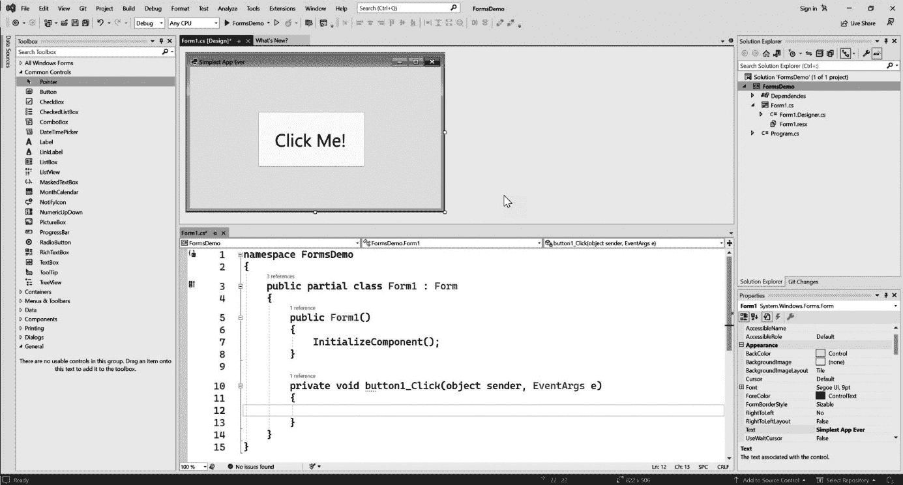

图 1.1：Visual Studio IDE 起源于 1991 年的 Visual Basic 产品。它定义了良好 IDE 应该具备的标准

那个开启我职业生涯的 VB3 IDE 引入了更多革命性的特性，我的那些自负、穿着工装裤的 Unix 同事只能梦想拥有。他们还在争论 vi 和 Emacs 谁更优越，或者反过来，这取决于你问的是谁。与此同时，VB3 拥有彩色语法高亮、支持编辑多个文件、用于绘制按钮和其他屏幕小部件的图形界面编辑器，以及将代码、事件和 GUI 元素结合在一起的视觉编程工具。它有一个调试系统，你可以通过简单地点击行号来使用。这样做会在代码中创建一个红色圆点——一个在测试运行期间执行会停止的断点，允许开发者检查正在运行的程序的状态。这是一个纯粹的程序员乌托邦！无论你喜欢还是讨厌，微软的 VB IDE 定义了今天 IDE 应该是什么样子。任何使用微软 IDE 学习编码的人，无论是传统语言还是现代语言，都不愿意接受低于那种体验的东西。

自从我开始学习每一种语言以来，我总是首先寻找提供我无法离开的特性的最佳 IDE。大约六年前，当我开始使用 Python 3 时，我发现了 PyCharm。我用它对一个复杂的**软件即服务**（SaaS）产品进行了全面的重写，这个过程花费了我大约 18 个月的时间。这是一次真正的火炼。在这本书中，我打算分享我所学到的知识，包括所有的经验教训。

在整本书中，我们将学习 PyCharm IDE 的一般界面，以及自定义和扩展，以帮助您将工具适应您将使用 Python 进行的类型的工作。第一章讨论了 IDE 的一般优点。我将提供最常用于 Python 开发的工具的比较。其中一些非常好，而其他一些，尽管被广泛使用，但相当原始。

在本章中，我们将涵盖以下主要主题：

+   PyCharm 作为 Python IDE 的目的以及其开发公司 JetBrains 的一些显著细节

+   PyCharm 在社区中的使用情况以及哪些职业倾向于最频繁地使用 PyCharm

+   一份关于使用 PyCharm 相对于其他 Python 编辑器/IDE 的优缺点全面概述

+   PyCharm 专业版和社区版之间的区别以及付费版提供的额外功能

另一方面，如果你已经决定 PyCharm 是你需要的 Python IDE，那么请随意跳转到*第二章*，*安装和配置 PyCharm*，开始安装和注册过程。如果你已经下载并在你的系统上成功设置了 PyCharm，你可能想从本书的第二部分开始，从*第三章*，*自定义解释器和虚拟环境*开始。

# 技术要求

本章是入门性的，所以我们不会编写代码，技术要求为零。这是*第一章*，我知道你们都热情洋溢，准备出发，零是无聊的。所以，让我们开始吧！

首先，这是你成功使用本书所需的东西：

+   一台电脑。我知道！这很明显，但我以我的全面性而自豪，不留任何余地！

+   操作系统。如果它已经安装在你的电脑上，这将是最有效的，因为我们不会在这本书中介绍如何安装它。Windows、macOS、Linux——就本书而言，它们都是一样的，因为 PyCharm 在这三个环境中都能运行，并且每个环境的 UI 几乎相同。

+   安装 Python。在这本书中，我们将仅使用 Python 3。Python 3 有几个不同的“风味”，但大部分情况下，从[`www.python.org`](https://www.python.org)下载的普通 Python 3 就足够了。我们将在*第三章*，*自定义解释器和虚拟环境*中讨论这些“风味”。如果修订号让你感到安心，我在写这本书时的最新版本是 3.11.1。我之前提到的那个生产 SaaS 应用中使用的 Python 版本是 3.8。如果你的 Python 3 安装版本比这更旧，你应该更新它。

+   在某个时候，拥有一个**GitHub**账户可能会很有用，因为我会使用**Git**仓库分享书中的代码。

# Python 的持续成功

在本书的第一版中，作者将这一节标题为*Python 的近期兴起*。时间已经过去，我将继续他留下的部分。我认为指出*近期*的兴起自本书第一版出版以来大致持续至今是很重要的。Python 继续成为最受欢迎和广泛采用的语言之一，有非常好的理由。其中之一是 Python 强调可读性并使用简单的语法。这使得语言的新手，以及软件开发领域的初学者，能够快速成功。与此相对比的是，之前通常的做法是强迫大学生和大学生学习 C 或 C++作为他们的第一语言。这些语言简洁而复杂，通常在开发者生产力方面有着糟糕的记录。当然，C 和 C++是强大的语言，可以产生最高性能的软件。然而，根据我的经验，一种可以在短时间内从“Hello World”到能够快速产生有用软件的语言，在所有但最极端的情况下，都胜过性能的提升。Python 的创造者**吉多·范罗苏姆**在他的论文*OMG-DARPA-MCC 关于组合软件架构的工作坊*中将 Python 的快速与其他语言进行了比较。在论文中，范罗苏姆表示，Python 的开发速度估计比 Java 快 3-5 倍，比 C/C++快 5-10 倍。考虑到这个差异，我们可以很容易地理解为什么 Python 被如此广泛地采用。毕竟，时间就是金钱。你可以在这里找到吉多·范罗苏姆的完整文章：[`www.python.org/doc/essays/omg-darpa-mcc-position/`](http://www.python.org/doc/essays/omg-darpa-mcc-position/)。

将 Python 与 Java 或 C/C++进行比较是微不足道的，因为这些语言是为不同的应用程序设计和使用的。当需要非常高的性能时，会使用 C 和 C++。大多数操作系统都是用 C++编写的，包括你在特斯拉汽车或现代航天器中找到的实时系统。比较 Python 和 C++的具体生产力并不一定公平，因为它们不是用来制作相同类型的应用程序的。

Java，另一方面，被用于开发你可能使用 Python 来开发的相同类型的应用程序：企业级和 Web 应用程序。然而，Java 需要大量的模板代码。这意味着开发者必须编写大量的代码和结构，仅仅是为了支持应用程序的存在，他们才能开始考虑为该应用程序本身编写代码。Python 中几乎没有这种模板代码。此外，Java 依赖于一个非常严格、静态的面向对象范式。相比之下，Python 要灵活得多，提供了一种动态的编程模型。尽管这两种语言都用于制作相同类型的应用程序，但 Python 由于其更灵活的范式，为你提供了一些严重的捷径。

这些构成 Python 强大优势的因素，以及许多其他因素，共同凝聚成了一种非常易于使用的开发语言，得到了一群狂热粉丝的支持。这个社区仍在通过将编程引入与我们历史上仅专注于传统应用开发截然不同的众多领域和职业中不断壮大。在撰写本文时，**TIOBE 指数**，一个用于编程语言流行度的排名系统，将 Python 排名为第一语言，如*图 1.2*所示：

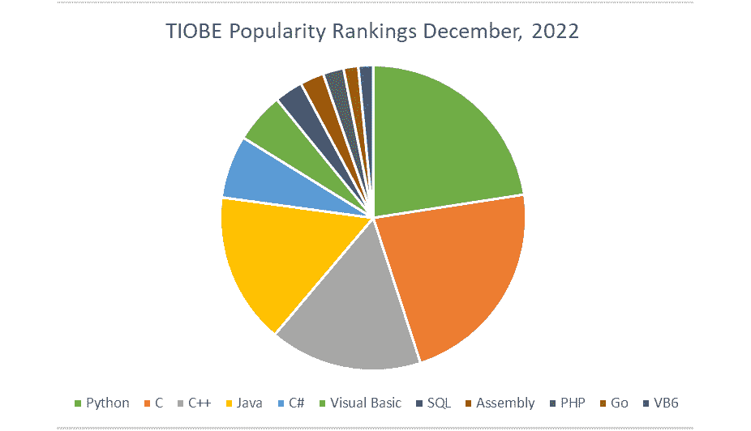

图 1.2：TIOBE 排名显示 Python 是最受欢迎的语言

Python 拥有一个庞大的标准库，提供了你构建任何类型软件可能需要的任何东西。如果这个声明对你特定的项目不成立，那么有一个庞大的第三方和主要开源的生态系统，由数十万个库组成，你可以在此基础上构建。你可以在[`pypi.org`](https://pypi.org)找到这些库的目录。将所有这些因素综合考虑，一个新软件开发者可以从零 Python 经验到生产应用程序非常快。这个过程可以通过一个好的 IDE 大大加速。

# IDEs 的哲学

在我年轻时，情况是不同的。当然，除非我们同龄，那样的话一切都会相同。我们没有互联网。当我们想要学习新的编程语言和技术，或者理解我们手艺的历史时，我们必须进行一次神圣的朝圣之旅。有一年，我偷带了一台宝丽来相机。你可以在*图 1.3*中看到我拍的照片。你应该明白，我即将告诉你的所有内容都是真实的，同时也是被严格保守的行业秘密。为了明确起见，你没有从我这里听到这些。

在某个神秘的山脉深处，寻求伟大编程智慧的寻道者会在满月的光辉下攀登万级台阶，以寻找大师。这段旅程并不容易，所获得的智慧也必须是通过辛勤努力获得的。正是在这样的远征中，我学会了为什么好的 IDE 如此重要。大师说：“如果你懂得语言，又懂得 IDE，你就不必担心一百次部署的结果。”


图 1.3：在神圣的山脉之巅，沿着万级台阶，坐落着我学习编程的寺庙

大师经常用谜语说话，所以让我来解释一下。*部署*指的是软件的发布迭代或**增量**。在大多数专业情况下，目标是发布软件。如果我们的目标是发布，下一个难点是我们必须知道一种编程语言。我假设你对 Python 编程至少有一个默许的理解。那么，只剩下大师对 IDE 的引用了。

开发者可能会使用几种工具来开发 Python 代码。Python 语言可以被认为是一种解释型语言。我们可以争论，当它运行时，一些代码被优化成 C 代码并缓存，但在这个阶段，我们并不关心这个层面的细节。重点是 Python 程序以简单的纯文本文件的形式存在，并且可以以这种形式执行。这与静态编译语言如 C、C++、C#、Java 或 Go 形成对比。这些以及许多其他语言要求文本文件中的代码经过编译阶段，生成新的可执行文件。在 C#中，你不能简单地执行一个`.cs`文件。你需要将其编译成二进制文件，然后执行该二进制文件。由于 Python 通过 Python 解释器直接执行其代码，因此用于 Python 的工具级别可以非常简单。基本上，任何文本编辑器都可以。可以选择三种编辑器功能级别。

第一种是简单的文本编辑器。简单的文本编辑器通常限于打开、编辑和保存文本。它们是通用工具，旨在与任何类型的文本文件一起工作，从购物清单到`systemd`配置文件。在 Windows 上，你可能知道它叫做*记事本*。在 Mac 上，你可能使用*TextPad*，如果你在使用像`systemd`配置这样的 Linux 桌面，别担心；它是一个 Linux 的系统管理文件。我只是需要一个听起来很复杂的东西来描述文本文件范围更复杂的一端。

编程编辑器的第二次进化被称为*增强型编辑器*。这些编辑器专门设计用于处理技术文件。以下是一些流行的例子：

+   Visual Studio Code

+   Atom

+   Notepad++

+   UltraEdit

+   Sublime Text

+   JetBrains Fleet

+   Bluefish 编辑器

+   IDLE（随 Python 一起提供的编辑器）

这些工具旨在与各种编程语言一起工作，并且通常可以轻松定制以添加对新兴语言的支持。增强型编辑器提供了一些使开发者的生活更加舒适的常见功能，例如以下这些：

+   语法高亮，它将代码中的关键字和其他语义元素着色。

+   宏，允许开发者记录和回放常见的快捷键

+   项目和文件组织，以便于在构成项目的多个文件之间轻松切换

+   基本的代码补全，以减少编写代码时所需的输入量

+   插件支持其他小工具，如代码检查器、拼写检查器、代码预览等更多功能

随着时间的推移，一些增强型编辑器已经变得非常健壮，因为你可以自定义和扩展它们的功能。当你考虑这些工具作为它们直接从盒子里出来时，它们比通用文本编辑器更有用和专业化，但它们不足以成为 IDE。

在代码编辑器的食物链顶端是**IDE**。如果你要从一战时期的战斗机驾驶舱内部看，你会看到一些简单的控制装置，再无其他。如果那是一个文本编辑器，IDE 就像是波音 747 飞机的驾驶舱。每个开发者可能需要的或渴望的工具都被塞进了一个相对复杂的用户界面中。IDE 包含了增强文本编辑器的所有功能，但通常还提供以下附加增强：

+   一些直接从编辑器运行代码的简单方法。

+   帮助管理你的源代码仓库的工具，例如**Git**或**Subversion**。

+   一个集成、易于使用的调试器，它允许你暂停正在运行的程序并检查或修改其当前状态。

+   帮助你编写自动化测试，如单元测试，并运行和可视化结果的工具。

+   复杂的代码补全基于项目代码的反射或索引。在现代 IDE 中，这通过使用**人工** **智能**（**AI**）得到增强。

+   帮助你找到执行瓶颈的剖析工具。

+   集成工具，帮助管理辅助系统，如数据库。

+   从 IDE 中直接部署你的代码到服务器或云环境的工具。

一些 IDE 的流行例子包括以下：

+   Visual Studio（这与 Visual Studio Code 不同）

+   PyCharm

+   IntelliJ IDEA

+   NetBeans

+   Apple Xcode

+   Xamarin Studio

+   Eclipse

如你所见，IDE 是你编码武器库中最强大的武器。使用最好的 IDE 对你来说非常重要。如果你是软件开发的新手，或者甚至不是那么新手，你可能想知道为什么增强型编辑器如此受欢迎。在撰写本文时，大约 50%的开发者使用 Visual Studio Code，但这不在我的 IDE 列表中。

许多开发者更喜欢一个更“轻量级”的开发环境。这对于前端 Web 开发者来说尤其如此，他们发誓使用 Sublime Text 和 Visual Studio Code。事实上，他们需要 IDE 的所有功能，他们也确实在使用它们，但这些功能分散在他们每天使用的不同工具中。前端开发者依赖于在浏览器中运行的剖析器和调试器，他们不需要在 IDE 中这些工具。相反，他们可以获取一个更简单的编辑器，这个编辑器下载快速，安装简单，点击操作系统中的图标即可立即运行。

我认为，如果你在进行全栈 Web 开发或移动开发，或者需要处理服务器或容器，IDE 是一个更好的选择。

存在着一种特定的软件开发者，他们发誓你永远不应该使用除了最简单可能的工具以外的任何东西。他们认为，依赖工具来完成编码和相关的艰苦工作会减少被认为是熟练所需的总体掌握和成就。我完全不同意。有一年，在修道院的时候，大师给我讲了一个关于日本一位伟大的剑客宫本武藏的故事。在他那个时代，每个武士都知道宫本武藏是当时最伟大的剑客，所有的武士都想要尝试击败他。当时，决斗通常是生死之战。有一天，一个决斗挑战者在宫本武藏下船时遇到了他。宫本武藏没有带武器。挑战者等到宫本武藏从船的桅杆上制作出一把木剑，即*bokken*，他打算用它来进行决斗。据传说，宫本武藏让那个挑战者出丑，并且让他活着离开，这对挑战者来说是一种耻辱。大师说，宫本武藏是有史以来最优秀的战士，他的剑术至今无人能敌。然而，如果目标仅仅是击败他，我可以用机关枪轻易做到。

在我看来，因为对自己能力的自豪或缺乏自信而限制使用的工具是愚蠢的。软件开发者的目标是交付软件，通常是在一个不容宽恕的截止日期之前。这并不是为了试图证明自己符合别人的标准，除非，当然，你是寻求学位的学生。我相信这本书的读者中有一小部分人。玩好这个游戏，按照你的教授们说的去做。你应该意识到，一旦你毕业，一切都会改变。你将需要快速、准确、一致地编写代码。这最好通过一个好的集成开发环境（IDE）中可用的自动化来实现。你应该为手头的任务选择最好的工具。我发现 PyCharm 帮助我在学习 Python 语言时变得高效。当你开始时，如果你没有使用一个可以纠正你的行间距和缩进的编辑器，你将会犯很多愚蠢的错误。这很令人沮丧。我会想，“如果我现在用 C#，我现在就完成了。”我甚至想放弃 Python 和 PyCharm，去选择更舒适的东西。然而，那并不是我想做的。

PyCharm 会为你自动标记所有那些愚蠢的错误，并一键纠正！在我看到这些错误被反复标记后，我学会了在使用没有代码检查功能的编辑器时应该怎么做。如今，当我用其他语言工作时，我仍然使用 Python 规则。在 PyCharm 的帮助下学习 Python，我能够更快地交付、更快地学习，并在其他语言和工具中改进我的代码。请帮个忙，永远不要让任何人告诉你你不是**真正的开发者**，因为你没有按照他们的方式做事。如果他们坚持，告诉他们 nano 比 vi 或 Emacs 更好，然后离开。这样的声明可能会让他们的大脑炸裂。

我还想对 Visual Studio Code 说一点。这个编辑器通过插件的发展已经到了可以与功能齐全的 IDE 竞争的地步。然而，与 PyCharm 这样的专业开发 IDE 相比，这需要付出代价。要在 Visual Studio Code 中获得 PyCharm 中找到的相同功能，你需要安装大量的插件。这些插件都是由社区编写的，这意味着它们都是独立开发的工作。这些插件永远不会像 PyCharm 这样的 IDE 中的基础功能那样协同工作。当比较 Visual Studio 与 Visual Studio Code 时，这一点同样适用。尝试在 Visual Studio 和 Visual Studio Code 中创建 C# 项目，你会发现 Visual Studio 的过程梦幻般顺畅。另一方面，Visual Studio Code 需要进行大量的命令行操作和奇怪的插件安装。体验完全不同。对于其他编辑器，如可以高度定制的 vim，也有同样的观察。你可能会花一周的时间摆弄插件和开源脚本，以实现与 IDE 开箱即用功能的部分相似性。

# PyCharm 作为 Python IDE

虽然谈论与其他语言通用的工具比较很好，但我们并不关心那个，对吧？我们想知道 Python 的选项！最好的 IDE 通常都是专业的。PyCharm 专注于与 Python 一起工作。仅此而已。当你使用 PyCharm 创建新项目时，你会看到 Python 项目的选项，没有其他选项。将这种体验与 Visual Studio 进行对比。在我看来，Visual Studio 是 Python 项目中 PyCharm 的唯一接近的竞争对手。在 Visual Studio 中创建项目时，你很可能会花上好几分钟试图浏览众多选项。该 IDE 支持数十种语言，并且由于有网页、桌面和其他十几种项目类型，这种支持被放大了。Visual Studio 正在试图成为所有开发者的万能工具。PyCharm 只想与 Python 开发者玩耍。

PyCharm 本身是在几个设计目标下创建的：

+   智能编码辅助

+   流程化编程工具

+   网页开发选项

+   科学计算支持

+   可视调试和性能分析

我们将依次查看这些设计目标，但首先，我需要指出一点。在我撰写这篇文章的时候，PyCharm 即将经历一次重大变革。JetBrains 正在开发全新的用户体验。到这本书出版时，有很大可能性这个新用户界面将成为默认界面。如果你是 PyCharm 的新用户，你应该知道你将暂时以两种不同的方式看到它。经典用户界面将在产品中继续存在一段时间，让我们能够逐渐适应新体验。鉴于第一版和这一版之间相隔几年，我决定我将接受新用户界面。话虽如此，值得一提的是，你将看到经典用户界面与新用户界面并排存在，直到可能到 2024 年晚些时候，当旧用户界面不再维护时。它将变得过时，并有一天会像雪莱传说中的奥西曼迪亚斯雕像一样消失在时间的沙尘中：

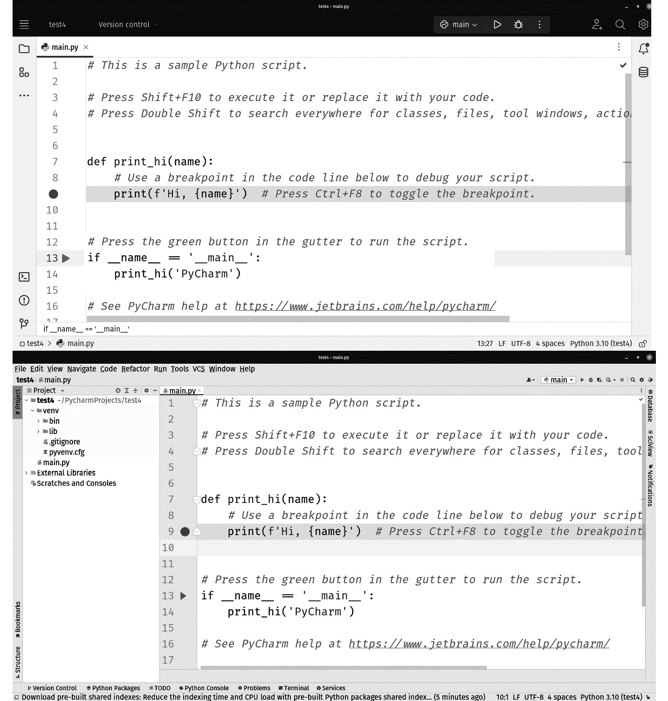

图 1.4：新用户界面（顶部）与经典用户界面（底部）的比较

*图 1**.4* 展示了两个用户界面并排。新用户界面的设计目标是减少界面上的杂乱。在这方面他们并没有错。随着工具这些年的发展，越来越多的功能被塞进了菜单，使得界面对于新用户来说有点令人畏惧。最重要的是要意识到，你会在菜单中找到的大部分内容仍然存在，但菜单系统本身隐藏在屏幕左上角的汉堡图标下面。别担心，我会在稍后详细说明这一点。在我撰写这篇文章的时候，有一个设置我们将在 *第二章*，*安装和配置 PyCharm* 中进行回顾，它允许你在经典用户界面和新用户界面之间切换。

我想现在就指出这一点，因为你们即将看到一些截图，如果你已经看到了旧用户界面，你可能会认为你拿错了书。你没有。恰恰相反。如果我能准确把握时间，你将是唯一拥有正确书籍的人。

## 智能编码辅助

我要告诉你我妻子经常说的一句话。我非常懒惰。等等。我说错了。她是在说我懒惰。我并不是说她是在说她自己懒惰。哎呀。写作太难了！我差点在那里挖了个坑，不是吗？

她并没有说错。作为一个开发者，我本质上非常懒惰。我拒绝花几个小时甚至几分钟去做一些事情。希腊有一个关于名叫西西弗斯的男人的传说，他被诅咒推一块石头上陡峭的山坡。一旦他到达山顶，石头就会滚回山脚下。西西弗斯被困在一个没有 *Cmd*/*Ctrl* + *C* 选项的无限循环中。

这里有一件事我知道：西西弗斯不是软件开发者！任何软件开发者都会把那块石头推上两次，然后他们会花费永恒的时间设计一套由物联网设备控制的滑轮和起重机系统。当然，微控制器会运行 Python 脚本。我跑题了。

我称之为*懒惰*的某些人（我在心里对着我那毫无戒心的妻子说），我称之为*高效*！作为一个开发者，我想在每一件事上都用最少的努力创造最大的效果。写代码是复杂的。你正在为最固执、最不智能的对象编写指令。编码比试图教一个两岁的孩子系鞋带还要糟糕。相信我，我两者都尝试过！编码者必须在对任何他们想要执行的操作的解释中非常具体和详尽。此外，事情变得更糟，因为一些开发者倾向于强迫用户编写大量的样板代码。我指的是与你想写的代码或你想解决的问题无关的冗余代码。Python 通常避免这种情况，所以让我给你举一个可能是最糟糕的例子：Java。

在我小时候，Java 可是风靡一时。有一群与 Java 相关的企业程序员，他们想出了叫做**企业 JavaBeans**（**EJBs**）的东西。EJBs 本应成为模块化编程和可重用对象的典范。实现起来相当费劲。你不仅要创建一个简单的类，这是你唯一需要的，还要创建一个特殊的文件结构，包括各种文件夹和清单文件，以暴露 bean 中的内容，然后所有内容都要编译成一种特殊格式。结果发现，这种特殊格式不过是一个 ZIP 文件。仅仅为了创建一个 EJB 就需要做很多工作，这意味着开发者必须创建大量的文件和编写大量的代码，才能开始实现他们需要表达的功能。这就是我们所说的*样板代码*。样板代码通常是无用的，但又是必要的，因为没有它，代码就无法工作。

所有 IDE 都是因为这个现象而演变的。PyCharm 是从 JetBrains 的 Java IDE IntelliJ 演变而来的。Python 通常不需要很多样板代码来使代码工作，但确实会出现。样板代码有两种。使老式的 EJBs 工作的样板代码是坏的那一种。作为启动项目的一种手段而生成的样板代码是好的那一种。正如我们将看到的，PyCharm，就像大多数 IDE 一样，会生成一个文件夹结构，一组文件和一些基本代码，以帮助你开始。这可以被认为是样板代码。但在这个例子中，这些代码并没有保留。它们被你的项目的真实代码所取代。IDE 生成的代码只是给你一个心理提示，让你开始。它防止你必须手动创建项目的起点。

所有这些都很棒，但样板代码生成并不是我们通常在听到“智能编码辅助”时想到的。我们通常想到的是微软开创的名为**IntelliSense**的功能。如果你允许我暂时将 IDE 拟人化，这个功能会观察你输入代码的过程。在此期间，IDE 会思考你试图做什么。当它看到可以帮助你的方式，比如自动为你完成一个单词或一行，它会将这个选项呈现出来。我有一个智能的人帮我完成所有句子：她就是我的妻子。当她帮我完成句子时，它们通常比我自己完成时更有组织和智慧。（这可能是她认为我懒惰的另一个原因。）

我想指出，并非所有具有类似 IntelliSense 功能的工具都是同等创建的。当你在一个增强编辑器中看到这个功能时，它通常与在 IDE 中的工作方式不同。在增强编辑器中，它们使用关键字列表来突出显示和自动完成语言的元素。真正优秀的增强编辑器可能会索引你的代码，识别变量和函数名称，并使用统计信息来首先提供最可能的完成选项。这个选项通常后面跟着一个长长的列表，包含给定完成选项的每一个可能性。随着 AI 工具的引入，代码完成变得越来越高级，这至少在这个问题上使得 IDE 和增强编辑器之间的区别变得有些模糊。像 GitHub 的 Copilot 这样的工具不仅可以自动完成变量名和关键字，还可以自动编写你代码的整个部分。

至少在我写这篇文章的时候，重要的是要记住，这些 AI 功能不是 IDE 或增强编辑器的一部分。它们作为插件实现。既然这是真的，我会继续宣扬 IDE 的优点，尤其是 PyCharm 的优点，仅基于软件本身的优点。我们将在*第十六章*中讨论插件，*PyCharm 插件带来的更多可能性*。

虽然增强编辑器可能会为你提供代码完成的可能性的长列表，但 PyCharm 可以分析你的代码并执行更智能的自动完成。你还可以获得代码分析，例如重复代码警告。软件开发中的一个常见反模式是在项目之间或甚至在同一项目内部复制和粘贴代码。看到这种糟糕但常见的事情是令人沮丧的。PyCharm 会检测到重复的代码并为你标记，这样你就可以被提醒将重复的代码重构为一个函数或模块，该函数或模块可以在一个位置重用和维护。

PyCharm 还可以对你的代码执行静态分析。这种分析是在寻找代码本身中的反模式；例如，PyCharm 将检测如*图 1**.5*中所示的死代码。关于 Python 开发，PyCharm 将自动格式化你的缩进，并对你代码是否符合**PEP-8**约定提供关键反馈，这些是必须满足的样式要求，以被认为是*pythonic*（这是一件好事）。

例如，如果你要在 PyCharm 的新文件中输入以下代码，你会看到 PyCharm 的警告，指出你在第 13 行创建了不可达的代码。该行的文本被突出显示。将鼠标悬停在突出显示的行上会显示错误信息：

```py
def print_hi(name):
  print(f'Hi, {name}')
  for x in range(25):
    print(str(x))
    if x == 12:
      return
      print("You'll never make it here")
if __name__ == '__main__':
  print_hi('PyCharm')
```

`print_hi`函数最初是无害的，它将`name`参数中传递给函数的任何内容打印到控制台。之后，我们创建一个循环，它将运行 25 次。在每次循环运行中，我们打印出包含当前迭代的`x`。当计数器变量`x`达到 12 时，通过`return`函数退出循环，幸运的是，这个函数就在第 12 行。我向你保证，这纯粹是巧合。由于循环在第 12 行返回，第 13 行的代码将永远不会被执行：

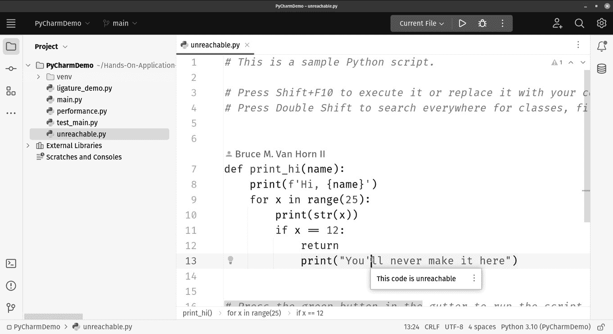

图 1.5：PyCharm 将突出显示许多常见的编码错误，例如这个错误。第 13 行的代码不可达，当你将鼠标悬停在突出显示的代码上时，会有所指示

PyCharm 还允许你通过帮助你找到函数、变量和类的定义位置以及它们的使用位置，在复杂的项目中导航文件。随着时间的推移，你会学会一套快捷键，让你可以在项目中任意移动，而无需离开键盘。

从本质上讲，PyCharm 的智能编码辅助让你可以少担心错误，更多地关注你的逻辑和需求，这让你可以更快地完成代码，错误更少。

## 流程简化的编程工具

编写代码是开发者每天为了追求项目截止日期而执行的一项活动。伟大的开发者也会花时间调试、测试和性能分析他们的产品，以产生最佳结果。我们还需要处理将代码推送到测试服务器、重构（别人的）糟糕代码、与数据库合作以及处理容器。PyCharm 为这些过程以及更多提供了工具。当我使用 PyCharm 编写复杂的 Web 应用程序时，我通常只打开 PyCharm 和一个网络浏览器：每个工具都在自己的显示器上。

### PyCharm 调试器

我最喜欢的功能，也是我第一次使用 PyCharm 时感到兴奋的功能是调试器。PyCharm 的调试器很棒。它比 Python 本身提供的标准调试器要好得多。Python 附带一个名为**Python Debugger**（**pdb**）的调试器。据我拙见，我宁愿从人行道上吃虫子也不愿使用这个工具。我在本章前面提到了这一点。我从小使用 Microsoft 调试器，其他任何东西都无法替代。PyCharm 的调试器工作方式完全符合我的预期。在您想要程序停止执行的那一行点击鼠标以设置断点，然后在 IDE 中点击调试按钮，程序就会运行并在指定的行停止。您将得到一个屏幕，您可以检查堆栈的状态以及终端输出。它非常简单易用，我将在*第六章*，“无缝测试、调试和性能分析”中向您展示如何使用它。

### 使用图形测试运行器运行测试

测试工具以测试运行器的形式集成。PyCharm 支持所有主要的测试框架，包括**pytest**、**nose**以及标准库中的常规单元测试功能。再次强调，我来自一些非常优秀的 IDE 的使用经验，在这种情况下，我正在回忆 Eclipse 和 Visual Studio，它们都包括图形测试运行器。谚语“如果条形是绿色的，代码就是干净的”在 PyCharm 中得到了视觉上的实现。您可以在*图 1**.6*中看到一个示例。您可以运行您的测试，并看到一个显示通过和失败的列表，尽管它是一个列表而不是条形图。然后您可以重新运行失败的测试，直到它们通过。

我会给你一个简单的例子。在本章源代码的`main.py`中，我有一个名为`main.py`的文件，还有一个名为`test_main.py`的文件。`main.py`的内容是一个简单的函数，用于将两个数字相加：

```py
def add_two_numbers(a: int, b: int) -> int:
  return a + b
```

在`test_main.py`文件中，有一个简单的单元测试：

```py
from unittest import TestCase
from main import add_two_numbers
class Test(TestCase):
  def test_add_two_numbers(self):
    self.assertTrue(add_two_numbers(a=5, b=6) == 11, \
      "Should be 11")
  def test_show_a_fail(self):
    self.fail()
```

`Test`类包含两个测试：一个会通过，另一个会自动失败。我通常先创建一个自动失败的测试，以确保我的测试类设置正确。然后，稍后，由于我的多巴胺成瘾，我会移除失败，因为只有测试运行器中的绿色勾选才能满足我，如图*图 1**.6*所示。如果我在`test_main.py`上右键点击，如图*图 1**.5*所示，我会得到一个选项来运行文件中的测试：

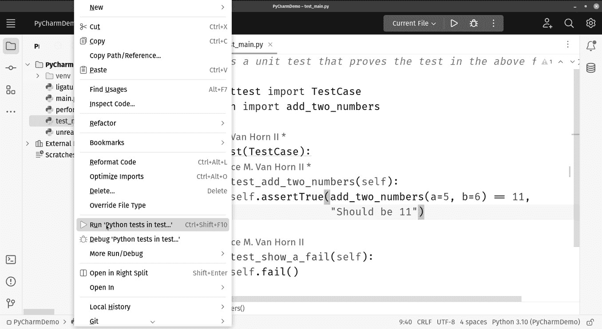

图 1.6：右键点击 test_main.py 文件，然后点击“在 test…中运行 Python 测试”来运行文件中的单元测试

看一下左下角的**图 1.7**，它显示了测试运行的完成情况，你会看到一个通过或失败的测试列表，用绿色勾号或黄色 X 表示失败。像这本书中的所有图一样，它们都是用黑白打印的，所以你看不到颜色。彩色墨水很贵，你父亲是对的，钱不是从树上长出来的：

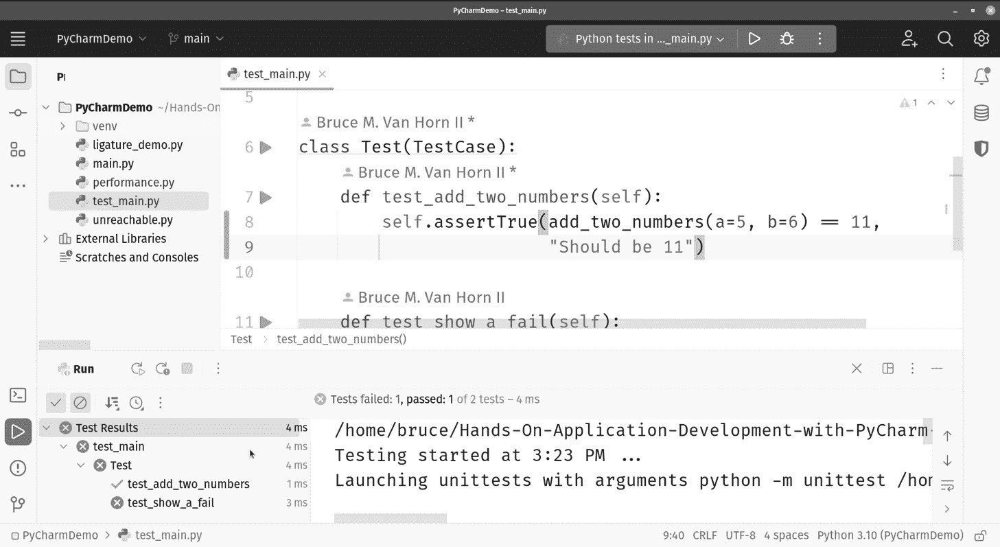

图 1.7：PyCharm 内置的测试运行器显示传统的通过/失败列表（左下窗格）以指示通过和失败的测试

### PyCharm 的剖析工具

类似地，代码剖析是内置的，并且易于使用。你可以点击**剖析**按钮来运行代码。当程序退出时，你将得到每个函数调用的图表，以及调用消耗的时间和资源。这使得很容易发现有关执行速度和资源消耗的未实现改进机会。

考虑这样一种可能性，即你的程序中可能有一个算法，它的表现可能并不如你所期望。我知道，我知道，这种情况绝不会发生在你身上，所以假设你刚刚被雇佣，而被解雇的人编写了这个表现糟糕的算法。也许假装现在是 1956 年，你新雇主纽约人寿保险公司解雇的那个人是**爱德华·哈里·弗莱德**。弗莱德写了一篇题为《电子计算机系统中的排序》的论文，这可能是我们今天所知的**冒泡排序**算法首次公开发表的实例。如果弗莱德用 Python 3 编写他的算法，它可能看起来有点像这样：

```py
def bubble_sort(input_array):
  length_of_array = len(input_array)
```

弗莱德刚刚创建了一个接受列表作为参数的函数，在我们的例子中，这将是一个整数数组。目标是排序这些数字。为了做到这一点，让我们创建两个循环，一个嵌套在另一个里面：

```py
  for i in range(length_of_array):
    for j in range(0, length_of_array - i - 1):
      if input_array[j] > input_array[j + 1]:
        input_array[j], input_array[j + 1] = \
        input_array[j + 1], input_array[j]
```

在这些循环中，每个数字都会与它前面的数字进行比较。如果确定这两个数字顺序颠倒，它们就会被交换。在循环的下一轮运行中，这种情况会再次发生在下一个两个数字上，并且这个过程会一直持续到列表的末尾。

如果你研究过算法，你可能听说过冒泡排序，并且已经被警告过为什么它不被使用。它非常慢。我们在一个`for`循环内部又嵌套了一个`for`循环，如果未排序的列表大小很小，这是可以的。但是随着数字列表的增长，这个算法以对数速度减慢。算法性能是用**大 O 符号**来衡量的。我不想把这个变成一本算法书，所以我只会告诉你，在一个循环内部嵌套另一个循环在性能方面会表现不佳。在大 O 符号中，我们将这个算法归类为*O*(*n*2)。这很糟糕。

用简单的话说，这意味着如果你将需要排序的数字数量（*n*）加倍，那么你的算法处理时间将延长 22 或 4 倍。如果你将计数的大小乘以 5，那么它将变慢 52 或 25 倍。列表越大，排序越慢。

为了展示性能工具，我们将给这个测试运行一个包含 100,000 个数字的列表进行排序。现在是一个指出我正在运行英特尔 i9 处理器的好时机。如果你是一个学生或预算受限的消费者，使用的是 i3 处理器（或更差），如果你想要尝试这个，你可能需要将数字列表的大小减少几个零。在我的 i9 上，这需要相当长的时间：

```py
test_array = []
for x in range(100000):
  test_array.append(random.randint(1, 10000))
```

让我们通过调用函数并打印结果来完成测试代码：

```py
bubble_sort(test_array)
print("The result of the sort is:")
for i in range(len(test_array)):
  print(test_array[i])
```

我们将在*第六章*中详细介绍性能分析工具，*无缝测试、调试和性能分析*，但现在，让我们只是运行这段代码并查看结果。要在 `performance.py` 文件上运行性能分析器，只需右键单击文件，然后点击**更多运行/调试**，然后**分析‘性能’**，如图 *图 1.8* 所示：

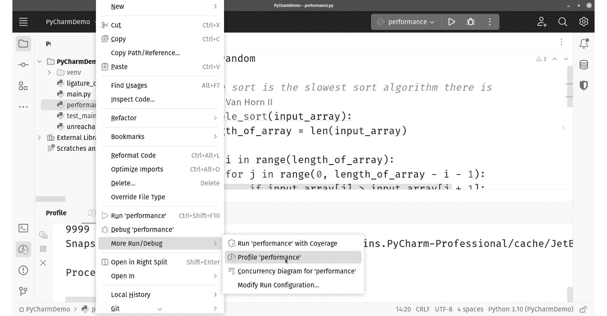

图 1.8：右键单击你想要分析性能的文件，然后点击更多运行/调试 | 分析‘性能’以查看性能分析

记住，如果你使用和我一样的代码，这将需要很长时间才能运行，尤其是在较慢的计算机上。如果你运行时间过长，请随意调整列表的大小。结果是一个 `.pstat` 文件，在 PyCharm 中显示为表格。我们将在*第六章*中更详细地介绍这一点，*无缝测试、调试和性能分析*。你可以在 *图 1.9* 中查看性能报告：

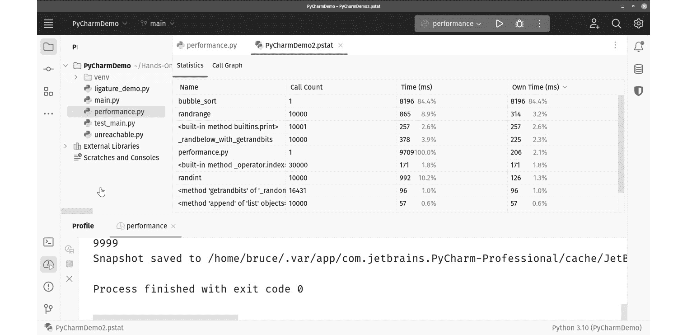

图 1.9：PyCharm 的资源分析器显示了运行程序中的性能瓶颈

如你所见，程序 84.4% 的时间都花在了 `bubble_sort` 函数中，这是瓶颈。PyCharm 已经告诉你应该在哪里集中重构努力来提高你程序的性能。

### 从 IDE 发布

当你需要将代码发布到测试服务器，而你又没有使用持续集成系统时，你可以使用 PyCharm。为了明确起见，你应该使用持续集成系统，但我在项目初期，在持续集成系统运行之前，经常使用 PyCharm 的功能来将代码上传给利益相关者进行测试。你可以使用**文件传输协议**（**FTP**）或**安全文件传输协议**（**SFTP**）进行部署，或者直接复制到网络共享，以便快速轻松地与任何可能想要审查的人分享你的进度。

### 重构工具

PyCharm 拥有您从合适的 IDE 中期望的强大重构工具。如果您想更改变量名，或者甚至更改函数上的方法签名，右键单击并选择**重构**工具。请放心，您所做的更改将应用到项目中所有相关的实例，而不仅仅是您正在编辑的文件中。*图 1*.*10*展示了这一功能的示例：

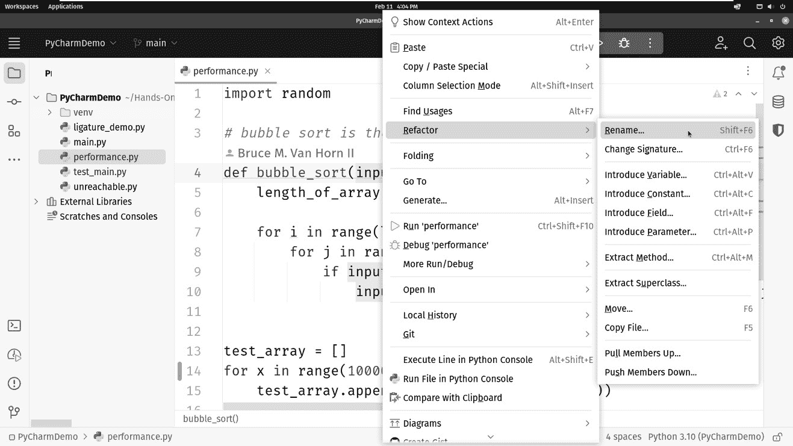

图 1.10：PyCharm 提供了完整的重构工具选择

除了重命名变量或函数之外，您还可以执行其他操作，例如更改方法签名和更改面向对象类的结构。

### 在 PyCharm 中与数据库协同工作

如果您与数据库工作，PyCharm 的专业版包括图形化表格编辑器和对数十种流行数据库的 SQL 支持。请参阅*图 1*.*11*。我将在本章稍后更详细地介绍 PyCharm 的专业版；我们将在*第十一章*“使用 PyCharm 理解数据库管理”中有一个专门章节介绍数据库功能：

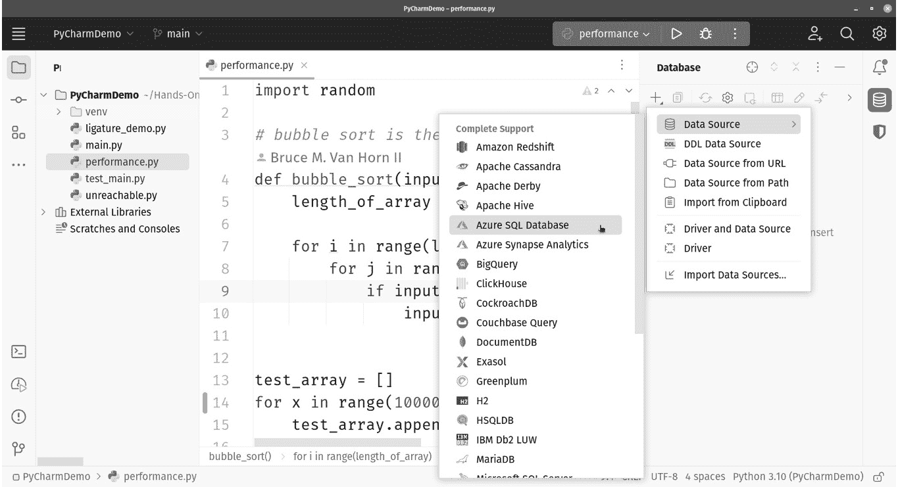

图 1.11：PyCharm 提供了一套强大且完整的工具，用于处理关系型数据库，如 Oracle、SQL Server、Postgres 以及更多

如您所见，许多关系型和非关系型数据库都直接得到支持。

### 远程开发、容器和虚拟机

最后，但并非详尽无遗，PyCharm 还提供了通过 **SSH** 与远程系统协同工作的功能，使用 HashiCorp 的 **Vagrant** 进行本地虚拟机，以及对 **Docker** 容器的广泛支持。

这并不是 PyCharm 可以为你做的所有事情的详尽列表，但到现在，你应该明白了。你可能需要的每一个工具都集成到了开发环境中。这可能是他们称之为*集成*开发环境的原因。

## 网络开发选项

我敢打赌，超过一半在 Python 中工作的开发者，在某个时刻都需要一个网络项目。无论你是像我一样，正在制作一个作为完全实现网络应用的 SaaS 产品，还是你在进行火箭科学，需要一种方式来可视化和交互式地分享你最新的关于深空无线电发射数据的快速傅里叶变换，网络项目通常是不可避免的。我不是科学家，我编造了那句话。如果最后一句对任何人有意义，那纯粹是巧合。

与 Web 项目一起工作提供了一层新的、独立的复杂性。大多数使用三层设计，通常用 **模型-视图-控制器**（**MVC**）模式表示。如果你不确定这是什么意思，请继续关注，因为本书有一个专门介绍 Web 开发的部分。现在，这意味着应用程序有一个用户可以与之交互的前端，一个包含连接逻辑的中层，以及一个用于结构化数据存储和检索的数据库层。只有中层是用 Python 实现的。我们将在后面的章节中广泛介绍 Web 开发，但现在，我想告诉你 PyCharm 提供的工具水平。

制作 PyCharm 的公司 JetBrains 制作了一系列针对不同语言的 IDE。他们中的一个 IDE 专门针对 Web 开发。它被称为 **WebStorm**。我之前说过，好的 IDE 针对一种语言。WebStorm 针对的是 JavaScript；具体来说，我们谈论的是全栈 JavaScript。现代 JavaScript 执行发生在两个地方。传统上，JavaScript 总是在浏览器中执行。大约 10 年前，**Node.js** 发布了，JavaScript 脱离了浏览器窗口的束缚，并允许在后台运行。

之前，我提到了 PyCharm 中用于数据库工作的强大功能集。JetBrains 还有一个针对 SQL 数据库开发者的 IDE，名为 **DataGrip**。事实上，PyCharm 的专业版包含了 WebStorm 和 DataGrip 中可用的全部功能集。当你购买专业版时，你将获得一个包含三个 JetBrains 产品的套餐：PyCharm、WebStorm 和 DataGrip。当你使用 PyCharm 处理 Web 项目时，你需要所有这三个功能集，它们在专业版中为你准备好了。

## 科学计算支持

数据科学领域的发展在 Python 自身的发展中发挥了重要作用，Python 现在是科学项目中使用的最常见编程工具（甚至比 **R** 更常见）。PyCharm 中包含的显著功能，有助于数据科学工作，包括 **IPython**、**Jupyter** 笔记本和交互式控制台。PyCharm 中对科学计算的支持在本书的第四章中详细说明，从 *第十三章*，*开启科学模式* 开始。PyCharm 还提供了一个名为 **SciView** 的定制视图，它以最佳方式组织科学项目中的工作空间，如图 *1**.12* 所示：

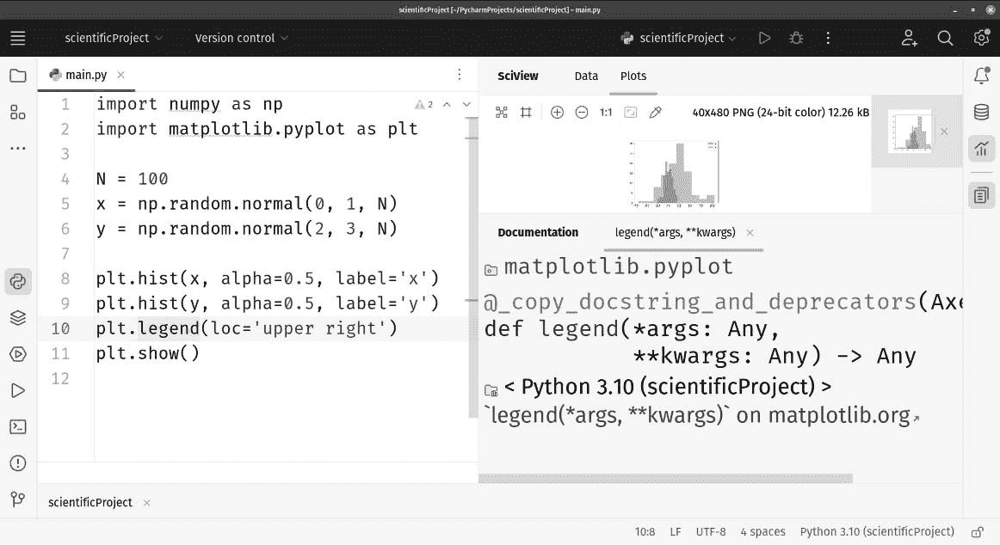

图 1.12：SciView 在 PyCharm 中通过简洁的界面提供对科学可视化工具的访问

## 理解专业版、社区版和教育版

PyCharm 有三个版本。我已经提到了两个，因为第三个是一个特殊版本，仅适用于教师，而本书的重点是应用开发，而不是软件开发教学。我会告诉你每个版本的情况，但我知道你想要的是一个功能比较图表。你可以在*图 1.13*中找到它：

|  | **PyCharm 专业版** | **PyCharm 社区版** |
| --- | --- | --- |
| 价格 | 付费 | 免费 |
| 智能 Python 编辑器 |  |  |
| 图形调试器和测试运行器 |  |  |
| 代码导航和重构工具 |  |  |
| 代码检查 |  |  |
| Git、Subversion 和其他源代码控制工具 |  |  |
| 科学工具 |  |  |
| 使用 HTML、JavaScript、CSS 等进行 Web 开发 |  |  |
| Python Web 框架支持 |  |  |
| 性能分析 |  |  |
| 远程开发、容器等 |  |  |
| 数据库和 SQL 支持 |  |  |

图 1.13：一个功能比较图表，显示了免费社区版与付费专业版所包含的功能

**社区版**是免费的，但与专业版相比，只提供有限的功能集。它非常适合仅涉及 Python 工作的项目。我正在开发的产品有一套 Python 脚本，用于批量处理大量数据。所有操作都在 Python 中进行，这正是社区版的完美用例。如果你只需要一个出色的 Python IDE，请使用免费版本。如果你只是在编写自动化脚本，例如 3D 计算机图形的图形管线或一般 IT 任务自动化，社区版也非常合适。

**专业版**拥有免费版的所有功能，并增加了网页开发、数据库、远程开发、容器化和科学项目类型。这是针对那些制作可发布软件项目的专业人士。虽然它不是免费的，但 JetBrains 通过提供多种定价选项，使其保持可负担性，具体取决于您如何使用该工具。独立开发者可能以比企业开发者更低的价位获得许可证。还有方法可以免费获得专业版，例如证明您正在使用 PyCharm 进行**完全开源软件**（**FOSS**）项目。初创公司可能有资格获得 50%的折扣，如果您在代码训练营或大学环境中教学，您也可能有资格获得免费的专业许可证。由于这些信息可能会随时间变化，您应检查 JetBrains 网站上的完整详情，网址为[`www.jetbrains.com/pycharm/`](https://www.jetbrains.com/pycharm/)。

我之前提到 PyCharm 有三个版本，我们只介绍了两个。**教育版**旨在为教师和大学教授开发用于教授 Python 的课程。这个版本可以直接在 IDE 中创建和回放交互式课程。它只对教师、讲师和内容创作者有价值。

在这本书中，我将专注于社区版和专业版中存在的功能。

# 摘要

在本章中，我们介绍了 Python 语言本身，以及 Python IDEs 的一般背景和 PyCharm 的具体情况。

我们还讨论了 PyCharm 对 Python 程序员的可用性。具体来说，为了能够充分利用 PyCharm 提供的所有功能和功能，而不过度依赖 IDE，程序员应首先掌握 Python 语言及其核心语法的基础知识。我们还探讨了 PyCharm 本身与各种其他 Python 编辑器/IDE 的比较以及为什么 PyCharm 被认为是所有开发环境中的最佳。

最后，我们比较了两种可下载的 PyCharm 版本：付费的专业版和免费的社区版。如果您正在处理大型、复杂的项目，包括数据库管理、网页开发语言和科学报告中可查看性，那么您很可能将从使用专业版中受益。

在下一章中，您将学习如何下载 PyCharm，在您的系统上设置它，并为其 Python 项目配置其环境。这将是开始使用 PyCharm 的第一步，之后我们将开始讨论本书涵盖的 PyCharm 提供的特定功能。

# 问题

回答以下问题以测试您对本章知识的掌握：

1.  程序员通常使用编辑器或集成开发环境（IDE）来编写代码。两者之间有什么区别，PyCharm 又是哪一种？

1.  为什么有些人可能会认为 Python 开发的 IDE 可能不合适或不必要？

1.  PyCharm 的一些关键特性是什么？在这些特性中，哪些使 PyCharm 在其他编辑器/IDE 中具有优势？

1.  PyCharm 相比于可以配置以执行 PyCharm 提供的许多相同功能的编辑器（如 Visual Studio Code 或 vim）有哪些优势？

1.  PyCharm 有哪三个版本？它们之间有哪些关键区别？

# 进一步阅读

一定要查看这本书的配套网站[`pycharm-book.com`](http://pycharm-book.com)。要了解更多关于本章所涉及的主题，请查看以下资源：

+   Friend, Edward H. 《电子计算机系统中的排序》。*《ACM 期刊 (JACM)*》3.3 (1956): 134-168。

+   Nguyen, Quan. 《使用 PyCharm 进行实战应用开发：利用 PyCharm 中的实用编码技巧加速 Python 应用程序开发》。Packt Publishing Ltd, 2019。

+   Shelley, Percy B. 《奥西曼提亚斯》。[`www.poetryfoundation.org/poems/46565/ozymandias`](https://www.poetryfoundation.org/poems/46565/ozymandias)。

+   维基百科贡献者。 (2022, 12 月 19 日)。*冒泡排序*。维基百科。[`en.wikipedia.org/wiki/Bubble_sort`](https://en.wikipedia.org/wiki/Bubble_sort)。
