# 第二章：安装和配置 PyCharm

在上一章中，我们探讨了 PyCharm 最流行的功能，并不仅考虑了是什么让 PyCharm 成为一个伟大的 IDE，还考虑了是什么让任何 IDE 在历史上都变得伟大。我们作为开发者需要一套基本的功能才能真正提高生产力。在本章中，我们将关注 PyCharm 的安装。你可能认为你只需下载并安装它。你可以这样做，但安装 PyCharm 有不同方式，你可能更喜欢其中的一种。根据你的操作系统，也有不同的选项。

除了简单地下载安装程序、运行它并按下一个按钮直到安装程序的对话框消失之外，还有其他考虑因素以确保工具正确安装并运行。PyCharm 高度可定制，当你第一次运行程序时，你会看到一些定制选项。其中一些选项很有趣，如果你在过程中随意选择每个选项和每个定制，其中一些可能会带来麻烦。

在本章中，你可以期待以下内容：

+   下载 JetBrains Toolbox 并使用它来安装和管理 PyCharm。这是我推荐的安装方法，因为你可以轻松处理升级和卸载。如果你需要，你甚至可以安装和管理多个版本的 PyCharm。

+   我们将第一次运行 PyCharm，并了解软件在首次运行时提供的定制选项。当然，你可以随时更改这些选项，我们也会介绍这一点。

+   我们将使用 PyCharm 的集成**版本控制系统**（**VCS**）工具从 GitHub 克隆这本书的仓库。

# 技术要求

要在本章中取得成功，你需要以下条件：

+   一台电脑。以防你错过了*第一章*中的这个特别玩笑，我自豪于我的完整性，不留任何余地！电脑应满足以下 PyCharm 的系统要求：

    +   64 位版本的 Microsoft Windows 8 或更高版本、macOS 10.14 或更高版本，或运行 GNOME 或 KDE 桌面的 Linux。

    +   官方系统要求列表中将 4 GB RAM 作为最低要求，8 GB 作为推荐。如果你打算进行非平凡的工作，并且你在考虑新电脑的配置，我不会购买少于 16 GB RAM 的电脑，我更倾向于 32 GB。较轻的配置只是运行 PyCharm 所需的配置。大多数开发者运行的配置要高于 IDE。

    +   2.5 GB 硬盘空间；推荐使用 SSD。再次强调，这是 PyCharm 的低端推荐。如果你在购物，请选择 NVMe 驱动器而不是 SSD。性能通常高 10 倍，而且成本容易承受。

    +   至少 1,024 X 768 的屏幕分辨率。这是低端规格，这只是一个笑话。在这么大的屏幕上，你几乎什么也做不了，而现在的廉价电脑很容易就能支持 1,920 X 1,080。对于专业工作，如果可能的话，你真的希望有 4K，或者至少两个（或更多）1,920 X 1,080 的显示器。你拥有的屏幕空间越多，你使用任何 IDE 的生产力就越高。在 4K 监视器上，我可以让 PyCharm 显示我的项目资源管理器，两个并排打开的代码窗口，数据库资源管理器，以及一个终端会话。

+   一个操作系统。如果它已经安装在你的电脑上，这将是最有效的方法，因为在这本书中我们不涉及如何安装它。Windows、macOS、Linux——就这本书而言，它们都是一样的，因为 PyCharm 在这三个环境中都能运行，并且每个环境中的用户界面几乎相同。

+   一个互联网连接。

+   安装 Python 3。在这本书中，我们将仅使用 Python 3。Python 3 有几种不同的“风味”，但就大部分情况而言，来自 [`www.python.org`](https://www.python.org) 的普通 Python 3 就足够了。当我们开始讨论虚拟环境时，我们会在 *第三章*，*自定义解释器和虚拟环境*中详细介绍这些“风味”。如果你对修订号感到舒适，我在写作时的最新版本是 3.11.1。我在提到的那个生产 SaaS 应用程序中使用的 Python 修订版是 3.8。如果你的 Python 3 安装版本比这更旧，你应该更新它。

+   在某个时候，一个 **GitHub** 账户可能会变得很有用，因为我会使用 **Git** 仓库分享书中的代码。由于你将克隆一些代码，但不会推送，所以登录并不是严格必要的——也就是说，除非你想登录，查看书籍的仓库，并给它加星。那将是极好的，并向世界证明你是一个正直的人。

# 以传统方式下载 PyCharm

首先，我将展示安装 PyCharm 最简单、最直接、最常见的方法。在你购买这本书之前，你很可能已经这样做过了，这没什么问题。在介绍完这个之后，我会展示我首选的安装方法，即使用来自 JetBrains 的免费应用程序 Toolbox。你可以选择你喜欢的任何安装方法，知道你的选择不会影响这本书中我们做的任何事情。

注意，专业版提供 30 天免费试用，如果你想试用一下。30 天后，你将不得不付费或降级到社区版。此外，不要过于纠结于 *图 2**.1* 中显示的版本号。JetBrains 频繁地为 PyCharm 发布更新，这个数字在本书上架之前可能会改变几次。选择最新版本通常不会出错。

要下载和安装 PyCharm，请将你的浏览器指向 [`www.jetbrains.com/pycharm`](https://www.jetbrains.com/pycharm)。网站将检测你的操作系统并尝试向你展示正确的下载选项。

下载页面有三个主要部分，如图 *图 2.1* 所示：

1.  你可以选择操作系统（Windows、macOS 或 Linux）。如果你想使用 Linux，请确保你正在运行 GNOME 或 KDE，因为它们是受支持的窗口管理器。

1.  你可以在专业版或社区版之间进行选择。

1.  无论前两个选项如何，请确保查看安装程序的下拉菜单。Windows 和 Linux 允许你在 Intel 和 ARM 之间进行选择。macOS 允许你在 Intel 和 Apple Silicon 之间进行选择：

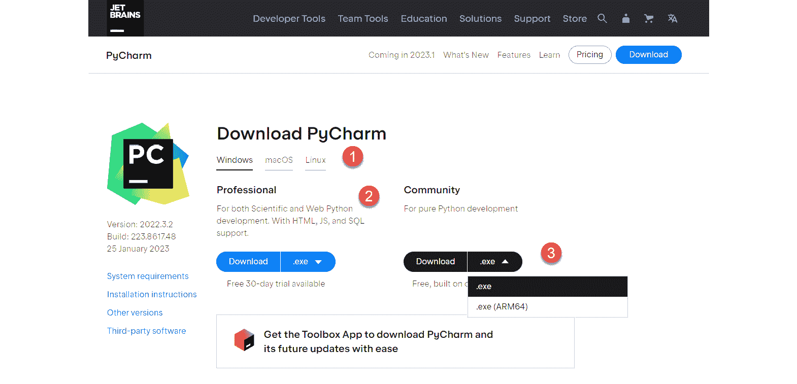

图 2.1：JetBrains 网站的下载窗口；请确保选择了正确的操作系统和处理器

下载了正确的版本后，请按照你操作系统的常规安装程序进行操作。如果你选择了 Linux 版本，你并不是在下载安装程序——你是在下载一个 gzipped `.tar` 文件。你只需提取它，然后从生成的文件夹中运行 PyCharm。

# JetBrains Toolbox

我刚刚介绍了人们最常用来将软件（包括 PyCharm）安装到他们的开发计算机上的最常见方法。还有一种不同的方法，我更喜欢，涉及安装一个名为 JetBrains Toolbox 的独立产品。如果你像我一样拥有多个 JetBrains 产品，Toolbox 特别有用。我订阅了他们所有的工具，并且经常使用其中许多。我首选的 C# IDE 是 JetBrains Rider，我在 Packt Publishing 出版的书籍 *Real-World Implementation of Design Patterns in C#* 中独家使用它。

即使你不需要使用多个 JetBrains 产品，Toolbox 也提供了一些有用的功能，例如提供一种简单的方式来安装、卸载和更新你的 PyCharm 安装。如果你需要，你甚至可以使用它来安装多个版本的 PyCharm，包括 **早期访问计划**（**EAP**）版本。EAP 版本让你在它们普遍可用之前就能访问 JetBrains 的最新功能。作为一名开发主管，我喜欢在我向我的开发团队发出“绿灯”之前，先对最新的 IDE 进行测试。Toolbox 让这变得非常简单。

Toolbox 是一个独立的下载，并且是免费的。让我们首先回顾一下 PyCharm 的下载页面。在底部，你会找到一个指向 JetBrains Toolbox 的链接，如图 *图 2.2* 所示：

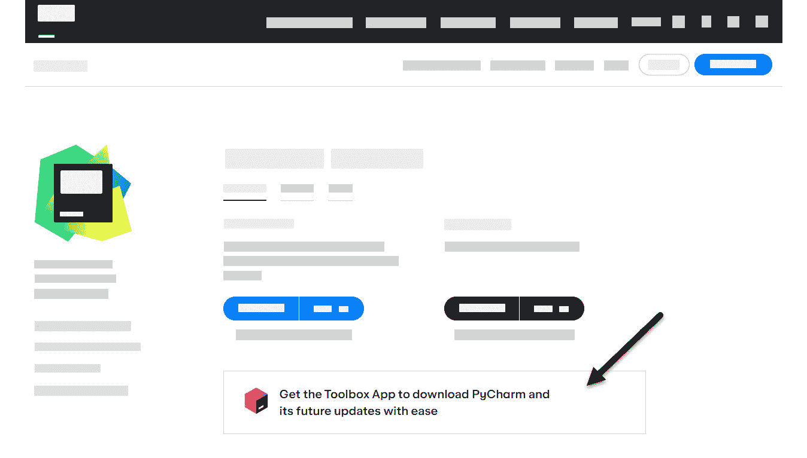

图 2.2：跳过我们之前提到的常规下载链接，而是点击 Toolbox 链接

有可能 JetBrains 会重新安排其网站。如果没有在底部找到链接，你可以简单地搜索*工具箱*并找到最新的下载。你将进入一个像*图 2.3*中显示的页面：

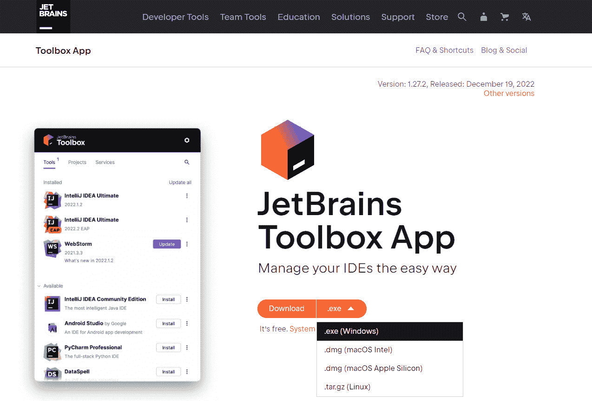

图 2.3：工具箱下载屏幕

就像我们之前审查的正常 PyCharm 下载一样，这个网页将检测你正在使用的操作系统。选项稍微简单一些，但如果你使用的是 Mac，务必点击格式按钮以选择 Intel 与 Apple Silicon，就像*图 2.3*中显示的那样。

## 在 Windows 中安装工具箱

安装工具箱的过程很简单。这是一个你运行安装程序并一直点击**下一步**按钮直到对话框消失的情况。

注意，当工具箱运行时，你可以在 Windows 的系统托盘找到它。

## 在 macOS 中安装工具箱

就像所有 Mac 产品一样，macOS 的安装非常简单。确认你下载了正确的`.dmg`文件版本（Intel 与 Apple Silicon）后，在你的`home`文件夹中的`Downloads`文件夹中找到下载的`.dmg`文件。双击打开`.dmg`文件。将工具箱图标拖到`Applications`文件夹。完成！

## 使用工具箱安装 PyCharm

无论你是如何到达这里的——无论是 Mac、Windows 还是 Linux——你现在应该已经有工具箱在运行了。在这个阶段，体验几乎是通用的。在 macOS 上，工具箱就像其他任何常规应用程序一样。但在 Windows 上，它运行在系统托盘上。

第一次运行工具箱会带来一个相当标准的**最终用户许可协议**（**EULA**）。你知道流程。阅读它并确保 JetBrains 没有要求你放弃你的第一个孩子，然后选择同意或不同意 EULA。当然，如果你不同意，我们的合作就结束了，除非你是偶尔来听一些爸爸笑话的。我将假设你同意了 EULA。

在安装了工具箱后，你可以安装 IDE。你将看到一个像*图 2.4*中显示的屏幕，列出了所有可用的 JetBrains 产品：

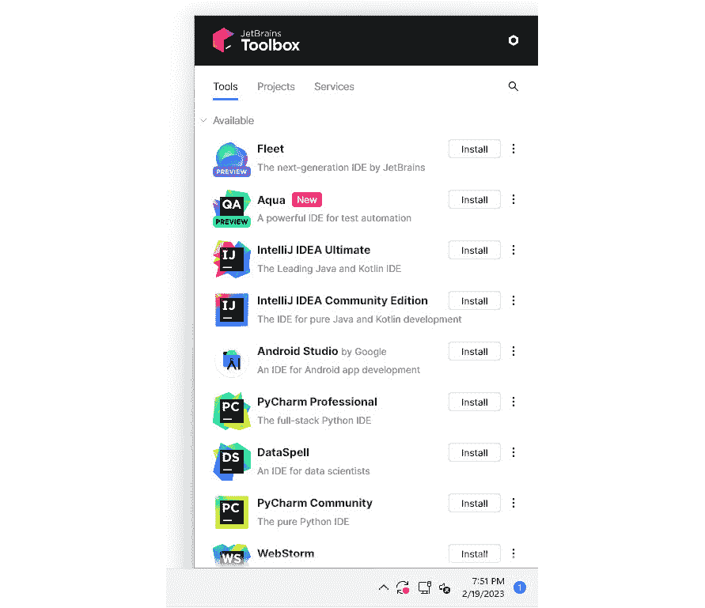

图 2.4：JetBrains 工具箱在 Windows 系统托盘运行

自然，我们只对 PyCharm 感兴趣。*图 2.4*显示了列表中的 PyCharm Professional 和 PyCharm Community。如果你对 PyCharm 教育版感兴趣，它在列表中更靠下。

要安装 IDE，点击**安装**按钮，等待工具箱下载并安装 IDE。安装完成后，工具箱菜单会略有变化，以显示你已安装的工具。你可以在我安装了 PyCharm Professional 后的*图 2.5*中看到我的：

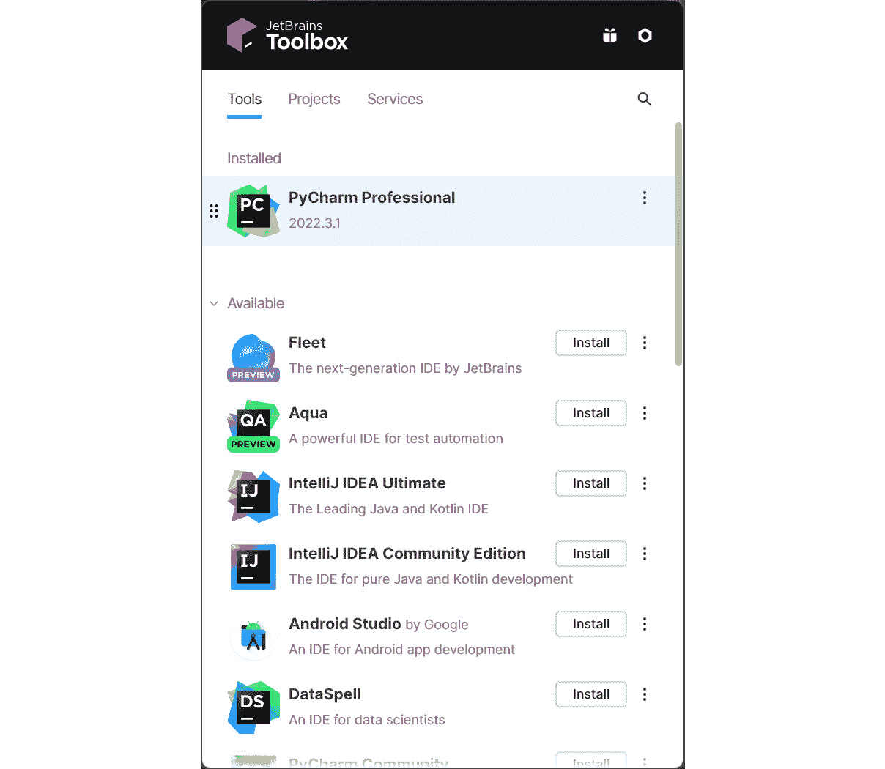

图 2.5：安装 PyCharm Professional 后的工具箱应用程序

您会注意到 Toolbox 将您安装的应用程序列在列表的顶部，而可安装的则位于下方。Toolbox 相对于正常安装的优势在于，您可以启动、更新和卸载您的 IDE，以及轻松尝试不同的版本。

## 使用 Toolbox 启动 PyCharm

在您安装 PyCharm 之后，您可以通过简单地点击菜单中的条目来启动它或任何已安装的 IDE。在我们离开 Toolbox 之前，让我向您展示一些更有趣的功能。

## 安装备用版本或卸载

在列表中每个已安装的 IDE 旁边，您将看到三个点，如图*图 2.6*所示：

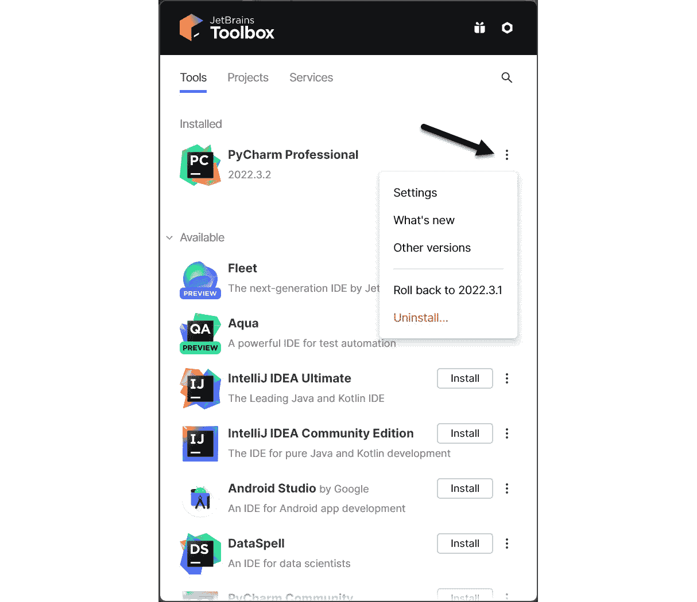

图 2.6：每个应用程序旁边的三个点代表一个菜单

这些点代表一个菜单。如果您点击它们，您将看到一些选项。您可以访问 PyCharm 的设置。我们将在 PyCharm 内部稍后进行此操作，所以现在我们不需要这么做。有一个选项，通过点击**什么是新功能**来查看最新新闻。在其下方，有一个选项，可以安装除最新版本之外的 PyCharm 的不同版本。如果您遇到最新版本的问题，可以轻松回滚到最后一个安装版本。最后，在分隔符下方，以非常令人畏惧的红色字体显示的是卸载选项。它甚至有一个令人毛骨悚然且神秘的省略号跟在菜单选项之后。将鼠标悬停在选项上通常会让人感到一种不祥的预感。您已经被警告了。

## 使用 Toolbox 更新 PyCharm

Toolbox 将帮助您保持 PyCharm 以及您使用的任何其他 IDE 的最新版本。Toolbox 本身有自己的设置和更新机制。

要访问这些设置，请点击 Toolbox 屏幕右上角的六边形图标，如图*图 2.7*所示：

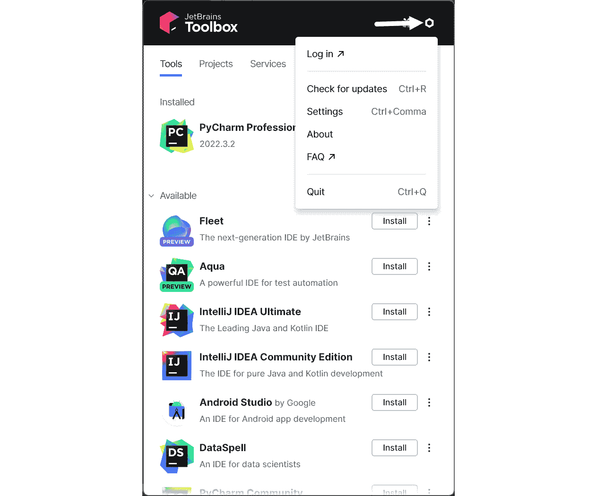

图 2.7：使用 Toolbox 顶部的六边形图标来访问其更新选项

**登录**选项允许您将 Toolbox 连接到您的 JetBrains 账户。**关于**和**常见问题解答**选项显示有关产品的信息。后者将您带到维护产品**常见问题解答**（FAQ）的网站。**退出**选项将关闭 Toolbox 程序。

# 启动并注册 PyCharm

不论您如何启动 PyCharm，它都会显示一个启动屏幕，然后带您进入一组典型的首次启动屏幕。如果您安装了专业版，您首先会看到图*图 2.8*所示的注册屏幕：

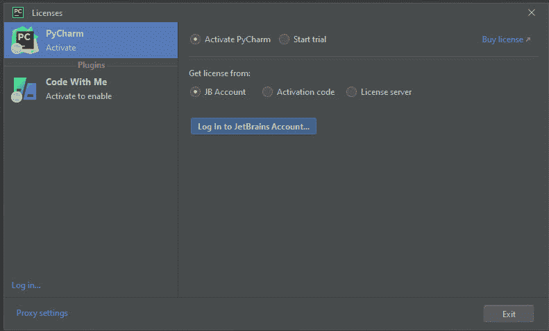

图 2.8：PyCharm Professional 的许可屏幕在首次运行时出现

在这里进行操作的最常见方式是登录到你的 JetBrains 账户。点击标有**登录到 JetBrains 账户…**的按钮将启动你的浏览器。你可以登录或创建一个账户。如果你已经购买了许可证，登录将使你的副本与所购买的许可证关联。

如果你为拥有许多许可证的公司工作，你可能需要登录到 JetBrains 许可证服务器。还有一个使用注册码进行注册的选项。你可以在你的商店账户中找到这个代码。如果你没有良好的互联网接入，这可能很有用。

你有多台电脑吗？

注意，只要你不使用同一许可证同时运行两个副本，在多台计算机上安装是合法的。IDE 会检测到这一点并要求你关闭一个副本。

如果你没有许可证并且还没有准备好提交，你可以选择**开始试用**选项。你仍然需要登录到 JetBrains 账户以激活你的试用。

# 设置 PyCharm

当你第一次启动 PyCharm，并且通过了许可和注册，你接下来看到的就是一个表示 PyCharm 没有加载项目的较小窗口。你可以在 *图 2.9* 中看到这个屏幕的浅色方案版本：

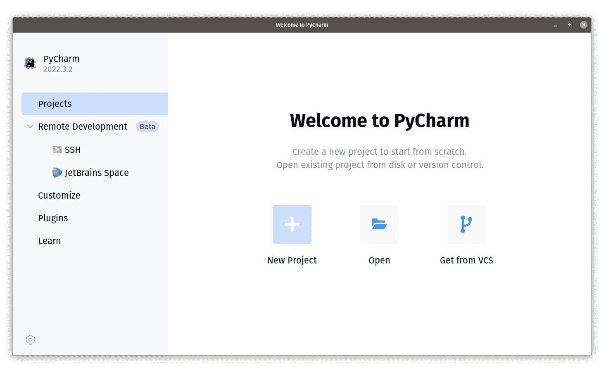

图 2.9：未加载项目的 PyCharm

从这个窗口，有几个明显的选项。我称它们为**明显**，因为它们就在窗口中间一个很大的开放空间中。你可以创建一个项目，打开一个现有项目，或者从 Git 或 **Subversion**（**SVN**）等 VCS 中克隆一个项目。然而，我的第一个目的地是在屏幕左侧的灰色区域，在那里你可以找到**自定义**菜单选项。让我们来回顾一下自定义 PyCharm 以适应你的工作风格的选项。点击**自定义**会带你到偏好设置屏幕，如图 *图 2.10* 所示：

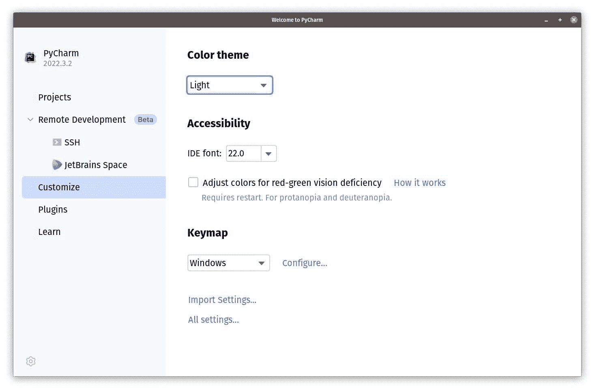

图 2.10：PyCharm 中设置一些重要首选项的小窗口

这个屏幕允许我们更改最常访问的设置。我们可以更改我们的颜色主题、IDE 字体和我们的快捷键映射。

在底部，我们可以导入我们的设置。当你的老板最终为你买下那台新笔记本电脑，而你不想花大量时间重新定制你的 IDE 时，这很有用。众所周知，一个配置良好、个性化的 IDE 就像你的旧沙发。任何试图坐在上面的人都会感到极不舒服。而且，它还有味道。你的朋友们不会告诉你，但它确实有。对你来说，它通过可能多年的久坐满足感，完美地适应了你的形状。那就是你的 IDE。你可能花了几年的时间来调整它以达到完美，但每次你得到一台新机器时，都必须从头开始。今天不是，朋友们。不是用 PyCharm。我们可以导出、导入，甚至共享我们的设置，并轻松地将它们带入新的安装。

我喜欢大字体，但不知道为什么！

你可能已经注意到，在这些截图里我的字体大小都非常大。我来自德克萨斯州，在德克萨斯州，一切事物都更大。然而，在这种情况下，我是为你这么做的。使用夸张的字体大小，截图更容易阅读，所以你会在本书的偏好设置中看到一些疯狂的设置。

你可能此时会想，PyCharm 的定制选项相当有限。你会错的。这个看似简单的窗口旨在通过展示最常更改的设置来让你轻松入门。许多用户会在这里停止。但不是你。不，不是你。你是维京人！其他开发者看到屏幕底部的那个看似微不足道的**所有设置…**按钮，会想**这里可能有龙**！而你看到的是一个充满冒险的丰富机会！所以，如果你敢，点击**所有设置…**按钮，我们将一起探索这个勇敢的新世界。

## 外观和行为

点击**所有设置…**按钮会带你到*图 2.11*所示的屏幕。我将仁慈地不尝试涵盖每个可用的设置，因为可能性的列表详尽到令人厌烦。当你通过定制设置时，你可以大致定制运行 IDE 生成的每个像素：

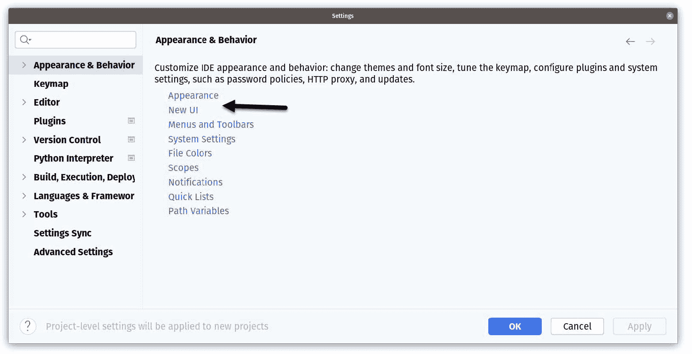

图 2.11：PyCharm 的设置屏幕允许你更改 PyCharm 中用户体验的各个方面

可能最实用的开始方式是指出设置类别列表的顶部有一个搜索框。通常，搜索你想要的设置比翻遍所有屏幕试图找到它更实际。

在我们继续前进之前，请注意*图 2**.11*中的箭头。它指向屏幕上的两个项目：顶部的是**外观**（我们稍后会讨论）以及一个**新 UI**设置。随着本书的编写，PyCharm 的用户体验正在进行全面的重构。随着应用程序的增长，菜单和工具栏变得越来越拥挤。为了解决这个问题，JetBrains 正在开发一个更简单的 UI 布局，希望这将使工具更容易学习和采用。经典的 UI 可能会在 2024 年之前仍然可用，但新的 UI 将在 2023 年底成为标准，这应该与本书付印的时间相吻合。本书中展示的所有内容都将使用**新 UI**设置。甚至可能是在 PyCharm 的后续版本中，这个选项甚至可能不会出现在屏幕上。

大多数开发者使用新 IDE 的第一件事就是调整外观。我们已经找到了颜色主题和字体大小的设置，但还有其他您想要查看的设置。让我们先点击*图 2**.11*中显示的**外观**，这将打开左侧的菜单并显示外观设置屏幕。

### 外观

打开**外观**设置后，您将看到一个类似于*图 2**.12*所示的窗口：

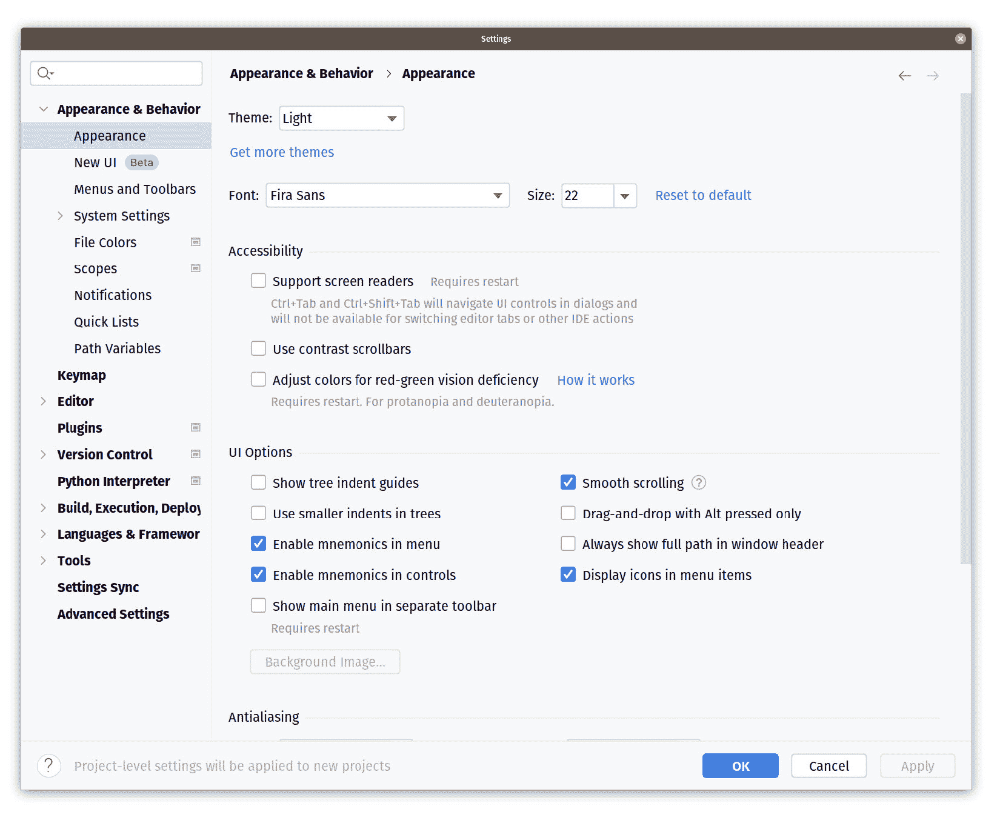

图 2.12：PyCharm 的外观设置

我们之前已经看到过一些这些设置。我们可以设置主题，就像我们在之前看到的简单设置对话框中做的那样。然而，此窗口提供了一个标签为**获取更多主题**的链接，这将允许您在 JetBrains Marketplace 中探索 PyCharm 安装中标准问题之外的主题。我们将在本书的末尾介绍插件，但如果您想找到一些更独特的东西，看看也无妨。

等一下！

这不是您设置代码编辑器中字体的地方。此设置控制 UI 本身的字体。它将影响按钮、菜单项、窗口标题等，而不是编辑器，这可能是您想要更改的。

别担心——我们很快就会定制编辑器字体。

### 编辑设置

与**设置**窗口中的大多数部分一样，有许多自定义选项。我只会强调一些重点。随着我们浏览屏幕，您将看到可以进行的自定义程度。如果是在屏幕上由 PyCharm 渲染的像素，您很可能会以某种方式对其进行自定义！*图 2**.13*显示了**设置**窗口中的**编辑器**设置部分：

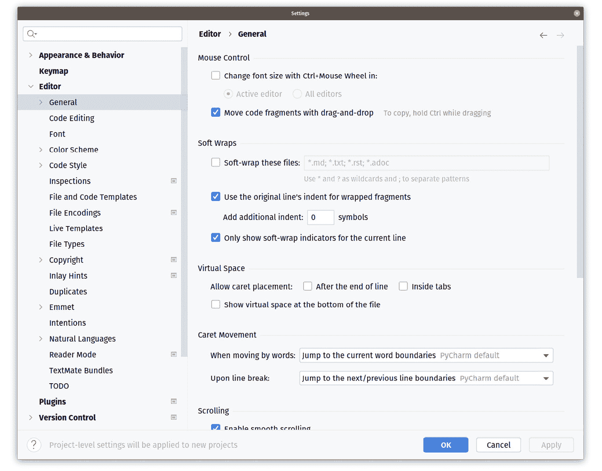

图 2.13：PyCharm 设置窗口中的编辑器设置

如果你喜欢，可以浏览左侧的选项，看看是否有任何适合你更改的内容。**颜色方案**部分让你可以自定义 IDE 着色语法的方式。我将跳到我认为最有用的设置修改部分。点击**字体**部分，就像我在*图 2.14*中做的那样：

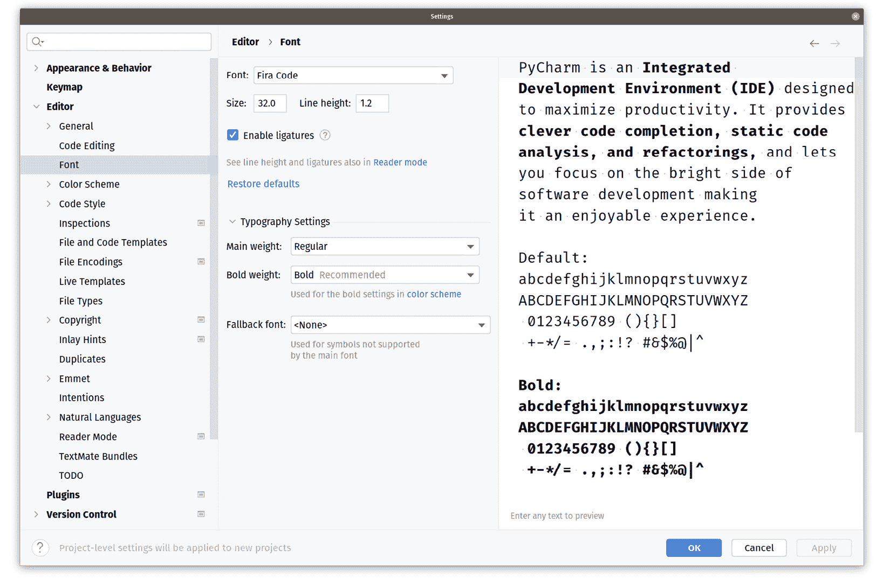

图 2.14：PyCharm 中编辑器的字体设置

这个屏幕只做一件事：它控制 IDE 编辑窗口中文本的外观。我们之前看到的其他字体设置通常适用于整个 IDE。对于我们这些工具用户来说，这个设置是最重要的。这是你整天都会盯着看的工具部分。你可以设置字体、大小和行高。我把我字体的大小设置得很大，因为我需要漂亮的、大号的字体来显示所有这些截图，但说实话，我在工作笔记本电脑上的日常设置是 16 或 18 号。字体大小越大，根据你的显示器距离越远，阅读起来就越容易。理想情况下，这不应该超过手臂的长度。如果你的字体太小，你可能会不知不觉地更频繁地眯着眼睛看显示器，这可能会导致疲劳。

这里有一个设置可以启用字体连字符。这些是对标准字体的增强，允许我们代码中使用的符号以更多优雅的方式显示。例如，启用字体连字符后，一个带有不等于符号的条件语句`if a != b`将渲染成*图 2.15*中所示的样子：

图 2.15：开启字体连字符可以让你表达某些通常不可用的符号，例如第 5 行的不等号

为了让这个功能正常工作，你必须选择一个支持连字符的字体。PyCharm 附带*Fira Code*字体，专门因为它是一个很好的 IDE 字体，支持连字符。如果你想探索更多支持连字符的字体，请将你的浏览器指向[`nerdfonts.com`](https://nerdfonts.com)。它有许多适合编辑器、终端和控台的字体，其中许多支持连字符。

在**编辑器**设置中的**字体**设置下方是**颜色方案**。你之前见过这个，但知道它的位置是好的，因为上次我们看到它时，它是在设置窗口中。

如果你想要更多颜色方案的自定义选项，向下旋转**颜色方案**菜单项旁边的箭头，你就会看到，就像我在*图 2.16*中做的那样，有更多选项：

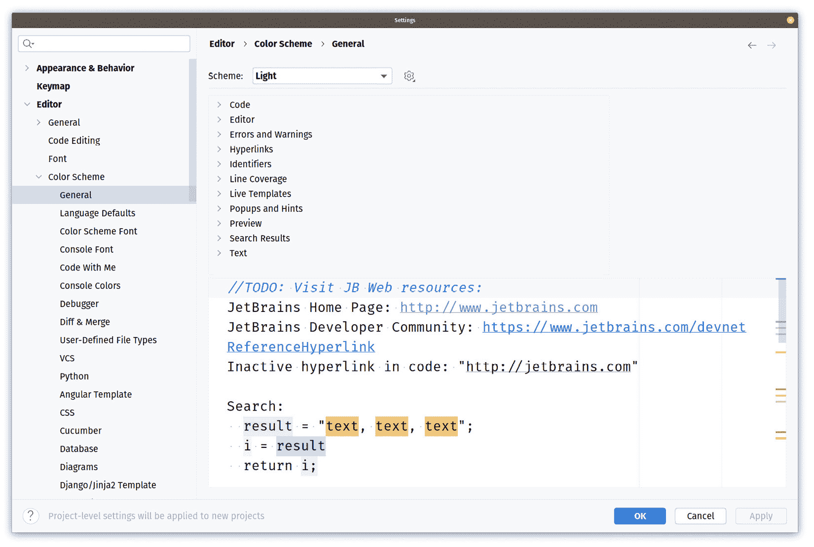

图 2.16：您可以使用颜色方案设置菜单中的选项更改 PyCharm 中几乎所有内容的颜色

您可以控制应用程序中每个窗口在所有使用上下文中的颜色。例如，您可以为 SQL 文件、JavaScript 文件和 Python 文件设置不同的颜色方案。

在这些设置中，最有用的可能就是能够自定义 PyCharm 集成终端窗口中显示的字体。您可以在*图 2*中看到这一点。17*：

图 2.17：您可以在 PyCharm 的集成终端窗口中自定义字体

默认情况下，控制台使用与编辑器相同的字体。如果您想更改它，您当然可以。您还可以使用**控制台颜色**设置进一步自定义控制台的外观，如*图 2*所示。18*：

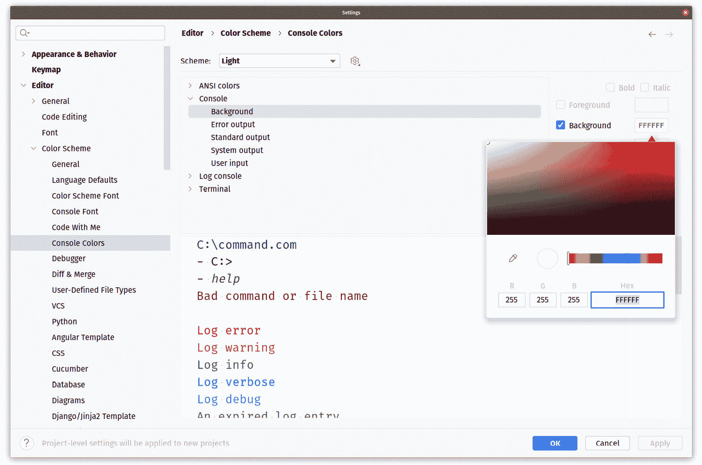

图 2.18：PyCharm 中的控制台颜色设置

个人来说，我在终端上花费了很多时间，所以我很欣赏可用的自定义程度。

关闭**颜色方案**菜单，让我们跳转到**代码样式**菜单。您可以在*图 2*中看到该菜单。19*：

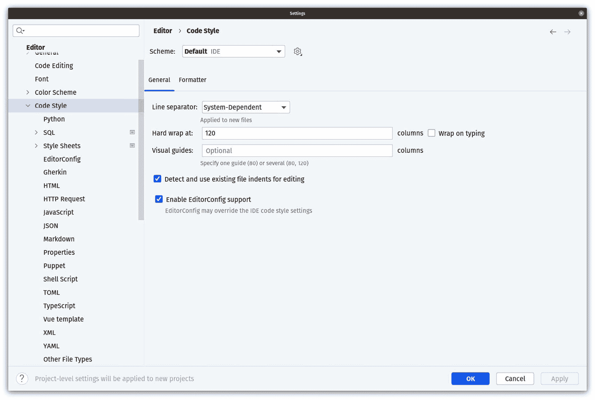

图 2.19：PyCharm 设置窗口中的代码样式菜单

这一点我觉得有点令人困惑。*PEP 8*标准规定，Python 代码的任何一行都不应超过 79 个字符，然而编辑器的硬换行设置为 120。幸运的是，我们可以解决这个问题。正如我所说的，*PEP 8*规定代码行应限制在 79 列或更少。该标准还建议注释行和文档字符串应限制在 72 列。为了确保我遵循这些规则，我更改了我的**代码样式**设置，如*图 2*所示。20*：

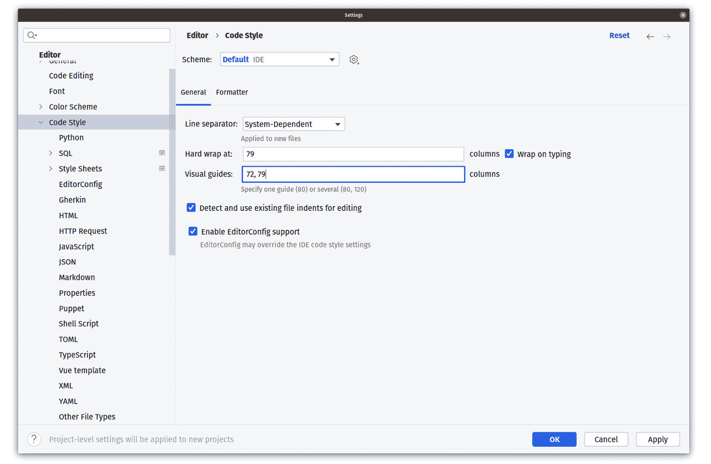

图 2.20：这是我推荐的折行和指南设置，它尊重 PEP 8

我更改了`79`，并勾选了复选框来检查折行。然后，我将`72`和`79`添加到**视觉指南**设置中，这样我就能在右侧的页边空白处看到线条。良好的 Python 代码始终与标准保持一致。设置这些视觉指南有助于我避免那些讨厌的红波浪线。我讨厌那些。

如果您不明白我的意思，Python 有一个内置的代码检查器，当您违反*PEP 8*规则时，它会警告您。过了一段时间，它就像一个烦人的丈母娘坐在后座上一样。以这种方式设置**代码样式**设置可以避免代码愤怒，这在实际的后座司机，甚至可能是所有丈母娘中都是不可避免的。

应用这些设置会改变编辑器的外观，如*图 2*所示。21*。我们可以看到右侧有两行，分别显示我们的 72 列和 79 列的指南：

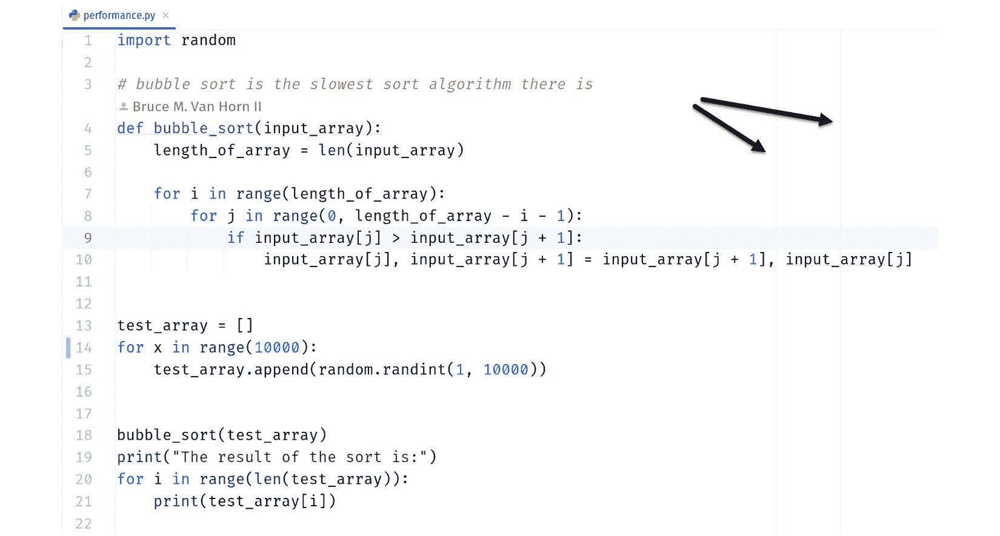

图 2.21：代码样式已应用，我们可以在编辑器的右侧看到我们两条浅灰色线条

如果你记得，我们在第 79 行也开启了一个硬换行。为了演示这一点，你会注意到代码中的第 10 行，在我更改设置之前输入的，明显超过了 79 列的指南。为了测试硬换行设置，我在第 11 行下面立即重新输入了这一行。一旦达到硬换行限制，PyCharm 插入了一个行续符（`\`），并将我带到下一行，并适当地缩进。现在，我无法输入违反*PEP* *8*标准的代码行。

注意，更改设置不会自动重新格式化你的代码。有一个工具可以做到这一点。我们将在*第四章*中学习如何自动格式化和重新格式化代码。

### 其他设置

在**设置**窗口中还有更多可见的设置，包括**远程开发**和**插件**。这些将在后面的章节中介绍。

### 导出自定义设置

自定义设置非常棒！但当你必须切换到新电脑时，这总是很麻烦。你肯定不愿意重新做所有的自定义设置。或者你可能想与你团队中的其他开发者分享你的设置。PyCharm 让这变得很容易。只需点击**文件**菜单，找到**管理 IDE 设置**选项，如图**2.22**所示。22*：

图 2.22：PyCharm 让你可以导出和导入你的设置

你可以按需导入、导出和重置你的设置。

# 与项目一起工作

现在我们已经看到了所有的配置选项，并且调整了一些更受欢迎的设置，让我们快速浏览一下 PyCharm。我们将创建一个快速的 Python 项目，并学习如何在 UI 中运行我们的主脚本。

到这一点，你需要在你的电脑上安装 Python 3。Python 文档在[`docs.python.org/3/using/index.html`](https://docs.python.org/3/using/index.html)中解释了安装过程。我发现这份文档很完整，但你必须浏览很多才能找到好的部分。为了使初学者更容易，我将在本章末尾的*进一步阅读*部分包含一些额外的链接。

## 创建新项目

你可能开始意识到 PyCharm 是一个非常强大且灵活的工具。有几种方法可以配置它，应用程序中有几个地方可以开始配置过程。在创建项目方面也有类似的灵活性。

如果你之前从未在 PyCharm 中创建过项目，现在很可能就是这样，你会看到一个像图**2.23**中所示的窗口。这个窗口提供了一个创建新项目的按钮：

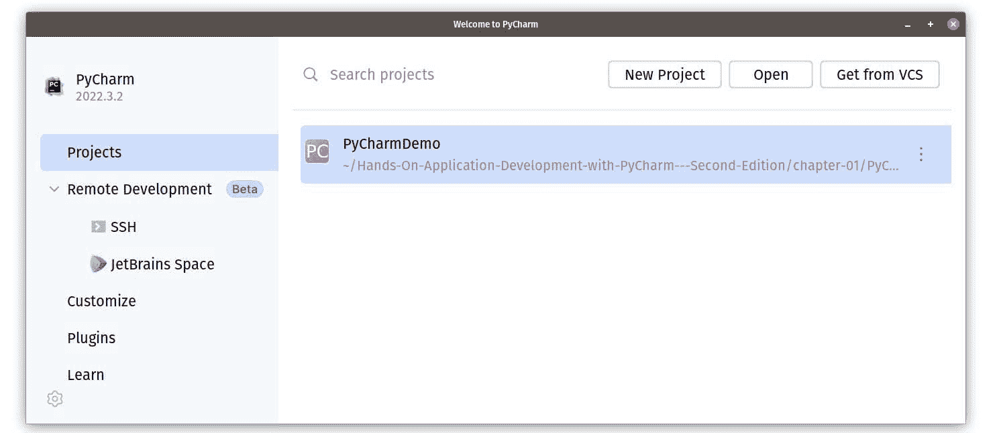

图 2.23：PyCharm 的启动屏幕有一个用于创建新项目的按钮

如果你已经在 PyCharm 中创建了一个项目，PyCharm 窗口将打开到最后加载的项目。这就是我在*图 2.24*中展示的情况。在这里，我有我们迄今为止使用的示例项目。在本章稍后，我将向你展示如何使用 PyCharm 的集成 Git 客户端克隆此代码，但现在让我们回到创建新项目。在*图 2.24*中，我已经打开了一个项目。在这种情况下，你可以使用**文件**菜单来创建一个新项目。点击**文件** | **新项目…**：

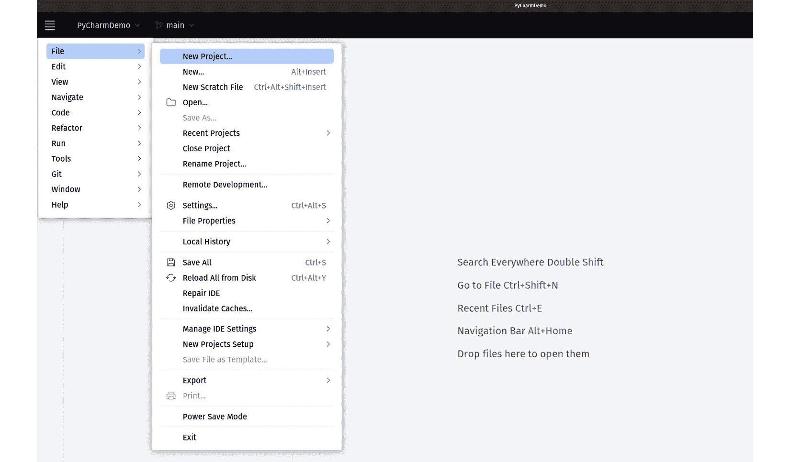

图 2.24：你可以通过点击文件菜单中的“文件 | 新项目…”来创建一个新项目

无论你选择哪个向量，结果都是一样的。你将得到如图*2.25*所示的**新项目**窗口：

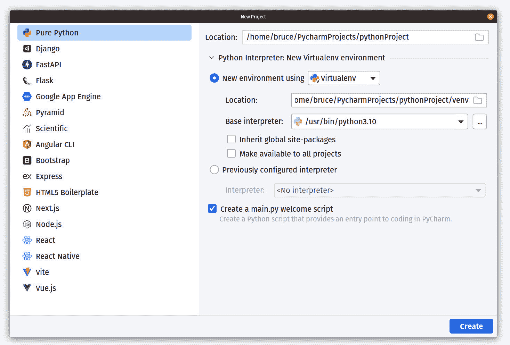

图 2.25：PyCharm 专业版中的新项目窗口

这里你可以注意到专业版和专业版之间的一个重大差异。在*图 2.26*中，你会看到专业版（左侧）和社区版（右侧）的**新项目**窗口。请将注意力集中在专业版窗口的左侧。专业版提供了更多项目类型，而免费版只有一个选项。社区版只创建纯 Python 项目。它甚至不提供选项，因为它只能做到这一点：

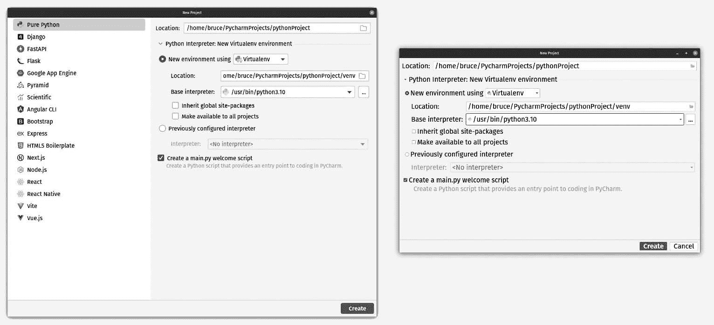

图 2.26：PyCharm 专业版（左侧）和社区版（右侧）的项目创建选项

重要的是要注意，在 PyCharm 社区版中创建任何类型的项目并非不可能。例如，如果我想创建一个 Flask 项目来制作一个网络应用，我绝对可以在社区版中做到这一点。然而，我必须从头开始手动完成。专业版通过更好的工具加快了速度，但它不会阻止你在任何其他编辑器中做任何你不能做的事情，无论是免费的还是其他类型的。

我将选择两个版本都有的一个项目：一个纯 Python 项目。这是两个版本中的默认设置。

屏幕顶部的第一个选项允许你设置项目的名称和位置。我将保留默认的`pythonProject`。在其下方，有一系列用于创建 Python 虚拟环境的选项。这是*第三章*的主题，所以我将它们保留为默认设置。

注意

如果你还没有安装 Python 3，或者 PyCharm 无法检测到你的 Python 3 安装，你可能会被提示自动安装 Python 3。请注意，PyCharm 可能不会安装 Python 3 的最新版本，也不会给你任何控制安装位置的能力。它还会显著减慢创建第一个项目所需的时间。

确保勾选名为**创建 main.py 欢迎脚本**的复选框，然后点击**创建**按钮。如果你在开始创建新项目的过程中已经打开了一个项目，你会看到一个对话框询问你想要如何处理当前打开的项目，如图**2**.27 所示：

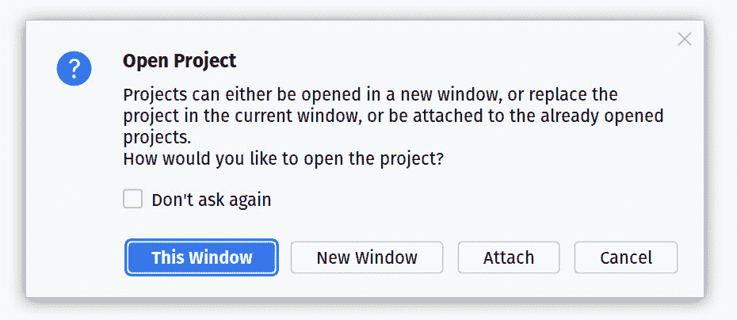

图 2.27：如果你已经打开了一个项目，在创建新项目时，你有选择如何处理它的选项

现在，让我们选择**此窗口**按钮，这将关闭你打开的项目，并用你的新项目替换它。当然，你的旧项目仍然完好无损，可以通过**文件** | **打开**菜单选项重新打开。

结果是一个包含单个文件的新的 Python 3 项目。该文件将包含一种常见的*Hello World*习语变体，这样我就不必在本书的源代码中包含它了。看？我们都赢了！让我们在 IDE 中查看我们的新项目，如图**2**.28 所示：

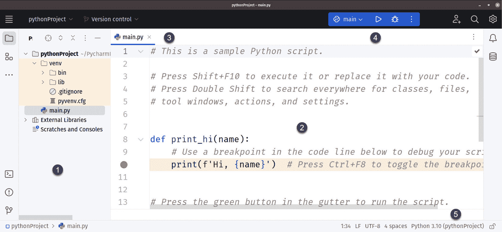

图 2.28：新项目已创建；现在，让我们四处看看！

如你所见，PyCharm 在我们的项目资源管理器中为我们创建了一个项目结构（**1**）。项目资源管理器允许你查看和交互你的项目中的所有文件。你可以看到它为虚拟环境创建了一些文件夹。我们将在*第三章*中深入探讨这一点。

编辑器清晰地位于中间（**2**）。我们将在这里花费很多时间，所以让我们指出，PyCharm，就像大多数 IDE 和编辑器一样，使用的是标签界面（**3**）。有一个工具栏（**4**），可以运行、调试、测试和性能分析你的程序，我们很快就会用到它。

在 PyCharm 的右下角（`\t`）字符上，除非你自定义了它。但你在世界上为什么要做这样的事情呢？

小贴士

如果 PyCharm 无响应，请向下看窗口底部的**区域 6**附近，你可能会看到一个进度条，表明 PyCharm 正在执行某些操作，如项目文件索引。你可能必须等待它完成，你的 IDE 才能完全响应。

## 运行 PyCharm 项目

我感觉自己有点像那个不停谈论汽车特点的烦人的汽车销售员。你只想开车而已。让我给你那些钥匙，并告诉我的不存在的经理我们钓到了一条鱼。我马上回来。

在 PyCharm 的情况下，键位于窗口的顶部：*区域 4* 如 *图 2**.28* 所示。您可以通过找到带有箭头的蓝色按钮轻松找到它。我会在 *图 2**.29* 中向您展示确切的按钮。您必须相信我关于颜色的描述。它是蓝色的。这是 **运行** 按钮。点击它：

图 2.29：点击蓝色箭头以运行主脚本

现在，大声喊一声大大的德克萨斯 YEEEE-HAW！或者，您也可以做您所在地区认为的欢呼。您已经运行了程序。我们朝着掌握新 IDE 的目标迈出了重要一步。IDE 窗口发生变化，如 *图 2**.30* 所示：

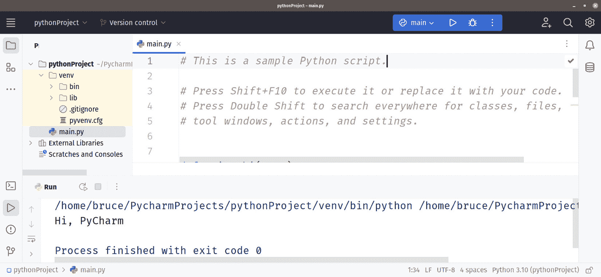

图 2.30：当您运行程序时，您可以在控制台中看到运行结果

除了运行窗口本身外，请注意，选项卡上还有按钮，允许您重新运行程序或停止当前正在运行的程序。

在下一节中，您将学习如何从 GitHub 克隆代码项目。在我们这样做之前，让我们关闭当前项目。定位 **文件** 菜单，然后点击 **文件** | **关闭项目**，如 *图 2**.31* 所示：

图 2.31：从文件菜单关闭项目

太棒了！您已经准备好开始下一场冒险了！让我们从 GitHub 获取本书的示例源代码。

# 从 GitHub 克隆本书的代码

PyCharm 为处理 VCS（如 Git、SVN、Mercurial 和 Perforce）提供了一套强大的功能。在本书中，我们将使用 Git 和 GitHub，因为它们已成为行业中的事实标准。如果您使用其他支持的 VCS，过程大致相同。实际上，用户体验大致相同，只是在某些 VCS 的操作方式上有所不同。例如，Git 使用四步过程来提交和推送文件：

1.  阶段您的本地更改 (`git add`)。

1.  在本地提交您的更改 (`git commit`)。

1.  从 GitHub 或您的中央仓库拉取最新更改，并解决任何冲突 (`git pull`)。

1.  将您的更改推送到中央仓库 (`git push`)。

相比之下，SVN 只有两个步骤：

1.  拉取最新更改并解决任何冲突 (`svn update`)。

1.  将您的本地更改提交到中央仓库 (`svn commit`)。

我的观点是，不同的 VCS 可能会有不同的工作流程，这可能会改变 PyCharm 中的用户体验。对于本书，我们只会使用 Git。

由于您在上一个部分的末尾关闭了项目，您应该看到一个类似于 *图 2**.32* 所示的窗口：

图 2.32：定位“从 VCS 获取”按钮

在本节中，我们将完成两件事。首先，我们将在 PyCharm 中设置您的 GitHub 账户。如果您目前没有账户，这并不是一个严格的要求，但迟早您会需要一个 GitHub 账户。您不妨直接面对现实。我不会在这里介绍如何创建 GitHub 账户。您可以在[`github.com/signup`](https://github.com/signup)找到创建账户的说明。

定位并点击**从版本控制获取**按钮。您将看到一个类似于*图 2.33*所示的屏幕。33*：

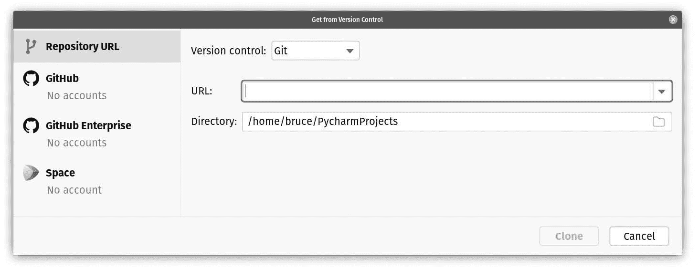

图 2.33：PyCharm 中的从版本控制获取窗口

## 设置您的 GitHub 账户

注意，在窗口的右侧，您可以查看您在 GitHub、GitHub Enterprise 和 JetBrains Space 上的所有账户。我将继续设置我的 GitHub 账户。点击左侧菜单中的**GitHub**项。您将看到一个类似于*图 2.34*所示的屏幕。34*：

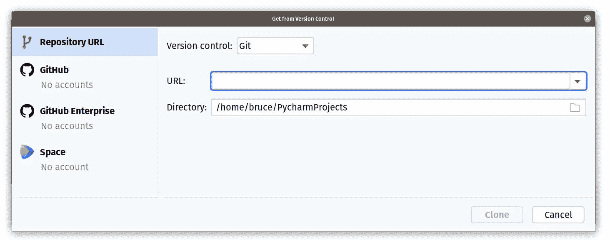

图 2.34：登录 GitHub 简单且只需进行一次

定位并点击**通过 GitHub 登录**按钮。在您点击它之前，我建议您使用您喜欢的浏览器登录到[`github.com/login`](https://github.com/login)。如果您已经登录并清除了任何**双因素认证**（**2FA**）的障碍，这个过程将更加无缝。

一旦授权，您可以关闭浏览器并返回 PyCharm。几分钟后，您将在窗口中看到所有您的 GitHub 仓库。这使得处理您自己的仓库变得非常容易。然而，我们要克隆的仓库不在您的列表中，所以我们还有更多的工作要做。

## 克隆书籍的仓库

要克隆您不拥有的仓库，请回到左侧菜单中的**仓库 URL**选项，如图*图 2.35*所示。35*：

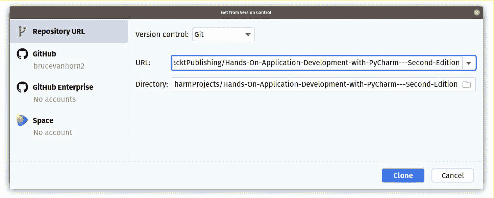

图 2.35：要克隆您不拥有的仓库，请点击左侧菜单中的仓库 URL 选项

在`PyCharmProjects`下的`home`文件夹中。我将其留在了默认位置。点击标有**克隆**的按钮。

一旦克隆，您将看到一个在当今软件开发工具中普遍存在的典型偏执对话框，如图*图 2.36*所示：

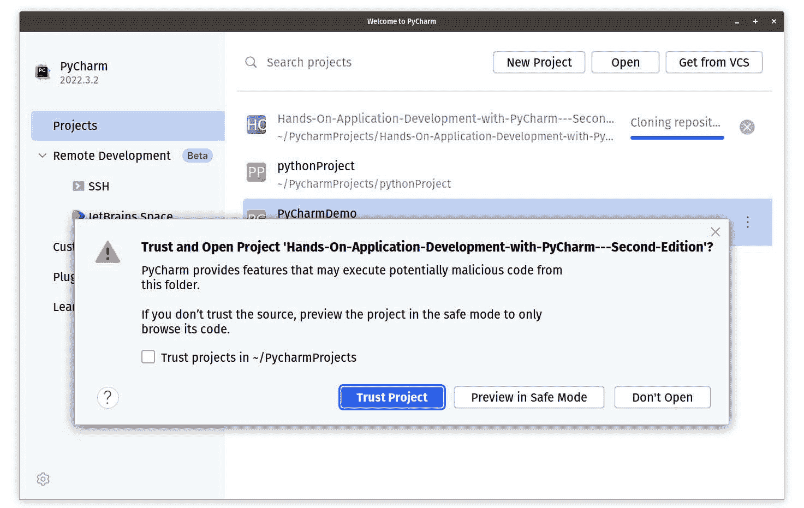

图 2.36：您信任我吗？

我知道我们刚刚见面，但如果你真的想要这本书的源代码，你应该点击**信任项目**按钮。一旦你这样做，你就准备好了。你现在拥有了书中展示的所有示例代码。

# 摘要

本章主要介绍了准备工作。我们在您的电脑上安装并配置了 PyCharm 的新实例。您有多种方式可以安装 PyCharm。您可以走传统的路线，只下载安装程序。我更倾向于安装 JetBrains Toolbox 应用程序，并使用它来安装和管理 PyCharm，以及我可能需要或想要的任何其他 JetBrains 工具。使用 Toolbox 应用程序使我们能够轻松地更新 PyCharm，甚至在需要时执行干净的卸载。

我们学习了 PyCharm 三个版本之间的区别。免费的社区版在 PyCharm 支持的项目类型和集成工具方面有限制。当我们创建新项目时，我们没有获得任何项目模板选项。只支持“纯 Python”项目。这并不意味着我们不能创建任何类型的项目；这仅仅意味着设置不同类型项目的繁琐部分不是由 IDE 为您处理的。

专业版支持更广泛的工具集，包括完整的项目模板和扩展的 Web 开发和科学工作负载工具。虽然专业版不是免费的，但为个人和企业开发者提供了许可选项。还有通过申请程序获得免费专业许可的选项。例如，微软 MVP 和其他认可的专业人士、开源开发者以及大学教授。在 JetBrains 网站上经常有针对初创公司、教育机构和其他人的折扣优惠。不幸的是，书籍作者并未列出。

PyCharm 的第三个版本是教育版。这是一个特殊版本，允许在 IDE 中创建和播放交互式课程。如果您使用 PyCharm 教授 Python，您可能不需要这个版本。您应该使用社区版或专业版，并利用 JetBrains 为教师提供的免费软件优惠。

一旦我们安装了 PyCharm，我们就开始配置应用程序。突出了一些重要的配置选项。我们可以几乎自定义 PyCharm 工作的各个方面。流行的设置包括设置 IDE 的颜色主题、字体大小和代码开发设置。在我们的案例中，我们设置了编辑器使用 PyCharm 附带的带有连字符的字体 Fira Code。我们还配置了**代码风格**设置，在 79 个字符处进行硬换行，以保持与*PEP* *8*标准的合规性。

在一切设置完成后，我们通过创建一个简单的纯 Python 项目并使用 IDE 的**运行**按钮运行它来检验一下。

最后，我们使用 GitHub 账户设置了 PyCharm，并克隆了本书的示例代码仓库。我们在很短的时间内完成了很多事情。到目前为止，您已经准备好使用 PyCharm 开发软件了，而我们才刚刚进入*第二章*！

随着我深入探讨下一章中与 Python 虚拟环境一起工作的内容，请继续跟随我。虚拟环境被认为是最佳实践，它们提供了一种在本地开发环境中隔离项目需求的方法。正如您将看到的，PyCharm 消除了记住五六条命令以及安装额外库来快速启动和运行项目的需求。

# 问题

1.  使用 JetBrains Toolbox 应用程序安装和管理 PyCharm 安装有什么好处？

1.  PyCharm 社区版和专业版之间主要有哪些区别？

1.  PyCharm 社区版的主要限制是什么？

1.  如果你使用的是 PyCharm 社区版，你还能不能使用 Flask 等框架开发项目，这些框架似乎只在专业版中支持？

1.  将您的 GitHub 账户链接到 PyCharm 有什么好处？

1.  你已经去书的仓库给它点过星了吗？如果你分叉了仓库，如果我有任何更改，你会收到通知。我怀疑这种情况不会发生，因为像你的代码一样，我的代码通常第一次就能完美运行。不，我做不到。我尽力了。

# 进一步阅读

一定要查看这本书的配套网站：[`pycharm-book.com`](http://pycharm-book.com)。

设置 Python 的说明：[`www.maddevskilz.com/pages/python-landing-page`](https://www.maddevskilz.com/pages/python-landing-page)

*PEP 8 – Python 代码风格指南*: [`peps.python.org/pep-0008/#maximum-line-length`](https://peps.python.org/pep-0008/#maximum-line-length)

# 第二部分：提高生产力

这一部分涵盖了从入门到高级的概念和技术，这些概念和技术有助于在 PyCharm 中处理 Python 项目时的生产力。读者将能够了解项目、Python 解释器和虚拟环境管理的动态选项，以及如何进行良好的编程实践，如版本控制、测试、调试和性能分析，以及 PyCharm 如何简化这些流程。

这一部分包含以下章节：

+   *第三章*, *自定义解释器和虚拟环境*

+   *第四章*, *在 PyCharm 中轻松编辑和格式化*

+   *第五章*, *在 PyCharm 中使用 Git 进行版本控制*

+   *第六章*, *无缝测试、调试和性能分析*
