# 5

# 在 PyCharm 中使用 Git 进行版本控制

版本控制是软件开发领域的一项基本最佳实践。然而，对于新开发者来说，这个过程的技术细节可能会让人感到畏惧。犯错很容易。作为南方卫理公会大学（Go Ponies！）的训练营讲师，我亲眼目睹了许多错误，比如不小心将整个家目录添加到 Git 仓库中，在其他仓库内部创建仓库，以及通过错误的推送和拉取顺序抹去辛勤工作的成果。我更喜欢让学生在命令行上掌握 Git。实际上，这是我最先教授的技能之一，在我看来，这也是最难的技能之一。

在开发者对整个 Git 过程有信心之后，不得不不断跳出 IDE 执行四到五个命令，然后再跳回 IDE 继续工作，这确实有些烦恼。虽然你可以使用 PyCharm 中可用的内置终端窗口，但 IDE 提供了一个更好的选择：内置的版本控制 GUI。

PyCharm 支持许多主要的 **版本控制系统**（**VCSs**），包括以下内容：

+   Git

+   Mercurial

+   Subversion

+   Perforce

+   微软 **团队** **基金会服务器**

尽管有许多其他版本控制系统可用，但它们无疑是最受欢迎的，并且在这份列表中，Git 已经成为行业中的事实标准。

本章将首先介绍一些关于版本控制和版本控制系统（VCSs）的基本信息，以防你对这个概念不熟悉。在介绍之后，我们将完全专注于 Git 的工具，因为正如我刚刚暗示的，它在市场份额方面具有领先地位。

到本章结束时，你将理解以下内容：

+   使用版本控制系统的优点

+   使用 Git 执行添加、提交、推送、合并和分支操作

+   创建和维护`.gitignore`文件

+   在 IDE 中使用 Git 工具，这可能从多个角度进行参考

# 技术要求

要成功学习本章内容，你需要以下条件：

+   Python 3.10 或更高版本的正常安装。

+   PyCharm 的正常安装。

+   为你的电脑安装 Git 客户端软件。Mac 和 Linux 系统通常作为标准安装。Windows 用户可以访问[`gitforwindows.org`](https://gitforwindows.org)下载免费软件。

+   一个免费的 GitHub 账户。请注册于[`github.com`](https://github.com)。请注意，尽管 GitHub 有付费功能，但我们不会使用它们

# 版本控制和 Git 基础知识

软件行业标志性人物**乔尔·斯波尔斯基**，他创建了 Stack Overflow，在 2000 年写了一篇著名的博客。他的许多有影响力的帖子中，有一篇标题为*《乔尔测试：12 步提升代码质量》*。这篇帖子旨在为软件开发者提供一个简单的评估方法，以评估任何软件开发组织的成熟度水平。他提出了 12 个问题，每个问题 1 分。一个优秀的软件开发团队应该得到 11 分或更高。列表中的第一项就是本章关注的内容：你们使用源代码控制吗？如果你对其他内容感兴趣，可以在本章的*进一步阅读*部分找到博客文章的链接，以及斯波尔斯基先生的书籍*《乔尔论软件》*的引用。

乔尔称之为**源代码控制**。我称之为**版本控制**。这两个术语可以互换使用。我将使用*版本控制*来保持与 PyCharm 的 UI 一致，PyCharm 将我们讨论的这一组功能称为**版本控制系统**或**VCS**。严格来说，版本控制是一个随着时间的推移跟踪组成程序的文件变更的过程。VCS 的目标包括以下内容：

+   能够恢复项目中的任何文件之前保存的版本。

+   能够自动合并团队中多个开发者的工作，只要他们的工作不冲突。冲突发生在两个开发者更改了同一文件中的同一位置。

+   提供一种简单的方法来审查冲突并通过协作解决它们。

+   能够跟踪随着时间的推移，哪些开发者对代码进行了每次变更。

+   提供一个分支系统，允许修复错误、增强功能和实验，而不会牺牲生产代码的稳定性。

因此，版本控制系统（VCS）是一种旨在启用该过程的软件系统。VCSs 根据修订的存储方式分为两种类型。**集中式 VCS**的工作方式有点像你当地的公共图书馆。你的项目被检查到一个**仓库**中。开发者可以检出代码以便进行创建新修订的工作。这样做将检索项目的最新版本。一些系统，如**Perforce**，传统上要求你明确检出你想要工作的文件，就像从图书馆借阅一本书一样。在你检出这些文件期间，不允许其他人修改它们，直到你将它们检入并带上你的更改。其他系统，如**Subversion**，没有这个要求。任何人都可以在他们本地的副本上工作。当工作完成时，开发者会将他们的工作**提交**到中央仓库。在提交过程中，VCS 会检查**冲突**。如果没有冲突，传入的工作将被**合并**，并在 VCS 服务器上存储一个新的版本，然后通过更新过程供其他开发者使用。如果检测到冲突，提交将被拒绝，开发者必须与其他团队成员一起工作以解决冲突，然后才能合并并最终提交工作。在所有集中式系统中，团队中的每个开发者在其本地计算机上只有代码的最新版本。

相比之下，**分布式版本控制系统**（**DVCS**）如**Git**和**Mercurial**将项目上所执行的每个修订都保存在每个开发者的计算机上。这里的优势是没有任何单点故障可能导致项目代码的完全丢失。在集中式系统中，如果服务器被破坏，项目的修订历史可能会丢失。在分布式系统中，没有中央系统来存储项目的修订历史。每个开发者都有项目完整的历史记录在他们的计算机上，所以任何一台计算机的丢失并不会造成太大的问题，除了更换设备的常规痛苦之外。

话虽如此，分布式系统确实使用一个中央**枢纽**或**远程**，以便在每位开发者的计算机上的工作副本之间实现轻松同步。枢纽服务器允许额外的功能，例如管理谁可以查看或更改代码，以及协作功能，如代码审查、错误跟踪、文档和讨论。分布式版本控制系统（DVCS）也提供了一个轻松控制基于 Web 的应用程序新版本发布的方法。许多持续部署系统，如**Travis CI**、**CircleCI**和**Beanstalk**，只是利用 DVCS 的功能来控制发布管理过程。

最著名的分布式版本控制系统（DVCS）是 Git，由**林纳斯·托瓦兹**（Linus Torvalds）创建，他同样创建了**Linux**操作系统。最著名的 DVCS 中心是 GitHub，它由微软拥有。许多人将*Git*和*GitHub*互换使用。这是一个错误。GitHub 是互联网上的一个地方。用于访问*GitHub*的软件称为*Git*。许多使用 Git 作为其 DVCS 主机的项目将他们的仓库中心托管在 GitHub 之外的服务上，例如**GitLab**、**Microsoft Azure DevOps**、**Atlassian Bitbucket**和**Beanstalk**（[`beanstalkapp.com`](https://beanstalkapp.com)，不要与**Amazon Web Services**上的 Beanstalk 服务混淆，它与版本控制无关）。

当开发者对其工作副本进行更改时，他们可以将更改提交到本地副本。他们可以在稍后通过从中央中心拉取更改、解决任何冲突，然后将合并的工作推送到中央中心。再次强调，在 DVCS 中，所有操作都在开发者的计算机上完成，而不是在具有集中式系统的服务器上。

# 在您的计算机上设置 Git

无论您是在 Windows 计算机上安装了 Git for Windows，还是在使用 Mac 或 Linux 计算机上的预安装 Git 客户端，您都需要执行一些额外的设置，而不仅仅是安装软件。接下来的设置任务包括以下内容：

1.  设置默认用户名和电子邮件地址。

1.  创建一个**安全外壳**（**SSH**）密钥，以便您能够安全地与远程中心（如 GitHub）通信。

1.  将 SSH 密钥添加到您的 GitHub 账户。

让我们逐一介绍这个过程。

要开始，您需要启动一个终端。如果您使用 Mac 或 Linux，您应该能够在系统上找到一个名为*Terminal*的应用程序。我将展示的命令将使用**Bash shell**。Mac 的终端程序默认使用一个名为**Z shell**（**zsh**）的 shell，它与 Bash 直接兼容。大多数 Linux 安装默认使用 Bash，所以您已经准备好了。如果您使用 Windows，您需要从[`gitforwindows.org`](https://gitforwindows.org)安装 Git 软件。安装的程序之一是*gitbash*。启动**gitbash**将允许我们无论使用哪种操作系统都能使用相同的命令。

## 设置默认用户名和电子邮件地址

启动您的终端后，您需要执行以下命令来设置默认用户名：

```py
git config --global user.name "FIRST_NAME LAST_NAME"
```

自然地，您将填写您的真实姓名。接下来，填写您的电子邮件地址。如果您在一家公司工作，我强烈建议您创建一个单独的 GitHub 账户，以保持您的工作与雇主分开，避免任何不愉快的知识产权纠纷。考虑到这一点，使用以下命令为您的办公工作指定适当的电子邮件地址：

```py
git config --global user.email "MY_NAME@example.com"
```

除了使用这两个全局变量之外，还有更多广泛的配置选项，但这是设置 Git 最常见的方式，没有这些设置，你将无法将代码推送到 GitHub。如果你想要更多关于使用 Git 的深入信息，我建议查看本章“进一步阅读”部分中的附加阅读材料。

## 生成 SSH 密钥

远程中心的一个目标是为了确保你的代码免受恶意篡改。实现这一目标的一种方式是确保你电脑和远程之间的所有通信都是加密的。你可以使用 HTTPS 加密或 SSH。虽然两者都是有效的加密工具，但 SSH 被认为远优于其他工具，是真正专业人士的标志。为了使用 SSH，你需要生成一个唯一的密钥对：一个公钥和一个匹配的私钥。在这里我不会深入解释 SSH 的工作原理，但如果你对它感兴趣，我会在本章“进一步阅读”部分提供一些阅读建议。

生成密钥相当简单。在打开 Bash 会话后，只需输入以下命令：

```py
ssh-keygen
```

密钥生成程序会询问你一些问题，例如在哪里存储你的密钥文件以及如何命名它们。默认情况下，它们被命名为 `id_rsa`（私钥）和 `id_rsa.pub`（公钥），这两个文件都存储在你主目录下的 `.ssh` 子目录中。

最后一个问题是要输入密钥的密码。你可以为密钥设置一个密码以增加安全性，或者直接按 *Enter* 键以使用空密码。这通常是不推荐的，因为创建密码时的安全性更高。拥有密码的缺点是你需要不断输入密码。使用空密码可以避免这些中断，但同时也增加了密钥被破解的风险。我建议输入密码，因为使用 PyCharm 的工具的一个优点是它会将其存储在其自己的加密数据库中。PyCharm 将会为你回答所有挑战，从而消除了使用受密码保护的加密密钥的不便。

输入 passkey 后，你会得到一些额外的反馈。你可以通过输入以下命令来检查你的密钥：

```py
ls ~/.ssh -a
```

这列出了（`ls`）你主目录（`~/`）下 `.ssh` 子目录中的文件，包括任何隐藏文件（`-a` 表示“所有文件”）。至少你应该能看到 `id_rsa` 和 `id_rsa.pub` 文件。你很快就需要 `id_rsa.pub` 文件的内容，因为你将要把其内容粘贴到 GitHub 的屏幕上。

我们来到了书中提供父亲般安全讲座的部分。永远永远永远永远（乘以无限大加上一）不要将您的私钥粘贴到任何地方。永远永远（令人作呕）不要允许任何人复制您的私钥。不要将其放在 U 盘上。不要将其复制到网络驱动器或云文件共享以进行安全保存。为了神圣的一切，永远不要将其提交到仓库！这适用于任何系统的任何密码。如果您的仓库最终变得公开，至少对您的团队来说是公开的。

公钥用于分享。私钥需要保密并隐藏。如果您的私钥受到损害，只有您的密码短语可以保护您的作品。如果您留空了密码短语，那么您就没有进一步的保护了！

要显示您的公钥内容，请输入以下命令：

```py
cat ~/.ssh/id_rsa.pub
```

您的公钥内容将显示在终端窗口中。选择整个密钥，右键点击，然后点击**复制**。

## 将您的 SSH 密钥添加到 GitHub 账户。

我会很快地介绍这一点，因为我怀疑你们中的许多人以前已经做过。如果您需要关于如何将 SSH 密钥添加到 GitHub 账户的更好教程，请参阅本章末尾的**进一步阅读**部分，以获取针对 Git 的具体步骤列表。

登录 GitHub 并点击您的头像。我的意思是 GitHub 右上角的头像，假设他们自印刷以来没有重新设计他们的网站。找到与您的个人资料一起工作的选项，然后找到**设置**。在您的个人资料设置中有一个管理 SSH 密钥的选项。点击该链接，然后找到添加 SSH 密钥的选项。粘贴您刚刚复制的公钥，给它一个容易记住的名字，然后点击**添加**按钮。

恭喜！您已经完全设置好了计算机与 GitHub 远程之间的安全通信。您可以在您拥有的不同计算机之间重复使用您的 SSH 密钥。只需在计算机之间复制`.ssh`文件夹。只是要小心，不要因为将其保存在可能丢失的可移动驱动器或可能被破坏的云文件共享中而使密钥受到损害。

# 手动设置仓库。

在*第三章*“自定义解释器和虚拟环境”中，我们手动创建了一个虚拟环境，以便熟悉这个过程。我们在这里也将做同样的事情。让我们使用命令行来创建一个仓库并执行 Git 中所有基本功能。之后，我们将看到 PyCharm 的工具如何允许我们从 IDE 中通过方便的 GUI 执行相同的操作。

不要在任何文件或文件夹名称中使用空格。

我会经常提到这一点，因为我知道很多读者会跳过这类书籍。如果您是软件开发的新手，您可能不知道使用带空格的文件名可能会引起问题。请避免使用带空格的文件和文件夹名称，包括由您的操作系统创建的任何文件夹。相反，使用分隔符代替空格，例如破折号或下划线，或者使用驼峰式命名，这种命名方式省略空格，并用大写字母表示单词边界。

在您的 Bash 终端会话打开后，我们将要做的第一件事是为我们的项目创建一个文件夹。我们将使用以下命令在您的家目录中完成此操作：

```py
mkdir first-repository
```

接下来，让我们将目录更改为新创建的文件夹：

```py
cd first-repository
```

这就是我们的代码将要存放的地方！在继续之前，我们需要讨论一个敏感的话题。

## GitHub 中的主分支与 main 分支

在 GitHub 成立后的前 12 年里，每当在 GitHub 中创建一个新的仓库时，该工具都会创建一个名为 *master* 的默认起始分支。在 2020 年，一个名为 *The Software Freedom Conservancy* 的组织建议 GitHub 将默认分支的名称从 *master* 更改为 *main*，因为 *master* 这个词与奴隶制有关。虽然 Git 不会强迫您使用任何特定的名称，但 GitHub 上的默认名称已被更改为 *main*。由于 GitHub 不控制 Git，这个名称更改仅适用于 GitHub 创建的仓库。我们一直在使用 Git 命令行创建仓库，这是 PyCharm 的 Git 工具所利用的。无论您使用 Git 命令还是 PyCharm 的集成，有很大可能性您将得到一个以 *master* 分支初始化的仓库。当您在 GitHub 上创建远程仓库时，该仓库将使用名为 *main* 的默认分支创建。

您应该注意匹配默认分支的名称，以便在您执行第一次推送时，您的分支能够正确同步。您可以在 GitHub 上更改名称，或者在您的计算机上设置 Git 命令以使用 *main* 作为默认名称。

如果您想在 GitHub 上更改它，您可以进入您的个人资料设置并点击**仓库**。您将在顶部找到该设置，如图 *图 5**.1* 所示。

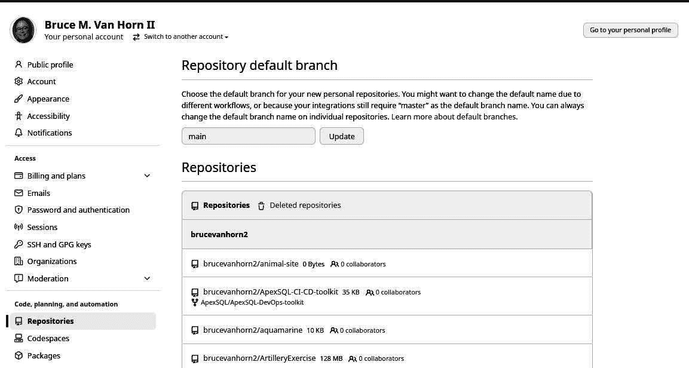

图 5.1：您可以将 GitHub 仓库的默认名称设置为与您计算机上的默认名称匹配

您还可以使用以下命令在您的计算机上设置全局设置：

```py
git config --global init.defaultBranch main
```

如果你打算在 GitHub 上做很多工作，同步默认分支名称是一个好主意。如果你不这样做，当你第一次尝试将你在计算机上创建的仓库推送到 GitHub 上创建的远程仓库时，你会遇到错误。本地的默认分支是*master*，而远程的默认分支是*main*。远程不会有名为*master*的分支，所以你会收到一条消息，说明没有名为*master*的上游分支。你可能需要做一些工作来解决这个问题。如果你遇到这种情况，我会留一个链接到一篇文章，告诉你如何解决这个问题。我鼓励你通过使用前面的 Git 命令将你的本地全局设置设置为*main*来避免这个问题，这样它就会与 GitHub 匹配。

## 手动初始化仓库

让我们创建我们的仓库。在你创建了一个代码项目之后创建一个仓库是完全可能的，甚至可以说是正常的。然而，我们将从仓库开始，因为这将会是一个非常简单的演示。要创建一个新的 Git 仓库，或者简称为 repo，请输入以下命令：

```py
git init
```

这很简单！看起来好像没有发生什么。你会收到一个消息，说明仓库已创建。让我们看看文件夹的变化：

```py
ls -a
```

`ls`命令列出所有文件。`-a`选项显示隐藏的文件和文件夹。当你初始化 Git 仓库时，Git 软件创建了一个名为`.git`的文件夹。由于文件夹名以点（`.`）开头，所以在类似 Linux 的系统中的文件夹是隐藏的。如果你在 Windows 上使用 PowerShell 执行这些步骤，你将能够看到文件夹，但在其他操作系统中它是隐藏的。

`.git`文件夹是存储所有你的修订和项目设置的地方。一般来说，你不需要修改这个文件夹的内容。

我们在我们的本地计算机上有一个仓库。让我们添加一个新文件。输入以下命令：

```py
echo "hello world" > test.txt
```

这创建了一个名为`test.txt`的新文件。在该文件中有一行`hello world`。这是一个多么好的开始，对吧？你可以通过输入以下命令来检查文件的内容：

```py
cat test.txt
```

谁需要集成开发环境（IDE），对吧？等等，不，别当真，我刚才那么说了。接下来的几个步骤的顺序很重要。过程如下：

1.  将文件添加到仓库中。你添加的文件是你自上次提交以来创建或修改的文件。我们还没有这样的文件。将你的文件添加到仓库也称为暂存文件。我们正在让仓库知道新文件和已更改的文件。你不应该总是将每个文件添加到你的项目中。有些文件你应该从仓库中排除。我们稍后会讨论这一点。

1.  提交您的文件。这将在您的本地计算机上创建代码的新版本。提交操作要求您包含一个注释，说明您所做的更改的性质。这是至关重要的！您应该努力编写您更改的简洁摘要，并且您应该像假设您最重要的客户有一天会阅读所有这些注释一样编写这些注释。这不是发泄您挫折的地方！请相信我。我见过项目在意外审计中失败，其中不友好或不适当的评论出现，工作关系被破坏。假设您所写的一切都将被全世界阅读和评判。

1.  从远程中心拉取更改。您总是在推送之前拉取。这允许您找到您的工作中可能存在的任何冲突，以及可能由项目中的另一位开发者推送的任何工作。这很重要！如果您在推送之前不拉取，可能会覆盖另一位开发者的修订版本！这当然不是灾难性的，因为所有修订版本都保存在仓库中。然而，这会让您作为其他开发者在明天的站立会议中感到非常尴尬，因为其他开发者可能不会因为您为团队增加了额外的工作而高兴！这很简单。只需记住在推送之前先拉取。即使您是唯一一个在项目上工作的人，也要养成这个习惯！

1.  假设没有冲突，将您的工作推送到远程中心。

您的修订版本现在可供团队中的其他人使用，并安全地存储在远程服务器上。让我们来回顾一下这个过程的命令。

首先，将您的新文件和更改的文件添加到 Git 中。记住，这也被称为**暂存**您的文件：

```py
git add test.txt
```

如果您的项目中有很多文件，可以使用以下方法一次性添加它们：

```py
git add .
```

在将最新的更改暂存后，您现在可以将它们提交到本地仓库。这将在您的计算机上创建项目的新版本。您需要包含一个总结您更改的注释：

```py
git commit -m "initialized repository and added test.txt which might be the best code in the world."
```

`-m` 开关是我们的注释，用双引号括起来。只需将其记住为**提交信息**，`-m` 开关很容易记住。当然，到本章结束时，您不需要记住所有这些命令行内容，因为您将有一个便捷的图形用户界面。

## 与远程服务器协同工作

您可以在本地计算机上完全处理一个项目。自然地，您会失去由远程中心提供的所有协作优势，包括更改历史记录的远程备份优势。之前，我介绍了一个四步过程：

1.  添加或暂存您的更改文件。

1.  将您的更改提交以创建一个新的修订版本。

1.  从远程服务器拉取更改。

1.  将合并后的工作推送到远程服务器。

我们已经完成了列表的前两步，在我们的本地仓库副本上完成了。我们必须在此处中断流程，因为我们目前没有远程服务器。我们将在 GitHub 上创建一个，但当然，您可以使用任何兼容的服务。

## 在 GitHub 上添加远程服务器

登录 GitHub 并找到**添加仓库**按钮。它通常是一个非常明显的绿色按钮。以我的运气，他们会在出版时重新设计网站。不过，他们通常会在用户界面(UI)上非常明显地放置**创建仓库**按钮。

让我们创建一个与本地创建的仓库相匹配的仓库。我会将其设置为公开，这意味着每个人都可以看到它。如果你比较害羞，你可以将其设置为私有。对于这个练习来说，这不会有什么影响。

一旦你创建了仓库，GitHub 将显示如何将 GitHub 版本的仓库添加为远程仓库的说明。只需将 GitHub 生成的代码复制并粘贴到你的终端中，确保你的终端当前位于仓库文件夹中，作为当前工作目录。

你可以通过输入以下内容来验证远程仓库：

```py
git remote -a
```

GitHub 生成的命令将仓库的 GitHub 副本名称设置为*origin*。你应该有一个名为*origin*的远程仓库，而本地仓库的版本则通过当前分支来引用，通常如前所述是*main*。

## 第一次推送

现在你有了远程仓库，你可以将你的本地仓库推送到远程。输入以下内容：

```py
git push origin main -u
```

这会将你的主分支副本推送到远程，并为主分支设置上游跟踪。这仅仅是一个花哨的说法，意思是远程和本地仓库都知道主分支，任何推送到这里的更改都将导致远程主分支被更新。如果远程没有名为`main`的分支，将会创建一个，并且所有内容都将同步得很好。

## 创建、提交和推送更改

现在我们已经有一个完全工作的仓库，包括 GitHub 上的远程仓库，让我们对我们的代码进行一次完整的更改。这次我们将不中断地介绍四个步骤的过程。这是你将在项目期间每天多次遵循的过程。

下一步非常重要。养成这个习惯！

```py
git pull
```

这会拉取远程上的任何更改，并允许你在它们进入世界之前解决任何冲突！当然，在这种情况下，由于只有我们在这个项目上工作，所以自然不会有任何冲突。

接下来，让我们更改文本文件的内容。输入以下内容：

```py
echo "this is the best code in the world" > test.txt
```

你可以使用以下方法来检查结果：

```py
cat test.txt
```

你应该能看到更改后的文件。现在让我们进行一次完整的添加、提交、拉取和推送循环。逐行输入以下内容，每输入一行后按*Enter*键：

```py
git add test.txt
git commit -m "changed the text in test.txt"
git pull
git push origin main
```

切换到你在其中创建了仓库的浏览器，并刷新页面。你应该能看到你的代码。你可以在浏览器中点击`test.txt`文件来验证新内容是否已推送。你也应该看到有两个版本。

你的仓库已正确设置并运行！让我们将我们的注意力从命令行转移到在 IDE 中工作。

# 在 IDE 中使用 Git

我们已经介绍了 PyCharm 中的一些 Git 工作流程。在*第二章*“安装和配置”中，我们使用 PyCharm 克隆了本书的示例代码仓库。由于我们已经介绍了克隆，我们不会再次进行操作。相反，让我们考虑我们刚才手动做的一切：

1.  我们使用`git init`初始化一个新的本地仓库。

1.  我们对代码进行了更改。

1.  我们使用`git add`将更改添加为待提交的文件，以准备提交。

1.  我们已将更改提交到本地仓库。

1.  我们从远程拉取，以确保我们在这个分支上有最新的代码，并且我们的工作副本和远程之间的代码不存在冲突。远程可能由于其他开发者推送了他们的更改而最近发生了变化。

1.  最后，我们将更改推送到远程。

此列表代表了在项目中捕获和管理修订的最基本工作流程。我们可以在 PyCharm 的 GUI 中完成所有这些以及更多。在 PyCharm 中做一些工作，在命令行中做一些工作也是相当常见的。使用一个或另一个不会排除任何事情。例如，我经常在命令行中分支和合并，因为这对我来说既快又简单。如果有冲突，我发现使用 PyCharm 手动解决它比手动方法更优越。这个任务的 GUI 非常出色。我们将在适当的时候讨论所有这些。现在，打开你在 PyCharm 中使用的文件夹，让我们探索 IDE 能为我们手动采取的这些第一步做些什么。

# PyCharm 中的版本控制

PyCharm 在 UI 中有几个地方允许您访问您的 VCS，对我们来说就是 Git。它们不是重复的，而是每个区域都为特定任务提供了一个视觉工具。第一个是主菜单，如*图 5.2*所示。

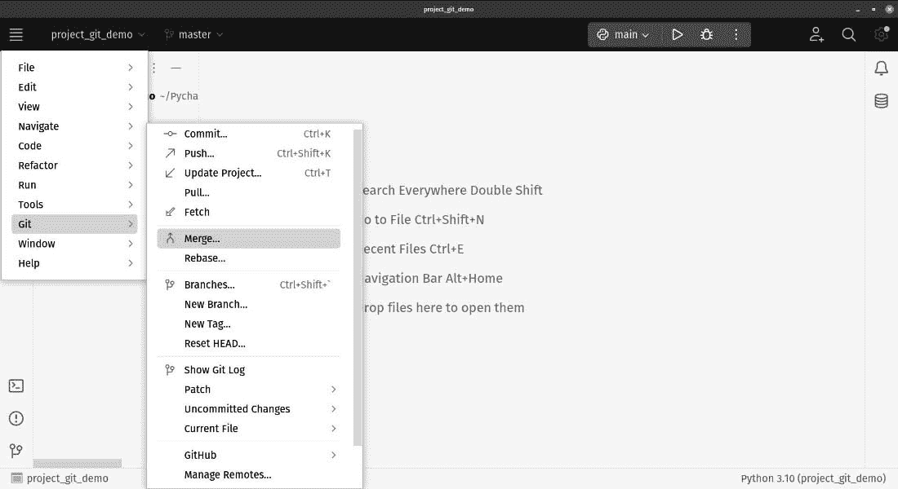

图 5.2：Git 菜单允许您访问您通常在命令行中使用的所有命令

第二个提供了快速且简单的方式来提交文件。这可以在侧边栏菜单中找到，如*图 5.3*所示：

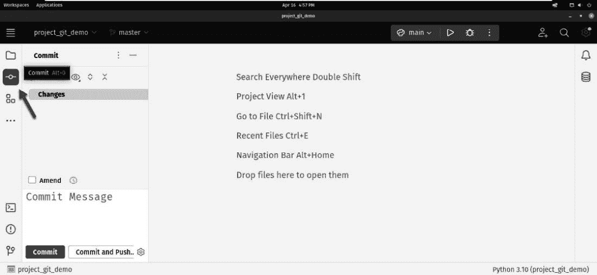

图 5.3：Git 提交工具可以在侧边栏中找到

第三个允许可视化分支和提交历史。这可以在屏幕底部的工具窗口中找到。屏幕的这一部分可以折叠，但工具窗口选择器始终在侧边栏的底部可用，如*图 5.4*所示。

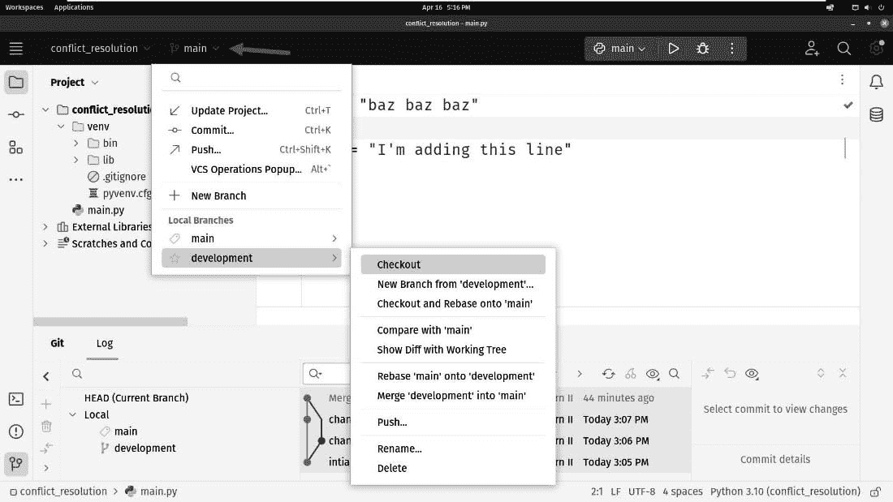

图 5.4：点击 Git 工具窗口将打开一个窗口，显示提交历史，以及所有分支

第四个位于主菜单旁边的顶部工具栏上。这个区域显示你当前正在工作的分支，并允许轻松管理分支。你可以在 *图 5*.* 中看到这一点。

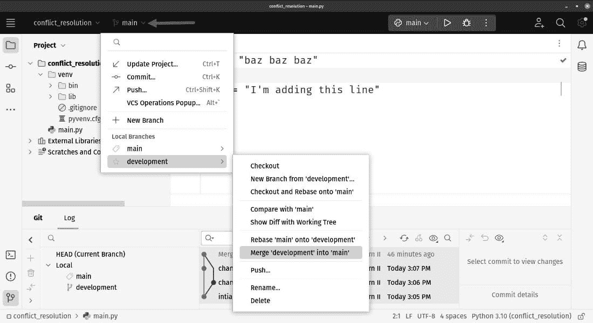

图 5.5：当前分支显示在主菜单附近。点击此处可以访问一些命令。

第五个是 VCS 操作弹出窗口，如图 *图 5*.* 所示。这已经存在一段时间了，尽管它还在那里，但我认为它已经过时了。你可以使用 *Ctrl* + *`* 来访问弹出窗口。请注意，这不是引号。`` ` `` 键，称为压痕标记，位于美国键盘布局中 *1*（一个）键的左侧。

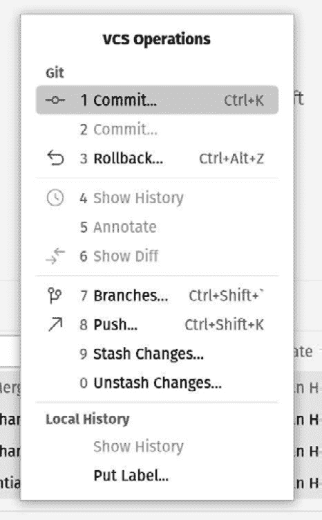

图 5.6：使用 Ctrl/Cmd + ` 激活 VCS 操作弹出窗口。

最后，你可以在编辑器窗口或编辑器窗口中的标签上右键单击以访问主菜单中找到的相同 Git 菜单，如图 *图 5*.* 所示。

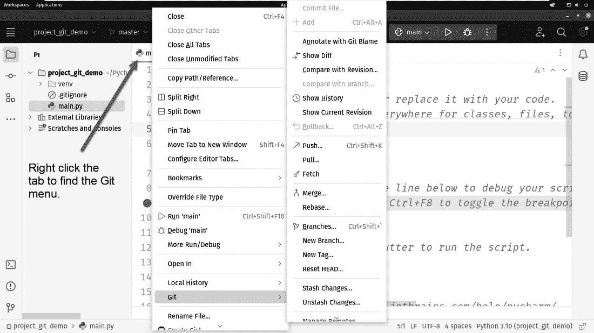

图 5.7：你可以在编辑器窗口或标签上右键单击以查看 Git 菜单。

如你所见，修订控制工具已经以有组织和智能的方式巧妙地编织到 IDE 中。由于我们打开了一个已经包含 Git 仓库的文件夹，PyCharm 简单地识别这一事实并呈现界面。当你打开一个文件夹或创建一个没有 GitHub 仓库的项目时，大部分工具仍然可见，但它不会是 Git 特定的。由于 PyCharm 支持许多 VCS，尚未使用 Git 或任何其他 VCS 初始化的项目将呈现通用的工具，直到初始化完成。

# 使用 PyCharm 中的 VCS 工具从头创建新项目。

让我们创建一个新的项目。这个项目的代码在书的仓库中，但你真的不想只打开那个副本，因为它已经与一个仓库相关联，你将看不到我即将展示的所有内容。为此练习，你应该从头开始创建一个新的项目，就像我即将做的那样。

点击应用程序左上角的三明治图标以激活主菜单，然后点击 `project_git_demo`。我将保留其他所有默认设置。你可以在 *图 5*.* 中看到我的项目创建对话框。

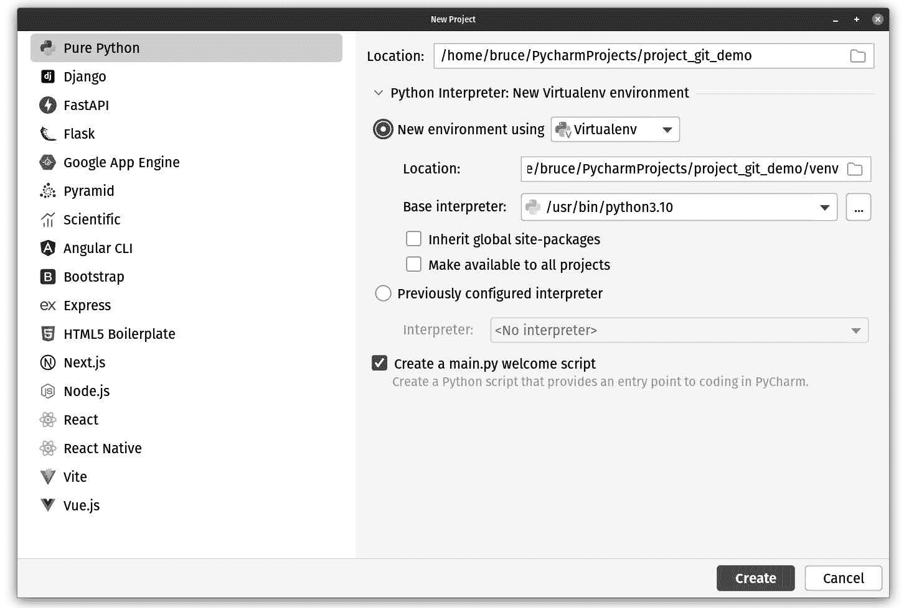

图 5.8：我的演示项目设置。

现在我们有一个可以工作的项目。

## 初始化本地 Git 仓库。

在我的项目创建后，我需要初始化一个 Git 仓库。手动操作时，我们使用 `git init` 命令来完成。在 PyCharm 中，我们可以使用主菜单的 **VCS** 选项。目前，它显示为 **VCS**，因为我们还没有使用任何 VCS 初始化仓库，所以 UI 中的术语是通用的。如 *图 5.9* 所示，我们有 Mercurial、Git、GitHub、Perforce 和 Subversion 的版本控制选项。还有一个新的选项，用于在 JetBrains 的新协作产品 Space 中共享项目，Space 包含 Git 托管服务。随着 Space 产品的不断发展，您可以在所有 IDE 中期待看到越来越多的集成。我将点击 *图 5.9* 中所示的 **创建 Git 仓库…**。

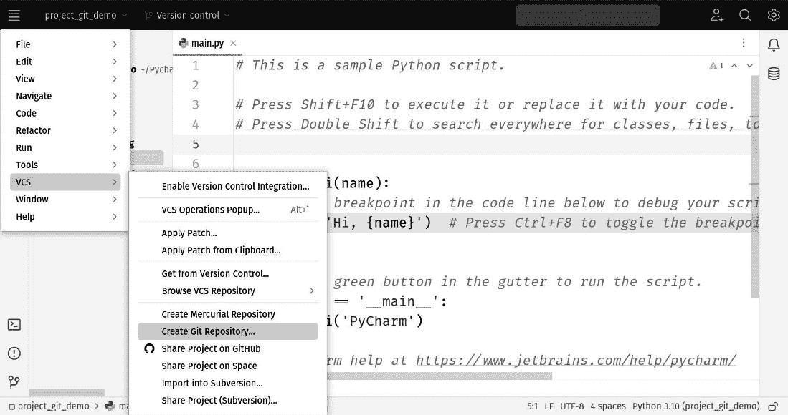

图 5.9：从 PyCharm VCS 菜单创建 Git 仓库

如 *图 5.10* 所示，您接下来会被提示选择您想要创建仓库的文件夹。默认情况下是当前文件夹，这是正确的。

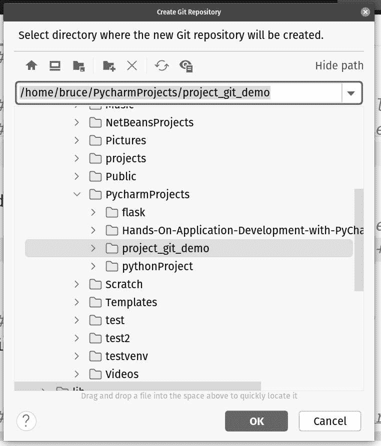

图 5.10：选择您想要创建 Git 仓库的文件夹

点击 **确定** 按钮将在所选文件夹中创建仓库。您可以通过检查默认分支（master）是否出现在顶部工具栏的下拉菜单中，其中包含一些 Git 操作来验证是否成功。现在我们已经初始化了一个 Git 仓库，菜单不再使用 **VCS** 这个术语，而是列出专门针对 Git 的选项。

## 在 GitHub 上添加远程仓库

PyCharm 中没有创建远程仓库的工具。您需要登录到 GitHub，并像之前一样创建一个仓库。*图 5.11* 展示了我在我个人账户中设置远程仓库的过程。请注意，这与书中仓库是不同的，书中仓库的目的是存放所有代码，而不是作为创建仓库的演示。

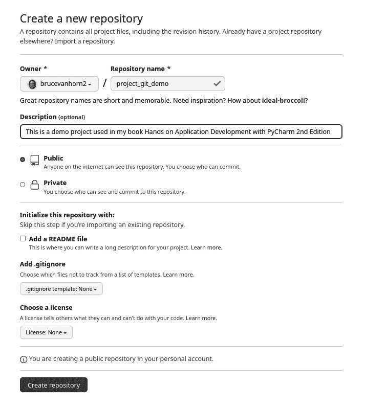

图 5.11：我的远程设置

注意，这里只设置了最基本的内容。没有 `.gitignore` 文件，没有 README 文件等等。我将在 PyCharm 中添加所有这些。当我点击 **创建仓库** 按钮时，GitHub 会生成我需要用于添加远程仓库的 URL。我在 *图 5.12* 中指出了这一点。

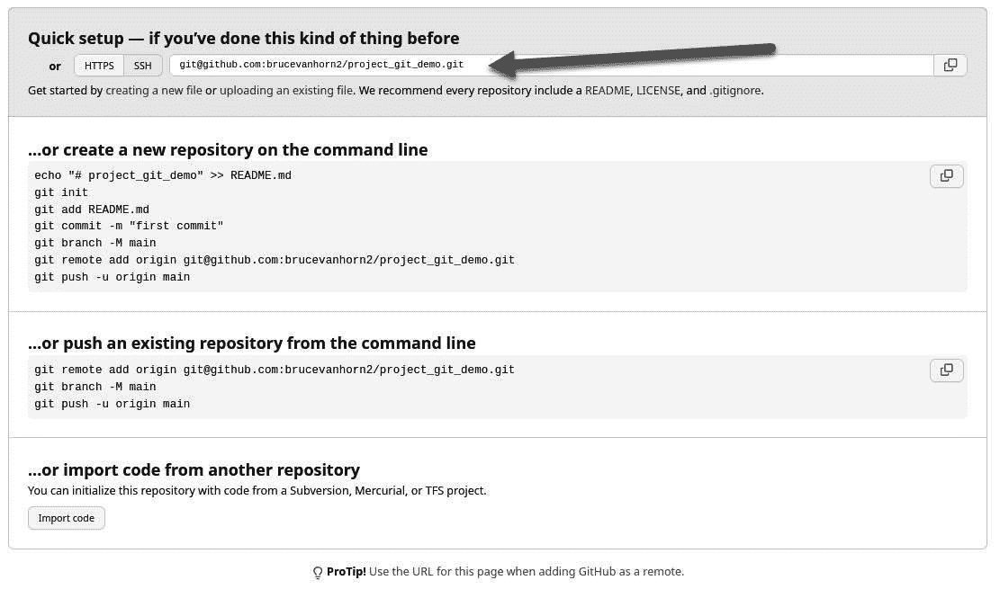

图 5.12：您需要远程仓库的 URL 才能将其添加到本地仓库

接下来，切换回 PyCharm 并在主菜单中找到 **git** 菜单。记住，一分钟前，菜单显示为 **VCS**，因为我们还没有定义仓库，但现在它显示为 **git**。

在 **git** 菜单中，您会找到一个名为 **管理远程** 的选项。点击它，您将看到一个模态对话框，如 *图 5.13* 所示，它允许您添加您刚刚在 GitHub 上创建的远程。

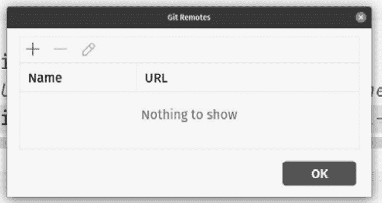

图 5.13：Git 远程对话框允许您添加您在 GitHub 上创建的远程

点击 **+** 按钮添加远程。您会在上面再看到一个对话框，如 *图 5.14* 所示。

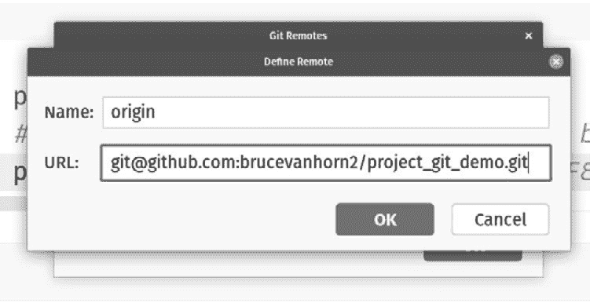

图 5.14：添加您从 GitHub 页面复制的 URL

点击 `main.py` 文件是红色的。您只需相信我。它是红色的，因为它是一个未跟踪的文件。我们需要将我们的文件添加到我们的仓库中，这样我们就可以跟踪它们。

## 添加项目文件

设置项目和远程通常只在项目期间进行一次。如果您是加入一个现有的团队，它可能是在您加入之前很久就完成了。然而，接下来的这一系列操作是您将每天都会使用的。

当您正在处理对项目的更改时，您会发现 **提交** 窗口非常有用。如果您忘记了如何定位 **提交** 窗口，请参考 *图 5.3*。

## 添加 .gitignore 文件

如果您不熟悉，`.gitignore` 文件定义了您不想包含在您的仓库中的文件和文件夹。作为一个一般规则，任何可以从您的代码生成的文件都不需要包含在您的仓库中。当与 Python 项目一起工作时，您不想在您的仓库中的东西可能包括以下列表：

+   `venv` 文件夹，因为这个文件夹是通过运行 `pip` 生成的

+   Python 缓存文件夹（您会看到它们作为 `__pycache__` 文件夹）

+   字节编译的 DLL 文件

+   C 扩展

+   从发行和打包中构建文件

+   PyInstaller 清单

+   应用程序日志文件

+   测试覆盖率报告

这绝对不是一份详尽的列表。列表将真正取决于您正在构建的应用程序类型以及项目运行期间确切生成的内容。关于 `.gitignore` 文件的内容有很多建议。GitHub 在一个 gist 中有一个这样的列表。您可以在 [`githubgitm/github/gigitnore/blgitmain/Python.gitignore`](https://githubgitm/github/gigitnore/blgitmain/Python.gitignore) 获取此文件。它也是本书 Git 仓库中的 `.gitignore` 文件。如果您愿意，可以使用这个 `.gitignore` 文件，但为了保持简短和简单，我只是在我们将要创建的 `.gitignore` 文件中包含了一些条目。

切换回文件视图，如 *图 5.15* 所示。您可以通过点击文件夹图标（`project_git_demo` 项目标题（`.gitignore`。这里不允许有创意。它必须称为 `.gitignore`，全部小写。

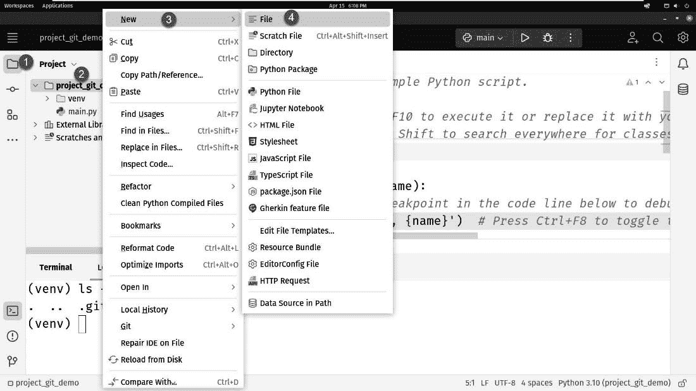

图 5.15：切换回文件视图，创建一个名为 .gitignore 的新文件

当你创建新文件时，PyCharm 会提示你将文件添加到 Git，如图 *图 5**.16* 所示。如果你想将新文件添加为默认，你可以点击 **不再询问** 复选框，你创建的所有文件都将自动添加到 GitHub。

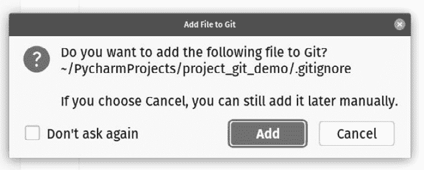

图 5.16：每次你在 PyCharm 中创建文件时，都会提示你将其添加到存储库

无论你对复选框做什么，`.gitignore` 文件在项目资源管理器中显示为绿色，因为它已被添加，而且还没有任何变化。在 `.gitignore` 文件中，添加以下行：

```py
venv
__pycache__
```

这将排除整个 `venv` 文件夹和 Python 生成的任何缓存文件夹。PyCharm 在我们保存文件时保存文件，所以让我们将这个文件和 `main.py` 文件添加到存储库中。切换到 **提交** 窗口，你会看到类似 *图 5**.17* 的内容。

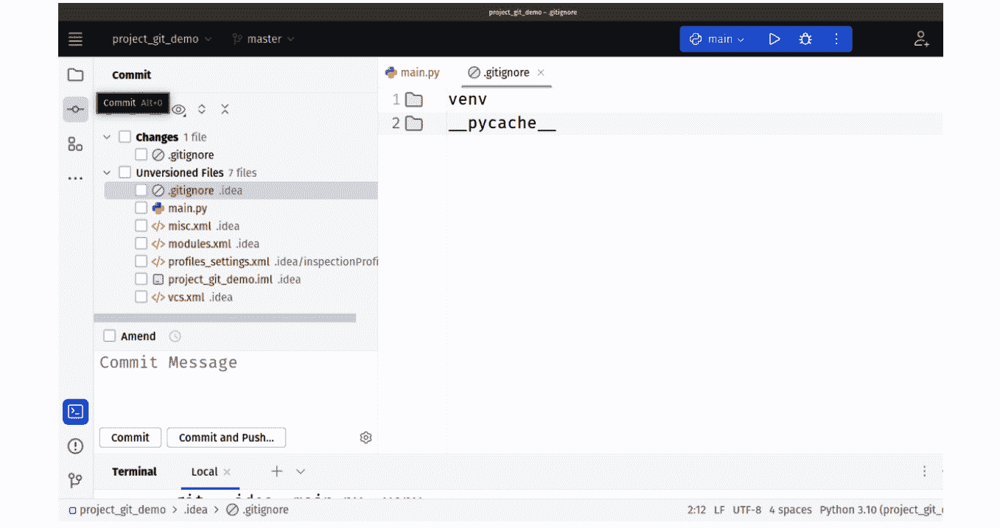

图 5.17：添加我们的 .gitignore 文件后的提交窗口

哇！这一切都是从哪里来的？我们只是添加了一个文件！正如你所见，`.gitignore` 文件是在我们创建文件时看到的对话框的响应下添加的。项目中唯一的其他代码文件是我们创建项目时 PyCharm 生成的 `main.py` 文件。那么其他文件呢？为什么在未版本化的文件列表中列出了第二个 `.gitignore` 文件？

这些都来自 PyCharm 创建的 `.idea` 文件夹。关于这个文件夹是否应该归入源控制，有一些争议。JetBrains 在他们的文档中有一个页面，讨论了他们对这个问题的看法。[`intellij-support.jetbrains.com/hc/en-us/articles/206544839`](https://intellij-support.jetbrains.com/hc/en-us/articles/206544839)。总结本文，JetBrains 建议存储与项目相关的 `.idea` 文件夹内容，但不包括包含用户特定设置的任何文件，以下是一些例子：

+   `workspace.xml`

+   `usage.statistics.xml`

+   `shelf` 目录中的任何内容

本文旨在涵盖所有 `.gitignore` 文件。我们还没有提交任何内容，所以将这些行添加到你的 `.gitignore` 文件中：

```py
.idea/workspace.xml
.idea/usage.statistics.xml
.idea/shelf
```

让我们检查所有复选框，以便添加所有这些文件，如图 *图 5**.18* 所示。

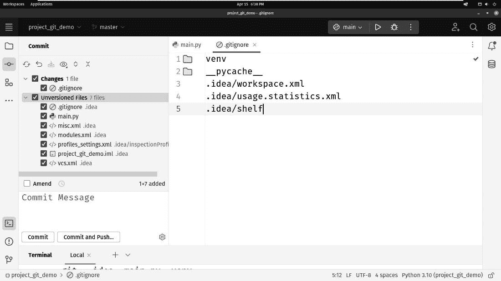

图 5.18：所有文件都已添加，我们准备提交

在框中添加提交信息。你可以点击**提交**按钮将更改提交到本地仓库，或者点击**提交并推送…**将更改直接发送到 GitHub。一般来说，除非你完全确定自上次推送以来没有人推送过更改，否则不应使用**提交并推送…**按钮。由于我们从未推送过，所以这可能是安全的；然而，我将点击**提交**按钮来演示之前安排好的整个过程。你添加更改，提交，拉取，然后推送。到目前为止，我们已经添加了更改，现在正在提交。

如果一切顺利，屏幕右下角会出现一个提示，说明你的文件已成功提交。如果你在手动练习期间没有设置全局用户名和电子邮件地址，系统将通过对话框提示你设置它们。

## 拉取和推送

现在第一个提交已经完成，我们可以进行过程的最后半部分。我们总是在推送之前拉取，以确保我们在当前分支上有最新的修订版。这给了我们机会解决自上次拉取以来可能出现的任何冲突。在 Git 中，我们使用的命令是`pull`。Git 工具中有一个`pull`选项，但在我们前往那里之前，我要指出另一个选项：**更新项目…**。这可以在工具栏的当前分支下拉菜单中找到，如*图 5.19*所示。

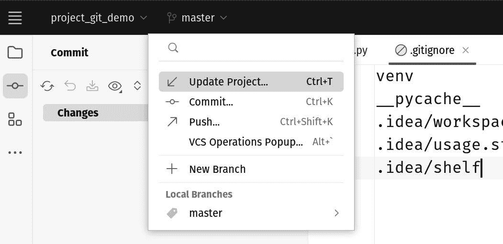

图 5.19："更新项目… "命令实际上不是一个 Git 命令。它指的是一个更新策略

当你点击**更新项目…**时，系统会要求你设置更新本地 Git 仓库的首选项。接下来的对话框中展示了两种可能性，如*图 5.20*所示。

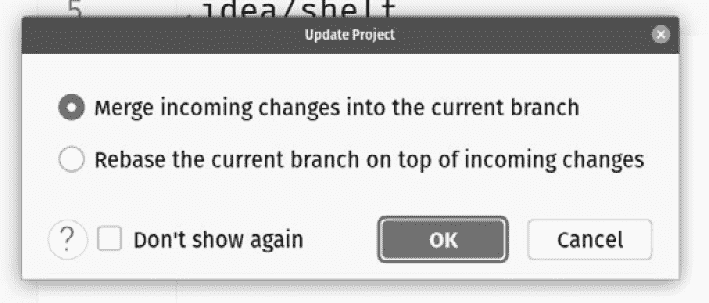

图 5.20：你可以从两种更新策略中选择

我们之前执行的`git pull`命令体现了第一种选项。拉取操作将从远程获取任何更改，并自动将这些更改合并到我们的本地副本中。`rebase`操作是一种不同的策略。它改变仓库的结构，以显示更清晰的更改时间线。我不会深入讨论使用哪种策略的争论，但如果你想要深入了解，我将在本章的*进一步阅读*部分包含一个链接。

个人而言，我更喜欢第一种选项，因为它更简单、更安全。我只需点击**确定**按钮。如果我不想在使用前被提示，可以点击**不再显示**复选框。PyCharm 将永远使用我现在做出的选择。

如果您在提交方面遇到问题，我并不是指一般意义上的，而是指在执行 `git commit` 时，您完全可以跳过这个对话框。只需使用 Git 菜单上的 **“拉取...”** 菜单项，如图 *图 5**.21* 所示。

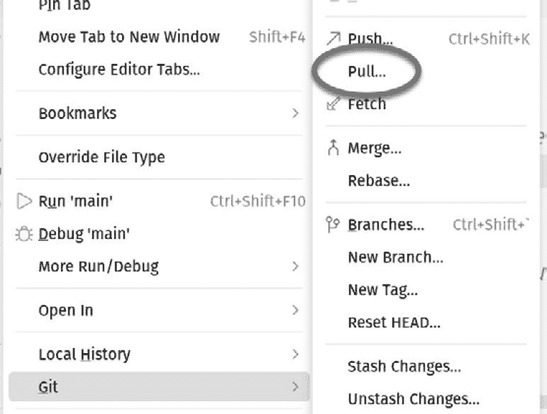

图 5.21：您可以从任何 Git 菜单中执行传统的 Git pull 操作

除了推送之外，没有其他事情可做。也许之前在 *图 5**.19* 中展示的快速方法已经显示了，在那里我们遇到了 **“更新项目...”** 命令。

## 分支和合并

我们已经讨论了任何版本控制系统最基本的功能，这些功能通过跟踪随时间推移的修订版来保护项目的代码。另一组非常重要的功能包括将项目工作分割成几个副本。这种做法被称为 **“分支”**。分支有许多好处；我无法在这里全部涵盖。如果您想了解更多关于 Git 的版本控制细节，请参阅本章 *“进一步阅读”* 部分中列出的 Packt 书籍 *《程序员 Git》*。然而，我将提供我认为最重要的好处。

考虑一个典型的网络初创公司，它经历了一个从创建仓库到迭代开发至首次发布的周期。该发布版本位于云中的某个生产服务器上，并且客户已经开始使用该应用程序。初创公司不仅希望通过添加额外功能来增强其产品，而且还会遇到需要修复的 bug 和问题。让我们假设开发和质量保证团队的工作非常出色，以至于发布版本中几乎没有任何 bug。公司对自己感到满意，想要开始添加新功能。所有工作都在主分支上进行，因为这是唯一存在的分支。为了添加新功能，我们需要在代码深处进行一些更改。一旦开始更改，可能需要一周时间才能完成，在这段时间里，产品的开发版本非常不稳定。

突然，现实降临。除非软件是由独角兽或 Chuck Norris 编写的，否则几乎不可能有一个没有错误的软件发布。让我们假设这不仅仅是一个错误。这是一个严重的错误。比如有人忘记在 SQL 语句中添加 `WHERE customer_id=@customerId`，您的应用程序错误地向所有客户显示所有客户数据。这是一个职业生涯的终结！我见过这种情况，它并不好看。您需要立即修复它！但是，如果没有撤销可能使应用程序不稳定的所有更改，您就无法修复。这是一个选择。另一个选择是，您可以回滚到您发布的代码，然后实施修复并保住您的职业生涯。然后，您将花费大量时间尝试挑选提交以挽救您的功能工作。您还可以选择使用 Dvorak 布局和完全空白的键盘在记事本中编写所有代码。您可以做到，但这不会是您时间的高效利用。

这就是分支发挥作用的地方。启动阶段可以在主分支上完成所有工作。他们不应该这样做，但让我们将故事限制在我们目前所拥有的内容。一旦软件发布，他们可以创建一个新的分支，也许会称之为 *development-branch*。名称并不重要。分支操作创建了已发布内容的副本。正是在这个分支上，我们勇敢的开发团队开始进行可能使开发版本不稳定的变化。

咔嚓！坏事情发生了。您可以从 *development-branch* 切换回 *main*。现在您有了发布时的代码，您可以修复问题。修复到位后，您可以将修复合并到您的开发分支，并在 *development-branch* 上继续工作不稳定的应用程序。保持工作分离，让您可以独立于紧急错误修复工作在新功能上工作。

我在图中过分简化了大多数团队使用的典型分支策略。我更愿意将这一主题的覆盖留给专门针对版本控制的著作。我将在本章的 *进一步阅读* 部分留下关于分支策略的建议。让我们继续讨论与分支一起工作的机制。这对您日常的软件开发实践至关重要。

## 创建分支

创建一个新的分支非常简单。点击顶部菜单栏上的分支菜单，然后点击 **新分支**。您将看到 *图 5.22* 中所示的对话框。

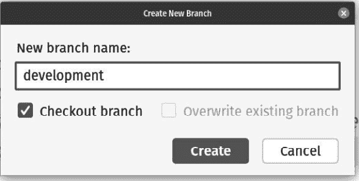

图 5.22：创建新分支对话框允许您创建一个新的 Git 分支

为您的新分支输入一个名称。分支在本地创建，并且您将自动切换到新分支。

## 在分支之间切换

这也很简单。回到分支菜单。本地分支列在分支下拉菜单中，如图 *图 5.23* 所示。

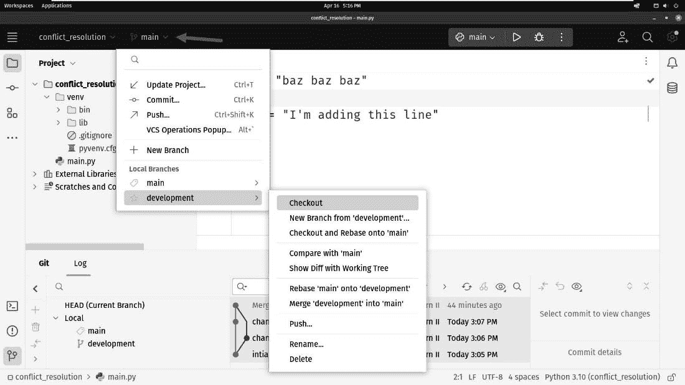

图 5.23：本地分支列在分支菜单中

切换到不同的分支只需从列表中选择所需的分支，然后点击 **检出**。如您所见，您还可以在分支上执行其他操作。

## 合并

当您准备好将分支合并回主分支或其他任何分支时，只需切换到该分支，然后在分支菜单中使用 **合并** 命令，如图 *图 5**.24* 所示。

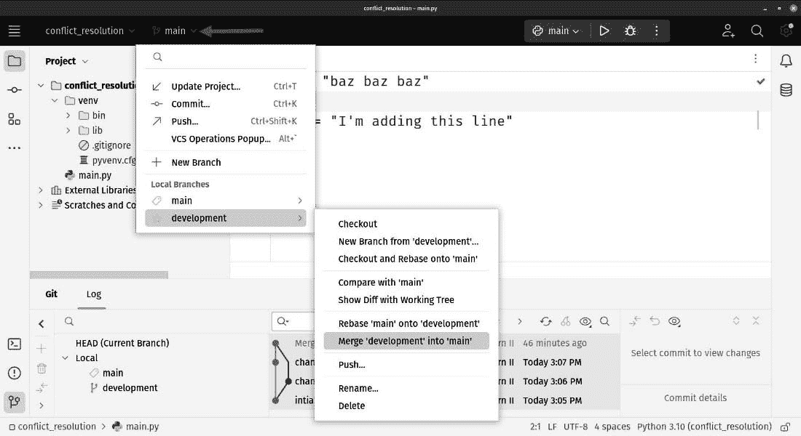

图 5.24：合并命令可以在分支菜单中找到

如 *图 5**.24* 所示的 **合并** 对话框，将允许您选择要合并到当前选中分支的分支。

如果您需要比标准合并操作更复杂的功能，有一个 **修改选项** 下拉菜单，允许您执行在手动合并过程中通常使用的几个命令行开关的等效操作。

## 查看分支图

工具窗口中的 Git 工具提供了您仓库中各种分支的图形视图。您可以在 *图 5**.25* 中看到它。当您需要查看仓库中最近发生了什么更改时，这可能很有用。这是您可能早上第一件事就会做的事情，以便您可以审查过去 24 小时内团队所做的更改。

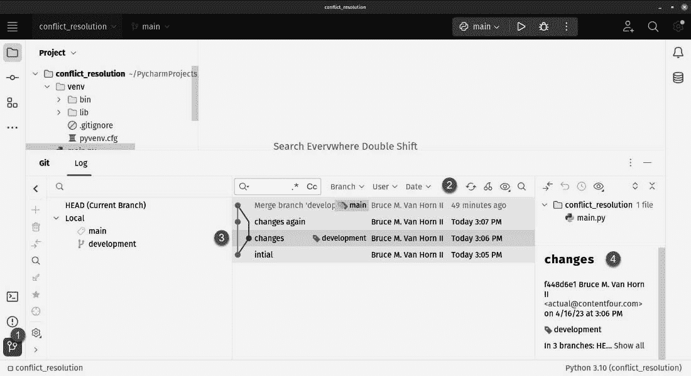

图 5.25：通过点击 PyCharm 窗口左下角的工具栏可以激活 Git 工具

要激活它，请点击工具窗口中的 Git 图标（**1**）。您可以使用工具栏上的各种工具搜索修订历史记录并对其进行过滤（**2**）。选择一个提交（**3**）允许您查看该提交的详细信息（**4**）以及提交信息。

# 差异和冲突解决

总有一天，您在推送更改之前执行拉取操作，会发现存在冲突。即使对于经验丰富的开发者来说，这也可能令人畏惧和压力重重，因为您冒着破坏他人最近贡献的风险。尽管如此，这种情况总会发生，您需要一种处理问题的方法。这让我们想到了 PyCharm 中我最喜欢的功能之一。在 *第一章*，“PyCharm 简介——最受欢迎的 Python IDE”，我向您讲述了我在微软调试器方面的经验。在我职业生涯的早期就体验过它，对我来说，其他任何东西都无法替代。我对 PyCharm 的合并工具也有同样的敬意。在其他任何地方解决冲突合并都感觉痛苦。

项目中只有一个文件。到现在为止，您会认出它是 PyCharm 为新项目生成的 `main.py` 文件。我们将通过以下步骤生成冲突：

1.  在 PyCharm 中创建一个新的项目。

1.  将 `main.py` 文件的内容更改为单行代码以确保我们生成冲突。

1.  在项目文件夹中初始化 Git 仓库。

1.  添加并提交所有项目文件。

1.  创建一个名为 *development* 的新分支。

1.  修改显示 *Hello* *World* 消息的代码行。

1.  将更改提交到分支。

1.  切换回主分支。

1.  对这一行代码进行不同的更改。

1.  提交更改。

1.  现在尝试将 development 分支合并到主分支。

这 11 个步骤的结果将是一个冲突。让我们来解决它！

首先，在 PyCharm 中创建一个名为 `conflict_resolution` 的新项目，如图 5.26 所示。确保你在驱动器上创建项目时，位置不在书籍仓库的文件夹结构内。记住，书籍的代码已经在仓库中了。你无法在另一个仓库内创建新的仓库。

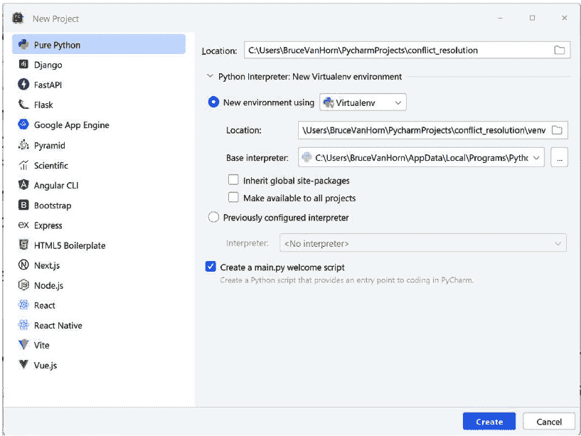

图 5.26：我的 conflict_resolution 项目设置。它们只是默认值

PyCharm 生成一个包含 `main.py` 文件的项目。删除 `main.py` 中的所有行，并用以下代码替换它们：

```py
foo = "foo"
```

为了确保清晰，你的 PyCharm 窗口应该看起来就像图 5.27 中的我的窗口一样。

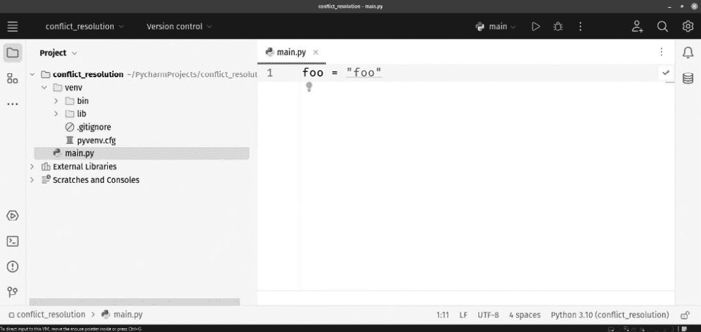

图 5.27：main.py 文件已被缩减为一行代码

在 **文件** 菜单中点击 **VCS** 菜单，然后点击 **创建 Git 仓库**。如果你不记得在哪里找到这个菜单项，请参考图 5.9。注意创建的默认分支。对于这个练习，我们不需要远程仓库，所以它是否是 *main*、*master* 或其他都无关紧要；你只需要记住它的名字。我将假设它被称为 *main*。

使用提交窗口将项目文件添加到仓库中。图 5.3 将提醒你如何操作。输入提交信息，继续提交文件。

接下来，我们需要创建一个分支。点击分支下拉菜单，然后点击 `development`。

打开 `main.py` 文件。将代码替换为这一行：

```py
foo = "bar"
```

通过限制自己只做一行操作，我们可以确保我们的操作将导致冲突。将此更改提交到 `development` 分支。

使用分支下拉菜单切换回主分支。将 `main.py` 的内容更改为以下代码：

```py
foo = "baz baz baz"
```

将此更改提交到主分支。你刚刚模拟了两个开发者在同一区域更改同一文件的情况。Git 将无法解决这些差异。当主分支处于活动状态时，点击分支下拉菜单，点击 development 分支，然后点击 **将 development 合并到 main**。你将看到一个冲突消息，如图 5.28 所示。

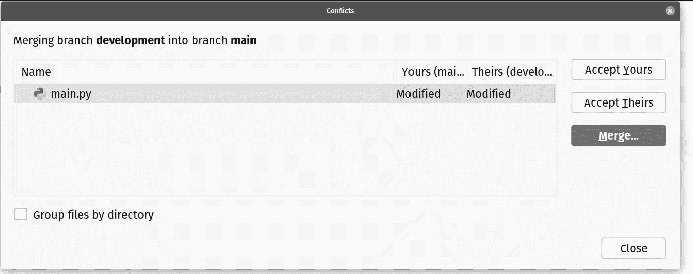

图 5.28：在我们合并之前，有一个冲突需要解决

在解决冲突时，你通常有三个选项。你可以选择忽略接收到的更改，并通过点击**接受你的**按钮将你的本地工作作为正确代码。同样，你可以选择接收代码更改并丢弃你的本地副本，通过点击**接受他们的**。然而，通常你需要将你的本地修订的一部分与接收到的更改合并。为此，你需要激活合并工具，如*图 5**.29*所示，通过点击**合并…**按钮。

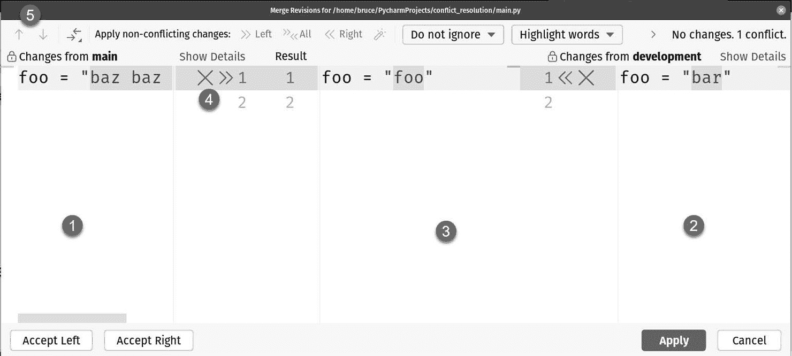

图 5.29：激活合并工具以从接收到的代码中选择部分与你的代码合并

当合并工具处于激活状态时，你可以看到三个面板。左侧的面板（**1**）表示来自主分支的冲突代码。右侧的代码（**2**）是来自开发分支的修订。中间的面板（**3**）表示两者的合并。你可以选择你代码的一部分和接收代码的一部分，以制作出最佳组合。通过实验**>>**按钮（**4**），可以将代码复制到中央合并结果中。标有**X**（**4**）的按钮将忽略冲突的行。你可以使用上下箭头（**5**）跳转到文件中的下一个未解决冲突。

让我们假设解决我的冲突的最佳方案是将左侧面板和右侧面板的行放在一起。在现实生活中，这不会起作用，因为我们最终会在相邻的位置得到两个变量赋值，但这确实展示了工具的工作方式。要使用左侧面板的行，我可以点击*图 5**.30*中箭头指示的按钮。

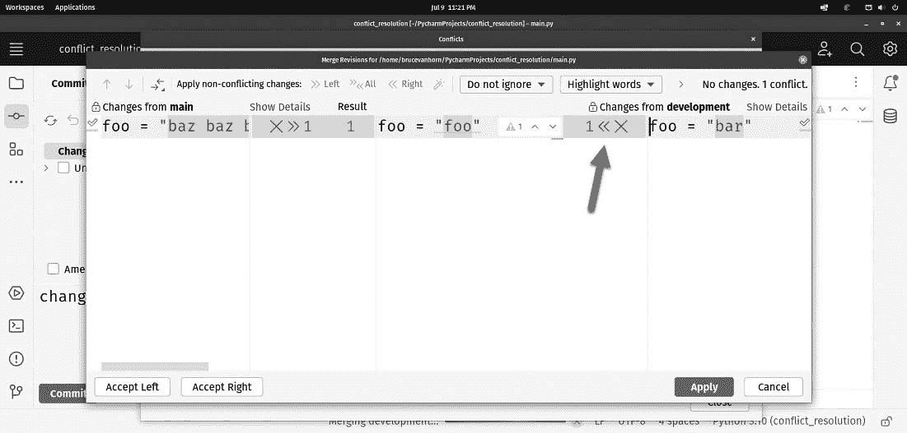

图 5.30：此按钮将代码从左侧面板移动到工作合并解决方案中

接下来，我想将右侧面板的行放在我刚刚移动的行下方。通常，你希望使用来自两边的代码，而不仅仅是单方面的对或错。点击*图 5**.31*中箭头指示的按钮，将代码从左侧面板复制到中间面板当前行的下方。

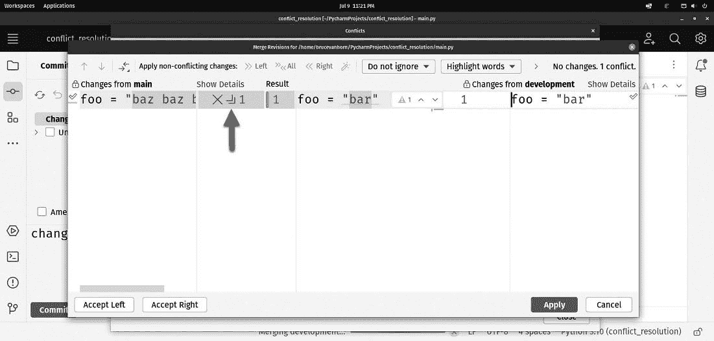

图 5.31：点击双箭头将此行复制到我们从右侧选择的行下方

一旦完成此操作，你就解决了冲突！你会得到一条漂亮的绿色消息告诉你这一点。

您的目标是使用左侧和右侧的窗格创建中间窗格中代码的最佳版本，这代表着冲突的解决。完成之后，您可以点击**应用**按钮。如果您在文件中还有未解决的冲突，PyCharm 会告诉您。如果您都解决了，您尝试的合并就完成了。如果您正在与远程仓库一起工作，一旦提交成功，您应该推送结果冲突解决方案。

## 查看差异

您不需要冲突就可以使用我们刚才看到的差异窗口。差异窗口是一个显示两个或多个代码版本的并排窗口。您可以在分支之间或修订之间进行差异比较。比如说，我通过添加这一行快速更改了我们的合并代码：

```py
text = "I'm adding this line"
```

我还删除了第 2 行，内容如下：

```py
foo = "bar"
```

我的代码现在非常不同。如果我想将我的新代码与分支中的最新版本进行比较，我可以右键单击`main.py`标签并点击**Git** | **显示差异**。我将看到两个文件的并排差异，如图*图 5.32*所示。

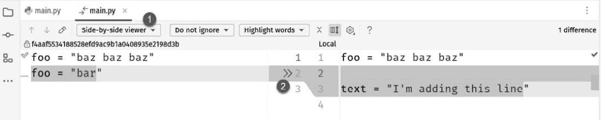

图 5.32：编辑器中的内容与最后提交版本之间的差异视图

这个差异现在以并排格式显示。您可以通过更改标记为（**1**）的下拉设置将其更改为内联视图，这在 GitHub 上查看提交时通常显示。您还可以使用您刚才在合并中看到的相同行移动工具编辑文件。（**2**）。

# 摘要

在本章中，我们涵盖了两个主要主题——应用开发和编程中版本控制的概念及其重要性，以及如何在 PyCharm 中使用 Git 和 GitHub 来实践它。具体来说，我们学习了如何以两种不同的方式使用 Git 和 GitHub 进行版本控制：手动和通过 PyCharm。

带着这些知识，PyCharm 用户可以以灵活的方式将版本控制应用于自己的项目，跳过终端/命令行中的手动和繁琐过程。我们看到，通过提供这些功能，PyCharm 允许我们在任何软件工程项目中专注于实际的开发过程。

除了版本控制之外，在应用开发中还有其他实践——PyCharm 提供了直观、直接的命令来简化这些过程。没有这些命令，应用开发可能会相当复杂和令人畏惧。这些过程包括测试、调试和性能分析，所有这些内容将在下一章中讨论。

# 问题

1.  术语*版本控制*在编程的上下文中具体指什么？

1.  使用版本控制有哪些好处？

1.  使用 Git 和 GitHub 对您自己的项目进行版本控制的基本步骤是什么？

1.  什么是*分支*，为什么它很重要？

1.  列出 PyCharm 中提供访问 Git 和其他 VCS 命令的各种窗口和工具位置。

# 进一步阅读

+   一定要查看本书的配套网站：[`www.pycharm-book.com`](https://www.pycharm-book.com).

+   *合并与* *变基*：[`www.atlassian.com/git/tutorials/merging-vs-rebasing`](https://www.atlassian.com/git/tutorials/merging-vs-rebasing)

+   如何 Secure Shell (SSH) 工作：[`en.wikipedia.org/wiki/Secure_Shell`](https://en.wikipedia.org/wiki/Secure_Shell)

+   *将新的 SSH 密钥添加到您的 GitHub* *账户*：[`docs.github.com/en/authentication/connecting-to-github-with-ssh/adding-a-new-ssh-key-to-your-github-account`](https://docs.github.com/en/authentication/connecting-to-github-with-ssh/adding-a-new-ssh-key-to-your-github-account)

+   *为什么 GitHub 将其 master 分支重命名为* *main*：[`www.theserverside.com/feature/Why-GitHub-renamed-its-master-branch-to-main`](https://www.theserverside.com/feature/Why-GitHub-renamed-its-master-branch-to-main)

+   *Git 合并策略选项和* *示例*：[`www.atlassian.com/git/tutorials/using-branches/merge-strategy`](https://www.atlassian.com/git/tutorials/using-branches/merge-strategy)

+   Git 分支指南：[`learn.microsoft.com/en-us/azure/devops/repos/git/git-branching-guidance`](https://learn.microsoft.com/en-us/azure/devops/repos/git/git-branching-guidance)

+   Git 初学者必备：[`www.packtpub.com/product/mastering-git/9781783553754`](https://www.packtpub.com/product/mastering-git/9781783553754)

+   Liberty, J. (2021). *程序员必备 Git：掌握 Git 以有效实施版本控制，适用于您的编程项目*. Packt Publishing Limited.

+   Narebski, J. (2016). *精通 Git*. Packt Publishing Ltd.

+   *《乔尔测试：提升代码质量的 12 步》*：[`www.joelonsoftware.com/2000/08/09/the-joel-test-12-steps-to-better-code/`](https://www.joelonsoftware.com/2000/08/09/the-joel-test-12-steps-to-better-code/)

+   一定要查看本书的配套网站：[`www.pycharm-book.com`](https://www.pycharm-book.com).
