# 第六章：无缝测试、调试和性能分析

在 *第五章*，“PyCharm 中使用 Git 进行版本控制”，我谈到了 *乔尔测试*。这个测试只是一个最佳实践的列表。列表的顶端是使用版本控制，这是上一章的主题。如果你查看了这个列表，你可能不会对测试也出现在列表上感到惊讶。形式化的软件测试实践，如 **测试驱动开发**（**TDD**）和 **行为驱动开发**（**BDD**），是软件质量控制的基础。使用这些方法有助于你创建在生产环境中不太可能失败的应用程序。如果做得正确，它还有附带的好处，例如防止范围蔓延，并允许在可能忽视了最佳实践和承担了大量技术债务的项目上进行有效的重构。

目前实践中存在多个测试级别，包括以下内容：

+   **单元测试**，旨在在函数或类级别测试基本低级功能

+   **集成测试**，旨在测试更大系统中组件之间的协作方式

+   **用户界面测试**，旨在测试系统交互元素的工作方式

+   **端到端测试**，在类似生产环境中对整个系统进行测试

就像所有成熟的编程语言一样，Python 拥有一套丰富的测试库。由于 Python 是“内置电池”，因此标准库中包含了一些优秀的测试工具。自然地，第三方解决方案已经发展起来，并通过 [PyPi.org](http://PyPi.org) 提供。

我在 Java 的 **JUnit** 库上磨炼了我的技能，后来又转向其 .NET 版本 **NUnit**。我发现这使得软件开发变得非常愉快。每天开始时，有一套无法通过的测试，然后整天编写代码让每个测试通过，这很有趣。如果你自律，你会编写所需的最少代码，随着你的测试工具颜色从红色变为绿色，你将逐渐看到进步。你不应该走捷径，也不应该被诱惑去编写看似酷炫但可能以后不需要的功能。当我多年前跳转到 Python 时，我很高兴看到关于测试库和框架的许多选项。我也同样高兴地看到 PyCharm 在 IDE 中支持大多数流行的工具。

在本章中，我们将探讨在遵循 TDD（测试驱动开发）原则的同时，在 Python 代码中创建单元测试。在 TDD 中，你通常创建一组旨在证明你的软件满足一系列要求的测试。这些测试在你创建程序中的任何功能之前编写，并且最初是失败的。你的任务是使用尽可能简单的代码使测试通过。

在这个过程中，你可能需要使用调试器逐步通过有问题的代码，这些代码要么无法解释地失败，或许更糟的是，无法解释地工作。一旦你的代码运行正常并通过测试，你通常想要考虑执行速度。大不列颠的**国家卫生服务**（**NHS**）开发了一个算法，将器官捐赠与系统中的患者匹配。这个复杂的算法必须快速，因为摘取的器官在移植前有一个有限的时间窗口是可行的。许多其他类型的应用程序也存在类似的时间限制。作为开发者，我们需要工具来帮助我们定位效率瓶颈。

本章将涵盖以下主题：

+   使用 PyCharm 在 Python 中进行单元测试

+   使用 PyCharm 强大的可视化调试器

+   使用 PyCharm 的性能分析工具来查找代码中的性能瓶颈

# 技术要求

以下为本章的先决条件：

+   安装好 Python 3.10 或更高版本

+   安装好 PyCharm

+   本章的示例代码，可在[`github.com/PacktPublishing/Hands-On-Application-Development-with-PyCharm---Second-Edition/tree/main/chapter-06`](https://github.com/PacktPublishing/Hands-On-Application-Development-with-PyCharm---Second-Edition/tree/main/chapter-06 )找到

# 测试，测试，1-2-3

单元测试是一种旨在证明你的代码按设计工作的实践。一组好的测试将匹配功能规范。一组优秀的测试将做到这一点，但也会考虑到任何明显的失败路径。为了入门，让我们从一些简单的事情开始：你的银行账户。好吧，它不一定是你的。考虑一个典型的交易，你使用 ATM 卡在商店购买东西。

你前往你最喜欢的实体书店挑选你下一本关于软件开发领域的优秀读物。假设你找到了我第一本书的副本，*《C# 设计模式的实际应用实现》*，由 Packt 出版。鉴于其作为即时经典的地位，你无法抗拒以任何价格购买一本。你将卡片在书店的收银系统上刷一下，然后发生两件事：

1.  相当于 39.95 美元——顺便说一句，这是一个绝对的便宜货——从你的银行账户中扣除。

1.  相同的金额被转入书店的银行账户。

这是一个事务性操作。从形式上讲，一个事务是一个多步骤操作，每个步骤都必须无错误地完成。它应该是一个全有或全无的操作集。如果第一步完成但第二步失败，那么 39.95 美元就会从你的银行账户中消失，你无法带着书回家。如果第二步工作但第一步失败，你将得到一本免费的书，但当地的书店会破产。我们需要两个步骤都完成，或者最坏的情况是，完全失败，这样就不会有任何金钱交易。

这种重要性的水平是学习单元测试的好场景。

# 使用 PyCharm 在 Python 中进行单元测试

在 PyCharm 中使用纯 Python 项目模板创建一个新的项目。我们可以称它为 `bank_account`。你可以在本章的源代码库中找到完成的示例，但如果你想要练习创建和测试必要的代码，只需按照以下步骤进行。

PyCharm 创建了一个名为 `main.py` 的文件。我们稍后会使用它，但让我们将我们的银行交易代码放入一个单独的模块中。编写良好代码的一个原则是编写 **可测试的代码**，而编写可测试代码的最佳方式是遵循 **单一职责原则** （**SRP**），其中你创建只有单一职责的代码单元。SRP 是一个更大集合的规则的一部分，用于创建一个名为 **SOLID** 的健壮编码架构，SOLID 是以下原则的缩写：

+   **单一职责** **原则** （**SRP**）

+   **开闭** **原则** （**OCP**）

+   **里氏替换** **原则** （**LSP**）

+   **接口隔离** **原则** （**ISP**）

+   **依赖倒置** **原则** （**DIP**）

SOLID 通常在开发使用静态语言（这些语言严格面向对象）的 **完全面向对象** （**FOO**） 架构时考虑。Java、C++ 和 C# 是此类语言的经典例子。Python 允许许多不同的开发范式，并且它的 **面向对象编程** （**OOP**） 实现并不像许多其他语言那样完整，或者可能不是那么传统。如果你作为 Python 开发者从未听说过 SOLID，那可能就是原因。有书籍和博客，人们试图将 Python 代码塞进去，但在我看来，这通常感觉是勉强的。

SRP 是你应该绝对遵循的原则。它适用于任何语言和任何范式。简单来说，你创建的元素，无论是函数、Python 包还是对象，都应该只做一件事，并且做好这件事。通过分解代码的责任，你可以创建可重用的元素，这些元素可以轻松地进行单元测试，因此也容易维护。每一件事都应该只做一件事。当然，总会有一些东西将它们全部联系在一起——可能是一个程序中的 `main` 函数，它的唯一目的就是调用其他所有内容，并为你的程序提供流程。

OCP 表示一旦你将一个类发布到生产环境中，你就永远不应该更改它。你应该以这样的方式编写代码，使得你的类可以扩展，但不可修改。这个原则旨在保护你已经测试并发布的功能。如果你打开类并更改它，那么你将引入引入错误的风险，你必须重新测试整个程序。如果你将更改限制在扩展上，那么你只需要担心测试扩展。

LSP 在 Python 中不容易实现。它指出，任何子类都应该能够在不影响程序正确性的情况下替换其超类。换句话说，如果一个程序正在使用基类，那么在用派生类替换基类时，程序应该能够正确运行。当你遵守 LSP 时，你正在推广类内多态的概念。这允许通过它们的共同超类型统一地处理不同的对象，从而实现更灵活和模块化的设计。在像 Python 这样的动态语言中实现 LSP 很困难，因为这些语言允许动态类型和方法的后期绑定。因此，LSP 在静态强类型语言中的重要性甚至更高。挑战在于缺乏 C#、C++或 Java 中获得的严格编译类型检查。你犯的任何设计错误都不会在运行时显现出来。作为一个 Python 开发者，你必须非常小心地进行设计，并且比在其他语言中更加强烈地进行测试。

ISP 指出，类或模块应该具有针对其特定需求的接口。指定类结构和行为的接口不应包含对该类不必要的任何内容。这不太适用于 Python，因为 Python 缺乏像 Java 和 C#这样的语言中找到的传统接口。接口一词可以理解为普通超类，在这种情况下，超类不应该包含在子类中从未使用过的属性和方法。

DIP 是面向对象编程中的一个基本原则，它处理类和模块之间的依赖关系。它指出，高级模块不应该依赖于低级模块，但两者都应该依赖于抽象。此外，它强调抽象不应该依赖于细节；相反，细节应该依赖于抽象。

这里是 DIP 的关键思想：

+   **高级模块不应该依赖于低级模块**：高级模块代表应用程序的高级逻辑或功能，而低级模块处理实现细节和低级操作。根据 DIP，高级模块不应该直接依赖于低级模块。相反，两者都应该依赖于抽象。

+   **抽象不应该依赖于细节**：抽象，如接口或抽象类，定义了合同，指定了协作对象预期的行为和功能。DIP 指出，这些抽象不应该依赖于底层模块的具体实现细节。它提倡面向接口编程而不是具体实现。

为了遵循迪普原则（DIP），引入抽象，例如接口或抽象类，并针对这些抽象进行编程，而不是针对具体的实现进行编程，这是至关重要的。这促进了松散耦合，并使得代码库具有更大的灵活性和可维护性。确保你不会将此与**依赖注入**（**DI**）混淆。它们是相关的，但不是同一件事。

DI 是一种设计模式或技术，它促进了迪普原则的实施。DI 是一种从外部源提供类所需依赖项的方式，而不是让类内部创建或管理其依赖项。

在 DI 中，创建和提供依赖项的责任被委托给一个外部实体，通常称为“注入器”或“容器”。容器负责创建类的实例并注入其依赖项。这允许更好的解耦和灵活性，并且由于在单元测试期间可以轻松地替换或模拟依赖项，因此更容易进行测试。

DI 可以被视为实现迪普原则中概述的原则的实施策略。它通过提供一种反转依赖项控制机制，将对象的创建与其使用分离，从而有助于遵循迪普原则。

总结来说，DIP 是设计模块化、松散耦合系统的指南，而 DI 是一种用于实现 DIP 的技术或模式，它通过外部化管理依赖项的责任来实现这一点。

如果你对此类架构感兴趣，你应该查看我之前提到的那本书，因为 SOLID 原则在其中得到了广泛的覆盖，尽管语言是 C#。然而，SRP 与任何语言或范式都很好地结合，包括 Python。

当你坚持使用只做一件事情并且做得很好的函数和类时，测试它们就变得非常容易，因为功能是隔离的。试图做太多事情的函数或类由于依赖项之间的相互作用而更难测试。让我们构建一些东西来使这一点更清楚。

## 选择测试库

对于 Python 3，有几种流行的单元测试库可用。以下是一些最广泛使用的：

+   `unittest`：这是 Python 的内置单元测试框架，通常被称为 `unittest`。它提供了一套用于编写和运行测试的类和方法。`unittest` 遵循 xUnit 风格的单元测试，并提供了测试发现、测试固定作用域和断言方法等功能。

+   `pytest`：`pytest` 是一个流行的、功能丰富的测试框架，它提供了一种比 `unittest` 更简洁、更易于表达的方式来编写测试。它支持测试发现、固定作用域、参数化测试和强大的断言方法。`pytest` 以其简单性和灵活性而闻名。

+   `nose`：`nose` 是另一个流行的测试框架，它扩展了 `unittest` 的功能。它提供了额外的功能，例如自动测试发现、测试生成器、插件以及高级测试选择和过滤选项。虽然 `nose` 被广泛使用，但近年来其受欢迎程度有所下降，转而支持 `pytest`。

+   `doctest`：`doctest` 是一个独特的测试框架，允许您在文档字符串或文档注释中以交互示例的形式编写测试。它提取并执行这些示例作为测试，验证实际输出是否与预期输出匹配。`doctest` 非常适合测试代码文档和示例。

这些只是 Python 中流行的单元测试库的一些例子。每个库都有自己的特性、风格和优势，因此值得探索，以找到最适合您项目需求和您个人偏好的库。与 PyCharm 一起工作的好处是，它支持所有这些测试库，并且运行测试和查看结果的 UI 总是一致的。

由于这是一本关于 PyCharm 的书，而不是关于测试框架的阐述，我将使用 `unittest` 库，它是 Python 标准库的一部分。这将使我们的示例代码不依赖于外部依赖项。

## 添加银行账户类

在项目窗口中右键单击项目标题，并选择 `bank_account.py`。

接下来，添加以下代码：

```py
class BankAccount:
  def __init__(self, name: str, account_number: str, \
    balance: float):
    self.name = name
    self.account_number = account_number
    self.balance = balance
```

到目前为止，我们已经创建了一个名为 `BankAccount` 的类，创建了一个构造函数，并初始化了三个成员变量，分别称为 `name`、`account number` 和 `balance`。接下来，我们将添加一个用于处理取款的方法，但前提是取款金额必须小于余额：

```py
  def withdraw(self, amount: float) -> None:
    new_balance = self.balance - amount
    if new_balance > 0:
      self.balance = new_balance
    else:
      raise ValueError("Account overdrawn!")
```

如果取出的金额超过 `balance`，我们将抛出一个 `ValueError` 并显示一条消息，指出 `Account overdrawn!`。接下来，我们需要一个方法来向账户中添加资金。它需要是一个正数；否则，我们将进行取款而不是存款：

```py
  def deposit(self, amount: float):
    if amount > 0:
      self.balance += amount
    else:
      raise ValueError("Deposit amount must be greater \
        than 0.")
```

到目前为止，一切顺利，对吧？由于我们的方法中包含一些业务逻辑，我们应该为它们创建单元测试。

## 测试银行账户类

在项目窗口中右键单击项目标题，并选择 **新建** | **Python 文件**，但这次，将其设置为 Python 单元测试，如图 *图 6**.1* 所示：

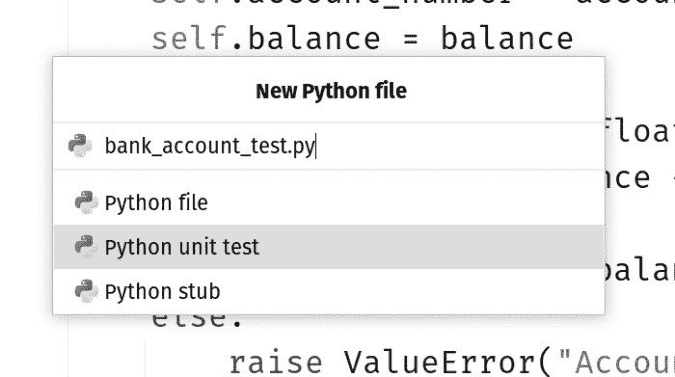

图 6.1：有几种模板用于创建新的 Python 文件

在处理测试文件方面存在几种约定。有些人认为创建一个仅包含测试的文件夹是个好主意。其他人则认为测试文件应该紧挨着它所测试的文件。我喜欢这种约定，因为它让我能轻松地看到项目中哪些文件缺少测试。按照类似的约定，我将文件命名为`back_account_test.py`。约定规定，我的文件名要么以单词*test*开头，要么以它结尾。我把它放在了末尾，因为如果不这样做，测试文件就不会在文件资源管理器中紧挨着它所测试的文件。

PyCharm 创建了文件，但它不是空的。文件中的代码看起来是这样的：

```py
import unittest
class MyTestCase(unittest.TestCase):
  def test_something(self):
    self.assertEqual(True, False) # add assertion here
if __name__ == '__main__':
  unittest.main()
```

集成开发环境（IDE）为我们提供了一个包含继承自 Python 内置单元测试框架的测试类的模板。这个框架简单而缺乏想象力地被称为`unittest`。模板包含文件顶部的必需导入、一个测试类、一个测试方法和一个允许脚本独立运行的`dunder-main`块。为了使测试工作，你需要修改这个文件。首先，向包含你想要测试的类的文件中添加一个导入。添加的行如下所示（加粗）：

```py
import unittest
from bank_account import BankAccount
```

接下来，将类的名称更改为`BankAccountTestCase`。然后，完全移除`test_something(self)`方法，并用这个方法替换它：

```py
  def test_init(self):
    test_account = BankAccount("Bruce Van Horn", \
      "123355-23434", 4000)
    self.assertEqual(test_account.name, "Bruce Van Horn")
    self.assertEqual(test_account.account_number, \
      "123355-23434")
    self.assertEqual(test_account.balance, 4000)
```

老实说，这是一个有点愚蠢的测试，因为构造函数的逻辑非常简单。即使是我也会想跳过它。但情况并不总是这样。如果你在构造函数中做了复杂的事情，你应该对其进行单元测试。在这里，这个例子作为一个简单的例子，让我们开始。我们在这里所做的只是创建了一个`BankAccount`类的新实例，并传递了一个名称、一个账户号码和一个初始余额。然后，我们使用了`unittest`类的`assertEqual`方法来检查每个成员变量，以确保它们被正确设置。除非你犯了错误，否则几乎不可能出错，这正是重点所在。

小心那些讨厌的自定义 self):

在完成了一章关于自动补全奇迹的讨论后，我必须承认，有时它可能会让人感到烦恼。这就是那种时候。当你输入测试方法的开始括号时，PyCharm 就会自动填充单词`self`，以及结束括号和行尾的冒号。因为我打字很快，所以我经常在意识到发生了什么之前，就打出了类似`test_init(selfsel):`的东西。我已经训练我的右手，在按下开始括号的同时，立即找到键盘上的*End*键。这会将你带到自动完成的行尾。按下*Enter*键，你就能到达你想要的位置。

我们将在第一个测试下方添加两个更多的测试。第一个测试将测试`withdraw`方法。在第一个测试下方，但在带有`dunder-main`测试的行上方输入新的方法：

```py
def test_withdraw(self):
  self.fail()
```

在`test_withdraw`方法下方输入存款测试：

```py
def test_deposit(self):
  self.fail()
```

如果你还没有猜到，这两个测试将会失败。这没关系。我喜欢看到它们失败，这样我知道整个测试设置是正常工作的。作为长期软件开发者的一个好处和副作用是，你不会假设任何东西都会正常工作，无论是谁写的，或者这个事物花了多少钱。称之为生存本能。如果你跳过这个步骤，那么愿好运永远在你这边。

## 运行测试

让我们运行我们的测试。像许多事情一样，运行测试有很多种方法。你无疑已经注意到了在你的测试代码中出现了绿色箭头，如图 *图 6.2* 所示。


图 6.2：创建测试时，IDE 中将出现绿色运行箭头

这些绿色箭头在你点击时会触发一个菜单。现在，我们将点击第一个项目，即 `BankAccountTestCase`，测试运行器将出现在 IDE 窗口底部的工具窗口中。你可以看到我的 *图 6.3*：

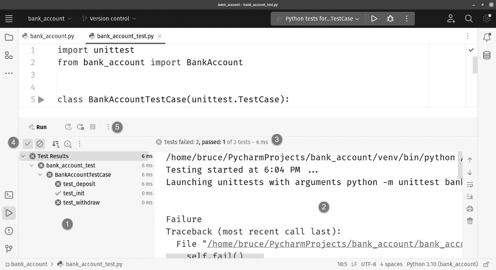

图 6.3：测试运行器显示了运行的测试，包括通过和未通过的测试，以及控制台输出

测试运行器本身在其窗口中集成了完整的一套工具。我在 *图 6.3* 中对它们进行了编号：

1.  此面板显示了通过和未通过的测试。它们以与调用层次结构相匹配的层次结构显示。

1.  此面板显示了测试运行的控制台输出。

1.  在输出面板上方是通过测试的数量摘要，以及测试套件运行的时间。

1.  在同一工具栏的左侧是一组五个按钮，之后跟着一个垂直省略号。✓ 和 ⃠ 按钮将分别过滤掉所有通过和未通过测试。过滤掉通过测试让你能专注于未通过的部分。过滤掉未通过测试可以减少当你有 100 个测试中只有 5 个通过时那种普遍的沮丧感和彻底的绝望感。当这种情况发生时，我通常会吃个三明治，感觉会好一些。这样想：只要你有未通过的测试，你的工作可能还是安全的，因为训练一个替代者可能需要更长的时间，而不是等待一切开始正常工作。把它看作是半满的玻璃杯。省略号之前的下三个按钮允许你排序测试结果，从另一个文件导入测试，并回顾你的测试运行历史。假设你有一个测试是通过的，然后失败了，你想回去看看它最后一次通过的时间。如果你需要，历史记录就在那里。省略号还包含一些其他选项，包括针对测试运行器本身的杂项设置。

1.  这个工具栏允许你重新运行所有测试，只重新运行失败的测试，以及停止长时间运行的测试。再次强调，我们有一个垂直省略号，但这个省略号有一个有趣的选项，可以切换**自动测试**。开启这个选项后，对于那些无法忍受光标回到重新运行按钮的时间的人来说，测试将不断运行。

当你第一次运行测试时，PyCharm 会自动为你创建运行配置。你可以在顶部工具栏的**运行配置**下拉菜单中看到它们。

## 修复失败的测试

我们有两个测试总是会失败，无论我们做什么。让我们先从`bank_account_test.py`文件中的`test_withdraw(self)`方法开始修改。改为如下：

```py
def test_withdraw(self):
 test_account = BankAccount("Bruce Van Horn", "123355-23434", 4000)
 test_account.withdraw(2000)
 self.assertEqual(test_account.balance, 2000)
```

第一行实例化了`BankAccount`类，并使用了一些可测试的值。接下来，我们调用`withdraw`方法，取出$2,000。我希望它是为了做一些有趣的事情！通常情况下，是我的女儿们借我的钱包去购物或者可能为工程项目的原材料购买。我可以期待，对吧？我现在期待我的余额从$4,000 降到$2,000。所以，我使用`unittest`类的`assertEqual`方法，它是我的`BankAccountTestCase`类的超类。我传入`test_account.balance`，这将与预期结果进行比较。

我完全期待这个测试会通过！点击*图 6**.3*中显示的重新运行失败的测试按钮。它通过了！现在，让我们编写`test_deposit`方法：

```py
def test_deposit(self):
 test_account = BankAccount("Bruce Van Horn", "123355-23434", 4000)
 test_account.deposit(5000)
 self.assertEqual(test_account.balance, 9000)
```

这里的解释与上一条相同，只是这次，我们将$5,000 存入我的账户。这种情况在现实生活中很少发生，所以请给我一点时间，让我庆祝一下。

重新运行失败的测试。现在它们都应该通过了！但我们还没有完成，对吧？

到目前为止，这些测试都遵循了无故障路径。这意味着到目前为止，我只测试了按照我设计的运行方法。现实世界中的用户永远不会这样做。我们需要测试故障路径。

## 测试故障路径

我们在设计系统时故意设置了一个明显的故障路径：透支。如果我们试图取出比当前余额更多的钱，会发生什么？或者，用我女儿们可能会说的话，我们如何生成一个信号，告诉我们是时候从商场回家并隐藏收据了？

我们在代码中考虑了这一点：

```py
def withdraw(self, amount: float) -> None:
    new_balance = self.balance - amount
    if new_balance > 0:
      self.balance = new_balance
    else:
      raise ValueError("Account overdrawn!")
```

如你所见，我们检查新的余额是否会变成负数。如果是，我们抛出一个`ValueError`。这个测试将会有一点不同。我们不是使用`assertEquals`来测试无故障的结果，而是想验证当这个条件存在时，我们不仅抛出一个错误，而且抛出正确的错误类型。这很重要，因为我们期望抛出`ValueError`，但如果产生了其他错误，如果我们只测试通用的`Exception`，测试将会给出一个错误的阳性结果。在`BankAccountTestCase`类中添加以下测试：

```py
def test_overdraft(self):
 test_account = BankAccount("Bruce Van Horn", "123355-23434", 4000)
 self.assertRaises(ValueError, test_account.withdraw, 5000)]
```

如前所述，我们使用一些可测试的值实例化`BankAccount`类。对于测试，我们想要断言如果传入的金额超过余额，`withdraw`方法会引发`ValueError`。在这里，我们使用`self.assertRaises`，它接受三个参数。第一个参数是我们期望的错误类型。

第二个参数是受测试的方法。注意，我们以 lambda 风格传递函数的引用。我们不需要执行函数，因为我们需要`assertRaises`函数来做这件事。最后，我们需要传递任何参数的值——在这个例子中，一些比实例化时用的四千更大的数字。在这种情况下，我传入`5000`。当我运行这个测试时，它应该通过，因为函数会因我期望的`ValueError`异常而失败。

剩下只有一个测试：我们需要确保当我们向`deposit`方法传入负数时，会得到`ValueError`。我将这个留给你练习。完整的代码在章节代码库中。

## 自动生成测试

到目前为止，我们已经花了一些时间编写`BankAccout`类，但回想一下我们最初为单元测试编写的用例：一个金融交易。这次，我们将编写一些需要测试的代码，但我们将生成一个更精确的测试，而不是通用的测试模板。

让我们从将要测试的代码开始。在你的项目中创建一个名为`transaction.py`的新文件。这个文件的 内容应该如下所示：

```py
from bank_account import BankAccount
```

我们需要`BankAccount`类，因为整个想法是编写代码，在物品销售时从一个账户转移到另一个账户。说到*物品*，让我们创建一个类来表示我们将要购买的东西：

```py
class Item:
  def __init__(self, name: str, price: float):
    self.name = name
    self.price = price
```

这里没有什么太疯狂的东西——只是两个实例变量`name`和`price`。现在到了困难的部分：我们需要一个类来表示交易。记住，交易是一个原子操作。所有步骤都应该完成。如果在过程中出现任何错误，之前发生的一切都需要回滚：

```py
class Transaction:
  def __init__(self, buyer: BankAccount, seller: \
    BankAccount, item: Item):
    self.buyer = buyer
    self.seller = seller
    self.item = item
```

我们用构造函数开始这个类，它初始化两个银行账户和一个项目。然后是交易本身的逻辑：

```py
  def do_transaction(self):
    original_buyer_balance = self.buyer.balance
    original_seller_balance = self.seller.balance
```

我们需要存储原始余额。如果出现任何问题，我们需要这些信息来将一切恢复原状。接下来是金钱交换的部分。我将用`try`来封装：

```py
    try:
      self.buyer.withdraw(self.item.price)
      self.seller.deposit(self.item.price)
    except ValueError:
      self.buyer.balance = original_buyer_balance
      self.seller.balance = original_seller_balance
      raise ValueError("Transaction failed and was \
        rolled back")
```

我们尝试从买家的账户中取款，然后将相同金额存入卖家的账户。如果抛出`ValueError`异常，我们将通过恢复余额到原始值将所有钱款退回。一旦钱款被恢复，我们仍然应该抛出一个错误，以便主应用程序知道错误发生了。这个函数需要向用户界面报告结果，让用户知道交易发生了什么。最后一行为我们处理了这一点。在实际应用中，你可能想创建自己的自定义错误，以便提供更多信息，但这个错误对于演示目的来说已经足够好了。

## 生成交易测试

之前，我们使用`class Transaction`创建了一个新的测试。然后，点击*图 6.4*中所示的**“生成…”**菜单选项：

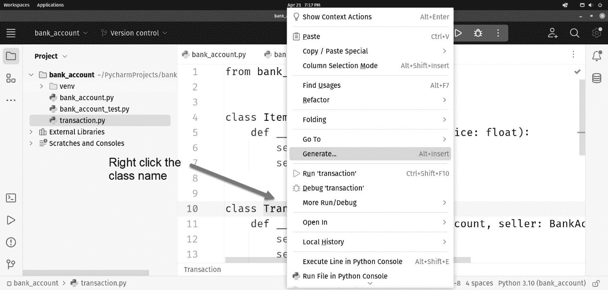

图 6.4：当你右键单击类定义时，可以找到“生成…”菜单项

接下来，点击*图 6.5*中所示**“测试…”**：


图 6.5：点击“测试…”按钮以生成测试

在这一点上，将弹出一个对话框，你可以控制将要生成的测试，如*图 6.6*所示：


图 6.6：PyCharm 将根据这些设置生成一个单元测试文件

PyCharm 将创建一个名为`test_transaction.py`的文件。在该文件中，将不会有一个通用的测试类名，而将有一个名为`TestTransaction`的类定义。最后，在文件中，假设你勾选了复选框，将生成一个名为`test_do_transaction`的测试方法占位符。

生成的文件包含以下代码：

```py
from unittest import TestCase
class TestTransaction(TestCase):
  def test_do_transaction(self):
    self.fail()
```

在*第一章*中，我告诉过你们，IDE 的一个好处是可以减少样板代码。第一次，PyCharm 为我们生成了一些通用的样板代码。至少我们不必手动输入，但修改它所生成的内容也需要相当多的努力。这次，我们甚至有更少的工作要做。如果我的类中有许多方法，将为每个方法生成一个正确命名的占位符。

我现在必须编写使`test_do_transaction`方法通过的代码。看吧！

```py
from unittest import TestCase
from bank_account import BankAccount
from transaction import Transaction, Item
```

我们从必要的导入开始。我知道我需要两个测试，而不仅仅是 PyCharm 生成的那个。PyCharm 生成了一个测试方法，我正在用它来测试无故障路径。我将传入一些按预期工作的事物。既然我知道我有两个测试，我可以重用卖家账户来保持测试的**DRY**。如果你不熟悉这个缩写，它代表**不要重复自己**。通过将此代码提升到文件顶部，我只需要输入一次。这段代码将初始化一个卖家银行账户，余额为$4,000。它还设置了我们将要购买的物品，这些在测试之间不会改变：

```py
initial_seller_balance = 4000
seller_account = BankAccount("PacktPub", "839423-38402",
               initial_seller_balance)
item = Item("Python book", 39.95)
```

接下来，我们将继续进行测试类本身，这个类是为我们生成的。我们已经有这部分内容了：

```py
class TestTransaction(TestCase):
 def test_do_transaction(self):
```

我正在用我希望能使测试通过的自定义代码替换生成的`self.fail()`：

```py
  buyer_account = BankAccount("Bruce Van Horn", "123355-23434", 99)
  item = Item("Python book", 39.95)
  test_transaction = Transaction(buyer_account, \
  seller_account, item)
```

和往常一样，我在测试中实例化了将要使用的类。到目前为止，我已经创建了两个账户和一个带有价格的物品。接下来，我将运行测试方法：

```py
  test_transaction.do_transaction()
```

然后，我会检查我的结果：

```py
  self.assertEqual(buyer_account.balance, 99 - 39.95)
  self.assertEqual(seller_account.balance,\
                   initial_seller_balance + 39.95)
```

你可能会想用花哨的测试代码。小心这个。花哨的测试代码和它打算测试的花哨代码一样容易出错。如果你正在测试复杂的数学，请不要在测试中重复计算，然后将其与被测试的代码进行比较。你应该输入已知输入并检查已知输出。仅此而已！

这个测试代表了无故障路径。我完全期待它会通过，因为这个练习仅仅是在理想条件下工作的所有事情。让我们看看我是否正确。点击任何一个绿色的运行按钮。我的结果在*图 6**.7*中显示：

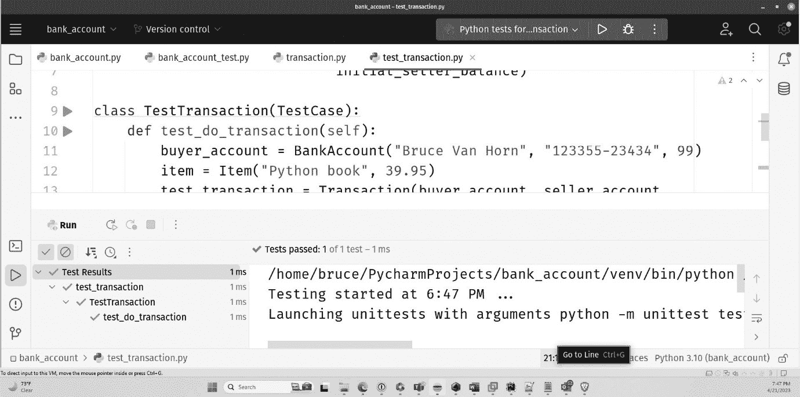

图 6.7：到目前为止，一切顺利！我的测试通过了！

我们需要至少一个故障路径的测试。在这种情况下，我们将测试当我账户中的余额不足以购买一本书时会发生什么。

这是我针对该情况的测试：

```py
def test_transaction_overdraw_fault(self):
 initial_buyer_balance = 5
 buyer_account = BankAccount("Bruce Van Horn", \
  "123355-23434", initial_buyer_balance)
 test_transaction = Transaction(buyer_account, \
  seller_account, item)
```

当我今天离开去上班时，我的账户中至少有$9,000。但我的女儿菲比从我的夹克口袋里“借”了我的卡。她说她要创建一个机器人自行车工厂。我没有在意。她在开玩笑，对吧？所以，我下班后去书店，打算买最新的杰作：

```py
 test_transaction.do_transaction()
```

交易发生了。你知道当 Pac-Man 被幽灵吃掉时发出的声音吗？我现在就在模仿这个声音。这次销售将失败；让我们看看交易是否能够正确回滚：

```py
 self.assertEqual(buyer_account.balance, initial_buyer_balance)
 self.assertEqual(seller_account.balance, initial_seller_balance)
```

这段最后的代码验证了买家和卖家的余额都回到了原始值。运行测试——它们都应该通过！见*图 6**.8*查看我胜利的测试运行。我迫不及待地想回家放松！

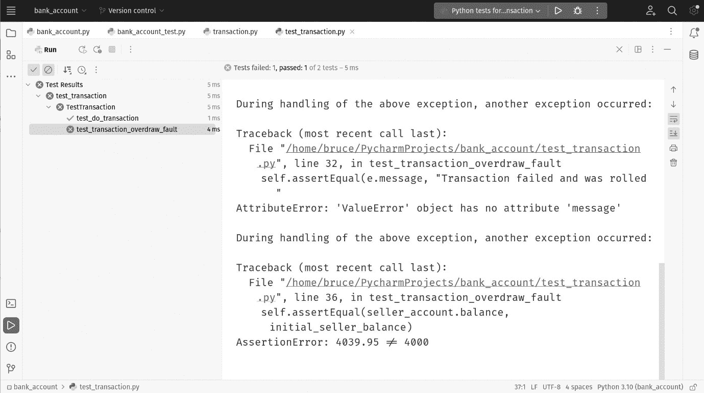

图 6.8：我最好给我的妻子打电话，让她为我热饭

看起来我有点过于自信了。输出窗口显示了一组所有出错的堆栈跟踪。它太长了，我不得不向下滚动很多才能到达这个截图的好部分。在跟踪（此处未显示）中，我可以看到一些我以为会抛出的错误确实发生了，这很好。我们在这里可以看到的两个不是。首先，我打算验证异常传来的消息是否与我定义中指定的值匹配。再次，我这样做是为了确保我抛出的错误是我们看到的错误，而不是由于错误导致的其他错误。看起来我没有理解错误的结构，实际上，没有名为 message 的属性。我发誓！等等——那可能来自其他语言。好吧，我可以查一下。

另一个更令人不安的错误是我的事务没有回滚！当你查看跟踪信息时，你会看到其中包含超链接，允许你直接导航到跟踪中提到的错误代码。移动和查找问题非常容易。我可以在堆栈跟踪列表中找到第一个问题的行，如图*图 6.9*所示：


图 6.9：堆栈跟踪中充满了超链接，可以直接跳转到代码中的问题部分

点击这个链接会带我去*图 6.10*中显示的问题代码：


图 6.10：哎呀！IDE 甚至告诉我第 34 行是错误的，但我没有听

我有几个选择，不是吗？我可以通过悬停在`e`变量上使用 PyCharm 的文档功能。我们在*第四章*中讨论了自动文档功能。*图 6.11*显示了如果你一直在跳来跳去，这会是什么样子：

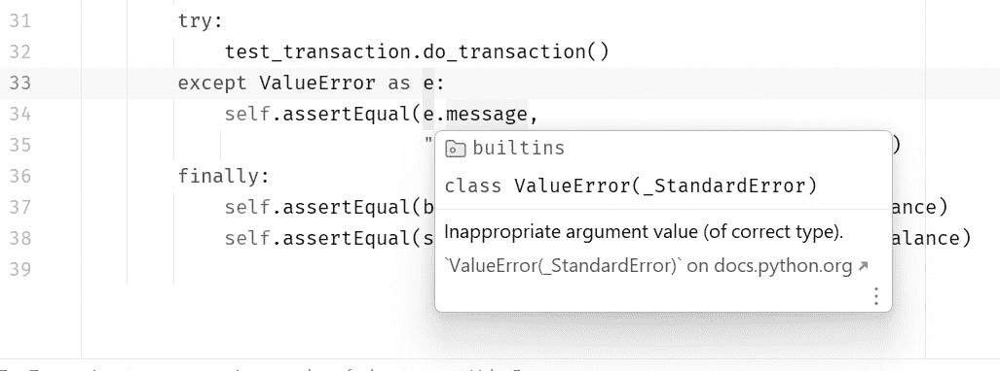

图 6.11：自动文档功能将给我一个链接到官方文档

这里没有简单的答案，对吧？当然，我可以点击底部的链接并访问 Python 网站阅读文档。不过，如果我那么做，我就会失去你，读者，对我的信任。当你们都在看着的时候阅读手册？不可能！我确信我会找到答案，但代价是我的自尊。

我还有一个想法！我之前谈过 PyCharm 的控制台。我想试试。看看*图 6.12*：

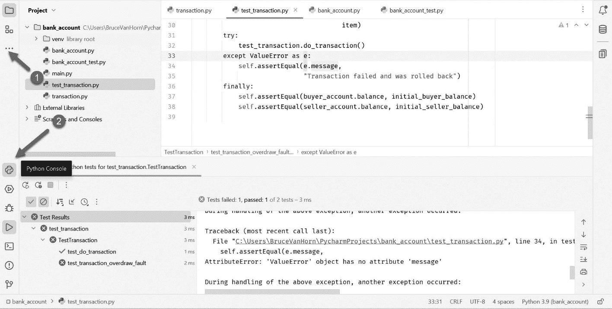

图 6.12：如果 PyCharm 控制台按钮（2）不在你的工具栏上，点击省略号（1）来打开它

指向*2*的箭头将打开 PyCharm 控制台。如果你从未这样做过，该图标不会在工具栏上。你需要点击*1*处的省略号，然后点击**Python 控制台**区域。这将将其添加到你的工具栏中。我的控制台会话如*图 6**.13*所示：


图 6.13：重新访问控制台允许我们快速实验以解决我们的错误

在控制台中，我首先在第一行按了*Enter*键。我为你做了这件事。如果我没有这样做，控制台会把所有东西都挤在一起，看起来不会那么漂亮。接下来，我输入了以下内容：

```py
check = ValueError("This is a test")
```

我怀疑如果我把检查转换为字符串，我会得到我想要的消息。称之为直觉。或者称之为“我背着你用**ChatGPT**查看了。”我选择直觉。

如果我输入`str(check)`，Python 交互式解释器将评估表达式并打印结果。这个想法是可行的。我可以纠正我的代码。`test_transaction.py`中的第 34 行现在将是以下内容：

```py
self.assertEqual(str(e), "Transaction failed and was rolled back")
```

现在，如果我再次运行测试，它将失败，如*图 6**.14*所示：


图 6.14：软件开发中的进度可以通过错误列表减少的速度来衡量

我们预料到了这一点。问题列表变短了，所以这是一个胜利！让我们清除最后一个问题。交易失败后，事务未能正确重置卖家的账户值。我们可以盯着它看一会儿，或者我们可以通过启动 PyCharm 的调试器并逐步通过整个测试来采取更积极主动的方法。

# 使用 PyCharm 的调试器

在*第一章*中，我赞扬了 PyCharm 的调试器是使用 IDE 而不是像标准 Python 调试器（称为**pdb**）这样的命令行调试器的最大原因。请别误会——你应该学会使用 pdb，因为有时 IDE 不可用。然而，我怀疑一旦你使用了 PyCharm 的，你将更喜欢它。让我们看看我是否正确。

我们在`Transaction`类中有一个问题，并不完全准确。在测试时，总有两种可能性：

+   代码失败是因为待测试代码中的缺陷。

+   代码失败是因为测试代码的问题。

由于我们目前不知道哪种可能性是正确的，调试器将允许我们逐行执行我们的代码并检查其内部工作原理。为此，我们需要设置一个断点。断点标记了您代码中的一个位置，您希望在此处停止执行并检查变量的内容、堆栈等。您可以通过在编辑器中的空白处点击行号来创建一个断点，如图*图 6.15*所示。我将把断点添加到测试的开始处，这样我们就可以逐步执行它。测试从第 25 行开始，所以我将点击那个行号；观察发现行号已被一个红色圆点所替代：

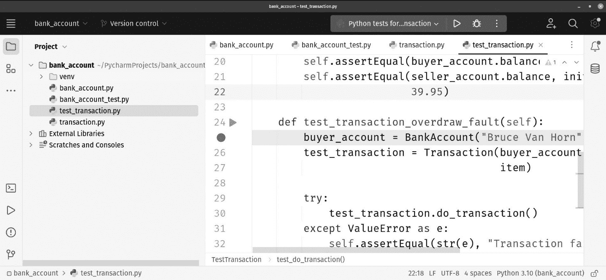

图 6.15：点击行号以创建断点，该断点将用红色圆点替换数字

接下来，我们需要运行调试器。在编辑器窗口中方法定义`test_transaction_overdraw_fault(self)`旁边点击绿色箭头。这次，点击*图 6.16*中显示的**“调试‘Python tests for tes…’**选项，以运行失败的测试：


图 6.16：点击绿色箭头提供菜单，可用于对正在运行的测试进行修改，包括运行调试器

当调试器运行时，程序将开始，然后在我们的测试的第 25 行停止。IDE 发生了显著变化。让我们看看*图 6.17*：

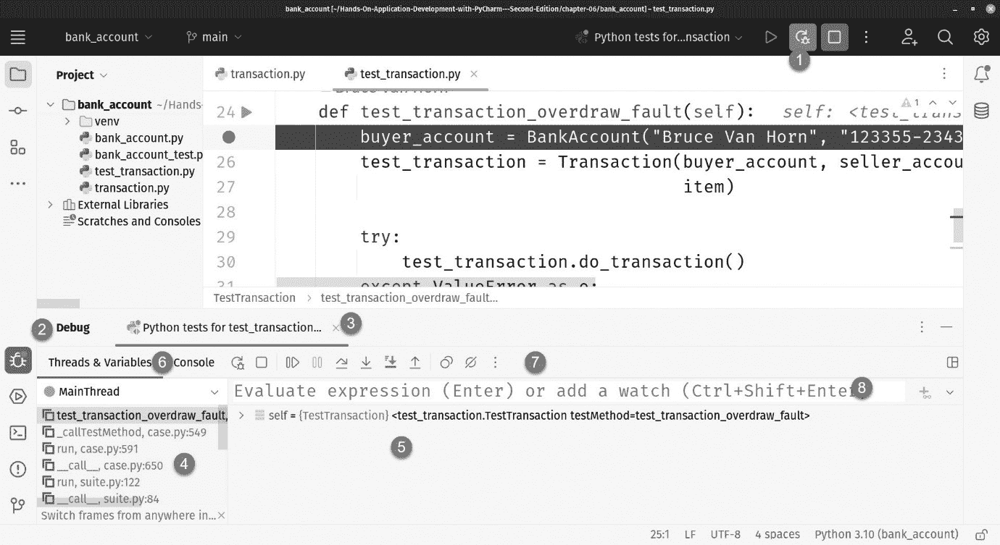

图 6.17：PyCharm 中的暂停调试器

您可能会立即注意到一些事情。首先，IDE 顶部的运行按钮现在是绿色的，红色的停止按钮是亮的（*1*）。这些都是视觉线索，表明有东西正在运行，当然我们确实在运行。

IDE 的下半部分现在被调试工具（*2*）占据。还有一个标签栏（*3*），允许您同时运行多个调试会话。这在开发 RESTful 微服务架构时很有用，我们将在接下来的几章中讨论这一点，特别是在*第九章*，*使用 FastAPI 创建 RESTful API*。

在右侧有一个线程列表（*4*），允许您在各个线程之间切换并检查它们。然而，大多数时候，您会到达正确的位置，可能只会偶尔使用它。位于位置*5*的区域显示了当前作用域内的所有内容。目前，那只是`self`，您可以看到它是`TestTransaction`类的一个实例。

*6*显示了两个标签，允许您在我们现在看到的视图之间切换，这允许您在*5*区域检查程序的状态。如果您切换此标签，将显示`print`语句，以便您可以在程序运行时查看输出。

标记为*7*的工具栏包含一组非常实用的工具，而表达式窗口(*8*)允许您使用当前作用域内的任何内容添加一个监视器或评估一个表达式。

调试窗口最有用的部分是检查区域(*5*)，标签切换，您可以使用它来在变量检查器和线程检查器以及控制台输出(*6*)之间切换，以及调试工具栏(*7*)。让我们更仔细地看看调试工具栏：


图 6.18：PyCharm 中的调试工具栏

我已经为每个按钮编号。让我们回顾一下：

1.  此按钮重新启动调试运行。您可以在 IDE 窗口顶部靠近运行按钮的位置找到重复的重新启动按钮。

1.  此按钮停止调试运行。您可以在 IDE 窗口顶部靠近重新启动按钮的位置找到重复的停止按钮。

1.  这是**Continue**按钮。调试器将在遇到任何断点时停止，并等待您使用(*5* – *8*)中的一个步骤按钮或您点击此按钮以继续运行。

1.  **Pause**按钮将暂停运行。如果您正在运行一个循环或需要一段时间才能完成的算法，并且想要暂停运行，这可能会很有用。

1.  **Step Over**按钮将执行调试器暂停的当前行。如果该行是调用您程序中函数的函数调用，该函数将正常执行并返回，之后您将转到代码的下一行，调试器将保持暂停。在这里，您正在跳过下一行的执行。

1.  相反，这是**Step Into**按钮。如果您的调试器暂停在包含函数调用的行上，点击此按钮将允许您进入该函数并像在函数开始处放置断点一样逐步执行。**Step Over**跳过此执行，而此按钮进入它。

1.  **Step Into My Code**是一个变革性的功能！这个按钮就像**Step Into**按钮(*6*)一样，只不过这个按钮不会进入您未创建的代码。我的意思是，**Step Into**按钮会高兴地让您进入第三方库代码的深处，或者进入构成 Python 本身的代码。这很少有用。**Step Into My Code**按钮只会进入您项目的一部分代码。

1.  这是**Step Out**按钮。如果您发现自己进入了一些显然不是问题的代码，或者您可能已经进入了您未创建的库代码，退出代码将带您回到进入的点。

注意 Visual Studio 用户

PyCharm 调试器中的按钮与 Visual Studio 中的按钮工作方式不同！这对我来说需要一些适应。在 Visual Studio 中，你可以点击顶部工具栏上的绿色按钮来开始调试会话。当你遇到断点时，你可以点击相同的按钮来继续。在 PyCharm 中，继续按钮位于调试工具栏中，*图 6**.18* 中的区域 *3*。如果你点击用于启动调试器的相同按钮，你会启动第二个调试会话。除非你在运行配置中勾选了允许同时运行多个的复选框，否则 PyCharm 通常会对此表示不满。

## 使用调试器查找和修复我们的测试问题

我们的单元测试揭示了代码中的问题。当我们的交易由于透支错误失败时，我们期望买方和卖方的余额恢复到原始值。在这个时候，卖家在交易失败后获得了 $39.95 的信用。让我们使用调试器逐步执行并看看我们是否能找出这是为什么。

根据 *图 6**.19*，我们已经启动了我们的单元测试的调试器，并且已经停止在 `test_transaction.py` 中的第 25 行。在这个阶段，测试方法中的任何内容都没有运行。当你正在查看 PyCharm 调试器中的高亮行时，你需要记住，高亮行尚未执行。要执行该行，请点击 `buyer_account` 已经实例化，并且我们的高亮将移动并停止在 *图 6**.19* 中显示的第 26 行：


图 6.19：点击了“单步执行”按钮后，调试器已停止在第 26 行

要查看对象的内容，你需要展开箭头，我在 *图 6**.19* 中用圆圈标出。你可以看到 `buyer_account` 的余额为 $5\. 然而，我们这里感兴趣的是卖家账户，因为问题就出在这里。

点击第 30 行以在那里添加断点，然后点击 `do_transaction()` 方法来监视其执行。点击 **进入我的代码** 按钮。如果你不记得是哪个按钮，请参考 *图 6**.18* 并查看 *7*。

这将带我们到 `transaction.py` 中的第 17 行。单步执行第 17 和 18 行，到达第 19 行并检查我们的状态。你会看到问题，如 *图 6**.20* 所示：

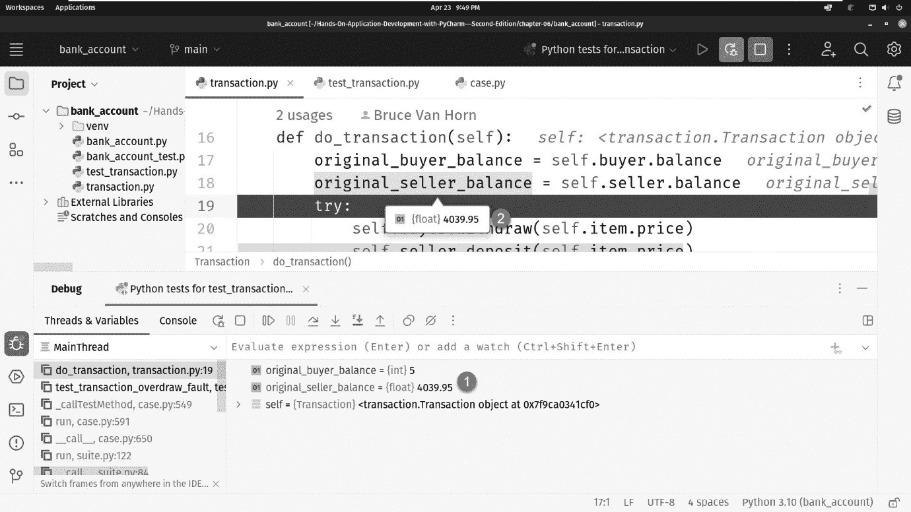

图 6.20：调试器显示卖家余额的起始值错误

调试器显示原始卖家余额为 $4,039.95，而我们预期它应该是 $4,000\. 你可以在两个地方看到这个值。变量窗口显示给我们 (*1*)，但你也可以在编辑器窗口中悬停在任何作用域变量上 (*2*) 来查看其值。

现在，为什么我们的起始余额会是错误的呢？这是一个作用域问题！由于我在`test_transaction.py`的第 5 行将`seller_account`变量提升到全局，第一个测试成功地将余额更改为$4,039.95，就像它应该做的那样。由于它是全局的，这个数字就保留了下来。为了修复这个问题，我们需要在`test_transaction_overdraw_fault(self)`方法的开始处重置卖家账户的余额。我们开始调试工作是在第 25 行。让我们就在那里做我们的更改。点击调试工具栏上的停止按钮，然后在第 25 行添加以下代码：

```py
seller_account.balance = 4000
```

不带调试重新运行测试。大胆一点！假设它成功了！如果您没有跟上，请礼貌地移到座位边缘，开始紧张地咬指甲。我们的英雄在*图 6**.21*中会取得胜利吗？提示管弦乐：duhn duhn duuuuuhn！


图 6.21：胜利！

它成功了！现在，是时候回家加热晚餐了，因为我们已经恢复了人们对国际银行业的信心。

# 检查测试覆盖率

单元测试在覆盖程序中的每个类、方法、函数或模块时最为有效。随着软件代码的增长，很容易忘记编写测试，或者可能推迟到有更多时间再进行。PyCharm 有一个工具可以告诉您测试覆盖率是多少，并帮助您找到测试更多工作的未开发机会，这可能比您自己能想到的还要多。

要检查测试覆盖率，您只需稍微改变一下运行测试的方式。我们一直是在测试文件内部单独运行测试。我们需要一起运行所有测试，以便我们可以有一个全面的报告，显示我们在哪些地方缺少覆盖率。为此，我们将创建一个新的运行配置。点击工具栏上的运行配置下拉菜单，然后点击`unittest`模板。请确保您使用的是我的设置，如*图 6**.22*所示：

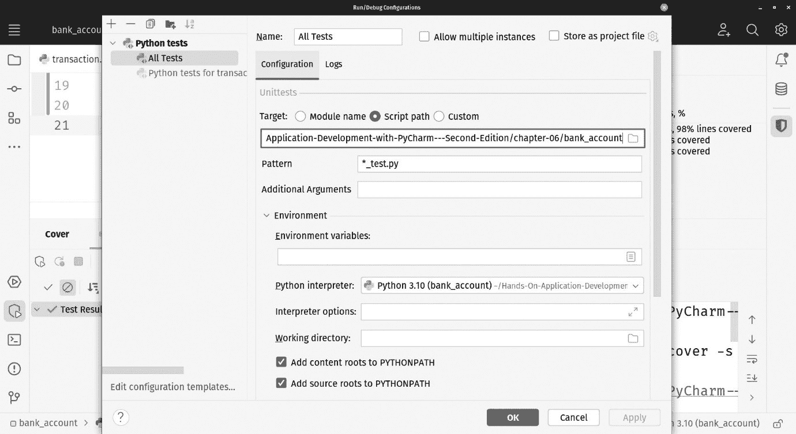

图 6.22：创建一个一次性运行所有测试的运行配置

对于脚本路径，请输入存放测试的文件夹。设置模式为`*_test.py`。这将使测试运行器找到所有以`_test.py`结尾的文件，这与默认设置不同。默认设置将查找以“test.”开头的文件。我不太喜欢这种做法，因为它会将所有测试都堆放在项目文件窗口中，而不是将测试放在被测试文件旁边。

通过设置模式和将测试运行器设置为文件夹而不是单个文件，运行器将找到所有符合模式的文件并将它们作为测试运行。说到运行，您可以通过点击运行和调试按钮旁边的省略号来完成。参见*图 6**.23*以定位**运行‘所有测试’****带有覆盖率**菜单项：

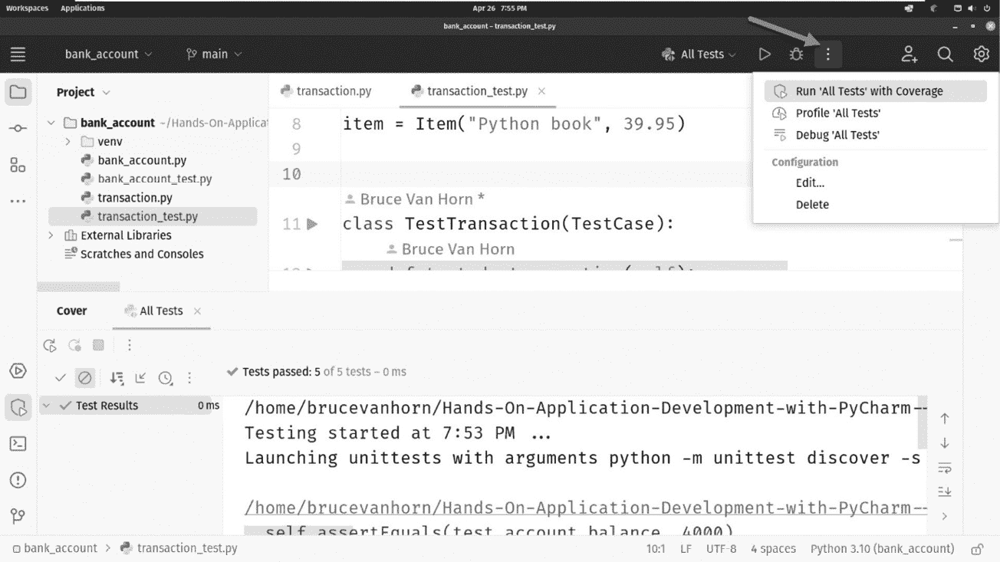

图 6.23：使用“运行所有测试”并启用覆盖率可以让你运行测试并找出你的应用程序中有多少部分没有被单元测试覆盖

第一次这样做时，你可能会看到一个错误消息——不是来自你的代码，而是来自 PyCharm。见图 6.24 以了解我的意思：

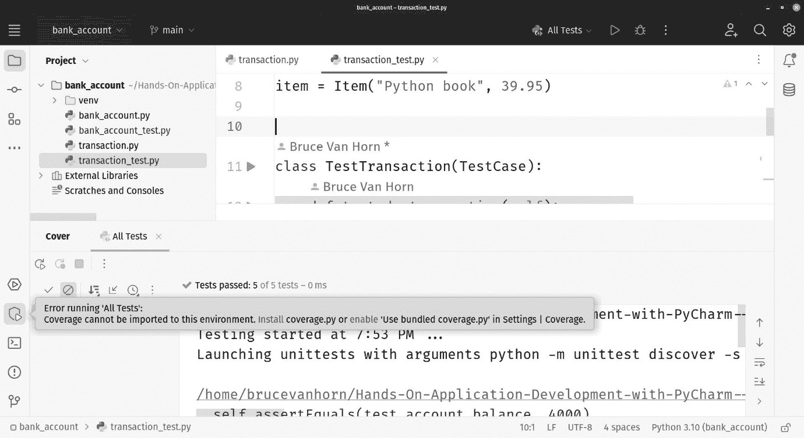

图 6.24：第一次运行测试覆盖率时，如果你还没有安装覆盖率软件或启用捆绑版本，你会收到警告

使用覆盖率运行需要一些软件，即`coverage.py`，我们还没有安装。这里你有两个选择：你可以将`coverage.py`添加到你的项目中，或者你可以使用与 PyCharm 捆绑的版本。我更喜欢使用捆绑版本。你可以点击错误消息中的单词“启用”，它显示为一个蓝色超链接，PyCharm 会为你打开这个设置。如果你想自己管理这个设置，请参阅图 6.25 以查看设置在哪里：

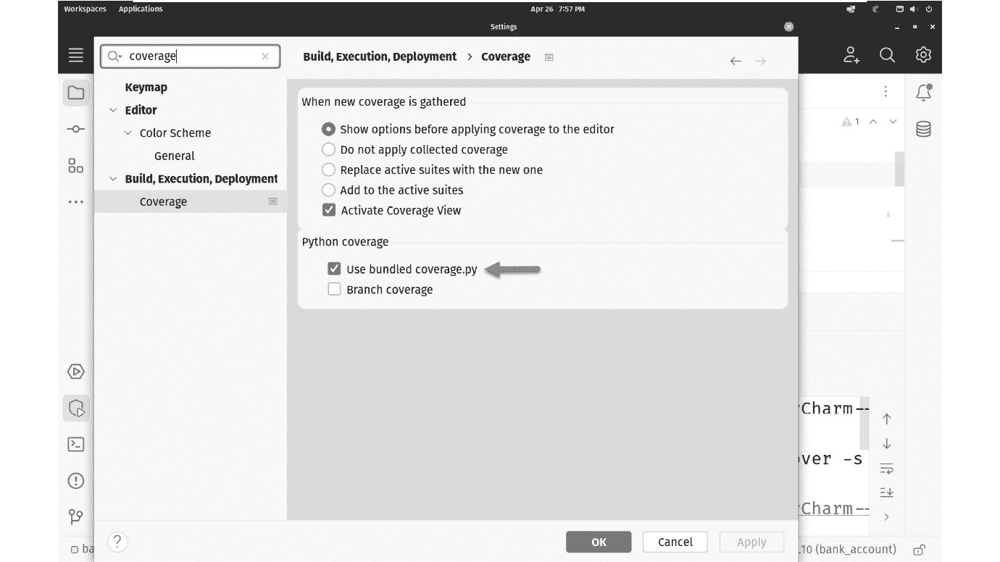

图 6.25：使用捆绑的 coverage.py 文件的设置允许你使用 coverage.py 而无需将其添加到你的项目中

启用`coverage.py`后，重新运行覆盖率测试。让我们看看我们做得怎么样：

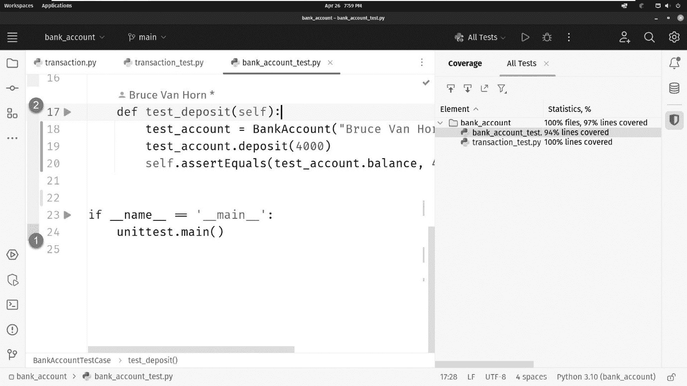

图 6.26：我希望我在大学时的成绩能这么好！

天哪！交易测试中我们实现了 100%的覆盖率，但在`bank_account_test.py`文件中却惨不忍睹——如果你认为 94%的覆盖率算失败的话。作为一个完美主义者，我想看看我是如何错过这些点的。我可以通过双击显示`bank_account_test.py`中 94%的行来查看，我会看到一个彩色编码的侧边栏。在这里，我再次为这本书是黑白印刷表示歉意。图 6.26 中的区域*1*被涂成了红色。这些是测试未覆盖的行。说实话，我不记得我输入过这些。我不需要它们，因为我的测试运行器会为我执行测试。我可以简单地删除这些行，并用*Ctrl* + *Alt* + *L*/*Cmd* + *Opt* + *L*重新格式化我的文件。重新运行带有覆盖率的测试。图 6.27 中的结果显示我们接近了：


图 6.27：我们已经实现了 100%的覆盖率！继续保持，你可能会得到加薪

`bank_account_test.py`文件现在有 100%的覆盖率，但在顶部，我仍然可以看到`bank_account`文件夹只有 98%的覆盖率。这绝对不行！目前，我将我的项目资源管理器窗口关闭，以最大化编辑器和覆盖率窗口的空间。如果我重新打开它，在运行了覆盖率之后，我会得到更多信息。*图 6**.28*显示了我们应该查看的地方。`bank_account.py`文件只有 92%的覆盖率。双击打开它，我会看到我遗漏的行被红色标记，如图*6**.28*所示：

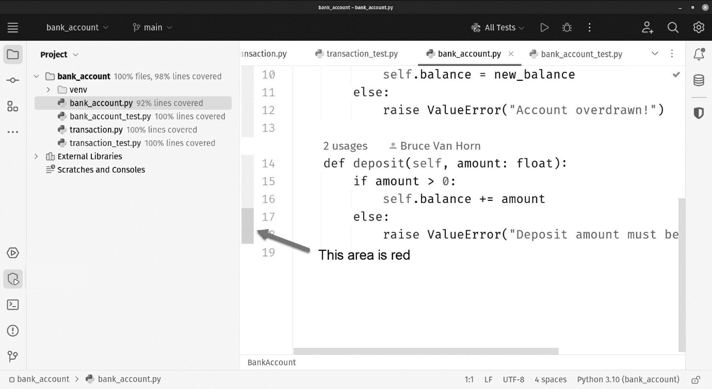

图 6.28：页边空白处的灰色红色区域表示第 17 行和第 18 行没有被任何单元测试覆盖

看起来我们还需要编写另一个单元测试。我忘记编写错误条件的测试了。这是合法的！如你所回忆，我把存款测试留给你作为一个挑战。我在这本书的代码中编写了它，但忘记编写错误测试。覆盖率救了这一天！

打开`bank_account_test.py`并添加以下测试，该测试将覆盖尝试存入负数的场景：

```py
def test_deposit_negative_number_fail(self):
 test_account = BankAccount("Bruce Van Horn", "123355-23434", 4000)
 self.assertRaises(ValueError, test_account.deposit, -2000)
```

运行测试并验证其通过，然后重新运行带有覆盖率的**所有测试**配置。我的结果如图*6**.29*所示：

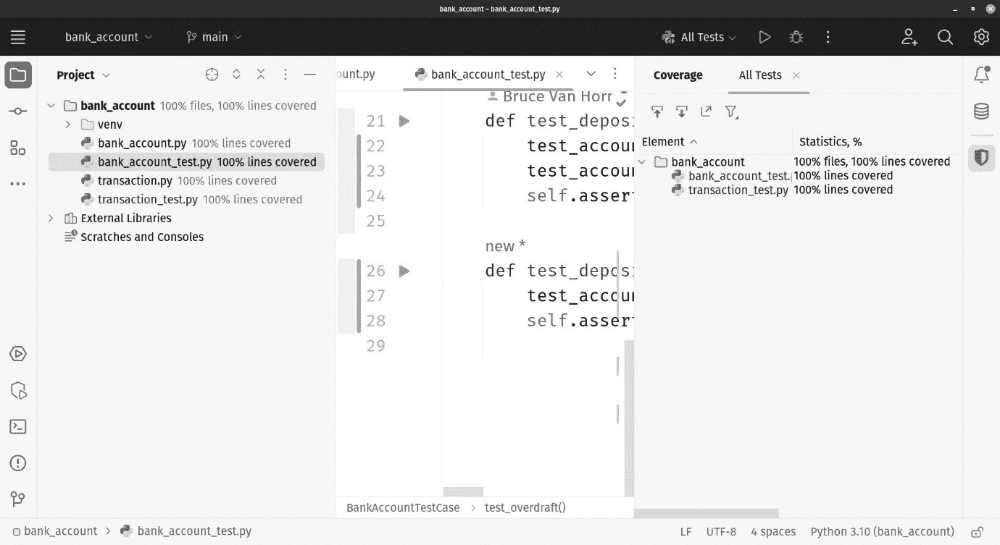

图 6.29：我们已经对所有文件实现了 100%的覆盖率

这次，我们应该得到满分！现在我们感觉很好，我将指出屏幕右侧的覆盖率窗口。它显示了一个结果列表，我们之前已经看到了。注意右侧工具栏中的盾牌图标。你可以通过点击这个盾牌来显示或隐藏覆盖率窗口。

## 测试覆盖率输出

除了图形显示之外，PyCharm 还会为覆盖率运行输出一个报告。你将在输出窗口中看到提到的输出，与通常的测试输出并列。我的输出如下：

```py
Wrote XML report to /home/brucevanhorn/.cache/JetBrains/PyCharm2023.1/coverage/bank_account&All_Test.xml
```

XML 文件是由我们之前启用的`coverage.py`生成的。正如你可能猜到的，`coverage.py`是一个流行的 Python 工具，用于在测试运行期间测量代码覆盖率。它是一个开源工具，可以帮助你识别你的 Python 代码哪些部分被测试所执行，哪些部分没有被执行。该工具通过收集测试运行期间代码执行的信息，然后生成一个报告，显示代码覆盖率百分比。XML 输出被 PyCharm 用于渲染我们一直在使用的彩色 UI 显示。XML 输出也可以由你的`coverage.py`使用，如果测试覆盖率低于设定的阈值，则会导致构建失败。

# 性能分析

创建一个优秀程序的第一步是确保程序完全运行正常。第二步是执行自动化测试以证明程序按预期工作。最后一步应该是调整代码，使程序尽可能快和高效地运行。性能不佳的程序最坏的情况可能是无法使用，最好的情况也可能因为低采用率而无法推广。在英国，NHS 有一个算法，旨在将器官移植接受者与最近采集的器官相匹配。该算法复杂但时间敏感。采集的器官必须迅速移植；否则，其组织将死亡并变得无用。简而言之，该算法必须非常准确；否则，移植的器官可能会被拒绝，导致患者死亡。它还必须快速，因为器官将失去活力，这也可能导致患者死亡。突然间，我很高兴我的工作是处理硬件系统容量规划和预测。没有人因为我数据库查询太慢而死亡。至少，据我所知。

除了能够使用覆盖率运行测试外，您还可以使用性能分析运行测试。虽然覆盖率报告以图形方式告诉您哪些代码区域尚未经过测试，但 PyCharm 的性能分析器会向您报告哪些代码部分消耗了整体运行时间的很大一部分。这使您能够发现瓶颈，从而可以将重构努力集中在使代码及其执行更高效上。

与存在多个广泛使用的测试库一样，Python 开发者也有各种各样的性能分析工具，包括 Yappi、cProfile 和 VMProf。PyCharm 支持它们所有，但它们的工作方式并不相同。cProfile 是 Python 内置的，也是默认的性能分析器。Yappi 是 cProfile 的改进，因为它允许您对多线程应用程序进行性能分析，并支持 CPU 时间分析。VMProf 支持统计抽样。当您使用此工具进行性能分析时，它不会简单地计时您的程序的单次运行；相反，它会运行并抽样多次运行，为您提供更真实的性能分析。如果可用，PyCharm 将使用 VMProf。如果不可用，它将寻找 Yappi。如果找不到 Yappi，它将使用 Python 内置的 cProfile 解决方案。对于本书，我将坚持使用默认的 cProfile 工具。

## 在 PyCharm 中进行性能分析

我们将要进行性能分析的代码可以在本书的仓库中找到，位于`chapter-06`文件夹中。`profiling.py`文件包含以下代码：

```py
def custom_sum(n=1000000):
  result = 0
  for i in range(n):
    result += i
  return result
def built_in_sum(n=1000000):
  result = sum(range(n))
  return result
if __name__ == '__main__':
  print(custom_sum())
  # print(built_in_sum())
```

这段代码将比较两种计算整数和的方法，范围从 1 到以*n*表示的上限，其默认值为 1,000,000。`custom_sum`函数遍历所有元素，将每个元素加到累计和中。`built_in_sum`函数利用 Python 的内置`sum()`方法。

在主作用域中，我们将使用注释在两个函数调用之间切换，以测试两种方法。我们将首先查看我们的自定义求和函数，因此`built_in_sum`的调用目前已被注释掉。

通常的说法是内置函数通常比任何你可能会编写的代码都要快。在这个例子中，我们将能够通过我们的分析过程来核实这个说法，并通过运行时统计进一步对其进行限定。让我们开始吧。

就像测试和覆盖率一样，我们可以通过使用编辑器内的绿色箭头或屏幕顶部的运行按钮省略号来启动配置文件运行。图 6.30 显示了这两种选项：


图 6.30：你可以使用右上角的省略号菜单或通过点击第 14 行 dunder-main 入口点旁边的绿色箭头来运行配置文件

当配置文件运行完成后，我们将获得一个性能报告，如图 6.31 所示。31：

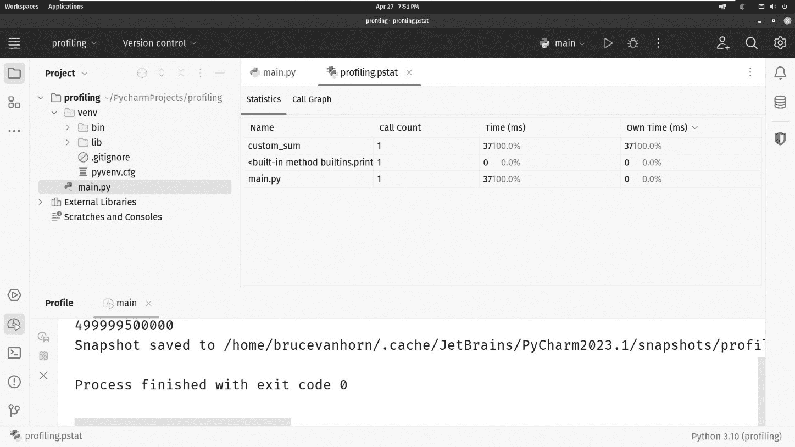

图 6.31：自定义 sum 函数的性能配置文件

在我的电脑上，这是一个 VMWare 虚拟机，配置非常简单（2 个核心，4GB 的 RAM，7200RPM 的旋转硬盘），`custom_sum`函数完成了 41 毫秒。时间和百分比在我的显示上有点拥挤，但我们可以看到 100%的时间都花在了`custom_sum`函数上。如果这是一个更复杂的程序，在运行期间调用了许多函数，我们会看到每个函数的完整列表以及每个函数花费的时间。注意**自有时长**列与**时间**列之间的区别。

在 PyCharm 的性能分析器中，**时间**列显示了执行特定函数或方法所花费的总时间，包括执行其中任何子函数或方法所花费的时间。

另一方面，**自有时长**列显示了仅执行函数或方法本身代码所花费的时间，不包括执行子函数或方法所花费的时间。这意味着**自有时长**列可以让你更好地理解特定函数或方法内代码的性能，而不受任何外部因素（如其他函数或方法性能）的影响。

为了说明差异，考虑一个函数*A()*，它调用两个其他函数*B()*和*C()*。如果你查看*A()*的**时间**列，它将包括执行*B()*和*C()*所花费的时间，以及执行*A()*本身代码所花费的时间。然而，如果你查看*A()*的**自有时长**列，它将只显示执行*A()*内代码所花费的时间，而不显示执行*B()*和*C()*所花费的时间。

通常，**时间**列可以让你对特定函数或方法的整体性能影响有一个大致的了解，而**自身时间**列可以帮助你专注于该函数或方法内部的代码性能。

## 与内置的 sum() 函数的性能比较

让我们看看我的 72 毫秒运行时间与内置的 Python `sum()` 函数相比如何。通过在 `main.py` 文件的底部注释掉 `custom_sum` 函数并注释掉 `built_in_sum` 函数来进行修改，如下所示：

```py
if __name__ == '__main__':
  # print(custom_sum())
  print(built_in_sum())
```

使用此配置运行配置文件。你可以在 *图 6.32* 中看到我的结果：


图 6.32：内置的 sum 函数似乎在 11 毫秒内运行得更快

哇，这根本不是比赛！在我的电脑上，利用内置的 `sum()` 函数快了七倍！在现实生活中，我建议运行每个配置文件几次并取平均值，因为运行时间可能会有所不同。在我的情况下，`built_in_sum` 函数的后续运行时间从 11 毫秒到 26 毫秒不等，这是一个相当大的差异。

## 查看调用图

除了统计表之外，你还可以将配置文件以调用图的形式查看。此图表示了程序运行的树状视图，如图 *图 6.33* 所示：


图 6.33：调用图显示了程序运行的树状视图

调用图中的节点被涂成绿色和红色。红色越深，表示该节点所指示的函数花费的时间越多。在 *图 6.33* 中，几乎所有的时间都花在了 `custom_sum` 函数上，它的红色最深（相信我）。当在主函数中打印求和结果时，内置的 `print` 方法占用了极小但非零的时间。

## 使用性能配置文件进行导航

你可以使用统计表或调用图中的相应节点来导航到函数。只需右键单击，如图 *图 6.34* 所示：


图 6.34：你可以通过右键单击函数并选择“导航到源”来导航到你的代码

你也可以在调用图中做同样的事情。在调用图上右键单击一个节点时，你会得到相同的导航选项，带你到源代码。这可以帮助你直接导航到任何你可能想要检查的代码。

## cProfile 性能快照

当你使用 cProfile 进行配置文件运行时，PyCharm 将在您的家目录中保存 `.pstat` 文件：

```py
Snapshot saved to /home/brucevanhorn/.cache/JetBrains/PyCharm2023.1/snapshots/profiling4.pstat
```

当我进行严肃的性能分析工作时，我通常会把这些文件复制到一个更方便的文件夹中，并更改它们的名称以表明它们是在什么条件下运行的。例如，在我们的例子中，我可能会将第一个 `.pstat` 文件命名为 `custom_sum_performance_1.pstat`；第二个可能被命名为 `built_in_sum_performance_1.pstat`。

我这样做是为了为每个文件都有一个基准性能配置文件。在现实生活中，我怀疑您很少会有我们在这里展示的这样简单的替代方案。您更有可能有几个使用不同算法设计方法的函数版本。在这些情况下，保留您的 `.pstat` 文件以便与未来的运行进行比较可能非常有用，即使只是为了在下次员工评审时炫耀。

您可以使用**工具**菜单打开您较旧的 `.pstat` 文件，如图 *图 6* 所示。35*：

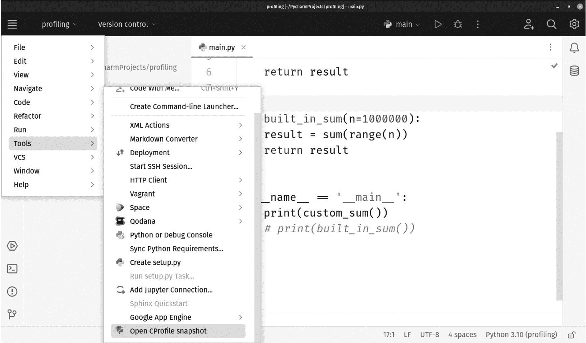

图 6.35：您可以通过工具菜单打开您的旧快照

打开此 `.pstat` 文件将显示统计表和调用图。如果您已经重构了函数的名称，那么您不应该期望导航仍然有效；然而，您可以看到旧的结果，并将它们与较新的一次运行进行比较。

总体而言，PyCharm 打开和比较旧 `.pstat` 文件的能力可以是一个有用的工具，用于跟踪代码随时间的变化性能，并识别可以改进性能的领域。

# 摘要

测试、调试和性能分析是我们可以用来分析应用程序以寻找改进正确性和性能的高级任务，但对于初学者开发者来说可能会相当复杂。PyCharm 为这些过程提供了直观和直观的界面，使它们更容易访问和简化。

单元测试是确保大型系统各个组件按预期工作的过程。PyCharm 提供了方便的命令来生成测试骨架/样板代码，这通常需要开发者手动编写，会花费很多时间。在测试程序时，考虑预期的错误以及针对预期功能的明显测试是很重要的。

在调试会话中，开发者试图缩小并确定在测试期间检测到的错误和错误的起因。结合图形界面和跟踪程序中变量值的各种选项，PyCharm 允许我们以相当大的自由度动态地调试我们的程序。各种单步执行函数也为我们提供了灵活地遍历我们试图调试的程序的方式。

最后，性能分析的目标是分析程序的性能并找到改进的方法。这可能包括寻找计算值的更快方式或识别程序中的瓶颈。PyCharm 能够生成关于每个执行函数的运行时间的综合统计数据，以及调用图，这使得开发者能够轻松地导航已分析程序的不同组件。

本章也标志着本书第二部分的结束，我们在此部分专注于提高我们的开发效率。从现在起，我们将考虑 PyCharm 在更多专业领域的使用，特别是 Web 开发和数据科学项目。

在下一章中，我们将介绍在 PyCharm 环境中三种通用网络开发语言的基础——JavaScript、HTML 和 CSS。

# 问题

回答以下问题以测试你对本章知识的掌握：

1.  在软件开发背景下，测试是什么？有哪些不同的测试方法？

1.  PyCharm 如何支持测试过程？

1.  在软件开发背景下，调试是什么？

1.  PyCharm 如何支持调试过程？

1.  在软件开发背景下，性能分析是什么？

1.  PyCharm 如何支持性能分析过程？

1.  PyCharm 编辑器中的运行箭头有什么意义？

# 进一步阅读

要了解更多关于本章所涉及主题的信息，请查看以下资源：

+   《敏捷软件开发：原则、模式和实战》，马丁，R. C. (2003)。普伦蒂斯·霍尔出版社。

+   《整洁架构：软件结构和设计的工匠指南》，马丁，R. C. (2017)。普伦蒂斯·霍尔出版社。

+   《C#设计模式的实际应用》，范·霍恩，B 和 西蒙斯，V. (2022)。Packt 出版社。

+   请务必查看本书的配套网站[`www.pycharm-book.com`](https://www.pycharm-book.com)*.*

# 第三部分：在 PyCharm 中进行 Web 开发

本部分书籍专注于 Python 编程中的 Web 开发过程以及 PyCharm 为 Web 项目提供的支持。读者将能够使用 PyCharm 及其功能来高效地开发他们的 Web 应用程序。

本部分包含以下章节：

+   *第七章*, *使用 JavaScript、HTML 和 CSS 进行 Web 开发*

+   *第八章*, *使用 Flask 构建动态 Web 应用程序*

+   *第九章*, *使用 FastAPI 创建 RESTful API*

+   *第十章*, *更多全栈框架：Django 和 Pyramid*

+   *第十一章*，*在 PyCharm 中理解数据库管理*
