# 7

# 使用 JavaScript、HTML 和 CSS 进行网络开发

本章标志着关于使用 PyCharm 进行网络编程的五个章节系列的开端，所有这些章节都将涵盖通用网络应用程序的开发。我一直期待着撰写这一部分，因为这正是我的专长。自从有网络以来，我就一直在开发网络应用程序。PyCharm 的专业版为网络开发者提供了一份特别的礼物：JetBrains 的 **WebStorm** 的完整副本，这是通过预安装的插件提供的。这意味着我们获得的不仅仅是 **HTML**、**CSS** 和 **JavaScript** 的语法高亮！我们还可以完全访问 **Node.js** 工具和现代网络 UI 框架，如 **React**。我可能会觉得这有点过度，但事实并非如此。我每天工作的产品是由 **Python 3**、**NodeJS** 和 **React** 编写的 **微服务** 的混合体。我利用了三种不同的数据库：**Microsoft SQL Server**、**MongoDB** 和 **Redis**。我永远不需要离开 PyCharm！正如我刚才提到的，我内置了强大的 JavaScript、NodeJS 和 React 工具。所有数据库都在 PyCharm 中得到支持，我们将在 *第十一章* 中介绍，*使用 PyCharm 理解数据库管理*。我可以在 PyCharm 中创建调试运行配置，运行多个通过 REST 调用相互通信的服务，并执行跨服务调试。我还可以在 React 前端设置一个断点，在另一个使用 **Flask** 或 **FastAPI** 的独立项目中设置另一个断点；当我处理应用程序的工作流程时，无论我在哪个项目中，或者项目使用的是哪种语言，我的断点都会停止。我不会在其他任何 IDE 中尝试这样做。我提到过我对开始撰写这一系列章节有多兴奋吗？我有点过于激动了。

本章将讨论的主题包括在 PyCharm 中集成常见的网络编程语言（JavaScript、HTML 和 CSS），以及如何以简单直观的方式使用它们进行开发。到本章结束时，你将获得如何使用这三种语言的全面知识，以便你可以开始使用 PyCharm 进行网络开发项目。

本章将涵盖以下主题：

+   在网络开发过程中介绍 JavaScript、HTML 和 CSS

+   在 PyCharm 中处理 JavaScript、HTML 和 CSS 代码的选项

+   如何实现网络项目的实时编辑和调试

+   如何在 PyCharm 中使用 HTML 模板选项

# 技术要求

本章的先决条件如下：

+   安装 Python 3.10 或更高版本的工作安装。

+   一个可工作的 PyCharm Professional 安装。如果您使用的是社区版，本章中我们将讨论的大部分内容将无法使用，因为您只能获得有限的 HTML 支持。您仍然可以处理 CSS 和 JavaScript 文件，但与专业版相比，体验将非常有限。

+   Chrome 网络浏览器。如果您想调试浏览器中运行的 JavaScript 代码，您将需要它。

+   一个可工作的 NodeJS 和**node 包管理器**（**npm**）安装。这是可选的。如果您想使用 React 或 Angular、Vue、Express 等现代 JavaScript 框架，则需要这些。React 是一个高级主题，本书将不会对其进行深入探讨，而仅限于设置和操作 React 项目。

+   我将向您展示如何使用 PyCharm 的部署功能。为此，我假设您了解如何使用 WinSCP 或 FileZilla 等工具将 Web 项目部署到远程主机，或者如何使用**安全复制**（**SCP**）或**文件传输协议**（**FTP**）等命令行工具传输文件。

+   您可以在[`github.com/PacktPublishing/Hands-On-Application-Development-with-PyCharm---Second-Edition/tree/main/chapter-07`](https://github.com/PacktPublishing/Hands-On-Application-Development-with-PyCharm---Second-Edition/tree/main/chapter-07)找到本章的示例代码。我们在*第二章*中介绍了如何克隆仓库，*安装*和*配置*。

# HTML、JavaScript 和 CSS 简介

我将这些称为*网络开发的三大支柱*。它们构成了你在成为全栈网络开发者过程中可以学习到的最基本技能。当提到*全栈*时，指的是你擅长开发应用程序的前端部分，包括后端和数据库。接下来的六章将致力于使用 PyCharm 进行全栈网络开发。

严格来说，我们在这里将要讨论的三个语言中只有一个是编程语言。**超文本标记语言**（**HTML**）用于创建网页或应用程序 UI 的结构和布局。**层叠样式表**（**CSS**）用于控制 UI 的外观，同时遵守关注点分离原则：我们将按钮、文本和交互元素的布局与视觉外观的定义分开。HTML 和 CSS 本身没有能力创建任何级别的交互性，除了几个 CSS 技巧，例如当用户将鼠标悬停在按钮上时改变按钮的颜色。

基于网络的浏览器前端的真实交互性来自于 JavaScript，或者如它应被正确称呼的那样，ECMAScript。大约一百万个互联网年前，一家名为网景的公司正在为新兴的浏览器用户社区争夺人心。这是一场大卫与歌利亚的较量，歌利亚是微软。网景的浏览器需要支付一小笔许可费，而微软的 Internet Explorer 是免费的，内置在 Windows 操作系统中，并配备了一套工具，允许 IT 经理集中定制浏览器行为，同时向大型企业用户群体推广。网景的价值主张根本不存在。他们需要一个颠覆性的变革。

大约在这个时候，太阳微系统公司正在大力推广其新的旗舰编程语言，名为**Java**。和网景公司一样，太阳公司也受到微软的竞争困扰，因此两家公司联手。网景开始创建后来成为浏览器内编程语言的 ECMAScript，而太阳公司则获得了 Java 名称的许可，前提是重新命名的 JavaScript 将永远不会在任何地方运行，除了浏览器内部。太阳公司的最终目标是确保每个人都在使用 Java 来创建他们的网络应用程序后端，而网景公司通过提供互动体验赢得了前端渲染的市场份额。JavaScript 与 Java 在营销之外毫无关系。它们是两种非常不同的语言，绝不应该混淆。

我假设你对浩瀚的 HTML 开发世界有所了解。我还想提醒你，这是一本关于 PyCharm 的书，而不是关于 Web 开发的书。鉴于这是我谋生的手段，我的经验很丰富，我会很快从“这是一个 HTML 标签”（这是绝对的基础）过渡到“这里是 React”（也就是说，如果你一直只做 Python 工作，那么这里会有龙）。我唯一的遗憾是 Packt 不允许我用一种恐怖电影风格的字体写“这里会有龙”。如果你想了解更多关于前端或全栈开发的一般知识，我会在本章的“进一步阅读”部分留下书籍和其他资源的参考。

# 使用 HTML 编写代码

HTML，就像任何其他代码一样，是在一个文本文件中创建的。在 HTML 的情况下，文本是通过一组 HTML 标签高度结构化的。你可以把标签看作是编程语言中的关键字，只不过这些标签是用尖括号区分的。记住，HTML 用于内容结构和布局。它是蒂姆·伯纳斯-李（不是阿尔·戈尔）创建的，作为一种在互联网的前身**国防高级研究计划局网络**（**DARPANET**）上展示科学期刊文章的方式。这是美国国防部的一个附属机构。在科学界，这个问题在于发表同行评审期刊文章所需的时间。在科学需要快速发展的案例中，我们需要一种格式，可以在不经过同行评审和印刷出版流程的情况下，电子发布研究，这个过程可能需要数月。HTML 被设计成电子模拟纸质出版物。由于这种情况，HTML 元素的结构参照**文档对象模型**（**DOM**）也就不足为奇了。文档被组织成段落、标题、副标题、部分、图表、图像等。考虑以下示例：

```py
<html>
 <head>
  <title>Advances in the Application of Time Travel</title>
 <head>
 <body>
  <h1>Introduction</h1>
  <p> Lorem ipsum dolor sit amet, consectetur adipiscing
    elit. Vestibulum tincidunt tempus lectus vitae
    euismod.</p>
 </body>
</html>
```

这是一个结构类似于典型研究论文的 HTML 文档。它有一个标题，在浏览器的标签页中显示。`<title>`位于文档的`<head>`标签中，该标签可能还包含元数据和页面使用的 CSS 文件和 JavaScript 的引用。

`<body>`标签包含文档的内容。头部和主体被包含在一个 HTML 标签内。记住，标签是用尖括号括起来的；例如，`<body>`。每个标签都有一个开标签和一个闭标签，内容位于两者之间。例如，标题以`<h1>`开始，插入内容*引言*，然后以`</h1>`结束。闭标签会在匹配元素前添加一个正斜杠。

这种结构使得网页浏览器能够轻松解析文档，并将内容以电子页面的形式显示出来。然而，在现代 HTML 中，只有结构被定义。页面上的元素布局，以及字体、颜色、大小等视觉定义，都是由外部链接的 CSS 文档控制的。

如果我们将此代码添加到我们之前的文档中，在`<head>`标签内，我们将在浏览器中得到一个看起来非常不同的页面：

```py
<head>
 <title>Advances in the Application of Time Travel</title>
 <link rel="stylesheet" href="mystyle.css">
<head>
```

注意，添加的链接标签略有不同：它没有闭标签。HTML 中存在一些这样的例外。此外，链接标签还有一些属性附加。你可以把属性看作是函数的参数。它们定义了标签使用的额外输入。在这种情况下，HTML 中可能有几种不同类型的链接标签。我们通过`rel`属性定义这个标签为样式表。`href`属性告诉 HTML 页面在哪里找到 CSS 文件。在这里，页面将在与 HTML 文件相同的文件夹中寻找名为`mystyle.css`的文件。

## 在 PyCharm 中创建 HTML

HTML 前端开发体验仅在 PyCharm 专业版中可用。社区版允许你在 Python 项目中创建 HTML 文件，但这仅此而已。在本章中，我将严格考虑专业版。

我们将创建一个新的项目，但这次，我们不会创建一个 Python 项目。实际上，我们根本不会在 PyCharm 中创建新项目。PyCharm 以前有创建空项目的选项。在某个时候，它被移除了，但这没关系。PyCharm 项目只是一个包含 `.idea` 文件夹的文件夹。

## 创建一个空项目

创建一个空项目，这将绕过设置虚拟环境的流程，我们不需要这个流程。只需在电脑上的某个位置创建一个文件夹。我在桌面上创建了一个名为 `html-project` 的文件夹。我喜欢用中划线命名不使用 Python 的项目，而不是蛇形命名，这样我可以很容易地发现它们之间的区别。当然，你可以随意命名。

确保 PyCharm 没有打开的项目。如果有，请使用**文件** | **关闭**来关闭当前项目。

接下来，只需将你的空文件夹拖到 PyCharm 中。你会得到一个通常的**信任和打开项目**对话框，如图 *图 7**.1* 所示：


图 7.1：将空文件夹拖到 PyCharm 项目窗口以创建一个没有 Python 环境的空项目

你可能已经注意到 PyCharm 专业版的新项目窗口中有 HTML 项目类型，并想知道我为什么忽略它们。在我向您展示基于谷歌确立的理想创建整个站点的 HTML 模板项目之前，我更愿意先从基本示例开始。让我们先步行，再飞行。如果你已经是全栈老兵，请不要跳过这一节。鉴于这不是一本关于 HTML 的书，我不打算在基础知识上停留太久。我将在这个简单示例中介绍一些功能。

以这种方式创建项目时，它实际上是一个没有解释器的 Python 项目。你会收到一条消息，说明默认的 Python 安装正在用作环境，这是可以的。我们不需要它：


图 7.2：右键单击项目文件夹以创建新的 HTML 文件

你将被提示给文件命名。命名为 `index.html`。这是在 Web 服务器上显示的默认文件，因此是你最想首先创建的文件。PyCharm 将根据模板生成基本的 HTML 页面结构。更重要的是，PyCharm 将在创建过程中提示你填写模板的基本元素。看看 *图 7**.3*：

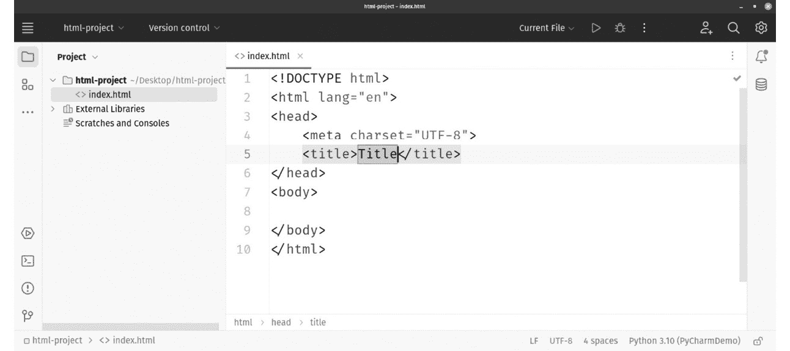

图 7.3：PyCharm 为您提供了一个模板供您填写

此模板中只有一个模板变量：`Title`。正如您所看到的，第 5 行被突出显示，而单词`Title`的突出显示更加明显。PyCharm 期望您输入一个标题，然后按*Tab*键。这样做会设置标题，然后直接带您到 body 标签的内部。

在添加此代码后，一些事情变得明显：

1.  所有您期望在 Python 中使用的自动完成功能也应用于 HTML 标签。有效的属性也在代码补全中提供。当您输入样式表的链接标签时，您会注意到这一点。

1.  PyCharm 会自动为您创建闭合标签。当您输入`<h1>Introduction`时，一旦完成`<h1>`标签，PyCharm 会为您插入`</h1>`闭合标签。未能关闭您的标签可能导致布局问题或内容缺失。

1.  Python 关键字和库的相同文档功能也适用于 HTML。将鼠标悬停在任何元素上，您将看到该元素的文档。

1.  我们在 Python 代码中看到的相同的代码检查功能也应用于 HTML 代码。*图 7.4*显示了在编辑器中讨论这些功能时我们在相同区域看到的相同类型的警告：

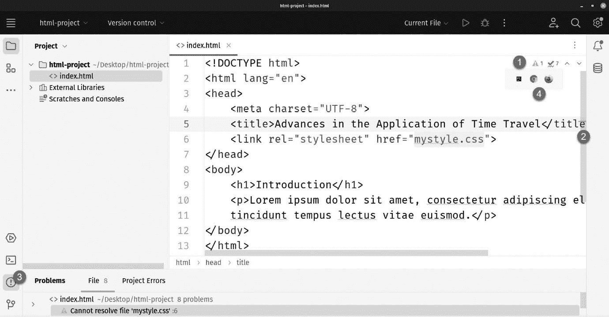

图 7.4：我们可以看到编辑器对 Python 和 HTML 的处理有很多相似之处

屏幕顶部的错误摘要(*1*)表明存在一些排版错误。实际上并没有，只是字典假设是英语，我的占位符文本是拉丁语。不过，有一个警告。如果您点击*1*旁边的黄色三角形，问题窗口将打开(*3*)。我还可以看到*2*处的黄色警告标记。所有这些都指向我们尚未创建第 6 行引用的 CSS 文件。

除了我们在编辑器中通常看到的东西外，我们还可以在*4*处看到一些新内容：有一些图标对应于 PyCharm 在您的计算机上知道的浏览器。

## 预览网页

点击任何浏览器图标都可以让您在该浏览器中预览您的代码。在我的情况下，我有三个浏览器：Chrome、Firefox 和 PyCharm 的内置预览窗口。当您的鼠标光标接近编辑器窗口的右上角时，这些图标会淡入淡出。

为了纪念本章开头 Netscape 的提及，让我们看看*图 7.5*中的 Firefox，因为它是 Netscape 的后继者：

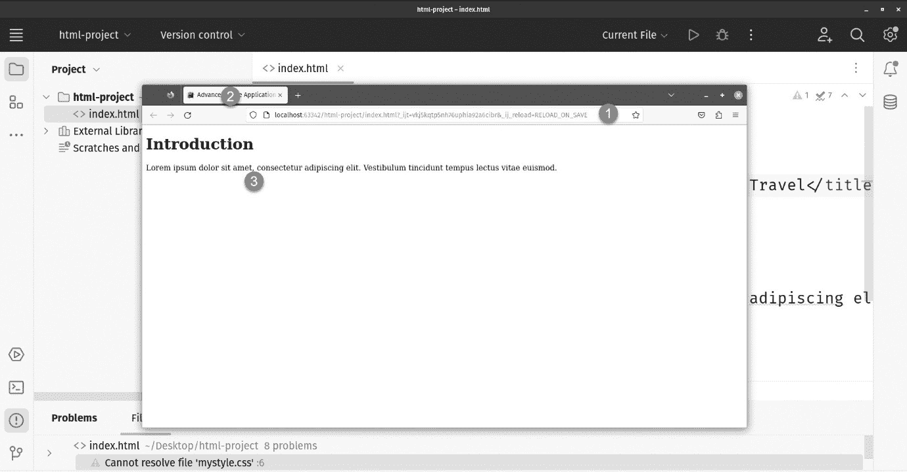

图 7.5：浏览器启动并显示我们的页面

在*图 7.5*中有三件事值得关注：

+   PyCharm 并没有只是用文件:/// URL 在浏览器中打开页面。如果你想那样做，你可以点击浏览器图标时按住*Alt*或*Option*键。在我们的情况下，PyCharm 启动了其内部网络服务器。这很方便，因为使用文件:/// URL 在浏览器中预览你的工作非常有限制。许多功能根本无法工作。

+   `<title>`标签中的内容在浏览器标签页上显示为标题。

+   1991 年有人打电话来，他们想要要回他们的网站。HTML 只是创建结构。没有 CSS，这个页面看起来相当丑陋。我们应该修复这个问题。

在我们这样做之前，我想指出 PyCharm 给我们提供的另一个巧妙的功能：自动重新加载。

## 保存时重新加载浏览器视图

如果你研究图*图 7.5*中的浏览器中的 URL，你会注意到`RELOAD_ON_SAVE`属性。你可能能猜到这会做什么，但无论如何，我们还是来了解一下。在图*图 7.6*中，我已经将窗口平铺，使得 PyCharm 位于左侧，我的浏览器位于右侧。这是网络开发者常用的配置，尽管它通常在多个显示器上运行：

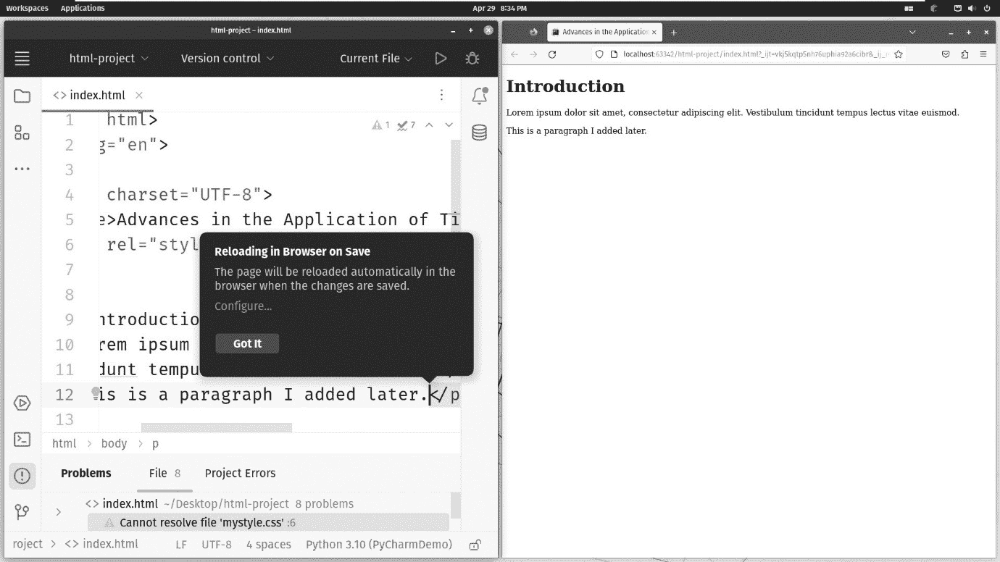

图 7.6：每次你保存对文件的更改时，PyCharm 都会自动在浏览器中重新加载页面

我添加了一个新的`<p>`标签，内容如下：

```py
<p>This is a paragraph I added later</p>
```

当我按下*Ctrl* + *S*（在 Mac 上为*Cmd* + *S*）时，浏览器会更新为新内容。这极大地加快了开发速度！这几乎算不上革命性的；大多数编辑器以某种方式支持这一点，但 PyCharm 也支持。

Live Edit 插件

在支持 HTML 开发的旧版 JetBrains IDE 中，你过去需要使用一个名为 Live Edit 的插件来获取这个自动重新加载功能。现在你不再需要它了，因为这个功能已经集成到 IDE 中。

## 使用 PyCharm HTML 预览

如果你更愿意将 100%的工作保留在 PyCharm 中，而不是使用外部浏览器，那么有一个新的 HTML 预览功能，如图*图 7.7*所示，它会启动 Chromium 浏览器的内部版本：

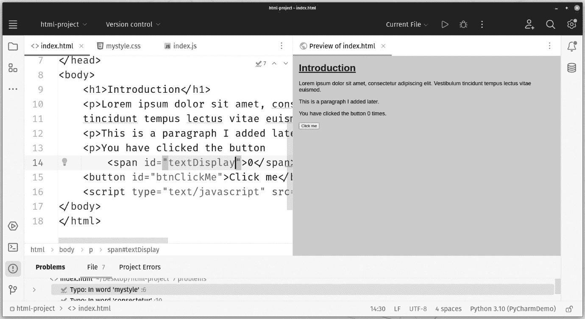

图 7.7：PyCharm 预览窗口允许你在 Chromium 浏览器窗口中查看你的工作，该窗口作为 PyCharm UI 标签实现

如果你不太熟悉，Chromium 是 Chrome 的开源版本。这一点很重要，因为多年来，我看到了很多包含预览产品捆绑的 Web 开发产品，这些产品与你的工作在真实浏览器中的显示几乎没有关系。

## 配置可用的浏览器

出现在预览浏览器中的浏览器图标是可以配置的。你可以将你的计算机上的任何浏览器添加或删除到配置中。你可以通过转到**工具**|**Web 浏览器**下的**设置**，然后是**预览**来找到它，如图*图 7.8*所示：

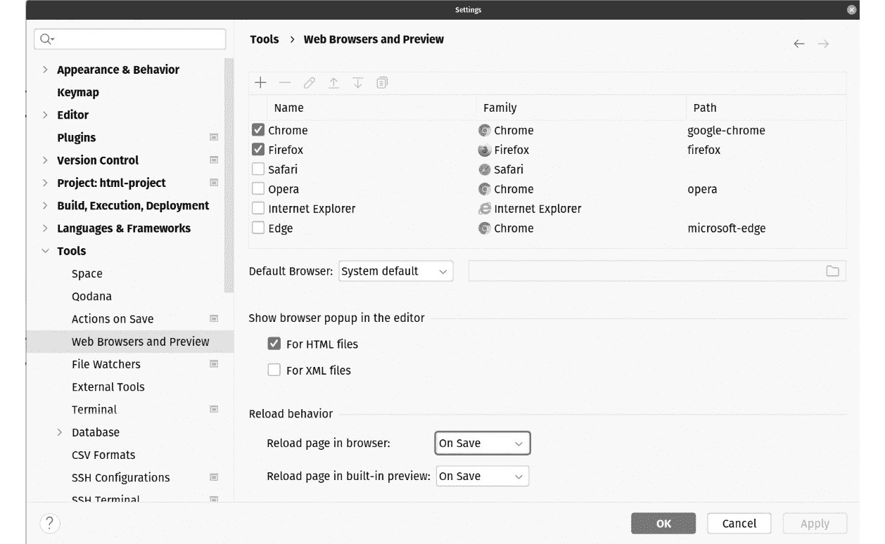

图 7.8：你可以添加和删除浏览器以进行预览，并配置重新加载行为

我认为你会发现添加新浏览器就像点击**+**图标并定位浏览器的可执行文件一样简单。如果你想移除令人不快的 Internet Explorer 的存在，只需点击它，然后点击**–**图标。

注意下拉菜单，允许你设置默认启动浏览器为系统默认，即列表中的第一个，或者一个自定义路径。你还可以配置是否显示 HTML 文件和/或 XML 文件的启动图标。

可以在屏幕底部配置重新加载行为。你可以设置在保存时、更改时重新加载，或者关闭它。在我看来，**更改时**设置触发得太频繁了。我将其设置为**保存时**。

## 使用结构窗口导航结构代码

结构窗口允许你查看代码的结构。大多数时候，结构窗口只显示函数和全局变量的列表。如果你打开一个类文件，你会看到类的属性和方法。*图 7**.09*展示了当你使用结构窗口与 HTML 文档一起使用时会发生什么：


图 7.9：结构窗口允许你在代码窗口中查看和导航 DOM

当你在 HTML 页面上打开结构视图时，你可以查看并轻松导航整个 HTML 文档的 DOM 结构。

# 添加 CSS

右键点击项目文件夹，添加一个名为 `mystyle.css` 的样式表文件，如图 *图 7**.10* 所示。系统会提示你选择样式表类型。我们坚持使用 CSS 文件。其余的选项都很花哨，但最终它们都会通过**Babel**库和**WebPack**构建脚本转换成常规 CSS。如果你是前端工作的初学者，我建议在学习**Less**或**Sass**等特殊主题之前，先学习纯 CSS：

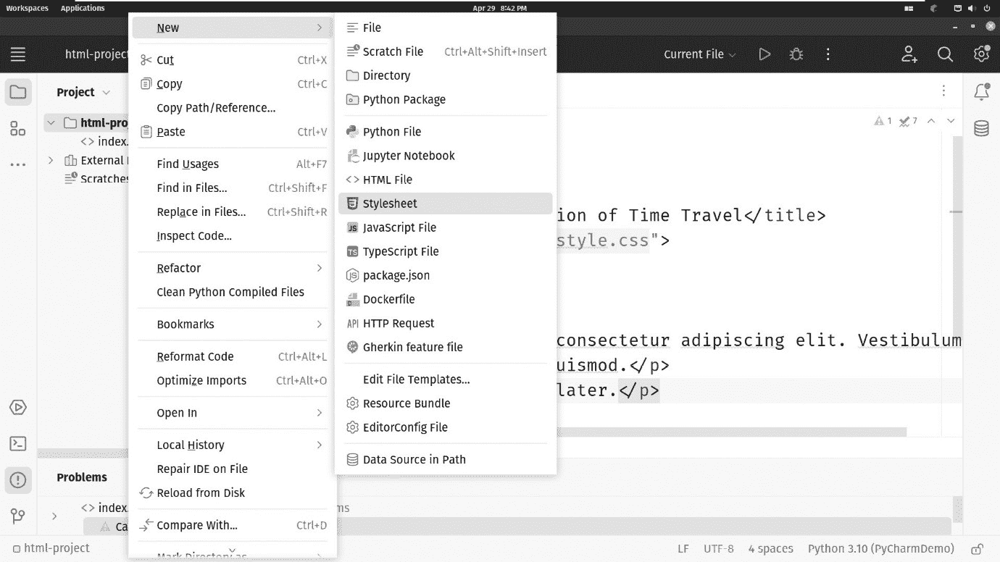

图 7.10：使用文件 | 新建 | 样式表创建一个新的 CSS 文件

确保文件名为`mystyle.css`，以便与我们在 HTML 文件中的`<link>`标签中的内容匹配。它还需要与`index.html`文件在同一个文件夹中。添加以下代码：

```py
body {
 background-color: lightblue;
 margin: 20px;
 font-family: Arial, Helvetica, sans-serif;
 font-size: 18px;
}
h1 {
 font-size: 32px;
 color: navy;
 text-decoration: underline;
}
```

保存文件并返回浏览器。不要期望它已经更新；PyCharm 的重新加载功能正在监视`index.html`文件，而不是新创建的`mystyle.css`文件。在浏览器中点击重新加载按钮。我不会提供彩色 HTML 页面的黑白截图。变化应该立即显而易见。现在浏览器已经加载了 CSS，你可以在 PyCharm 中编辑 CSS。每次保存，页面都会更新，就像你在`index.html`页面中编辑 HTML 时一样。

当你输入 CSS 代码时，无疑注意到了出色的代码补全。颜色代码都按名称以及十六进制值显示，如图*图 7.11*所示：


图 7.11：当你输入 CSS 颜色名称时，你会看到名称、十六进制值以及颜色的预览

在 CSS 颜色名称旁边也有颜色的预览，这样你可以看到你正在设置的颜色。

## 使用颜色选择器

你可以使用名称或十六进制值来设置颜色，或者你可以使用色块编辑现有的颜色，如图*图 7.12*所示。在这里，我点击了`mystyle.css`文件第 10 行的侧边栏中的颜色色块：

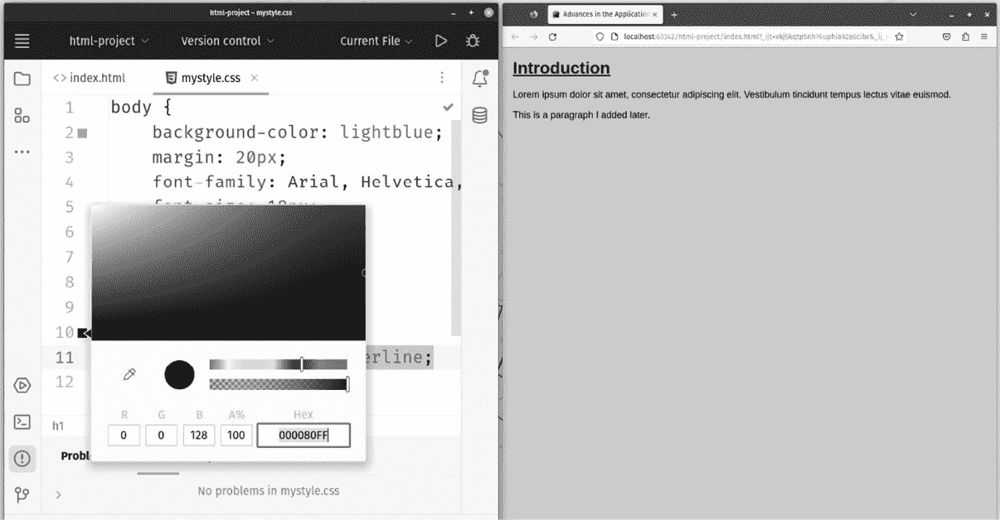

图 7.12：你可以通过点击侧边栏中的色块并选择新的颜色来编辑颜色

从这里，我可以使用 RGBA 或十六进制值选择颜色，或者只需将光标在颜色窗口周围拖动。这里还有一个色调滑块以及 alpha 通道的滑块。这控制了不透明度，UI 将其显示为百分比而不是传统的 0-255 整数值。

你还会注意到有一个吸管工具。你可以使用吸管选择屏幕上可见的任何颜色。这允许你，例如，将用于你的文本的颜色与屏幕上可见的图像中的颜色相匹配。

# 添加 JavaScript

是时候通过在我们的页面上添加一些交互性来完善我们的 HTML、CSS 和 JavaScript 体验了。右键单击项目文件夹，并添加一个名为`index.js`的 JavaScript 文件。

我们将向我们的 HTML 文件添加一个按钮，然后使用 JavaScript 使其在点击时做出反应。我们首先编写 JavaScript 代码；然后，我们将返回并添加按钮。

## 添加一些 JavaScript 代码

将此代码输入到你的`index.js`文件中：

```py
const btn = document.getElementById("btnClickMe");
const textDisplay = document.getElementById("textDisplay");
let clickCount = 0;
```

我们将在稍后添加一些在 JavaScript 中引用的 HTML 文件中的元素。首先，我们将添加一个 ID 为`btnClickMe`的按钮。然后，我们将在 ID 为`textDisplay`的段落内添加一个`span`标签。最后，我们将创建一个名为`clickCount`的变量。你可能已经猜到了。当你加载页面时，`clickCount`的值将是`0`。每次你点击按钮时，我们都会增加`clickCount`变量，然后更新`span`标签内的 HTML 以反映新的值。

要使这生效，我们需要为按钮添加一个`onclick`处理程序。添加以下代码：

```py
btn.onclick = function() {
    clickCount++;
    textDisplay.textContent = String(clickCount);
}
```

按钮的`onclick`处理程序被分配给匿名函数，该函数增加`clickCount`并更新显示。我甚至更进一步，将`clickCount`转换为字符串。

在我们的 JavaScript 就绪后，让我们更新我们的 HTML。

## 将元素添加到 HTML 文件中

现在，让我们回到`index.html`文件并添加两个新元素。首先，我们将添加一个文本区域：

```py
<p>You have clicked the button
  <span id="textDisplay">0</span>
times. </p>
```

接下来，让我们添加一个按钮：

```py
<button id="btnClickMe">Click me</button>
```

按钮有一个 ID 属性`btnClickMe`，我在 JavaScript 中将其用于浏览器的`onclick`事件。每次点击`clickCount`。然后，该函数会更改出现在具有`id`为`textArea`的 span 标签中的文本。

我们几乎完成了！我们只需要在 HTML 文件的底部添加一个脚本标签。将此行添加到关闭 body 标签之上：

```py
<script type="text/javascript" src="img/index.js"></script>
```

这行代码将在所有 HTML 都加载到浏览器窗口后加载你的 JavaScript 文件。手动刷新你的浏览器。你可以点击**点击我**按钮，看到计数器增加。你可以在*图 7.13*中看到我的：


图 7.13：我们的网页现在可以交互了！

在你工作的过程中，你无疑已经利用了我们一直在讨论的常规代码补全功能。这真是太好了，对吧？但是还有更好的！我将向你展示如何在 IDE 中进行调试。通常，你只能依赖浏览器中的调试工具，这意味着需要在浏览器中的代码显示和你的 IDE 之间来回切换。至少有一次或两次，我忘记了我在哪个工具中，发现自己试图直接在浏览器的调试工具中编辑。这可以工作，但是它不会将文件保存回实际的代码文件。诚然，这只有在我真的累的时候才会发生，但是有两个上中学的女儿，一份全职工作负责管理一个开发团队，还要写书，我几乎总是真的很累。我之前确实提到过调试器是我最喜欢的功能，所以无需多言，我给你带来客户端 JavaScript 调试！

## 调试客户端 JavaScript

你可以通过设置 Google Chrome 为默认浏览器来调试浏览器中运行的 JavaScript。Chrome 内置了一个非常好的远程调试服务器。PyCharm 可以连接到它，并在 PyCharm UI 中直接显示调试信息，就像我们在*第六章*，*无缝测试、调试、*和*性能分析*中调试 Python 代码时一样。

打开`index.js`文件，并在第 7 行设置断点，如图*图 7.14*所示：


图 7.14：通过在客户端代码中设置断点，你可以像调试 Python 代码一样轻松地调试客户端 JavaScript

要在 PyCharm 中直接使用 JavaScript 调试器，你需要创建一个运行配置。我们在*第六章*，*无缝测试、调试和性能分析*中详细介绍了创建运行配置。要创建一个能够与加载到 HTML 中的 JavaScript 文件一起工作的运行配置，请使用 JavaScript 调试模板创建一个运行配置，如图*图 7.15*所示：

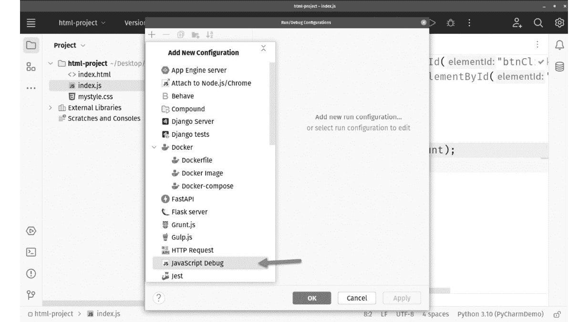

图 7.15：使用 JavaScript 调试模板设置运行配置，允许您在 PyCharm 中直接调试 JavaScript 代码

一旦您选择了模板，您将看到一个设置屏幕，类似于*图 7*.16*中的：


图 7.16：填写设置以运行您的 HTML 页面，该页面加载 JavaScript 以进行调试

关键设置字段在*图 7*.16*中编号。

在位置*1*，您可以填写运行配置的名称。您可以选择任何您喜欢的名称，因为名称不会影响运行配置的工作。对于 URL，您需要点击*2*处的文件夹图标，然后浏览到您的`index.html`文件。当您这样做时，PyCharm 将填写 localhost URL，以及 PyCharm 内置 Web 服务器使用的端口号。*3*处的选择确定要启动哪个 Web 浏览器。PyCharm 仅支持基于 Chromium 的浏览器进行调试。例如，Chrome、Chromium、Edge 或 Brave 都可以正常工作，但 Safari 或 Firefox 则不行。

在*4*处的设置很重要，因为它在`OnPageLoad`事件触发之前加载您的 JavaScript 断点。如果您正在使用基于`$(function()`调用的 JavaScript 进行加载，您应该勾选此框。我们的脚本非常简单，所以对我来说，不勾选这个框也行。请注意，勾选此框将减慢调试器启动的加载时间。

要开始您的调试会话，请点击常规调试按钮。如果您不记得在哪里，请参阅*第六章*。Chrome 将带您的网页启动。在点击我们之前制作的**点击我**按钮后，PyCharm 中的调试器应该会拦截该事件。与我们在*第六章*中的调试器覆盖范围一样，您可以使用所有相同的功能来检查和逐步执行您的 JavaScript 代码。

## 使用 Emmet 模板化工作

Emmet 是 PyCharm 中一个强大且广泛使用的插件，它提供了一种高效且简化的方式来编写 HTML、**JavaScript XML**（**JSX**）和 CSS 代码。它提供了一系列模板功能，这些功能可以显著提高开发者的生产力和加快编码过程。通过利用 Emmet 缩写和代码片段，开发者可以使用简写语法编写代码片段，并通过几个按键将其扩展为完整的 HTML 或 CSS 结构。唯一的缺点是您需要学习和记忆 Emmet 缩写。我没有空间将其变成一个 Emmet 教程。有一个作弊表可以在[`docs.emmet.io/cheat-sheet/`](https://docs.emmet.io/cheat-sheet/)找到。

要在 PyCharm 中使用 Emmet，您只需在编辑器窗口中输入一些 Emmet 缩写，然后按*Tab*键。例如，通过输入`ul>li.item$*5`，然后按*Tab*键，Emmet 可以生成一个包含五个列表项的无序列表，其中`$`符号会自动为每个项目递增。此功能在处理重复的 HTML 结构时特别有用，并消除了手动输入重复代码块的需要。

在 PyCharm 中，Emmet 的另一个强大功能是您可以高效地导航和编辑 HTML 和 CSS 代码。使用**转到编辑点**功能，开发者可以在扩展缩写中的预定义编辑点之间导航，从而实现快速修改和调整。此外，Emmet 的自动标签关闭功能确保 HTML 标签自动关闭，减少了语法错误的可能性，并在编码过程中节省了时间。**转到编辑点**功能实际上允许您在代码模板中放置占位符。如果您尝试了之前的无序列表示例，您可能会注意到代码已生成，但您的光标位于第一个列表项标签内，如图*图 7**.17*所示：

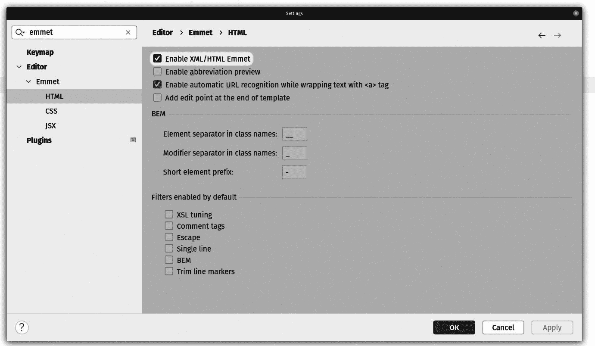

图 7.17：Emmet 通过模板中定义的编辑点生成了无序列表

Emmet 还提供了智能 CSS 缩写，简化了编写和展开 CSS 属性的过程。通过使用“bg”代表“background”或“p”代表“padding”等快捷方式，开发者可以快速生成 CSS 代码片段，而无需记住完整的属性名称。此功能加快了 CSS 开发过程，并提高了代码的可读性。

# PyCharm 专业版中的 HTML 项目类型

之前，我提到我想从一些基本的空项目开始，这些项目包含一些简单的 HTML、CSS 和 JavaScript 代码，这些代码是我们从头开始创建的。PyCharm 专业版提供了新的纯 HTML 项目类型。这里的“纯”意味着它们不使用任何现代 JavaScript 框架，如 React 或 Angular。这些现代框架代表了前端开发的一个范式转变。纯 HTML 项目将继续使用非常传统的 DOM 操作，就像我们在之前的 JavaScript 示例中所做的那样。要更改点击计数器 span 的内容，我们使用了以下代码：

```py
Document.getElementById
```

由于像这样的客户端 JavaScript 在浏览器中运行，代码可以访问文档对象，这实际上就是浏览器窗口。JavaScript 可以操作当前加载的文档，甚至可以更新浏览器窗口本身的内容。

现代 JavaScript 框架不再操作 DOM。相反，它们依赖于状态变化机制，并与阴影 DOM 的概念相结合。在 React 的情况下，你的程序，主要由 JavaScript、CSS 和 JSX 生成的 HTML 标记组成，维护一个由组件驱动的状态机。状态的变化会在 React 框架内触发事件，进而触发 UI 中受影响区域的重新渲染。

这对于初学者来说是一个相当复杂的范式，而且由于这不是一本关于现代 JavaScript 的书，我将把更深入解释的想法推迟到本章末尾的 *进一步阅读* 部分的其他书籍中。

我们可以查看两种基于 DOM 的项目类型。让我们来看看它们。

## HTML 5 模板

**HTML 5 模板**（**H5BP**）项目可以在 [`html5boilerplate.com/`](https://html5boilerplate.com/) 找到。这个项目自 2011 年以来一直存在，它代表了一个网站生成工具，体现了 HTML 开发的最佳实践。如果你能从一个 100% 符合规范的网站作为起点，然后对其进行修改以实现几乎任何功能，你就有 H5BP。

这里是其几个关键特性：

+   一个经过深思熟虑且结构化的 `index.html` 文件，包含所有可能的元数据标签和优化。只需添加内容即可。

+   `Normalize.css` 和 `Main.css` 负责处理 CSS 重置并提供一些基础样式，用于辅助工具、响应式设计的媒体查询，甚至提供打印友好的选项。

+   内置 Google Analytics。

+   Modernizr 库已包含在内，这样你可以检测运行你代码的浏览器，并相应地做出反应。

+   服务器设置文件，以便你可以提供性能和安全。

+   移动设备占位符图标、favicon 和渐进式 Web 应用。

正如我说的，这是任何网站终极的 HTML 5 起始套件，它不会让你陷入很多限制。旧版本使用 jQuery，但像许多其他框架一样，较新的构建在你不希望使用它的情况下会将其作为依赖项移除。

让我们在 PyCharm 中创建一个 H5BP 项目。点击 `h5bp`，我正将其放入电脑上默认的 PyCharm `Projects` 文件夹中。

在幕后，PyCharm 将通过 npm 使用 H5BP 生成一个大型项目。*图 7.18* 展示了我生成的项目：

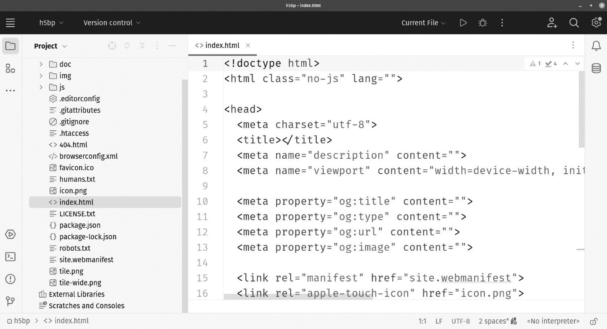

图 7.18：我的 HTML 5 模板项目，index.html 已打开

哇！看看所有你不必输入、查找或记住的代码！加载了一个更广泛的项目后，让我们看看一些我尚未指出的有用特性。

## 使用外部工具预览和编辑图形

你可以通过双击文件在 PyCharm 中预览图形。我将打开 *图 7.19* 中看到的 `tile.png` 文件：


图 7.19：只需打开即可在 PyCharm 中查看图形

我可能通过暗示您可以在 PyCharm 中编辑图像而让您有些困惑。您不能。但您可以配置一个外部编辑器，当您打开图形时，它将被启动。

打开设置窗口，找到**工具** | **外部工具**。点击顶部工具栏中的**+**图标。在*图 7.20*中，我正在设置**Gnu 图像处理程序**（**GIMP**），这是一个**Adobe Photoshop**的开源替代品：

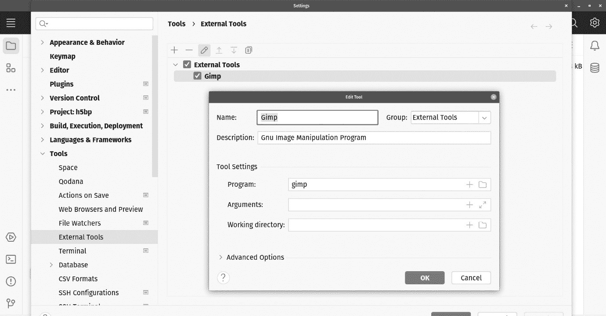

图 7.20：您可以将 GIMP 配置为外部编辑器以在项目中打开图像

请不要误解我：我更喜欢 Photoshop。如果您有它，请使用它。它不在 Linux 上运行（对我来说，Wine 不算），所以 GIMP 是下一个最好的选择。PyCharm 无法编辑的任何类型的文件都可以从外部编辑器中受益。我经常添加的另一个好工具是**Inkscape**或**Adobe Illustrator**，用于处理**可缩放矢量图形**（**SVG**）文件。这些很有用，因为它们是分辨率无关的。同样，如果您提供 PDF 文件，添加**Adobe Acrobat**或其他用于操作 PDF 的程序作为外部工具也是一个不错的选择。

要在外部编辑器中打开文件，只需右键单击文件，点击**外部工具**菜单选项，并选择适当的工具。

## 上传您的网站到服务器

许多大型网站和软件项目使用持续部署系统将代码部署到服务器。如果您的项目还没有达到那个阶段，或者您可能只需要一些简单的东西，PyCharm 有一个发布机制，旨在帮助您轻松发布网站或应用程序。就这个而言，它可以用来发布任何类型的软件，但我最常见的是用它来部署 Web 项目到 Web 服务器。

您可以在**工具**菜单中找到部署配置和工具，如图 7.21 所示：

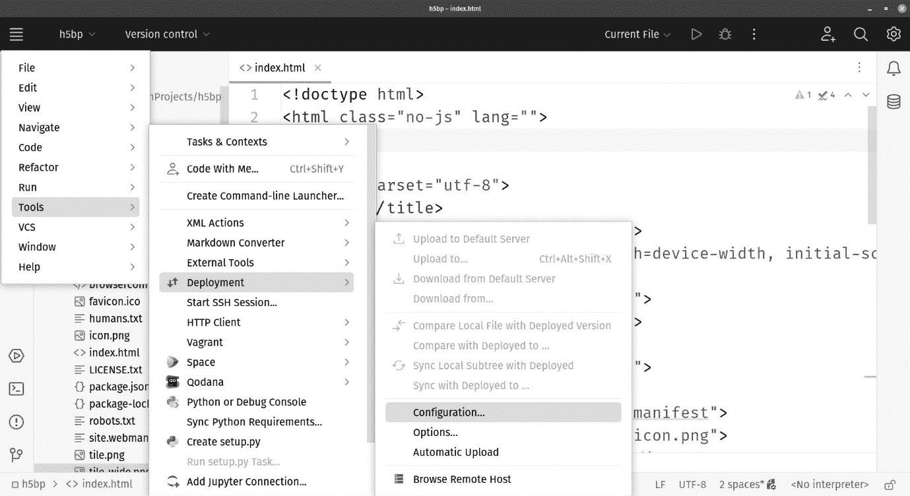

图 7.21：通过访问工具 | 部署可以找到部署设置和工具

设置部署的过程包括配置一个或多个远程服务器。让我们看看这是如何操作的。

### 配置远程服务器

点击*图 7.21*中显示的**配置…**菜单选项。您将看到一个显示**请添加一个 Web 服务器以进行配置**的普通灰色窗口。点击窗口左上角的**+**图标，并选择您打算使用的连接类型。您可以在*图 7.22*中看到选择项：

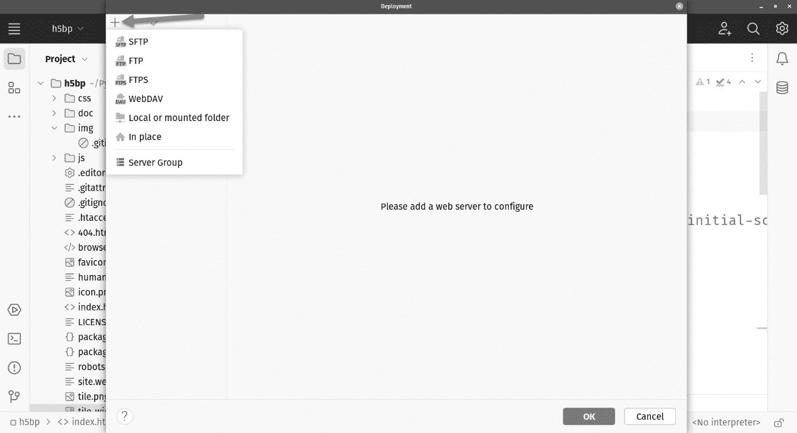

图 7.22：选择您想使用的服务器连接类型

您可以从几个连接协议中进行选择：

+   **安全文件传输协议**（**SFTP**）。这应该是您的首选。在列表上的选项中，它是最安全的，因为它依赖于**安全壳协议**（**SSH**）。

+   **文件传输协议**（**FTP**）。在现实世界中，你永远不应该使用这个选项。FTP 本身会将所有认证数据以未加密的文本流发送出去。只有当你想让你的网站被黑客攻击时才使用它。

+   **安全文件传输协议**（**FTPS**）是带有**安全套接字层**（**SSL**）加密的 FTP。你可以使用与 HTTPS 一起用于保护网站的加密证书来使用 FTP，使其成为 FTPS。

+   **Web 分布式创作和版本控制**（**WebDAV**）是在微软和 Macromedia（后被 Adobe 收购）等公司向网页设计师销售网页创作工具的时代创建的——也就是说，这些人编写 HTML，但并不非常技术化。其中大多数在 1998 年的大开发者叛乱中消失了。WebDAV 允许创作工具无缝地连接到服务器，几乎无需麻烦。然而，像 FTP 一样，它也有其安全问题的份额。我不建议使用它。

+   **本地或挂载文件夹**用于当你直接访问用于托管你的网站或应用程序的文件夹时。

+   `构建`，然后将必要的文件复制到那个文件夹中。我发现**本地或挂载文件夹**选项更有用。

我将指导你如何使用 SFTP 连接到服务器。当你点击**Web 服务器**，如*图 7.23*所示：

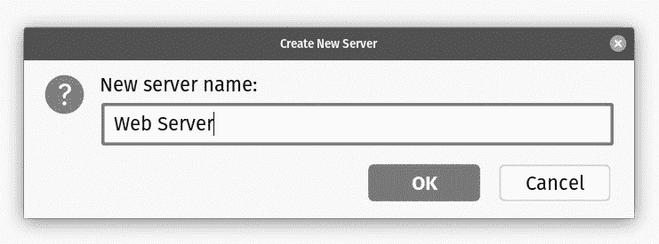

图 7.23：给你的服务器起一个描述性的名称

接下来，你需要凭证。你通常可以从你友好的本地系统管理员或托管服务提供商那里获得这些凭证。这些凭证将输入到一个 SSH 配置中，它与你的部署服务器配置是不同的。UI 在这里有点奇怪。要设置 SSH 配置，点击*图 7.24*中显示的省略号按钮：

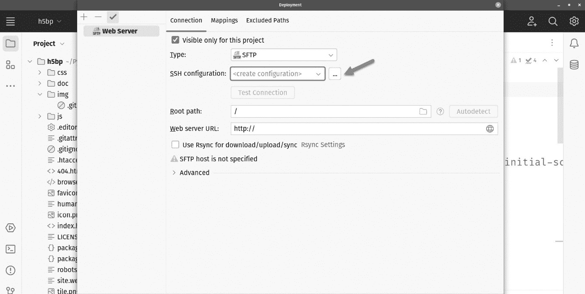

图 7.24：创建部署需要你点击此处显示的省略号来创建 SSH 配置

这会弹出一个另一个空白的灰色窗口。点击这个窗口右上角的**+**号，你将看到一个像我一样的屏幕，如*图 7.25*所示。

填写你的连接详情——即你的主机、端口、用户名和密码。除了密码外，你还可以使用 SSH 密钥或连接到 OpenSSH 配置和认证代理。我会保持简单，坚持使用密码。点击**测试连接**按钮会告诉我我的凭证是否有效。

接下来，我们需要一个根路径。这应该是你网站服务器的文档文件夹的根目录，假设你打算部署一个网站。那里有一个自动检测按钮，它会找到 SSH 用户的家目录。如果你从那个位置提供服务，这是可以的。通常，人们会从远程服务器上的`/var/www/html`这样的位置提供服务。如果这是你的服务器使用的文件夹，请确保你的系统管理员给你提供访问该位置的凭证。

在下面，你会看到一个关于网站服务器 URL 的条目。服务器上的根路径应该映射到网站服务器 URL。你可以在*图 7.25*中看到我的设置：

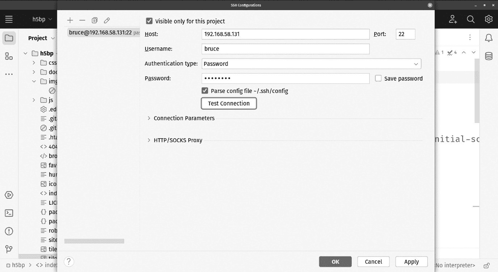

图 7.25：我的部署设置（到目前为止）

你的下一个步骤是**映射**标签页。*图 7.26*显示了带有指定映射的**映射**标签页：

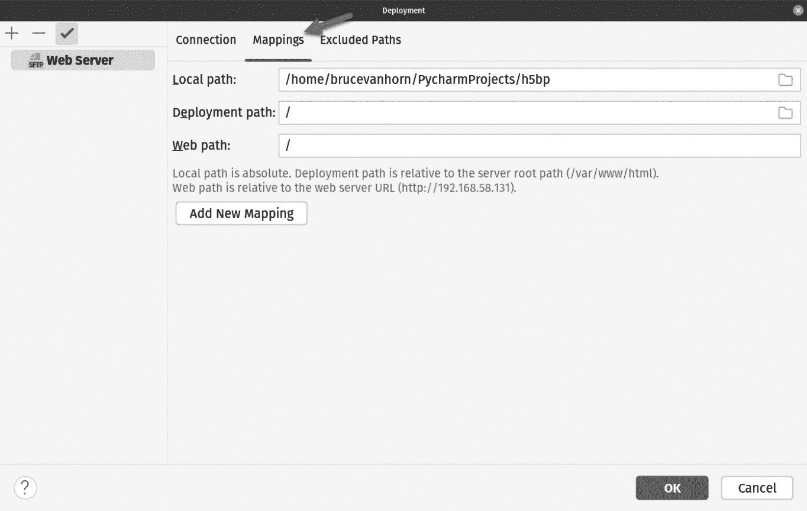

图 7.26：映射标签页指定了计算机上的文件夹与服务器上的文件夹之间的映射

对于一个网站项目，通常只需要在计算机上包含你的代码的文件夹和网站服务器的文档根目录之间建立一个映射。接下来，切换到**排除路径**标签页，如图*图 7.27*所示：

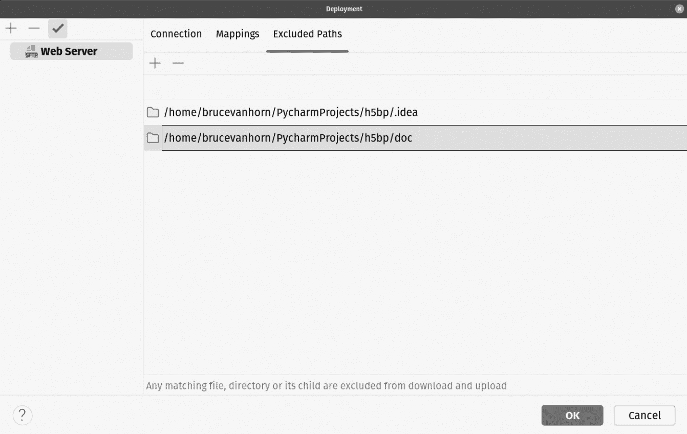

图 7.27：排除不需要复制到服务器的路径

排除任何你不想复制的文件。你可以指定不应复制到服务器的本地文件，以及不应复制到你的计算机的远程文件。我添加了`doc`文件夹的内容，该文件夹包含开发者的文档，以及`.idea`文件夹的内容，该文件夹由 PyCharm 使用。点击**确定**，你的部署将被配置。

### 上传到服务器

现在，你已经准备好上传你的项目了。回到**工具** | **部署**菜单，这次点击**上传到网站服务器**，如图*图 7.28*所示：


图 7.28：上传控制位于部署菜单中

如果你给你的远程服务器取的名字不是 Web Server，那么这个名字就会出现在菜单中。你将需要确认上传操作。PyCharm 将显示一条消息，表明上传成功，如图*图 7.29*所示：

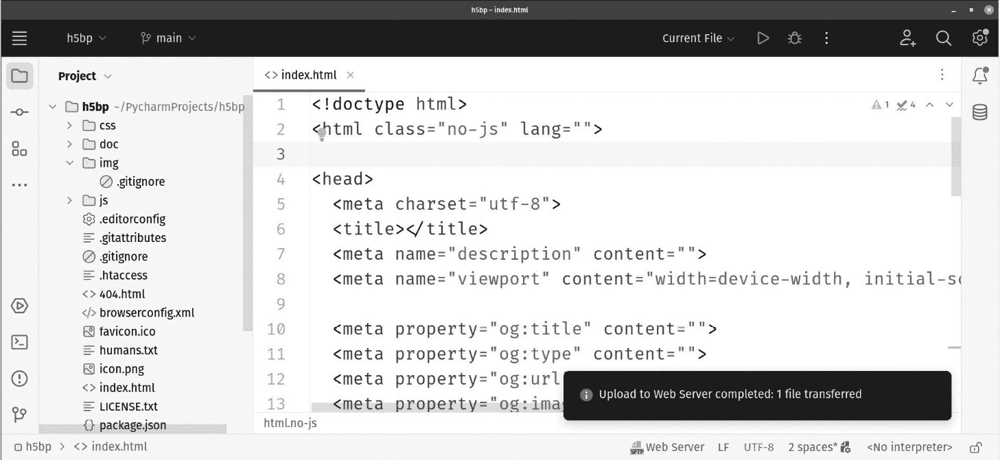

图 7.29：index.html 文件已成功传输

上传操作只复制了打开的`index.html`文件。我们可以通过点击**工具** | **部署** | **浏览远程主机**来检查这一点。这会显示远程主机的视图，允许你查看主机上的文件。你可以在*图 7.30*中看到我的文件：

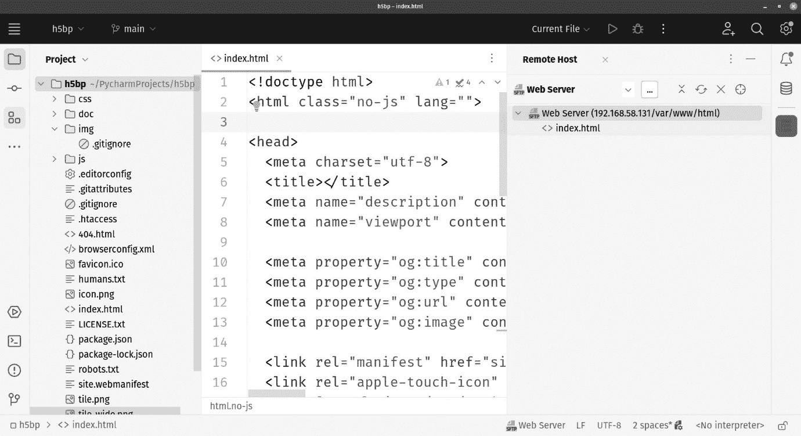

图 7.30：您可以在服务器上查看映射的项目根文件夹

您可能希望上传整个网站而不是单个打开的文件。在远程主机窗口内右键单击并点击 **上传到此**，如图 *图 7.31* 所示：


图 7.31：右键单击然后选择“上传到此”以上传整个网站

如菜单所示，您可以对服务器上的文件进行完全的图形化控制，包括所有文件操作，如重命名、复制或删除。您可以将本地文件与远程文件进行比较，以查看差异，当然，文件操作是双向的，因此您可以将直接在服务器上完成的工作同步回您的计算机。

总而言之，这个工具比 FileZilla 这样的独立文件传输程序更强大。它直接集成到 IDE 中，甚至还有一个自动同步设置，在您保存文件时自动将本地副本上传到远程。PyCharm 提供了您在网站或应用程序的 HTML 前端工作所需的一切，包括直接从 PyCharm 发布的能力。

## 创建 Bootstrap 项目

Bootstrap 是另一种在 PyCharm Professional 中可以使用的以 DOM 为导向的 HTML 5 项目类型。如果您正在构建一个应用程序而不是网站，这个类型将更有用。Bootstrap 是由 Twitter 开发的一个样式化 HTML 组件库，它帮助用户快速开发应用程序。本质上，您可以通过简单地生成此项目，然后复制粘贴 Bootstrap 片段（如按钮、卡片布局、滑块、开关和移动优先网格系统）来制作一个看起来很棒的应用程序。

您可以通过点击 **文件** | **新建项目**，然后在右侧模板中选择 **Bootstrap**，如图 *图 7.32* 所示来创建一个 Bootstrap 项目：


图 7.32：创建 Bootstrap 项目

这个模板所做的只是创建一个 `js` 文件夹和一个 `css` 文件夹。然后 PyCharm 下载 Bootstrap 并将库文件放置在相应的文件夹中。就是这样。它甚至不会为您生成一个 `index.html` 文件。这只是快速设置带有 Bootstrap 的项目的一种方法。

# 使用现代 JavaScript 和 NodeJS

PyCharm 在 Web Storm 产品中提供了所有其功能和模板，Web Storm 是为与现代 JavaScript 项目一起工作而设计的。由于我假设您主要对 Python 项目感兴趣，因此我不会花太多时间深入探讨服务器端 JavaScript 开发的细节，因为我们在接下来的几章中将会介绍 Python 选项，例如 Flask、FastAPI、Pyramid 和 Django。

然而，您应该知道，如果您有 JavaScript 项目和 Python 项目，没有必要购买两个独立的产品。

## 创建 NodeJS 项目

要创建一个新的 Node JS 项目，只需点击`NodeJS`项目模板。这相当于使用`npm init -y`命令生成项目。你得到的是一个通用的`package.json`文件。它相当基础，但它确实可以节省你启动终端并运行`init`命令的麻烦。

除了基本的 Node 项目外，你还可以生成**Next.js**项目或**Express**项目。Express 是 JavaScript 对 Flask 的回应，我们将在下一章中介绍。它用于开发项目的后端。另一方面，Next.JS 是前端和后端开发的融合，提供了一个易于使用的托管服务。有关更多信息，请参阅[`nextjs.org`](https://nextjs.org)。

## 创建 React 项目

React 是目前最受欢迎的前端框架之一。它在前端开发中代表了一种范式转变，因为它不使用 DOM 来操纵 Web UI 的外观。而不是使用 DOM 根据需要显示和隐藏**单页应用**（SPA）中的组件，你而是操作一个状态对象，这会导致 React 更新页面。

React UI 是以一组组件的形式开发的，这些组件协同工作，并使用生命周期方法或钩子来处理传统或自定义事件。我在这里展示了更多关于 React 的工作，因为它是我日常工作中使用的，而且在下一章中，我将展示如何使用 FastAPI 与 React 前端结合使用。

创建 React 项目就像我们之前看到的那些一样简单。只需点击`create-react-app`，这通常是从命令行执行的：

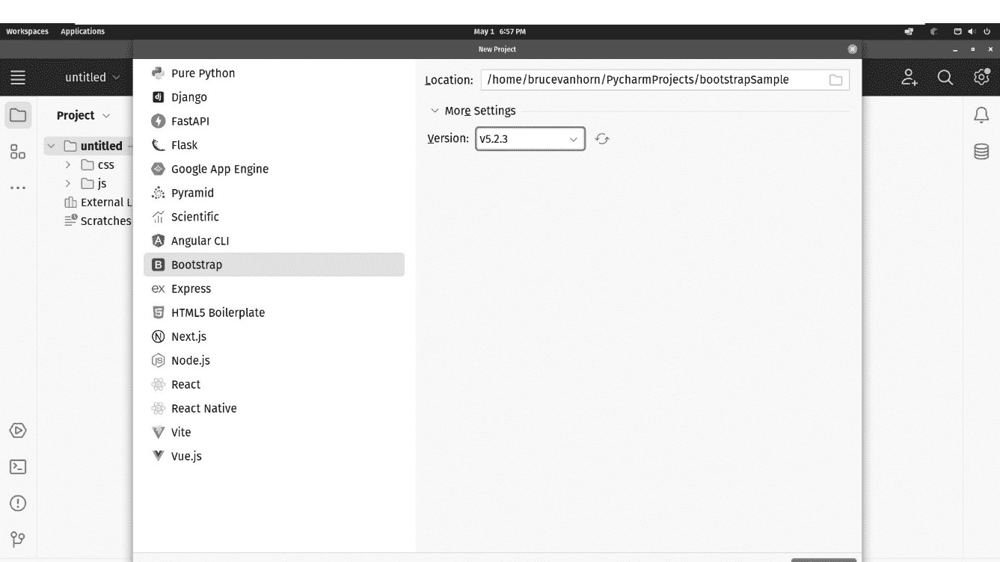

图 7.33：从 PyCharm GUI 运行 Create React App

PyCharm 还提供了一个简单的方法来在默认的 JavaScript 和许多开发者的首选 TypeScript 之间进行选择。TypeScript 是微软在 Douglas Crockford 所著的《JavaScript，好部分》一书之后开创的一种 JavaScript 变体。TypeScript 旨在修复许多不良部分，例如缺乏强大的类型系统。

## 其他前端框架

PyCharm 支持其他几个现代前端框架。

**Angular**与 React 类似，因为它使用由状态机驱动的组件。最大的区别，除了因主要版本发布不向后兼容而臭名昭著之外，是组件之间的双向通信。在 React 中，属性从上到下钻取。在 Angular 中，组件之间的通信是双向的。这可能会使你的应用程序更难调试。

**React Native**是 React 的一个分支，旨在为移动和桌面应用程序创建原生用户体验。微软最新的.NET 框架版本包括一个 React Native 变体，用于创建桌面应用程序的 Windows 用户界面。

**Vite**是一个旨在解决与冗余相关的性能问题的现代框架。在其他任何框架中，一个项目可能需要数十个甚至数百个 JavaScript 模块导入，这会减慢开发和应用程序本身的性能。Vite 使用高级打包工具来简化前端开发过程。

**Vue**是另一个提供声明式组件化编程模型的 Frontend 框架。虽然 React 严重依赖于 JSX，但 Vue 使用标准的 HTML、CSS 和 JavaScript，并且可以配置以包含路由、服务器端渲染等功能。

# 摘要

本章介绍了将 PyCharm 作为网页和应用程序的前端开发工具的使用。我们发现 PyCharm 在这个领域具有非常丰富的功能，因为 JetBrains Web Storm 产品直接集成到 PyCharm Professional 中作为预安装的插件。

这提供了所有功能强大的、专门用于开发 HTML、JavaScript 和 CSS 的工具体验。所有在 Python 中可用的调试能力在 JavaScript 代码中同样适用，无论是客户端还是服务器端。虽然我们没有花时间讨论服务器端 JavaScript，但与 NodeJS 项目一起工作的能力是存在的。

PyCharm Professional 为我们提供了大量的项目模板，包括传统的基于 DOM 的开发策略，如 HTML 5 Boilerplate 和 Bootstrap，以及基于现代状态机系统的 Angular 和 React。

我们学习了如何利用 PyCharm 的部署工具将网站和应用程序上传到远程服务器。我们还学习了如何配置外部工具，如图像编辑器，以便它们可以直接从 PyCharm 启动。

在介绍了前端工具之后，在下一章中，我们将探讨如何使用 Flask 框架开发全栈 Web 应用程序。

请务必查看本书的配套网站[`www.pycharm-book.com`](https://www.pycharm-book.com)。

# 问题

回答以下问题以测试你对本章知识的掌握：

1.  HTML 代码的目的是什么？HTML 文件是如何结构的？

1.  CSS 代码的目的是什么？CSS 文件是如何结构的？

1.  JavaScript 代码的目的是什么？一般来说，是什么让它成为最受欢迎的 Web 编程语言之一？

1.  在 PyCharm 中，如何将 CSS 样式表或 JavaScript 脚本包含在 HTML 文件中？

1.  Emmet 是什么？PyCharm 是如何支持它的？

1.  在 PyCharm 中调试 JavaScript 有哪些可用的选项？

1.  从 PyCharm 部署 Web 应用程序最安全的方法是什么？
