# 8

# 使用 Flask 构建动态网络应用

我很幸运，自从网络开发的诞生以来，我就一直在这个领域。在万维网出现之前，至少是公众使用的万维网，我就是一名软件工程师。我记得第一次有人让我构建一个网络应用。我不得不问这是什么。那个人告诉我，我记得当时在想，“嗯，这很愚蠢！为什么人们不用 CompuServe 或 **美国在线**（**AOL**）来做这件事呢？”我认为互联网最多只会是一个时尚。它很复杂，充满了术语，与当时的在线服务相比，用户界面很糟糕，而且一切看起来都很粗糙。我想我错了。

一旦我明白了这一点，我就学习了 HTML 和 JavaScript。CSS 还没有出现。不久我就遇到了 HTML 功能的瓶颈。正如你所知，HTML 不是一个编程语言。它是一种内容标记语言，用于控制静态内容的呈现。JavaScript 的最早版本并不太有用。你可以验证表单。就这些了。在 HTML 3 出现之前，使用 JavaScript 生成动态内容并不是一个功能。

就像我说的一样，我遇到了瓶颈。我需要从浏览器中获取用户交互数据，并使用它来与数据库交互、生成文件等等。使用 HTML 和 JavaScript，这根本不可能。我需要一个后端语言。最初，那就是 C 语言。即使是那也有限制。你必须用 C 语言编写模块，这些模块可以通过一个名为 **公共网关接口**（**CGI**）的接口与 Apache 网络服务器交互。

在最初的几年里，就是这样了。编写动态网络应用很困难，远远达不到今天的能力。新的语言和范式出现，使得网络开发的实践更加容易。我第一次良好的体验是与一个名为 `.cfml` 扩展的产品有关，它以不同于普通 HTML 文件的方式处理这些文件。我能够非常容易地访问 Oracle 数据库，并且，结合许多漫长的夜晚和我的青春期的创造力，我创建了一些图形管道软件，这为我的雇主赢得了软件专利。

CFML 是一个增长趋势的一部分。许多其他新兴公司和堆栈也采用了同样的技术，包括以下这些：

+   Microsoft 创建了 **活动服务器页面**（**ASP Classic**）

+   Sun Microsystems 推出了 **Java 服务器页面**（**JSP**）

+   **超文本预处理器**（**PHP**）

+   **国家超级计算应用中心**（**NCSA**）创建了 **服务器端包含**（**SSIs**），虽然它的功能不如列表中的其他产品丰富，但仍然作为一种生成动态内容的方式存在。

在本章中，我们将迈出巨大的步伐，探讨一个更现代的用于创建动态内容的框架，这个框架是在服务器端而不是在浏览器客户端内部生成的。具体来说，我们将探讨一个名为**Flask**的框架，这是一个流行的、无偏见的 Python 网络应用程序创建解决方案。到本章结束时，你将理解以下内容：

+   网络开发的基础，例如**客户端-服务器架构**，以及网络使用的无状态**请求-响应模型**。

+   Flask 是什么，以及它与其他 Python 网络开发框架相比如何

+   如何在 PyCharm 中创建 Flask 应用程序。

+   如何在 PyCharm 中使用**Jinja2**模板，这些模板用于提供动态内容，与常规 HTML 标记、CSS 样式和 JavaScript 交互性混合。

+   如何创建一个返回 JSON 格式数据的 RESTful API 端点，而不是内容。

+   如何使用 PyCharm 的 HTTP 请求功能测试你的 API

请记住，本章的目的不是提供一个 Flask 教程。它是一个关于如何使用 PyCharm 与 Flask 一起工作的教程。如果你正在寻找一个完整的 Flask 教程，请访问我的网站[`www.maddevskilz.com`](https://www.maddevskilz.com)。那里有几个扩展的 Flask 教程，深入探讨了构建整个项目。

# 技术要求

为了继续本章的学习，以及本书的其余部分，你需要以下内容：

+   安装并运行良好的 Python 解释器。我将使用来自[`python.org`](https://python.org)的最新版本。

+   安装了`pip`和`virtualenv`。当你安装 Python 在 Windows 上时，这些会自动安装，macOS 系统上通常也包含它们。如果你使用 Linux，你需要单独安装包管理器，如`pip`，以及虚拟环境工具，如`virtualenv`。我们的示例将使用`pip`和`virtualenv`。

+   安装并运行良好的 PyCharm。安装已在*第二章**，安装和配置*中介绍，以防你在本书的中间部分开始阅读。

+   本书提供的示例源代码来自 GitHub。我们已经在*第二章**，安装和配置*中介绍了如何克隆代码。你可以在这个章节找到相关的代码：[`github.com/PacktPublishing/Hands-On-Application-Development-with-PyCharm---Second-Edition/tree/main/chapter-08`](https://github.com/PacktPublishing/Hands-On-Application-Development-with-PyCharm---Second-Edition/tree/main/chapter-08)。

# 网络基础 - 客户端-服务器架构

当我在 1991 年开始我的 IT 职业生涯时，我在一家名为**电子数据系统**（**EDS**）的公司工作。那是一个不同的时代。当时，任何严肃的计算机操作都是由被称为**大型机**的单一系统完成的。想象一下，大型机计算机就像在个人电脑和智能手机时代之前存在的极其强大和大规模的计算机。它就像一台超级计算机，能够处理大量数据并执行复杂的计算。

大型机通常被安置在特别设计的房间或数据中心，因为它们需要大量的空间和专业的电源和冷却系统才能正常工作。典型的大型机通常大约有微型货车的尺寸，而其独立的**电源分配单元**（**PDU**）的尺寸大约是典型洗衣机的两倍。**直接访问存储设备**（**DASD**）位于另一个同样大小的长方形金属箱中。连接这些各种组件的是直径大约与用过的纸巾卷相似的粗电缆。IBM Z14 系列型号的重量在 2,500 至 4,000 公斤（5,500 至 8,800 磅）之间。

在过去，大型机通常被大型组织，如银行、政府机构、大学和大型企业所使用。它们负责处理和管理大量数据，运行关键业务应用程序，并支持整个企业的运营。在我的情况下，我与负责运行**通用汽车**（**GM**）等公司的汽车装配线操作的 IBM 大型机系统一起工作。

大型机以其可靠性、安全性和高性能能力而闻名。它们能够同时处理多个任务并提供快速响应时间，即使在处理大量工作时也是如此。人们通过终端或其他连接设备访问大型机以执行任务或检索信息。

随着技术的进步和个人电脑的出现，大型机的角色已经发生了演变。虽然它们在特定行业中仍然发挥着至关重要的作用，但许多曾经仅限于大型机的计算任务现在由分布式系统、相对便宜的机架式 Intel 和 IBM Power 系统、云计算以及笔记本电脑和智能手机等小型设备来处理。

主机计算机，我想现在仍然是，拥有和运营成本非常高。不仅硬件昂贵，而且通常需要一支由专家计算机操作员和维护人员组成的团队来保持系统运行。这种成本对于除了最大型的公司和大学之外的所有人来说都是难以承受的。较小的公司和甚至更小的国家不得不在其他人的主机上购买时间，以获得大规模计算的机会。实际上，这就是 EDS 提供的服务。我们在全球几个大型数据中心拥有大片空间，并向几乎所有的《财富》500 强公司出售时间和提供服务。最终，成本以及摩尔定律的影响导致了主机的衰落。

**摩尔定律**是由英特尔公司联合创始人戈登·摩尔在 1965 年提出的一个观察和预测。它指出，微芯片上的晶体管数量大约每两年翻一番，导致计算能力和性能显著提高，同时降低了电子设备成本。

摩尔最初指出，这种晶体管密度的指数增长自集成电路发明以来一直在发生，并且他预测这种增长在未来可预见的时期内将继续。多年来，摩尔定律表现得非常准确，半导体制造技术的进步使得晶体管越来越小，集成电路越来越复杂。

每两年晶体管密度的翻倍对计算领域产生了深远的影响。它使得更强大、更高效的计算机的发展成为可能，提高了处理速度、内存容量和存储能力。随着可以在芯片上装入更多晶体管，电子设备的整体性能得到提升，而其物理尺寸却减小了。

随着计算机变得越来越小，以及**精简指令集计算**（**RISC**）和最终英特尔 x86 架构的出现，一种新的计算模式出现了：**客户-服务器**。

主机计算机是集中的，并通过“哑”终端进行访问。这些终端没有计算能力，没有存储，只有足够的内存来维护一个通信缓冲区，以便将您在键盘上输入的内容发送到主机进行处理。

客户-服务器架构将一些计算、存储和内存转移到本地客户端，这通常是一个 PC。客户端通过**局域网**（**LAN**）连接到服务器，服务器通常比 PC 更强大，能够运行企业级计算负载。通常，您会有客户端软件，它由在 PC 操作系统上运行的桌面用户界面组成。客户端软件与服务器上运行的集中式软件进行交互。

除了客户端和服务器硬件外，大约在同一时间出现了一个最终组件：一个称为**传输控制协议/互联网协议**（**TCP/IP**）的标准网络协议。在我上大学之前，还没有 TCP/IP，为了与俄克拉荷马大学的巨型机交互，我必须随身携带一叠软盘，里面装有奇异的、不匹配的通信协议集合。一些系统使用名为**高效、远程和多个计算机交互内核**（**KERMIT**）的协议。我还有用于*XMODEM*、*YMODEM*和*ZMODEM*的磁盘。根据我想访问哪种类型的计算机，我必须使用不同的协议。TCP/IP 通过一套标准协议改变了这一切，这些协议被从主机和 PC 到现代智能手机和互联网连接的烤面包机等所有设备所支持。

如果这听起来像是互联网，你就对了——但有一些注意事项：

+   客户端/服务器非常慢，而且通常甚至不是全双工的，这意味着数据只能一次单向流动。

+   大多数客户端程序没有真正的 GUI，也不支持鼠标交互。它们被称为“绿色屏幕”界面，因为它们使用文本菜单在通常是绿色的单色屏幕上渲染。后来，厚客户端应用程序具有真正的 GUI，通常是用 Java、Visual Basic、C++或 Delphi 编写的。它们被称为厚客户端，因为程序的大小足够大，以至于通过典型的连接下载 GUI 可能需要数小时。这与在现代互联网上运行的典型网络应用程序形成鲜明对比。

+   客户端软件始终围绕一组特定的用例进行设计。相比之下，今天的网络浏览器，作为客户端，可以运行任何类型的软件，从通用的文字处理应用程序到特定的业务线应用程序。

网络是客户端/服务器架构的自然演变。轻量级的客户端软件，即网页浏览器，连接到一个集中式服务器，在那里使用普遍接受的网络协议处理大部分实际工作。

# 探索 HTTP 中的请求-响应机制——客户端和服务器如何通信

20 世纪 80 年代的一项伟大成就，除了含有 CFC 的喷雾剂外，就是开发了一套通用的网络协议，称为 TCP/IP。如果你对此还不太熟悉，正确的发音方式是作为字母：*tea sea pea eye pea*。斜杠是沉默的，就像忍者一样。

虽然它花了很长时间才被普遍采用，但最终它确实被采用了，TCP/IP 协议构成了现代网络的基础。尽管有许多有用的协议服务于无数的功能，但我想要将你的注意力集中在**超文本传输协议**（**HTTP**）上。你可以继续包括其安全的对应版本，*HTTPS*，其中*S*代表*安全*。它们有效地以相同的方式工作，只是 HTTPS 是加密的。

请求-响应机制涉及一系列事件，描述了在网页浏览器或客户端与 Web 服务器之间发生的对话。你可以在*图 8.1*中观察这个对话的展开。

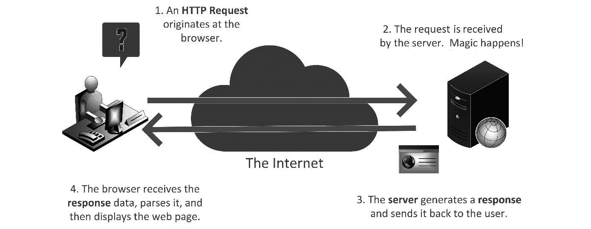

图 8.1：HTTP 中的请求-响应机制将浏览器对服务器的请求传递过去，服务器计算响应并将其发送回浏览器

HTTP 使用的请求-响应机制是客户端（如网页浏览器或移动应用程序）与万维网上的服务器之间的基本通信模式。它的工作方式如下：

1.  `GET`、`POST`、`PUT`或`DELETE`，这表示要在服务器资源上执行的操作，以及额外的头信息，在某些情况下，还包括携带数据的请求体。

1.  **服务器接收请求**：在收到请求后，服务器处理请求中提供的信息。这可能涉及访问数据库、执行计算或根据请求的性质执行其他服务器端操作。最简单的请求是请求一个 HTML 文档或其他简单返回的文件。

1.  **服务器生成响应并发送给用户**：在处理请求后，服务器生成一个 HTTP 响应。响应包含一个适当的状态码，指示请求的结果。例如，成功的请求在响应头中带有状态码 200。如果你请求的服务器上的资源不存在，你会得到一个 404 代码，表示资源未找到。响应头还包括提供更多信息的一些附加字段，以及包含请求的数据或任何相关信息的响应体。

1.  **浏览器接收响应数据**：客户端从服务器接收 HTTP 响应并处理其中包含的信息。这可能涉及渲染 HTML 内容、处理数据或根据响应执行其他操作。

1.  **请求-响应周期完成**：收到响应后，请求-响应周期即完成。客户端可以选择向服务器发送额外的请求以执行进一步交互，或者过程可能结束。

这种请求-响应机制是客户端和服务器之间通过 HTTP 交换信息的基础。它允许客户端请求资源或对服务器执行操作，服务器则以相应的结果或必要的信息进行响应。这个周期使得 Web 应用程序和服务具有动态和交互的特性。

有一个需要注意的事情是 HTTP 是无状态的。这意味着每个请求-响应周期都是独立的。在 HTTP 中没有原生的方法在请求之间共享或保留数据。

# 什么是 Flask？

Flask 是一个无观点的框架，用于处理 HTTP 中发现的请求响应机制。它只做一件事，而且只做一件事：它帮助你将请求接收到一个简单的 Python 对象结构中，然后使用 Python 代码构建响应。

让我们回到“无观点”这个词。我的意思是，Flask 设计上只处理请求响应周期。我意识到我已经说过这一点了，但值得重复。当你将 Flask 与其虚拟对立面 Django 进行比较时，差异是明显的。

Django 对如何创建你的 Web 应用有着非常强烈的观点。Django 决定了文件结构、应用程序模式和要使用的数据库。它拥有自己的对象关系映射器、自己的请求响应机制以及自己的一套编码规范。简而言之，Django 将决定你的技术栈以及你项目的多数架构细节。

Flask 提供了一些建议，但这些并不是固定不变的，如果你不想使用，也可以不用。几年前，我重新编写了我公司旗舰软件产品 Visual Storage Intelligence（见[`www.visualstorageintelligence.com`](https://www.visualstorageintelligence.com)）作为一个 Flask 应用，严格是因为它没有观点。我认为自己在根据我的知识、经验和对我公司业务需求的理解来选择最佳技术栈方面是一个专家。

例如，我几乎从不使用 ORM。我对 SQL 和关系型数据库系统有深入的了解。我能够编写和调整查询、存储过程和视图，以在各种商业和开源数据库中构建快速、响应灵敏的 Web 应用。ORM 的设计目的是从你的手中拿走所有这些，并在数据库之上提供一个抽象层，这样开发者只需处理对象即可。

ORM 实际上是一个黑盒。大多数开发者不知道它是如何工作的，也不知道如何提高 ORM 生成的查询性能。对我来说，它只是额外的开销。我个人更愿意自己构建和调整这些内部结构。顺便说一句，如果这些数据库相关的术语让你感到困惑，请保持关注。我将在第十一章*理解数据库管理*中详细讨论数据库。

重点是，Flask 不关心我如何与数据库交互。它不关心我如何构建我的应用程序，也不关心我的技术栈看起来如何。它只做两件事，其中之一是可选的。

## 使用 Werkzeug 处理请求响应和路由

Flask 为我们做的第一件事是使处理 HTTP 中的请求响应机制变得非常简单。严格来说，一个传入的请求在本质上来说是二进制的。作为开发者，我们更愿意处理类似于文本的对象抽象的二进制结构。直接处理任何二进制内容都是非常过时的。幸运的是，有一个名为 Werkzeug 的 Python 库可以处理这个问题。

图书馆的名字“Werkzeug”源自德语，其意为“工具”或“仪器”。Flask 框架及其底层实用库 Werkzeug 最初由德国软件开发者 Armin Ronacher 开发。

选择“Werkzeug”这个名字是为了反映该库作为构建 Web 应用程序的多功能和强大的工具集的本质。正如工匠依赖一套工具来创造和塑造他们的作品一样，开发者可以利用 Werkzeug 来处理 Web 开发的各个方面，如路由、请求处理和 HTTP 实用工具。Flask 建立在 Werkzeug 之上；它添加了额外的抽象和功能，以提供一个轻量级且用户友好的 Web 框架。

Flask 使用 Werkzeug 的功能来处理 HTTP 请求和响应的低级细节，使开发者能够快速高效地构建 Web 应用程序。结果是能够创建像创建任何其他 Python 应用程序一样简单的 Web 应用程序：您创建函数来处理传入的 HTTP 请求，它返回一个格式正确的 HTTP 响应。如果您能在 Python 中编写一个函数，您就可以创建一个 Web 应用程序。

Flask 中的实现如下所示：

```py
@app.route('/hello')
def hello_world():
  return 'Hello, World!'
```

如您所见，这是一个简单的 Python 函数，它不接受任何参数并返回一个字符串。这个函数唯一奇怪的地方是函数定义上方的装饰。我们稍后会学到更多关于这个装饰的内容。现在，请理解这个装饰与您应用程序 URL 上的一个路由相匹配。您习惯于输入一个带有常规语法的 URL，例如[`www.maddevskilz.com/`](https://www.maddevskilz.com/)，这将带您访问该地址的网站根文档。在前面的代码块中，我们的函数将响应任何对[`www.maddevskilz.com/hello`](https://www.maddevskilz.com/hello)的 Web 请求，并返回字符串`'Hello, World!'`。自然地，您将学会处理比这更复杂的请求，但我的观点是：如果您能在 Python 中创建一个函数，您就可以编写一个 Web 应用程序！

使用 Flask 的这个特性是不可避免的。如果您不想使用 Werkzeug 的这个抽象，那么您就不想使用 Flask。Flask 再次是中立的，这意味着这真的是它“关心”的唯一事情。我们将在*第十二章**，使用 Django 构建 Web 应用程序*中看到对比。Django 非常具有意见。它希望您使用其预定义的堆栈。Flask 不在乎。然而，它确实提出了一个强烈的建议，如果您愿意，可以安全地忽略。

## 使用 Jinja2 进行模板化

Flask 确实提供了一个关于默认模板库 Jinja2 的建议。当您安装 Flask 时，您会得到 Jinja2 作为依赖项。模板化系统旨在允许您将内容注入到一个标记文档中。以下是一个 Jinja2 脚本的示例，它在 HTML 页面上生成一个无序列表中的某些项：

```py
from jinja2 import Template
# Define the template
template_str = '''
<ul>

 <li>{{ item }}</li>

</ul>
'''
```

模板只是一个包含一些特殊字符的字符串，这些字符指示 Python-like 代码的执行位置。所有模板语言都是这样工作的，从经典的 ASP 到 JSP 再到 PHP。Flask 进程从 Web 服务器获取请求。它解析请求，在这里我们使用模板来渲染响应。模板本身是一个标记片段。创建了一个名为`template_str`的变量，并将其设置为空字符串。记住，这不是 Python 代码，它是 Python-like 代码，因为它存在于标记的上下文中。单引号被单引号转义，这意味着```py `` ```在代码中被解释为单引号。

如您所见，我们有一个`for`循环遍历一个名为`items`的列表，这个列表将被作为数据传递到模板中。模板中的代码用``来界定。每个`<li>`都有一个用双大括号绑定的表达式。在这种情况下，表达式只是循环中定义的迭代变量 item。

在我的例子中，模板字符串是在代码中定义的，但在现实生活中，模板通常在文件中，因为这样更容易维护。接下来，我们创建`template`对象，并将`template`字符串传递给模板构造函数：

```py
# Create the Jinja2 template object
template = Template(template_str)
```

现在，我们回到了普通的 Python 代码。我们将创建一个名为`items`的列表并填充它：

```py
# Generate the list of items
items = ['Item 1', 'Item 2', 'Item 3', 'Item 4', 'Item 5', 'Item 6', 'Item 7', 'Item 8', 'Item 9', 'Item 10']
```

现在，我们渲染`template`，它生成一个新的字符串，并将其赋值给一个名为`output`的变量：

```py
# Render the template with the items
output = template.render(items=items)
```

在这里，我们正在打印输出，但在 Flask 应用程序的上下文中，输出将作为响应返回：

```py
# Print the rendered output
print(output)
```

Jijna2 拥有一套强大的语言特性，这些特性在大多数优秀的模板系统中都很常见。但请记住，Flask 自称为*无偏见*。你不必使用 Jinja2。还有其他模板库可供选择，或者你可以完全放弃使用模板系统。在我公司的产品*Visual Storage Intelligence*中，我使用了 Jinja2 来构建产品的第 4 版本。当时，我对 Python 不太熟悉，并且习惯了 Microsoft 的 C# Web 应用的 MVC 模板。我将我的学习曲线限制在满足截止日期的范围内。Jinja2 并不难学。它主要是 HTML，附带一些额外的语法。在产品的第 5 版本中，我回过头来用 React 前端替换了应用程序的 UI 层。这并不需要对 Flask 应用程序进行任何更改，除了删除我不再使用的模板。

提醒一下——这不是一本关于 Flask 的书

我花了一些时间回顾了 Flask 的高级基础知识，以防你是作为一个 Web 开发新手遇到这个问题。虽然看起来我好像要教你 Flask，但我只想介绍与 PyCharm 相关的 Flask 开发功能。虽然我们将要构建一个项目，但我不会深入探讨代码是如何和为什么是这样的。

因此，如果你确实是一个新手，并且你对我在这里提供的 Flask 的有意隐晦覆盖感到好奇，并且想要一个合适的教程，我将在本章末尾的 *进一步阅读* 部分包含更多深入的资源。

# 关于文件和文件夹命名的注意事项

在我们进一步创建下一个项目之前，我想根据我总是向我的学生指出的一个原则给你一些建议。`%20` 应该被认为是有效的。Web 服务器自动处理这种编码，但手动编码空格可能会导致 URL 中的可读性问题，并且在尝试在你的本地计算机上运行你的项目时可能会引起问题。

在一个 Web 项目中，你的大多数项目路径最终都会成为 URL。即使你的项目根本不是为 Web 设计的，这也可能发生。更糟糕的是，不同的操作系统在它们的文件系统中以不同的方式处理字符。Windows 的文件名不区分大小写。如果你将文件或文件夹命名为 `MyProject`，然后尝试创建一个名为 `myproject` 的文件夹，你会因为文件夹已经存在而遇到冲突，尽管名称中的大小写字母不同。在 Linux 和 macOS 上，文件和文件夹名称是区分大小写的。在同一个文件夹中同时拥有 `MyProject` 和 `myproject` 是完全可以的。

在所有这些中，我的建议是选择一个你喜欢的标准并使用它。对于 Python 项目来说，最常用的约定是将你的文件命名为 `MyProject`。相反，你会称其为 `my_project`。

话虽如此，这本书中的大多数项目都是以 PyCharm 的默认命名方式命名的，这些通常以驼峰式或帕斯卡式表示。在这些通常由 Java 和 C# 开发者采用的案例标准中，省略了空格，并且使用大写字母强调单词之间的边界。`myProject` 和 `MyProject` 分别是驼峰式和帕斯卡式的例子。我怀疑项目名称默认使用驼峰式可能是因为 PyCharm 的根源是一个 Java IDE。还有其他策略可以消除代码文件中的空格。在 JavaScript 开发中常见的 Kebab 式使用破折号而不是下划线。`MyProject` 变为 `my-project`。

我强烈建议在编码实践中避免在任何文件夹或文件名中使用空格。这包括任何上游文件夹，例如你的操作系统的家目录。

# 在 PyCharm Professional 中创建 Flask 应用程序

Flask 的工具仅存在于 PyCharm 专业版的特性中。当然，你可以在 PyCharm 的免费版本中创建 Flask 应用，但在创建文件、设置运行配置、特殊调试等方面，你将完全独立。

要在 PyCharm 中创建 Flask 应用，只需选择 **文件** | **新建项目**，然后选择 **Flask** 模板，如图 8* 所示。2*。

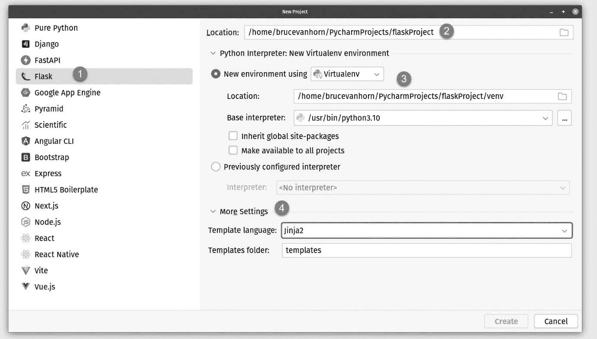

图 8.2：在 PyCharm Professional 中创建新的 Flask 项目，从新建项目对话框中选择模板

我在*图 8.2*中标记了最重要的部分：

1.  在 PyCharm Professional 的**新建项目**对话框中，你可以找到一个**Flask**项目的模板。

1.  这一部分与我们迄今为止所做过的任何项目都没有不同。填写项目的位置。

1.  创建你的虚拟环境。一旦填写完毕，PyCharm 将创建并激活虚拟环境，并安装 Flask 及其依赖项。

1.  这一部分是 Flask 项目的独特之处。我提到 Flask 鼓励使用 Jinja2 模板引擎。你可以选择不使用它，PyCharm 会为你处理。还有一个设置用于你想要使用的 Jinja2 模板文件夹。我们将保持默认设置，如果你打算使用 Jinja2 模板，我建议你保持设置不变，因为这是大多数开发者预期它们所在的位置。

一旦填写完毕，点击对话框底部的**创建**按钮，PyCharm 将为你设置项目，包括创建一些起始代码，如*图 8.3*所示。

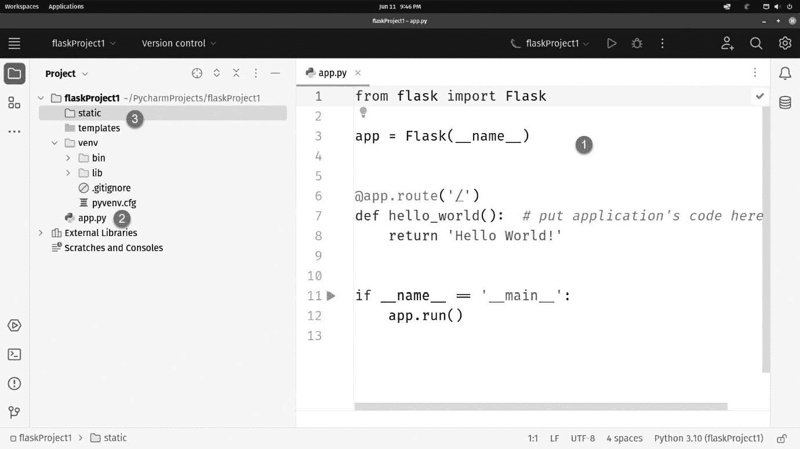

图 8.3：PyCharm 自动生成你的 Flask 项目

在之前的`Hello World`习语位置，除了这个是响应你的 Web 应用程序的根路由。在顶部，我们导入 Flask，然后我们将 Flask 实例化为`app`变量。现在你知道了这一点，*第 6 行*上的装饰对路由更有意义；`app.route`只是来自 Flask 的`app`实例。

所有这些代码都包含在`app.py`文件中，位于*图 8.3*的**（2）**位置。名称不是必需的，如果你愿意的话可以更改它。你还可以看到，在**（3）**位置，PyCharm 已经为 Jinja2 模板和静态文件（如你的图片、CSS 和 JavaScript 文件）生成了两个文件夹。

# 创建动态 Web 应用程序

PyCharm 生成的`Hello World`程序是新建应用程序的好起点。它为你提供了一些认知提示，以防你很久没有从头创建 Flask 应用程序。自然地，我们希望用稍微更有用的东西来替换`Hello World`。

让我们创建一个用于编目新 Python 库的非常简单的应用程序！这类项目通常使用数据库，但不必如此。我们的应用程序将包含 Python 库列表及其描述，以及我们认为它们有多有用的 1-5 评级。为了完成数据库部分，我们将简单地使用内存中的列表数组。采用这种方法可以避免深入研究 PyCharm 的数据库功能，这些功能将在*第十一章*中介绍，即《使用 PyCharm 理解数据库管理》。我们还将利用每一个机会来实际应用我们之前介绍的一些功能，例如使用上一章中的 HTML 功能。

## 设置静态部分

在构建 Web 应用程序时，最简单的起点是让静态部分工作。我指的是应用程序的非动态部分，例如具有基本结构的`index.html`页面，以及我们可能需要的任何 CSS、图像和 JavaScript。

首先，在`Templates`文件夹中右键单击并创建一个名为`index.html`的新文件。这是一个 Jinja2 模板，因此它应该放在`Templates`文件夹而不是`static`文件夹中。

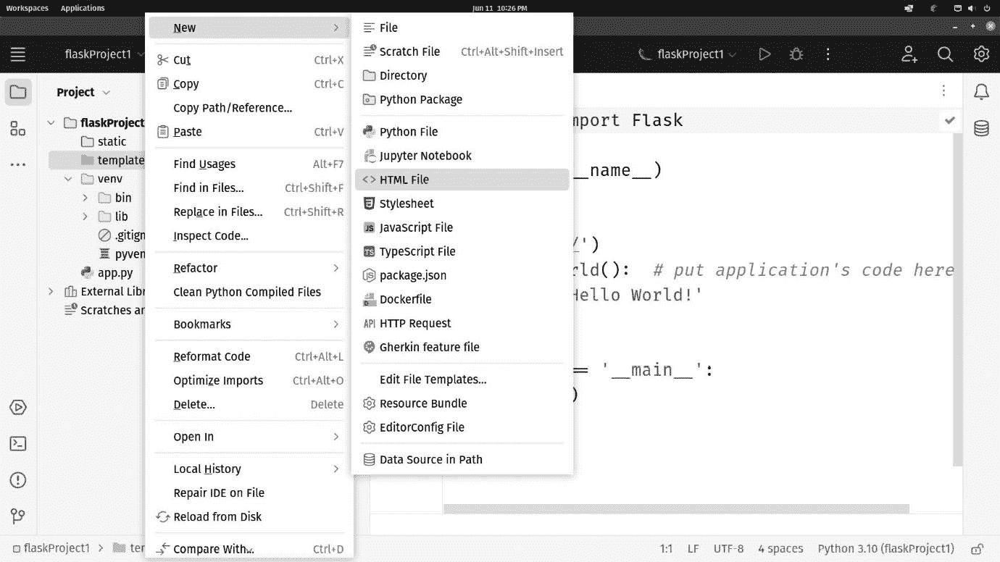

图 8.4：右键单击模板文件夹并创建一个新的 HTML 文件

注意，我们创建了一个普通的 HTML 文件。Jinja2 文件没有特殊的文件类型。该文件是使用我们在*第七章*中介绍的 Emmet 模板系统创建的，即《使用 JavaScript、HTML 和 CSS 进行 Web 开发》。希望您还记得，HTML 文件中的`title`属性允许您填写 HTML 模板中的空白部分。您可以在*图 8**.5*中看到我的示例。

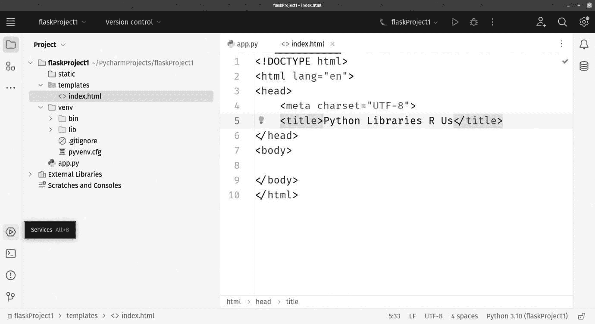

图 8.5：HTML 创建模板将光标置于标题标签中，以便您填写页面该部分的内容

接下来，让我们像这样修改`<head>`标签的内容：

```py
<head>
  <meta charset="UTF-8">
  <link href="https://cdn.jsdelivr.net/npm/bootstrap@5.3
  .0/dist/css/bootstrap.min.css" rel="stylesheet"
     integrity="sha384-9ndCyUaIbzAi2FUVXJi0CjmCapSmO7SnpJef0486qhLnuZ2cdeRhO02iuK6FUUVM"
     crossorigin="anonymous">
  <title>Python Libraries R Us</title>
</head>
```

这将引入来自**内容分发网络**（**CDN**）的 bootstrap CSS 和 JavaScript 库。如果您不想手动输入所有这些内容，您可以从书籍的代码库中复制代码，或者您可以去[`getbootstrap.com`](https://getbootstrap.com)，并在他们网站的**入门**部分找到最新版本，通常包括可复制的 CDN 链接。

我们使用 CDN，因此不需要在我们的项目中保留这些常用文件。此外，一旦您的惊人应用程序投入生产，CDN 通常比您的 Web 服务器更快地提供这些类型的文件。

接下来，将`<body>`标签的内容更改为以下内容：

```py
<body>
  <h1>Python Libraries R Us</h1>
  <h2>All the libraries that are fit to use!</h2>
</body>
```

接下来，我们将使用我们在*第七章**，使用 JavaScript、HTML 和 CSS 进行 Web 开发*中学习到的 Emmet 功能来生成 HTML 表格标题。在新的一行中，在`<h2>`标签下方输入以下 Emmet 代码：

```py
table>thead>tr>th*4
```

这个缩写将生成一个表格，后面跟着一个`thead`标签，包含一个表格行(`tr`)和四个表头字段(`th*4`)。按*Tab*键展开缩写。PyCharm 的 Emmet 插件将生成您的代码，并直接带您到`th`标签的内容，如图*图 8**.6*所示。

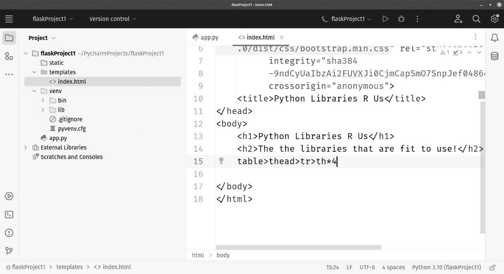

图 8.6：Emmet 将代码扩展为表头所需的所有代码

一旦 Emmet 扩展了您的代码，您将看到`th`标签内的提示，允许您编辑内容，如图*图 8**.7*所示。

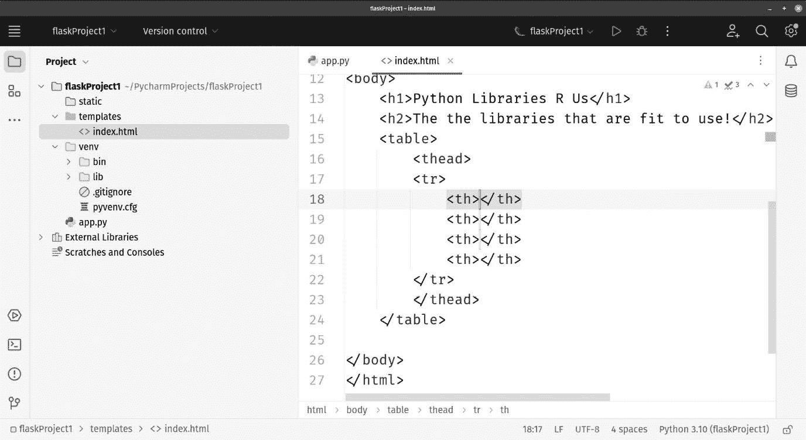

图 8.7：Emmet 将图 8.6 中的第 15 行缩写扩展为我们看到的内容

传统上，您会使用**Tab**键在字段之间移动，但在 PyCharm 中，*Tab*键被绑定到扩展 Emmet 的动作，正如我们刚才看到的。如果您来自不同的 Emmet 启用编辑器，您可能无法像预期的那样使用*Tab*键进行导航。相反，您需要找出您系统上的快捷键，因为这将取决于您在安装 PyCharm 时配置的键盘快捷键布局。我选择了 Windows 布局，因此对我而言，在字段之间移动是使用*Alt + Shift + ]*完成的。

在第一个`th`标签内，输入`图书馆名称`。然后使用*Alt + Shift + ]*键移动到下一个字段，并将其更改为`描述`。第三个字段将被称为`评分`，第四个字段标题为`URL`。

如果*Alt + Shift + ]*对您不起作用，让我们找出什么会起作用。进入 PyCharm 的设置，并找到如图*图 8**.8*所示的**键映射**设置。

我在搜索框中输入了`Emmet`，可以看到我的**导航 > 下一个/上一个 Emmet 编辑点**设置是**Alt + Shift + ]**和**Alt + Shift + **，分别。如果您的不同，您将在这里看到它们，并且正如我们所学的，您可以将其更改为您想要的任何内容，只要更改不与另一项冲突。

![图 8.8：您的 Emmet 导航设置在设置中找到并设置此处图 8.8：您的 Emmet 导航设置在设置中找到并设置此处在这个阶段，您的 HTML `table`代码应该看起来像这样：```py<table>    <thead>    <tr>      <th>Library Name</th>      <th>Description</th>      <th>Rating</th>      <th>URL</th>    </tr>    </thead>  </table>```让我们在`table`代码中添加另一项内容。在`</thead>`闭合之后但在`</table>`闭合之前输入以下内容：```py<tbody>  <tr>    <td colspan="4">No libraries to display</td>  </tr></tbody>```如果您的代码变得混乱，请使用 PyCharm 的代码重排功能来整理。这通常是*Ctrl + Alt + L*，或者在 Mac 上为*Cmd + Opt + L*。我们已经布局了一个基本的网页。在我们使其动态之前，让我们为应用程序创建一个运行配置，这样我们就可以预览我们的作品。## 运行 Flask 应用当我们创建项目时，PyCharm 为我们创建了一个 Flask 运行配置。让我们看看它，以便了解 PyCharm 将如何运行该应用。点击**运行配置**下拉菜单，然后点击**编辑配置…**，如图 8**.9**所示。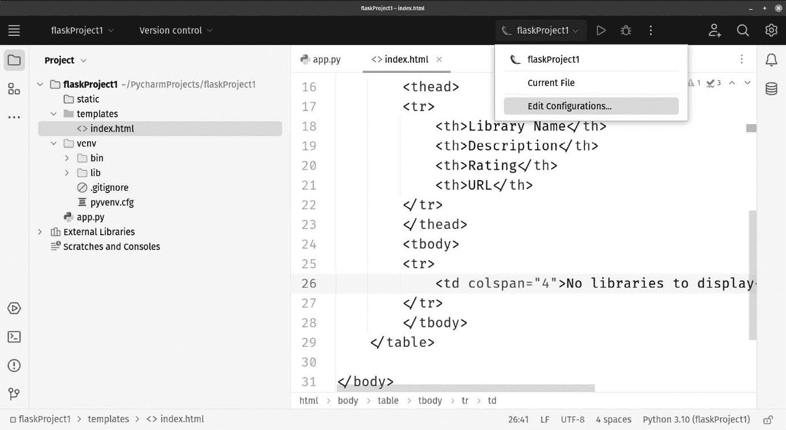

图 8.9：编辑运行配置以查看其构成

设置看起来像图 8**.10**中所示。

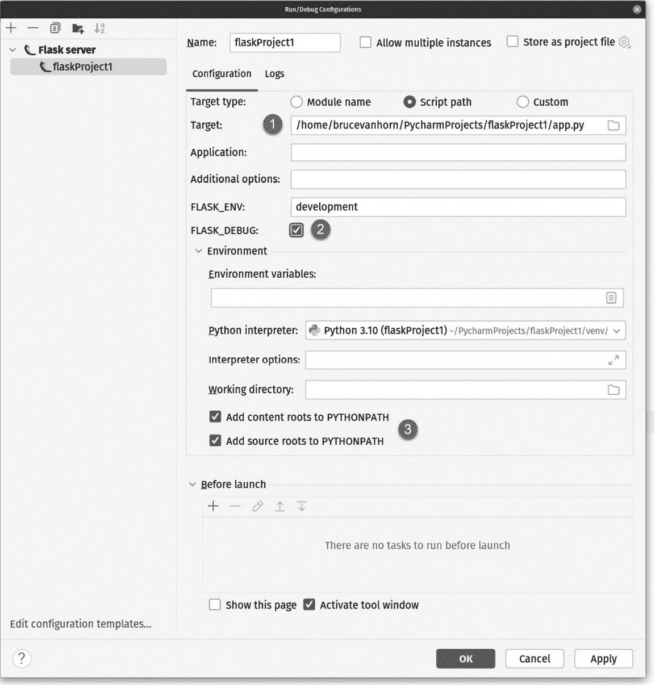

图 8.10：PyCharm 生成的 Flask 运行配置

现在大多数设置都很熟悉了，所以只有少数被标记。

运行 Flask 应用有几种方法。最简单的方法是直接运行`app.py`文件，这是运行应用的`dunder-main`行，这完全没问题。回想一下`app.py`底部的代码：

```py
if __name__ == '__main__':
  app.run()
```

您也可以使用模块名来运行它，但现在让我们先使用 PyCharm 生成的配置。

在`FLASK_DEBUG`环境变量位置，它有自己的复选框。当你勾选这个框时，它将专用的 Flask 开发服务器置于调试模式，这带来了一些好处。其中最大的好处是，每当您更改代码时，应用服务器都会重新启动。这让您不必每次更改时都记得停止和重新启动服务器。一般来说，您希望勾选这个框。勾选框上方是常用的`FLASK_ENV`环境变量，它也被传递给运行的应用。它默认为`development`。您可以使用这个环境变量在您的应用中打开和关闭某些行为，包括设置日志详细级别。

在`PYTHONPATH`文件夹位置的两个`PYTHONPATH`复选框，这可以防止您收到 Python 找不到您的应用的错误。您希望勾选这些。

注意，PyCharm 提供了设置传递给运行应用中的常见环境变量的能力，这些复选框正是如此。这很好，因为在操作系统级别设置它们是额外的工作，我们经常忘记，而且根据您的操作系统，更改环境变量可能不会像预期的那样有效。当您在操作系统级别使用环境变量时，通常需要重新启动或注销并重新登录，以确保新值生效。PyCharm 直接将变量注入到运行的开发服务器中，这节省了大量的时间和挫折。

点击**确定**关闭运行配置对话框。

在启动之前，我们需要对`app.py`进行代码更改。我们需要修改我们的`Hello World`代码以加载并显示模板。修改后的代码如下：

```py
from flask import Flask, render_template
app = Flask(__name__)
@app.route('/', methods=["GET"])
def root():
  return render_template("index.html")
if __name__ == '__main__':
  app.run()
```

首先，我添加了对 Flask 中的`render_template`方法的导入。我们将使用它来渲染我们的 Jinja2 HTML 模板。

接下来，我在路由装饰器中添加了一些代码。之前我们有 `@app.route('/')`，它定义了我们的网站 `root` 路由，该路由将由我们的 `root` 函数处理。我添加了一个第二个参数，`methods=["GET"]`。Flask 允许你将路由锁定到之前章节中描述的 HTTP 请求方法之一或多个。将 Flask 应用程序端点锁定到特定的 HTTP 方法，如 `GET` 或 `POST`，是 Web 开发中的基本实践，有以下几个重要原因：

+   **安全性**：不同的 HTTP 方法有不同的用途和安全影响。例如，GET 请求通常用于检索数据，它们不应在服务器上产生任何副作用。相比之下，POST 请求用于向服务器提交数据，它们可以产生副作用，如创建、更新或删除资源。通过将端点限制到特定的 HTTP 方法，你可以防止意外的或恶意的行为。这被称为“基于方法的访问控制”。

+   **可预测性**：将端点锁定到特定的 HTTP 方法可以使你的 API 或 Web 应用程序更加可预测和自文档化。其他开发者（甚至你未来的自己）将更清楚地了解如何与你的应用程序交互。例如，如果一个端点是为 GET 请求设计的，那么它显然是用来检索数据的。

+   **一致性**：API 设计的一致性可以提高用户体验并减少困惑。当用户或客户端知道特定端点期望特定的 HTTP 方法时，他们不太可能发出错误的请求。

+   **防止意外**：端点的意外误用可能导致意外的后果。通过限制允许的 HTTP 方法，你可以减少 UI 开发者犯错误的机会，例如尝试使用 GET 请求删除数据。

+   **框架支持**：Flask 与许多其他 Web 框架一样，提供了基于 HTTP 方法的内置路由请求支持。这使得实现基于方法的访问控制变得更容易，因为你可以为每个 HTTP 方法定义单独的路由和处理程序。

如果你仔细看，我们传递的参数是一个数组。你可以传递一个或多个方法，允许一个路由以不同的方式处理一个或多个方法。在这里，我们将 `root` 路由函数锁定到 HTTP GET 方法，这是当你访问网站时浏览器发出的请求。

接下来，我们将 Flask 的 `render_template` 方法添加到了我们的导入中。我将函数的名称从 `hello_world` 改为 `root`，然后将返回值从 `'Hello World'` 字符串改为 `render_template` 函数的结果，该函数接受模板的文件名。Flask 会知道在 `Templates` 文件夹中查找 `index.html`。

现在我们准备尝试一下。确保你的 Flask 应用程序在运行配置下拉菜单中被选中，然后点击绿色的 **运行** 按钮。**运行** 选项卡将出现在 PyCharm 屏幕的底部。我的看起来如图 **8**.11 所示。

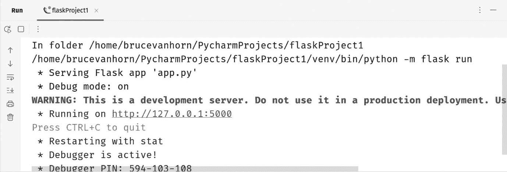

图 8.11：我们的 Flask 应用的运行窗口

有几个值得注意的元素。第一个是那个大红色的警告信息。我知道，对你来说它是灰色的，但当你第一次尝试时你会看到它。我们正在使用 Flask 内置的开发网络服务器运行我们的应用。请不要在生产环境中使用它。相反，你需要使用一个生产质量的网络应用服务器，例如 Green Unicorn。这超出了使用 PyCharm 进行开发的范围，但使用内置服务器部署你的应用是一个如此巨大的错误，我觉得有必要指出并解释为什么这个警告要以大红色字母的形式出现。

其次，它告诉你应用正在`http://127.0.0.1:5000`上运行。地址被列为超链接，你可以点击它来打开浏览器。我的浏览器在*图 8.12*中打开。

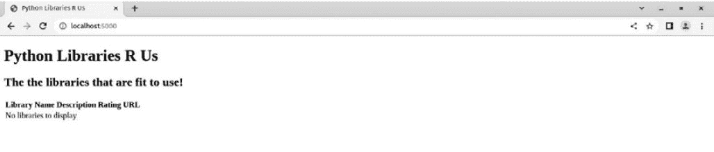

图 8.12：它工作了，但 1991 年刚打电话来说他们想要他们的网页设计

真的是太难看了，不是吗？我们费了这么大的劲添加了 Bootstrap，至少应该用上它。

## 让我们让它看起来好一点

从设计角度来看，页面并没有太多动作，虽然我们不会构建一些可能让你在苹果公司得到设计工作的惊人用户体验，但我们可以通过添加一些 Bootstrap 类至少让这个页面看起来更整洁。我们将在 Jinja2 模板`index.html`内的`body`标签内完成这项工作。

首先，让我们设置 Bootstrap 的布局网格。这允许我们创建能够优雅地适应任何尺寸屏幕的应用，从小型手机浏览器到最大的 8K 显示器。

将此代码添加到`body`标签内。完成后，它应该紧挨着我们之前创建的`table`代码：

```py
<div class="container-fluid h-100">
  <div class="row">
    <div class="col-12">
      <h1>Python Libraries
        <span class="flipped-letter">R</span> Us</h1>
      <h2>All the libraries that are fit to use!</h2>
      <hr/>
    </div>
  </div>
  <div class="row">
    <div class="col-8">
      <h5>Here are the libraries:</h5>
```

在这里，我们添加了一个标记为`container-fluid`类的`div`。这将为我们提供一些急需的布局和填充，以便我们的内容不会紧贴浏览器窗口的边缘。我还将其设置为占据浏览器窗口中可用的全部高度，预计我们的表格中会有许多有用的库。我是用 Bootstrap 的`h-100`类做到这一点的。

之后，我添加了一个`div`作为行，然后又添加了一个作为列。我已经将列的类设置为`col-12`，在 Bootstrap 中这意味着它应该占据浏览器窗口的全宽，并带有适当的边距和填充，这些由我们之前添加的祖先`div`标签中的`container-fluid`类定义。

接下来的三个标签只是内容添加——一些使用`H1`和`H2`标签进行标注，解释用户看到的内容，然后是一个水平线。我添加了一个 CSS 类来翻转字母 R，使其让人联想到美国一家流行但现已破产的玩具店。我童年的另一个图标已经灰飞烟灭。请注意，我们还没有创建这个 CSS 类。我们将在下一分钟内完成。

让我们在表格上添加 Bootstrap 的`.table`类。通过添加`class="table"`来更改你的`table`代码：

```py
<h5>Here are the libraries:</h5>
            <table class="table">
                <thead>
                <tr>
                    <th>Library Name</th>
                    <th>Description</th>
                    <th>Rating</th>
                    <th>URL</th>
                </tr>
```

这样就可以调整表格及其周围的间距，使所有内容不会挤在一起。

为了结束这一切，我们需要在表格关闭后添加所有必要的关闭标签。这只需要三个嵌套的`div`关闭标签：

```py
    </div>
  </div>
</div>
```

第一个关闭列，第二个关闭行，第三个关闭容器。最后一步是添加一些 CSS。

## 添加一些 CSS

右键点击`static`文件夹，创建一个名为`index.css`的新 CSS 文件。将以下代码添加到文件中：

```py
body {
  margin: 92px;
  height: 100%;
}
.flipped-letter {
 display: inline-block;
 transform: scaleX(-1);
}
.gold-star {
  color: gold;
}
```

在这个 CSS 文件中，我们添加了一些额外的页边距，并将高度设置为 100%，这样我们就不会得到一个又短又小的页面，这个页面完全依赖于我们表格中的内容量。

我在`index.css`中添加了一个`flipped-letter`类来翻转我们想象中的网站标题中的字母 R。我们将为每个图书馆显示一个评分。我想，与其只显示一个无聊的数字，不如放一些星星进去。不仅仅是任何星星——是金色星星！所以，有一个类，我称之为`.gold-star`。如果你对 CSS 不熟悉，前面的点很重要。它标记了后面的`gold-star`作为一个自定义类。在 CSS 中，类与面向对象开发无关，所以如果你学过一些 Java 或其他基于类的语言，那么“类”这个词与那些语言中的概念无关。你很快就会看到，当类在 HTML 中使用时，点将不存在。这不是一个错误。

现在我们已经在`static`文件夹中有一个 CSS 文件了，我们需要在 HTML 文件中引用它。由于它位于具有特殊意义的静态文件夹中，我们的代码与之前我们看到的纯 HTML 中的直接 CSS 引用略有不同。在你的`head`标签内添加以下代码行：

```py
<link href="{{ url_for('static', filename='index.css') }}"
     rel="stylesheet"
     type="text/css">
```

注意 Jinja2 表达式解析了静态文件夹的位置。

我刚才提到我想用星星来显示我的评分。我并不想真正使用图形。相反，我更愿意使用一个字体，特别是**Font Awesome**。Font Awesome 基本上是一个巨大的网络字体，它不包含字母字符，而是包含数百个有用的图形图标，这些图标对于制作现代 UI 和网站设计非常有用。有关 Font Awesome 的更多信息，请参阅[`www.fontawesome.com`](https://www.fontawesome.com)。

与其将 Font Awesome 包含在我们的项目中，当然这是一个选项，我将链接到一个托管在 **内容分发网络**（**CDN**）上的 Font Awesome 版本。CDN 是托管内容的一种理想方式，因为它们被设计用来以极快的速度提供静态内容。它们不仅通过正常的服务器优化来实现这一点，而且还通过在全球范围内战略性地放置服务器来实现。当你的页面从 CDN 加载静态内容时，对该内容的请求会被路由到最近的服务器。印度的用户将连接到印度的 CDN 服务器，而堪萨斯州（美国中部）的用户将从更近的服务器获取内容。

Font Awesome 在其网站上列出了其 CDN 链接。我将使用我从 Font Awesome 网站复制的链接，并将其添加到我们页面的 `head` 标签中。由于这是从 CDN 而不是静态文件夹中获取的，所以我不需要任何 Jinja2 的魔法来解析它：

```py
<link rel="stylesheet"
     href="https://cdnjs.cloudflare.com/ajax/libs/font-awesome/5.15.3/css/all.min.css">
```

页面看起来应该好多了！我会在我们添加了动态内容后再发布截图。我不想破坏这个大揭秘！别忘了，你可以在从 GitHub 克隆的章节存储库文件夹中检查最终的代码。

## 使页面动态化

我们已经创建了一个 Flask 应用并使一个模板工作。让我们使用 Flask 和 Jinja2 为页面添加动态性。我们将使用一个与我们在表中放置的字段相对应的字段列表的 `dicts` 来模拟数据库。

切换到 `app.py` 文件，找到这条线，它应该接近第 3 行：

```py
app = Flask(__name__)
```

这一行是由 PyCharm 在我们创建项目时生成的，它创建了一个 Flask 实例，并将其分配给一个名为 `app` 的变量。我们将在这一行下面开始添加新的代码。让我们先创建一个全局变量来保存我们的数据：

```py
library_data = list()
library_data.append({"python_library": "Flask",
           "description": "An unopinionated web framework",
           "rating": 5,
           "url": "https://pypi.org/project/Flask"})
library_data.append({"python_library": "Jinja2",
           "description": "Templating library",
           "rating": 3,
           "url": "https://pypi.org/project/Jinja2"})
```

通常情况下，全局变量，尤其是在大型程序中，应该避免使用。在这种情况下，我们使用全局变量来模拟数据库连接，这通常是规则的例外。

在这里，我们正在向我们的模拟数据库添加一些记录。如果你是 Jinja2 的粉丝，请不要恨我。我在内容中给它评了 3 分，只是为了在两个样本记录之间有一些视觉差异。

只需再做一个修改。将第二个参数添加到 `render_template` 调用中：

```py
return render_template("index.html", library_data=library_data)
```

`render_template` 方法是一个 **可变参数函数**。你可以传递尽可能多的参数给它。Jinja2 将能够在模板中渲染传递的数据。在这里，我们只是添加了一个数据变量。

我们已经完成了 `app.py`！最终的代码如下所示：

```py
from flask import Flask, render_template
app = Flask(__name__)
library_data = list()
library_data.append({"python_library": "Flask",
           "description": "An unopinionated web framework",
           "rating": 5,
           "url": "https://pypi.org/project/Flask"})
library_data.append({"python_library": "Jinja2",
           "description": "Templating library",
           "rating": 3,
           "url": "https://pypi.org/project/Jinja2"})
@app.route('/', methods=['GET'])
def root(): # put application's code here
  return render_template("index.html", library_data=library_data)
if __name__ == '__main__':
  app.run()
```

现在我们将一些数据传递到模板中，我们需要回到并修改 `index.html` 模板以渲染数据。你需要将 `tbody` 标签的内容更改为以下内容：

```py
<tbody>
        
```

模板中的`{%`和`{{`标记表示逻辑和内容发生的地方。在这里，我们正在检查数组的长度。如果它大于零，我们将使用数组的内容渲染表格行。向下还有`else`，它将渲染我们现在有的内容，即表示没有数据的单行：

```py
          
            <tr>
              <td>{{ data.python_library }} </td>
              <td>{{ data.description }}</td>
              <td>
                
                  <i class="fas fa-star gold-star"></i>
                
              </td>
              <td><a href="{{ data.url }}"
                  target="_blank">View on pypi.org</a></td>
            </tr>
          
```

在前面的代码中，我们正在遍历`library_data`列表并生成一个表格行（`tr`）。然后为表格行提供列。`{{ }}`占位符表示当前列表迭代中`dict`的内容应该放置的位置。第一列显示`data.python_library`的内容。第二列显示描述。

第三处是我们添加一些炫酷的东西！我们添加一个代码块，使用 range 循环来生成该列中的星星。如果评分是 3，循环运行 3 次，我们得到 3 颗星星！

对于 URL，我使用了`data.url`的值作为超链接的`href`属性。

这就剩下我之前提到的`else`语句：

```py
        
          <tr>
            <td colspan="4">No libraries to display</td>
          </tr>
        
        </tbody>
```

总结一下，如果我们传递一个包含零个元素的数组，Jinja2 将渲染我们之前的行，表示没有数据。如果数组中有数据，Jinja2 将遍历数组并为数据中的每一行生成一个表格行。

运行项目并将浏览器指向`http://localhost:5000`。你会看到一个渲染了两个记录的表格，如图*图 8**.13*所示。

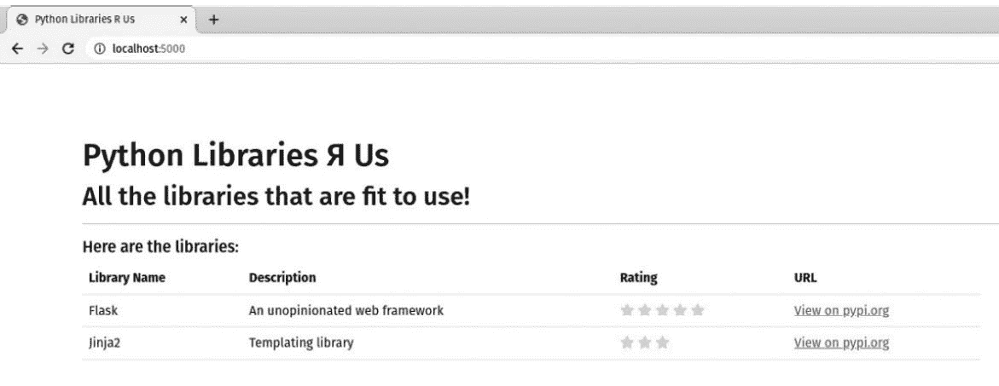

图 8.13：大揭秘！我们的页面现在是动态的

让我们暂停一下，评估 PyCharm 是如何帮助我们。

## 用于与 Flask 和 Jinja2 一起工作的编辑器增强功能

在这个练习中，你已经得到了很多帮助。如果你不相信我，试着用 Vim 或 Notepad 重复这个练习！到现在为止，你已经开始习惯 PyCharm 如何减轻你的认知负担，以及物理上处理大量的输入。

你可能甚至没有注意到以下内容：

+   HTML 编辑功能，如语法高亮、自动关闭标签和标记中嵌套的打开和关闭标签的颜色编码指示器。

+   我们使用了 Emmet 来生成一些我们的标记。

+   PyCharm 理解 Jinja2 语法，并且当你开始到处放置大括号时，检查不会让你感到恐慌。

+   事实上，它会自动关闭`{{ 表达式 }}`和``的大括号。

+   如果你在这个过程中犯了任何错误，你可能已经注意到 PyCharm 的检查和建议清楚地理解如何使用 Flask。这不是简单的内省自动完成。PyCharm 将为你提供针对 Flask 开发的特定帮助。

让我们看看一些不那么明显的功能：

+   切换到`app.py`，将光标放在模板文件名（`index.html`）内，然后按*Ctrl* / *Cmd* + *B*。这将在模板中激活`library_data`变量，然后按*Ctrl* / *Cmd* + *B*，它将带你到渲染模板的调用，该调用将变量传递给 Jinja2。

+   在`app.py`中调试器工作并不令人惊讶。它同样也适用于代码块内的 Jinja2 模板。在 Jinja2 模板的`index.html`中的`for`循环处设置一个断点，使用`debug`启动你的应用，调试器将在循环处停止。你可以使用与调试其他任何内容相同的单步执行功能。你可以检查模板变量，就像检查正常 Python 脚本中的变量一样。考虑到 Jinja2 实际上是一种元语言，与 Python 完全不同，并且专注于它能做什么，这相当令人瞩目。

+   如果你犯了任何错误，Werkzeug 有一个很棒的错误页面，其中包含指向你的堆栈跟踪的链接，其中包括你的模板跟踪。PyCharm 捕获这些信息并在**运行**窗口中显示，包括超链接。这些超链接将带你到 PyCharm 中的代码，而不仅仅是像 Werkzeug 在浏览器窗口中那样显示它。

+   你会发现对流行的 Flask 插件的支持与对 Jinja2 的支持相同。Flask 被设计成可扩展的。有许多插件可以帮助你在许多 Web 开发领域更轻松地工作，从 REST API 开发到数据库 ORM，再到会话处理和身份验证。你会在任何你遇到的 Flask 开发场景中找到 PyCharm 的引导。

# 摘要

我已经多次指出，这一章是关于 Flask 的一个糟糕的教程。我们只是刚刚触及了 Flask 能做什么的表面，但我们涵盖了 PyCharm 如何帮助你进行 Flask 开发的全部方法，并且它是少数几个在开发这个简单项目时提供我们所见到的帮助和工具水平的 IDE 之一。

首先，Flask 提供了一个简单的方法来生成 Flask 项目的项目结构和起始代码。就像任何其他项目一样，PyCharm 会设置你的虚拟环境，并为你提供一些起始代码。当我们使用 PyCharm Professional 中的 Flask 模板时，PyCharm 也会为你安装项目依赖，并为你的项目设置一个专门的运行配置。

一旦你开始编辑你的项目，你会发现我们在前面章节中介绍的所有功能都汇集在一起。HTML、CSS 和 JavaScript 相关功能不仅与普通 HTML 项目兼容，还与 Flask 本地的 Jinja2 模板语言兼容。我们不仅获得了针对 Flask 的特定检查、代码提示和文档，还获得了针对扩展 Flask 生态系统的文档。

我们甚至发现我们可以像调试实际的 Python 代码一样调试 Jinja2 模板！结合一些非常棒的导航增强功能，帮助你在这两种逻辑之间切换——前端逻辑和后端逻辑——作为 Flask 开发者，你将手握一种无与伦比的力量和功能组合。

Flask 并非市场上唯一的游戏。在过去的几年中，一些新的开发模型变得流行：特别是**单页应用**（**SPAs**）与后端纯 RESTful API 的结合。下一章将重点介绍使用名为 FastAPI 的框架构建 RESTful API 的快速、现代方法。

正如你将看到的，FastAPI 与 Flask 有一些相似之处，但也有一些重要的区别。Flask 使用工作模型来服务内容或数据，而 FastAPI 则更像 NodeJS，它使用异步编程模型。FastAPI 更倾向于专注于仅创建 RESTful API，而 Flask 中则缺少这些模板工具。

# 进一步阅读

一定要查看该书的配套网站 [`www.pycharm-book.com`](https://www.pycharm-book.com)。该网站允许我列出可用的最新资源。以下资源也将非常有用：

+   Gaspar, D.，& Stouffer, J. (2018). 《精通 Flask 网络开发：构建企业级、可扩展的 Python 网络应用》。Packt Publishing Ltd.

+   Van Horn II, B. (2019). 《使用 Flask 构建 RESTful API》。LinkedIn Learning：[`www.linkedin.com/learning/building-restful-apis-with-flask/restful-apis-with-python-3-and-flask-4`](https://www.linkedin.com/learning/building-restful-apis-with-flask/restful-apis-with-python-3-and-fl)。

+   Van Horn II, B. (2021). 《Python 开发者用 MongoDB》。MadDevSkilz.com。[`www.maddevskilz.com/courses/mongodb-for-python-developers`](https://www.maddevskilz.com/courses/mongodb-for-python-developers)。注意：尽管标题如此，这是一篇关于创建使用 MongoDB 的 Flask 应用的简短教程。它与我 LinkedIn 上的课程非常相似，而且更新更早。
