# 9

# 使用 FastAPI 创建 RESTful API

在上一章中，我们学习了一个名为 Flask 的框架。Flask 在一个传统的网络开发框架领域中代表了 Python，这些框架旨在服务器上生成内容并将其发送回浏览器。这就是我们几十年来开发网络应用的方式。2010 年代带来了一个范式转变，但这并不是一夜之间发生的。

2004 年，术语 **AJAX**（异步 JavaScript 和 XML 的缩写），由 Jesse James Garrett 在一篇题为 *Ajax: A New Approach to Web Applications* 的文章中提出。这篇文章帮助推广了异步网络应用的概念和技术。到 2005 年，主流浏览器都支持了一个新的 **XMLHttpRequest**（XHR）网络 API 调用。这个特性允许开发者请求纯数据，而不是与标记结合生成的 HTML 页面。

2010 年代单页应用（SPAs）的兴起与 JavaScript 框架（如 AngularJS（现在为 Angular）、React 和 Vue.js）的进步密切相关。这些框架为开发者提供了构建动态、交互式网络应用的工具和能力，这些应用与传统应用不同，它们同时请求 HTML 和数据。SPAs 在一个请求中加载所有标记、CSS 和 JavaScript。之后，应用使用 XHR 请求数据，在接收到数据和用户交互的响应后，开发者使用 JavaScript 显示和隐藏用户体验中的不同元素，而不是每次数据或用户交互发生变化时都重新渲染整个页面。

由 Google 于 2010 年发布的 **AngularJS**，在推广 SPAs 概念方面发挥了重要作用。它引入了一种声明式的方法来构建网络应用，允许开发者创建丰富的、响应式的用户界面，而无需进行完整的页面刷新。AngularJS 为构建 SPAs 提供了一个坚实的基础，其成功也激发了其他 JavaScript 框架的开发，这些框架进一步精炼和改善了 SPAs 的开发体验。

由 Facebook 开发并于 2013 年发布的 **React**，也促进了 SPAs 的普及。React 引入了一种基于组件的架构，这使得管理应用程序的状态和 UI 组件变得更加容易。React 的虚拟 **DOM**（文档对象模型）diff 算法和高效的渲染机制使其非常适合构建快速可扩展的 SPAs。

由 Evan You 创建并于 2014 年发布的 **Vue.js**，因其轻量级和易于接近的特性而成为构建单页应用（SPAs）的流行框架。它提供了一个温和的学习曲线，并提供了灵活直观的方式来构建用户界面。

总体而言，这些 JavaScript 框架的组合，加上浏览器技术和 API 的进步，导致了从 2010 年代初开始单页应用（SPAs）的兴起。如今，SPAs 通过在单个网页上动态更新内容，消除了完全重新加载页面的需要，并为 Web 应用提供了更类似应用程序的感觉。

我们当然可以使用 Flask 创建一个 SPA 后端，但这可能不是最佳选择。特别是如果你预期你的应用程序的用户基数很大。当服务器请求量高时，Flask 被认为有点慢。幸运的是，游戏中有其他参与者，在本章中，我们将重点关注 FastAPI。

FastAPI 最有趣的地方在于它处理 Web 请求的方式。大多数产品，包括 Flask，都使用工作模型。一群工作进程负责在操作系统管理的不同进程中服务多个传入请求。FastAPI 使用**异步编程**模型。在异步编程领域，函数会被调用，但并不保证立即返回结果。让我们来探索以下具有说明性的 Python 代码：

```py
async def add_two(a: int, b: int) -> int:
    return a + b
```

在同步编程环境中调用`add_two`时，执行线程会暂停，直到函数完成并返回结果。然而，当使用异步编程时，机制会有所不同。异步调用不会停止调用线程。相反，在执行完计算`a + b`后，调用线程会继续执行。重要的是要认识到，这可能不会立即发生，但在计算过程中，其他操作不会被阻塞。当然，执行整数的加法运算很可能会迅速完成。

考虑一个替代场景，其中对网络资源（如获取网页）发出请求。响应速度不再仅仅取决于处理器的执行速度。它包括计算机性能、网络延迟以及可能引入从几秒到甚至几分钟的延迟的各种其他因素。这对于居住在高速互联网接入良好、连接紧密的城市地区的那些人来说尤其如此。由于异步软件不会阻塞，因此它可以串行地服务许多请求，因为它们中没有一个正在等待前一个函数调用或，在这种情况下，网页请求完成。你可以把它想象成只有一个服务员的一家餐厅。你与其他用餐者一样串行地提交订单，但厨师只有在食物做好后才会给你送来。有了这样的预期，厨师可以自由地一次烹饪他们炉灶允许的尽可能多的菜肴，并且有一个隐含的承诺，即一旦你的食物做好，服务员就会把它给你。订购一杯果汁的人可能会立即得到他们的订单，而你的烤阿拉斯加可能需要更长的时间来制作。

相比之下，一个同步餐厅可能会雇佣，比如说，八个厨师。可以同时进来八个订单，但每个厨师都会完全专注于完成那个订单，直到它完成。结果证明，至少对于计算机来说，在典型的 Web 请求工作负载中采用异步模型时，吞吐量通常更快。

在 Python 3.4 中，我们得到了一个新的模块，名为`asyncio`，它将异步编程特性带到了我们最喜欢的语言中。三年后，我们发现了第一个名为**Starlette**的库项目的 GitHub 提交。Starlette 是一个异步 Web 框架，用于使用 Python 构建高性能应用程序。它以高效的方式提供了处理 HTTP 请求和响应的核心功能。Starlette 以其简洁、速度和对现代 Python 特性的支持而闻名，使其成为构建 Web 应用的理想基础。尽管如此，像为 Flask 提供动力的 Werkzeug 一样，Starlette 最初也只打算作为一个基础。本章涵盖了**FastAPI**，这是一个建立在 Starlette 之上的框架，代表了专门用于开发**RESTful 应用程序编程接口（REST APIs**）的完整 Web 框架。与 Flask 使用工作模型不同，FastAPI 使用异步模型；与 Flask 旨在创建传统的往返、模板驱动的内容生成不同，FastAPI 通常使用单页应用（SPAs）来处理以**JavaScript 对象表示法（JSON**）形式提供的数据。

我意识到我们刚刚介绍了很多术语，这些术语可能对那些不是通常的 Web 开发者的 Python 开发者来说是新的。在我们介绍使用 PyCharm 构建简单的 FastAPI 项目时，我们将根据上下文解释我们的术语。

到本章结束时，你将能够做到以下几件事情：

+   解释传统模板驱动的内容生成系统（如 Flask）与严格服务数据的系统之间的区别

+   描述 HTTP（和 HTTPS）的无状态特性，以及如何使用**表示状态转移**（**REST**）来弥补 HTTP 中的状态缺失

+   使用 PyCharm Professional 内置的模板创建一个 FastAPI 项目

+   使用 PyCharm 的 HTTP REST 客户端对 FastAPI 项目进行测试

+   在 PyCharm 中创建一个独立的但连接（附加）的 React 前端应用程序，这样你就可以在不混淆前端 JavaScript 代码和后端 Python 代码的情况下开发全栈应用程序

+   在 PyCharm 的调试器中管理多个运行配置并调试整个请求-响应流程

请记住，本章的目的不是全面介绍 FastAPI 或 React。本书的核心目的是在创建应用程序的背景下教授 PyCharm。我们对 FastAPI 的介绍可能比较隐晦，而我们对 PyCharm 作为创建 FastAPI 应用程序的工具的介绍将非常全面。

# 技术要求

为了继续阅读本章，以及本书的其余部分，你需要以下内容：

+   安装并正常工作的 Python 解释器。我将使用来自[`python.org`](https://python.org)的最新版本。

+   安装了`pip`和`virtualenv`。当你将 Python 安装在 Windows 上时，你会自动获得这些，macOS 在每台系统上都包含它们。如果你使用 Linux，你需要单独安装包管理器，如`pip`，以及虚拟环境工具，如`virtualenv`。我们的示例将使用`pip`和`virtualenv`。

+   安装并正常工作的 PyCharm 副本。安装已在*第二章*，*安装和配置*中介绍，以防你在书的中途开始阅读。

+   本书提供的示例源代码来自 GitHub。我们在*第二章*，*安装和配置*中介绍了代码克隆。你可以在[`github.com/PacktPublishing/Hands-On-Application-Development-with-PyCharm---Second-Edition/tree/main/chapter-09`](https://github.com/PacktPublishing/Hands-On-Application-Development-with-PyCharm---Second-Edition/tree/main/chapter-09)找到本章的相关代码。

# 在一个无状态的恶劣世界中没有 REST

我听说有人说过，计算机是地球上最愚蠢的生物。它们只会按照指示行事，并以极其字面的方式接受你的指令。这就是编程计算机如此困难的原因。你必须选择完全正确的语法，并精确简洁地组织你的想法，因为任何含糊不清都会导致错误。

唯一能让我们的生活变得艰难的方式，就是将我们的工作和职业建立在一种像果蝇一样注意力分散的系统上。我当然是在谈论网络服务器。术语网络服务器可以指两件不同的事情：它可以指硬件或软件。硬件是指运行该软件的任何计算机系统。我看到过人们用火柴盒大小的硬件构建网络服务器，也看到过网络服务器硬件占据了宽敞的机架式系统，这些系统位于特别冷却的数据中心中。实际上，至少对我们来说，硬件是无聊的部分。

网络服务器软件对我们这些编写代码的人来说更有趣。网络服务器软件，例如 **Apache**、**Nginx**（发音为“engine-ex”）、**LightHTTPD** 以及其他一些，都是为了实现 HTTP 协议的通用规范而设计的简单而健壮的实现。这些规范是由 **万维网联盟**（**W3C**）在国际上达成一致的。该协议本身非常直接。我们已经在前面的章节中提到了一些关于它的内容，例如以下内容：

+   **客户端-服务器模型**：HTTP 遵循客户端-服务器模型，其中客户端（通常是网络浏览器）向服务器发送请求，服务器以请求的数据进行响应。

+   `GET`、`POST`、`PUT` 或 `DELETE`），一个 **统一资源标识符**（**URI**）用于标识正在访问的资源，以及提供额外信息的头部信息。服务器会以状态码的形式响应请求的成功或失败，并在响应体中包含请求的数据。如果你错过了，可以在 *第八章* 的 *使用 Flask 构建动态网络应用程序* 中找到对请求-响应范式的完整讨论（包括图片）。

+   **基于文本的协议**：HTTP 是一种基于文本的协议，这意味着请求和响应消息都是可读的。消息遵循一种称为 HTTP 消息格式的特定格式，该格式由头部和可选的消息体组成。

+   **安全版本**：HTTP 可以通过使用 **HTTPS**（**HTTP Secure**）来增加加密和安全功能。HTTPS 在客户端和服务器之间传输的数据的机密性和完整性方面添加了一层 **传输层安全性**（**TLS**）或 **安全套接字层**（**SSL**）加密。

在我们当前的讨论中，我想指出一个我们之前忽略的要点：HTTP 是无状态的。这意味着来自客户端的每个请求都被独立处理，没有任何关于之前请求的知识。服务器不会保留关于客户端之前互动的任何信息。在美国，有一个著名的为拉斯维加斯市做的广告活动，其口号是“拉斯维加斯发生的事情留在拉斯维加斯。”同样，请求-响应机制中发生的事情也留在那个请求-响应的生命周期中。一旦响应被网络浏览器接收并确认，除了某个地方的日志条目表明请求发生过之外，就没有其他东西了。

在协作中，我们这里所拥有的只是一个执行它没有记忆的请求的愚蠢机器。这可能会让我们的工作变得有些令人沮丧。我们希望用户持续地与我们的应用程序互动，但服务器不会不经过某种形式的哄骗就帮助我们做到这一点。

近年来，已经发明了许多机制来帮助我们在应用程序中处理状态。如果你不确定我所说的状态是什么，我喜欢将其描述为你最喜欢的电子游戏中的保存游戏。

想象你正在玩一个冒险游戏。你已经玩了很长时间，你找到了位于第三层的黑暗城堡的入口。你已经回答了守门人的谜题，并获得了斩妖剑。你已经积累了 32,768 枚金币，你的角色处于满血状态。然后你的妈妈叫你去倒垃圾。众所周知，这是“妈妈代码”表示“停止玩电子游戏，做些有 productive 的事情。”她永远不会理解，对吧？自然地，你希望从你离开的地方继续，所以你保存了游戏。你可以关掉电脑，明天再打开，然后你可以加载你的游戏，它将表现得好像你从未停止过玩。这是因为你的保存游戏代表了程序的一个保存状态。这是你在保存游戏时游戏所使用的所有对象、变量和数据的快照。这是程序的状态。这是网络应用程序本质上缺乏的，至少在协议层面上。

状态可以通过几种技术进行管理。服务器解决方案，如 Flask，允许你实现粘性会话，其中 HTTP 请求生成一个令牌。请求详情可以通过令牌在会话之间存储。这不是由你的 web 服务器处理的，而是由你的应用服务器处理的，它利用 web 服务器进行通信部分：请求-响应机制。会话通常是不受欢迎的，因为在大多数情况下，它们无法扩展。如果你有大量的网络流量，通常的做法是在几个服务器之间平衡流量负载。如果你的会话在第一次请求时存储在服务器 A 上，而后续请求转到服务器 B，它将不会包含你的会话。自然地，我们也为此想出了解决方案，但让我们不要陷入细节。

你可以使用 cookies，它们在客户端存储数据。不幸的是，cookies 由于多年来被过度使用而声名狼藉。主要的浏览器暴露了你正在保存的 cookies，而你那些永远警惕的用户可以选择不接受你存储 cookies 的请求。

最好的办法是将应用程序的状态存储在应用程序本身中。这里的想法被称为表示状态转移，简称 REST。在 RESTful 场景中，我们在客户端内存中维护程序的状态。我们使用请求-响应机制传输任何状态的部分，甚至（但通常不是）整个状态。程序基本上发送服务器需要以完成请求的状态部分。服务器执行它应该执行的操作，然后在响应中发送修改后的状态。如果你熟悉软件设计模式，REST 让我想起了命令模式：请求封装了服务器完成请求所需的所有内容。

现在舞台已经搭建好了，让我们记住，单页应用（SPAs）现在负责维护它们的状态，所有的标记 HTML、CSS 和 JavaScript 都在浏览器中加载，并且所有后续请求只包含状态数据，这些数据被发送到服务器，在那里被修改并返回。

数据传输的格式可以是任何形式的文本。最常见的是 JSON。在古老的过去，我们使用 XML，但我们停止使用它，因为 XML 在浏览器中的处理速度极其缓慢。JSON 更快，因为浏览器已经内建地理解 JavaScript，因此不需要解析文本。以防这是你第一次参加这样的活动，让我们比较一下这两种格式。首先，这里有一些 XML：

```py
<person>
  <firstName>Bruce</firstName>
  <lastName>Van Horn</lastName>
  <dateOfBirth trueDate="Heck No">12/19/1987</dateOfBirth>
</person>
```

XML 是类似于 HTML 的基于标签的标记语言，但你可以使用 XML 架构定义自己的标签。这是最初在浏览器中使用 **XMLHttpRequest** （**XHR**）API 调用的格式。这里的 *X* 实际上代表 *XML*。XHR 仍然在使用，但几乎没有人（不包括微软 Azure API 团队）还在使用 XML。相反，出于已经提到的性能原因，我给你同样的东西，但以 JSON 格式：

```py
{
  "person": {
    "firstName": "Bruce",
    "lastName": "Van Horn",
    "dateOfBirth": {
      "date": "12/19/1987",
      "trueDate": false
     }
  }
}
```

数据的表示方式与数据结构相同。作为一名 Python 开发者，您无疑已经认出这是一个`dict`。我们不再有带有内容和属性的标签，而是有存储在花括号内的键值对。这是 JSON 的一个规则，即键和文本值必须用双引号括起来。在这里要小心。JavaScript 和 Python 都认为单引号和双引号可以互换，但 JSON 不行。只有双引号是可接受的！幸运的是，Python 标准库中有一个`json`库，可以将您的结构转换为 JSON，然后再转换回来，无需任何麻烦：

```py
import json
# Convert dictionary to JSON
data_dict = {"name": "John", "age": 30, "city": "New York"}
json_data = json.dumps(data_dict)
# Print the JSON data
print("JSON data:", json_data)
```

这几行首先导入`json`库，然后使用`json.dumps`方法将其转换为 JSON 对象。只需记住，我们是在转换为字符串，因此使用`dumps`（*s*代表*string*）。现在让我们转换另一个方向：

```py
# Convert JSON to dictionary
parsed_dict = json.loads(json_data)
# Access the dictionary
print("Name:", parsed_dict["name"])
print("Age:", parsed_dict["age"])
print("City:", parsed_dict["city"])
```

我们使用`json.loads`将 JSON 转换回`dict`。只需记住它为“我们正在加载一个 JSON 字符串”，因此使用`loads`（*s*代表*string*）。

您现在已经理解了我们将要使用 FastAPI 的基本机制。请求将像 Flask 中那样到来，但通常，不是简单的`GET`请求，这些请求会被拦截并使用 Jinja2 模板引擎处理，而是请求将包含 JSON 有效负载，我们将对其进行处理。处理的结果将以 JSON 形式返回。请求-响应机制将使用异步函数处理，因此代码将看起来与 Flask 略有不同。

让我们动手实践，以便您能理解我的意思！

# 在 PyCharm Professional 中创建 FastAPI 项目

到现在为止，我们在 PyCharm Professional 中已经创建了多个项目，这并没有太大不同。我要提醒您，这一系列功能仅在 PyCharm 的专业版中可用。如果您需要使用社区版，您当然可以，但您将不得不自己设置项目，因为您将无法访问我们即将使用的工具。

在 PyCharm 中通过点击**文件** | **新建项目**来创建一个新的项目。然后，在模板列表中找到**FastAPI**。您可以在*图 9.1*中看到我的示例：

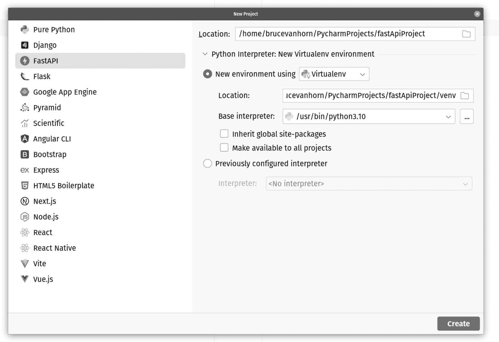

图 9.1：PyCharm 项目菜单包含一个 FastAPI 项目模板

与 Flask 一样，FastAPI 项目模板为我们生成了一些启动代码和运行配置，如图 9.2 所示：

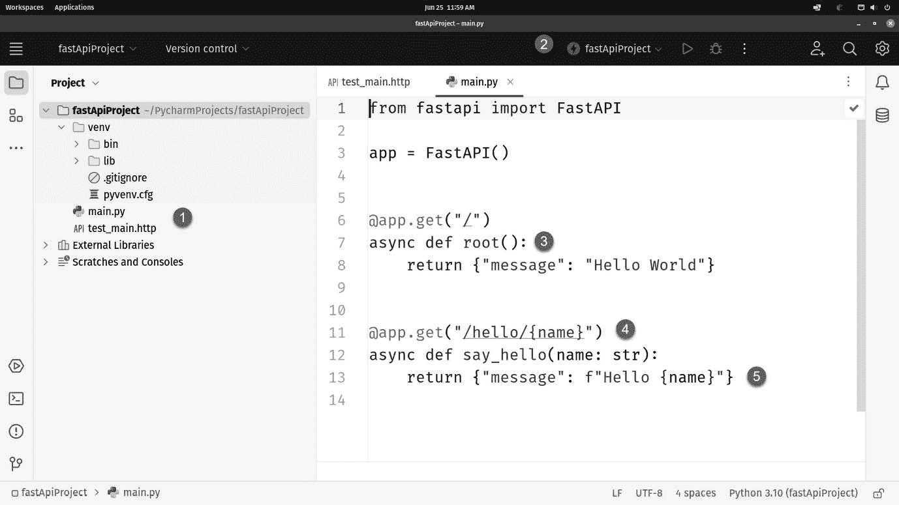

图 9.2：模板生成我们的 FastAPI 启动代码和运行配置

在*图 9.2*中有许多内容可以讨论，所以我为它编号以供参考。

PyCharm 为我们创建了一个虚拟环境，以及两个文件，如 `main.py` 和 `test_main.http` 所见。我们稍后会回到这些文件。PyCharm 为我们生成了一个运行配置。你可以通过它现在是当前选中的运行配置，在 **(2)** 处，如果 PyCharm 没有设置运行配置，那个菜单通常会显示 **当前文件** 来判断。

在我们的 FastAPI 项目中，位于 `Hello World` 端点。这些入门代码模板的强大之处在于它们提供的心理提示。如果你使用过任何用于处理网页路由和端点的系统，无论语言或框架如何，你都可以阅读这段代码并了解正在发生什么。

第 1 行和第 3 行展示了导入的 FastAPI 实例的典型构造函数。第 6 行展示了 FastAPI 如何装饰端点。`@app` 来自第 3 行的实例化，我们在这里调用 HTTP `GET` 方法，因此使用该方法发送的请求将被接收和处理。如果客户端使用其他 HTTP 动词，如 `PUT` 或 `POST` 发送请求，他们将收到错误，因为目前没有代码来处理该 HTTP 方法。

在第 7 行装饰器下方定位到 `async` 函数，我们可以看到我们返回了一个看起来像 `dict` 的东西，它也看起来像 JSON。

定位到 `GET` 端点，定义为 `/hello/{name}`。花括号中偏移的 `name` 变量指的是 URL 中可以变化的部分，称为路径参数或路径变量。你可以在第 12 行的 `async` 函数定义中看到它被重复。第 11 行分支（`name`）的内容应该与第 12 行函数的参数名称匹配。

定位到 `f` 字符串表达式，将名称填充到数据中。除了正常的 Python `f` 字符串之外，没有特殊的模板机制。

# 运行 FastAPI 项目

自然地，我们可以通过点击 *图 9**.2* 中靠近 **(2)** 位置的绿色箭头运行按钮来运行 FastAPI 项目。如果你跳过了关于设置和使用运行和调试配置的章节，你可能想看看 *第六章*，*无缝测试、调试和性能分析*，以了解 PyCharm 中此功能的工作方式。你可以在 *图 9**.3* 中看到我的程序正在运行：

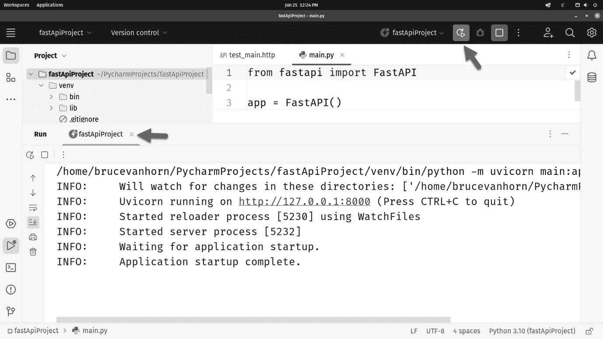

图 9.3：我点击了绿色的运行按钮，这在 PyCharm 的运行窗口中为我的项目创建了一个标签

这看起来与 Flask 中的运行类似，但没有关于开发服务器的警告。这是因为 FastAPI 在名为`uvicorn`的应用中运行，它是 Green Unicorn (`gunicorn`)的一个变体。Uvicorn 是生产就绪的，所以没有警告。您可以使用与您将应用部署给客户时相同的同一应用程序服务器软件进行开发。`uvicorn`和`gunicorn`之间的区别在于，`uvicorn`处理异步编程模型，而`gunicorn`使用前面在本章中描述的传统工作者。

在这一点上，我们面临一些困惑。当我们用 Flask 做这件事时，应用为我们生成了一些可以查看的 HTML。而这个应用没有。如果您愿意，可以在浏览器中查看端点，就像我在*图 9.4*中做的那样：

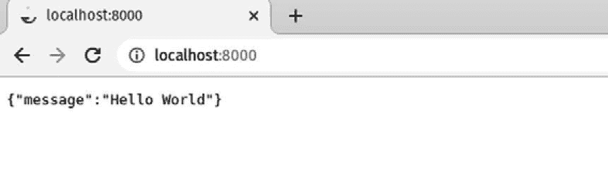

图 9.4：访问根路由并不令人兴奋，但它有效

我还可以访问包含路径参数作为 URL 一部分的其他 URL，如图*图 9.5*所示：

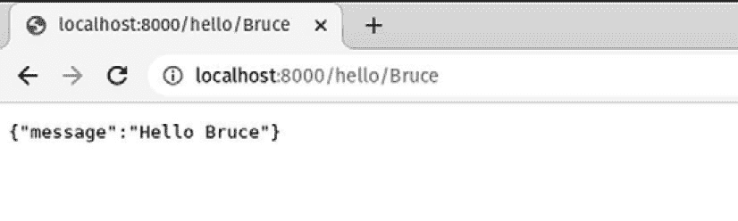

图 9.5：提供路径参数会改变响应中的数据

这次，我在 URL 的末尾添加了路径参数，并且正如我们在前面的代码中看到的，我们正在返回生成的 JSON 数据。

使用浏览器存在问题。浏览器只允许您提交 HTTP `GET`请求。在 REST API 项目中通常使用相当多的 HTTP 方法。事实上，最常用的四种方法，有时被称为动词，映射到数据库应用程序中使用的典型 CRUD 操作。`GET`和`POST`。

除了您请求的标准之外，您还可以通过最佳实践使用适当的 HTTP 状态码来标准化响应。这些由 W3C 提供的 HTTP 规范中进行了记录。阅读规范是治疗失眠的灵丹妙药，所以我将向您推荐优秀的**Mozilla 开发者网络**（**MDN**）页面中的状态码。这是您在浏览器中需要书签的方便地址：[`developer.mozilla.org/en-US/docs/Web/HTTP/Status`](https://developer.mozilla.org/en-US/docs/Web/HTTP/Status)。

| **HTTP 动词** | **方法** | **CRUD 操作** | **成功响应的 HTTP 状态码** | **说明** |
| --- | --- | --- | --- | --- |
| `GET` | `READ` | `200 (OK)` | 用于从服务器或数据库检索或获取信息。例如，获取应用程序中的用户列表。 |
| `POST` | `CREATE` | `201 (Created)` | 用于在数据库中创建新记录。在服务器上创建任何内容时都使用此方法。例如，新用户注册。 |
| `PUT` | `UPDATE` | `204 (No Content)`或`200 (OK)` | 当您向已存在的东西发送更新时使用此方法，例如数据库记录。例如，更新密码。 |
| `DELETE` | `DELETE` | `204 (无内容)` 或 `200 (OK)` | 当你想删除某些内容时使用此操作。 |

图 9.6：HTTP 方法与 CRUD 操作一一对应，并且有标准响应代码来表示成功的响应

由于你的浏览器仅限于 HTTP `GET`请求，并且我们有 100%的可能会在我们的项目中使用至少其他一种方法，因此我们需要比浏览器更好的工具来测试我们的 API。我们有几种选择：

+   有一些浏览器插件允许你发送不同类型的请求。你可以在你喜欢的浏览器市场里找到它们。

+   命令行工具，如 cURL，允许你使用任何 HTTP 方法来构建 HTTP 请求。

+   专门的 API 测试工具，如 Insomnia ([`www.insomnia.rest`](https://www.insomnia.rest)) 或 Postman ([`getpostman.com`](https://getpostman.com))，为你提供了一个用于处理 API 请求的图形化工具。这些工具可能非常庞大，因为它们旨在做更多的事情，而不仅仅是允许你发送各种请求类型。话虽如此，我之所以使用这两个工具，是因为它们的普及率很高。信不信由你，我的团队中有些开发者不使用 PyCharm。

+   PyCharm 内置的 HTTP `Requests`功能。

显然，我们将专注于第四个选项。

# 使用 PyCharm 的 HTTP 请求进行工作

当我们生成项目时，PyCharm 创建了两个文件。它创建了`main.py`，这是我们之前已经检查过的。它还创建了一个名为`test_main.http`的文件。这个文件是 PyCharm 特有的。让我们检查*图 9.7*中显示的文件：

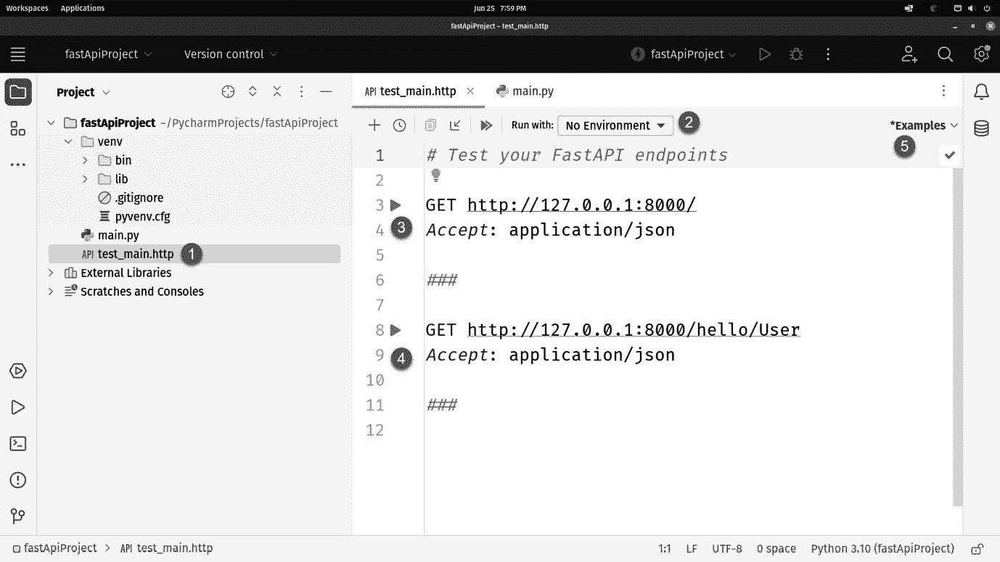

图 9.7：PyCharm 作为 FastAPI 项目一部分生成的 HTTP 测试文件

你可以直接在`main.py`旁边找到该文件`test-main.http`，这让我们确切地知道正在测试什么。`main.py`文件将包含端点，而`test_main.http`将包含所有端点的测试。

这个`http`测试文件不是代码，正如我们在*第六章*中看到的，*无缝测试、调试和性能分析*。这是一个 HTTP 请求的规范。定位`main.py`，这是一个很好的起点。这些测试非常简单，就像单元测试一样，可以使用绿色箭头单独运行。如果你想运行文件中的所有测试，可以使用工具栏**（2**），其中有一个带有两个绿色箭头的按钮。还有一个环境选择器，我们很快就会回到它。**（5**）位置显示了一个链接，提供了可以粘贴到测试文件中的一组示例。我们也会回到那里。首先，让我们练习我们的测试并看看它做了什么。我会点击*图 9.8*中顶部箭头所示的双箭头运行按钮：

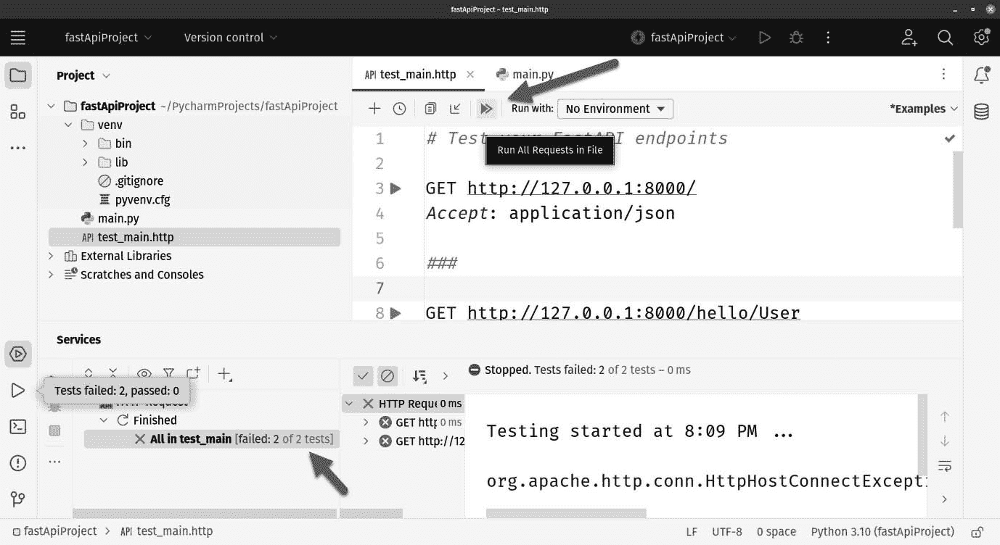

图 9.8：点击双箭头以运行所有测试，你会发现它们都失败了！哦，不！

这并不好。两个测试都彻底失败了。我说“彻底失败”是因为 PyCharm 没有留下任何歧义。我看到一个红色的横幅告诉我测试失败了。我看到红色的文字，通过下方的箭头，告诉我两个测试失败了。我看到测试列表旁边的红色 X。我看到一条消息说“停止。测试失败 2 个中的 2 个”。如果还不够，还有一个日志区域也会告诉你你的代码没有达到预期。简而言之，这个屏幕上的红色标记比编辑器第一次审阅后这一章的手稿上的还要多！相信我，那真的很多！究竟出了什么问题？为什么 PyCharm 会在一个“Hello World”示例中生成那样的失败测试代码？

代码没有问题！在*第六章*，“无缝测试、调试和性能分析”中，我们学习了单元测试。单元测试由使用断言测试你正在测试的代码的代码组成。HTTP 文件不包含代码，这不是单元测试，这是集成测试。这些测试需要运行中的服务器才能工作。让我们再试一次。查看*图 9.9*并跟随操作，如果你愿意的话：

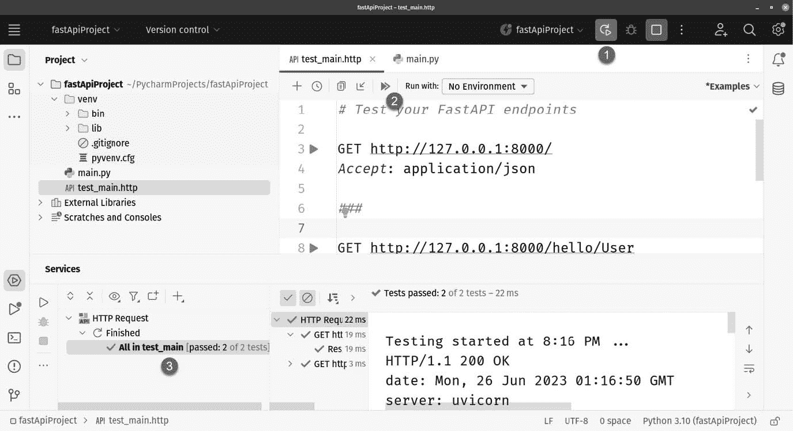

图 9.9：在运行 HTTP 测试之前，你必须运行开发服务器

点击 API 项目的运行按钮**（1**）。然后点击测试的运行按钮**（2**）。服务器运行时，所有测试都将通过**（3**）。如果它们没有通过，请联系 JetBrains 并要求退款。这可能不会奏效，但这没关系，因为你的测试应该会通过。

## 检查返回的详细信息

知道我们通过了测试是不够的，因为这实际上只意味着两个请求都是针对本地开发服务器进行的，并且都返回了状态码`200`。你真正想要的，大多数情况下，是能够看到响应中返回的 JSON 数据。让我们去找找看。找到测试的输出，向下滚动直到你看到类似*图 9.10*中所示的 JSON 文件提及：

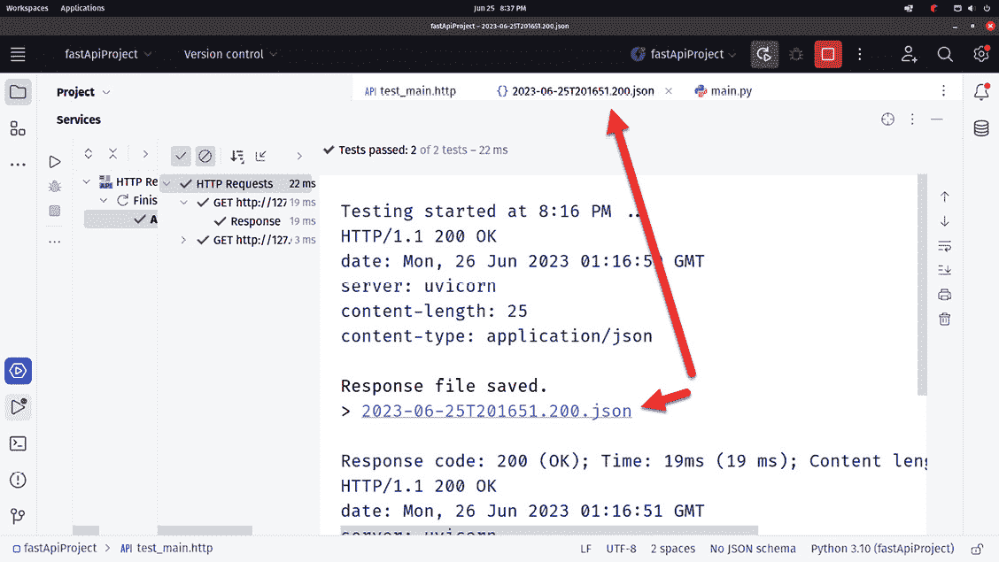

图 9.10：在日志中滚动，找到指向 JSON 文件的链接。点击它们在编辑器的选项卡区域打开数据

日志窗口中的这一部分告诉我们测试中请求和响应的所有详细信息。我们可以看到以下内容：

+   正在使用的 HTTP 版本（1.1）

+   响应的状态码（`200 OK`）

+   请求的日期

+   生成结果的服务器（`uvicorn`）

+   响应的内容类型（`application/json`）

+   测试结果保存的位置

Yahtzee! PyCharm 将响应结果保存在一个带日期戳的 JSON 文件中，其中包含状态码，并在日志中以超链接的形式展示。如果您点击链接，JSON 文件将像任何其他文本文件一样在其自己的标签页中打开。在 *图 9**.10* 中，我不得不将日志扩展到足够大，以便拍摄到良好的截图，但这掩盖了打开标签页的内容，因此请查看 *图 9**.11* 以查看点击日志中的超链接后其标签页中的返回数据：

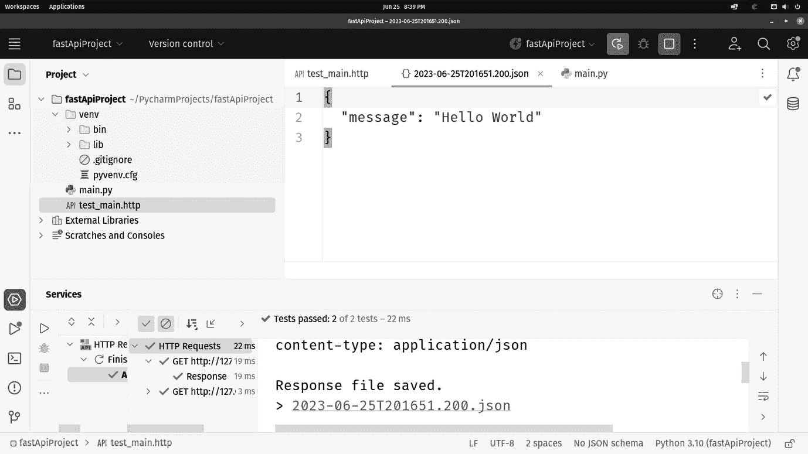

图 9.11：点击超链接后，返回数据出现在其自己的标签页中

如果您注意到，它说文件已保存，但它没有出现在项目文件中。如果您想知道它在哪里保存，您可以按照 *图 9**.12* 中的指示右键单击标签页：

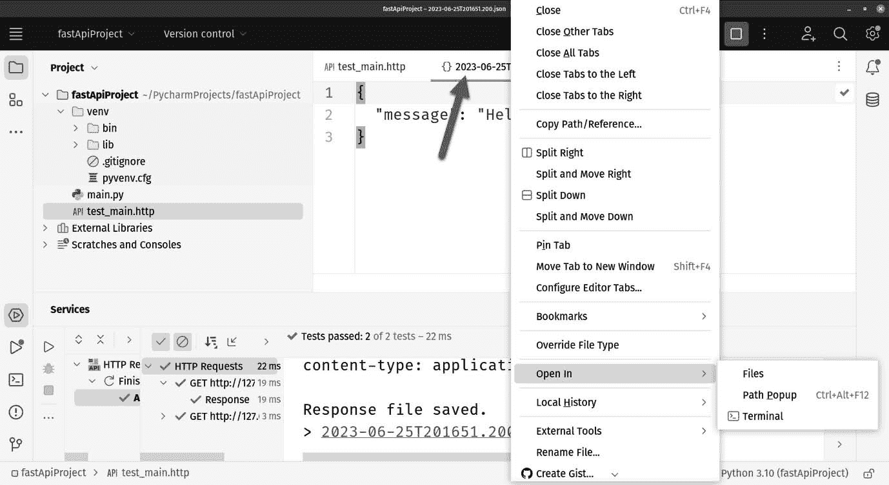

图 9.12：右键单击标签页，使用“打开方式”菜单打开测试结果 JSON 文件的存储位置

菜单的内容将根据您的操作系统而有所不同。您正在寻找的是顶部选项，对我来说是 **文件**，这是 **Gnome 42** 的默认文件管理器。Windows 将有对资源管理器的引用，而 macOS 应该有对 Finder 的引用。点击该选项将在您特定的操作系统文件管理器中显示位置。您可以在 *图 9**.13* 中看到我的：

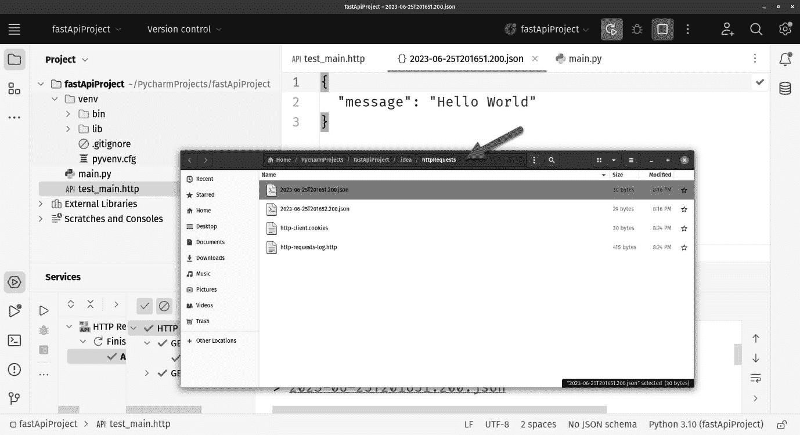

图 9.13：我的文件管理器显示了 HTTP 响应文件的存储位置，该位置在项目的 .idea 文件夹中

如您所见，测试结果存储在 PyCharm 项目文件夹中：当您在 PyCharm 中创建新项目或打开文件夹时，IDE 创建的隐藏的 `.idea` 文件夹。请记住，任何以点开头的文件夹在 Mac 或 Linux 上都是隐藏的，但在 Windows 上您可以看到它们，因为比尔喜欢与众不同。如果您经常测试，这些文件可能会开始以数量堆积。我个人更喜欢将它们排除在我的存储库之外。

## 我们刚刚生成了一个新的运行配置

从测试窗口运行所有测试的一个整洁副作用是 PyCharm 会创建一个新的运行配置，您可以在 *图 9**.14* 中所示的运行配置下拉菜单中找到：

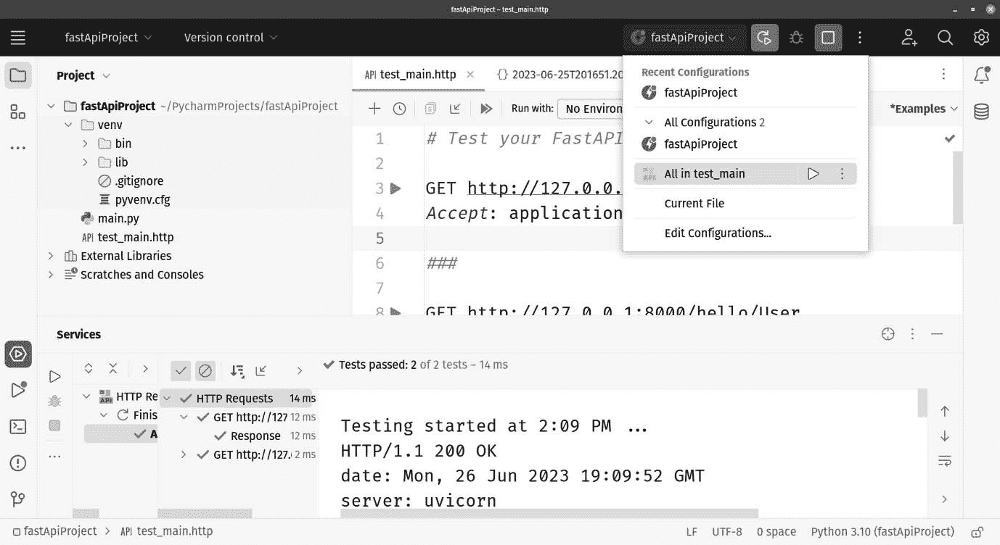

图 9.14：在第一次运行 HTTP 测试后，PyCharm 自动创建了一个新的运行配置

如果我们编辑配置，您可以看到更多详细信息，如图 *图 9**.15* 所示：

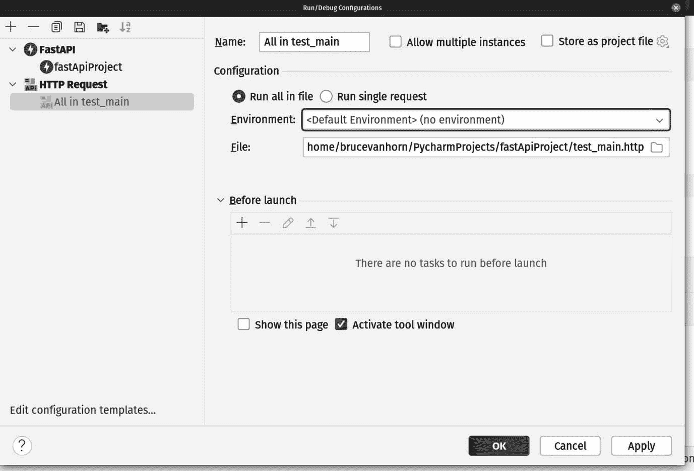

图 9.15：HTTP 请求测试运行的选项可以在运行配置编辑器中找到

如你所见，你可以选择运行单个请求或文件中的所有请求。如果你专注于一个端点的代码并需要反复运行它，运行单个请求就很有用。如果你在测试中有许多端点，你的测试可能需要一段时间才能完成。

## 使用运行配置中的“启动前操作”

我们已经看到，我们每次运行 HTTP 测试都会生成一个新的包含响应的 JSON 文件。这可能会很快让文件夹里充满数百个文件。由于 PyCharm 为我们提供了运行配置，我们有设置一些自动化来删除旧文件的机会。在本节中，我们将探讨 PyCharm 运行配置设置中可用的自动化功能。

要做到这一点，你需要一个脚本来删除你想要的 JSON 文件。也许你想要删除一周之前的所有文件，或者你可能只想保留最后 25 次运行。这部分取决于你。

为了自动化这个过程，你需要为你的操作系统创建一个 shell 脚本。如果你不是 shell 脚本高手，那没关系，因为现代人工智能可以来帮助你。*图 9.16*显示了我是如何请求 ChatGPT 为 Bash shell 创建一个只保留我们测试运行生成的最后 25 个 JSON 文件的 shell 脚本的：

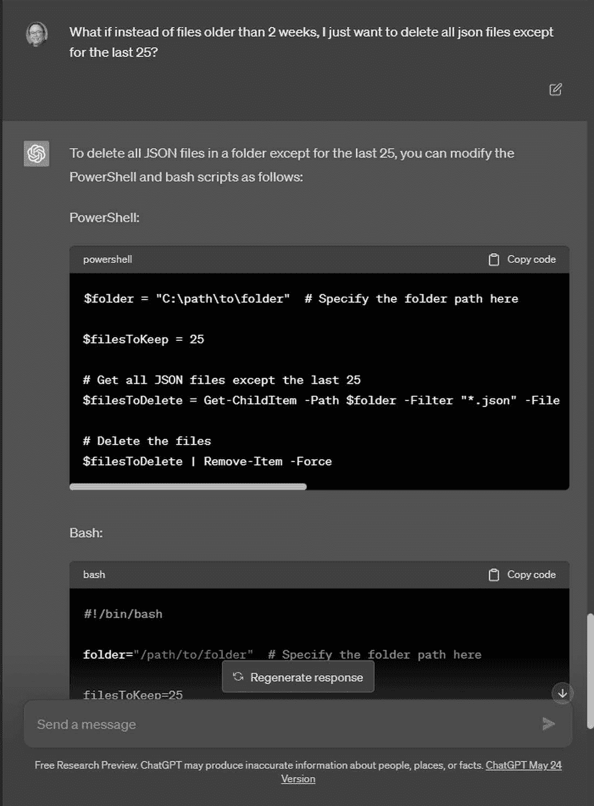

图 9.16：我询问 ChatGPT 关于删除旧文件的一些不同方法，并为我的需求生成了一个脚本

我意识到你无法在图中看到 Bash 脚本的全部内容，所以我将确保将其包含在本章的项目源代码中。

警告 - 永远不要运行你不理解的生成脚本！

你绝不应该在没有完全理解其工作原理的情况下盲目运行由 ChatGPT 或其他任何东西（或任何人）生成的脚本！ChatGPT 可能不会给你和我相同的结果，所以在运行它给出的任何脚本时要格外小心。如果脚本中包含类似`-Force`这样的开关，就像图中的 PowerShell 脚本那样，更要特别小心。如果你不知道脚本做什么，不要在你的电脑上运行它！

要使用生成的代码，你只需像添加其他任何文件一样将新文件添加到你的项目中。我将在“项目”窗口中右键单击我的项目，创建一个名为`delete-old-http-test-results.sh`的新文件。当然，如果你使用的是 Windows，你将想要使用 PowerShell，它通常有一个`.ps1`的扩展名，所以它将是`delete-old-http-test-results.ps1`。一旦你完全理解运行该脚本的影响，就复制 AI 生成的脚本并保存文件。

确保脚本具有运行权限

确保你创建的脚本文件有权限在你的计算机上运行。大多数版本的 Windows 严格限制运行任何 PowerShell 脚本，而你执行此操作的能力甚至可能受到你雇主的安全策略的限制。

在 Mac 和 Linux 上，你可能需要在 PyCharm 执行脚本之前在终端中运行此命令：

`chmod +x delete-old-http-test-results.sh`

如果你无法手动运行脚本，那么它可能也无法在 PyCharm 中运行。

接下来，我们需要创建一个执行脚本的运行配置。点击运行配置下拉菜单并点击 **编辑配置**。如果你不记得如何操作，请回顾 *第三章*，*自定义解释器和虚拟环境*。使用 Shell 脚本模板添加一个新的运行配置。你可以在 *图 9**.17* 中看到我的配置：

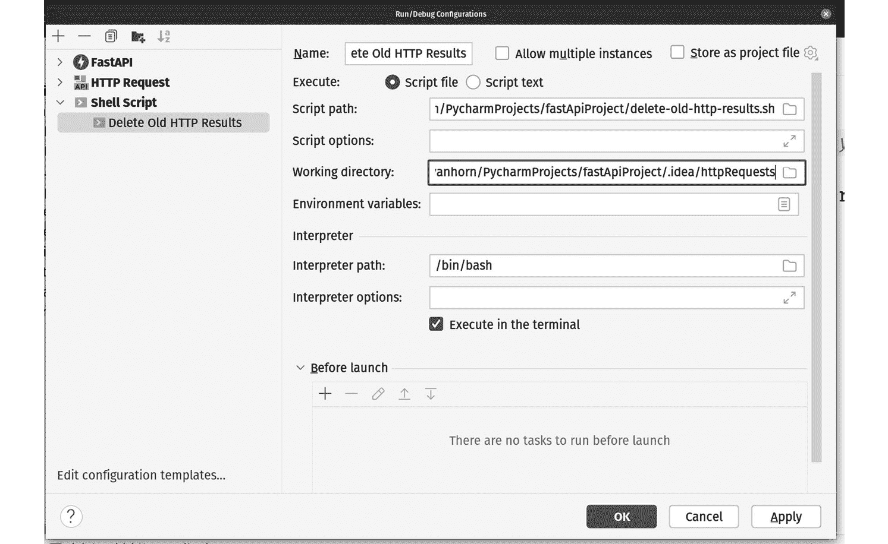

图 9.17：为刚刚创建的 shell 脚本创建一个运行配置

你可以通过项目 `.idea` 文件夹中的 `httpRequests` 文件夹中的文件夹按钮来导航到 shell 脚本。点击 **工作目录** 文本框中的文件夹图标来浏览此文件夹。如果你不在 Windows 上，这将是一个隐藏文件夹，所以请确保在选择对话框中像我一样打开查看隐藏文件夹，如图 *图 9**.18* 所示：

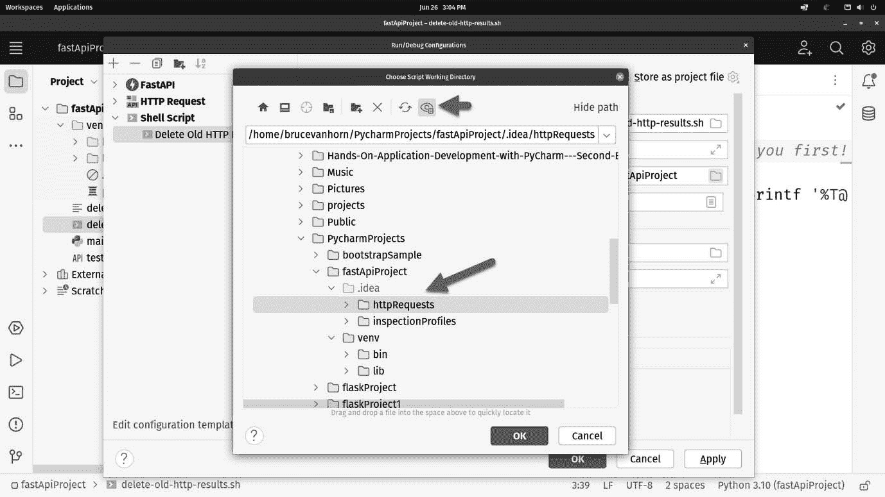

图 9.18：为了找到 .idea 文件夹中的 httpRequests 文件夹，你需要通过点击顶部工具栏上的眼睛图标（ouch）来打开隐藏文件夹

现在，你已经有一个执行你的 `delete` 脚本的运行配置了。你应该测试它。运行你的测试 26 次，并验证你 `httpRequests` 文件夹中只有最后 25 个结果。我将在接下来的 25 张全页彩色屏幕截图中展示我的结果。开玩笑的。有时候吓唬我的编辑也很有趣。

如果一切顺利，并且你感到满意，那么你还可以做一件事来让它更加出色。你可以将你的删除脚本运行配置与你的测试运行配置链式连接。编辑测试的运行配置并添加一个“在构建之前”条件。点击 **+** 按钮添加一个新条件。点击 **运行另一个运行配置**。点击 **删除旧 HTTP 结果运行配置**。你应该会看到类似于 *图 9**.19* 的内容，它显示删除脚本将在每次新的测试运行之前运行：

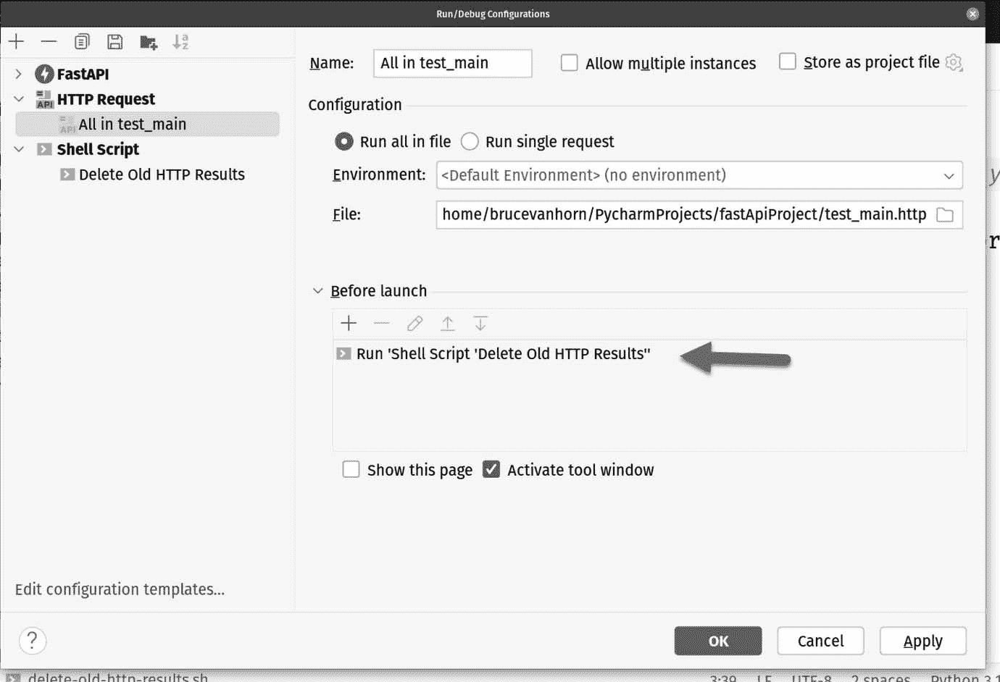

图 9.19：删除运行配置现在将在每次测试启动之前运行

为了本书的目的，我将我的保留数量更改为最后五个 JSON 文件并尝试了一下。每次运行后，我可以在我的文件浏览器中查看，如图 *图 9**.20* 所示，看看它是否在运行：

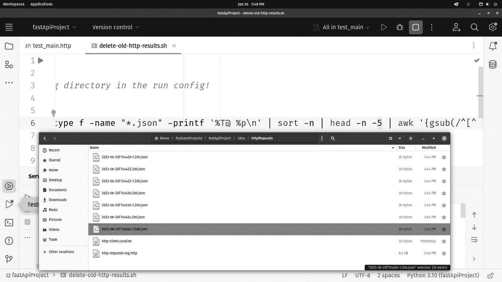

图 9.20：运行后，由于删除脚本在运行前将文件数量减少到五个，并且测试为两个端点生成结果，因此有七个 JSON 文件

你文件夹中最多只有 25 个结果，或者你脚本中指定的那么多！不过，别忘了，删除脚本首先运行，PyCharm 将为每个测试端点生成一个新 JSON 文件。如果我将我的删除脚本设置为保留五个 JSON 文件，并且运行生成的测试脚本，那么运行后我将有七个文件，因为有两个端点正在被测试。

使用这种技术，你可以为你的代码启用许多自动化场景。Python 通常没有像许多其他语言那样的构建脚本，所以知道你可以在 IDE 本身中拥有这种自动化水平是件好事。除了运行另一个运行配置之外，还有几个选项。我建议你探索所有可能性！

## 与 HTTP 请求环境一起工作

大多数 Web 项目最初是在开发者的电脑上开始的。当你测试时，你会在你的笔记本电脑或 PC 上本地运行你的应用，而你所有的测试请求通常都会发送到 localhost，这是分配给每个带有网络卡的电脑的回环地址。项目从这里开始，但假设应用达到任何程度的成功，它将不会停留在那里。

最佳实践规定，打算发布的应用应该使用某种**持续集成**（CI）环境，以便运行自动化测试。实际上，JetBrains 有一个名为 Team City 的 CI 产品。我使用 Team City 多年，可以证明它是一个易于设置且免费的优秀 CI 系统，适用于小型团队。如今，甚至还有一个云版本，所以如果你不想设置自己的服务器，你也不必这么做。然而，Team City 拥有我们一直在使用的插件，用于在 FastAPI 项目中为我们的 HTTP 端点创建测试。这允许你在有人向你的源代码库提交代码时自动测试你的项目。

一旦你的代码通过了 CI 系统的审查，通常会将代码部署到测试服务器。这应该是一个尽可能接近生产环境的服务器。有些人称之为预发布服务器，有些人称之为**用户验收测试**（UAT）。无论你叫它什么，它代表了一个环境。生产环境也是一个环境。环境简单来说就是一个配置环境，你可以在其中运行你的代码。为了清楚起见，到目前为止，我们已经提到了四种这样的环境：

+   你的本地电脑（localhost）

+   一个 CI 环境，这些天可能是一个 Docker 容器

+   一个 UAT/预发布环境，你可以在将应用发布到生产环境之前对其进行测试

+   一个生产环境，你的真实客户在这里使用你的应用

这些环境中的每一个可能都有不同的属性。例如，您在笔记本电脑上运行的 FastAPI 应用程序可以通过 IP 地址 `127.0.0.1` 访问。默认情况下，应用程序在端口 `8000` 上运行，并且默认情况下，使用的协议是 HTTP 而不是 HTTPS，因为很少有开发者在他们的笔记本电脑上花费时间设置 SSL/TLS 证书。

然而，当您在预发布环境中测试您的应用程序时，所有这些参数都不同。您可能有一个 SSL 证书，所以您将使用 HTTPS 作为协议。您肯定有一个不同的 IP 地址。您甚至可能有一个域名服务器解析一个漂亮的测试域名供您的应用程序使用。您可能不会使用端口 `8000`，因为这不太像生产环境。相反，您将使用端口 `443` 或 `80`，在这种情况下，您可能根本不需要填写端口。

生产环境也将有不同的属性。

在我们的 API 测试中，我们能够配置一组变量用于我们的测试脚本，这些变量被分配给一个环境名称。请确保您有 `test_main.http` 文件，或任何 `.http` 文件。点击 *图 9**.21* 中显示的环境下拉菜单：

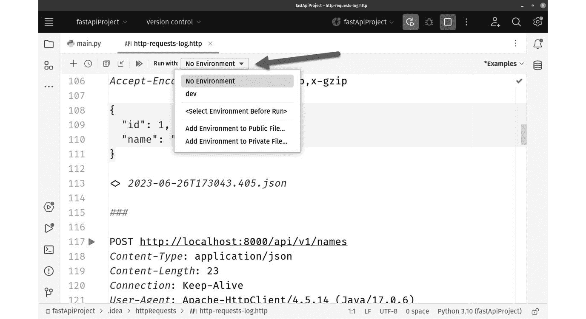

图 9.21：您可以为运行测试选择一个具有各自配置变量的环境

我会坦白。我提前工作并设置了一个，但我们假装我没有。现在，您唯一的选择是 `http-client.env.json`。您可以在 *图 9**.22* 中看到我的：

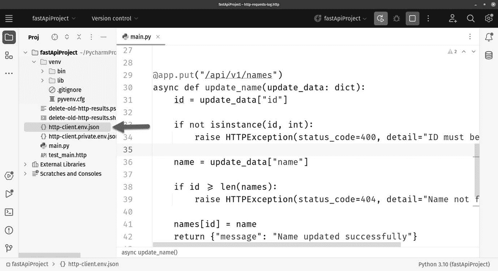

图 9.22：PyCharm 创建了 http-client.env.json，这将允许我为测试设置不同的环境

如果您选择了 `http-client-private.env.json`。这两个文件的目的和区别在我写这篇文档时并未在文档中说明，所以我们将发挥想象力。我个人将我想与我的开发团队共享的环境放在公共文件中。如果我想创建某种私有环境，比如虚拟机、Windows Subsystem for Linux、Docker 中的自定义实验，或者可能在实验室中的 Kubernetes 集群，我可以用私有文件，我可能会将其放在我的 `.gitignore` 文件中。由于文件内容相同，我将专注于公共文件。

我将添加一个定义用于我的本地计算机。将 `http-client.env.json` 的内容更改为以下内容：

```py
{
 "dev": {
  "protocol": "http://",
  "base_url": "localhost",
  "port": 8000,
  "api_version": "v1"
}
```

现在我们已经设置了一个带有一些环境变量的开发环境。让我们在 `test_main.http` 文件中使用它们。您的第一个端点定义看起来像这样：

要使用环境变量，请将您的 URL 中的部分替换为 mustache 格式的文本。Mustache 格式意味着将您想要解析的变量放在双大括号中，例如 {{ this }}：

```py
GET {{protocol}}{{base_url}}:{{port}}
```

结合起来，URL 将解析为原始地址，即 [`localhost:8000`](http://localhost:8000)，或者如果您更喜欢，[`127.0.0.1:8000`](http://127.0.0.1:8000)。现在您可以用同样的方式创建其他环境。您可以在不更改测试的情况下切换环境并运行测试，环境变量会为您解析 URL。

如果您查看本章示例代码中的我的代码，您会发现我以这种方式对整个文件进行了修改。

# 让我们变得更加 CRUD（创建、读取、更新、删除），然后再进行测试！

目前，我们应用中唯一的东西是两个预生成的端点。让我们再添加一些，使这个应用更有趣。我们将创建一个假名单应用，就像我们在*第八章*中做的那样，*使用 Flask 构建动态 Web 应用*。

打开 `main.py` 并为每个 CRUD 操作添加一个端点，以及构建 RESTful API 时使用的四个主要方法。我们将进行一些重大更改，所以我会从文件顶部开始简单介绍它们。

在第一行，我们将导入的地方改为这个：

```py
from fastapi import FastAPI, status, HTTPException
app = FastAPI()
```

应用实例化没有变化。不过，下面添加这个令人惊叹的人名单：

```py
names = ["Bruce", "Karina", "Kitty", "Phoebe"]
```

这个列表将作为假数据库使用，节省我们设置服务器和等等的时间，这会严重膨胀书籍，并且不会对我们的即将成为冠军级的 PyCharm 技能做出贡献。我们将保留前两个生成的端点不变，所以请在 `say_hello` 函数的返回下面开始编辑。我们的第一个 CRUD 端点将提供一个类似从数据库查询得到的名单：

```py
@app.get("/api/v1/names")
async def get_names():
  return [{"id": idx, "name": name} for idx, name in enumerate(names)]
```

在您的项目中启动预期返回 JSON 数据的端点，而不是标记，使用前缀 `API` 后跟版本标识符，这是一种最佳实践。当我说您想这样做时，请相信我。随着您的 API 代码成熟，您可能希望提供更新的端点，这些端点可能不一定与旧客户端向后兼容，而这种技术允许您在为较新客户端引入改进功能的同时，保持 API 与旧客户端向后兼容且不会中断。随着代码进一步成熟，您可以在您选择的时间逐步删除 `v1` 端点：

```py
@app.post("/api/v1/names", status_code=status.HTTP_201_CREATED)
async def create_name(name: dict):
  new_name = name["name"]
  names.append(new_name)
  return {"message": "Name added successfully"}
```

在先前的 `POST` 端点中，对于成功的调用返回 HTTP 状态码 `201`，表示 API 创建了新数据，这是一种最佳实践。FastAPI 的工作方式与 Flask 非常不同。它没有离散的请求和响应对象，一切都是隐式的。如果您期望将 JSON 作为有效载荷发布到您的 API，您只需指定一个 `dict` 类型的参数即可。在这种情况下，我期望以以下格式发布数据：

```py
{"name": "Igor"}
```

一个真正的应用程序会有更丰富的结构。我们保持简单。当这个 JSON 作为`POST`的负载进来时，我们提取名字并将其添加到我们的列表中。为了简化，我在这端点没有进行任何验证。你应该始终验证你的输入数据，以保护自己免受有毒数据和注入攻击。这是另一本书的主题。话虽如此，我不会完全偷懒。我会在`PUT`端点做一点，这样你可以看到一些这样的样子。记住，`PUT`调用是一个`UPDATE`操作。我们正在获取一个`id`值和一个新的`name`值，并将相应地更改现有值。在你的`create_name`函数返回下面添加这些行：

```py
@app.put("/api/v1/names")
async def update_name(update_data: dict):
  id = update_data["id"]
```

现在回到代码。让我们确保提交的 ID 属性是一个数字，具体来说是一个整数：

```py
  if not isinstance(id, int):
    raise HTTPException(status_code=400, detail="ID must be an integer")
```

这里发生了什么？如果你提交了一个无法解析为数字的 ID 属性，我会给你返回一个 HTTP 错误状态码`400`，这意味着你的请求格式不正确。为了表示友好，我会添加一条消息告诉你你做错了什么。例如，假设你这样使用`PUT`：

```py
{ "id": "2", "name": "Igor" }
```

一切都应该正常工作。但是，如果你使用以下`PUT`：

```py
{ "id": "this isn't a number", "name": "Igor" }
```

你的请求将会失败。提升 HTTP 扩展会导致响应立即发送，并且这段代码的其余部分不会执行。所以，让我们继续。如果你提交了良好的数据，我们可以继续并获取新的名字：

```py
  name = update_data["name"]
```

接下来，我们检测你提交的数字 ID 是否超出了范围。我们的列表最初包含四个名字。如果你尝试向`id` 600 发送更新，除非你通过`POST`端点至少添加了同样多的名字到列表中，否则这是不应该工作的。在`PUT`中，如果你提供了一个无效的`id`值，通常的做法是返回一个`404`错误，表示你无法在数据库（或在我们的情况下是列表）中找到该 ID：

```py
  if id >= len(names):
    raise HTTPException(status_code=404, detail="Name not found")
  names[id] = name
  return {"message": "Name updated successfully"}
```

已经完成了三个，只剩下一个。对于`DELETE`端点，我只需要`id`。为这样简单的事情发送 JSON 负载是愚蠢的，所以我将只从端点 URL 中获取 ID。我仍然需要检查它是否在`names`列表的长度范围内：

```py
@app.delete("/api/v1/names/{id}")
async def delete_name(id: int):
  if id >= len(names):
    raise HTTPException(status_code=404, detail="Name not found")
```

如果是这样，我就会直接从列表中移除它，并返回一条友好的消息：

```py
  deleted_name = names.pop(id)
  return {"message": f"Deleted name: {deleted_name}"}
```

运行应用程序并确保它启动。进行必要的调整。记住，最终的代码在本书的示例代码中，位于我们从仓库中检出*第二章*的示例代码中。

## 变得更加挑剔

如果我心情不好，可能会很烦躁，对吧？现在我们有更多样化的端点，让我们学习如何使用 HTTP 客户端测试它们。事实上，这个工具非常丰富，就像 Insomnia 或 Postman 这样的专用工具一样丰富，只是没有那么多 UI 界面阻碍。

打开你的`test_main.http`文件，让我们添加一些测试。不仅仅是简单的测试，让我们做一些真正的测试，感受一下 PyCharm 工作流程如何帮助你构建 RESTful API。

PyCharm 的这些测试功能与任何框架都兼容

我应该提到，虽然我们正在使用 FastAPI，但这些功能并不是独特的或与该框架相关联。如果你在 Flask 或其他框架中开发 API，这些工具也会以相同的方式工作。

到目前为止，你只有两个测试，这些测试是在你创建项目时生成的：

```py
# Test your FastAPI endpoints
GET {{protocol}}{{base_url}}:{{port}}
Accept: application/json
###
GET {{protocol}}{{base_url}}:{{port}}/hello/User
Accept: application/json
```

我没有明确要求你使用我们之前创建的环境变量修改第二个测试端点，但我还是做了，因为这看起来像是一个明显的改进。随着你向测试文件添加代码，有几个值得注意的事项：

+   请求可以存储在具有`.http`或`.rest`扩展名的文件中。到目前为止，我们使用的是与项目一起生成的`.http`文件。在野外，你可能看到任一扩展名，它们之间除了在 IDE 中显示的图标外，没有根本的区别。这完全是装饰性的。

+   代码高亮和语法补全都是激活的。这些文件的语言是专业的，但你可以期待在这里获得与其他任何地方相同级别的工具。

+   此文件中的代码也将显示内联文档。

+   请求必须通过三个井号/磅符号（`###`）进行分隔。如果你没有添加这些符号，IDE 会通过一片红色的波浪线来提醒你。

+   你可以将命令行 cURL 命令粘贴到这个文件中，它将自动将其转换为 PyCharm 使用的语法。

+   支持模板。我们已经看到了环境变量替换在起作用。请保持关注，它即将变得非常精彩！

测试编辑器有一点点用户界面，但说实话，一旦你学会了语法，你可能就不会使用它。让我给你展示一下。参见图 9.23：

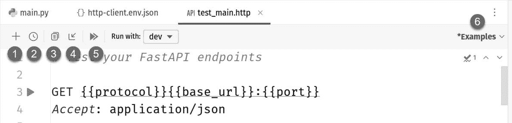

图 9.23：测试编辑器具有最小化的用户界面

让我们看看数字：

**（1）**处的**+**图标允许你添加另一个测试。说实话，直接在编辑器中这样做更容易，但如果你喜欢点击东西，这里就是你的选择。

在`.idea`项目文件夹内的`httpRequests`文件夹中有一个时钟图标。由于 PyCharm 在文件更改时会自动重新加载文件，所以保持此文件打开状态可以让你看到所有发生的事情，而无需查看单个响应文件。之前，我们添加了自动化功能来删除许多这些响应文件，因为通常会有很多。这不会影响日志文件，因为请求信息是从日志窗口而不是响应文件本身附加的。实际上，日志也显示了响应数据。

高级技巧 - 在拆分视图中打开日志，这样你就可以始终看到它

如果你右键单击包含日志文件的选项卡并选择拆分选项之一，例如**拆分右侧**，则选项卡将在单独的选项卡组中打开。如果你有一个宽大的 4K 显示器，你有很多空间同时打开日志、代码和测试文件，以便你可以一起查看它们。

**（3）**处的文档图标是为了让命令行爱好者感到高兴。如果您选择一个请求并点击此按钮，您就可以生成一个 cURL 命令，然后可以将其粘贴到终端窗口中。**（4）**处的导入图标为您提供了一个 UI，您可以将 cURL 命令粘贴到其中，然后它将被转换为 PyCharm 使用的请求格式。这并不是特别有用，因为您可以直接将 cURL 命令粘贴到编辑器中，转换会自动发生。

我们已经看到了**（5）**处的**运行所有测试**按钮，以及环境选择下拉菜单。除了历史日志之外，此工具栏上最有用的项目可能是**（6）**处的示例链接。这并不花哨，但很有用。点击此链接将打开一个包含大量示例的文件，您可以复制、粘贴并修改这些示例。本质上，这与您点击位置**（1）**处的 UI 按钮时发生的事情相同。对我来说，打开示例更快、更简单，因为您可以在一个地方看到所有内容。要使用它，只需点击如图*图 9.24*所示的**示例**链接：

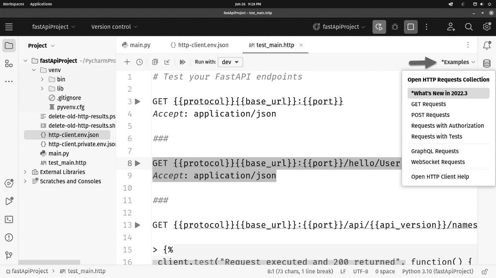

图 9.24：测试示例按类别划分

我喜欢使用旁边的`POST`请求示例，如图*图 9.25*所示：


图 9.25：您可以将示例打开到旁边以便轻松粘贴

要像这样拆分文件，只需右键单击选项卡并点击**拆分右侧**，或根据您的偏好选择左、上或下。

## 创建测试

让我们创建这些测试！请确保您正在`test_main.http`中工作。在您的最后一个测试下方添加以下行：

```py
###
GET {{protocol}}{{base_url}}:{{port}}/api/{{api_version}}/names
```

三个井号（#）是测试之间的分隔符。其余的都是来自我们之前创建的环境变量的变量。这将转换为 http://localhost:8000/api/v1/names。请确保您的应用程序正在运行，并运行测试。您应该会看到像*图 9.26*中那样的结果：

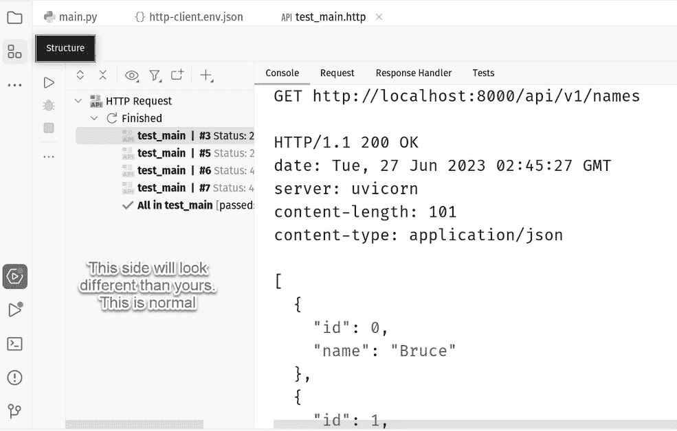

图 9.26：当您运行测试时，您可以在日志视图中看到响应数据。我的结果左侧通常会与您的不同

这很棒，对吧？您可以看到您得到了一个良好的状态码（`200`），并且您可以看到您的数据。如果您能将此转换为有效的测试怎么办？您可以！回到`test_main.http`文件。美国（也许是世界）历史上的每一个伟大时刻都 precedes by the phrase I will utter next: *Hold my beer and* *watch this*。

在您的测试下方，添加以下代码：

```py
> {%
 client.test("Request executed and 200 returned", function() {
   client.assert(response.status === 200, `Response status is ${response.status} but should be 200`);
 });
```

第一个字符至关重要。你必须输入一个`>`后面跟着`{%`。如果不这样做，PyCharm 会变得非常不高兴！只需暂时凝视一下它的庄严。全部吸收进去。这里有一个测试。用 JavaScript 编写的！很抱歉，我应该提醒你坐下或类似的事情。然而，我确实提到了啤酒。这里有一些魔法。在这个测试窗口中有一个固有的`client`对象，这与浏览器窗口中始终存在的`window`对象非常相似。我们在那个客户端对象上调用`.test`方法，并传递两个参数。第一个是一个描述测试的字符串。这可以是任何你想要的东西。内容不会以任何方式影响测试。第二个参数是一个匿名函数，它实际上执行了测试。如果你不熟悉 JavaScript 中 lambda 风格函数的使用，你只能照着例子复制这些测试。我想你也可以去学习 JavaScript，但这可能需要一段时间。幸运的是，`client.assert`部分看起来就像我们在*第六章*，“无缝测试、调试和性能分析”中编写的测试，所以让我们继续。断言接受一个将评估为真或假的表达式。JavaScript 使用三个等号来测试不进行强制转换的相等性。如果你还没有听说过这个，现在，只需知道你应该始终使用三个等号，因为使用两个等号意味着其他事情，你不想那样。Python 中常见的双等号可能会在 JavaScript 测试代码中产生错误的失败，因为 JavaScript 会尝试强制任何遇到的数据类型匹配。三个等号避免了这种情况。

在条件语句之后，我们有一个 JavaScript 模板字符串。这相当于 Python 的`f`字符串。你使用引号标记。引号标记是美式键盘上按下的波浪号(~)，它看起来像重单引号：`. 将字符串包围在引号标记内指定该字符串为模板字符串。你可以使用`${whever}`在花括号中替换表达式或变量值。所以，在 Python 中，给定`foo = bar variable`，一个`f`字符串将是这样的：

`f"I'd rather be at` `the {foo}."`

在 JavaScript 中，给定`const foo = "bar"`，它将是这样的：

`` `我宁愿在 `` `` ${foo}` ``

这里，我使用了模板字符串来提供更多一点的信息，因为第二个字符串实际上暴露了测试失败时看到的消息。

这个特定的测试确保请求的 HTTP 响应代码是`200`，这表示它是成功的。如果你不包含这样的测试，那么即使你的端点代码熔化了服务器，从宇宙中心的深处召唤出伟大的克苏鲁，你的结果也总是绿色的。尽管预期的代码可能会根据你所做的事情而改变，但这种测试应该每次都包含在内。

### 你应该始终添加的更多测试

检查你的状态码是最基本的要求。我断言（看看我做了什么？）你应该检查尽可能多的事情。在这里，我将添加一个测试来验证返回的数据具有 `application/json` 的 MIME 类型，这对于客户端如何消费这些数据非常重要。在下面的早期测试下方添加此内容：

```py
 client.test("Response should be json", function() {
   const type = response.contentType.mimeType;
   client.assert(type === "application/json", `Expected application/json
   but got ${type}`);
 });
 %}
```

记住，这是 JavaScript！所以在这里，我添加了一个名为 `type` 的常量，并从测试窗口中可用的另一个神奇对象中获取值。`response.contentType.mimeType` 会给你这个值。我们测试以确保它是 `"application/json"`。我个人认为关注细节很重要，如果内容类型没有正确设置，我认为专业人士创建的 API 非常不专业。碰巧的是，FastAPI 为我们做了这件事，但并非每个框架都会这样做。

现在您已经掌握了基础知识，我邀请您探索本章示例代码中的完成后的 `test_main.http` 文件。那里有针对我们放入 `PUT` 端点的所有条件的测试，以确保如果您的用户发送非数字 ID，则返回 `400` 状态。还有一个测试来确保如果您的 ID 超出了 `names` 列表的可接受范围，您会得到 `404` 错误。

# 通过附加项目来编辑和调试全栈应用程序

PyCharm 有能力将多个项目组合在一起，让您能够在同一个 IDE 实例中处理全栈应用程序。当您在 PyCharm IDE 中运行多个附加项目时，您可以无缝地一起调试它们！仅此一项功能可能就足以让您停止使用 vim 或 VS Code，并且永远不再回头！虽然您可以在其他 IDE 或甚至 VS Code 中这样做，但 PyCharm 使其变得如此简单，您可能不会想再使用其他工具。

## 在单独的项目中创建一个 React 应用程序

为了为我们的 FastAPI 后端创建前端，我们将利用 React。像往常一样，我无法在这里向您传授很多关于 React 的知识。我会在本章末尾的**进一步阅读**部分确保有一些参考资料。

在 PyCharm Professional 中创建一个 React 应用程序，只需使用您可能已经习惯的常规**文件 | 项目**操作即可。这里有一个项目模板，它利用了一个名为 **create-react-app**（**CRA**）的开源产品。这是一个被 React 开发者广泛使用的工具，因为实际上，从头开始设置一个完整的 React 应用程序既繁琐又耗时。

为了使这个 `create-react-app` 脚本正常工作，您需要安装 Node.js。如果您没有安装，PyCharm 将尝试为您安装，正如您在**图 9**.27 中所看到的。27*：

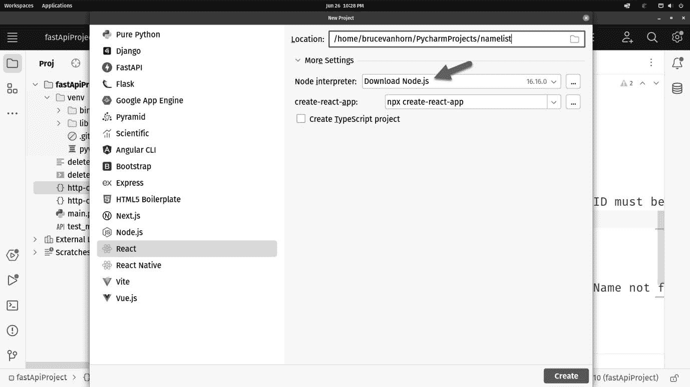

图 9.27：在创建一个 JavaScript 项目，例如 React 项目时，您需要安装 Node.js，否则 PyCharm 会尝试为您安装

根据我的经验，这并不总是奏效。Visual Studio 中也有同样的功能，我通常建议我的学生手动安装 Node.js，而不是让 IDE 来做。一般来说，IDE 通常不会指向 Node.js 的最新版本。我可以在 *图 9.27* 中看到 PyCharm 意图安装 16.16.0，这不是最新的。此外，查看正确的版本，我进一步建议您使用 Node.js 的最新 **长期支持** (**LTS**) 版本，而不是版本号最高的版本。LTS 产品保证稳定，而绝对最新的版本则不一定。

我还推荐使用 Node.js，以及 Python，使用包管理器，如 **Chocolately** ([`chocolatey.org/`](https://chocolatey.org/)) 或 **Homebrew** ([`brew.sh/`](https://brew.sh/))。包管理器在 Linux 上是标准配置，每个发行版都有自己的包管理器，所以如果您使用 Linux，我会假设您知道您需要哪个。我提倡使用包管理器安装 Node.js 的原因是，包管理器使得更新，甚至完全删除您的软件变得非常容易。如果您想尝试 Mac 上的 Homebrew，我网站上有一个简短的、免费的课程，教您如何为 Node.js 开发设置苹果电脑。您可以在 [`www.maddevskilz.com/courses/setting-up-a-nodejs-development-workstation-in-macos`](https://www.maddevskilz.com/courses/setting-up-a-nodejs-development-workstation-in-macos) 找到它。在我完成这本书的写作之后，我会看看制作更多这样的课程，所以如果您想查看 Windows 版本，请访问该网站。

手动安装了 Node.js 之后，让我们回到创建我们的 React 项目。我给我的项目命名为 `namelist`。React 对名称很挑剔，所以我选择了一个我知道会工作的名字。我会把更花哨的名字留给关于 React 的书籍。点击 **创建** 按钮。CRA 需要一些时间，但一旦完成，你应该会有一个准备好的项目文件夹。我们现在可以全栈式工作了！接下来，我将向您展示我在 PyCharm 中最喜欢的技巧，即同时处理这两个项目，就像它们是一个项目一样，同时保持 UI 代码与后端完全分离。

## 将我们之前创建的 FastAPI 项目附加到项目中

打开我们在本章开头创建的 `fastAPIProject` 文件夹。现在，使用包含 React 项目的 `namelist` 文件夹。通常，当我们这样做时，我们会告诉 PyCharm 在新窗口或当前窗口中打开项目。这次，我想让您告诉它将项目附加到当前项目上，如图 *图 9.28* 所示：

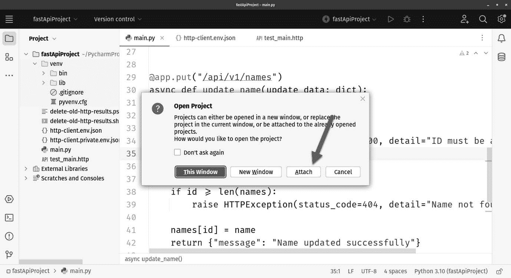

图 9.28：打开 React 项目时选择附加选项

您将在 IDE 中同时找到两个项目打开。这在*图 9.29*的项目窗口中很明显：

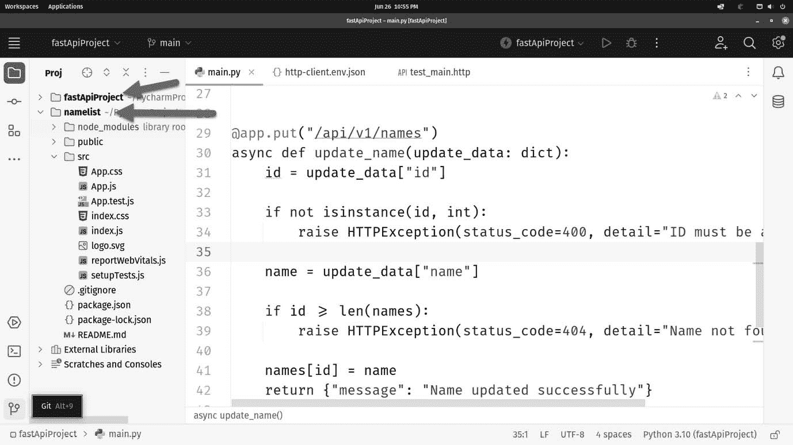

图 9.29：一个全栈应用的两侧都可以同时打开，允许你像处理一个项目一样运行和调试它们

在全栈开发中使用附加项目会带来非常愉快的体验。考虑以下好处：

+   技术上，它们是分别存储在各自仓库中的独立项目。

+   PyCharm 允许您为所有附加项目创建运行和调试配置。例如，您可以在 React 应用程序中设置断点来检查提交之前的数据。然后在 FastAPI 项目中，您可以在端点函数中设置断点来检查接收到的数据，这使得在两个项目之间查找数据格式错误变得容易。

+   其他不能全栈工作的人仍然可以单独工作在各自的项目上。

在*第十一章*“使用 PyCharm 理解数据库管理”，我们将了解到您可以在一个 PyCharm 窗口中与前端、后端和数据库一起工作。对于全栈开发，PyCharm 难以匹敌！但在下一章中，让我们先看看 PyCharm 支持的第三个 Web 开发框架：Pyramid。

# 摘要

在本章中，我们有效地涵盖了您需要了解的所有内容，以便在 PyCharm 中使用 FastAPI 开始创建 RESTful API 项目。

FastAPI 与 Flask 以及其他许多以模板为导向的 Web 开发框架不同，因为它专门设计用来创建仅 RESTful API。RESTful API 是一种后端，它从任何前端标记、布局、交互性或显示逻辑中解耦。相反，API 专注于仅接收携带用户交互数据的请求，并返回处理后的数据，例如从关系型数据库检索或处理的数据。

由于这些类型的应用程序专注于数据，我们了解到 SPA 通常用作前端表示层。包括 React、Angular 和 Vue 在内的许多现代框架支持这种范式。控制应用程序状态是前端应用程序的职责，因为 HTTP 是无状态协议，任何后端都不适合承担这一责任。

使用 PyCharm Professional 内置的模板创建 FastAPI 项目非常简单。它生成了起始代码以及 PyCharm 特有的特殊测试文件。HTTP 文件包含请求的规范，以及基于 JavaScript 的测试框架，这允许我们使用与我们在单元测试早期接触到的相同的断言逻辑来验证响应。

最后，我们在 PyCharm 中创建了一个独立的、但连接的（附加的）React 前端项目，允许你在不混淆前端 JavaScript 代码与后端 Python 代码的情况下开发全栈应用程序。在下一章中，我们将讨论 Django 和 Pyramid。

# 问题

1.  哪个框架是 FastAPI 的基础，它与 Flask 和 Werkzeug 有什么不同？

1.  “表征状态转移”是什么意思，它解决了什么问题？

1.  在使用 SPA 作为其前端的一个 RESTful API 项目中，应用程序状态存储在哪里？

1.  以下是最常用的四种 HTTP 方法是什么？

1.  CRUD 方法是什么，HTTP 方法是如何映射到 CRUD 方法的？

1.  保持前端和后端项目分开有什么好处，PyCharm 是如何使处理此类全栈项目更简单的？

# 进一步阅读

+   Garret, J. J. (2005). 网络应用程序的新方法。 [`www.adaptivepath.com/publications/essays/archives/000385.php`](http://www.adaptivepath.com/publications/essays/archives/000385.php)。

+   Pandey, R. (2023) 使用 FARM Stack 构建全栈项目 [视频]. Packtpub.com [`www.packtpub.com/product/build-full-stack-projects-with-farm-stack-video/9781803236667`](https://www.packtpub.com/product/build-full-stack-projects-with-farm-stack-video/9781803236667)

+   Van Horn, B. (2021) 在 Windows 10 中设置 Python 开发工作站\. maddevskilz.com [`www.maddevskilz.com/courses/setting-up-a-python-development-workstation-in-windows`](https://www.maddevskilz.com/courses/setting-up-a-python-development-workstation-in-windows)

+   Van Horn, B. (2021) 在 MacOS 中设置 NodeJS 开发工作站\. maddevskilz.com [`www.maddevskilz.com/courses/setting-up-a-nodejs-development-workstation-in-macos`](https://www.maddevskilz.com/courses/setting-up-a-nodejs-development-workstation-in-macos)

+   一定要查看本书的配套网站：[`www.pycharm-book.com`](https://www.pycharm-book.com)。
