# 12

# 开启科学模式

欢迎来到本书的第三部分。我最喜欢的视频游戏系列之一是 Sid Meier 的 *文明*。完成一场游戏需要很多天，游戏开始时你作为历史黎明时期一个文明的首领。你将穿越史前时代，经过中世纪、文艺复兴和工业时代。随着每个新时代的到来，玩家们为了争夺全球统治的各个方面而竞争。一旦玩家们达到信息时代，游戏速度实际上会加快。我都能听到我的编辑在说，“放下你的视频游戏，打字快点！”好吧，我会的。谈到这本书，我觉得我们通过本章已经达到了一个类似的里程碑。自从这本书的前几章中在 `main.py` 中的“hello world”消息以来，我们已经走了很长的路。

PyCharm 面向 Python 开发者，但 PyCharm Professional 实际上针对的是两组人群：Web 开发者和数据科学家。后者似乎更难以界定，因为 JetBrains 为数据科学提供了多个产品。除了 PyCharm Professional，JetBrains 还制作了一个名为 **DataSpell** 的独立 IDE，它被誉为 *专业数据科学家的 IDE*。这是怎么回事？

我也有同样的疑问。根据公司针对 DataSpell 的常见问题解答，PyCharm 应该支持那些将数据科学活动作为软件开发工作一部分的软件开发者。DataSpell 是面向那些不是开发者，但仅仅进行数据分析的专业人士。在功能方面有一些重叠，但与完全嵌入 PyCharm 的 WebStorm 和 DataGrip 不同，DataSpell 拥有一些 PyCharm 没有的功能，而且没有计划改变这一点。他们针对的是两组不同的专业人士。

支持科学和数据分析工作流程意味着在 PyCharm 中开启科学模式。这会打开你通常在科学模式关闭时不会看到的新的 UI 布局和工具面板。在本章中，我们将涵盖以下主题：

+   在 PyCharm 中启动科学项目

+   PyCharm 科学项目的高级功能

到本章结束时，你将了解这些功能如何提高科学计算项目中的生产力。本章将作为一个通用的、高级的讨论，涉及 PyCharm 提供的各种工具，并帮助你理解科学计算以及这些工具是如何集成和相互协作的。

# 技术要求

为了继续本章，以及本书的其余部分，你需要以下内容：

+   由于我们将转向数据科学的话题，我将把我的首选 Python 发行版切换到 Anaconda，这是一个针对数据科学工作负载定制的 Python 发行版。你可以在 [`anaconda.com`](https://anaconda.com) 找到它，以及针对你操作系统的安装说明。

+   同样，我将使用 `conda` 而不是通常的 `pip`，因为 `conda` 是 Anaconda 的包管理器。它与 Anaconda 一起安装。

+   安装并运行良好的 PyCharm 版本。安装过程在 *第二章**，安装和配置* 中有介绍，如果你是在书中间开始阅读的话。

本书从 GitHub 上的示例源代码。我们在 *第二章**，安装和配置* 中介绍了代码克隆。你可以在 [`github.com/PacktPublishing/Hands-On-Application-Development-with-PyCharm---Second-Edition/tree/main/chapter-12`](https://github.com/PacktPublishing/Hands-On-Application-Development-with-PyCharm---Second-Edition/tree/main/chapter-12) 找到本章的相关代码。

# 在 PyCharm 中创建科学项目

到现在为止，你对 PyCharm 中的新建项目对话框已经很熟悉了。让我们创建一个科学项目！点击 **文件** | **新建项目**，你将找到一个名为 **科学** 的模板，如图 *图 12.1* 所示：

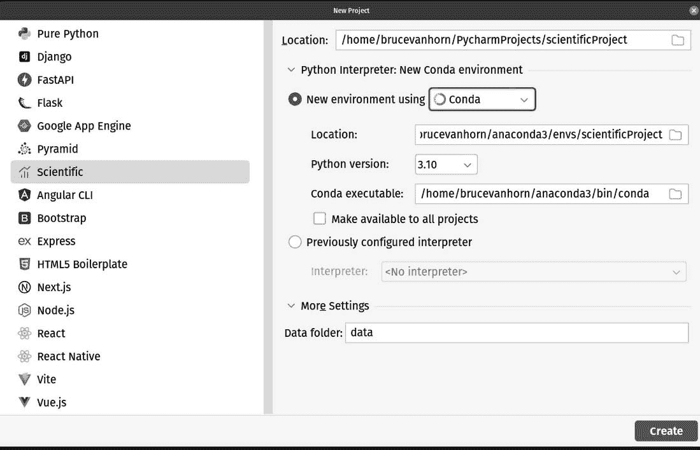

图 12.1：退后！我们即将开始做科学实验！

我之前提到，我将使用 Anaconda 来编写这本书的这一部分，因为这是大多数数据科学专业人士所使用的。除了更改解释器之外，唯一有趣的设置是在 **更多设置** 下的 **数据文件夹** 设置。它是在我们即将创建的项目中设置一个文件夹，该文件夹将包含，你猜对了：数据。在创建项目之后我们会详细讨论这一点。请点击 **创建**。

一旦创建过程完成，你会在 *图 12.2* 中找到类似我这样的设置：

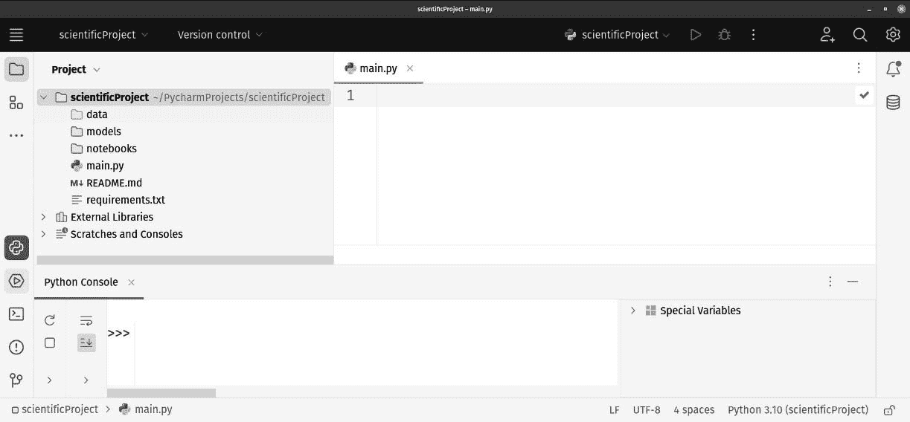

图 12.2：看哪！我们在 PyCharm 中创建了一个科学项目！

让我们谈谈刚刚发生的事情。我们像往常一样创建了一个项目。我们得到了一个名为 data 的文件夹，它之所以特别，是因为它的颜色与其它文件夹不同。我们还得到了更多用于笔记本和模型的空文件夹。我们得到了一个 `main.py` 文件，一个 `requirements.txt` 文件，以及一个名为 `README.md` 的 Markdown 文件，它们都是空的。我们通常会有一些样板代码，但这次没有。

每个文件和文件夹都有其用途。正如我提到的，数据文件夹之所以特别，是因为它的颜色不同。我的文件夹被高亮显示为黄色。这个文件夹很重要，因为它旨在包含用于你科学分析的数据文件。由于它不是代码，而且你的数据文件可能非常大，PyCharm 将这个文件夹标记为项目的特殊文件夹。你可能已经注意到 Flask 和 Django 应用中的模板文件夹也与其他文件夹颜色不同。许多项目类型都有特殊文件夹。

我们可以在项目的属性中找到一些线索。我在 *图 12.3* 中打开了项目属性窗口：

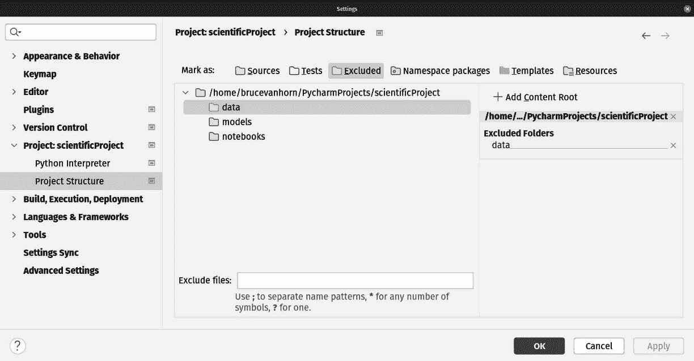

图 12.3：在 PyCharm 的许多项目类型中，包括科学项目，您可以设置几种特殊文件夹

在这种情况下，数据文件夹被排除在项目之外。PyCharm 将不会以任何方式索引或扫描此文件夹。我们需要这个数据文件夹，因为您的数据文件非常大是很正常的。这个文件夹中没有代码，所以实际上，没有必要扫描它以提供您从代码文件中期望的通常的帮助和见解。您甚至可以考虑让您的版本控制系统忽略这个文件夹，因为出于许多原因，包括数据性质导致的隐私问题，以及文件大小，将数据检查到存储库中可能并不合适。Git 对它可以处理的文件大小有限制，GitHub 也会限制您存储库的大小。数据文件夹是一个明显的冗余，可能不需要在存储库中。

解开这个谜团后，让我们看看`requirements.txt`文件。我们之前见过这个文件。无论您使用哪个 IDE，Python 项目都会使用这个文件来跟踪项目的库需求。每次您从 PyPi 使用第三方库时，都需要将其包含在`requirements.txt`中。这个文件应该被检查到您的存储库中，以便其他开发者可以复制您的虚拟环境。这个文件是空的，我们在*第三章*中看到了围绕`requirements.txt`的工具。

这里有一些我们之前没有见过的东西：`README.md` 文件。`.md` 扩展名表示这是一个 Markdown 文件。Markdown 是 HTML 的替代品，而 HTML 是一种标记语言。他们在这里做了什么？Markdown 允许您创建一个格式化的文本文件，而不需要 HTML 的所有开销。虽然您去掉了开销，但也失去了很多功能。Markdown 仅用于创建文档文件。如果您曾经浏览过 GitHub 上的存储库，并且项目有一个漂亮的着陆页，那么您实际上看到的是 GitHub 和您的浏览器将`README.md`文件渲染为 HTML 的结果。*图 12.4*展示了我的一个存储库中一个很好的`README.md`页面的例子：

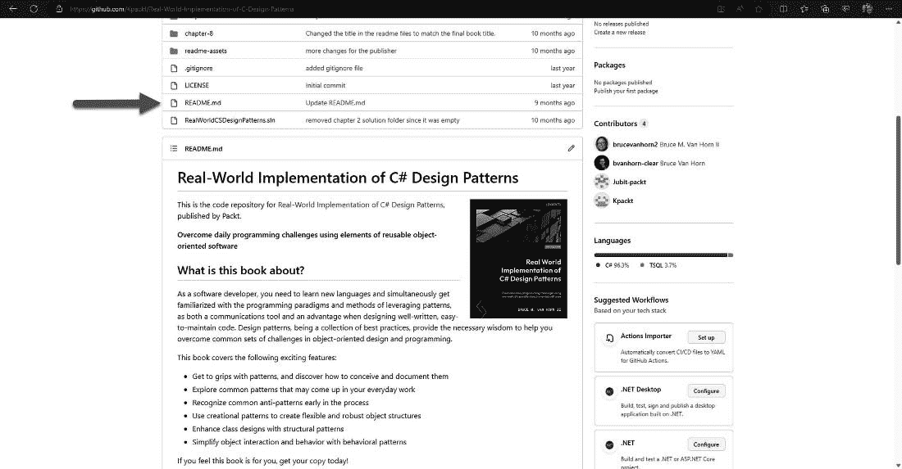

图 12.4：README.md 文件在 GitHub 上被渲染为着陆页，并用于记录存储库的内容

对于这个项目，PyCharm 已经生成了一个空的`README.md`文件。`main.py` 文件只是一个普通的 Python 文件。实际上，这是一个非常简单的项目模板。

# PyCharm 中科学项目的附加配置

PyCharm 的默认配置通常非常完整。然而，对于科学项目来说，您可能还想添加一些插件。本书后面将有一整章介绍一些惊人的插件，但您现在就需要它们，所以让我们来看看。

插件是通过 PyCharm 市场安装的。您可以通过通常用于访问设置的齿轮图标进入市场。您可以在图 12.5 中认出它：

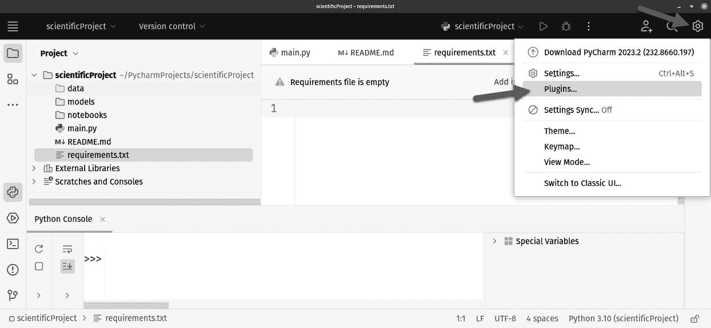

图 12.5：插件菜单选项将带您进入包含 PyCharm 市场的插件窗口

打开**插件**窗口。您可以在图 12.6 中看到我的：

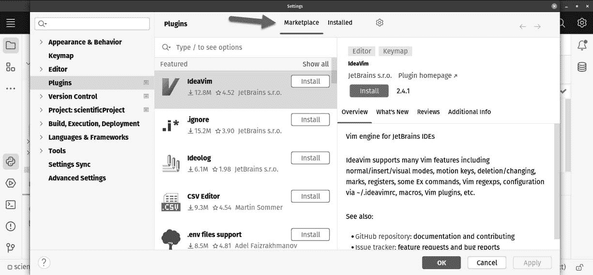

图 12.6：市场允许您找到 PyCharm 和其他 JetBrains IDE 的所有类型的插件

注意它会直接带您进入**市场**标签页。这让我想起了我参加过的每一次博物馆之旅结束时的不可避免的小商店。右侧有一个标签页，让您可以看到已经安装的内容。但这不是很无聊吗？浏览我们还没有的东西更有吸引力。这里的大多数插件都是免费的，有些则不是。同样，这里的大多数插件都有良好的文档，并由精心制作市场提供的开发者支持。有些只是简短的描述和标题。让我们去购物吧！

## Markdown 插件

您的第一步是找到一个好的 Markdown 插件。尽管我们在科学项目中发现了 Markdown，但它并不完全是火箭科学。然而，一个好的 Markdown 插件会渲染您的 Markdown，这样您就可以看到 Markdown 代码转换为格式化文本后的样子。

要找到 Markdown 插件，您需要使用图 12.7 中指示的**搜索**框进行搜索：

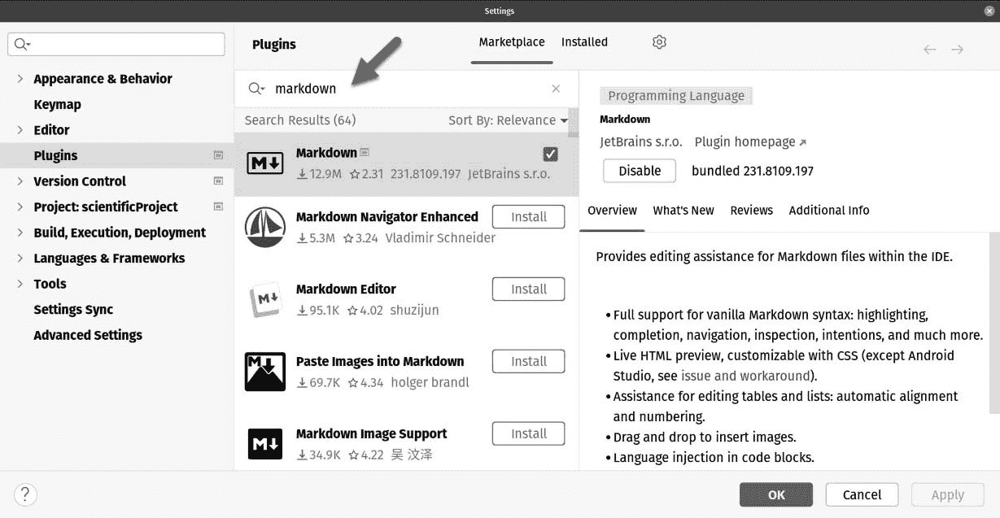

图 12.7：在此处搜索插件，避免被帮助您找到设置的搜索框所诱惑

事实上，JetBrains 现在在默认安装中捆绑了一个 Markdown 插件。他们并不总是这样做。您可以看到有其他选择可以探索。我只会使用捆绑的插件。如果您有较旧的 PyCharm 版本，您可能需要安装此插件。在这种情况下，将会有一个**安装**按钮，就像您看到的其他插件一样。

让我们试试。退出设置窗口，打开`README.md`文件。将以下代码添加到您的`README.md`文件中：

```py
# The Science Project
Welcome to my science project!
```

您应该看到左侧的 Markdown 代码，以及右侧的渲染预览，如图 12.8 所示：

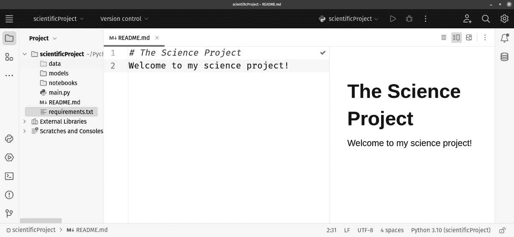

图 12.8：Markdown 代码位于左侧；渲染结果位于右侧

你可以使用 Markdown 编辑器右上角的按钮更改预览布局，或者完全隐藏它，如图*图 12.9*所示：

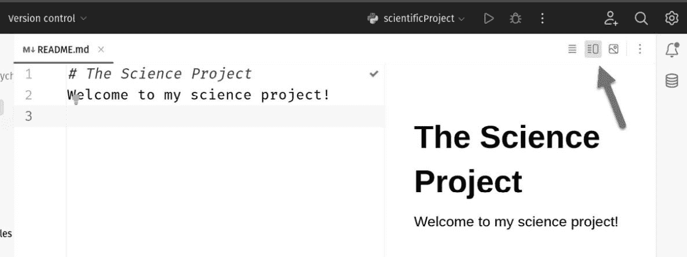

图 12.9：你可以调整预览窗口的布局

点击左键隐藏预览。按右键隐藏代码。你可以点击中间的按钮一次来切换预览和代码。再点击一次，你将得到堆叠在一起的代码和预览。

## 添加图片

一个好的 Markdown 编辑器所需的一个特性是能够轻松添加图片。在 PyCharm 中，如果你需要在 Markdown 中添加图片，首先在你的项目中创建一个名为 assets 的文件夹。将你的图片文件复制到这个文件夹中。然后，只需拖动图片并将其拖放到编辑器中。在*图 12.10*中，我正在从我的 assets 文件夹中拖动一个图片并将其拖放到我的 Markdown 编辑器中：

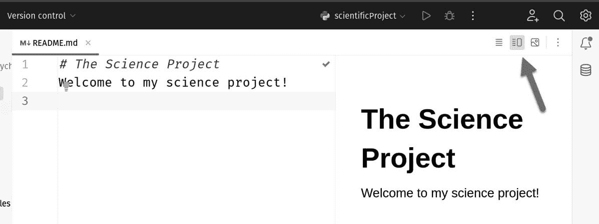

图 12.10：从 PyCharm 外部拖动图片并将其拖放到代码中以将其包含在 Markdown 中

结果可以在*图 12.11*中看到：

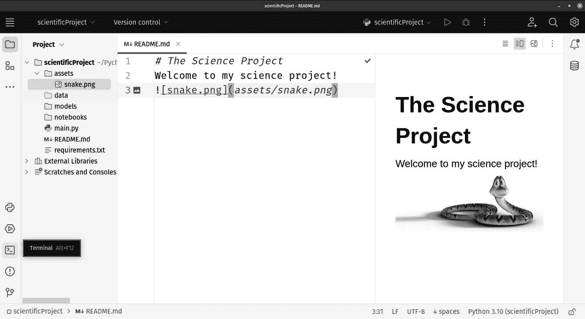

图 12.11：拖动的图片出现在你的代码和预览中

总的来说，默认插件相当不错。其他一些插件有更高级的功能，但真正我想要的只是一个可以将 Markdown 转换为其他格式的插件。如果你需要这个功能，市场上的一些插件可以做到这一点。

## 安装 CSV 插件

数据存储的常见格式是**逗号分隔值**（**CSV**）格式。这是一个被所有电子表格程序支持的格式。市场上有一个 CSV 功能，允许你在类似电子表格的界面中打开 CSV 和类似文件，如**制表符分隔值**（**TSV**）。你可以在*图 12.12*中看到它的市场页面：

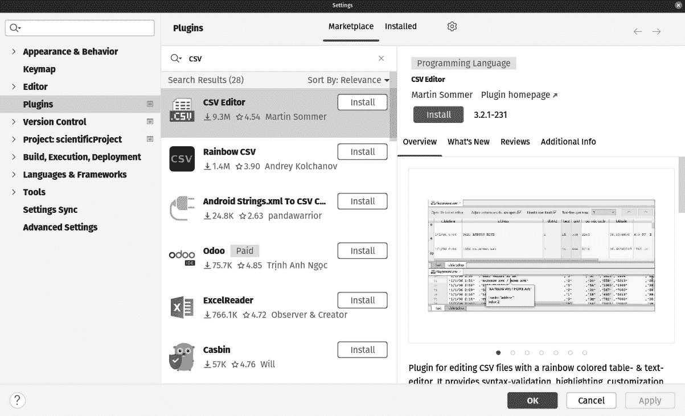

图 12.12：你可能会在某些时候使用 CSV 文件。幸运的是，有一个插件可以处理这个

在你点击 CSV 编辑器插件的安装按钮后，你将被提示重新启动 IDE。这是非常常见的。重启后，你可以用你自己的 CSV 文件尝试它，或者你可以使用示例代码数据文件夹中的 FDA 研究数据样本。CSV 插件以全彩色的形式渲染我的数据，如图*图 12.13*所示：

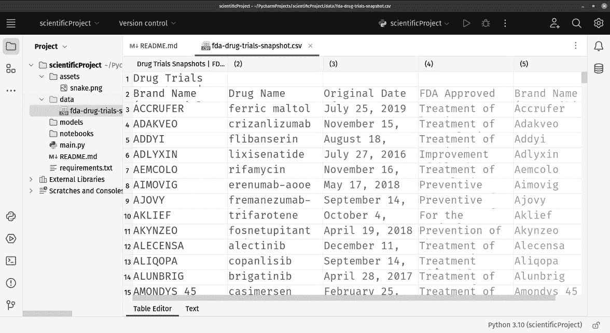

图 12.13：CSV 编辑器插件以不同颜色渲染列中的数据。这就像在你的 IDE 中嵌入了一个漂亮的电子表格

自然地，你可以编辑数据，但这不是一个电子表格。不要期望你能在单元格中添加公式和表达式。在底部，你会看到你可以切换到**表格编辑器**视图或**文本视图**。

你肯定还想安装的一个是单元格模式插件。

## 安装单元格模式插件

我现在不会深入探讨单元格模式插件的功能。当你说它在处理 PyCharm 代码单元格时非常方便时，请相信我。我们将在稍后讨论这个问题。既然我们已经进入了 Marketplace，让我们现在就把它抓取出来。图 *12.14* 显示了单元格模式插件的 Marketplace 页面：

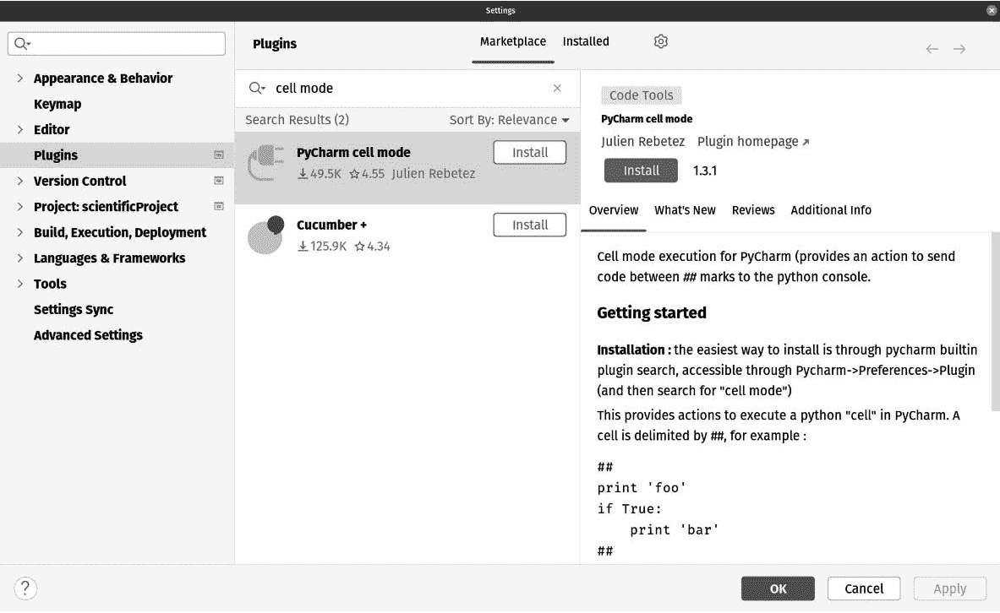

图 12.14：单元格模式插件将在本章稍后使与代码单元格一起工作变得容易

通过点击**安装**按钮来安装它。此时，你已经将 PyCharm 准备得相当适合数据工作了。

# 安装包

我们准备做一些科学工作，但首先，我们需要为我们的项目设置一些要求。我们已经在前面的章节中讨论过这个问题，但我们将在这里快速回顾。

向任何 Python 项目添加包的最新方法是使用图 *12.15* 中显示的**Python 包**面板：

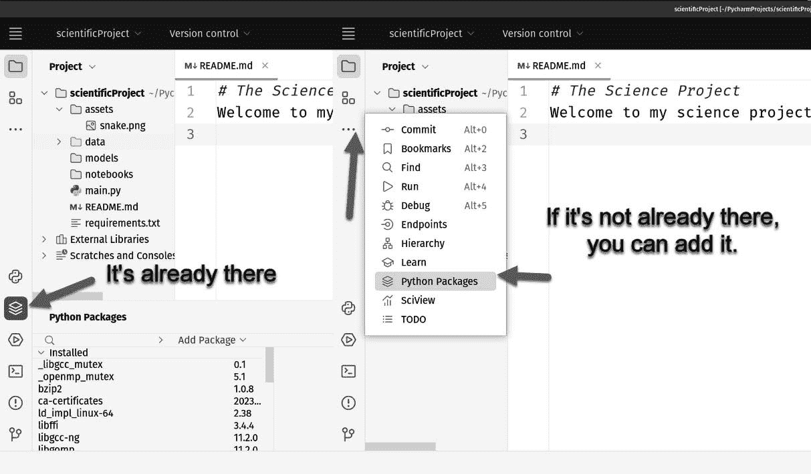

图 12.15：使用 Python 包面板管理 Python 包。如果它不在右侧工具栏上，你可以添加它

如果你之前使用过该面板，它将在右侧工具栏上。如果你之前没有使用过，你可以通过点击三个点，然后选择**Python 包**选项来添加它。一旦你找到了打开面板的按钮，你将找到图 *12.16* 中显示的**搜索**框：

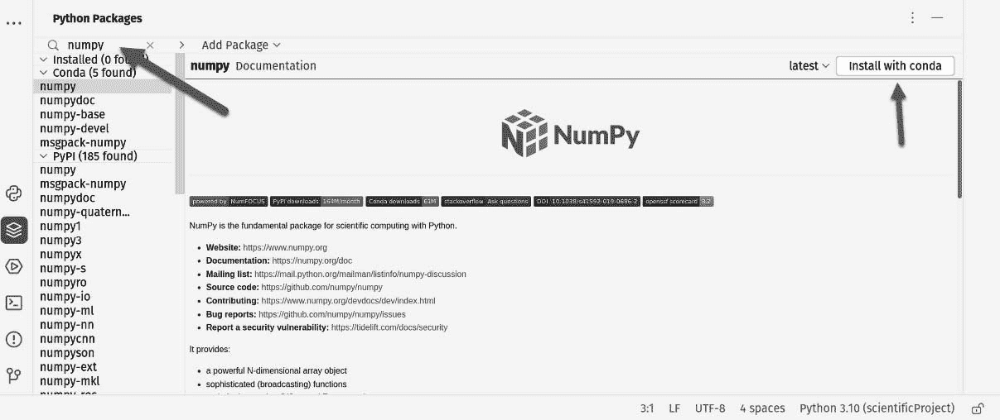

图 12.16：你可以从这个面板中轻松搜索 PyPI 的包，并使用 conda 添加它们

我们将向我们的项目中添加 `numpy` 和 `matplotlib`。将每个输入到图 *12.17* 中指示的**搜索**框中，然后使用**使用 conda 安装**按钮安装包。如果你选择坚持使用纯 Python，按钮将显示**使用 pip 安装**。

## 回填 requirements.txt 文件

现在你已经安装了这两个包，打开 `requirements.txt` 文件。PyCharm 会告诉你，在 conda 环境中安装的要求与空文件不匹配。图 *12.17* 显示了将我们刚刚安装的包自动添加到 `requirements.txt` 文件的选项。

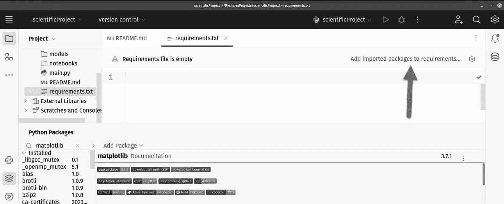

图 12.17：PyCharm 帮助你保持 requirements.txt 文件更新

点击链接按钮来更新你的 requirements 文件。

# 添加一些科学代码

我的编辑器一直说“sciency”不是一个词。一位智者曾经说过：“科学不是关于为什么，而是关于为什么不！？”我会继续使用它，如果你真的在读这篇文章，这意味着我侥幸逃脱了。

我们已经设置了 IDE，并安装了所需的包。让我们打开`main.py`并添加一些代码，这样我们就可以看到 PyCharm 展示其功能！在`main.py`中添加以下代码：

```py
import numpy as np
import matplotlib.pyplot as plt
```

这两个初始导入只是引入了`numpy`和`matplotlib`，并使用了别名。结果发现，科学家比普通开发者更讨厌打字：

```py
N = 100
x = np.random.normal(0, 1, N)
y = np.random.normal(2, 3, N)
#%% plot data in histograms
plt.hist(x, alpha=0.5, label='x')
plt.hist(y, alpha=0.5, label='y')
plt.legend(loc='upper right')
plt.show()
```

使用 NumPy，我们只是从正态分布中创建了两个 100 个元素的样本数据集。`x`的值来自均值为 0、标准差为 1 的分布，而`y`来自均值为 2、标准差为 3 的分布。然后，我们使用 Matplotlib 绘制它们相应的直方图。按照惯例运行程序，并在*图 12*.18 中注意结果：

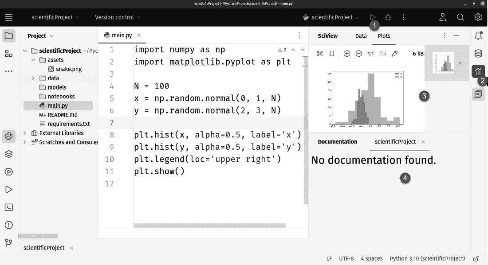

图 12.18：点击运行按钮（1），matplotlib 图形图表在 SciView 中显示

我们的 Python 脚本运行了，但这样做触发了 SciView 的开启。SciView 是 PyCharm 数据分析功能集的核心。它允许你在 NumPy、pandas 和 PyTorch 等库的复杂 API 文档旁边查看图表。

我在*图 12*.18 中突出了运行按钮**（1**），以防你来得晚，错过了之前关于在 IDE 中运行代码的章节。**（2**）处的图标表示 SciView 已开启。你可以像切换任何其他面板一样切换它开或关。当 SciView 开启时，你会得到一个用于可视化的面板**（3**）和一个用于文档的面板**（4**）。我们将在接下来的几章中更多地使用这些工具。

# 切换科学模式

我之前提到过几次*科学模式*；现在，我们将看到这个模式在 PyCharm 项目中的重要性。

**科学模式**由多个组件组成，我们将在本章和即将到来的章节中探讨，最显著的是**SciView**和**文档**面板。重要的是要注意，PyCharm 中的这种特殊模式并不等同于拥有科学项目。此外，它更像是一种配置设置，其中各种支持科学计算的 PyCharm 功能更容易访问和使用。

有许多程序根据你打算如何使用软件而具有不同的用户界面配置。Adobe Photoshop 为摄影师和网页设计师提供了不同的视图集。许多浏览器都有无铬选项或模式，优化了无干扰阅读。PyCharm 本身有一个*禅模式*，它移除了除了编辑器之外的所有用户界面。你可以在*图 12*中看到它。19*：

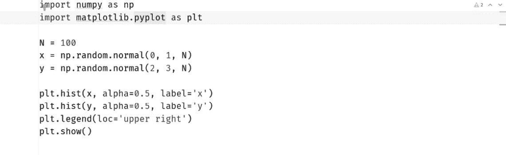

图 12.19：在禅模式拥抱下。PyCharm 的代码在和平中起舞。线条清晰

如果您对禅模式感兴趣，您可以通过点击主菜单中的**查看** | **外观** | **进入禅模式**来找到它。这很好，但我们在这里是为了科学模式，我想要说明的是，这种模式更多的是 PyCharm 外观的配置，而不是针对科学项目的独特工具面板。您可以在任何项目类型中启用科学模式。要打开它，请点击**查看** | **科学模式**，如图*图 12.20*所示：

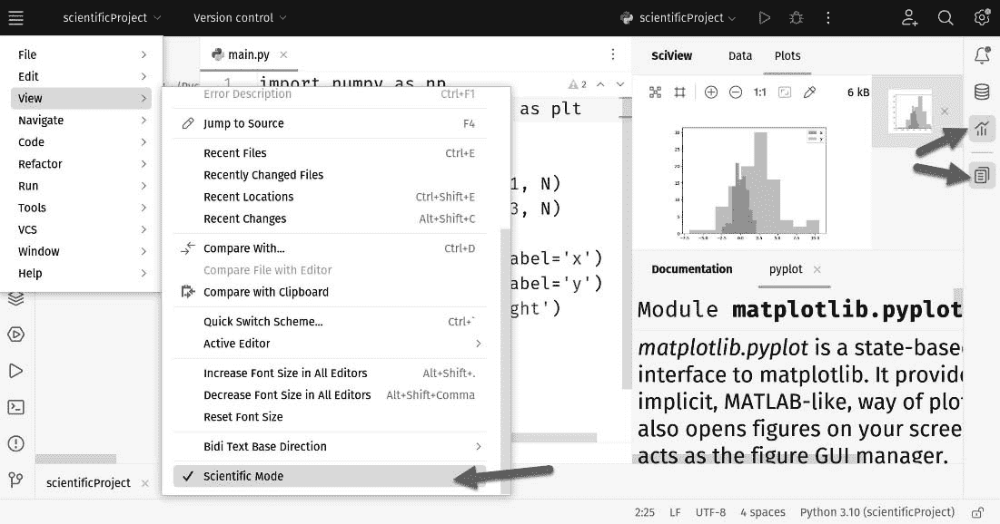

图 12.20：您可以在视图菜单中切换科学模式。当科学模式开启时，您可以使用屏幕右侧工具栏上的按钮切换两个面板

PyCharm 也有点爱管闲事。如果您在使用 NumPy，它会在 IDE 的右下角弹出一个提示，建议您开启科学模式。见图*图 12.21*：

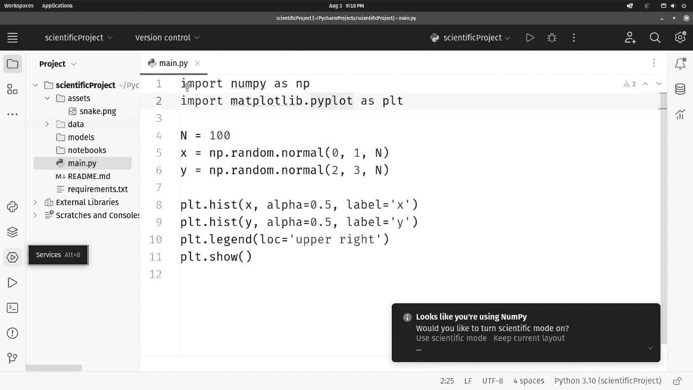

图 12.21：您的 Python 大兄弟在看着您，但至少它在尽力帮忙

总体而言，科学模式提供了一个直观的界面，可以提高您在科学计算项目中的生产力。在下一节中，我们将更详细地检查科学项目中的其他高级功能，特别是**文档**面板和 PyCharm 的代码单元格。

# 理解 PyCharm 科学项目的高级功能

配备了我们之前章节中讨论的功能，您可以高效且富有成效地导航和使用 PyCharm 的科学项目。然而，PyCharm 还提供了其他一些微妙的功能，这些功能在此背景下可能非常有用。首先，我们将考虑**文档**面板及其用法。

## 文档查看器

文档是编程和软件开发的重要组成部分，PyCharm 提供了最强大且最直观的功能来支持在 Python 中处理文档的任务。我们首次在*第四章*中看到了它的实际应用，*在 PyCharm 中轻松编辑和格式化*。

在科学项目中，正如我们所见，**文档**面板被固定为项目窗口的主要面板之一。这个文档查看器以动态的方式显示实时文档数据。具体来说，当您将光标移至编辑器中的特定方法或函数调用时，**文档**面板将显示与该方法或函数对应的官方文档。

回到我们之前编写的代码，并将光标放在第 10 行。将光标放在单词 legend 上，**文档**窗口将立即显示该方法的文档，该方法属于 Matplotlib 库。你可以在*图 12.22*中看到这一点：

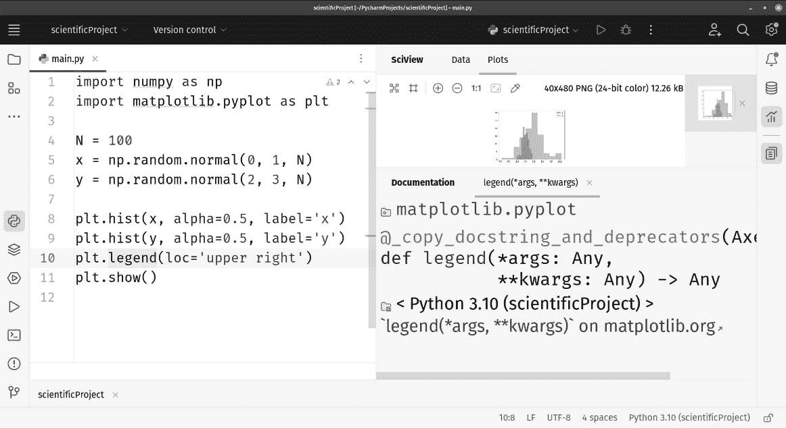

图 12.22：点击几乎任何内容，文档面板将显示任何属性或方法的文档

这些在数据科学中流行的科学库的问题在于，它们可以使用复杂的数据结构作为参数和返回类型。拥有实例参考资料非常有用。我建议使用更大的屏幕才能真正利用它。我的截图*图 12.22*略显拥挤，仅仅是因为它是在一个较小的屏幕上，字体被调整到清晰以便于打印书籍。

除了显示你点击处的文档外，**文档**面板还会在你输入代码时更新。你不仅得到通常的自动完成，还能同时看到完整的文档。**文档**面板有一些配置选项，通过点击面板顶部的三个垂直点来访问，如*图 12.23*所示：

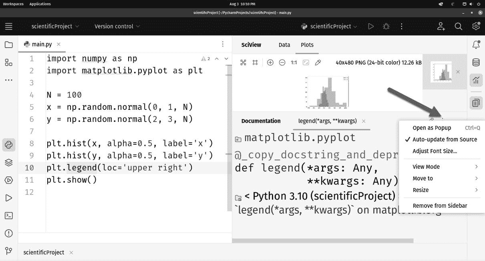

图 12.23：在面板顶部的菜单下方可以找到一些文档面板的配置选项

接下来，我们将探讨 PyCharm 在执行 Python 代码时的一个独特功能，即实现代码单元格。

## 在 PyCharm 中使用代码单元格

PyCharm 的代码单元格是一种将大型 Python 程序的不同部分按顺序分离和执行的方法。如果你曾经使用过**Jupyter Notebook**，你会认出这个功能。PyCharm 中的代码单元格基本上是这个工具的简化版。PyCharm 还直接支持 Jupyter 笔记本，但我将这部分内容留到下一章。

数据科学的需求与一般软件开发者的需求不同。数据科学家不会担心编写具有相同架构和扩展约束的可用代码。他们也不处理你典型的变量，这些变量大多是原始类型，或者是一些具有少量属性和方法的小对象。他们处理的是大量数据，他们编写的程序是算法性的。不要过分关注“算法”这个词。*算法*只是一系列构成过程的步骤。当然，推动谷歌搜索业务、PageRank 的算法是一项惊人的专有工程壮举。它是一个算法，但一个美味的花生酱果酱三明治的食谱也是一个算法。复杂性不是必需的，事实上，最好的算法通常是简单的。

数据科学家通过收集、过滤和处理大量数据，使用一系列聚合步骤来研究问题。每个步骤都非常离散，有输入和输出。代码单元格使得构建和使用这些离散步骤变得容易，而不是像常规软件开发人员那样处理复杂的代码结构。

## 使用 PyCharm 代码单元格

PyCharm 中的代码单元格由以下字符开始的代码行定义：`#%%`。这些行在 Python 的低级执行中被视为标准注释，但 PyCharm 会在其编辑器中识别它们作为代码单元格分隔符。让我们看看这个功能是如何工作的。

让我们回到之前演示的代码，做一些小的修改：

```py
import numpy as np
import matplotlib.pyplot as plt
#%% generate random data
N = 100
x = np.random.normal(0, 1, N)
y = np.random.normal(2, 3, N)
#%% plot data in histograms
plt.hist(x, alpha=0.5, label='x')
plt.hist(y, alpha=0.5, label='y')
plt.legend(loc='upper right')
plt.show()
```

注意到添加了以`#%%`开始的两个行。这些行定义了我们的代码单元格。此外，它们还作为常规注释，解释代码块正在做什么。现在看看 PyCharm UI 的变化。您现在应该看到一些运行按钮出现在页边空白处，如图*图 12.24*所示：

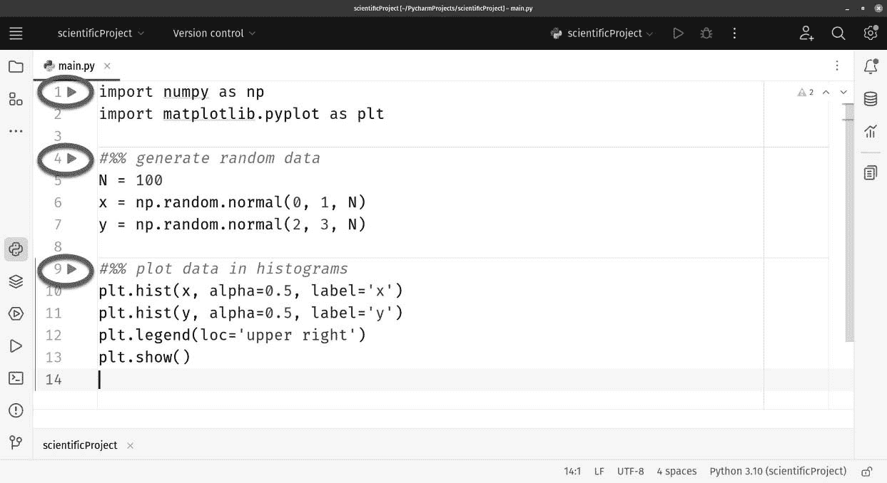

图 12.24：响应特殊注释格式的运行按钮出现在页边空白处

现在，我们可以运行每个单元格，并在运行下一个单元格之前查看结果。如果我们需要在中间单元格中进行调整，我们可以重新运行该单元格及其后续单元格。当您点击运行按钮时，代码将在 PyCharm 控制台中执行。如果您的控制台不可见，您可以通过点击**视图** | **工具窗口** | **Python 控制台**来访问它。在**Python 控制台**面板打开的情况下，您可以在代码运行时检查它，如图*图 12.25*所示：

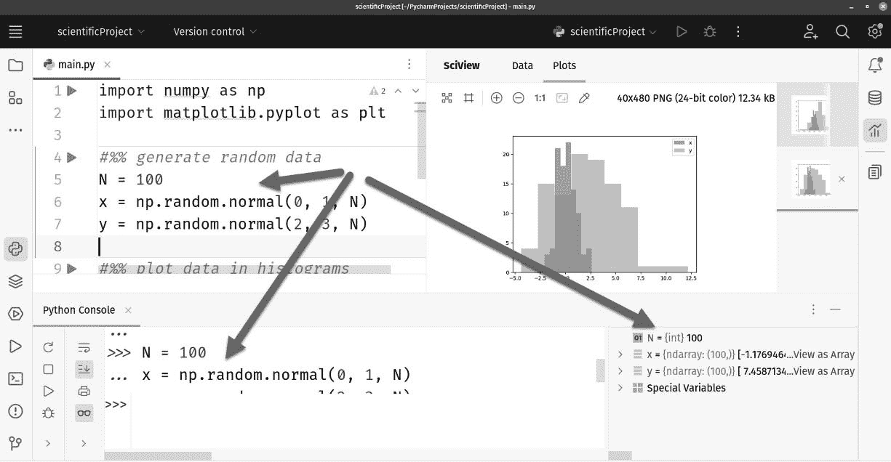

图 12.25：您可以看到代码正在控制台中运行。有一个检查面板，允许您查看单元格执行后的情况

每当每个步骤运行时，您都可以在控制台窗口中看到代码的执行情况。记住，控制台正在访问 Python REPL，它不是一个终端窗口。我们已经在*第三章*中讨论过这一点。**Python 控制台**窗口有一个检查面板，允许您检查状态，就像您在调试时一样。

由于是 PyCharm 控制台在执行您的代码，如果您需要从头开始，只需终止控制台并再次运行步骤即可。这将启动一个新的控制台。

## 单元格模式插件

在之前讨论的一些可用于数据科学工作的酷插件时，我们安装了一个名为单元格模式的插件。单元格模式插件扩展了代码单元格的功能。

首先，使用单元格模式插件时，你需要使用双井号/哈希符号（`##`）而不是通常的 `#%%`。当你这样做时，插件就会接管并提供一些额外的运行选项。看看 *图 12.26*：

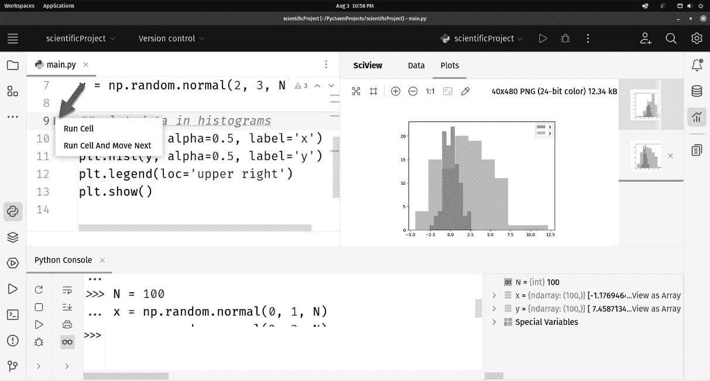

图 12.26：这次当你点击时，你会得到一些额外的选项

你的运行按钮现在允许你运行单元格并立即跳转到下一个，而不仅仅是停止在你刚刚运行的单元格底部。*图 12.27* 显示你在菜单级别有一些额外的控制：

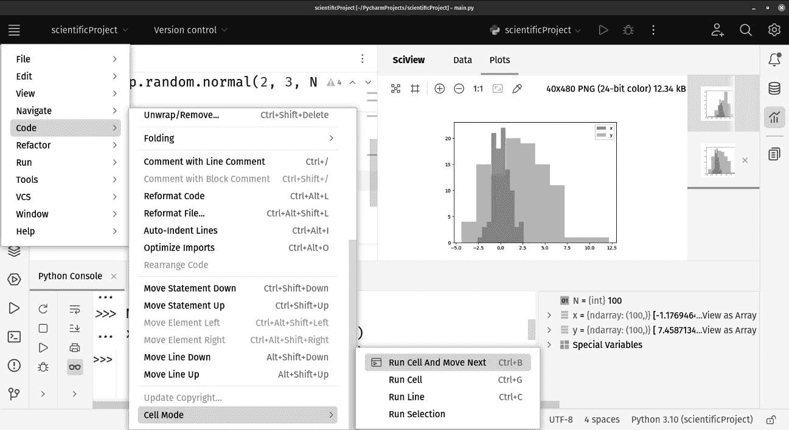

图 12.27：单元格模式插件向代码菜单添加了额外的菜单项

当你点击 **代码** | **单元格模式** 时，你会得到针对你的代码单元格的更多粒度的运行选项。总的来说，我们可以看到这个插件提供了使用 Jupyter 笔记本的所有优点，而无需实际切换到 Jupyter 应用程序。

# 摘要

在 PyCharm 中创建的科学项目具有与现实生活中项目常见的通用结构，包括诸如从版本控制中排除的数据文件夹、`README.md` 文件和 `requirements.txt` 文件等良好实践。正如你可以想象的那样，必须为每个项目手动创建这种设置可能会变得困难且耗时。此功能帮助 PyCharm 用户在项目创建后立即进入开发过程，这样他们就不必担心处理杂项细节。这将使我们能够更快、更高效地完成开发工作流程。

此外，PyCharm 的科学模式包括各种支持科学计算或数据科学项目开发过程的功能，例如文档和 SciView 面板。结合此模式，你还可以利用其他强大的功能，如代码单元格和 CSV 插件，以简化各种任务并有效提高你在数据科学项目中的生产力。

然而，这些功能只是 PyCharm 在帮助我们进行数据相关项目时所能提供的开始。在此基础上，在下一章中，我们将探讨 SciView 面板和 Jupyter 笔记本的使用，它们是 PyCharm 中 Python 数据科学生态系统中重要的一部分。

一定要查看本书的配套网站 [`www.pycharm-book.com`](https://www.pycharm-book.com)。

# 问题

1.  Markdown 语言是什么？GitHub 仓库中的 `README.md` 文件有什么作用？

1.  为什么 PyCharm 中科学项目的数据文件夹被排除在版本控制之外？

1.  你如何在 PyCharm 中打开和关闭科学模式？这将对特定项目窗口产生什么影响？

1.  PyCharm 的 **文档** 面板中可用的功能有哪些？

1.  PyCharm 中的代码单元格是什么？你如何实现它们？

1.  PyCharm 中 CSV 插件有哪些可用功能？
