# 第十三章：使用 SciView 和 Jupyter 进行动态数据查看

在本章中，我们将继续我们的科学之旅，通过探索 PyCharm 的两个重要功能：**SciView**和与**Jupyter 笔记本**的集成。这两个功能都提供了集成和可用的界面，使我们能够查看和在我们的科学项目中处理数据和变量。

我们将从讨论 SciView 面板开始，该面板在上章中隐晦地介绍。在这里，我们将通过使用 NumPy 数组和 pandas DataFrame 进行工作，更深入和现实地探讨。

之后，我们将进一步发展我们的工作流程，包括在 PyCharm 科学项目上下文中处理交互式 Python 计算工具（如 Jupyter 笔记本）的覆盖。

到本章结束时，你应该对以下领域有所了解：

+   在 PyCharm 的 SciView 面板中查看和交互数据

+   PyCharm 中**交互式 Python**（**IPython**）的集成

+   在 PyCharm 科学项目中使用 Jupyter 笔记本支持进行交互式编程

到你翻到下一章时，你将拥有掌握驯服数据战争中两个最重要的武器的知识。

# 技术要求

由于我们已经转向数据科学主题，我将我的首选 Python 发行版切换到 Anaconda，这是一个针对数据科学工作负载定制的 Python 发行版。你可以在[`anaconda.com`](https://anaconda.com)找到它，以及适用于你操作系统的安装说明。

同样，我将使用`conda`而不是通常的`pip`，因为`conda`是 Anaconda 的包管理器。它与 Anaconda 一起安装。

你需要一个已安装并正常工作的 PyCharm 副本。如果你是在书的中间部分开始阅读，安装部分已在*第二章*，“安装和配置”中介绍。

你还需要从 GitHub 获取这本书的示例源代码。我们已在*第二章*，“安装和配置”中介绍了如何克隆代码。你可以在这个章节的代码中找到[`github.com/PacktPublishing/Hands-On-Application-Development-with-PyCharm---Second-Edition/tree/main/chapter-13`](https://github.com/PacktPublishing/Hands-On-Application-Development-with-PyCharm---Second-Edition/tree/main/chapter-13)。

# 使用 PyCharm 的 SciView 面板轻松查看数据

我们在第*第十二章*中从 10,000 英尺的高度概述了 SciView 面板，因此我们知道接下来会发生什么。我们知道 SciView 是一个面板，允许我们以图形方式可视化我们的数据，同时还有一个面板，允许我们轻松且集成地访问典型科学项目中使用的更复杂的数据科学库的文档。

为了看到这个魔法的效果，我们将回顾我们在*第十二章*中编写的某些代码，并进行一些小的改进。而不是让你回到*第十二章*的代码中，我已经将项目复制到存储库中的*第十三章*文件夹中，以便所有内容都在一起。你可以在`chapter-13/sci_view_panel`项目中的`main.py`文件中找到它。别忘了你需要在虚拟环境中安装`requirements.txt`文件中的要求才能使用示例项目。如果你需要复习如何做这件事，请参阅*第三章*。

```py
import numpy as np
import matplotlib.pyplot as plt
N = 100
for _ in range(5):
  x = np.random.normal(0, 1, N)
  y = np.random.normal(2, 3, N)
  plt.hist(x, alpha=0.5, label='x')
  plt.hist(y, alpha=0.5, label='y')
  plt.legend(loc='upper right')
  plt.show()
```

你可以从上一章中识别出这个功能。代码生成两组样本数据，然后以直方图的形式绘制结果。区别在于我们添加了`for _ in range(5)`。这是相同的代码；我们只是连续运行了五次，这将生成五个不同的直方图。

# 查看和使用图表

对于这个例子，你应该利用在控制台中运行代码的能力。这个设置可能已经勾选了，但你可以在默认运行配置中再次检查，如图*图 13.1*所示。

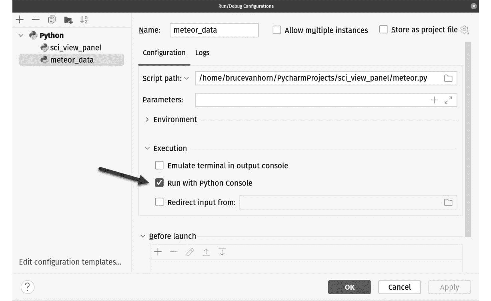

图 13.1：指向的设置表示此代码将在控制窗口中运行，这在科学项目中经常使用

你在上一章的图表中看到了这个图表，但看看这个运行的结果在*图 13.2*中。

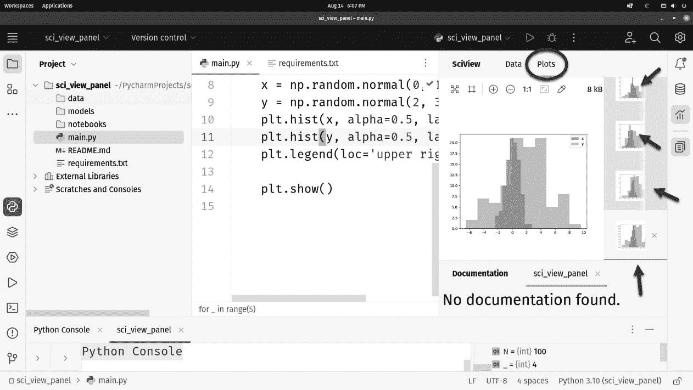

图 13.2：SciView 窗口显示最新的图表，同时也允许我们选择其他运行中的图表

你已经可以看到区别了：这次有五个图表。点击每个图表将改变在查看器中变化的直方图。这比正常的 Python 运行有所改进，因为通常在显示直方图时，图表视图会阻塞执行。你通常只能一次查看一个，下一个只有在按*Q*键退出当前图表时才会生成。

与默认功能不同，PyCharm 抓取了所有图表以节省你手动逐个导出每个图像的时间。这是一个巨大的时间节省！你还可以使用面板顶部的工具栏进行缩放和缩小，使用其图标右侧的**X**按钮将其从视图中移除，将图表保存到图像文件，或者通过在图表图标上右键单击来移除所有图表，如图*图 13.3*所示。

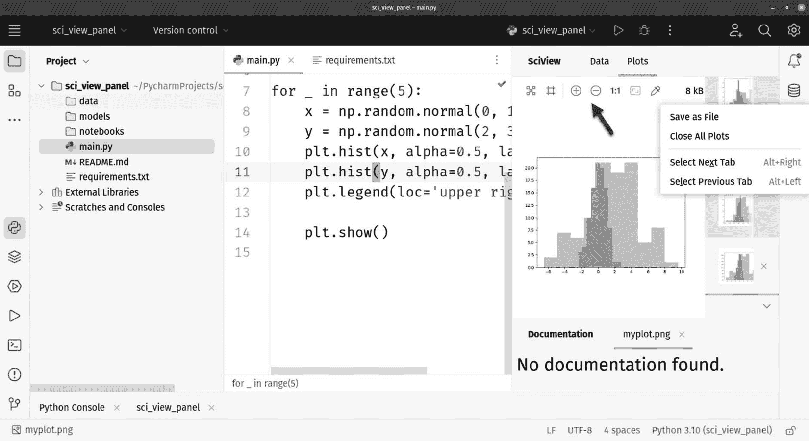

图 13.3：PyCharm 为你提供了许多处理图表的选项

除了能够保存您感兴趣的数据图之外，您的查看器还有一些查看选项，例如缩放功能，如前图中的箭头所示。

## 热图和相关性数据

PyCharm 能够将热图图例着色，以帮助您轻松地在一个相关性矩阵中找到相关性。为了看到这一点，让我们生成一些数据，其中将有一些相关数据点，也有一些不相关。您将在本章源文件中找到一个名为 `correlation_heatmap.py` 的文件。代码的实质如下：

```py
import pandas as pd
import numpy as np
import matplotlib.pyplot as plt
#%% generate sample data
# x and z are randomly generated
# y is loosely two times of x
x = np.random.rand(50,)
y = x * 2 + np.random.normal(0, 0.3, 50)
z = np.random.rand(50,)
df = pd.DataFrame({
  'x': x,
  'y': y,
  'z': z
})
#%% compute the correlation matrix
corr_mat = df.corr()
#%% plot the heatmap
plt.matshow(corr_mat)
plt.show()
```

注意，代码中包含由 `#%%` 字符分隔的单元格分隔符。我们在 *第十二章* 中介绍了这些字符在 PyCharm 中的特殊含义。

在这个程序中，我们创建了一个 `x`、`y` 和 `z`（）的随机生成。我们调整这些随机数在 `x`、`y` 和 `z` 之间，以便它们之间将存在某种程度的相关性。然后，我们使用 `corr()` 方法计算这个数据集的相关矩阵。最后，我们使用 Matplotlib 的 `matshow()` 方法将这个相关性矩阵显示为热图。

在理论方面，一个相关性矩阵告诉我们每个数据集中一个属性与另一个属性的相关程度。数值越高，表示一对属性之间的相关性越高。通常，了解哪些属性彼此高度相关将为数据科学项目的数据集提供有价值的见解。

为了说明这一点，我们生成 `y` 属性的大小大约是 `x` 属性的两倍，从而在这两个属性之间创建相关性。另一方面，`z` 属性是独立于 `x` 和 `y` 随机生成的，因此 `z` 与其他任何属性之间不应有高度的相关性。

项目应该有一个名为 `correlation` 的运行配置。运行配置的设置如图 *13.4* 所示。

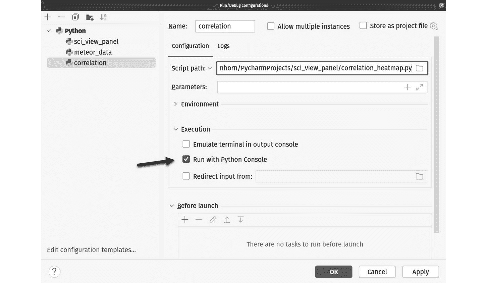

图 13.4：这是 correlation_heatmap.py 文件的运行配置

记住，检查 **使用 Python 控制台运行** 复选框非常重要。继续运行文件并查看绘图结果。我的结果在 *图 13.5* 中。由于数据是随机的，您的结果可能与我的不同。

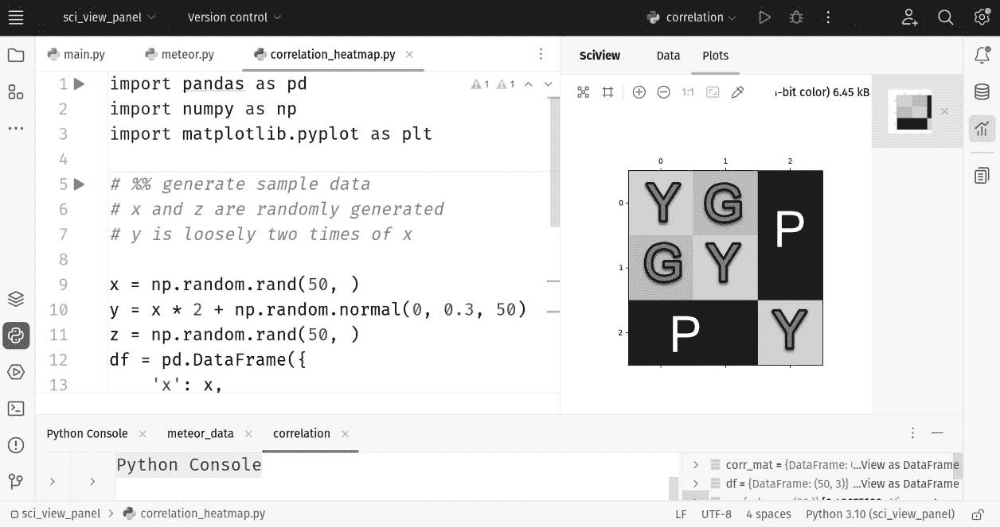

图 13.5：相关性热图使用颜色来表示相关性矩阵中相关性的程度

由于这本书是黑白印刷的，我尝试在这里为你做点好事，通过添加字母来指示颜色。这不是图表的一个特性。标记为**Y**的单元格是黄色。**G**代表绿色，**P**代表紫色。第一和第二个属性高度相关，因此相关矩阵中相应单元格（第 1 行第 2 列和第 2 行第 1 列）的颜色明亮（黄色或绿色，亮度相似）。第三个属性与其他两个属性的相关性较低，用深紫色表示。自然地，每个属性与其自身完全相关，因此对角线单元格中的颜色是明亮的黄色或绿色。

这里的视觉影响非常有帮助。当处理相关矩阵时，我们可以立即看到变量之间的关系。

SciView 中的**图表**选项卡为我们提供了许多我们可以在数据科学项目中查看和管理图表的强大工具。注意，在 SciView 面板顶部也显示了两个标签页，如图 13.2*（圆圈所示）*。接下来，我们将讨论**数据**选项卡。

# 查看和使用数据

当你点击**数据**选项卡时，你可能会感到有些失望。如图 13.6*所示，真正的操作在调试窗口的下方。

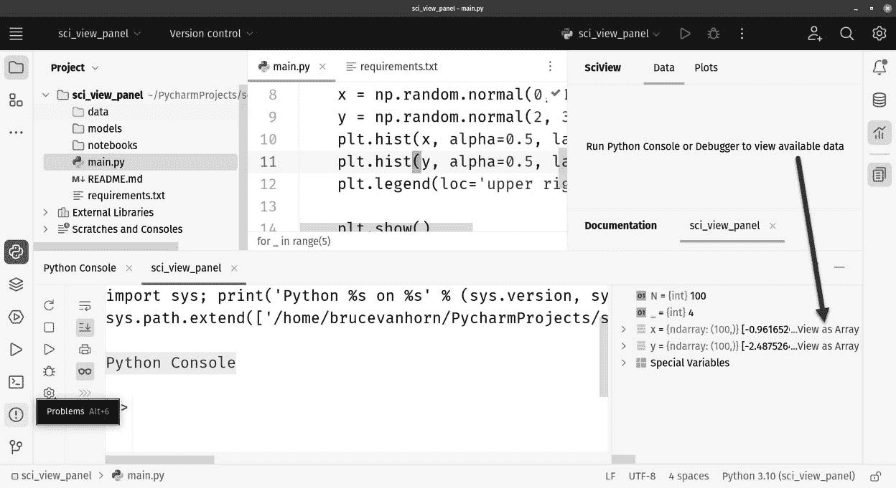

图 13.6：在数据选项卡中，直到你选择一个样本集以数组形式查看之前，都不会显示任何内容

将你的注意力转向`N`，这个面板就足够了。然而，如果你像我们一样使用 NumPy 数组，在像这样的正常调试窗口中查看数组是有问题的。

如果你点击**以数组形式查看**链接，也可以通过右键单击变量激活，你可以在**数据**面板中看到一个类似电子表格的表格。查看图 13.7*。

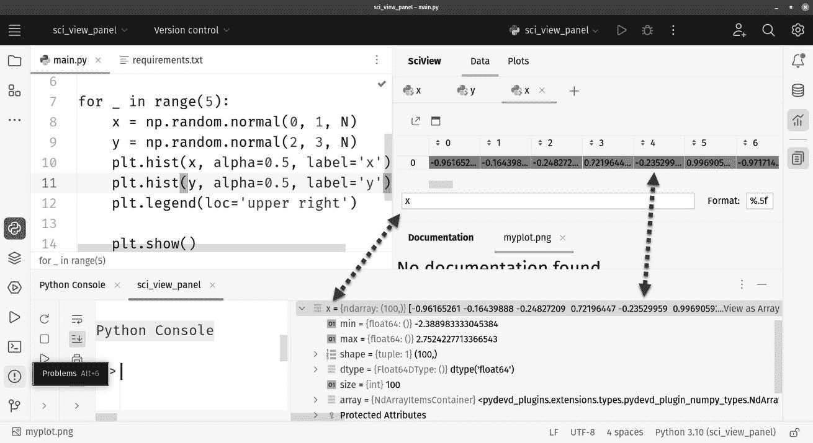

图 13.7：在下方面板中选择 X 变量后，数据选项卡现在显示 X 中的 NumPy 数组元素

如你所见，`X`，因此我看到`X`以一长串彩色数据的形式显示。我可以向右滚动并检查所有 100 个元素。高值单元格填充了较暖的颜色，而低值单元格填充了较冷的颜色。这为你提供了对比度，你可以通过视觉检测值之间的差异，而无需眯着眼睛看小数点。

图 13.7 中最左侧的箭头显示，上方的文本框中的`X`与下方的窗口中的`X`相关。你可以将文本框中的值更改为`Y`，或任何在下方控制台中的有效变量名，并看到上方更图形化的数据表示。这里的关键词是*有效*。`N`变量将在**数据**选项卡中显示错误。

文本框的右侧是格式化工具。这允许你指定**数据**标签页中数字的显示方式。格式化字符串使用与正常 Python 字符串格式化相同的格式。

当你在控制台视图中选择多个变量时，每个变量都会在自己的标签页中显示，如图*13.8*所示。

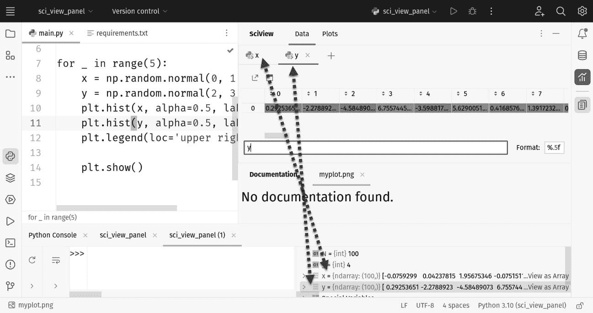

图 13.8：在控制台中选取多个变量将在数据标签页中为每个变量打开一个标签页

只需记住，这仅适用于 NumPy 数组和 pandas DataFrame。由于只有一行，所以这些数据有点无聊。让我们尝试一些更有趣的东西，这样我们就能在**数据**标签页中看到更多功能。

在章节代码中，你会找到一个名为`meteor.py`的文件，里面只有两行：

```py
import pandas as pd
meteor_data = pd.read_csv("./data/Meteorite_Langings.csv")
```

这份数据来自美国**国家航空航天局**（**NASA**）。你可以在[`data.gov`](https://data.gov)找到它，以及成千上万的免费数据集，这都是我个人的功劳，因为我交了很多税。当然，其他人也帮忙了，但至少每年一次，感觉这一切都是我的责任。

数据文件包含 NASA 关于陨石降落的资料。具体信息可以在[`catalog.data.gov/dataset/meteorite-landings`](https://catalog.data.gov/dataset/meteorite-landings)找到。

从仓库的项目中，应该有一个名为`meteor_data.py`的运行配置，但以防万一，我的设置在*图 13.9*中。如果你需要关于运行配置的复习，我们已经在*第三章*中讨论了这个主题。

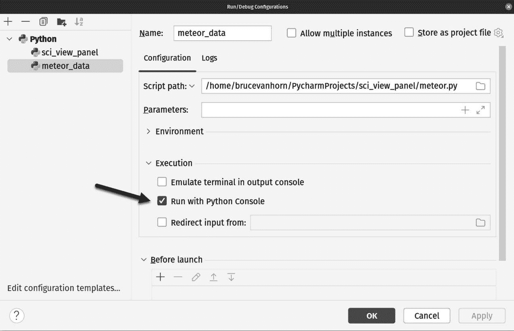

图 13.9：这是流星.py 文件的运行配置设置对话框。请确保已选中“使用 Python 控制台运行”

如前所述，关键是要确保文件在**Python 控制台**中运行，这样你就能得到 SciView 所需的面板视图。现在运行文件。你可以在*图 13.10*中看到我运行的结果。

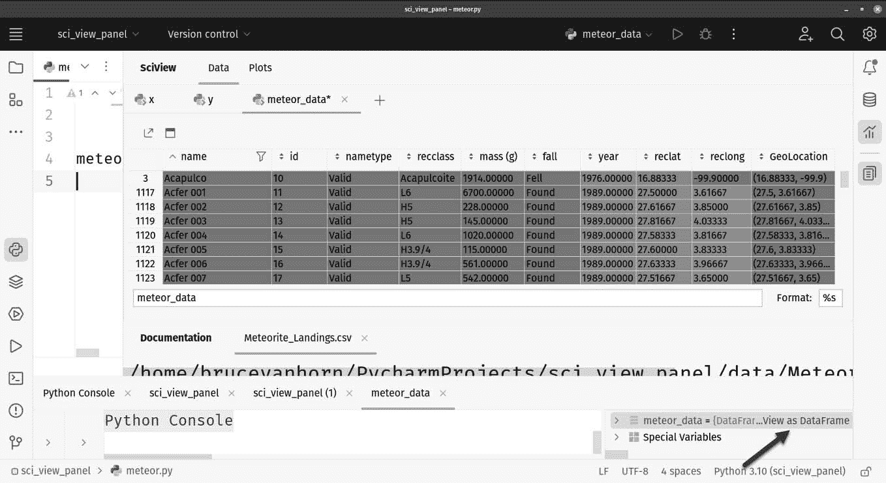

图 13.10：我的流星数据运行需要被压缩和拉伸，这样你才能看到所有内容

我不得不认真地拖动面板，才能让所有内容都适合截图。注意，这次，箭头所指的按钮上写着**以 DataFrame 查看**，因为我们这次使用的是 pandas 而不是 NumPy。我点击了它，**数据**标签页已经加载了 DataFrame 以供查看。

## 在数据标签页中进行过滤

流星数据集更接近现实。它包含很多值，并且可能对某些字段进行过滤是有意义的。PyCharm 允许你使用通配符或表达式来过滤数据标签页中显示的数据。

### 使用通配符进行过滤

在*图 13.11*中，你可以看到我在**数据**选项卡上悬停在`name`列上。

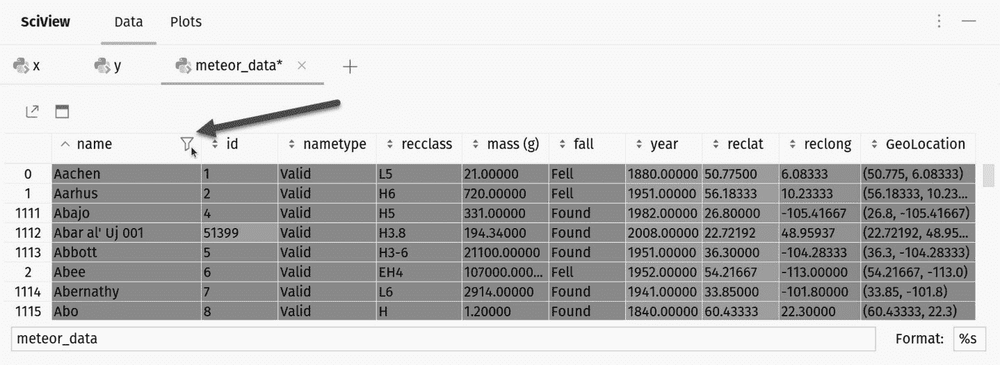

图 13.11：将鼠标悬停在列上会显示一个过滤器图标，它类似于漏斗

当我这样做时，会出现一个过滤器图标。点击该图标即可显示你的过滤选项，如*图 13.12*所示。

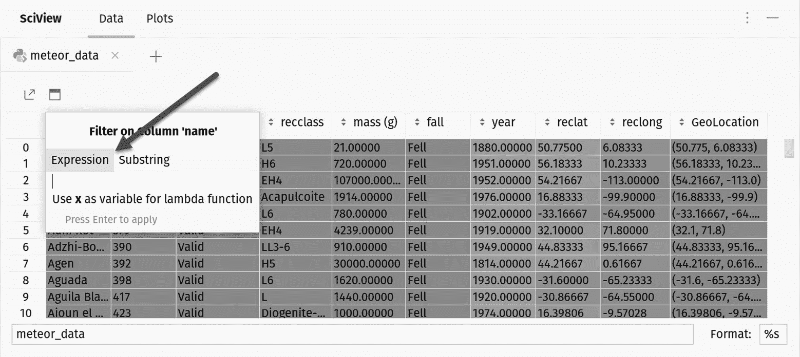

图 13.12：你可以通过表达式或子串（通配符）进行过滤

点击`Bal`。你可以在*图 13.13*中看到我的。

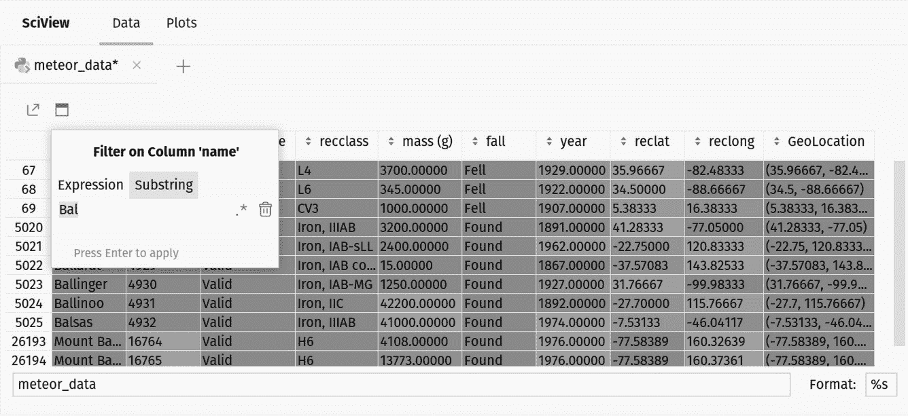

图 13.13：我们正在过滤名称列，以显示所有名称中包含字符 Bal 的名称

注意，垃圾桶图标允许你移除过滤器。虽然子串过滤器可能很有用，但表达式过滤器更强大、更精确。

### 使用表达式进行过滤

使用表达式，你可以有更多的选择性。流星很酷，但没有人会对一块小石子印象深刻。例如，让我们在*图 13.14*中过滤掉大于 10kg 的流星。14*。

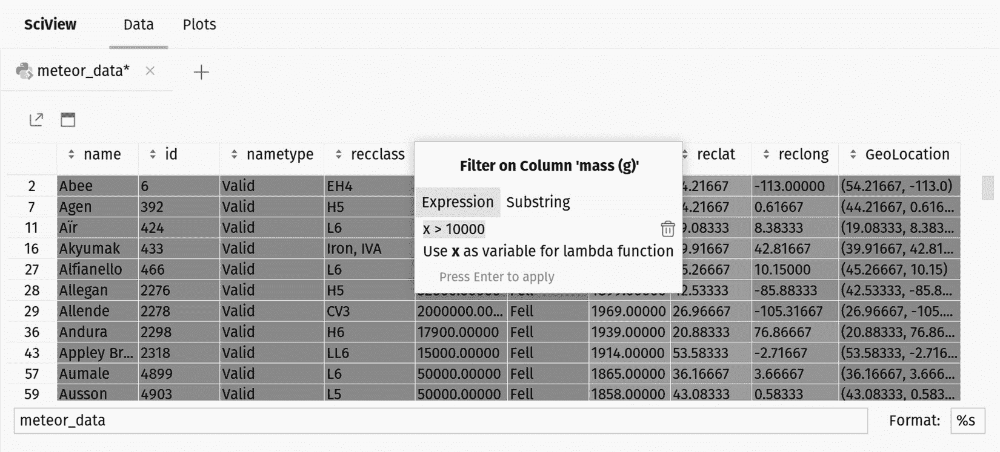

图 13.14：在质量列上过滤，其中 x（列中的值）大于 10,000

有很多！现在让我们通过过滤只显示从 2010 年开始发生的更近期的违规事件。我的在*图 13.15*中。

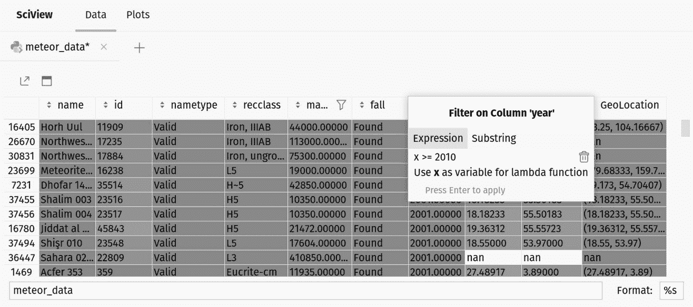

图 13.15：限制数据仅限于 2010 年和之后的流星撞击

幸运的是，它们并不多，数据在 2013 年结束时只有一次违规。碰巧的是，那是我最后一次按时缴纳所得税的年份。我告诉你，这都是我自己的事。

亲爱的国内税务局

那最后一行就是我们写作界所说的“笑话”。我知道这对你们所有人来说都是一个外国概念，但请相信我，其他人都在笑。

我肯定会被审计。

无论如何，通过我们的过滤实验，我们还可以看到`reclat`、`reclong`和`GeoLocation`字段中存在缺失数据。毫无疑问，这些数据是在地理定位数据非法的 51 区记录的。尽管如此，这可以是一个快速检查数据异常的方法，作为创建数据管道的一部分，我们将在下一章中介绍。

### 导出到文件或新标签页

看看*图 13.16*中**数据**选项卡的顶部。

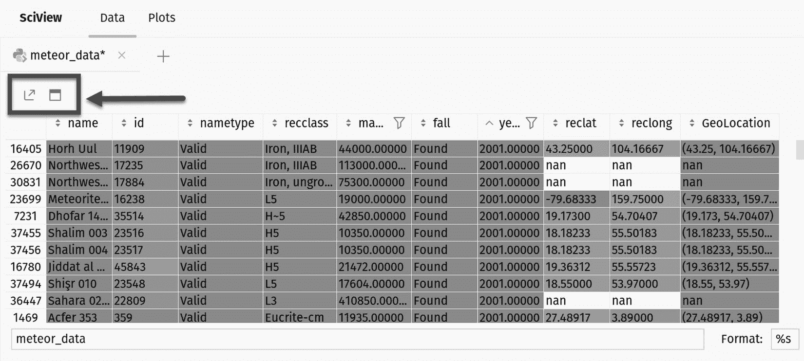

图 13.16：你可以将数据导出到文件或在新标签页中弹出

`.csv` 或 `.tsv` 文件。这很简单，所以我认为你可以没有截图也能过得去。你还可以将 SciView 中的数据标签内容弹出到编辑器视图中的常规标签中。我在 *图 13.17* 中做了这个操作。

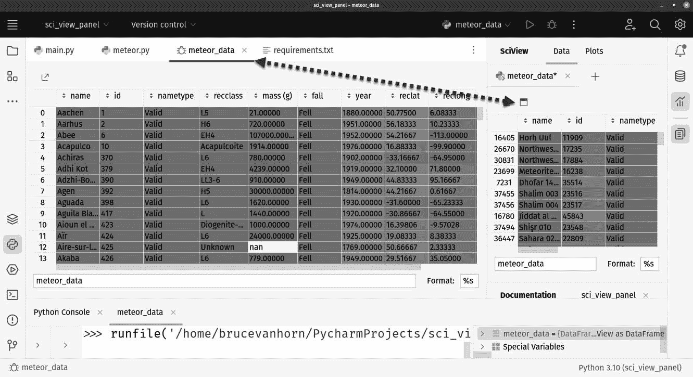

图 13.17：我已经将 SciView 数据标签的内容弹出到主编辑窗口的一个标签中

总的来说，SciView 中的 **数据** 标签包含了许多有用的功能，用于对数据进行探索，无论是原始数据，如气象数据，还是通过计算生成，如我们之前的随机集。当你将这种图形方式查看输入和输出数据与上一章中描述的 PyCharm 的单元格模式结合起来时，你开始看到 PyCharm 中数据科学工具的力量。它们只是几个简单的面板，但我们可以用它们做很多事情！

# 理解 IPython 和魔法命令

**IPython** 是 Python 编程语言的增强型交互式外壳。它提供了一个比默认 Python 交互式解释器更丰富、更用户友好的环境。IPython 旨在使交互式计算和数据分析任务更加方便和高效。

当你在 PyCharm 之外使用 IPython 时，你会发现一些你不会在任何标准控制台或 REPL 环境中找到的功能。所提供的 shell 经验被大大增强，以支持你期望在 PyCharm 中找到的功能，例如自动完成、语法高亮和历史导航。

工具提供了一系列丰富的显示选项。想象一下，一个命令行界面，它可以直接在交互式环境中处理图像、视频、音频和交互式小部件。显然，你可以以片段、表达式或整个脚本的形式执行 Python 代码，而你所有这些操作都是交互式的。

IPython 还使得在分布式计算环境中工作变得更加容易。正如你可能知道的，由于 **全局解释器锁**（**GIL**），线程计算在大多数主流 Python 解释器中被有效禁用。GIL 是 CPython 解释器中的一个机制，它是 Python 最广泛使用的实现。GIL 是一个互斥锁（或锁），一次只允许一个线程在解释器中执行，即使在多核系统上也是如此。这意味着在多线程 Python 程序中，在任何给定时刻，只有一个线程可以执行 Python 字节码，无论有多少 CPU 核心可用。

GIL 的引入是为了简化内存管理，并避免由于多个线程同时访问和修改 Python 对象而可能出现的潜在冲突。虽然 GIL 确保了 Python 内存管理保持简单和安全，但它对多线程程序也有影响，因为 Python 程序往往难以真正利用支持多线程的系统上的所有计算资源。

虽然 IPython 没有任何可以克服 GIL 限制的秘密配方，但它确实提供了一个名为 `ipython.parallel` 的模块，这使得与并行计算资源一起工作变得容易。你可以创建 IPython 引擎的集群，这些集群可以在多个进程甚至多台机器上并行运行代码。

考虑到它显然是一个强大的工具，能够更充分地实现现代数据科学工作流程中富步骤数据交互的模式，IPython 似乎是我们应该非常感兴趣的东西。那么，问题来了，我们如何在 PyCharm 中利用 IPython？

## 安装和设置 IPython

安装 IPython 的方式与其他 Python 库类似。你可以从 PyCharm 的终端使用 `pip install ipython`，或者你可以使用我们从 *第三章* (*Chapter 3*) 开始使用的包管理屏幕。*图 13*.18* 显示了我准备使用 PyCharm 的 **Python 包** 面板进行安装。

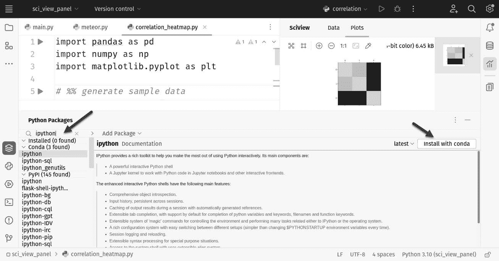

图 13.18：我在 Python 包面板中搜索了 ipython，并准备使用 conda 将它安装到我的项目中

如果你经常使用 IPython，你可能会考虑全局安装它，以便它对所有项目都可用。你可以通过在虚拟环境之外使用 `pip`、`conda` 或你喜欢的任何包管理工具来安装 IPython 来完成这项工作。

一旦 IPython 可用，PyCharm 将根据 IDE 的 **构建、执行、部署** 设置中的默认设置使用它，如 *图 13*.19* 所示。

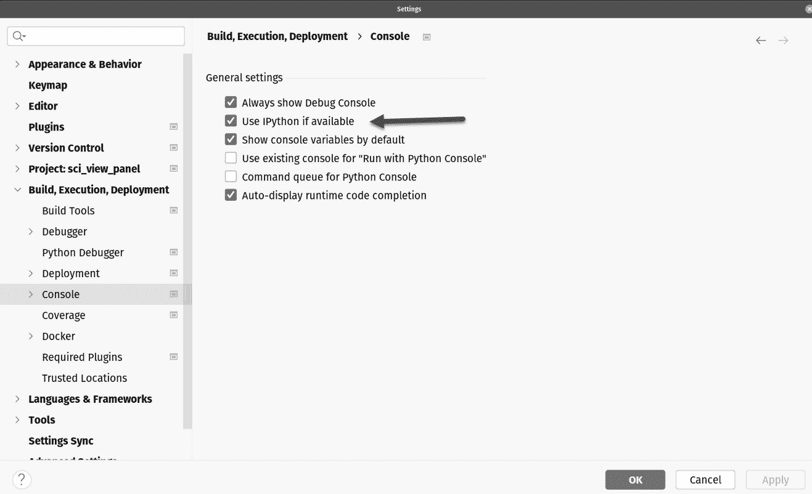

图 13.19：默认情况下，如果可用，PyCharm 将使用 IPython 作为其控制台

我们在第 *第二章* (*Chapter 2*) 中详细介绍了设置，所以如果你跳到了这一章并且不确定如何访问设置，请回顾前面的章节。一旦你的项目中可用 IPython，你需要关闭或循环任何可能打开的控制台。到目前为止，我们已经运行了三个程序，我们故意将它们设置为在控制台中运行，所以你不会看到任何变化，因为它们在我们安装 IPython 之前就已经在运行了。*图 13*.20* 显示了 IPython 提示符的外观。


图 13.20：关闭或重启现有控制台后，IPython 提示符出现

在 *图 13.20* 中，我画了一个箭头来提醒你如何打开控制台，如果它还没有打开。如果你看不到那个图标，尝试点击箭头上方的三个点图标。如果你仍然找不到它，请回顾 *第二章*，我们在那里讨论了第一次与控制台一起工作。

正如我提到的，如果你已经打开了控制台，它们需要被重启。我在 *图 13.20* 中画了一个圆圈来标记这个按钮。当控制台重启后，你应该会看到一个以单词 `In` 开头的不同提示符，与显示 `>>>` 符号的正常提示符不同。在 `In` 之后，你会看到一些包含数字的方括号。在 *图 13.20* 中，它显示的是 `2`。这个数字表示迄今为止输入命令的顺序。如果你查看新的 IPython 控制台顶部，你会看到一些命令被自动输入，这些命令导入 `sys` 库，打印出 Python 版本，并扩展我们的路径。这是三个命令，但请记住我们是从 `0` 开始的。你输入的下一条命令将是第四条命令，并标记为 `3`。

如果 PyCharm 是一款视频游戏，安装 IPython 就像是解锁超级枪、剑或魔法力量，你可以用它来击败那些毫无防备的对手。如果你是第一次使用，你可能迫不及待想要消灭一些数据僵尸，那么让我们来看看 IPython 的魔法命令。抛开夸张的说法，*魔法命令*确实就是它们的名字！

## 介绍 IPython 魔法命令

在 IPython 中，一个 `%`（用于行魔法）或 `%%`（用于单元格魔法）符号，在 IPython 会话或 Jupyter 笔记本单元格中使用。这些魔法命令提供了执行各种任务的快捷方式，从使用特定选项运行代码到与环境交互或控制 IPython 的行为。魔法命令是执行常见操作而不必编写大量代码的便捷方式。

魔法命令有两种类型：

+   `%` 符号用于单行。它们通常接受参数和选项来修改其行为。例如，`%run script.py` 可以用来在 IPython 会话中运行外部脚本。

+   `%%` 和它们被用于单元格的开始处。它们允许你影响整个单元格的内容。例如，`%%time` 可以用来测量整个单元格代码的执行时间。

这里有一些你每天会使用的常见魔法命令的例子：

+   `%run script.py`：在 IPython 会话中运行外部 Python 脚本。

+   `%timeit`：测量 Python 语句或表达式的执行时间。

+   `%matplotlib inline`：配置 `matplotlib` 以在笔记本中直接显示图表。

+   `%%writefile filename.txt`：将笔记本单元格的内容写入名为 `filename.txt` 的文件。

+   `%load_ext extension_name`：加载特定的 IPython 扩展。

+   `%%html`：将单元格的内容渲染为 HTML。

+   `%reset`：通过删除用户定义的所有名称来重置命名空间。

+   `object_name?`：在这个问题上，不要字面理解。你不需要输入 *object_name?*。相反，你输入你实例化的对象的名字。也许我们稍后再做这个，这样你就能理解了。

到现在为止，你开始闻到我们在这里煮的东西了。我们看到了 *第十二章* 中的单元格模式（*Chapter 12*），但现在，有了 IPython，我们可以使用这些魔法命令对单元格做更多的事情。就像电影中的任何好魔法一样，有足够的神秘但简短的语法可以学习，这增加了神秘感，让你感觉比那些不使用魔法的同事更精英一些。

让我们试几个，好吗？

在你的 IPython 控制台中，输入 `a = 1`。现在，让我们尝试 `object_name?` 魔法命令。你不需要输入 *object_name?*；相反，你输入 `a?`。对象的名字是 `a`，你后面跟着一个问号，就像你是加拿大人或澳大利亚人一样。无论你使用什么对象名，假设它是有效的，你都会得到关于该对象的信息。你可以在 *图 13**.21* 中看到我的结果。

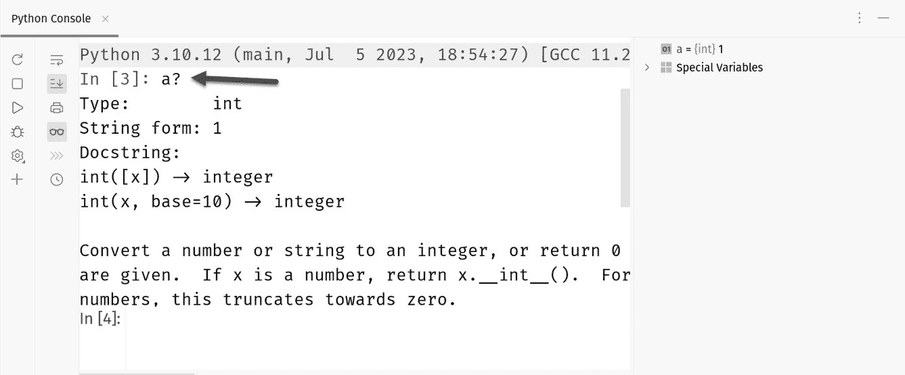

图 13.21：a 怎么样？

我们对 `a` 了解了很多，对吧？好吧，嗯，让我们再试一个。输入 `%precision 4`。结果应该是 `'%.4f'`。这告诉我们我们已经将我们的会话设置为四位小数的精度。让我们通过输入以下代码来测试一下：

```py
import math
math.e
```

小写 `e` 是对 `e` 到 10 位的参考，即 2.7182818285。然而，我们设置为四位小数的精度，所以 IPython 的结果应该显示 `2.7183`，如图 *图 13**.22* 所示。

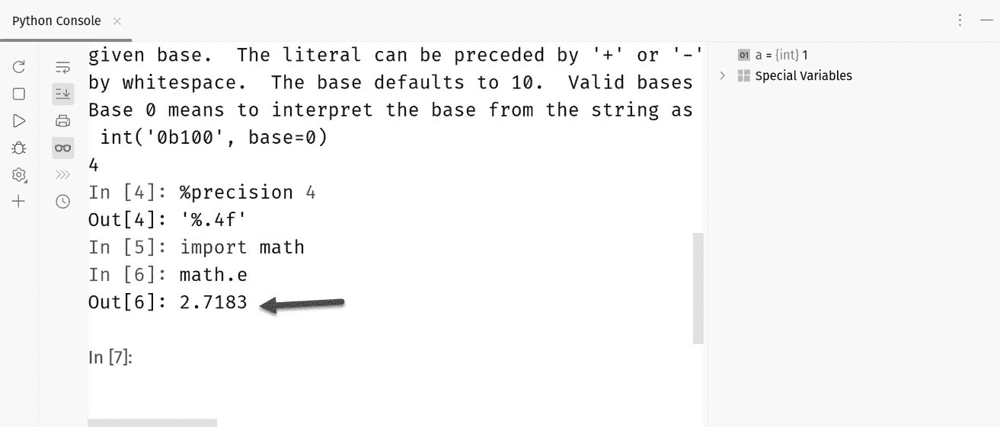

图 13.22：将精度设置为四位小数后，我们可以正确地看到常数 e 的表示

再试一次。`%%timeit`魔法在创建算法时非常有用。算法只是可重复的指令集；然而，为了有用，算法需要高效。效率由两个向量判断：完成所需的时间和完成工作所需的空间。例如，英国的**国家卫生系统**（**NHS**）设计了一个算法，根据许多复杂因素将器官捐赠者与接受者匹配。它的目的是以最小化组织排斥风险等方式将器官与捐赠者匹配。正如你可以想象的那样，这是一个复杂的算法，必须在一个包含数千名注册捐赠者和数千名注册接受者的数据集上运行。当器官可用时，它有有限的保质期。如果匹配算法花费太长时间来生成匹配，器官将无法用于移植，该算法实际上就变得毫无用处。我们在*第六章*中介绍了分析，但这实际上是为了帮助软件工程工作流程找到执行瓶颈。

在数据科学中，我们的操作超出了典型软件项目的限制，因此对单个步骤进行计时至少可以让我们对计算步骤可能如何扩展有所了解。即使我们的目标不是创建算法，我们仍然需要在常规的探索性工作中处理时间和计算空间（如内存和存储）的实际限制。

`%%timeit`魔法随后成为我们工作的一部分。现在我已经花了很多时间构建了一个巨大的示例，让我们用*图 13**.23*中的可笑的琐事来试试。

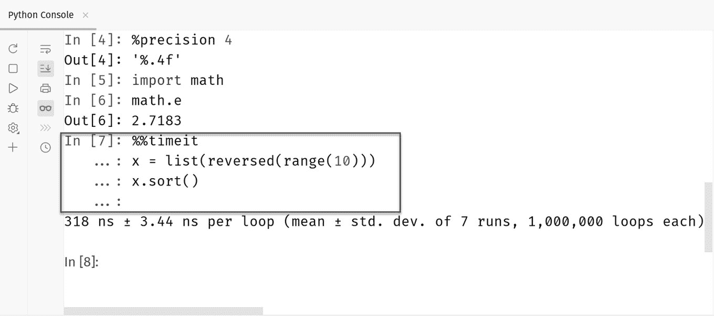

图 13.23：我们尝试使用%%timeit 进行简单的排序，以找到操作大约在 318 纳秒内完成

这确实是一个琐事。首先在 IPython 控制台中输入`%%timeit`。当你按下*Enter*键时，它会带你到下一行。在第二行中，我们创建了一个包含 0 到 9 的数字的列表，顺序相反。在最后一行，我们将它们按正常顺序排序。这太无聊了！在最后一行空白处按*Enter*键来运行代码。看看`%%timeit`做了什么！它本可以只启动一个时钟，运行脚本，然后停止时钟并报告差值。相反，`%%timeit`反复运行此代码以获得一个样本大小，其中它可以计算平均值和标准差。这使我们能够更好地了解这段代码将需要多长时间运行。当然，不同的计算机性能会有所不同。对我来说，它运行了 318 纳秒加减 3.44 纳秒。

在这里，我们考虑了 IPython 中最常见的三个魔术命令。当然，还有很多其他有用的命令可以利用，这些可以在 IPython 的官方文档中找到：[`ipython.readthedocs.io/en/stable/index.html`](https://ipython.readthedocs.io/en/stable/index.html)。

话虽如此，IPython 的主要目的并不仅仅是利用方便的 API 来简化特定任务，如变量检查、格式化或性能分析——IPython 实际上使用这些功能来支持其底层的交互特性。在数据科学项目的背景下，当在 PyCharm 中使用时，IPython 为我们提供了一个很好的方法来检查和测试在大型程序中使用之前的小块代码。

既然如此，让我们继续到下一节，我们将考虑 PyCharm 为科学计算提供的其他显著支持——Jupyter 笔记本。

# 利用 Jupyter 笔记本

**Jupyter 笔记本**可以说是 Python 科学计算和数据科学项目中用得最多的工具。在本节中，我们将简要讨论 Jupyter 笔记本的基本知识以及为什么它们是数据分析的绝佳工具。然后，我们将考虑 PyCharm 如何支持这些笔记本的使用。

我们将在章节源中与`jupyter_notebooks`项目合作。别忘了，你需要在一个虚拟环境中安装`requirements.txt`文件中的要求，以便使用示例项目。如果你需要复习如何做这件事，请参阅*第三章*。

尽管我们将在 Jupyter 笔记本中编写代码，但首先考虑一个传统的 Python 脚本中的裸骨程序是有益的，这样我们才能充分欣赏使用笔记本的优势。让我们看看`main.py`文件，看看我们如何与之合作。我们可以看到这个文件包含与上一节相同的程序，其中我们随机生成一个包含三个属性（`x`、`y`和`z`）的数据集，并考虑它们的相关矩阵：

```py
import pandas as pd
import numpy as np
import matplotlib.pyplot as plt
# Generate sample data
x = np.random.rand(50,)
y = x * 2 + np.random.normal(0, 0.3, 50)
z = np.random.rand(50,)
df = pd.DataFrame({
'x': x,
'y': y,
'z': z
})
# Compute and show correlation matrix
corr_mat = df.corr()
plt.matshow(corr_mat)
plt.show()
```

这基本上是我们在本章早期想要在 PyCharm 中查看相关矩阵时使用过的相同代码。在这里，我们添加了最后两行，它们是不同的。这次我们不是绘制热图，而是绘制散点图。我之前解释过，我们故意并且人为地在我们随机生成数据中引入了相关性。检查我们设置`y`的地方，你会看到我们将`x`的矩阵乘以 2，然后添加了一些来自另一个随机样本生成的小数。这将使`y`看起来大致但不是完全与`x`相关，从而让我们看到一个合理但人为的相关矩阵。当我们运行文件时，这得到了证明。我的结果是*图 13**.24*所示。别忘了，我们的数据是随机的，所以你的数据不会精确匹配我的。

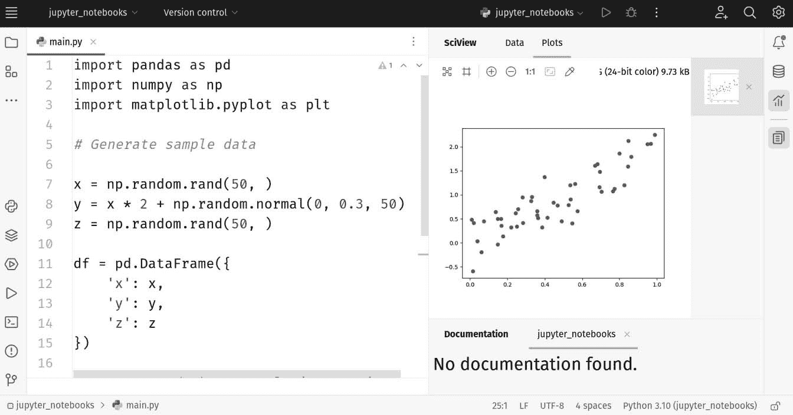

图 13.24：这是我们的代码生成的散点图

就像我说的一样，这里除了从热图到散点图的转变之外，没有什么是新的或惊人的。我们运行这个作为我们讨论 Jupyter 笔记本的比较点。

# 理解 Jupyter 基础知识

Jupyter 笔记本建立在迭代开发的理念之上。在任何开发工作中，无论你正在创建什么，将大型项目分解成更小的部分总是会有回报。福特汽车公司的任何人都不只是建造一辆汽车。他们建造了数百万个零件，这些零件最终被组装成汽车。每个零件都可以单独设计、生产、测试和检查。

同样，通过将给定的程序分解成可以独立编写和运行的各个部分，程序员和特别是数据科学家可以以增量方式工作在程序的逻辑上。

# 迭代开发的想法

世界上软件开发领域的多数从业者已经习惯了敏捷方法背后的理念。有数十个敏捷框架旨在帮助你管理软件，或者实际上，任何旨在创建有用产品的项目。它们一致共有的一个理念就是迭代开发。开发工作被分解成更小、更简单的任务，称为迭代。在每次迭代的结束时，我们应该有一些可用的产品。这很重要！

你可能会考虑制造一辆汽车，但真正思考一下最初汽车的研究和开发过程。当时我们主要关注的是制造一种车辆，它能以比使用驯养动物更快、更有效的方式，将我们从 A 点带到遥远的 B 点。

我们已经了解了轮子，那么让我们以某种有些滑稽的水平来娱乐一下，如果他们要创造世界上第一辆汽车，平均水平的软件开发者可能会使用的过程。记住，每次迭代都必须产生某种可用的旅行方式。我们的开发团队可能从滑板开始。这是我们可以在一个短暂的迭代中制作的东西。下一个迭代可能会产生一辆滑板车，下一个是一个自行车，下一个可能是一辆带动力的三轮车，然后最终是一辆原始的汽车。参见*图 13.25*。


图 13.25：逐步过程一步一步实现目标

每次迭代都会产生一个可用的结果，我们可以将其视为连续的进步。在每次迭代的结束时，你应该反思下一步，因为随着每次迭代，你对最终目标的了解会变得更加清晰。你从每次迭代中学到很多东西，如果你保持迭代的小规模，当你发现需要改变方向时，你有灵活性去调整。

这在传统的软件开发和数据科学工作中经常发生。你可能一开始就有一个特定的研究目标，但最终，你必须跟随数据指引的方向，而不是屈服于自己的偏见。迭代过程使得这一点成为可能。

我们可以将这一点应用到 Jupyter 笔记本背后的理念上，因为这些理念涉及一次构建一个单元格或迭代的工作。在每次迭代中，你会在读取数据集的代码单元格中添加或做出适当的更改，然后重新运行后续的单元格，而不是重新运行之前的代码。作为对用户的致敬，Jupyter 笔记本以三种最常用的科学编程语言命名：**Julia**、**Python**和**R**。

Jupyter 笔记本的另一个重要部分是对 Markdown 语言的支撑。正如我们之前提到的，在上一章的开头，Markdown 是一种常用于 GitHub 中`README.md`文件的标记语言。此外，由于它能够与 LaTeX（通常用于撰写数学方程和科学论文）协同工作，Markdown 在数据科学社区中受到了极大的青睐。

接下来，让我们看看如何在常规的 PyCharm 项目中使用 Jupyter 笔记本

# PyCharm 中的 Jupyter 笔记本

对于这个任务，我们将把`main.py`文件中的程序翻译成 Jupyter 笔记本，以便我们可以看到 Jupyter 提供的界面与传统的 Python 脚本相比。我将利用我们之前开始的`jupyter_notebooks`项目。你可以在本章的示例代码中找到它。如果你没有那个仓库，我们在*第二章*中介绍了如何克隆它。如果你想从头开始，你可以简单地创建一个新的科学项目，这在*第十二章*中有介绍。

## 创建笔记本并添加我们的代码

要在 PyCharm 项目中添加一个新的 Jupyter 笔记本，就像创建一个文件一样创建它。如图 13.26 所示，点击**文件** | **新建** | **Jupyter 笔记本**。

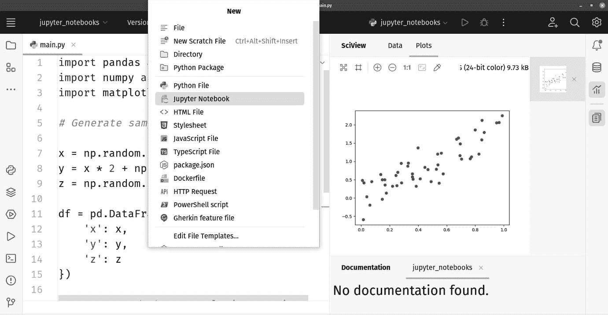

图 13.26：使用文件 | 新建菜单选项创建一个新的 Jupyter 笔记本

你会立即被提示为你的笔记本命名。我把它命名为`basic.ipynb`。文件创建在我的项目的根目录中，但我把它拖到了`notebooks`文件夹中。你可以在*图 13.27*中看到我的起点。

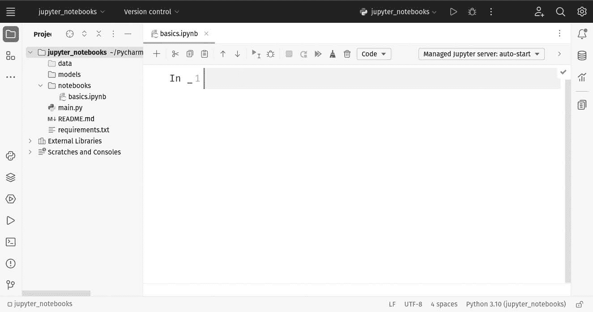

图 13.27：我的新笔记本准备好了！

让我们从输入一些文档和一些已知的导入开始。在提示符下，输入以下代码：

```py
### Importing libraries
import pandas as pd
import numpy as np
import matplotlib.pyplot as plt
#%%
```

当你输入最后一个`#%%`时，你会发现 PyCharm 为你启动了一个新的单元格。在第二个单元格中，让我们输入我们之前在示例 Python 脚本中的一些代码：

```py
x = np.random.rand(50,)
y = x * 2 + np.random.normal(0, 0.3, 50)
z = np.random.rand(50,)
df = pd.DataFrame({
  'x': x,
  'y': y,
  'z': z
})
#%%
```

我在本章中已经解释了这段代码，所以不会再重复了。和之前一样，最后的 `#%%` 将创建一个新的单元格。查看 *图 13.28* 看看我现在有什么。

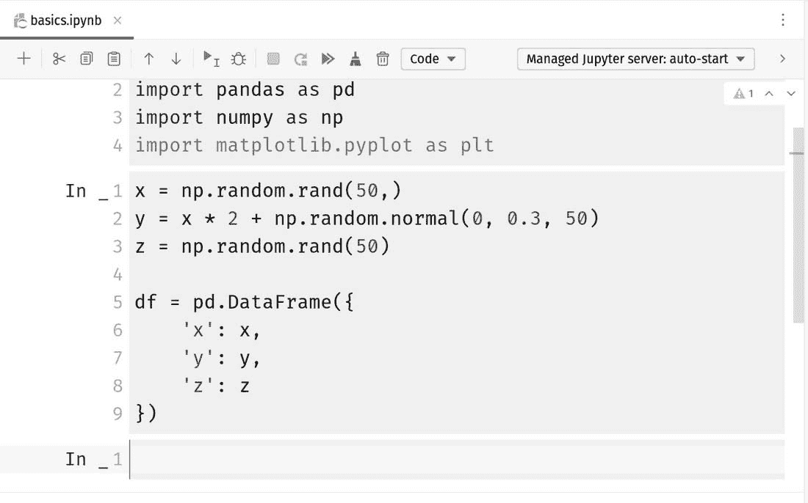

图 13.28：我现在有两个单元格，包含我们之前程序中的代码

到目前为止，一切顺利！我已经有了导入，还有一个为我生成数据集的单元格，就像我在 Python 脚本中做的那样。我已经将我的程序分解成小的、迭代的步骤。首先，我的导入，然后是我的数据集。接下来，我可以查看如何处理我的数据。从之前的讨论中我们知道这将是一个相关矩阵。如果这是一个大学项目，而我们的教授希望我们记录我们使用的公式，这可能是一个好主意，即使你已经离开了学校。让我们花点时间看看我们可以使用的酷炫文档功能。我们知道我们可以有代码单元格。我们还可以有利用不仅 Markdown 而且是 LaTeX 的文档单元格。

## 使用 Markdown 和 LaTeX 进行文档编写

Markdown 是我们已经见过的一种东西。它是一种简单的标记语言，允许你创建类似 HTML 的文档，但与丰富的标签集不同，你使用符号来标记你的文档。Markdown 只涵盖基本功能，如标题、列表和简单的图片。我们在 *第十二章* 中介绍了 PyCharm 集成 Markdown 插件的使用。

在我们的笔记本中使用 Markdown 允许我们进行一些简单的格式化，以增强笔记本的外观和可读性。

LaTeX，根据你的数学教授在哪里学习，发音为“LAY-tech”或“LAH-tech”，是一种在科学和数学领域使用的排版约定。这种东西在学术期刊中是必需的，因为你不太可能在键盘上轻松地输入复杂的公式，而且很少有数学教授能熟练使用 Adobe Illustrator 并进行自己的插图工作。他们没有使用图形工具，而是发明了一种简短、难以理解且难以记忆的约定，用于在他们的期刊文章中标记公式。然后他们给这个约定起了一个常见的英语单词，但坚持要求我们错误地发音。

让我们试试吧！

首先，我还没有完全向你坦白如何创建单元格。当然，你可以直接开始输入内容，使用 `#%%` 来分隔单元格效果也很好。你也可以悬停在单元格之间的空间，或者如果你在笔记本的顶部或底部，悬停在分隔处。查看 *图 13.29*。

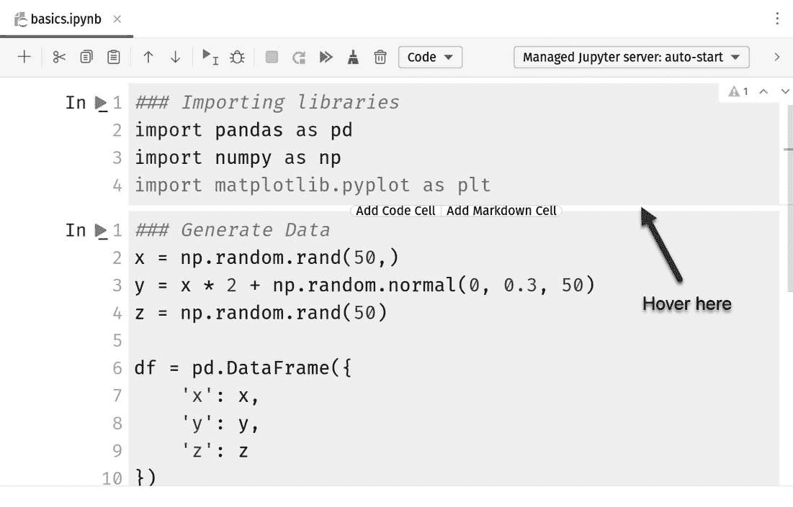

图 13.29：你可以在单元格之间的空间悬停以获得添加新单元格的简单 GUI 帮助

当你在单元格之间点击这些按钮时，会触发一个称为有丝分裂的细胞分裂过程。等等，不，那是生物学。它确实通过在两个已有的细胞之间添加一个新的细胞来分裂细胞。我将通过将鼠标悬停在最后一个细胞下方并点击**添加 Markdown 单元格**来在我的最后一个单元格下方添加一个单元格。见*图 13**.30*。

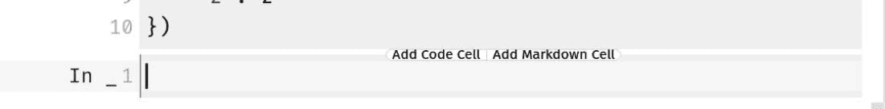

图 13.30：将鼠标悬停在最后一个空单元格上方并点击添加 Markdown 单元格

这将创建一个不带 IPython 提示的浅蓝色单元格。由于它是一个 Markdown 单元格，PyCharm 不期望代码，因此不需要提示。现在，在单元格内，输入以下绝对废话：

```py
### Pearson's correlation
$r_{XY}
= \frac{\sum^n_{i=1}{(X_i - \bar{X})(Y_i - \bar{Y})}}
{\sqrt{\sum^n_{i=1}{(X_i - \bar{X})²}}\sqrt{\sum^n_{i=1}{(Y_i - \bar{Y})²}}}$
```

这是一种 LaTeX 标记语法，它将传达皮尔逊的相关公式。相信我，当我们运行笔记本时，它将非常令人印象深刻。让我们继续添加我们之前的两张图表。

## 添加我们的图表

在最后一个单元格下方添加一个新的代码单元格，并添加以下代码用于我们的热图：

```py
# Compute and show correlation matrix
corr_mat = df.corr()
plt.matshow(corr_mat)
plt.show()
```

接下来，为我们的 scattelot 添加另一个代码单元格：

```py
# Scatterplot
plt.scatter(df['x'], df(['y']))
plt.show()
```

我们将代码作为 Jupyter 笔记本实现完成。

## 执行单元格

你可以通过点击笔记本顶部的运行按钮来执行笔记本，如图*图 13**.31*所示。


图 13.31：使用双绿色箭头按钮运行笔记本中的所有单元格

这会在 PyCharm 中触发一个奇妙的变化。*图 13**.32*是一个很好的起点。

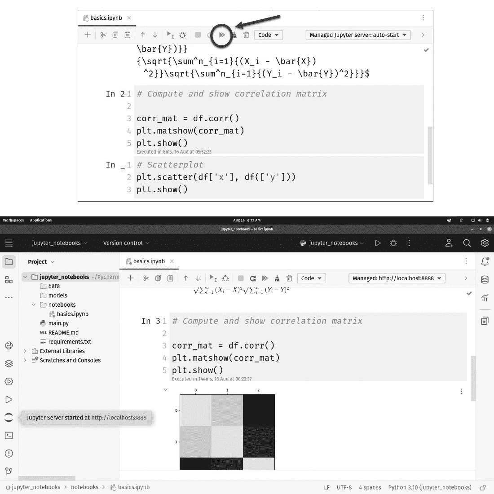

图 13.32：我们已经运行了笔记本，这导致 PyCharm UI 发生了大量变化

首先，注意左侧边栏上有一个新的 Jupyter 工具。我们可以看到我们已经开始了一个在端口 `8888` 上运行的 Jupyter 服务器。如果你在没有 PyCharm 的情况下使用 Jupyter，这将是一种正常的操作模式。你会从命令行运行 Jupyter 服务器，并在浏览器中导航到笔记本。PyCharm 在 IDE 中替换了这种体验，但我们仍然需要运行服务器以获取结果。

如果你向上滚动，你会看到 LaTeX 标记语法已经在我们的 Markdown 单元格中渲染，如图*图 13**.33*所示。

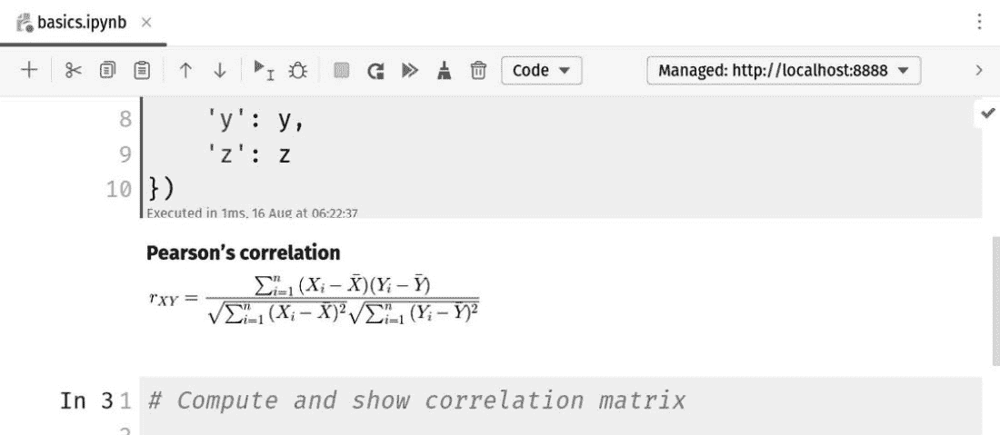

图 13.33：现在的废话看起来绝对惊人！

如果你向下滚动以检查散点图，我们会看到……唉，出错了！见*图 13**.34*。

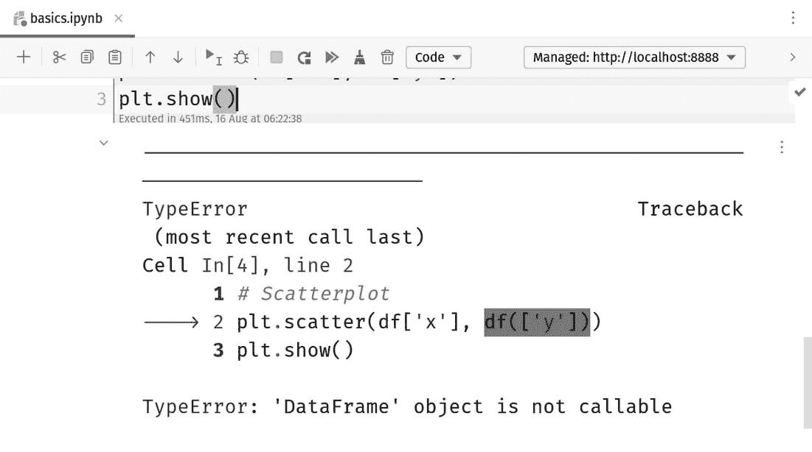

图 13:34：错误信息显示出了 exactly what is wrong

我搞砸了。我在 DataFrame 对象 `df` 旁边加了括号。我需要去掉它们，让它看起来像是一个邻居：

```py
# Scatterplot
plt.scatter(df['x'], df['y'])
plt.show()
```

现在，我可以重新运行整个笔记本，但我不需要这样做。问题出在最后一个单元格中，所以我只需将光标放在最后一个单元格中，然后点击单个绿色运行箭头。见图*图 13.35*。

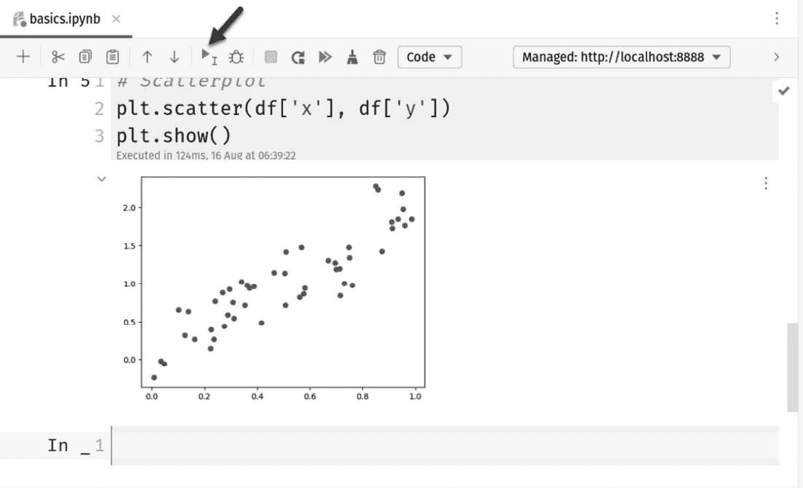

图 13.35：是的，这要好得多！

让我们用一些零散的内容来完成对 Jupyter 的介绍。

## 零散的内容

目前，我们正在运行一个 Jupyter 服务器。我们刚才看到这在新工具图标上创建了一个左侧菜单。让我们点击它，看看发生了什么。见图*图 13.36*。

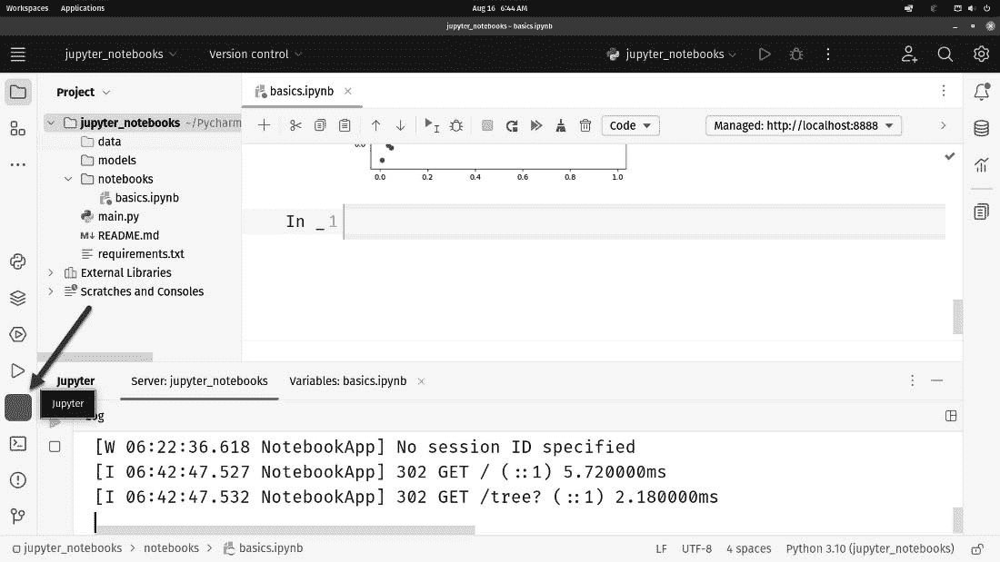

图 13.36：Jupyter 面板打开，我们可以在服务器选项卡上看到运行服务器的输出

将滚动条滚动到窗口顶部，如果你想在浏览器中与你的笔记本一起工作，将显示 Jupyter 服务器的本地 URL。但为什么要在 PyCharm 如此出色的前提下这样做呢？

注意允许你停止正在运行的 Jupyter 服务器的停止按钮。在**服务器**选项卡旁边是显示在*图 13.37*中的**变量**选项卡。

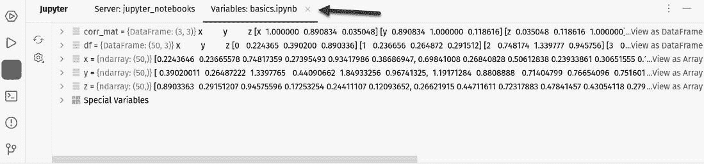

图 13.37：Jupyter 面板中的“变量”选项卡允许深入检查笔记本中的变量

在**变量**选项卡中，你可以获得允许你深入到笔记本中任何变量的检查。请注意，**以数组查看**和**以 DataFrame 查看**选项也在那里，这样你还可以使用 SciView 面板查看和过滤你的数组内容。

我们并没有太多讨论笔记本标签页顶部的工具栏，如图*图 13.38*所示。

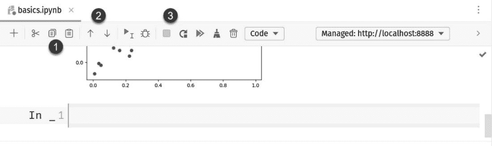

图 13.38：操作笔记本中单元格的控制按钮

有一些工具用于剪切、复制和粘贴你的单元格（**1**）。在(**2**)处的箭头允许你通过上下移动来重新排列笔记本中的单元格。在(**3**)处有一系列运行和调试工具，你无疑会将其视为一个常见主题。

扫帚图标将清除单元格的输出，如果你正在处理基于你即将提出的加薪的薪资预测，而你的老板正好从你身后走来，这将非常有用。垃圾桶将完全删除单元格。这里还有一个标记为**代码**的下拉菜单，允许你更改单元格的类型，比如从代码单元格更改为标记单元格，反之亦然。

我们已经在 Jupyter 笔记本的上下文中介绍了 PyCharm 的主要功能。总的来说，使用传统 Jupyter 笔记本的一个最大的缺点是在单独的代码单元格中编写代码时缺乏代码补全。具体来说，当我们在我们浏览器中的 Jupyter 笔记本中编写代码时，这个过程与在有限支持的简单文本编辑器中编写代码非常相似。

然而，当我们直接在 PyCharm 编辑器中处理 Jupyter 笔记本时，我们会看到所有可用于常规 Python 脚本的代码编写支持功能也在这里可用。换句话说，当使用 PyCharm 编写 Jupyter 笔记本时，我们得到了两者的最佳结合——来自 PyCharm 的强大、智能支持以及来自 Jupyter 的迭代开发风格。

# 摘要

Python 程序员通常以两种方式在数据科学项目中工作——编写传统的 Python 脚本或使用 Jupyter 笔记本，这两种方式都得到了 PyCharm 的大力支持。具体来说，PyCharm 中的 SciView 面板是一种全面且动态的方式来查看、管理和检查数据科学项目中的数据。它为我们提供了一个很好的方式来显示由 Python 脚本生成的可视化，以及检查 pandas DataFrame 和 NumPy 数组中的值。

另一方面，Jupyter 笔记本是促进 Python 中迭代开发的强大工具，使用户能够逐步分析并从他们的数据集中提取见解。Jupyter 笔记本也得到了 PyCharm 的良好支持，可以直接在 PyCharm 编辑器中进行编辑。这使得我们能够在利用 PyCharm 提供的强大代码编写支持功能的同时，跳过使用网络浏览器运行 Jupyter 笔记本的中间步骤。

通过深入了解 PyCharm 在数据查看和操作过程中的帮助，无论是通过 SciView 面板还是使用 Jupyter 笔记本，我们已经学会了如何使用 PyCharm 在 Python 中促进各种数据科学任务。有了这些，我们已经拥有了足够的知识和工具来使用 PyCharm 处理现实生活中的项目。

在下一章中，我们将结合到目前为止我们所学到的关于数据科学和科学计算的所有知识，并在 PyCharm 中逐步构建数据科学管道的过程。

一定要查看本书的配套网站[`www.pycharm-book.com`](https://www.pycharm-book.com)。

# 问题

1.  SciView 面板包含哪两个主要功能？

1.  当 Python 程序生成多个可视化时，在 SciView 面板中使用绘图查看器的优势是什么？

1.  SciView 面板中的数据查看器支持哪些类型的数据结构？

1.  迭代开发的概念是什么？Jupyter 笔记本是如何支持这一点的？

1.  什么是 Markdown 和 LaTeX？为什么在 Jupyter 笔记本中支持它们是有益的？

1.  在 PyCharm 编辑器中，Jupyter 代码单元是如何表示的？

1.  在 PyCharm 编辑器中编写 Jupyter 笔记本有哪些好处？
