# 14

# 在 PyCharm 中构建数据管道

“数据管道”这个术语通常表示一个逐步的过程，包括收集、处理和分析数据。在行业中，这个术语被广泛用来表达对可靠工作流程的需求，该工作流程将原始数据转换为可操作的见解。一些数据管道在巨大的规模上工作，例如一家**营销技术**（**MarTech**）公司从 Kafka 流中摄取数百万数据点，将它们存储在像**Hadoop**或**Clickhouse**这样的大型数据存储中，然后清洗、丰富和可视化这些数据。有时，数据量较小但影响更大，例如我们将在本章中工作的项目。

在本章中，我们将学习以下主题：

+   如何处理和维护数据集

+   如何清理和预处理数据

+   如何可视化数据

+   如何利用**机器学习**（**ML**）

在本章中，您将能够将迄今为止关于科学计算主题所学的知识应用到 PyCharm 的实际项目中。这作为了一个动手讨论，以结束与科学计算和数据科学项目合作的主题。

我要特别指出，我大量借鉴了第一版中的文本、代码和数据，该版由不同的作者 Quan Nguyen 编写。在第二版中，我的主要工作是更新现有内容。Quan 在本章中的处理非常出色，因此我更新本章的大部分工作都是使用 PyCharm 的新版本，更新到最新版本的库，然后用我自己的话重写本章，以便写作风格与本书的其他部分相匹配。没有 Quan 的原始作品，我无法完成这项工作，我想向这位原始的 Python 数据科学功夫大师致敬。

# 技术要求

要继续阅读本章，您需要以下内容：

+   Anaconda，这是一个针对数据科学工作负载定制的 Python 发行版。您可以在[`anaconda.com`](https://anaconda.com)找到它，以及适用于您操作系统的安装说明。

+   同样，我将使用 Anaconda 的包管理器 conda，而不是通常的`pip`。conda 是与 Anaconda 一起安装的。

+   安装并运行 PyCharm 的副本。如果您是在本书的中间部分开始阅读，其安装已在*第二章*，“安装和配置”中介绍。

+   本书样本源代码来自 GitHub。我们在*第二章*，“安装和配置”中介绍了如何克隆代码。您可以在[`github.com/PacktPublishing/Hands-On-Application-Development-with-PyCharm---Second-Edition/tree/main/chapter-14`](https://github.com/PacktPublishing/Hands-On-Application-Development-with-PyCharm---Second-Edition/tree/main/chapter-14)找到本章的代码。

# 处理数据集

数据集是任何数据科学项目的骨架。有了良好、结构化的数据集，我们就有机会从数据中探索、构思，并发现重要的见解。术语“良好”和“结构化”是关键。在现实世界中，这种情况很少是偶然发生的。我是每天进行数据科学项目的首席开发者。我们从各种硬件平台（如存储阵列、交换机、虚拟化节点（如 VMware）、备份设备等）收集诊断、利用和性能数据。我们收集整个企业的数据；每个数据中心中的每个设备。然后我们的软件将原始数据转换为可视化，提供见解，使组织能够通过整合健康监控、利用和性能报告以及容量规划，有效地管理其 IT 资产。

我已经从事这个领域 10 年了，我们一直在寻找支持新的设备和系统。然而，我们的挑战是获取所需的数据。10 年前，从 NetApp 存储阵列中获取数据非常困难，因为它的诊断数据以非结构化文本的形式被丢弃。与之相比，更现代的阵列将数据以 XML 或 JSON 格式丢弃，或者更好的是，它们有自己的 SDK，用于与硬件接口并提取我们所需的数据。

从各种来源收集数据并努力将原始数据塑造成有用的东西需要投入大量的努力。有时这很容易，有时却非常困难。格式不佳的数据可能导致错误的结论和错误的见解。

一个令人深思的例子来自一家大型鞋制造商。大约 20 年前，我在一家销售用于管理工厂生产的软件的公司工作。我们与鞋厂进行了咨询，并告诉他们如何建模他们的数据以获得最佳结果。他们没有听取我们的意见，而是选择了另一条路。我们告诉他们这不会奏效。他们感谢我们的建议。他们的预测完全错误，因此他们像任何有董事会和股东的大公司一样做了——他们责怪软件。我们的首席执行官在商业节目中四处奔波，但损害已经造成。我们的公司股价暴跌，那一年很多人失去了工作，包括我。时至今日，我都不会穿他们的鞋。糟糕的数据可能会危及生计、声誉，甚至在鞋之外，甚至生命。我们必须拥有工具和流程，帮助我们确保一切正确。

让我们回顾一下这个过程的一些步骤。

# 从一个问题开始

科学中的每一件事都是从一个问题开始的。就我们的目的而言，我们将考虑两种可能的场景：

+   我们心中有一个具体的问题，我们需要收集和分析适当的数据来回答这个问题

+   我们已经有了数据，在探索过程中，一个问题已经出现

在我们的案例中，我们将重新创建医学诊断领域一个可能的重要突破的数据分析阶段。我将展示一个来自 Kaggle 的例子，该例子取自一篇题为《利用打字时手指运动的多项特征高精度检测早期帕金森病》的论文，该论文由沃里克·亚当斯于 2017 年进行。你可以在本章的“进一步阅读”部分找到完整的研究论文和数据集链接。

注意

Kaggle 是一个为数据科学家和机器学习工程师设计的在线数据社区。该网站提供竞赛、数据集、游乐场和其他教育活动，以促进数据科学在学术界和工业界的增长。更多关于网站的信息可以在其主页上找到：[`www.kaggle.com/`](https://www.kaggle.com/)。

**帕金森病**（**PD**）是一种影响大脑并导致运动问题的疾病。它是一种进行性疾病，这意味着随着时间的推移会变得更糟。全世界有超过 600 万人患有这种疾病。在 PD 中，一种产生多巴胺这种化学物质的特定类型的大脑细胞开始死亡。这导致了一系列的症状，包括运动困难和与其他非运动相关的问题。

在撰写本文时，医生们还没有一个明确的测试来诊断 PD，尤其是在早期阶段，症状可能不是很明显。这导致诊断疾病时出现错误，高达 25%的病例被非 PD 专科医生误诊。有些人可能患有 PD 多年，直到被正确诊断。

这引出了一个问题……

我们如何有效地使用某些测试、指标或诊断数据点来诊断 PD，而不需要专业的临床培训？

亚当斯提出了一种测试方法，该方法使用收集到的随时间推移的计算机打字数据。由于打字涉及精细运动，而这种精细运动是 PD 早期发病时首先出现的问题，亚当斯希望利用日常的打字任务作为诊断工具。研究人员在 103 人身上测试了这种方法；其中 32 人患有轻度 PD，其余的为对照组，没有 PD。对他们的打字模式进行计算机分析能够区分早期 PD 患者和无 PD 患者。这种方法在检测 PD 患者时准确率达到 96%，在正确识别非 PD 患者时准确率达到 97%。这表明这种方法可能擅长区分这两组人群。让我们看看是否可以根据他们研究的数据得出相同的结论。

## 存档用户数据

在本章的源代码中，你可以找到一个名为`pipeline`的数据科学项目。该项目包含一个数据文件夹，其中包含我们的数据集，分为两个文件夹：`Archived users`和`Tappy Data`。

在“存档用户”文件夹中的数据是文本文件格式，看起来是这样的：

```py
BirthYear: 1952
Gender: Female
Parkinsons: True
Tremors: True
DiagnosisYear: 2000
Sided: Left
UPDRS: Don't know
Impact: Severe
Levodopa: True
DA: True
MAOB: False
Other: False
```

为了更好地沉浸其中，让我们稍微揭开一些神秘的面纱。以下是每个记录中包含的字段：

+   `出生年份：1952`：这个人出生于 1952 年。

+   `性别：女性`：这个人自认为是女性。

+   `帕金森病：是`：这个人已被诊断为 PD。

+   `震颤：是`：这个人有震颤，这是一种不由自主的颤抖运动。震颤是 PD 的常见症状。

+   `诊断年份：2000`：这个人于 2000 年被诊断为 PD。

+   `侧：左`：在这个上下文中，“侧”这个术语可能指的是症状更明显的身体部位。在这种情况下，症状在身体的左侧更为明显。

+   `UPDRS：不知道`：**统一帕金森病评分量表**（**UPDRS**）是一种用于评估 PD 严重程度的工具。在这种情况下，不知道这个个体的具体 UPDRS 评分是多少。

+   `影响：严重`：PD 对这个人生活的影响被认为是严重的，这表明症状对其日常活动和生活质量有显著影响。

+   `左旋多巴：是`：左旋多巴是一种常用的药物，用于管理 PD 的症状。这个人正在接受左旋多巴作为其治疗的一部分。

+   `DA：是`：**多巴胺激动剂**（**DAs**）是另一种用于管理 PD 症状的药物。这个人正在接受多巴胺激动剂作为其治疗的一部分。

+   `MAOB：否`：**单胺氧化酶 B 抑制剂**（**MOABs**）是一种可以增加大脑多巴胺水平的药物，有助于管理 PD 的症状。在这种情况下，这个人没有服用 MAOBs。

+   `其他：否`：如果我要为真实的研究重新创建这个研究，我可能会联系原始研究者，如果这个数据点没有在出版物中直接解释。由于我没有这样做，我会猜测这不会影响我们的项目。这很可能指的是 PD 的其他特定药物或治疗方法，表明这个人除了左旋多巴和 DAs 之外没有接受任何其他特殊治疗。

总结来说，这位个体在研究时是一位 65 岁的女性，于 2000 年被诊断为 PD。她有震颤，尤其是在身体的左侧。疾病对她的生活影响严重。她正在接受左旋多巴和 DAs 的治疗来管理她的症状，但她没有使用 MAOBs 或任何其他特殊治疗。根据 UPDRS 测量的具体严重程度，在提供的信息中没有提供。

文件夹中的文件名很重要。发布`User_0EA27ICBLF.txt`文件是不道德的。

## Tappy 数据

研究方法使用一个名为 Tappy 的应用程序，该应用程序在 Windows 上运行，并记录每个受试者的按键时间和每个键的位置数据。如果你还记得我们之前关于用户数据的讨论，侧向性是一个因素。运动皮层是大脑中负责计划、控制和执行自愿运动的部分。它位于大脑皮层，即大脑的最外层。

运动皮层，连同大脑的大部分区域，分为两个半球：左半球和右半球。每个半球控制身体对侧的自愿运动。换句话说，运动皮层的左半球控制身体右侧的运动，而右半球控制身体左侧的运动。由于这一点是真实的，知道按键数据来自键盘的哪一侧可能具有潜在的诊断重要性。

让我们打开一个 Tappy 数据集，看看里面有什么：

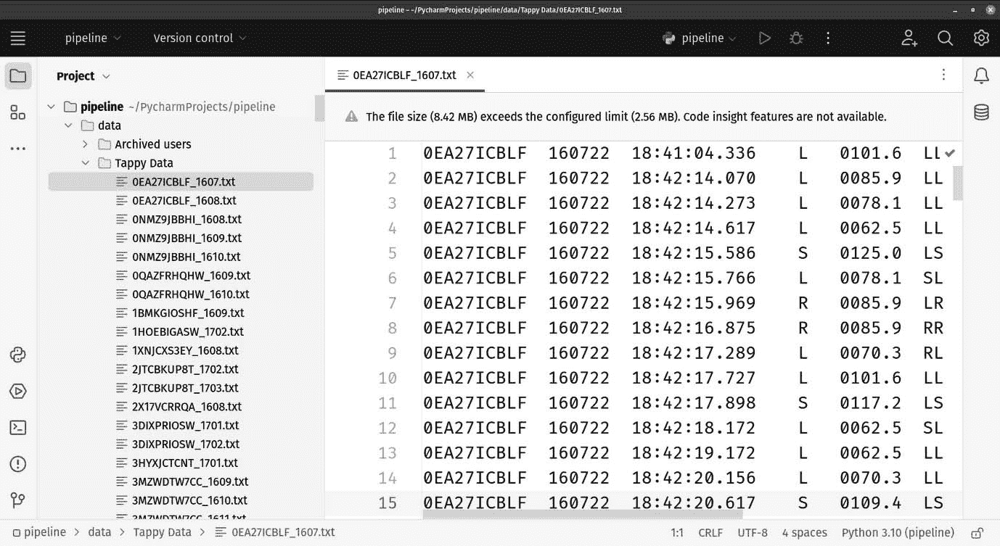

图 14.1：我已经打开了 Tappy 数据文件夹中的第一个文件，并且可以看到它是制表符分隔的数据

我可以看到顶部有一个警告，说明文件很大，按照代码编辑器的标准，代码洞察不可用。这是无谓的，因为 PyCharm 中科学项目的数据文件夹本来就不被索引和代码洞察。你可以安全地忽略这个警告。

我还可以看到文件是制表符分隔的，这将很好地在数据管道中运行。看到你的数据以易于解析的格式到来总是令人鼓舞。这实际上是适合导入电子表格或数据库表的结构化数据。这并不一定是我们将要处理的数据，但如果我们可以用给定的数据文件进行这些类型的导入，我们几乎可以处理任何数据。

和之前一样，文件名是有意义的。文件的第一部分，由下划线分隔，是来自`存档用户`文件夹的受试者 ID。我们将能够将`Tappy 数据`文件夹中找到的每个受试者的表现数据与`存档``用户`文件夹中找到的他们的人口统计数据相关联。

Tappy 数据文件中的字段如下：

+   患者 ID

+   数据收集日期

+   每个按键的时间戳

+   哪只手执行了按键操作（*L*代表左手，*R*代表右手）

+   保持时间（按下和释放之间的时间，以毫秒为单位）

+   最后一个按键的转换

+   延迟时间（从按下前一个键到的时间，以毫秒为单位）

+   飞行时间（从释放前一个键到的时间，以毫秒为单位）

我们已经确定我们拥有可工作的原始数据格式。说实话，这真是个好日子。它并不完全完美；我们仍然需要进行一些整理，但这是一个非常好的起点。

术语警告 - 整理

**Munging**是一个在计算机编程和数据处理中使用的俚语，用来描述将数据从一种格式转换到另一种格式的过程。这通常涉及改变数据的结构或内容，使其更适合特定目的，例如分析、存储或展示。Munging 可能包括以下活动：

- **数据清洗**：从数据集中删除错误、不一致或不相关信息

- **数据转换**：改变数据的格式、结构或表示，以适应特定要求

- **数据解析**：从更大的数据集中提取特定的信息

- **数据聚合**：将多个数据集合并成一个单一的数据集

- **数据过滤**：根据某些标准选择或排除数据

- **数据格式化**：改变数据展示或编码的方式，以适应特定的系统或软件

术语*munging*是非正式的，来源于*mangle*和*modify*的混合。它通常用于需要准备或调整数据以进行分析、集成或其他数据相关任务的环境中。

我们的项目有一个良好的开端，但我们有一个问题：我们能否通过打字测试来检测早期帕金森病？我们有一项研究实施的此类打字测试的原始数据。我们准备好卷起袖子大干一场了！

# 数据收集

我们很幸运。我已经找到了我们的数据，并包括了它供您考虑。在现实世界中，我们本需要执行数据收集的正常步骤。虽然关于这个主题有整本书的论述——大多数 4 年的科学大学学位课程都高度重视这个主题——但我并不打算在这里深入研究。然而，如果您对我们试图完成的事情不熟悉，我至少会提供一个概述。

## 从外部来源下载

在我们的示例数据集中，情况就是这样，因为我从 Kaggle 下载了它。当使用从互联网下载的数据集时，我们应始终确保检查其版权许可。大多数情况下，如果它在公共领域，我们可以自由使用和分发，无需担忧。我们正在使用的数据集就是这种情况的一个例子。另一方面，如果数据集受版权保护，我们可能仍然可以通过请求数据集的作者/所有者的许可来使用它。我发现，通过电子邮件与他们联系并详细解释他们的数据集将如何被使用后，数据集所有者通常愿意与他人分享他们的数据。

## 手动收集/网络爬虫

如果我们想要的数据在线上有，但不是以表格或 CSV 文件格式，大多数情况下，我们需要自己收集它并手动将其放入数据集中。最多，我们可以编写一个网络爬虫，可以向包含目标数据的网站发送请求并解析返回的 HTML 文本。当你必须以这种方式收集数据时，确保你没有非法行事也很重要。例如，从某些网站上抓取数据是违法的；有时，你可能需要设计爬虫，以便在特定时刻只发送一定数量的请求。一个例子是 LinkedIn 在 2016 年对许多匿名抓取其数据的人提起诉讼。因此，始终寻找你试图以这种方式收集的数据的使用条款是一个好习惯。

## 通过第三方收集数据

学生和研究人员在他们的研究中发现，他们寻找的数据无法在线收集时，通常会依赖第三方服务来帮他们收集这些数据（例如，通过众包）。Amazon **Mechanical Turk** (**MTurk**) 就是这样的服务之一——你可以输入任何类型的问题来制作调查问卷，MTurk 将该调查问卷介绍给其用户。参与者可以通过完成调查获得报酬，这笔费用由调查的所有者支付。这个选项再次特别适用于当你想要一个在线任何地方都不可获得的代表性数据集时。

## 数据库导出

如果你正在处理公司或组织的数据，这很可能是这种情况。幸运的是，PyCharm 在处理数据库及其数据源方面提供了许多有用的功能。这个过程在*第十一章*中进行了讨论，如果你还没有看过，我强烈推荐你查看。

# 数据集的版本控制

由于我们刚刚简要地讨论了数据收集，我希望在谈论使用数据在版本控制系统如 Git 中时，你能再次宽容我。早些时候，我们打开了一个数据文件，PyCharm 立即对文件的大小提出了抱怨。按照现代标准，一个 8MB 的文件并不大。然而，考虑到大多数代码文件，PyCharm 的宗旨，平均大小都在 100K 以下。如果你的文件非常大，那可能是一个代码问题，你应该找出你做错了什么。

在这里，我们向 PyCharm 提供了一个大约比其通常处理的文件大 8,000% 的文件。Git 也主要用于处理来自 IDE 的小文件。我提这一点是因为数据科学和科学计算社区中存在某种程度的可重复性问题。这就是一个数据团队能够从一个数据集中提取特定的见解，但其他人即使使用相同的方法也无法做到。许多这种情况的发生是因为不同团队之间使用的数据不兼容。有些人可能使用的是相同的但过时的数据集，而其他数据集可能来自不同的来源。

数据集的版本控制是一个需要考虑的重要话题。Git 通常对任何文件都有 100 MB 的硬限制，我可以根据经验告诉您，GitHub 上您项目的总大小有一个上限。在其他版本控制系统中也存在相同的限制。我过去曾用名为 Unity 3D 的工具教授游戏开发，我们总是因为这些限制而苦苦挣扎，因为视频游戏项目通常包含非常大的资源，这些资源不一定是代码，但可以从版本控制中受益。

## 使用 Git 大文件支持

由于问题普遍存在，Git（以及其他）添加了通过 **Git 大文件支持**（**Git LFS**）跟踪大型资源的能力。当我们使用 Git LFS 添加文件时，系统会用一个简单地引用它的指针来替换该文件。当文件被置于版本控制之下时，Git 只会保留对实际文件的引用，该文件现在存储在外部文件系统中，可能位于另一台服务器上。Git LFS 允许我们使用 Git 对大型文件（在这种情况下，是数据集）进行版本控制，而实际上并不存储这些文件在 Git 中。

此功能通常与现代 Git 安装程序一起安装。*图 14.2* 展示了我安装 Git for Windows 的过程，其中 LFS 是默认安装的一部分：

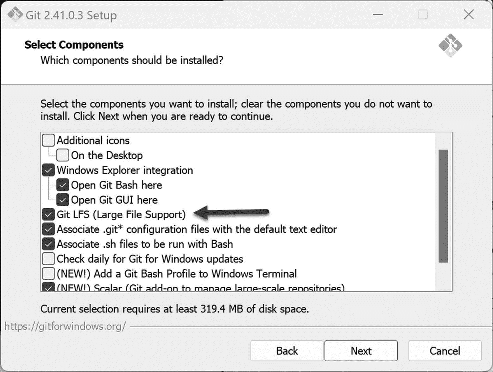

图 14.2：在 Windows 中，LFS 默认已安装

您可以使用命令行检查您的安装，无论您使用的是哪种操作系统：

```py
git lfs version
```

我在 Windows 11 的 GitBash 中运行此命令的结果如 *图 14.3* 所示：

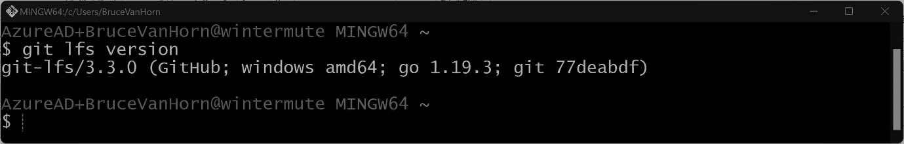

图 14.3：如果已安装 LFS，它应该会告诉您版本号

我拥有 Windows 的唯一原因（除了一般的 Ghost Recon 和 Steam）是，我可以使用 Microsoft Word 来编写这本书。这不是我的主意。我本来打算用原始的 LaTeX 和 vi 编写整个内容。不是 vim。不是 neovim。原始的 gangsta vi，我会自然地从源代码编译它。我的编辑器说不行。她非常礼貌！如果我们的角色互换，谁知道会说什么呢？无论如何，我剩下的真正工作是在 **Pop_OS** 上完成的，这是一个 Ubuntu Linux 的变种。当我把命令扔进那个环境时，我得到了一个不那么友好的回答，如 *图 14**.4* 所示：

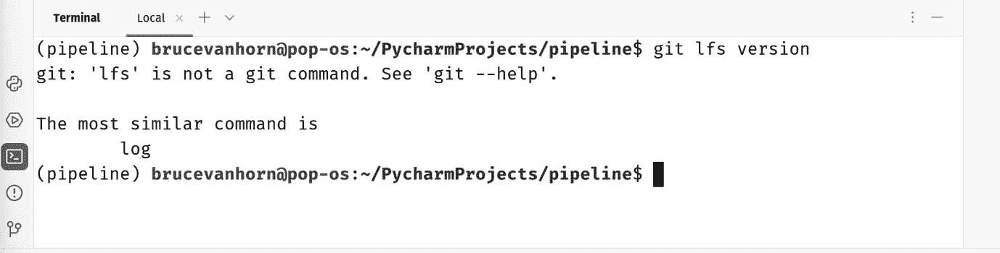

图 14.4：我的安装程序不够现代，无法预装 LFS

我没有！我必须使用以下命令来安装它：

```py
sudo apt update
sudo apt install git-lfs
```

完成这些后，我可以再次测试：

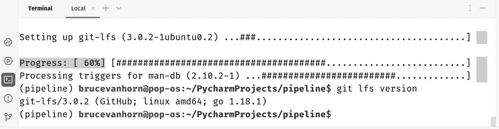

图 14.5：成功！如果你使用的是其他 Linux 分发版，如果你的安装中没有 git-lfs 软件包，请检查你的包管理系统

适用于你 Linux 分发的特定 `git-lfs` 软件包。

### 使用 Git LFS

我们可能有点过于急切了。如果你打算跟随这个小小的旁路练习，最好在本书代码库之外创建一个新的文件夹。让我们假设你在操作系统的终端中已经有了类似这样的文件夹：

```py
cd ~/
mkdir git-lfs-test
cd git-lfs-test
git init
```

这一系列命令可以在任何流行的操作系统（Windows、macOS 或 Linux）中运行。如果你使用 Windows，这一系列命令可以在 PowerShell 中运行，并假设你已经安装了 Windows 的 Git 客户端。安装程序可在 [`git-scm.com/downloads`](https://git-scm.com/downloads) 获取。

第一个命令将你带到你的 `home` 文件夹。第二个命令创建一个名为 `git-lfs-test` 的新文件夹。接下来，我们将目录更改为我们刚刚创建的 `git-lfs-test` 文件夹，并初始化一个新的仓库。现在，我们已经准备好设置 Git LFS 的支持。

不要忘记章节文件已经在 Git 仓库中

如果你正在跟随本章的源代码，别忘了文件已经在一个 Git 仓库中。在现有仓库内创建第二个仓库是不行的。如果你想练习，请在这个书的仓库之外创建一个完全独立的文件夹，并将项目文件复制到你的文件夹中。当你复制时，你特别想避免将 `.git` 文件夹复制到你的目标文件夹中。

在我们的项目中，我们将使用 Git LFS 来跟踪具有特定扩展名的文件，特别是具有 `.txt` 扩展名的文本文件。鉴于这些文件自然是纯文本，你可以对扩展名进行一些创意性的处理，而不会影响它们的使用方式，但我们将坚持使用 `.txt`。我将在我的终端窗口中运行这个命令：

```py
git lfs track "*.txt"
```

你可以在 *图 14**.6* 中看到我的测试运行：

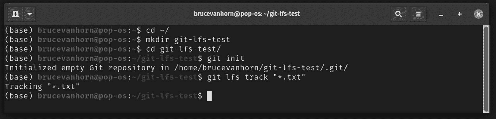

图 14.6：Git LFS 现在正在跟踪所有.txt 扩展名的文件

为了完成我的 LFS 测试，我将把之前检查过的文件`0EA27ICBLF_1607.txt`从`Tappy Data`文件夹复制到我们用于实验的`git-lfs-test`文件夹。为了清楚起见，*图 14**.7*显示了我的文件夹。我们不会在本书代码存储库的任何子文件夹内进行此操作，因为在一个存储库内部创建存储库是大忌：

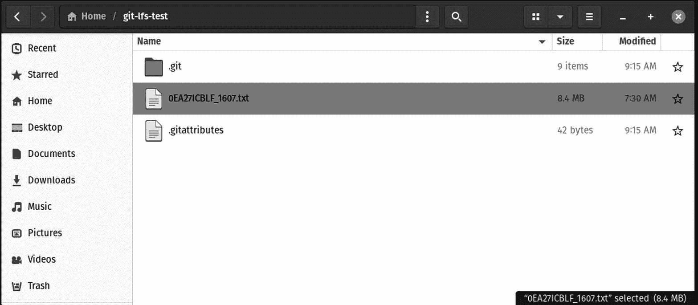

图 14.7：我已经将 0EA27ICBLF_1607.txt 复制到 git-lfs-test 文件夹

现在，让我们将新复制的文本文件添加到存储库中：

```py
git add 0EA27ICBLF_1607.txt
git commit -m "adding big file"
git lfs ls-files
```

我们在*第五章*中详细介绍了前两个 Git 命令。最后一个命令将列出在这个存储库中由 LFS 跟踪的所有文件。您可以在*图 14**.8*中看到我的输出：

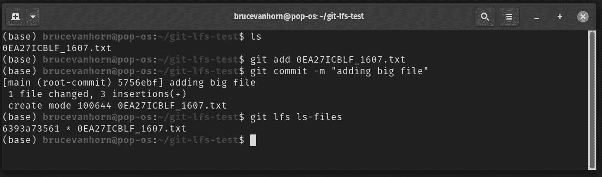

图 14.8：我可以看到我的文本文件正在被 LFS 跟踪

您现在已经了解了如何使用 Git LFS 跟踪大文件。如果这是一个我们感兴趣的真正存储库，我们还需要做最后一件事。当我们命令 Git 跟踪我们的文本文件时，代表我们创建了一个名为`.gitattributes`的特殊文件。我们应该添加并提交该文件：

```py
Git add .gitattributes
Git commit -m "Added .gitattributes to repo"
```

您已经准备好了！让我们继续到数据分析流程中的下一个正式步骤，这包括数据清洗和预处理。

# 数据清洗和预处理

如我之前提到的，我们非常幸运。我们团队处理的一些数据可能非常糟糕。当我们使用“脏”、“污秽”和“清洗”等术语来描述数据时，我们谈论的是解决数据的格式问题，以及数据适合处理的情况。如果数据格式是我们能处理的形式，那么数据才有用。结构化数据是我们始终首选的。

结构化数据指的是分割成可识别字段的数据。我们已经看到了逗号分隔和制表符分隔的文本。结构化数据的其他示例包括 XML、JSON、Parquet 和 HDF5 等格式。前两种，XML 和 JSON，非常常见，并且具有文本格式的优势。后两种，Parquet 和 HDF5，是二进制文件，专门用于存储比文本处理更舒适的大数据集。正如我们所见，包括 PyCharm 在内的大多数工具在尝试读取非常大的文本文件时都会崩溃。如果您想就地查看或编辑这些文件，则需要专门用于处理大文件的工具。

当我谈论脏数据与干净数据时，我寻找的是诸如缺失或无效字段数据等问题。回想我们之前的数据样本：

```py
BirthYear: 1952
Gender: Female
Parkinsons: True
Tremors: True
DiagnosisYear: 2000
Sided: Left
UPDRS: Don't know
Impact: Severe
Levadopa: True
DA: True
MAOB: False
Other: False
```

`UPDRS`字段标记为未知。这并不理想。如果包含该字段，我希望看到那里的值。在这种情况下，无法进行回填，但在一个完美的世界里，这可能是一个数据清洗练习的候选者。

## 一个涉及忍者的有毒数据示例

我遇到的最相关的例子是来自企业界，而不是来自数据科学实验中的脏数据——或者在这个案例中，是有毒的数据。我的公司正在为一家大型航空公司提供咨询服务，该公司也是美国国防部的承包商。在这里我不会提及真实姓名，因为我通常不喜欢政府在凌晨 2 点踢开我的门，或者更糟糕的是，因为我在这里写的内容而被标记为税务审计。所以，我们将保持这个理论上的讨论。

这家航空公司与许多供应商做生意，当你大规模地与供应商做生意时，根据购买量对所购买的商品应用折扣并不罕见。如果你或我去 Hammers R Us 买一把锤子，我们可能为这把锤子支付 12.95 美元。但是，如果航空公司在一个季度内通过多个订单购买了 5,000 把锤子，他们可能会获得高达 60%的折扣。航空公司的任务是跟踪他们购买的商品和供应商，以便他们可以兑现公司与供应商协商的任何批量购买协议。

当是时候运行折扣报告时，一个会计分析师可能会查询一个由数百甚至数千人在代表航空公司工作的领域输入的数据数据库。由于这些操作员是真人，他们在没有任何验证的情况下将干净、标准化的数据输入到一个设计不良的系统中的能力几乎为零。在这种情况下，用于订单输入的软件允许用户在一个文本字段中输入公司的名称，而这个字段从未与任何批准的供应商名单进行过验证。

有一个人将采购记录为“Hammers R Us”的供应商。另一个人将其输入为"HRUS"（自然地，那是股票代码），还有一个人将其输入为"H.R.U.S。"另一个人将其拼写错误为“Hammers Are Us”，还有另一个人将其拼写为“Hammers-R-Us。”现在，我们对同一家公司有五种不同的引用，这削弱了我们确定我们可以要求多少折扣的能力。如果有五种拼写，并且采购数量在五份订单中平均分配，那么每份订单将只有 1,000 把锤子，我们的折扣只有 20%，而不是 60%。我们的有毒数据问题正在使公司损失大量金钱！

飞机制造公司雇佣了我的公司进行**数据清洗**。我们的任务是清理所有数据并标准化所有对 Hammers R Us 的引用。对我们来说，这个项目是成功的，因为我们只需向客户收取比他们损失少几美元的费用，而这笔费用相当可观。然后，我们帮助他们修复软件，使其之后无法输入有毒数据。这对每个人都是个胜利！我甚至从 Hammers R Us 得到了一把免费的锤子，至少在我的故事版本中是这样的，这个版本意味着我没有被审计或遭到忍者的袭击。

## 在 PyCharm 中进行探索性分析

虽然在数据科学项目中数据清洗通常不会带来经济上的利润，但它是一个非常必要的步骤。当你开始第一次检查你的数据时，你经常会听到这个过程被称为**探索性数据分析**，在这个过程中我们同时探索和分析数据。但我们实际上是在盘点，看看我们能用我们的数据做什么。如果没有首先确保所有必要的数据都存在并且以可用的数值格式，那么执行诸如计算总和、平均值和标准差之类的制表操作将会非常困难。我们可能还会寻找异常值。也许一个锤子订单被误输入，我们有一个取消的订单，该订单为 100 万把锤子。这些类型的异常值在我们真正开始分析之前可能需要被移除。

在我们数据的情况下，有几件事情让我感到烦恼：

+   研究称它检查了 103 名受试者；然而，在`存档用户`文件夹中有 277 个用户文件。我怀疑并非每个用户都有匹配的收集数据。我们需要一种方法来检查`存档用户`文件夹中的每个用户在`Tappy` `数据`文件夹中都有一个相关的数据集。

+   我们的数据是纯文本的，这意味着当我们通过读取文件将其导入 Python 时，数据将以字符串的形式表达。这对于数据分析来说并不理想。我希望数字能转换为数字类型，日期转换为日期类型，布尔值转换为布尔值，等等。

+   `Impact`列应该完全标准化，以处理数据中的缺失值。自然地，这也适用于任何我可以看到或怀疑可能包含缺失值的列。

+   我们可以将用户数据集中的某些字段转换为二进制格式，以使分析更容易。具体例子包括`Parkinsons`、`Tremors`、`Levadopa`、`DA`、`MAOB`和`Other`。

+   我们可以使用一种称为独热编码的过程来更容易地处理标记为`Sided`、`UPDRS`和`Impact`的字段。一旦我们准备好执行这个过程，我会详细介绍独热编码。

这只是我第一眼看到的。一旦我们开始着手，可能会有其他清洁的机会出现。

### 从文本文件中读取数据

让我们看看我们需要对数据进行预处理的工作。如果你打开 `data_clean.py` 文件，你会看到我们的清理脚本，该脚本使用了在 *第十二章* 中讨论的单元格模式。我们的第一个单元格处理我们的导入：

```py
import pandas as pd
import numpy as np
import os
import gc
```

如果你正在跟随本章的代码，别忘了使用 `requirements.txt` 文件创建一个虚拟环境。在这里，我们导入了一些老朋友。`numpy` 和 `pandas` 是标准的分析库。`os` 包将用于处理文件目录，而 `gc` 包允许我们控制 **垃圾回收**（**GC**）过程。如果你之前从未听说过这个，那是因为大多数编程语言，包括 Python，都自动处理 GC。GC 的一个常见发生情况是当一个变量，它将分配内存来存储其值，超出作用域并且不再需要时。在 C 编程语言中，你需要在能够使用变量之前自己分配该内存。当你完成变量后，你需要“手动”释放该内存。如果你不这样做，你会使用比所需的更多内存，这就是你被邀请参加 Pi Day 披萨派对的原因。

大多数现代语言在称为 GC（垃圾回收）的过程中自动处理这种分配和释放。然而，有时，尤其是在你加载和处理大量数据时，当垃圾被清理出来时，采取更积极的角色是有意义的，这可以释放内存以供进一步使用。

我们的导入完成之后，让我们使用以下单元格读取一些数据：

```py
#%% Read in data
user_file_list = os.listdir('data/Archived users/')
user_set_v1 = set(map(lambda x: x[5: 15], user_file_list)) # [5: 15] to return just the user IDs
```

`os.listdir` 方法接受我们的 `data/Archived users/` 文件夹，并给我们一个来自该文件夹的文件可迭代列表。这很重要，因为我们需要一个包含在每个用户文件名中的 ID 列表。

我们创建了一个名为 `user_set_v1` 的变量，并实例化了一个集合。在 Python 中，`set` 是一个内置的数据类型，它表示一个无序的唯一元素集合。这意味着集合不能包含重复的值，并且存储元素的顺序不一定与它们被添加的顺序相同。

我们使用 `map` 语句填充这个 `set`，该语句遍历 `Archived users` 文件夹中的文件列表。对于 `map` 的每次迭代，我们使用一个 lambda 函数从 `user_file_list` 中的每个文件名中提取一部分。具体来说，它从每个文件名的第 5 个到第 15 个字符提取子字符串。这是从文件名中提取用户 ID 的目的。接下来，我们还需要对 `Tappy` 数据文件做类似的事情：

```py
tappy_file_list = os.listdir('data/Tappy Data/')
user_set_v2 = set(map(lambda x: x[: 10], tappy_file_list)) # [: 10] to return just the user IDs
```

现在，我们有两个集合，一个来自用户文件，一个来自 Tappy 数据文件。我们需要找到这两个集合的交集。

在 **集合论** 中，术语 *交集* 指的是一种操作，它将两个集合组合起来创建一个新集合，该集合只包含两个原始集合共有的元素。两个集合的交集，通常用 ∩ 符号表示，代表集合之间的重叠或共享元素。

从数学上讲，如果你有两个集合，A 和 B，A 和 B 的交集是一个新集合，它包含所有同时存在于集合 A 和集合 B 中的元素。

我知道你们这些数学爱好者都喜欢你们的符号，我也知道你们的头脑被编程去寻找模式而不是逐字阅读，所以我会帮你们。从符号上讲，它表示为 A ∩ B = {x ∣ x ∈ A and x ∈ B}。

在 Python 编程的背景下，`set` 类型的 `intersection()` 方法执行这个数学运算。给定两个集合，它返回一个新集合，只包含两个集合中都存在的元素。

例如，假设你有两个以下集合：

+   集合 A = {1,2,3,4}

+   集合 B = {3,4,5,6}

集合 A 和 B 的交集将是 A ∩ B = {3, 4}，因为 3 和 4 都在两个集合中。在我们的情况下，获取交集很重要，因为研究文本指出它考察了 103 个受试者，但在“存档用戶”文件夹中列出了 227 个受试者。我可以制作一个列表，然后逐一检查`Tappy Data`文件夹的内容，以确保每个人都已计入，但这会很无聊，耗时且容易出错。我将让 Python 帮我完成：

```py
user_set = user_set_v1.intersection(user_set_v2)
```

你难道不喜欢 Python 的单行代码吗？当然，有一些设置（嘿嘿，`intersection` 方法，我们得到了一个新集合，它既有趣又无杂乱！让我们通过打印长度来看看我们得到了什么：

```py
print(len(user_set))
```

我将使用 *图 14**.9* 中指示的绿色箭头运行前两个单元格：

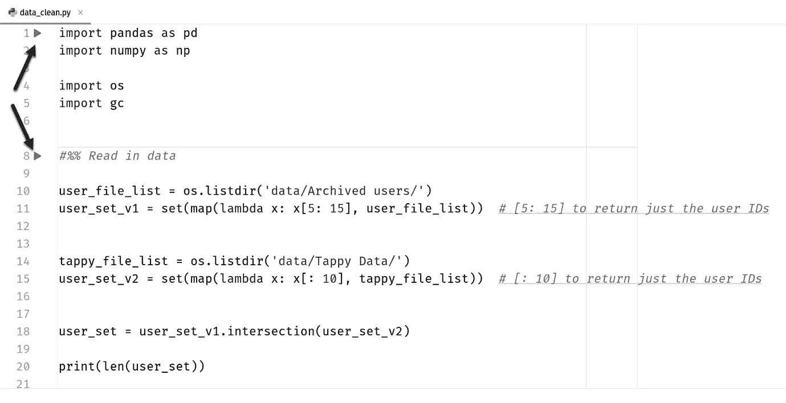

图 14.9：我正在使用每个单元格顶部的绿色箭头运行到目前为止我们所覆盖的前两个单元格

运行结果如 *图 14**.10* 所示：

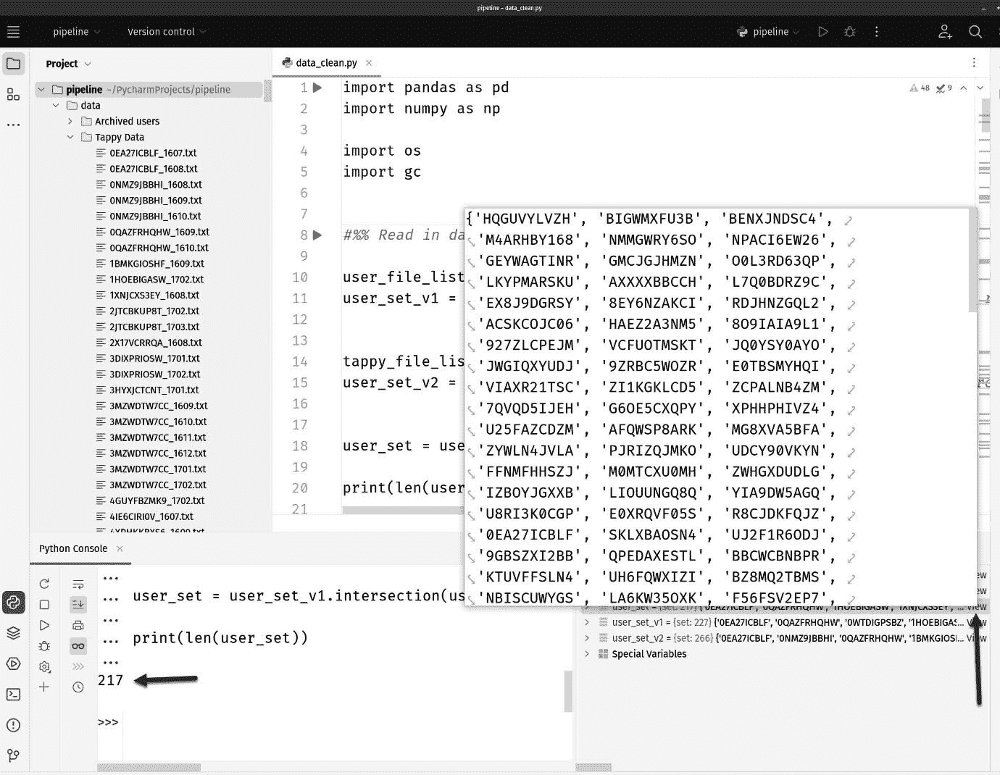

图 14.10：在数据清理的第一步之后，我得到了一个相对干净的用戶列表

我们得到了两个集合之间相关数据的 217 个用戶，所以我们成功地消除了我们不会使用的 60 个用户文件。这个数字与测试中报告的 103 个受试者不符，但没关系——日子还很长，我们可能会稍后消除更多。即使我们不会，也可能有其他原因稍后消除正确匹配的数据。我们的新集合可以用来遍历任一数据文件夹中的数据，因为两个文件夹中的文件名都使用 ID 作为文件名的主要部分。这将在我们数据准备过程的下一步中非常有用。

在 *图 14**.10* 中，我点击了查看链接来查看带有 **SciView** 面板的我的列表。它并不特别令人兴奋，因为它只是一个 ID 列表，但能够在不执行额外打印的情况下轻松检查我们正在工作的内容是非常有用的。

### 将数据导入 pandas DataFrame

我们下一个单元格中的代码是为了将加载的数据集拉入 pandas DataFrame。pandas 是一个库，它允许轻松分析表格数据，甚至提供了许多非常实用的方法，可以直接将数据加载到 DataFrame 中，DataFrame 是 pandas 中的一个表格结构。DataFrame 对象很像一个没有编辑器的内存中的电子表格。你可以用最小的努力执行各种计算。

让我们检查下一单元格中的代码：

```py
#%% Format into a Pandas dataframe
```

不要忘记在 PyCharm 中 `#%%` 是一个特殊的格式化注释。它不是 Python 的一部分。我们之前在 *第十三章* 中讨论过这一点。这些字符用于分割我们的代码中的单元格，这使得我们可以使用一个脚本，但可以逐步从一个单元格操作到下一个单元格。最终，它仍然是一个注释，因此我们应该包含一些文档来解释单元格中正在发生的事情。

接下来，我们将创建一个函数，从 `Archived` `users` 文件夹中的文件读取数据：

```py
def read_user_file(file_name):
  f = open('data/Archived users/' + file_name)
  data = [line.split(': ')[1][:-1] for line in f.readlines()]
  f.close()
  return data
```

该函数简单地接受一个文件名作为参数并打开文件。然后逐行读取文件。对于每一行，我们使用 `split` 字符串函数将行分割成块作为列表。这使得我们可以只获取我们需要的部分。如您所回忆的那样，这些文件的一些数据行看起来像这样：

```py
BirthYear: 1952
Gender: Female
Parkinsons: True
```

字段名和数据之间的分隔符是一个冒号和一个空格（`:`）。我们将其用作分隔符，因此如果你使用 `"BirthYear: 1952".split(': ')`，你会得到一个列表：`["BirthYear", "1952"]`。我们现在不关心字段名，我们关心的是值。为了得到这个值，我们取 `[1]`，这给我们 `"1952"`，这是值，但每行末尾都有一个换行符，并且这个换行符被包含在我们的分割中。在我们继续下一个迭代之前，我们最后做的事情是使用 Python 的分割操作符 `[:-1]` 清除换行符，这实际上意味着“到达字符串的末尾”，正如事实所证明的那样，数字在冒号之后，并且“从末尾切掉一个字符”，正如负数所表示的那样。我们不是使用循环，而是使用了列表推导，这是一种迭代列表的替代方法。这些通常比普通的 `for` 循环更高效。列表推导的结果是一个新列表，它只包含我们想要的数据。

接下来的几行代码是为了填充 pandas DataFrame 而设置的。首先，我们获取 `Archived` `users` 文件夹中的文件列表：

```py
files = os.listdir('data/Archived users/')
```

接下来，我们创建一个字段列表。我们已经设置了一个函数，可以从文件中提取数据而不包括字段名。同时提取名称可能会增加很多时间，因为这是重复的操作；这只是一个更有效的方法：

```py
columns = [
  'BirthYear', 'Gender', 'Parkinsons', 'Tremors', 'DiagnosisYear',
  'Sided', 'UPDRS', 'Impact', 'Levadopa', 'DA', 'MAOB', 'Other'
]
```

接下来，我们使用`columns`列表创建一个空的 DataFrame 作为起点。想象一下，就像创建一个新的电子表格，并在你的工作表的第一行填写列名：

```py
user_df = pd.DataFrame(columns=columns) # empty Data Frame for now
```

接下来，让我们遍历`user_set`，这是我们之前单元格中创建的。记住，这是包含`Tappy Data`文件夹中数据的用户 ID 列表。回想一下，这个文件的文件名结构是单词`User`后跟一个下划线，然后是用户 ID，最后以`.txt`文件扩展名结尾：

```py
for user_id in user_set:
  temp_file_name = 'User_' + user_id + '.txt'
```

接下来，我们确保文件存在。既然我们之前已经做了`set`操作，它应该存在，但检查一下是个好主意。如果文件不存在，我们的分析集将会崩溃。对于几百个文件来说，这不算什么大问题，但如果你要处理成千上万的数据，那就可能让人心碎。假设文件存在，我们使用之前创建的函数将其读入一个名为`temp_data`的变量中。记住，那个函数返回的数据值看起来就像电子表格中的一行单元格。然后，我们使用用户 ID 作为行的索引，将数据插入 DataFrame 中：

```py
  if temp_file_name in files:
    temp_data = read_user_file(temp_file_name)
    user_df.loc[user_id] = temp_data
```

当然，我们想检查，但我们不想检查每一行——我们只想检查前几行，以确保它们格式化得符合我们的预期：

```py
print(user_df.head())
```

当我运行这个单元格时，我得到以下输出：

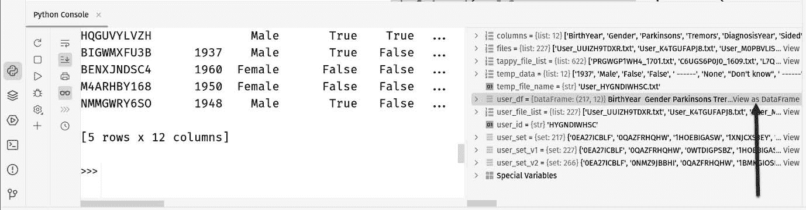

图 14.11：我们最新单元格的运行结果显示我们有一个填充的 pandas DataFrame

记住，你可以通过点击*图 14.11*中箭头所指的**以 DataFrame 查看**按钮在**SciView**中查看 DataFrame。我的显示在*图 14.12*中：

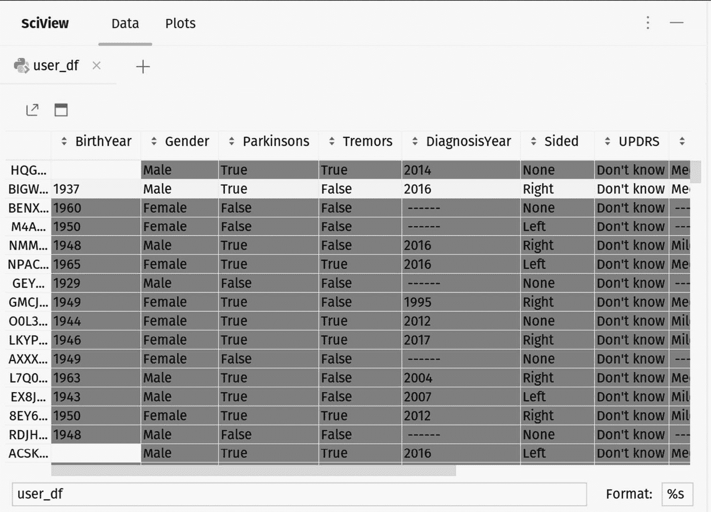

图 14.12：在 PyCharm 中查看我在上一步创建的 DataFrame 既简单又多彩

从这里我可以看出，我还有很多工作要做。诊断年份很混乱，其他一些字段也是如此。让我们继续一点一点地解决它。

## 数据清洗

现在我们已经可以看到我们的数据以表格格式呈现，有一些方法可以帮助我们改进数据的格式，以便在可能选择的任何维度上执行数值分析。

### 将数值数据转换为实际数字

我们下一个单元格包含几行代码，用于将数值值转换为数值类型。记住，所有数据都是以文本形式进入的，并且直到你告诉 pandas 否则，它们都被当作字符串处理。以下是该单元格的代码：

```py
#%% Change numeric data into appropriate format
# force some columns to have numeric data type
user_df['BirthYear'] = pd.to_numeric(user_df['BirthYear'], errors='coerce')
user_df['DiagnosisYear'] = pd.to_numeric(user_df['DiagnosisYear'], errors='coerce')
```

应用程序程序员可能会倾向于逐行处理数据，逐字段处理类型转换。pandas 的好处在于，一旦你的数据在 DataFrame 中，你就可以对整个行和列进行操作。

在这段代码中，我们正是这样做的。`BirthYear` 和 `DiagnosisYear` 正在使用 `pd.to_numeric` 方法转换为数字。第二个参数 `errors='coerce'` 将尝试强制数据转换为数值类型。如果不可能，例如，当值是 “`-------`”（一串破折号），就像我们在 `NaN` 中看到的那样，或者 “不是数字”。虽然 `NaN` 在计算上没有价值，但它至少将所有非数值值标准化为这个值，这将使我们在选择忽略这些行时更容易。

提到 `NaN` 也意味着是时候在你妈妈的坦度炉里烤一些美味的面包了。一些作者做 Patreon，我烤面包，但必须是你的妈妈的食谱。这意味着你必须给她打电话，告诉她你爱她。现在就做，即使她没有坦度炉，不能烤面包！我会等着。

当你在电话上时，我运行了单元格；我的结果显示在 *图 14**.13* 中：

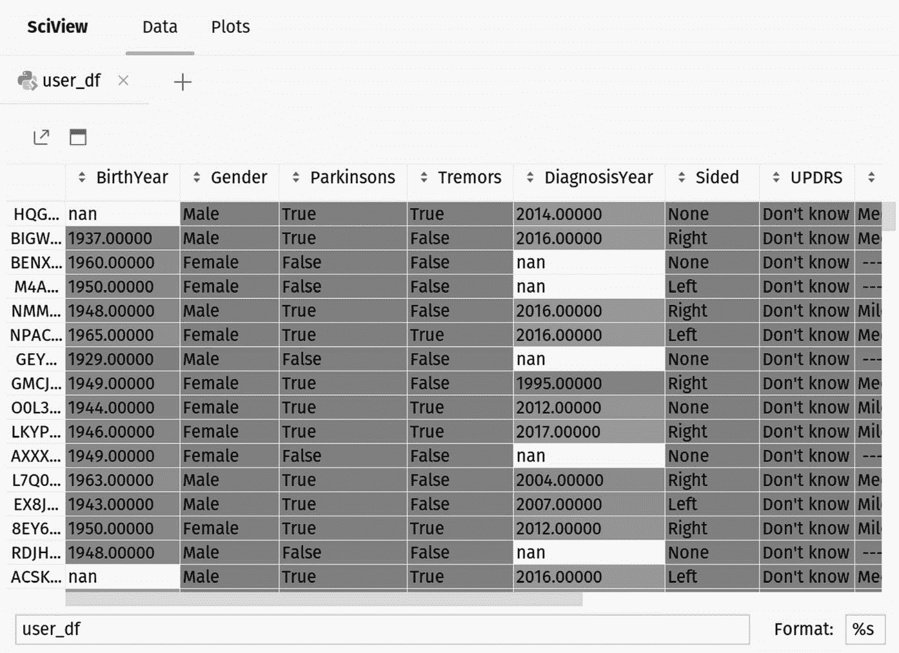

图 14.13：年份字段实际上不是数字。无论在哪里有无效数据，我们现在都看到一个标准化的 nan 值

### 二值化数据

我们可以在任何可以将数据转换为本质上二进制的地方进行转换。在我们的数据中，性别以两种可能值报告，即男性和女性，表示可以用二进制格式表示的可能性。同样，许多字段都呈现为二进制，如下所示：

```py
Parkinsons: True
Tremors: True
Levodopa: True
DA: True
MAOB: False
Other: False
```

在这些情况下，我们只需要将值标准化为实际的二进制值，这可能会导致重命名或扩展我们的字段名称列表。让我们看看单元格代码：

```py
#%% "Binarize" true-false data
user_df = user_df.rename(index=str, columns={'Gender': 'Female'})
user_df['Female'] = user_df['Female'] == 'Female'
user_df['Female'] = user_df['Female'].astype(int)
```

在前面的代码中，我们将 DataFrame 中的列名从 `Gender` 改为 `Female`。第二行将新列中每行的值更改为与单词 `Female` 进行比较的表达式的结果。它要么是 `Female`，要么不是，因此我们得到 `True` 或 `False` 的值。第三行将布尔类型转换为整数，使其更适合分析。

接下来，我们将关注之前列出的列，并执行相同的转换。这次，我们在表达式中检查单词 `True`。值要么是 `True`，要么不是，这会产生布尔值：

```py
str_to_binary_columns = ['Parkinsons', 'Tremors', 'Levadopa', 'DA', 'MAOB', 'Other'] # columns to be converted to binary data
for column in str_to_binary_columns:
  user_df[column] = user_df[column] == 'True'
  user_df[column] = user_df[column].astype(int)
```

运行此代码会导致我们的 DataFrame 发生变化，如图 *图 14**.14* 所示：

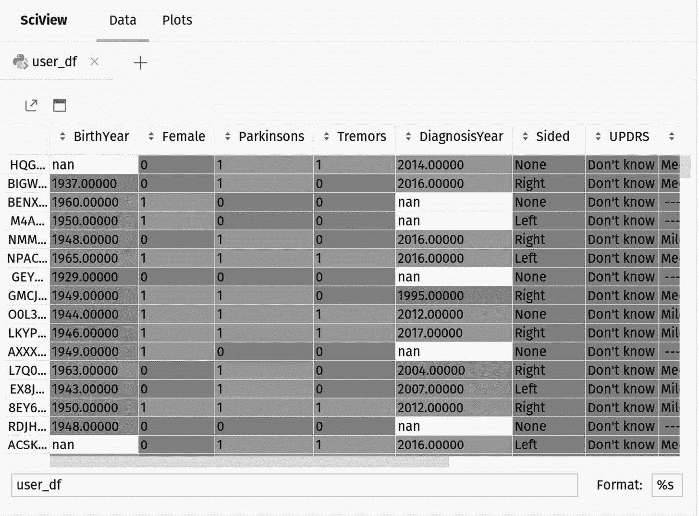

图 14.14：我们已经成功地将字段二值化

我们可以看到，我们的字段现在都是二进制数字！这将使后续工作更容易！

让我们跳到下一个单元格，因为代码的第一部分正在进行一些清理工作，类似于我们之前所做的那样。在单元格的第一部分，我们正在清理`Impact`字段。我们将任何不是`Mild`、`Medium`或`Severe`的值标准化为`None`：

```py
# prior processing for `Impact` column
user_df.loc[
  (user_df['Impact'] != 'Medium') &
  (user_df['Impact'] != 'Mild') &
  (user_df['Impact'] != 'Severe'), 'Impact'] = 'None'
```

接下来，在保持同一单元格的同时，我们将探索一个强大且流行的技术，该技术被机器学习算法在准备数据分析数据时使用。

### 独热编码

由于某种原因，当我第一次听到**独热编码**这个词时，我立刻想到了热狗，还有我多么希望能在美味的蒸面包上用芥末和甜美酱编码一个，或者也许是我要发送给你的 NaN。记录在案，我知道面包的拼写不是这样的，我也不在乎。只有当我拼错时，这个笑话才有效。我不知道为什么我要告诉你这些，但就是这样。

独热编码是一种技术，它允许你将不是固有的布尔值的数据转换为布尔值。当我正在寻找一辆新的 Jeep Wrangler 时，我只考虑了少数几种颜色：

+   爆竹红

+   海洋蓝金属色

+   莫吉托！

+   Hellayella

还有更多的颜色，但它们都是黑色、白色或灰色的无聊变体。我无法得到一辆橙色的吉普车，因为人们会认为我去了俄克拉荷马州立大学，我们不能有那样的事情。我可以忽略那些颜色，留下一个可以放在页面上的列表。现在，让我们对这个列表进行独热编码：

| **Color_Firecracker_Red** | **Color_Ocean_Blue_Metallic** | **Color_Mojito** | **Color_Hellayella** |
| --- | --- | --- | --- |
| 1 | 0 | 0 | 0 |
| 0 | 1 | 0 | 0 |
| 0 | 0 | 1 | 0 |
| 0 | 0 | 0 | 0 |
| 0 | 0 | 0 | 1 |

你可以轻松地看到如何进行独热编码——它将字段旋转并使它们变为二进制。如果你是关系型数据库的大师，你可能刚刚失去了你的午餐。数据科学家做事的方式略有不同。在独热编码表示中，每个观察值在其类别对应的列中得到一个“1”，在其他所有列中得到一个“0”。这种编码确保了分类信息以机器学习算法可以理解和有效使用的方式被保留。记录在案，我选择了*Hellayella*，基于这样的想法：如果我的吉普车被卡在某个无法到达的地方，比如大弯国家公园的沙漠中，或者东德克萨斯州深处的松树林地区，救援直升机会很容易找到我的尸体。

独热编码通常用于诸如分类变量等特征，这些特征不能直接用作许多机器学习算法的数值输入。它是数据预处理的重要步骤，将此类变量转换为适合训练模型的合适格式。

让我们回到当前单元格的代码。我们已经解释了前几行，所以让我们继续设置对多个字段进行独热编码：

```py
to_dummy_column_indices = ['Sided', 'UPDRS', 'Impact'] # columns to be one-hot encoded
```

我们将要编码这三个列。考虑中的一个列是`Impact`列，我们刚刚将其标准化作为这一步的引导。我们将在这里对这三个列执行 one-hot 编码：

```py
for column in to_dummy_column_indices:
  user_df = pd.concat([
    user_df.iloc[:, : user_df.columns.get_loc(column)],
    pd.get_dummies(user_df[column], prefix=str(column)),
    user_df.iloc[:, user_df.columns.get_loc(column) + 1 :]
  ], axis=1)
print(user_df.head())
```

在循环中，代码执行以下步骤：

1.  `user_df.iloc[:, : user_df.columns.get_loc(column)]`：选择当前正在处理的列左侧的列。这保留了正在 one-hot 编码之前的列。

1.  `pd.get_dummies(user_df[column], prefix=str(column))`：使用`pd.get_dummies()`方法对当前列进行 one-hot 编码。它创建一个具有二进制列的 DataFrame，代表列中的不同类别。`prefix`参数为列名添加前缀，以指示它们是从哪个原始列派生出来的。

1.  `user_df.iloc[:, user_df.columns.get_loc(column) + 1 :]`：选择当前正在处理的列右侧的列。这保留了正在 one-hot 编码之后的列。

当输入到`pd.concat`方法中时，这些步骤有效地将三个分类列替换为 one-hot 编码的二进制列，同时保持 DataFrame 的其余部分完整。当您运行单元格时，您应该看到像我一样的结果，如*图 14.15*所示：

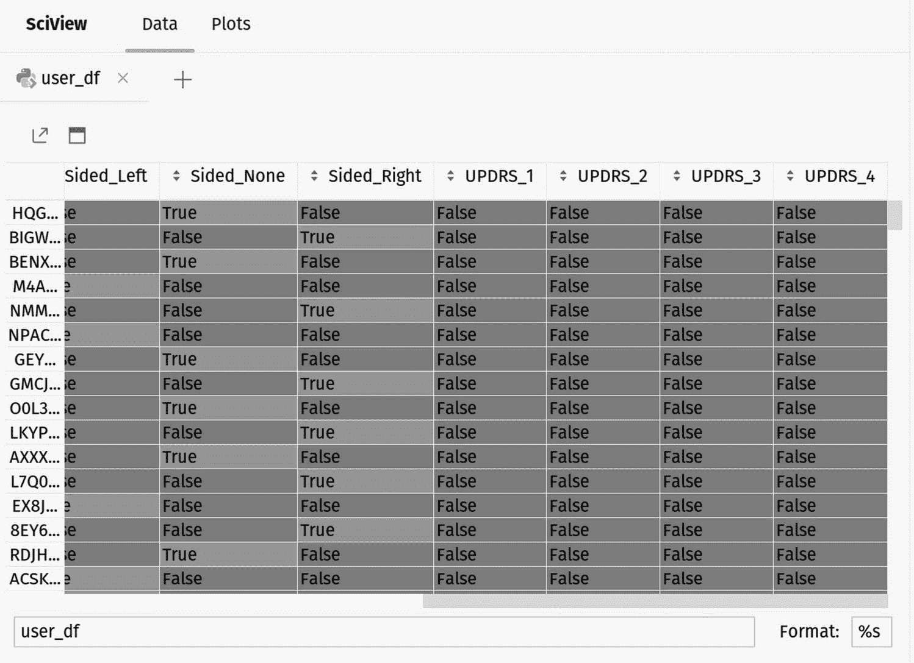

图 14.15：我已经向右滚动，以便您可以看到新添加的 one-hot 编码列

One-hot 编码将在 DataFrame 中添加许多新列，因此您可能需要向右滚动才能看到它们全部。

## 探索第二个数据集

在我们的用户数据被相当干净地整理并存储在 pandas DataFrame 中后，我们现在准备处理 Tappy 数据。为了使内容更具相关性，我将任意选择`Tappy Data`集中的一个文件。让我们看看下一个单元格中的代码：

```py
#%% Explore the second dataset
file_name = '0EA27ICBLF_1607.txt'
```

正如我说的，我随机选择了一个文件来检查。我们之前打开了一个这样的文件，并注意到它们都是制表符分隔的格式。pandas 有一个方法可以直接将此类文件直接读入 DataFrame。尽管该方法被称为`read_csv`，但您可以指定一个分隔符，它不必是逗号。该方法将读取任何类型的分隔文件：

```py
df = pd.read_csv(
  'data/Tappy Data/' + file_name,
  delimiter = '\t',
  index_col = False,
  names = ['UserKey', 'Date', 'Timestamp', 'Hand', 'Hold time', 'Direction', 'Latency time', 'Flight time']
)
```

对于我们的目的，我们不需要`UserKey`字段：

```py
df = df.drop('UserKey', axis=1)
print(df.head())
```

当我们运行这个单元格时，我们创建了一个名为`df`的新 DataFrame。请确保从*图 14.16*中显示的控制台变量面板中选择它：

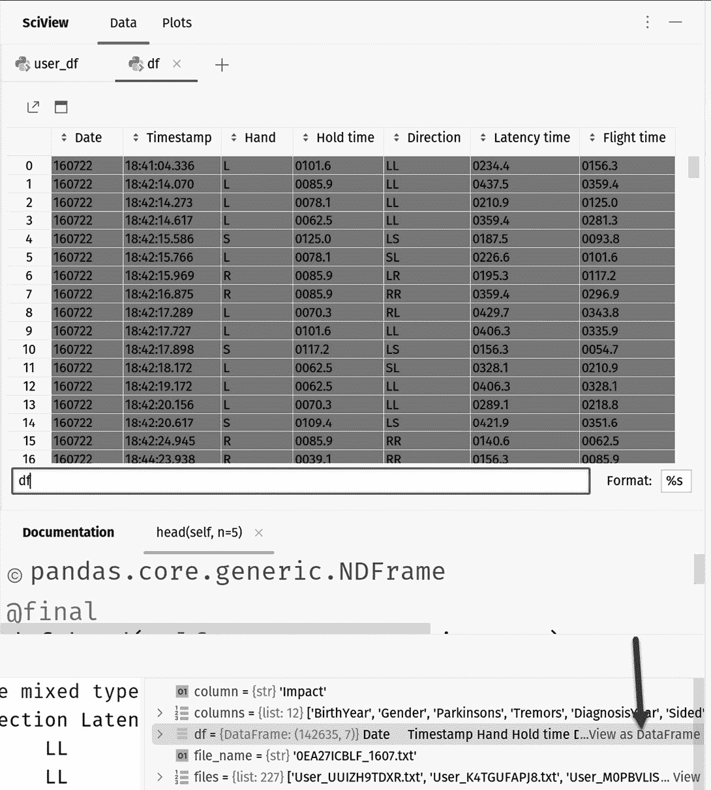

图 14.16：可以通过点击“查看为 DataFrame”按钮来查看我们的新 DataFrame

### 格式化日期时间数据

下一个单元格修复我们的`datetime`数据：

```py
#%% Format datetime data
```

这第一行尝试强制`Date`列中的值成为日期。如果强制转换不起作用，我们将看到`NaT`（不是一个时间），这很令人失望，因为没有食物玩笑可以讲。接下来，我们将在`Hold time`、`Latency time`和`Flight` `time`字段上进行更多的强制转换：

```py
df['Date'] = pd.to_datetime(df['Date'], errors='coerce', format='%y%M%d').dt.date
# converting time data to numeric
for column in ['Hold time', 'Latency time', 'Flight time']:
  df[column] = pd.to_numeric(df[column], errors='coerce')
```

任何缺少时间数据的观察结果都应该被删除：

```py
df = df.dropna(axis=0)
```

让我们打印出结果以供检查：

```py
print(df.head())
```

让我们运行它！我的单元格运行结果显示在*图 14**.17*中：

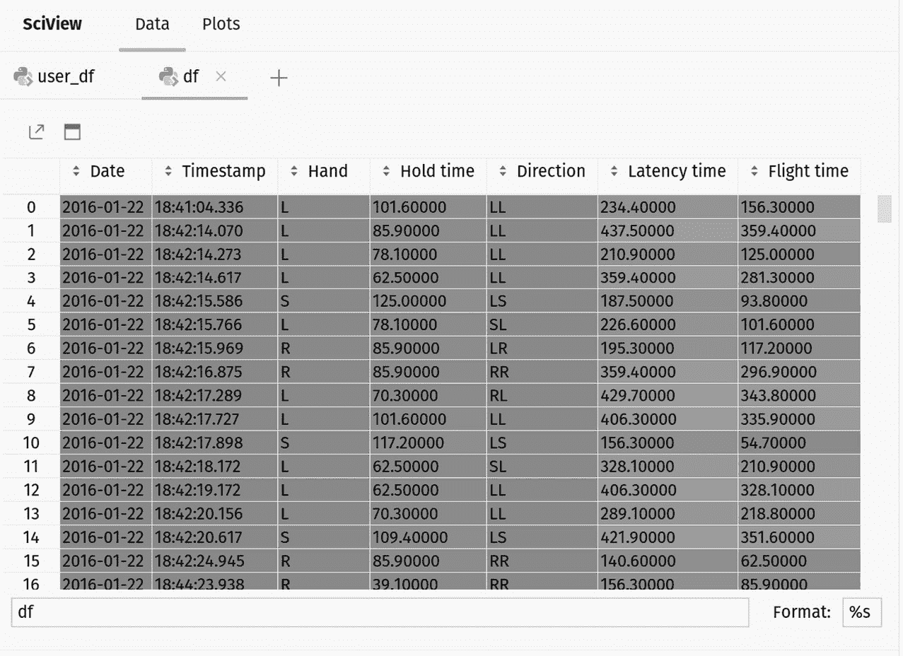

图 14.17：我们的日期时间数据现在是数值型，任何缺少时间数据的观察结果，因为无用，已被删除

### 洗手并确定方向

下一个单元格清理了手和方向列：

```py
# cleaning data in Hand
df = df[
  (df['Hand'] == 'L') |
  (df['Hand'] == 'R') |
  (df['Hand'] == 'S')
]
```

这段代码使用逻辑“或”来过滤掉任何不具有`L`、`R`或`S`值的值。由于它被表示为“或”，任何超出三个期望可能性的值都将返回为`false`，并被排除。

让我们用同样的方法处理方向，它有更多的可能性：

```py
# cleaning data in Direction
df = df[
  (df['Direction'] == 'LL') |
  (df['Direction'] == 'LR') |
  (df['Direction'] == 'LS') |
  (df['Direction'] == 'RL') |
  (df['Direction'] == 'RR') |
  (df['Direction'] == 'RS') |
  (df['Direction'] == 'SL') |
  (df['Direction'] == 'SR') |
  (df['Direction'] == 'SS')
]
```

当然，我们会打印出结果：

```py
print(df.head())
```

好的，运行这个单元格。所有包含无效数据的行都已删除。这个结果不像大多数那样直观，所以我认为我们不需要为这个结果截图。

### 总结数据

我们下一个单元格提供了一个如何总结我们数据的例子，这是我们一直在努力设置以进行分析的。我们已经准备好了！让我们尝试一些简单的东西。像往常一样，单元格中的第一行代码只是标记单元格的开始：

```py
#%% Group by direction (hand transition)
```

回想一下，我们到目前为止一直在处理的是特定时间特定主题的打字速度数据。一个主题（`User`）只是我们第一个数据集中单个数据点，我们希望以某种方式将两个数据集结合起来，因此我们需要一种方法来聚合我们当前的数据到一个单一的数据点。

由于我们正在处理数值数据（打字时间），我们可以通过对不同列的时间数据进行平均（平均值）来总结给定用户的数据。我们可以使用 pandas 的`groupby()`函数来实现这一点：

```py
 direction_grouped_df = df.groupby('Direction')[numeric_columns].mean()
```

当然，我们应该打印它：

```py
print(direction_grouped_df)
```

运行结果显示在*图 14**.18*中。代码将结果放入一个新的 DataFrame 中，名为`direction_group_df`，所以请确保您按照图中的方式选择它：

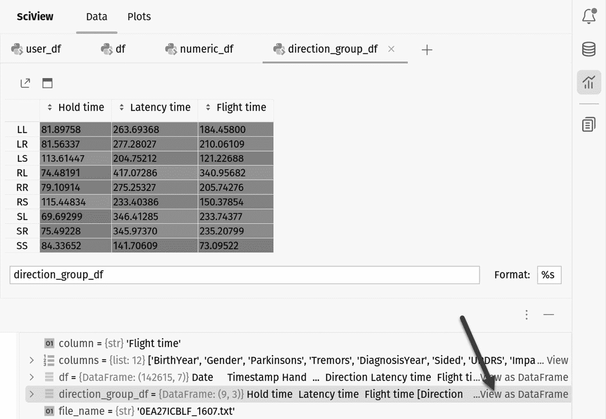

图 14.18：太好了！我们得到了第一个计算洞察！

这很令人兴奋！我们已经让机制工作起来，但现在，我们需要专注于让它能够处理多个数据文件，而不仅仅是单个文件。

## 为扩展进行重构

我们对 Tappy 数据的探索主要集中在单个文件上，以便以易于验证的方式确认我们的代码正在正常工作。我们已经确定它是可行的，因此现在，我们应该重构我们的代码，以便我们可以处理成千上万的文件。为此，我们应该将一些单元格合并成一个函数。下一个单元格中的代码虽然很长，但很熟悉，因为它只是我们将到目前为止所写的所有代码合并成一个函数的结果。如果你是一个应用程序开发者，并且理解被称为**单一职责原则**（**SRP**）的设计原则，你知道这是一个反模式。然而，请记住，这并不是应用程序代码。没有人会运行这段代码来执行分析之外的操作，因此通常适用于软件开发中的 SOLID 原则的严格性在数据科学工作中并未得到体现。

### 使用一个函数处理 Tappy 数据

这里是函数：

```py
#%% Combine into one function
def read_tappy(file_name):
```

在这里，我们正在读取作为函数参数传递的 CSV 文件名。我们使用硬编码的字段名丰富数据：

```py
  df = pd.read_csv(
    'data/Tappy Data/' + file_name,
    delimiter='\t',
    index_col=False,
    names=['UserKey', 'Date', 'Timestamp', 'Hand', 'Hold time',
        'Direction', 'Latency time', 'Flight time']
  )
```

我们删除了不需要的列：

```py
  df = df.drop('UserKey', axis=1)
```

我们修正了日期：

```py
  df['Date'] = pd.to_datetime(df['Date'], errors='coerce', format='%y%M%d').dt.date
  # Convert time data to numeric
  for column in ['Hold time', 'Latency time', 'Flight time']:
    df[column] = pd.to_numeric(df[column], errors='coerce')
  df = df.dropna(axis=0)
```

总是通过去除无效值来洗手：

```py
  # Clean data in `Hand`
  df = df[
    (df['Hand'] == 'L') |
    (df['Hand'] == 'R') |
    (df['Hand'] == 'S')
    ]
```

对方向数据值也做同样的处理：

```py
  # Clean data in `Direction`
  df = df[
    (df['Direction'] == 'LL') |
    (df['Direction'] == 'LR') |
    (df['Direction'] == 'LS') |
    (df['Direction'] == 'RL') |
    (df['Direction'] == 'RR') |
    (df['Direction'] == 'RS') |
    (df['Direction'] == 'SL') |
    (df['Direction'] == 'SR') |
    (df['Direction'] == 'SS')
    ]
```

我们正在做数学运算！这是手动 GC 过程介入的地方。我们洗手洗得很好，对吧？在以下代码中，我们正在进行计算。结果作为新的 DataFrame 返回，因此为了节省内存，我们在进行过程中删除旧的 DataFrames。这释放了内存，因为这种工作对内存密集型：

```py
     direction_group_df = df.groupby('Direction')[numeric_columns][numeric_columns][numeric_columns] direction_group_df = df.groupby('Direction')[numeric_columns].mean()
  del df
  gc.collect()
```

使用我们新的结果，我们重新索引然后排序：

```py
  direction_group_df = direction_group_df.reindex(
    ['LL', 'LR', 'LS', 'RL', 'RR', 'RS', 'SL', 'SR', 'SS'])
  direction_group_df = direction_group_df.sort_index() # to ensure correct order of data
```

这行代码返回一个展平的 NumPy 数组，其中包含分组数据的均值。`.values.flatten()` 方法将 DataFrame 转换为二维 NumPy 数组，然后将其展平为一维数组，以便于使用：

```py
  return direction_group_df.values.flatten()
```

### 使用函数处理用户

在同一个单元格中还有一个第二个功能：

```py
def process_user(user_id, filenames):
  running_user_data = np.array([])
```

这行代码初始化了一个名为 `running_user_data` 的空 NumPy 数组。这个数组将在函数遍历文件名时累积数据，这正是以下代码块所做的工作：

```py
  for filename in filenames:
    if user_id in filename:
      running_user_data = np.append(running_user_data, read_tappy(filename))
```

这个循环遍历文件名列表。如果提供的用户 ID 在文件名中找到，它将调用 `read_tappy()` 函数（该函数返回包含均值值的展平 NumPy 数组）并将内容追加到 `running_user_data` 数组中。

在遍历文件名并追加数据后，以下行将 `running_user_data` 数组重塑为二维数组，每行包含 27 列。这种时间数据的展平允许进行进一步的分析：

```py
  running_user_data = np.reshape(running_user_data, (-1, 27))
```

最后一行使用 `np.nanmean()` 函数计算 `running_user_data` 数组沿行（`axis=0`）的均值。`np.nanmean()` 函数在计算均值时忽略 `NaN` 值：

```py
  return np.nanmean(running_user_data, axis=0)
```

总结一下，`process_user`函数通过迭代相关文件名，使用`read_tappy`函数聚合数据，重塑数据，并计算平均值（忽略`NaN`值），来处理特定用户的数据。最终结果是数据每一列的平均值数组。

### 处理所有数据

这是为了所有宝石！下面的单元处理所有可用用户的数据，通过聚合和基于 Tappy 数据计算平均值。首先，有一些家务要做。我们将忽略任何警告：

```py
#%% Run through all available data
import warnings
warnings.filterwarnings("ignore")
```

我们将再次访问`Tappy`数据文件夹：

```py
filenames = os.listdir('data/Tappy Data/')
```

接下来，我们将为最终的 DataFrame 创建一些列名：

```py
column_names = [first_hand + second_hand + '_' + time
        for first_hand in ['L', 'R', 'S']
        for second_hand in ['L', 'R', 'S']
        for time in ['Hold time', 'Latency time', 'Flight time']]
user_tappy_df = pd.DataFrame(columns=column_names)
```

接下来，让我们遍历用户索引并使用我们的`process_user`函数：

```py
for user_id in user_df.index:
  user_tappy_data = process_user(str(user_id), filenames)
  user_tappy_df.loc[user_id] = user_tappy_data
```

接下来的几行通过确保任何 NaN 值被替换为零，以及任何负数值也被归一化到零，进行了一些中间清理：

```py
user_tappy_df = user_tappy_df.fillna(0)
user_tappy_df[user_tappy_df < 0] = 0
```

然后，我们将像从未打印过一样打印！好吧，这不是真的——我们经常这样做：

```py
print(user_tappy_df.head())
```

### 保存处理后的数据

最后一个代码单元可能不需要太多解释：

```py
#%% Save processed data
```

首先，我们将两个 DataFrame 连接起来：

```py
combined_user_df = pd.concat([user_df, user_tappy_df], axis=1)
print(combined_user_df.head())
```

最后，我们将其保存到 CSV 文件中：

```py
combined_user_df.to_csv('data/combined_user.csv')
```

这通常在给定的数据管道中是一个好的实践。保存数据集的处理和清理版本可以在过程中出现问题时为数据工程师节省大量精力。它也提供了灵活性，如果我们想改变或进一步扩展我们的管道，它也提供了灵活性。

在我们开始真正的分析工作之前，我将在 PyCharm 中打开 CSV 文件进行最后一次查看。你可以看到我的*图 14.19*：

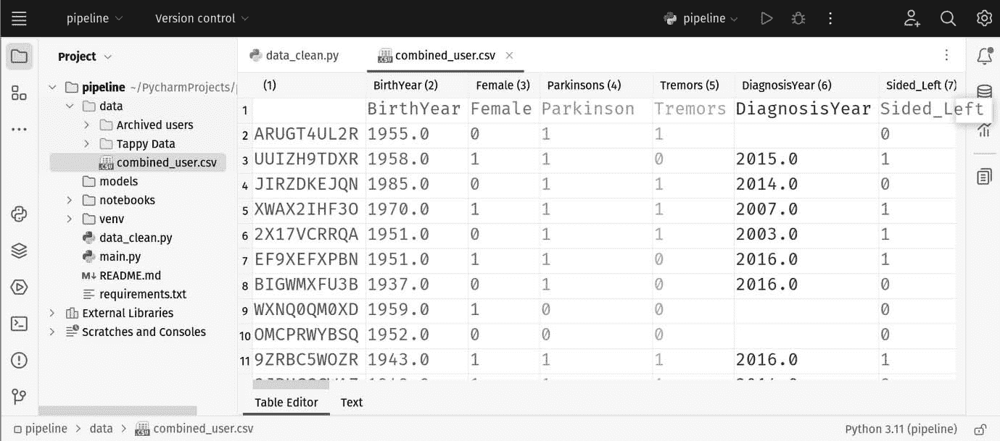

图 14.19：我们的辛勤工作得到了回报！我们的数据已准备好分析

这样，我们就准备好探索我们的数据集并寻找洞察了。

# 数据分析和洞察

记得我们之前提到的，在开始数据科学项目时，心中要有问题意识的重要性吗？这一点在这个阶段尤其正确，在这个阶段，我们将探索我们的数据集并提取洞察，这些都应围绕我们的初始问题展开——打字速度与患者是否患有 PD 之间的联系。

在本节中，我们将使用位于当前项目`notebooks`文件夹中的`EDA.ipynb`文件。在接下来的子节中，我们将查看这个`notebooks`文件夹中包含的代码。请打开这个 Jupyter 笔记本到你的 PyCharm 编辑器中，或者，如果你正在跟随我们的讨论并输入自己的代码，创建一个新的 Jupyter 笔记本。

## 启动笔记本并读取我们的处理数据

记住，当你用 Python 打开一个 Jupyter 笔记本时，你可以看到代码，但除非你点击**运行**按钮，否则 Jupyter 不会运行。你可以在*图 14.20*中看到 PyCharm 已经准备好了：

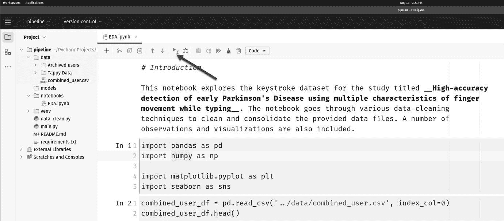

图 14.20：笔记本已打开，我已点击第一个单元格（In 1），现在我将点击箭头所示的运行按钮

一旦你点击**运行**按钮，Jupyter 服务器将启动并运行笔记本中的第一个单元格，该单元格处理我们的导入并读取我们的清洗后的数据集：

```py
import pandas as pd
import numpy as np
import matplotlib.pyplot as plt
import seaborn as sns
combined_user_df = pd.read_csv('../data/combined_user.csv', index_col=0)
combined_user_df.head()
```

由于最后一行让我们打印输出前五行，你将看到它们出现在代码下方，并紧挨着一个标记为**Out 2**的标记，如图*图 14.21*所示：

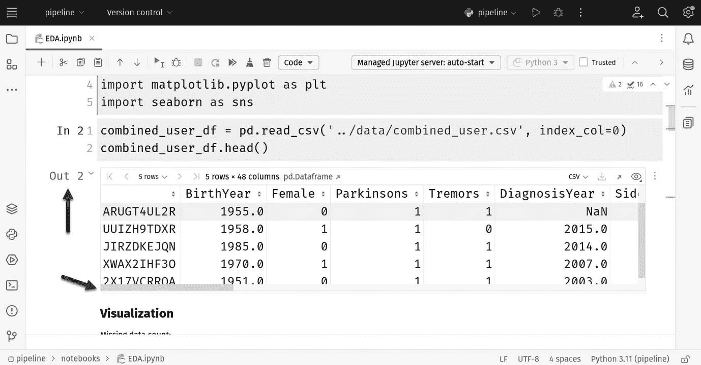

图 14.21：In 2 中的头部语句输出显示在 Out 2 中，并且可以水平滚动

现在我们已经加载了清洗后的数据，我们可以继续进行数据分析技术。

# 使用图表和图形

可视化通常是大多数工作的最终目标，因此对我来说，这是一个自然的下一步。我将首先创建一个条形图，以显示数据中唯一值的计数分布。我认为这可能会让我们对哪个因素会影响本研究中的因变量有所了解，这个因变量是是否患有早发性 PD。然而，仍然存在问题。如图*图 14.21*所示，在开始认真分析之前，我需要考虑数据中的一些空白。

我将要做的第一件事是创建一个条形图来可视化我们的缺失数据。以下代码单元格处理此操作：

```py
#%%
missing_data = combined_user_df.isnull().sum()
g = sns.barplot(x=missing_data.index, y=missing_data)
g.set_xticklabels(labels=missing_data.index, rotation=90)
plt.show()
```

运行此代码将产生如图*图 14.22*所示的可视化：

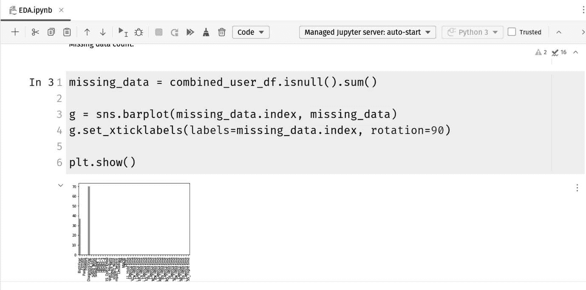

图 14.22：缺失数据在柱状图中进行了可视化

幸运的是，我们的图表非常稀疏。只有少量数据缺失或不完整。对于`BirthYear`和`DiagnosisYear`有一些缺失值。你甚至可以在*图 14.21*的预览中看到其中一个。分析缺失值很重要，我们将在稍后回到填充这些值的流程。但现在，让我们继续可视化过程。

Matplotlib 的一个很棒的功能是子图，它允许我们并排生成多个可视化。在下面的代码单元格中，我们使用此功能创建多个可视化，以突出显示患有和未患有帕金森病的患者之间的潜在差异：

```py
#%%
f, ax = plt.subplots(2, 2, figsize=(20, 10))
sns.distplot(
combined_user_df.loc[combined_user_df['Parkinsons'] == 0,
'BirthYear'].dropna(axis=0),
kde_kws = {'label': "Without Parkinson's"},
ax = ax[0][0]
)
sns.distplot(
combined_user_df.loc[combined_user_df['Parkinsons'] == 1,
'BirthYear'].dropna(axis=0),
kde_kws = {'label': "With Parkinson's"},
ax = ax[0][1]
)
sns.countplot(x='Female', hue='Parkinsons', data=combined_user_df, ax=ax[1][0])
sns.countplot(x='Tremors', hue='Parkinsons', data=combined_user_df, ax=ax[1][1])
plt.show()
```

运行此代码单元格后，将生成如图*图 14.23*所示的可视化：

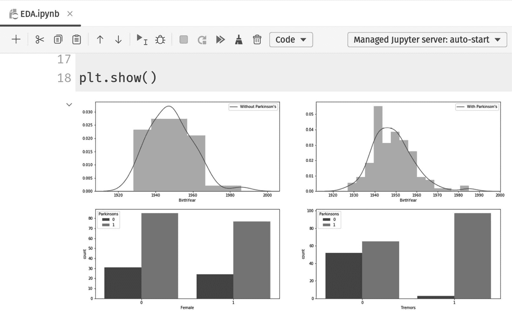

图 14.23：从前一个单元格中绘制出的四个图表

顶部两个可视化表示有帕金森病（右上角）和无帕金森病（左上角）的人的出生年份分布。我们可以看到这些分布大致遵循正态钟形曲线。如果你遇到偏斜或形状奇怪的分布，可能值得进一步挖掘那些数据。注意，我们也可以将相同的可视化应用于`诊断年份`列。

在左下角的视觉图中，我们有一个柱状图，表示男性患者（左侧两根柱状图）和女性患者（右侧两根柱状图）的数量。帕金森病患者用橙色柱状图表示，无帕金森病患者用蓝色柱状图表示。在这个可视化中，我们可以看到虽然患病的患者比无病患者多，但两性之间的分布大致相同。

另一方面，右下角的可视化展示了患有震颤（右侧两根柱状图）和无震颤（左侧两根柱状图）的患者的差异。从这个可视化中，我们可以看到震颤在帕金森病患者中显著更常见，这一点相当直观，也可以作为我们到目前为止分析的合理性检查。

接下来，我们将转向箱线图。具体来说，我们将使用箱线图来可视化有和无帕金森病的患者在不同的时间数据（`保持时间`、`延迟时间`和`飞行时间`）中的分布。再次使用子图功能来同时生成多个可视化：

```py
#%%
column_names = [first_hand + second_hand + '_' + time
for first_hand in ['L', 'R', 'S']
for second_hand in ['L', 'R', 'S']
for time in ['Hold time', 'Latency time', 'Flight time']]
f, ax = plt.subplots(3, 3, figsize=(10, 5))
plt.subplots_adjust(
right = 3,
top = 3
)
for i in range(9):
temp_columns = column_names[3 * i : 3 * i + 3]
stacked_df = combined_user_df[temp_columns].stack().reset_index()
stacked_df = stacked_df.rename(
columns={'level_0': 'index', 'level_1': 'Type', 0: 'Time'})
stacked_df = stacked_df.set_index('index')
for index in stacked_df.index:
stacked_df.loc[index, 'Parkinsons'] = combined_user_df.loc[index,
'Parkinsons']
sns.boxplot(x='Type', y='Time',
hue='Parkinsons',
data=stacked_df,
ax=ax[i // 3][i % 3]
).set_title(column_names[i * 3][: 2], fontsize=20)
plt.show()
```

在这个代码单元格中，每个子图将可视化特定方向类型（`LL`、`LR`、`LS`等）的数据，并将包含表示有病和无病患者的不同分割。你应该获得*图 14.24*所示的可视化。

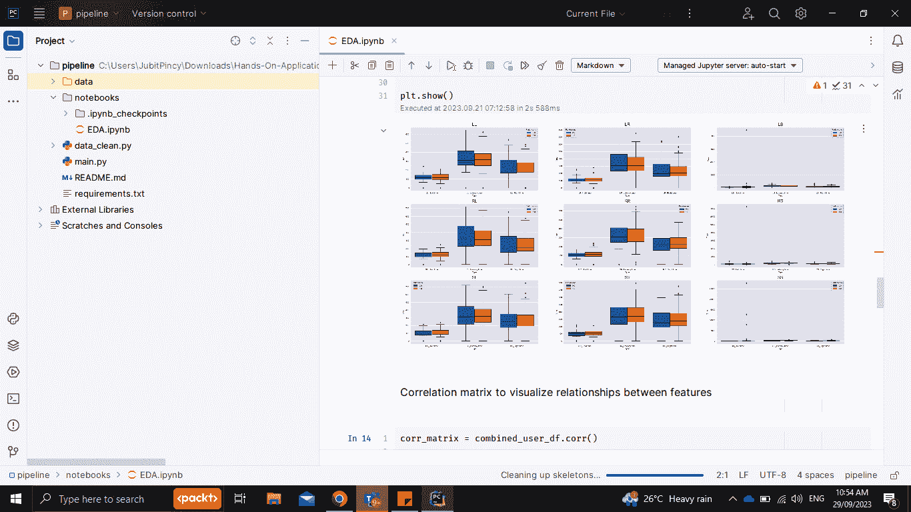

图 14.24：前一个运行单元格的图表

从这个可视化中我们可以得出，令人惊讶的是，无帕金森病患者打字速度的分布可以跨越更高的值，并且比帕金森病患者有更多的变异性，这可能与一些人的直觉相矛盾，即帕金森病患者按键盘键需要更多的时间。

总体而言，柱状图、分布图和箱线图是数据科学任务中最常见的可视化技术之一，主要是因为它们既易于理解，又足够强大，能够突出我们数据集中的重要模式。在接下来和最后的关于数据分析主题的子节中，我们将考虑更高级的技术——即属性之间的相关矩阵和利用机器学习模型。

# 基于机器学习的见解

与之前分析的方法不同，本小节中讨论的方法和其他类似方法基于更复杂的数学模型和 ML 算法。鉴于本书的范围，我们不会深入探讨这些模型的具体理论细节，但仍然值得通过将它们应用于我们的数据集来观察它们的一些实际应用。

首先，让我们考虑我们的数据集的特征相关矩阵。正如其名称所暗示的，该模型是一个矩阵（一个二维表），其中包含我们数据集中每对数值属性（或特征）之间的相关性。两个特征之间的相关性是一个介于-1 和 1 之间的实数，表示相关性的大小和方向。值越高，两个特征的相关性越强。

要从 pandas DataFrame 中获得特征相关矩阵，我们必须调用`corr()`方法，如下所示：

```py
corr_matrix = combined_user_df.corr()
```

我们通常使用热图来可视化相关矩阵，如同一代码单元格中实现的那样：

```py
f, ax = plt.subplots(1, 1, figsize=(15, 10))
sns.heatmap(corr_matrix)
plt.show()
```

此代码将产生*图 14.25*所示的可视化：

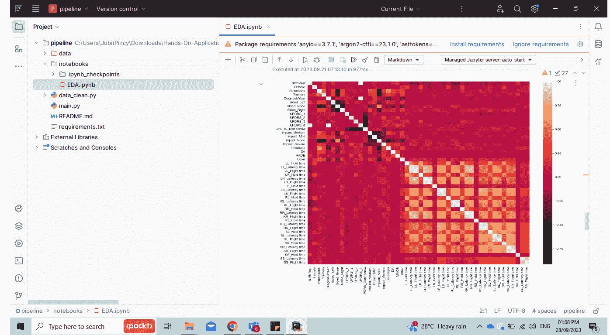

图 14.25：热图非常适合可视化相关矩阵

接下来，我们将尝试将 ML 模型应用于我们的数据集。与普遍看法相反，在许多数据科学项目中，我们并不利用 ML 模型进行预测任务，即训练我们的模型以预测未来的数据。相反，我们将数据集输入到特定的模型中，以便我们可以从中提取更多见解。

在这里，我们使用 scikit-learn 中的线性**支持向量分类器**（**SVC**）模型来分析我们的数据，并返回特征重要性列表：

```py
#%%
from sklearn.svm import LinearSVC
combined_user_df['BirthYear'].fillna(combined_user_df['BirthYear'].mode(dropna=True)[0], inplace=True)
combined_user_df['DiagnosisYear'].fillna(combined_user_df['DiagnosisYear'].mode(dropna=True)[0], inplace=True)
X_train = combined_user_df.drop(['Parkinsons'], axis=1)
y_train = combined_user_df['Parkinsons']
clf = LinearSVC()
clf.fit(X_train, y_train)
nfeatures = 10
coef = clf.coef_.ravel()
top_positive_coefs = np.argsort(coef)[-nfeatures :]
top_negative_coefs = np.argsort(coef)[: nfeatures]
top_coefs = np.hstack([top_negative_coefs, top_positive_coefs])
```

注意，在我们将数据输入到 ML 模型之前，我们需要填写我们在之前确定的两个列中存在的缺失值——`BirthYear`和`DiagnosisYear`。大多数 ML 模型都不能很好地处理缺失值，这取决于数据工程师选择如何填充这些值。

在这里，我们使用模型之后的`coef_`属性。

此属性包含特征重要性列表，该列表通过代码的最后部分进行可视化：

```py
plt.figure(figsize=(15, 5))
colors = ['red' if c < 0 else 'blue' for c in coef[top_coefs]]
plt.bar(np.arange(2 * nfeatures), coef[top_coefs], color=colors)
feature_names = np.array(X_train.columns)
# Make sure the number of tick locations matches the number of tick labels.
plt.xticks(np.arange(0, 2 * nfeatures), feature_names[top_coefs], rotation=60, ha='right')
plt.show()
```

运行此代码将产生*图 14.26*所示的可视化：

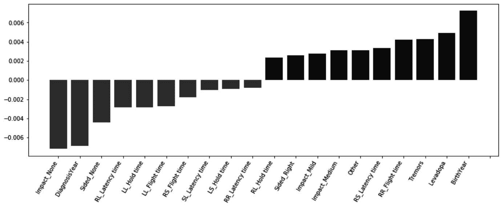

图 14.26：特征重要列表的图表显示了在训练 ML 模型时广泛使用的特征

从特征重要性列表中，我们可以识别出在训练过程中被 ML 模型广泛使用的任何特征。具有非常高的重要性值的特征可能与目标属性（某人是否患有帕金森病）以某种有趣的方式进行关联。例如，我们可以看到`震颤`（我们知道它与我们的目标属性高度相关）是我们当前 ML 模型的第三重要特征。

那就是关于分析我们数据集的最后一个讨论点。在本章的最后部分，我们将简要讨论如何为 Python 数据科学项目编写脚本。

# 数据科学中的脚本与笔记本

在前面的数据科学流程中，有两个主要部分：数据清洗，其中我们删除不一致的数据，填补缺失数据，并适当地编码属性；数据分析，其中我们从清洗后的数据集中生成可视化和洞察。

数据清洗过程是通过 Python 脚本实现的，而数据分析过程则是使用 Jupyter 笔记本完成的。一般来说，在数据科学项目中，决定是否应该在脚本或笔记本中完成 Python 程序是一个相当重要但常常被忽视的方面。

如我们在上一章中讨论的，Jupyter 笔记本非常适合迭代开发过程，在这个过程中我们可以边走边转换和操作我们的数据。另一方面，Python 脚本则没有这种动态性。我们需要在脚本中输入所有必要的代码，并作为一个完整的程序运行。

然而，如*数据清洗和预处理*部分所示，PyCharm 允许我们将传统的 Python 脚本划分为独立的代码单元格，并使用**SciView**面板在执行过程中检查我们的数据。Jupyter 笔记本提供的动态性也可以在 PyCharm 中找到。

现在来看，常规 Python 脚本和 Jupyter 笔记本之间的另一个核心区别是，笔记本中包含了打印输出和可视化结果，以及生成它们的代码单元格。从数据科学家的角度来看，我们可以看到这个特性在制作报告和演示时非常有用。

假设你在一个公司项目中负责从数据集中找到可操作的见解，并且需要向团队展示你的最终发现以及你是如何找到它们的。Jupyter 笔记本可以有效地作为你演示的主要平台。人们不仅能够看到用于处理和操作原始数据的特定命令，你还可以包括 Markdown 文本来进一步解释任何细微的讨论点。

常规 Python 脚本可以简单地用于已经达成共识的通用工作流程的低级任务，你不需要将其展示给其他人。在我们的当前示例中，我选择使用 Python 脚本清洗数据集，因为我们应用的大多数清洗和格式化更改并没有生成任何可以解决我们初始问题的可操作见解。我只使用了笔记本进行数据分析任务，其中有许多值得进一步讨论的可视化和见解。

总体而言，决定使用传统的 Python 脚本还是 Jupyter 笔记本完全取决于你的任务和目的。我们只需要记住，对于我们想要使用的任何工具，PyCharm 都提供了令人难以置信的支持，可以简化我们的工作流程。

# 摘要

在本章中，我们介绍了数据科学管道的动手操作过程。首先，我们讨论了为什么需要对代码和项目相关的文件以及数据集进行版本控制的重要性；然后我们学习了如何使用 Git LFS 对大文件和数据集进行版本控制。

接下来，我们研究了针对示例数据集的各种数据清洗和预处理技术。使用 PyCharm 中的 **SciView** 面板，我们可以动态检查我们数据的状态和变量，并查看它们在每次命令执行后的变化。

最终，我们考虑了几种生成可视化并从我们的数据集中提取洞察的技术。使用 PyCharm 中的 Jupyter 编辑器，我们能够避免与 Jupyter 服务器交互，并在 PyCharm 内部完全处理我们的笔记本。经过这个过程，你现在已经准备好使用我们迄今为止讨论过的相同工具和功能来解决现实生活中的数据科学问题和项目。

因此，我们已经完成了在科学计算和数据科学背景下使用 PyCharm 的讨论。在下一章中，我们最终将考虑我们在前几章中多次提到的主题——PyCharm 插件。

# 问题

回答以下问题以测试你对本章知识的掌握：

1.  对于数据科学项目，有哪些主要的数据集收集方式？

1.  Can Git LFS be used with Git? If so, what is the overall process?

1.  哪种类型的属性可以使用平均值来填充其缺失值？对于众数呢？

1.  What problem does one-hot encoding address? What problem can arise from using one-hot encoding?

1.  哪种类型的属性可以从条形图中受益？对于分布图呢？

1.  为什么考虑数据集的特征相关性矩阵很重要？

1.  除了预测任务之外，我们还能用机器学习模型做什么（就像我们在本章中做的那样）？

# 进一步阅读

一定要查看本书的配套网站：[`www.pycharm-book.com`](https://www.pycharm-book.com)。

更多信息可以在以下文章和阅读材料中找到：

+   Adams, W. R. (2017). *High-accuracy detection of early Parkinson’s Disease using multiple characteristics of finger movement while typing*. PloS one, *12*(11), e0188226。

+   由 Patrick DeKelly 上传的 *Tappy Keystroke Data with Parkinson’s Patients* 数据：[`www.kaggle.com/valkling/tappy-keystroke-data-with-parkinsons-patients`](https://www.kaggle.com/valkling/tappy-keystroke-data-with-parkinsons-patients)。

+   *从零开始构建数据管道*，作者 Alan Marazzi：[`medium.com/the-data-experience/building-a-data-pipeline-from-scratch-32b712cfb1db`](https://medium.com/the-data-experience/building-a-data-pipeline-from-scratch-32b712cfb1db)。

+   *设计企业级数据科学管道的商业视角*，作者 Vikram Reddy：[`www.datascience.com/blog/designing-an-enterprise-level-data-science-pipeline`](https://www.datascience.com/blog/designing-an-enterprise-level-data-science-pipeline)。

+   *《初创公司数据科学：数据管道》*，作者 Ben Weber：[`towardsdatascience.com/data-science-for-startups-data-pipelines-786f6746a59a`](https://towardsdatascience.com/data-science-for-startups-data-pipelines-786f6746a59a)。

+   pandas 库的文档：[`pandas.pydata.org/pandas-docs/stable/`](https://pandas.pydata.org/pandas-docs/stable/)。

# 第五部分：插件和结论

本部分将向读者介绍 PyCharm 插件的概念，并指导他们下载插件并将其添加到 PyCharm 环境中。它还将详细介绍最受欢迎的插件以及它们如何进一步优化程序员的效率。我们还将简要回顾书中前几章讨论的重要主题，并全面展示 PyCharm 最受欢迎的功能。

本部分包含以下章节：

+   *第十五章*，*使用 PyCharm 插件拓展更多可能性*

+   *第十六章*，*未来发展趋势*
