# 第十五章：插件带来的更多可能性

任何值得拥有的 IDE 都可以通过插件架构进行扩展。来自 Microsoft、Eclipse 和 JetBrains 的大牌支持插件，同样，来自 Geany 和 Ninja IDE 等较小、免费和开源的 IDE 项目也支持插件。即使是没有任何 GUI 的 vim，也有大量的插件可供选择，这些插件允许你超越随产品提供的功能来自定义你的体验。在 JetBrains IDE 的案例中，插件架构是他们构建一切的核心。

考虑到 JetBrains 是从 IntelliJ 开始，并在此基础上构建了十几个左右的专业 IDE。之所以能够做到这一点，是因为它们的架构基于插件。PyCharm Professional 包含了其他两个 IDE（WebStorm 和 DataGrip）的所有核心功能，因为这些功能仅仅是插件集合。

在本章中，我们将讨论一些来自 JetBrains 和第三方开发者的重要插件。到本章结束时，你将了解以下内容：

+   如何利用 JetBrains 的远程开发功能，允许你在本地笔记本电脑上工作，同时利用远程环境，如虚拟机、工作站或服务器

+   如何使用 JetBrains *Code* *With Me* 进行协作工作

+   如何使用 JetBrains Docker 插件与 Docker 一起工作

+   如何在 PyCharm 中使用 HashiCorp Vagrant 利用代码化开发基础设施

+   我还将介绍一些较小的、提升生活质量的插件，包括主题、专业高亮显示、额外语言，当然还有 Black 代码格式化器。

# 技术要求

为了继续阅读本章，以及本书的其余部分，你需要以下内容：

+   安装并运行 PyCharm 的副本。安装过程在*第二章**，安装和配置*中已有介绍，如果你是在书的中间部分开始阅读。

+   本章中的许多部分都需要连接到互联网上的服务。对于某些演示，需要高速连接或大量耐心。

+   对于远程开发部分，你需要一台可以通过 SSH 访问并运行 Linux 操作系统的远程计算机。这可以是一台物理机器，也可以是通过云服务提供商运行的虚拟机。我只介绍如何连接到远程计算机。我不会深入介绍设置 Linux 计算机或虚拟机作为远程服务器的过程。

+   对于 Docker 部分，我将使用 Docker Desktop。你可以在[`www.docker.com/products/docker-desktop/`](https://www.docker.com/products/docker-desktop/)找到适用于你计算机操作系统的安装说明。

+   本书从 GitHub 提供的示例源代码。我们在 *第二章* *安装和配置* 中介绍了代码克隆。你可以在 [`github.com/PacktPublishing/Hands-On-Application-Development-with-PyCharm---Second-Edition/tree/main/chapter-15`](https://github.com/PacktPublishing/Hands-On-Application-Development-with-PyCharm---Second-Edition/tree/main/chapter-15) 找到本章的相关代码。

# 打包插件和 JetBrains 市场插件

在本书中，我已经指出了一些有用的插件。我实在等不及了，向你展示的插件要么与正在讨论的特定章节高度相关，要么真的很酷、很吸引人。为了成为一个负责任的 PyCharm 指导者，我会控制自己的情绪（尽可能做到），假装你直接跳到了这个章节，这可能是本书中最好的章节。或者不是，由你决定。

在 JetBrains IDE 产品中，许多功能都是作为插件构建的。你将遇到两种类型的插件：由 JetBrains 制作的插件和可在 JetBrains 市场中获取的第三方插件。许多由 JetBrains 制作的插件都包含在他们制作的各个 IDE 中，但有些需要添加或激活。让我们首先探索 IDE 设置中可用的 **插件** 面板。

## 插件窗口

有几种方法可以进入 **插件** 窗口。可能最简单的方法就是关闭你在 PyCharm 中可能打开的任何项目，这会给你我们 15 章前在 *图 15.1* 中开始的窗口。1.

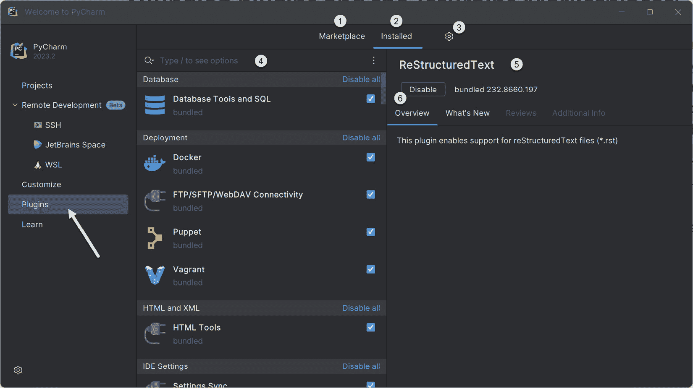

图 15.1：插件窗口包含你在 PyCharm 中管理插件所需的所有工具

在 **插件** 窗口的顶部，你可以找到两个重要的标签页：一个显示你已安装的插件（**2**），另一个带你去市场，你可以在那里购买和安装新的插件（**1**）。市场中的许多插件是免费的，但许多更好的插件则不是。

螺丝刀图标（**3**）允许你配置额外的插件仓库。我从未需要过这个功能，但如果你需要，它就在那里。你还可以使用螺丝刀下找到的相关菜单从本地文件夹安装插件。

搜索框（**4**）允许你在列表中查找插件。当你选择一个插件时，你通常会在右侧（**5**）获得一些关于它的信息。插件可以被启用或禁用（**6**），所以如果你的 IDE 在安装插件后表现不稳定，你可以暂时关闭它或完全卸载它。

## 打包插件

如果您研究 *图 15.2* 中的列表，您会发现此屏幕上的大多数插件都捆绑在 PyCharm 中。这些是由 JetBrains 创建并包含在正常 PyCharm 安装中的插件。检查这个列表并禁用您不太可能使用的插件是个不错的主意。例如，我使用 **Terraform** 和 **Ansible** 进行 DevOps 和 **基础设施即代码**（**IaC**）。我不太可能使用 Puppet，所以我应该禁用该插件。

在您这样做的时候，您可能会发现 PyCharm 警告您有关依赖插件的警告。例如，有一个 Less 插件，它是一个 CSS 元框架。我不使用它，所以禁用它很有诱惑力。然而，我在 React 项目中使用的 JSX 样式组件插件依赖于 Less。参见 *图 15.2*。

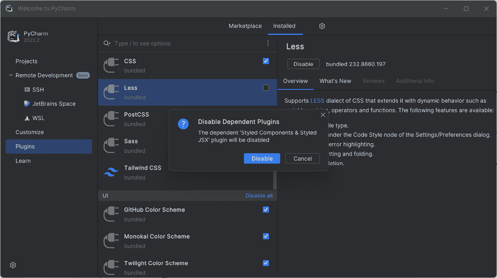

图 15.2：当我尝试禁用另一个插件所需的插件时，系统会发出警告

在这种情况下，我最好保持 **Less** 启用。

## JetBrains 商场

如果您想要一些零售 IDE 治疗，您可以点击 **Marketplace** 选项卡并开始购物。一些插件是免费的，一些则不是。您可以从此屏幕轻松搜索和安装来自 MarketPlace 的插件。如果您购买了一个插件，您可能会被引导到 JetBrains 商场网站，以便您控制您的许可证。

## 制作您自己的插件

任何人都可以使用 Java 编程语言和 IntelliJ Community 或 Ultimate 版本制作 IDE 插件。我不会介绍如何制作插件，但至少我会展示如何开始。在 *图 15.3* 中，我打开了 IntelliJ Community Edition 的新项目对话框。鉴于您在 PyCharm 中创建项目有丰富的经验，我会告诉您所有 IDE 都是相同的。IntelliJ 是 JetBrains 的原始旗舰 IDE 产品。

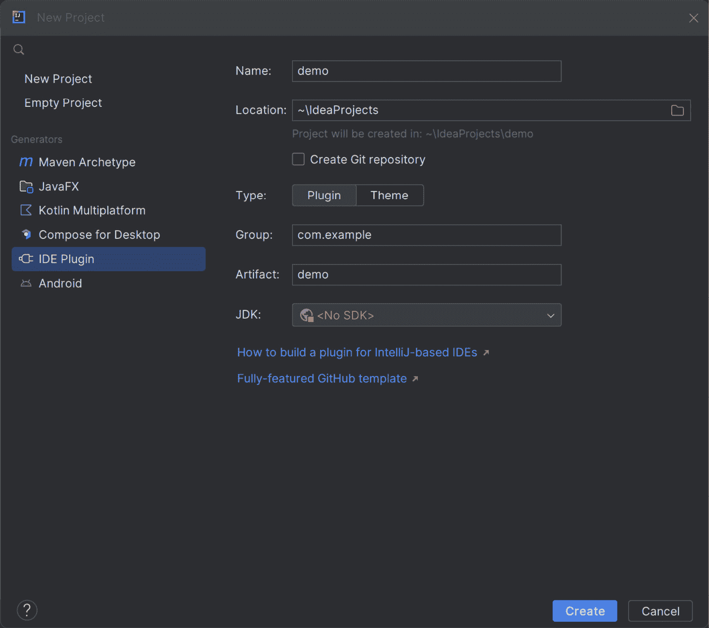

图 15.3：IntelliJ Community Edition 提供创建自定义 IDE 插件的项目模板

除了项目模板外，还有一个链接到构建您的插件项目的教程。

## 为您的项目要求插件

正如我们有一个 `requirements.txt` 文本文件来列出特定 Python 项目所需的包的名称和版本一样，我们也可以指定特定的插件作为 PyCharm 项目的需求。这将确保其他开发者能够访问到您认为对他们在您的项目上协作成功至关重要的任何插件功能。*图 15.4* 展示了如何为您的项目设置所需的插件。


图 15.4：要求插件的操作步骤

首先，进入你的项目设置，找到**构建、执行、部署**，找到**必需插件**菜单项（**1**）并点击它。然后，点击**+**图标（**2**），从出现的对话框中选择你的必需插件（**3**）。点击**确定**。

## 有用的杂项插件

我想在本章的大部分内容中介绍一些非常有影响力的插件，它们包含了许多复杂的功能。不过，在这样做之前，我们先解决一些简单的问题。我会介绍那些你在搜索 IDE 插件时最可能想到的小而有趣的插件。其中一些我们在其他章节中已经见过：

+   CSV 插件在*第十三章*中有介绍。

+   Markdown 插件。这个插件以前没有捆绑提供，但现在有了，而且它绝对值得拥有。

+   单元模式插件，我们也在*第十三章*](B19644_13.xhtml#_idTextAnchor318)中介绍过。

让我们再谈谈几个，我将根据它们的功能将它们分组。

### 主题插件

你每天花费 8 到 16 个小时盯着 IDE。你不妨花点时间让它看起来很酷。有很多颜色主题可供选择。*图 15*.5*显示了我当前最喜欢的：深紫色主题。

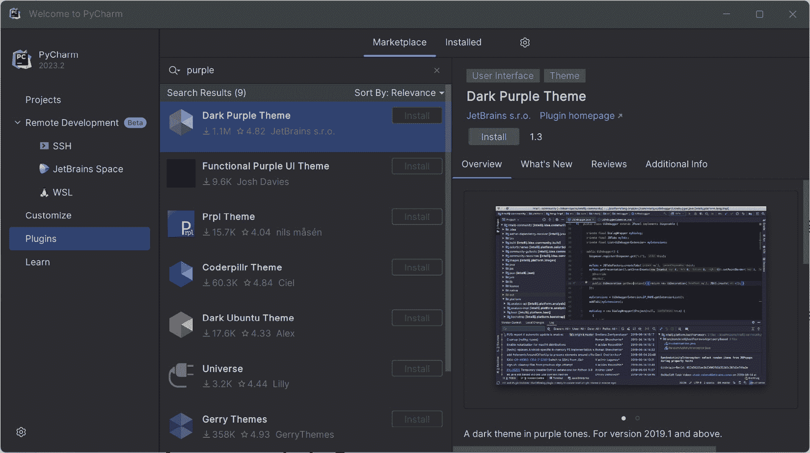

图 15.5：深紫色主题是我最喜欢的之一，因为它与标准的 VS Code 深色主题不同

当人们走过并看到 IDE 打开时，他们会立刻知道你不是那些拥有无处不在的微软深色主题的 VS Code 奴隶。你可以使用 PyCharm 附带的默认 Darcula 主题，但像我这样的俄克拉荷马大学毕业生，那个主题中橙色太多。选择一个你平时看不到的主题，很快，在格子间里的人都会知道你是真的。

我也喜欢那种漂亮的太阳色蓝色的 Material Theme UI。这个插件有免费（轻量版）和付费版。如果你四处看看，你会找到一个适合你的颜色主题，因为可供选择的有许多。找到你新喜欢的主题的简单方法是，在*图 15*.6*中显示的搜索框中输入一个标签。

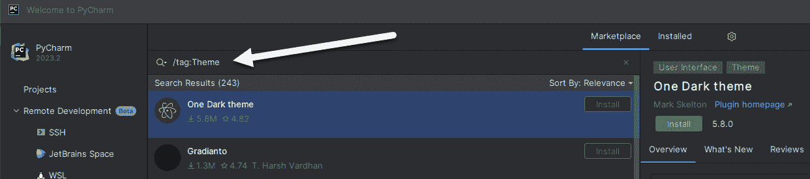

图 15.6：你可以使用“主题”等标签过滤插件搜索

我建议你试试这个，因为无论什么原因，留空搜索框不会得到一个非常长的选项列表。

### 文件处理器插件

这类插件为我们每天使用的某些非代码文件提供了彩色高亮显示。

.ignore 插件为常见的忽略文件（如`.gitignore`和`.dockerignore`）提供了一些不错的格式化。

### 工具集成插件

PyCharm 的开发者倡导者之一保罗·埃弗雷特（Paul Everitt）经常提醒我们，IDE 中的 I 代表的是*集成*。你永远不应该因为任何原因而离开 PyCharm。除了编写代码，开发者还需要与问题跟踪器、版本控制系统（VCS）、持续构建环境以及可能的大量基础设施工具进行交互。因此，有插件来帮助这些类型的集成并不奇怪。*图 15.7*展示了用于查找这些插件的标签。

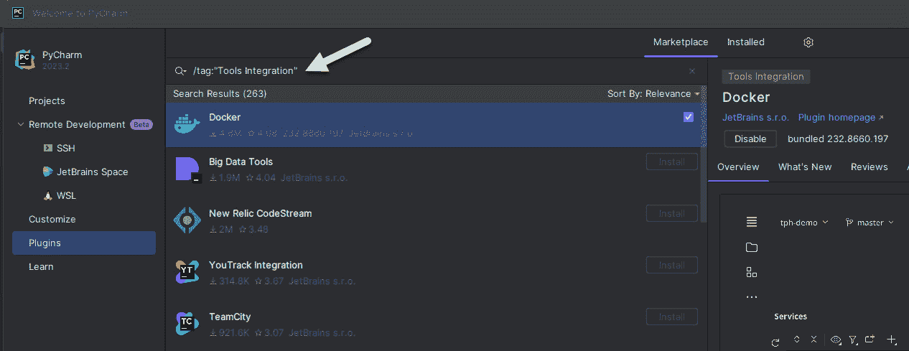

图 15.7：使用工具集成标签查找你最喜欢的基础设施和 DevOps 工具的集成

我曾经是 TeamCity 的重度用户。如果你使用 TeamCity，或者任何其他 JetBrains 团队工具，你将找到插件，允许你从 IDE 中监控你的构建、处理问题等。记录在案，TeamCity 仍然是我最喜欢的**持续集成**（CI）服务器。

### 生产力插件

开发者生产力是首先使用集成开发环境（IDE）的主要原因。在这个标签下，你会发现许多额外的功能和集成。*图 15.8*展示了这个标签的使用情况。

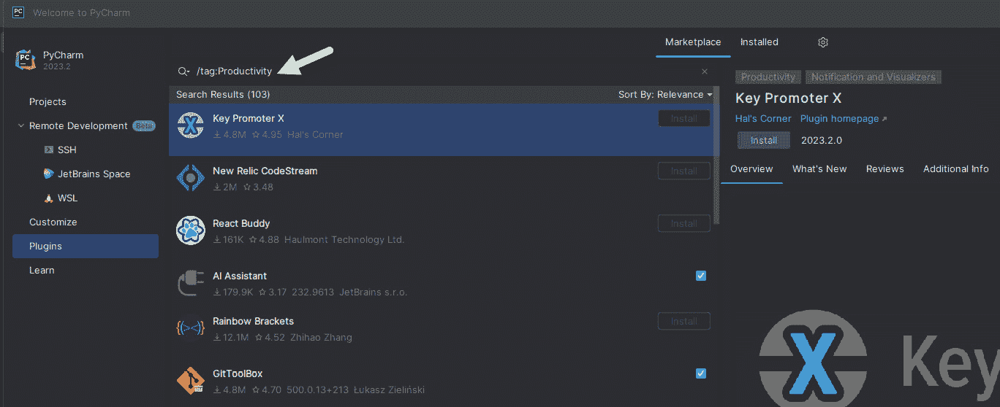

图 15.8：使用生产力标签查找提高生产力的工具

到目前为止，我最喜欢的 DevOps 插件是 GitToolbox。看看我在 PyCharm 中打开并启用了 GitToolbox 的一个项目。

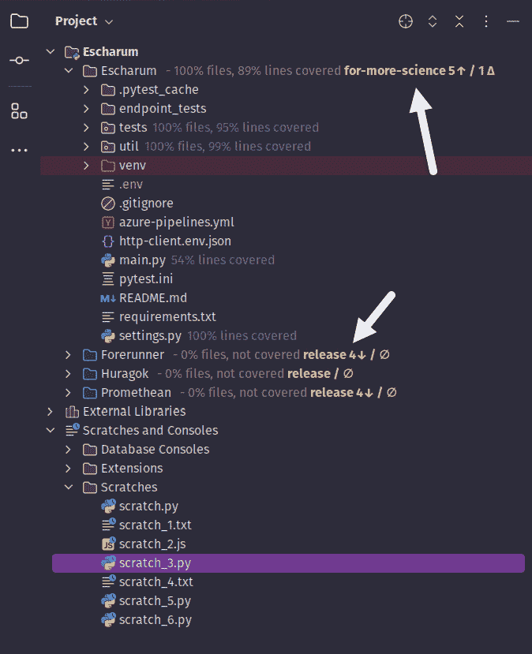

图 15.9：GitToolbox 插件提供了关于你的项目仓库的大量信息

一眼就能看到我当前正在使用的分支，以及相对于远程仓库我领先或落后的提交数量。插件将帮助你清理长时间未使用的旧分支，在定时间隔内执行常规获取，并验证你的提交信息。我最喜欢的功能可能是你可以看到每一行的`git blame`信息。我不是那种指责别人的人，但作为主开发人员，我发现它非常有用，可以知道我的同事在哪个特定文件上工作。这无疑有助于代码审查更快地进行。

### 完成插件

人工智能（AI）已经成为软件开发中一个颠覆性的重要组成部分。使用`/tag: Completion`标签将列出数十个传统和 AI 驱动的代码完成插件，如*图 15.10*所示。

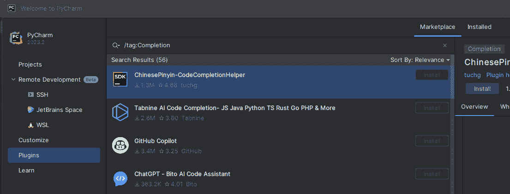

图 15.10：包括最流行的 AI 实现的完成插件

目前，GitHub Copilot 和数十个 ChatGPT 插件都是非常受欢迎的自动补全插件。但在您支付费用之前，请查看我在*第十七章*中关于 JetBrains **AI 助手**插件的讨论。它目前处于封闭测试阶段，所以我无法在这里真正包括它，但它真的很好，并且比这些插件更紧密地集成。

# 与我一起编码（从此不再孤独）

配对编程是一种多年前通过名为**极限编程**（**XP**）的敏捷方法引入的流行实践。虽然不如 Scrum 或 Kanban 知名，但 XP 有许多相同的实践和目标，但将配对编程作为一个强制性组件。在 XP 中，两名程序员坐在一台电脑前一起编写代码。一个人输入，另一个人观察、指导、查找信息，并通过帮助提供一般性贡献。在固定的时间间隔内，程序员交换位置。该实践的拥护者对其深信不疑，声称它消除了代码审查的需要，并且通常导致更好的代码。批评者，包括所有在世的非技术经理，认为让两个昂贵的、专业的工人只做一半的工作是没有意义的。

无论您喜欢还是讨厌，您都必须承认直接协作有很大的实用性。真正的问题是，在新冠后的世界里，许多开发者远程工作，两个开发者共用一个屏幕的想法不再可行，至少直到现在。

JetBrains 有一个名为*与我一起编码*的集成工具。这个工具允许多个开发者加入一个在线共享会话，每个人都在一台电脑上同时为一个项目工作。这个插件包含在所有 JetBrains IDE 中，包括 PyCharm。您可以通过点击*图 15.11*中显示的图标来激活它。

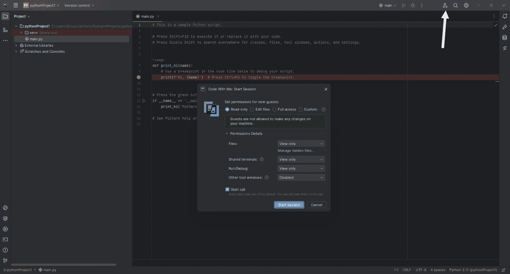

图 15.11：要开始“与我一起编码”会话，点击箭头所示的图标

您可以为您的访客设置权限。请记住，您正在授予对您电脑的访问权限！您应该只与您信任的人进行会话，同样，也只将您的会话链接发送给您信任的人。

一旦您点击**开始会话**，PyCharm 会创建一个您可以根据需要分享的超链接。您可以通过电子邮件发送它，但我最常见的是通过 Slack 或类似的私人聊天服务发送给其他开发者。任何拥有链接的人都可以点击加入会话。除了共享 IDE 之外，您还有正常的会议工具。参与者可以像在 Zoom 或 WebEx 这样的产品上一样看到和听到对方。*图 15.12*显示了我在没有人与我进行会议的情况下的样子，但它能给您一个预期的概念。

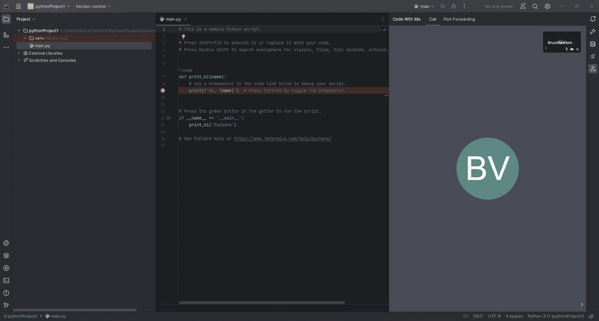

图 15.12：正在进行中的“与我一起编码”会话。不幸的是，因为我把所有时间都花在写书上，我没有朋友可以打电话，所以只有我一个人。

这个功能在许多场景中都很有用，而不仅仅是明显的结对编程用例。你可以为每一节课使用它，或者使用比 Google Doc 更真实的东西进行编码面试。

如果你打算经常使用这项服务，你需要订阅，因为会话长度和你可以邀请的参与人数都有限制。你可以在[`www.jetbrains.com/code-with-me/buy/#commercial`](https://www.jetbrains.com/code-with-me/buy/#commercial)了解更多信息。

# 远程开发

在我的办公室里，我有一台大型、强大的 60 磅全塔式 HP 工作站，配备双核 Intel Xeon 处理器（总共 48 个核心），128 GB 的内存，专业级的 Nvidia GPU，以及 24 GB 的 GPU 加速器！它甚至还有一个**串行连接的小计算机系统接口**（**SAS**），用于运行企业级存储！你真的无法在笔记本电脑上获得这种性能，而且有时候我会把它用到极致。

我们这个行业喜欢字母汤！

我只是想为所有那些试图弄清楚**三字母缩写**（**TLA**）*SAS*代表不少于六个单词的工程类型的人澄清一下。这是因为缩写*SAS*中包含的一个字母本身又代表另一个缩写。它是**串行连接的 SCSI**（**SAS**）。**SCSI**代表*小型计算机系统接口*。SAS 驱动器是旋转磁盘，其转速比标准的**串行高级技术附件**（**SATA**）驱动器要高，但它们仍然远远不如**固态驱动器**（**SSD**）或具有**NOT-AND**或**NAND**内存的**非易失性内存表达**（**NVME**）驱动器快。然而，SAS 驱动器是设计用于**冗余磁盘阵列**（**RAID**）的，这使得它们在以容错方式低成本存储非常大的文件时很有用。

所有这些缩写和术语都是行业内部阴谋的一部分，旨在让你那些对你所从事的工作一无所知的亲戚在家庭聚会和节假日时既感到自豪又感到不舒服。

但像其他许多开发者一样，我也希望能在家工作。显然，我不愿意带着 60 磅的工作站四处奔波。即使我能，我们的安全团队也不会喜欢我们的源代码离开大楼。确实，我可以使用 VNC Viewer 或 Microsoft Remote Desktop 这样的远程技术，但它们可能会出现延迟，而且缺乏我习惯的四显示器等舒适功能。

我也可以通过 SSH 使用**neovim**进行工作。但我想你和我，我们已经过了那个阶段，对吧？如果你认为这是个好主意，就回到*第一章*，我在那里谈到了这是一个坏主意。那么，我该怎么办呢？

幸运的是，JetBrains 为我提供了支持。使用其预安装在 PyCharm Professional 上的远程插件，我可以在家里的电脑上运行我的 IDE，但在办公室的工作站上操作。这是通过 **安全外壳**（**SSH**）实现的，它是一种加密通信协议，通常用于管理基于 Linux 和 Unix 的服务器。

简而言之，你可以配置 PyCharm 使用安装在远程 PC 上的虚拟环境（`venv`），以及远程硬盘上的代码。除了 IDE 本身之外，所有操作都在远程进行。你的运行配置将在远程执行你的代码。当你进行调试时，调试器是在远程而不是本地机器上运行的。这相当无缝，但也有一些缺点。

首先，你必须对网络有一定的了解，才能配置项目进行此操作。你需要远程的 IP 地址，并且需要有效的访问凭证，以便访问远程计算机。在我的情况下，我还需要一个 **虚拟专用网络**（**VPN**）客户端才能访问办公室的网络，而这个客户端是 PyCharm 外部的。虽然 VPN 从技术上讲不是必需的，但在大多数情况下，它应该是。

第二个权衡是性能。PyCharm 在好日子里也不算特别快。在我们能够使用书中所讨论的任何那些令人惊叹的功能之前，我们必须等待索引完成。从 PyCharm 获取内存不足错误并不罕见，这需要你增加 PyCharm 被允许使用的内存量。更新或安装插件需要你重新启动 IDE，甚至初始加载界面挂起的时间也比我们许多人希望的更长。总的来说，有时 PyCharm 可能有点笨拙，但我们忍受它，因为它带来的价值有助于简化我们的整体工作流程。

我倾向于将 PyCharm 比作柴油卡车。这样的卡车不可能在四分之一英里短跑比赛中战胜保时捷或特斯拉 Model 3。来自俄克拉荷马州的农村地区，我可以告诉你，在我所在的地方没有人拥有跑车，因为我们的柴油卡车不仅仅是交通工具，它们是我们生计的一部分。我无法用特斯拉拖运一车牛去拍卖，也无法用保时捷拉运干草到后 40 英亩去喂马。同样，我们使用重型 IDE，因为我们愿意为了 PyCharm 的索引提供的某些极端价值而放弃最小编辑器（如 VS Code）的“速度”。能够找到用法、直接跳转到函数定义，以及拥有从编辑到数据库管理的一整套紧密集成的工具，这些都是值得一点延迟的。

话虽如此，当你在一个远程项目中工作时，这种延迟可能会变得更加明显。你可以预期你的索引时间会更长，因为索引是在远程进行的，然后传输回你这里。网络延迟和 VPN 总是会使事情变慢，但这不是 PyCharm 的错。我们忍受它，因为你可以在穿着睡衣的情况下在家工作，音乐声调很高，靠近自己的厨房和零食，你可以限制与其他人的互动，这通常只会让我们这样的人变慢。这是值得的。现在你的期望已经设定，让我们看看如何让这一切工作。

## 图 15.13：远程开发选项清楚地显示在欢迎窗口的右侧

在我所有的书籍和课程中，我自豪地保持着尽可能真实的内容。例如，在*第七章*中，我遇到了 PyCharm 的一个功能问题，这个功能本应自动为我下载 Node.js。我没有隐藏它，因为这种情况确实发生在我身上，这意味着它也可能发生在你身上。学习如何绕过这类问题是有价值的。

到现在为止，你可能已经注意到这一章的屏幕截图与之前章节的不同。我是在一个我在家工作的日子里写这一章的，我正在使用一台今天之前从未配置过远程工作的 Windows 11 PC。由于这是我的家用电脑，截图可能看起来与之前章节的略有不同，尤其是在深色模式方面。我关闭了大多数书籍的深色模式，因为印刷书籍中的浅色模式更容易阅读，而且我在墨水上也节省了出版商的费用。但今天不是这样。因为我正在保持真实。

我要做的第一件事是安装并打开 PyCharm。显然，我们已经在*第二章*中介绍了这一点，所以没有必要再次做这件事。欢迎屏幕提供了打开远程项目的选项，如图*15.13*所示。

这里有几个选项，包括 SSH，我将使用它。JetBrains Space 是一个独立的产品，我不拥有它，所以我真的不能涵盖它。"WSL"，即"Windows Subsystem for Linux"，可能只会在你使用 Windows 时出现。WSL 允许你在 Windows 中直接运行 Linux 虚拟机，而无需使用像 VMware 或 Virtual Box 这样的明显虚拟机管理程序。"明显"，是因为当然这里有一个虚拟机管理程序在起作用——它是微软的**HyperV**，它是 Windows 11 和 Windows Server 产品的专业版中内置的。Windows 11 通过允许你通过 Windows 11 中新的 Windows Terminal 程序选择一个或多个 Linux 安装来使其无缝。

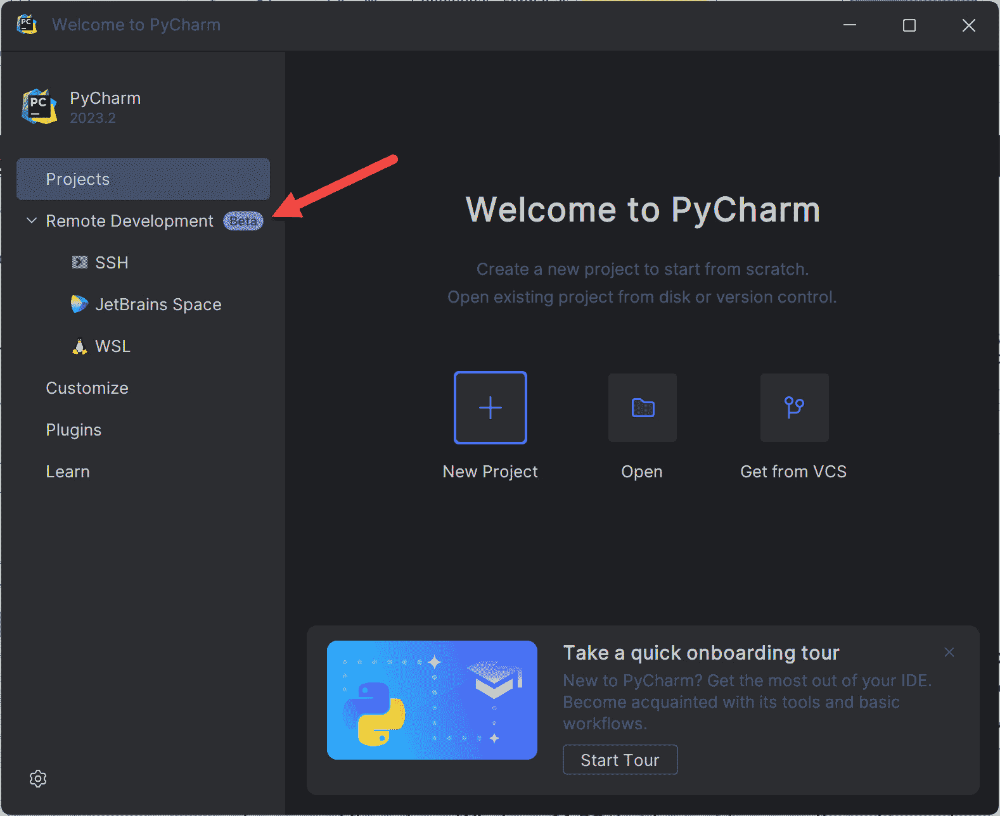

配置 PyCharm 中的远程开发

由于 WSL 在技术上是一个虚拟机，尽管它发生在你的本地计算机上，但它仍然算作远程开发。目前，我将专注于通过 SSH 访问我的工作站进行真正的远程开发，我的工作站目前大约 12 英里远。为了清楚起见，我的本地计算机运行 Windows 11，但我的工作站运行**Pop_OS! 22**，这是 Ubuntu Linux 的一个变种。你可以在全书中的屏幕截图中看到它。这增加了神奇之处！我可以用 Windows 或 macOS 这样的消费级操作系统连接到专业的 Linux 工作站。

在你跳上 Twitter（现在称为 X）来对我侮辱你最喜欢的操作系统进行抨击之前，请意识到这是唯一可能的组合。你必须连接到 Linux 远程服务器，因为 Windows 和 Mac 目前还不支持。我不确定 macOS 的延迟是什么，因为它预装了 SSH 服务器。对于你在工作中有一台 Mac Pro 而家里有其他设备的情况，这种工作流程是有意义的。接下来的设置屏幕确实表明这项功能是为未来版本准备的。

*图 15.14*首先展示了当我们点击*图 15.13*中显示的 SSH 选项时会发生什么。我们得到了一个屏幕，允许我们在远程创建一个新的项目，但前提是我们首先配置我们的连接。这就像我们创建用于发布 Web 项目的 SSH 连接一样，我们在*第七章*中讨论了这一点。

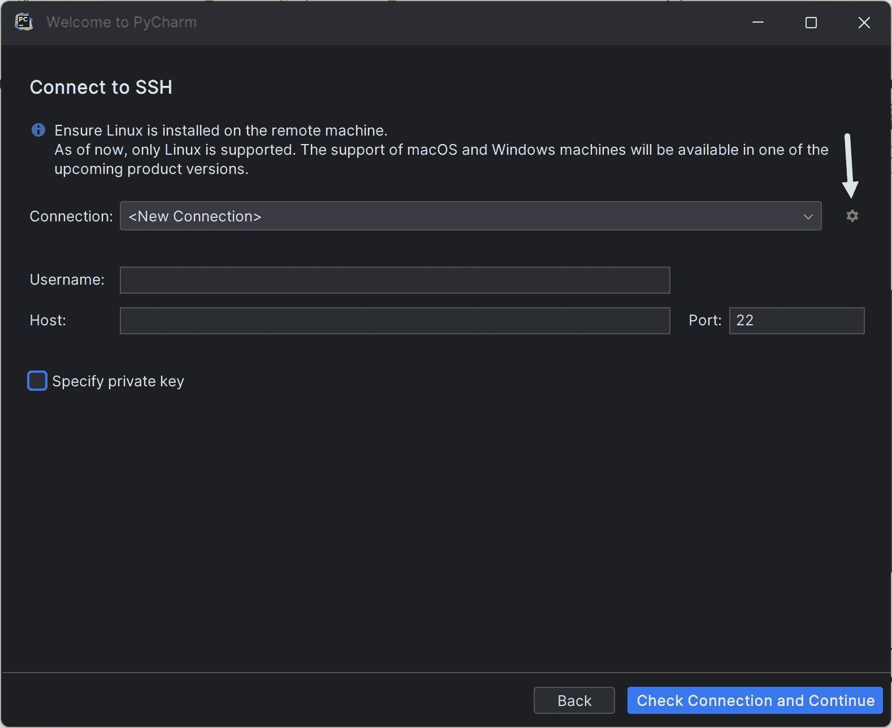

图 15.14：远程配置对话框只能通过在其上方堆叠另一个配置对话框来改进

在你能够做任何事情之前，你需要通过点击*图 15.14*中箭头所指的齿轮图标来配置 SSH 连接。这会带我们进入另一个对话框，如*图 15.5*所示。

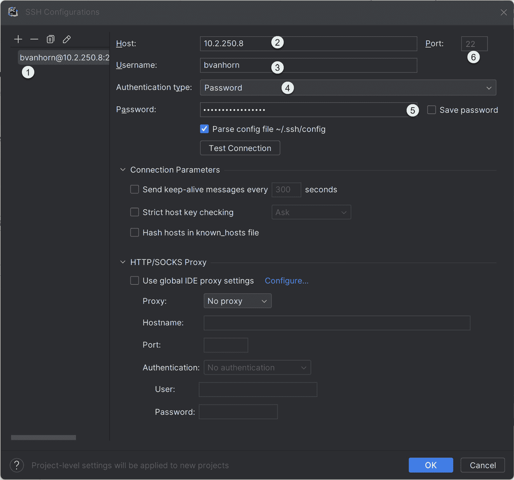

图 15.15：在这里，我正在创建一个用于远程设置的 SSH 配置

我已经点击了`22`，所以我已经保留了默认设置（**6**）。

如果你回到第一个位置（**1**），你可以点击那个铅笔图标，如果你不喜欢用户名和 IP 地址的美观，可以给它一个不同的名字。我在*图 15.16*中将我的名字重命名为更符合其硬件规格的名称。


图 15.16：The Beast 是我远程工作站的名称

其余的选项对我来说并不重要，因为我不需要通过代理才能到达我的工作站。我继续展开*图 15.15*中所有关闭的选项，以便你可以看到你可能需要的任何附加设置。

点击**确定**，这将带您回到之前的对话框。您需要从下拉菜单中选择您刚刚创建的连接。对我来说，重命名没有保留，所以又回到了显示在*图 15*.17 中的用户名和 IP。

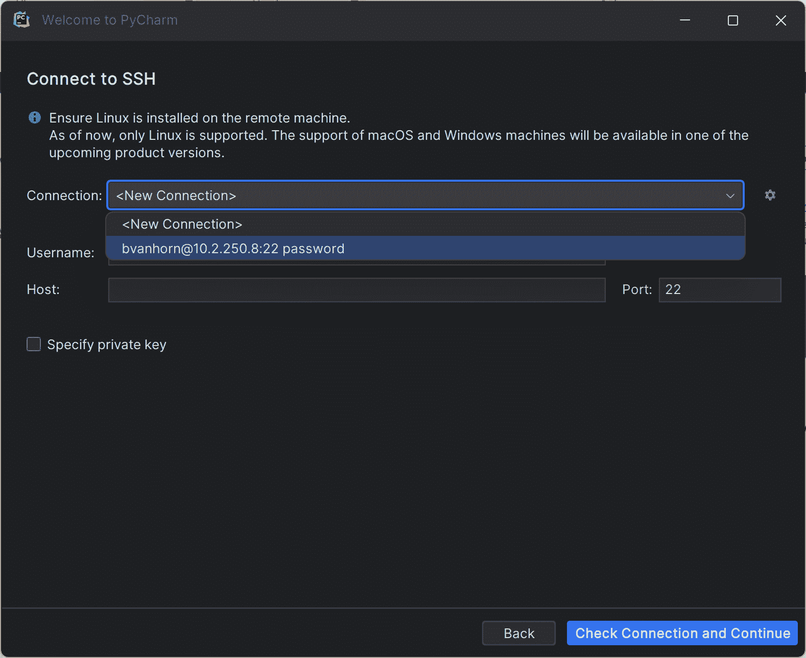

图 15.17：创建连接后，您需要在这里选择它，用户名和主机字段将为您自动填写

注意，您在这里可以选择无密码登录并使用私钥。使用 SSH 密钥可能限制了密码的需求，但您仍然可能需要解锁密钥。在任何情况下，如果您愿意，PyCharm 都可以为您记住密码或 SSH 密钥短语。如果您在一家注重安全的公司工作，您可能需要检查您的指南，以了解在哪些情况下，应用程序存储您的密码和密钥短语被认为是合适的。

点击标有**检查连接并继续**的按钮。假设您获得了访问权限，PyCharm 会将一些软件和设置复制到主机上，然后向您展示原始的对话框，如图*图 15*.18 所示。

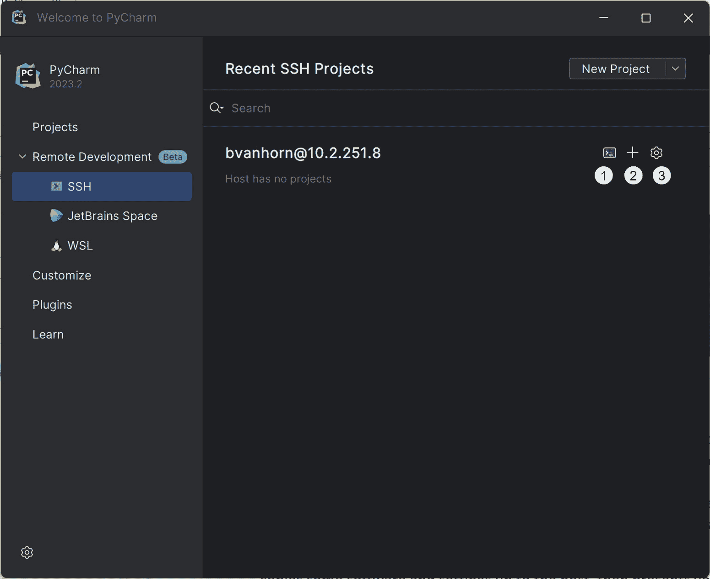

图 15.18：我们现在有一个连接的系统，有三个选项！

从这里，我们有三个选项。您可以通过点击显示在(**1**)位置的图标来使用终端会话连接到主机。点击(**2**)位置的**+**图标允许您在远程创建或打开项目。齿轮(**2**)允许您删除主机或管理主机上的后端。后一个选项是由我之前的评论解释的。当我们第一次连接时，我告诉您 PyCharm 将一些软件复制到了主机上。所涉及的软件很像我们的工具箱应用程序。它将帮助我们管理作为项目创建过程的一部分上传的 IDE 后端。您还可以使用其他几种 IDE 以这种方式使用，并且您有在这里管理这些后端的能力。如果您现在点击它，将不会有任何，因为我们还没有创建任何项目。让我们纠正这一点。

## 创建远程项目

点击*图 15*.18 中标记为(**2**)位置的**+**按钮。您将看到*图 15*.19 所示的屏幕。

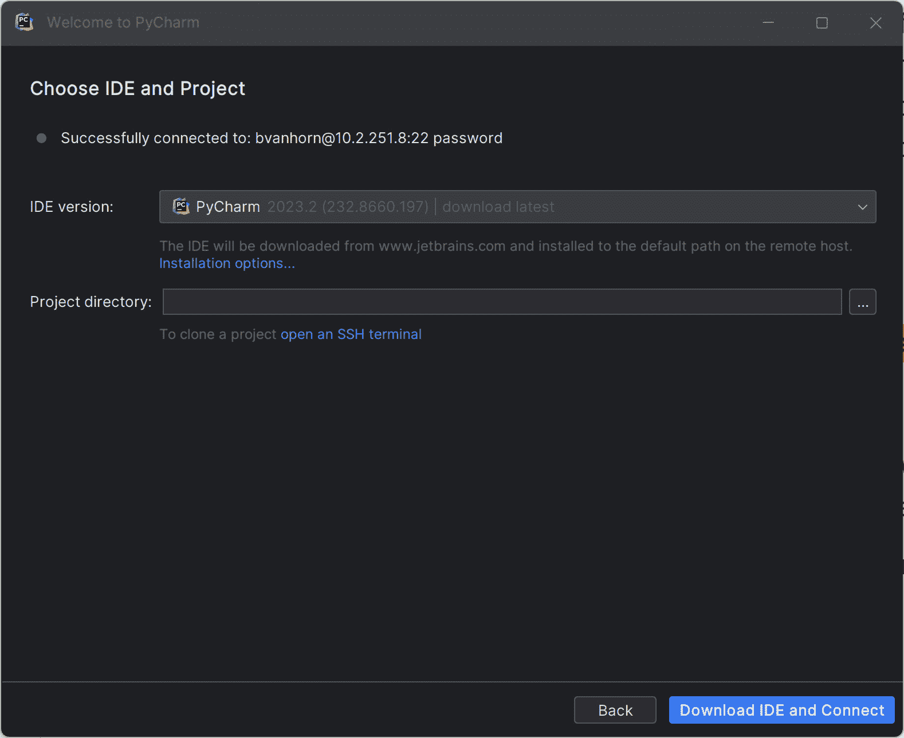

图 15.19：我们即将创建一个新的远程项目，这需要下载 IDE 后端并在远程选择一个项目文件夹

远程项目创建需要你指定你想要使用的 IDE 以及你想要在远程硬盘上存储代码的位置。鉴于我们正在调用 PyCharm 来创建项目，它要求我们选择所需的 IDE 可能看起来有些奇怪。记住，这实际上并不是 PyCharm。它是一个可以被许多 JetBrains IDE 利用的插件。现在，你实际上正在与另一款软件交互，它恰好托管在 PyCharm 中。

我们确实得到了 PyCharm 作为默认选项，所以这也是一件事情。请注意版本。我的默认设置为 EAP 版本，这可能不是你想要的。我个人只有在测试向后兼容性时才使用 EAP。我在日常工作中使用稳定版。从下拉菜单中选择合适的条目，如图*图 15.20*所示。

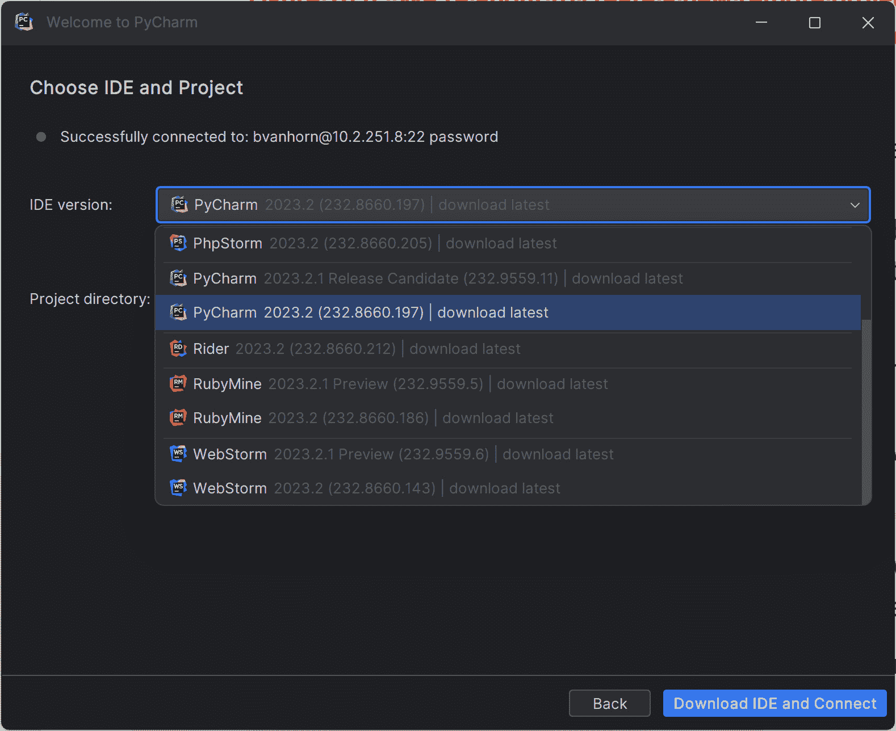

图 15.20：在远程选择你想要使用的 IDE

另一个可能明显的考虑因素是，你需要为所选的任何 IDE 拥有一个许可证。接下来，我们需要选择一个位置。这可能有点令人困惑，因为 Linux 文件系统的布局与你在 Windows 中遇到的不同。Linux 不使用驱动器字母，它使用正斜杠来分隔路径元素，而 Windows 使用反斜杠。幸运的是，我可以通过点击项目目录设置旁边的三个点来浏览。查看*图 15.21*。

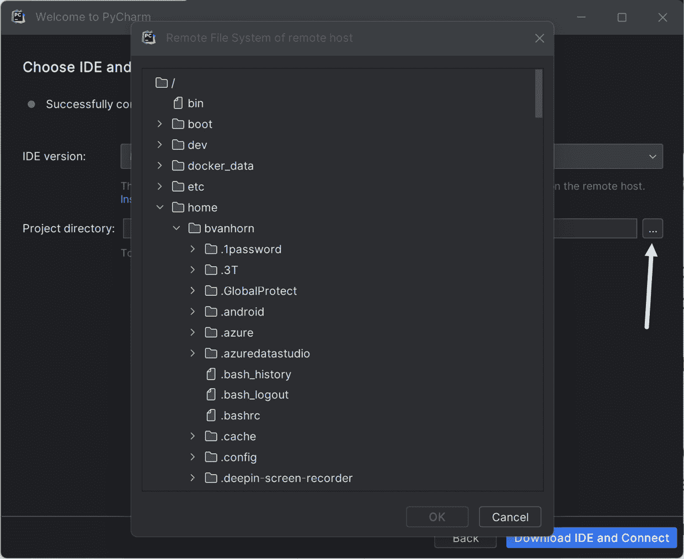

图 15.21：点击三个点以浏览远程文件系统以选择你的项目目录

默认情况下，目录浏览器将在远程显示你的主文件夹。你可以浏览到你选择的文件夹。不幸的是，目前，一个很大的缺失功能是创建新文件夹以供项目使用的选项。我相信这将会到来，但现在它还不存在。我们将不得不绕过这个问题。点击**取消**，然后点击**后退**返回到*图 15.5*所示的屏幕。点击终端按钮以在主机上启动 SSH 终端会话，如图*图 15.22*所示。

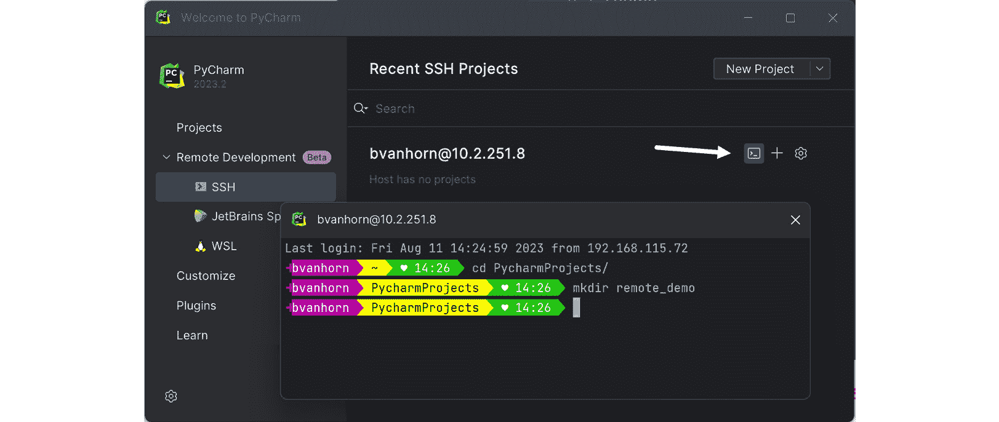

图 15.22：使用终端会话创建你的文件夹

使用显示的命令创建一个新文件夹。我在远程主文件夹中已经有一个`PyCharmProjects`文件夹。这是因为 PyCharm 实际上安装在了远程上，因为它是我的日常使用电脑。你可以在远程主文件夹中的任何位置创建任何适合你的文件夹。你可以通过输入`exit`退出终端会话。

## 让我们再试一次

如前所述，点击**+**图标，从下拉菜单中选择你的 IDE，并浏览到你刚刚创建的文件夹。

就把它想象成没有 UI 的 PyCharm。我们正在将我们电脑上的前端与远程上传的 PyCharm 后端连接起来。

让我们把注意力重新集中在远程项目上。点击*图 15.23*中显示的**下载 IDE 并连接**按钮。

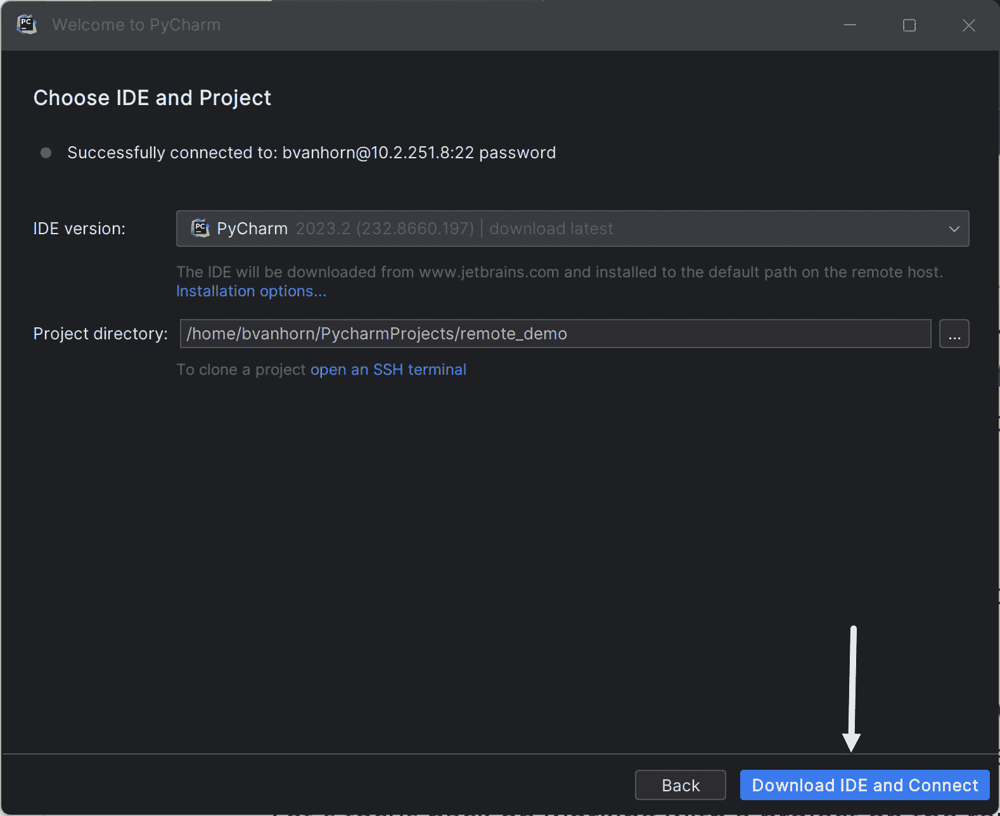

图 15.23：点击按钮在远程创建项目

接下来的这部分需要几分钟时间。在您点击**下载 IDE 并连接**按钮后，一系列命令将在您的远程服务器上运行。结果是运行中的 IDE 后端，如图*图 15.24*所示。

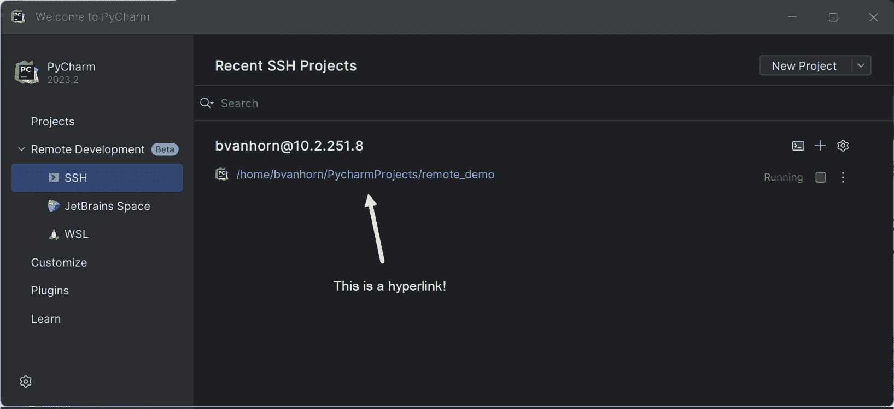

图 15.24：现在您已经在远程运行了一个 IDE 后端服务器

点击*图 15.11*中显示的链接来连接到您的远程 IDE。您可能会看到密码挑战，也许会有 Windows 的提示，询问是否允许流量通过防火墙，但最终，您将像我在*图 15.25*中一样在远程实时工作。

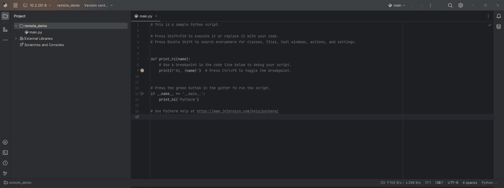

图 15.25：神奇！看起来和本地工作一样！

从这里开始，您基本上知道该做什么。您的 IDE 将正常工作，除了一个被跳过的步骤：您从未被提示创建虚拟环境。

## 在远程创建虚拟环境

我们之前已经做过这件事了，在*第三章*，所以在这里我不会再次深入探讨，但有一个点可能会让人困惑。让我们来看看。

要创建一个虚拟环境，您需要进入项目设置并找到项目解释器的设置。我的设置如*图 15.26*所示。

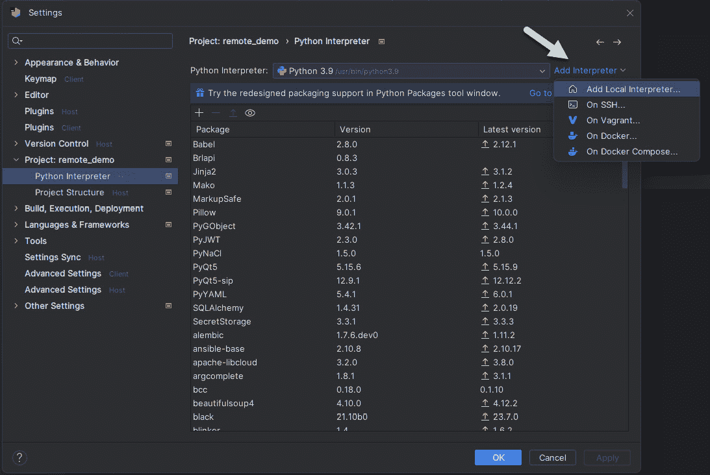

图 15.26：当您添加解释器时，请记住，虽然它是远程的，但它被视为本地

解释器默认为`/usr/bin/python3.9`，这是全局实例，不是我想要的。当我点击**添加解释器**按钮时，会有些困惑。您可能会倾向于使用**通过 SSH**，因为，嗯，我们正在使用 SSH 连接到远程。然而，我们已经在远程连接上了，所以 PyCharm 在远程运行，这使得它成为一个本地解释器。当您点击**添加本地解释器**时，您会注意到，就像*图 15.14*中显示的那样，路径是类似 Linux 的，而不是 Windows 路径。对于 macOS 用户来说，这可能会不太明显，因为路径看起来是一样的。

## 其他注意事项

现在您有了这个设置，您实际上是在远程计算机上运行 PyCharm。所有文件路径都将显示为 Linux 路径。Git 和其他版本控制客户端与远程文件夹一起工作。如果您使用 SSH 密钥通过 GitHub 或您的版本控制主机进行身份验证，您需要从远程配置密钥，而不仅仅是使用您本地的公钥。本质上，完全忘记您的本地计算机。您完全在远程操作。

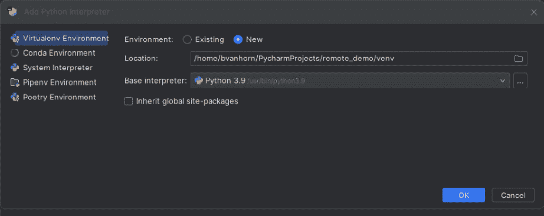

图 15.27：尽管我们选择了本地选项，但所有操作都在远程进行

点击`venv`已为项目创建。现在您可以开始工作在您的项目上了！

# 使用 Docker

容器技术是自虚拟机以来 DevOps 技术最重要的进步之一。**Docker**和类似的容器技术彻底改变了软件开发、部署和管理的方式。想象一下容器作为轻量级、独立的单元，封装了运行应用程序所需的所有必要组件，包括代码、运行时、系统库和设置。这种封装确保了应用程序在不同环境中的一致运行，从开发者的笔记本电脑到生产服务器。

Docker 特别是一个广泛用于构建、运输和运行容器的平台。它提供了一种标准化的方式来打包应用程序及其依赖项，将它们与底层主机系统隔离开来。这种隔离使得开发者能够避免臭名昭著的“*在我的机器上它运行正常*”问题，因为容器在各种环境中表现一致。

容器的另一个主要优点是它们的可移植性。开发者可以将应用程序及其所有依赖项打包到容器镜像中，然后可以轻松与他人共享。这使得协作更加高效，并减少了兼容性问题的可能性。此外，容器具有高度的扩展性。它们可以快速复制以处理增加的工作负载，为现代、动态和资源密集型应用程序提供了一种出色的解决方案。

Docker 还带来了资源利用率的提高。由于容器共享主机操作系统的内核，它们比需要单独操作系统的传统虚拟机更轻量。这转化为更快的启动时间、更低的内存开销以及单个主机上容器化应用程序的更高密度。

## 预装的 Docker 插件

PyCharm Professional 已经预装并启用了 JetBrains Docker 插件。您无需进行任何其他操作即可使用 Docker 插件。然而，您确实需要安装 Docker。在我的开发计算机上，我通常运行 Docker Desktop，因为我发现产品的图形用户界面很有用。今天它将很有用，因为我将向您展示您可以在 PyCharm 中使用 Docker 完成多少工作。

让我们创建一个 Flask 项目并在 Docker 中运行它。

## 创建项目

在 PyCharm Professional 中创建一个新的 Flask 项目。如果你跳过了，我在 *第八章* 中展示了如何做。你可以在 *图 15.28* 中看到我的项目设置。

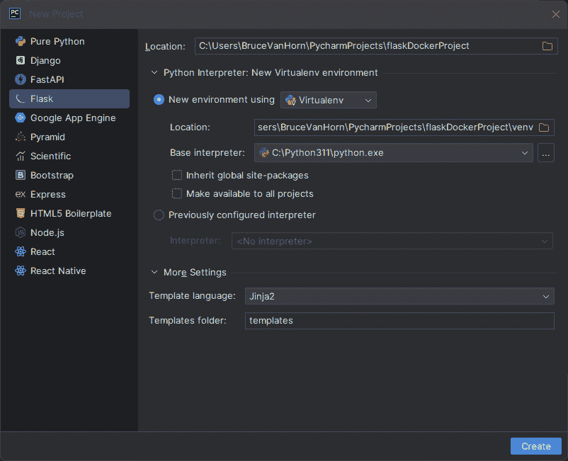

图 15.28：创建一个 Flask 项目以便我们在 Docker 中运行

我们不会对生成的项目进行任何修改，除了添加一个 **Dockerfile**。*图 15.29* 展示了我这样做的过程。

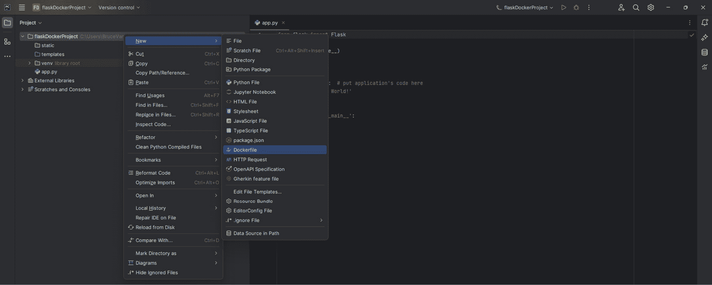

图 15.29：右键单击项目，然后点击“新建”|“Dockerfile”

在前面的图中，我正在右键单击项目，悬停在“新建”上，并点击“Dockerfile”菜单选项。这为我生成了一个包含以下内容的 Dockerfile 模板：

```py
FROM ubuntu:latest
LABEL authors="BruceVanHorn"
ENTRYPOINT ["top", "-b"]
```

第一行指示哪个 Linux 内核将作为我们的容器镜像的基础。我非常喜爱 Ubuntu，但也有其他可能性。Alpine Linux 同样非常受欢迎。

第二行正如其名：为包含作者名字的镜像添加标签。我们实际上并不需要这个，也不需要最后一行，至少在目前的格式下是这样。让我们用更有用的内容替换生成的模板。Docker 背后的公司维护着一个庞大的预制作容器注册库，你可以将其作为工作的起点。其中就包括已经安装了任何给定版本的 Python 3 的容器。我将使用 Python 3.9，尽管这并不是最新的版本，因为当我生成示例项目时，我恰好注意到我的电脑上安装的是这个版本：

```py
# Use the official Python 3.9 image as the base image
FROM python:3.9
```

在下一行，我将设置容器内的工作目录。容器有一个最小化的文件系统，空间有限。我们的应用程序代码将存放在这里：

```py
WORKDIR /app
```

接下来，我需要指示 Docker 复制我的 requirements 文本文件，并使用 `pip` 安装我的项目需求：

```py
# Copy the requirements file and install the necessary packages
COPY requirements.txt requirements.txt
RUN pip install -r requirements.txt
```

接下来，我将把我的代码复制到容器中：

```py
# Copy the Flask application code into the container
COPY . .
```

`COPY` 指令将复制我的项目文件夹的全部内容，包括 `venv` 文件夹。由于 `pip` 命令将安装我们的需求，我们不需要 `venv` 文件夹。我将在稍后解决这个问题。我在这份文件中的下一步是暴露容器防火墙上的端口 `5000`，这样我就可以访问应用程序：

```py
# Expose the port on which the Flask app will run
EXPOSE 5000
```

最后，我将定义容器启动时运行的 Flask 应用程序的命令：

```py
CMD ["python", "app.py"]
```

为了解决复制问题，我将在项目文件夹中创建一个名为 `.dockerignore` 的文件。这和 `.gitignore` 的工作方式相同，但显然它是用来为 Docker 设置文件排除的。`.dockerignore` 文件的内容很简单：

```py
venv
```

顺便说一句，你可以在 Marketplace 中找到一个名为 `.ignore` 的插件，它为一系列忽略文件添加格式。

## 添加 Docker 运行配置

我们在*第三章*中介绍了创建和使用运行配置，所以这里不再赘述。我只会指出如何使用 Docker 创建运行配置，如图 15.30 所示。

x

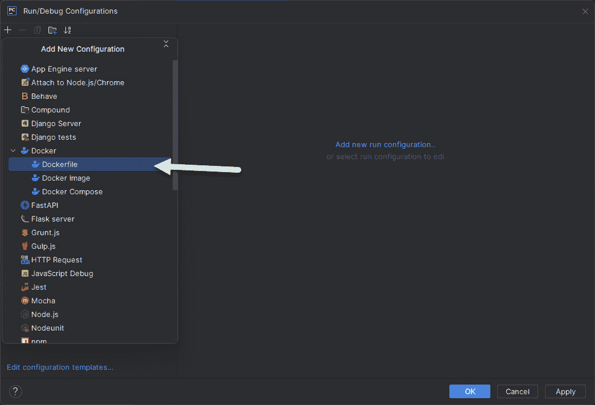

图 15.30：使用 Dockerfile 选项创建使用 Docker 的运行配置

您的许多运行配置将自动填写。PyCharm 会看到您的 Dockerfile 并将其用作默认设置。我的设置如图 15.31 所示。

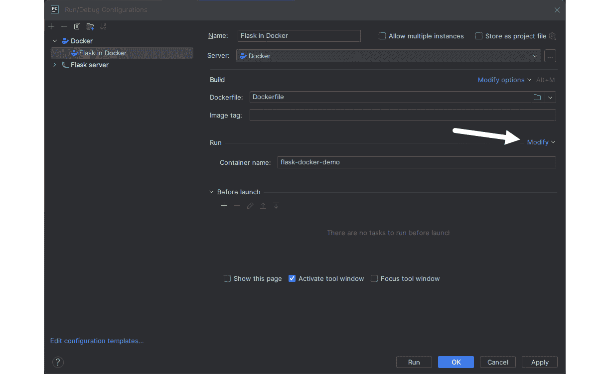

图 15.31：我的 Docker 配置

如果我们运行这个，Docker 将拉取 Python 3.9 镜像，创建一个容器并运行应用。如果我们实际上想使用应用，我们还需要做一件事。图 15.31 中的箭头指向一个菜单，允许您定制您的`docker run`命令。根据您的应用，这里通常有一些您想做的事情，例如映射持久存储卷，或者在我们的情况下，将容器中的端口映射到本地计算机的端口。

如图 15.32 所示，点击**修改** | **绑定端口**。

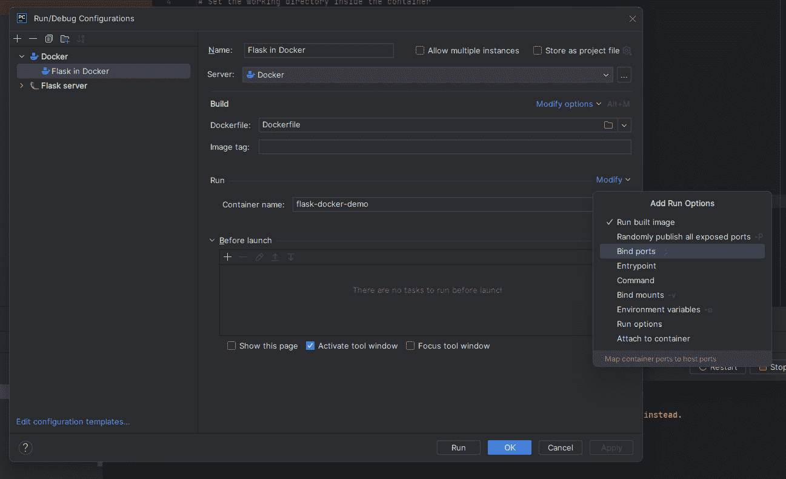

图 15.32：为了从浏览器中看到应用运行，您必须为 Docker 容器添加一个绑定端口

一旦您点击**绑定端口**选项，PyCharm 会为**绑定端口**添加一个配置参数。奇怪的是，图 15.33 中由右箭头指示的文件夹图标。

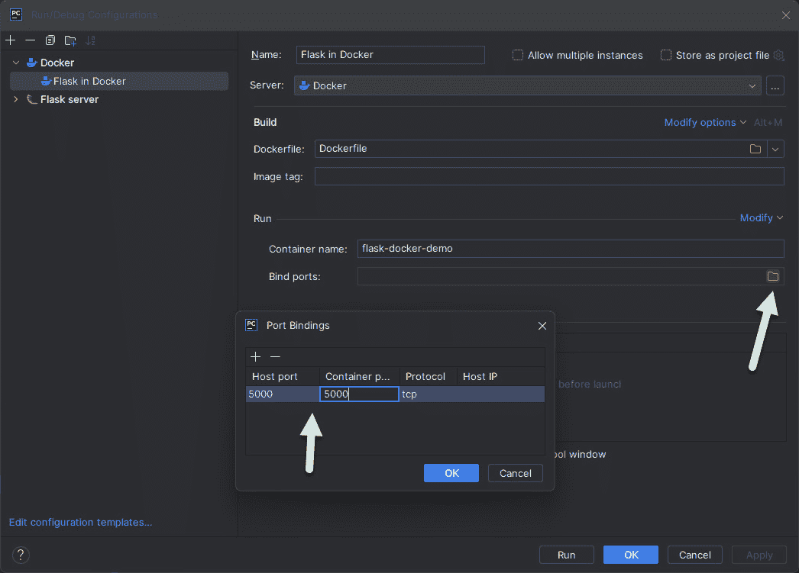

图 15.33：点击文件夹以打开端口绑定对话框并设置端口映射

这很奇怪，因为我们不会浏览文件或文件夹。当您点击它时，您得到一个`5000`，所以您只需要指定容器中的`5000`与您计算机上的`5000`之间的绑定。点击**确定**直到您离开运行配置。运行运行配置。我们早在*第三章*中解释了运行配置，所以如果您是后来加入的，请返回并复习。

当 Docker 将数据块下载到容器镜像中，构建容器并最终运行应用时，您将看到一个文本光秀。您可以在图 15.34 中看到我的应用正在运行。

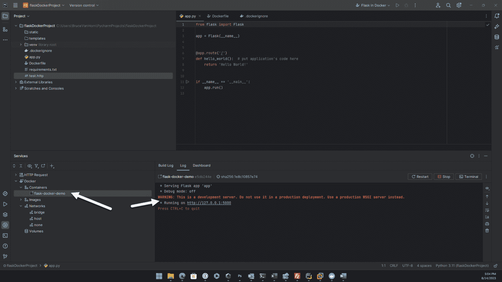

图 15.34：我的 Flask 应用正在 Docker 容器中运行

如果您想比较 Docker 与 Docker Desktop 的用户界面，您会发现许多相同的功能。快速浏览如图 15.35 所示。

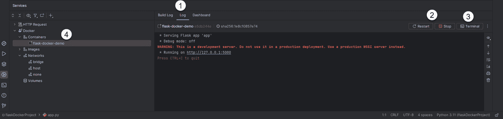

图 15.35：PyCharm 拥有来自一个有能力的 Docker UI 的许多你期望的功能

在位置（**1**）我们可以看到三个标签页。**构建日志**允许我们检查当 Docker 从我们的 Dockerfile 构建容器时生成的输出。我们在（**2**）处有一些基本控制来停止和重新启动容器。当然，当容器停止时，启动它的选项也会出现在这里。然后可能是最有用的，你可以使用**终端**按钮（**3**）在容器内启动一个终端会话。

在左侧（**4**）我们可以看到一个全屏显示，显示了所有我们的运行容器、下载的镜像、网络和挂载的卷。

总结来说，你几乎可以在 PyCharm 中做任何你可以在 Docker Desktop 中做的事情。再次强调，PyCharm 的使命是为你提供一种与当今使用的重要技术之一集成的体验，这一使命已经完全实现！

# 摘要

PyCharm 插件是定制附加组件，可以在使用 PyCharm 时进一步添加可利用的功能和功能列表。我们已经看到了如何在 PyCharm 环境中浏览、下载和管理不同的插件。通过利用这些插件，我们可以进一步定制我们的工作空间并提高我们的生产力。在 PyCharm 中的插件管理可以在设置中的**插件**标签页中完成。

我们查看了一些简单的插件，以增强你在编码时的生活质量，例如主题插件和一些有用的文件处理器。我们查看了我最喜欢的一个，GitToolbox，它允许你在你的 IDE 窗口中看到更多来自你的 Git 仓库的详细信息。

我们随后扩展了范围，查看了一些在 PyCharm 2023 中相对较新的具有很多功能的插件。在疫情之后的世界里，越来越多的人远程工作，远程开发非常有用。即使你不是远程工作，你也很可能发现自己越来越多地与云服务器和虚拟机一起工作，而不是总是使用本地笔记本电脑上的硬盘。

另一个重大进步是 PyCharm 对 Docker 的支持。捆绑的 Docker 插件提供了完整的集成，从在 Dockerfile 和 composer 文件中提供自动完成和语法高亮，到管理你的容器的完整 GUI。你会发现你永远不需要离开 PyCharm 跳转到 Docker Desktop 来处理你的 Docker 操作。当然，如果你愿意，你将发现这两个环境完全同步，你也可以根据你的偏好，在 PyCharm 的**终端**窗口中与你的容器进行交互。

插件负责为我们 IDE 添加许多非常酷且非常有用的功能。有一些插件我没有涉及，因为坦白说，它们还没有完全准备好。我有一些访问一些封闭的测试功能和一些隐藏的宝石，我想要在下一章中介绍。我迫不及待地想向你展示一些即将在未来的版本中出现的功能！
