# 16

# 使用 PyCharm 的下一步

PyCharm 的功能非常广泛，JetBrains 的改进又如此迅速，以至于很难跟上。

在这个，我即将告别的章节中，我想做几件事情，以公正地评价这款令人惊叹的软件。在本章中，我们将涵盖以下内容：

+   我将进行例行总结，简要总结并评论我们迄今为止的旅程。

+   我将介绍一些有助于提高你生产力的酷炫功能，这些功能之前没有很好地融入章节主题。

+   我将介绍一些在撰写本书的 8 个月期间引入的酷炫新功能。我一直在介绍 2023.1 版本，为了避免与书中使用的 UI 截图不一致，我避免更新它。2023.2 版本已经发布，其中有一些惊人的变化，包括新 **AI 助手** 的测试版！

+   当我们分别，我会举杯畅饮，泪眼朦胧，直到下一本书出版。

我会尽力不让你感到伤感。我们已经在一起有一段时间了，知道这本书即将完成，和你一起庆祝这个胜利的时刻将会很难。我想到这里，眼眶都有点湿润了，所以我们还是继续前进吧。

为了继续本章的学习，你需要以下内容：

+   安装并运行良好的 Python 解释器。我将使用来自 [`python.org`](https://python.org) 的最新版本。

+   安装并运行良好的 `pip` 和 `virtualenv`。当你将 Python 安装在 Windows 上时，你会自动获得这些，macOS 在每个系统上都会包含它们。如果你使用 Linux，你需要单独安装包管理器（如 `pip`）和虚拟环境工具（例如 `virtualenv`）。我们的示例将使用 `pip` 和 `virtualenv`。

+   安装并运行良好的 PyCharm 版本。安装过程已在 *第二章* 中介绍。本章中的截图来自 2023.2.1 版本。

本书从 GitHub 上的示例源代码可以在 [`github.com/PacktPublishing/Hands-On-Application-Development-with-PyCharm---Second-Edition/tree/main/chapter-16`](https://github.com/PacktPublishing/Hands-On-Application-Development-with-PyCharm---Second-Edition/tree/main/chapter-16) 找到。我们已在 *第二章* 中介绍了代码的克隆，*安装* *和配置*。

# PyCharm 中的杂项主题

如我所说，这个 IDE 的功能数量令人震惊。在本节中，我将介绍一些没有很好地融入其他章节的内容。我将更多地以“嘿，看看这个！”的精神来展示它们，而不是为每个功能提供完整的教程。

## 远程虚拟环境

我们已经拥有这个功能一段时间了，我认为它可能被我们在*第十五章*中介绍的新远程开发功能所超越。这个功能允许您通过 SSH 访问另一台计算机上的解释器进行工作。这个功能有几个用例。我曾使用这个功能来调试一个在生产服务器上使用虚拟环境的应用程序副本。我在我的电脑上有一个生产代码的副本，但虚拟环境在生产系统上。这让我能够在它通常运行的环境中重现错误并本地修复它。当我在使用 Mac 和 Windows 笔记本电脑作为主要开发环境，而生产环境在 Linux 上运行时，这种方法特别有效。正如我们指出的，许多软件包根据操作系统部署方式不同。我一直在**NumPy**、**pandas**和**pymssql**（Microsoft 支持的 SQL Server 驱动程序）上遇到挑战，这些软件包在这些不同的环境中工作方式非常不同，尤其是在 Windows 上。要构建利用 C 代码的第三方软件包，您需要一个编译器。在 Linux 上，它是*cmake*。在 Windows 上，它是 Microsoft C++编译器。两者之间有很大的区别，仅在对 Windows 进行应用程序测试对我来说是不够的。我想要一个更真实的测试，使用这个功能，我可以在它将运行的确切环境中使用。

您可以通过设置到远程计算机的 SSH 连接来创建或使用一个虚拟环境。我们之前在*第十五章*中介绍了如何创建 SSH 连接，所以这里不再重复说明。使用远程环境的选项与项目解释器设置中的常规选项并列，如*图 16.1*所示。

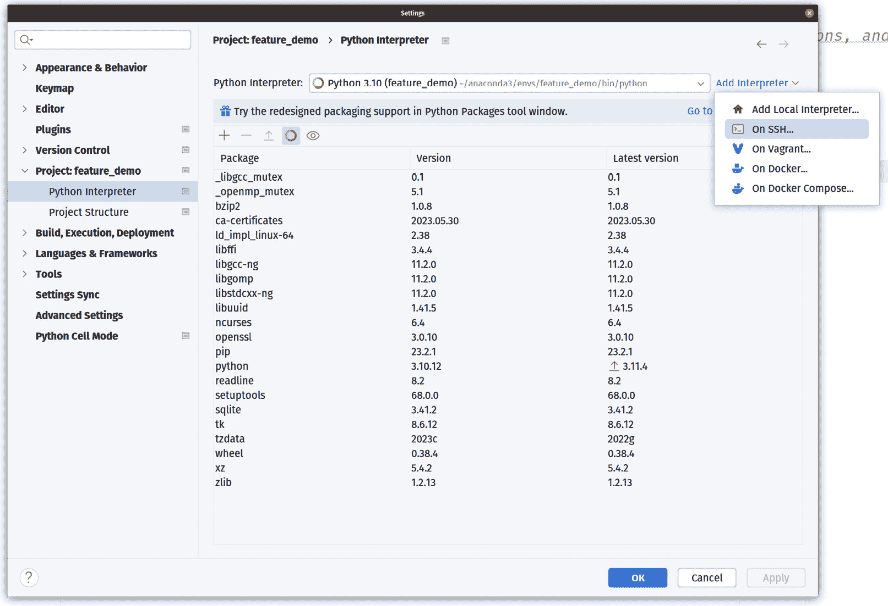

图 16.1：使用解释器设置对话框以及之前配置的 SSH 连接来在远程 Linux 系统上设置您的虚拟环境

自然地，以这种方式工作可能会带来相当大的性能损失；至少对我来说是这样的。对于我的用例来说，这非常值得！

您会注意到还有一个**在 Vagrant 上**的选项，这实际上是一个相同的选项，但它不是在随机的远程服务器上，而是在由**HashiCorp 的 Vagrant**管理的本地虚拟机上。您可能会问，Vagrant 是什么？

## 使用 HashiCorp Vagrant

在 DevOps 领域，一个名为**基础设施即代码**（**IaC**）的潮流变得非常重要。其理念是，没有人再在裸金属上运行任何东西；所有东西都是在虚拟机上运行的。尽管如此，多年来我面临的一个挑战是，当我去设置我的测试和生产环境时，我必须全部手动完成，而且需要相当长的时间。我的目标是设置至少两个或三个几乎完全相同的环境。

假设我正在使用 Flask 创建一个产品，该产品使用 React 作为前端，并使用 Microsoft SQL Server 作为数据库。为了按照最佳实践运行，我需要几个服务器：

+   我需要一个像 Nginx 或 Apache 这样的 Web 服务器来为我的 React 应用提供服务，以及可能需要的任何静态资源。

+   我需要一个应用服务器。Flask 的开发服务器在生产环境中是不够用的。我需要一个运行类似**绿色独角兽**（简称**gunicorn**）的服务器，这是一个能够处理生产负载的生产级 WSGI 服务器。**WSGI**代表 Python 开发领域的**Web 服务器网关接口**。它是一个规范，用于定义 Web 服务器和 Python Web 应用或框架（如 Flask、FastAPI 和 Django）之间的标准化接口。WSGI 定义了一套规则和约定，允许 Web 服务器以一致和互操作的方式与 Python 应用通信。

+   我需要一个专用的数据库服务器来运行 SQL Server。

简而言之，这是三个服务器，每个服务器复制三次：一个用于开发测试，一个用于预发布或**用户验收测试**（**UAT**），一个用于生产。对于每个服务器，我需要安装、打补丁和加固操作系统。然后我需要设置每种类型的服务器。Web 服务器很简单，我只需要安装 nginx，并配置它使用 SSL，重定向任何不使用 HTTPS 的请求，缓存静态内容，并将 API 请求反向代理到运行 Flask 的 API 服务器。

Flask 服务器更为复杂，因为最佳实践要求在该系统上也要有 nginx，将流量转发到 Green Unicorn。我通常会在该服务器上设置防火墙规则，拒绝来自 Web 服务器的任何流量，并封锁任何不需要的端口。

数据库服务器是最困难的一个。理想情况下，我需要为操作系统、日志和数据分别设置分区，以防止 I/O 性能瓶颈。总计，仅设置和验证一个小型环境就可能需要一周时间。

如果我要使用 IaC，我可以编写一个脚本来自动设置和拆除三个环境中的每一个。编写脚本所需的时间与手动设置所有内容所需的时间一样长，但到了扩展或更新我的基础设施的时候，将其以代码的形式存在将非常有帮助。由于它在代码中，所以一切都有文档记录。如果我想更新操作系统，比如从 Ubuntu 20 更新到 22，我只需更改一个变量，就可以重建所有新的服务器或更新现有的服务器。在所有超出一次性原型的情况中，IaC 都是值得投入时间的。

更受欢迎的 IaC（基础设施即代码）框架之一是**HashiCorp 的 Terraform**。你可以在 JetBrains 市场找到针对**HashiCorp 语言**（**HCL**）的插件，这些插件允许你使用常规的语法高亮和自动完成功能来处理 Terraform 文件。Terraform 旨在通过提供程序来帮助你配置虚拟机。有针对 VMware 的提供程序，这就是将你的 IaC 转换为实际虚拟机的方式。还有针对云服务的提供程序，包括 Azure、AWS 和 Digital Ocean。

HashiCorp 还生产一个名为**Vagrant**的产品。Vagrant 旨在为你的本地计算机提供 IaC。我一直在说，如果你打算在 Linux 服务器上运行最终应用程序，你应该使用 Linux 进行开发。但大多数人宁愿不放弃在 Windows 或 Mac 上工作。由于 Mac 基于类似 Linux 的操作系统，Mac 至少很接近，但如果你在 Ubuntu、Red Hat 或 Fedora 上运行工作，它不会完全相同。

Vagrant 是一个程序，当与本地虚拟机管理程序（如 VMware Workstation、Oracle VirtualBox 或 Microsoft 的 Hyper-V）结合使用时，允许你创建一个脚本，该脚本可以生成一个本地虚拟机，称为*box*，它可以匹配你的生产环境。本质上，你正在以与使用 Terraform 为服务器的方式相同的方式自动化你在本地计算机上创建和维护虚拟机。Vagrant 做一些很酷的事情，比如自动将你的项目文件夹映射到虚拟机，这样你就不需要不断手动将代码复制到虚拟机中。你的 PyCharm 终端会自动通过 SSH 连接到虚拟机，所以当你执行命令时，你实际上是在 IDE 中使用本地终端，但虚拟机正在处理执行。你可以使用**Windows Subsystem for Linux**（**WSL**）来做这件事，但会涉及更多的努力，而且与为每个项目创建单独的虚拟机相比，WSL 的使用非常有限。

虽然 Vagrant 非常有用，但大多数开发者正在转向 Docker 来处理这类工作流程，但我仍然看到开发者，尤其是在网络安全领域和教育环境中，仍在使用虚拟机。Vagrant 的优势在于 Docker 容器是不可变的，这意味着一旦创建就无法更改。虽然这在操作上更优越，因为部署应用的不可变性提供了一个非常稳定的系统，但对于日常开发来说可能不太理想，因为开发者需要能够不受限制地调整环境。

Vagrant 创建一个盒子，它只是一个虚拟机，代表了一个完整的带有完整操作系统的服务器体验。你可以对它做任何你想做的事情，而且因为它在你的笔记本电脑上，如果你的操作破坏了系统，你只需杀死盒子，然后在几分钟内将其重置到原始状态。

Vagrant 允许你使用真实 IP 地址而不是使用回环地址（也称为 localhost）来构建 Web 应用程序。这提供了本地测试的优势，因为通常在 localhost 上运行的应用程序的行为与应用程序绑定到真实 IP 地址时的行为不同。此外，你可以选择使你的 Vagrant 盒子的 IP 地址不仅可在本地网络中共享，也可在公共互联网上共享。当你准备好展示你的进展时，你可以邀请他人访问你的共享 Vagrant 盒子，获取反馈，然后关闭共享。

你可以在显示在 *图 16.2* 中的 *工具* 菜单中找到 Vagrant 的工具。

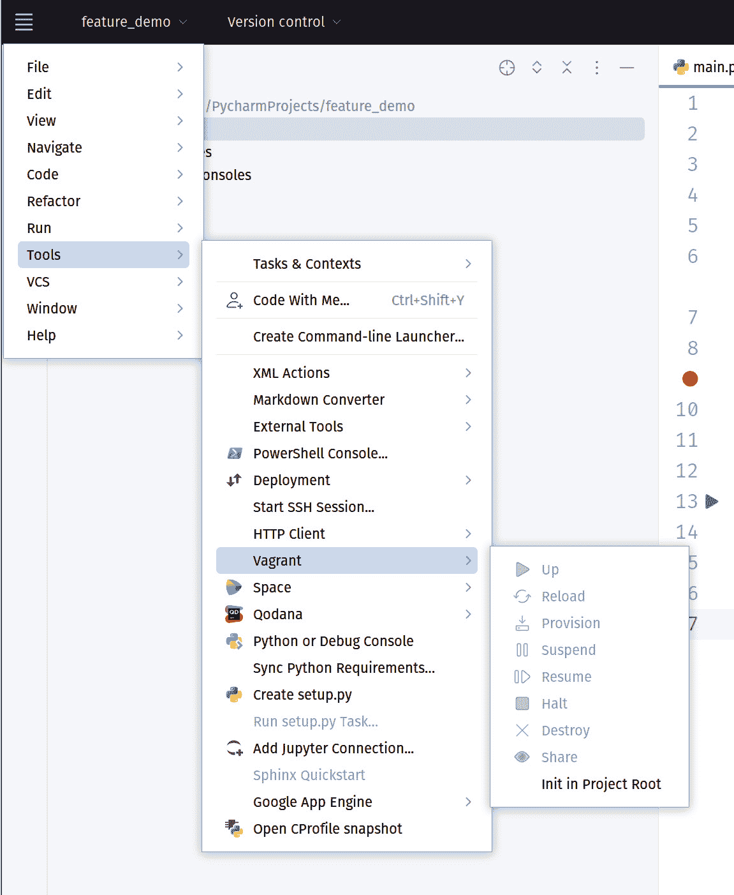

图 16.2：PyCharm 可以直接通过菜单选项支持所有 Vagrant 命令

为了使用 Vagrant，你需要安装它以及一个受支持的虚拟机管理程序。你可以在 [`developer.hashicorp.com/vagrant/tutorials/getting-started/getting-started-install`](https://developer.hashicorp.com/vagrant/tutorials/getting-started/getting-started-install) 找到安装说明。至于虚拟机管理程序，默认是 Oracle VirtualBox。你可以在 [`www.virtualbox.org/wiki/Downloads`](https://www.virtualbox.org/wiki/Downloads) 找到更多关于 VirtualBox 的信息。

一旦安装了这些程序，你就可以使用显示在 *图 16.2* 中的 *在项目根目录中初始化* 选项。

这将提示你通过选择你的 Vagrant 盒子的名称并提供镜像 URL，在项目的根目录下创建一个名为 `Vagrantfile` 的文件。对话框显示在 *图 16.3* 中。

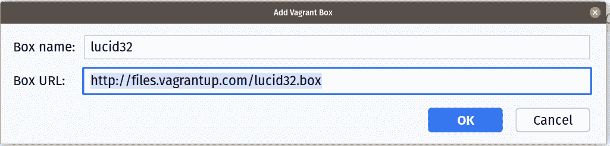

图 16.3：你被提示创建一个带有非常旧默认设置的 Vagrant 盒子

很明显，这是一个非常旧的默认设置，因为 `lucid32` 指的是 Ubuntu 10。在撰写本文时，Ubuntu 的当前版本是 23，而长期支持版本是 22。

如果你认真想要使用更先进的虚拟机，你可能需要找到一个更新的 box 定义。你可以在[`app.vagrantup.com`](https://app.vagrantup.com)找到 box 定义。我在*图 16.4*中这样做，我搜索了`Jammy Jellyfish`，这是**Ubuntu 22**的项目代号，我目前所有生产项目都在使用它。

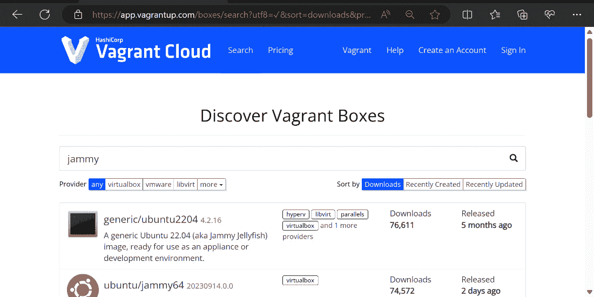

图 16.4：你可以在 Vagrant Cloud 注册表中找到各种预定义的 box

一旦找到你想要使用的，点击它。在*图 16.5*中，我正在点击列表中的第二个条目。

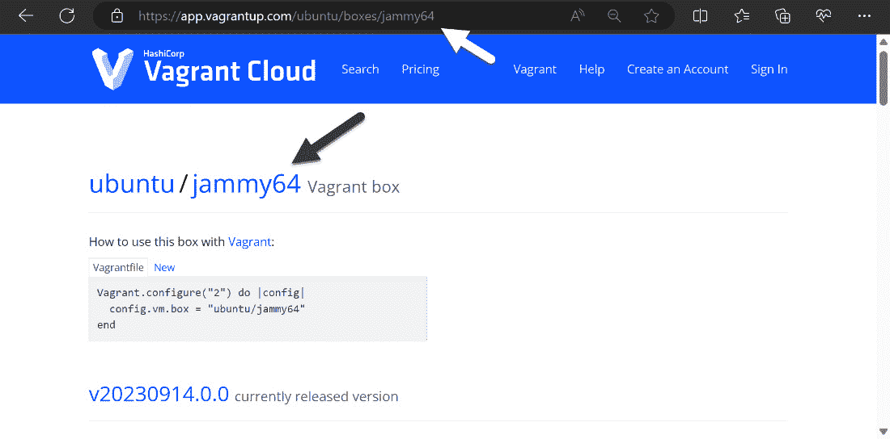

图 16.5：这是 Ubuntu Jammy 64 的 box 定义

现在我们有了 box 定义，请参考*图 16.3*。在第一个字段中，你需要输入*图 16.5*中由深色箭头指示的 box 名称，即`ubuntu/jammy64`。接下来，复制 box 定义 URL 的名称，由*图 16.5*中的浅色箭头指示，在我们的例子中是[`app.vagrantup.com/ubuntu/boxes/jammy64`](https://app.vagrantup.com/ubuntu/boxes/jammy64)。点击**确定**将下载 box 镜像并创建虚拟机。一旦准备好，你会在菜单中看到 Vagrant 的其他工具选项不再被灰色显示，如*图 16.6*所示。生成的 Vagrantfile 是打开的（不是自动的，是我手动做的），你甚至可以看到 PyCharm 在提示我添加新文件到 Git 仓库。

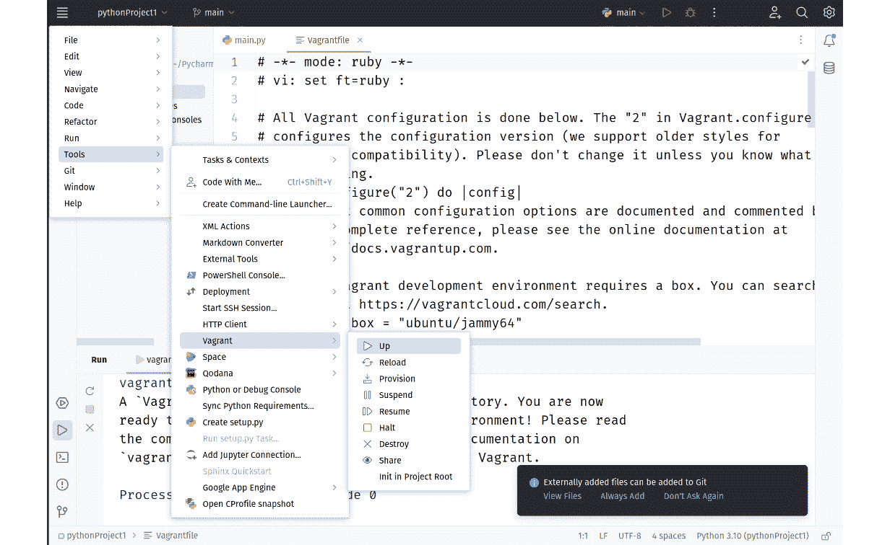

图 16.6：Vagrant 工具选项现在可用

如果你更深入地使用 Vagrant，你会发现，就像 PyCharm 的许多集成一样，IDE 提供了一个图形界面来执行原本可能需要命令行工作流程的操作。你可以使用*图 16.6*中的菜单运行命令，或者你可以在终端中输入命令以实现相同的结果。Packt 有一些关于使用 Vagrant 开发的优秀书籍。我会在本章的*进一步阅读*部分留下一些建议。

使用 Vagrant 有一些显著的优点。你可以让整个开发团队使用相同的开发环境来开发和测试你的应用程序，这个环境就是你将在生产中使用的环境。不再有“*在我的机器上它运行正常*”的情况，这暗示代码是好的，配置问题是罪魁祸首。由于环境配置是标准化的，并且作为代码库的一部分进行维护，只要代码和任何外部配置文件（如`.ini`或`.env`文件）或环境变量也是相同的，项目应该在任何地方都能正常工作。

在 Vagrant 中使用 IaC 可以保护那些不知道如何设置虚拟机的经验不足的开发者，并且它还标准化了构建，使得每个人的虚拟机都是相同的。配置在版本控制系统中跟踪，因此它就像应用程序代码一样跟踪和更新。

## 跟踪你的时间

在我漫长的职业生涯中，我多次为美国政府工作，并且我经营着自己的自由职业实践。在每种情况下，我都需要一种跟踪时间的方法。在政府合同的情况下，我必须将一组计费代码跟踪到 7 分钟间隔。时间跟踪也可以在更合理的环境中应用。我试图将时间跟踪数据与敏捷开发方法（如 Scrum）中使用的难以捉摸的故事点与完成任务所需的时间相关联。根据大多数敏捷方法，人们真的很擅长估计相对大小。但在*图 16**.3*中，你很难准确地告诉豆浆盒相对于咖啡杯的高度，是英寸还是厘米。


图 16.7：豆浆盒有多高？

它是 8 英寸高还是 20 英寸？但如果尝试使用咖啡杯作为你的度量单位来估计大小，你可以更加精确。纸箱大约有二又四分之一咖啡杯高。故事点也是如此，但最终，老板真正想知道某件事需要多长时间。你不能告诉她你将在两杯咖啡后完成她的功能，并期望她对此感到高兴。这可能会引起明显的回应，“太好了，那么它将在我的第二杯咖啡之后完成！”

我先进行正常的故事点估计，然后跟踪我的时间，看看实际花了多长时间，这样我既可以给老板一个答复，也可以在下次估计时做得更好。

要使用 PyCharm 中的时间跟踪功能，你需要连接到服务器。在这里，服务器指的是 PyCharm 支持的项目跟踪服务之一，如*图 16**.4*所示。

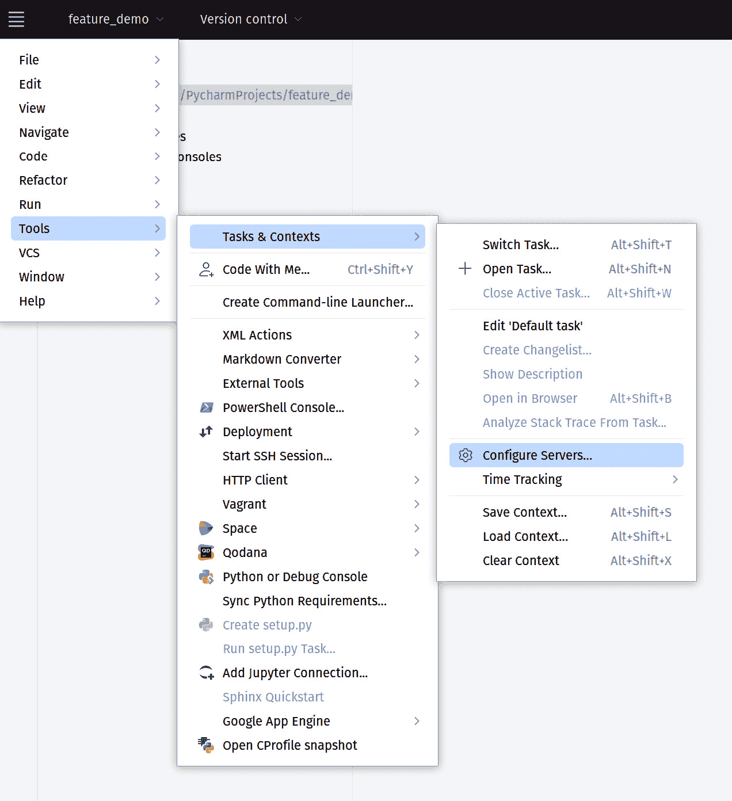

图 16.8：点击“配置服务器”菜单项来配置你的项目跟踪器

当你点击这个菜单项时，你应该会看到*图 16**.5*所示的屏幕。

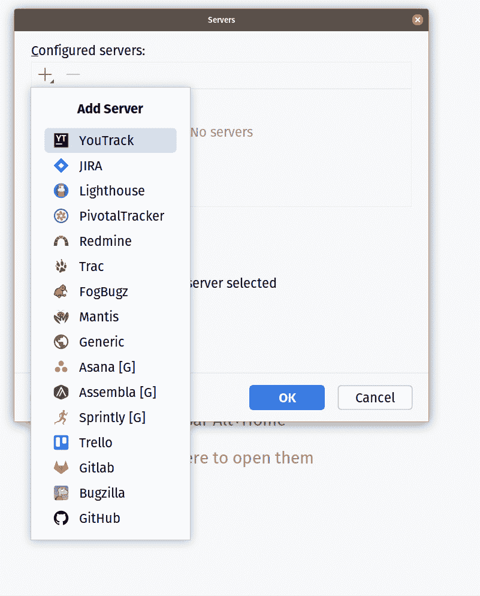

图 16.9：从列表中选择你使用的任何项目跟踪服务

一旦你的服务器注册成功，你将能够选择分配给你的待办事项或问题。*图 16**.6*展示了我的 YouTrack 服务器与**PyCharm Book**中的问题编号**DEMO-20: 完成***第十六章*的集成。

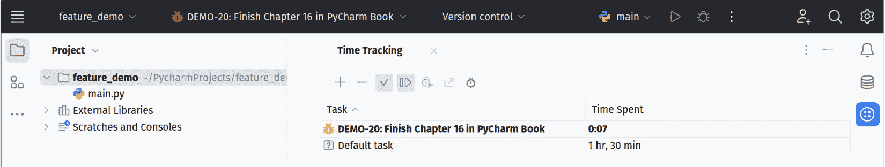

图 16.10：我在这件事上花费的时间会自动跟踪

在你一天中切换任务时，你可以在 IDE 中切换，它会跟踪你在每个任务上花费的时间。然后你可以将你的工作时间同步到服务器，以保持你时间花费的准确统计。

## TODO 列表

这听起来可能和时间跟踪功能有关，但实际上并没有。TODO 列表面板以列表形式显示你代码中的所有 TODO 注释。你可以在图 16.7 中看到一个示例。

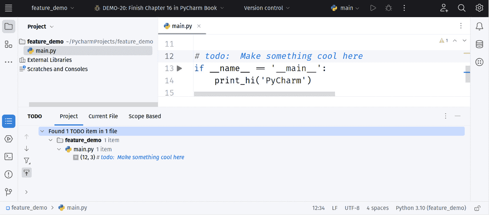

图 16.11：PyCharm 中的 TODO 面板列出了你代码中的所有待办事项，并在你双击时直接跳转到指定行

你可以双击 TODO 项直接跳转到代码中的该行，这样你可以快速找到你之前暂时放弃的地方。

## 宏

宏是一系列记录的按键脚本，可以按顺序回放以创建有用的自动化。在我看来，学会使用这些是软件开发丛林中的必要生存技能。

假设我们需要一个不改变的物品列表来填充 HTML 中的下拉列表框。在这个例子中，我将创建一个包含美国所有 50 个州的`SELECT`标签。自 1959 年以来，这并没有改变，尽管如果我当选皇帝，加拿大和墨西哥将是我名单上的第一个，他们永远不会想到这一点。

在现实中，我需要完成这项工作，而且我绝对不想手动输入所有这些。我向我的好朋友 ChatGPT 请求给我一个按字母顺序排列的 50 个州的列表。结果在章节源代码的`us-states.txt`文件中。

你也会在源代码中找到一个名为`states.html`的 HTML 文件。我已经包含了以下代码：

```py
<form>
    <p>Pick a state:</p>
    <select id="state" name="state">
    </select>
</form>
```

如你所见，`<select>`标签中没有内容，它旨在在由该文件中其余代码定义的 HTML 页面中渲染下拉选择列表。我需要添加州名，使它们看起来像这样：

```py
<option>Alabama</option>
<option>Arkansas</option>
```

对于这 50 个州，我可以使用宏来完成。当然，我也可以让 ChatGPT 为我生成它，但那样就没有悬念了，因为这是一本关于 PyCharm 的书，而不是关于 ChatGPT 的书。

打开章节源代码中的`feature_demo`项目，然后打开`united-states.txt`文件。首先，将光标放在`united-states.txt`文件中的`Alabama`前面，如图 16.9 所示。

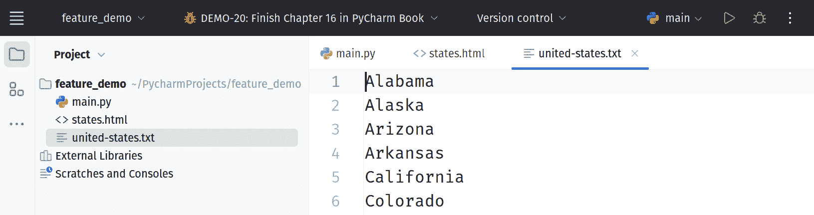

图 16.12：将光标放在阿拉巴马州前面

接下来，点击**编辑 | 宏 | 开始宏录制**，如图 16.10 所示。

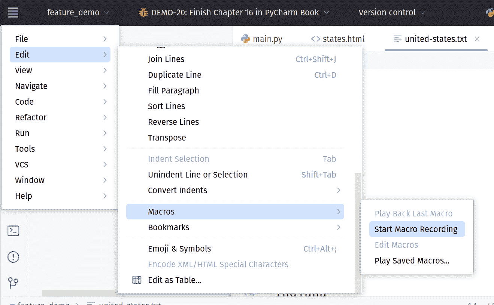

图 16.13：开始录制宏

使用宏录制时，输入 `<option>`。然后按键盘上的 *End* 键（在 Mac 上为 *Cmd + 右箭头*）到达行尾，然后输入 `</option>`。按键盘上的 *下箭头* 键，接着按 *Home* 键（在 Mac 上为 *Cmd + 左箭头*）。此时光标应位于第二行开头，`Arkansas`。回到 *图 16**.10* 中显示的相同菜单项，但请注意 `option-list`。

再次回到 *图 16**.10* 中显示的菜单，您将看到保存的宏名称列表，或者只是一个 `Arkansas` 到 `option` 标签的 `Arkansas`。

您可以将宏映射到键盘快捷键组合，并通过键盘快捷键重复执行操作，这使得重复执行变得非常容易。

如果我坦白的话，PyCharm 中的宏功能还不错，但并不像某些其他工具那样出色。虽然 Ultraedit 和 Notepad++ 都不是 IDE，但它们都拥有非常复杂的宏功能，例如能够回放宏直到文件末尾，或者运行特定次数的宏。PyCharm 的宏对于小任务来说足够好了，但对于更大的任务，您可能需要考虑其他工具。

## 通知

有时 PyCharm 会在屏幕右下角以托盘的形式显示通知。这些消息通常会在几秒钟内消失，但您可以在通知面板中看到它们。您可以在右侧工具栏中找到这个面板，如图 *图 16**.11* 所示。

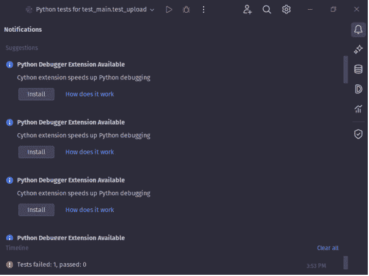

图 16.14：通知面板

您可以通过点击右侧工具栏上的 *铃铛* 图标来切换面板。面板有一个 **时间线** 选项，允许您按时间顺序列出通知。您可以选择删除不再需要的任何通知，或者清除所有通知。

# 2023.2 的新功能

在撰写本书的过程中，许多事情都发生了变化，尤其是在 UI 方面。我使用了构建号 #PY-231.8109.197，或者像我喜欢叫的，*战斗的 197 号*。我整个过程中都保持了相同的版本，没有安装任何更新，因为我希望保持一致性。大约在我开始编写 *第十三章* 的时候，JetBrains 举办了一场在线活动，公布了新的点版本，2023.2。这个新版本包含了大量新功能，但今天当我写 *第十六章*（本章）时，又推出了两个点版本。这种速度可能很大程度上归因于 JetBrain 对 UI 的重新设计。如果你记得本书开头，我们不得不在设置中打开“新 UI”。等你读到这本书的时候，新 UI 将成为默认设置。JetBrains 没有止步于此。UI 一直都可以高度自定义，我们在本书的前几章中对此进行了详细阐述。

新用户界面努力的主要推动之一是简化开发过程。大多数 IDE 都会经历一个增长周期，它们从一个简单且专注的 UI 开始，集成了被视为 IDE 而非增强型文本编辑器所需的最小功能。就在前几天，我突然想到，在我 100%专注于 Python 开发，或者甚至是 JavaScript、Web 或数据库开发的日子里，我真正需要的可能只是一个轻量级的操作系统和 PyCharm。甚至不需要比运行 PyCharm 所需的更多的窗口管理器！

这样一个工具的丰富性带来的问题是，它对于新用户来说可能令人望而生畏，对于老用户来说则显得杂乱无章。我们在*第十五章*中学到，任何 JetBrains IDE 的新功能都是作为插件实现的。这可能导致 UI 杂乱无章，并使 IDE 感觉像是一堆无关的碎片拼凑在一起，用户体验不佳。

新的 UI 旨在通过压缩 UI，展示最常用的工具，并隐藏（但不是删除）更复杂的选项来解决这个问题。我用于书籍的构建版本做得非常好。随着新的点版本发布，我注意到进一步的努力来隐藏复杂性。看看*图 16.13*。

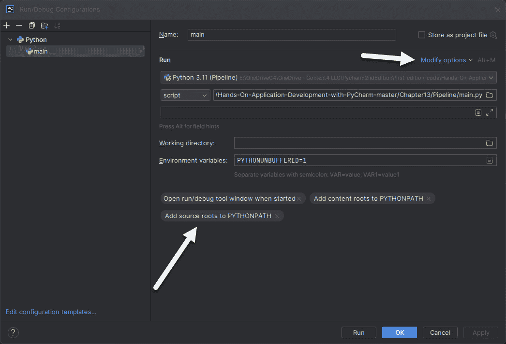

图 16.15：JetBrains 已经将许多设置移动到标签中，而不是有几十个复选框

这是从最近几天发布的最新更新中提取的运行配置，标记为构建号#PY-232.9559.58，构建于 2023 年 8 月 22 日。有两个明显的不同之处。底部有一组标签，以及一个**修改选项**下拉菜单，两者都在*图 16.13*中用箭头指示。与*图 16.14*进行比较。

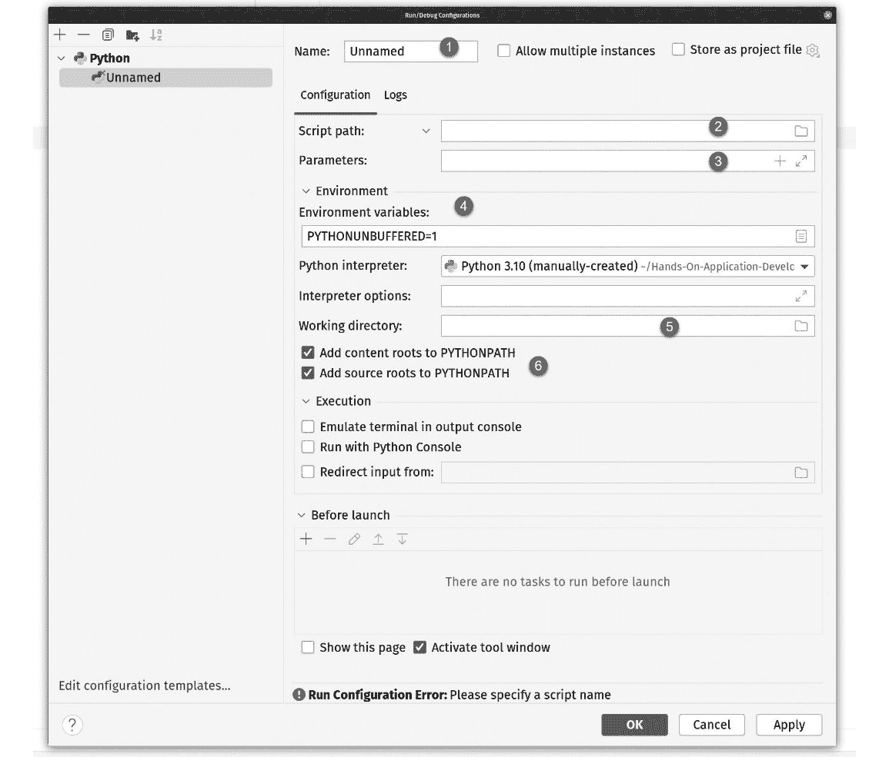

图 16.16：这是*第三章*的旧对话框

所有那些选项仍然存在，但它们已经被整合到**修改选项**下拉菜单中。你实际使用的设置作为标签出现在*图 16.13*的底部。仅仅几个月的变化量是惊人的！

除了产品变化之外，还有一些有趣的新功能添加和改进。

## Black 集成

Black 首次在 PyCon 2019 上推出，是一个不妥协的代码格式化器。自从发布以来，它已经获得了极大的关注和人气，JetBrains 也为 PyCharm 添加了支持。为了使此功能正常工作，需要安装 Black。你可以在[`github.com/psf/black`](https://github.com/psf/black)上找到有关安装的详细信息。如果你使用 Linux，检查你的包管理器。我使用基于 Ubuntu 的 Pop_OS。*图 16.15*显示我已经找到了 Black 作为包，并且我更喜欢以这种方式安装它。

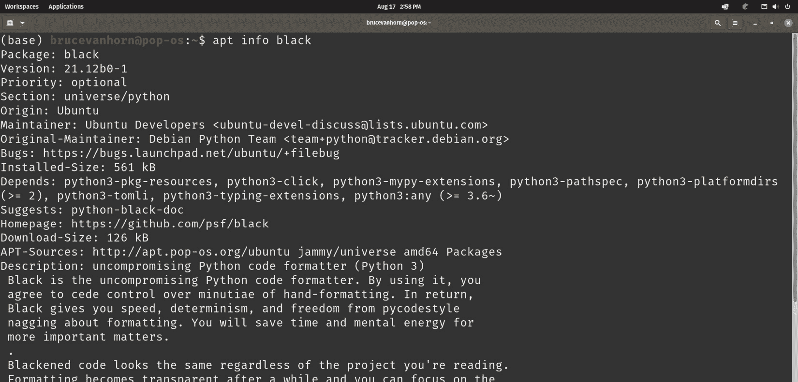

图 16.17：在 Linux 中，你很可能会使用你的包管理器来安装 Black

一旦安装了 Black，你需要根据每个项目来开启它。当你搜索图 16.16 中显示的**设置**对话框中的 Black 时，你会找到这个选项。

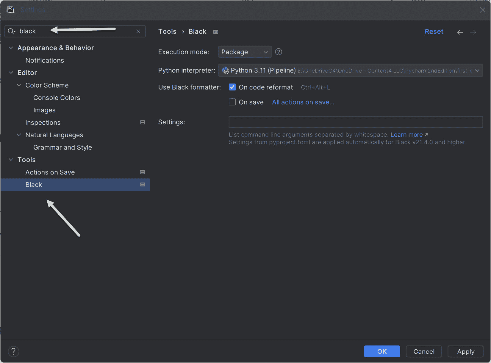

图 16.18：在设置对话框中搜索 Black，你会在工具下找到它

你的格式化选项是`开发`。在我的团队中，我们每个人都会从`开发`分支创建特性分支。如果我正在开发一些新功能，我会从`开发`分支分出一个新分支，命名为`feature/amazing-thing`。接下来，我将创建我的神奇事物，但在这个过程中，我需要修改其他开发者编写的一些文件。自然地，在我提交之前，肌肉记忆会自动使用*Ctrl* + *Alt* + *L*（重新格式化代码）命令来重新格式化。Black 会重新格式化整个文件。当你去合并时，你可能会发现其他开发者已经更改了你重新格式化的某些文件，但他们不太注意重新格式化。即使两个开发者之间实际上只更改了几行，你仍然可能会面临一个丑陋的合并挑战。

这并不是 Black 格式化器的错！如果你使用 PyCharm 的默认代码格式化器，同样的事情也会发生。然而，Black 格式化器是一个更好的解决方案，因为它旨在实现确定性，这是一个复杂的程序员术语，意味着操作的结果总是产生相同的输出。一个不妥协的确定性格式化器应该每次使用时都产生非常一致的结果。

因此，如果你想要开始使用 Black，我的建议是作为一个团队一起行动。让每个人都推送他们的工作，将其合并到一个分支中，然后对整个项目应用 Black。在我的例子中，我会解决我的冲突，然后合并回开发分支。然后我会让所有同事都这样做。一旦开发阶段包含了每个人的更改，冻结代码，并在所有源文件上应用 Black。在冻结期间，不允许任何人单独工作，直到格式化被应用并推送。如果你有一个非常大的代码库，你可能需要分阶段组织你的工作。结果将是值得的！你的代码将符合 PEP-8 标准，你应该会看到更少的合并冲突，尤其是那些由格式化引起的。

Black 可以配置在保存时运行，并且超出 PyCharm 的范围，Black 可以作为你的版本控制或 CI/CD 流程中的一个钩子。

## GitLab 集成

GitHub 是管理代码最流行和最广泛使用的基于云的解决方案。它的阿喀琉斯之踵在于它是基于云的。对于像那些要求其贸易伙伴获得认证（如 **服务组织控制 2**（**SOC2**）认证）的严肃组织来说，他们的知识产权托管在公开可用的平台上通常是不满意的。虽然你可以在 GitHub 上托管私有仓库，但仅仅因为文件不在由认证组织控制的服务器上，就可能成为一个问题。

幸运的是，你可以使用 GitLab 来托管自己的私有 GitHub 服务器。你可以在防火墙后面运行 GitLab，同时对你的安全和基础设施拥有完全的控制权，同时仍然享受到在所有其他方面都相同的 GitHub 体验。你将在 *图 16.17* 中的 **版本控制** 设置中找到 GitLab 集成。

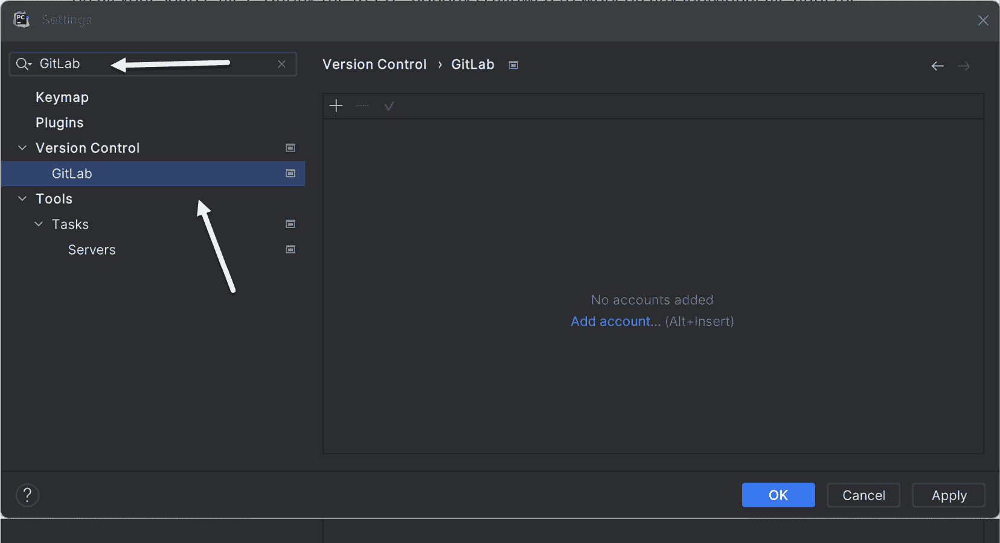

图 16.19：GitLab 设置可以与其他 VCS 设置一起找到

集成相当深入。除了我们在 *第五章* 中介绍的基本内容之外，你还可以直接从 IDE 中处理所有你的拉取请求、审批等。

## 运行任何地方

我们已经有一段时间的 **全局搜索** 功能了。如果你错过了它，你可以双击 **Shift** 键，打开一个对话框，让你在项目中找到任何地方的内容。即使你要找的东西不在代码中，这也同样适用。它可能是在文档、设置或其他地方。

虽然 PyCharm 对于新手来说可能不是新手，但在对话框中按 `?`) 是一个新功能。

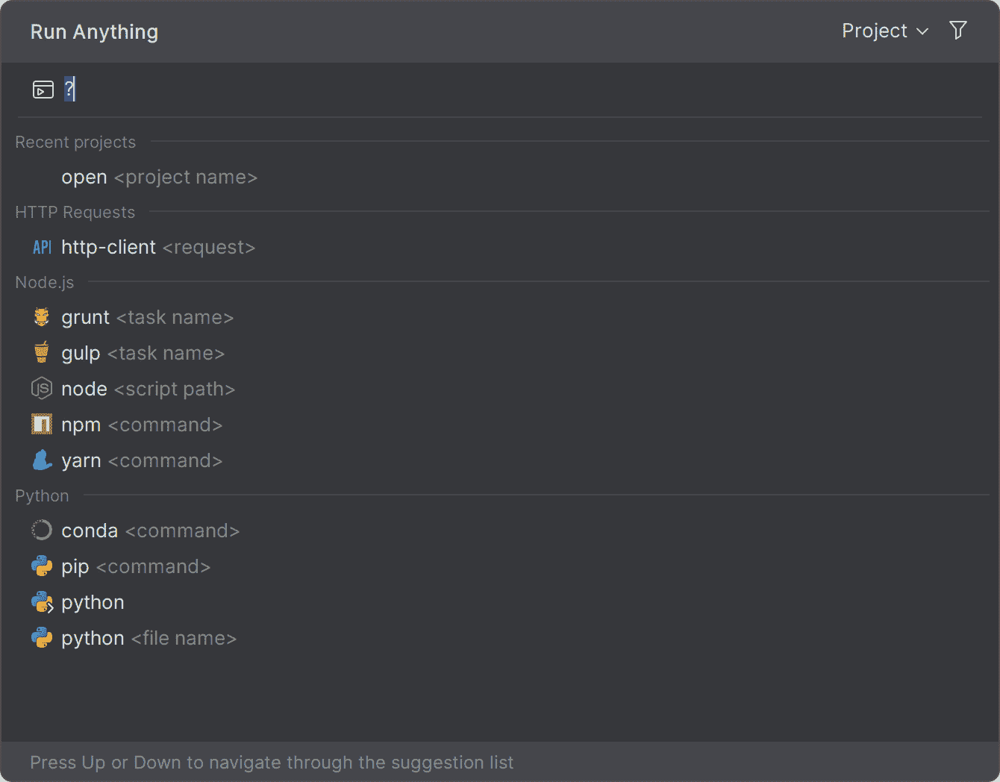

图 16.20：双击 Ctrl 键以打开“运行任何内容”对话框

说出“*你可以运行任何东西！”*已经足够好了。但所有那些批判性思考者会立即追问，“你说的‘任何东西’是什么意思？”在这里，我对问号的回答告诉我可以运行什么。我可以看到，我可以通过简单地输入其名称来运行项目中的任何 Python 脚本。我可以看到，我也可以运行`pip`和`conda`命令。Web 开发者可以运行我们在*第九章*中介绍的 HTTP 请求测试代码。他们还可以通过 npm 运行所有流行的包管理器，例如`package.json`文件，这是明显支持的。当然，我们也可以像运行 Python 一样轻松地运行任何**Node**进程。

## AI 助手

在最近许多 PyCharm 相关活动中，抢尽风头的无疑是 AI 助手。当我写这篇文章时，该功能处于封闭测试阶段，这意味着您必须注册并获得批准才能尝试该功能。请记住，这里展示的任何内容都可能发生变化。

最容易实现的事情，而且有众多插件可以做到这一点，就是为某些在线 AI API 提供一个集成的前端体验。

相比之下，您会发现 AI 助手已集成到 PyCharm 中。要使用 AI 助手，请使用*图 16.19*中显示的右侧菜单。

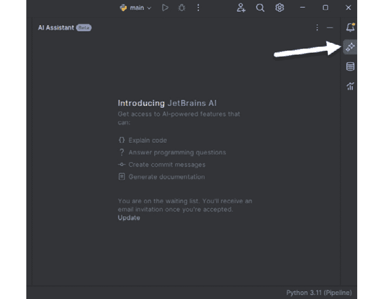

图 16.21：可以通过右侧菜单上的按钮激活 AI 助手

前面的对话框总结了可用的功能。让我们看看。

此功能不是本地的

如果您的公司或环境对将代码发送到 API（如 ChatGPT）有限制，您需要知道这个功能正是这样做的。该功能不是在 PyCharm 内部自包含的，**您输入的任何代码或信息都将发送到各种外部第三方 API**。这一点在您盲目滚动并忽略的协议中有记录，以便您可以使用 PyCharm 和酷炫的新 AI 功能。

### 解释代码

在许多情况下，您可能会遇到不理解代码。我通常用相当生动的语言来描述这些情况，尤其是在截止日期前一天凌晨 2 点。我将努力保持专业：

+   这是由其他人编写的，显然他们不知道自己在做什么。

+   这是由其他人编写的，显然他们比您更擅长。有时这可能是同一个人，具体取决于时间。

+   这是由一个喜欢简洁代码的人编写的，尽管这在 Python 中是一种反模式。

+   代码中包含一个您没有记住的正则表达式，因为即使人们假装了解，也没有正常人类能理解正则表达式。

在这种情况下，帮助就在鼠标点击之间。突出显示有问题的代码，右键点击，并选择**AI 助手操作 | 解释代码**。几秒钟后，AI 将为您提供所选代码的分解。

注意

请记住，AI 助手并不总是正确的，也不总是给出完全合理的建议。

### 回答编程问题

事实上，AI 助手可以回答你提出的任何问题。我曾就 nginx 配置、Docker 和一般网络问题向它提问。当然，它也能回答编程问题。

### 创建提交信息

这个功能真的很棒！我是 XKCD 在线漫画的超级粉丝，他们在许多漫画中对 Git 的处理非常到位。现在我想起了一个：[`xkcd.com/1296/`](https://xkcd.com/1296/)。

由于 IDE 可以看到你的更改列表，它可以为你生成提交信息，如图 *图 16.20* 所示。

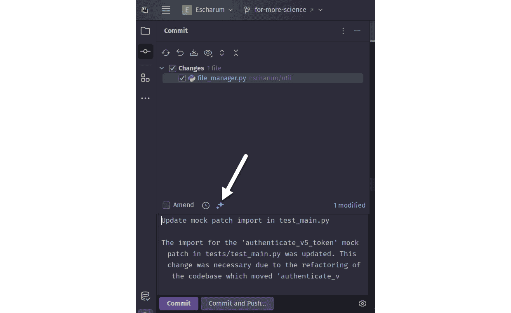

图 16.22：生成的提交信息比“我改了一堆东西”更深入和有意义

也许你对提交信息并不太重视。我曾参与过美国政府项目，那里的提交信息需要接受审计。开发团队并不普遍知道这一点，当他们得知后，选择重置并重新创建每个提交，以移除提交信息中的更生动的语言。审计并不是真的在寻找那个；它被用来验证变更控制流程。我的团队目前正在通过 SOC2 认证，我可以亲身体验到完整且描述性的提交信息非常有帮助。随着网络安全继续侵入开发工作流程，你可以确信这个功能迟早会证明它的价值。

### 生成文档

你讨厌编写文档字符串吗？这是一个陷阱问题。如果你是软件开发人员，你可能认为代码本身就是任何人可能需要的所有文档。但你也曾见过在使用主界面和 SciView 中的文档功能时，良好文档的代码的力量。如果你的函数也能得到良好的文档，而不需要你自己编写这些文档，那岂不是很好？*图 16.21* 显示了我正在为我项目中的一个函数生成文档字符串。

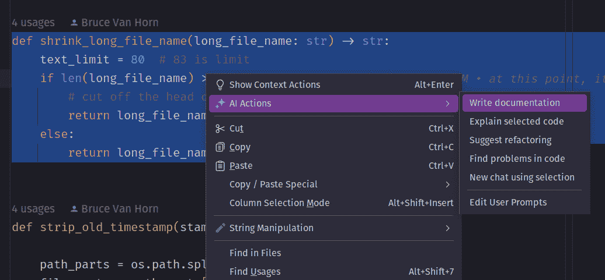

图 16.23：不要编写文档，生成它

在这种情况下，文档实际上只是另一种形式的模板。你应该让 IDE 为你生成这些文档，然后如果需要的话，再对其进行改进。

## Polars 对 Jupyter Notebook 的支持

虽然 pandas 很强大，但对于大数据来说，它太慢了。Spark 和其他大数据框架可以提供帮助，但只能通过横向扩展来实现，这涉及到在你的网络上设置多个计算节点。**Polars** 是一个数据科学库，旨在允许你无需使用多台计算机即可处理大量数据，并且长期以来一直是 PyCharm 中的一个请求功能。如果你的 DataFrame 可以适应你的计算机内存，你就可以在 Polars 中使用它，并在 PyCharm 中查看，就像使用任何其他 DataFrame 一样。

此外，PyCharm 支持 **Plotly** 库进行可视化，该库独特地与 Polars 数据帧一起工作。当你结合 PyCharm 对这些高级库的支持时，你可以克服许多通常被列为使用 Polars 的障碍。

# 摘要和结束语

我们在短时间内覆盖了大量的内容！至少对我来说是这样的，因为在许多这些章节中，我非常想跳入我们正在讨论的主题的教程。例如，在 Flask 和 Django 章节中，我觉得没有给你 Flask 和 Django 的教程是“错误的”。我没有这样做，因为那些书实际上本身就是一本，无论是在 Packt 图书馆内部还是外部。

我们了解到 IDE 的目的是为你提供一套完整的工具，以应对你每天可能执行的所有开发任务。从这个角度来看，PyCharm 是一个惊人的 IDE，它实际上几乎没有竞争对手。

我们看到了如何通过自动化创建虚拟环境等过程来简化设置简单 Python 项目的基礎。PyCharm 专业版具有许多用于项目创建的附加功能，主要围绕通用软件开发、全栈 Web 开发和数据科学领域中最流行的项目类型的项目模板。甚至还有一个专门用于教育用途的版本，它允许你创建直接在 IDE 中播放的交互式课程。我们没有讨论这一点，但如果你对它感兴趣，我将在 *进一步阅读* 部分留下一个链接。

全栈 Web 开发者拥有 PyCharm 工具集中很大一部分是专门针对他们的工作。我们看到了所有主要框架的支持，而且支持并不局限于 Python。PyCharm 可以做到 WebStorm 可以做到的任何关于 JavaScript 开发的事情，以及与现代 JavaScript UI 框架（如 Angular、Vue、Vite 和 React）一起工作。

PyCharm 确实为与关系型和非关系型数据库交互提供了完整的工具集。这个功能集主要来自 DataGrip，这是 JetBrains 的一个专注于数据库的 IDE，它完全专注于创建和开发关系结构。它对 MongoDB 和 Redis 提供了全面的支持，这两个都是我每天都会使用的。在我通常需要切换到 Studio 3T 或 Redis Insights 等工具的地方，我可以在 PyCharm 中停留。支持的平台多样性令人印象深刻！有数十种支持的数据库，有时只是看看列表，然后查找你从未听说过的那些数据库，也是一种乐趣。

在介绍了数据库之后，我们学习了 PyCharm 为数据科学领域带来的好处。你可以通过利用 IPython 中的代码单元格来使用我所说的 Jupyter Notebooks 的轻量级版本。我在工作中并不是每天都会做数据科学，但有时我喜欢假装自己是。在第十二章和第十三章中涵盖的代码单元格功能对于集成多个 API 或微服务之类的任务非常有用。我可以创建一个原型脚本，使用从不同 API 或微服务中提取数据的单元格，将它们扔进 pandas DataFrame 中，即使我不需要在我的实际程序中保留 DataFrame 调用，我也可以使用 SciView 来查看结果。仅仅能够将数据以几个并排的简单表格可视化，就可以有很大的帮助。

如果你是一名数据科学从业者，随着 Jupyter Notebooks 集成等工具的支持增长，PyCharm 成为你整个工作流程的一站式工具。这就是这个工具针对其三个不同受众的目的。

当 Packt 出版社邀请我写这本书时，我既兴奋又感到畏惧。我之所以兴奋，是因为我刚刚得知 LinkedIn Learning 已经下架了我的 PyCharm 课程，而这正是我个人的最爱之一。这本书给了我一个机会，可以比在 2 小时的视频课程中做得更深入。如果你喜欢 2 小时的视频课程，我还在 LinkedIn 上留有一门关于使用 Flask 开发 API 的课程。我怀疑他们不会保持太久，所以如果你感兴趣，请确保在他们下架之前查看。我会在*进一步阅读*部分放一个链接。我的新视频课程可以在我的课程网站上找到，[`maddevskilz.com`](https://maddevskilz.com)。自然地，关于 Python 的任何内容都会以 PyCharm 作为 IDE。

写这本书的想法令人畏惧，因为在这个 IDE 中包含的内容如此之多（Packt？），实际上我也知道自己不知道什么。我并不全知。当我开始时，我确实发现了一些我不知道的功能。我可能做了一些错误的事情。没关系（我希望）。结束这本书只是我在一条旅程上的一个时间点，对我来说，这条旅程始于七年前的某个时刻，当时我对 Visual Studio 和 C#的 Web 开发感到厌倦。当我看到在 Flask 中创建应用程序有多容易，然后又看到 PyCharm 如何让像我这样的初学者也能真正完成工作，我就上瘾了。写这样一本书是一项巨大的责任，可能产生巨大的影响。编码是一种真正的超级力量。与电影中的大多数超级力量不同，这是一种可以教授的超级力量。没有必要来自遥远的星球，被放射性蜘蛛咬伤，或者被注射实验血清。虽然这些可能有所帮助，但你真正需要的是毅力、好奇心和付出努力。如果你在这方面哪怕只有一点点的掌握，你也能做大事。

我曾有机会开发一款帮助选择前列腺癌患者治疗方案软件。这个项目最终没有取得进展，但在我搁置项目一年后，我的父亲打电话告诉我，他刚刚被诊断出患有前列腺癌。这个故事的一个额外寓意是永远不要删除你的旧代码库！我的父亲本身也是一位病理学家，在算法创建者的帮助下，我们用程序运行了我父亲的检查数据，最终的治疗方案让我又多陪了他 8 年。

我还参与过旨在帮助保护我的国家、在美国海军陆战队训练飞行员以及管理 IT 资产的项目。当我参与这些项目时，它们只是项目。它们是我必须完成的截止日期，也是压力的来源。但每一款发布的软件，实际上我们写的每一行代码，都有潜力让周围的世界变得更好！有时好处是显而易见的，就像癌症治疗软件那样。即使是具有平凡目的的软件，比如企业存储容量规划，也能产生深远的影响，因为这也是一个让他人能够做他们想做的事情、建造他们想建造的东西的工具。

还要考虑到，我们的超级力量可以大规模运作。超人只能在一个地方出现一次；这是一个被各种超级恶棍频繁利用的事实。我们在这方面没有限制。有多个应用商店中的应用程序可以帮助阅读障碍儿童学习阅读。那个下载了数万次的单一应用程序可以教育那些在大多数国家的公共教育体系中可能会被边缘化或忽视的几代人，这些国家更重视考试成绩和资金而非结果。

你拥有超能力！利用它！这些工具使它变得更容易！如果我已经吸引到哪怕一个人，并且他们从我所得到的这个工具和这种语言中受益，那么对我来说，这本书就是一个巨大的成功。

# 进一步阅读

一定要查看本书的配套网站 [`www.pycharm-book.com`](https://www.pycharm-book.com)，以及以下有用的资源：

+   布朗顿，A. (2018) 《使用 Vagrant 的实践 DevOps》。Packt。

+   使用 Python 3 和 Flask 构建 RESTful API（linkedin.com）：[`www.linkedin.com/learning/building-restful-apis-with-flask/restful-apis-with-python-3-and-flask-4`](https://www.linkedin.com/learning/building-restful-apis-with-flask/restful-apis-with-python-3-and-flask-4 )

+   Polars 库：[`www.pola.rs/`](https://www.pola.rs/ )

+   Python 的 Plotly 库：[`plotly.com/python/`](https://plotly.com/python/ )

+   PyCharm 教育版：[`www.jetbrains.com/pycharm-edu/`](https://www.jetbrains.com/pycharm-edu/)

+   HashiCorp Vagrant：[`www.vagrantup.com/`](https://www.vagrantup.com/ )

+   HashiCorp Terraform：[`www.terraform.io/`](https://www.terraform.io/)

+   Docker 桌面：[`www.docker.com/products/docker-desktop/`](https://www.docker.com/products/docker-desktop/ )

+   Oracle VirtualBox：[`www.virtualbox.org/`](https://www.virtualbox.org/ )

+   JetBrains 人工智能助手：[`blog.jetbrains.com/idea/2023/06/ai-assistant-in-jetbrains-ides/`](https://blog.jetbrains.com/idea/2023/06/ai-assistant-in-jetbrains-ides/)
