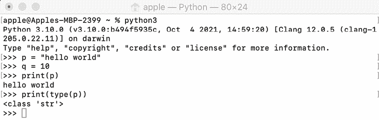
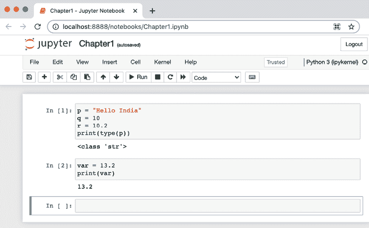
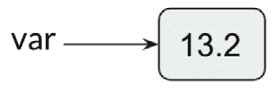
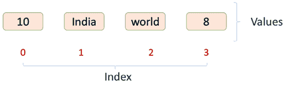
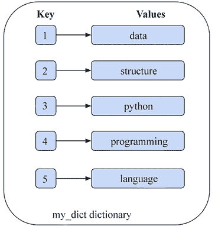
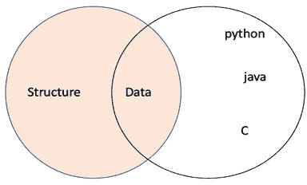

# 第一章：Python 数据类型和结构

数据结构和算法是任何软件开发的重要组件。算法可以被定义为解决任何给定问题的一系列逐步指令；算法处理数据并根据特定问题产生输出结果。算法用于解决问题的数据必须在计算机内存中高效存储和组织，以便软件的高效实现。系统的性能取决于数据的有效访问和检索，这取决于存储和组织系统数据的结构选择是否得当。

数据结构处理在程序中将使用的数据在计算机内存中的存储和组织方式。计算机科学家应该了解算法的效率以及在其实现中应该使用哪种数据结构。Python 编程语言是一种强大、功能丰富且广泛使用的语言，用于开发基于软件的系统。Python 是一种高级、解释型、面向对象的语言，非常便于学习和理解数据结构和算法的概念。

在本章中，我们简要回顾了我们将用于实现本书中讨论的各种数据结构的 Python 编程语言组件。对于更广泛的 Python 语言讨论，请参阅 Python 文档：

+   [`docs.python.org/3/reference/index.html`](https://docs.python.org/3/reference/index.html)

+   [`docs.python.org/3/tutorial/index.html`](https://docs.python.org/3/tutorial/index.html)

在本章中，我们将探讨以下主题：

+   介绍 Python 3.10

+   安装 Python

+   设置 Python 开发环境

+   数据类型和对象概述

+   基本数据类型

+   复杂数据类型

+   Python 的 collections 模块

# 介绍 Python 3.10

Python 是一种解释型语言：语句逐行执行。它遵循面向对象编程的概念。Python 是动态类型的，这使得它成为脚本和许多平台上快速开发的首选语言。其源代码是开源的，有一个非常大的社区在持续快速地使用和开发它。Python 代码可以用任何文本编辑器编写，并保存为`.py`文件扩展名。Python 由于其简洁性和优雅的语法，易于使用和学习。

由于 Python 语言将被用于编写算法，因此提供了如何设置环境以运行示例的解释。

# 安装 Python

Python 预安装在基于 Linux 和 Mac 的操作系统上。然而，您可能想要安装最新版本的 Python，这可以通过以下说明在不同的操作系统上完成。

## Windows 操作系统

对于 Windows 系统，Python 可以通过可执行的 `.exe` 文件进行安装。

1.  访问 [`www.python.org/downloads/`](https://www.python.org/downloads/)。

1.  根据你的架构选择 Python 的最新版本——目前是 3.10.0。如果你有 32 位版本的 Windows，请选择 32 位安装程序；否则，请选择 64 位安装程序。

1.  下载 `.exe` 文件。

1.  打开 `python-3.10.0.exe` 文件。

1.  确保检查**将 Python 3.10.0 添加到 PATH**。

1.  点击**立即安装**，然后等待安装完成；现在你可以使用 Python 了。

1.  要验证 Python 是否正确安装，请在命令提示符中输入 `python -–version` 命令。它应该输出 `Python 3.10.0`。

## 基于 Linux 的操作系统

要在 Linux 机器上安装 Python，请按照以下步骤操作：

1.  通过在终端中输入 `python --version` 命令来检查你是否已预先安装了 Python。

1.  如果你还没有 Python 版本，可以通过以下命令进行安装：

    ```py
    sudo apt-get install python3.10 
    ```

1.  现在，通过在终端中输入 `python3.10 --version` 命令来验证你是否已正确安装 Python。它应该输出 `Python 3.10.0`。

## Mac 操作系统

要在 Mac 上安装 Python，请按照以下步骤操作：

1.  访问 [`www.python.org/downloads/`](https://www.python.org/downloads/)。

1.  下载并打开 `Python 3.10.0` 的安装程序文件。

1.  点击**立即安装**。

1.  要验证 Python 是否正确安装，请在终端中输入 `python –version` 命令。它应该输出 `Python 3.10.0`。

# 设置 Python 开发环境

一旦成功在你的操作系统上安装了 Python，你就可以开始使用数据结构和算法进行实践了。有两种流行的方法来设置开发环境。

## 通过命令行进行设置

设置 Python 执行环境的第一个方法是使用命令行，在你的操作系统上安装 Python 软件包后。可以通过以下步骤进行设置。

1.  在 Mac/Linux OS 上打开终端或在 Windows 上打开命令提示符。

1.  执行 Python 3 命令以启动 Python，或在 Windows 命令提示符中简单地输入 `py` 来启动 Python。

1.  命令可以在终端中执行。



图 1.1：Python 命令行界面的截图

命令行执行环境的用户界面如图 *1.1* 所示。

## 通过 Jupyter Notebook 进行设置

运行 Python 程序的第二种方法是使用 Jupyter Notebook，这是一个基于浏览器的界面，我们可以在这里编写代码。Jupyter Notebook 的用户界面如图 *1.2* 所示。我们可以编写代码的地方被称为“单元格”。



图 1.2：Jupyter Notebook 界面截图

Python 安装完成后，在 Windows 上，可以通过以下步骤轻松安装和设置 Jupyter Notebook，使用名为 Anaconda 的科学 Python 发行版。

1.  从[`www.anaconda.com/products/individual`](https://www.anaconda.com/products/individual)下载 Anaconda 发行版。

1.  按照安装说明进行安装。

1.  安装完成后，在 Windows 上，我们可以通过在命令提示符中执行`jupyter notebook`命令来运行笔记本。或者，安装后，可以从任务栏中搜索并运行`Jupyter Notebook`应用程序。

1.  在 Linux/Mac 操作系统上，可以通过在终端中运行以下代码使用`pip3`安装 Jupyter Notebook：

    ```py
    pip3 install notebook 
    ```

1.  安装 Jupyter Notebook 后，我们可以在终端中执行以下命令来运行它：

    ```py
    jupyter notebook 
    ```

    在某些系统上，此命令可能不起作用，这取决于操作系统或系统配置。在这种情况下，应在终端中执行以下命令以启动 Jupyter Notebook。

    ```py
    python3 -m notebook 
    ```

重要的是要注意，我们将使用 Jupyter Notebook 执行本书中的所有命令和程序，但如果您愿意，代码也可以在命令行中运行。

# 数据类型和对象概述

给定一个问题，我们可以通过编写计算机程序或软件来计划解决它。第一步是开发算法，本质上是一系列计算机系统将遵循的指令，以解决问题。算法可以使用任何编程语言转换为计算机软件。总是希望计算机软件或程序尽可能高效和快速；计算机程序的性能或效率也高度依赖于数据如何在计算机内存中存储，然后将在算法中使用。

在算法中使用的数据必须存储在变量中，这些变量取决于将要存储在其中的值的类型。这些被称为*数据类型*：整数变量只能存储整数，浮点变量可以存储实数、字符等。变量是存储值的容器，而值是不同数据类型的内 容。

在大多数编程语言中，变量及其数据类型必须最初进行声明，然后才能在那些变量中静态存储那种类型的数据。然而，在 Python 中并非如此。Python 是一种动态类型语言；变量的数据类型不需要显式定义。Python 解释器在运行时隐式地将变量的值与其类型绑定。在 Python 中，可以使用`type()`函数检查变量的数据类型，该函数返回传入变量的类型。例如，如果我们输入以下代码：

```py
p = "Hello India"
q = 10
r = 10.2
print(type(p))
print(type(q))
print(type(r))
print(type(12+31j)) 
```

我们将得到以下类似的输出：

```py
<class 'str'>
<class 'int'>
<class 'float'>
<class 'complex'> 
```

以下示例演示了一个具有`var`浮点值的变量，该值被替换为字符串值：

```py
var = 13.2
print(var)

print(type (var))

var = "Now the type is string"
print(type(var)) 
```

代码的输出如下：

```py
13.2
<class 'float'> 
<class 'str'> 
```

在 Python 中，每个数据项都是特定类型的对象。考虑前面的例子；在这里，当变量 `var` 被赋予值 `13.2` 时，解释器最初创建一个值为 `13.2` 的浮点对象；然后变量 `var` 指向该对象，如图 *图 1.3* 所示：



图 1.3：变量赋值

Python 是一种易于学习的面向对象语言，拥有丰富的内置数据类型。主要内置类型如下，将在以下章节中详细讨论：

+   数值类型：`整数（int`）、`浮点数（float`）、`复数（complex`）

+   布尔类型：`bool`

+   序列类型：`字符串（str`）、`range`、`列表（list`）、`元组（tuple`）

+   映射类型：`字典（dict`）

+   集合类型：`集合（set`）、`冻结集合（frozenset`）

我们将这些分为基本类型（数值、布尔型和序列型）和复杂类型（映射型和集合型）。在后续章节中，我们将逐一详细讨论它们。

# 基本数据类型

最基本的数据类型是数值型和布尔型。我们首先介绍这些类型，然后是序列数据类型。

## 数值型

数值数据类型变量存储数值。整数、浮点数和复数值属于此数据类型。Python 支持三种类型的数值：

+   **整数**（**int**）：在 Python 中，解释器将一系列十进制数字视为十进制值，例如整数 `45`、`1000` 或 `-25`。

+   **浮点数**：Python 将具有浮点值的值视为浮点类型；它用小数点指定。它用于存储浮点数，如 `2.5` 和 `100.98`。它精确到 `15` 位小数。

+   **复数**：复数使用两个浮点值表示。它包含一个有序对，例如 a + *i*b。在这里，a 和 b 表示实数，*i* 表示虚数部分。复数的形式为 `3.0 + 1.3i`、`4.0i` 等。

## 布尔型

这将提供一个 `True` 或 `False` 的值，检查任何语句是否为真或假。`True` 可以用任何非零值表示，而 `False` 可以用 0 表示。例如：

```py
print(type(bool(22)))
print(type(True))
print(type(False)) 
```

输出将如下所示：

```py
<class 'bool'>
<class 'bool'>
<class 'bool'> 
```

在 Python 中，可以使用内置的 `bool()` 函数将数值用作布尔值。任何值为零的数字（整数、浮点数、复数）被视为 `False`，而非零值被视为 `True`。例如：

```py
bool(False)
print(bool(False))
va1 = 0
print(bool(va1))
va2 = 11
print(bool(va2))
va3 = -2.3
print(bool(va3)) 
```

上述代码的输出将如下所示。

```py
False
False
True
True 
```

序列数据类型也是一种非常基本且常见的类型，我们将在下一节中探讨。

## 序列

序列数据类型用于以有组织和高效的方式在单个变量中存储多个值。有四种基本序列类型：字符串、范围、列表和元组。

### 字符串

字符串是一个不可变的字符序列，可以用单引号、双引号或三引号表示。

不可变意味着一旦数据类型被赋予某个值，就不能更改。

Python 中的字符串类型称为`str`。三引号字符串可以跨越多行，包括字符串中的所有空白。例如：

```py
str1 = 'Hello how are you'
str2 = "Hello how are you"
str3 = """multiline 
       String"""
print(str1)
print(str2)
print(str3) 
```

输出将如下所示：

```py
Hello how are you
Hello how are you
multiline 
String 
```

`+`运算符用于连接字符串，连接操作数后返回一个字符串。例如：

```py
f = 'data' 
s = 'structure'
print(f + s)
print('Data ' + 'structure') 
```

输出将如下所示：

```py
datastructure
Data structure 
```

可以使用`*`运算符创建字符串的多个副本。当它与一个整数（例如*n*）和一个字符串一起使用时，`*`运算符返回一个由*n*个字符串连接副本组成的字符串。例如：

```py
st = 'data.'
print(st * 3)
print(3 * st) 
```

输出将如下所示。

```py
data.data.data.
data.data.data. 
```

### 范围

`range`数据类型表示一个不可变的数字序列。它主要用于`for`和`while`循环中。它返回从给定数字开始到由函数参数指定的数字的序列。它用于以下命令中：

```py
range(start, stop, step) 
```

在这里，`start`参数指定序列的开始，`stop`参数指定序列的结束限制，`step`参数指定序列应如何增加或减少。以下 Python 代码示例演示了`range`函数的工作原理：

```py
print(list(range(10)))
print(range(10))
print(list(range(10)))
print(range(1,10,2))
print(list(range(1,10,2)))
print(list(range(20,10,-2))) 
```

输出将如下所示。

```py
[0, 1, 2, 3, 4, 5, 6, 7, 8, 9]
range(0, 10)
[0, 1, 2, 3, 4, 5, 6, 7, 8, 9]
range(1, 10, 2)
[1, 3, 5, 7, 9]
[20, 18, 16, 14, 12] 
```

### 列表

Python 列表用于在单个变量中存储多个项目。列表中允许有重复值，并且元素可以是不同类型：例如，Python 列表中可以同时包含数字和字符串数据。

列表中存储的项目用方括号`[]`括起来，并用逗号分隔，如下所示：

```py
a = ['food', 'bus', 'apple', 'queen']
print(a)
mylist  = [10, "India", "world", 8] 
# accessing elements in list.
print(mylist[1]) 
```

上述代码的输出将如下所示。

```py
['food', 'bus', 'apple', 'queen']
India 
```

列表的数据元素在*图 1.4*中显示，显示了列表中每个元素的索引值：



图 1.4：样本列表的数据元素

Python 列表的特点如下。首先，可以通过索引访问列表元素，如*图 1.4*所示。列表元素是有序和动态的。它可以包含任何所需的任意对象。此外，`list`数据结构是可变的，而大多数其他数据类型，如`integer`和`float`是不可变的。

由于列表是可变的数据类型，一旦创建，列表元素可以添加、删除、移动和在列表内移动。

下面的*表 1.1*中解释了列表的所有属性，以提供更清晰的说明：

| **属性** | **描述** | **示例** |
| --- | --- | --- |
| **有序** | 列表元素按照在定义时在列表中指定的顺序进行排序。这种顺序不需要改变，并且在其生命周期内保持固有。 |

```py
[10, 12, 31, 14] == [14, 10, 31, 12] 
```

```py
False 
```

|

| **动态** | 列表是动态的。它可以通过添加或删除列表项来根据需要增长或缩小。 |
| --- | --- |

```py
b = ['data', 'and', 'book', 'structure', 'hello', 'st']
b += [32]
print(b)
b[2:3] = []
print(b)
del b[0]
print(b) 
```

```py
['data', 'and', 'book', 'structure', 'hello', 'st', 32]
['data', 'and', 'structure', 'hello', 'st', 32]
['and', 'structure', 'hello', 'st', 32] 
```

|

| **列表元素可以是任何任意对象集合** | 列表元素可以是相同类型或不同数据类型。 |
| --- | --- |

```py
a = [2.2, 'python', 31, 14, 'data', False, 33.59]
print(a) 
```

```py
[2.2, 'python', 31, 14, 'data', False, 33.59] 
```

|

| **列表元素可以通过索引访问** | 可以使用基于零的索引在方括号中访问元素，类似于字符串。访问列表中的元素类似于字符串；负列表索引在列表中也可以使用。列表还支持切片。如果`abc`是一个列表，则表达式`abc[x:y]`将返回从索引`x`到索引`y`（不包括索引`y`）的元素部分 |
| --- | --- |

```py
a = ['data', 'structures', 'using', 'python', 'happy', 'learning']
print(a[0])
print(a[2])
print(a[-1])
print(a[-5])
print(a[1:5])
print(a[-3:-1]) 
```

```py
data
using
learning
structures
['structures', 'using', 'python', 'happy']
['python', 'happy'] 
```

|

| **可变** | 单个列表值：可以通过索引和简单赋值更新列表中的元素。也可以通过切片修改多个列表值。 |
| --- | --- |

```py
a = ['data', 'and', 'book', 'structure', 'hello', 'st']
print(a)
a[1] = 1
a[-1] = 120
print(a)
a = ['data', 'and', 'book', 'structure', 'hello', 'st']
print(a[2:5])
a[2:5] = [1, 2, 3, 4, 5]
print(a) 
```

|

| |
| --- |

```py
['data', 'and', 'book', 'structure', 'hello', 'st']
['data', 1, 'book', 'structure', 'hello', 120]
['book', 'structure', 'hello']
['data', 'and', 1, 2, 3, 4, 5, 'st'] 
```

|

| **其他运算符** | 几种运算符和内置函数也可以应用于列表，例如`in`、`not in`、连接运算符（`+`）和复制运算符（`*`）。此外，还有其他内置函数，如`len()`、`min()`和`max()`，也是可用的。 |
| --- | --- |

```py
a = ['data', 'structures', 'using', 'python', 'happy', 'learning']
print('data' in a)
print(a)
print(a + ['New', 'elements'])
print(a)
print(a *2)
print(len(a))
print(min(a)) 
```

```py
['data', 'structures', 'using', 'python', 'happy', 'learning']
['data', 'structures', 'using', 'python', 'happy', 'learning', 'New', 'elements']
['data', 'structures', 'using', 'python', 'happy', 'learning']
['data', 'structures', 'using', 'python', 'happy', 'learning', 'data', 'structures', 'using', 'python', 'happy', 'learning']
6
data 
```

|

表 1.1：具有示例的列表数据结构特征

现在，在讨论列表数据类型时，我们应该首先了解不同的运算符，例如成员、身份和逻辑运算符，然后再讨论它们以及它们如何在列表数据类型或其他数据类型中使用。在下一节中，我们将讨论这些运算符的工作原理以及它们在各种数据类型中的应用。

## 成员、身份和逻辑操作

Python 支持成员、身份和逻辑运算符。Python 中的几种数据类型支持这些运算符。为了理解这些运算符的工作原理，我们将在本节中讨论这些操作。

### 成员运算符

这些运算符用于验证项的成员资格。成员资格意味着我们希望测试给定的值是否存储在序列变量中，例如字符串、列表或元组。成员运算符用于测试序列中的成员资格；即字符串、列表或元组。Python 中使用的两个常见成员运算符是`in`和`not in`。

`in`运算符用于检查一个值是否存在于一个序列中。如果它在指定的序列中找到给定的变量，则返回`True`；如果没有找到，则返回`False`：

```py
# Python program to check if an item (say second 
# item in the below example) of a list is present 
# in another list (or not) using 'in' operator
mylist1 = [100,20,30,40]
mylist2 = [10,50,60,90]
if mylist1[1] in mylist2:
    print("elements are overlapping") 
else:
    print("elements are not overlapping") 
```

输出将如下所示：

```py
elements are not overlapping 
```

如果在指定的序列中找不到变量，则`not in`运算符返回`True`；如果找到，则返回`False`：

```py
val = 104
mylist = [100, 210, 430, 840, 108]
if val not in mylist:
    print("Value is NOT present in mylist")
else:
    print("Value is  present in mylist") 
```

输出将如下所示。

```py
Value is NOT present in mylist 
```

### 身份运算符

身份运算符用于比较对象。不同的身份运算符类型是`is`和`is not`，定义如下。

`is`运算符用于检查两个变量是否指向同一个对象。这与相等运算符（`==`）不同。在相等运算符中，我们检查两个变量是否相等。如果两边变量指向同一个对象，则返回`True`；如果不指向同一个对象，则返回`False`：

```py
Firstlist = []
Secondlist = []
if Firstlist == Secondlist: 
    print("Both are equal")
else:
    print("Both are not equal")
if Firstlist is Secondlist:
    print("Both variables are pointing to the same object")
else:
    print("Both variables are not pointing to the same object")
thirdList = Firstlist
if thirdList is Secondlist:
    print("Both are pointing to the same object")
else:
    print("Both are not pointing to the same object") 
```

输出将如下所示：

```py
Both are equal
Both variables are not pointing to the same object
Both are not pointing to the same object 
```

`is` `not` 运算符用于检查两个变量是否指向同一对象。如果两侧变量指向不同的对象，则返回 `True`，否则返回 `False`：

```py
Firstlist = []
Secondlist = []
if Firstlist is not Secondlist: 
  print("Both Firstlist and Secondlist variables are the same object")
else:
  print("Both Firstlist and Secondlist variables are not the same object") 
```

输出结果如下：

```py
Both Firstlist and Secondlist variables are not the same object 
```

本节介绍了身份运算符。接下来，让我们讨论逻辑运算符。

### 逻辑运算符

这些运算符用于组合条件语句（`True` 或 `False`）。逻辑运算符有三种类型：`AND`、`OR` 和 `NOT`。

逻辑 `AND` 运算符如果两个语句都为真时返回 True，否则返回 False。它使用以下语法：A and B：

```py
a = 32
b = 132
if a > 0 and b > 0:
  print("Both a and b are greater than zero") 
else:
  print("At least one variable is less than 0") 
```

输出结果如下。

```py
Both a and b are greater than zero 
```

逻辑 `OR` 运算符如果在任何语句为真时返回 True，否则返回 False。它使用以下语法：A or B：

```py
a = 32
b = -32
if a > 0 or b > 0:
  print("At least one variable is greater than zero")
else:
  print("Both variables are less than 0") 
```

输出结果如下。

```py
At least one variable is greater than zero 
```

逻辑 `NOT` 运算符是一个布尔运算符，可以应用于任何对象。如果操作数/操作数是假的，则返回 `True`，否则返回 `False`。在这里，操作数是运算符所应用的单一表达式/语句。它使用以下语法：`not` `A`：

```py
a = 32
if not a:
  print("Boolean value of a is False")
else:
  print("Boolean value of a is True") 
```

输出结果如下。

```py
Boolean value of a is True 
```

在本节中，我们学习了 Python 中可用的不同运算符，并看到了如何将成员运算符和身份运算符应用于列表数据类型。在下一节中，我们将继续讨论最后一个序列数据类型：元组。

## 元组

元组用于在单个变量中存储多个项。它是一个只读集合，其中数据是有序的（基于零的索引）且不可变/不可更改（无法添加、修改或删除项）。元组中允许有重复的值，元素可以是不同类型，类似于列表。当我们希望存储在程序中不应更改的数据时，我们使用元组而不是列表。

元组用圆括号书写，项之间用逗号分隔：

```py
tuple_name = ("entry1", "entry2", "entry3") 
```

例如：

```py
my_tuple = ("Shyam", 23, True, "male") 
```

元组支持 `+`（连接）和 `*`（重复）操作，类似于 Python 中的字符串。此外，元组中还有成员运算符和迭代操作。元组支持的不同的操作列于 *表 1.2:* 中：

| **表达式** | **结果** | **描述** |
| --- | --- | --- |

|

```py
`print(len((4,5, "hello")))` 
```

|

```py
`3` 
```

| 长度 |
| --- |

|

```py
`print((4,5)+(10,20))` 
```

|

```py
`(4,5,10,20)` 
```

| 连接 |
| --- |

|

```py
`print((2,1)*3)` 
```

|

```py
`(2,1,2,1,2,1)` 
```

| 重复 |
| --- |

|

```py
`print(3 in ('hi', 'xyz',3))` 
```

|

```py
`True` 
```

| 成员关系 |
| --- |

|

```py
`for p in (6,7,8):` 
 `print(p)` 
```

|

```py
`6,7,8` 
```

| 迭代 |
| --- |

表 1.2：元组操作示例

Python 中的元组支持基于零的索引、负数索引和切片。为了理解它，让我们看一个示例元组，如下所示：

```py
x = ( "hello", "world", " india") 
```

我们可以在 *表 1.3* 中看到零基于索引、负数索引和切片操作的示例：

| **表达式** | **结果** | **描述** |
| --- | --- | --- |

|

```py
`print(x[1])` 
```

|

```py
`"world"` 
```

| 基于零的索引意味着索引从 0 开始而不是 1，因此在这个例子中，第一个索引指的是元组的第二个成员。 |
| --- |

|

```py
`print(x[-2])` 
```

|

```py
`"world"` 
```

| 负数：从右侧开始计数。 |
| --- |

|

```py
`print(x[1:])` 
```

|

```py
`("world", "india")` 
```

| 切片获取一个部分。 |
| --- |

表 1.3：元组索引和切片示例

# 复杂数据类型

我们已经讨论了基本数据类型。接下来，我们将讨论复杂数据类型，即映射数据类型，换句话说，字典和集合数据类型，即集合和冻结集合。我们将在本节中详细讨论这些数据类型。

## 字典

在 Python 中，字典是另一个重要的数据类型，类似于列表，因为它也是一个对象的集合。它以无序的 {键-值} 对的形式存储数据；键必须是可哈希和不可变的数据类型，值可以是任何任意的 Python 对象。在这种情况下，一个对象是可哈希的，如果它在程序生命周期中具有不变的哈希值。

字典中的项用大括号 `{}` 括起来，用逗号分隔，可以使用 `{key:value}` 语法创建，如下所示：

```py
dict = {
    <key>: <value>,
    <key>: <value>,
      .
      .
      .
    <key>: <value>
} 
```

字典中的键是区分大小写的，它们应该是唯一的，不能重复；然而，字典中的值可以重复。例如，以下代码可以用来创建一个字典：

```py
my_dict = {'1': 'data', 
           '2': 'structure', 
           '3': 'python', 
           '4': 'programming', 
           '5': 'language' 
          } 
```

*图 1.5* 展示了前面代码块创建的 `{key-value}` 对：



图 1.5：示例字典数据结构

字典中的值可以根据键来检索。例如：`my_dict['1']` 返回 `data` 作为输出。

`dictionary` 数据类型是可变和动态的。它与列表的不同之处在于，字典元素可以通过键访问，而列表元素是通过索引访问的。*表 1.4* 展示了具有示例的字典数据结构的不同特征：

| **项目** | **示例** |
| --- | --- |
| 创建字典，并从字典中访问元素 |

```py
person = {}
print(type(person))
person['name'] = 'ABC'
person['lastname'] = 'XYZ'
person['age'] = 31
person['address'] = ['Jaipur']
print(person)
print(person['name']) 
```

```py
<class 'dict'>{'name': 'ABC', 'lastname': 'XYZ', 'age': 31, 'address': ['Jaipur']}ABC 
```

|

| `in` 和 `not in` 操作符 |
| --- |

```py
print('name' in person)
print('fname' not in person) 
```

```py
True 
True 
```

|

| 字典的长度 |
| --- |

```py
print(len(person)) 
```

```py
4 
```

|

表 1.4：具有示例的字典数据结构特征

Python 还包括如下 *表 1.5* 所示的字典方法：

| **函数** | **描述** | **示例** |
| --- | --- | --- |
| `mydict.clear()` | 从字典中移除所有元素。 |

```py
mydict = {'a': 1, 'b': 2, 'c': 3}
print(mydict)
mydict.clear()
print(mydict) 
```

```py
{'a': 1, 'b': 2, 'c': 3}
{} 
```

|

| `mydict.get(<键>)` | 在字典中搜索键，如果找到则返回相应的值；否则返回 `None`。 |
| --- | --- |

```py
mydict = {'a': 1, 'b': 2, 'c': 3}
print(mydict.get('b'))
print(mydict)
print(mydict.get('z')) 
```

```py
2
{'a': 1, 'b': 2, 'c': 3}
None 
```

|

| `mydict.items()` | 返回字典中 (键，值) 对的列表。 |
| --- | --- |

```py
print(list(mydict.items())) 
```

```py
[('a', 1), ('b', 2), ('c', 3)] 
```

|

| `mydict.keys()` | 返回字典键的列表。 |
| --- | --- |

```py
print(list(mydict.keys())) 
```

```py
['a', 'b', 'c'] 
```

|

| `mydict.values()` | 返回字典值的列表。 |
| --- | --- |

```py
print(list(mydict.values())) 
```

```py
[1, 2, 3] 
```

|

| `mydict.pop()` | 如果字典中存在给定的键，则此函数将移除该键并返回关联的值。 |
| --- | --- |

```py
print(mydict.pop('b'))
print(mydict) 
```

```py
{'a': 1, 'c': 3} 
```

|

| `mydict.popitem()` | 此方法移除字典中最后添加的键值对，并将其作为元组返回。 |
| --- | --- |

```py
mydict = {'a': 1,'b': 2,'c': 3}
print(mydict.popitem())
print(mydict) 
```

```py
{'a': 1, 'b': 2} 
```

|

| `mydict.update(<obj>)` | 合并一个字典与另一个字典。首先，它检查第二个字典的键是否存在于第一个字典中；然后更新相应的值。如果键不存在于第一个字典中，则添加键值对。 |
| --- | --- |

```py
d1 = {'a': 10, 'b': 20, 'c': 30}
d2 = {'b': 200, 'd': 400}
print(d1.update(d2))
print(d1) 
```

```py
{'a': 10, 'b': 200, 'c': 30, 'd': 400} 
```

|

表 1.5：字典数据结构的方法列表

## 集合

集合是无序的哈希对象集合。它是可迭代的、可变的，并且具有唯一元素。元素的顺序也是未定义的。虽然允许添加和删除项目，但集合内的项目本身必须是不可变的且可哈希的。集合支持成员测试操作符（`in, not in`），以及交集、并集、差集和对称差集等操作。集合不能包含重复的项目。它们是通过使用内置的 `set()` 函数或花括号 `{}` 创建的。`set()` 从可迭代对象返回一个集合对象。例如：

```py
x1 = set(['and', 'python', 'data', 'structure'])
print(x1)
print(type(x1))
x2 = {'and', 'python', 'data', 'structure'}
print(x2) 
```

输出将如下所示：

```py
{'python', 'structure', 'data', 'and'}
<class 'set'>
{'python', 'structure', 'data', 'and'} 
```

需要注意的是，集合是无序的数据结构，集合中元素的顺序不会被保留。因此，本节中的输出可能与这里显示的略有不同。然而，这不会影响本节将要展示的操作的功能。

集合通常用于执行数学运算，如交集、并集、差集和补集。`len()` 方法给出集合中的项目数，`in` 和 `not in` 操作符可以用于集合中测试成员资格：

```py
x = {'data', 'structure', 'and', 'python'}
print(len(x))
print('structure' in x) 
```

输出将如下所示：

```py
4
True 
```

可以应用于 `set` 数据结构的最常用方法和操作如下。两个集合，例如 `x1` 和 `x2` 的并集，是一个包含两个集合中所有元素的集合：

```py
x1 = {'data', 'structure'}
x2 = {'python', 'java', 'c', 'data'} 
```

*图 1.6* 展示了一个维恩图，展示了两个集合之间的关系：



图 1.6：集合的维恩图

在 *表 1.6* 中展示了可以应用于集合类型变量的各种操作的描述，包括示例：

| **描述** | **示例代码** |
| --- | --- |
| 两个集合 `x1` 和 `x2` 的并集。可以通过两种方法实现，(1) 使用 `&#124;` 操作符，(2) 使用 `union` 方法。 |

```py
x1 = {'data', 'structure'}
x2 = {'python', 'java', 'c', 'data'}
x3 = x1 &#124; x2
print(x3)
print(x1.union(x2)) 
```

```py
{'structure', 'data', 'java', 'c', 'python'}
{'structure', 'data', 'java', 'c', 'python'} 
```

|

| 集合的交集：要计算两个集合的交集，可以使用 `&` 操作符和 `intersection()` 方法，它返回一个包含 `x1` 和 `x2` 共同元素的集合。 |
| --- |

```py
print(x1.intersection(x2))
print(x1 & x2) 
```

```py
{'data'}
{'data'} 
```

|

| 可以使用 `.difference()` 和减号 `-` 操作符来获取集合之间的差集，它返回一个包含 `x1` 中但不在 `x2` 中的所有元素的集合。 |
| --- |

```py
print(x1.difference(x2))
print(x1 - x2) 
```

```py
{'structure'}
{'structure'} 
```

|

| 对称差集可以使用 `.symmetric_difference()` 获取，而 `^` 返回一个包含在 `x1` 或 `x2` 中但不同时在两者中都存在的所有数据项的集合。 |
| --- |

```py
print(x1.symmetric_difference(x2))
print(x1 ^ x2) 
```

```py
{'structure', 'python', 'c', 'java'}
{'structure', 'python', 'c', 'java'} 
```

|

| 要测试一个集合是否是另一个集合的子集，请使用 `.issubset()` 和操作符 `<=`。 |
| --- |

```py
print(x1.issubset(x2))
print(x1 <= x2) 
```

```py
False
False 
```

|

表 1.6：适用于集合类型变量的各种操作的描述

### 不可变集合

在 Python 中，`frozenset` 是另一种内置类型数据结构，它在所有方面都与集合完全相同，除了它是不可变的，因此创建后不能被更改。元素的顺序也是未定义的。`frozenset` 是通过使用内置函数 `frozenset()` 创建的：

```py
x = frozenset(['data', 'structure', 'and', 'python'])
print(x) 
```

输出如下：

```py
frozenset({'python', 'structure', 'data', 'and'}) 
```

Frozensets 在我们需要使用集合但需要使用不可变对象时很有用。此外，由于集合元素也必须是不可变的，因此不可能在集合中使用集合元素。考虑以下示例：

```py
a11 = set(['data'])
a21 = set(['structure'])
a31 = set(['python'])
x1 = {a11, a21, a31} 
```

输出结果将是：

```py
TypeError: unhashable type: 'set' 
```

现在有了 frozenset：

```py
a1 = frozenset(['data'])
a2 = frozenset(['structure'])
a3 = frozenset(['python'])
x = {a1, a2, a3}
print(x) 
```

输出结果为：

```py
{frozenset({'structure'}), frozenset({'python'}), frozenset({'data'})} 
```

在上述示例中，我们创建了一个 frozensets 的集合 `x`（`a1`、`a2` 和 `a3`），这是可能的，因为 frozensets 是不可变的。

我们已经讨论了 Python 中可用的最重要和最受欢迎的数据类型。Python 还提供了一组其他重要的方法和模块，我们将在下一节中讨论。

# Python 的 collections 模块

`collections` 模块提供了不同类型的容器，这些是用于存储不同对象并提供访问方式的对象。在访问这些之前，让我们简要地考虑模块、包和脚本之间的角色和关系。

模块是一个具有 `.py` 扩展名的 Python 脚本，其中包含一系列函数、类和变量。包是一个包含模块集合的目录；它包含一个 `__init__.py` 文件，这使解释器知道它是一个包。一个模块可以被调用到一个 Python 脚本中，反过来，脚本可以使用模块中的函数和变量。在 Python 中，我们可以使用 `import` 语句将这些导入到脚本中。每当解释器遇到 `import` 语句时，它就会导入指定模块的代码。

*表 1.7* 提供了集合模块的数据类型和操作及其描述：

| **容器数据类型** | **描述** |
| --- | --- |
| `namedtuple` | 创建一个具有命名字段的 `tuple`，类似于常规的 `tuple`。 |
| `deque` | 双向链表，提供从列表两端高效添加和删除项的功能。 |
| `defaultdict` | 一个返回默认值的 `dictionary` 子类，用于缺失的键。 |
| `ChainMap` | 一个合并多个字典的 `dictionary`。 |
| `Counter` | 一个返回对应对象/键的计数的 `dictionary`。 |
| `UserDict UserList UserString` | 这些数据类型用于向其基本数据结构添加更多功能，例如 `dictionary`、`list` 和 `string`。我们可以从它们创建自定义的 `dict`/`list`/`string` 子类。 |

表 1.7：collections 模块的不同的容器数据类型

让我们更详细地考虑这些类型。

## 命名元组

`collections` 模块的 `namedtuple` 提供了对内置 `tuple` 数据类型的扩展。`namedtuple` 对象是不可变的，类似于标准 `tuple`。因此，在创建 `namedtuple` 实例之后，我们无法添加新字段或修改现有字段。它们包含映射到特定值的键，我们可以通过索引或键迭代命名元组。`namedtuple` 函数主要用于在应用程序中使用多个 `tuple` 时，并且需要跟踪每个 `tuple` 所代表的内容。

在这种情况下，namedtuple 提供了一个更易读且自文档化的方法。语法如下：

```py
nt = namedtuple(typename , field_names) 
```

这里有一个例子：

```py
from collections import namedtuple
Book = namedtuple ('Book', ['name', 'ISBN', 'quantity'])
Book1 = Book('Hands on Data Structures', '9781788995573', '50')
#Accessing data items
print('Using index ISBN:' + Book1[1])
print('Using key ISBN:' + Book1.ISBN) 
```

输出将如下所示。

```py
Using index ISBN:9781788995573
Using key ISBN:9781788995573 
```

在上述代码中，我们首先从`collections`模块中导入了`namedtuple`。`Book`是一个命名元组，“`class`”，然后创建了`Book1`，它是`Book`的一个实例。我们还可以看到数据元素可以通过索引和键方法访问。

## 双端队列

`deque`是一个双端队列（deque），它支持从列表的两端添加和删除元素。Deques 被实现为双链表，在 O(1)时间复杂度下插入和删除元素非常高效。

考虑以下示例：

```py
from collections import deque
s = deque()   # Creates an empty deque
print(s)
my_queue = deque([1, 2, 'Name'])
print(my_queue) 
```

输出将如下所示。

```py
deque([])
deque([1, 2, 'Name']) 
```

您也可以使用以下预定义函数中的一些：

| **函数** | **描述** |
| --- | --- |
| `my_queue.append('age')` | 将 `'age'` 插入列表的右侧。 |
| `my_queue.appendleft('age')` | 将 `'age'` 插入列表的左侧。 |
| `my_queue.pop()` | 删除最右侧的值。 |
| `my_queue.popleft()` | 删除最左侧的值。 |

表 1.8：不同队列函数的描述

在本节中，我们展示了`collections`模块中`deque`方法的使用，以及如何向队列中添加和删除元素。

## 有序字典

有序字典是一个保留插入键顺序的字典。如果键顺序对任何应用程序很重要，则可以使用`OrderedDict`：

```py
od = OrderedDict([items]) 
```

一个例子可能如下所示：

```py
from collections import OrderedDict
od = OrderedDict({'my': 2, 'name ': 4, 'is': 2, 'Mohan' :5})
od['hello'] = 4
print(od) 
```

输出将如下所示。

```py
OrderedDict([('my', 2), ('name ', 4), ('is', 2), ('Mohan', 5), ('hello', 4)]) 
```

在上述代码中，我们使用`OrderedDict`模块创建了一个字典`od`。我们可以观察到键的顺序与我们创建键时的顺序相同。

## 默认字典

默认字典（`defaultdict`）是内置字典类（`dict`）的子类，它具有与`dictionary`类相同的方法和操作，唯一的区别是它永远不会引发`KeyError`，就像普通字典会做的那样。`defaultdict`是初始化字典的一种方便方式：

```py
d = defaultdict(def_value) 
```

一个例子可能如下所示：

```py
from collections import defaultdict
dd = defaultdict(int)
words = str.split('data python data data structure data python')
for word in words:
    dd[word] += 1
print(dd) 
```

输出将如下所示。

```py
defaultdict(<class 'int'>, {'data': 4, 'python': 2, 'structure': 1}) 
```

在上述示例中，如果使用了普通字典，那么在添加第一个键时，Python 会显示`KeyError`。我们提供给`defaultdict`作为参数的`int`实际上是一个`int()`函数，它简单地返回零。

## ChainMap 对象

`ChainMap`用于创建字典列表。`collections.ChainMap`数据结构将多个字典组合成一个单一的映射。每当在`chainmap`中搜索键时，它会逐个遍历所有字典，直到找不到键：

```py
class collections.ChainMap(dict1, dict2) 
```

一个例子可能如下所示。

```py
from collections import ChainMap
dict1 = {"data": 1, "structure": 2}
dict2 = {"python": 3, "language": 4}
chain = ChainMap(dict1, dict2)
print(chain)
print(list(chain.keys()))
print(list(chain.values()))
print(chain["data"])
print(chain["language"]) 
```

输出将如下所示。

```py
ChainMap({'data': 1, 'structure': 2}, {'python': 3, 'language': 4})
['python', 'language', 'data', 'structure']
[3, 4, 1, 2]
1
4 
```

在上述代码中，我们创建了两个字典，即`dict1`和`dict2`，然后我们可以使用`ChainMap`方法将这两个字典结合起来。

## Counter 对象

如我们之前讨论的，一个可哈希的对象是在程序生命周期中其哈希值将保持不变的对象。`counter`用于计数可哈希对象的数量。在这里，字典键是一个可哈希对象，而相应的值是该对象的计数。换句话说，`counter`对象创建了一个哈希表，其中元素及其计数作为字典键值对存储。

在某种程度上，`Dictionary`和`counter`对象是相似的，因为数据都存储在`{key, value}`对中，但在`counter`对象中，值是键的计数，而在`dictionary`中可以是任何东西。因此，当我们只想查看字符串中每个唯一单词出现的次数时，我们使用`counter`对象。

一个例子可能如下所示：

```py
from collections import Counter
inventory = Counter('hello')
print(inventory)
print(inventory['l'])
print(inventory['e'])
print(inventory['o']) 
```

输出结果将如下：

```py
Counter({'l': 2, 'h': 1, 'e': 1, 'o': 1})
2
1
1 
```

在上面的代码中，创建了`inventory`变量，它使用`counter`模块来存储所有字符的计数。可以通过类似字典的键访问方式（`[key]`）来访问这些字符的计数值。

## UserDict

Python 支持一个容器`UserDict`，它位于 collections 模块中，封装了字典对象。我们可以向字典中添加自定义函数。这对于我们想要添加/更新/修改字典功能的应用程序非常有用。考虑以下示例代码，其中不允许在字典中推送/添加新的数据元素：

```py
# we can not push to this user dictionary
from collections import UserDict
class MyDict(UserDict):
    def push(self, key, value): 
        raise RuntimeError("Cannot insert")
d = MyDict({'ab':1, 'bc': 2, 'cd': 3})
d.push('b', 2) 
```

输出结果如下：

```py
RuntimeError: Cannot insert 
```

在上面的代码中，在`MyDict`类中创建了一个自定义的 push 函数，以添加不允许将元素插入到字典中的自定义功能。

## UserList

`UserList`是一个封装列表对象的容器。它可以用来扩展`list`数据结构的功能。考虑以下示例代码，其中不允许在`list`数据结构中推送/添加新的数据元素：

```py
# we can not push to this user list
from collections import UserList
class MyList(UserList):
    def push(self, key):
        raise RuntimeError("Cannot insert in the list")
d = MyList([11, 12, 13])
d.push(2) 
```

输出结果如下：

```py
RuntimeError: Cannot insert in the list 
```

在上面的代码中，在`MyList`类中创建了一个自定义的`push`函数，以添加不允许将元素插入到`list`变量的功能。

## UserString

字符串可以被看作是字符数组。在 Python 中，一个字符是一个长度为 1 的字符串，它作为一个容器来封装字符串对象。它可以用来创建具有自定义功能的字符串。一个例子可能如下所示：

```py
#Create a custom append function for string
from collections import UserString
class MyString(UserString):
    def append(self, value):
        self.data += value
s1 = MyString("data")
print("Original:", s1)
s1.append('h')
print("After append: ", s1) 
```

输出结果如下：

```py
Original: data
After append:  datah 
```

在上面的示例代码中，在`MyString`类中创建了一个自定义的 append 函数，以添加将字符串附加到字符串的功能。

# 概述

在本章中，我们讨论了 Python 支持的不同内置数据类型。我们还查看了一些基本的 Python 函数、库和模块，例如 collections 模块。本章的主要目标是提供一个 Python 的概述，使用户熟悉该语言，以便于实现数据结构的先进算法。

总体而言，本章概述了 Python 中可用的几个关键数据结构，这些数据结构对于理解数据结构的内部机制至关重要。在下一章中，我们将介绍算法设计和分析的基本概念。

# 加入我们的 Discord 社区

加入我们的 Discord 空间，与作者和其他读者进行讨论：[`packt.link/MEvK4`](https://packt.link/MEvK4)


