# 第二章：算法设计简介

本章的目标是理解算法设计的原理，以及在解决现实世界问题中分析算法的重要性。给定输入数据，算法是一系列按顺序执行的指令，用于解决给定的问题。

在本章中，我们还将学习如何比较不同的算法，并确定给定用例的最佳算法。对于给定的问题，可能有多种可能的正确解决方案，例如，对于排序*n*个数值的问题，我们可以有几种算法。因此，没有一种算法可以解决任何现实世界的问题。

在本章中，我们将探讨以下主题：

+   算法的介绍

+   算法性能分析

+   渐近符号

+   资源化分析

+   选择复杂度类别

+   计算算法的运行时间复杂度

# 算法的介绍

算法是一系列应按顺序遵循的步骤，以完成给定的任务/问题。

它是一个定义良好的过程，它接受输入数据，处理它，并产生所需的输出。*图 2.1*展示了这一过程的表示。

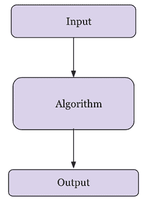

图 2.1：算法介绍

以下是一些研究算法的重要理由的总结：

+   计算机科学与工程的基本要素

+   在许多其他领域（如计算生物学、经济学、生态学、通信、物理学等）都很重要

+   它们在技术创新中扮演着角色

+   它们提高了解决问题的能力和分析思维能力

在解决给定问题时，有两个方面非常重要。首先，我们需要一个有效的机制来存储、管理和检索数据，这是解决问题所必需的（这属于数据结构）；其次，我们需要一个有效的算法，它是一组有限的指令，用于解决问题。因此，数据结构和算法的研究对于使用计算机程序解决任何问题都是关键。一个有效的算法应具有以下特点：

+   应尽可能具体

+   每条指令都应有明确的定义

+   不应有任何含糊不清的指令

+   算法的所有指令应在有限的时间内和有限步骤内可执行

+   它应有清晰的输入和输出以解决问题

+   算法的每一条指令都应完整地解决给定的问题

以我们日常生活中完成一项任务的算法（一个类比）为例，让我们以准备一杯茶为例。准备一杯茶的算法可以包括以下步骤：

1.  把水倒入锅中

1.  把锅放在炉子上并点燃炉子

1.  在温热的水中加入捣碎的姜

1.  在锅中加入茶叶

1.  加入牛奶

1.  当它开始沸腾时，加入糖

1.  2-3 分钟后，茶可以上桌

上述程序是准备茶的一种可能方法。同样，现实世界问题的解决方案可以转化为算法，这些算法可以使用编程语言开发成计算机软件。由于对于给定的问题可能有多个解决方案，因此当它需要用软件实现时，应该尽可能高效。给定一个问题，可能有多个正确的算法，定义为对所有有效输入值产生精确期望输出的算法。执行不同算法的成本可能不同；它可能以在计算机系统上运行算法所需的时间和所需的内存空间来衡量。

在设计高效算法时，应该主要注意以下两点：

1.  算法应该是正确的，并且对于所有有效输入值应该产生预期的结果

1.  算法应该在计算机上以期望的时间限制和最优的内存空间要求执行

算法的性能分析对于决定给定问题的最佳解决方案非常重要。如果一个算法的性能在期望的时间和空间要求范围内，那么它是最优的。估计算法性能最流行和常见的方法之一是通过分析其复杂性。算法分析帮助我们确定在时间和空间消耗方面哪个算法最有效。

# 算法的性能分析

算法的性能通常是通过其输入数据的大小，*n*，以及算法使用的时间和内存空间来衡量的。所需的时间是通过算法需要执行的关键操作（如比较操作）来衡量的，其中关键操作是在执行过程中占用大量时间的指令。而算法的空间需求是通过在程序执行过程中存储变量、常量和指令所需的内存来衡量的。

## 时间复杂度

算法的时间复杂度是指算法在计算机系统上执行以产生输出所需的时间量。分析算法时间复杂度的目的是确定，对于给定的问题和多个算法，哪个算法在执行所需的时间方面是最有效的。算法所需的运行时间取决于输入大小；随着输入大小，*n*，的增加，运行时间也会增加。输入大小是输入中项目数量的度量，例如，排序算法的输入大小将是输入中的项目数量。因此，排序算法在排序大小为 5,000 的输入列表时所需的运行时间将大于排序大小为 50 的输入列表时的运行时间。

对于特定输入的算法运行时间取决于算法中要执行的关键操作。例如，排序算法的关键操作是比较操作，它将占用大部分运行时间，与赋值或其他操作相比。理想情况下，这些关键操作不应依赖于硬件、操作系统或用于实现算法的编程语言。

执行每行代码需要恒定的时间；然而，每行代码的执行时间可能不同。为了理解算法所需的运行时间，以下代码作为示例：

| **代码** | **所需时间（成本）** |
| --- | --- |

|

```py
if n==0 &#124;&#124; n == 3             #constant time
  print("data")
else:
  for i in range(             #loop run for n times
     print("structure") 
```

|

```py
c1
c2
c3
c4
c5 
```

|

在上述示例的第 1 条语句中，如果条件为真，则打印`"data"`，如果条件不为真，则`for`循环将执行`n`次。算法所需的时间取决于每个语句所需的时间以及语句执行的次数。算法的运行时间是所有语句所需时间的总和。对于上述代码，假设第 1 条语句需要`c1`时间，第 2 条语句需要`c2`时间，依此类推。因此，如果第*i*条语句需要恒定的时间*c*[i]，并且如果第*i*条语句执行了`n`次，那么它将需要*c*[i]*n*时间。对于给定的*n*值（假设*n*不为零或三）的算法的总运行时间`T(n)`如下。

*T*(*n*) = *c*[1] + *c*[3] + *c*[4] x *n* + *c*[5] x *n*

如果`n`的值等于零或三，那么算法所需的时间如下。

*T*(*n*) = *c*[1] + *c*[2]

因此，算法所需的运行时间不仅取决于输入的大小，还取决于输入的内容。对于给定的例子，最佳情况是输入为零或三，在这种情况下，算法的运行时间将是常数。在最坏的情况下，`n`的值不等于零或三，那么，算法的运行时间可以表示为 *a* x *n* + *b*。在这里，`a`和`b`的值是依赖于语句成本的常数，并且常数时间不计入最终的时间复杂度。在最坏的情况下，算法所需的运行时间是`n`的线性函数。

让我们考虑另一个例子，线性搜索：

```py
def linear_search(input_list, element):
    for index, value in enumerate(input_list):
        if value == element:
            return index

    return -1
input_list = [3, 4, 1, 6, 14]  
element = 4
print("Index position for the element x is:", linear_search(input_list,element)) 
```

在这个例子中，输出结果如下：

```py
Index position for the element x is: 1 
```

算法的**最坏运行时间**是上界复杂度；它是算法对任何给定输入执行所需的最大运行时间。最坏情况的时间复杂度非常有用，因为它保证了对于任何输入数据，所需的运行时间不会比最坏运行时间长。例如，在线性搜索问题中，最坏情况发生在要搜索的元素在最后一次比较中找到或未在列表中找到。在这种情况下，所需的运行时间将线性依赖于列表的长度，而在最佳情况下，搜索元素将在第一次比较中找到。

**平均运行时间**是算法执行所需的平均运行时间。在这个分析中，我们计算所有可能输入值的运行时间的平均值。通常，概率分析用于分析算法的平均运行时间，这是通过对所有可能输入的分布的平均成本来计算的。例如，在线性搜索中，如果要搜索的元素在 0^(th)索引处找到，则所有位置的比较次数将为 1；同样，对于在`1, 2, 3, … (`*n*`-1)`索引位置找到的元素，比较次数将分别为 2，3，等等，直到`n`。因此，平均运行时间将如下所示。

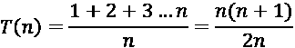

对于平均情况，所需的运行时间也线性依赖于*n*的值。然而，在大多数实际应用中，最坏情况分析主要使用，因为它保证了对于任何输入值，运行时间不会比算法的最坏运行时间长。

**最佳运行时间**是算法运行所需的最短时间；它是算法运行时间的下界；在上面的例子中，输入数据以这种方式组织，使得执行给定算法所需的最短运行时间。

## 空间复杂度

算法的空间复杂度估计了在计算机上执行它以产生输出所需的内存需求，这取决于输入数据。算法的内存空间需求是决定其效率的几个标准之一。在计算机系统上执行算法时，需要存储输入，以及数据结构中的中间和临时数据，这些数据存储在计算机的内存中。为了编写任何问题的编程解决方案，需要一些内存来存储变量、程序指令以及在计算机上执行程序。算法的空间复杂度是执行和产生结果所需的内存量。

为了计算空间复杂度，考虑以下示例，其中，给定一个整数值的列表，该函数返回相应整数的平方值。

```py
def squares(n):
    square_numbers = []
    for number in n:
        square_numbers.append(number * number)
    return square_numbers

nums = [2, 3, 5, 8 ]
print(squares(nums)) 
```

代码的输出为：

```py
[4, 9, 25, 64] 
```

在上述代码中，算法将需要为输入列表中的项目数量分配内存。假设输入中的元素数量为 `n`，那么随着输入大小的增加，空间需求也会增加，因此，算法的空间复杂度变为 `O(n)`。

给定两个算法来解决给定的问题，在其他所有要求相同的情况下，需要较少内存的算法可以被认为是更有效的。例如，假设有两个搜索算法，一个具有 `O(n)` 的空间复杂度，另一个算法具有 `O(nlogn)` 的空间复杂度。第一个算法在空间需求方面比第二个算法更好。空间复杂度分析对于理解算法的效率很重要，尤其是在内存空间需求高的应用中。

当输入大小足够大时，增长顺序也变得很重要。在这种情况下，我们研究算法的渐近效率。通常，渐近效率高的算法被认为是适用于大型输入的更好算法。在下一节中，我们将研究渐近符号。

# 渐近符号

要分析算法的时间复杂度，当输入大小很大时，增长速率（增长顺序）非常重要。当输入大小变得很大时，我们只考虑高阶项，忽略不重要的项。在渐近分析中，我们考虑高阶增长，忽略乘法常数和低阶项，来分析大输入大小下算法的效率。

我们比较两个算法，根据输入大小而不是实际运行时间，并测量随着输入大小的增加所花费的时间如何增加。在渐近效率方面更有效的算法通常被认为比其他算法更好。以下渐近符号通常用于计算算法的运行时间复杂度：

+   θ 符号：它表示具有紧界的最坏情况运行时间复杂度。

+   Ο 符号：它表示具有上界的最坏情况运行时间复杂度，这确保了函数的增长永远不会超过上界。

+   Ω 符号：它表示算法运行时间的下界。它衡量执行算法的最佳时间。

## Theta 符号

以下函数描述了在*时间复杂度*部分讨论的第一个示例的最坏情况运行时间：

*T*(*n*) = *c*[1] + *c*[3] x *n* + *c*[5] x *n*

在这里，对于大的输入规模，最坏情况下的运行时间将是 `ϴ(n)`（读作 theta of `n`）。我们通常认为如果一个算法的最坏情况运行时间具有更低的增长阶，那么它比另一个算法更高效。由于常数因子和低阶项，一个运行时间具有更高增长阶的算法可能在小输入上比一个运行时间具有更低增长阶的算法花费更少的时间。例如，一旦输入规模 `n` 足够大，归并排序算法的性能比插入排序更好，分别具有最坏情况运行时间 `ϴ(logn)` 和 `ϴ(n²)`。

Theta 符号 (`ϴ`) 表示具有紧界的算法的最坏情况运行时间。对于给定的函数 *F*(*n*)，渐近最坏情况运行时间复杂度可以定义为以下内容。

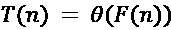

当且仅当存在常数 *n*[0]、*c*[1] 和 *c*[2] 使得：

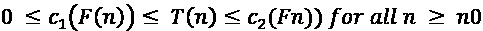

如果存在正常数 *c*[1] 和 c[2]，使得对于所有大的 *n* 值，*T*(*n*) 的值始终介于 *c*[1]*F*(*n*) 和 *c*[2]*F*(*n*) 之间，那么函数 *T*(*n*) 属于函数集合 *ϴ*(*F*(*n*))。如果这个条件成立，那么我们说 *F*(*n*) 是 *T*(*n*) 的渐近紧界。

*图 2.2* 展示了 theta 符号的图形示例（*ϴ*）。从图中可以观察到，对于大于 *n*[0] 的 n 值，*T*(*n*) 的值始终介于 *c*[1]*F*(*n*) 和 *c*[2]*F*(*n*) 之间。

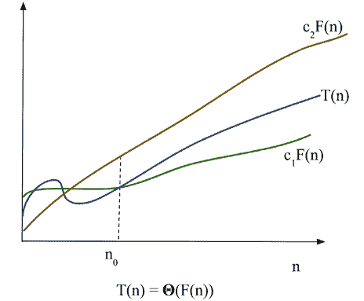

图 2.2：theta 符号（ϴ）的图形示例

让我们考虑一个例子，以了解给定函数的正式 theta 符号定义下应该具有的最坏情况运行时间复杂度：

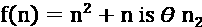

为了确定使用 *ϴ* 符号定义的时间复杂度，我们首先需要识别常数 c[1]、c[2]、n[0]，使得

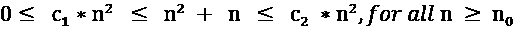

除以 n² 将产生：

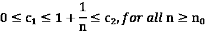

通过选择 c[1] = 1，c[2] = 2，和 n[0] = 1，以下条件可以满足 theta 符号的定义。

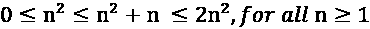

这将给出：

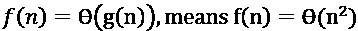

考虑另一个例子，找出另一个函数的渐近紧界（`ϴ`）：

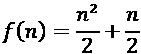

为了识别满足以下条件的常数 c[1]、c[2] 和 n[0]：

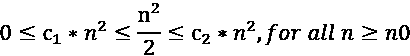

通过选择 c[1] = 1/5，c[2] = 1，和 n[0] = 1，以下条件可以满足 theta 符号的定义：

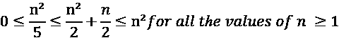

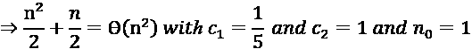

因此，以下是真的：

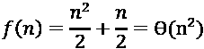

这表明根据 theta 符号的定义，给定的函数具有 `ϴ`(n²) 的复杂度。

因此，theta 符号提供了算法时间复杂度的紧界。在下一节中，我们将讨论 Big O 符号。

## Big O 符号

我们已经看到，theta 符号从函数的上侧和下侧渐近地有界，而大 O 符号描述的是最坏情况下的运行时间复杂度，这仅仅是函数的渐近上界。大 O 符号定义为：给定一个函数 *F*(*n*)，*T*(*n*) 是函数 *F*(*n*) 的大 O 符号，我们将其定义为以下内容：

*T*(*n*) = O(*F*(*n*))

当存在常数 n[0] 和 *c* 使得：

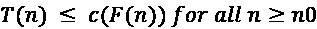

在大 O 符号中，*F*(*n*) 的常数倍是 *T*(*n*) 的渐近上界，并且正的常数 n[0] 和 *c* 应该以这样的方式，即所有大于 n[0] 的 `n` 的值始终位于或低于函数 *c***F*(*n*)。

此外，我们只关心在 *n* 的较高值时发生的情况。变量 n[0] 代表增长率不再重要的阈值。*图 2.3* 展示了函数 *T*(*n*) 随 *n* 变化的图形表示。我们可以看到 *T*(*n*) = n² + 500 = O(n²)，其中 *c* = 2，n[0] 大约是 `23`。

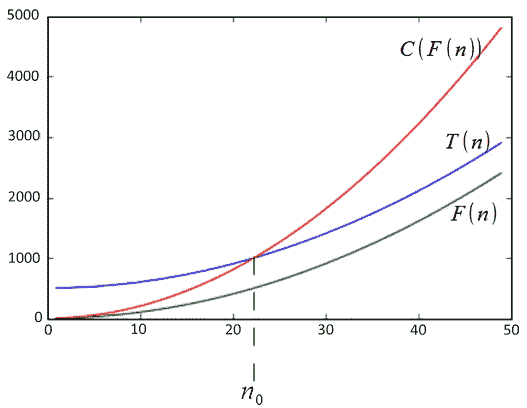

图 2.3：O 符号的图形示例

在 O 符号中，*O*(*F*(*n*)) 实际上是一组函数，包括所有与 *F*(*n*) 具有相同或更小增长率的函数。例如，*O*(n²) 也包括 *O*(*n*)，*O*(log *n*)，等等。然而，大 O 符号应尽可能准确地描述一个函数，例如，函数 *F*(*n*) = 2n³+2n²+5 是 O(n⁴)，然而，更准确的是 *F*(*n*) 是 *O*(n³)。

在下面的表中，我们按从低到高的顺序列出最常见的增长率。

| **时间复杂度** | **名称** |
| --- | --- |
| `O(1)` | 常数 |
| `O(logn)` | 对数 |
| `O(n)` | 线性 |
| `O(nlogn)` | 线性对数 |
| `O(n2)` | 二次 |
| `O(n3)` | 三次 |
| `O(2n)` | 指数 |

表 2.1：不同函数的运行时间复杂度

使用大 O 符号，可以通过分析算法的结构来计算算法的运行时间。例如，算法中的双层循环将具有 O(n²) 的最坏情况运行时间上界，因为 `i` 和 `j` 的值最多为 *n*，并且两个循环都将运行 n² 次，如下面的示例代码所示：

```py
for i in range(n): 
    for j in range(n): 
        print("data") 
```

让我们考虑几个例子，以便使用 O 符号计算函数的上界：

1.  求该函数的上界：

    T(n) = 2n + 7

    **解决方案**：使用 O 符号，上界的条件是：

    *T*(*n*) <= *c* * *F*(*n*)

    对于所有 n > 7 和 *c*=3 的值，此条件成立。

    *2n + 7 <= 3n* 这对所有 n 的值都成立，其中 *c*=3，n[0]=7

    *T(n) = 2n+7 = O(n)*

1.  对于函数 *T(n) =2n+5，找到满足 T(n) = O(F(n)) 的 F(n)。

    **解决方案**：使用 O 符号，上界的条件是 *T(n) <=c * F(n)*。

    由于 2n+5 ≤ 3n，对所有 n ≥ 5 成立。

    当 *c*=3，n[0]=5 时，该条件成立。

    *2n + 5 ≤ O(n)*

    *F(n) = n*

1.  找到函数 *T(n) = n² +n* 的 F(n)，使得 T(n) = O(F(n))。

    **解法**：使用 O 符号，因为，*n*²*+ n ≤ 2n*²*，对于所有 n ≥ 1（c = 2，n*[0]*=2）*

    n²+ n ≤ O(n²)

    F(n) = n²

1.  证明 f(n) =2n³ - 6n ≠ O(n²)。

    **解法**：显然，2n³-6n ≥ n²，对于 n ≥ 2\. 所以，2n³ - 6n ≠ O(n²) 不成立。

1.  证明：20n²+2n+5 = O(n²)。

    **解法**：显然：

    20n² + 2n + 5 <= 21n² 对于所有 n > 4（取 c = 21 和 n[0] = 4）

    对于所有 n > 4，n² > 2n + 5。

    因此，复杂度为 O(n²)。

因此，Big-O 符号提供了一个函数的上界，这确保了函数的增长速度永远不会超过上界函数。在下一节中，我们将讨论 Omega 符号。

## Omega 符号

Omega 符号 (Ω) 描述了算法的渐近下界，类似于 Big O 符号描述上界的方式。Omega 符号计算算法的最佳运行时间复杂度。Ω 符号 (*Ω*(*F*(*n*)) 读作 omega of F of n)，是一组函数，使得存在正的常数 n[0] 和 c，对于所有 n > n[0] 的值，*T*(*n*) 总是位于或高于函数 *c***F*(*n*)。

*T*(*n*) = *Ω* (*F*(*n*))

如果存在常数 n[0] 和 c，那么：

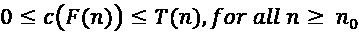

*图 2.4* 展示了 omega (Ω) 符号的图形表示。从图中可以观察到，对于 n > n[0] 的值，*T*(*n*) 总是位于 cF(n) 之上。

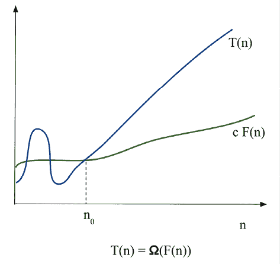

图 2.4：Ω 符号的图形表示

如果算法的运行时间是 *Ω*(*F*(*n*))，这意味着对于足够大的输入大小（n）的值，算法的运行时间至少是 *F*(*n*) 的一个常数倍。Ω 符号给出了给定算法最佳运行时间复杂度的下界。这意味着给定算法的运行时间至少是 *F*(*n*)，而不依赖于输入。

为了理解 Omega 符号以及如何计算算法最佳运行时间复杂度的下界：

1.  找到函数 *T*(*n*) =2n² +3 的 *F*(*n*)，使得 *T*(*n*) = *Ω*(*F*(*n*)).

    **解法**：使用 Omega 符号，下界条件为：

    c*F(n) ≤ T(n)

    找到函数 *T(n) = n² +n* 的 F(n)，使得 T(n) = O(F(n))。

    0 ≤ cn² ≤ 2n² +3, 对于所有 n ≥ 0

    2n² +3 = Ω(n²)

    F(n)=n²

1.  找到 T(n) = 3n² 的下界。

    **解法**：使用 Omega 符号，下界条件为：

    c*F(n) ≤ T(n)

    考虑 0 ≤ cn² ≤ 3n²。对于所有 n > 1 的值，以及 c=2，Ω 符号的条件成立。

    cn² ≤ 3n² (对于 c = 2 和 n[0] = 1)

    3n² = Ω(n²)

1.  证明 3n = Ω(n)。

    **解法**：使用 Omega 符号，下界条件为：

    c*F(n) ≤ T(n)

    考虑 0 ≤ c*n≤ 3n。对于所有 n > 1 的值，以及 c=1，Ω 符号的条件成立。

    考虑 0 ≤ c*n≤ 3n。对于所有 n > 1 的值，以及 c=1，Ω 符号的条件成立。

    3n = Ω(n)

Ω符号用于描述算法对于大输入大小至少需要一定量的运行时间。在下一节中，我们将讨论摊销分析。

# 摊销分析

在算法的摊销分析中，我们平均计算执行一系列操作所需的时间与算法中所有操作的时间。这被称为摊销分析。当我们对单个操作的时间复杂度不感兴趣，而关注一系列操作的平均运行时间时，摊销分析就很重要。在算法中，每个操作执行所需的时间是不同的。某些操作需要大量的时间和资源，而有些操作则几乎不耗费成本。在摊销分析中，我们考虑了成本高昂和成本较低的操作，以便分析所有操作序列。因此，摊销分析是考虑所有操作序列的完整成本的平均性能。摊销分析与平均情况分析不同，因为不考虑输入值的分布。摊销分析给出了每个操作在最坏情况下的平均性能。

摊销分析有三种常用的方法：

+   **聚合分析**。在聚合分析中，摊销成本是所有操作序列的平均成本。对于给定的 n 个操作序列，每个操作的摊销成本可以通过将 n 个操作的总成本的上界除以 n 来计算。

+   **会计方法**。在会计方法中，我们为每个操作分配一个摊销成本，这可能与它们的实际成本不同。在这里，我们对序列中的早期操作征收额外费用，并保存“信用成本”，这些成本用于支付序列中后面的昂贵操作。

+   **势方法**。势方法类似于会计方法。我们确定每个操作的摊销成本，并对可能在未来序列中使用的早期操作征收额外费用。与会计方法不同，势方法将超额收费的信用积累为数据结构整体的“势能”，而不是为单个操作存储信用。

在本节中，我们概述了摊销分析。现在我们将讨论如何通过下一节的示例计算不同函数的复杂性。

# 组成复杂度类

通常，我们需要找到复杂操作和算法的总运行时间。结果证明，我们可以通过组合简单操作的复杂度类来找到更复杂、组合操作的复杂度类。目标是分析函数或方法中的组合语句，以了解执行多个操作的总时间复杂度。将两个复杂度类组合的最简单方法是相加。这发生在我们有两个顺序操作时。例如，考虑将一个元素插入列表并排序该列表的两个操作。假设插入项的时间复杂度为 O(n)，排序的时间复杂度为 O(nlogn)，那么我们可以将总时间复杂度写为 O(n + nlogn)；即，我们按照大 O 计算的规则，将两个函数放入 O(…）内。只考虑最高阶项，最终的复杂度变为 O(nlogn)。

如果我们重复一个操作，例如在`while`循环中，那么我们将复杂度类乘以操作执行的次数。如果一个具有时间复杂度 O(*f*(*n*))的操作重复 O(*n*)次，那么我们将两个复杂度相乘：O(*f*(*n*) * O(*n*)) = O(*nf*(*n*))。例如，假设函数*f*(*n*)的时间复杂度为 O(*n*²)，并在`for`循环中执行*n*次，如下所示：

```py
for i in range(n):
        f(...) 
```

上述代码的时间复杂度变为：

O(*n*²) x O(*n*) = O(*n* x *n*²) = O(*n*³)

在这里，我们正在将内函数的时间复杂度乘以该函数执行的次数。循环的运行时间最多是循环内语句的运行时间乘以迭代次数。一个单层嵌套循环，即一个循环嵌套在另一个循环中，将运行*n*²次，如下例所示：

```py
for i in range(n):
    for j in range(n)
        #statements 
```

如果每个语句的执行时间都是常数时间，即 O(1)，执行*n* x *n*次，我们可以将运行时间表示如下：

*c* x *n* x *n* = *c* x *n*² = O(*n*²)

对于嵌套循环中的连续语句，我们将每个语句的时间复杂度相加，并乘以该语句执行的次数——例如，以下代码中的情况：

```py
def fun(n):
   for i in range(n):  #executes n times
      print(i)     #c1
   for i in range(n): 
      for j in range(n):
         print(j)  #c2 
```

这可以写成：*c*¹*n + c*² **n*² *= O(n*²*)*。

我们可以定义（以 2 为底）对数复杂度，通过在常数时间内减半问题的大小。例如，考虑以下代码片段：

```py
i = 1
while i <= n:
    i = i*2
    print(i) 
```

注意到`i`在每次迭代中都在翻倍。如果我们用 n = 10 运行此代码，我们会看到它打印出四个数字：2、4、8 和 16。如果我们加倍 n，我们会看到它打印出五个数字。随着 n 的后续翻倍，迭代次数仅增加 1。如果我们假设循环有 k 次迭代，那么 n 的值将是 2^n。我们可以这样写：

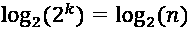

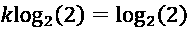

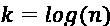

从这个结果来看，上述代码的最坏情况运行时间复杂度等于 O(log(n))。

在本节中，我们看到了计算不同函数的运行时间复杂度的例子。在下一节中，我们将通过例子了解如何计算算法的运行时间复杂度。

# 计算算法的运行时间复杂度

要根据算法的最佳、最坏和平均运行时间来分析算法，并不总是可能为每个给定的函数或算法计算这些值。然而，在实际情况中，了解算法的上界最坏运行时间复杂度总是很重要的；因此，我们专注于计算上界大 O 符号以计算算法的最坏运行时间复杂度：

1.  找出以下 Python 段落的最坏运行时间复杂度：

    ```py
    # loop will run n times
    for i in range(n):
        print("data")  #constant time 
    ```

    **解答**：一般来说，循环的运行时间等于循环中所有语句的执行时间乘以迭代次数。在这里，总运行时间定义为以下：

    T(n) = 常数时间 (c) * n = c*n = O(n)

1.  找出以下 Python 段落的复杂度：

    ```py
    for i in range(n): 
        for j in range(n):  # This loop will also run for n times
            print("run") 
    ```

    **解答**：O(n²)。`print` 语句将被执行 n² 次，内循环执行 n 次，对于外循环的每一次迭代，内循环都会被执行。

1.  找出以下 Python 段落的复杂度：

    ```py
    for i in range(n):
        for j in range(n):
            print("run fun")
           break 
    ```

    **解答**：最坏情况下的复杂度将是 O(n)，因为 `print` 语句将运行 *n* 次，因为内循环由于 `break` 语句只执行一次。

1.  找出以下 Python 段落的复杂度：

    ```py
    def fun(n):
        for i in range(n):
            print("data")  #constant time
     #outer loop execute for n times
        for i in range(n):
            for j in range(n):  #inner loop execute n times
                print("run fun")  #constant time 
    ```

    **解答**：在这里，`print` 语句将在第一个循环中执行 *n* 次，在第二个嵌套循环中将执行 *n*² 次。这里，所需的总时间定义为以下：

    T(n) = 常数时间 (c[1]) * n + c[2]*n*n

    c[1] n + c[2] n² = O(n²)

1.  找出以下 Python 段落的复杂度：

    ```py
    if  n == 0:     #constant time
        print("data")
    else: 
        for i in range(n):    #loop run for n times 
          print("structure") 
    ```

    **解答**：O(n)。在这里，最坏情况下的运行时间复杂度将是执行所有语句所需的时间；即执行 `if-else` 条件和 `for` 循环所需的时间。所需的时间定义为以下：

    T(n) = c[1] + c[2] n = O(n)

1.  找出以下 Python 段落的复杂度：

    ```py
    i = 1
    j = 0
    while i*i < n: 
        j = j +1 
        i = i+1 
        print("data") 
    ```

    **解答**：O(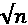)。循环将根据 `i` 的值终止；循环将根据以下条件迭代：

    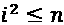

    T(n) = O(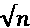)

1.  找出以下 Python 段落的复杂度：

    ```py
    i = 0
    for i in range(int(n/2), n):
        j = 1
        while j+n/2 <= n:
        k = 1
             while k < n:
             k *= 2
             print("data")
             j += 1 
    ```

    **解答**：在这里，外循环将执行 n/2 次，中间循环也将执行 n/2 次，最内层循环将运行 log(n) 时间。因此，总的运行时间复杂度将是 O(n*n*logn)：

    O(n²logn)

# 概述

在本章中，我们概述了算法设计。算法的研究很重要，因为它训练我们非常具体地思考某些问题。通过隔离问题的组成部分并定义它们之间的关系，这有助于提高我们的解决问题的能力。在本章中，我们讨论了分析算法和比较算法的不同方法。我们还讨论了渐近符号，即：大 O、Ω和θ符号。

在下一章中，我们将讨论算法设计技术和策略。

# 练习

1.  找出以下 Python 碎片的复杂度：

1.  ```py
    i=1
    while(i<n):
        i*=2
        print("data") 
    ```

1.  ```py
    i =n
    while(i>0):
        print('complexity')
        i/ = 2 
    ```

1.  ```py
    for i in range(1,n):
        j = i
        while(j<n):
            j*=2 
    ```

1.  ```py
    i=1
    while(i<n):
        print('python')
            i = i**2 
    ```

# 加入我们的 Discord 社区

加入我们的社区 Discord 空间，与作者和其他读者进行讨论：[`packt.link/MEvK4`](https://packt.link/MEvK4)


