# 第三章：算法设计技术与策略

在计算领域，算法设计对于 IT 专业人士来说非常重要，因为它能提高他们的技能并促进行业的发展。算法设计过程从大量的实际计算问题开始，这些问题必须被明确地表述出来，以便使用算法设计技术中可能的技术之一来有效地构建解决方案。算法的世界包含了许多技术和设计原则，掌握这些是解决该领域更困难问题所必需的。在计算机科学中，算法设计对于高效地设计精确表述问题的解决方案非常重要，因为一个非常复杂和困难的问题可以通过适当的算法设计技术轻松解决。

在本章中，我们将讨论不同类型的算法如何被分类。我们将描述并展示设计技术，并进一步讨论算法分析。最后，我们将为几个非常重要的算法提供详细的实现。

在本章中，我们将探讨以下算法设计技术：

+   分而治之

+   动态规划

+   贪心算法

# 算法设计技术

算法设计是观察和清晰地理解良好设定的、现实世界问题的强大工具。对于许多问题，有一种简单而有效的方法，即**暴力**方法。暴力方法试图尝试所有可能的解决方案组合来解决任何问题。例如，假设一位销售人员必须访问全国 10 个城市。为了使总行程距离最小化，这些城市应该按什么顺序访问？解决这个问题的暴力方法将是计算所有可能路线的总距离，然后选择提供最小距离的路线。

如你所猜，暴力算法并不高效。

它可以为有限的输入大小提供有用的解决方案，但当输入大小变得很大时，它变得非常低效。因此，我们将过程分解为两个基本组件，以找到计算问题的最优解：

1.  明确表述问题

1.  根据问题的结构选择合适的算法设计技术以获得高效的解决方案

正因如此，在开发可扩展和健壮的系统时，算法设计的研究变得非常重要。设计和分析首先很重要，因为它们有助于开发组织良好且易于理解的算法。设计技术指南也有助于轻松地为复杂问题开发新算法。此外，设计技术还可以用来对算法进行分类，这也有助于更好地理解它们。以下是一些算法范式：

+   递归

+   分而治之

+   动态规划

+   贪心算法

由于在讨论不同的算法设计技术时我们将多次使用递归，让我们首先了解递归的概念，然后我们将讨论不同的算法设计技术。

# 递归

递归算法通过重复调用自身来解决问题，直到满足某个条件。每个递归调用本身会产生其他递归调用。递归函数可能陷入无限循环；因此，每个递归函数都必须遵循某些属性。递归函数的核心是两种类型的案例：

1.  **基本情况**：这些告诉递归何时终止，意味着一旦满足基本条件，递归就会停止

1.  **递归情况**：函数递归调用自身，我们朝着实现基本情况前进

一个自然适合递归解决方案的简单问题就是计算阶乘。递归阶乘算法定义了两种情况：当 *n* 为零时的基本情况（终止条件）和当 *n* 大于零时的递归情况（函数自身的调用）。一个典型的实现如下：

```py
def factorial(n):
    # test for a base case
    if n == 0:
        return 1
    else:
    # make a calculation and a recursive call
        return n*factorial(n-1) 
print(factorial(4)) 
```

这会产生以下输出：

```py
24 
```

要计算 `4` 的阶乘，我们需要进行四次递归调用，加上初始的父调用，如*图 3.1*所示。这些递归调用的工作细节如下。最初，数字 `4` 被传递给阶乘函数，它将返回 `4` 乘以 `(4-1=3)` 的阶乘的值。为此，数字 `3` 再次传递给阶乘函数，它将返回 `3` 乘以 `(3-1=2)` 的阶乘的值。同样，在下一个迭代中，值 `2` 乘以 `(2-1 =1)` 的阶乘。

这将继续，直到我们达到 `0` 的阶乘，它返回 `1`。现在，每个函数都返回值，最终计算 `1*1*2*3*4=24`，这是函数的最终输出。

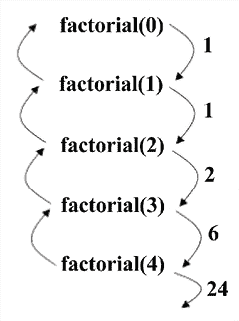

图 3.1：阶乘 4 的执行流程

我们讨论了递归的概念，这在理解不同算法范式的实现中将非常有用。因此，现在让我们依次讨论不同的算法设计策略，从下一节的分而治之技术开始。

# 分而治之

解决复杂问题的重要且有效技术之一是分而治之。分而治之范式将问题分解成更小的子问题，然后解决这些子问题；最后，它将这些结果合并以获得全局、最优的解决方案。更具体地说，在分而治之设计中，问题被分解成两个更小的子问题，每个子问题都是递归解决的。部分解决方案被合并以获得最终解决方案。这是一种非常常见的问题解决技术，可以说是算法设计中最常用的方法之一。

分而治之设计技术的以下是一些示例：

+   二分搜索

+   归并排序

+   快速排序

+   快速乘法算法

+   Strassen 矩阵乘法

+   点对最近距离

让我们看看两个例子，二分搜索和归并排序算法，以了解分而治之设计技术是如何工作的。

## 二分搜索

二分搜索算法基于分而治之设计技术。此算法用于从有序元素列表中查找给定元素。它首先将搜索元素与列表的中间元素进行比较；如果搜索元素小于中间元素，则丢弃大于中间元素的元素列表的一半；这个过程递归地重复，直到找到搜索元素或达到列表的末尾。重要的是要注意，在每次迭代中，搜索空间的一半被丢弃，这提高了整体算法的性能，因为要搜索的元素更少。

以*图 3.2*中所示为例；假设我们想在给定的有序元素列表中搜索元素 4。列表在每次迭代中都被分成两半；使用分而治之的策略，元素被搜索*O*(*logn*)次。

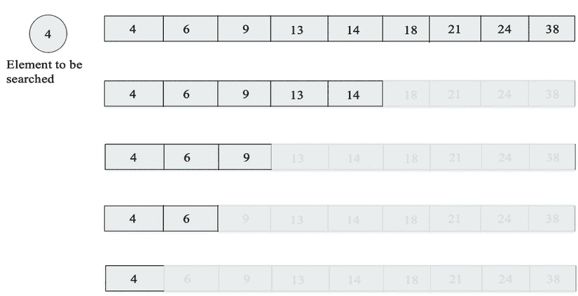

图 3.2：使用二分搜索算法搜索元素的过程

在这里展示了在有序元素列表中搜索元素的 Python 代码：

```py
def binary_search(arr, start, end, key):
    while start <= end:  
        mid = start + (end - start)/2
        if arr[mid] == key:  
            return mid  
        elif arr[mid] < key:  
            start = mid + 1  
        else:  
            end = mid - 1  
    return -1  
arr = [4, 6, 9, 13, 14, 18, 21, 24, 38] 
x = 13
result = binary_search(arr, 0, len(arr)-1, x)  
print(result) 
```

当我们在给定的元素列表中搜索`13`时，前面代码的输出是`3`，这是搜索项的位置。

在代码中，最初，起始和结束索引给出了输入数组`[4, 6, 9, 13, 14, 18, 21, 24, 38]`的第一个和最后一个索引的位置。存储在变量`key`中的要搜索的项首先与数组的中间元素匹配，然后我们丢弃列表的一半，并在列表的另一半中搜索该项。这个过程重复迭代，直到找到要搜索的项，或者达到列表的末尾，并且我们没有找到元素。

在分析二分查找算法在最坏情况下的工作原理时，我们可以看到，对于一个包含 8 个元素的数组，在第一次不成功的尝试之后，列表被分成两半，然后在不成功的搜索尝试之后，列表长度为 2，最后只剩下一个元素。因此，二分查找需要 4 次搜索。如果列表的大小加倍，也就是说，到 16，在第一次不成功的搜索之后，我们将有一个大小为 8 的列表，这将总共需要 4 次搜索。因此，二分查找算法将需要 5 次搜索来处理 16 个元素的列表。因此，我们可以观察到，当我们加倍列表中的项目数量时，所需的搜索次数也增加 1。我们可以这样说，当我们有一个长度为 n 的列表时，所需的搜索总数将是我们将列表分成两半的次数加上 1，这在数学上等同于(log[2] *n* + 1)。例如，如果 n=8，输出将是 3，这意味着所需的搜索次数将是 4。在每次迭代中，列表被分成一半；使用分治策略，二分查找算法的最坏情况时间复杂度是*O(log* *n)*。

归并排序是基于分治设计策略的另一种流行算法。我们将在下一节更详细地讨论归并排序。

## 归并排序

归并排序是一种用于按升序对自然数列表进行排序的算法。首先，给定的元素列表通过迭代方式被分成相等的部分，直到每个子列表只包含一个元素，然后这些子列表被合并以创建一个新的有序列表。这种编程方法基于分治法，强调将问题分解成与原始问题相同类型或形式的更小的子问题。这些子问题被单独解决，然后将结果合并以获得原始问题的解决方案。

在这种情况下，给定一个未排序的元素列表，我们将列表分成两个大致相等的部分。我们继续递归地将列表分成两半。

经过一段时间后，由递归调用创建的子列表将只包含一个元素。在那个时刻，我们开始合并征服或合并步骤中的解决方案。这个过程在*图 3.3*中展示：


图 3.3：归并排序算法概述

归并排序算法的实现主要使用两种方法，即`merge_sort`方法，它递归地划分列表。之后，我们将介绍`merge`方法来合并结果：

```py
def merge_sort(unsorted_list): 
    if len(unsorted_list) == 1: 
        return unsorted_list
    mid_point = int(len(unsorted_list)/2)
    first_half = unsorted_list[:mid_point] 
    second_half = unsorted_list[mid_point:] 
    half_a = merge_sort(first_half) 
    half_b = merge_sort(second_half) 
    return merge(half_a, half_b) 
```

实现开始于将未排序的元素列表接受到`merge_sort`函数中。使用`if`语句建立基本情况，其中，如果`unsorted_list`中只有一个元素，我们只需再次返回该列表。如果列表中有超过一个元素，我们使用`mid_point = len(unsorted_list)//2`找到大约的中间值。

使用这个`mid_point`，我们将列表分为两个子列表，即`first_half`和`second_half`：

```py
 first_half = unsorted_list[:mid_point] 
    second_half = unsorted_list[mid_point:] 
```

通过再次将两个子列表传递给`merge_sort`函数进行递归调用：

```py
 half_a = merge_sort(first_half)
    half_b = merge_sort(second_half) 
```

现在，对于合并步骤，`half_a`和`half_b`被排序。当`half_a`和`half_b`的值传递完毕后，我们调用`merge`函数，该函数将合并或组合存储在`half_a`和`half_b`中的两个解决方案，它们是列表：

```py
def merge(first_sublist, second_sublist): 
    i = j = 0
    merged_list = []
    while i < len(first_sublist) and j < len(second_sublist):
        if first_sublist[i] < second_sublist[j]:
            merged_list.append(first_sublist[i]) 
            i += 1 
        else:
            merged_list.append(second_sublist[j]) 
            j += 1
    while i < len(first_sublist): 
        merged_list.append(first_sublist[i]) 
        i += 1 
    while j < len(second_sublist):
        merged_list.append(second_sublist[j]) 
        j += 1
    return merged_list 
```

`merge`函数接受我们想要合并的两个列表，`first_sublist`和`second_sublist`。`i`和`j`变量被初始化为 0，并用作指针，告诉我们两个列表在合并过程中的位置。

最终的`merged_list`将包含合并后的列表。

`while`循环开始比较`first_sublist`和`second_sublist`中的元素：

```py
 while i < len(first_sublist) and j < len(second_sublist): 
        if first_sublist[i] < second_sublist[j]: 
            merged_list.append(first_sublist[i]) 
            i += 1 
        else: 
            merged_list.append(second_sublist[j]) 
            j += 1 
```

`if`语句选择两个子列表中较小的一个，即`first_sublist[i]`或`second_sublist[j]`，并将其追加到`merged_list`中。`i`或`j`索引增加以反映合并步骤中的位置。`while`循环在任一子列表为空时停止。

可能会在`first_sublist`或`second_sublist`中留下元素。最后的两个`while`循环确保在返回`merged_list`之前将这些元素添加到其中。对`merge(half_a, half_b)`的最后调用将返回排序后的列表。以下代码显示了如何使用归并排序对数组进行排序：

```py
a= [11, 12, 7, 41, 61, 13, 16, 14] 
print(merge_sort(a)) 
```

输出结果将是：

```py
[7, 11, 12, 14, 16, 41, 61] 
```

让我们通过合并两个子列表`[4, 6, 8]`和`[5, 7, 11, 40]`来对算法进行实际操作，如*表 3.1*所示。在这个例子中，最初给出两个已排序的子列表，然后匹配起始元素，由于第一个列表的第一个元素较小，它被移动到`merge_list`中。接下来，在*步骤 2*中，再次从两个列表中匹配起始元素，较小的元素（来自第二个列表）被移动到`merge_list`中。这个过程会重复进行，直到其中一个列表为空。

| **步骤** | `first_sublist` | `second_sublist` | `merged_list` |
| --- | --- | --- | --- |
| 0 | [4 6 8] | [5 7 11 40] | [] |
| 1 | [ 6 8] | [5 7 11 40] | [4] |
| 2 | [ 6 8] | [ 7 11 40] | [4 5] |
| 3 | [ 8] | [ 7 11 40] | [4 5 6] |
| 4 | [ 8] | [ 11 40] | [4 5 6 7] |
| 5 | [ ] | [ 11 40] | [4 5 6 7 8] |
| 6 | [] | [ ] | [4 5 6 7 8 11 40] |

表 3.1：合并两个列表的示例

此过程也可以在*图 3.4*中看到：

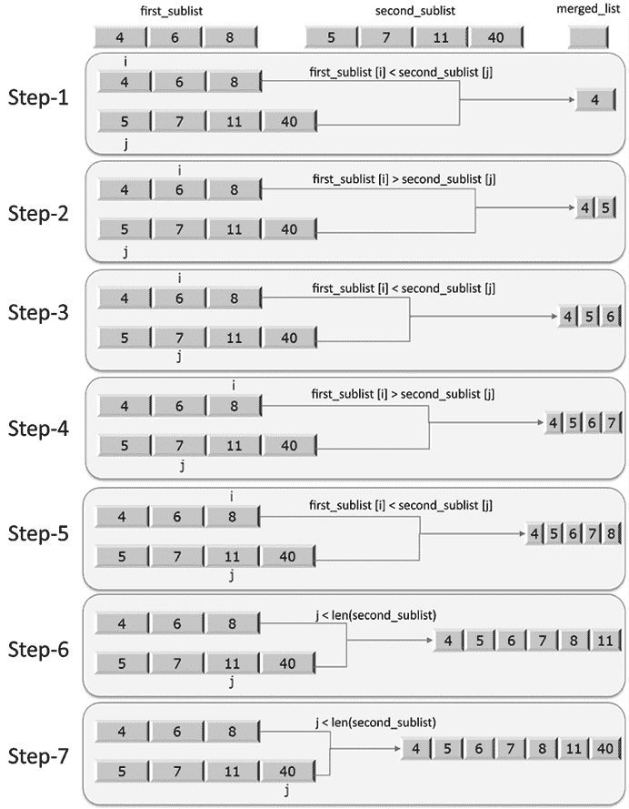

图 3.4：合并两个子列表的过程

在其中一个列表变为空之后，比如在这个例子中的 *步骤 4* 之后，在执行的这个点上，`merge` 函数中的第三个 `while` 循环开始工作，将 `11` 和 `40` 移动到 `merged_list` 中。返回的 `merged_list` 将包含完全排序的列表。

归并排序的最坏情况运行时间复杂度将取决于以下步骤：

1.  首先，分割步骤将花费常数时间，因为它只是计算中点，这可以在 *O*(*1*) 时间内完成。

1.  然后，在每次迭代中，我们将列表递归地分成一半，这将需要 *O*(*log n*) 的时间复杂度，这与我们在二分查找算法中看到的情况非常相似。

1.  此外，合并/合并步骤将所有 *n* 个元素合并到原始数组中，这将需要 (*n*) 的时间。

因此，归并排序算法的运行时间复杂度为 *O*(*log n*) *T*(*n*) = *O*(*n*) * *O*(*log n*) = *O*(*n log n*)。

我们已经通过几个例子讨论了分而治之算法设计技术。在下一节中，我们将讨论另一种算法设计技术：动态规划。

# 动态规划

动态规划是解决优化问题最强大的设计技术。这类问题通常有多个可能的解决方案。动态规划的基本思想基于分而治之技术的直觉。在这里，我们本质上通过将问题分解成一系列子问题，然后结合结果来计算大问题的正确解，来探索所有可能解决方案的空间。分而治之算法通过组合非重叠（不相交）子问题的解来解决一个问题，而动态规划用于子问题重叠的情况，这意味着子问题共享子子问题。动态规划技术与分而治之类似，因为问题被分解成更小的问题。然而，在分而治之中，必须先解决每个子问题，然后才能使用其结果来解决更大的问题。相比之下，基于动态规划的技术只解决每个子子问题一次，并且不会重新计算已遇到的子问题的解。相反，它使用记忆技术来避免重新计算。

动态规划问题有两个重要的特性：

+   **最优子结构**：对于任何问题，如果可以通过组合其子问题的解来获得解决方案，则称该问题具有最优子结构。换句话说，最优子结构意味着问题的最优解可以从其子问题的最优解中获得。例如，可以从 (i-1)^(th) 和 (i-2)^(th) 斐波那契数来计算 i^(th) 斐波那契数；例如，fib(6) 可以从 fib(5) 和 fib(4) 计算得出。

+   **重叠子问题**：如果一个算法必须反复解决相同的子问题，那么这个问题就有重叠的子问题。例如，fib(5)将为 fib(3)和 fib(2)进行多次计算。

如果一个问题具有这些特性，那么动态规划方法是有用的，因为可以通过重用之前计算出的相同解决方案来改进实现。在动态规划策略中，问题被分解为独立的子问题，中间结果被缓存，然后可以在后续操作中使用。

在动态方法中，我们将给定问题划分为更小的子问题。在递归中，我们也将问题划分为子问题。然而，递归和动态编程之间的区别在于，相似的子问题可以解决任意次数，但在动态编程中，我们跟踪先前解决的子问题，并注意不要重新计算任何先前遇到的子问题。一个问题成为动态编程解决理想候选者的一个特性是它有一个**重叠的子问题集**。一旦我们意识到在计算过程中子问题的形式已经重复，我们就不需要再次计算它。相反，我们返回先前遇到的子问题的预先计算结果。

动态规划考虑了每个子问题只需解决一次的事实，并且为了确保我们不会重新评估子问题，我们需要一种有效的方式来存储每个子问题的结果。以下两种技术是现成的：

+   **自顶向下带记忆化**：这种技术从初始问题集开始，将其划分为小子问题。一旦确定了子程序的解决方案，我们就存储该特定子问题的结果。在将来，当遇到这个子问题时，我们只返回其预先计算的结果。因此，如果给定问题的解决方案可以使用子问题的解决方案递归地表示，那么重叠子问题的解决方案可以很容易地记忆化。

记忆化意味着将子问题的解决方案存储在数组或哈希表中。每当需要计算子问题的解决方案时，首先参考已保存的值，如果它已经被计算，如果没有存储，则按常规方式计算。这个过程被称为*记忆化*，这意味着它“记得”之前计算的操作的结果。

+   **自底向上的方法**：这种方法依赖于子问题的“大小”。我们首先解决较小的子问题，然后在解决特定子问题时，我们已经有了依赖于它的较小子问题的解决方案。每个子问题只解决一次，并且每次我们尝试解决任何子问题时，所有先决的较小子问题的解决方案都是可用的，可以用来解决它。在这种方法中，给定的问题通过将其递归地分解为子问题来解决，然后解决可能的最小子问题。此外，子问题的解决方案以自底向上的方式组合，以便递归地达到较大子问题的解决方案，从而最终达到最终解决方案。

让我们通过一个例子来了解动态规划是如何工作的。让我们使用动态规划来解决斐波那契数列的问题。

## 计算斐波那契数列

斐波那契数列可以用递归关系来表示。递归关系是递归函数，用于定义数学函数或序列。例如，以下递归关系定义了斐波那契数列 `[1, 1, 2, 3, 5, 8 ...]`：

```py
func(0) = 1 
func(1) = 1  
func(n) = func(n-1) + func(n-2) for n>1 
```

注意，斐波那契数列可以通过将 *n* 的值按顺序放入 `[0, 1, 2, 3, 4, ...]` 来生成。让我们举一个例子来生成到第五项的斐波那契数列：

```py
 1 1 2 3 5 
```

以下是一个递归风格的程序，用于生成序列：

```py
def fib(n):   
     if n <= 1:   
        return 1   
     else:  
        return fib(n-1) + fib(n-2)  
for i in range(5):
    print(fib(i)) 
```

这将产生如下输出：

```py
1
1
2
3
5 
```

在此代码中，我们可以看到递归调用是按顺序调用来解决问题的。当遇到基本案例时，`fib()` 函数返回 `1`。如果 *n* 等于或小于 1，则满足基本案例。如果基本案例不满足，我们再次调用 `fib()` 函数。解决斐波那契数列前五项的递归树如图 *3.5* 所示：

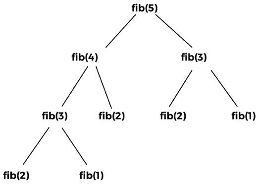

图 3.5：fib(5) 的递归树

从如图 *3.6* 所示的递归树中的重叠子问题中，我们可以观察到对 **fib(1)** 的调用发生两次，对 **fib(2)** 的调用发生三次，对 **fib(3)** 的调用发生两次。相同函数调用的返回值永远不会改变；例如，**fib(2)** 的返回值将始终相同，无论何时调用它。同样，**fib(1)** 和 **fib(3)** 也将如此。因此，它们是重叠问题，因此，如果每次遇到相同的函数时都重新计算，将会浪费计算时间。这些具有相同参数和输出的重复函数调用表明存在重叠。某些计算在较小的子问题中重复发生。

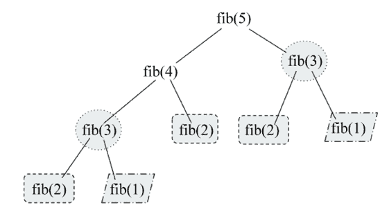

图 3.6：递归树中显示的重叠子问题 fib(5)

在使用记忆化技术的动态规划中，我们首次遇到**fib(1)**时存储其计算结果。同样，我们存储**fib(2)**和**fib(3)**的返回值。以后，无论何时遇到对**fib(1)**、**fib(2)**或**fib(3)**的调用，我们只需返回它们各自的结果。递归树图如图 3.7 所示：

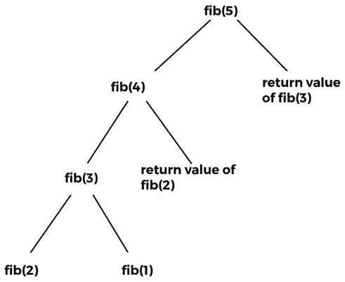

图 3.7：显示已计算值重用的 fib(5)递归树

因此，在动态规划中，我们消除了在遇到多次时重新计算**fib(3)**、**fib(2)**和**fib(1)**的需求。这被称为记忆化技术，其中在将问题分解为其子问题时，没有对函数重叠调用的重新计算。

因此，在我们的斐波那契示例中，重叠的函数调用是**fib(1)**、**fib(2)**和**fib(3)**。以下是基于动态规划的斐波那契数列实现的代码：

```py
def dyna_fib(n):
    if n == 0:
        return 0
    if n == 1:
        return 1  
    if lookup[n] is not None:
        return lookup[n]

    lookup[n] = dyna_fib(n-1) + dyna_fib(n-2)
    return lookup[n]
lookup = [None]*(1000)

for i in range(6): 
    print(dyna_fib(i)) 
```

这将产生如下输出：

```py
0
1
1
2
3
5 
```

在斐波那契数列的动态实现中，我们将先前解决的子问题的结果存储在一个列表中（换句话说，在这个示例代码中是一个查找）。我们首先检查任何数字的斐波那契数是否已经计算过；如果是，则从`lookup[n]`返回存储的值。否则，当我们计算其值时，是通过以下代码完成的：

```py
 if lookup[n] is not None:
        return lookup[n] 
```

在计算子问题的解决方案后，它再次存储在查找列表中。给定的斐波那契数值如以下代码片段所示返回：

```py
lookup[n] = dyna_fib(n-1) + dyna_fib(n-2) 
```

此外，为了存储 1,000 个元素的列表，我们使用`dyna_fib`函数创建一个列表查找：

```py
 lookup = [None]*(1000) 
```

因此，在基于动态规划的解决方案中，我们使用预先计算的结果来计算最终结果。

动态规划提高了算法的运行时间复杂度。在递归方法中，对于每个值，都会调用两个函数；例如，**fib(5)**调用**fib(4)**和**fib(3)**，然后**fib(4)**调用**fib(3)**和**fib(2)**，依此类推。因此，递归方法的复杂度是 O(2^n)，而在动态规划方法中，我们不重新计算子问题，所以对于**fib(n)**，我们有总共*n*个值需要计算，换句话说，**fib(0)**、**fib(1)**、**fib(2)**… **fib(n)**。因此，我们只解决这些值一次，所以总体的运行时间复杂度是 O(n)。因此，动态规划通常提高了性能。

在本节中，我们讨论了动态规划设计技术，在下一节中，我们将讨论贪心算法的设计技术。

# 贪心算法

贪婪算法通常涉及优化和组合问题。在贪婪算法中，目标是获得每一步中许多可能解决方案中的最佳解决方案。我们试图获得局部最优解，这最终可能使我们获得全局最优解。贪婪策略并不总是产生最优解。然而，局部最优解的序列通常近似于全局最优解。

例如，假设你被给出一些随机数字，比如`1`、`4`、`2`、`6`、`9`和`5`。现在你必须使用所有这些数字，不重复任何数字，来组成最大的数字。要使用贪婪策略从给定的数字中创建最大的数字，我们执行以下步骤。首先，我们从给定的数字中选择最大的数字，并将其附加到数字上，然后从列表中删除该数字，直到列表中没有剩余的数字。一旦所有数字都被使用，我们就得到了可以使用这些数字组成的最大数字：`965421`。该问题的逐步解决方案如*图 3.8*所示：

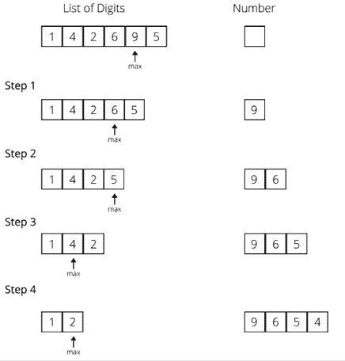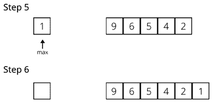

图 3.8：贪婪算法的示例

让我们考虑另一个例子，以更好地理解贪婪方法。比如说，你必须以最少的纸币数量给某人 29 印度卢比，一次给一张纸币，但不要超过欠款金额。假设我们有面额为 1、2、5、10、20 和 50 的纸币。要使用贪婪方法解决这个问题，我们将首先交付 20 卢比的纸币，然后对于剩余的 9 卢比，我们将给一张 5 卢比的纸币；对于剩余的 4 卢比，我们将给一张 2 卢比的纸币，然后另一张 2 卢比的纸币。

在这种方法中，在每一步，我们选择最佳可能的解决方案，并给出最大的可用纸币。假设，对于这个例子，我们必须使用面额为 1、14 和 25 的纸币。然后，使用贪婪算法，我们将选择 25 卢比的纸币，然后是四张 1 卢比的纸币，这样总共就有 5 张纸币。然而，这并不是可能的最小纸币数量。更好的解决方案是给出 14、14 和 1 的纸币。因此，这也清楚地表明，贪婪算法并不总是给出最佳解决方案，但是一个可行且简单的解决方案。

经典的例子是将贪婪算法应用于旅行商问题，其中贪婪算法总是首先选择最近的目的地。在这个问题中，贪婪算法总是选择与当前城市相关的最近未访问城市；这样，我们无法确定我们是否会得到最佳解决方案，但我们确实得到了一个最优解决方案。这种最短路径策略涉及找到局部问题的最佳解决方案，希望这能导致全局解决方案。

列出许多流行的标准问题，在这些问题中，我们可以使用贪婪算法来获得最佳解决方案：

+   Kruskal 的最小生成树

+   Dijkstra 的最短路径问题

+   背包问题

+   Prim 的最小生成树算法

+   旅行商问题

让我们讨论一个流行的问题，换句话说，最短路径问题，该问题可以使用贪婪方法解决，我们将在下一节中进行讨论。

## 最短路径问题

最短路径问题要求我们找出图中节点之间可能的最短路径。Dijkstra 算法是解决此问题的一种非常流行的贪婪方法。该算法用于在图中找到从源节点到目标节点的最短距离。

Dijkstra 算法适用于加权有向和无向图。该算法从给定的源节点 A 在加权图中生成从源节点到所有其他节点的最短路径列表。算法的工作原理如下：

1.  初始时，将所有节点标记为未访问，并将它们从给定源节点的距离设置为无穷大（源节点设置为 0）。

1.  将源节点设置为当前节点。

1.  对于当前节点，查找所有未访问的相邻节点，并计算从源节点通过当前节点到该节点的距离。将新计算的距离与当前分配的距离进行比较，如果它更小，则将其设置为新的值。

一旦我们考虑了当前节点的所有未访问的相邻节点，我们就将其标记为已访问。

如果目标节点已被标记为已访问，或者未访问节点的列表为空，这意味着我们已经考虑了所有未访问的节点，那么算法就完成了。

我们接下来考虑下一个未访问的节点，该节点与源节点的距离最短。重复*步骤 2*到*6*。

考虑*图 3.9*中的加权图示例，该图有六个节点[A、B、C、D、E 和 F]，以了解 Dijkstra 算法的工作原理。

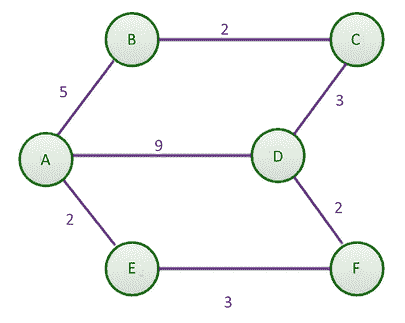

图 3.9：具有六个节点的示例加权图

通过手动检查，节点**A**和**D**之间的最短路径最初看起来是距离为 9 的直接线路。然而，最短路径意味着最低的总距离，即使这包括几个部分。通过比较，从节点**A**到**E**，然后从**E**到**F**，最后到**D**的总距离将是 7，这使得它成为更短的路径。

我们将使用单源实现最短路径算法。它将确定从起点到图中任何其他节点的最短路径，在本例中是**A**。在*第九章*，*图和其他算法*中，我们将讨论如何使用邻接表表示图。我们使用邻接表以及每条边的权重/成本/距离来表示图，如下面的 Python 代码所示。该图和表的邻接表如下：

```py
 `graph = dict()` 
 `graph['A'] = {'B': 5, 'D': 9, 'E': 2}` 
 `graph['B'] = {'A': 5, 'C': 2}` 
 `graph['C'] = {'B': 2, 'D': 3}` 
 `graph['D'] = {'A': 9, 'F': 2, 'C': 3}` 
 `graph['E'] = {'A': 2, 'F': 3}` 
 `graph['F'] = {'E': 3, 'D': 2}` 
```

在视觉演示之后，我们将返回到其余的代码，但不要忘记声明图以确保代码正确运行。

嵌套字典包含距离和相邻节点。使用表格来跟踪图中从源节点到任何其他节点的最短距离。*表 3.2* 是起始表格：

| **节点** | **从源节点到最短距离** | **前一个节点** |
| --- | --- | --- |
| **A** | 0 | 无 |
| **B** |  | 无 |
| **C** |  | 无 |
| **D** |  | 无 |
| **E** |  | 无 |
| **F** |  | 无 |

表 3.2：显示从源节点到最短距离的初始表格

当算法开始时，从给定的源节点（**A**）到任何其他节点的最短距离是未知的。因此，我们最初将所有其他节点的距离设置为无穷大，除了节点 **A**，因为节点 **A** 到节点 **A** 的距离是 **0**。算法开始时没有访问任何前一个节点。因此，我们将节点 **A** 的前一个节点列标记为 **无**。

在算法的 *步骤 1* 中，我们首先检查节点 **A** 的相邻节点。为了找到从节点 **A** 到节点 **B** 的最短距离，我们需要找到从起始节点到节点 **B** 的前一个节点的距离，这个前一个节点恰好是 **A**，然后将其加到从节点 **A** 到节点 **B** 的距离上。我们为 **A** 的其他相邻节点做同样的事情，这些节点是 **B**、**E** 和 **D**。这如图 *3.10* 所示：

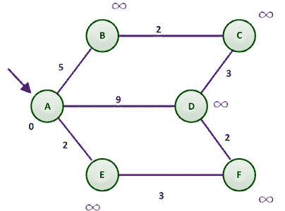

图 3.10：Dijkstra 算法的示例图

首先，我们选择相邻节点 **E**，因为从节点 **A** 到它的距离是最小的；从起始节点（**A**）到前一个节点（**无**）的距离是 0，从前一个节点到当前节点（**E**）的距离是 **2**。

这个总和与节点 **E** 的最短距离列中的数据进行比较（参见 *表 3.3*）。由于 **2** 小于无穷大（），我们将  替换为两个数中的较小者，也就是说，**2**。同样，从节点 **A** 到节点 **B** 和 **D** 的距离与从节点 **A** 到这些节点的现有最短距离进行比较。每当一个节点的最短距离被替换为更小的值时，我们需要更新当前节点的所有相邻节点的前一个节点列。

然后，我们将节点 **A** 标记为已访问（在 *图 3.11* 中用蓝色表示）：

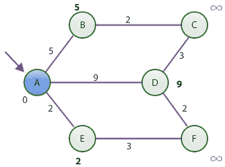

图 3.11：使用 Dijkstra 算法访问节点 A 后的最短距离图

在 *步骤 1* 的末尾，表格看起来像 *表 3.3* 中所示的那样，其中节点 **A** 到节点 **B**、**D** 和 **E** 的最短距离已更新。

| **节点** | **从源节点到最短距离** | **前一个节点** |
| --- | --- | --- |
| **A** | 0 | 无 |
| **B** | 5 | A |
| **C** |  | 无 |
| **D** | 9 | A |
| **E** | 2 | A |
| **F** |  | 无 |

表 3.3：访问节点 A 后的最短距离表

在这一点上，节点**A**被认为是已访问的。因此，我们将节点**A**添加到已访问节点的列表中。在表格中，我们通过在其旁边添加星号来表示节点**A**已被访问。

在第二步，我们使用*表 3.3*作为指南，找到最短距离的节点。节点**E**，其值为 2，具有最短距离。要到达节点**E**，我们必须访问节点**A**并覆盖**2**的距离。

现在，节点**E**的相邻节点是节点**A**和**F**。由于节点**A**已经被访问，我们只考虑节点**F**。为了找到到节点**F**的最短路径或距离，我们必须找到从起始节点到节点**E**的距离，并将其添加到节点**E**和**F**之间的距离。我们可以通过查看节点**E**的最短距离列来找到从起始节点到节点**E**的距离，其值为**2**。从邻接表中可以获得节点**E**到**F**的距离，即**3**。这两个值加起来是 5，小于无穷大。记住，我们正在检查相邻节点**F**。由于节点**E**没有更多的相邻节点，我们标记节点**E**为已访问。我们的更新表格和图将具有以下值，如*表 3.4*和*图 3.12*所示：

| **节点** | **从源节点到最短距离** | **前一个节点** |
| --- | --- | --- |
| **A*** | 0 | 无 |
| **B** | 5 | A |
| **C** |  | 无 |
| **D** | 9 | A |
| **E*** | 2 | A |
| **F** | 5 | E |

表 3.4：访问节点 E 后的最短距离表

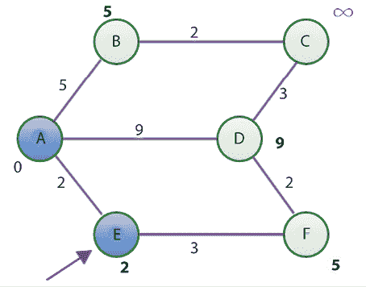

图 3.12：使用 Dijkstra 算法访问节点 E 后的最短距离图

访问节点**E**后，我们在*表 3.4*的最短距离列中找到最小的值，对于节点**B**和**F**，这个值是 5。出于字母顺序的原因，我们选择**B**而不是**F**。**B**的相邻节点是节点**A**和**C**，因为节点**A**已经被访问。使用我们之前建立的规则，从**A**到**C**的最短距离是 7，这是从起始节点到节点**B**的距离，即 5，而节点**B**到**C**的距离是 2。由于 7 小于无穷大，我们在*表 3.4*中更新最短距离为 7，并更新前一个节点列为节点**B**。

现在，**B**也被标记为已访问（在*图 3.13*中以蓝色表示）。

| **节点** | **从源节点到最短距离** | **前一个节点** |
| --- | --- | --- |
| **A*** | 0 | 无 |
| **B*** | 5 | A |
| **C** | 7 | B |
| **D** | 9 | A |
| **E*** | 2 | A |
| **F** | 5 | E |

表 3.5：访问节点 B 后的最短距离表

表格的新状态如下，在*表 3.5*中：

图 3.13：使用 Dijkstra 算法访问节点 B 后的最短距离图

尚未访问的最短距离节点是节点**F**。**F**的相邻节点是节点**D**和**E**。由于节点**E**已经访问过，我们将重点关注节点**D**。为了找到从起始节点到节点**D**的最短距离，我们通过将节点**A**到**F**的距离与节点**F**到**D**的距离相加来计算这个距离。总共是 7，这小于**9**。因此，我们将**9**更新为**7**，并在*表 3.5*中节点**D**的前一个节点列中将**A**替换为**F**。

节点**F**现在被标记为已访问（在*图 3.14*中以蓝色表示）。

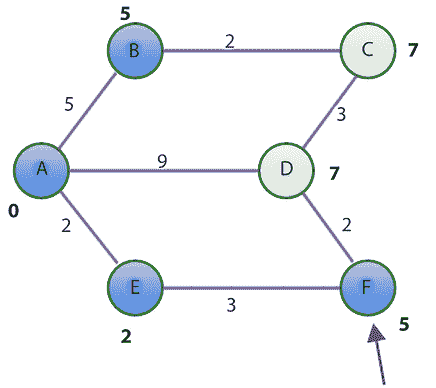

图 3.14：使用 Dijkstra 算法访问节点 F 后的最短距离图

这里是更新后的表格，如*表 3.6*所示：

| **节点** | **从源到最短距离** | **前一个节点** |
| --- | --- | --- |
| **A*** | 0 | 无 |
| **B*** | 5 | A |
| **C** | 7 | B |
| **D** | 7 | F |
| **E*** | 2 | A |
| **F*** | 5 | E |

表 3.6：访问节点 F 后的最短距离表

现在，只剩下两个未访问的节点，**C**和**D**，它们的距离成本都是**7**。按字母顺序排列，我们选择考虑节点**C**，因为这两个节点从起始节点**A**的最短距离相同。

然而，**C**的所有相邻节点都已访问（在*图 3.15*中以蓝色表示）。因此，我们除了将节点**C**标记为已访问外，别无他法。此时，表格保持不变。

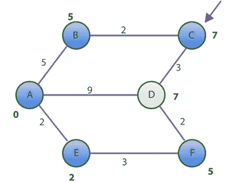

图 3.15：使用 Dijkstra 算法访问节点 C 后的最短距离图

最后，我们选择节点**D**，并发现它的所有相邻节点也已访问。我们只将其标记为已访问（在*图 3.16*中以蓝色表示）。

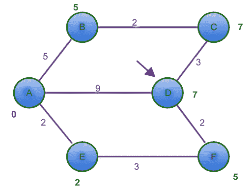

图 3.16：使用 Dijkstra 算法访问节点 D 后的最短距离图

表格保持不变，如*表 3.7*所示：

| **节点** | **从源到最短距离** | **前一个节点** |
| --- | --- | --- |
| A* | 0 | 无 |
| B* | 5 | A |
| C* | 7 | B |
| D* | 7 | F |
| E* | 2 | A |
| F* | 5 | E |

表 3.7：访问节点 F 后的最短距离表

让我们用我们的初始图来验证*表 3.7*。从图中，我们知道从**A**到**F**的最短距离是**5**。

根据表格，从源列到节点**F**的最短距离是 5。这是正确的。它还告诉我们，要到达节点**F**，我们需要访问节点**E**，然后从**E**到我们的起始节点**A**。这实际上是节点**A**到节点**F**的最短路径。

现在，我们将讨论使用 Python 实现 Dijkstra 算法寻找最短路径。我们通过表示允许我们跟踪图变化的表来开始寻找最短距离的程序。对于我们在本节中使用的初始*图 3.8*，以下是表的字典表示，以伴随我们之前在节中展示的图表示：

```py
 table = { 
    'A': [0, None], 
    'B': [float("inf"), None], 
    'C': [float("inf"), None], 
    'D': [float("inf"), None], 
    'E': [float("inf"), None], 
    'F': [float("inf"), None], 
} 
```

表的初始状态使用`float("inf")`表示无穷大。字典中的每个键映射到一个列表。列表的第一个索引存储从源节点到节点 A 的最短距离。第二个索引存储前一个节点：

```py
DISTANCE = 0 
PREVIOUS_NODE = 1 
INFINITY = float('inf') 
```

在这里，通过`DISTANCE`引用最短路径的列索引。通过`PREVIOUS_NODE`引用前一个节点的列索引。

首先，我们讨论在实现寻找最短路径的主要函数`find_shortest_path`时将使用的辅助方法。换句话说，第一个辅助方法是`get_shortest_distance`，它返回从源节点到节点的最短距离：

```py
def get_shortest_distance(table, vertex): 
    shortest_distance = table[vertex][DISTANCE] 
    return shortest_distance 
```

`get_shortest_distance`函数返回表中索引 0 的值。在该索引处，我们始终存储从起始节点到`vertex`的最短距离。`set_shortest_distance`函数只设置此值如下：

```py
def set_shortest_distance(table, vertex, new_distance): 
    table[vertex][DISTANCE] = new_distance 
```

当我们更新节点的最短距离时，我们使用以下方法更新其前一个节点：

```py
def set_previous_node(table, vertex, previous_node): 
    table[vertex][PREVIOUS_NODE] = previous_node 
```

记住`PREVIOUS_NODE`常量等于 1。在表中，我们在`table[vertex][PREVIOUS_NODE]`存储`previous_node`的值。要找到任何两个节点之间的距离，我们使用`get_distance`函数：

```py
def get_distance(graph, first_vertex, second_vertex): 
    return graph[first_vertex][second_vertex] 
```

最后一个辅助方法是`get_next_node`函数：

```py
 def get_next_node(table, visited_nodes): 
        unvisited_nodes = list(set(table.keys()).difference(set(visited_nodes))) 
        assumed_min = table[unvisited_nodes[0]][DISTANCE] 
        min_vertex = unvisited_nodes[0] 
        for node in unvisited_nodes: 
            if table[node][DISTANCE] < assumed_min: 
                assumed_min = table[node][DISTANCE] 
                min_vertex = node 
        return min_vertex 
```

`get_next_node`函数类似于寻找列表中最小项的函数。函数一开始通过使用`visited_nodes`获取两个列表集之间的差集来找到表中的未访问节点。`unvisited_nodes`列表中的第一个项目被假定为`table`中最短距离列中的最小值。

当`for`循环运行时，如果找到一个较小的值，`min_vertex`将被更新。然后函数返回`min_vertex`作为未访问的顶点或从源节点到具有最小最短距离的节点。

现在所有设置都已就绪，算法的主要函数，即`find_shortest_path`，如下所示：

```py
def find_shortest_path(graph, table, origin): 
    visited_nodes = [] 
    current_node = origin 
    starting_node = origin 
    while True: 
        adjacent_nodes = graph[current_node] 
        if set(adjacent_nodes).issubset(set(visited_nodes)): 
            # Nothing here to do. All adjacent nodes have been visited. 
            pass 
        else: 
            unvisited_nodes = 
                set(adjacent_nodes).difference(set(visited_nodes)) 
            for vertex in unvisited_nodes: 
                distance_from_starting_node = 
                    get_shortest_distance(table, vertex) 
                if distance_from_starting_node == INFINITY and 
                   current_node == starting_node: 
                    total_distance = get_distance(graph, vertex, 
                                                  current_node) 
                else: 
                    total_distance = get_shortest_distance (table, 
                    current_node) + get_distance(graph, current_node, 
                                                 vertex) 
                if total_distance < distance_from_starting_node: 
                    set_shortest_distance(table, vertex, 
                                          total_distance) 
                    set_previous_node(table, vertex, current_node) 
        visited_nodes.append(current_node)
        #print(visited_nodes)
        if len(visited_nodes) == len(table.keys()): 
            break 
        current_node = get_next_node(table,visited_nodes) 
      return (table) 
```

在前面的代码中，该函数将图（由邻接表表示）、表和起始节点作为输入参数。我们保持`visited_nodes`列表中的已访问节点列表。`current_node`和`starting_node`变量都指向图中我们选择的起始节点。`origin`值是相对于寻找最短路径的所有其他节点的参考点。

函数的主要过程是通过 `while` 循环实现的。让我们分解一下 `while` 循环正在做什么。在 `while` 循环体中，我们考虑图中我们想要调查的当前节点，并最初通过 `adjacent_nodes = graph[current_node]` 获取当前节点的所有相邻节点。`if` 语句用于确定 `current_node` 的所有相邻节点是否都已访问过。

当 `while` 循环第一次执行时，`current_node` 将包含节点 **A**，而 `adjacent_nodes` 将包含节点 **B**、**D** 和 **E**。此外，`visited_nodes` 将为空。如果所有节点都已访问过，我们只继续执行程序中的后续语句，否则，我们开始一个新的步骤。

`set(adjacent_nodes).difference(set(visited_nodes))` 语句返回尚未访问的节点。循环遍历这个未访问节点的列表：

```py
 distance_from_starting_node = get_shortest_distance(table, vertex) 
```

`get_shortest_distance(table, vertex)` 辅助方法将返回我们表中存储在最短距离列中的值，使用 `vertex` 引用的一个未访问节点：

```py
 if distance_from_starting_node == INFINITY and current_node == starting_node: 
         total_distance = get_distance(graph, vertex, current_node) 
```

当我们检查起始节点的相邻节点时，`distance_from_starting_node == INFINITY and current_node == starting_node` 将评估为 `True`，在这种情况下，我们只需通过引用图来找到起始节点和顶点之间的距离：

```py
 total_distance = get_distance(graph, vertex, current_node) 
```

`get_distance` 方法是我们使用的另一个辅助方法，用于获取 `vertex` 和 `current_node` 之间边的值（距离）。如果条件失败，则将 `total_distance` 赋值为从起始节点到 `current_node` 的距离加上 `current_node` 和 `vertex` 之间的距离。

一旦我们有了总距离，我们需要检查 `total_distance` 是否小于我们表中最短距离列中现有的数据。如果是的话，我们就使用两个辅助方法来更新那一行：

```py
 if total_distance < distance_from_starting_node: 
        set_shortest_distance(table, vertex, total_distance)
        set_previous_node(table, vertex, current_node) 
```

在这一点上，我们将 `current_node` 添加到已访问节点的列表中：

```py
 visited_nodes.append(current_node) 
```

如果所有节点都已访问过，那么我们必须退出 `while` 循环。为了检查这是否是情况，我们比较 `visited_nodes` 列表的长度与表中键的数量。如果它们已经相等，我们就简单地退出 `while` 循环。

`get_next_node` 辅助方法用于获取要访问的下一个节点。正是这个方法帮助我们通过我们的表找到从起始节点到最短距离列中的最小值。整个方法通过返回更新后的表结束。为了打印表，我们使用以下语句：

```py
shortest_distance_table = find_shortest_path(graph, table, 'A') 
for k in sorted(shortest_distance_table): 
     print("{} - {}".format(k,shortest_distance_table[k])) 
```

这是前面代码片段的输出：

```py
A - [0, None]
B - [5, 'A']
C - [7, 'B']
D - [7, 'F']
E - [2, 'A']
F - [5, 'E'] 
```

Dijkstra 算法的运行时间复杂度取决于顶点的存储和检索方式。通常，最小优先队列用于存储图的顶点，因此，Dijkstra 算法的时间复杂度取决于最小优先队列的实现方式。

在第一种情况下，顶点按编号从 1 到|*V*|存储在数组中。在这里，从整个数组中搜索顶点的每个操作将花费 O(V)时间，使得总时间复杂度为 O(V²) + O(V² + E) = O(V²)。此外，如果使用斐波那契堆实现最小优先队列，则循环的每次迭代和提取最小节点所需的时间为 O(|*V*|)时间。进一步地，遍历所有顶点的相邻节点并更新最短距离需要 O(|*E*|)时间，每次优先值更新需要 O(log|*V*|)时间，这使得 O(|*E*| + log|*V*|)。因此，算法的总运行时间复杂度为 O(|*E*| + |*V*|*log* |*V*|)，其中|*V*|是顶点的数量，|*E*|是边的数量。

# 摘要

算法设计技术在制定、理解和开发复杂问题的最优解方面非常重要。在本章中，我们讨论了算法设计技术，这在计算机科学领域非常重要。我们详细讨论了重要的算法设计类别，如动态规划、贪心算法和分而治之，并附上了重要算法的实现。

动态规划和分而治之技术在某种程度上非常相似，因为它们都是通过组合子问题的解来解决更大的问题。在这里，分而治之技术将问题划分为不相交的子问题，递归地解决它们，然后将子问题的解组合起来以获得原始问题的解，而在动态规划中，当子问题重叠时采用这种技术，以避免对相同子问题的重复计算。此外，在基于贪心算法的算法设计技术中，在算法的每一步中，都会选择看起来可能达到解的最佳选择。

在下一章中，我们将讨论重要的数据结构，例如`链表`和`指针结构`。

# 练习

1.  当应用自顶向下的动态规划方法来解决与空间和时间复杂度相关的问题时，以下哪个选项将是正确的？

    1.  它将同时增加时间和空间复杂度。

    1.  它将增加时间复杂度，并减少空间复杂度

    1.  它将增加空间复杂度，并减少时间复杂度

    1.  它将同时减少时间和空间复杂度。

1.  迪杰斯特拉单源最短路径算法应用于图 3.17 所示的带权重的有向图。假设 A 为源点，最短路径距离的节点顺序将是什么？

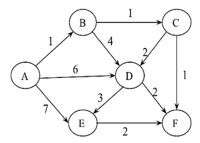

图 3.17：一个带权重的有向图

1.  考虑*表 3.8*中列出的项目的权重和值。请注意，每种物品只有一个单位。

    | **项目** | **重量** | **价值** |
    | --- | --- | --- |
    | A | 2 | 10 |
    | B | 10 | 8 |
    | C | 4 | 5 |
    | D | 7 | 6 |

    表 3.8：不同物品的权重和值

    我们需要最大化价值；最大重量应为 11 kg。任何物品不得分割。使用贪婪算法确定物品的价值。

# 加入我们的 Discord 社区

加入我们的 Discord 空间，与作者和其他读者进行讨论：[`packt.link/MEvK4`](https://packt.link/MEvK4)


