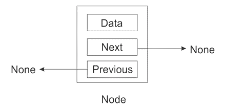

# 第四章：链表

Python 的列表实现非常强大，可以涵盖多个不同的用例。我们在*第一章*，*Python 数据类型和结构*中讨论了 Python 的内置数据结构**列表**。大多数时候，Python 的内置列表数据结构实现用于使用链表存储数据。在本章中，我们将了解链表的工作原理及其内部结构。

链表是一种数据结构，其中数据元素按线性顺序存储。链表通过指针结构提供高效的数据线性存储。指针用于存储数据项的内存地址。它们存储数据和位置，位置存储内存中下一个数据项的位置。

本章的重点将是以下内容：

+   数组

+   链表的介绍

+   单链表

+   双向链表

+   循环链表

+   链表的实用应用

在讨论链表之前，让我们首先讨论数组，它是最基本的数据结构之一。

# 数组

数组是一系列相同类型的数据项的集合，而链表是按顺序存储并通过指针连接的相同数据类型的集合。在列表的情况下，数据元素存储在不同的内存位置，而数组元素存储在连续的内存位置中。

数组存储相同数据类型的数据，数组中的每个数据元素都存储在连续的内存位置中。存储多个相同类型的数据值使得使用**偏移量**和**基址**计算数组中任何元素的位容易且快速。术语*基址*指的是存储第一个元素的内存位置的地址，而偏移量指的是一个整数，表示第一个元素和给定元素之间的位移。

*图 4.1* 展示了一个包含七个整数值的数组，这些值按顺序存储在连续的内存位置中。第一个元素（数据值 3）存储在索引 0 处，第二个元素在索引位置 1，以此类推。


图 4.1：一维数组的表示

与列表相比，存储、遍历和访问数组元素非常快，因为可以通过它们的索引位置随机访问元素，而在链表的情况下，元素是顺序访问的。因此，如果要存储在数组中的数据量很大且系统内存较低，数组数据结构不是存储数据的良好选择，因为很难分配一大块内存位置。数组数据结构还有进一步的限制，即它具有静态大小，必须在创建时声明。

此外，与链表相比，数组数据结构中的插入和删除操作较慢。这是因为很难在数组中给定位置插入一个元素，因为在此位置之后的所有数据元素都必须移动，然后才能在它们之间插入新元素。因此，当我们需要进行大量元素访问而插入和删除操作较少时，数组数据结构是合适的，而链表适用于列表大小不固定且需要大量插入和删除操作的应用。

# 介绍链表

链表是一个重要且流行的数据结构，具有以下特性：

1.  数据元素存储在内存的不同位置，通过指针连接。指针是一个可以存储变量内存地址的对象，每个数据元素都指向下一个数据元素，以此类推，直到最后一个元素，它指向`None`。

1.  在程序执行过程中，列表的长度可以增加或减少。

与数组不同，链表在内存的不同位置顺序存储数据项，其中每个数据项都是独立存储的，并使用指针与其他数据项链接。这些数据项中的每一个都称为节点。更具体地说，节点存储实际数据和指针。在*图 4.2*中，节点 A 和 B 独立存储数据，节点 A 连接到节点 B。


图 4.2：包含两个节点的链表

此外，节点可以根据我们想要存储数据的方式以及基于何种基础来链接到其他节点，我们将学习各种数据结构，如单链表、双链表、循环链表和树。

## 节点和指针

节点是多个数据结构（如链表）的关键组成部分。节点是数据的容器，同时包含一个或多个指向其他节点的链接，其中链接是一个指针。

首先，让我们考虑一个创建包含数据（例如，字符串）的两个节点链表的例子。为此，我们首先声明一个变量来存储数据，以及指向下一个变量的指针。请参考以下*图 4.3*的例子，其中有两个节点。第一个节点有一个指向字符串（**eggs**）的指针，另一个节点指向**ham**字符串。

此外，第一个指向**eggs**字符串的节点有一个指向另一个节点的链接。指针用于存储变量的地址，由于字符串实际上并不存储在节点中，而是在节点中存储字符串的地址。


图 4.3：两个节点的示例链表

此外，我们还可以向现有的链表添加一个新的第三个节点，该节点存储的数据值为垃圾邮件，而第二个节点指向第三个节点，如图 4.4 所示。因此，图 4.3 展示了具有数据字符串的三个节点的结构，换句话说，**鸡蛋**、**火腿**和**垃圾邮件**，它们按顺序存储在链表中。


图 4.4：三个节点的示例链表

因此，我们创建了三个节点——一个包含 **鸡蛋**，一个 **火腿**，另一个 **垃圾邮件**。**鸡蛋** 节点指向 **火腿** 节点，而 **火腿** 节点又指向 **垃圾邮件** 节点。但 **垃圾邮件** 节点指向什么？由于这是列表中的最后一个元素，我们需要确保其 **next** 成员具有一个值来明确这一点。如果我们让最后一个元素指向空值，那么我们就清楚地表明了这一点。在 Python 中，我们将使用特殊值 **None** 来表示空值。考虑图 4.5。节点 **B** 是列表中的最后一个元素，因此它指向 **None**。


图 4.5：包含两个节点的链表

让我们先了解节点的实现，如下代码片段所示：

```py
class Node:
    def __init__ (self, data=None):
        self.data = data 
        self.next = None 
```

在这里，**next** 指针被初始化为 `None`，这意味着除非我们更改 **next** 的值，否则节点将成为一个端点，也就是说，最初，任何附加到列表中的节点将是独立的。

如果需要，您也可以向节点类添加任何其他数据项。如果您的节点将包含客户数据，那么创建一个 `Customer` 类并将所有数据放在那里。

有三种类型的列表——单链表、双链表和循环链表。首先，让我们讨论单链表。

为了在实时应用中使用任何链表，我们需要学习以下操作。

+   遍历列表

+   在列表中插入数据项：

    +   在列表开头插入新的数据项（节点）

    +   在列表末尾插入新的数据项（节点）

    +   在列表中间/任何给定位置插入新的数据项（节点）

+   从列表中删除一个项目：

    +   删除第一个节点

    +   删除最后一个节点

    +   在列表中间/任何给定位置删除节点

我们将在后续的小节中讨论这些重要操作，包括它们的实现，使用 Python。让我们从单链表开始。

# 单链表

链表（也称为单链表）包含多个节点，其中每个节点包含数据和指向下一个节点的指针。列表中最后一个节点的链接是 `None`，这表示列表的末尾。请参考以下链表，如图 4.6 所示，其中存储了一系列整数。


图 4.6：单链表的示例

接下来，我们讨论如何创建单链表以及如何遍历它。

## 创建和遍历

为了实现单链表，我们可以使用我们在上一节中创建的节点类。例如，我们创建三个节点`n1`、`n2`和`n3`，它们存储三个字符串：

```py
n1 = Node('eggs')
n2 = Node('ham') 
n3 = Node('spam') 
```

接下来，我们将节点依次链接起来形成链表。例如，在以下代码中，节点`n1`指向节点`n2`，节点`n2`指向节点`n3`，节点`n3`是最后一个节点，并指向**None**：

```py
n1.next = n2
n2.next = n3 
```

链表遍历意味着访问列表中的所有节点，从起始节点到最后一个节点。遍历单链表的过程从第一个节点开始，显示当前节点的数据，跟随指针，最后在到达最后一个节点时停止。

为了实现链表的遍历，我们首先将`current`变量设置为列表中的第一个项目（起始节点），然后通过循环遍历整个列表，如以下代码所示：

```py
current = n1 
while current:
     print(current.data)
     current = current.next 
```

在循环中，我们在打印当前元素后，将`current`设置为指向列表中的下一个元素。我们一直这样做，直到到达列表的末尾。前面代码的输出如下：

```py
eggs
ham
spam 
```

然而，这种简单列表实现存在几个问题：

+   这需要程序员进行太多的手动操作。

+   链表的大部分内部工作都暴露给了程序员。

因此，让我们讨论一种更好、更高效的遍历链表的方法。

### 改进列表创建和遍历

正如你将在列表遍历的早期示例中注意到的那样，我们正在将节点类暴露给客户端/用户。然而，客户端节点不应与节点对象交互。我们需要使用`node.data`来获取节点的内容，使用`node.next`来获取下一个节点。我们可以通过创建一个返回生成器的方法来访问数据，这可以通过 Python 中的`yield`关键字来完成。列表遍历的更新代码片段如下：

```py
def iter(self):
    current = self.head 
    while current:
        val = current.data 
        current = current.next 
        yield val 
```

在这里，`yield`关键字用于在保存函数局部变量的状态的同时从函数返回，以便函数可以从上次停止的地方继续执行。每次函数再次被调用时，执行从最后一个`yield`语句开始。任何包含`yield`关键字的函数都被称为**生成器**。

现在，列表遍历变得简单多了。我们可以完全忽略列表外存在任何称为节点的东西：

```py
for word in words.iter():
    print(word) 
```

注意，由于`iter()`方法返回节点的数据成员，我们的客户端代码根本不需要担心这一点。

可以使用一个简单的类来创建单链表。我们从一个构造函数开始，该构造函数包含对列表中第一个节点的引用（在下面的代码中是`head`）。由于这个列表最初是空的，我们将把这个引用设置为`None`：

```py
class SinglyLinkedList:
    def __init__ (self):
        self.head = None 
```

在前面的代码中，我们从一个空列表开始，该列表指向`None`。现在，新的数据元素可以被追加/添加到这个列表中。

## 追加项目

我们需要执行的第一项操作是将项目`append`到列表中。这个操作也称为`插入`操作。在这里，我们有机会将`Node`类隐藏起来。列表类的用户永远不需要与`Node`对象交互。

### 在列表末尾追加项目

让我们看看创建链表的 Python 代码，其中我们使用`append()`方法将新元素追加到列表中，如下所示：

第一次尝试的 `append()` 方法可能看起来像这样：

```py
class SinglyLinkedList:
    def __init__ (self):  
        self.head = None  
        self.size = 0
def append(self, data):
    # Encapsulate the data in a Node 
    node = Node(data)
    if self.head is None:
        self.head = node
    else:
        current = self.head
        while current.next:
            current = current.next
        current.next = node 
```

在此代码中，我们将数据封装在节点中，以便它具有下一个指针属性。从这里，我们检查列表中是否存在任何现有节点（即`self.head`是否指向一个`Node`）。如果为`None`，这意味着列表最初是空的，新节点将是第一个节点。因此，我们将新节点作为列表的第一个节点；否则，我们通过遍历列表到最后一个节点并更新最后一个节点的下一个指针来找到插入点。这种工作方式在*图 4.7*中有所描述。


图 4.7：在单链表中在列表末尾插入节点

考虑以下示例代码来追加三个节点：

```py
words = SinglyLinkedList()
words.append('egg')
words.append('ham')
words.append('spam') 
```

列表遍历将像我们之前讨论的那样工作。您将从列表本身获取列表的第一个元素，然后通过`next`指针遍历列表：

```py
current = words.head
while current:
   print(current.data)
   current = current.next 
```

尽管如此，这种实现并不非常高效，append 方法存在一个缺点。在这种情况下，我们必须遍历整个列表来找到插入点。当列表中只有少量项目时，这可能不是问题，但当列表很长时，这将非常低效，因为它每次添加项目时都必须遍历整个列表。让我们讨论`append`方法的更好实现。

对于这一点，我们的想法是，我们不仅有一个指向列表中第一个节点的引用，而且在节点中还有一个变量，它引用列表的最后一个节点。这样，我们可以快速在列表末尾追加一个新的节点。使用这种方法，append 操作的运行时间最坏情况可以从`O(n)`减少到`O(1)`。我们必须确保上一个最后一个节点指向要追加到列表中的新节点。

这是我们的更新后的代码：

```py
class SinglyLinkedList:
    def __init__ (self):
        self.tail = None
        self.head = None
        self.size = 0
    def append(self, data):
        node = Node(data)
        if self.tail:
            self.tail.next = node
            self.tail = node
        else:
            self.head = node 
            self.tail = node 
```

注意所使用的约定。我们通过`self.tail`来追加新节点。`self.head`变量指向列表中的第一个节点。

在此代码中，可以通过`tail`指针通过从最后一个节点到新节点的链接来在末尾追加一个新节点。*图 4.8*显示了前面代码的工作原理。


图 4.8：展示在链表末尾插入节点

在 *图 4.8* 中，*步骤 1* 显示了在末尾添加新节点，而 *步骤 2* 显示了列表为空的情况。在这种情况下，`head` 被设置为新的节点，`tail` 指向该节点。

此外，以下代码片段显示了代码的工作原理：

```py
words = SinglyLinkedList()
words.append('egg')
words.append('ham')
words.append('spam')

current = words.head
while current:
    print(current.data)
    current = current.next 
```

上述代码的输出如下：

```py
eggs
ham
spam 
```

### 在中间位置追加项目

在现有的链表中在指定位置追加或插入一个元素时，首先，我们必须遍历列表以到达我们想要插入元素的目标位置。可以使用两个指针（`prev` 和 `current`）在两个连续的节点之间插入一个元素。

通过更新这些链接，可以轻松地在两个现有节点之间插入一个新节点，如图 *4.9* 所示。


图 4.9：在链表中两个连续节点之间插入节点

当我们想在两个现有节点之间插入一个节点时，我们只需更新两个链接。前一个节点指向新节点，而新节点应该指向前一个节点的后继节点。

让我们看看下面的完整代码，以在给定索引位置添加一个新元素：

```py
class SinglyLinkedList:
    def __init__ (self):
        self.tail = None
        self.head = None
        self.size = 0
    def append_at_a_location(self, data, index): 
        current = self.head 
        prev = self.head 
        node = Node(data)
        count = 1
        while current:
            if count == 1:        
                node.next = current
                self.head = node
                print(count)
                return
            elif index == index:
                node.next = current 
                prev.next = node
                return
            count += 1
            prev = current
            current = current.next
        if count < index:
            print("The list has less number of elements") 
```

在前面的代码中，我们从第一个节点开始，移动当前指针以到达我们想要添加新元素的索引位置，然后相应地更新节点指针。在 `if` 条件中，首先检查索引位置是否为 `1`。在这种情况下，我们必须更新节点，因为我们正在列表的开始处添加新节点。因此，我们必须使新节点成为 `head` 节点。接下来，在 `else` 部分，我们通过比较 `count` 和 `index` 的值来检查是否已到达所需的索引位置。如果这两个值相等，我们在由 `prev` 和 `current` 指示的节点之间添加一个新节点，并相应地更新指针。最后，如果所需的索引位置大于链表的长度，我们打印一条适当的消息。

```py
2 in the existing linked list:
```

```py
words = SinglyLinkedList()
words.append('egg')
words.append('ham')
words.append('spam')
current = words.head
while current:
    print(current.data)
    current = current.next
words.append_at_a_location('new', 2)
current = words.head
while current:
    print(current.data)
    current = current.next 
```

上述代码的输出如下：

```py
egg
new
ham
spam 
```

重要的是要注意，我们想要插入新元素的条件可能会根据需求而改变，所以假设我们想在具有相同数据值的元素之前插入一个新元素。在这种情况下，`append_at_a_position` 的代码如下：

```py
def append_at_a_location(self, data): 
    current = self.head 
    prev = self.head
    node = Node(data)
    while current:
        if current.data == data:
            node.next = current 
            prev.next = node
        prev = current
        current = current.next 
```

我们现在可以使用前面的代码在中间位置插入一个新节点：

```py
words.append_at_a_location('ham')
current = words.head
while current:
    print(current.data)
    current = current.next 
```

上述代码的输出如下：

```py
egg
ham
ham
spam 
```

当我们有一个指向最后一个节点的额外指针时，`insert` 操作的最坏情况时间复杂度是 `O(1)`。否则，当我们没有指向最后一个节点的链接时，时间复杂度将是 `O(n)`，因为我们必须遍历列表以到达目标位置，在最坏的情况下，我们可能需要遍历列表中的所有 *n* 个节点。

## 查询列表

一旦创建列表，我们可能需要一些有关链表的快速信息，例如列表的大小，有时还需要确定给定的数据项是否存在于列表中。

### 在列表中搜索元素

我们还可能需要检查列表是否包含给定的项。这可以通过使用我们在上一节中遍历链表时已经看到的`iter()`方法来实现。使用它，我们编写如下搜索方法：

```py
def search(self, data):
    for node in self.iter():
        if data == node:
            return True
    return False 
```

在上述代码中，循环的每次迭代都会将待搜索的数据与列表中的每个数据项逐一比较。如果找到匹配项，则返回`True`，否则返回`False`。

如果我们运行以下代码来搜索给定的数据项：

```py
print(words.search('sspam'))
print(words.search('spam')) 
```

上述代码的输出如下：

```py
False
True 
```

### 获取列表的大小

通过计数节点数量来获取列表的大小是很重要的。一种方法是在遍历整个列表的同时增加计数器：

```py
def size(self):
    count = 0
    current = self.head
    while current:
        count += 1
        current = current.next
    return count 
```

上述代码与我们遍历链表时所做的非常相似。同样，在这段代码中，我们逐个遍历列表的节点，并增加`count`变量。然而，列表遍历可能是一个昂贵的操作，我们应该尽量避免。

因此，我们可以选择另一种方法，在`SinglyLinkedList`类中添加一个大小成员，并在构造函数中将它初始化为`0`，如下面的代码片段所示：

```py
class SinglyLinkedList:
    def __init__(self):
        self.head = data
        self.size = 0 
```

因为我们现在只读取节点对象的`size`属性，而不是使用循环来计数列表中的节点数量，所以我们把最坏情况下的运行时间从`O(n)`降低到`O(1)`。

## 删除项

在链表上进行的另一个常见操作是删除节点。为了从单链表中删除节点，我们可能会遇到三种可能性。

### 删除单链表开头的节点

从列表开头删除节点相当简单。这涉及到将`head`指针更新为列表中的第二个节点。这可以通过以下两个步骤完成：

1.  创建一个临时指针（`current`指针），它指向第一个节点（`head`节点），如图*4.10*所示。


图 4.10：展示从链表中删除第一个节点的示意图

1.  接下来，将`current`节点指针移动到下一个节点，并将其分配给`head`节点。现在，第二个节点成为由`head`指针指向的`head`节点，如图*4.11*所示。


图 4.11：删除第一个节点后，头指针现在指向新的起始元素

这可以通过以下 Python 代码实现。在这个代码中，最初添加了三个数据元素，就像我们之前做的那样，然后删除了列表的第一个节点：

```py
def delete_first_node (self):
       current = self.head  
        if self.head is None:
              print("No data element to delete")
        elif current == self.head:
              self.head = current.next 
```

在上述代码中，我们首先检查链表中是否没有要删除的项目，并打印相应的消息。接下来，如果链表中有一些数据项，我们根据*步骤 1*将`head`指针赋值给临时指针`current`，然后`head`指针现在指向下一个节点，假设我们已经有了一个包含三个数据项的链表——“鸡蛋”、“火腿”和“垃圾”：

```py
words.delete_first_node()
current = words.head
while current:
    print(current.data)
    current = current.next 
```

上述代码的输出如下：

```py
ham
spam 
```

### 从单链表末尾删除节点

要从链表中删除最后一个节点，我们首先需要遍历链表到达最后一个节点。那时，我们还需要一个额外的指针，它指向最后一个节点之前的一个节点，这样在删除最后一个节点后，倒数第二个节点可以被标记为最后一个节点。这可以通过以下三个步骤实现：

1.  首先，我们有两个指针，换句话说，一个`current`指针将指向最后一个节点，一个`prev`指针将指向最后一个节点之前的节点（倒数第二个节点）。最初，我们将有三个指针（`current`、`prev`和`head`）指向第一个节点，如图*图 4.12*所示。


图 4.12：从链表中删除末尾节点的示意图

1.  要到达最后一个节点，我们需要移动`current`和`prev`指针，使得`current`指针指向最后一个节点，而`prev`指针指向倒数第二个节点。因此，当`current`指针到达最后一个节点时，我们停止。这如图*图 4.13*所示。


图 4.13：遍历链表到达链表末尾

1.  最后，我们将`prev`指针标记为指向倒数第二个节点，通过将此节点指向`None`将其表示为链表的最后一个节点，如图*图 4.14*所示。


图 4.14：从链表中删除最后一个节点

在 Python 中从链表末尾删除节点的实现如下：

```py
 def delete_last_node (self):  
        current = self.head  
        prev = self.head  
        while current: 
            if current.next is None: 
                prev.next = current.next  
                self.size -= 1 
            prev = current 
            current = current.next 
```

在前面的代码中，首先，根据*步骤 1*，将`current`和`prev`指针赋值为`head`指针。然后，在`while`循环中，我们使用`current.next is None`条件检查是否到达了链表的末尾。一旦到达链表末尾，我们将由`prev`指针指示的倒数第二个节点标记为最后一个节点。我们还会减少链表的大小。如果我们没有到达链表末尾，我们在代码的最后两行中的`while`循环中增加`prev`和`current`指针。接下来，让我们讨论如何删除单链表中的任何中间节点。

### 从单链表中删除任何中间节点

我们首先必须决定如何选择要删除的节点。通过索引号或节点包含的数据来识别要删除的中间节点。让我们通过根据节点包含的数据删除节点来理解这个概念。

要删除任何中间节点，我们需要两个指针，类似于我们学习删除最后一个节点的情况；换句话说，`current`指针和`prev`指针。一旦我们到达要删除的节点，可以通过使前一个节点指向要删除的节点的下一个节点来删除所需的节点。这个过程在以下步骤中提供：

1.  *图 4.15*显示了从给定的链表中删除中间节点的情况。在这里，我们可以看到初始指针指向第一个节点。


图 4.15：从链表中删除中间节点的示意图

1.  一旦识别出节点，`prev`指针就会更新以删除节点，如*图 4.16*所示。要删除的节点以及需要更新的链接在*图 4.16*中显示。


图 4.16：遍历以到达要删除的中间节点在链表中的位置

1.  最后，删除节点后的列表在*图 4.17*中显示。


图 4.17：从链表中删除中间节点

假设我们想要删除具有给定值的数据元素。对于这个条件，我们首先可以搜索要删除的节点，然后按照讨论的步骤进行删除。

下面是`delete()`方法实现的可能样子：

```py
def delete(self, data):
    current = self.head 
    prev = self.head 
    while current:
          if current.data == data:
              if current == self.head:
                  self.head = current.next 
              else:
                  prev.next = current.next 
              self.size -= 1
              return
          prev = current
          current = current.next 
```

假设我们已经有了一个包含三个项目——“鸡蛋”、“火腿”和“垃圾食品”的链表，以下代码是执行删除操作，即从给定的链表中删除具有值“火腿”的数据元素：

```py
words.delete("ham")
current = words.head
while current:
    print(current.data)
    current = current.next 
```

上述代码的输出如下：

```py
egg
spam 
```

`delete`操作的 worst-case 时间复杂度为`O(n)`，因为我们必须遍历列表以到达目标位置，在 worst-case 情景下，我们可能需要遍历列表中的所有 *n* 个节点。

### 清除列表

我们可能需要快速清除列表，有一种非常简单的方法。我们可以通过将指针`head`和`tail`设置为`None`来清除列表：

```py
def clear(self):
    # clear the entire list.
    self.tail = None
    self.head = None 
```

在上面的代码中，我们可以通过将`tail`和`head`指针赋值为`None`来清除列表。

我们已经讨论了单链表的不同操作，现在我们将讨论双链表的概念，并学习如何在下一节中实现双链表的不同操作。

# 双链表

从某种意义上说，双链表与单链表非常相似，因为我们使用相同的节点基本概念，以及我们如何将数据和链接一起存储，就像我们在单链表中做的那样。单链表和双链表之间的唯一区别是，在单链表中，每个连续节点之间只有一个链接，而在双链表中，我们有两个指针——一个指向下一个节点，一个指向前一个节点。请参考以下 *图 4.18* 的节点；有一个指向下一个节点和前一个节点的指针，这些指针被设置为 `None`，因为没有节点连接到这个节点。



图 4.18：表示具有单个节点的双链表

单链表中的一个节点只能确定与其关联的下一个节点。然而，从该引用节点返回没有链接。流的方向只有单向。在双链表中，我们解决了这个问题，并包括了不仅能够引用下一个节点，还能够引用前一个节点的功能。请参考以下 *图 4.19* 来理解两个连续节点之间链接的性质。在这里，节点 **A** 引用了节点 **B**；此外，还有一个返回到节点 **A** 的链接。


图 4.19：具有两个节点的双链表

双链表可以双向遍历。在需要时，双链表中的一个节点可以很容易地通过其前一个节点来引用，而不需要有一个变量来跟踪该节点。

然而，在单链表中，可能很难回到列表的起始或开头以在列表的开头进行一些更改，而现在在双链表中这变得非常容易。

## 创建和遍历

创建双链表节点的 Python 代码包括其初始化方法、`prev` 指针、`next` 指针和 `data` 实例变量。当一个节点被新创建时，所有这些变量默认为 `None`：

```py
class Node:
    def __init__ (self, data=None, next=None, prev=None):
       self.data = data 
       self.next = next 
       self.prev = prev 
```

`prev` 变量有一个对前一个节点的引用，而 `next` 变量保持对下一个节点的引用，`data` 变量存储数据。

接下来，让我们创建一个双链表类。

双链表类有两个指针，`head` 和 `tail`，分别指向双链表的起始和结束。此外，对于列表的大小，我们设置 `count` 实例变量为 `0`。它可以用来跟踪链表中的项目数量。请参考以下创建双链表类的 Python 代码：

```py
class DoublyLinkedList:
    def __init__ (self): 
        self.head = None
        self.tail = None
        self.count = 0 
```

在这里，`self.head` 指向链表的起始节点，而 `self.tail` 指向最后一个节点。然而，关于头尾节点指针的命名并没有固定的规则。

双链表还需要一些功能，例如返回列表的大小、将项目插入列表以及从列表中删除节点。接下来，我们将讨论可以应用于双链表的不同操作。让我们从追加操作开始。

## 追加项目

`append`操作用于在列表的末尾添加一个元素。在以下情况下，可以将元素追加或插入到双链表中。

### 在列表的起始处插入节点

首先，重要的是检查列表的`head`节点是否为`None`。如果是`None`，这意味着列表为空，否则列表有一些节点，可以在列表中追加一个新节点。如果要将新节点添加到空列表中，它应该有`head`指针指向新创建的节点，并且列表的尾部也应该指向这个新创建的节点。

以下*图 4.20*说明了在空列表中添加新节点时双链表的`head`和`tail`指针。


图 4.20：空双链表中插入节点的示意图

或者，我们可以在现有双链表的开始处插入或追加一个新节点，如图*图 4.21*所示。


图 4.21：双链表中插入元素的示意图

新节点应成为列表的新起始节点，并指向之前的`head`节点。

可以通过更新三个链接来实现，这三个链接也在*图 4.22*中以虚线显示，具体描述如下：

1.  首先，新节点的`next`指针应指向现有列表的`head`节点

1.  现有列表的`head`节点的`prev`指针应指向新节点

1.  最后，将新节点标记为列表中的`head`节点


图 4.22：在双链表的起始处插入节点

当列表最初为空且存在双链表时，以下代码用于在列表的起始处追加/插入一个项目：

```py
def append_at_start(self, data):
  #Append an item at beginning to the list.
  new_node = Node(data, None, None)
  if self.head is None:
      self.head = new_node
      self.tail = self.head
    else:
      new_node.next = self.head
      self.head.prev = new_node
      self.head = new_node
  self.count += 1 
```

在上述代码中，首先检查`self.head`条件，无论列表是否为空。如果为空，则头和尾指针指向新创建的节点。在这种情况下，新节点成为`head`节点。接下来，如果条件不成立，这意味着列表不为空，需要在列表的起始处添加一个新节点。为此，需要更新如图*图 4.22*所示的三条链接，并在粗体字体的代码中显示。更新这些三条链接后，最后将列表的大小增加`1`。此外，让我们了解如何将元素插入到双链表的末尾。

此外，以下代码片段展示了我们如何创建一个双链表并在列表的起始处追加一个新节点：

```py
words = DoublyLinkedList()
words.append('egg')
words.append('ham')
words.append('spam')
print("Items in doubly linked list before append:")
current = words.head
while current:
    print(current.data)
    current = current.next
words.append_at_start('book')
print("Items in doubly linked list after append:")
current = words.head
while current:
    print(current.data)
    current = current.next 
```

上述代码的输出为：

```py
Items in doubly linked list before append:
egg
ham
spam
Items in doubly linked list after append:
book
egg
ham
spam 
```

在输出中，我们可以看到新数据项“`book`"被添加到列表的起始处。

### 在列表末尾插入节点

如果我们没有指向列表末尾的单独指针，为了在双链表的末尾追加/插入一个新元素，我们需要遍历整个列表以到达列表的末尾。在这里，我们有一个`tail`指针指向列表的末尾。

在以下*图 4.23*中显示了将追加操作应用于现有列表的视觉表示。


图 4.23：在双链表中在列表末尾插入节点

要在末尾添加新节点，我们更新两个链接如下：

1.  将新节点的`prev`指针指向之前的`tail`节点

1.  将之前的`tail`节点指向新节点

1.  最后，更新`tail`指针，使`tail`指针现在指向新节点

以下代码用于在双链表末尾追加一个项目：

```py
def append(self, data):
    #Append an item at the end of the list.
    new_node = Node(data, None, None)
    if self.head is None:
        self.head = new_node
        self.tail = self.head
    else:
        new_node.prev = self.tail
        self.tail.next = new_node
        self.tail = new_node
    self.count += 1 
```

在上述代码中，前一个程序的`if`部分用于向空列表添加节点；如果列表不为空，则执行前一个程序的`else`部分。如果要将新节点添加到列表中，新节点的`previous`变量应设置为列表的尾部：

```py
new_node.prev = self.tail 
```

`tail`的`next`指针（或变量）必须设置为新节点：

```py
self.tail.next = new_node 
```

最后，我们更新`tail`指针，使其指向新节点：

```py
self.tail = new_node 
```

由于追加操作使节点数量增加一个，我们将计数器增加一个：

```py
self.count += 1 
```

以下代码片段可以用来在列表末尾追加一个节点：

```py
print("Items in doubly linked list after append")
words = DoublyLinkedList()
words.append('egg')
words.append('ham')
words.append('spam')
words.append('book')
print("Items in doubly linked list after adding element at end.")
current = words.head
while current:
    print(current.data)
    current = current.next 
```

上述代码的输出：

```py
Items in doubly linked list after adding element at end.
egg
ham
spam
book 
```

将元素追加到双链表的最坏情况时间复杂度为`O(1)`，因为我们已经有了指向列表末尾的`tail`指针，可以直接添加新元素。接下来，我们将讨论如何在双链表的中间位置插入一个节点。

### 在列表中间位置插入节点

在双链表的任何给定位置插入新节点与我们在单链表中讨论的类似。让我们以一个例子为例，我们在具有给定数据值的元素之前插入一个新元素。

首先，我们遍历到要插入新元素的位置。`current`指针指向目标节点，而`prev`指针仅指向目标节点的前一个节点，如图*图 4.24*所示。


图 4.24：在双链表中插入节点到中间位置的指针示意图

在达到正确位置后，需要添加几个指针以添加一个新节点。需要更新的这些链接的详细信息（也显示在*图 4.25*中）如下：

1.  新节点的`next`指针指向当前节点

1.  新节点的`prev`指针应指向前一个节点

1.  前一个节点的`next`指针应指向新节点

1.  当前节点的`prev`指针应指向新节点


图 4.25：演示在列表中任何中间位置添加新节点需要更新的链接

下面是`append_at_a_location()`方法实现可能的样子：

```py
def append_at_a_location(self, data):
   current = self.head
   prev = self.head
   new_node = Node(data, None, None)
   while current:
        if current.data == data:
            new_node.prev = prev
            new_node.next = current
            prev.next = new_node
            current.prev = new_node
            self.count += 1
        prev = current
        current = current.next 
```

在前面的代码中，首先，通过指向`head`节点初始化`current`和`prev`指针。然后，在`while`循环中，我们首先通过检查条件到达期望的位置。在这个例子中，我们检查当前节点的数据值与用户提供的值。一旦我们到达期望的位置，我们就更新四个链接，如前所述，这些链接也显示在*图 4.25*中。

```py
ham" after the first occurrence of the word “ham" in the doubly linked list:
```

```py
words = DoublyLinkedList() 
words.append('egg') 
words.append('ham') 
words.append('spam') 
words.append_at_a_location('ham')
print("Doubly linked list after adding an element after word \"ham\" in the list.")
current = words.head
while current:
    print(current.data)
    current = current.next 
```

上述代码的输出：

```py
Doubly linked list after adding an element after word "ham" in the list.
egg
ham
ham
spam 
```

在双链表中，在起始位置和末尾位置添加将具有最坏情况下的运行时间复杂度`O(1)`，因为我们可以直接添加新节点，而在任何中间位置添加新节点的最坏情况时间复杂度将是`O(n)`，因为我们可能需要遍历包含*n*个项目的列表。

接下来，让我们学习如何搜索给定项是否存在于双链表中。

## 查询列表

在双链表中搜索一个项目的方式与我们之前在单链表中所做的方式相似。我们使用`iter()`方法检查所有节点的数据。当我们遍历列表中的所有数据时，每个节点都与通过`contain`方法传入的数据进行匹配。如果我们找到列表中的项目，则返回`True`，表示找到了项目，否则返回`False`，表示列表中没有找到该项目。相应的 Python 代码如下：

```py
def iter(self):
        current = self.head 
        while current:
            val = current.data 
            current = current.next 
            yield val

    def contains(self, data): 
        for node_data in self.iter(): 
            if data == node_data: 
                print("Data item is present in the list.")
                return   
        print("Data item is not present in the list.")
        return 
```

以下代码可以用来搜索一个数据项是否存在于现有的双链表中：

```py
words = DoublyLinkedList() 

words.append('egg') 
words.append('ham') 
words.append('spam')
words.contains("ham") 
words.contains("ham2") 
```

上述代码的输出如下：

```py
Data item is present in the list.
Data item is not present in the list. 
```

在双链表中的搜索操作具有运行时间复杂度`O(n)`，因为我们必须遍历列表以到达期望的元素，在最坏的情况下，我们可能需要遍历包含*n*个项目的整个列表。

## 删除项目

与单链表相比，在双链表中删除操作更简单。与单链表不同，在单链表中我们需要遍历链表以到达期望的位置，我们还需要一个额外的指针来跟踪目标节点的上一个节点，而在双链表中，我们不需要这样做，因为我们可以在两个方向上遍历。

在双链表中的`delete`操作有四种情况，如下所述：

1.  要删除的项目位于列表的起始位置

1.  要删除的项目位于列表的末尾

1.  要删除的项目位于列表的中间位置

1.  要删除的项目不在列表中

通过将数据实例变量与传递给方法的数据进行匹配来识别要删除的节点。如果数据与节点的数据变量匹配，则该匹配节点将被删除：

1.  对于第一种情况，当我们找到要删除的第一个位置的项时，我们只需简单地更新`head`指针到下一个节点。这如图*4.26*所示。


图 4.26：双链表中删除第一个节点的示意图

1.  对于第二种情况，当我们找到要删除的项位于列表的最后一个位置时，我们只需简单地更新`tail`指针到倒数第二个节点。这如图*4.27*所示。


图 4.27：双链表中删除最后一个节点的示意图

1.  对于第三种情况，我们在任何中间位置找到要删除的数据项。为了更好地理解这一点，请考虑图*4.28*中所示的示例。在这里，有三个节点，**A**、**B**和**C**。要删除列表中间的节点**B**，我们实际上会让**A**指向节点**C**作为其下一个节点，同时让**C**指向**A**作为其前一个节点。


图 4.28：双链表中删除中间节点 B 的示意图

删除双链表中节点在 Python 中的完整实现如下。我们将逐步讨论此代码的每个部分：

```py
 def delete(self, data):
          # Delete a node from the list. 
          current = self.head 
          node_deleted = False 
          if current is None:       
          #List is empty 
               print("List is empty")
          elif current.data == data:   
          #Item to be deleted is found at starting of the list
               self.head.prev = None 
               node_deleted = True 
               self.head = current.next
           elif self.tail.data == data:   
        #Item to be deleted is found at the end of list
               self.tail = self.tail.prev  
               self.tail.next = None 
               node_deleted = True 
          else: 
               while current:          
               #search item to be deleted, and delete that node
                   if current.data == data: 
                       current.prev.next = current.next  
                       current.next.prev = current.prev 
                       node_deleted = True 
                   current = current.next 
               if node_deleted == False: 
               # Item to be deleted is not found in the list
                   print("Item not found")
          if node_deleted: 
               self.count -= 1 
```

初始时，我们创建一个`node_deleted`变量来表示列表中删除的节点，并将其初始化为`False`。如果找到匹配的节点并将其删除，则`node_deleted`变量被设置为`True`。

在`delete`方法中，`current`变量最初被设置为列表的`head`节点（即，它指向列表的`self.head`节点）。这在上面的代码片段中有所体现：

```py
def delete(self, data):
    current = self.head
    node_deleted = False 
```

接下来，我们使用一组`if...else`语句来搜索列表的各个部分，以确定要删除的指定数据的节点。

首先，我们在`head`节点搜索要删除的数据，如果数据与`head`节点匹配，则该节点将被删除。由于`current`指向`head`，如果`current`是`None`，这意味着列表为空，没有节点可以找到要删除的节点。以下是其代码片段：

```py
if current is None:
  node_deleted = False 
```

然而，如果`current`（现在指向`head`）包含正在搜索的数据，这意味着我们在`head`节点找到了要删除的数据，然后`self.head`被标记为指向`current.next`节点。由于现在`head`后面没有节点，`self.head.prev`被设置为`None`。以下是其代码片段：

```py
elif current.data == data:
    self.head.prev = None
    node_deleted = True
    self.head = current.next 
```

类似地，如果要删除的节点位于列表的`tail`端，我们通过将其前一个节点指向`None`来删除最后一个节点。`self.tail`被设置为指向`self.tail.prev`，而`self.tail.next`被设置为`None`，因为没有后续的节点。以下是其代码片段：

```py
elif self.tail.data == data:
   self.tail = self.tail.prev
   self.tail.next = None
   node_deleted = True 
```

最后，我们通过遍历整个节点列表来搜索要删除的节点。如果要删除的数据与节点匹配，则该节点将被删除。

要删除一个节点，我们使用 `current.prev.next = current.next` 代码使前一个节点指向下一个节点。之后，我们使用 `current.next.prev = current.prev` 使当前节点的下一个节点指向当前节点的前一个节点。此外，如果我们遍历整个列表，并且找不到所需的项目，我们将打印相应的消息。以下代码片段展示了这一点：

```py
else:
    while current:
       if current.data == data:
             current.prev.next = current.next
             current.next.prev = current.prev
             node_deleted = True
       current = current.next
   if node_deleted == False:
# Item to be deleted is not found in the list
       print("Item not found") 
```

最后，检查 `node_delete` 变量以确认是否确实删除了节点。如果删除了任何节点，则将计数变量减 `1`，这样就可以跟踪列表中的总节点数。以下代码片段展示了这一点：

```py
if node_deleted:
  self.count -= 1 
```

如果删除了任何节点，则将计数变量减 `1`。

让我们通过添加三个字符串的示例来了解删除操作是如何工作的——“egg”、“ham”和“spam”，然后从列表中删除一个值为“ham”的节点。代码如下：

```py
#Code to create for a doubly linked list
words = DoublyLinkedList()
words.append('egg')
words.append('ham')
words.append('spam')
words.delete('ham') 
current = words.head
while current:
    print(current.data)
    current = current.next 
```

上一段代码的输出如下：

```py
egg
spam 
```

删除操作的最坏情况运行时间复杂度是 `O(n)`，因为我们可能需要遍历包含 *n* 个项目的列表来搜索要删除的项目。

在下一节中，我们将学习循环链表的不同操作。

# 循环列表

循环链表是链表的一种特殊情况。在循环链表中，端点是相连的，这意味着列表中的最后一个节点指向第一个节点。换句话说，我们可以说在循环链表中，所有节点都指向下一个节点（在双链表中是前一个节点）并且没有结束节点，意味着没有节点会指向 `None`。

循环链表可以基于单链表和双链表。考虑 *图 4.29*，它展示了基于单链表的循环链表，其中最后一个节点 **C** 再次连接到第一个节点 **A**，从而形成一个循环列表。


图 4.29：基于单链表的单循环列表示例

在双链表循环列表的情况下，第一个节点指向最后一个节点，最后一个节点又指向第一个节点。*图 4.30* 展示了基于双链表的循环链表的概念，其中最后一个节点 **C** 再次通过 `next` 指针连接到第一个节点 **A**。节点 **A** 也通过 `previous` 指针连接到节点 **C**，从而形成一个循环列表。


图 4.30：基于双链表的单循环列表示例

现在，我们将查看单链表循环列表的实现。一旦我们理解了单链表和双链表的基本概念，实现双链表循环列表就非常直接了。

几乎所有内容都是相似的，但我们应小心管理最后一个节点到第一个节点的链接。

我们可以重用我们在单链表部分创建的节点类。我们也可以重用`SinglyLinkedList`类的大部分内容。因此，我们将关注循环链表实现与普通单链表的不同之处。

## 创建和遍历

可以使用以下代码创建循环链表类：

```py
class CircularList:
    def __init__ (self):
        self.tail = None
        self.head = None
        self.size = 0 
```

在上述代码中，最初在循环链表类中，我们有两个指针；`self.tail`用于指向最后一个节点，而`self.head`用于指向列表的第一个节点。

## 添加项目

在这里，我们想在循环链表的末尾添加一个节点，如图*图 4.31*所示，其中我们有一个四个节点的列表，其中头指针指向起始节点，尾指针指向最后一个节点。


图 4.31：在链表末尾添加节点的示例

*图 4.32* 展示了如何将一个节点添加到循环链表中。


图 4.32：在单链表的末尾插入节点

要在末尾添加节点，我们将更新三个链接：

1.  将最后一个节点的`next`指针指向新节点

1.  将新节点的`next`指针指向`head`节点

1.  更新`tail`指针以指向新节点

基于单链表在循环链表的末尾添加元素的循环链表实现如下：

```py
 def append(self, data):
        node = Node(data) 
        if self.tail: 
            self.tail.next = node
            self.tail = node
 `node.next = self.head`
        else: 
            self.head = node 
            self.tail = node 
 `self.tail.next = self.tail`
        self.size += 1 
```

在上述代码中，首先检查列表是否为空。如果列表为空，则进入上述代码的`else`部分。在这种情况下，新节点将成为列表的第一个节点，`head`和`tail`指针都将指向新节点，而新节点的`next`指针将再次指向新节点。

否则，如果列表不为空，则进入前面代码的`if`部分。在这种情况下，我们将更新三个指针，如图*图 4.32*所示。这与我们在单链表的情况中所做的是相似的。在这种情况下，额外添加了一个链接，这在前面代码中以粗体显示。

此外，我们可以使用`iter()`方法遍历列表的所有元素，下面的`iter()`方法应在`CircularList`类中定义：

```py
def iter(self):
     current = self.head
     while current:
          val = current.data
          current = current.next
          yield val 
```

以下代码可以用来创建单链表循环，然后打印列表的所有数据元素，然后当计数器变为 3（列表的长度）时停止。

```py
words = CircularList()
words.append('eggs')
words.append('ham')
words.append('spam') 
```

```py
counter = 0
for word in words.iter():
    print(word)
    counter += 1
    if counter > 2:
        break 
```

上述代码的输出如下：

```py
eggs
ham
spam 
```

在循环链表中在任何中间位置添加任何元素与单链表的实现方式完全相同。

## 查询列表

遍历循环链表非常方便，因为我们不需要寻找起始点。我们可以从任何地方开始，只需要在再次遇到相同的节点时小心地停止遍历。我们可以使用相同的`iter()`方法，这是我们在本章开头讨论的。这也会是循环链表的情况；唯一的区别是我们必须在遍历循环链表时提到一个退出条件，否则程序将陷入循环，并且会无限期地运行。我们可以根据我们的需求设置任何退出条件；例如，我们可以使用一个计数器变量。考虑以下示例代码：

```py
words = CircularList()
words.append('eggs')
words.append('ham')
words.append('spam')
counter = 0
for word in words.iter():
    print(word)
    counter += 1
    if counter > 100:
        break 
```

在上面的代码中，我们向循环链表中添加了三条数据字符串，然后通过遍历链表 100 次来打印数据值。

在下一节中，让我们了解如何在循环链表中实现`delete`操作。

## 在循环链表中删除一个元素

要在循环链表中删除一个节点，看起来我们可以像在追加操作的情况中那样做——只需确保通过`tail`指针指向的最后一个节点通过`head`指针指向链表的起始节点。我们有以下三种情况：

1.  当要删除的项是`head`节点时：

    在这个场景中，我们必须确保将列表的第二个节点作为新的`head`节点（如图*图 4.33*中的*步骤 1*所示），并且最后一个节点应该指向新的头节点（如图*图 4.33*中的*步骤 2*所示）。

    

    图 4.33：单循环链表中删除起始节点

1.  当要删除的项是`last`节点时：

    在这个场景中，我们必须确保将第二个最后一个节点作为新的尾节点（如图*图 4.34*中的*步骤 1*所示），而新的尾节点应该指向新的头节点（如图*图 4.34*中的*步骤 2*所示）。

    

    图 4.34：单循环链表中删除最后一个节点

1.  当要删除的项是中间节点时：

    这与我们之前在单链表中所做的是非常相似的。我们需要从目标节点的上一个节点建立一个链接到目标节点的下一个节点，如图*图 4.35*所示。

    

    图 4.35：单循环链表中删除任何中间节点

`delete`操作的实现如下：

```py
 def delete(self, data):
        current = self.head
        prev = self.head
 `while prev == current or prev != self.tail:`
            if current.data == data:
                if current == self.head:   
                    #item to be deleted is head node
                    self.head = current.next
                    self.tail.next = self.head
                elif current == self.tail:  
                    #item to be deleted is tail node
                    self.tail = prev
                    prev.next = self.head
                else:
                    #item to be deleted is an intermediate node
                    prev.next = current.next
                self.size -= 1
                return
            prev = current
            current = current.next
            if flag is False:
                print("Item not present in the list") 
```

在前面的代码中，首先遍历所有元素以搜索要删除的所需元素。在这里，重要的是要注意停止条件。如果我们简单地检查`current`指针是否等于`None`（我们在单链表中就是这样做的），由于在循环链表中当前节点永远不会指向`None`，程序将进入无限循环。

对于这种情况，我们不能检查 `current` 是否到达 `tail`，因为那样它将永远不会检查最后一个节点。所以，循环链表的停止标准是 `prev` 和 `current` 指针指向相同的节点。它将正常工作，除非在第一次循环迭代时，那时 `current` 和 `prev` 将指向相同的节点，换句话说，就是 `head` 节点。

一旦进入循环，我们就将当前指针的数据值与给定数据值进行比较，以找到要删除的节点。我们检查要删除的节点是 `head` 节点、尾节点还是中间节点，然后更新如 *图 4.33*、*图 4.34* 和 *图 4.35* 所示的适当链接。

因此，我们已经讨论了在单链循环链表中删除任何节点时的不同场景，同样，基于双链表的循环链表也可以实现。

以下代码可以用来创建循环链表，并应用不同的删除操作：

```py
words = CircularList()
words.append('eggs')
words.append('ham')
words.append('spam')
words.append('foo')
words.append('bar')

print("Let us try to delete something that isn't in the list.")
words.delete('socks')
counter = 0
for item in words.iter():
    print(item)
    counter += 1
    if counter > 4:
        break

print("Let us delete something that is there.")
words.delete('foo')
counter = 0
for item in words.iter():
    print(item)
    counter += 1
    if counter > 3:
        break 
```

上述代码的输出如下：

```py
Let us try to delete something that isn't in the list.
Item not present in the list
eggs
ham
spam
foo
bar
Let us delete something that is there.
eggs
ham
spam
bar 
```

在循环链表中在指定位置插入一个元素的 worst-case 时间复杂度是 `O(n)`，因为我们必须遍历链表到所需的位置。在循环链表的第一和最后一个位置插入的复杂度将是 `O(1)`。同样，在指定位置删除一个元素的 worst-case 时间复杂度也是 `O(n)`。

到目前为止，我们已经讨论了在单链循环链表中删除任何节点时的不同场景。同样，基于循环链表的双链表也可以实现。

在单链表中，节点的遍历可以单向进行，而在双链表中，可以双向遍历（正向和反向）。在这两种情况下，在给定位置进行插入和删除操作的复杂度都是 `O(n)`，无论何时我们需要遍历链表以到达我们想要插入或删除元素的位置。同样，对于给定位置的节点插入或删除的 worst-case 时间复杂度也是 `O(n)`。当我们需要节省内存空间时，我们应该使用单链表，因为它只需要一个指针，而双链表需要更多的内存空间来存储双指针。当搜索操作很重要时，我们应该使用双链表，因为它可以双向搜索。此外，当我们有一个需要遍历链表中节点应用时，应该使用循环链表。现在让我们看看链表在现实世界中的更多应用。

# 链表的实用应用

到目前为止，我们已经讨论了单链表、循环链表和双向链表。根据不同应用中所需的不同操作（插入、删除、更新等），相应地使用这些数据结构。让我们看看这些数据结构在实际应用中的几个实时例子。

单链表可以用来表示任何稀疏矩阵。另一个重要的应用是通过在链表节点中累积常数来表示和操作多项式。

它还可以用于实现一个动态内存管理方案，允许用户在程序执行期间根据需要分配和释放内存。

另一方面，双向链表被操作系统中的线程调度器用来维护当时正在运行的进程列表。这些列表也被用于操作系统中的**MRU**（最近最少使用）和**LRU**（最近最少使用）缓存的实现。

双向链表也可以被各种应用程序用来实现**撤销**和**重做**功能。浏览器可以使用这些列表来实现访问过的网页的向前和向后导航。

循环链表可以被操作系统用来实现循环调度机制。循环链表的另一个应用是在 Photoshop 或 Word 软件中实现**撤销**功能，并用于实现允许你点击**后退**按钮的浏览器缓存。除此之外，它还被用来实现如斐波那契堆等高级数据结构。多人游戏也使用循环链表在玩家之间循环切换。

# 概述

在本章中，我们研究了列表背后的概念，例如节点和其他节点的指针。我们讨论了单链表、双向链表和循环链表。我们看到了可以应用于这些数据结构的各种操作及其使用 Python 的实现。

这些类型的数据结构相对于数组有一定的优势。在数组的情况下，插入和删除操作相当耗时，因为这些操作需要由于连续内存分配而向下和向上移动元素。另一方面，在链表的情况下，这些操作只需要改变指针。链表相对于数组的另一个优势是允许动态内存管理方案，该方案在程序执行期间根据需要分配内存，而数组基于静态内存分配方案。

单链表只能向前遍历，而双链表的遍历是双向的，这就是为什么与单链表相比，在双链表中删除节点更容易。同样，与单链表相比，循环链表在从末尾访问第一个节点时可以节省时间。因此，每种链表都有其优缺点。我们应该根据应用程序的需求来使用它们。

在下一章中，我们将探讨两种通常使用列表实现的其他数据结构——栈和队列。

# 练习

1.  在链表中插入数据元素到指针所指向的元素之后时的时间复杂度是多少？

1.  确定给定链表长度时的时间复杂度是多少？

1.  在长度为 n 的单链表中搜索给定元素的最坏情况时间复杂度是多少？

1.  对于给定的链表，假设它只有一个指向列表起始点的`head`指针，以下操作的时间复杂度是多少？

    1.  在链表前端插入节点

    1.  在链表末尾插入节点

    1.  删除链表的前端节点

    1.  删除链表最后一个节点

1.  从链表末尾找到第 n 个节点。

1.  如何确定给定链表中是否存在循环（或环形）？

1.  如何确定链表的中间元素？

# 加入我们的 Discord 社区

加入我们的社区 Discord 空间，与作者和其他读者进行讨论：[`packt.link/MEvK4`](https://packt.link/MEvK4)


