# 第五章：栈和队列

在本章中，我们将讨论两个非常重要的数据结构：栈和队列。栈和队列有许多重要的应用，例如操作系统架构、算术表达式评估、负载均衡、管理打印作业和数据遍历。在栈和队列数据结构中，数据是按顺序存储的，类似于数组和链表，但与数组和链表不同，数据是按照特定的顺序和某些约束来处理的，我们将在本章中详细讨论这些内容。此外，我们还将探讨如何使用链表和数组来实现栈和队列。 

在本章中，我们将讨论处理栈和队列中的数据的约束和方法。我们还将实现这些数据结构，并学习如何在 Python 中应用不同的操作到这些数据结构中。

在本章中，我们将涵盖以下内容：

+   如何使用各种方法实现栈和队列

+   栈和队列的一些实际应用示例

# 栈

栈是一种数据结构，它存储数据，类似于厨房中盘子堆。你可以在栈顶放置一个盘子，当你需要盘子时，从栈顶取出。

最后添加到栈中的盘子将是第一个从栈中取出的：

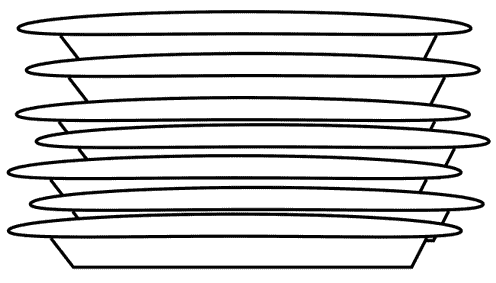

图 5.1：栈的示例

上一图展示了盘子堆栈。向盘子堆中添加盘子只能通过将盘子放在堆顶来实现。从盘子堆中移除盘子意味着移除堆顶的盘子。

栈是一种数据结构，它以类似于数组和链表的方式存储数据，具有一些约束条件：

+   栈中的数据元素只能通过`push`操作在末尾插入

+   栈中的数据元素只能从末尾删除（`pop`操作）

+   栈中只能读取最后一个数据元素（`peek`操作）

栈数据结构允许我们从一端存储和读取数据，最后添加的元素是第一个被取出的。因此，栈是一种**后进先出**（**LIFO**）结构，或**后进后出**（**LILO**）。

在栈上执行的两个主要操作是`push`和`pop`。当一个元素被添加到栈顶时，称为`push`操作，而当要从栈顶取出（即移除）一个元素时，称为`pop`操作。另一个操作是`peek`，在`peek`操作中，可以查看栈顶元素而不从栈中移除它。栈上的所有操作都是通过一个指针来执行的，这个指针通常被称为`top`。所有这些操作都在*图 5.2*中展示：


图 5.2：栈中的推入和弹出操作的演示

以下表格展示了在栈中使用两个重要的栈操作（`push`和`pop`）的用法：

| **栈操作** | **大小** | **内容** | **操作结果** |
| --- | --- | --- | --- |
| `stack()` | 0 | `[]` | 创建了一个栈对象，它是空的。 |
| `push "egg"` | 1 | `['egg']` | 向栈中添加了一个项目 `egg`。 |
| `push "ham"` | 2 | `['egg', 'ham']` | 再添加一个项目，`ham`，到栈中。 |
| `peek()` | 2 | `['egg', 'ham']` | 返回了栈顶元素 `ham`。 |
| `pop()` | 1 | `['egg']` | 弹出并返回了 `ham` 项目。（这个项目是最后添加的，所以它首先被移除。） |
| `pop()` | 0 | `[]` | 弹出并返回了 `egg` 项目。（这是第一个添加的项目，所以它最后被返回。） |

表 5.1：不同栈操作的示例说明

栈被用于许多事情。栈的一个常见用途是在函数调用期间跟踪返回地址。让我们想象我们有一个以下程序：

```py
def b(): 
    print('b') 
def a(): 
    b() 
a() 
print("done") 
```

当程序执行到达对 `a()` 的调用时，将按照顺序执行一系列事件以完成此程序的执行。所有这些步骤的可视化显示在 *图 5.3* 中：

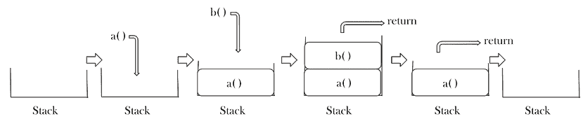

图 5.3：在示例程序中函数调用期间事件序列的步骤

事件序列如下：

1.  首先，当前指令的地址被推入栈中，然后执行跳转到 `a` 的定义。

1.  在函数 `a()` 内部，调用了函数 `b()`

1.  函数 `b()` 的返回地址被推入栈中。一旦 `b()` 中的指令和函数执行完成，返回地址从栈中弹出，这使我们回到函数 `a()`

1.  当函数 `a()` 中的所有指令完成时，返回地址再次从栈中弹出，这使我们回到主程序和 `print` 语句

上述程序输出如下：

```py
b
done 
```

我们现在已经讨论了栈数据结构的概念。现在，让我们了解其在 Python 中使用数组和链表数据结构实现的细节。

## 使用数组实现的栈

栈以顺序方式存储数据，就像数组和链表一样，有一个特定的约束，即数据只能按照**后进先出**（**LIFO**）的原则从栈的一端存储和读取。通常，栈可以使用数组和链表实现。基于数组的实现将具有固定长度的栈，而基于链表的实现可以具有可变长度的栈。

在基于数组的栈实现（其中栈具有固定大小）的情况下，检查栈是否已满是很重要的，因为尝试将元素推入一个满栈将生成一个错误，称为溢出。同样，尝试对一个空栈应用 `pop` 操作会导致一个称为下溢的错误。

让我们通过一个例子来理解使用数组实现的栈的实现，我们希望将三个数据元素“egg”、“ham”和“spam”推入栈中。首先，为了使用`push`操作将新元素插入到栈中，我们检查溢出条件，即`top`指针指向数组的末尾索引。`top`指针是栈中顶元素的索引位置。如果顶元素等于溢出条件，则无法添加新元素。这是一个栈溢出条件。如果数组中有空间可以插入新元素，则将新数据推入栈中。使用数组在栈上执行`push`操作的概述如图 5.4 所示：

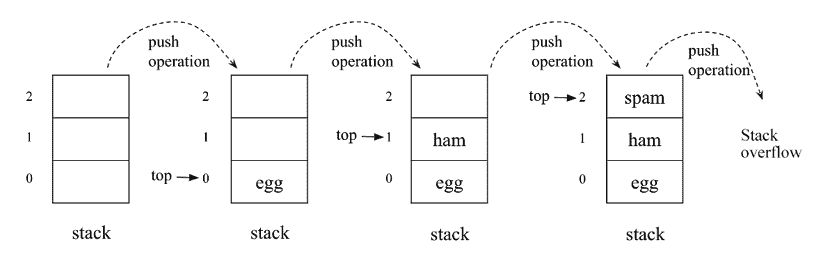

图 5.4：使用数组实现的栈的`push`操作序列

`push`操作的 Python 代码如下：

```py
size = 3
data = [0]*(size)   #Initialize the stack
top = -1
def push(x):
     global top
     if top >= size - 1:
           print("Stack Overflow")
     else:
           top = top + 1
           data[top] = x 
```

在上述代码中，我们使用固定大小（例如，在这个例子中为 3）初始化栈，并将`top`指针设置为-1，这表示栈为空。进一步地，在`push`方法中，将`top`指针与栈的大小进行比较以检查溢出条件，如果栈已满，则打印栈溢出信息。如果栈未满，则将`top`指针加 1，并将新的数据元素添加到栈顶。以下代码用于将数据元素插入到栈中：

```py
push('egg')
push('ham')
push('spam')
print(data[0 : top + 1] ) 
push('new')
push('new2') 
```

在上述代码中，当我们尝试插入前三个元素时，由于有足够的空间，它们被添加到栈中，但当我们尝试添加数据元素`new`和`new2`时，栈已经满了，因此这两个元素不能添加到栈中。此代码的输出如下：

```py
['egg', 'ham', 'spam'] 
Stack Overflow 
Stack Overflow 
```

接下来，`pop`操作返回栈顶元素的值并将其从栈中移除。首先，我们检查栈是否为空。如果栈已经为空，则打印栈下溢信息。否则，从栈中移除栈顶。`pop`操作的概述如图 5.5 所示：

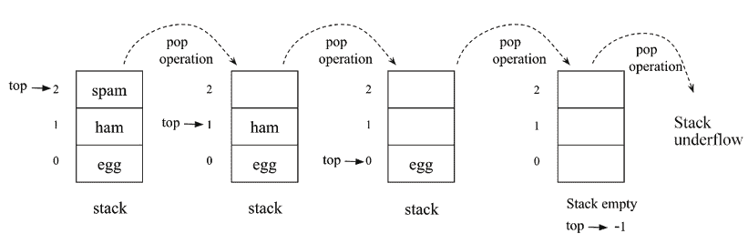

图 5.5：使用数组实现的栈的`pop`操作序列

`pop`操作的 Python 代码如下：

```py
def pop():
    global top
    if top == -1:
        print("Stack Underflow")
    else:
        top = top – 1
        data[top] = 0
        return data[top+1] 
```

在上述代码中，我们首先通过检查栈是否为空来检查下溢条件。如果`top`指针的值为-1，则意味着栈为空。否则，通过将`top`指针减 1 来移除栈中的数据元素，并将栈顶数据元素返回到主函数。

假设我们已将三个数据元素添加到栈中，然后我们调用`pop`函数四次。由于栈中只有三个元素，所以最初的前三个数据元素被移除，当我们尝试第四次调用`pop`操作时，会打印出栈下溢信息。这如下面的代码片段所示：

```py
print(data[0 : top + 1])
pop()
pop()
pop()
pop()
print(data[0 : top + 1]) 
```

上述代码的输出如下：

```py
['egg', 'ham', 'spam']
Stack Underflow 
[] 
```

接下来，让我们看看 `peek` 操作的实现，其中我们返回栈顶元素的价值。这个操作的 Python 代码如下：

```py
def peek():
   global top
   if top == -1:
       print("Stack is empty")
   else:
       print(data[top]) 
```

在上述代码中，首先，我们检查栈中 `top` 指针的位置。如果 `top` 指针的值为 -1，则表示栈为空，否则，我们打印栈顶元素的价值。

我们已经讨论了使用数组实现的 Python 栈，所以接下来让我们讨论使用链表实现的栈。

## 使用链表的栈实现

为了使用链表实现栈，我们将编写一个 `Stack` 类，其中将声明所有方法；然而，我们还将使用与上一章中讨论的类似的 `node` 类：

```py
class Node: 
    def __init__(self, data=None): 
        self.data = data 
        self.next = None 
```

如我们所知，链表中的一个 `node` 包含数据和指向链表中下一个元素的引用。使用链表实现栈数据结构可以被视为一个具有一些约束的标准链表，包括元素可以通过 `top` 指针从列表的末尾添加或删除（`push` 和 `pop` 操作）。这如图 *5.6* 所示：

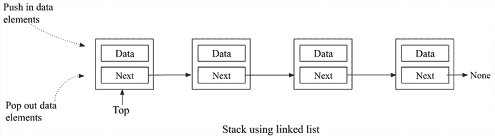

图 5.6：使用链表表示栈

现在我们来看看 `stack` 类。它的实现与单链表非常相似。此外，为了实现栈，我们还需要两样东西：

1.  我们首先需要知道栈顶是哪个节点，这样我们就可以通过这个节点应用 `push` 和 `pop` 操作

1.  我们还希望跟踪栈中节点的数量，因此我们在 `Stack` 类中添加了一个 `size` 变量

```py
Stack class:
```

```py
class Stack: 
    def __init__(self): 
        self.top = None 
        self.size = 0 
```

在上述代码中，我们已声明 `top` 和 `size` 变量，它们被初始化为 `None` 和 `0`。一旦初始化了 `Stack` 类，接下来，我们将在 `Stack` 类中实现不同的操作。首先，让我们从对 `push` 操作的讨论开始。

## `push` 操作

`push` 操作是栈上的一个重要操作；它用于在栈顶添加一个元素。为了将新节点添加到栈中，首先，我们需要检查栈中是否已经有了一些项目或者它是空的。在这里，我们不需要检查溢出条件，因为我们不需要固定栈的长度，这与使用数组实现的栈不同。

如果栈已经有一些元素，那么我们必须做两件事：

1.  新节点必须将其下一个指针指向之前位于顶部的节点

1.  我们通过将 `self.top` 指向新添加的节点，将这个新节点放在栈顶

请参见以下 *图 5.7* 中的两个指令：

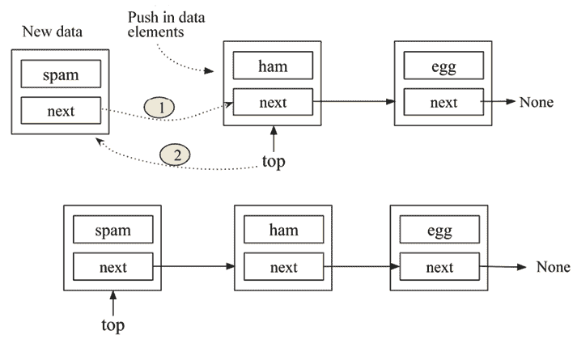

图 5.7：栈的 `push` 操作工作原理

如果现有的栈为空，并且要添加的新节点是第一个元素，我们需要将此节点作为元素的顶部节点。因此，`self.top` 将指向这个新节点。请参见以下 *图 5.8*：

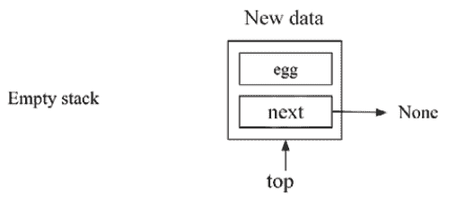

图 5.8：将数据元素“鸡蛋”插入到空栈中

以下是在`Stack`类中定义的`push`操作的完整实现：

```py
 def push(self, data):
        # create a new node
       node = Node(data)
       if self.top:
           node.next = self.top
           self.top = node
       else: 
           self.top = node
       self.size += 1 
```

在上述代码中，我们创建了一个新的节点并将数据存储在其中。然后我们检查`top`指针的位置。如果它不是`null`，这意味着栈不为空，我们添加新的节点，并更新两个指针，如图*5.7*所示。在`else`部分，我们将`top`指针指向新的节点。最后，我们通过增加`self.size`变量的值来增加栈的大小。

要创建包含三个数据元素的栈，我们使用以下代码：

```py
words = Stack()
words.push('egg')
words.push('ham')
words.push('spam')
#print the stack elements.
current = words.top
while current:
      print(current.data)
      current = current.next 
```

上述代码的输出如下：

```py
spam
ham
egg 
```

在上述代码中，我们创建了一个包含三个元素（鸡蛋、火腿和香肠）的栈。接下来，我们将讨论栈数据结构中的`pop`操作。

## Pop 操作

应用到栈上的另一个重要操作是`pop`操作。在这个操作中，读取栈顶元素，然后从栈中移除。`pop`方法返回栈顶元素，如果栈为空则返回`None`。

要在栈上实现`pop`操作，我们执行以下操作：

1.  首先，检查栈是否为空。不允许在空栈上执行`pop`操作。

1.  如果栈不为空，检查栈顶节点是否有其`next`属性指向其他节点。如果是这样，这意味着栈包含元素，栈顶节点指向栈中的下一个节点。要应用`pop`操作，我们必须更改栈顶指针。下一个节点应该位于栈顶。我们通过将`self.top`指向`self.top.next`来实现这一点。请参见以下*图 5.9*以了解这一点：

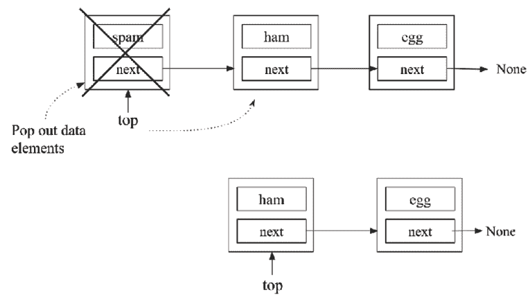

图 5.9：栈上 pop 操作的原理

1.  当栈中只有一个节点时，`pop`操作后栈将为空。我们必须将栈顶指针更改为`None`。请参见以下*图 5.10*：

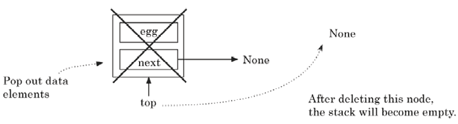

图 5.10：栈中只有一个元素时的 pop 操作

1.  移除此节点会导致`self.top`指向`None`，如图*5.10*所示。

1.  如果栈不为空，我们也会将栈的大小减`1`。

这里是 Python 中栈的`pop`操作的代码，应该在`Stack`类中定义：

```py
 def pop(self): 
        if self.top: 
            data = self.top.data 
            self.size -= 1  
            if self.top.next:  #check if there is more than one node.
                self.top = self.top.next 
            else: 
                self.top = None 
            return data 
        else: 
            print("Stack is empty") 
```

在上述代码中，首先，我们检查`top`指针的位置。如果它不是`null`，这意味着栈不为空，我们可以应用`pop`操作，如果栈中有多个数据元素，我们将`top`指针移动到指向下一个节点（参见*图 5.9*），如果是最后一个节点，我们将`top`指针指向`None`（参见*图 5.10*）。我们还通过减少`self.size`变量的值来减少栈的大小。

假设我们在栈中有三个数据元素。我们可以使用以下代码对栈应用`pop`操作：

```py
words.pop()
current = words.top
while current:
     print(current.data)
     current = current.next 
```

上述代码的输出如下：

```py
ham
egg 
```

在上面的代码中，我们从包含三个元素的栈中弹出了栈顶元素`egg`、`ham`、`spam`。

接下来，我们将讨论在栈数据结构上使用的`peek`操作。

## 查看操作

可以应用于栈的另一个重要操作是`peek`方法。此方法从栈中返回栈顶元素，但不将其从栈中删除。`peek`和`pop`之间的唯一区别是`peek`方法仅返回最顶层的元素；然而，在`pop`方法的情况下，返回最顶层的元素，并且该元素也被从栈中删除。

`peek`操作允许我们查看栈顶元素而不改变栈。这个操作非常简单。如果有顶部元素，返回其数据；否则，返回`None`（因此，`peek`的行为与`pop`匹配）。`peek`方法的实现如下（这应该在`Stack`类中定义）：

```py
 def peek(self): 
        if self.top: 
             return self.top.data 
        else: 
            print("Stack is empty") 
```

在上述代码中，我们首先使用`self.top`检查`top`指针的位置。如果不是 null，这意味着栈不为空，我们返回最顶层节点的数据值，否则，我们打印出栈为空的消息。我们可以使用`peek`方法通过以下代码获取栈的顶部元素：

```py
words.peek() 
```

上述代码的输出如下：

```py
spam 
```

根据我们最初添加到栈中的三个数据元素的示例，如果我们使用`peek`方法，我们将得到栈顶元素`spam`作为输出。

栈是一个重要的数据结构，具有多个实际应用。为了更好地理解栈的概念，我们将讨论这些应用之一：使用栈进行括号匹配。

## 栈的应用

如我们所知，数组和链表数据结构可以执行栈或队列数据结构（我们将在稍后讨论）所能做的任何事情。

尽管如此，这些数据结构因其许多应用而变得重要。例如，在任何应用程序中，可能需要以特定顺序添加或删除任何元素。栈和队列可用于此，以避免程序中可能出现的任何潜在错误，例如从列表中间访问/删除元素（这可能在数组和链表的情况下发生）。

现在我们来看一个括号匹配应用的示例，看看我们如何使用我们的栈来实现它。

让我们编写一个函数`check_brackets`，该函数将验证包含括号的表达式——`( )`、`[ ]`或`{ }`——是否平衡，即关闭括号的数量是否与打开括号的数量匹配。由于栈遵循**LILO**规则，这使得它们在解决这个问题时是一个很好的选择，因此栈可以用于以相反的顺序遍历项目列表。

以下代码是为在`Stack`类外部定义的`check_brackets`方法。此方法将使用我们在上一节中讨论的`Stack`类。该方法接受由字母字符和括号组成的表达式作为输入，并输出`True`或`False`，分别表示给定的表达式是否有效。`check_brackets`方法的代码如下：

```py
def check_brackets(expression):  
    brackets_stack = Stack()     #The stack class, we defined in previous section. 
    last = ' ' 
    for ch in expression:  
        if ch in ('{', '[', '('):  
            brackets_stack.push(ch)  
        if ch in ('}', ']', ')'): 
            last = brackets_stack.pop()  
            if last == '{' and ch == '}': 
                continue  
            elif last == '[' and ch == ']': 
                continue  
            elif last == '(' and ch == ')':  
                continue  
            else:  
                return False  
    if brackets_stack.size > 0: 
        return False  
    else:
        return True 
```

上述函数解析传递给它的表达式中的每个字符。如果它遇到一个开放括号，它将其推入栈中。如果它遇到一个闭合括号，它从栈中弹出顶部元素，并将两个括号进行比较以确保它们的类型匹配——`(`应该匹配`)`，`[`应该匹配`]`，`{`应该匹配`}`。如果它们不匹配，我们返回`False`；否则，我们继续解析。

一旦我们到达表达式的末尾，我们需要进行最后一次检查。如果栈为空，那么就没有问题，我们可以返回`True`。但如果栈不为空，那么我们就有一个没有匹配的闭合括号的开放括号，我们将返回`False`。

我们可以用以下代码测试括号匹配器：

```py
sl = ( 
   "{(foo)(bar)}hellois)a)test", 
   "{(foo)(bar)}hellois)atest", 
   "{(foo)(bar)}hellois)a)test))" 
) 
for s in sl: 
   m = check_brackets(s) 
   print("{}: {}".format(s, m)) 
```

只有三个语句中的第一个应该匹配。当我们运行代码时，我们得到以下输出：

```py
{(foo)(bar)}hellois)a)test: True
{(foo)(bar)}hellois)atest: False 
{(foo)(bar)}hellois)a)test)): False 
```

在上述三个示例表达式中，我们可以看到第一个表达式是有效的，而其他两个不是有效的表达式。因此，前面代码的输出是`True`、`False`和`False`。

总结来说，栈数据结构的`push`、`pop`和`peek`操作的时间复杂度为`O(1)`，因为添加和删除操作可以通过`top`指针直接在常数时间内执行。栈数据结构很简单；然而，它在现实世界的应用中用于实现许多功能。例如，网络浏览器的后退和前进按钮就是使用栈实现的。栈也被用于在文字处理器中实现撤销和重做功能。

我们已经讨论了栈数据结构及其使用数组和链表实现的实现。在下一节中，我们将讨论队列数据结构以及可以应用于队列的不同操作。

# 队列

另一个重要的数据结构是队列，它以类似于栈和链表的方式存储数据，但有一些约束和特定的顺序。队列数据结构与你在现实生活中习惯的常规队列非常相似。它就像在商店里按顺序排队等待被服务的人群。队列是一个基本且重要的概念，需要掌握，因为许多其他数据结构都是基于它构建的。

队列的工作原理如下。第一个加入队列的人通常会先被服务，所有人都会按照他们加入队列的顺序被服务。缩写**FIFO**最好地解释了队列的概念。**FIFO**代表**先进先出**。当人们排队等待服务时，服务只在队列的前端进行。因此，人们从队列的前端出队，从后端入队等待他们的轮次。人们退出队列的唯一时间是当他们被服务，这只会发生在队列的最前端。参考以下图表，其中人们正在排队，排在前面的人将首先被服务：

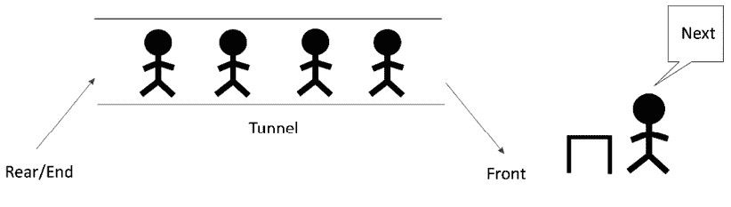

图 5.11：队列的示意图

要加入队列，参与者必须站在队列中最后一个人的后面。这是队列接受新成员的唯一合法或允许的方式。队列的长度无关紧要。

队列是一个具有以下约束的元素序列：

1.  数据元素只能从队列的一端插入，即队列的尾部/尾端。

1.  数据元素只能从队列的另一端，即前端删除。

1.  只能读取队列前端的数据元素。

向队列中添加元素的操作称为`enqueue`。从队列中删除元素使用`dequeue`操作。每当一个元素被入队时，队列的长度或大小增加 1，出队一个项目将减少队列中的元素数量 1。

我们可以在*图 5.12*中看到这个概念，其中我们可以向尾部/尾端添加新元素，而元素只能从队列的头部/前端删除：

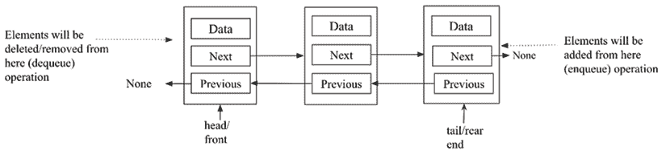

图 5.12：使用栈数据结构实现的队列

读者请注意不要混淆符号：`enqueue`操作将在**尾部/尾端**执行，而`dequeue`操作将从**头部/前端**执行。应确保一个端点用于`enqueue`操作，另一个端点用于`dequeue`操作；然而，每个操作都可以使用任一端点。通常，固定从**尾部**执行`enqueue`操作，从**前端**执行`dequeue`操作是好的。为了演示这两个操作，以下表格显示了向队列中添加和删除元素的效果：

| **队列操作** | **Size** | **Contents** | **操作结果** |
| --- | --- | --- | --- |
| `queue()` | 0 | `[]` | 创建了一个队列对象，它是空的。 |
| `enqueue- "packt"` | 1 | `['packt']` | 向队列中添加了一个元素，`packt`。 |
| `enqueue "publishing"` | 2 | `[ 'packt', 'publishing']` | 向队列中又添加了一个元素，`publishing`。 |
| `Size()` | 2 | `[ 'packt', 'publishing']` | 返回队列中的项目数量，在这个例子中是 2。 |
| `dequeue()` | 1 | `['publishing']` | `packt`项目被出队并返回。（这个项目最先被添加，所以最先被移除。） |
| `dequeue()` | 0 | `[]` | `publishing`项目被出队并返回。（这是最后添加的项目，所以最后被返回。） |

表 5.2：示例队列上不同操作的说明

Python 中的队列数据结构有一个内置实现，即`queue.Queue`，也可以使用`collections`模块中的`deque`类来实现。队列数据结构可以使用 Python 中的各种方法来实现，即：(1) Python 的内置列表，(2) 栈，和(3) 基于节点的链表。我们将逐一详细讨论它们。

## Python 的基于列表的队列

首先，为了实现基于 Python 的`list`数据结构的队列，我们创建一个`ListQueue`类，在其中声明和定义队列的不同功能。在这个方法中，我们使用 Python 的`list`数据结构存储实际数据。`ListQueue`类的定义如下：

```py
class ListQueue: 
    def __init__(self): 
        self.items = [] 
        self.front = self.rear = 0
        self.size = 3     # maximum capacity of the queue 
```

在`__init__`初始化方法中，`items`实例变量被设置为`[]`，这意味着当创建队列时它是空的。队列的大小也被设置为`4`（作为此代码中的示例），这是队列中可以存储元素的最大容量。此外，rear 和 front 索引的初始位置也被设置为`0`。"enqueue"和"dequeue"是队列中的重要方法，我们将在下面讨论。

### 入队操作

`enqueue`操作在队列的末尾添加一个项目。考虑将元素添加到队列的例子来理解*图 5.13*中展示的概念。我们从一个空列表开始。最初，我们在索引`0`处添加一个项目`3`。

接下来，我们在索引`1`处添加一个项目`11`，每次添加一个元素时都移动 rear 指针：

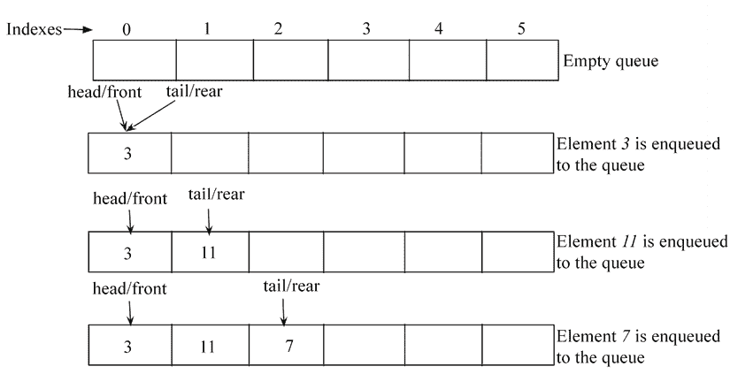

图 5.13：队列上入队操作的示例

为了实现入队操作，我们使用`List`类的`append`方法将项目（或数据）追加到队列的末尾。以下代码展示了`enqueue`方法的实现。这应该在`ListQueue`类中定义：

```py
 def enqueue(self, data):  
        if self.size == self.rear:
            print("\n Queue is full")
        else:   
            self.items.append(data)  
            self.rear += 1 
```

在这里，我们首先通过比较队列的最大容量与`rear`索引的位置来检查队列是否已满。进一步地，如果有空间在队列中，我们使用`List`类的`append`方法将数据添加到队列的末尾，并将 rear 指针增加`1`。

要使用`ListQueue`类创建队列，我们使用以下代码：

```py
q= ListQueue()
q.enqueue(20)
q.enqueue(30)
q.enqueue(40)
q.enqueue(50)
print(q.items) 
```

上述代码的输出如下：

```py
Queue is full
[20, 30, 40] 
```

在上面的代码中，我们可以添加最多三个数据元素，因为我们已经将队列的最大容量设置为`3`。添加三个元素后，当我们尝试添加另一个新元素时，我们会收到队列已满的消息。

### 出队操作

`dequeue`操作用于从队列中读取和删除项。此方法返回队列的前项并将其删除。考虑从队列中出队元素的示例，如*图 5.14*所示。在这里，我们有一个包含元素`{3, 11, 7, 1, 4, 2}`的队列。为了从这个队列中出队任何元素，首先插入的元素将被移除，因此元素`3`被移除。当我们从队列中出队任何元素时，我们也会将`rear`指针减`1`：

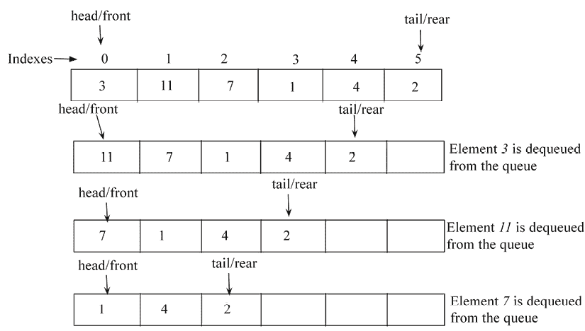

图 5.14\. 队列上出队操作的示例

以下是在`ListQueue`类中定义的`dequeue`方法的实现：

```py
 def dequeue(self):
        if self.front == self.rear:
            print("Queue is empty")
        else:
            data = self.items.pop(0)    # delete the item from front end of the queue        
            self.rear -= 1
            return data 
```

在上述代码中，我们首先通过比较前指针和后指针来检查队列是否已经为空。如果后指针和前指针相同，则意味着队列是空的。如果队列中有一些元素，我们使用`pop`方法来出队一个元素。Python 的`List`类有一个名为`pop()`的方法。`pop`方法执行以下操作：

1.  从列表中删除最后一个元素

1.  将删除的项从列表返回给调用它的用户或代码

前变量指向的第一个位置的元素被弹出并保存在`data`变量中。我们还将`rear`变量减`1`，因为队列中已经删除了一个数据项。最后，在方法的最后一行，返回数据。

要从现有的队列（例如`{20, 30, 40}`）中出队任何元素，我们使用以下代码：

```py
data = q.dequeue()
print(data)
print(q.items) 
```

上述代码的输出如下：

```py
20
[30, 40] 
```

在上述代码中，当我们从队列中出队一个元素时，我们得到元素 20，这是第一个添加的。

这种队列实现方法的局限性在于队列的长度是固定的，这可能不适合高效实现队列。现在，让我们讨论基于链表的队列实现。

## 基于链表的队列

队列数据结构也可以使用任何链表实现，例如单链表或双向链表。我们已经在之前的*第四章*，*链表*中讨论了单链表或双向链表的实现。我们使用遵循队列数据结构**FIFO**属性的链表来实现队列。

让我们讨论使用双向链表实现队列的实现。为此，我们首先从实现`node`类开始，这个`node`类与我们之前在*第四章*，*链表*中讨论双向链表时定义的`node`类相同。此外，`Queue`类与双向链表类非常相似。在这里，我们有`head`和`tail`指针，其中`tail`指向队列的末尾（即后端），它将被用于添加新元素，而`head`指针指向队列的起始位置（即前端），它将被用于从队列中出队元素。`Queue`类的实现如下所示：

```py
class Node(object):
    def __init__(self, data=None, next=None, prev=None):
        self.data = data
        self.next = next
        self.prev = prev
class Queue: 
    def __init__(self): 
        self.head = None 
        self.tail = None 
        self.count = 0 
```

在创建`Queue`类的一个实例时，`self.head`和`self.tail`指针被设置为`None`。为了保持队列中节点数量的计数，这里还维护了一个`count`实例变量，并初始设置为`0`。

### `enqueue`操作

元素通过`enqueue`方法添加到`Queue`对象中。数据元素通过节点添加。`enqueue`方法的代码与我们讨论过的双向链表的`append`操作非常相似，该操作在*第四章*，*链表*中讨论过。

`enqueue`操作从传递给它的数据创建一个节点并将其添加到队列的`tail`。

首先，我们检查要入队的新节点是否是第一个节点，以及队列是否为空。如果队列为空，新节点将成为队列的第一个节点，如图*图 5.15*所示：

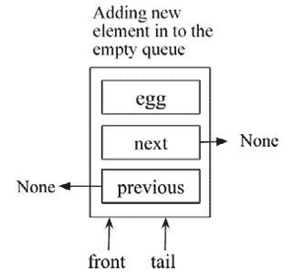

图 5.15：在空队列中入队新节点的示意图

如果队列不为空，新节点将被添加到队列的末尾。为了做到这一点并将一个元素入队到一个现有的队列中，我们需要通过更新三个链接来完成：1) 新节点的上一个指针应指向队列的尾部，2) 尾节点的下一个指针应指向新节点，3) 尾指针应更新为新节点。所有这些链接在*图 5.16*中展示：

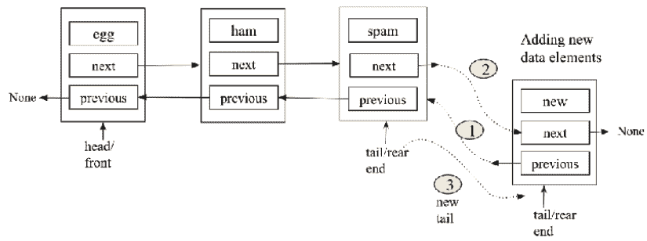

图 5.16：队列中`enqueue`操作要更新的链接示意图

`enqueue`操作在`Queue`类中实现，如下面的代码所示：

```py
 def enqueue(self, data): 
        new_node = Node(data, None, None) 
        if self.head == None: 
            self.head = new_node 
            self.tail = self.head 
        else: 
            new_node.prev = self.tail 
            self.tail.next = new_node 
            self.tail = new_node 
        self.count += 1 
```

在上面的代码中，我们首先检查队列是否为空。如果`head`指向`None`，这意味着队列为空。如果队列为空，新节点将成为队列的第一个节点，我们将`self.head`和`self.tail`都指向新创建的节点。如果队列不为空，我们通过更新*图 5.16*中显示的三个链接将新节点添加到队列的末尾。最后，通过`self.count += 1`行增加队列中元素的总数。

队列上`enqueue`操作的 worst-case 时间复杂度是`O(1)`，因为任何项目都可以通过`tail`指针在常数时间内直接添加。

### `dequeue`操作

使双向链表表现得像队列的另一个操作是`dequeue`方法。此方法移除队列前端的节点，如图*图 5.17*所示。在这里，我们首先检查要出队的元素是否是队列的最后一个节点，如果是，那么在`dequeue`操作后队列将被清空。如果不是这种情况，我们通过更新前/头指针到下一个节点和新头节点的上一个指针为`None`来出队第一个元素，如图*图 5.17*所示：

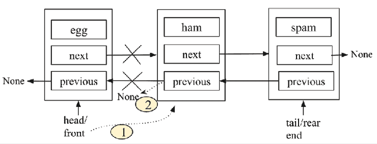

图 5.17：队列上的`dequeue`操作示意图

队列上`dequeue`操作的实现与从给定的双向链表中删除第一个元素非常相似，如下面的`dequeue`操作代码所示：

```py
 def dequeue(self): 
        if self.count == 1: 
            self.count -= 1 
            self.head = None 
            self.tail = None 
        elif self.count > 1: 
            self.head = self.head.next 
            self.head.prev = None 
        elif self.count <1:
            print("Queue is empty")
        self.count -= 1 
```

为了从队列中删除任何元素，我们首先使用`self.count`变量检查队列中的项目数量。如果`self.count`变量等于`1`，这意味着要删除的元素是最后一个元素，然后我们更新头和尾指针为`None`。

如果队列中有许多节点，则将头指针移动到`self.head`之后的下一个节点，通过更新*图 5.17*中显示的两个链接来实现。我们还检查队列中是否还有剩余的项目，如果没有，则打印出队列为空的消息。最后，将`self.count`变量减`1`。

队列中出队操作的最坏情况时间复杂度为`O(1)`，因为任何项目都可以通过`head`指针在常数时间内直接移除。

## 基于栈的队列

队列是一种线性数据结构，其中入队操作在一端执行，删除（出队）操作在另一端执行，遵循**FIFO**原则。使用栈实现队列有两种方法：

+   当出队操作成本较高时

+   当入队操作成本较高时

### 方法 1：当出队操作成本较高时

我们使用两个栈来实现队列。在这个方法中，入队操作很简单。可以使用对第一个栈（换句话说，栈 1）的推操作将新元素入队，该栈用于队列的实现。

入队操作在*图 5.18*中展示，显示了将元素`{23, 13, 11}`入队到队列的示例：

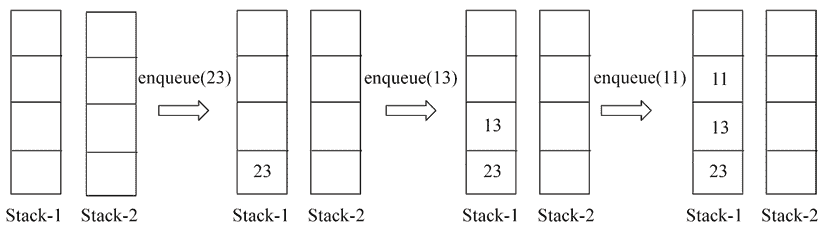

图 5.18：使用方法 1 在队列中执行入队操作的示意图

此外，出队操作可以通过以下步骤使用两个栈（栈 1 和栈 2）来实现：

1.  首先，从栈 1 中移除元素（弹出），然后逐个将所有元素添加（推入）到栈 2。

1.  最顶部的数据元素将从栈 2 弹出，并作为所需元素返回。

1.  最后，将剩余的元素逐个从栈 2 弹出，然后再次推入栈 1。

让我们通过一个例子来帮助理解这个概念。假设我们在队列中存储了三个元素`{23, 13, 11}`，现在我们想要从这个队列中删除一个元素。完整的流程如上三个步骤所示在*图 5.19*中。正如你可能注意到的，这个实现遵循队列的**FIFO**属性，因此返回了 23，因为它是最先添加的：

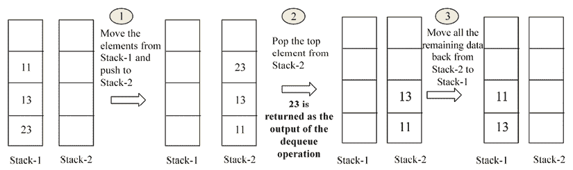

图 5.19：使用方法 1 在队列中执行出队操作的示意图

入队操作的最坏情况时间复杂度为 `O(1)`，因为任何元素都可以直接添加到第一个栈中，而出队操作的时间复杂度为 `O(n)`，因为所有元素都需要从 Stack-1 转移到 Stack-2。

### 方法 2：当入队操作成本较高时

在这种方法中，入队操作与之前讨论的出队操作非常相似，而出队操作同样与之前的入队操作相似。

为了实现入队操作，我们遵循以下步骤：

1.  将所有元素从 Stack-1 移动到 Stack-2。

1.  将要入队的元素推入 Stack-2。

逐个将所有元素从 Stack-2 移动到 Stack-1。从 Stack-2 弹出元素并将其推入 Stack-1。

让我们通过一个例子来理解这个概念。假设我们想依次将三个元素 `{23, 13, 11}` 入队到队列中。我们可以通过遵循上述三个步骤来实现，如图 *图 5.20*、*图 5.21* 和 *图 5.22* 所示：

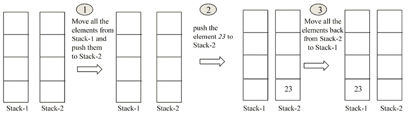

图 5.20：使用方法 2 将元素 23 入队到空队列中

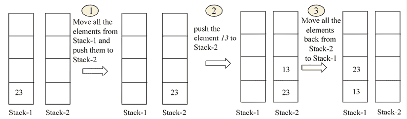

图 5.21：使用方法 2 将元素 13 入队到现有队列中

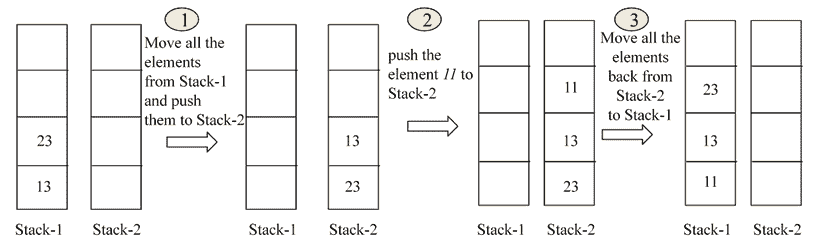

图 5.22：使用方法 2 将元素 11 入队到队列中

出队操作可以通过对 Stack-1 应用弹出操作直接实现。让我们通过一个例子来理解这一点。假设我们已入队了三个元素，并想执行出队操作，我们可以简单地从栈中弹出顶部元素，如图 *图 5.23* 所示：

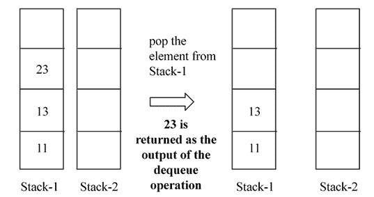

图 5.23：使用方法 2 在队列上执行出队操作的示意图

在第二种方法中，入队操作的时间复杂度为 `O(n)`，而出队操作的时间复杂度为 `O(1)`。

接下来，我们将讨论使用方法-1 实现队列的实现，其中出队操作成本较高。为了使用两个栈实现队列，我们最初设置两个栈实例变量以在初始化时创建一个空队列。在这种情况下，栈只是允许我们调用其上的 `push` 和 `pop` 方法的 Python 列表，这使我们能够获得 `enqueue` 和 `dequeue` 操作的功能。以下是 `Queue` 类：

```py
class Queue: 
    def __init__(self): 
        self.Stack1 = [] 
        self.Stack2 = [] 
```

`Stack1`仅用于存储添加到队列中的元素。在此栈上不能执行其他操作。

### 入队操作

`enqueue` 方法用于向队列中添加项目。此方法仅接收要追加到队列中的 `data`。然后，该数据被传递到 `Queue` 类中 `Stack1` 的 `append` 方法。此外，`append` 方法用于模拟 `push` 操作，该操作将元素推到栈顶。以下是在 Python 中使用栈实现 `enqueue` 的代码，应在 `Queue` 类中定义：

```py
def enqueue(self, data): 
    self.Stack1.append(data) 
```

要将数据入队到 `Stack1`，以下代码可以完成这项工作：

```py
queue = Queue() 
queue.enqueue(23) 
queue.enqueue(13) 
queue.enqueue(11) 
print(queue.Stack1) 
```

`Stack1` 在队列上的输出如下：

```py
[23, 13, 11] 
```

接下来，我们将检查 `dequeue` 操作的实现。

### dequeue 操作

`dequeue` 操作用于根据 **FIFO** 原则，以添加项的相同顺序从队列中删除元素。新元素添加到 `Stack1` 的队列中。此外，我们使用另一个栈，即 `Stack2`，来从队列中删除元素。删除（dequeue）操作仅通过 `Stack2` 执行。为了更好地理解如何使用 `Stack2` 从队列中删除项，让我们考虑以下示例。

初始时，假设 `Stack2` 已填充了元素 **5**、**6** 和 **7**，如图 *图 5.24* 所示：

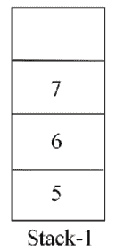

图 5.24\. 队列中 Stack1 的示例

接下来，我们检查 `Stack2` 是否为空。由于开始时它是空的，我们使用 `Stack1` 上的 `pop` 操作将所有要删除的元素从 `Stack1` 移动到 `Stack2`，并对所有元素进行操作，然后将它们推送到 `Stack2`。现在，`Stack1` 为空，`Stack2` 包含所有元素。我们在 *图 5.25* 中展示这一点以获得更清晰的了解：

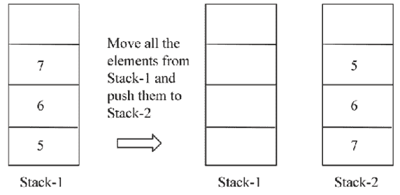

图 5.25\. Stack1 和 Stack2 在队列中的演示

现在，如果 `Stack` 不为空，为了从这个队列中弹出元素，我们应用 `pop` 操作到 `Stack2`，我们得到元素 `5`，这是正确的，因为它是最先添加的，应该是队列中第一个被弹出的元素。

这里是队列的 `dequeue` 方法的实现，该方法应在 `Queue` 类中定义：

```py
 def dequeue(self):   
        if not self.Stack2:  
            while self.Stack1:  
                self.Stack2.append(self.Stack1.pop())  
        if not self.Stack2:
            print("No element to dequeue")
            return
        return self.Stack2.pop() 
```

`if` 语句首先检查 `Stack2` 是否为空。如果不为空，我们继续使用 `pop` 方法从队列的前端移除元素，如下所示：

```py
return self.Stack2.pop() 
```

如果 `Stack2` 为空，则将 `Stack1` 的所有元素移动到 `Stack2`：

```py
while self.Stack1: 
    self.Stack2.append(self.Stack1.pop()) 
```

`while` 循环将一直执行，直到 `Stack1` 中有元素为止。

`self.Stack1.pop()` 语句将移除 `Stack1` 中最后添加的元素，并将其立即传递给 `self.Stack2.append()` 方法。

让我们考虑一些示例代码来理解队列上的操作。我们首先使用 `Queue` 实现向队列添加三个项，即 `5`、`6` 和 `7`。然后，我们应用 `dequeue` 操作来从队列中移除项，如下所示：

```py
queue = Queue()  
queue.enqueue(23)  
queue.enqueue(13)  
queue.enqueue(11)  
print(queue.Stack1) 

queue.dequeue()    
print(queue.Stack2) 
```

上述代码的输出如下：

```py
 [23, 13, 11] 
 [13, 11] 
dequeue method is called, after which a change in the number of elements is observed when the queue is printed out again.
```

使用方法 1 的栈在队列数据结构上执行 enqueue 和 dequeue 操作的时间复杂度分别为 `O(1)` 和 `O(n)`。这是因为 enqueue 操作很简单，因为可以直接添加新元素，而在 dequeue 操作中，需要访问并移动所有 n 个元素到另一个栈。

总体来说，基于链表的实现是最高效的，因为入队和出队操作都可以在`O(1)`时间内完成，且队列的大小没有限制。在基于栈的实现中，队列的一个操作成本较高，无论是入队还是出队。

## 队列的应用

队列可以用于在许多基于计算机的实际应用中实现各种功能。例如，而不是为网络中的每一台计算机提供其自己的打印机，可以通过排队每台计算机想要打印的内容，使计算机网络共享一台打印机。当打印机准备好打印时，它会从队列中选择一个项目（通常称为作业）进行打印。它会先打印发出命令的计算机的命令，然后按照不同计算机提交的顺序选择后续作业。

操作系统也会将进程排队以供 CPU 执行。让我们创建一个利用队列创建基本媒体播放器的应用程序。

大多数音乐播放器软件允许用户将歌曲添加到播放列表中。按下播放按钮后，主播放列表中的所有歌曲将依次播放。由于首先入队的歌曲是首先播放的歌曲，因此顺序播放歌曲可以通过队列实现，这与**FIFO**（先进先出）的缩写一致。我们将实现自己的播放列表队列以**FIFO**方式播放歌曲。

我们的媒体播放器队列只允许添加曲目以及播放队列中所有曲目的方式。在一个完整的音乐播放器中，会使用线程来改善队列的交互方式，同时音乐播放器继续用于选择下一首将要播放、暂停或甚至停止的歌曲。

`track`类将模拟一个音乐曲目：

```py
from random import randint 
class Track: 
    def __init__(self, title=None): 
        self.title = title 
        self.length = randint(5, 10) 
```

每个曲目都包含歌曲标题的引用以及歌曲的长度。歌曲的长度是介于`5`和`10`之间的随机数。Python 中的`random`模块提供了`randint`函数，使我们能够生成随机数。该类代表任何 MP3 曲目或包含音乐的文件。曲目的随机长度用于模拟播放曲目所需的时间（以秒为单位）。

要创建一些曲目并打印它们的长度，我们执行以下操作：

```py
track1 = Track("white whistle") 
track2 = Track("butter butter") 
print(track1.length) 
print(track2.length) 
```

上述代码的输出如下：

```py
6
7 
```

您的输出可能因为两个曲目生成的随机长度而不同。

现在，让我们通过继承来创建我们的队列。我们简单地从`Queue`类继承：

```py
import time 
class MediaPlayerQueue(Queue): 
```

要将曲目添加到队列中，在`MediaPlayerQueue`类中创建了一个`add_track`方法：

```py
 def add_track(self, track):
        self.enqueue(track) 
```

该方法将一个`track`对象传递给队列的`super`类的`enqueue`方法。这将实际上使用`track`对象（作为节点数据）创建一个`Node`，如果队列不为空，则指向尾部，如果队列为空，则同时指向头和尾部。

假设队列中的轨道按顺序播放，从第一个添加的轨道到最后一个（**FIFO**），那么`play`函数必须遍历队列中的元素：

```py
def play(self):
        while self.count > 0:
            current_track_node = self.dequeue()
            print("Now playing {}".format(current_track_node.data.title)) 
            time.sleep(current_track_node.data.length) 
```

`self.count`记录轨道被添加到我们的队列中和轨道被出队的时间。如果队列不为空，对`dequeue`方法的调用将返回队列前端的节点（其中包含`track`对象）。然后`print`语句通过节点的`data`属性访问轨道的标题。为了进一步模拟播放轨道，`time.sleep()`方法使程序执行暂停，直到轨道的秒数过去：

```py
time.sleep(current_track_node.data.length) 
```

媒体播放器队列由节点组成。当轨道被添加到队列中时，轨道被隐藏在一个新创建的节点中，并关联到节点的数据属性。这就是为什么我们通过调用`dequeue`返回的节点的数据属性来访问节点的`track`对象。

你可以看到，在这种情况下，我们的`node`对象不仅仅存储任何数据，而是存储轨道。

让我们试一试我们的音乐播放器：

```py
track1 = Track("white whistle") 
track2 = Track("butter butter") 
track3 = Track("Oh black star") 
track4 = Track("Watch that chicken") 
track5 = Track("Don't go") 
```

我们创建了五个带有随机单词作为标题的轨道对象，如下所示：

```py
print(track1.length) 
print(track2.length) 
```

输出如下：

```py
 8
 9 
```

由于随机长度，输出可能与你在机器上得到的不同。

接下来，使用以下代码片段创建`MediaPlayerQueue`类的实例：

```py
media_player = MediaPlayerQueue() 
```

轨道将被添加，`play`函数的输出应该按照我们入队的顺序打印出正在播放的轨道：

```py
media_player.add_track(track1) 
media_player.add_track(track2) 
media_player.add_track(track3) 
media_player.add_track(track4) 
media_player.add_track(track5) 
media_player.play() 
```

上述代码的输出如下：

```py
 Now playing white whistle
    Now playing butter butter
    Now playing Oh black star
    Now playing Watch that chicken
    Now playing Don't go 
```

程序执行后，可以看到轨道是按照它们入队的顺序播放的。在播放每个轨道时，系统也会暂停与轨道长度相等的秒数。

# 摘要

在本章中，我们讨论了两种重要的数据结构，即栈和队列。我们看到了这些数据结构如何紧密地模拟现实世界中的栈和队列。我们探讨了具体实现及其不同类型。后来，我们将栈和队列的概念应用于编写现实生活中的程序。

我们将在下一章考虑树。我们将讨论树的主要操作，以及此数据结构的各种应用领域。

# 练习

1.  以下哪个选项是使用链表实现的真正队列？

    1.  如果在入队操作中，新的数据元素被添加到列表的起始位置，那么出队操作必须从列表的末尾进行。

    1.  如果在入队操作中，新的数据元素被添加到列表的末尾，那么入队操作必须从列表的起始位置进行。

    1.  以上两者都是。

    1.  以上皆非。

1.  假设队列使用具有头指针和尾指针的单链表实现。入队操作在队列头部实现，出队操作在队列尾部实现。入队和出队操作的时间复杂度是多少？

1.  实现队列需要多少个栈？

1.  队列中的入队（enqueue）和出队（dequeue）操作使用数组实现时效率很高。这两个操作的时间复杂度是多少？

1.  我们如何以相反的顺序打印队列数据结构的数据元素？

# 加入我们的 Discord 社区

加入我们的社区 Discord 空间，与作者和其他读者进行讨论：[`packt.link/MEvK4`](https://packt.link/MEvK4)


