# 第七章：堆和优先队列

堆数据结构是一种基于树的数据库结构，其中树中的每个节点与其他节点具有特定的关系，并且它们以特定的顺序存储。根据树中节点的特定顺序，堆可以是不同类型的，例如最小堆和最大堆。

优先队列是一个重要的数据结构，它类似于队列和栈数据结构，存储数据及其相关的优先级。在这里，数据是按照优先级进行服务的。优先队列可以使用数组、链表和树来实现；然而，它们通常使用堆来实现，因为它非常高效。

在本章中，我们将学习以下内容：

+   堆数据结构的概念及其上的不同操作

+   理解优先队列的概念及其使用 Python 的实现

# 堆

堆数据结构是树的一种特殊化，其中节点以特定的方式进行排序。堆是一种数据结构，其中每个数据元素都满足堆属性，堆属性表明父节点和子节点之间必须存在某种关系。根据这种特定的关系，堆可以分为两种类型，换句话说，最大堆和最小堆。在最大堆中，每个父节点的值必须始终大于或等于其所有子节点。在这种类型的树中，根节点必须是树中的最大值。例如，参见 *图 7.1* 展示的最大堆，其中所有节点的值都大于其子节点：

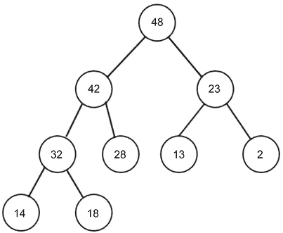

图 7.1：最大堆的示例

在最小堆中，父节点和子节点之间的关系是父节点的值必须始终小于或等于其子节点。这个规则应该适用于树中的所有节点。在最小堆中，根节点持有最低的值。例如，参见 *图 7.2* 展示的最小堆，其中所有节点的值都小于其子节点：

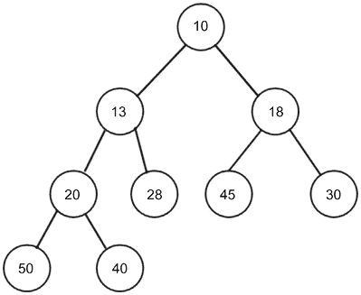

图 7.2：最小堆的示例

堆是一个重要的数据结构，因为它有多个应用，并且在实现堆排序算法和优先队列中得到了广泛的使用。我们将在本章的后面详细讨论这些内容。堆可以是任何类型的树；然而，最常见的一种堆是二叉堆，其中每个节点最多有两个子节点。

如果二叉堆是一个包含 `n` 个节点的完全二叉树，那么它的高度至少为 `log`[2]`n`。

完全二叉树是一种必须先填满每一行，然后才能开始填充下一行的树，如下面的 *图 7.3* 所示：

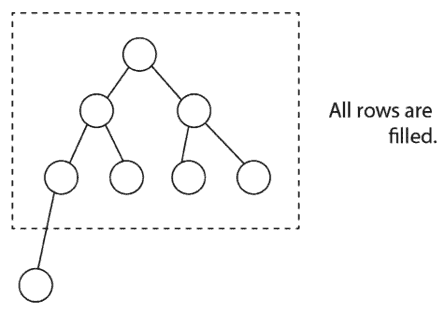

图 7.3：完全二叉树的示例

为了实现堆，我们可以推导出父节点和子节点在`index`值之间的关系。这种关系是，任何节点在`n`索引处的子节点可以很容易地检索到，换句话说，左子节点位于`2n`，右子节点位于`2n + 1`。例如，节点`C`位于索引`3`，因为节点`C`是位于索引`1`的节点`A`的右子节点，所以它变为`2n+1 = 2*1 + 1 = 3`。这种关系始终成立。假设我们有一个元素列表`{A, B, C, D, E}`，如*图 7.4*所示。如果我们把任何元素存储在索引`i`处，那么它的父节点可以存储在索引`i/2`处，例如，如果节点`D`的索引是`4`，那么它的父节点就在`4/2 = 2`，索引`2`。根节点的索引必须在数组中从`1`开始。参见*图 7.4*以了解概念：

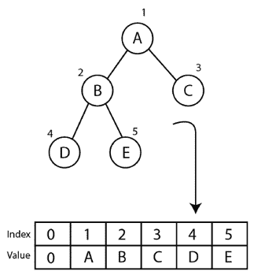

图 7.4：二叉树和所有节点的索引位置

父亲和子节点之间的关系是一个完全二叉树。在索引值方面，这对于在堆中有效地检索、搜索和存储数据元素非常重要。由于这个特性，实现堆变得非常容易。唯一的约束是我们应该从`1`开始索引，如果我们使用数组实现堆，那么我们必须在数组的索引`0`处添加一个虚拟元素。接下来，让我们了解堆的实现。重要的是要注意，我们将讨论所有概念都与`min`堆相关，而`max`堆的实现将与它非常相似，唯一的区别是`heap`属性。

让我们讨论使用 Python 实现最小堆的实现。我们首先从`heap`类开始，如下所示：

```py
 class MinHeap: 
        def __init__(self): 
            self.heap = [0] 
            self.size = 0 
```

我们用零初始化堆列表来表示虚拟的第一个元素，并且添加一个虚拟元素只是为了从`1`开始索引数据项，因为如果我们从`1`开始索引，由于父子关系，访问元素变得非常容易。我们还创建了一个变量来保存堆的大小。我们将进一步讨论不同的操作，例如在堆中插入、删除和删除特定位置的元素。让我们从堆中的插入操作开始。

## 插入操作

将一个元素插入到`min`堆中分为两个步骤。首先，我们将新元素添加到列表的末尾（我们理解为树的底部），并将堆的大小增加一。其次，在每次插入操作之后，我们需要将新元素在堆树中重新排列，以组织所有节点，使其满足`堆`属性，在这种情况下是每个节点必须大于其父节点。换句话说，父节点的值必须始终小于或等于其子节点，而`min-heap`中的最小元素需要是根元素。因此，我们首先将一个元素插入到树的最后一个堆中；然而，在将元素插入堆之后，可能会违反`堆`属性。在这种情况下，节点必须重新排列，以便所有节点都满足`堆`属性。这个过程称为堆化。为了堆化`min`堆，我们需要找到其子节点的最小值并将其与当前元素交换，并且这个过程必须重复进行，直到所有节点都满足`堆`属性。

让我们考虑一个在`min`堆中添加元素的例子，比如在*图 7.5*中插入一个值为`2`的新节点：

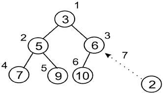

图 7.5：在现有堆中插入新节点 2

新元素将被添加到第三行或级别的最后一个位置。其索引值是`7`。我们将其值与其父节点进行比较。父节点位于索引`7/2 = 3`（整数除法）。父节点持有值`6`，这个值高于新节点值（换句话说，2），因此根据`min`堆的性质，我们交换这两个值，如图*图 7.6*所示：

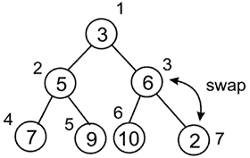

图 7.6：交换节点 2 和 6 以保持堆属性

新的数据元素已经交换并移动到索引`3`。由于我们必须检查所有节点直到根节点，我们检查其父节点的索引，即*3/2 = 1（整数除法）*，所以我们继续堆化过程。

因此，我们比较这两个元素，并再次交换，如图*图 7.7*所示：

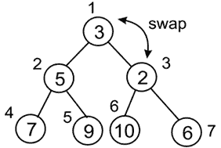

图 7.7：交换节点 2 和 3 以保持堆属性

在最终交换后，我们到达根节点。在这里，我们可以注意到这个堆符合`min`堆的定义，如图*图 7.8*所示：

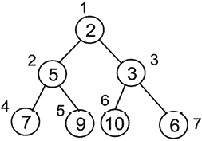

图 7.8：插入新节点 2 后的最终堆

现在，让我们再举一个例子，看看如何创建和插入堆中的元素。我们从一个堆的构建开始，逐个插入 10 个元素。这些元素是`{4, 8, 7, 2, 9, 10, 5, 1, 3, 6}`。我们可以在*图 7.9*中看到将元素插入堆的逐步过程：

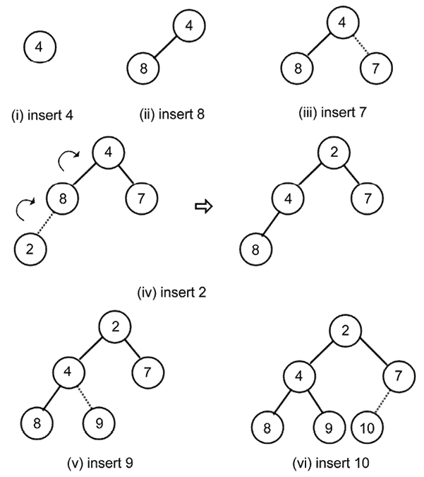

图 7.9：创建堆的逐步过程

我们可以在前面的图中看到将元素插入堆的逐步过程。在这里，我们继续添加元素，如图*图 7.10*所示：

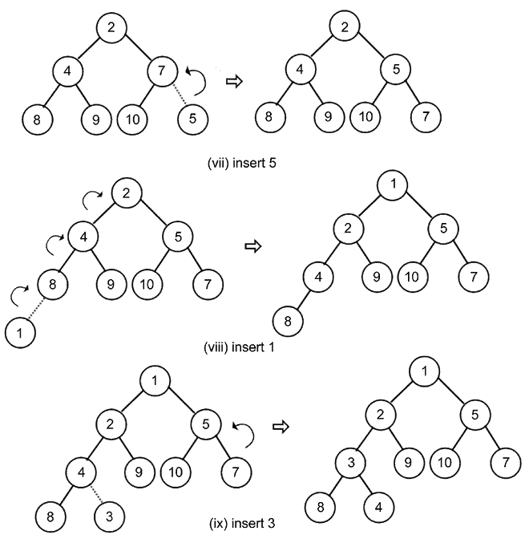

图 7.10：创建堆的步骤 7 到 9

最后，我们将元素`6`插入到堆中，如图*图 7.11*所示：

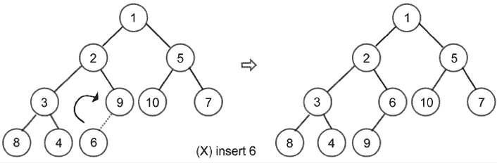

图 7.11：最后一步和最终堆的构建

堆中插入操作的实现如下。首先，我们创建一个辅助方法，称为`arrange`，它负责在插入新节点后对所有节点进行排列。以下是`arrange()`方法的实现，该方法应在`MinHeap`类中定义：

```py
 def arrange(self, k):
        while k // 2 > 0:
            if self.heap[k] < self.heap[k//2]:
                self.heap[k], self.heap[k//2] = self.heap[k//2], self.heap[k]
            k //= 2 
```

我们执行循环直到达到`root`节点；在此之前，我们可以继续排列元素。在这里，我们使用整数除法。循环将在以下条件成立后退出：

```py
 while k // 2 > 0: 
```

然后，我们比较父节点和子节点之间的值。如果父节点大于子节点，则交换这两个值：

```py
 if self.heap[k] < self.heap[k//2]: 
            self.heap[k], self.heap[k//2] = self.heap[k//2], self.heap[k] 
```

最后，在每次迭代后，我们在树中向上移动：

```py
 k //= 2 
```

此方法确保元素被正确排序。

现在，为了向堆中添加新元素，我们需要使用以下`insert`方法，该方法应在`MinHeap`类中定义：

```py
 def insert(self, item): 
        self.heap.append(item) 
        self.size += 1 
        self.arrange(self.size) 
```

在上述代码中，我们可以使用`append`方法插入一个元素；然后增加堆的大小。然后在`insert`方法的最后一行，我们调用`arrange()`方法重新组织堆（堆化）以确保堆中的所有节点都满足`heap`属性。

现在，让我们创建堆并使用`MinHeap`类中定义的`insert()`方法插入数据`{4, 8, 7, 2, 9, 10, 5, 1, 3, 6}`，如下所示：

```py
 h = MinHeap()
    for i in (4, 8, 7, 2, 9, 10, 5, 1, 3, 6): 
        h.insert(i) 
```

我们可以打印堆列表，以便检查元素是如何排序的。如果你将其重新绘制为树结构，你会注意到它符合堆所需的所有属性，类似于我们手动创建的：

```py
 print(h.heap) 
```

上述代码的输出如下：

```py
[0, 1, 2, 5, 3, 6, 10, 7, 8, 4, 9] 
```

我们可以在输出中看到，数组中堆的所有数据项与*图 7.11*中的索引位置一致。接下来，我们将讨论堆中的删除操作。

## 删除操作

`delete`操作从堆中删除一个元素。要从堆中删除任何元素，我们首先讨论如何删除根元素，因为它在许多用例中都被广泛使用，例如在堆中查找最小或最大元素。记住，在`min-heap`中，根元素表示列表的最小值，而`max-heap`的根给出元素列表的最大值。

一旦我们从堆中删除根元素，我们将堆的最后一个元素作为堆的新根。在这种情况下，树将不满足`heap`属性。因此，我们必须重新组织树的节点，使得树中的所有节点都满足`heap`属性。`min-heap`中的删除操作如下所示。

1.  删除`root`节点后，我们需要一个新的`root`节点。为此，我们从列表中取出最后一个元素并将其作为新的根。

1.  由于选定的最后一个节点可能不是堆中的最低元素，我们必须重新组织堆的节点。

1.  我们从根节点到最后一个节点（被制成一个新的根节点）重新组织节点；这个过程称为堆化。由于我们从顶部到底部（这意味着从根节点到底部元素）移动堆，这个过程称为下沉。

让我们考虑一个例子来帮助我们理解以下堆中的这个概念。首先，我们删除具有值`2`的根节点，如图*7.12*所示：

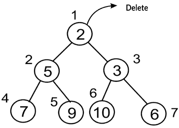

图 7.12：在现有堆中删除根节点值为 2 的节点

删除根节点后，接下来我们需要选择一个可以作为新根的节点；通常，我们选择取最后一个节点，换句话说，索引为`7`的节点`6`。因此，最后一个元素`6`被放置在根位置，如图*7.13*所示：

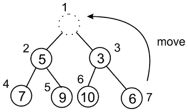

图 7.13：将最后一个元素，即节点 6 移动到根位置

将最后一个元素移动到新根之后，很明显，这棵树现在不再满足`min-heap`属性。因此，我们必须重新组织堆的节点，因此我们从根节点向下移动到堆中的节点，即堆化树。因此，我们比较新替换的节点与树中所有子节点的值。在这个例子中，我们比较根节点的两个子节点，即`5`和`3`。由于右子节点较小，其索引为`3`，表示为*(root index * 2 + 1)*。我们将继续使用这个节点，并将新的`root`节点与该索引处的值进行比较，如图*7.14*所示：

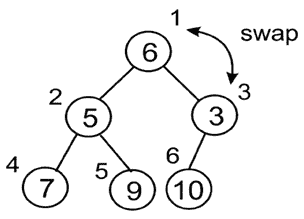

图 7.14：根节点与节点 3 的交换

现在，具有值`6`的节点应该根据最小堆属性移动到索引`3`。接下来，我们需要将其与其子节点比较到堆中。在这里，我们只有一个子节点，所以我们不需要担心比较哪个子节点（对于最小堆，总是较小的子节点），如图*7.15*所示：

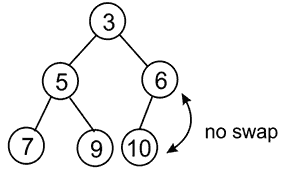

图 7.15：节点 6 和节点 10 的交换

这里不需要交换，因为它遵循`min-heap`属性。达到最后一个节点后，最终的堆遵循`min-heap`属性。

为了使用 Python 实现从堆中删除根节点，首先，我们实现下沉过程，换句话说，`sink()`方法。在我们实现`sink()`方法之前，我们实现一个用于确定与父节点比较的子节点的`helper`方法。这个`helper`方法是`minchild()`，应该在`MinHeap`类中定义：

```py
 def minchild(self, k):
        if k * 2 + 1 > self.size:
            return k * 2
        elif self.heap[k*2] < self.heap[k*2+1]:
            return k * 2
        else:
            return k * 2 + 1 
```

在这个方法中，首先，我们检查是否超过了列表的末尾——如果我们做到了，那么我们就返回左子节点的索引：

```py
 if k * 2 + 1 > self.size: 
            return k * 2 
```

否则，我们只需返回两个子节点中较小的一个的索引：

```py
 elif self.heap[k*2] < self.heap[k*2+1]: 
            return k * 2 
        else: 
            return k * 2 + 1 
```

现在我们可以创建`sink()`方法。`sink()`方法应该在`MinHeap`类中定义：

```py
def sink(self, k):
        while k * 2 <= self.size:
            mc = self.minchild(k)
            if self.heap[k] > self.heap[mc]:
                self.heap[k], self.heap[mc] = self.heap[mc], self.heap[k]
            k = mc 
```

在上述代码中，我们首先运行循环直到树的末尾，这样我们就可以将我们的元素下沉（向下移动）到所需的最低位置；这在下述代码片段中显示：

```py
 def sink(self, k): 
          while k*2 <= self.size: 
```

接下来，我们需要知道比较的是左子节点还是右子节点。这就是我们使用`minindex()`函数的地方，如下述代码片段所示：

```py
 mi = self.minchild(k) 
```

接下来，我们比较父节点和子节点，以确定是否需要交换，就像我们在插入操作期间在`arrange()`方法中所做的那样：

```py
 if self.heap[k] > self.heap[mc]: 
                self.heap[k], self.heap[mc] = self.heap[mc], self.heap[k] 
```

最后，我们需要确保在每次迭代中向下移动树，以避免陷入循环，如下所示：

```py
 k = mc 
```

现在，我们可以实现主要的`delete_at_root()`方法本身，该方法应在`MinHeap`类中定义：

```py
 def delete_at_root(self): 
        item = self.heap[1] 
        self.heap[1] = self.heap[self.size] 
        self.size -= 1 
        self.heap.pop() 
        self.sink(1) 
        return item 
```

在上述删除`root`节点的代码中，我们首先将根元素复制到一个变量`item`中，然后在下一条语句中将最后一个元素移动到`root`节点：

```py
self.heap[1] = self.heap[self.size] 
```

此外，我们减少堆的大小，从堆中删除元素，然后我们使用`sink()`方法重新组织堆元素，以便堆的所有元素都遵循`heap`属性。

我们现在可以使用以下代码从堆中删除`root`节点。首先，我们在堆中插入一些数据项`{2, 3, 5, 7, 9, 10, 6}`，然后删除`root`节点：

```py
h = MinHeap()
for i in (2, 3, 5, 7, 9, 10, 6):
    h.insert(i)
print(h.heap)
n = h.delete_at_root()
print(n)
print(h.heap) 
```

上述代码的输出如下：

```py
[0, 2, 3, 5, 7, 9, 10, 6]
2
[0, 3, 6, 5, 7, 9, 10] 
```

我们可以在输出中看到，新的堆中返回了根元素 2，并且数据元素被重新排列，以便堆的所有节点都遵循`heap`属性（可以像*图 7.16*中所示的那样检查节点的索引）。接下来，我们将讨论是否要删除给定索引位置的任何节点。

## 从堆中删除特定位置的元素

通常，我们会从根节点删除一个元素，然而，也可以从堆的特定位置删除一个元素。让我们通过一个例子来理解它。给定以下堆，假设我们想要删除值为`3`的节点，索引为`2`。删除值为`3`的节点后，我们将最后一个节点移动到被删除的节点，换句话说，就是值为`15`的节点，如图*图 7.16*所示：

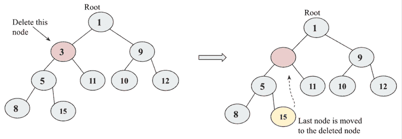

图 7.16：从堆中删除节点 3

将最后一个元素移至被删除的节点后，我们比较这个元素与其根元素，因为它已经大于根元素，所以我们不需要交换。接下来，我们比较这个元素与其所有子元素，因为左子节点较小，所以它与左子节点交换，如图*图 7.17*所示：

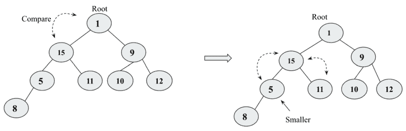

图 7.17：节点 15 与 5 和 11 的比较，以及节点 15 和节点 5 的交换

在将节点`15`与节点`5`交换后，我们在堆中向下移动。接下来，我们比较节点`15`与其子节点，节点`8`。最后，节点`8`和节点`15`交换。现在，最终的树遵循`heap`属性，如图*图 7.18*所示：

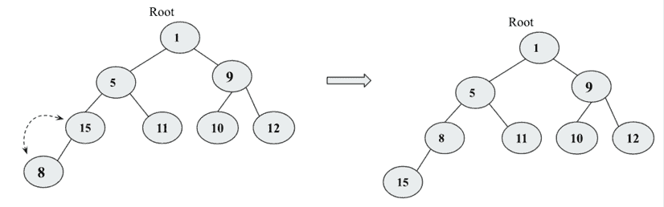

图 7.18：交换节点 8 和节点 15 后的最终堆

以下给出删除任何给定索引位置数据项的删除操作的实现，应在`MinHeap`类中定义：

```py
 def delete_at_location(self, location):
        item = self.heap[location]
        self.heap[location] = self.heap[self.size]
        self.size -= 1
        self.heap.pop()
        self.sink(location)
        return item 
{4, 8, 7, 2, 9, 10, 5, 1, 3, 6}:
```

```py
h = MinHeap()  
for i in (4, 8, 7, 2, 9, 10, 5, 1, 3, 6):  
    h.insert(i)    
print(h.heap)

n = h.delete_at_location(2)
print(n)
print(h.heap) 
```

上述代码的输出如下：

```py
[0, 1, 2, 5, 3, 6, 10, 7, 8, 4, 9]
2
[0, 1, 3, 5, 4, 6, 10, 7, 8, 9] 
```

在上述输出中，我们看到，在前后，堆节点都是按照它们的索引位置放置的。我们已经通过`最小堆`的例子讨论了概念和实现；所有这些操作和概念都可以通过简单地反转在`最小堆`中确保父节点值小于子节点的条件逻辑，轻松地应用于`最大堆`。现在在`最大堆`的情况下，我们必须使父节点的值更大。堆被用于各种应用，例如实现堆排序和优先队列，我们将在后续章节中讨论。

## 堆排序

堆是一种重要的数据结构，用于对元素列表进行排序，因为它非常适合大量元素。如果我们想按升序对元素列表进行排序，我们可以使用`最小堆`来实现这个目的；我们首先创建一个包含所有给定数据元素的`最小堆`，根据`堆`的性质，最小的数据值将被存储在堆的根节点。借助`堆`的性质，对元素进行排序变得非常直接。过程如下：

1.  使用所有给定的数据元素创建一个`最小堆`。

1.  读取并删除根元素，即最小值。之后，将树的最后一个元素复制到新的根节点，并进一步重新组织树以保持`堆`的性质。

1.  现在，我们重复*步骤 2*，直到我们得到所有元素。

1.  最后，我们得到排序后的元素列表。

数据元素按照`堆`的性质存储在堆中；每当添加或删除新元素时，分别使用前面章节中讨论的`arrange()`和`sink()``辅助`方法来维护`堆`的性质。

为了使用堆数据结构实现堆排序，我们首先使用以下代码创建一个包含数据项 `{4, 8, 7, 2, 9, 10, 5, 1, 3, 6}` 的堆（堆的创建细节在前面章节中给出）：

```py
 h = MinHeap() 
    unsorted_list = [4, 8, 7, 2, 9, 10, 5, 1, 3, 6] 
    for i in unsorted_list: 
        h.insert(i) 
    print("Unsorted list: {}".format(unsorted_list)) 
```

在上述代码中，创建了`最小堆``h`，并将`unsorted_list`中的元素插入。在每次调用`insert()`方法后，通过后续调用`sink`方法恢复堆顺序属性。

在创建堆之后，接下来，我们读取并删除根元素。在每次迭代中，我们得到最小值，因此数据项按升序排列。`heap_sort()`方法的实现应该在`minHeap`类中定义（它使用前面章节中讨论的`delete_at_root()`方法）：

```py
 def heap_sort(self): 
            sorted_list = [] 
            for node in range(self.size): 
                n = self.delete_at_root() 
                sorted_list.append(n) 
            return sorted_list 
```

在上述代码中，我们创建了一个空数组`sorted_list`，用于存储所有已排序的数据元素。然后我们运行循环，循环次数与列表中的项目数相同。在每次迭代中，我们调用`delete_at_root()`方法来获取最小值，并将其追加到`sorted_list`。

现在我们可以使用以下代码来使用堆排序算法：

```py
print("Unsorted list: {}".format(unsorted_list))
print("Sorted list: {}".format(h.heap_sort())) 
```

上述代码的输出如下：

```py
Unsorted list: [4, 8, 7, 2, 9, 10, 5, 1, 3, 6]
Sorted list: [1, 2, 3, 4, 5, 6, 7, 8, 9, 10] 
```

使用插入方法构建堆的时间复杂度为`O(n)`。进一步地，在删除根元素后重新组织树的时间复杂度为`O(log n)`，因为我们是从堆树的上到下进行操作的，而堆的高度是`log2(n)`，因此重新排列树的时间复杂度是`O(log n)`。所以，总体来说，堆排序的最坏情况时间复杂度是`O(n logn)`。堆排序在一般情况下非常高效，其最坏情况、平均情况和最佳情况的时间复杂度均为`O(nlogn)`。

# 优先队列

优先队列是一种数据结构，它类似于队列，其中数据是根据**先进先出**（**FIFO**）策略检索的，但在优先队列中，数据与优先级相关联。在优先队列中，数据是根据与数据元素相关的优先级检索的，优先级最高的数据元素先被检索，优先级较低的数据元素后被检索，如果两个数据元素具有相同的优先级，则根据**FIFO**策略检索。

我们可以根据应用来分配数据的优先级。它在许多应用中都有使用，例如 CPU 调度，许多算法也依赖于优先队列，如 Dijkstra 的最短路径算法、A*搜索算法和用于数据压缩的 Huffman 编码。

因此，在优先队列中，优先级最高的项目首先被服务。优先队列根据与数据相关的优先级存储数据，因此元素的插入将在优先队列的特定位置。优先队列可以被视为修改后的队列，它按最高优先级顺序返回项目，而不是按**FIFO**顺序返回项目。可以通过修改入队位置并按优先级插入项目来实现优先队列。这在*图 7.19*中得到了演示，其中给定的队列中添加了一个新的项目`5`到队列的特定索引（这里假设具有更高值的数据项具有更高的优先级）：

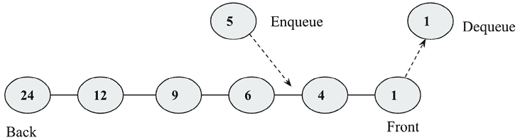

图 7.19：优先队列的演示

让我们通过一个例子来理解优先队列。当我们按顺序接收数据元素时，元素将按照优先级（假设数据值越高，重要性越高）的顺序入队。首先，优先队列是空的，所以最初在队列中添加了`3`；下一个数据元素是`8`，由于它大于`3`，它将被入队到队列的起始位置。接下来是数据项`2`，然后是`6`，最后是`10`，它们按照优先级入队，当执行出队操作时，高优先级的项目将首先出队。所有步骤都在*图 7.20*中表示：

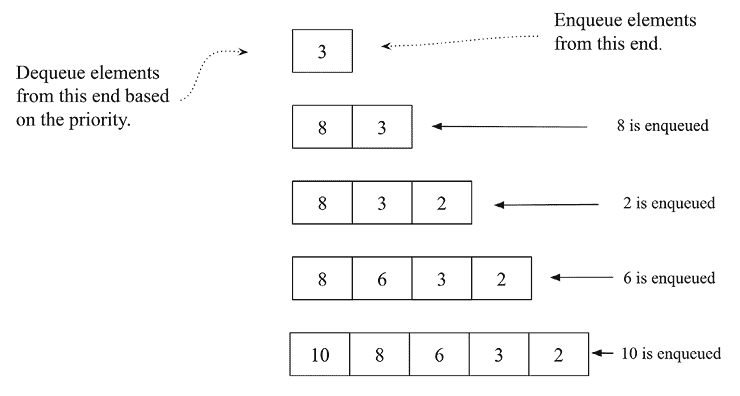

图 7.20：创建优先队列的逐步过程

让我们讨论在 Python 中实现优先队列。我们首先定义节点类。节点类将包含与优先队列中的数据相关联的数据元素：

```py
# class for Node with data and priority
class Node:
  def __init__(self, info, priority):
    self.info = info
    self.priority = priority 
```

接下来，我们定义`PriorityQueue`类并初始化队列：

```py
# class for Priority queue
class PriorityQueue:
  def __init__(self):
    self.queue = [] 
```

接下来，让我们讨论插入操作的实施，用于将新的数据元素添加到优先队列中。在实现中，我们假设数据元素的优先级值越小，优先级越高（例如，优先级值为`1`的数据元素比优先级值为`4`的数据元素优先级高）。以下是在优先队列中插入元素的案例：

1.  当队列最初为空时，向优先队列中插入数据元素。

1.  如果队列不为空，我们执行队列的遍历，并通过比较现有节点与新节点的优先级，根据相关的优先级在队列中达到适当的索引位置。我们将在优先级高于新节点的节点之前添加新节点。

1.  如果新节点的优先级低于高优先级值，则节点将被添加到队列的起始位置。

`insert()` 方法的实现如下，它应该在 `PriorityQueue` 类中定义：

```py
 def insert(self, node):        
        if len(self.queue) == 0:
            # add the new node
            self.queue.append(node)
        else:
            # traverse the queue to find the right place for new node
            for x in range(0, len(self.queue)):
                # if the priority of new node is greater
                if node.priority >= self.queue[x].priority:
                    # if we have traversed the complete queue
                    if x == (len(self.queue)-1):
                        # add new node at the end
                        self.queue.insert(x+1, node)
                    else:
                        continue
                else:
                    self.queue.insert(x, node)
                    return True 
```

在上述代码中，当队列为空时，我们首先添加一个新的数据元素，然后通过比较数据元素相关的优先级，迭代地达到适当的位置。

接下来，当我们对优先队列应用删除操作时，最高优先级的数据元素将被返回并从队列中移除。它应该在`PriorityQueue`类中如下定义：

```py
 def delete(self):
        # remove the first node from the queue
        x = self.queue.pop(0)
        print("Deleted data with the given priority-", x.info, x.priority)
        return x 
```

在前面的代码中，我们获取具有最高优先级值的顶级元素。进一步，实现`show()`方法，该方法应在`PriorityQueue`类中定义，用于按优先级顺序打印优先队列中的所有数据元素：

```py
 def show(self):
        for x in self.queue:
            print(str(x.info)+ " - "+ str(x.priority)) 
```

现在，让我们考虑一个例子，看看如何使用优先队列，我们首先添加具有相关优先级`13`、`2`、`1`、`26`和`25`的数据元素（`"Cat"`、`"Bat"`、`"Rat"`、`"Ant"`和`"Lion"`）：

```py
p = PriorityQueue()
p.insert(Node("Cat", 13))
p.insert(Node("Bat", 2))
p.insert(Node("Rat", 1))
p.insert(Node("Ant", 26))
p.insert(Node("Lion", 25))
p.show()
p.delete() 
```

上述代码的输出如下：

```py
Rat – 1
Bat – 2
Cat – 13
Lion – 25
Ant – 26
Deleted data with the given priority- Rat 1 
```

优先队列可以使用几种数据结构实现；在上面的例子中，我们看到了使用包含优先级作为第一个元素和值数据项作为下一个元素的元组列表实现的示例。然而，优先队列通常使用堆实现，因为它在插入和删除操作中的最坏情况时间复杂度为`O(log n)`，因此效率很高。

使用堆实现优先队列的代码与我们在`min-heap`实现中讨论的非常相似。唯一的区别是现在我们存储与数据元素相关的优先级，并使用 Python 中的元组列表创建一个考虑优先级值的`min-heap`树。为了完整性，以下是用堆实现的优先队列的代码：

```py
class PriorityQueueHeap:
    def __init__(self):
        self.heap = [()]
        self.size = 0

    def arrange(self, k):
        while k // 2 > 0:
            if self.heap[k][0] < self.heap[k//2][0]:
                self.heap[k], self.heap[k//2] = self.heap[k//2], self.heap[k]
            k //= 2

    def insert(self,priority, item):
        self.heap.append((priority, item))
        self.size += 1
        self.arrange(self.size)

    def sink(self, k):
        while k * 2 <= self.size:
            mc = self.minchild(k)
            if self.heap[k][0] > self.heap[mc][0]:
                self.heap[k], self.heap[mc] = self.heap[mc], self.heap[k]
            k = mc

    def minchild(self, k):
        if k * 2 + 1 > self.size:
            return k * 2
        elif self.heap[k*2][0] < self.heap[k*2+1][0]:
            return k * 2
        else:
            return k * 2 + 1

    def delete_at_root(self):
        item = self.heap[1][1]
        self.heap[1] = self.heap[self.size]
        self.size -= 1
        self.heap.pop()
        self.sink(1)
        return item 
```

我们使用以下代码创建一个包含数据元素`"Bat"`、`"Cat"`、`"Rat"`、`"Ant"`、`"Lion"`和`"Bear"`的优先队列，相应的优先级值分别为`2`、`13`、`18`、`26`、`3`和`4`：

```py
h = PriorityQueueHeap() 
h.insert(2, "Bat") 
h.insert(13,"Cat")
h.insert(18, "Rat")
h.insert(26, "Ant")
h.insert(3, "Lion")
h.insert(4, "Bear")
h.heap 
```

上述代码的输出如下：

```py
[(), (2, 'Bat'), (3, 'Lion'),  (4, 'Bear'),  (26, 'Ant'),  (13, 'Cat'),  (18, 'Rat')] 
```

在上述输出中，我们可以看到它显示了一个遵循`min-heap`属性的`min-heap`树。现在我们可以使用以下代码来删除数据元素：

```py
for i in range(h.size):
    n = h.delete_at_root()
    print(n)
    print(h.heap) 
```

上述代码的输出如下：

```py
'Bat
[(), (3, 'Lion'), (13, 'Cat'), (4, 'Bear'), (26, 'Ant'), (18, 'Rat')]
Lion
[(), (4, 'Bear'), (13, 'Cat'), (18, 'Rat'), (26, 'Ant')]
Bear
[(), (13, 'Cat'), (26, 'Ant'), (18, 'Rat')]
Cat
[(), (18, 'Rat'), (26, 'Ant')]
Rat
[(), (26, 'Ant')]
Ant
[()] 
```

在上述输出中，我们可以看到数据项是按照与数据元素相关的优先级产生的。

# 摘要

在本章中，我们讨论了一个重要的数据结构，换句话说，就是堆数据结构。我们还讨论了`min-heap`和`max-heap`的堆属性。我们看到了可以应用于堆数据结构的几个操作的实现，例如堆化、从堆中插入和删除数据元素。我们还讨论了堆的两个重要应用——堆排序和优先队列。堆是一个重要的数据结构，因为它有多个应用，例如排序、在列表中选择最小和最大值、图算法和优先队列。此外，当我们需要反复删除具有最高或最低优先级值的数据对象时，堆也可能很有用。

在下一章中，我们将讨论**哈希**和**符号表**的概念。

# 练习

1.  从`min-heap`中删除任意元素的时间复杂度是多少？

1.  查找`min-heap`中第`k`个最小元素的时间复杂度是多少？

1.  从二叉`max-heap`和二叉`min-heap`中确定最小元素的最坏情况时间复杂度是多少？

1.  将两个大小为`n`的`max-heap`合并成一个`max-heap`的时间复杂度是多少？

1.  `max-heap`的层序遍历是`12`、`9`、`7`、`4`和`2`。在插入新元素`1`和`8`之后，最终的`max-heap`和最终的`max-heap`的层序遍历将是什么？

1.  以下哪个是二叉`max-heap`？

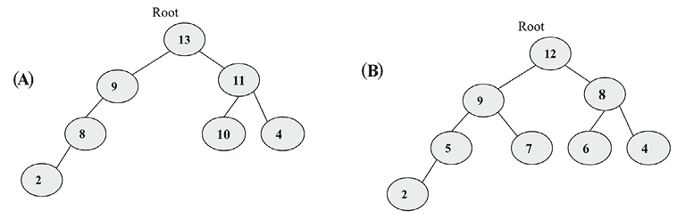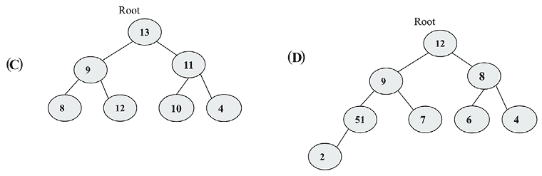

图 7.21：示例树

# 加入我们的 Discord 社区

加入我们社区的 Discord 空间，与作者和其他读者进行讨论：[`packt.link/MEvK4`](https://packt.link/MEvK4)


