# 9

# 图和算法

图是一种非线性数据结构，其中问题通过连接节点集与边来表示网络，例如电话网络或社交网络。例如，在图中，节点可以代表不同的城市，而它们之间的链接代表边。图是最重要的数据结构之一；它们用于解决许多计算问题，尤其是在问题以对象及其连接的形式表示时，例如找出从一个城市到另一个城市的最短路径。图是解决现实世界问题的有用数据结构，其中问题可以表示为类似网络的结构。在本章中，我们将讨论与图相关的重要和流行概念。

在本章中，我们将学习以下概念：

+   图数据结构的概念

+   如何表示图和遍历它

+   图上的不同操作及其实现

首先，我们将探讨不同类型的图。

# 图

图是一组有限数量的顶点（也称为节点）和边，其中边是顶点之间的链接，图中每条边连接两个不同的节点。此外，图是网络的正式数学表示，即图**G**是一个顶点集合**V**和边集合**E**的有序对，在正式数学符号中表示为`G = (V, E)`。

一个图的示例在*图 9.1*中显示：

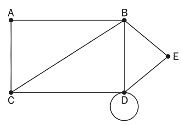

图 9.1：一个图的示例

*图 9.1*中的图`G = (V, E)`可以描述如下：

+   `V = {A, B, C, D, E}`

+   `E = {{A, B}, {A, C}, {B, C}, {B, D}, {C, D}, {D, D}, {B, E}, {D, E}}`

+   `G = (V, E)`

让我们讨论一些图的重要定义：

+   **节点或顶点**：图中的一个点或节点称为顶点。在前面的图中，顶点或节点是**A**、**B**、**C**、**D**和**E**，并用点表示。

+   **边**：这是两个顶点之间的连接。连接**A**和**B**的线是一个边的例子。

+   **循环**：当一个节点的边返回到自身时，这条边形成一个循环，例如**D**节点。

+   **顶点/节点的度**：给定顶点上偶然出现的边的总数称为该顶点的度。例如，前图中**B**节点的度是`4`。

+   **邻接**：这指的是任何两个节点之间的连接；因此，如果任何两个顶点或节点之间存在连接，则它们被称为彼此相邻。例如，C 节点与 A 节点相邻，因为它们之间有一条边。

+   **路径**：任何两个节点之间顶点和边的序列表示一条路径。例如，**CABE**表示从**C**节点到**E**节点的路径。

+   **叶节点**（也称为*悬垂节点*）：如果一个节点或顶点恰好有一个度，则称为叶节点或悬垂节点。

现在，我们将探讨不同类型的图。

## **有向图和非定向图**

图由节点之间的边表示。连接边可以是定向的或非定向的。如果一个图中的连接边是非定向的，那么这个图被称为非定向图；如果连接边是定向的，那么它被称为定向图。非定向图简单地用节点之间的线条表示边。除了节点之间是相连的事实之外，没有关于节点之间关系的其他信息。例如，在*图 9.2*中，我们展示了四个节点**A**、**B**、**C**和**D**的非定向图，这些节点通过边相连：

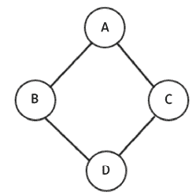

图 9.2：一个非定向图的示例

在有向图中，边提供了图中任意两个节点之间连接方向的有关信息。如果从**A**节点到**B**的边被称为有向的，那么边(**A**, **B**)就不会等于边(**B**, **A**)。有向边用带有箭头的线条绘制，箭头将指向边连接两个节点的方向。

例如，在*图 9.3*中，我们展示了一个有向图，其中许多节点通过有向边相连：

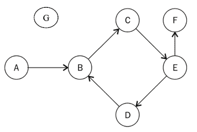

图 9.3：一个有向图的示例

边的箭头决定了方向的流动。只能从**A**移动到**B**，如前图所示——不能从**B**移动到**A**。在有向图中，每个节点（或顶点）都有一个入度和一个出度。让我们看看这些是什么：

+   **入度**：图中进入一个节点的边的总数被称为该节点的入度。例如，在之前的图中，**E**节点有`1`个入度，因为边**CE**进入**E**节点。

+   **出度**：从图中一个节点出发的边的总数被称为该节点的出度。例如，在之前的图中，**E**节点有一个出度为`2`，因为它有两个边，**EF**和**ED**，从这个节点出发。

+   **孤立点**：当一个节点或顶点的度为零时，它被称为孤立点，如图*图 9.3*中所示的**G**节点。

+   **源点**：如果一个节点没有入度，那么这个节点被称为源点。例如，在之前的图中，**A**节点是源点。

+   **汇点**：如果一个节点没有出度，那么这个节点被称为汇点。例如，在之前的图中，**F**节点是汇点。

现在我们已经了解了有向图的工作原理，我们可以看看有向无环图。

## **有向无环图**

**有向无环图**（**DAG**）是一个没有环的有向图；在 DAG 中，所有边都是从一个节点指向另一个节点，使得边的序列永远不会形成一个闭环。当序列中第一条边的起始节点等于最后一条边的结束节点时，图中就形成了一个环。

在*图 9.4*中展示了一个有向无环图，其中图中的所有边都是有向的，并且图中没有环：

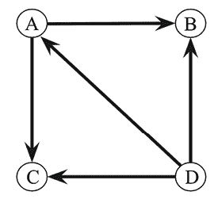

图 9.4：有向无环图的示例

因此，在一个有向无环图中，如果我们从一个给定的节点开始沿任何路径，我们永远不会找到一条以相同节点结束的路径。有向无环图有许多应用，例如在作业调度、引用图和数据压缩中。

接下来，我们将讨论带权图。

## 带权图

一个带权图是一个与图中边相关联有数值权重的图。带权图可以是定向图或无向图。数值权重可以根据图的目的用来表示距离或成本：

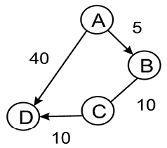

图 9.5：带权图的示例

让我们考虑一个例子 – *图 9.5* 指示了从**A**节点到**D**节点的不同路径。有两种可能的路径，例如从**A**节点到**D**节点，或者它可以是节点**A-B-C-D**通过**B**节点和**C**节点。现在，根据与边相关的权重，任何一条路径都可以被认为是比其他路径更适合旅行 – 例如，假设这个图中的权重代表两个节点之间的距离，我们想要找出**A-D**节点之间的最短路径；那么一条可能的路径**A-D**有一个相关的成本为 40，而另一条可能的路径**A-B-C-D**有一个相关的成本为 25。在这种情况下，更好的路径是**A-B-C-D**，它有更低的距离。

接下来，我们将讨论二部图。

## 二部图

二部图（也称为双图）是一个特殊的图，其中图中的所有节点都可以分成两个集合，使得边连接来自一个集合的节点到另一个集合的节点。参见*图 9.6*中的示例二部图；图中所有节点被分成两个独立的集合，即集合 U 和集合 V，使得图中的每条边都有一个端点在集合 U 中，另一个端点在集合 V 中（例如，在边(*A, B*)中，一个端点或一个顶点来自集合 U，另一个端点或另一个顶点来自集合 V）。

在二部图中，没有边会连接到同一集合的节点：

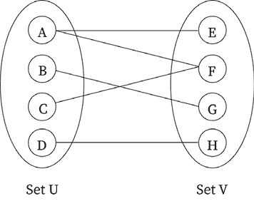

图 9.6：二部图的示例

当我们需要对两个不同类别的对象之间的关系进行建模时，二部图非常有用，例如，一个申请人和工作的图，其中我们可能需要建模这两个不同群体之间的关系；另一个例子可能是一个足球球员和俱乐部的二部图，其中我们可能需要建模一个球员是否为特定的俱乐部效力过。

接下来，我们将讨论不同的图表示技术。

# 图的表示

图表示技术意味着我们在内存中如何存储图，即我们如何存储顶点、边和权重（如果图是有权图）。图可以用两种方法表示，即（1）邻接表，和（2）邻接矩阵。

邻接表表示基于链表。在这种情况下，我们通过为图的每个顶点（或节点）维护一个邻居列表（也称为相邻节点）来表示图。在图的邻接矩阵表示中，我们维护一个矩阵，该矩阵表示图中哪个节点与哪个其他节点相邻；即，邻接矩阵包含图中每条边的所有信息，这些信息由矩阵的单元格表示。

这两种表示方法都可以使用；然而，我们的选择取决于我们将要使用图表示的应用。当我们预期图将是稀疏的并且边的数量较少时，邻接表是首选；例如，如果一个包含 200 个节点的图有大约 100 条边，那么将这种类型的图存储在邻接表中更好，因为如果我们使用邻接矩阵，矩阵的大小将是 200x200，其中包含许多零值。当我们预期图将有大量边，并且矩阵将是密集的时，邻接矩阵是首选。在邻接矩阵中，与邻接表表示相比，查找和检查边的存在或不存在非常容易。

在随后的章节中，我们将详细讨论邻接矩阵。首先，我们将查看邻接表。

## 邻接表

在这种表示中，所有直接连接到节点 x 的节点都列在该节点的相邻节点列表中。图通过显示图中所有节点的相邻列表来表示。

在*图 9.7*中显示的图中，如果节点`A`和`B`之间存在直接连接，则称这两个节点是相邻的：

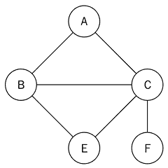

图 9.7：五个节点的示例图

可以使用链表来实现邻接表。为了表示图，我们需要与图中节点总数相等的链表数量。在每个索引处，存储与该顶点相邻的节点。例如，考虑*图 9.8*中所示的邻接表，它对应于*图 9.7*中所示的示例图：

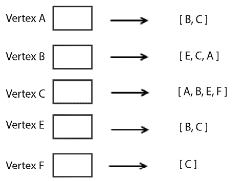

图 9.8：图 9.7 中所示图的邻接表

在这里，第一个节点代表图的`A`顶点，其相邻节点为`B`和`C`。第二个节点代表图的`B`顶点，其相邻节点为`E`、`C`和`A`。同样，图的`C`、`E`和`F`等其他顶点也用它们的相邻节点表示，如前述*图 9.8*所示。

使用`list`进行表示非常受限，因为我们缺乏直接使用顶点标签的能力。因此，为了有效地使用 Python 实现图，我们使用`dictionary`数据结构，因为它更适合表示图。要使用字典数据结构实现相同的图，我们可以使用以下代码片段：

```py
graph = dict()
graph['A'] = ['B', 'C']
graph['B'] = ['E','C', 'A']
graph['C'] = ['A', 'B', 'E','F']
graph['E'] = ['B', 'C']
graph['F'] = ['C'] 
```

现在，我们可以轻松地确定顶点`A`有与顶点`B`和`C`的相邻顶点。顶点`F`的唯一邻接顶点是顶点`C`。同样，顶点`B`有与顶点`E`、`C`和`A`的相邻顶点。

当图将要变得稀疏，并且我们可能需要频繁地在图中添加或删除节点时，邻接表是一种更可取的图表示技术。然而，使用这种方法很难检查给定的边是否存在于图中。

接下来，我们将讨论另一种图表示方法，即邻接矩阵。

## 邻接矩阵

表示图的另一种方法是使用邻接矩阵。在这种情况下，通过显示节点及其通过边相互连接来表示图。使用这种方法，矩阵的维度（`V x V`）用于表示图，其中每个单元格表示图中的一个边。矩阵是一个二维数组。因此，这里的想法是使用`1`或`0`来表示矩阵的单元格，这取决于两个节点是否通过边连接。我们在*图 9.9*中展示了示例图及其相应的邻接矩阵：

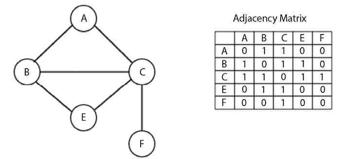

图 9.9：给定图的邻接矩阵

可以使用给定的邻接表实现邻接矩阵。为了实现邻接矩阵，让我们以之前基于字典的图实现为例。首先，我们必须获取邻接矩阵的关键元素。需要注意的是，这些矩阵元素是图中的顶点。我们可以通过排序图的键来获取关键元素。相应的代码片段如下：

```py
matrix_elements = sorted(graph.keys())
cols = rows = len(matrix_elements) 
```

接下来，图的键的长度将是邻接矩阵的维度，这些维度存储在`cols`和`rows`中。`cols`和`rows`的值相等。

因此，现在，我们创建一个空的邻接矩阵，其维度为`cols`乘以`rows`，初始时所有值都填充为零。初始化空邻接矩阵的代码片段如下：

```py
adjacency_matrix = [[0 for x in range(rows)] for y in range(cols)]
edges_list = [] 
```

`edges_list`变量将存储构成图中边的元组。例如，节点 A 和 B 之间的边将被存储为(`A`, `B`)。使用嵌套`for`循环填充多维数组：

```py
for key in matrix_elements:
    for neighbor in graph[key]:
        edges_list.append((key, neighbor))
print(edges_list) 
```

通过`graph[key]`获取顶点的邻接点。然后，结合`neighbor`使用键创建存储在`edges_list`中的元组。

存储图边的先前 Python 代码的输出如下：

```py
[('A', 'B'), ('A', 'C'), ('B', 'E'), ('B', 'C'), ('B', 'A'), ('C', 'A'), ('C', 'B'), ('C', 'E'), ('C', 'F'), ('E', 'B'), ('E', 'C'), ('F', 'C')] 
```

实现邻接矩阵的下一步是填充它，使用 `1` 来表示图中存在边。这可以通过 `adjacency_matrix[index_of_first_vertex][index_of_second_vertex] = 1` 语句来完成。标记图中边存在的完整代码片段如下：

```py
for edge in edges_list:
    index_of_first_vertex = matrix_elements.index(edge[0])
    index_of_second_vertex = matrix_elements.index(edge[1])
    adjacency_matrix[index_of_first_vertex][index_of_second_vertex] = 1 
print(adjacency_matrix) 
```

`matrix_elements` 数组有它的 `rows` 和 `cols`，从 `A` 到所有其他顶点，索引为 `0` 到 `5`。`for` 循环遍历元组列表，并使用 `index` 方法获取要存储边的对应索引。

前述代码的输出是先前在 *图 9.9* 中显示的示例图的邻接矩阵。生成的邻接矩阵如下所示：

```py
[0, 1, 1, 0, 0]
[1, 0, 0, 1, 0]
[1, 1, 0, 1, 1]
[0, 1, 1, 0, 0]
[0, 0, 1, 0, 0] 
```

在行 `1` 和列 `1`，`0` 表示 **A** 和 **A** 之间不存在边。同样，在行 `3` 和列 `2`，有一个值为 `1` 的值表示图中 **C** 和 **B** 顶点之间的边。

在图表示中使用邻接矩阵适合于我们需要频繁地查找和检查图中两个节点之间是否存在边的情况，例如在网络中创建路由表、在公共交通应用和导航系统中搜索路线等。当图中的节点频繁添加或删除时，邻接矩阵不适合，在这些情况下，邻接表是一种更好的技术。

接下来，让我们讨论不同的图遍历方法，在这些方法中，我们访问给定图的全部节点。

# 图遍历

图遍历意味着在访问图的所有顶点的同时，跟踪哪些节点或顶点已经被访问过，哪些还没有。如果一个图遍历算法以最短时间遍历图的所有节点，则该算法是高效的。图遍历，也称为图搜索算法，与 `preorder`、`inorder`、`postorder` 和层次遍历算法等树遍历算法非常相似；与它们类似，在图搜索算法中，我们从节点开始，通过边遍历图中的所有其他节点。

图遍历的常见策略是沿着一条路径走到尽头，然后回溯直到遇到替代路径的点。我们也可以迭代地从节点移动到另一个节点，以遍历整个图或其部分。图遍历算法在解决许多基本问题中非常重要——它们可以用来确定如何在图中从一个顶点到达另一个顶点，以及图中从 **A** 节点到 **B** 节点的路径比其他路径更好。例如，图遍历算法在找出城市网络中从一个城市到另一个城市的最短路径时非常有用。

在下一节中，我们将讨论两个重要的图遍历算法：**广度优先搜索**（**BFS**）和**深度优先搜索**（**DFS**）。

## 广度优先遍历

**广度优先搜索**（**BFS**）在树数据结构中的层序遍历算法的工作方式非常相似。BFS 算法也是按层工作的；它从访问层 0 的根节点开始，然后访问与根节点直接连接的第一层的所有节点。层 1 的节点与根节点的距离为 1。访问完层 1 的所有节点后，接下来访问层 2 的节点。同样，图中的所有节点都是按层遍历，直到所有节点都被访问。因此，广度优先遍历算法在图中按广度工作。

队列数据结构用于存储图中要访问的顶点的信息。我们从起始节点开始。首先，我们访问该节点，然后查找所有相邻的或相邻的顶点。我们首先逐个访问这些相邻顶点，同时将它们的邻居添加到要访问的顶点的列表中。我们遵循这个过程，直到访问了图中的所有顶点，确保没有顶点被访问两次。

让我们通过*图 9.10*中的示例来更好地理解图的广度优先遍历的工作原理：

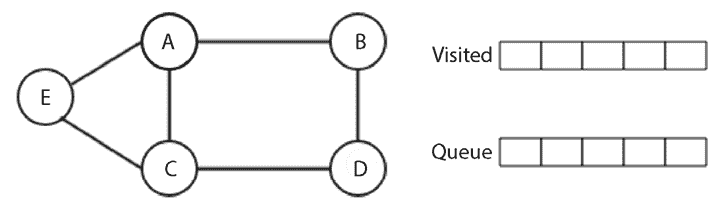

图 9.10：一个示例图

在*图 9.10*中，我们有一个左边的五个节点图，右边是一个队列数据结构，用于存储待访问的顶点。我们开始访问第一个节点，即**A**节点，然后我们将所有相邻的顶点**B**、**C**和**E**添加到队列中。在这里，需要注意的是，由于有三个节点**B**、**C**和**E**可以以**BCE**、**CEB**、**CBE**、**BEC**或**ECB**的顺序添加到队列中，每种顺序都会给出不同的树遍历结果，因此有多个将相邻节点添加到队列的方法。

所有这些图遍历的可能解决方案都是正确的，但在这个例子中，我们按字母顺序添加节点，只是为了使队列中的事情简单，即**BCE**。**A**节点如图*图 9.11*所示访问：

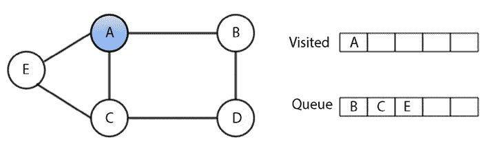

图 9.11：在广度优先遍历中访问节点 A

一旦我们访问了**A**顶点，接下来，我们访问它的第一个相邻顶点**B**，并添加顶点**B**的相邻顶点，这些顶点尚未添加到队列或尚未访问。在这种情况下，我们必须将**D**顶点（因为它有两个顶点，**A**和**D**节点，其中**A**已经访问过）添加到队列中，如图*图 9.12*所示：

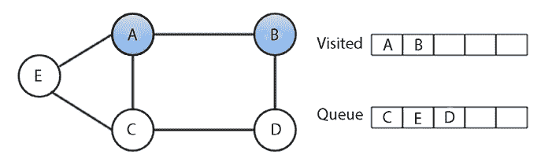

图 9.12：在广度优先遍历中访问节点 B

现在，在访问了**B**顶点之后，我们从队列中访问下一个顶点——**C**顶点。然后，再次添加那些尚未添加到队列中的相邻顶点。在这种情况下，没有未记录的顶点，如图*图 9.13*所示：

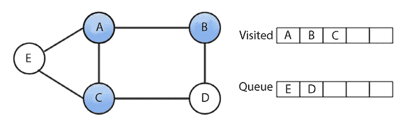

图 9.13：在广度优先遍历中访问节点 C

在访问**C**顶点后，我们访问队列中的下一个顶点，即**E**顶点，如图*图 9.14*所示：

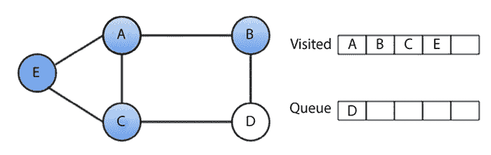

图 9.14：在广度优先遍历中访问节点 E

类似地，在访问**E**顶点后，我们在最后一步访问**D**顶点，如图*图 9.15*所示：

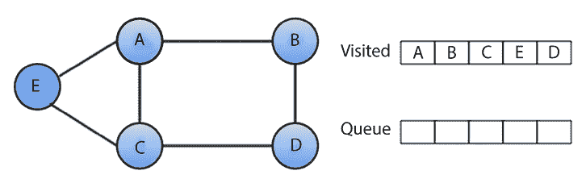

图 9.15：在广度优先遍历中访问节点 D

因此，遍历前述图的 BFS 算法按**A-B-C-E-D**的顺序访问顶点。这是前述图 BFS 遍历的一个可能解，但我们可以得到许多可能的解，这取决于我们如何将相邻节点添加到队列中。

要理解 Python 中此算法的实现，我们将使用另一个无向图的示例，如图*图 9.16*所示：

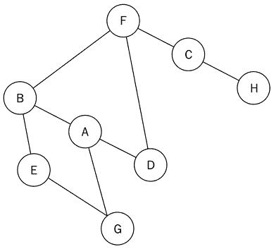

图 9.16：一个无向样本图

图*图 9.16*所示图的邻接表如下：

```py
graph = dict()
graph['A'] = ['B', 'G', 'D']
graph['B'] = ['A', 'F', 'E']
graph['C'] = ['F', 'H']
graph['D'] = ['F', 'A']
graph['E'] = ['B', 'G']
graph['F'] = ['B', 'D', 'C']
graph['G'] = ['A', 'E']
graph['H'] = ['C'] 
```

在使用邻接表存储图后，BFS 算法的实现如下，我们将通过一个示例详细讨论：

```py
from collections import deque
def breadth_first_search(graph, root):
    visited_vertices = list()
    graph_queue = deque([root])
    visited_vertices.append(root)
    node = root
    while len(graph_queue) > 0:
        node = graph_queue.popleft()
        adj_nodes = graph[node]
        remaining_elements = set(adj_nodes).difference(set(visited_vertices))
        if len(remaining_elements) > 0:
             for elem in sorted(remaining_elements):
                 visited_vertices.append(elem)
                 graph_queue.append(elem)
    return visited_vertices 
```

要使用广度优先算法遍历此图，我们首先初始化队列和源节点。我们从**A**节点开始遍历。首先，**A**节点被入队并添加到已访问节点列表中。之后，我们使用`while`循环来影响图的遍历。在`while`循环的第一轮迭代中，节点 A 被出队。

接下来，我们将**A**节点的所有未访问相邻节点（**B**、**D**和**G**）按字母顺序排序并排队。现在队列包含节点**B**、**D**和**G**。这如图*图 9.17*所示：

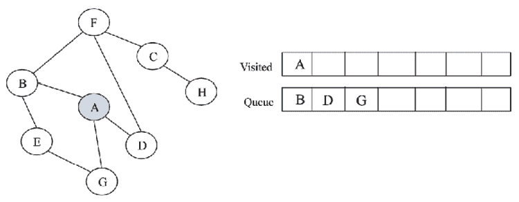

图 9.17：使用 BFS 算法访问节点 A

对于实现，我们将所有这些节点（**B**、**D**、**G**）添加到已访问节点列表中，然后我们添加这些节点的相邻/邻近节点。此时，我们开始`while`循环的另一个迭代。在访问**A**节点后，**B**节点被出队。在其相邻节点（**A**、**E**和**F**）中，**A**节点已经被访问。因此，我们只按字母顺序将**E**和**F**节点入队，如图*图 9.18*所示。

当我们想要找出一个节点集合是否在已访问节点列表中时，我们使用`remaining_elements = set(adj_nodes).difference(set(visited_vertices))`语句。这个语句使用`set`对象的`difference`方法来找出在`adj_nodes`中但不在`visited_vertices`中的节点：

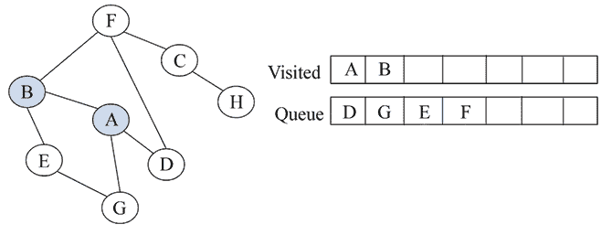


在这一点，队列中包含以下节点——**D**、**G**、**E** 和 **F**。**D** 节点被出队，但所有相邻的节点都已访问，所以我们简单地将其出队。队列前面的下一个节点是 **G**。我们出队 **G** 节点，但我们还发现所有相邻的节点都已访问，因为它们在已访问节点列表中。因此，**G** 节点也被出队。我们也出队 **E** 节点，因为所有相邻的节点也已访问。现在队列中只剩下一个节点，即 **F** 节点；这如图 *9.19* 所示：

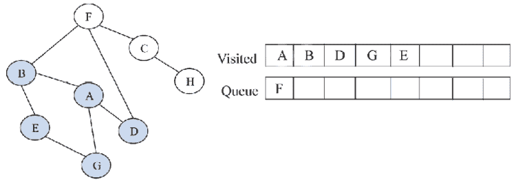

图 9.19：使用 BFS 算法访问节点 E

**F** 节点被出队，我们看到在其相邻节点中，**B**、**D** 和 **C** 中只有 **C** 节点尚未被访问。然后我们将 **C** 节点入队并添加到已访问节点列表中，如图 *9.20* 所示：

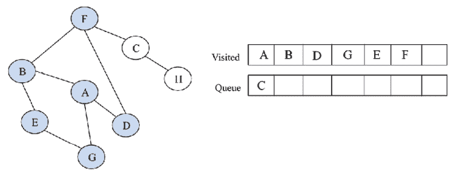

图 9.20：使用 BFS 算法访问节点 E

然后，**C** 节点被出队。**C** 节点有相邻的 **F** 和 **H** 节点，但 **F** 节点已经被访问，留下 **H** 节点。**H** 节点被入队并添加到已访问节点列表中。最后，`while` 循环的最后一次迭代将导致 **H** 节点被出队。

它唯一的相邻节点，**C**，已经被访问。一旦队列为空，循环就会中断。这如图 *9.21* 所示：

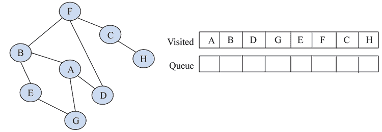

图 9.21：使用 BFS 算法访问最终节点 H

使用 BFS 算法遍历给定图的输出是 **A**、**B**、**D**、**G**、**E**、**F**、**C** 和 **H**。

当我们使用以下代码在如图 *9.16* 所示的图上运行上述 BFS 代码时：

```py
print(breadth_first_search(graph, 'A')) 
```

当我们遍历如图 *9.16* 所示的图时，我们得到以下节点序列：

```py
['A', 'B', 'D', 'G', 'E', 'F', 'C', 'H'] 
```

在最坏的情况下，每个节点和边都需要遍历，因此每个节点至少会被入队和出队一次。每次入队和出队操作所需的时间是 O(1)，所以总时间是 O(V)。此外，扫描每个顶点的邻接表所需的时间是 O(E)。因此，BFS 算法的总时间复杂度是 `O(|V| + |E|)`，其中 `|V|` 是顶点或节点的数量，而 `|E|` 是图中边的数量。

广度优先搜索（BFS）算法在构建具有最少迭代的图的最短路径遍历中非常有用。至于 BFS 的某些实际应用，它可以用来创建一个高效的网页爬虫，其中可以为搜索引擎维护多个索引级别，并且可以从源网页维护一个已关闭网页列表。BFS 还可以用于导航系统，其中可以从不同位置的图中轻松检索相邻位置。

接下来，我们将讨论另一个图遍历算法，即深度优先搜索（DFS）算法。

## 深度优先搜索

如其名所示，**深度优先搜索**（DFS）或遍历算法遍历图的方式类似于树中的`前序遍历`算法工作。在 DFS 算法中，我们在图中任何特定路径的深度遍历树。因此，在访问兄弟节点之前，先访问子节点。

在这里，我们从根节点开始；首先访问它，然后查看当前节点的所有相邻顶点。我们开始访问其中一个相邻节点。如果边通向一个已访问的节点，我们就回溯到当前节点。如果边通向一个未访问的节点，那么我们就转到那个节点并从那个节点继续处理。我们继续同样的过程，直到我们到达一个死胡同，即没有未访问的节点；在这种情况下，我们回溯到前面的节点，并在回溯过程中停止，当我们到达根节点时。

让我们通过*图 9.22*所示的图来举例说明 DFS 算法的工作原理：

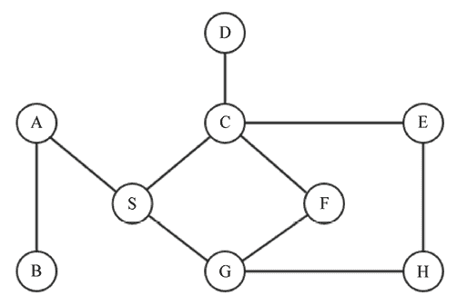

图 9.22：用于理解 DFS 算法的示例图

我们首先访问**A**节点，然后查看**A**顶点的邻居，然后是那个邻居的邻居，依此类推。在访问**A**顶点后，我们访问其一个邻居，**B**（在我们的例子中，我们按字母顺序排序；然而，任何邻居都可以添加），如*图 9.23*所示：

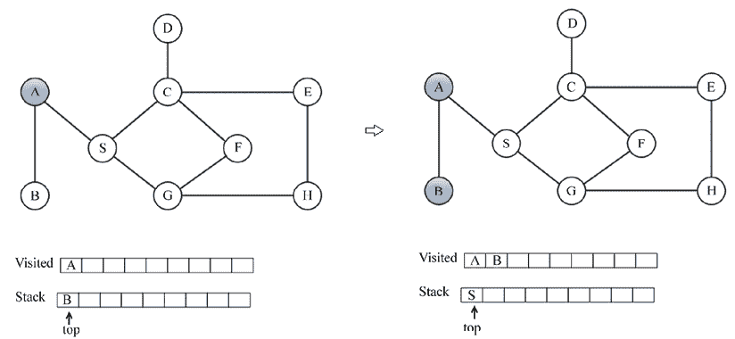

图 9.23：在深度优先遍历中访问了节点 A 和 B

访问**B**顶点后，我们查看**A**的另一个邻居，即**S**，因为没有与**B**相连的顶点可以访问。接下来，我们查找**S**顶点的邻居，即**C**和**G**顶点。我们按照*图 9.24*所示访问**C**：

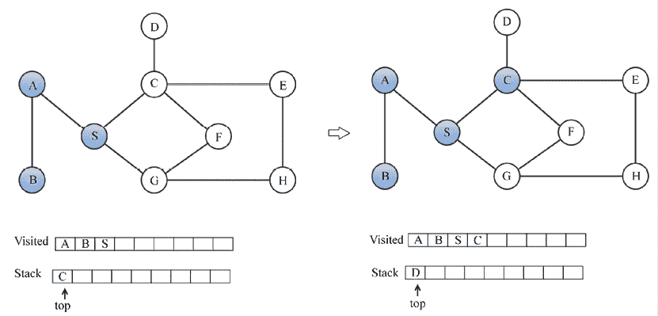

图 9.24：深度优先遍历中访问了节点 C

在访问**C**节点后，我们访问其相邻顶点**D**和**E**，如*图 9.25*所示：

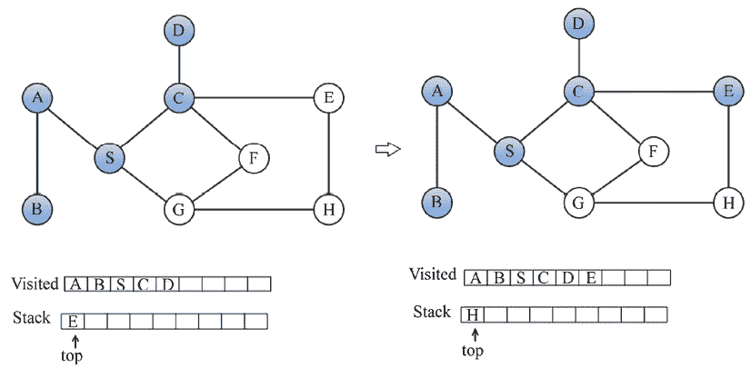

图 9.25：在深度优先遍历中访问了节点 D 和 E

同样，在访问**E**顶点后，我们访问**H**和**G**顶点，如*图 9.26*所示：

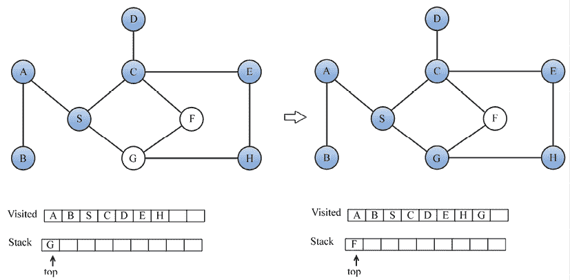

图 9.26：在深度优先遍历中访问了节点 H 和 F

最后，我们访问**F**节点，如*图 9.27*所示：

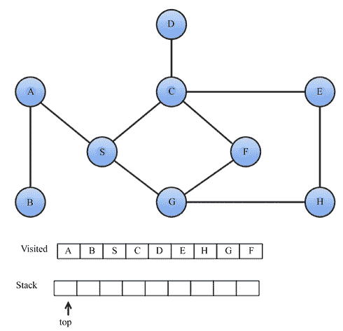

图 9.27：在深度优先遍历中访问了节点 F

DFS 遍历的输出是**A-B-S-C-D-E-H-G-F**。

要实现 DFS，我们从给定图的邻接表开始。以下是前一个图的邻接表：

```py
graph = dict()
graph['A'] = ['B', 'S']
graph['B'] = ['A']
graph['S'] = ['A','G','C']
graph['D'] = ['C']
graph['G'] = ['S','F','H']
graph['H'] = ['G','E']
graph['E'] = ['C','H']
graph['F'] = ['C','G']
graph['C'] = ['D','S','E','F'] 
```

DFS 算法的实现从创建一个用于存储已访问节点的列表开始。`graph_stack`栈变量用于辅助遍历过程。我们使用 Python 列表作为栈。

起始节点，称为`root`，与图的邻接矩阵`graph`一起传递。首先，将`root`推入栈中。`node = root`语句是为了保存栈中的第一个节点：

```py
def depth_first_search(graph, root):
    visited_vertices = list()
    graph_stack = list()
    graph_stack.append(root)
    node = root
        while graph_stack: 
            if node not in visited_vertices: 
                visited_vertices.append(node) 
            adj_nodes = graph[node] 
            if set(adj_nodes).issubset(set(visited_vertices)): 
                graph_stack.pop() 
                if len(graph_stack) > 0: 
                    node = graph_stack[-1] 
                continue 
            else: 
                remaining_elements = set(adj_nodes).difference(set(visited_vertices)) 
            first_adj_node = sorted(remaining_elements)[0] 
            graph_stack.append(first_adj_node) 
            node = first_adj_node 
        return visited_vertices 
```

当栈不为空时，将执行`while`循环的主体。如果正在考虑的`node`不在已访问节点列表中，我们将它添加进去。通过`adj_nodes = graph[node]`收集`node`的所有相邻节点。如果所有相邻节点都已访问，则从栈中弹出顶部节点，并将`node`设置为`graph_stack[-1]`。在这里，`graph_stack[-1]`是栈顶的节点。`continue`语句将跳回到`while`循环测试条件的开始。

如果不是所有相邻的节点都已被访问，那么尚未访问的节点将通过使用`remaining_elements = set(adj_nodes).difference(set(visited_vertices))`语句来找到`adj_nodes`和`visited_vertices`之间的差异来获得。

`sorted(remaining_elements)`中的第一个项目被分配给`first_adj_node`，并推入栈中。然后我们将栈顶指向此节点。

当`while`循环退出时，我们将返回`visited_vertices`。

我们现在将通过与之前的示例相关联来解释源代码的工作原理。我们选择**A**节点作为起始节点。**A**被推入栈中并添加到`visited_vertices`列表中。这样做时，我们将其标记为已访问。`graph_stack`栈使用简单的 Python 列表实现。我们的栈现在只有**A**作为其唯一元素。我们检查**A**节点的相邻节点**B**和**S**。为了测试**A**的所有相邻节点是否都已访问，我们使用`if`语句：

```py
 if set(adj_nodes).issubset(set(visited_vertices)):
        graph_stack.pop()
        if len(graph_stack) > 0:
            node = graph_stack[-1]
        continue 
```

如果所有节点都已访问，我们将弹出栈顶。如果`graph_stack`栈不为空，我们将栈顶的节点分配给`node`，并开始另一个`while`循环主体的执行。如果`set(adj_nodes).issubset(set(visited_vertices))`语句评估为`True`，则表示`adj_nodes`中的所有节点都是`visited_vertices`的子集。如果`if`语句失败，则意味着还有一些节点尚未访问。我们使用`remaining_elements = set(adj_nodes).difference(set(visited_vertices))`来获取该节点列表。

参考图示，**B**和**S**节点将被存储在`remaining_elements`中。我们将按字母顺序访问该列表，如下所示：

```py
 first_adj_node = sorted(remaining_elements)[0]
    graph_stack.append(first_adj_node)
    node = first_adj_node 
```

我们对`remaining_elements`进行排序，并将第一个节点返回给`first_adj_node`。这将返回**B**。我们将**B**节点推入栈中，通过将其附加到`graph_stack`。我们通过将其分配给`node`来准备**B**节点以便访问。

在 `while` 循环的下一迭代中，我们将 **B** 节点添加到 `已访问节点` 列表中。我们发现 **B** 的唯一相邻节点是 **A**，它已经被访问过。因为 **B** 的所有相邻节点都已访问过，所以我们将其从栈中弹出，留下 **A** 作为栈上的唯一元素。我们回到 **A** 并检查其所有相邻节点是否都已访问过。现在 **A** 节点唯一的未访问节点是 **S**。我们将 **S** 推入栈中，并再次开始整个过程。

遍历的输出结果是 `A-B-S-C-D-E-H-G-F`。

当我们使用邻接表表示图时，DFS 的时间复杂度是 O(V+E)，当我们使用邻接矩阵表示图时，DFS 的时间复杂度是 O(V²)。使用邻接表进行 DFS 的时间复杂度较低，因为获取相邻节点更容易，而使用邻接矩阵则效率不高。

深度优先搜索（DFS）可以应用于解决迷宫问题、寻找连通分量、图中检测循环以及寻找图的桥等用例。

我们已经讨论了非常重要的图遍历算法；现在让我们讨论一些更有用的与图相关的算法，用于从给定的图中找到生成树。生成树在解决旅行商问题等几个现实世界问题中非常有用。

# 其他有用的图方法

我们经常需要使用图来在两个节点之间找到路径。有时，我们需要找到节点之间的所有路径，在某些情况下，我们可能需要找到节点之间的最短路径。例如，在路由应用中，我们通常使用各种算法来确定从源节点到目标节点的最短路径。对于无权图，我们只需确定它们之间边数最少的路径。如果给定的是加权图，我们必须计算通过一组边的总权重。

因此，在不同的情境下，我们可能需要使用不同的算法来找到最长或最短路径，例如最小生成树（**Minimum Spanning Tree**），我们将在下一节中探讨。

## 最小生成树

**最小生成树**（**MST**）是连接图的所有节点的边权图的有向图边的子集，具有最低可能的总边权重且没有环。更正式地说，给定一个连通图 G，其中 G = (V, E)具有实值边权重，一个 MST 是一个子图，它包含边的一个子集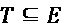，使得边权重的总和最小且没有环。有许多可能的生成树可以连接图的所有节点而不形成任何环，但最小权重生成树是所有其他可能生成树中具有最低总边权重（也称为成本）的生成树。一个示例图如图*图 9.28*所示，以及其对应的 MST（在右侧），我们可以观察到所有节点都是连接的，并且从原始图（在左侧）中选取了边的子集。

最小生成树（MST）具有所有边中最低的总权重，即（1+4+2+4+5=16），在所有其他可能的生成树中：

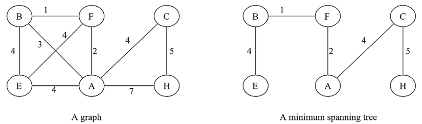

图 9.28：一个带有对应最小生成树的示例图

最小生成树在现实世界中有着多样的应用。它们主要用于网络设计，如道路拥堵、液压电缆、电力电缆网络，甚至聚类分析。

首先，让我们讨论 Kruskal 的最小生成树算法。

## Kruskal 的最小生成树算法

Kruskal 算法是寻找给定加权、连通和无向图的生成树的广泛使用算法。它基于贪婪方法，因为我们首先找到权重最低的边并将其添加到树中，然后在每次迭代中，我们添加权重最低的边到生成树中，以避免形成环。在这个算法中，最初，我们将图的所有顶点视为一个单独的树，然后在每次迭代中，我们选择权重最低的边，这样它就不会形成环。这些单独的树被组合起来，并逐渐形成一个生成树。我们重复这个过程，直到所有节点都被处理。算法的工作原理如下：

1.  初始化一个空的 MST（M）带有零条边

1.  按照边的权重对所有边进行排序

1.  对于排序列表中的每条边，我们依次将它们添加到 MST（M）中，这样它就不会形成环

让我们考虑一个例子。

我们首先选择权重最低的边（权重 1），如图*图 9.29*中所示：

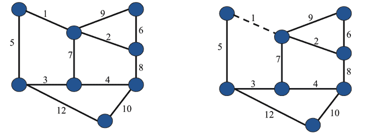

图 9.29：在生成树中选择权重最低的第一条边

在选择权重为 1 的边之后，我们选择权重为 2 的边，然后是权重为 3 的边，因为这些是下一个最低的权重，如图*图 9.30*所示：

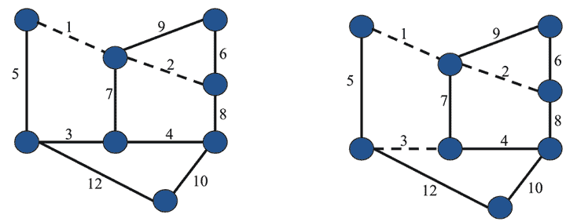

图 9.30：在生成树中选择权重为 2 和 3 的边

同样，我们选择权重为 4 和 5 的下一个边，如图*图 9.31*所示：

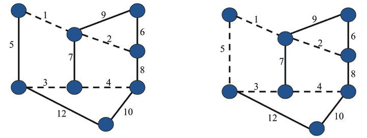

图 9.31：在生成树中选择权重为 4 和 5 的边

接下来，我们选择下一个权重为 6 的边，并将其变为虚线。之后，我们发现最低权重是 7，但如果选择它，则会形成一个环，所以我们忽略它。接下来，我们检查权重为 8 的边，然后是 9，这些也被忽略，因为它们也会形成环。因此，下一个最低权重的边，10，被选中。这如图 *9.32* 所示：

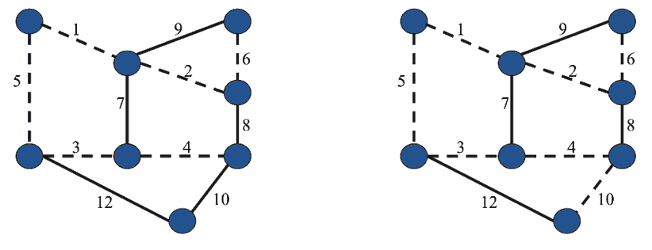

图 9.32：在生成树中选择权重为 6 和 10 的边

最后，我们使用 Kruskal 算法看到以下生成树，如图 *9.33* 所示：

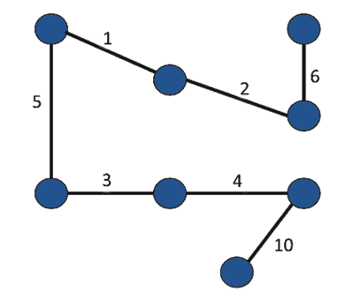

图 9.33：使用 Kruskal 算法创建的最终生成树

Kruskal 算法有许多实际应用，例如解决旅行商问题（TSP），在这个问题中，从一座城市出发，我们必须以最低的总成本访问网络中的所有不同城市，并且不能重复访问同一城市。还有许多其他应用，例如电视网络、旅游运营、局域网和电网。

Kruskal 算法的时间复杂度为 O(E log(E)) 或 O(E log(V))，其中 E 是边的数量，V 是顶点的数量。

现在，让我们在下一节讨论另一个流行的 MST 算法。

## Prim 最小生成树算法

Prim 算法也是基于贪婪算法来寻找最小生成树。Prim 算法在寻找图中最短路径方面与 Dijkstra 算法非常相似。在这个算法中，我们从任意节点作为起点，然后检查所选节点的出度边，并通过具有最低成本（或权重）的边进行遍历。在这个算法中，成本和权重是可互换的。因此，从所选节点开始，我们通过选择权重最低且不形成环的边来逐个扩展树。算法的工作原理如下：

1.  创建一个包含所有边及其权重的字典

1.  从字典中逐个获取具有最低成本的边，并按这种方式扩展树，以确保不形成环

1.  重复执行步骤 2，直到访问所有顶点

让我们通过一个例子来了解 Prim 算法的工作原理。假设我们任意选择 **A** 节点，然后检查从 **A** 出发的所有出度边。在这里，我们有两种选择，**AB** 和 **AC**；我们选择边 **AC**，因为它具有更低的成本/权重（权重 1），如图 *9.34* 所示：

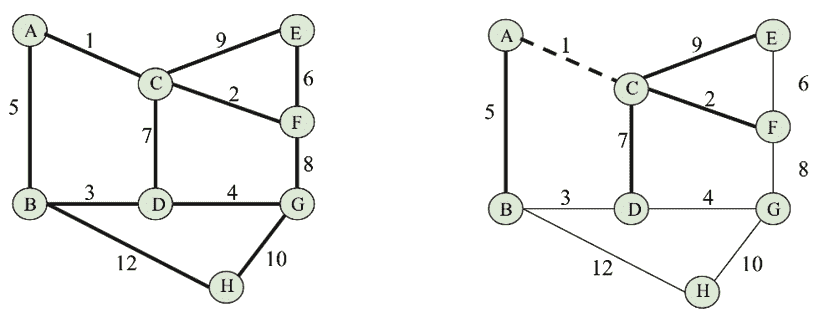

图 9.34：使用 Prim 算法构建生成树时选择边 AC

接下来，我们从边 **AC** 检查最低出度边。我们有选项 **AB**、**CD**、**CE**、**CF**，其中我们选择边 **CF**，其权重最低，为 2。同样，我们扩展树，接下来我们选择下一个最低权重的边，即 **AB**，如图 *9.35* 所示：

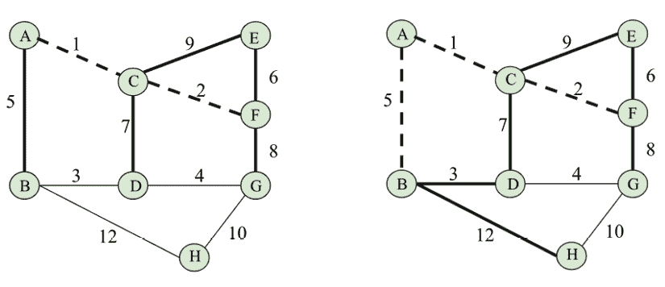

图 9.35：在构造生成树时选择边 AB 使用普里姆算法

之后，我们选择边**BD**，其权重为 3，同样地，接下来我们选择边**DG**，其权重为最低的 4。这如图*图 9.36*所示：

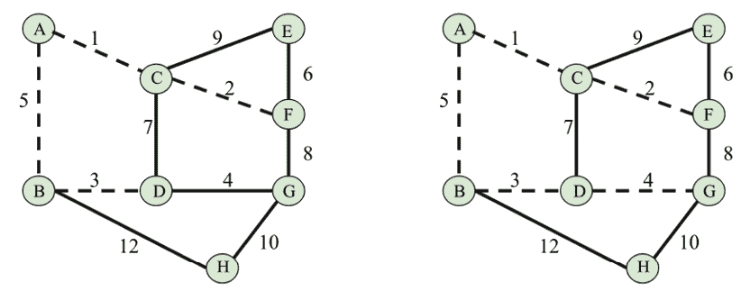

图 9.36：在构造生成树时选择边 BD 和 DG 使用 Prim 算法

接下来，我们选择边**FE**和**GH**，分别具有 6 和 10 的权重，如图*图 9.37*所示：

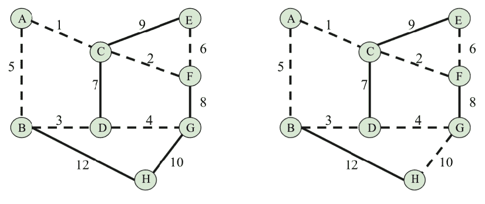

图 9.37：在构造生成树时选择边 FE 和 GH 使用 Prim 算法

接下来，每次我们尝试添加更多边时，都会形成一个环，所以我们忽略这些边。最后，我们得到生成树，如下所示在*图 9.38*中：

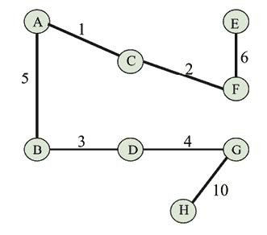

图 9.38：使用普里姆算法得到的最终生成树

普里姆算法也有许多现实世界的应用。对于我们可以使用克鲁斯卡尔算法的所有应用，我们也可以使用普里姆算法。其他应用包括道路网络、游戏开发等。

由于克鲁斯卡尔和普里姆的最小生成树算法都用于相同的目的，我们应该使用哪一个？一般来说，这取决于图的结构。对于一个有**C**个顶点和**E**条边的图，克鲁斯卡尔算法的最坏情况时间复杂度是 O(E logV)，而普里姆算法的时间复杂度是 O(E + V logV)。因此，我们可以观察到，当图是稠密图时，普里姆算法表现更好，而当图是稀疏图时，克鲁斯卡尔算法表现更好。

# 概述

图是一种非线性数据结构，由于它在现实世界中有大量的应用，因此非常重要。在本章中，我们讨论了在 Python 中使用列表和字典表示图的不同方法。此外，我们还学习了两个非常重要的图遍历算法，即深度优先搜索（DFS）和广度优先搜索（BFS）。此外，我们还讨论了寻找最小生成树（MST）的两个非常重要的算法，即克鲁斯卡尔算法和普里姆算法。

在下一章中，我们将讨论搜索算法以及我们如何有效地在列表中搜索项的各种方法。

# 练习

1.  在一个有五个节点的无向简单图中，可能的最大边数（不包括自环）是多少？

1.  我们称所有节点度数都相等的图为什么？

1.  解释什么是割点，并识别给定图中的割点：

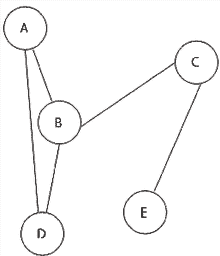

图 9.39：一个示例图

1.  假设一个阶数为 n 的图 G，图 G 中可能的最大割点数是多少？

# 加入我们的 Discord 社区

加入我们的社区 Discord 空间，与作者和其他读者进行讨论：[`packt.link/MEvK4`](https://packt.link/MEvK4)


