# 10

# 搜索

对于所有数据结构来说，搜索集合中的元素是一个重要操作。在数据结构中搜索元素有多种方法；在本章中，我们将探讨可以用于在项目集合中查找元素的不同策略。

数据元素可以存储在任何类型的数据结构中，例如数组、链表、树或图；搜索操作对于许多应用非常重要，尤其是在我们想要知道特定数据元素是否存在于现有数据项列表中时。为了有效地检索信息，我们需要一个高效的搜索算法。

在本章中，我们将学习以下内容：

+   各种搜索算法

+   线性搜索算法

+   跳跃搜索算法

+   二分搜索算法

+   插值搜索算法

+   指数搜索算法

让我们先从搜索的介绍和定义开始，然后看看线性搜索算法。

# 搜索简介

搜索操作是为了从数据项集合中找到所需数据项的位置。搜索算法返回搜索值在项目列表中的位置，如果数据项不存在，则返回 `None`。

高效搜索对于从存储的数据项列表中高效检索所需数据项的位置非常重要。例如，我们有一个长列表的数据值，例如 `{1, 45, 65, 23, 65, 75, 23}`，我们想知道 `75` 是否在列表中。当数据项列表变得很大时，拥有一个高效的搜索算法变得很重要。

数据可以以两种不同的方式组织，这可能会影响搜索算法的工作方式：

+   首先，搜索算法应用于已排序的项目列表；也就是说，它应用于有序的项目集合。例如，`[1, 3, 5, 7, 9, 11, 13, 15, 17]`。

+   搜索算法应用于未排序的项目集合，即未排序的集合。例如，`[11, 3, 45, 76, 99, 11, 13, 35, 37]`。

我们首先将看看线性搜索。

# 线性搜索

搜索操作用于找出给定数据项在数据项列表中的索引位置。如果搜索的项在给定的数据项列表中可用，则搜索算法返回其所在位置的索引位置；否则，它返回该项未找到。在这里，索引位置是所需项目在给定列表中的位置。

在列表中搜索一个项目的最简单方法是进行线性搜索，其中我们逐个在整个列表中查找项目。让我们以六个列表项 `{60, 1, 88, 10, 11, 100}` 为例，来理解线性搜索算法，如图 *图 10.1* 所示：

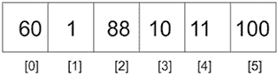

图 10.1：线性搜索的示例

前面的列表具有可以通过索引访问的元素。要找到列表中的元素，我们可以逐个线性地搜索给定的元素。这种技术通过使用索引从列表的开始移动到末尾来遍历元素列表。每个元素都会进行检查，如果它不匹配搜索项，则检查下一个项。通过从一个项目跳到下一个项目，列表被顺序遍历。在本章中，我们使用具有整数值的列表项来帮助您理解这个概念，因为整数可以很容易地进行比较；然而，列表项也可以持有任何其他数据类型。

线性搜索方法依赖于列表项在内存中的存储方式——它们是否已经按顺序排序，或者它们是否未排序。让我们首先看看如果给定的项目列表未排序，线性搜索算法是如何工作的。

## 无序线性搜索

无序线性搜索是一种线性搜索算法，其中给定的日期项目列表未排序。我们逐个将所需数据项与列表中的数据项进行线性匹配，直到列表末尾或找到所需数据项。考虑一个包含元素 `60`、`1`、`88`、`10` 和 `100` 的示例列表——一个无序列表。要对这样的列表执行 `搜索` 操作，从第一个项目开始，将其与搜索项进行比较。如果搜索项不匹配，则检查列表中的下一个元素。这个过程一直持续到我们到达列表的最后一个元素或找到匹配项。

在无序列表中，对术语 `10` 的搜索从第一个元素开始，并移动到列表中的下一个元素。因此，首先将 `60` 与 `10` 进行比较，由于它们不相等，我们将 `66` 与下一个元素 `1` 进行比较，然后是 `88`，依此类推，直到我们在列表中找到搜索项。一旦找到项目，我们就返回找到所需项的索引位置。这个过程在 *图 10.2* 中显示：

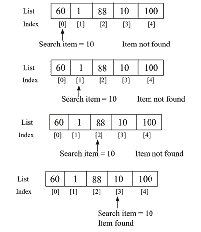

图 10.2：无序线性搜索

下面是使用 Python 对无序列表中的项目进行线性搜索的实现：

```py
def search(unordered_list, term):
    for i, item in enumerate(unordered_list):
        if term == unordered_list[i]:
            return i
    return None 
```

`search` 函数接受两个参数；第一个是包含数据的列表，第二个参数是我们正在寻找的项目，称为 **搜索项**。在 `for` 循环的每次迭代中，我们检查搜索项是否等于索引项。如果是这样，那么就找到了匹配项，无需进一步进行搜索。我们返回在列表中找到搜索项的索引位置。如果循环运行到列表末尾而没有找到匹配项，则返回 `None` 以表示列表中没有这样的项。

我们可以使用以下代码片段来检查所需的数据元素是否存在于给定的数据项列表中：

```py
list1 = [60, 1, 88, 10, 11, 600]

search_term = 10
index_position = search(list1, search_term) 
print(index_position)
list2 = ['packt', 'publish', 'data']
search_term2 = 'data'
Index_position2 = search(list2, search_term2)
print(Index_position2) 
```

上述代码的输出如下：

```py
3
2 
```

在上述代码的输出中，首先，当我们在`list1`中搜索数据元素`10`时，返回索引位置`3`。其次，当在`list2`中搜索数据项`'data'`时，返回索引位置`2`。由于 Python 中的字符串元素可以像数字数据一样进行比较，因此我们可以使用相同的算法在 Python 中从非数字数据项的列表中搜索非数字数据项。

在从无序列表中搜索任何元素时，在最坏的情况下，所需元素可能位于列表的最后一个位置，或者根本不在列表中。在这种情况下，我们必须将搜索项与列表中的所有元素进行比较，即如果列表中的数据项总数为`n`，则需要比较`n`次。因此，无序线性搜索的最坏情况运行时间为`O(n)`。在找到搜索项之前可能需要访问所有元素。最坏的情况是搜索项位于列表的最后一个位置。

接下来，我们讨论如果给定的数据项列表已经排序，线性搜索算法是如何工作的。

## 有序线性搜索

如果数据元素已经按顺序排列，则可以改进线性搜索算法。在已排序的元素列表中的线性搜索算法有以下步骤：

1.  顺序遍历列表

1.  如果搜索项的值大于循环中当前检查的对象或项，则退出并返回`None`

在遍历列表的过程中，如果搜索项的值小于列表中的当前项，则无需继续搜索。让我们通过一个例子来看看这是如何工作的。假设我们有一个如*图 10.3*所示的元素列表`{2, 3, 4, 6, 7}`，我们想要搜索项`5`：

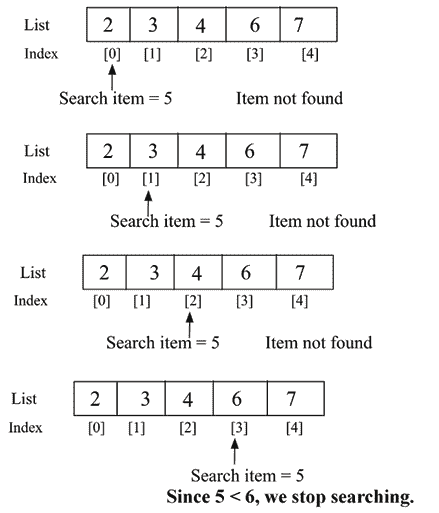

图 10.3：有序线性搜索的示例

我们通过将期望的搜索元素`5`与第一个元素进行比较来开始`search`操作；没有找到匹配项。我们继续将搜索元素与列表中的下一个元素，即`3`进行比较。由于它也不匹配，我们继续检查下一个元素，即`4`，由于它也不匹配，我们继续在列表中搜索，并将搜索元素与第四个元素，即`6`进行比较。这也不匹配搜索项。由于给定的列表已经按升序排序，且搜索项的值小于第四个元素，因此搜索项不可能在列表的任何后续位置找到。换句话说，如果列表中的当前项大于搜索项，那么这意味着无需进一步搜索列表，我们停止在列表中搜索该元素。

这里是当列表已经排序时线性搜索的实现：

```py
def search_ordered(ordered_list, term):
     ordered_list_size = len(ordered_list)
     for i in range(ordered_list_size):
          if term == ordered_list[i]:
              return i
          elif ordered_list[i] > term:
              return None
     return None 
```

在前面的代码中，现在的`if`语句用于检查搜索项是否在列表中。然后，`elif`测试`ordered_list[i] > term`的条件。如果比较结果为`True`，则停止搜索，这意味着列表中的当前项大于搜索元素。方法中的最后一行返回`None`，因为循环可能遍历整个列表，但搜索项仍然没有在列表中匹配。

我们使用以下代码片段来使用搜索算法：

```py
list1 = [2, 3, 4, 6, 7]

search_term = 5
index_position1 = search_ordered(list1, search_term)

if index_position1 is None:
    print("{} not found".format(search_term))
else:
    print("{} found at position {}".format(search_term, index_position1))

list2 = ['book','data','packt', 'structure']

search_term2 = 'structure'
index_position2 = search_ordered(list2, search_term2)
if index_position2 is None:
    print("{} not found".format(search_term2))
else:
    print("{} found at position {}".format(search_term2, index_position2)) 
```

上述代码的输出如下：

```py
5 not found
structure found at position 3 
```

在上述代码的输出中，首先，搜索项`5`在给定的列表中没有匹配。对于第二组非数值数据元素，字符串结构在索引位置`3`处匹配。因此，我们可以使用相同的线性搜索算法从有序数据项列表中搜索非数值数据项，所以给定的数据项列表应该与电话簿上的联系人列表类似地排序。

在最坏的情况下，所需的搜索项将位于列表的最后一个位置或根本不存在。在这种情况下，我们必须遍历整个列表（例如`n`个元素）。因此，有序线性搜索的最坏情况时间复杂度为`O(n)`。

接下来，我们将讨论跳跃搜索算法。

# 跳跃搜索

**跳跃搜索**算法是线性搜索在有序（或排序）列表中搜索给定元素的一种改进。它使用分而治之的策略来搜索所需元素。在线性搜索中，我们比较搜索值与列表中的每个元素，而在跳跃搜索中，我们在列表的不同间隔处比较搜索值，这减少了比较的次数。

在这个算法中，首先，我们将排序后的数据列表分成数据元素子集，称为块。由于数组已排序，每个块中的最高值将位于最后一个元素。接下来，在这个算法中，我们开始将搜索值与每个块的最后一个元素进行比较。可能有三种情况：

1.  如果搜索值小于块的最后一个元素，我们将其与下一个块进行比较。

1.  如果搜索值大于块的最后一个元素，这意味着所需的搜索值必须存在于当前块中。因此，我们在该块中应用线性搜索并返回索引位置。

1.  如果搜索值与块的比较元素相同，我们返回元素的索引位置并返回候选者。

通常，块的大小取为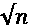，因为它为给定长度为`n`的数组提供了最佳性能。

在最坏的情况下，如果最后一个块的最后一个元素大于要搜索的元素，我们将不得不进行 *n/m* 次跳跃（这里，`n` 是元素总数，*m* 是块大小），并且我们需要对最后一个块进行 *m* - 1 次线性搜索。因此，总的比较次数将是 ((*n/m*) + *m* - 1)，当 *m* = *√n* 时将最小化。所以块的大小取为 *√n*，因为它提供了最佳性能。

以下是一个示例列表 `{1, 2, 3, 4, 5, 6, 7, 8, 9, 10, 11}`，用于搜索给定的元素（例如 `10`）：

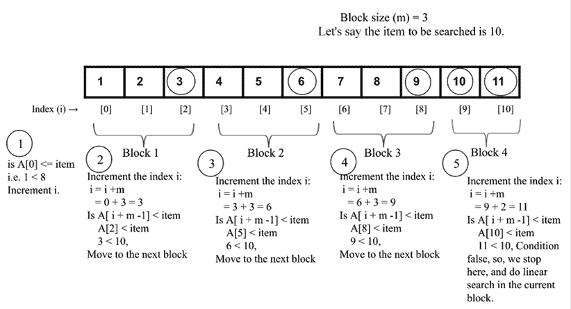

图 10.4：跳跃搜索算法的说明

在上述示例中，我们在 `5` 次比较中找到了所需的元素 `10`。首先，我们将数组的第一个值与所需的项 `A[0] <= item` 进行比较；如果是真的，则增加索引以块大小（这在 *Figure 10.4* 中的 *步骤 1* 中显示）。接下来，我们将所需的项与每个块的最后一个元素进行比较。如果它更大，则我们移动到下一个块，例如从块 1 到块 3（这在 *Figure 10.4* 中的 *步骤 2*、*3* 和 *4* 中显示）。

此外，当所需的搜索元素小于一个块的最后元素时，我们停止增加索引位置，然后在当前块中进行线性搜索。现在，让我们讨论跳跃搜索算法的实现。首先，我们实现线性搜索算法，这与我们在上一节中讨论的内容类似。

这里再次给出，以完整起见如下：

```py
def search_ordered(ordered_list, term):
    print("Entering Linear Search")
    ordered_list_size = len(ordered_list)
    for i in range(ordered_list_size):
        if term == ordered_list[i]:
            return i
        elif ordered_list[i] > term:
            return -1
    return -1 
```

在上述代码中，给定一个有序元素列表，它返回给定数据元素在列表中找到的位置的索引。如果所需的元素在列表中未找到，则返回 `-1`。接下来，我们按照以下方式实现 `jump_search()` 方法：

```py
def jump_search(ordered_list, item):
    import math
    print("Entering Jump Search")
    list_size = len(ordered_list)
    block_size = int(math.sqrt(list_size))
    i = 0
    while i != len(ordered_list)-1 and ordered_list[i] <= item: 
        print("Block under consideration - {}".format(ordered_list[i: i+block_size]))
        if i+ block_size > len(ordered_list):
            block_size =  len(ordered_list) - i
            block_list = ordered_list[i: i+block_size]
            j = search_ordered(block_list, item)
            if j == -1:
                print("Element not found")
                return
            return i + j
        if ordered_list[i + block_size -1] == item: 
            return i+block_size-1
        elif ordered_list[i + block_size - 1] > item: 
            block_array = ordered_list[i: i + block_size - 1]
            j = search_ordered(block_array, item)
            if j == -1:
                print("Element not found")
                return
            return i + j
        i += block_size 
```

在上述代码中，首先我们将列表的长度赋值给变量 `n`，然后计算块大小为 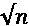。接下来，我们从第一个元素，索引 0 开始，然后继续搜索直到我们到达列表的末尾。

我们从起始索引 `i = 0` 和大小为 *m* 的块开始，然后继续增加直到窗口到达列表的末尾。我们比较 `ordered_list [I + block_size -1] == item`。如果它们匹配，则返回索引位置 `(i+ block_size -1)`。此代码片段如下：

```py
 if ordered_list[i+ block_size -1] == item:           
            return i+ block_size -1 
```

如果 `ordered_list [i+ block_size -1] > item`，我们将在当前块 `block_array = ordered_list [i : i+ block_size-1]` 内执行线性搜索算法，如下所示：

```py
 elif ordered_list[i+ block_size -1] > item:           
            block_array = ordered_list[i: i+ block_size -1]
            j = search_ordered(block_array, item) 
            if j == -1:
                print("Element not found")
                return   
            return i + j 
```

在上面的代码中，我们在子数组中使用线性搜索算法。如果列表中找不到所需元素，则返回`-1`；否则，返回`(i + j)`的索引位置。在这里，`i`是可能找到所需元素的最后一个块的索引位置，`j`是块内匹配所需元素的数据元素的索引位置。这个过程也在*图 10.5*中展示。

在这个图中，我们可以看到`i`位于索引位置 5，然后`j`是我们找到所需元素（即`2`）的最后一个块中的元素数量，所以最终返回的索引将是`5 + 2 = 7`：

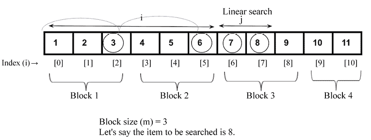

图 10.5：搜索值 8 的索引位置 i 和 j 的演示

此外，我们需要检查最后一个块的长度，因为它可能包含的元素数量少于块大小。例如，如果元素总数是 11，那么在最后一个块中我们将有 2 个元素。因此，我们检查所需搜索元素是否在最后一个块中，如果是的话，我们应该更新起始和结束索引如下：

```py
 if i+ block_size > len(ordered_list):
            block_size =  len(ordered_list) - i
            block_list = ordered_list[i: i+block_size]
            j = search_ordered(block_list, item)
            if j == -1:
                print("Element not found")
                return
            return i + j 
```

在上面的代码中，我们使用线性搜索算法搜索所需元素。

最后，如果`ordered_list[i+m-1] < item`，则我们进入下一次迭代，并通过将块大小添加到索引来更新索引`i += block_size`。

```py
print(jump_search([1,2,3,4,5,6,7,8,9, 10, 11], 8)) 
```

上面的代码片段的输出是：

```py
Entering Jump Search
Block under consideration - [1, 2, 3]
Block under consideration - [4, 5, 6]
Block under consideration - [7, 8, 9]
Entering Linear Search
7 
```

在上面的输出中，我们可以看到我们如何在给定的元素列表中搜索元素`10`的步骤。

因此，跳跃搜索在块上执行线性搜索，所以它首先找到包含元素的块，然后在那个块内应用线性搜索。块的大小取决于数组的大小。如果数组的大小是`n`，那么块的大小可能是。如果在该块中找不到元素，它将移动到下一个块。跳跃搜索首先找出所需元素可能存在的块。对于一个包含`n`个元素的列表，以及一个块大小为*m*，可能的跳跃总数将是*n/m*次跳跃。假设块的大小是；因此，最坏情况下的时间复杂度将是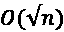。

接下来，我们将讨论二分查找算法。

# 二分查找

**二分查找**算法从给定的排序列表中查找给定项。这是一个快速且高效的搜索元素算法；然而，这个算法的一个缺点是我们需要一个排序的列表。二分查找算法的最坏情况运行时间复杂度是`O(logn)`，而线性搜索是`O(n)`。

二分查找算法的工作原理如下。它通过将给定的列表分成一半来开始搜索项目。如果搜索项目小于中间值，它将只在列表的前半部分查找搜索项目，如果搜索项目大于中间值，它将只查看列表的后半部分。我们重复这个过程，直到找到搜索项目，或者我们检查了整个列表。在非数值数据项的列表的情况下，例如，如果我们有字符串数据项，那么我们应该按字母顺序对数据项进行排序（类似于手机上存储的联系人列表）。

让我们通过一个例子来理解二分查找算法。假设我们有一本有 1000 页的书，我们想要到达第 250 页。我们知道每本书的页面都是按顺序从`1`向上编号的。因此，根据二分查找的类比，我们首先检查搜索项目 250，它小于中间点 500。因此，我们只在书的前半部分搜索所需的页面。

我们再次找到这本书前半部分的中间点，以第 500 页为参考，我们找到中间点，即 250 页。这使我们更接近找到第 250 页。然后我们在书中找到所需的页面。

让我们再举一个例子来理解二分查找的工作原理。我们想要在一个包含 12 个项目的列表中搜索项目`43`，如图*图 10.6*所示：

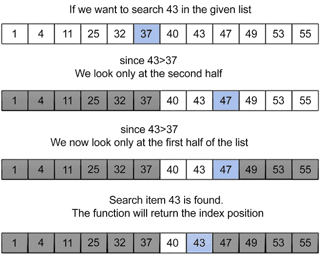

图 10.6：二分查找的工作原理

我们通过将项目与列表的中间项目进行比较来开始搜索，在例子中是`37`。如果搜索项目的值小于中间值，我们只查看列表的前半部分；否则，我们将查看另一半。因此，我们只需要在列表的后半部分搜索该项目。我们遵循相同的程序，直到在列表中找到搜索项目`43`。这个过程如图*图 10.6*所示。

以下是在有序项目列表上实现二分查找算法的示例：

```py
def binary_search_iterative(ordered_list, term):
    size_of_list = len(ordered_list) – 1
    index_of_first_element = 0
    index_of_last_element = size_of_list
    while index_of_first_element <= index_of_last_element:
        mid_point = (index_of_first_element + index_of_last_element)/2
        if ordered_list[mid_point] == term:
            return mid_point
        if term > ordered_list[mid_point]:
            index_of_first_element = mid_point + 1
        else:
            index_of_last_element = mid_point – 1
    if index_of_first_element > index_of_last_element:
        return None 
```

我们将使用一个排序元素列表`{10, 30, 100, 120, 500}`来解释上述代码。现在假设我们必须在*图 10.7*中显示的列表中找到项目`10`的位置：

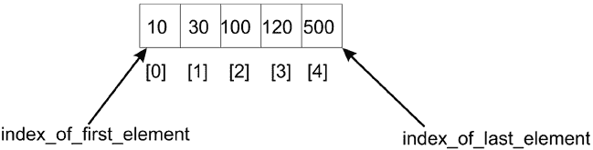

图 10.7：五个项目的示例列表

首先，我们声明两个变量，即`index_of_first_element`和`index_of_last_element`，它们表示给定列表中的起始和结束索引位置。然后，算法使用`while`循环来迭代调整列表中的限制，在这些限制内我们要找到搜索项目。停止`while`循环的终止条件是起始索引`index_of_first_element`和`index_of_last_element`索引之间的差值应该是正数。

算法首先通过将第一个元素的索引（即本例中的`0`）与最后一个元素的索引（在这个例子中是`4`）相加，然后除以`2`来找到列表的中间点。我们得到中间索引，`mid_point`：

```py
mid_point = (index_of_first_element + index_of_last_element)/2 
```

在这种情况下，中间索引是`2`，存储在此位置的的数据项是`100`。我们比较中间元素与搜索项`10`。

由于这些不匹配，并且搜索项`10`小于中间点，所以所需的搜索项应该位于列表的前半部分，因此，我们将`index_of_first_element`的索引范围调整为`mid_point-1`，这意味着新的搜索范围变为`0`到`1`，如图*10.8*所示：

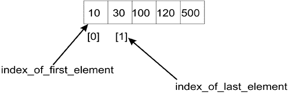

图 10.8：列表前半部分第一个和最后一个元素索引

然而，如果我们正在搜索`120`，因为`120`将大于中间值（`100`），我们将搜索列表的第二部分，因此，我们需要将列表索引范围更改为`mid_point +1`到`index_of_last_element`。在这种情况下，新的范围将是`(3, 4)`。

因此，使用新的第一个和最后一个元素的索引，即`index_of_first_element`和`index_of_last_element`，现在分别是`0`和`1`，我们计算中间点`(0 + 1)/2`，等于`0`。新的中间点是`0`，因此我们找到中间项并将其与搜索项比较，得到值`10`。现在，我们的搜索项已找到，并返回索引位置。

最后，我们检查`index_of_first_element`是否小于`index_of_last_element`。如果这个条件不成立，这意味着搜索词不在列表中。

我们可以使用下面的代码片段来搜索给定列表中的术语/项：

```py
list1 = [10, 30, 100, 120, 500]

search_term = 10
index_position1 = binary_search_iterative(list1, search_term)
if index_position1 is None:
    print("The data item {} is not found".format(search_term))
else:
    print("The data item {} is found at position {}".format(search_term, index_position1))

list2 = ['book','data','packt', 'structure']

search_term2 = 'structure'
index_position2 = binary_search_iterative(list2, search_term2)
if index_position2 is None:
    print("The data item {} is not found".format(search_term2))
else:
    print("The data item {} is found at position {}".format(search_term2, index_position2)) 
```

上述代码的输出如下：

```py
The data item 10 is found at position 0
The data item structure is found at position 3 
```

在上述代码中，首先我们在列表中检查搜索词`10`，并得到正确的位置，即索引位置`0`。进一步，我们检查给定排序数据项列表中字符串结构的索引位置，并得到索引位置`3`。

我们所讨论的实现是基于迭代过程的。然而，我们也可以使用递归方法来实现它，在这种方法中，我们递归地移动指向搜索列表开始（或起始）和结束的指针。以下是一个递归实现二分搜索算法的示例代码：

```py
def binary_search_recursive(ordered_list, first_element_index, last_element_index, term):
    if (last_element_index < first_element_index):
        return None
    else:
        mid_point = first_element_index + ((last_element_index - first_element_index) // 2)
        if ordered_list[mid_point] > term:
            return binary_search_recursive (ordered_list, first_element_index, mid_point-1, term)
        elif ordered_list[mid_point] < term:
            return binary_search_recursive (ordered_list, mid_point+1, last_element_index, term)
        else:
            return mid_point 
```

对二分搜索算法的这种递归实现的调用及其输出如下：

```py
list1 = [10, 30, 100, 120, 500]

search_term = 10
index_position1 =  binary_search_recursive(list1, 0, len(list1)-1, search_term)
if index_position1 is None:
    print("The data item {} is not found".format(search_term))
else:
    print("The data item {} is found at position {}".format(search_term, index_position1))

list2 = ['book','data','packt',  'structure']

search_term2 = 'data'
index_position2 = binary_search_recursive(list2, 0, len(list1)-1, search_term2)
if index_position2 is None:
    print("The data item {} is not found".format(search_term2))
else:
    print("The data item {} is found at position {}".format(search_term2, index_position2)) 
```

上述代码的输出如下：

```py
The data item 10 is found at position 0
The data item data is found at position 1 
```

在这里，递归二分搜索和迭代二分搜索之间的唯一区别是函数定义以及`mid_point`的计算方式。在`((last_element_index - first_element_index)//2)`操作之后对`mid_point`的计算必须将结果加到`first_element_index`上。这样，我们定义了尝试搜索的列表部分。

在二分搜索中，我们反复将搜索空间（即可能包含所需项目的列表）分成两半。我们从完整的列表开始，并在每次迭代中计算中间点；我们只考虑列表的一半来搜索项目，而另一半列表被忽略。我们反复检查，直到找到值或区间为空。因此，在每次迭代中，数组的大小减半；例如，在迭代 1 中，列表的大小是`n`，在迭代 2 中，列表的大小变为 n/2，在迭代 3 中，列表的大小变为 n/2²，经过*k*次迭代后，列表的大小变为 n/2^k。那时列表的大小将等于`1`。这意味着：

```py
=>  n/2^k = 1 
```

对等式两边应用`log`函数：

```py
=> log2 = log2
=> log2 = k log2
=> k = log2 
```

因此，二分搜索算法的最坏情况时间复杂度为`O(log n)`。

接下来，我们将讨论插值搜索算法。

# 插值搜索

二分搜索算法是一种高效的搜索算法。它总是通过根据搜索项的值丢弃搜索空间的一半来减半搜索空间。如果搜索项小于列表中间的值，则从搜索空间中丢弃列表的后半部分。在二分搜索的情况下，我们总是通过一个固定值的一半来减少搜索空间，而插值搜索算法是二分搜索算法的改进版本，其中我们使用一种更有效的方法，在每次迭代后使搜索空间减少超过一半。

当排序列表中有均匀分布的元素时，插值搜索算法工作得非常有效。在二分搜索中，我们总是从列表的中间开始搜索，而在插值搜索中，我们根据要搜索的项目计算起始搜索位置。在插值搜索算法中，起始搜索位置最有可能接近列表的开始或结束；如果搜索项接近列表的第一个元素，那么起始搜索位置可能接近列表的开始，如果搜索项接近列表的末尾，那么起始搜索位置可能接近列表的末尾。

这与人类在任意项目列表中进行搜索的方式非常相似。它基于尝试对搜索项目可能在排序项目列表中找到的索引位置进行良好的猜测。

它的工作方式与二分搜索算法类似，只是在确定分割标准以划分数据以减少比较次数的方法上有所不同。在二分搜索的情况下，我们将数据分成相等的两半，而在插值搜索的情况下，我们使用以下公式来划分数据：

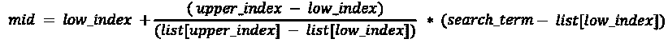

在前面的公式中，`low_index` 是列表的下界索引，即最小值的索引，而 `upper_index` 表示列表中最大值的索引位置。`list[low_index]` 和 `list[upper_index]` 分别是列表中的最小值和最大值。`search_value` 变量包含要搜索的项的值。

以下是一个示例，用于理解如何使用以下七个元素的列表来使用插值搜索算法：

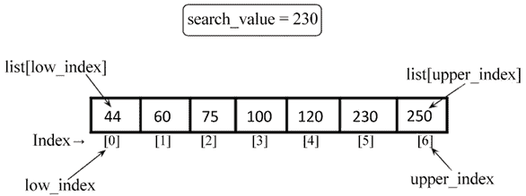

图 10.9：插值搜索示例

给定七个元素的列表 `44`、`60`、`75`、`100`、`120`、`230` 和 `250`，可以使用上述公式计算 `mid` 点，如下所示：

```py
list1 = [4,60,75,100,120,230,250]
low_index = 0
upper_index = 6
list1[upper_index] = 250
list1[low_index] = 44
search_value = 230 
```

将所有变量的值代入公式中，我们得到：

```py
mid = low_index +  ((upper_index - low_index)/ (list1[upper_index] - list1[low_index])) * (search_value - list1[low_index])
=> 0 + [(6-0)/(250-44)] * (230-44)
=> 5.41
=> 5 
```

在插值搜索的情况下，`mid` 索引为 `5`，因此算法从索引位置 `5` 开始搜索。因此，这就是我们从哪个中点开始搜索给定元素的计算方式。

插值搜索算法的工作原理如下：

1.  我们从中点开始搜索给定的搜索值（我们刚刚看到了如何计算它）。

1.  如果搜索值与中点索引处的值匹配，我们返回此索引位置。

1.  如果搜索值与中点存储的值不匹配，我们将列表分成两个子列表，即一个较高的子列表和一个较低的子列表。较高的子列表包含所有索引值高于中点的元素，而较低的子列表包含所有索引值低于中点的元素。

1.  如果搜索值大于中点的值，我们将在较高的子列表中搜索给定的搜索值，并忽略较低的子列表。

1.  如果搜索值低于中点的值，我们将在较低的子列表中搜索给定的搜索值，并忽略较高的子列表。

1.  我们重复此过程，直到子列表的大小减少到零。

让我们通过以下七个元素的列表示例来理解插值搜索算法的实现。首先，我们定义 `nearest_mid()` 方法，它按照以下方式计算中点：

```py
def nearest_mid(input_list, low_index, upper_index, search_value):
       mid = low_index + (( upper_index - low_index)/(input_list[upper_index] - input_list[low_index])) * (search_value - input_list[low_index])
       return int(mid) 
```

`nearest_mid` 函数接受要执行搜索的列表作为参数。`low_index` 和 `upper_index` 参数表示列表中我们希望找到搜索项的界限。此外，`search_value` 表示要搜索的值。

在插值搜索中，中点通常更偏向左边或右边。这是由于在除以获取中点时使用的乘数效应造成的。插值算法的实现与二分搜索相同，只是在计算中点的方式上有所不同。

在以下代码中，我们提供了插值搜索算法的实现：

```py
def interpolation_search(ordered_list, search_value):
    low_index = 0
    upper_index = len(ordered_list) - 1
    while low_index <= upper_index:
        mid_point = nearest_mid(ordered_list, low_index, upper_index, search_value)
        if mid_point > upper_index or mid_point < low_index:
            return None
        if ordered_list[mid_point] == search_value:
            return mid_point
        if search_value > ordered_list[mid_point]:
            low_index = mid_point + 1
        else:
            upper_index = mid_point – 1
    if low_index > upper_index:
        return None 
```

在上面的代码中，我们初始化了给定排序列表的 `low_index` 和 `upper_index` 变量。我们首先使用 `nearest_mid()` 方法计算中点。

使用`nearest_mid`函数计算出的中间点值可能大于`upper_bound_index`或小于`lower_bound_index`。当这种情况发生时，意味着搜索项`term`不在列表中。因此，返回`None`来表示这一点。

接下来，我们将搜索值与存储在中间点的值进行匹配，即`ordered_list[mid_point]`。如果匹配，则返回中间点的索引；如果不匹配，则将列表分为更高和更低的子列表，并重新调整`low_index`和`upper_index`，以便算法将重点放在可能包含类似搜索项的子列表上，就像我们在二分搜索中所做的那样：

```py
 if search_value > ordered_list[mid_point]:
            low_index = mid_point + 1
        else:
            upper_index = mid_point - 1 
```

在上述代码中，我们检查搜索值是否大于存储在`ordered_list[mid_point]`中的值，然后我们只调整`low_index`变量，使其指向`mid_point + 1`的索引。

让我们看看这种调整是如何发生的。假设我们想在给定的列表中搜索`190`，根据上述公式，中间点将是`4`。然后我们将搜索值（即`190`）与存储在中间点的值（即`120`）进行比较。由于搜索值较大，我们在较高子列表中搜索元素，并调整`low_index`值。这如图*图 10.10*所示：


图 10.10：当搜索项的值大于中间点值时，重新调整`low_index`

另一方面，如果搜索项的值小于存储在`ordered_list[mid_point]`中的值，那么我们只需调整`upper_index`变量，使其指向`mid_point - 1`的索引。例如，如果我们有如图*图 10.11*所示的列表，并且我们想搜索`185`，那么根据公式，中间点将是`4`。

接下来，我们将搜索值（即`185`）与存储在中间点的值（即`190`）进行比较。由于搜索值小于`ordered_list[mid_point]`，我们在较低子列表中搜索元素，并调整`upper_index`值。这如图*图 10.11*所示：

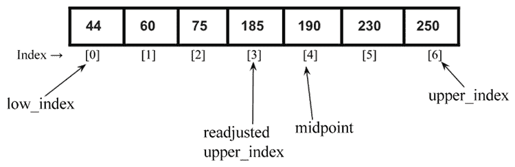

图 10.11：当搜索项小于中间点值时，重新调整`upper_index`

```py
{44, 60, 75, 100, 120, 230, 250}, in which we want to search for 120 using the interpolation search algorithm.
```

```py
list1 = [44, 60, 75, 100, 120, 230, 250]
a = interpolation_search(list1, 120)
print("Index position of value 2 is ", a) 
```

上述代码的输出如下：

```py
Index position of value 2 is  4 
```

让我们用一个更实际的例子来理解二分搜索和插值算法的内部工作原理。

考虑以下元素列表的例子：

```py
[ 2, 4, 5, 12, 43, 54, 60, 77] 
```

在索引`0`处存储的值是`2`，在索引`7`处存储的值是`77`。现在，假设我们想在列表中找到元素`2`。两种不同的算法将如何进行？

如果我们将此列表传递给`interpolation search`函数，那么`nearest_mid`函数将使用以下公式计算`mid_point`，并返回一个值等于`0`：

```py
mid_point = 0 + [(7-0)/(77-2)] * (2-2)
          = 0 
```

当我们得到`mid_point`值`0`时，我们开始使用索引`0`处的值进行插值搜索。仅通过一次比较，我们就找到了搜索项。

另一方面，二分搜索算法需要三次比较才能到达搜索项，如图 10.12 所示：

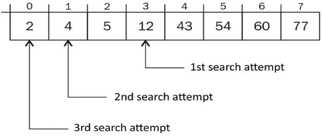

图 10.12：使用二分搜索算法搜索项目需要三次比较

首先计算出的 `mid_point` 值是 `3`。第二个 `mid_point` 值是 `1`，而搜索项被找到的最后一个 `mid_point` 值是 `0`。因此，我们通过三次比较就找到了所需的搜索项，而在插值搜索中，我们可以在第一次尝试中找到所需的项。

当数据集是有序且均匀分布时，插值搜索算法效果良好。在这种情况下，平均情况的时间复杂度是 `O(log(log n))`，其中 `n` 是数组的长度。此外，如果数据集是随机化的，那么插值搜索算法的最坏情况时间复杂度将是 `O(n)`。因此，如果给定数据是均匀分布的，插值搜索可能比二分搜索更有效。

# 指数搜索

指数搜索是一种主要用于列表中有大量元素时的搜索算法。指数搜索也被称为跳跃搜索和倍增搜索。指数搜索算法的工作步骤如下：

1.  给定一个包含 `n` 个数据元素的有序数组，我们首先确定原始列表中可能包含所需搜索项的子范围

1.  接下来，我们使用二分搜索算法在步骤 1 中确定的数据元素子范围内找到搜索值

首先，为了找到数据元素的子范围，我们通过每次迭代跳过 2^i 个元素来在给定的有序数组中搜索所需的项。在这里，`i` 是数组索引的值。每次跳跃后，我们检查搜索项是否在最后一次跳跃和当前跳跃之间。如果搜索项存在，则在此子数组中使用二分搜索算法，如果不存在，则将索引移动到下一个位置。因此，我们首先找到第一个指数 `i` 的出现，使得索引 2^i 处的值大于搜索值。然后，2^i 成为这个数据元素子范围的下界，2^i-1 成为这个子范围的上界，其中搜索值将存在。指数搜索算法定义如下：

1.  首先，我们将搜索元素与第一个元素 `A[0]` 进行比较。

1.  初始化索引位置 `i=1`。

1.  我们检查两个条件：（1）是否是数组的末尾（即 2^i `<` len(A)），以及（2）`A[i]` `<=` `search_value`）。在第一个条件下，我们检查是否已搜索整个列表，如果已到达列表末尾，则停止搜索。在第二个条件下，当我们遇到一个值大于搜索值的元素时停止搜索，因为这表示所需的元素将存在于这个索引位置之前（因为列表是有序的）。

1.  如果上述两个条件中的任何一个为真，我们就通过以 2 的幂次递增 `i` 来移动到下一个索引位置。

1.  我们在满足 *步骤 3* 的两个条件之一时停止。

1.  我们在范围 2^i//2 到 min (2^i, len(A)) 上应用二分搜索算法。

让我们以一个排序数组 `A = {3, 5, 8, 10, 15, 26, 35, 45, 56, 80, 120, 125, 138}` 为例，其中我们想要搜索元素 `125`。

我们从比较索引 i = 0 的第一个元素，即 A[0] 与搜索元素开始。由于 A[0] < `search_value`，我们跳到下一个位置 2^i，i = 0，因为 A[2⁰] < `search_value`，条件为真，所以我们跳到下一个位置，i = 1，即 A`[`22¹`]` < `search_value`。我们再次跳到下一个位置 2^i，i = 2，因为 A[2²] < `search_value`，条件为真。我们迭代地跳到下一个位置，直到我们完成列表搜索或搜索值大于该位置的价值，即 A[2^i] < len(A) 或 A[2^i] <= `search_value`。然后我们在子数组的范围内应用二分搜索算法。使用指数搜索算法在排序数组中搜索给定元素的完整过程如图 *图 10.13* 所示：

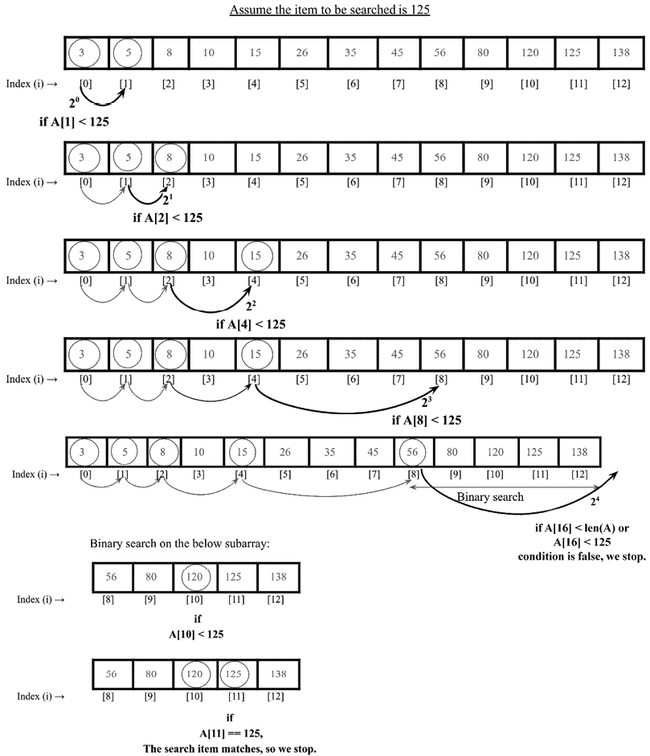

图 10.13：指数搜索算法的说明

现在，让我们讨论指数搜索算法的实现。首先，我们实现二分搜索算法，我们已经在上一节中讨论过了，但为了完整起见，我们再次给出如下：

```py
def binary_search_recursive(ordered_list, first_element_index, last_element_index, term):
    if (last_element_index < first_element_index):
        return None
    else:
        mid_point = first_element_index + ((last_element_index - first_element_index) // 2)
        if ordered_list[mid_point] > term:
            return binary_search_recursive (ordered_list, first_element_index, mid_point-1, term)
        elif ordered_list[mid_point] < term:
            return binary_search_recursive (ordered_list, mid_point+1, last_element_index, term)
        else:
            return mid_point 
```

在上述代码中，给定有序元素列表，它返回给定数据元素在列表中的位置索引。如果所需的元素不在列表中，则返回 `None`。接下来，我们按照以下方式实现 `exponential_search()` 方法：

```py
def exponential_search(A, search_value):
    if (A[0] == search_value):
        return 0    
    index = 1
    while index < len(A) and A[index] < search_value:
        index *= 2       
    return binary_search_recursive(A, index // 2, min(index, len(A) - 1), search_value) 
```

在上述代码中，首先，我们将第一个元素 `A[0]` 与搜索值进行比较。如果匹配，则返回索引位置 `0`。如果不匹配，我们将索引位置增加到 2⁰，即 1。我们检查 `A[1] < search_value`。由于条件为真，我们跳到下一个位置 2¹，即我们比较 `A[2] < search_value`。由于条件为真，我们移动到下一个位置。

我们迭代地以 2 的幂次增加索引位置，直到满足停止条件：

```py
 while index < len(A) and A[index] < search_value:
        index *= 2 
```

最后，当满足停止条件时，我们使用二分搜索算法在子范围内搜索所需的搜索值，如下所示：

```py
 return binary_search_recursive(A, index // 2, min(index, len(A) - 1), search_value) 
```

最后，`exponential_search()` 方法如果搜索值在给定的数组中找到，则返回索引位置；否则，返回 `None`。

```py
print(exponential_search([1,2,3,4,5,6,7,8,9, 10, 11, 12, 34, 40], 34)) 
```

上述代码片段的输出为：

```py
12 
```

在上述输出中，我们得到搜索项 `34` 在给定数组中的索引位置 `12`。

指数搜索对于非常大的数组非常有用。这比二分搜索更好，因为我们可以找到一个可能包含元素的子数组，而不是在整个数组上执行二分搜索，从而减少了比较的次数。

指数搜索的最坏情况时间复杂度为 O(log[2]i)，其中 `i` 是要搜索的元素所在的索引。当所需的搜索元素位于数组开头时，指数搜索算法可以优于二分搜索。因为指数搜索需要 `O(log(i))` 的时间，而二分搜索需要 `O(logn)` 的时间，其中 `n` 是元素总数。指数搜索的最佳情况复杂度为 `O(1)`，当元素位于数组的第一个位置时。

我们还可以使用指数搜索在有界数组中进行搜索。当目标接近数组开头时，它甚至可以优于二分搜索，因为指数搜索需要 `O(log(i))` 的时间，而二分搜索需要 `O(logn)` 的时间，其中 `n` 是元素总数。指数搜索的最佳情况复杂度为 `O(1)`，当元素位于数组的第一个位置时。

接下来，让我们讨论如何决定在给定情况下选择哪种搜索算法。

# 选择搜索算法

现在我们已经涵盖了不同类型的搜索算法，我们可以探讨哪些算法在什么情况下表现更好。与有序和无序的线性搜索函数相比，二分搜索和插值搜索算法在性能上更优越。线性搜索算法较慢，因为它需要在列表中顺序探测元素以找到搜索项。

线性搜索的时间复杂度为 `O(n)`。当给定的数据元素列表很大时，线性搜索算法表现不佳。

相反，二分搜索操作在任何搜索尝试时都会将列表分成两部分。在每次迭代中，我们比线性策略更快地接近搜索项。时间复杂度为 `O(logn)`。二分搜索算法表现良好，但其缺点是它需要一个排序的元素列表。因此，如果给定的数据元素较短且未排序，则最好使用线性搜索算法。

插值搜索会丢弃搜索空间中超过一半的项目列表，这使得它能够更有效地到达包含搜索项的部分列表。在插值搜索算法中，中点的计算方式使得更快地获得搜索项的概率更高。插值搜索的平均情况时间复杂度为 `O(log(logn))`，而插值搜索算法的最坏情况时间复杂度为 `O(n)`。这表明插值搜索比二分搜索更好，并且在大多数情况下提供更快的搜索。

因此，如果列表较短且未排序，则线性搜索算法是合适的；如果列表已排序且不是很大，则可以使用二分查找算法。此外，如果列表中的数据元素均匀分布，则插值查找算法是很好的选择。如果列表非常大，则可以使用指数搜索算法和跳跃搜索算法。

# 摘要

在本章中，我们讨论了从数据元素列表中搜索给定元素的概念。我们讨论了几个重要的搜索算法，如线性搜索、二分搜索、跳跃搜索、插值搜索和指数搜索。我们详细讨论了这些算法的实现，使用了 Python。我们将在下一章讨论排序算法。

# 练习

1.  平均来说，在`n`个元素的线性搜索中需要多少次比较？

1.  假设有一个排序数组中有八个元素。如果所有搜索都成功，并且使用二分查找算法，平均需要多少次比较？

1.  二分查找算法的最坏情况时间复杂度是多少？

1.  在什么情况下插值查找算法比二分查找算法表现更好？

# 加入我们的 Discord 社区

加入我们的社区 Discord 空间，与作者和其他读者进行讨论：[`packt.link/MEvK4`](https://packt.link/MEvK4)


