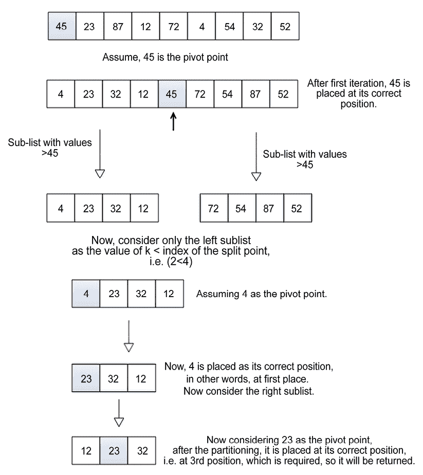
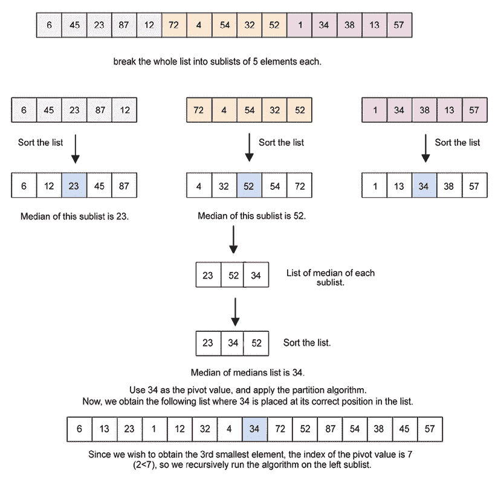

# 12

# 选择算法

与在无序列表中查找元素相关的一组有趣的算法是选择算法。给定一个元素列表，选择算法用于从列表中找到第`k`个最小或最大的元素。因此，给定一个数据元素列表和一个数字（`k`），目标是找到第`k`个最小或最大的元素。选择算法的最简单情况是从列表中找到最小或最大的数据元素。然而，有时我们可能需要找到列表中的第`k`个最小或最大的元素。最简单的方法是首先使用任何排序算法对列表进行排序，然后我们可以轻松地获得第`k`个最小（或最大）的元素。然而，当列表非常大时，对列表进行排序以获取第`k`个最小或最大的元素可能不是高效的。在这种情况下，我们可以使用不同的选择算法，这些算法可以有效地产生第`k`个最小或最大的元素。

在本章中，我们将涵盖以下主题：

+   排序选择

+   随机选择

+   确定性选择

我们将从技术要求开始，然后讨论排序选择。

# 技术要求

本章中使用的所有源代码都提供在给定的 GitHub 链接中：[`github.com/PacktPublishing/Hands-On-Data-Structures-and-Algorithms-with-Python-Third-Edition/tree/main/Chapter12`](https://github.com/PacktPublishing/Hands-On-Data-Structures-and-Algorithms-with-Python-Third-Edition/tree/main/Chapter12)。

# 排序选择

列表中的项目可能需要进行统计调查，例如找到均值、中位数和众数。找到均值和众数不需要列表是有序的。然而，要找到数字列表中的中位数，列表必须首先是有序的。找到中位数需要你找到有序列表中间位置的元素。此外，这也可以用于当我们想要找到列表中的第`k`个最小项目时。要找到无序列表中第`k`个最小的数字，一个明显的方法是首先对列表进行排序，排序后，你可以放心，列表中索引为 0 的元素将包含列表中的最小元素。同样，列表中的最后一个元素将包含列表中的最大元素。

有关如何在列表中排序数据项的更多信息，请参阅 *第十一章*，*排序*。然而，为了从列表中获得第 `k` 个最小的元素，将排序算法应用于长列表元素以获得最小值、最大值或第 `k` 个最小值或最大值并不是一个好的解决方案，因为排序是一个相当昂贵的操作。因此，如果我们需要从给定的列表中找出第 `k` 个最小或最大的元素，就没有必要对整个列表进行排序，因为我们有其他可以用于此目的的方法。让我们讨论更好的技术来找到第 `k` 个最小的元素，而无需首先对列表进行排序，从随机选择开始。

# 随机选择

随机选择算法是基于快速排序算法来获得第 `k` 个最小数的；随机选择算法也被称为快速选择。在 *第十一章*，*排序* 中，我们讨论了快速排序算法。快速排序算法是一种高效的算法，用于对未排序的项目列表进行排序。总结来说，快速排序算法的工作原理如下：

1.  它选择一个枢轴。

1.  它将未排序的列表围绕枢轴进行分区。

1.  它递归地使用步骤 *1* 和 *2* 对分区后的列表的两半进行排序。

关于快速排序的一个重要事实是，在每次分区步骤之后，枢轴的索引不会改变，即使列表已经排序。这意味着在每次迭代之后，选定的枢轴值将放置在列表中的正确位置。快速排序的这个特性使我们能够获得第 `k` 个最小的数，而无需对整个列表进行排序。让我们讨论随机选择方法，也称为快速选择算法，以从包含 n 个数据项的列表中获得第 `k` 个最小的元素。

## 快速选择

快速选择算法用于从未排序的项目列表中获得第 `k` 个最小的元素。它基于快速排序算法，其中我们递归地对枢轴点两侧的子列表的元素进行排序。在每次迭代中，枢轴值达到列表中的正确位置，从而将列表分为两个未排序的子列表（左侧子列表和右侧子列表），其中左侧子列表的值小于枢轴值，而右侧子列表的值大于枢轴值。现在，在快速选择算法的情况下，我们只递归调用具有第 `k` 个最小元素的子列表中的函数。

在快速选择算法中，我们比较枢轴点的索引与 `k` 值，以从给定的未排序列表中获得第 `k` 个最小的元素。快速选择算法中将有三种情况，如下所示：

1.  如果枢轴点的索引小于 `k`，那么我们可以确定第 `k` 个最小的值将出现在枢轴点的右侧子列表中。因此，我们只需递归地调用快速选择函数对右侧子列表进行操作。

1.  如果枢轴点的索引大于`k`，那么很明显，第`k`小的元素将出现在枢轴点的左侧。因此，我们只需在左子列表中递归地查找第`i`个元素。

1.  如果枢轴点的索引等于`k`，那么这意味着我们已经找到了第`k`小的值，并返回它。

让我们通过一个例子来理解 quickselect 算法的工作原理。考虑一个元素列表，`{45, 23, 87, 12, 72, 4, 54, 32, 52}`。我们可以使用 quickselect 算法来找到这个列表中的第 3 小的元素。

我们开始算法时选择一个枢轴值，即`45`。在这里，为了简单起见，我们选择第一个元素作为枢轴元素；然而，任何其他元素都可以被选为枢轴元素。在算法的第一轮迭代之后，枢轴值移动到列表中的正确位置，在这个例子中是索引 4（索引从 0 开始）。接下来，我们检查条件`k<pivot`点（即`2<4`）。情况-2 适用，所以我们只考虑左子列表，并递归调用函数。在这里，我们比较枢轴值的索引（即`4`）与`k`的值（即第 3 个位置或索引 2）。

接下来，我们取左子列表并选择枢轴点（即`4`）。运行后，`4`被放置在其正确的位置（即第 0 个索引）。由于枢轴点的索引小于`k`的值，我们考虑右子列表。

同样，我们将`23`作为枢轴点，它也被放置在其正确的位置。现在，当我们比较枢轴点的索引和`k`的值时，它们是相等的，这意味着我们已经找到了第 3 小的元素，并且它将被返回。找到第 3 小元素的完整步骤过程如图*12.1*所示：



图 12.1：quickselect 算法的逐步演示

让我们讨论`quick_select`方法的实现。它被定义为如下：

```py
def quick_select(array_list, start, end, k):
    split = partition(array_list, start, end)
    if split == k:
        return array_list[split]
    elif split < k:
        return quick_select(array_list, split + 1, end, k)
    else:
        return quick_select(array_list, start, split-1, k) 
```

在上面的代码中，`quick_select`函数接受完整的数组、列表第一个元素的索引、最后一个元素的索引以及由值`k`指定的`k`个元素作为参数。`k`的值与用户要搜索的索引相对应，意味着列表中的第`k`小的数字。

首先，我们使用`partition()`方法（该方法在*第十一章*，*排序*中定义并详细讨论）将选定的枢轴点放置在适当的位置，以便将给定的元素列表分割成左子列表和右子列表，其中左子列表包含小于枢轴值的元素，而右子列表包含大于枢轴值的元素。`partition()`方法调用为`split = partition(array_list, start, end)`，并返回`split`索引。在这里，`split`索引是枢轴元素在数组中的位置，而(`start`, `end`)是列表的起始和结束索引。一旦我们得到分割点，我们就比较`split`索引与所需的`k`值，以确定我们是否已经到达了第 k 小数据项的位置，或者所需的第 k 小元素是否将在左子列表或右子列表中。这三个条件如下：

1.  如果`split`等于`k`的值，那么这意味着我们已经到达了列表中的第 k 小数据项。

1.  如果`split`小于`k`，那么这意味着第 k 小的元素应该存在于`split+1`和`right`之间。

1.  如果`split`大于`k`，那么这意味着第 k 小的元素应该存在于`left`和`split-1`之间。

在前面的例子中，分割点出现在索引 4（索引从 0 开始）。如果我们正在寻找第 3 小的数字，那么由于 4 < 2 的结果为`false`，就会对右子列表进行递归调用，使用`quick_select(array_list, left, split-1, k)`。

为了使此算法完整，下面给出了`partition()`方法的实现：

```py
def partition(unsorted_array, first_index, last_index):
    pivot = unsorted_array[first_index]
    pivot_index = first_index
    index_of_last_element = last_index
    less_than_pivot_index = index_of_last_element
    greater_than_pivot_index = first_index + 1
    while True:
        while unsorted_array[greater_than_pivot_index] < pivot and greater_than_pivot_index < last_index:
            greater_than_pivot_index += 1
        while unsorted_array[less_than_pivot_index] > pivot and less_than_pivot_index >= first_index:
            less_than_pivot_index -= 1
        if greater_than_pivot_index < less_than_pivot_index:
            temp = unsorted_array[greater_than_pivot_index]
            unsorted_array[greater_than_pivot_index] = unsorted_array[less_than_pivot_index]
            unsorted_array[less_than_pivot_index] = temp
        else:
            break
    unsorted_array[pivot_index] = unsorted_array[less_than_pivot_index]
    unsorted_array[less_than_pivot_index] = pivot
    return less_than_pivot_index 
th smallest element using the quickselect algorithm for a given array.
```

```py
list1 = [3,1,10, 4, 6, 5]
print("The 2nd smallest element is", quick_select(list1, 0, 5, 1))
print("The 3rd smallest element is", quick_select(list1, 0, 5, 2)) 
```

上述代码的输出如下：

```py
The 2nd smallest element is 3
The 3rd smallest element is 4 
```

在上面的代码中，我们从给定的元素列表中获取第 2 小和第 3 小的元素。基于随机选择的`quick-select`算法的最坏情况性能是 O(n²)。

在上述`partition()`方法的实现中，为了简单起见，我们使用列表的第一个元素作为枢轴元素，但可以从列表中选择任何元素作为枢轴元素。一个好的枢轴元素是能够将列表几乎平分的元素。因此，通过更有效地选择分割点，可以在线性时间内提高快速选择算法的性能，其最坏情况复杂度为`O(n)`。我们将在下一节中讨论如何使用确定性选择来实现这一点。

# 确定性选择

确定性选择是一种在无序元素列表中查找第 k 项的算法。正如我们在`quickselect`算法中所见，我们选择一个随机的“枢轴”元素，将列表分割成两个子列表，并对其中一个子列表进行递归调用。在确定性选择算法中，我们更有效地选择枢轴元素，而不是随机选择任何枢轴元素。

确定性算法的主要概念是选择一个能产生良好列表分割的枢轴元素，良好的分割是将列表分成两半。例如，选择枢轴元素的一个好方法就是选择所有值的均值。但是，我们需要对元素进行排序以找到中值元素，这并不高效，因此，我们尝试找到一种方法来选择一个大致将列表分成中间的枢轴元素。

均值的中位数是一种提供给我们近似中值的方法，即一个接近给定未排序元素列表实际中值的价值。它以这种方式划分给定的元素列表，在最坏的情况下，至少有 10 个中的 3 个（3/10）的列表将位于枢轴元素之下，至少有 10 个中的 3 个的元素将位于列表之上。

让我们通过一个例子来理解这一点。假设我们有一个包含 15 个元素的列表：`{11, 13, 12, 111, 110, 15, 14, 16, 113, 112, 19, 18, 17, 114, 115}`。

接下来，我们将它分成每组 5 个元素的组，并按以下方式排序：`{{11, 12, 13, 110, 111}, {14, 15, 16, 112, 113}, {17, 18, 19, 114, 115}}`。

接下来，我们计算这些组中每一组的均值，分别是`13`、`16`和`19`。进一步，这些均值的中位数是`16`。这是给定列表的中位数的中位数。在这里，我们可以看到有 5 个元素比枢轴元素小，有`9`个元素比枢轴元素大。当我们选择这个均值的中位数作为枢轴元素时，`n`个元素的列表被分成这样的一种方式，至少有`3n/10`个元素比枢轴元素小。

选择第`k`个最小元素的确定性算法工作如下：

1.  将无序项的列表分成每组五个元素（数字 5 不是强制的；它可以改为任何其他数字，例如 8）

1.  对这些组进行排序（通常，我们使用插入排序来完成此目的）并找到所有这些组的均值

1.  递归地，从这些组中找到中位数的中位数；假设这个点是**p**

1.  使用这个点**p**作为枢轴元素，递归调用类似于 quickselect 的分区算法来找出第`k`个最小的元素

让我们考虑一个包含 15 个元素的例子来理解从列表中找出第 3 个最小元素的确定性算法的工作原理，如图*12.2*所示。首先，我们将列表分成每组 5 个元素的组，然后对这些组/子列表进行排序。一旦我们有了排序的列表，我们就找出子列表的均值。对于这个例子，项目**23**、**52**和**34**是这三个子列表的均值，如图*12.2*所示。

接下来，我们对所有子列表的中位数列表进行排序。进一步地，我们找出这个列表的中位数，即中位数的中位数，它是**34**。这个中位数的中位数被用来选择整个列表的分区/枢轴点。进一步地，我们使用这个枢轴元素来划分给定的列表，将枢轴元素放在列表中的正确位置。对于这个例子，枢轴元素的索引是 7（索引从 0 开始；这显示在*图 12.2.*中）。



图 12.2：确定性选择算法的逐步过程

枢轴元素的索引大于`k`^(th)值，因此我们递归地在左子列表上调用算法以获得所需的`k`^(th)最小元素。

接下来，我们将讨论确定性选择算法的实现。

## 确定性选择算法的实现

为了实现确定算法以从列表中确定`k`^(th)最小值，我们开始实现更新的`partition()`方法，该方法使用中位数的中位数方法选择枢轴元素来划分列表。现在让我们理解`partition`函数的代码：

```py
def partition(unsorted_array, first_index, last_index): 
    if first_index == last_index: 
        return first_index 
    else: 
        nearest_median = median_of_medians(unsorted_array[first_index:last_index]) 
    index_of_nearest_median = get_index_of_nearest_median(unsorted_array, first_index, last_index, nearest_median) 
    swap(unsorted_array, first_index, index_of_nearest_median) 

    pivot = unsorted_array[first_index] 
    pivot_index = first_index 
    index_of_last_element = last_index 
    less_than_pivot_index = index_of_last_element 
    greater_than_pivot_index = first_index + 1 

    ## This while loop is used to correctly place pivot element at its correct position 
    while 1:
        while unsorted_array[greater_than_pivot_index] < pivot and greater_than_pivot_index < last_index:
            greater_than_pivot_index += 1
        while unsorted_array[less_than_pivot_index] > pivot and less_than_pivot_index >= first_index:
            less_than_pivot_index -= 1

        if greater_than_pivot_index < less_than_pivot_index:
            temp = unsorted_array[greater_than_pivot_index]
            unsorted_array[greater_than_pivot_index] = unsorted_array[less_than_pivot_index]
            unsorted_array[less_than_pivot_index] = temp
        else:
            break

    unsorted_array[pivot_index]=unsorted_array[less_than_pivot_index]
    unsorted_array[less_than_pivot_index]=pivot
    return less_than_pivot_index 
```

在上述代码中，我们实现了分区方法，这与我们在 quickselect 算法中所做的方法非常相似。在 quickselect 算法中，我们使用了一个随机枢轴元素（为了简单起见，列表的第一个元素），但在确定性选择算法中，我们使用中位数的中位数来选择枢轴元素。分区方法将列表划分为两个子列表——左子列表和右子列表，其中左子列表包含小于枢轴元素的元素，而右子列表包含大于枢轴元素的元素。使用中位数的中位数作为枢轴元素的主要好处是，它通常将列表几乎平分为两半。

在代码的开始部分，首先，在`if-else`条件中，我们检查给定元素列表的长度。如果列表的长度为 1，则返回该元素的索引，因此如果`unsorted_array`只有一个元素，`first_index`和`last_index`将相等。因此，返回`first_index`。如果长度大于 1，则调用`median_of_medians()`方法来计算传递给此方法的列表的中位数的中位数，起始和结束索引分别为`first_index`和`last_index`。返回的中位数的中位数值存储在`nearest_median`变量中。

现在，让我们理解`median_of_medians()`方法的代码。它如下所示：

```py
def median_of_medians(elems):  
    sublists = [elems[j:j+5] for j in range(0, len(elems), 5)] 
    medians = [] 
    for sublist in sublists: 
        medians.append(sorted(sublist)[int(len(sublist)/2)]) 
    if len(medians) <= 5: 
        return sorted(medians)[int(len(medians)/2)]
    else: 
        return median_of_medians(medians) 
```

在上述 `median_of_medians` 函数的代码中，使用了递归来计算给定列表的中位数的中位数。函数首先将给定的列表 `elems` 分成每组五个元素的组。如前所述，在确定性算法中，我们将给定的列表分成每组 5 个元素的组。在这里，我们选择 5 个元素，因为它通常表现良好。然而，我们也可以使用任何其他数字。这意味着如果 `elems` 包含 100 个项目，那么将通过 `sublists = [elems[j:j+5] for j in range(0, len(elems), 5)]` 语句创建 20 个组，每个组最多包含五个元素。

在创建了每个包含五个元素的子列表之后，我们创建一个空的数组 `medians`，用于存储每个五个元素数组的（即 `sublists`）中位数。此外，`for` 循环遍历 `sublists` 内部的列表。每个子列表被排序，找到中位数，并将其存储在 `medians` 列表中。`medians.append(sorted(sublist)[len(sublist)//2])` 语句将排序列表并获取其中间索引处的元素。`medians` 变量成为所有五个元素子列表的中位数列表。在这个实现中，我们使用 Python 的现有排序函数；由于列表的大小很小，它不会影响算法的性能。

此后，下一步是递归地计算中位数的中位数，我们将使用它作为枢轴元素。在此需要注意的是，中位数数组的长度本身也可以是一个大数组，因为如果原始数组的长度是 n，那么中位数数组的长度将是 n/5，对它的排序可能本身就会消耗时间。因此，我们检查 `medians` 数组的长度，如果它小于 5，我们就对 `medians` 列表进行排序，并返回其中间索引处的元素。另一方面，如果列表的大小大于五，我们再次递归调用 `median_of_medians` 函数，并给它提供存储在 `medians` 中的中位数列表。最后，该函数返回给定元素列表的中位数的中位数。

让我们通过以下数字列表的另一个例子来更好地理解中位数的中位数的概念：

```py
[2, 3, 5, 4, 1, 12, 11, 13, 16, 7, 8, 6, 10, 9, 17, 15, 19, 20, 18, 23, 21, 22, 25, 24, 14] 
```

我们可以通过以下 `sublists = [elems[j:j+5] for j in range(0, len(elems), 5)]` 代码语句将这个列表分解成五个元素的组，以获得以下列表：

```py
[[2, 3, 5, 4, 1], [12, 11, 13, 16, 7], [8, 6, 10, 9, 17], [15, 19, 20, 18, 23], [21, 22, 25, 24, 14]] 
```

每个五个元素的列表将按以下方式排序：

```py
[[1, 2, 3, 5, 5], [7, 11, 12, 13, 16], [6, 8, 9, 10, 17], [15, 18, 19, 20, 23], [14, 21, 22, 24, 25]] 
```

接下来，我们获取它们的平均值，生成以下列表：

```py
[3, 12, 9, 19, 22] 
```

我们对上述列表进行排序：

```py
[3, 9, 12, 19, 22] 
```

由于列表大小为五个元素，我们只需返回排序后的列表的中位数，在这种情况下是 `12`。否则，如果这个数组的长度大于 5，我们就会再次调用 `median_of_median` 函数。

一旦我们得到了中位数的中位数值，我们需要找出它在给定列表中的索引。我们编写 `get_index_of_nearest_median` 函数来完成这个目的。此函数接受由 `first` 和 `last` 参数指定的列表的起始和结束索引：

```py
def get_index_of_nearest_median(array_list, first, last, median): 
    if first == last: 
        return first 
    else: 
        return array_list.index(median) 
```

在分区方法中，我们将中位数的中位数值与列表的第一个元素交换，即使用 `swap` 函数将 `index_of_nearest_median` 与 `unsorted_array` 的 `first_index` 交换：

```py
swap(unsorted_array, first_index, index_of_nearest_median) 
```

交换两个数组元素的 `utility` 函数如下所示：

```py
def swap(array_list, first, index_of_nearest_median):
    temp = array_list[first]
    array_list[first] = array_list[index_of_nearest_median]
    array_list[index_of_nearest_median] = temp 
```

我们交换这两个元素。其余的实现与我们在 `quick_select` 算法中讨论的相当相似。现在，我们得到了给定列表的中位数的中位数，它存储在未排序列表的 `first_index` 中。

现在，其余的实现与 `quick_select` 算法的分区方法以及快速排序算法相似，这在 *第十一章*，*排序* 中有详细讨论。为了算法的完整性，我们再次讨论这个问题。

我们将第一个元素视为枢轴元素，并取两个指针，即左指针和右指针。左指针从列表的左侧向右移动，以保持枢轴元素左侧的所有小于枢轴元素的元素。它初始化为列表的第二个元素，即 `first_index+1`，而右指针从列表的右侧向左移动，以保持列表的顺序，使得大于枢轴元素的元素位于列表的枢轴元素右侧。它初始化为列表的最后一个元素。因此，我们有两个变量 `less_than_pivot_index`（右指针）和 `greater_than_pivot_index`（左指针），其中 `less_than_pivot_index` 初始化为 `index_of_last_element`，`greater_than_pivot_index` 初始化为 `first_index + 1`：

```py
 less_than_pivot_index = index_of_last_element
    greater_than_pivot_index = first_index + 1 
```

接下来，我们移动左指针和右指针，以便在经过一次迭代后，枢轴元素被放置在列表中的正确位置。这意味着它将列表分为两个子列表，左子列表包含所有小于枢轴元素的元素，右子列表包含大于枢轴元素的元素。我们通过以下三个步骤来完成这个操作：

```py
 ## This while loop is used to correctly place pivot element at its correct position 
    while 1:
        while unsorted_array[greater_than_pivot_index] < pivot and greater_than_pivot_index < last_index:
            greater_than_pivot_index += 1
        while unsorted_array[less_than_pivot_index] > pivot and less_than_pivot_index >= first_index:
            less_than_pivot_index -= 1
        if greater_than_pivot_index < less_than_pivot_index:
            temp = unsorted_array[greater_than_pivot_index]
            unsorted_array[greater_than_pivot_index] = unsorted_array[less_than_pivot_index]
            unsorted_array[less_than_pivot_index] = temp
        else:
            break 
```

1.  第一个 `while` 循环将 `greater_than_pivot_index` 移到数组的右侧，直到 `greater_than_pivot_index` 所指向的元素小于枢轴元素，并且 `greater_than_pivot_index` 小于 `last_index`：

    ```py
    while unsorted_array[greater_than_pivot_index] < pivot and greater_than_pivot_index < last_index: greater_than_pivot_index += 1 
    ```

1.  在第二个 `while` 循环中，我们将对数组中的 `less_than_pivot_index` 执行相同操作。我们将 `less_than_pivot_index` 向左移动，直到 `less_than_pivot_index` 所指向的元素大于枢轴元素，并且 `less_than_pivot_index` 大于或等于 `first_index`：

    ```py
    while unsorted_array[less_than_pivot_index] > pivot and less_than_pivot_index >= first_index: less_than_pivot_index -= 1 
    ```

1.  现在，我们检查`greater_than_pivot_index`和`less_than_pivot_index`是否已经交叉或没有。如果`greater_than_pivot_index`仍然小于`less_than_pivot_index`（即我们还没有找到枢轴元素的正确位置），我们交换由`greater_than_pivot_index`和`less_than_pivot_index`指示的元素，然后我们将再次重复相同的三个步骤。如果它们已经交叉，这意味着我们已经找到了枢轴元素的正确位置，我们将从循环中跳出：

    ```py
    if greater_than_pivot_index < less_than_pivot_index:
        temp = unsorted_array[greater_than_pivot_index]
        unsorted_array[greater_than_pivot_index] = unsorted_array[less_than_pivot_index]
        unsorted_array[less_than_pivot_index] = temp
    else:
        break 
    ```

在退出循环后，变量`less_than_pivot_index`将指向枢轴的正确索引，因此我们只需交换`less_than_pivot_index`和`pivot_index`处的值：

```py
 unsorted_array[pivot_index]=unsorted_array[less_than_pivot_index]
    unsorted_array[less_than_pivot_index]=pivot 
```

最后，我们只需简单地返回枢轴索引，它存储在变量`less_than_pivot_index`中。

在分割方法之后，枢轴元素达到其在列表中的正确位置。此后，我们根据所需的`k`值和枢轴元素的位置递归调用分割方法到子列表之一（左子列表或右子列表），以找到`k`^(th)最小元素。这个过程与快速选择算法相同。

确定性选择算法的实现如下：

```py
def deterministic_select(array_list, start, end, k): 
    split = partition(array_list, start, end) 
    if split == k: 
        return array_list[split] 
    elif split < k:
        return deterministic_select(array_list, split + 1, end, k) 
    else: 
        return deterministic_select(array_list, start, split-1, k) 
```

如您所观察到的，确定性选择算法的实现看起来与快速选择算法完全相同。两者之间的唯一区别是我们如何选择枢轴元素；除此之外，一切相同。

在初始`array_list`被选定的枢轴元素（即列表的中位数的中位数）分割后，与`k`^(th)元素进行比较：

1.  如果分割点的索引，即`split`，等于`k`所需的值，这意味着我们已经找到了所需的`k`^(th)最小元素。

1.  如果分割点的索引`split`小于`k`所需的值，那么对右子数组进行递归调用，调用为`deterministic_select(array_list, split + 1, right, k)`。这将寻找数组右侧的`k`^(th)元素。

1.  否则，如果分割索引大于`k`的值，那么对左子数组的函数调用为`deterministic_select(array_list, left, split-1, k)`。

```py
kth smallest element from the list:
```

```py
list1= [2, 3, 5, 4, 1, 12, 11, 13, 16, 7, 8, 6, 10, 9, 17, 15, 19, 20, 18, 23, 21, 22, 25, 24, 14]
print("The 6th smallest element is", deterministic_select(list1, 0, len(list1)-1, 5)) 
```

上述代码的输出如下。

```py
The 6th smallest element is 6 
```

在上述代码的输出中，我们有从给定 25 个元素的列表中得到的第 6^(th)小元素。确定性选择算法通过使用中位数的中位数元素作为选择列表中`k`^(th)最小元素的枢轴点来改进快速选择算法。它提高了性能，因为中位数的中位数方法在线性时间内找到估计的中位数，当这个估计的中位数被用作快速选择算法中的枢轴点时，最坏情况下的运行时间复杂度从 O(n²)提高到线性 O(n)。

中位数的中位数算法也可以用于在快速排序算法中选择枢轴点以排序元素列表。这显著提高了快速排序算法的最坏情况性能，从 O(n²) 提高到 O(nlogn) 的复杂度。

# 摘要

在本章中，我们讨论了两种寻找列表中第 k 小元素的重要方法，即随机选择和确定性选择算法。仅仅对列表进行排序以执行寻找第 k 小元素的运算并不是最佳方案，因为我们可以使用更好的方法来确定第 k 小元素。快速选择算法，作为随机选择算法，将列表分为两个子列表。一个列表包含比选定的枢轴元素小的值，另一个列表包含比选定的枢轴元素大的值。我们递归地使用其中一个子列表来找到第 k 小元素的位置，这可以通过在确定性选择算法中使用中位数的中位数方法来选择枢轴点进一步改进。

在下一章中，我们将讨论几个重要的字符串匹配算法。

# 练习

1.  如果将快速选择算法应用于给定的数组，输出将会是什么？

    `arr = [3, 1, 10, 4, 6, 5]`，给定 `k` 为 2？

1.  快速选择能否在具有重复值的数组中找到最小元素？

1.  快速排序算法与快速选择算法之间的区别是什么？

1.  确定性选择算法与快速选择算法的主要区别是什么？

1.  什么触发了选择算法的最坏情况行为？

# 加入我们的 Discord 社区

加入我们的社区 Discord 空间，与作者和其他读者进行讨论：[`packt.link/MEvK4`](https://packt.link/MEvK4)


