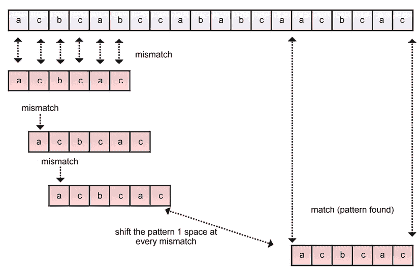

# 13

# 字符串匹配算法

有许多流行的字符串匹配算法。字符串匹配算法有非常重要的应用，例如在文本文档中搜索元素、抄袭检测、文本编辑程序等。在本章中，我们将研究寻找给定模式或子串在任意给定文本中的位置的模式匹配算法。我们将讨论**暴力算法**，以及**Rabin-Karp**、**Knuth-Morris-Pratt**（**KMP**）和**Boyer-Moore**模式匹配算法。本章旨在讨论与字符串相关的算法。本章将涵盖以下主题：

+   学习模式匹配算法及其实现

+   理解和实现**Rabin-Karp**模式匹配算法

+   理解和实现**Knuth-Morris-Pratt**（**KMP**）算法

+   理解和实现**Boyer-Moore**模式匹配算法

# 技术要求

本章讨论的概念和算法的所有程序都包含在书中，以及以下链接的 GitHub 仓库中：[`github.com/PacktPublishing/Hands-On-Data-Structures-and-Algorithms-with-Python-Third-Edition/tree/main/Chapter13`](https://github.com/PacktPublishing/Hands-On-Data-Structures-and-Algorithms-with-Python-Third-Edition/tree/main/Chapter13)。

# 字符串表示法和概念

字符串是字符序列。Python 提供了一组丰富的操作和函数，可以应用于字符串数据类型。字符串是文本数据，在 Python 中处理得非常高效。以下是一个字符串 `(s)` 的示例——“`packt publishing`"。

子串是指给定字符串中字符序列的一部分，即字符串中连续顺序的指定索引。例如，“`packt`" 是字符串 “`packt publishing`" 的子串。另一方面，子序列也是从给定字符串中通过删除一些字符（同时保持字符出现的顺序）得到的字符序列。例如，“`pct pblishing`" 是从字符串 “`packt publishing`" 中删除字符 `a`、`k` 和 `u` 后得到的有效子序列。然而，这并不是子串，因为 “`pct pblishing`" 不是一个连续的字符序列。因此，子序列与子串不同，它可以被认为是子串的推广。

前缀 `(p)` 是字符串 `(s)` 的子串，因为它位于字符串的开头。在字符串 `(s)` 中也存在另一个字符串 `(u)`，它在前缀之后。例如，子串 “`pack`" 是字符串 `(s) = "packt publishing"` 的前缀，因为它是最初的子串，并且在其后还有另一个子串 `u = "publishing"`。因此，前缀加上字符串 `(u)` 构成了 “`packt publishing`"，这就是整个字符串。

后缀（`d`）是出现在字符串（`s`）末尾的子字符串。例如，子字符串“`shing`”是字符串“`packt publishing`”的许多可能后缀之一。Python 有内置函数可以检查字符串是否以特定字符串开始或结束，如下面的代码片段所示：

```py
string = "this is data structures book by packt publisher"
suffix = "publisher"
prefix = "this"
print(string.endswith(suffix))  #Check if string contains given suffix. 
print(string.startswith(prefix)) #Check if string starts with given prefix. 
```

上述代码的输出如下：

```py
True
True 
```

在上述给定的字符串示例中，我们可以看到给定的文本字符串以另一个子字符串“`publisher`”结尾，这是一个有效的后缀，并且还有一个子字符串“`this`”，它是字符串的开始部分的一个子字符串，也是一个有效的前缀。

注意，这里讨论的模式匹配算法不要与 Python 3.10 的匹配语句混淆。

模式匹配算法是最重要的字符串处理算法，我们将在后续章节中讨论它们，从模式匹配算法开始。

# 模式匹配算法

模式匹配算法用于确定给定模式字符串（`P`）在文本字符串（`T`）中匹配的索引位置。因此，模式匹配算法找到并返回给定字符串模式在文本字符串中出现的索引。如果模式在文本字符串中没有匹配项，则返回`"pattern not found"`。

例如，对于给定的文本字符串`(s) = "packt publisher"`和模式字符串`(p) = "publisher"`，模式匹配算法返回模式字符串在文本字符串中匹配的索引位置。一个字符串匹配问题的示例如图*13.1*所示：


图 13.1：字符串匹配问题的示例

我们将讨论四种模式匹配算法，即贪心方法、Rabin-Karp 算法，以及**Knuth-Morris-Pratt**（**KMP**）和 Boyer-Moore 模式匹配算法。我们首先从贪心模式匹配算法开始。

# 贪心算法

贪心算法也被称为模式匹配算法的朴素方法。朴素方法意味着它是一个非常基础且简单的算法。在这种方法中，我们在给定的文本字符串中匹配所有可能的输入模式的组合，以找到模式出现的位置。这个算法非常朴素，如果文本非常长，则不适合使用。

在这个算法中，我们首先逐个比较模式字符串和文本字符串中的字符，如果模式的所有字符都与文本匹配，我们就返回文本中模式第一个字符所在的位置索引。如果模式中的任何字符与文本字符串不匹配，我们就将模式向右移动一个位置，以检查模式是否出现在下一个索引位置。我们通过将模式向右移动一个索引位置来继续比较模式和文本字符串。

为了更好地理解暴力算法的工作原理，让我们看一个例子。假设我们有一个文本字符串`(T)` = “**acbcabccababcaacbcac**”，模式字符串`(P)`是“**acbcac**”。现在，模式匹配算法的目标是在给定的文本`T`中确定模式字符串的索引位置，如图*13.2*所示：



图 13.2：字符串匹配的暴力算法示例

我们首先比较文本的第一个字符，即**a**，和模式的第一个字符。在这里，模式的前五个字符被匹配，然后在模式的最后一个字符处出现不匹配。这是一个不匹配，因此我们将模式向右移动一个位置。我们再次从比较模式的第一个字符和文本字符串的第二个字符开始逐个比较。在这里，文本字符串中的字符**c**与模式的字符**a**不匹配。因此，这也是一个不匹配，我们将模式向右移动一个空格，如图*13.2*所示。我们继续比较模式和文本字符串中的字符，直到我们遍历整个文本字符串。在这个例子中，我们在索引位置`14`找到一个匹配，如图*13.2*所示。

让我们考虑模式匹配的暴力算法的 Python 实现：

```py
def brute_force(text, pattern):
    l1 = len(text)      # The length of the text string
    l2 = len(pattern)   # The length of the pattern 
    i = 0
    j = 0               # looping variables are set to 0
    flag = False        # If the pattern doesn't appear at all, then set this to false and execute the last if statement
    while i < l1:         # iterating from the 0th index of text
        j = 0
        count = 0    
        # Count stores the length upto which the pattern and the text have matched
        while j < l2:
            if i+j < l1 and text[i+j] == pattern[j]:  
        # statement to check if a match has occurred or not
                count += 1     # Count is incremented if a character is matched 
            j += 1
        if count == l2:   # it shows a matching of pattern in the text 
                print("\nPattern occurs at index", i) 
                # print the starting index of the successful match
                flag = True 
                # flag is True as we wish to continue looking for more matching of pattern in the text. 
        i += 1
    if not flag: 
        # If the pattern doesn't occur at all, means no match of pattern in the text string
        print('\nPattern is not at all present in the array') 
'acbcac' in the given string:
```

```py
brute_force('acbcabccababcaacbcac','acbcac')         # function call 
```

上面的函数调用输出如下：

```py
Pattern occurs at index 14 
```

在前面的暴力方法代码中，我们首先计算给定文本字符串和模式的长度。我们还用`0`初始化循环变量，并将标志设置为`False`。

这个变量用于在字符串中继续搜索模式的匹配。如果`flag`变量在文本字符串结束时为`False`，则意味着在文本字符串中根本找不到模式的匹配。

接下来，我们从文本字符串的`0`^(th)索引开始搜索循环，直到文本字符串的末尾。在这个循环中，我们有一个`count`变量，用于跟踪模式和文本匹配到的长度。接下来，我们有一个嵌套循环，从`0`^(th)索引运行到模式的长度。在这里，变量`i`跟踪文本字符串中的索引位置，变量`j`跟踪模式中的字符。接下来，我们使用以下代码片段比较模式和文本字符串中的字符：

```py
if i+j<l1 and text[i+j] == pattern[j]: 
```

此外，我们在文本字符串中模式字符的每次匹配后增加`count`变量。然后，我们继续匹配模式和文本字符串中的字符。如果模式的长度等于`count`变量，则表示有一个匹配。

如果在文本字符串中找到与模式字符串匹配的索引位置，我们将打印文本字符串的索引位置，并将`flag`变量保持为`True`，因为我们希望继续在文本字符串中搜索更多模式的匹配。最后，如果`flag`变量的值为`False`，则表示在文本字符串中根本找不到该模式的匹配。

原始字符串匹配算法的最佳和最坏情况时间复杂度分别为`O(n)`和`O(m*(n-m+1))`。最佳情况发生在模式在文本中找不到，并且模式的第一个字符根本不在文本中，例如，如果文本字符串是`ABAACEBCCDAAEE`，而模式是`FAA`。在这里，由于模式的第一个字符将在文本的任何地方都找不到匹配项，它将进行的比较等于文本的长度（`n`）。

最坏情况发生在文本字符串和模式的全部字符都相同，并且我们想要找出文本字符串中给定模式字符串的所有出现，例如，如果文本字符串是`AAAAAAAAAAAAAAAA`，而模式字符串是`AAAA`。另一个最坏情况发生在只有最后一个字符不同，例如，如果文本字符串是`AAAAAAAAAAAAAAAF`，而模式是`AAAAF`。因此，比较的总数将是`m*(n-m+1)`，最坏情况时间复杂度将是`O(m*(n-m+1))`。

接下来，我们讨论 Rabin-Karp 模式匹配算法。

# Rabin-Karp 算法

Rabin-Karp 模式匹配算法是寻找给定模式在文本字符串中位置的暴力方法的改进版本。通过哈希减少比较次数来提高 Rabin-Karp 算法的性能。我们在*第八章*，*哈希表*中讨论了哈希的概念。哈希函数为给定的字符串返回一个唯一的数值。

与暴力方法相比，此算法更快，因为它避免了不必要的比较。在此算法中，我们比较模式与文本字符串子字符串的哈希值。如果哈希值不匹配，则将模式向前移动一个位置。与暴力算法相比，这是一个更好的算法，因为不需要逐个比较模式的全部字符。

此算法基于以下概念：如果两个字符串的哈希值相等，则假设这两个字符串也相等。然而，也可能存在两个不同的字符串，它们的哈希值相等。在这种情况下，算法将不起作用；这种情况被称为虚假匹配，是由于哈希中的冲突引起的。为了避免这种情况，在 Rabin-Karp 算法中，在匹配模式和子字符串的哈希值之后，我们通过逐字符比较模式和子字符串来确保模式实际上在字符串中匹配。

Rabin-Karp 模式匹配算法的工作原理如下：

1.  首先，我们在开始搜索之前对模式进行预处理，即计算长度为 `m` 的模式及其所有可能的长度为 `m` 的文本子串的哈希值。可能的子串总数将是 (`n-m+1`)。在这里，`n` 是文本的长度。

1.  我们逐个比较模式与文本子串的哈希值。

1.  如果哈希值不匹配，则我们将模式向右移动一个位置。

1.  如果模式和文本子串的哈希值匹配，则我们逐字符比较模式和子串，以确保模式实际上在文本中匹配。

1.  我们继续执行 *步骤 2-5* 的过程，直到达到给定文本字符串的末尾。

在此算法中，我们使用霍纳法则（任何其他哈希函数也可以使用）计算数值哈希值，该法则为给定字符串返回一个唯一值。我们还使用字符串中所有字符的序数值之和来计算哈希值。

让我们通过一个例子来理解 **Rabin-Karp 算法**。假设我们有一个文本字符串 `(T) = "publisher paakt packt"`，以及模式 `(P) = "packt"`。首先，我们计算模式（长度 `m`）和文本字符串的所有子串（长度 `m`）的哈希值。**Rabin-Karp 算法** 的功能在 *图 13.3* 中展示：


图 13.3：Rabin-Karp 字符串匹配算法的示例

我们开始比较模式 `"packt"` 的哈希值与第一个子串 `"publi"` 的哈希值。由于哈希值不匹配，我们将模式向右移动一个位置，然后我们比较模式与文本的下一个子串的哈希值，即 `"ublis"`。由于这些哈希值也不匹配，我们再次将模式向右移动一个位置。如果哈希值不匹配，我们每次移动一个位置。如果模式和子串的哈希值匹配，我们逐字符比较模式和子串，并在它们匹配时返回文本字符串的位置。

在 *图 13.3* 所示的示例中，模式和文本子串的哈希值在位置 `17` 匹配。

需要注意的是，可能存在不同的字符串，其哈希值可以与模式的哈希值匹配，即虚假匹配。

接下来，让我们讨论 **Rabin-Karp 模式匹配算法** 的实现。

## 实现 Rabin-Karp 算法

**Rabin-Karp 算法** 的实现分为两个步骤：

1.  我们实现了 `generate_hash()` 方法，用于计算模式及其所有可能的长度等于模式长度的子串组合的哈希值。

1.  我们实现了 **Rabin-Karp 算法**，该算法使用 `generate_hash()` 方法来识别与模式哈希值匹配的子字符串。最后，我们逐字符匹配它们以确保正确找到了模式。

让我们先讨论生成模式和文本子字符串的哈希值的实现。为此，我们首先需要决定哈希函数。在这里，我们使用字符串中所有字符的序数值之和作为哈希函数。

完整的 Python 实现来计算哈希值如下所示：

```py
def generate_hash(text, pattern):
    ord_text = [ord(i) for i in text]       # stores unicode value of each character in text
    ord_pattern = [ord(j) for j in pattern] # stores unicode value of each character in pattern
    len_text = len(text)                    # stores length of the text 
    len_pattern = len(pattern)              # stores length of the pattern
    len_hash_array = len_text - len_pattern + 1 # stores the length of new array that will contain the hash values of text
    hash_text = [0]*(len_hash_array)        # Initialize all the values in the array to 0.
    hash_pattern = sum(ord_pattern)                                                
    for i in range(0,len_hash_array):       # step size of the loop will be the size of the pattern
        if i == 0:                          # Base condition 
            hash_text[i] = sum(ord_text[:len_pattern])   # initial value of hash function
        else:
            hash_text[i] = ((hash_text[i-1] - ord_text[i-1]) + ord
[i+len_pattern-1])   # calculating next hash value using previous value
    return [hash_text, hash_pattern]                 # return the hash values 
```

在上述代码中，我们首先将文本和模式的全部字符的序数值存储在 `ord_text` 和 `ord_pattern` 变量中。接下来，我们将文本和模式的长度存储在 `len_text` 和 `len_pattern` 变量中。

接下来，我们创建一个名为 `len_hash_array` 的变量，它存储了长度（等于模式的长度）的所有可能子字符串的数量，使用 `len_text - len_pattern + 1`，并且我们创建一个名为 `hash_text` 的数组，它存储了所有可能子字符串的哈希值。这在上面的代码片段中显示：

```py
 len_hash_array = len_text - len_pattern + 1        
    hash_text = [0]*(len_hash_array) 
```

接下来，我们通过以下代码片段计算模式的哈希值，即通过求模式中所有字符的序数值之和：

```py
 hash_pattern = sum(ord_pattern) 
```

接下来，我们开始一个循环，该循环对文本的所有可能子字符串执行。为此，最初，我们通过使用 `sum(ord_text[:len_pattern])` 求所有字符的序数值来计算第一个子字符串的哈希值。进一步，使用前一个子字符串的哈希值来计算所有子字符串的哈希值，如以下代码片段所示：

```py
 hash_text[i] = ((hash_text[i-1] - ord_text[i-1]) + ord_text[i+len_pattern-1]) 
```

因此，我们在 **Rabin-Karp 算法** 的实现中预先计算了模式的哈希值和文本的所有子字符串的哈希值，这些我们将用于比较模式和文本。**Rabin-Karp 算法**的工作原理如下。首先，我们比较模式和文本子字符串的哈希值。接下来，我们取与模式哈希值匹配的子字符串，并逐字符比较它们。

**Rabin-Karp 算法**的完整 Python 实现如下所示：

```py
def Rabin_Karp_Matcher(text, pattern):
    text = str(text)                            # convert text into string format
    pattern = str(pattern)                 # convert pattern into string format
    hash_text, hash_pattern = generate_hash(text, pattern) # generate hash values using generate_hash function
    len_text = len(text)          # length of text
    len_pattern = len(pattern)    # length of pattern 
    flag = False                  # checks if pattern is present atleast once or not at all 
    for i in range(len(hash_text)):                         
        if hash_text[i] == hash_pattern:   # if the hash value matches
            count = 0                      # count the total characters upto which both are similar
            for j in range(len_pattern):                                 
                if pattern[j] == text[i+j]: # checking equality for each character
                    count += 1              # if value is equal, then update the count value
                else:
                    break
            if count == len_pattern:        # if count is equal to length of pattern, it means there is a match
                    flag = True             # update flag accordingly
                    print('Pattern occurs at index',i)
    if not flag:                            # if pattern doesn't match even once, then this if statement is executed
        print('Pattern is not at all present in the text') 
```

在上述代码中，首先，我们将给定的文本和模式转换为字符串格式，因为只有字符串才能计算序数值。然后，我们使用 `generate_hash` 函数来计算模式和文本的哈希值。我们在 `len_text` 和 `len_pattern` 变量中存储文本和模式的长度。我们还初始化 `flag` 变量为 `False`，以便跟踪模式是否至少在文本中出现一次。

接下来，我们启动一个循环，该循环实现了算法的主要概念。这个循环执行`hash_text`的长度，即可能的子字符串总数。最初，我们通过使用`if hash_text[i] == hash_pattern`比较第一个子字符串的哈希值与模式的哈希值。如果它们不匹配，我们移动一个索引位置并寻找另一个子字符串。我们迭代地移动，直到我们得到一个匹配项。

如果我们找到一个匹配项，我们通过使用`if pattern[j] == text[i+j]`通过循环逐个字符比较子字符串和模式。

然后，我们创建一个`count`变量来跟踪模式与子字符串匹配的字符数量。如果`count`的长度与模式的长度相等，这意味着所有字符都匹配，并且返回模式被找到的索引位置。最后，如果`flag`变量保持`False`，这意味着模式与文本完全不匹配。以下代码片段可以用来执行**Rabin-Karp 匹配算法**：

```py
 Rabin_Karp_Matcher("101110000011010010101101","1011")
  Rabin_Karp_Matcher("ABBACCADABBACCEDF","ACCE") 
```

上述代码的输出如下：

```py
 Pattern occurs at index 0
   Pattern occurs at index 18
   Pattern occurs at index 11 
```

在上述代码中，我们首先检查模式“`1011`"是否出现在给定的文本字符串“`101110000011010010101101`"中。输出显示，给定模式出现在索引位置`0`和`18`。接下来，模式“`ACCE`"在文本字符串“`ABBACCADABBACCEDF`"中的索引位置`11`出现。

Rabin-Karp 模式匹配算法在搜索之前预处理模式；也就是说，它计算具有复杂度`O(m)`的模式的哈希值。此外，Rabin-Karp 算法的最坏情况运行时间复杂度为`O(m *(n-m+1))`。最坏的情况是模式根本不在文本中出现。平均情况是模式至少出现一次。

接下来，我们将讨论 KMP 字符串匹配算法。

# Knuth-Morris-Pratt 算法

KMP 算法是一种基于重叠文本在模式本身可以用来立即知道在任何不匹配时模式应该移动多少以跳过不必要的比较的匹配算法。在这个算法中，我们将预计算`prefix`函数，该函数指示在发生不匹配时模式所需的移动次数。KMP 算法通过使用`prefix`函数预处理模式来避免不必要的比较。因此，该算法利用`prefix`函数来估计在发生不匹配时模式应该移动多少以在文本字符串中搜索模式。**KMP 算法**效率高，因为它最小化了给定模式与文本字符串的比较次数。

KMP 算法背后的动机可以在*图 13.4*中观察到。在这个例子中，可以看到在匹配了前 5 个字符后，在第 6 个位置发生了不匹配，最后一个字符是“d”。从`prefix`函数中也可以知道，字符“d”在模式中之前没有出现过，利用这一信息，模式可以向前移动六个位置：


图 13.4：KMP 算法的示例

因此，在这个例子中，模式移动了六个位置而不是一个。让我们讨论另一个例子来理解 KMP 算法的概念，如图*图 13.5*所示：

图 13.5：KMP 算法的第二个示例

在上面的例子中，不匹配发生在模式的最后一个字符处。由于不匹配位置的模式有一个前缀**bc**的部分匹配，这个信息由`prefix`函数提供。在这里，模式可以移动以与模式中匹配的前缀**bc**的其他出现对齐。

我们将在了解如何使用`prefix`函数来确定应该移动模式多少之后，进一步探讨`prefix`函数。

## 前缀函数

`prefix`函数（也称为失败函数）在模式中找到模式。它找出由于模式本身的重复而在不匹配时可以重用多少前一次的比较。`prefix`函数为每个发生不匹配的位置返回一个值，这告诉我们模式应该移动多少。

让我们通过以下示例来了解我们如何使用`prefix`函数来找到所需的移动量。考虑第一个例子：如果我们有一个所有字符都不同的模式的`prefix`函数，那么`prefix`函数的值将是`0`。这意味着如果我们找到任何不匹配，模式将根据模式中该位置之前的字符数进行移动。

考虑一个模式**abcde**的例子，其中包含所有不同的字符。我们开始将模式的第一个字符与文本字符串的第一个字符进行比较，如图*图 13.6*所示。如图所示，模式在第 4 个字符处发生不匹配。由于前缀函数的值为 0，这意味着模式中没有重叠，并且不会重用之前的比较，因此模式将移动到那个点之前比较的字符数：


图 13.6：KMP 算法中的前缀函数

让我们考虑另一个例子来更好地理解`prefix`函数是如何对模式`(P)`**abcabbcab**工作的，如图*图 13.7*所示：


图 13.7：KMP 算法中前缀函数的示例

在*图 13.7*中，我们从索引`1`开始计算`prefix`函数的值。如果没有字符在模式中重复，我们赋值为**0**。因此，在这个例子中，我们将**0**赋给索引位置 1 到 3 的`prefix`函数。接下来，在索引位置`4`，我们可以看到一个字符，**a**，它是模式本身第一个字符的重复，所以我们在这里赋值为**1**，如图*图 13.8*所示：


图 13.8：KMP 算法中索引 4 处的`prefix`函数值

接下来，我们查看位置 5 的下一个字符。它具有最长的后缀模式**ab**，因此它的值应该是**2**，如图*图 13.9*所示：


图 13.9：KMP 算法中索引 5 处的`prefix`函数值

同样，我们查看下一个索引位置`6`。在这里，字符是**b**。这个字符在模式中没有最长的后缀，因此它的值是**0**。接下来，我们在索引位置`7`赋值**0**。然后，我们查看索引位置`8`，我们将其赋值为**1**，因为它有长度为**1**的最长后缀。

最后，在索引位置`9`，我们有**2**的最长后缀。这如图*图 13.10*所示：


图 13.10：KMP 算法中索引 6 到 9 的`prefix`函数值

`prefix`函数的值显示了如果发生不匹配，字符串的开始部分可以重用多少。例如，如果比较在索引位置`5`处失败，`prefix`函数的值是**2**，这意味着两个起始字符不需要比较，模式可以相应地移动。

接下来，我们讨论**KMP 算法**的细节。

## 理解 KMP 算法

**KMP 模式匹配算法**检测模式本身的重叠，从而避免不必要的比较。**KMP 算法**背后的主要思想是根据模式的重叠检测模式应该移动多少。算法的工作方式如下：

1.  首先，我们为给定的模式预计算`prefix`函数，并初始化一个计数器**q**，它代表匹配的字符数。

1.  我们首先比较模式的第一个字符与文本字符串的第一个字符，如果匹配，则增加模式计数器**q**和文本字符串计数器，并比较下一个字符。

1.  如果存在不匹配，则我们将预计算的`prefix`函数的值赋给`q`的索引值。

1.  我们继续在文本字符串中搜索模式，直到达到文本的末尾，即如果我们没有找到任何匹配。如果模式中的所有字符都在文本字符串中匹配，我们返回模式在文本中匹配的位置，并继续搜索另一个匹配。

让我们考虑以下例子来理解 **KMP 算法**的工作原理。我们有一个模式 `acacac`，以及从 `1` 到 `6` 的索引位置（为了简单起见，我们将索引位置从 `1` 开始而不是 `0`），如图 *图 13.11* 所示。给定模式的 `prefix` 函数如图 *图 13.11* 所示构建：


图 13.11：模式 “acacac” 的前缀函数

让我们通过一个例子来了解我们如何使用 `prefix` 函数根据 *图 13.12* 中给出的文本字符串和模式来偏移模式，以理解 **KMP 算法**。我们从逐个比较模式和文本字符开始。当我们在第 `6` 个索引位置不匹配时，我们看到该位置的偏移值是 **2**。然后我们根据 `prefix` 函数的返回值偏移模式。接下来，我们从模式上的索引位置 `2`（字符 **c**）开始，比较模式和文本字符串，并与文本字符串中的字符 **b** 进行比较。由于这是一个不匹配，模式将根据该位置的 `prefix` 函数值进行偏移。这一描述如图 *图 13.12* 所示：


图 13.12：模式根据前缀函数的返回值进行偏移

现在，让我们再看一个如图 *图 13.13* 所示的例子，其中显示了模式在文本上的位置。当我们开始比较字符 **b** 和 **a** 时，它们不匹配，我们看到索引位置 `1` 的 `prefix` 函数显示的值是 **0**，这意味着模式中没有文本重叠。因此，我们将模式偏移 **1** 个位置，如图 *图 13.12* 所示。接下来，我们逐个比较模式和文本字符串，并在文本的索引位置 `10` 之间找到字符 **b** 和 **c** 之间的不匹配。

在这里，我们使用预先计算的前缀函数来偏移模式——因为 `prefix_function(4)` 的返回值是 **2**，我们将模式偏移以使其与文本对齐，位于模式索引位置 `2` 的文本。之后，我们在索引位置 `10` 比较字符 **b** 和 **c**，由于它们不匹配，我们将模式偏移一个位置。这一过程如图 *图 13.13* 所示：


图 13.13：根据前缀函数的返回值偏移模式

让我们从索引位置 `11` 继续搜索，如图 *图 13.14* 所示。接下来，我们比较文本中索引位置 `11` 的字符，并继续比较，直到找到不匹配。我们在索引位置 `12` 找到字符 **b** 和 **c** 之间的不匹配，如图 *图 13.14* 所示。由于 `prefix_function(2)` 的返回值是 `0`，我们将模式偏移并移动到不匹配字符旁边。我们重复相同的过程，直到达到字符串的末尾。我们在文本字符串中找到模式匹配的位置，位于文本字符串的索引位置 **13**，如图 *图 13.14* 所示：


图 13.14：索引位置 11 到 18 的模式移动

**KMP 算法**有两个阶段：首先，预处理阶段，在这里我们计算`prefix`函数，它具有`O(m)`的空间和时间复杂度。其次，第二阶段涉及搜索，**KMP 算法**的搜索时间复杂度为`O(n)`。因此，**KMP 算法**的最坏情况时间复杂度为`O(m + n)`。

现在，我们将讨论使用 Python 实现**KMP 算法**。

## 实现 KMP 算法

这里解释了 KMP 算法的 Python 实现。我们首先实现给定模式的`prefix`函数。`prefix`函数的代码如下：

```py
def pfun(pattern):              # function to generate prefix function for the given pattern,  
    n = len(pattern)            # length of the pattern 
    prefix_fun = [0]*(n)        # initialize all elements of the list to 0 
    k = 0 
    for q in range(2,n):
        while k>0 and pattern[k+1] != pattern[q]: 
            k = prefix_fun[k] 
        if pattern[k+1] == pattern[q]:     # If the kth element of the pattern is equal to the qth element 
            k += 1                       # update k accordingly 
        prefix_fun[q] = k 
    return prefix_fun           # return the prefix function 
```

在上述代码中，我们首先使用`len()`函数计算模式的长度，然后初始化一个列表来存储`prefix`函数计算出的值。

接下来，我们开始一个从 2 到模式长度的循环。然后，我们有一个嵌套循环，它执行直到我们处理完整个模式。变量`k`被初始化为`0`，这是模式的第一个元素的`prefix`函数。如果模式的`k`^(th)元素等于`q`^(th)元素，那么我们将`k`的值增加`1`。`k`的值是`prefix`函数计算出的值，因此我们将它赋值给模式中的`q`索引位置。最后，我们返回包含模式每个字符计算值的`prefix`函数的列表。

一旦我们创建了`prefix`函数，我们就实现主要的**KMP 匹配算法**。以下代码详细展示了这一点：

```py
def KMP_Matcher(text,pattern):   # KMP matcher function
    m = len(text)
    n = len(pattern)
    flag = False
    text = '-' + text   # append dummy character to make it 1-based indexing
    pattern = '-' + pattern # append dummy character to the pattern also
    prefix_fun = pfun(pattern) # generate prefix function for the pattern
    q = 0
    for i in range(1,m+1):
        while q>0 and pattern[q+1] != text[i]: # while pattern and text are not equal, decrement the value of q if it is > 0
            q = prefix_fun[q]
        if pattern[q+1] == text[i]:                 # if pattern and text are equal, update value of q
            q += 1
        if q == n:                                      # if q is equal to the length of the pattern, it means that the pattern has been found.
            print("Pattern occurs at positions ",i-n)     # print the index, where first match occurs.
            flag = True
            q = prefix_fun[q]
    if not flag:
        print('\nNo match found') 
```

在上述代码中，我们首先计算文本字符串和模式的长度，分别存储在变量`m`和`n`中。接下来，我们定义一个变量`flag`来指示模式是否找到匹配。进一步，我们在文本和模式中添加一个虚拟字符`-`，以便从索引`1`而不是索引`0`开始索引。接下来，我们调用`pfun()`方法，使用`prefix_fun = pfun(pattern)`构建包含模式所有位置的`prefix`值的数组。接下来，我们执行一个从`1`到`m+1`的循环，其中`m`是模式的长度。进一步，对于`for`循环的每次迭代，我们使用`while`循环比较模式和文本，直到我们完成模式的搜索。

如果发生不匹配，我们使用索引`q`处的`prefix`函数的值（在这里，`q`是不匹配发生的索引）来确定我们需要将模式移动多少位。如果模式和文本相等，那么`1`和`n`的值将相等，并且我们可以返回模式在文本中匹配的索引。此外，当在文本中找到模式时，我们将`flag`变量更新为`True`。如果我们已经搜索了整个文本字符串，但变量`flag`仍然是`False`，这意味着模式在给定的文本中不存在。

以下代码片段可以用来执行字符串匹配的 KMP 算法：

```py
 KMP_Matcher('aabaacaadaabaaba','aabaa')   # function call, with two parameters, text and pattern 
```

上述代码的输出如下：

```py
 Pattern occurs at positions 0
   Pattern occurs at positions 9 
```

在上述输出中，我们看到模式在给定文本字符串中的索引位置为 0 和 9。

接下来，我们将讨论另一种模式匹配算法，即 Boyer-Moore 算法。

# Boyer-Moore 算法

正如我们之前讨论的，字符串模式匹配算法的主要目标是尽可能通过避免不必要的比较来找到跳过比较的方法。

Boyer-Moore 模式匹配算法是另一种这样的算法（与 KMP 算法一起），通过使用不同的方法跳过比较来进一步提高模式匹配的性能。为了理解 Boyer-Moore 算法，我们必须理解以下概念：

1.  在这个算法中，我们像 KMP 算法一样从左到右移动模式。

1.  我们从右到左比较模式和文本字符串的字符，这与我们在 KMP 算法中的做法相反。

1.  该算法通过使用好的后缀和坏字符偏移启发式方法来跳过不必要的比较。这些启发式方法本身找到可以跳过的可能比较次数。我们使用这两个启发式方法建议的最大偏移量在给定文本上滑动模式。

让我们了解所有关于这些启发式方法以及 Boyer-Moore 模式匹配算法的工作细节。

## 理解 Boyer-Moore 算法

Boyer-Moore 算法从右到左比较模式与文本，这意味着在这个算法中，如果模式的末尾与文本不匹配，则可以移动模式，而不是检查文本中的每个字符。关键思想是模式与文本对齐，并且比较模式的最后一个字符与文本，如果不匹配，则不需要继续逐个字符比较，我们可以直接移动模式。

在这里，我们移动模式的大小取决于不匹配的字符。如果文本中的不匹配字符不在模式中，这意味着我们可以通过整个模式长度来移动模式，而如果模式中某处有不匹配的字符，那么我们部分地移动模式，使得不匹配的字符与模式中该字符的其他出现对齐。

此外，在这个算法中，我们还可以看到模式匹配的部分（与匹配的后缀一起），因此我们利用这一信息，通过跳过任何不必要的比较来对齐文本和模式。通过在文本上跳过模式，以减少比较次数，而不是将模式中的每个字符与文本中的每个字符进行比较，这是高效字符串匹配算法的主要思想。

Boyer-Moore 算法背后的概念在*图 13.15*中展示：


图 13.15：Boyer-Moore 算法概念示例

在图 13.15 所示的示例中，模式中的字符**b**与文本中的字符**d**不匹配，由于不匹配的字符**d**在模式中任何地方都没有出现，因此我们可以将整个模式进行位移。在第二次不匹配中，我们可以看到文本中的不匹配字符**a**在模式中存在，因此我们将模式位移以与该字符对齐。这个例子展示了我们如何跳过不必要的比较。接下来，我们将进一步讨论算法的细节。

当我们找到不匹配时，Boyer-Moore 算法有两个启发式算法来确定模式可能的最大位移：

+   坏字符启发式算法

+   好后缀启发式算法

在不匹配时，这些启发式算法都会建议可能的位移，而 Boyer-Moore 算法会根据坏字符和好后缀启发式算法给出的最大位移，将模式在文本字符串上移动更长的距离。坏字符和好后缀启发式算法的详细内容将在以下小节中用示例进行解释。

### 坏字符启发式算法

Boyer-Moore 算法以从右到左的方向比较模式和文本字符串。它使用坏字符启发式算法来移动模式，我们从模式末尾开始逐个字符比较，如果它们匹配，则比较倒数第二个字符，如果这也匹配，则重复此过程，直到整个模式匹配或出现不匹配。

文本中的不匹配字符也称为坏字符。如果在过程中出现任何不匹配，我们将根据以下条件之一将模式进行位移：

1.  如果文本中的不匹配字符在模式中不存在，则将模式移至不匹配字符旁边。

1.  如果不匹配的字符在模式中只有一个出现，那么我们将模式移动到与不匹配字符对齐的位置。

1.  如果不匹配的字符在模式中出现了多次，那么我们将进行最小的位移，以使模式与该字符对齐。

让我们通过示例来理解这三种情况。考虑一个文本字符串（`T`）和模式 = {**acacac**}。我们首先从右到左比较字符，即模式中的字符**c**和文本字符串中的字符**b**。由于它们不匹配，我们在模式中寻找文本字符串的不匹配字符（即**b**）。由于坏字符**b**在模式中不存在，我们将模式移至不匹配字符旁边，如图 13.16 所示：


图 13.16：Boyer-Moore 算法中坏字符启发式算法的示例

让我们再举一个例子，给定一个文本字符串和模式={**acacac**}，如图*图 13.17*所示。对于这个例子，我们从右到左比较文本字符串和模式的字符，并得到文本中字符**d**的不匹配。在这里，后缀**ac**是匹配的，但字符**d**和**c**不匹配，不匹配的字符**d**没有出现在模式中。因此，我们将模式移到不匹配字符旁边，如图*图 13.17*所示：


图 13.17：Boyer-Moore 算法中坏字符启发式的第二个例子

让我们考虑一个例子来理解给定文本字符串和模式（如图*图 13.18*所示）的坏字符启发式的第二和第三种情况。在这里，后缀**ac**是匹配的，但接下来的字符**a**和**c**不匹配，因此我们在模式中搜索不匹配字符**a**的出现。由于它在模式中有两个出现，我们有两种选择来改变模式以使其与不匹配的字符对齐。这两种选择都如图*图 13.18*所示：

在我们有多于一个选项来改变模式的情况下，我们应用尽可能少的改变次数以防止错过任何可能的匹配。另一方面，如果我们模式中只有一个不匹配字符的出现，我们可以轻松地改变模式，使不匹配的字符对齐。因此，在这个例子中，我们更倾向于选择 1 号选项来改变模式，如图*图 13.18*所示：


图 13.18：Boyer-Moore 算法中坏字符启发式的第三个例子

我们已经讨论了坏字符启发式，接下来我们将考虑好的后缀启发式。

### 好的后缀启发式

坏字符启发式并不总是为模式改变提供好的建议。Boyer-Moore 算法也使用好的后缀启发式来在文本字符串上改变模式，这是基于匹配的后缀。在这个方法中，我们将模式向右移动，使得模式的匹配后缀与模式中相同后缀的另一个出现对齐。

它的工作原理是这样的：我们首先从右到左比较模式和文本字符串，如果我们发现任何不匹配，然后我们检查模式中已经匹配的后缀的出现，这被称为好的后缀。

在这种情况下，我们改变模式的方式是使另一个好的后缀的出现与文本对齐。好的后缀启发式有两个主要情况：

1.  匹配后缀在模式中有一个或多个出现

1.  匹配后缀的一部分出现在模式的开始处（这意味着匹配后缀的后缀作为模式的词首存在）

让我们通过以下示例来理解这些情况。假设我们有一个给定的文本字符串和如图 *图 13.19* 所示的模式 **acabac**。我们从右向左比较字符，并且我们在文本字符串的 **a** 字符和模式的 **b** 字符之间得到一个不匹配。在这个不匹配的点，我们已经有了一个匹配的尾部 **ac**，这被称为“良好后缀”。现在，我们在模式中搜索另一个良好后缀 **ac** 的出现（在这个例子中，它在模式的起始位置），并将模式移动以与该后缀对齐，如图 *图 13.19* 所示：


图 13.19：Boyer-Moore 算法中良好后缀启发式算法的示例

让我们再举一个例子来理解良好后缀启发式算法。考虑 *图 13.18* 中给出的文本字符串和模式。在这里，我们在字符 **a** 和 **c** 之间得到一个不匹配，并且我们得到一个良好后缀 **ac**。在这里，我们有两种将模式移动以与良好后缀字符串对齐的选项。

在我们有多个移动模式选项的情况下，我们选择移动次数较少的选项。因此，在这个例子中，我们选择选项 1，如图 *图 13.20* 所示：


图 13.20：Boyer-Moore 算法中良好后缀启发式算法的第二个示例

让我们看看 *图 13.19* 中显示的文本字符串和模式的另一个示例。在这个例子中，我们得到一个良好后缀字符串 **aac**，并且文本字符串的 **b** 字符与模式的 **a** 字符不匹配。现在，我们在模式中搜索良好后缀 **aac**，但没有找到另一个出现。当这种情况发生时，我们检查模式的前缀是否与良好后缀的尾部匹配，如果是，我们将模式移动以与它对齐。

对于这个例子，我们发现模式开头的 **ac** 前缀与完整的好后缀不匹配，但与良好后缀 **aac** 的尾部 **ac** 匹配。在这种情况下，我们将模式通过与也是模式前缀的 **aac** 尾部对齐来移动，如图 *图 13.21* 所示：


图 13.21：Boyer-Moore 算法中良好后缀启发式算法的第三个示例

对于给定的文本字符串和模式，良好后缀启发式算法的另一个情况如图 *图 13.22* 所示。在这个例子中，我们比较文本和模式，并找到良好后缀 **aac**，并且文本的 **b** 字符与模式的 **a** 字符不匹配。

接下来，我们在模式中搜索匹配的良好后缀，但模式中没有后缀的出现，也没有任何模式的前缀与良好后缀的尾部匹配。因此，在这种情况下，我们将模式在匹配的良好后缀之后进行移动，如图 *图 13.22* 所示：


图 13.22：Boyer-Moore 算法中良好后缀启发式算法的第四个示例

在 Boyer-Moore 算法中，我们计算由坏字符和良好后缀启发式方法给出的位移。进一步地，我们通过坏字符和良好后缀启发式方法给出的距离中的较长者来移动模式。

Boyer-Moore 算法在模式预处理阶段的时间复杂度为`O(m)`，搜索阶段的时间复杂度为`O(mn)`，其中`m`是模式的长度，`n`是文本的长度。

接下来，让我们讨论 Boyer-Moore 算法的实现。

### 实现 Boyer-Moore 算法

让我们了解 Boyer-Moore 算法的实现。Boyer-Moore 算法的完整实现如下：

```py
text = "acbaacacababacacac"
pattern = "acacac"

matched_indexes = []

i=0
flag = True
while i<=len(text)-len(pattern):
    for j in range(len(pattern)-1, -1, -1):     #reverse searching
        if pattern[j] != text[i+j]:
            flag = False    #indicates there is a mismatch
            if j == len(pattern)-1:     #if good-suffix is not present, we test bad character 
                if text[i+j] in pattern[0:j]:
                    i=i+j-pattern[0:j].rfind(text[i+j])   
                    #i+j is index of bad character, this line is used for jumping pattern to match bad character of text with same character in pattern
                else:
                    i=i+j+1     #if bad character is not present, jump pattern next to it
            else:
                k=1
                while text[i+j+k:i+len(pattern)] not in pattern[0:len(pattern)-1]:     
                    #used for finding sub part of a good-suffix
                    k=k+1
                if len(text[i+j+k:i+len(pattern)]) != 1:    #good-suffix should not be of one character
                    gsshift=i+j+k-pattern[0:len(pattern)-1].rfind(text[i+j+k:i+len(pattern)])    
                    #jumps pattern to a position where good-suffix of pattern matches with good-suffix of text
                else:
                    #gsshift=i+len(pattern)
                    gsshift=0   #when good-suffix heuristic is not applicable, 
                                #we prefer bad character heuristic
                if text[i+j] in pattern[0:j]:
                    bcshift=i+j-pattern[0:j].rfind(text[i+j])  
                    #i+j is index of bad character, this line is used for jumping pattern to match bad character of text with same character in pattern
                else:
                    bcshift=i+j+1
                i=max((bcshift, gsshift))
            break
    if flag:    #if pattern is found then normal iteration
        matched_indexes.append(i)
        i = i+1
    else:   #again set flag to True so new string in text can be examined
        flag = True

print ("Pattern found at", matched_indexes) 
```

以下是前面代码中每个语句的解释。最初，我们有文本字符串和模式。初始化变量后，我们开始一个`while`循环，首先比较模式的最后一个字符与文本的相应字符。

然后，通过使用从模式的最后一个索引到模式第一个字符的嵌套循环，从右到左比较字符。这使用了`range(len(pattern)-1, -1, -1)`。

外部`while`循环跟踪文本字符串中的索引，而内部`for`循环跟踪模式中的索引位置。

接下来，我们通过使用`pattern[j] != text[i+j]`来按字符比较。如果它们不匹配，我们将`flag`变量设置为`False`，表示存在不匹配。

现在，我们使用条件`j == len(pattern)-1`来检查良好的后缀是否存在。如果这个条件为真，这意味着不可能存在良好的后缀，因此我们检查坏字符启发式方法，即使用条件`text[i+j] in pattern[0:j]`检查模式中是否存在不匹配的字符，如果条件为真，那么这意味着坏字符存在于模式中。在这种情况下，我们使用`i=i+j-pattern[0:j].rfind(text[i+j])`将模式移动以对齐这个坏字符，使其与模式中该字符的其他出现对齐。在这里，`(i+j)`是坏字符的索引。

如果坏字符不在模式中（它不在模式的`else`部分），我们使用索引`i=i+j+1`将整个模式移动到不匹配字符的旁边。

接下来，我们进入条件的`else`部分来检查良好的后缀。当我们发现不匹配时，我们进一步测试是否在模式的词首部分存在任何良好的后缀的子部分。我们使用以下条件来完成这项工作：

```py
text[i+j+k:i+len(pattern)] not in pattern[0:len(pattern)-1] 
```

此外，我们检查好后缀的长度是否为 `1`。如果好后缀的长度为 `1`，我们不考虑这个位移。如果好后缀超过 `1`，我们使用好后缀启发式找出位移的数量，并将其存储在 `gsshift` 变量中。这是模式，它通过指令 `gsshift=i+j+k-pattern[0:len(pattern)-1].rfind(text[i+j+k:i+len(pattern)])` 将模式的好后缀与文本中的好后缀匹配到一起。此外，我们计算了由于坏字符启发式导致的可能位移的数量，并将其存储在 `bcshift` 变量中。当模式中存在坏字符时，可能的位移数量是 `i+j-pattern[0:j].rfind(text[i+j])`，而在模式中不存在坏字符的情况下，可能的位移数量将是 `i+j+1`。

接下来，我们使用指令 `i=max((bcshift, gsshift))` 通过坏字符和好后缀启发式给出的最大移动次数在文本字符串上移动模式。最后，我们检查 `flag` 变量是否为 `True`。如果是 `True`，这意味着已经找到了模式，并且匹配的索引已经存储在 `matched_indexes` 变量中。

我们已经讨论了 Boyer-Moore 模式匹配算法的概念，这是一个高效的算法，它通过使用坏字符和好后缀启发式来跳过不必要的比较。

# 概述

在本章中，我们讨论了在实时场景中有广泛应用的最多和最重要的字符串匹配算法。我们讨论了暴力、Rabin-Karp、KMP 和 Boyer-Moore 模式匹配算法。在字符串匹配算法中，我们试图揭示跳过不必要的比较并将模式尽可能快地移动到文本上的方法。**KMP 算法**通过查看模式本身中的重叠子串来检测不必要的比较，以避免冗余比较。此外，我们还讨论了**Boyer-Moore 算法**，当文本和模式很长时，它非常高效。这是实际应用中用于字符串匹配的最流行算法。

# 练习

1.  展示模式 `"aabaabcab"` 的 KMP `prefix` 函数。

1.  如果期望的有效位移数量很小，且模数大于模式的长度，那么 Rabin-Karp 算法的匹配时间是多少？

    1.  Θ(m)

    1.  大 O(n+m)

    1.  Θ(n-m)

    1.  大 O(n)

1.  当在文本 `T = "3141512653849792"` 中寻找模式 `P = "26"` 的所有出现时，Rabin-Karp 字符串匹配算法在模 `q = 11` 和字母表集合 `Σ = {0, 1, 2,..., 9}` 上遇到多少个虚假匹配？

1.  Rabin-Karp 算法中用于将计算时间作为 Θ(m) 的基本公式是什么？

    1.  二分法

    1.  Horner 规则

    1.  求和引理

    1.  抵消引理

1.  Rabin-Karp 算法可用于在文本文档中检测剽窃。

    1.  正确

    1.  错误

# 加入我们的 Discord 社区

加入我们社区的 Discord 空间，与作者和其他读者进行讨论：[`packt.link/MEvK4`](https://packt.link/MEvK4)


