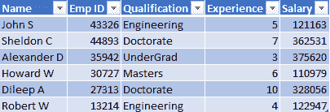
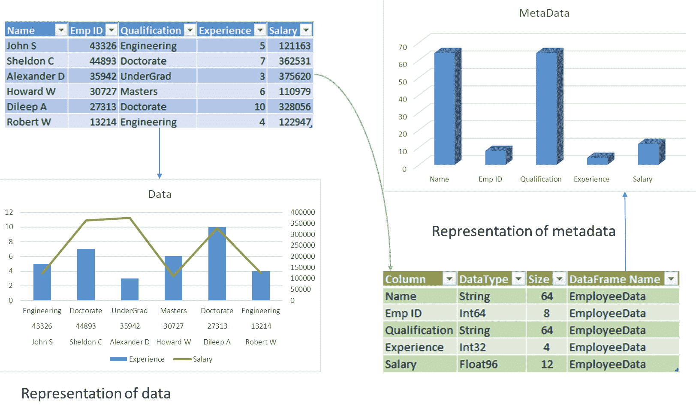
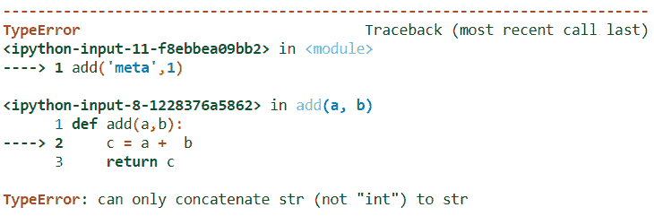
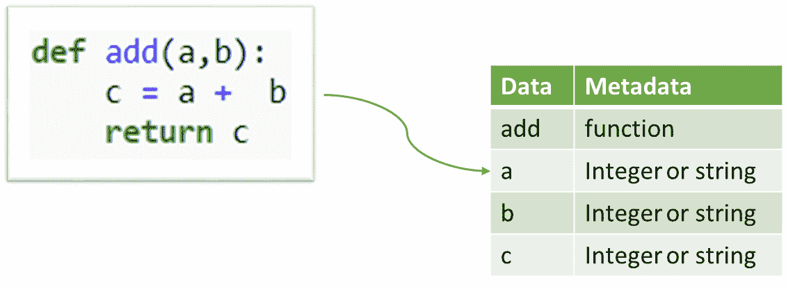
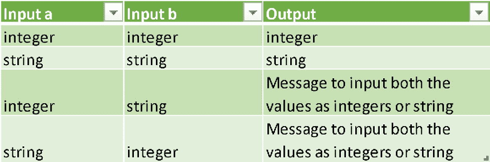
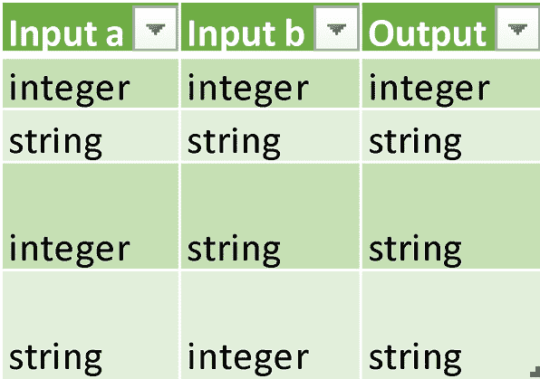
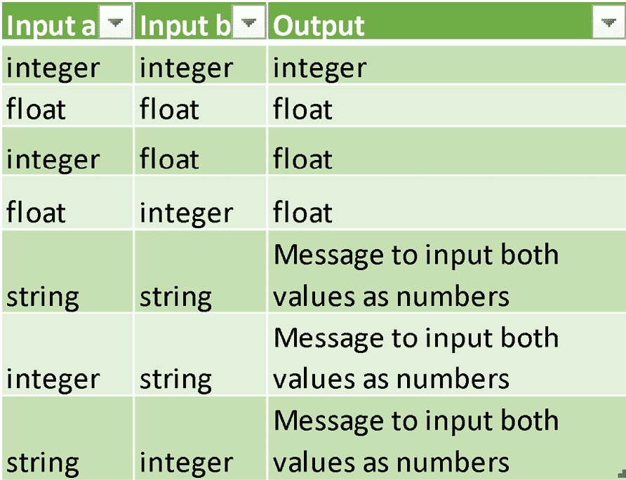
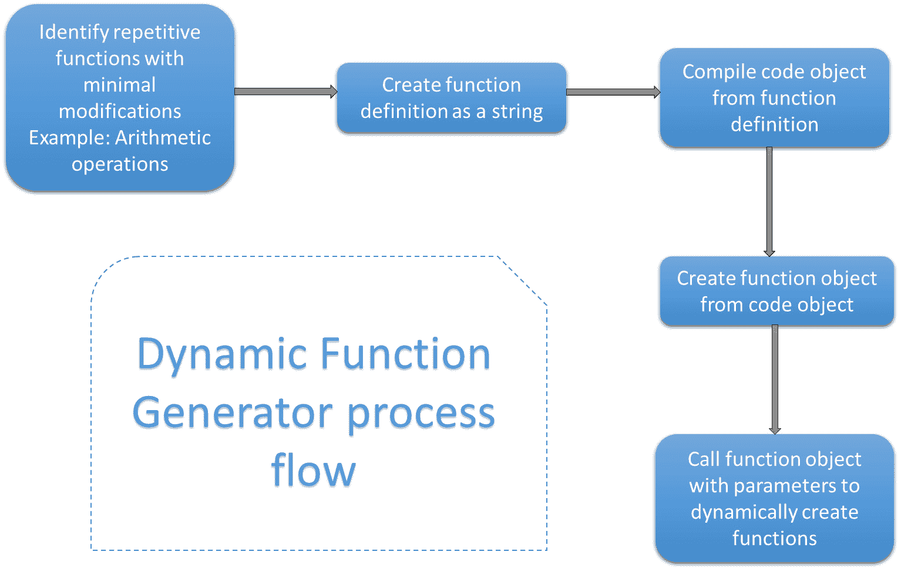
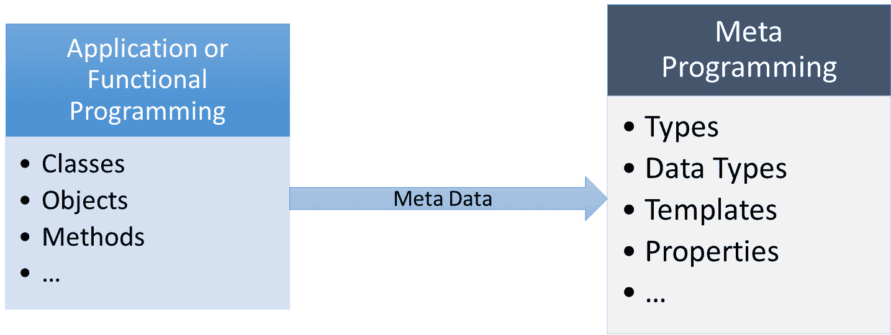

# *第一章*：元编程的需求与应用

*使用 Python 进行元编程*是学习 Python 元编程的实用指南。

在当今的编程世界中，Python 被认为是学习和使用最简单、开发有用应用程序最方便的语言之一。在 Python 中理解编程概念并将其应用比其他任何编程语言都更容易。一个 Python 程序可以通过添加现有库并利用其内置方法来简单地编写。同时，该语言还具有许多强大的功能，可以帮助开发健壮的库和应用。

本书涵盖了 Python 中最先进的功能之一——元编程的需求，以及对其实际应用的见解。理解元编程的概念有助于挖掘 Python 3 的高级功能，并了解在哪里应用它们以使 Python 代码更具可重用性。

与遵循面向对象编程的常规 Python 应用程序开发不同，元编程涵盖了 Python 的一些高级概念，这些概念涉及操作 Python 的可编程对象，例如其类、方法、函数和变量。在本书中，我们将探讨一些应用和示例，以帮助用户以用户友好的方式理解这些概念。

在本章中，我们将介绍元编程以及使用 Python 3 进行元编程的需求。我们将涵盖以下主题：

+   元编程概述

+   理解为什么我们需要元编程

+   探索元编程的应用

到本章结束时，你将对 Python 3 中的元编程有一个高级理解，了解使用它的需求，并知道一些实际的应用示例。

# 技术要求

本章中的代码示例可在 GitHub 仓库中找到，该仓库地址为[`github.com/PacktPublishing/Metaprogramming-with-Python/tree/main/Chapter01`](https://github.com/PacktPublishing/Metaprogramming-with-Python/tree/main/Chapter01)。

# 元编程概述

**元编程**是一个在 C++、Java、.NET 和 Ruby 等其他编程语言中广泛听说，但在 Python 中并不那么广泛听说的概念。Python 是一种易于编程初学者学习且对高级程序员高效实现的编程语言。因此，它在将元编程等技术与开发过程相结合时，具有提高效率和优化的额外优势。

在本书中，我们将深入探讨使用 Python 3 的元编程概念。

术语**元**，正如其名，是一个引用自身或其高级信息的进程。在编程的上下文中，元编程也描述了程序引用自身或程序对象引用自身的类似概念。程序引用自身或其实体提供了有关程序或编程实体的数据，这些数据可以在各种级别上用于执行活动，如转换或操作。

为了理解术语**元**，让我们考虑术语*元数据*。例如，让我们看看一个 Python DataFrame。对于那些不熟悉术语 DataFrame 的人来说，我们可以使用术语*表*。以下截图显示的是称为*Employee Data*的表：



图 1.1 – 员工数据表

此员工数据表包含员工信息，如员工姓名、员工 ID、资格、经验、薪资等。

所有这些信息都是单个或多个员工的属性，它是组织中员工的资料。那么，元数据是什么呢？**元元数据**是员工数据在员工数据表中存储的数据。

员工数据表的元数据定义了每个列及其值在表中是如何存储的。例如，在以下截图中，我们可以看到**Name**作为长度为 64 个字符的字符串存储，而**Salary**作为长度为 12 位的**Float**存储：



图 1.2 – 员工数据表的元数据表示

使用员工姓名或 ID 等信息访问、修改、转换和更新员工数据表是数据操作，而访问、修改、转换和更新列名或员工 ID 或薪资的数据类型或大小是元数据操作。

通过这种理解，让我们看看元编程的一个例子。

## 元编程 – 实用介绍

任何可以用来编写执行动作的代码的编程语言都包含一个基本单元或代码片段，可以编写以执行动作。这被称为函数。

如果我们在两个变量`a`和`b`中存储两个数字，要执行`add`动作，你可以简单地通过编写一个函数来添加这两个数字，如下面的代码块所示：

```py
def add(a,b):    
```

```py
    c = a + b    
```

```py
    return c  
```

现在，如果我们执行此代码，它可以通过`add`函数提供的输入数据执行不同的场景。让我们逐一仔细看看它们。

**场景 1**

使用两个整数运行`add`函数会导致两个数字相加，如下所示：

```py
add(1,3)  
```

```py
4
```

**场景 2**

使用两个字符串运行`add`函数会导致两个单词的连接，如下所示：

```py
add('meta','program')   
```

```py
metaprogram
```

**场景 3**

让我们看看运行`add`函数时一个字符串和一个整数的情况：

```py
add('meta',1)  
```

上述代码将导致以下错误：



图 1.3 – TypeError

让我们详细检查这个错误。

上述代码片段中的错误表示一个`TypeError`，这是由于尝试将一个`meta`字符串与一个整数值`1`相加而引起的。你可能想知道，*我们能否使用元编程来解决这个问题*？

本例中的`add`函数表示一段代码或程序，类似于*图 1.1*中的员工数据表表示数据。在同一行中，我们可以识别`add`函数的元数据，并使用它来解决以下代码返回的`TypeError`对象：

```py
add('meta',1)  
```

接下来，我们将查看元编程的实际示例。我们将利用`add`函数的元数据来理解这个概念。

## add 函数的元数据

任何编程语言中的函数都是编写来对输入变量执行一系列操作的；它将根据对这些变量执行的操作返回结果。在本节中，我们将查看一个简单的函数示例，该函数用于添加两个变量。这将帮助我们理解元编程可以应用于函数，并可以操纵函数的行为而不修改函数的算法。我们将通过编写一个`add`函数来添加这两个变量。为了改变`add`函数的结果，我们将操作其两个输入变量的元数据，从而在每次提供不同类型的输入变量来执行函数时得到不同的结果。就像我们可以通过编写执行各种操作的代码行来操纵函数应该做什么一样，我们也可以通过编程其元数据和设置限制来操纵函数本身，以确定它应该做什么以及不应该做什么。就像数据集、DataFrame 或表格有数据和元数据一样，Python 3 中的程序或函数也有数据和元数据。在本例中，我们将通过限制其行为来操纵`add`函数执行的操作，而不是基于提供给函数的输入数据，而是基于提供给`add`函数的输入数据的*类型*。请看以下截图：



图 1.4 – 检查 add 函数的数据和元数据

以下代码帮助我们识别`add`函数中每个数据项的元数据：

```py
def add(a,b):    
```

```py
    c = a +  b    
```

```py
    print ("Metadata of add", type(add))    
```

```py
    print ("Metadata of a", type(a))    
```

```py
    print ("Metadata of b", type(b))    
```

```py
    print ("Metadata of c", type(c))   
```

对前面函数的函数调用现在将返回`add`函数的元数据而不是其结果。现在，让我们用整数作为输入调用`add`方法：

```py
add(1,3)  
```

我们将得到以下输出：

```py
Metadata of add <class 'function'>
```

```py
Metadata of a <class 'int'>
```

```py
Metadata of b <class 'int'>
```

```py
Metadata of c <class 'int'>
```

同样，我们也可以检查字符串的相加，如下所示：

```py
add('test','string')
```

我们将得到以下输出：

```py
Metadata of add <class 'function'>
```

```py
Metadata of a <class 'str'>
```

```py
Metadata of b <class 'str'>
```

```py
Metadata of c <class 'str'>
```

Python 3 允许我们使用代码的元数据来操作它，使其偏离其实际行为。这还将为我们试图解决的问题提供定制化的解决方案。

在前面的例子中，我们使用了`type`函数，这是 Python 中的一个方法，它返回任何对象或变量所属的类或数据类型。

从前面的输出中可以看出，我们传递给`add`函数的`a`和`b`变量属于整数数据类型，其结果`c`也是一个整数。`add`函数本身是`function`类/类型。

## 使用元编程解决类型错误

我们可以使用元编程从上一节中看到的`add`函数解决类型错误的变体有很多。我们将在本节中探讨这一点。

**场景 1**

以下元程序处理错误，并允许`add`函数添加两个字符串或两个整数。它还建议用户以正确的数据类型输入数据：

```py
def add(a,b):
```

```py
    if (type(a) is str and type(b) is int) or\
```

```py
        (type(a) is int and type(b) is str):
```

```py
        return "Please enter both input values as integers or\
```

```py
          string"
```

```py
    else:
```

```py
        c = a + b
```

```py
        return c  
```

在`add`函数的定义中，我们添加了两个条件——一个用于检查`a`的类型是否为字符串且`b`的类型为 int，或者`a`的类型是否为 int 且`b`的类型为字符串。我们正在检查这些输入变量的组合以处理类型不匹配错误，并指导用户为输入变量提供正确的数据类型。

以下表格显示了输入变量数据类型的各种组合以及根据`add`函数的元数据上设置的条件得出的输出或结果，基于**场景 1**：



图 1.5 – 场景 1 元数据组合

以下代码执行`add`函数以强化在*图 1.5*中解释的输入-输出组合：

```py
add(1,3)  
```

```py
4
```

```py
add('meta','program')  
```

```py
metaprogram
```

```py
add('meta',1)  
```

```py
'Please enter both input values as integers or string'
```

```py
add(1,'meta')  
```

```py
'Please enter both input values as integers or string'
```

**场景 2**

以下元程序通过将不匹配的数据类型转换为字符串变量并执行字符串连接来解决类型不匹配错误。使用`+`运算符连接字符串和整数是合乎逻辑的，因为我们不能对这两种不同的数据类型执行算术加法。看看以下程序：

```py
def add(a,b):
```

```py
    if type(a) is int and type(b) is int:
```

```py
        c = a +  b
```

```py
        return c
```

```py
    elif type(a) is str and type(b) is int or\
```

```py
          type(a) is int and type(b) is str or \
```

```py
          type(a) is str and type(b) is str:
```

```py
        c = str(a) + str(b)
```

```py
        return c
```

```py
    else:
```

```py
        print("Please enter string or integer")
```

在这里，无论我们为`a`和`b`变量提供什么输入，它们都会被转换为字符串变量，然后使用`+`进行连接，而如果这两个输入变量都是整数，它们将使用算术加法相加。

以下表格显示了输入变量数据类型的各种组合以及根据`add`函数的元数据上设置的条件得出的输出或结果，基于**场景 2**：



图 1.6 – 场景 2 元数据组合

执行以下代码将提供我们在前表中看到的输出值组合：

```py
add(1343,35789)  
```

```py
37132
```

```py
add('Meta',' Programming')  
```

```py
'MetaProgramming'
```

```py
add('meta',157676)  
```

```py
'meta157676'
```

```py
add(65081, 'meta')  
```

```py
'65081meta'
```

```py
add(True, 'meta')
```

```py
Please enter string or integer
```

**场景 3**

现在，让我们更进一步，限制`add`函数本身的性质，确保它只执行算术加法，不接受任何其他数据类型或数据类型的组合。

在下面的代码块中，我们添加了另一个条件来对浮点数值进行数据类型检查，同时还有对字符串和整型输入值的数据类型检查。

此函数仅接受数值作为输入，并将返回一条消息，指导用户输入数字，以便仅执行算术加法。让我们看看代码：

```py
def add(a,b):
```

```py
    if type(a) is int and type(b) is int or\
```

```py
       type(a) is float and type(b) is float or\
```

```py
       type(a) is int and type(b) is float or\
```

```py
       type(a) is float and type(b) is int:
```

```py
        c = a +  b
```

```py
        return c
```

```py
    else:
```

```py
        return 'Please input numbers'
```

下表显示了输入变量数据类型的不同组合以及根据在`add`函数的元数据上设置的**场景 3**条件所对应的输出或结果：



图 1.7 – 场景 3 元数据组合

执行以下代码将提供*图 1.7*中显示的输出值组合，包括浮点数的加法：

```py
add(15443,675683)  
```

```py
691126
```

```py
add(54381,3.7876)  
```

```py
54384.7876
```

```py
add(6.7754,543.76)  
```

```py
550.5354
```

```py
add(79894,0.6568)  
```

```py
79894.6568
```

```py
add('meta',14684)  
```

```py
'Please input numbers'
```

```py
add(6576,'meta')  
```

```py
'Please input numbers'
```

```py
add('meta','program')  
```

```py
'Please input numbers'
```

这些是一些可以应用于在函数上执行简单元编程的方法。然而，这些并不是解决类型错误或操作函数的唯一解决方案。使用元编程实现解决方案的方法或途径不止一种。

# 理解为什么我们需要元编程

考虑到我们已经学到的关于元编程的知识，我们可能会思考以下问题：

“*在使用 Python 3 或更高版本开发应用程序时，是否总是必须应用元编程技术或操作代码的元数据？*”

这是一个常见问题，不仅在开发使用 Python 3 或更高版本的应用程序时会被问到，而且在使用任何支持元编程技术并允许开发者在应用程序开发过程中应用它们的编程语言时也会被问到。

要回答这个问题，了解元编程的灵活性和 Python 支持处理代码操作的技术是非常重要的，这些内容将在本书的后续章节中介绍。

应用元编程的一个原因是为了避免在基于 Python 的应用程序开发过程中的各个方面重复。我们将在*不要重复自己*部分中查看一个例子。

换句话说，在元级别引入诸如代码生成器等概念可以节省函数级或领域级编程的开发和执行时间。领域级编程对应于为特定领域编写代码，例如金融、网络、社交媒体等。

另一个需求是在程序元数据级别而不是在功能级别提高代码的抽象程度。**抽象**在字面上或面向对象编程的术语中是指信息隐藏的概念。在元程序级别实现抽象将帮助我们决定向下一级编码提供哪些信息，以及不提供哪些信息。

例如，在元编程级别开发一个函数模板将隐藏在域或功能级别的函数定义，以及限制传递给功能级别代码的信息量。

元编程允许我们使用元数据在元级别上操作程序，这有助于定义你的程序语法和语义应该如何。例如，在*使用元编程解决类型错误*这一节中，我们探讨了通过操作函数的变量来控制函数的数据类型结果。

## 不要重复自己

在任何应用程序开发过程中，都会编写数千行代码。不要重复自己（Don’t Repeat Yourself）是安迪·亨特（Andy Hunt）和大卫·托马斯（Dave Thomas）在他们所著的《程序员修炼之道》（The Pragmatic Programmer）一书中提出的原则。该原则指出：“*系统中的每一项知识都必须有一个单一、明确、权威的表示。*”

在编写代码时，有很大可能性会编写多个执行类似重复任务的函数或方法，而这些函数或方法本身也可能是重复的。这导致应用程序开发中的冗余。冗余的最大缺点是，当你对某个位置进行任何修改时，实现、修改或代码修复需要在多个位置重复进行。

库是通过类和方法开发的，包括面向对象编程技术，如抽象、继承、封装等，以尽可能避免冗余并维护编码标准。即便如此，类中仍有可能存在可以简化的重复方法。

元编程可以通过实现动态代码生成、动态函数创建等方法来帮助处理此类情况。在这本书的整个过程中，我们将探讨各种方法，帮助你在开发应用程序时避免重复。

为了了解我们如何动态生成代码并避免重复，让我们看看一个简单的例子，其中算术运算被实现为重复函数。

以下代码由四个基本算术运算组成，这些运算可以在两个数值变量上执行。我们将声明并定义四个函数，这些函数将执行两个变量`a`和`b`的加、减、乘、除运算，将结果存储在变量`c`中，并在函数执行时返回它：

```py
def add(a,b):  
```

```py
    c = a + b  
```

```py
    return c  
```

```py
def sub(a,b):  
```

```py
    c = a - b  
```

```py
    return c  
```

```py
def multiply(a,b):  
```

```py
    c = a * b  
```

```py
    return c  
```

```py
def divide(a,b):  
```

```py
    c = a / b  
```

```py
    return c  
```

前面的每个函数都需要单独调用，并且需要提供变量作为输入以单独执行，如下所示：

```py
add(2,5)  
```

```py
7
```

```py
sub(2,5)  
```

```py
-3
```

```py
multiply(2,5)  
```

```py
10
```

```py
divide(2,5)  
```

```py
0.4
```

在这个例子中，只有一个区别——函数定义中使用的算术运算符。这个代码可以通过不实现元编程，仅通过声明一个接受额外输入变量运算符的新函数来简化。

让我们学习如何避免这种重复的函数定义并简化逻辑。以下代码块定义了一个通用函数，可以重复使用以执行所有四个算术运算。让我们首先导入 Python 的内置`module`运算符，它包含支持多个算术运算的方法：

```py
import operator as op
```

```py
def arithmetic(a, b, operation):
```

```py
    result = operation(a, b)
```

```py
    return result
```

在这个代码片段中，我们声明了三个变量，包括函数算术中的操作。让我们看看它是如何工作的：

```py
arithmetic('2', '5', op.add) '25'
```

使用输入变量执行此函数将返回一个连接的字符串，`25`，这将用于创建通用的`arithmetic`函数以执行多个操作。我们可以查看提供各种操作作为输入，看看这个通用函数如何服务于多个目的。

使用不同的算术运算符调用此函数可以解决重复函数定义的需求：

```py
arithmetic(2, 5, op.add)
```

```py
7
```

```py
arithmetic(2 , 5, op.sub)
```

```py
-3
```

```py
arithmetic(2, 5, op.mul)
```

```py
10
```

```py
arithmetic(2 , 5, op.truediv)
```

```py
0.4
```

这是解决代码冗余和避免多次函数定义的一种方法。但如果我们不想在需要之前定义函数本身怎么办？

为了回答这个问题，我们可以通过元编程实现动态函数的创建。动态函数在代码运行时根据需要创建。

尽管我们还在介绍章节中，但我们将讨论动态函数创建的示例，以了解本书将涵盖哪种类型的编程。

### 创建动态函数

在本节中，我们将查看一个示例，说明如何为之前在本节中讨论的相同算术运算集创建动态函数。

为了动态创建算术函数，我们需要导入库`types`和`FunctionType`类型。`FunctionType`是用户在基于 Python 的应用程序开发过程中创建的所有用户定义函数的类型：

```py
from types import FunctionType  
```

为了开始这个过程，我们将创建一个字符串变量，它是算术函数的函数定义：

```py
functionstring = '''
```

```py
def arithmetic(a, b):
```

```py
    op = __import__('operator')
```

```py
    result = op.add(a, b)
```

```py
    return result
```

```py
    '''  
```

```py
print(functionstring)
```

我们将得到以下输出：

```py
 def arithmetic(a, b):
```

```py
    op = __import__('operator')
```

```py
    result = op.add(a, b)
```

```py
return result 
```

现在，我们将创建另一个变量，`functiontemplate`，并将`'functionstring'`编译成一个代码对象。我们还将设置代码对象使用`'exec'`来执行。`compile`方法用于将 Python 中的字符串转换为代码对象，该对象可以进一步使用`exec`方法执行：

```py
functiontemplate = compile(functionstring, 'functionstring', 'exec')  
```

```py
functiontemplate 
```

```py
<code object <module> at 0x000001E20D498660, file "functionstring", line 1>
```

函数定义算术的代码对象将被存储在`functiontemplate`中的元组中，可以按以下方式访问：

```py
functiontemplate.co_consts[0]  
```

```py
<code object arithmetic at 0x000001E20D4985B0, file "functionstring", line 1>
```

下一步涉及使用`functiontemplate`代码对象创建一个函数对象。这可以通过使用`FunctionType`方法完成，该方法接受代码对象和全局变量作为输入参数：

```py
dynamicfunction = FunctionType(functiontemplate.co_consts[0], globals(),"add")
```

```py
dynamicfunction  
```

```py
<function _main_.arithmetic(a,b)> 
```

执行`dynamicfunction`后，它将表现得与算术函数中操作模块的`add`方法中的`add`操作相同：

```py
dynamicfunction(2,5)  
```

```py
7
```

现在我们知道了如何动态创建函数，我们可以进一步扩展它以创建多个函数，每个函数具有不同的操作和不同的名称，动态地。

要做到这一点，我们必须创建一个操作符列表和一个函数名列表：

```py
operator = ['op.add','op.sub','op.mul','op.truediv','op.pow','op.mod', 'op.gt', 'op.lt'] 
```

```py
functionname = ['add','sub', 'multiply', 'divide', 'power',\
```

```py
 'modulus', 'greaterthan', 'lesserthan']  
```

我们之前列出的四个函数只包含加、减、乘和除操作。

之前`functionname`列表包含八个函数。这是我们在创建动态函数时获得的灵活性。

为了便于使用，我们还创建了两个输入变量`a`和`b`，用于执行函数时使用：

```py
a = 2  
```

```py
b = 5  
```

在以下代码中，我们将创建一个名为`functiongenerator()`的函数，该函数实现元编程以动态生成我们想要的任意数量的算术函数。此函数将接受四个输入参数——即列表的`functionname`、`operator`、`a`和`b`。

下面是代码：

```py
def functiongenerator(functionname, operator, a,b):    
```

```py
    from types import FunctionType    
```

```py
    functionstring = []    
```

```py
    for i in operator:    
```

```py
        functionstring.append('''
```

```py
def arithmetic(a, b):
```

```py
    op = __import__('operator')
```

```py
    result = '''+ i + '''(a, b)
```

```py
    return result
```

```py
    ''')    
```

```py
        functiontemplate = []    
```

```py
    for i in functionstring:    
```

```py
        functiontemplate.append(compile(i, 'functionstring', 'exec'))    
```

```py
        dynamicfunction = []    
```

```py
    for i,j in zip(functiontemplate,functionname):    
```

```py
        dynamicfunction.append(FunctionType(i.co_consts[0], \
```

```py
          globals(), j))    
```

```py
        functiondict = {}    
```

```py
    for i,j in zip(functionname,dynamicfunction):    
```

```py
        functiondict[i]=j    
```

```py
    for i in dynamicfunction:    
```

```py
        print (i(a,b))    
```

```py
    return functiondict    
```

在`functiongenerator()`内部，发生以下情况：

+   使用操作符列表中提供的每个算术运算符定义，创建一个新的`functionstring`列表。

+   为每个函数定义创建一个新的`functiontemplate`列表，包含代码对象。

+   为每个代码对象创建一个新的`dynamicfunction`列表，包含一个函数对象。

+   创建一个新的`functiondict`字典，包含函数名-函数对象的键值对。

+   `Functiongenerator`返回生成的函数作为字典。

+   此外，`functiongenerator`执行动态函数并打印结果。

执行此函数将产生以下输出：

```py
funcdict = functiongenerator(functionname, operator, a,b)  
```

```py
7
```

```py
-3
```

```py
10
```

```py
0.4
```

```py
32
```

```py
2
```

```py
False
```

```py
True
```

```py
funcdict  
```

```py
{'add': <function _main_.arithmetic(a,b)>,
```

```py
 'sub': <function _main_.arithmetic(a,b)>,
```

```py
 'multiply': <function _main_.arithmetic(a,b)>,
```

```py
 'divide': <function _main_.arithmetic(a,b)>,
```

```py
 'power': <function _main_.arithmetic(a,b)>,
```

```py
 'modulus': <function _main_.arithmetic(a,b)>,
```

```py
 'greaterthan': <function _main_.arithmetic(a,b)>,
```

```py
 'lesserthan': <function _main_.arithmetic(a,b)>,} 
```

可以单独调用前面生成的任何特定函数，并进一步使用，如下所示：

```py
funcdict'divide'  
```

```py
0.4
```

以下图表显示了开发这些动态函数的元编程的完整过程：



图 1.8 – 动态函数生成器

现在我们了解了动态函数生成器，让我们看看元编程的其他应用。

# 探索元编程的应用

元编程可以应用于各种基于 Python 的应用程序开发解决方案，例如自动化代码生成器、基于组件或基于流程的应用程序开发、特定领域语言开发等等。

您开发的任何代码，无论是类还是方法，都内部应用了元编程，并且在 Python 应用程序开发过程中其使用是不可避免的。然而，明确应用元编程概念是一个有意识的决策过程，并且它完全取决于您应用程序的预期结果。

在我们的动态函数创建示例中，我们实现了元编程来避免重复，并确保代码在元级别的抽象。

让我们考虑一个场景，其中我们想要开发一个基于功能流程的应用程序，供非程序员使用。例如，该应用程序可以是一个特定领域的数据库转换工具，它以高层次的抽象工作，并且不向最终用户提供太多设计或开发信息。然而，它也帮助最终用户动态创建模块，这些模块可以帮助他们在特定领域的问题解决中，而无需编写任何程序。在这种情况下，元编程在应用程序开发过程中非常有用：



图 1.9 – 编程层次

在本书的其余部分，我们将更详细地探讨元编程的案例研究和应用。

# 摘要

在本章中，我们提供了一个关于元编程编程范式的快速概述，并查看了一个使用 Python 3 进行元编程解决类型错误的示例。

我们学习了为什么在 Python 应用程序开发过程中需要应用元编程技术。我们还通过查看一个解释动态函数创建的示例实现，了解了“不要重复自己”的概念，该示例强调了避免重复和在代码的元级别实现抽象的概念。最后，我们提供了对本书中将探讨的元编程应用的高级概述。这些技能将帮助我们理解如何在各种应用中应用元编程。

在下一章中，我们将回顾 Python 的对象导向编程概念。下一章更多地是对对象导向编程概念的复习，如果你已经熟悉这些概念，则是可选的。
