# 第二章：*第二章*：Python 中 OOP 概念的复习

在上一章中，我们概述了元编程及其实际应用，例如使用添加函数的需求。但在深入探讨元编程的概念之前，了解 Python 中可用的基本面向对象编程（OOP）概念对你来说很重要。本章概述了现有的 OOP 概念，并附有示例。

本章我们将讨论的主要主题如下：

+   介绍我们的核心示例

+   创建类

+   理解对象

+   应用方法

+   实现继承

+   扩展到多重继承

+   理解多态性

+   使用抽象隐藏细节

+   使用封装保护信息

到本章结束时，你将能够理解 Python 中 OOP 的概念，并附带一些实际示例。

注意

本章完全可选，所以如果你已经熟悉 OOP 的概念，你可以直接学习元编程的概念。

# 技术要求

本章中分享的代码示例可在 GitHub 上找到，地址为：[`github.com/PacktPublishing/Metaprogramming-with-Python/tree/main/Chapter02`](https://github.com/PacktPublishing/Metaprogramming-with-Python/tree/main/Chapter02)。

# 介绍我们的核心示例

在本章中，我们将使用一个名为 *ABC Megamart* 的模拟模式来解释面向对象编程（OOP）的概念。编程语言中面向对象方法的可用性有助于提高语言的有效重用性和抽象性。我们的示例，*ABC Megamart*，是一个模拟的大型零售店，在不同城市销售多种产品，并包含多个分店。

让我们为这个商店的不同实体提供一个结构，并看看它们如何适应一个有组织的面向对象范式。我们的商店包括以下内容：

+   产品

+   分支

+   发票

+   假期

+   货架

+   库存

+   促销

+   优惠/提供

+   兑换柜台

+   财务

这些实体中的每一个都可以有多个数据或信息属性，这些属性对于在商店的顺畅和高效管理中执行多个功能是必需的。

让我们探索如何将这些实体及其属性结构化到通过应用 OOP 概念开发的软件模型中：

+   前面的 10 个实体可以直接或间接地相互连接

+   每个分支都会有促销活动，每个促销活动都会有发票

+   每个分支城市都会有假期，促销活动可以在假期季节进行

+   每个分支（商店）可以有货架，产品将被放置在货架上

+   每个产品都可以有促销或优惠，促销会影响销售

因此，多个实体可以链接在一起以开发软件、维护数据库模式或两者兼而有之，具体取决于所建模的应用。以下是这些实体如何相互连接的表示：

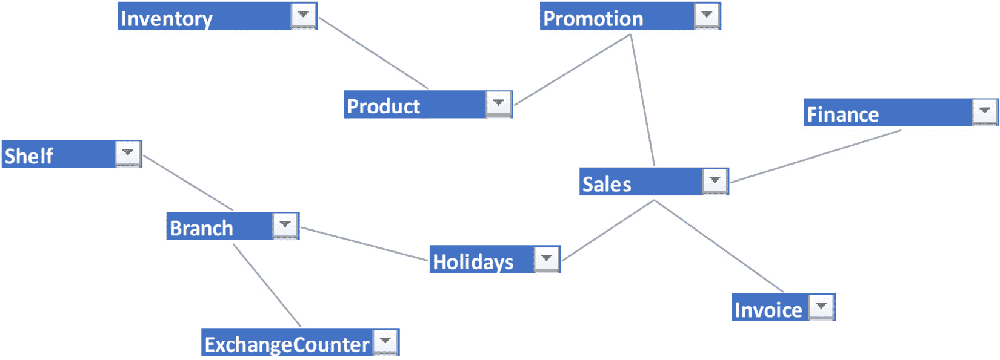

图 2.1 – 简单链接如何建模以连接各种实体的示例

我们可以以多种方式来构建之前的实体模型，但我们不会涵盖所有这些。这更多的是在更高层次上对实体关系的简单表示。

以这个例子为基础，现在让我们深入探讨在 Python 中创建类的话题。

# 创建类

**类**是一组可以由创建类的实例重用的公共属性和方法。通过创建一个类，我们只定义一次并多次重用它，从而避免冗余。

让我们看看一个类可以是什么样的。我们可以考虑*ABC Megamart*的`Branch`实体。一个`Branch`可以有`ID`和`Address`。`Address`可以进一步细分为`Street`、`City`、`State`和`Zip code`。如果我们把`Branch`看作一个类，`ID`、`Street`、`City`、`State`和`Zip code`将成为其属性。所有可以由分支机构执行的操作将成为其方法。

分支可以销售产品、维护发票、维护库存等等。类的通用格式如下：

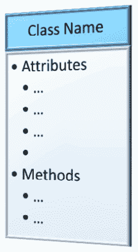

图 2.2 – 类

类可以这样定义：

```py
class ClassName:  
```

```py
    '''attributes...'''        
```

```py
    '''methods...'''  
```

`Branch`类的格式如下：

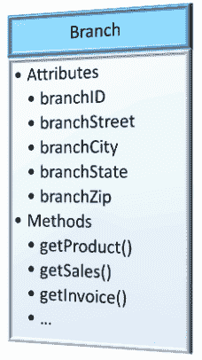

图 2.3 – Branch 类

类似地，可以定义一个`Branch`类如下：

```py
class Branch:  
```

```py
    '''attributes...'''        
```

```py
    '''methods...'''  
```

一个`Branch`类可以有多个属性和方法来执行各种操作。在这个例子中，这些属性和方法将被初始化为 NULL，并添加到类中，如下所示：

```py
class Branch:  
```

```py
    '''attributes'''  
```

```py
    branch_id = None  
```

```py
    branch_street = None  
```

```py
    branch_city = None  
```

```py
    branch_state = None  
```

```py
    branch_zip = None  
```

```py
    '''methods'''  
```

```py
    def get_product(self):  
```

```py
        return 'product'        
```

```py
    def get_sales(self):  
```

```py
        return 'sales'            
```

```py
    def get_invoice(self):  
```

```py
        return 'invoice'  
```

类的属性可以用特定的值初始化，也可以初始化为 NULL，然后在定义类对象并调用它执行各种功能时进行修改。

让我们进一步探讨通过创建类对象来利用和修改这些类属性。

# 理解对象

`ClassName`。

没有对象的类实际上是不可用的。一旦我们创建了一个对象实例，就可以有效地利用为该类创建的所有属性和方法，如下所示：

```py
obj_name = ClassName()  
```

考虑到之前的`Branch`类示例，我们可以创建并使用其对象如下：

```py
branch_albany = Branch()  
```

现在，`branch_albany`是`Branch`类的一个实例，并且可以修改这个实例的所有属性，而不会影响`Branch`类定义中的属性。一个实例更像是一个类的副本，可以在不影响类本身的情况下使用。以下代码作为例子：

```py
branch_albany.branch_id = 123  
```

```py
branch_albany.branch_street = '123 Main Street'  
```

```py
branch_albany.branch_city = 'Albany'  
```

```py
branch_albany.branch_state = 'New York'  
```

```py
branch_albany.branch_zip = 12084  
```

调用先前定义的属性会返回为这些属性定义的以下值：

```py
branch_albany.branch_id  
```

```py
123
```

```py
branch_albany.branch_street  
```

```py
'123 Main Street'
```

我们可以为`Branch`类创建另一个对象，而类本身不会受到影响。然后我们可以为新创建的`branch`对象分配一个`branch_id`的值，如下所示：

```py
branchNevada = Branch()  
```

```py
branchNevada.branch_id  
```

现在，`branchNevada.branch_id` 是 `branchNevada` 对象的变量，它不返回任何值，因为它可以为此实例定义：

```py
branchNevada.branch_id = 456  
```

```py
branchNevada.branch_id  
456
```

这不是使用对象定义类变量值的唯一方法。作为替代，可以将所有属性作为参数添加到类定义中的 `init` 方法中，并在创建对象实例时初始化这些属性的值。为了使这生效，我们必须重新定义 `Branch` 类，如下所示：

```py
class Branch:  
```

```py
    def __init__(self, branch_id, branch_street,
```

```py
       branch_city, branch_state, branch_zip):  
```

```py
        self.branch_id = branch_id  
```

```py
        self.branch_street = branch_street  
```

```py
        self.branch_city = branch_city  
```

```py
        self.branch_state = branch_state  
```

```py
        self.branch_zip = branch_zip    
```

```py
    def get_product(self):  
```

```py
        return 'product'  
```

```py
    def get_sales(self):  
```

```py
        return 'sales'            
```

```py
    def get_invoice(self):  
```

```py
        return 'invoice'  
```

在与之前相同的方法中创建先前重新定义的类的对象实例会导致错误：

```py
object_albany = Branch()  
```

以下是我们收到的错误信息：

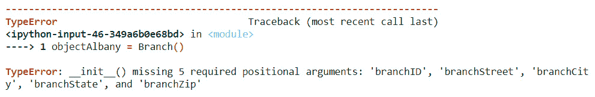

图 2.4 – 缺少必需的参数错误

是的，我们在 `init` 类中声明的所有参数在早期对象实例化中缺失。这个类的新对象需要创建并带有所有初始化的值，如下所示：

```py
object_albany = Branch(101,'123 Main Street','Albany','New York', 12084)  
```

```py
print (object_albany.branch_id, 
```

```py
       object_albany.branch_street,
```

```py
       object_albany.branch_city,
```

```py
       object_albany.branch_state,
```

```py
       object_albany.branch_zip)  
```

```py
101 123 Main Street Albany New York 12084
```

通过这种理解，让我们来看看在类内部定义方法并使用对象调用它们的概念。

# 应用方法

**方法**类似于我们创建以在程序中执行各种操作的用户定义函数，区别在于方法是在类内部定义的，并受类规则的约束。方法只能通过调用为该类创建的对象实例来使用。另一方面，用户定义函数是全局的，可以在程序中的任何地方自由调用。一个方法可以像打印一个语句那样简单，也可以是一个高度复杂的数学计算，涉及大量参数。

在 `Branch` 类内部使用简单的打印语句定义方法如下：

```py
class Branch:  
```

```py
    def __init__(self, branch_id, branch_street, 
```

```py
      branch_city, branch_state, branch_zip):           
```

```py
        self.branch_id = branch_id  
```

```py
        self.branch_street = branch_street  
```

```py
        self.branch_city = branch_city  
```

```py
        self.branch_state = branch_state  
```

```py
        self.branch_zip = branch_zip    
```

```py
    def get_product(self):  
```

```py
        return 'product'        
```

```py
    def get_sales(self):  
```

```py
        return 'sales'            
```

```py
    def get_invoice(self):  
```

```py
        return 'invoice'  
```

```py
object_albany = Branch(101,'123 Main Street','Albany','New York', 12084) 
```

通过从 `object_albany` 调用上述方法，我们将得到以下输出：

```py
object_albany.get_invoice()  
```

```py
'invoice'
```

```py
object_albany.get_sales()  
```

```py
'sales'
```

```py
object_albany.get_product()  
```

```py
'product'
```

作为一种变体，我们可以看看创建带有参数和计算的方法的例子。对于这个例子，让我们考虑一个场景，其中我们需要根据州的销售税率、产品的购买价格和利润率来计算特定分支的产品销售价格。在计算产品的销售价格后，该方法应返回分支详情、产品详情、销售价格和销售税。

要编写这个方法，我们将使用 Python 关键字参数创建三个字典变量，并分别命名为 `**branch`、`**sales` 和 `**product`。我们将创建三个方法来设置分支、销售和产品信息，如下所示：

```py
class Branch:       
```

```py
    def set_branch(self, **branch):  
```

```py
        return branch        
```

```py
    def set_sales(self, **sales):  
```

```py
        return sales        
```

```py
    def set_product(self, **product):  
```

```py
        return product  
```

上述代码接收了可以为分支、销售和产品包含的所有值。我们将为 `Branch` 类创建一个对象：

```py
branch_nyc = Branch()  
```

在下面的代码中，我们将使用 `set_branch` 方法来存储 `Branch` 对象内部的 `branch` 字典变量中的值：

```py
branch_nyc.branch = branch_nyc.set_branch(branch_id = 202,  
```

```py
branch_street = '234 3rd Main Street',  
```

```py
branch_city = 'New York City',  
```

```py
branch_state = 'New York',  
```

```py
branch_zip = 11005)  
```

现在，我们将按照以下方式在 `branch_nyc` 对象上调用 `branch` 属性：

```py
branch_nyc.branch
```

执行前面的代码会产生以下输出，这是一个包含`branch_id`及其地址的字典：

```py
{'branch_id': 202,
```

```py
 'branch_street': '234 3rd Main Street',
```

```py
 'branch_city': 'New York City',
```

```py
 'branch_state': 'New York',
```

```py
 'branch_zip': 11005}
```

同样，在下面的代码中，我们将使用`set_product`方法在`Branch`对象的`product`字典变量中存储值：

```py
branch_nyc.product = branch_nyc.set_product(  
```

```py
    product_id = 100001,  
```

```py
    product_name = 'Refrigerator',  
```

```py
    productBrand = 'Whirlpool'  )
```

现在，我们将按照以下方式在`branch_nyc`对象上调用`product`属性：

```py
branch_nyc.product
```

执行前面的代码会产生以下输出，这是一个包含所有产品 ID 及其详细信息的字典：

```py
{'product_id': 100001,
 'product_name': 'Refrigerator',
 'productBrand': 'Whirlpool'}
```

同样，在以下代码中，我们将使用`set_sales`方法在`Branch`对象的`sales`字典变量中存储值：

```py
branch_nyc.sales = branch_nyc.set_sales(  
```

```py
    purchase_price = 300,  
```

```py
    profit_margin = 0.20,  
```

```py
    tax_rate = 0.452  
```

```py
)  
```

现在，我们将按照以下方式在`branch_nyc`对象上调用`sales`属性：

```py
branch_nyc.sales
```

执行前面的代码会产生以下输出，这是一个包含所有销售信息的字典：

```py
{'purchase_price': 300,
 'profit_margin': 0.2,
 'tax_rate': 0.452,
 'selling_price': 522.72}
```

计算销售价格将通过以下两个步骤来完成：

1.  通过将购买价格加上购买价格和利润率百分比之间的产品，来计算税前价格。

1.  通过将税前价格加上产品之间的价格，来计算销售价格。

在以下代码中，我们将包含`calc_tax`方法来执行前面的计算步骤，并返回分支详情以及产品信息和销售数据：

```py
class Branch:  
```

```py
     def set_branch(self, **branch):  
```

```py
        return branch        
```

```py
    def set_sales(self, **sales):  
```

```py
        return sales        
```

```py
    def set_product(self, **product):  
```

```py
        return product    
```

```py
    def calc_tax(self):  
```

```py
        branch = self.branch  
```

```py
        product = self.product  
```

```py
        sales = self.sales  
```

```py
        pricebeforetax = sales['purchase_price'] + \
```

```py
        sales['purchase_price'] * sales['profit_margin']  
```

```py
        finalselling_price = pricebeforetax + \
```

```py
        (pricebeforetax * sales['tax_rate'])  
```

```py
        sales['selling_price'] = finalselling_price  
```

```py
        return branch, product, sales  
```

调用前面的函数会提供以下结果：

```py
branch_nyc.calc_tax()
```

```py
({'branch_id': 202,
```

```py
  'branch_street': '234 3rd Main Street',
```

```py
  'branch_city': 'New York City',
```

```py
  'branch_state': 'New York',
```

```py
  'branch_zip': 11005},
```

```py
 {'product_id': 100001,
```

```py
  'product_name': 'Refrigerator',
```

```py
  'productBrand': 'Whirlpool'},
```

```py
 {'purchase_price': 300,
```

```py
  'profit_margin': 0.2,
```

```py
  'tax_rate': 0.452,
```

```py
  'selling_price': 522.72})
```

现在我们知道了如何应用方法，我们可以进一步了解继承的概念。

# 实现继承

**继承**在字面上的意思是通过子类获得父类的属性，在面向对象编程中也意味着相同。一个新类可以继承父类的属性和方法，它也可以有自己的属性和方法。继承父类的新类将被称为子类或子类，而父类也可以被称为基类。以下是对其的简单表示：

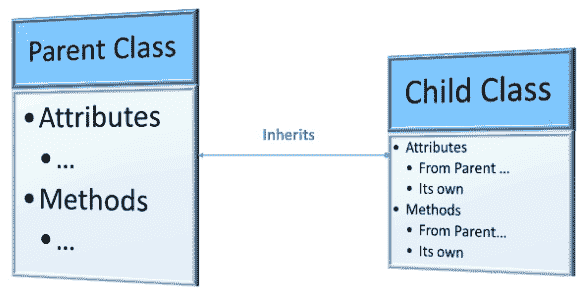

图 2.5 – 继承

将我们最新的`Branch`类定义扩展为具有单独的`NYC`类——因为它有多个城市内部分支，并且它还具有除了`Branch`类之外的其他属性——我们将应用继承来创建一个新的子类或子类，名为`NYC`。它具有如具有多个管理层级等属性。NYC 有一个区域经理，每个分支都有自己的分支经理。对于 NYC，我们还将向销售价格的计算中添加一个额外的本地税率组件，该税率因分支而异。

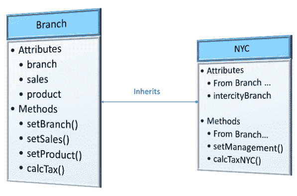

图 2.6 – NYC 类继承自 Branch 类

定义一个从父类继承的子类时的继承一般结构如下所示：

```py
class Parent:  
```

```py
    '''attributes...'''  
```

```py
    '''methods...'''   
```

```py
class Child(Parent):  
```

```py
    '''attributes...'''  
```

```py
    '''methods...'''  
```

从`Branch`父类继承`NYC`子类可以定义如下：

```py
class NYC(Branch):  
```

```py
    def set_management(self, **intercitybranch):  
```

```py
        return intercitybranch  
```

```py
    def calc_tax_nyc(self):  
```

```py
        branch = self.branch  
```

```py
        intercitybranch = self.intercitybranch  
```

```py
        product = self.product  
```

```py
        sales = self.sales  
```

```py
        pricebeforetax = sales['purchase_price'] + \
```

```py
        sales['purchase_price'] * sales['profit_margin']  
```

```py
        finalselling_price = pricebeforetax + \
```

```py
        (pricebeforetax * (sales['tax_rate'] +\
```

```py
         sales['local_rate']))    
```

```py
        sales['selling_price'] = finalselling_price  
```

```py
        return branch,intercitybranch, product, sales    
```

在进一步创建对象之前，让我们检查前面的代码。`NYC`子类有自己的附加属性`intercitybranch`，它作为其自己的方法`set_management`的参数引入。纽约市还有一个自己的计算税的方法，即`calc_tax_nyc`。纽约市的`calc_tax_nyc`方法包括一个额外的组件`local_rate`来计算售价。

现在，让我们检查纽约市是否可以使用`Branch`类的这些方法来设置分支、产品和销售的新值：

```py
branch_manhattan = NYC()
```

通过检查`branch_manhattan`对象中可用的方法，如下面的截图所示，我们可以看到纽约市可以利用`Branch`类中定义的集合方法：

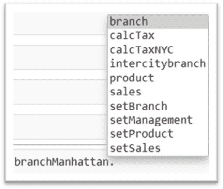

图 2.7 – 从 Branch 继承的设置方法

我们可以通过使用所有这些方法设置属性，并在计算曼哈顿分支的销售税和地方税率后计算售价，如下所示：

```py
branch_manhattan.branch = branch_manhattan.set_branch(branch_id = 2021,  
```

```py
branch_street = '40097 5th Main Street',  
```

```py
branch_borough = 'Manhattan',
```

```py
branch_city = 'New York City',  
```

```py
branch_state = 'New York',  
```

```py
branch_zip = 11007)  
```

我们将调用`branch_manhattan`对象上的`branch`属性，如下所示：

```py
branch_manhattan.branch
```

```py
{'branch_id': 2021,
```

```py
 'branch_street': '40097 5th Main Street',
```

```py
 'branch_borough': 'Manhattan',
```

```py
 'branch_city': 'New York City',
```

```py
 'branch_state': 'New York',
```

```py
 'branch_zip': 11007}
```

在下面的代码中，我们将使用`set_management`方法将值存储在纽约市对象内的`intercitybranch`字典变量中：

```py
branch_manhattan.intercitybranch = branch_manhattan.set_management(  
```

```py
    regional_manager = 'John M',  
```

```py
    branch_manager = 'Tom H',  
```

```py
    subBranch_id = '2021-01'      
```

```py
)  
```

让我们称`branch_manhattan`对象上的`intercitybranch`属性，如下所示：

```py
branch_manhattan.intercitybranch
```

```py
{'regional_manager': 'John M',
```

```py
 'branch_manager': 'Tom H',
```

```py
 'subBranch_id': '2021-01'}
```

同样，在下面的代码中，我们将使用`set_product`方法将值存储在纽约市对象内的`product`字典变量中：

```py
branch_manhattan.product = branch_manhattan.set_product(  
```

```py
    product_id = 100002,  
```

```py
    product_name = 'WashingMachine',  
```

```py
    productBrand = 'Whirlpool'    
```

```py
)  
```

现在，我们将调用`branch_manhattan`对象上的`product`属性：

```py
branch_manhattan.product
```

```py
{'product_id': 100002,
```

```py
 'product_name': 'WashingMachine',
```

```py
 'productBrand': 'Whirlpool'}
```

同样，在下面的代码中，我们将使用`set_sales`方法将值存储在纽约市对象内的`sales`字典变量中：

```py
branch_manhattan.sales = branch_manhattan.set_sales(  
```

```py
    purchase_price = 450,  
```

```py
    profit_margin = 0.19,  
```

```py
    tax_rate = 0.4,  
```

```py
    local_rate = 0.055      
```

```py
) 
```

我们将进一步调用`branch_manhattan`对象上的`sales`属性，如下所示：

```py
branch_manhattan.sales
{'purchase_price': 450,
 'profit_margin': 0.19,
 'tax_rate': 0.4,
 'local_rate': 0.055}
```

在所有前面的属性及其值分配之后，我们可以使用以下代码计算曼哈顿分支的税：

```py
branch_manhattan.calc_tax_nyc()
```

```py
({'branch_id': 2021,
```

```py
  'branch_street': '40097 5th Main Street',
```

```py
  'branch_borough': 'Manhattan',
```

```py
  'branch_city': 'New York City',
```

```py
  'branch_state': 'New York',
```

```py
  'branch_zip': 11007},
```

```py
 {'regional_manager': 'John M',
```

```py
  'branch_manager': 'Tom H',
```

```py
  'subBranch_id': '2021-01'},
```

```py
 {'product_id': 100002,
```

```py
  'product_name': 'WashingMachine',
```

```py
  'productBrand': 'Whirlpool'},
```

```py
 {'purchase_price': 450,
```

```py
  'profit_margin': 0.19,
```

```py
  'tax_rate': 0.4,
```

```py
  'local_rate': 0.055,
```

```py
  'selling_price': 779.1525})
```

如果我们不想根据地方税率计算售价，我们仍然可以使用`Branch`类中可用的`calc_tax`方法：

```py
branch_manhattan.calc_tax()
```

```py
({'branch_id': 2021,
```

```py
  'branch_street': '40097 5th Main Street',
```

```py
  'branch_borough': 'Manhattan',
```

```py
  'branch_city': 'New York City',
```

```py
  'branch_state': 'New York',
```

```py
  'branch_zip': 11007},
```

```py
 {'product_id': 100002,
```

```py
  'product_name': 'WashingMachine',
```

```py
  'productBrand': 'Whirlpool'},
```

```py
 {'purchase_price': 450,
```

```py
  'profit_margin': 0.19,
```

```py
  'tax_rate': 0.4,
```

```py
  'local_rate': 0.055,
```

```py
  'selling_price': 749.7})
```

前面的代码及其输出展示了面向对象编程中继承的可重用性。现在让我们看看一个扩展的概念，即多重继承。

# 扩展到多重继承

Python 也支持`Product`和`Branch`，并让`Sales`类继承这两个基类。以下是我们将使用的逻辑的快速表示：

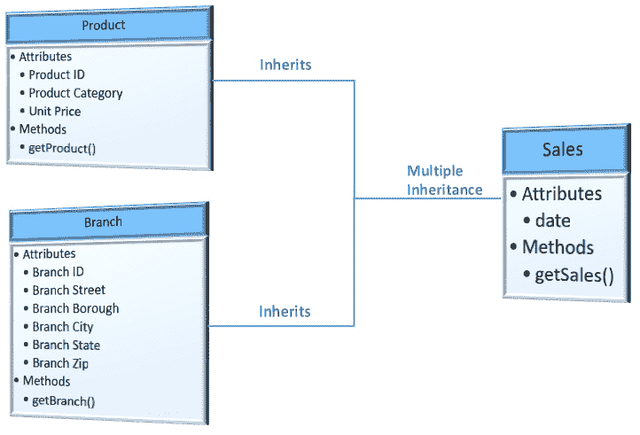

图 2.8 – 多重继承示例

在下面的代码中，我们将创建一个`Product`类，在其中我们将定义产品的属性和一个`get_product`方法来返回产品详情：

```py
class Product:  
```

```py
    _product_id = 100902  
```

```py
    _product_name = 'Iphone X'  
```

```py
    _product_category = 'Electronics'  
```

```py
    _unit_price = 700  
```

```py
    def get_product(self):  
```

```py
        return self._product_id, self._product_name,\
```

```py
           self._product_category, self._unit_price  
```

我们还将创建另一个类`Branch`，在其中我们将定义分支的属性和一个`get_branch`方法来返回分支详情：

```py
class Branch:  
```

```py
    _branch_id = 2021  
```

```py
    _branch_street = '40097 5th Main Street'  
```

```py
    _branch_borough = 'Manhattan'  
```

```py
    _branch_city = 'New York City'  
```

```py
    _branch_state = 'New York'  
```

```py
    _branch_zip = 11007  
```

```py
    def get_branch(self):  
```

```py
        return self._branch_id, self._branch_street, \
```

```py
          self._branch_borough, self._branch_city, \
```

```py
          self._branch_state, self._branch_zip  
```

我们将通过将两个父类 `Product` 和 `Branch` 继承到子类 `Sales` 中来实现多重继承的概念：

```py
class Sales(Product, Branch):  
```

```py
    date = '08/02/2021'  
```

```py
    def get_sales(self):  
```

```py
        return self.date, Product.get_product(self), \
```

```py
          Branch.get_branch(self)  
```

在前面的代码中，`Sales` 类分别从 `Product` 类和 `Branch` 类继承了两个方法，分别是 `get_product` 和 `get_branch`。

在以下代码中，我们将为 `Sales` 类创建一个对象：

```py
sales = Sales()
```

从 `Sales` 类调用 `get_sales` 方法会返回 `Sales` 类的 `date` 属性以及其父类中的 `product` 和 `branch` 属性：

```py
sales.get_sales()
```

```py
('08/02/2021',
```

```py
 (100902, 'Iphone X', 'Electronics', 700),
```

```py
 (2021,
```

```py
  '40097 5th Main Street',
```

```py
  'Manhattan',
```

```py
  'New York City',
```

```py
  'New York',
```

```py
  11007))
```

通过这些示例，我们可以进一步了解多态的概念，它扩展了我们之前关于继承的例子。

# 理解多态

**多态** 是面向对象范式中的一个概念，我们可以通过重新定义或覆盖现有函数，或者为两个具有相同名称的不同类创建两个不同的函数来重用父类中函数的名称。在本节中，我们将探讨多态的两种变体示例：

+   多态在继承中

+   独立类中的多态

## 多态在继承中

让我们看看之前提到的子类 `NYC` 的例子，它从 `Branch` 类继承。为了计算特定分支的销售价格以及本地税率，我们在 `NYC` 类中创建了一个名为 `calc_tax_nyc` 的新方法。我们也可以在子类中通过覆盖父类 `calc_tax` 方法并使用新的计算来实现这一点。这个概念是继承中的多态。以下是它的表示：

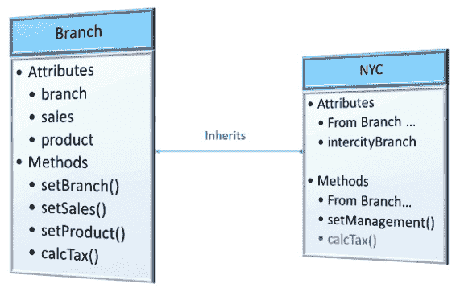

图 2.9 – NYC 子类中覆盖的 calc_tax 方法

首先，让我们回顾一下 `Branch` 类中的 `calc_tax` 方法，然后我们可以在子类 `NYC` 中覆盖它：

```py
class Branch:
```

```py
    def calc_tax(self):
```

```py
        branch = self.branch
```

```py
        product = self.product
```

```py
        sales = self.sales
```

```py
        pricebeforetax = sales['purchase_price'] + \
```

```py
        sales['purchase_price'] * sales['profit_margin']
```

```py
        finalselling_price = pricebeforetax + \
```

```py
        (pricebeforetax * sales['tax_rate'])
```

```py
        sales['selling_price'] = finalselling_price
```

```py
        return branch, product, sales
```

现在，我们将通过继承 `Branch` 类来定义 `NYC` 类。这个类有两个方法，`set_management` 和 `calc_tax`。`set_management` 方法返回 `intercitybranch` 作为字典属性。`calc_tax` 方法现在在子类 `NYC` 中被覆盖，并返回分支详情、城际分支详情、产品详情和销售详情：

```py
class NYC(Branch):  
```

```py
    def set_management(self, **intercitybranch):  
```

```py
        return intercitybranch  
```

```py
    def calc_tax(self):  
```

```py
        branch = self.branch  
```

```py
        intercitybranch = self.intercitybranch  
```

```py
        product = self.product  
```

```py
        sales = self.sales  
```

```py
        pricebeforetax = sales['purchase_price'] + \
```

```py
        sales['purchase_price'] * sales['profit_margin']  
```

```py
        finalselling_price = pricebeforetax + \
```

```py
        (pricebeforetax * (sales['tax_rate'] + \
```

```py
        sales['local_rate']))    
```

```py
        sales['selling_price'] = finalselling_price  
```

```py
        return branch,intercitybranch, product, sales     
```

```py
branch_manhattan = NYC()
```

以下是对子类 `NYC` 的 `branch_manhattan` 对象支持的所有方法的表示：

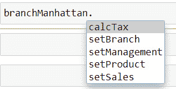

图 2.10 – 多态后的 calc_tax

以下代码显示了调用 `branch_manhattan` 中的 `calc_tax` 方法的输出，这是从其父类中覆盖的方法，用于在应用本地税率后计算销售价格：

```py
branch_manhattan.calc_tax()
```

```py
({'branch_id': 2021,
```

```py
  'branch_street': '40097 5th Main Street',
```

```py
  'branch_borough': 'Manhattan',
```

```py
  'branch_city': 'New York City',
```

```py
  'branch_state': 'New York',
```

```py
  'branch_zip': 11007},
```

```py
 {'regional_manager': 'John M',
```

```py
  'branch_manager': 'Tom H',
```

```py
  'subBranch_id': '2021-01'},
```

```py
 {'product_id': 100002,
```

```py
  'product_name': 'WashingMachine',
```

```py
  'productBrand': 'Whirlpool'},
```

```py
 {'purchase_price': 450,
```

```py
  'profit_margin': 0.19,
```

```py
  'tax_rate': 0.4,
```

```py
  'local_rate': 0.055,
```

```py
  'selling_price': 779.1525})
```

如我们所见，`calc_tax` 方法返回了在 NYC 中定义的输出。

## 独立类中的多态

多态不一定要发生在父-子类关系中。我们总是可以有两个完全不同的类，它们可以有两个具有相同名称的不同函数定义，并且可以通过调用它们的类对象实例来利用这两个函数。

对于这个例子，我们将创建两个独立的类，`Queens`和`Brooklyn`，它们是*ABC Megamart*的两个不同分支。我们将不会将这些分支与`Branch`父类关联，以解释独立类中多态的概念。Brooklyn 分支只存储`maintenance_cost`，并按照每个分支的存储要求来定义它们。

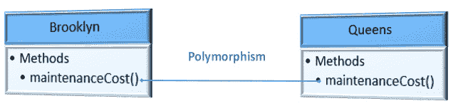

图 2.11 – 独立类中一个方法的多态

在下面的代码中，对于`Brooklyn`类，我们只有在产品类型是`FMCG`时才计算维护成本。我们将计算数量成本为 0.25 的乘积，并额外加 100 美元用于冷藏。如果产品类型不是 FMCG，我们将通知您该产品将不会入库。让我们看看代码：

```py
class Brooklyn:  
```

```py
    def maintenance_cost(self, product_type, quantity):  
```

```py
        self.product_type = product_type  
```

```py
        self.quantity = quantity  
```

```py
        coldstorage_cost = 100  
```

```py
        if (product_type == 'FMCG'):  
```

```py
            maintenance_cost = self.quantity * 0.25 + \
```

```py
              coldstorage_cost      
```

```py
            return maintenance_cost  
```

```py
        else:  
```

```py
            return "We don't stock this product"  
```

在下面的代码中，对于`Queens`类，我们只有在产品类型是`Electronics`时才计算维护成本。由于电子产品的维护成本较低，并且这里也不需要冷藏成本，我们将计算数量成本为 0.05。如果产品类型不是`Electronics`，我们将通知您该产品将不会入库：

```py
class Queens:  
```

```py
    def maintenance_cost(self, product_type, quantity):  
```

```py
        self.product_type = product_type  
```

```py
        self.quantity = quantity  
```

```py
        if (product_type == 'Electronics'):  
```

```py
            maintenance_cost = self.quantity * 0.05  
```

```py
            return maintenance_cost  
```

```py
        else:  
```

```py
            return "We don't stock this product"  
```

请注意，我们在前几个例子中都使用了相同的函数名。下一步是调用这些函数。每个函数都可以通过为每个类创建一个对象来调用，即使它们在同一个程序中使用，这些函数也可以分别访问以执行不同的计算：

```py
object_brooklyn = Brooklyn()  
```

```py
object_queens = Queens()  
```

```py
object_brooklyn.maintenance_cost('FMCG', 2000)  
```

```py
600.0
```

```py
object_queens.maintenance_cost('Electronics', 2000)  
```

```py
100.0
```

我们现在已经理解了类中多态的概念。接下来，我们将探讨抽象，它的工作方式与多态类似，但有一个将在下一节中进一步解释的差异。

# 通过抽象隐藏细节

可以导入`ABC`来定义抽象基类。抽象更像是向外部用户提供一个黑盒，不透露类内部定义的各种方法的全部细节，而是提供一个参考类，帮助外部用户根据他们的需求实现方法。

例如，布鲁克林分部的用户不需要知道由皇后分部处理的计算来计算他们的维护成本。布鲁克林分部用户需要知道的信息是他们可以继承`Branch`类，并根据他们自己的账簿实现维护成本的计算，他们无需担心皇后分部是如何计算他们的维护成本的。同时，作为他们父类的`Branch`类，将无法提供一个通用的计算维护成本的实施方案，因为计算将根据分部而有所不同。在这种场景下，`Branch`类可以创建一个抽象方法`maintenance_cost`，并让它的子类或子类根据它们的要求实现它。布鲁克林对`maintenance_cost`方法的实现不会影响皇后对同一方法的实现；实现的目的是在子类内部结束，父抽象类始终可供其他子类定义它们自己的实现。

如果这种实现可以通过简单地应用多态到父类方法来完成，那么我们为什么还需要一个抽象类来做同样的事情？让我们首先通过实现一个父类及其子类，而不实际将其实现为抽象类来看一下：

```py
class Branch():     
```

```py
    def maintenance_cost(self):     
```

```py
        pass    
```

```py
class Brooklyn(Branch):     
```

```py
    def maintenance_cost(self, product_type, quantity):    
```

```py
        self.product_type = product_type    
```

```py
        self.quantity = quantity    
```

```py
        coldstorage_cost = 100    
```

```py
        if (product_type == 'FMCG'):    
```

```py
            maintenance_cost = self.quantity * 0.25 + \
```

```py
              coldstorage_cost        
```

```py
            return maintenance_cost    
```

```py
        else:    
```

```py
            return "We don't stock this product"    
```

```py
class Queens(Branch):    
```

```py
    def maintenance_cost(self, product_type, quantity):    
```

```py
        self.product_type = product_type    
```

```py
        self.quantity = quantity    
```

```py
        if (product_type == 'Electronics'):    
```

```py
            maintenance_cost = self.quantity * 0.05    
```

```py
            return maintenance_cost    
```

```py
        else:    
```

```py
            return "We don't stock this product"    
```

在前面的实现中，我们为`Branch`类创建了两个子类，并且已经应用了多态来重写父类方法，但这仍然不是一个抽象，因为我们仍然能够为父类创建一个对象实例，并且当创建对象时，父类的方法可以被暴露出来。

与前面的实现不同，如果我们稍作修改，将`Branch`创建为一个抽象基类，让我们看看会发生什么。以下是我们要达到的表示：

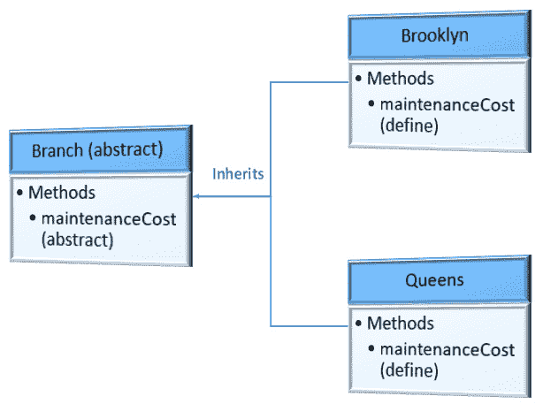

图 2.12 -– 抽象类被两个类继承并实现了方法

这里，我们将从`abc`库中导入`ABC`和`abstractmethod`，并创建一个名为`Branch`的抽象类，后面跟着两个子类`Brooklyn`和`Queens`，它们继承自父类`Branch`：

```py
from abc import ABC,abstractmethod   
```

```py
class Branch(ABC):   
```

```py
    @abstractmethod  
```

```py
    def maintenance_cost(self):   
```

```py
        pass  
```

```py
class Brooklyn(Branch):   
```

```py
    def maintenance_cost(self, product_type, quantity):  
```

```py
        self.product_type = product_type  
```

```py
        self.quantity = quantity  
```

```py
        coldstorage_cost = 100  
```

```py
        if (product_type == 'FMCG'):  
```

```py
            maintenance_cost = self.quantity * 0.25 + \
```

```py
              coldstorage_cost      
```

```py
            return maintenance_cost  
```

```py
        else:  
```

```py
            return "We don't stock this product"  
```

```py
class Queens(Branch):  
```

```py
    def maintenance_cost(self, product_type, quantity):  
```

```py
        self.product_type = product_type  
```

```py
        self.quantity = quantity  
```

```py
        if (product_type == 'Electronics'):  
```

```py
            maintenance_cost = self.quantity * 0.05  
```

```py
            return maintenance_cost  
```

```py
        else:  
```

```py
            return "We don't stock this product"  
```

我们导入了`ABC`库，将`Branch`创建为一个抽象类，并使用`@abstractmethod`关键字定义了`maintenance_cost`为抽象方法。

现在我们尝试创建一个`Branch`类的对象：

```py
branch = Branch()
```

它抛出了以下错误：

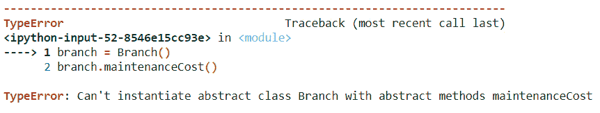

图 2.13 – 抽象方法实例化错误

如果为类实例化一个对象，则可以通过该对象访问类的所有属性和方法。这在常规类中是可能的；而在抽象类的情况下，不能实例化对象。这就是为什么隐藏不需要与外部用户共享的信息是有帮助的。

抽象是 Python 或其他任何面向对象语言中信息保护的一种方法。现在我们将看看封装以及如何在类中保护信息的更多细节。

# 使用封装保护信息

`__`（双下划线）和受保护的成员或变量以前缀`_`（单下划线）开头。我们将查看一些私有和受保护的类成员的示例。

## 私有成员

在 Python 中，不存在像其他面向对象语言那样的私有变量概念。然而，我们可以在变量或方法名前添加两个下划线符号，以表示特定的变量将在类内部用作私有成员。这样做是为了让开发者理解程序如何将变量视为私有。在变量或方法名前添加两个下划线可以防止 Python 解释器在继承期间进行名称混淆，以避免与变量发生冲突，并且它并不是像其他语言那样的实际私有成员。

在这个例子中，我们将定义我们熟悉的`Branch`类，其中包含产品 ID、产品名称、品牌、购买价格和利润率的私有变量，并创建一个用于显示产品详情的私有方法。我们还将创建分支 ID、区域经理和分支经理作为非私有类变量，并查看使用对象从类外部访问这些变量的区别。


图 2.14 – `Branch`类的私有成员及其通过`Branch`对象的可访问性

让我们看一下以下代码来实现这个示例：

```py
class Branch():  
```

```py
    branch_id = 2021  
```

```py
    regional_manager = 'John M'  
```

```py
    branch_manager = 'Tom H'  
```

```py
    __product_id = None  
```

```py
    __product_name = None  
```

```py
    __productBrand = None  
```

```py
    __purchase_price = None  
```

```py
    __profit_margin = None  
```

```py
    def __display_product_details(self):  
```

```py
        self.__product_id = 100002  
```

```py
        self.__product_name = 'Washing Machine'  
```

```py
        self.__productBrand = 'Whirlpool'  
```

```py
        self.__purchase_price = 450  
```

```py
        self.__profit_margin = 0.19  
```

```py
        print('Product ID: ' + str(self.__product_id) + ',\
```

```py
          Product Name: ' + self.__product_name +  
```

```py
          ', Product Brand: ' + self.__productBrand + ',\
```

```py
          Purchase Price: ' + str(self.__purchase_price)
```

```py
          + ', Profit Margin: ' +  str(self.__profit_margin))  
```

```py
    def __init__(self):  
```

```py
        self.__display_product_details()  
```

在为`Branch`类创建对象实例时，我们将能够查看`__display_product_details`方法的输出结果，因为它是在类内部使用默认的`__init__`方法调用的：

```py
branch = Branch()
```

输出如下：

```py
Product ID: 100002, Product Name: Washing Machine, Product Brand: Whirlpool, Purchase Price: 450, Profit Margin: 0.19
```

让我们尝试访问`branch_id`变量，它没有被声明为私有：

```py
branch.branch_id
```

输出如下：

```py
2021
```

我们能够访问这个变量。现在让我们尝试访问`profit_margin`，它使用双下划线前缀声明：

```py
branch.__profit_margin
```

它给出了以下错误：

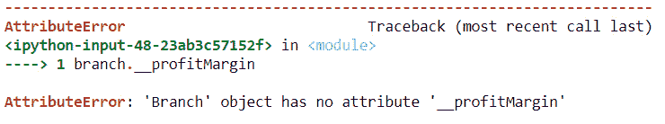

图 2.15 – 访问类私有变量的错误

我们得到一个错误，因为这个变量只能在类内部访问，不能通过类的对象访问，这是由于名称混淆造成的。同样的情况也适用于创建用于显示产品详情的私有方法：

```py
branch.__display_product_details()
```

我们看到以下内容：

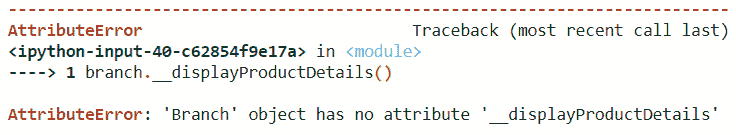

图 2.16 – 访问类私有方法的错误

以下截图显示了 `Branch` 类可以由其对象访问的类成员列表：

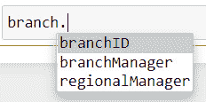

图 2.17 – 包含私有成员后分支对象可访问的成员

然而，这些私有成员可以通过创建一个 API 来在类外访问。

## 受保护成员

在本例中，我们将重新创建一个 `Branch` 类，其中包含用于产品 ID、产品名称、品牌、购买价格和利润率的受保护变量，并创建一个用于显示产品详情的受保护方法。我们将创建一个分支经理作为私有变量。我们还将创建分支 ID 和区域经理作为非受保护或私有的类变量，并查看使用类外对象访问这些变量的差异。我们还将进一步继承 `Branch` 类以检查哪些成员是可访问的。

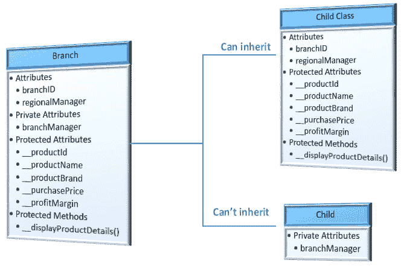

图 2.18 – 分支类的受保护成员及其被继承子类访问的权限

让我们查看以下代码以实现此示例：

```py
class Branch():  
```

```py
    branch_id = 2022  
```

```py
    regional_manager = 'Ron D'  
```

```py
    __branch_manager = 'Sam J'  
```

```py
    _product_id = None  
```

```py
    _product_name = None  
```

```py
    _productBrand = None  
```

```py
    _purchase_price = None  
```

```py
    _profit_margin = None  
```

```py
    def _display_product_details(self):  
```

```py
        self._product_id = 100003  
```

```py
        self._product_name = 'Washing Machine'  
```

```py
        self._productBrand = 'Samsung'  
```

```py
        self._purchase_price = 430  
```

```py
        self._profit_margin = 0.18  
```

```py
        print('Product ID: ' + str(self._product_id) + \
```

```py
          ', Product Name: ' + self._product_name +  
```

```py
          ', Product Brand: ' + self._productBrand +
```

```py
          ', Purchase Price: ' + str(self._purchase_price) 
```

```py
         + ', Profit Margin: ' +  str(self._profit_margin))
```

```py
    def __init__(self):  
```

```py
        self._display_product_details()  
```

```py
branch = Branch()
```

输出如下：

```py
Product ID: 100003, Product Name: Washing Machine, Product Brand: Samsung, Purchase Price: 430, Profit Margin: 0.18
```

由 `Branch` 创建的对象也无法访问其受保护的成员，这与私有成员类似，如下所示：

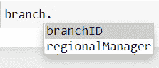

图 2.19 – 包含受保护成员后分支对象可访问的成员

让我们创建一个名为 `Brooklyn` 的子类，它继承自父类 `Branch`。子类将继承父类的所有受保护变量和方法，而它仍然不会继承私有成员：

```py
class Brooklyn(Branch):  
```

```py
    def __init__(self):  
```

```py
        print(self._product_id)  
```

```py
        self._display_product_details()  
```

```py
branch_brooklyn = Brooklyn()
```

输出如下：

```py
None
```

```py
Product ID: 100003, Product Name: Washing Machine, Product Brand: Samsung, Purchase Price: 430, Profit Margin: 0.18
```

`product_id` 变量是父类的受保护成员，`display_product_details` 也是父类的受保护成员，它可以通过子类 `Brooklyn` 的 `init` 方法访问。

现在，让我们包括父类的一个私有成员并检查它是否可以从子类访问：

```py
class Brooklyn(Branch):  
```

```py
    def __init__(self):  
```

```py
        print(self._product_id)  
```

```py
        self._display_product_details()  
```

```py
        print(self.__branch_manager)  
```

```py
branch_brooklyn = Brooklyn()
```

输出如下：

```py
None
```

```py
Product ID: 100003, Product Name: Washing Machine, Product Brand: Samsung, Purchase Price: 430, Profit Margin: 0.18
```

以下错误说明私有成员仍然不会被子类访问：

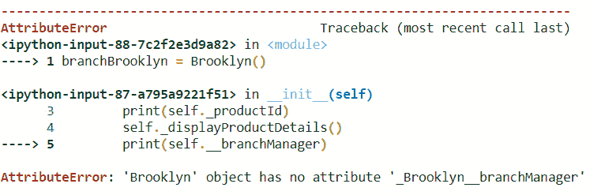

图 2.20 – 从子类访问父类私有属性的错误

这些示例让我们了解了如何在 Python 中实现封装。

# 摘要

本章我们回顾了类和对象的概念，并探讨了如何创建类和对象实例的示例。我们还学习了方法的概念以及如何在类内部创建方法。此外，我们还看到了如何将继承和多继承应用于类，以及如何将多态应用于方法。然后我们学习了如何创建抽象类和方法。最后，我们学习了封装的概念以及如何限制对类的方法和变量的访问。

本章回顾了 Python 中所有面向对象编程（OOP）的概念，这些概念将作为本书主要主题——元编程的基础。

在下一章中，我们将详细探讨装饰器的概念及其通过示例的实现。
