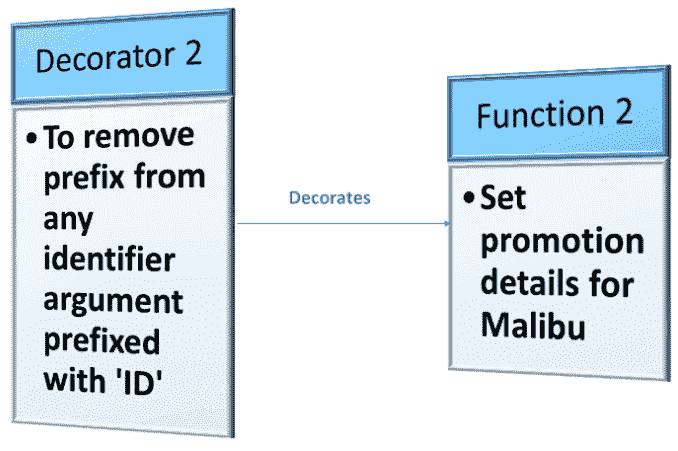
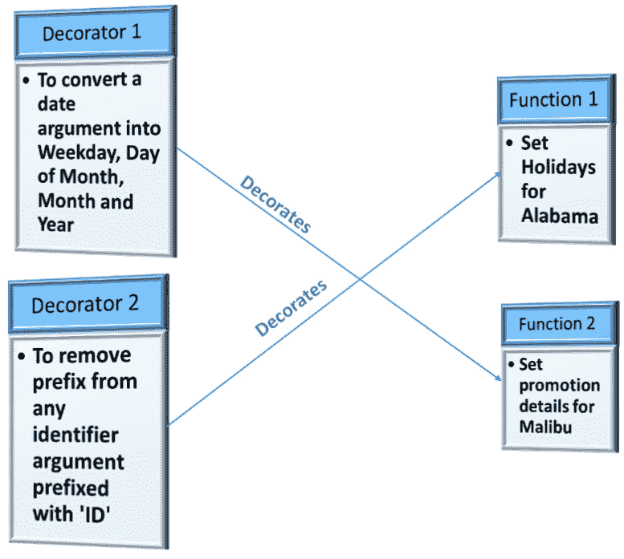
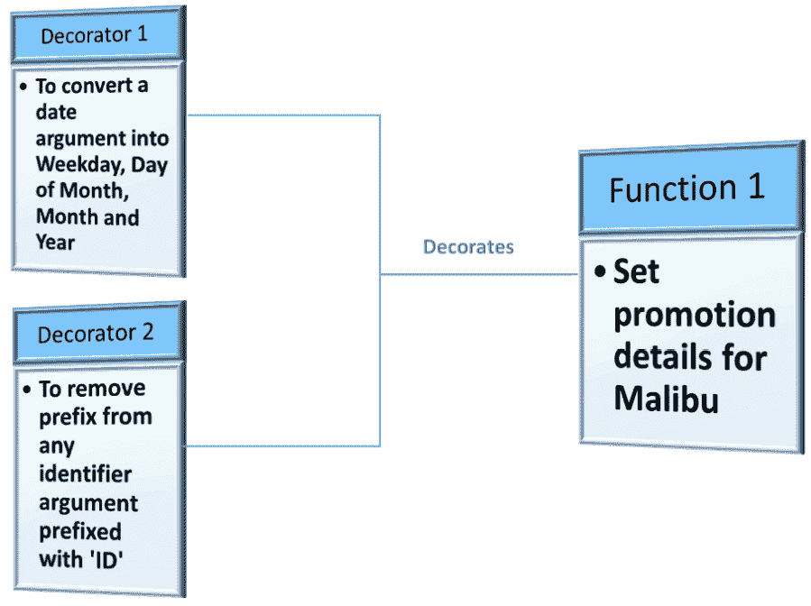
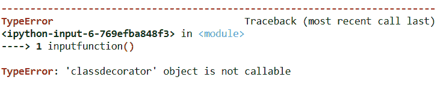
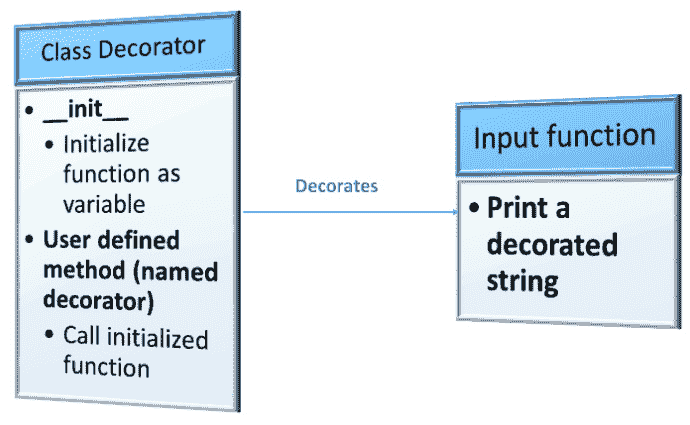
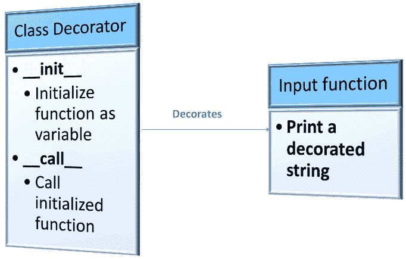
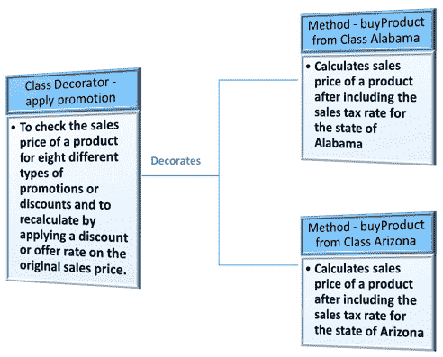
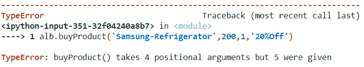
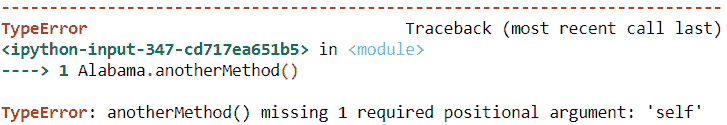

# 第三章：*第三章*：理解装饰器和它们的用途

从本章开始，我们将开始查看元编程的各种概念，以及如何应用它们的示例。我们首先将查看装饰器以及如何在 Python 3 中实现装饰器。

装饰器是元编程概念之一，它处理在不修改实际函数主体的同时装饰函数。正如其名所示，装饰器通过允许函数成为另一个函数的参数来为函数、方法或类添加额外的价值，该函数“装饰”或提供有关被装饰的函数、方法或类的更多信息。装饰器可以在单个用户定义的函数或定义在类内部的函数上开发，或者也可以在类本身上定义。理解装饰器将帮助我们通过外部操作来增强函数、方法和类的可重用性，而不会影响实际的实现。

在上一章中，我们回顾了面向对象编程的概念，它是本章以及本书未来章节的基础。

本章，我们将探讨以下主要主题：

+   查看简单的函数装饰器

+   在一个函数和另一个函数之间交换装饰器

+   将多个装饰器应用于一个函数

+   探索类装饰器

+   了解内置装饰器

到本章结束时，你应该能够创建自己的装饰器，在函数/方法或类上实现用户定义的装饰器，并重用内置装饰器。

# 技术要求

本章中共享的代码示例可以在 GitHub 上找到，这里是本章代码的链接：[`github.com/PacktPublishing/Metaprogramming-with-Python/tree/main/Chapter03`](https://github.com/PacktPublishing/Metaprogramming-with-Python/tree/main/Chapter03)。

# 查看简单的函数装饰器

现在，我们将通过一个示例来查看不同类型的函数装饰器。我们将继续使用我们在上一章中查看的*ABC Megamart*示例。Python 中的每个用户定义函数都可以执行不同的操作。但如果我们想让不同的函数显示特定的附加信息，无论这些函数执行什么操作呢？我们可以通过定义另一个函数来实现，该函数装饰任何作为输入提供的函数。

让我们看看以下步骤来更好地理解：

1.  函数装饰器可以这样定义：

    ```py
    def functiondecorator(inputfunction):  
        def decorator():  
            print("---Decorate function with this line---
              ")  
            return inputfunction()  
        return decorator  
    ```

这段代码定义了一个简单的函数装饰器，它接受任何输入函数作为参数，并在函数结果上方添加一行，打印“---使用此行装饰函数---”作为任何输入函数的第一个输出行。

1.  这个函数装饰器可以通过一个新定义的用户函数以两种不同的语法来调用。让我们定义两个简单的函数：

    ```py
    def userfunction1():  
        return "A picture is worth a thousand words "  
    ```

这个函数返回短语“一张图片胜过千言万语”。

1.  我们将添加一个返回不同短语的功能：“行动胜于言语”：

    ```py
    def userfunction2():  
        return "Actions speak louder than words"  
    ```

1.  在以下步骤中，让我们将函数装饰器添加到前面定义的两个用户定义函数中，并查看结果：

    ```py
    decoratedfunction1 = functiondecorator(userfunction1)
    decoratedfunction2 = functiondecorator(userfunction2)
    ```

1.  在前面的代码中，我们通过向它们添加装饰器函数来重新分配了函数。执行装饰函数 1 的结果如下：

    ```py
    decoratedfunction1()  
    ---Decorate function with this line---
    'A picture is worth a thousand words'
    ```

1.  同样，我们也可以执行装饰函数 2：

    ```py
    decoratedfunction2()
    ---Decorate function with this line---
    'Actions speak louder than words'
    ```

这两个函数结果都添加了一条额外的行，`---使用此行装饰函数---`，这不是它们函数定义的一部分，而是装饰器函数的一部分。这些示例展示了函数装饰器的可重用性。

1.  让我们进一步探讨语法 2，这是添加装饰器到其他函数、方法或类中最广泛使用的方法：

    ```py
    @functiondecorator  
    def userfunction1():  
        return "A picture is worth a thousand words"  
    @functiondecorator  
    def userfunction2():  
        return "Actions speak louder than words"  
    ```

在前面的代码中，在定义用户定义函数时，我们在`@functiondecorator`定义上方添加了额外的行。这一行表示我们在定义阶段本身添加了装饰器。这个装饰器可以声明一次，并用于任何新定义的相关函数。

1.  执行前面的代码提供了与使用语法 1 的示例代码执行相同的输出：

    ```py
    userfunction1()
    ---Decorate function with this line---
    'A picture is worth a thousand words'
    userfunction2()
    ---Decorate function with this line---
    'A picture is worth a thousand words'
    ```

现在你已经了解了简单的函数装饰器，我们可以看看一个演示其应用的示例。

## 通过应用理解函数装饰器

我们可以进一步探讨一个使用*ABC Megamart*场景的函数装饰器示例。在这个例子中，我们将创建一个函数，为不同分支的分支经理添加不同格式的电子邮件签名。我们将定义两个函数，`manager_albany`和`manager_manhattan`，它们具有不同的字体颜色和高亮显示。

让我们看看这段代码的第一部分：

```py
def manager_albany(*args):  
```

```py
    BLUE = '\03394m'  
```

```py
    BOLD = '\33[5m'  
```

```py
    SELECT = '\33[7m'
```

```py
    for arg in args:
```

```py
        print(BLUE + BOLD + SELECT + str(arg))
```

```py
manager_albany('Ron D','ron.d@abcmegamart.com','123 Main Street','Albany','New York', 12084)  
```

前面的代码打印了分支经理的电子邮件签名，带有白色、粗体和蓝色高亮文本：

```py
Ron D
```

```py
ron.d@abcmegamart.com
```

```py
123 Main Street
```

```py
Albany
```

```py
New York
```

```py
12084
```

现在，让我们快速看一下这段代码：

```py
def manager_manhattan(*args):
```

```py
    GREEN = '\033[92m'
```

```py
    SELECT = '\33[7m'
```

```py
    for arg in args:
```

```py
        print(SELECT + GREEN + str(arg))
```

```py
manager_manhattan('John M',  'john.m@abcmegamart.com', '40097 5th Main Street',   'Manhattan', 'New York City',  'New York',  11007)
```

这个示例将打印带有高亮文本的分支经理的电子邮件签名：

```py
John M
```

```py
john.m@abcmegamart.com
```

```py
40097 5th Main Street
```

```py
Manhattan
```

```py
New York City
```

```py
New York
```

```py
11007
```

现在，让我们在两个签名中添加*ABC Megamart*的名称，并使用黄色高亮显示，同时保持签名高亮颜色不变。为此，我们将创建一个函数装饰器，该装饰器接受前面函数的参数，并将*ABC Megamart*添加为黑色字体和黄色高亮：

```py
def signature(branch):  
```

```py
    def footnote(*args):  
```

```py
        LOGO = '\33[43m'  
```

```py
        print(LOGO + 'ABC Mega Mart')  
```

```py
        return branch(*args)  
```

```py
    return footnote  
```

下面的图表示了如何在两个不同的签名上实现电子邮件签名装饰器。

![图 3.1 – 电子邮件签名装饰器

图 3.1 – 电子邮件签名装饰器

前面的签名装饰器在两个签名中添加了*ABC Megamart*的名称，并使用黄色高亮显示，同时保持签名高亮颜色不变。

首先，让我们将`@signature`添加到`manager_manhattan`：

```py
@signature
```

```py
def manager_manhattan(*args):
```

```py
    GREEN = '\03392m'
```

```py
    SELECT = '\33[7m'
```

```py
    for arg in args:
```

```py
        print(SELECT + GREEN + str(arg))
```

```py
manager_manhattan('John M',  'john.m@abcmegamart.com', '40097 5th Main Street',   'Manhattan', 'New York City',  'New York',  11007)
```

此代码返回以下电子邮件签名：

```py
ABC Mega Mart
```

```py
John M
```

```py
john.m@abcmegamart.com
```

```py
40097 5th Main Street
```

```py
Manhattan
```

```py
New York City
```

```py
New York
```

```py
11007
```

现在让我们将 `@signature` 添加到 `manager_albany`：

```py
@signature
```

```py
def manager_albany(*args):  
```

```py
    BLUE = '\033[94m'  
```

```py
    BOLD = '\33[5m'  
```

```py
    SELECT = '\33[7m'
```

```py
    for arg in args:
```

```py
        print(BLUE + BOLD + SELECT + str(arg))
```

```py
manager_albany('Ron D','ron.d@abcmegamart.com','123 Main Street','Albany','New York', 12084)  
```

这样做会返回以下电子邮件签名：

```py
ABC Mega Mart
```

```py
Ron D
```

```py
ron.d@abcmegamart.com
```

```py
123 Main Street
```

```py
Albany
```

```py
New York
```

```py
12084
```

在前面的代码片段中添加一个函数装饰器到不同的函数中，使它们具有共同的功能——在这种情况下，*ABC Megamart* 的标题具有黄色高亮作为共同功能，同时保留各个分支经理的签名。这是一个简单示例，说明了可重用装饰器可以是什么，以及如何在保持函数实际功能完整的同时，向函数添加元数据或附加信息。

现在我们已经了解了函数装饰器是什么以及我们如何使用它们，让我们看看通过交换它们来利用装饰器为不同的函数，使它们更具可重用性。

# 在函数之间交换装饰器

我们现在已经了解了什么是函数装饰器以及函数装饰器可以用于多个函数。我们将通过创建两个不同的装饰器来进一步探索装饰器的可重用性概念，这两个装饰器将服务于不同的目的，并在不同函数之间交换装饰器。

为了演示这个概念，我们将为函数 1 创建装饰器 1，为函数 2 创建装饰器 2，然后我们将它们从一个函数交换到另一个函数。让我们创建两个装饰器来装饰两个不同的函数。

**装饰器 1** 将被创建来转换提供的作为假日日期的日期参数，用于设置 *ABC Megamart* 阿拉巴马分支的假日。

下面的图示是 **装饰器 1** 和其 **函数 1** 的表示。

![图 3.2 – 作为装饰器的日期转换器

图 3.2 – 作为装饰器的日期转换器

让我们看看我们将使用以下代码来实现我们的示例：

```py
def dateconverter(function):  
```

```py
    import datetime  
```

```py
    def decoratedate(*args):     
```

```py
        newargs = []  
```

```py
        for arg in args:  
```

```py
            if(isinstance(arg,datetime.date)):  
```

```py
                arg = arg.weekday(),arg.day,arg.month,
```

```py
                  arg.year  
```

```py
            newargs.append(arg)  
```

```py
        return function(*newargs)  
```

```py
    return decoratedate    
```

前面的 `dateconverter` 是一个装饰器函数，它接受另一个函数作为参数。为了执行这个函数，我们导入了 `datetime` 库，这个库帮助我们把输入的日期参数转换成星期、月份中的天数、年份以及月份的格式。这个装饰器函数内部接受所有传递给内部函数的参数，并检查是否有任何函数参数是 `datetime` 数据类型，如果找到 `datetime` 对象，它将被转换以显示星期、月份中的天数、年份和月份。

此装饰器还将转换后的 `datetime` 对象格式与函数的其他参数一起存储在一个列表中，并将该列表作为参数传递给作为此装饰器输入的函数。现在让我们创建一个函数来设置阿拉巴马分支的假日日历，并使用此装饰器函数对其进行装饰。

`*args`参数。此函数的第一个参数将被设置为`branch_id`，第二个参数为`holiday_type`，第三个参数为`holiday_name`，第四个参数为`holiday_date`。所有这些输入参数也被函数转换为字典变量，并返回带有其键值对的字典，表示每个值。

下面是使用我们刚才讨论的细节的代码看起来像什么：

```py
@dateconverter  
```

```py
def set_holidays_alabama(*args):  
```

```py
    holidaydetails = {}  
```

```py
    holidaydetails['branch_id'] = args[0]  
```

```py
    holidaydetails['holiday_type'] = args[1]  
```

```py
    holidaydetails['holiday_name'] = args[2]  
```

```py
    holidaydetails['holiday_date'] = args[3]  
```

```py
    return holidaydetails  
```

在前面的代码中，我们通过添加装饰器`@dateconverter`开始函数定义，该装饰器负责将假日日期转换为上述格式。现在让我们通过提供创建假日详情字典所需的参数来调用此函数：

```py
from datetime import datetime  
```

```py
holiday =datetime.strptime('2021-01-18', '%Y-%m-%d')  
```

在前面的代码中，我们创建了一个`datatime`对象，并将其存储在名为 holiday 的变量中，该变量将被作为`set_holidays_alabama`函数的输入之一：

```py
set_holidays_alabama('id1000',  
```

```py
                   'local',  
```

```py
                   'Robert E. Lee's Birthday',  
```

```py
                   holiday)  
```

前面的代码给出了以下装饰后的输出：

```py
{'branch_id': 'id1000',  
```

```py
 'holiday_type': 'local',  
```

```py
 'holiday_name': 'Robert E. Lee's Birthday',  
```

```py
 'holiday_date': (0, 18, 1, 2021)}  
```

我们现在可以继续创建另一个装饰器，它对提供的另一个函数执行不同的操作。

让我们现在看看`id`是否存在于输入中，这表示输入值是任何类型的标识符，并通过移除其前缀来返回标识符的数值。这个装饰器将被添加到一个函数中，用于设置任何输入产品为 Malibu 分公司的促销详情。

下面的图表示了**装饰器 2**和**函数 2**：



图 3.3 – ID 标识符作为装饰器

下面是我们将用于装饰器的代码：

```py
def identifier(function):  
```

```py
    def decorateid(*args):     
```

```py
        newargs = []  
```

```py
        for arg in args:  
```

```py
            if(isinstance(arg,str)):  
```

```py
                arg = arg.lower()  
```

```py
                if 'id' in arg:  
```

```py
                    arg = int(''.join(filter(str.isdigit,
```

```py
                      arg)))  
```

```py
            newargs.append(arg)  
```

```py
        return function(*newargs)  
```

```py
    return decorateid   
```

前一个标识符是一个装饰器函数，它接受另一个函数作为参数。这个装饰器函数还内部接受传递给其内部函数的所有参数，并遍历每个单独的参数以检查它是否是一个字符串。如果参数是一个字符串，装饰器将字符串转换为小写并检查它是否包含子串 ID。如果子串 ID 存在于变量中，那么变量中的所有字符串都将被移除，并且只存储其中的数字，其余的函数参数以列表的形式传递给作为输入提供给此装饰器的函数。现在让我们创建一个函数来设置 Malibu 分公司的促销详情，并使用这个装饰器函数来装饰其 ID。

`*args`类似于`set_holidays_alabama`函数。此函数的第一个参数将被设置为`branch_id`，第二个参数为`product_id`，第三个参数为`promotion_date`，第四个参数为`promotion_type`，第五个参数为`promotion_reason`。所有这些输入参数也被函数转换为字典变量，并返回带有其键值对的字典，表示每个值。此函数中有两个`id`参数，它们被标识符装饰。

下面是使用我们刚才讨论的细节所看到的代码样子：

```py
@identifier
```

```py
def set_promotion_malibu(*args):  
```

```py
    promotiondetails = {}  
```

```py
    promotiondetails['branch_id'] = args[0]  
```

```py
    promotiondetails['product_id'] = args[1]  
```

```py
    promotiondetails['product_name'] = args[2]  
```

```py
    promotiondetails['promotion_date'] = args[3]  
```

```py
    promotiondetails['promotion_type'] = args[4]  
```

```py
    promotiondetails['promotion_reason'] = args[5]  
```

```py
    return promotiondetails  
```

在前面的代码中，我们通过添加装饰器 `@identifier` 开始了函数定义，该装饰器负责从 `id` 变量中移除前缀。现在让我们通过提供创建产品促销详细信息字典所需的参数来调用这个函数：

```py
from datetime import datetime  
```

```py
promotion_date = datetime.strptime('2020-12-23', '%Y-%m-%d')  
```

这里，我们创建了一个 `datetime` 对象并将其存储在促销日期中，这个日期将作为 `set_promotion_malibu` 函数的一个输入参数传递，但这个日期变量将保持与定义相同的格式：

```py
set_promotion_malibu('Id23400','ProdID201','PlumCake',promotion_date,'Buy1Get1','Christmas')  
```

前面的代码给出了以下装饰后的输出：

```py
{'branch_id': 23400,  
```

```py
 'product_id': 201,  
```

```py
 'product_name': 'plumcake',  
```

```py
 'promotion_date': datetime.datetime(2020, 12, 23, 0, 0),  
```

```py
 'promotion_type': 'buy1get1',
```

```py
 'promotion_reason': 'christmas'}  
```

现在我们有两个装饰器和两个由它们装饰的不同函数。为了检查这些装饰器是否可以交换，我们现在通过以下代码重新定义这些函数，使用交换装饰器：

```py
@identifier  
```

```py
def set_holidays_alabama(*args):  
```

```py
    holidaydetails = {}  
```

```py
    holidaydetails['branch_id'] = args[0]  
```

```py
    holidaydetails['holiday_type'] = args[1]  
```

```py
    holidaydetails['holiday_name'] = args[2]  
```

```py
    holidaydetails['holiday_date'] = args[3]  
```

```py
    return holidaydetails  
```

```py
@dateconverter  
```

```py
def set_promotion_malibu(*args):  
```

```py
    promotiondetails = {}  
```

```py
    promotiondetails['branch_id'] = args[0]  
```

```py
    promotiondetails['product_id'] = args[1]  
```

```py
    promotiondetails['product_name'] = args[2]  
```

```py
    promotiondetails['promotion_date'] = args[3]  
```

```py
    promotiondetails['promotion_type'] = args[4]  
```

```py
    promotiondetails['promotion_reason'] = args[5]  
```

```py
    return promotiondetails  
```

让我们输入所需的参数并执行前面的函数 `set_holidays_alabama`：

```py
from datetime import datetime  
```

```py
holiday =datetime.strptime('2021-01-18', '%Y-%m-%d')  
```

```py
set_holidays_alabama('id1000',  
```

```py
                   'local',  
```

```py
                   'Robert E. Lee's Birthday',  
```

```py
                   holiday)  
```

这段代码给出了以下装饰后的输出：

```py
{'branch_id': 1000,  
```

```py
 'holiday_type': 'local',  
```

```py
 'holiday_name': 'robert e. lee's birthday',  
```

```py
 'holiday_date': datetime.datetime(2021, 1, 18, 0, 0)}  
```

在前面的输出中，标识符应用于分支 ID，而假日日期没有变化。同样，让我们执行以下代码：

```py
promotion_date = datetime.strptime('2020-12-23', '%Y-%m-%d')  
```

```py
set_promotion_malibu('Id23400','ProdID201','PlumCake',promotion_date,'Buy1Get1','Christmas')  
```

这段代码给出了以下装饰后的输出：

```py
{'branch_id': 'Id23400',  
```

```py
 'product_id': 'ProdID201',  
```

```py
 'product_name': 'PlumCake',  
```

```py
 'promotion_date': (2, 23, 12, 2020),  
```

```py
 'promotion_type': 'Buy1Get1',  
```

```py
 'promotion_reason': 'Christmas'}  
```

以下图表示了两个装饰器如何在它们的功能之间交换或替换：



图 3.4 – 交换装饰器

让我们重用之前的示例来进一步探讨将多个装饰器应用到单个函数的概念。

# 将多个装饰器应用到单个函数

到目前为止，我们已经了解到装饰器可以被创建并添加到函数中，以在函数上执行元编程。我们也了解到装饰器可以被重用并交换到不同的函数中。我们还了解到装饰器可以从函数外部添加装饰或值到函数中，并帮助通过附加信息来改变函数。如果我们想通过装饰器让函数执行两种不同的操作，同时又不想让装饰器变得更加具体，我们可以创建两个或更多不同的装饰器并将它们应用到单个函数上吗？是的，我们可以。现在我们将查看如何使用多个装饰器装饰一个函数以及它是如何工作的。

对于这个示例，让我们重用装饰器 `dateconverter` 和 `identifier`。为了理解这个概念，我们可以重用之前声明的函数之一，`set_promotion_malibu`，它既有 `datetime` 对象作为输入参数（促销日期）也有两个 ID 值作为输入参数（`branch_id` 和 `product_id`）。

以下图表示了将两个装饰器添加到函数中：



图 3.5 – 一个函数的多个装饰器

以下代码将我们的示例付诸实践：

```py
@identifier  
```

```py
@dateconverter  
```

```py
def set_promotion_malibu(*args):  
```

```py
    promotiondetails = {}  
```

```py
    promotiondetails['branch_id'] = args[0]  
```

```py
    promotiondetails['product_id'] = args[1]  
```

```py
    promotiondetails['product_name'] = args[2]  
```

```py
    promotiondetails['promotion_date'] = args[3]  
```

```py
    promotiondetails['promotion_type'] = args[4]  
```

```py
    promotiondetails['promotion_reason'] = args[5]  
```

```py
    return promotiondetails  
```

在这段代码中，我们将两个装饰器都添加到了`set_promotion_malibu`函数中：

```py
promotion_date = datetime.strptime('2021-01-01', '%Y-%m-%d')  
```

```py
set_promotion_malibu('Id23400','ProdID203','Walnut Cake',promotion_date,'Buy3Get1','New Year')  
```

执行前面的代码会导致对输入值应用两个装饰器：

```py
{'branch_id': 23400,  
```

```py
 'product_id': 203,  
```

```py
 'product_name': 'walnut cake',  
```

```py
 'promotion_date': (4, 1, 1, 2021),  
```

```py
 'promotion_type': 'buy3get1',  
```

```py
 'promotion_reason': 'new year'}  
```

从前面的输出中，我们可以看到`@identifier`应用于`branch_id`和`product_id`。同时，`@dateconverter`应用于`promotion_date`。现在让我们探索装饰器的其他变体。

# 探索类装饰器

`__init__`和`__call__`。在创建类的对象实例时，作为`__init__`函数一部分初始化的任何变量都成为类的变量本身。同样，类的`__call__`函数返回一个函数对象。如果我们想将类用作装饰器，我们需要利用这两个内置方法的组合。

让我们看看如果我们不使用`call`方法会发生什么。看看以下代码片段：

```py
class classdecorator:  
```

```py
    def __init__(self,inputfunction):  
```

```py
        self.inputfunction = inputfunction  
```

```py
    def decorator(self):  
```

```py
        result = self.inputfunction()  
```

```py
        resultdecorator = ' decorated by a class decorator'  
```

```py
        return result + resultdecorator  
```

在这里，我们创建了一个名为`classdecorator`的类，并添加了`init`方法来接收一个函数作为输入。我们还创建了一个`decorator`方法，它存储初始化的函数变量结果，并将由类装饰器装饰的装饰器字符串添加到输入函数结果中。

现在让我们创建一个输入函数来测试前面的`classdecorator`：

```py
@classdecorator  
```

```py
def inputfunction():  
```

```py
    return 'This is input function'  
```

添加这个类装饰器应该会装饰输入函数。让我们检查当我们调用这个输入函数时会发生什么：

```py
inputfunction()
```

我们得到了以下类型错误，指出`classdecorator`不可调用：



图 3.6 – 由于类装饰器定义不正确导致的错误

我们收到这个错误是因为我们没有使用正确的方法使类表现得像一个装饰器。前面代码中的`decorator`方法返回一个变量而不是一个函数。为了使这个类作为一个装饰器工作，我们需要按照以下方式重新定义类：

```py
class classdecorator:  
```

```py
    def __init__(self,inputfunction):  
```

```py
        self.inputfunction = inputfunction  
```

```py
    def __call__(self):  
```

```py
        result = self.inputfunction()  
```

```py
        resultdecorator = ' decorated by a class decorator'  
```

```py
        return result + resultdecorator  
```

在这里，我们将`decorator`方法替换为内置方法`__call__`。现在让我们重新定义输入函数并看看会发生什么：

```py
@classdecorator  
```

```py
def inputfunction():  
```

```py
    return 'This is input function'  
```

我们可以调用前面的函数来检查这个类装饰器的行为：

```py
inputfunction()
'This is input function decorated by a class decorator'
```

下面的图是一个简单的表示，展示了创建类装饰器的不正确方法：



图 3.7 – 创建类装饰器的错误方法

这里是创建它的正确方式：



图 3.8 – 创建类装饰器的正确方法

现在你对类装饰器有了更好的理解，我们可以继续分析类装饰器在*ABC Megamart*上的应用。

## 通过应用来理解类装饰器

我们将通过将类装饰器应用于 *ABC Megamart* 的一个场景来详细了解类装饰器的应用。让我们考虑一个场景，其中 *ABC Megamart* 为每个分店创建了一个单独的类。让我们还假设每个类都有自己的方法 `buy_product`，该方法通过具体应用购买的分店和产品的销售税率来计算产品的销售价格。当商场想要应用涉及八种通用促销类型的季节性促销时，每个分支类不需要有应用于其计算出的销售价格的促销计算方法。相反，我们可以创建一个类装饰器，可以应用于每个分支的 `buy_product` 方法，并且类装饰器将反过来通过在分支计算的实际销售价格上应用促销折扣来计算最终销售价格。

我们将创建两个类，并将 `buy_product` 方法添加到每个类中，以计算销售价格而不添加类装饰器。这是为了理解实际方法的返回值：

```py
class Alabama():  
```

```py
    def buy_product(self,product,unitprice,quantity,
```

```py
      promotion_type):  
```

```py
        alabamataxrate = 0.0522  
```

```py
        initialprice = unitprice*quantity   
```

```py
        salesprice = initialprice + 
```

```py
          initialprice*alabamataxrate  
```

```py
        return salesprice, product,promotion_type  
```

为前面的类创建一个对象实例，并使用其参数调用该方法，返回以下结果：

```py
alb1 = Alabama()    
```

```py
alb1.buy_product('Samsung-Refrigerator',200,1,'20%Off')   
```

```py
(210.44, 'Samsung-Refrigerator', '20%Off')
```

同样，我们可以定义一个名为 `Arizona` 的类，并添加 `buy_product` 方法，然后执行以下代码来验证其返回值，而不使用装饰器：

```py
class Arizona():  
```

```py
    def buy_product(self,product,unitprice,quantity,
```

```py
      promotion_type):  
```

```py
        arizonataxrate = 0.028  
```

```py
        initialprice = unitprice*quantity   
```

```py
        salesprice = initialprice + 
```

```py
          initialprice*arizonataxrate  
```

```py
        return salesprice, product,promotion_type  
```

```py
arz1 = Arizona()  
```

```py
arz1.buy_product('Oreo-Cookies',0.5,250,'Buy2Get1')  
```

```py
(128.5, 'Oreo-Cookies', 'Buy2Get1')
```

前面的 `buy_product` 方法接受产品名称、单价、数量和促销类型作为输入，并通过将单价乘以产品的数量来计算初始价格。然后，它进一步通过将初始价格与上一步骤中计算的初始价格以及州税率相加来计算销售价格。最后，该方法返回销售价格、产品名称和促销类型。销售税率因州而异，销售价格的计算也根据销售税率的不同而不同。

我们现在可以创建一个类装饰器来应用促销折扣到销售价格，并通过包括优惠率或折扣率来计算产品的最终销售价格。

在下面的代码中，让我们定义一个名为 `applypromotion` 的类，并添加两个内置方法，使该类表现得像一个装饰器：

+   **`__init__` 方法**：在这个场景中，这是一个作为输入变量的函数或方法

+   **`__call__` 方法**：此方法接受多个输入参数，这些参数也是被装饰的函数或方法的参数

输入参数应用于被装饰的函数或方法，并且它进一步通过检查八种不同的促销类型，重新计算销售价格，并将其存储为最终销售价格，如下所示：

```py
class applypromotion:  
```

```py
    def __init__(self, inputfunction):  
```

```py
        self.inputfunction = inputfunction  
```

```py
    def __call__(self,*arg):  
```

```py
        salesprice, product,promotion_type = 
```

```py
          self.inputfunction(arg[0],arg[1],arg[2],arg[3])  
```

```py
        if (promotion_type == 'Buy1Get1'):  
```

```py
            finalsalesprice = salesprice * 1/2  
```

```py
        elif (promotion_type == 'Buy2Get1'):  
```

```py
            finalsalesprice = salesprice * 2/3  
```

```py
        elif (promotion_type == 'Buy3Get1'):  
```

```py
            finalsalesprice = salesprice * 3/4  
```

```py
        elif (promotion_type == '20%Off'):  
```

```py
            finalsalesprice = salesprice - salesprice * 0.2  
```

```py
        elif (promotion_type == '30%Off'):  
```

```py
            finalsalesprice = salesprice - salesprice * 0.3  
```

```py
        elif (promotion_type == '40%Off'):  
```

```py
            finalsalesprice = salesprice - salesprice * 0.4  
```

```py
        elif (promotion_type == '50%Off'):  
```

```py
            finalsalesprice = salesprice - salesprice * 0.5  
```

```py
        else:  
```

```py
            finalsalesprice = salesprice   
```

```py
        return "Price of - " + product + ": " + '$' + str(finalsalesprice)  
```

类装饰器 `@applypromotion` 现在可以进一步由其他函数或方法使用。我们现在可以将这个装饰器应用到 `Alabama` 类的 `buy_product` 方法上：

```py
class Alabama():  
```

```py
    @applypromotion  
```

```py
    def buy_product(product,unitprice,quantity,promotion_type):  
```

```py
        alabamataxrate = 0.0522  
```

```py
        initialprice = unitprice*quantity   
```

```py
        salesprice = initialprice + initialprice*alabamataxrate  
```

```py
        return salesprice, product,promotion_type  
```

为前面的代码创建一个对象实例并调用其方法的工作方式如下：

```py
alb = Alabama()  
```

```py
alb.buy_product('Samsung-Refrigerator',200,1,'20%Off')  
```

```py
'Price of - Samsung-Refrigerator: $168.352'
```

同样，我们也可以通过添加类装饰器来重新定义名为 `Arizona` 的类及其 `buy_product` 方法，如下所示：

```py
class Arizona():  
```

```py
    @applypromotion  
```

```py
    def buy_product(product,unitprice,quantity,
```

```py
      promotion_type):  
```

```py
        arizonataxrate = 0.028  
```

```py
        initialprice = unitprice*quantity   
```

```py
        salesprice = initialprice + 
```

```py
          initialprice*arizonataxrate  
```

```py
        return salesprice, product,promotion_type  
```

为前面的代码创建一个对象实例并调用其方法的工作方式如下：

```py
arz = Arizona()  
```

```py
arz.buy_product('Oreo-Cookies',0.5,250,'Buy2Get1')  
```

```py
'Price of - Oreo-Cookies: $85.66666666666667'
```

让我们回顾在添加装饰器之前和之后 `buy_product` 方法的 `Arizona` 的结果。前面的代码是在添加装饰器后的输出，以下代码是在添加装饰器之前的输出：

```py
arz1.buy_product('Oreo-Cookies',0.5,250,'Buy2Get1')  
```

```py
(128.5, 'Oreo-Cookies', 'Buy2Get1')
```

在添加 `applypromotion` 装饰器后，250 包巧克力的销售价格在促销前后的价格相差$128.50，折扣后的价格为$85.66。商店不必总是对产品进行促销，而 `buy_product` 方法只有在需要促销销售产品时才能重用 `applypromotion` 装饰器，从而在保持 `buy_product` 方法实际功能完整的同时，使装饰器能够外部改变类的行为。

本例的简单表示如下：



图 3.9 – 应用促销折扣的产品类装饰器

在学习了如何将类装饰器应用于来自其他类的函数或方法之后，我们将进一步探讨 Python 中可用的内置装饰器。

# 了解内置装饰器

现在，问题是，我们是否总是需要创建用户定义或自定义装饰器来应用于类和方法，或者我们是否有一些预定义的装饰器可以用于特定目的。

除了本章中我们查看的用户定义装饰器之外，Python 还有一些自己的内置装饰器，如 `@staticmethod` 和 `@classmethod`，可以直接应用于方法。这些装饰器在类定义的过程中为方法和类添加了某些重要的功能。我们将详细探讨这两个装饰器，如下所示。

## 静态方法

`@staticmethod` – 是一个装饰器，它接受一个常规的 Python 函数作为输入参数，并将其转换为静态方法。静态方法可以在类内部创建，但不会使用类对象实例的隐式第一个参数，通常表示为名为 `self` 的参数，就像其他基于实例的方法一样。

为了理解这个概念，让我们首先创建一个名为 `Alabama` 的类，并向该类添加一个名为 `buy_product` 的函数，该函数不带 `self` 参数，也不带静态方法装饰器，并检查其行为：

```py
class Alabama:  
```

```py
    def buy_product(product,unitprice,quantity,promotion_type):  
```

```py
        alabamataxrate = 0.0522  
```

```py
        initialprice = unitprice*quantity   
```

```py
        salesprice = initialprice + 
```

```py
          initialprice*alabamataxrate  
```

```py
        return salesprice, product,promotion_type  
```

在这里，我们定义了一个名为 `Alabama` 的类，其中包含一个名为 `buy_product` 的函数。现在，让我们创建一个对象实例，并在类内部调用该函数以检查其行为：

```py
alb = Alabama()  
```

```py
alb.buy_product('Samsung-Refrigerator',200,1,'20%Off')  
```

执行此代码会导致以下错误：



图 3.10 – 在调用没有静态方法和 self 的函数时出错

重新运行前面的函数而不创建对象的工作方式如下：

```py
Alabama.buy_product('Samsung-Refrigerator',200,1,'20%Off')  
```

```py
(210.44, 'Samsung-Refrigerator', '20%Off')
```

为了避免前面的错误，并在创建或不创建对象的情况下调用类内的函数，我们可以通过向函数中添加 `@staticmethod` 装饰器将其转换为静态方法。现在我们可以看看它是如何工作的：

```py
class Alabama:  
```

```py
    @staticmethod  
```

```py
    def buy_product(product,unitprice,quantity,
```

```py
      promotion_type):  
```

```py
        alabamataxrate = 0.0522  
```

```py
        initialprice = unitprice*quantity   
```

```py
        salesprice = initialprice + 
```

```py
          initialprice*alabamataxrate  
```

```py
        return salesprice, product,promotion_type  
```

```py
    def another_method(self):  
```

```py
        return "This method needs an object"  
```

我们添加了一个名为 `another_method` 的额外方法，它只能通过对象实例来调用。现在让我们为该类创建一个对象并调用前面的两个方法：

```py
albstatic = Alabama()  
```

```py
albstatic.buy_product('Samsung-Refrigerator',200,1,'20%Off')  
```

```py
(210.44, 'Samsung-Refrigerator', '20%Off')  
```

```py
albstatic.another_method()  
```

```py
'This method needs an object'  
```

这两种方法，`static` 和 `instance`，都可以使用类的对象来调用。同时，静态方法也可以使用类本身来调用，而无需创建对象：

```py
Alabama.buy_product('Samsung-Refrigerator',200,1,'20%Off')  
```

```py
(210.44, 'Samsung-Refrigerator', '20%Off')  
```

```py
Alabama.another_method()  
```

执行此代码会导致以下错误：



图 3.11 – 使用其类调用实例方法时出错

当使用其类调用时，静态方法生成了预期的输出，而实例方法没有运行。这是使用静态方法将函数转换为类内部方法的优点。

## 类方法

`@classmethod` – 也是一个类似于 `@staticmethod` 的内置装饰器，这个装饰器也将一个函数转换为类内部的静态方法。`@staticmethod` 没有对类的对象的隐含参数，而 `@classmethod` 有一个隐含参数 `cls`，它被添加到函数中，而 `@classmethod` 装饰器则添加到它上面，如下面的代码块所示：

```py
class Alabama:  
```

```py
    @classmethod  
```

```py
    def buy_product(cls,product,unitprice,quantity,
```

```py
      promotion_type):  
```

```py
        alabamataxrate = 0.0522  
```

```py
        initialprice = unitprice*quantity   
```

```py
        salesprice = initialprice + 
```

```py
          initialprice*alabamataxrate  
```

```py
        return cls,salesprice, product,promotion_type  
```

这个函数可以带或不带创建类实例来调用。我们可以在下面的代码中查看这两种情况：

```py
Alabama.buy_product('Samsung-Refrigerator',200,1,'20%Off')  
```

```py
(__main__.Alabama, 210.44, 'Samsung-Refrigerator', '20%Off')  
```

```py
alb = Alabama()  
```

```py
alb.buy_product('Samsung-Refrigerator',200,1,'20%Off')  
```

```py
(__main__.Alabama, 210.44, 'Samsung-Refrigerator', '20%Off')  
```

在前面的代码中，我们可以看到通过 `@classmethod` 转换为类方法的函数可以直接使用类或通过创建类的对象来调用。

这些是一些内置的装饰器，Python 3 中还有更多这样的装饰器可供探索和重用。

# 摘要

在本章中，我们学习了如何创建简单的装饰器，以及如何通过示例应用装饰器。我们看到了如何将装饰器从一个函数交换到另一个函数，以及如何将多个装饰器添加到同一个函数中。

我们现在理解了类装饰器的概念，并查看了一个如何应用它们的示例。最后，我们学习了如何使用一些内置装饰器，如 `@staticmethod` 和 `@classmethod`。

所有这些概念都是 Python 元编程的一部分，并且它们被用来在外部更改函数或方法的行为，而不影响函数或方法的内部功能。

在下一章中，我们将通过不同的示例来探讨元类概念。
