# *第四章*：与元类一起工作

元类，本章的重点，可以通过装饰参数的方式来操纵新类的创建方式，而不会影响实际的类定义本身。除非需要更高级的实现框架或 API，例如需要操纵类或动态生成类等功能，否则元类在 Python 应用开发中并不常用。

在上一章中，我们通过一些示例了解了装饰器的概念。理解装饰器有助于更轻松地理解元类，因为装饰器和元类都通过外部操作处理 Python 3 程序对象的元编程。

在本章中，我们将涵盖以下主要主题：

+   元类的概述

+   元类的结构

+   元类的应用

+   切换元类

+   元类中的继承

+   操纵类变量

到本章结束时，你应该能够创建自己的元类，实现元类上的继承，并重用已经创建的元类。

# 技术要求

本章中分享的代码示例可在 GitHub 上找到，地址为：[`github.com/PacktPublishing/Metaprogramming-with-Python/tree/main/Chapter04`](https://github.com/PacktPublishing/Metaprogramming-with-Python/tree/main/Chapter04)。

# 元类的概述

元类是可以单独创建的类，具有可以改变其他类行为或帮助动态制造新类的某些特性。所有元类的基类是`type`类，元类的对象或实例将是一个类。我们创建的任何自定义元类都将继承自`type`类。`type`也是 Python 中所有数据类型的类，Python 3 中的其他一切都是`type`类的对象。我们可以通过检查 Python 中不同程序对象的类型来测试这个陈述，如下所示：

```py
class TestForType:  
```

```py
    pass  
```

```py
type(TestForType)
```

```py
type
```

```py
type(int)
```

```py
type
```

```py
type(str)
```

```py
type
```

```py
type(object)
```

```py
type
```

```py
type(float)
```

```py
type
```

```py
type(list)
```

```py
type
```

在本章中，我们将探讨一些如何使用这些元类、如何实现它们以及如何重用它们的示例。我们将继续使用我们的*ABC Megamart*示例，以进一步理解元类。

# 元类的结构

元类就像任何其他类一样，但它有能力改变将其作为元类的其他类的行为。理解元类的结构有助于我们创建自己的定制元类，这些元类可以进一步用于操纵新类。元类的超类是`type`本身。当我们使用`type`作为超类创建一个类，并重写`__new__`方法来操纵返回的类的元数据时，我们就创建了一个元类。让我们通过一些简单的示例来更深入地了解。

`__new__`方法接受`cls`作为其第一个参数，即类本身。具有`cls`作为第一个参数的类的成员可以通过类名和其余参数作为类的其他元数据来访问，如下所示：

```py
class ExampleMetaClass1(type):  
```

```py
    def __new__(classitself, *args):  
```

```py
        print('class itself: ', classitself)  
```

```py
        print('Others: ', args)  
```

```py
        return type.__new__(classitself, *args)  
```

在前面的代码中，我们创建了名为`ExampleMetaClass1`的类，它继承自类`type`，并重写了`__new__`方法以打印类实例及其其他参数。

现在让我们创建名为`ExampleClass1`的类，并将前面的元类添加到其中：

```py
class ExampleClass1(metaclass = ExampleMetaClass1):      
```

```py
    int1 = 123  
```

```py
    str1 = 'test'  
```

```py
    def test():  
```

```py
        print('test')  
```

运行前面的代码显示以下结果：

```py
class itself:  <class '__main__.ExampleMetaClass1'>
```

```py
Others:  ('ExampleClass1', (), {'__module__': '__main__', '__qualname__': 'ExampleClass1', 'int1': 123, 'str1': 'test', 'test': <function ExampleClass1.test at 0x00000194A377E1F0>})
```

此输出的第一部分是类实例`<class '__main__.ExampleMetaClass1'>`，其余参数是类名和类的参数。元类定义的简单表示如下：

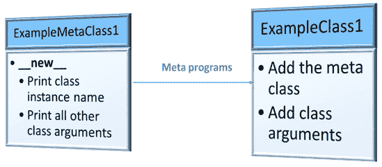

图 4.1 – 示例元类定义

让我们在下一个小节中通过另一个示例来深入了解。

## 参数分析

我们现在将深入探讨元类中`__new__`方法的参数。分析元类的参数将有助于了解可以使用元类自定义的类的哪些信息。在定义类时添加元类可以操纵的数据在以下图中表示：

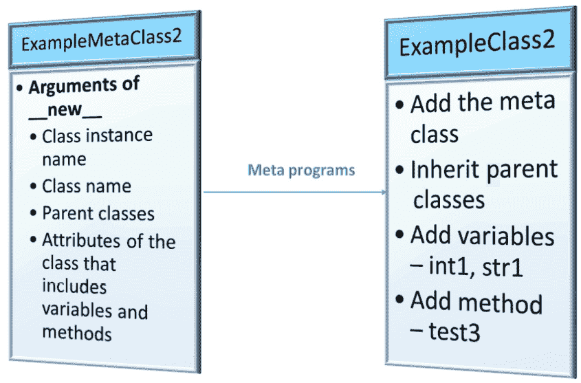

图 4.2 – 带更多参数的示例元类

现在让我们遵循以下步骤，看看参数的行为如何影响类：

1.  首先，看看以下代码，其中我们将元类的所有参数分离——类实例；类名；类的所有父类、超类或基类；以及类内创建的所有变量和方法：

    ```py
    class ExampleMetaClass2(type):  
        def __new__(classitself, classname, baseclasses, 
                    attributes):  
            print('class itself: ', classitself)  
            print('class name: ', classname)  
            print('parent class list: ', baseclasses)  
            print('attribute list: ', attributes)  
            return type.__new__(classitself, classname, 
                baseclasses, attributes)  
    ```

1.  接下来，我们将创建两个父类——`ExampleParentClass1`和`ExampleParentClass2`：

    ```py
    class ExampleParentClass1():      
           def test1():  
                print('parent1 - test1')  
    class ExampleParentClass2():      
           def test2():  
                print('parent2 - test2')  
    ```

1.  现在，我们将创建名为`ExampleClass2`的类，我们将继承前两个父类，并将元类作为`ExampleMetaClass2`添加：

    ```py
    class ExampleClass2(ExampleParentClass1,ExampleParentClass2, metaclass = ExampleMetaClass2):      
        int1 = 123  
        str1 = 'test'  

        def test3():  
            print('child1 - test3')  
    ```

1.  执行前面的代码会产生以下输出：

    ```py
    class itself:  <class '__main__.ExampleMetaClass2'>
    class name:  ExampleClass2
    parent class:  (<class '__main__.ExampleParentClass1'>, <class '__main__.ExampleParentClass2'>)
    attributes:  {'__module__': '__main__', '__qualname__': 'ExampleClass2', 'int1': 123, 'str1': 'test', 'test3': <function ExampleClass2.test3 at 0x00000194A3994E50>}
    ```

此示例展示了元类返回的突出显示的参数，并概述了使用元编程从类中可能操纵哪些值。

1.  让我们看看在这个例子中创建的每个类的类型：

    ```py
    type(ExampleParentClass1)
    type
    type(ExampleParentClass2)
    type
    type(ExampleMetaClass2)
    type
    type(ExampleClass2)
    __main__.ExampleMetaClass2
    ```

如我们所见，所有其他类的类型都是其自身类型，而`ExampleClass2`的类型是`ExampleMetaClass2`。

现在你已经了解了元类的结构，我们可以进一步探讨在“ABC Megamart”示例中元类的应用。

# 元类应用

在本节中，我们将查看一个示例，我们将创建一个元类，它可以自动修改新创建的任何分支类的用户定义方法属性。为了测试这一点，让我们遵循以下步骤：

1.  创建一个名为`BranchMetaclass`的元类：

    ```py
    class BranchMetaclass(type):  
    ```

1.  创建一个 `__new__` 方法，其参数为类实例、类名、基类和属性。在 `__new__` 方法中，导入 `inspect` 库，该库可以帮助检查输入属性：

    ```py
        def __new__(classitself, classname, baseclasses, 
             attributes):  
            import inspect  
    ```

1.  创建一个新的字典 `newattributes`：

    ```py
         newattributes = {}  
    ```

遍历类属性，检查属性是否以 `__` 开头，并且不要改变其值。

1.  继续遍历其他属性，并检查属性是否为函数。如果是函数，则在类方法前添加 `branch` 前缀，并将方法名改为标题格式：

    ```py
    for attribute, value in attributes.items():  
                if attribute.startswith("__"):  
                    newattributes[attribute] = value  
                elif inspect.isfunction(value):  
                    newattributes['branch' +
                        attribute.title()] = value for a
                        attribute, value in 
                        attributes.items():
                if attribute.startswith("__"):  
                    newattributes[attribute] = value  
                elif inspect.isfunction(value):  
                    newattributes['branch' + 
                        attribute.title()] = value  
    ```

1.  如果不满足前面的条件，则按原样保存属性的值：

    ```py
    else:  
                    newattributes[attribute] = value  
    ```

1.  返回带有新属性的 `new` 方法：

    ```py
                         return type.__new__(classitself, 
                             classname, baseclasses, 
                             newattributes) 
    ```

1.  在元类内部，还创建一个常规用户定义方法 `buy_product` 来计算产品的销售价格：

    ```py
    def buy_product(product,unit_price,quantity,statetax_rate,promotiontype):  
            statetax_rate = statetax_rate          
            initialprice = unit_price*quantity   
            sales_price = initialprice + 
                initialprice*statetax_rate  
            return sales_price, product,promotiontype  
    ```

1.  接下来，我们将创建另一个新的类，名为 `Brooklyn`，并将这个元类添加到该类中。通过添加元类，我们希望 `Brooklyn` 类中的方法具有前缀分支，并在创建 `Brooklyn` 类的方法时将方法名改为标题格式。

`Brooklyn` 类有四个变量，分别是 `product_id`、`product_name`、`product_category` 和 `unit_price`。我们还将创建一个计算维护成本的方法，由于元类会改变新创建类的行为，因此这个方法应从 `maintenance_cost` 改为 `branchMaintenance_cost`。以下是新类：

```py
class Brooklyn(metaclass = BranchMetaclass):  
    product_id = 100902  
    product_name = 'Iphone X'  
    product_category = 'Electronics'  
    unit_price = 700  

    def maintenance_cost(self,product_type, quantity):
        self.product_type = product_type  
        self.quantity = quantity  
        cold_storage_cost = 100  
        if (product_type == 'Electronics'):  
            maintenance_cost = self.quantity * 0.25 + 
                cold_storage_cost      
            return maintenance_cost  
        else:  
            return "We don't stock this product"  
```

1.  我们可以列出 `Brooklyn` 类的所有参数，并检查元类是否改变了其行为：

    ```py
    dir(Brooklyn)
    ['__class__',
     '__delattr__',
     '__dict__',
     ‚__dir__',
     ‚__doc__',
     ‚__eq__',
     ‚__format__',
     ‚__ge__',
     ‚__getattribute__',
     ‚__gt__',
     ‚__hash__',
     ‚__init__',
     ‚__init_subclass__',
     ‚__le__',
     ‚__lt__',
     ‚__module__',
     ‚__ne__',
     ‚__new__',
     ‚__reduce__',
     ‚__reduce_ex__',
     ‚__repr__',
     ‚__setattr__',
     ‚__sizeof__',
     ‚__str__',
     ‚__subclasshook__',
     ‚__weakref__',
     'branchMaintenance_cost',
     'product_category',
     'product_id',
     'product_name',
     'unit_price']
    ```

1.  现在让我们创建一个对象，并查看其方法和变量，如下所示：

    ```py
    brooklyn = Brooklyn()
    brooklyn.branchMaintenance_Cost('Electronics',10)
    102.5
    brooklyn.product_id
    100902
    brooklyn.product_name
    'Iphone X'
    brooklyn.product_type
    'Electronics'
    ```

这个示例的简单表示如下：

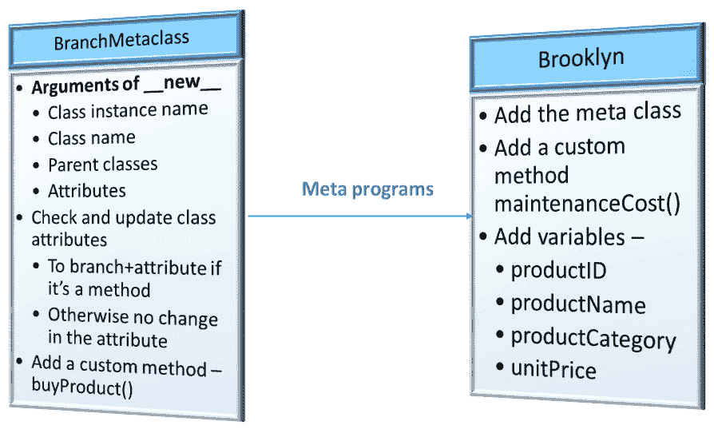

图 4.3 – 在 ABC Megamart 上应用元类 – 分支示例

到目前为止，我们已经概述了元类，了解了其结构，对其参数进行了分析，并通过在核心示例上创建自定义元类来应用我们的理解。在下一节中，我们将探讨更多应用。

## 继承元类

在本节中，我们将通过一个示例来演示如何继承元类，以检查它是否可以作为常规父类继承，而不会改变正在创建的新类的行为。请看以下代码：

```py
class Queens(BranchMetaclass):  
```

```py
    def maintenance_cost(product_type, quantity):  
```

```py
        product_type = product_type  
```

```py
        quantity = quantity  
```

```py
        if (product_type == ‹FMCG›):  
```

```py
            maintenance_cost = quantity * 0.05  
```

```py
            return maintenance_cost  
```

```py
        else:  
```

```py
            return "We don't stock this product"  
```

现在让我们为前面的类创建一个对象来检查是否可以创建对象：

```py
queens = Queens()
```

我们得到以下 `TypeError`：

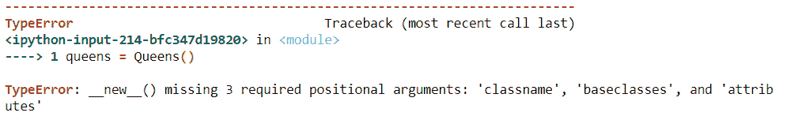

图 4.4 – 为继承元类的类创建对象时出错

这个错误发生是因为`__new__`是一个静态方法，它被调用以创建类的新的实例，并且它期望类有三个参数，但在创建类对象时没有提供这些参数。然而，还有一种方法可以调用新创建的类`Queens`。可以直接调用这个类，并使用其方法，而无需创建对象：

```py
Queens.maintenance_cost('FMCG',120)
```

```py
6.0
```

由于元类没有被用作元类，而是作为父类使用，`maintenance_cost`方法没有被修改成`branchMaintenance_cost`。由于元类被继承，`Queens`也继承了`BranchMetaclass`的用户定义方法，如下所示：

```py
Queens.buy_product('Iphone',1000,1,0.04,None)
```

```py
(1040.0, 'Iphone', None)
```

## 作为父类和元类的继承

现在我们来看看当我们继承一个类作为父类，并在创建新类时将其添加为元类时会发生什么：

```py
class Queens(BranchMetaclass, metaclass = BranchMetaclass):  
```

```py
    def maintenance_cost(product_type, quantity):  
```

```py
        product_type = product_type  
```

```py
        quantity = quantity  
```

```py
        if (product_type == ‹FMCG›):  
```

```py
            maintenance_cost = quantity * 0.05  
```

```py
            return maintenance_cost  
```

```py
        else:  
```

```py
            return "We don't stock this product"  
```

在前面的代码中，我们将`BranchMetaclass`添加为`Queens`类的父类，并且我们还将其添加为元类。这个定义应该使`Queens`类继承`BranchMetaclass`的自定义方法，并将`maintenance_cost`方法改为`branchMaintenance_cost`。让我们看看它是否真的做到了：

```py
Queens.branchMaintenance_Cost('FMCG',2340)
```

```py
117.0
```

在前面的代码执行和输出中，`maintenance_cost`方法被转换成了预期的`branchMaintenance_cost`方法。现在运行以下命令：

```py
Queens.buy_product('Iphone',1500,1,0.043,None)
```

```py
(1564.5, 'Iphone', None)
```

来自`BranchMetaclass`的自定义方法`buy_product`也被继承，因为它是一个父类。

下面是这个示例的一个简单表示：

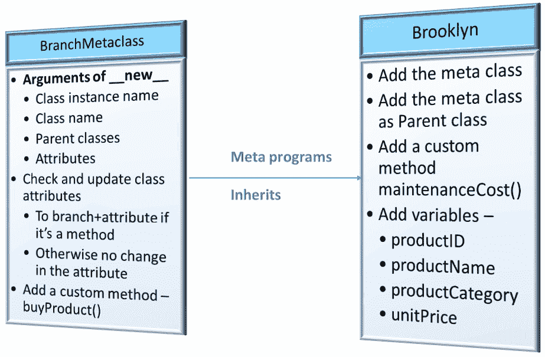

图 4.5 – 在 ABC Megamart 分支示例中应用元类及其继承

让我们进一步探讨从一类切换到另一类元类的示例。

# 切换元类

我们现在可以探讨一个类中切换元类的概念。你可能想知道，*为什么我们需要切换元类呢？* 切换元类强化了元编程的可重用性概念，在这种情况下，它有助于理解一个为使用一个类而创建的元类也可以用于不同的类，而不会影响类的定义。

在本节的示例中，我们将创建两个元类 – `IncomeStatementMetaClass`和`BalanceSheetMetaClass`。对于*ABC Megamart*的 Malibu 分支，我们将创建一个类来捕获其财务报表所需的信息。与这个示例相关的两个财务报表是 Malibu 分支的损益表属性和资产负债表属性。为了区分一个类的特定属性或方法应该放在哪里，我们将创建两个元类，它们会查看属性的名称，并根据损益表或资产负债表相应地标记它们。

以下是对上述元类将要操作的属性的一个简单表示：

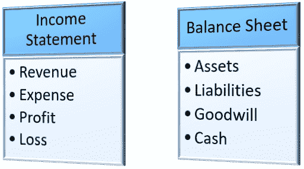

图 4.6 – 在此元类示例中使用的财务属性

看一下下面的代码片段：

```py
class IncomeStatementMetaClass(type):  
```

```py
    def __new__(classitself, classname, baseclasses, 
```

```py
                attributes):  
```

```py
        newattributes = {}  
```

```py
        for attribute, value in attributes.items():  
```

```py
            if attribute.startswith("__"):  
```

```py
                newattributes[attribute] = value  
```

```py
            elif («revenue» in attribute) or \  
```

```py
            ("expense" in attribute) or \  
```

```py
            ("profit" in attribute) or \  
```

```py
            ("loss" in attribute):  
```

```py
                newattributes['IncomeStatement_' + 
```

```py
                    attribute.title()] = value  
```

```py
            else:  
```

```py
                newattributes[attribute] = value  
```

```py
        return type.__new__(classitself, classname, 
```

```py
            baseclasses, newattributes)  
```

在这里，`new` 方法被修改为检查具有作为收入报表参数之一的键的属性，例如 `revenue`、`expense`、`profit` 或 `loss`。如果这些术语中的任何一个出现在方法名或变量名中，我们将添加 `IncomeStatement` 前缀以隔离这些方法和变量。

为了测试这个元类，我们将创建一个新的类 `Malibu`，它有四个变量和四个方法，如下所示：

```py
class Malibu(metaclass = IncomeStatementMetaClass):  
```

```py
    profit = 4354365  
```

```py
    loss = 43000  
```

```py
    assets = 15000  
```

```py
    liabilities = 4000  
```

```py
    def calc_revenue(quantity,unitsales_price):  
```

```py
        totalrevenue = quantity * unitsales_price   
```

```py
        return totalrevenue  
```

```py
    def calc_expense(totalrevenue,netincome, netloss):  
```

```py
        totalexpense = totalrevenue - (netincome + netloss)  
```

```py
        return totalexpense    
```

```py
    def calc_totalassets(cash,inventory,accountsreceivable):
```

```py
        totalassets = cash + inventory + accountsreceivable  
```

```py
        return totalassets  
```

```py
    def calc_totalliabilities(debt,accruedexpense,
```

```py
         accountspayable):  
```

```py
        totalliabilities = debt + accruedexpense + 
```

```py
            accountspayable  
```

```py
        return totalliabilities  
```

在前面的代码中，我们添加了元类 `IncomeStatementMetaClass`，我们看到 `Malibu` 类的属性按以下方式修改了变量和方法的行为：

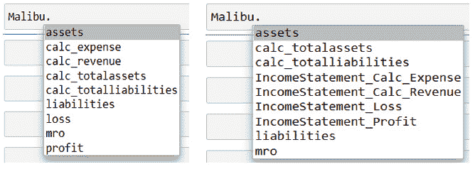

图 4.7 – 没有元类的 Malibu（左）和有元类的 Malibu（右）

我们将进一步添加另一个元类，`BalanceSheetMetaClass`，以处理类 `Malibu` 中的资产负债表相关属性。在以下元类中，新方法被修改为检查具有作为资产负债表参数之一的键的属性，例如 `assets`、`liabilities`、`goodwill` 和现金。如果这些术语中的任何一个出现在方法名或变量名中，我们将添加 `BalanceSheet` 前缀以隔离这些方法和变量：

```py
class BalanceSheetMetaClass(type):  
```

```py
    def __new__(classitself, classname, baseclasses, 
```

```py
                attributes):  
```

```py
        newattributes = {}  
```

```py
        for attribute, value in attributes.items():  
```

```py
            if attribute.startswith("__"):  
```

```py
                newattributes[attribute] = value  
```

```py
            elif («assets» in attribute) or \  
```

```py
            ("liabilities" in attribute) or \  
```

```py
            ("goodwill" in attribute) or \  
```

```py
            ("cash" in attribute):  
```

```py
                newattributes['BalanceSheet_' + 
```

```py
                    attribute.title()] = value  
```

```py
            else:  
```

```py
                newattributes[attribute] = value  
```

```py
        return type.__new__(classitself, classname, 
```

```py
            baseclasses, newattributes)  
```

在前面的代码中，我们添加了元类 `BalanceSheetMetaClass`，我们看到 `Malibu` 类的属性按以下方式修改了变量和方法的行为：

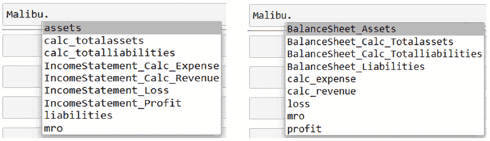

图 4.8 – 使用 IncomeStatementMetaClass 的 Malibu（左）和使用 BalanceSheetMetaClass 的 Malibu（右）

既然你知道为什么我们需要切换元类，让我们看看元类在继承中的应用。

# 元类中的继承

**继承**，在字面上，意味着子类获得父类的属性，在面向对象编程的情况下也是同样的意思。一个新的类可以继承父类的属性和方法，它也可以有自己的属性和方法。

在这个例子中，我们将通过创建两个类 `California` 和 `Pasadena` 来查看元类上的继承是如何工作的 – `California` 是父类，而 `Pasadena` 是子类。

让我们检查这些步骤以更好地理解继承：

1.  在上一节中，我们已经创建了两个元类，它们以类型作为其父类 – `IncomeStatementMetaClass` 和 `BalanceSheetMetaClass`。我们将首先使用 `IncomeStatement` 元类创建类 `California`：

    ```py
    class California(metaclass = IncomeStatementMetaClass):  
        profit = 4354365  
        loss = 43000  
        def calc_revenue(quantity,unitsales_price):  
            totalrevenue = quantity * unitsaleprice   
            return totalrevenue  

        def calc_expense(totalrevenue,netincome, netloss):  
            totalexpense = totalrevenue - (netincome + netloss)  
            return totalexpense   
    ```

在这里，我们只定义了可以被 `IncomeStatement` 元类修改的属性。

1.  接下来，我们将使用 `BalanceSheet` 元类创建另一个类 `Pasadena`：

    ```py
    class Pasadena(California,metaclass = BalanceSheetMetaClass):  
        assets = 18000  
        liabilities = 5000  
        def calc_totalassets(cash,inventory,
            accountsreceivable):  
            totalassets = cash + inventory + 
                accountsreceivable  
            return totalassets  

        def calc_totalliabilities(debt,accruedexpense,
            accountspayable):  
            totalliabilities = debt + accruedexpense + 
                accountspayable  
            return totalliabilities  
    ```

我们在这里定义了那些可以被 `BalanceSheet` 元类修改的属性。

1.  执行 `Pasadena` 类的代码会导致以下错误：

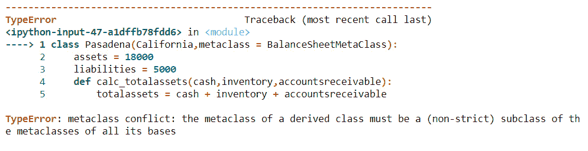

图 4.9 – 执行具有不同元类的子类时出错

抛出这个错误是因为 `Pasadena` 继承了父类 `California`，它有一个不同的元类 `IncomeStatementMetaClass`，它是从类型继承的，而 Pasadena 的元类 `BalanceSheetMetaClass` 也是从类型继承的。

1.  要解决这个错误，我们可以将 `BalanceSheetMetaClass` 重新定义为以父类 `IncomeStatementMetaClass` 代替类型类，如下所示：

    ```py
    class BalanceSheetMetaClass(IncomeStatementMetaClass):  
        def __new__(classitself, classname, baseclasses, 
                    attributes):  
            newattributes = {}  
            for attribute, value in attributes.items():  
                if attribute.startswith("__"):  
                    newattributes[attribute] = value  
                elif («assets» in attribute) or \  
                ("liabilities" in attribute) or \  
                ("goodwill" in attribute) or \  
                ("cash" in attribute):  
                    newattributes['BalanceSheet_' + 
                        attribute.title()] = value  
                else:  
                    newattributes[attribute] = value  
            return type.__new__(classitself, classname, 
                baseclasses, newattributes)  
    ```

1.  现在让我们重新运行 `California` 父类和 `Pasadena` 子类，以检查两个元类的行为修改是否在 `Pasadena` 类中实现：

    ```py
    class California(metaclass = IncomeStatementMetaClass):  
        profit = 4354365  
        loss = 43000  
        def calc_revenue(quantity,unitsales_price):  
            totalrevenue = quantity * unitsaleprice   
            return totalrevenue  
        def calc_expense(totalrevenue,netincome, netloss):  
            totalexpense = totalrevenue - (netincome + 
                netloss)  
            return totalexpense    
    class Pasadena(California,metaclass = BalanceSheetMetaClass):  
        assets = 18000  
        liabilities = 5000  
        def calc_totalassets(cash,inventory,
            accountsreceivable):  
            totalassets = cash + inventory + 
                accountsreceivable  
            return totalassets  
        def calc_totalliabilities(debt,accruedexpense,
            accountspayable):  
            totalliabilities = debt + accruedexpense + 
                accountspayable  
            return totalliabilities  
    ```

1.  这是 `Pasadena` 类的输出，正如我们所见，`BalanceSheet` 和 `IncomeStatement` 属性都按照它们的元类进行了修改：

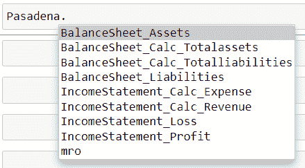

图 4.10 – 具有继承的 Pasadena 类

该应用的简单表示如下：

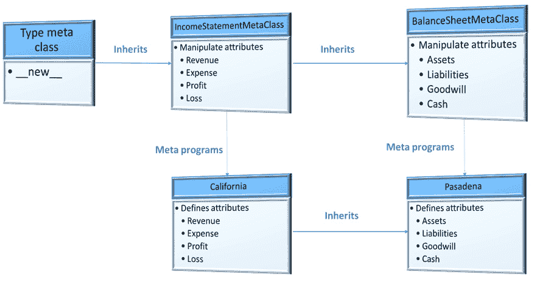

图 4.11 – 元类中的继承

在这种情况下，我们将 `BalanceSheetMetaClass` 的父类重新定义为 `IncomeStatementMetaClass`，因为 Python 在它们都从类型继承时不会自动解析它们的父类，而是抛出元类冲突。重新定义 `BalanceSheetMetaClass` 的父类不仅解决了错误，而且不会影响类的整体功能，因为 `IncomeStatementMetaClass` 最终也是从类型继承的。

让我们看看另一个例子，我们将向类属性添加额外的信息。

# 操作类变量

在本节中，我们将通过一个例子进一步探讨使用元类操作类变量。我们将创建一个名为 `SchemaMetaClass` 的元类，并将定义 `__new__` 方法以操作属于 `integer`、`float`、`string` 或 `boolean` 数据类型的类属性。让我们快速浏览一下步骤：

1.  我们现在将创建 `SchemaMetaClass`，以类型作为父类，并修改了 `new` 方法以检查以下条件：

    ```py
    class SchemaMetaClass(type):  
    ```

1.  创建字典对象 `newattributes`。如果 `class` 属性是一个以 `__` 开头的内置 `class` 方法，则将属性的值存储为 `newattributes` 中的此类：

    ```py
        def __new__(classitself, classname, baseclasses, 
                    attributes):  

            newattributes = {}  
            for attribute, value in attributes.items():  
                if attribute.startswith("__"):  
                    newattributes[attribute] = value 
    ```

1.  如果 `class` 属性是整数或浮点变量，则类返回一个字典项，其中属性名为 `ColumnName`，值为 `Value`，`Type` 为 `NUMERIC`，`Length` 为值的长度：

    ```py
                elif type(value)==int or type(value)==float:  
                    newattributes[attribute] = {}  
                    newattributes[attribute]['ColumnName']
                         = attribute.title()  
                    newattributes[attribute]['Value'] 
                         = value  
                    newattributes[attribute]['Type'] 
                         = 'NUMERIC'  
                    newattributes[attribute]['Length'] = len(str(value))  
    ```

1.  如果`class`属性是一个字符串变量，那么类返回一个类似的字典项，其中`Type`为`VARCHAR`：

    ```py
                elif type(value)==str:  
                    newattributes[attribute] = {}  
                    newattributes[attribute]['ColumnName']
                         = attribute.title()  
                    newattributes[attribute]['Value']
                         = value  
                    newattributes[attribute]['Type']
                         = 'VARCHAR'  
                    newattributes[attribute]['Length']
                         = len(value)  
    ```

1.  类似地，如果`class`属性是一个布尔对象，则返回一个类似类型的字典项，其中`Type`为`BOOLEAN`：

    ```py
                elif type(value)==bool:  
                    newattributes[attribute] = {}  
                    newattributes[attribute]['ColumnName']
                         = attribute.title()  
                    newattributes[attribute]['Value']
                         = value  
                    newattributes[attribute]['Type']
                         = 'BOOLEAN'  
                    newattributes[attribute]['Length']
                         = None  
    ```

1.  任何其他变量或方法都像这样存储在`newattributes`中：

    ```py
                else:  
                    newattributes[attribute] = value                  
            return type.__new__(classitself, classname,
                 baseclasses, newattributes)  
    ```

1.  现在，我们将创建一个具有元类`SchemaMetaClass`的`Arizona`类，定义产品的所有变量，并定义一个从元编程类属性创建模式的方法：

    ```py
    class Arizona(metaclass = SchemaMetaClass):  
        product_id = 200443  
        product_name = 'Iphone'  
        product_category = 'Electronics'  
        sales_quantity = 2  
        tax_rate = 0.05  
        sales_price = 1200  
        profit = 70  
        loss = 0  
        sales_margin = 0.1  
        promotion = '20%Off'  
        promotion_reason = 'New Year'    
        in_stock = True  

        def create_schema(self):  
            import pandas as pd  
            tableschema = pd.DataFrame([self.product_id,  
                                      self.product_name,  
                                  self.product_category,  
                                    self.sales_quantity,  
                                          self.tax_rate,  
                                       self.sales_price,  
                                            self.profit,  
                                              self.loss,  
                                      self.sales_margin,  
                                         self.promotion,  
                                  self.promotion_reason,  
                                         self.in_stock])  
            tableschema.drop(labels = ['Value'], axis = 1,
                             inplace = True)  
            return tableschema   
    ```

我们添加了一个示例产品的产品详情（在这种情况下，是一个 iPhone）和变量是不同数据类型的组合 – `string`、`integer`、`float`和`bool`。我们将定义`create_schema`方法，该方法导入 pandas 库以创建一个 DataFrame，该 DataFrame 为变量提供类似表格的结构，并将数据帧作为表模式返回。

1.  现在，考虑一个场景，其中元类没有被添加到前面的代码中。调用`product_name`变量将导致以下结果：

    ```py
    objarizona = Arizona()  
    objarizona.product_name  
    'Iphone'
    ```

1.  由于我们在前面的`Arizona`类定义中添加了元类，调用`product_name`结果如下：

    ```py
    objarizona = Arizona()
    objarizona.product_name
    {'ColumnName': 'Product_name',
     'Value': 'Iphone',
     'Type': 'VARCHAR',
     'Length': 6}
    ```

1.  类似地，我们可以查看其他几个变量的结果如下：

    ```py
    objarizona.product_category  

    {'ColumnName': 'Product_category',  
     'Value': 'Electronics',  
     'Type': 'VARCHAR',  
     'Length': 11}  

    objarizona.sales_quantity  
    {'ColumnName': 'Sales_quantity', 'Value': 2, 'Type': 'NUMERIC', 'Length': 1}  

    objarizona.tax_rate  
    {'ColumnName': 'Tax_rate', 'Value': 0.05, 'Type': 'NUMERIC', 'Length': 4}  
    ```

1.  进一步使用元编程类变量，我们定义了`create_schema`方法来返回一个表模式：

    ```py
    objarizona.create_schema()
    ```

我们得到以下表，其中包含类中定义的所有变量：


图 4.12 – `create_schema` 方法的输出

这些是元类在开发应用程序中可以使用的几个示例。元类还可以在更复杂的场景中使用，例如自动代码生成和框架开发。

# 摘要

在本章中，我们学习了如何创建元类以及元类的一些应用。

然后，我们看到了如何切换元类，重用功能，以及如何在使用元类的类上实现继承。最后，我们还看到了如何进一步操作元类的变量。

所有这些概念都是 Python 元编程的一部分，并且它们被用来在类外部更改类的行为，而不影响类本身的内部功能。

在下一章中，我们将通过不同的示例来探讨反射的概念。
