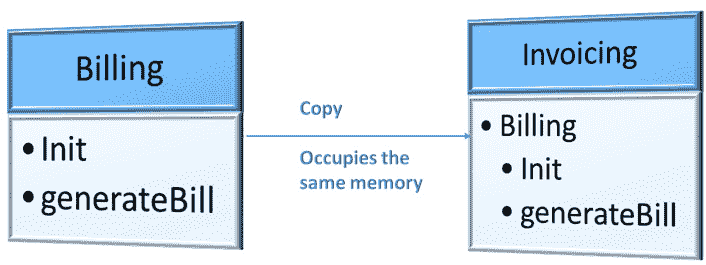
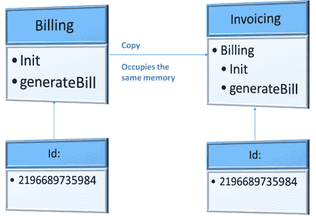
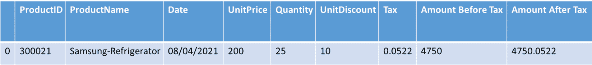
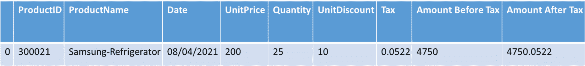
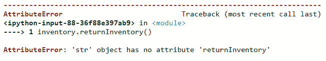
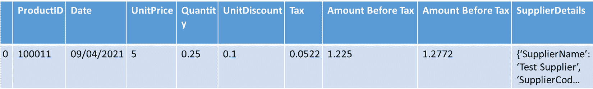
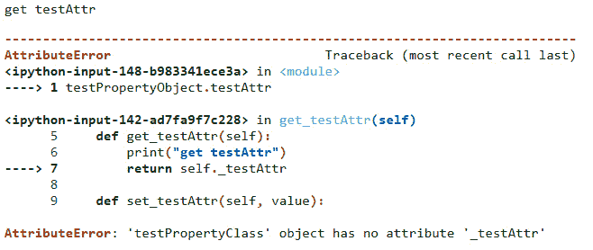

# 第五章：*第五章*：理解内省

在本章中，我们将探讨 Python 3 中的内省，并了解它在元编程中的有用性。**内省**是一个概念，我们可以在 Python 运行时使用一系列 Python 内置方法来了解对象的属性或属性。

为什么需要内省？内省是针对 Python 对象的信息收集过程，收集到的信息可以帮助我们通过外部操作来利用对象执行通用操作，从而有助于我们编写元程序。

在我们理解如何实现内省之前，我们将查看 Python 中帮助执行内省的内置函数。在本章中，我们将查看每个帮助我们内省并理解我们在程序中使用对象的函数。

在本章中，我们将探讨以下主要主题：

+   介绍内置函数

+   使用内置的`id`函数

+   使用`id`调试意外的赋值

+   检查对象是否可调用

+   检查对象是否有属性

+   检查对象是否为实例

+   检查对象是否为子类

+   理解属性的使用

+   将属性用作装饰器

到本章结束时，你应该能够应用内置函数来内省 Python 对象，将它们应用于示例，并使用它们来调试代码。

# 技术要求

本章中分享的代码示例可在 GitHub 上找到，具体位置为[`github.com/PacktPublishing/Metaprogramming-with-Python/tree/main/Chapter05`](https://github.com/PacktPublishing/Metaprogramming-with-Python/tree/main/Chapter05)。

# 介绍内置函数

为了理解内省以及如何使用 Python 的内置函数进行内省，我们将继续在本章中使用我们的核心示例*ABC Megamart*。

我们将介绍以下内置函数的用法，以用于内省 Python 对象：

+   `id()`

+   `eval()`

+   `callable()`

+   `hastattr()`

+   `getattr()`

+   `isinstance()`

+   `issubclass()`

+   `property()`

内省 Python 对象有助于理解对象的属性，这反过来又有助于对这些对象进行元编程，并使用它们来调试对象，我们将在后续章节中进一步探讨。

通过这种理解，让我们进一步探讨如何使用这些内置函数以及如何内省对象。

# 使用内置的`id`函数

理解 Python 对象的特征有助于编写针对该对象的元程序。对象的内存地址是其特征或属性之一，可以使用元编程进行操作。Python 3 中的 `id` 函数可以调用以使用对象的内存地址来识别对象。通过对象的内存地址来识别对象有助于分析对象，以找出在代码开发过程中是否无意中创建了多个对象的赋值或副本。

为了进一步理解，以下是我们的工作方式：

1.  我们将创建一个名为 `Billing` 的类，该类计算并打印任何作为输入提供的产品的简单账单。请参阅以下代码：

    ```py
    class Billing:
        def __init__(self,product_name,unit_price,quantity,tax):
            self.product_name = product_name
            self.unit_price = unit_price
            self.quantity = quantity
            self.tax = tax

        def generate_bill(self):
            total = self.unit_price * self.quantity 
            final_total = total + total*self.tax
            print('***********------------------
                   **************')
            print('Product:', self.product_name)
            print('Total:',final_total)
            print('***********------------------
                   **************')
    ```

1.  现在，让我们为 `Billing` 类创建一个对象：

    ```py
    billing = Billing('Delmonte Cheese',6,4,0.054)
    ```

1.  现在，让我们调用 `generate_bill` 方法来打印账单：

    ```py
    billing.generate_bill()
    ```

此代码将产生以下输出：

```py
***********------------------**************
Product: Delmonte Cheese
Total: 25.296
***********------------------**************
```

1.  在下一步中，让我们创建一个单独的 `generate_bill` 函数，该函数执行与 `Billing` 类内部创建的 `generate_bill` 方法相同的操作集。该函数将接受四个参数（`product_name`、`unit_price`、`quantity` 和 `tax`）：

    ```py
    def generate_bill(product_name,unit_price,quantity,tax):
    total = unit_price * quantity 
        final_total = total + total*tax
        print('***********------------------
               **************')
        print('Product:', product_name)
        print('Total:',final_total)
        print('***********------------------
               **************')
    ```

1.  在下一步中，我们将把 `Billing` 类复制到另一个名为 `Invoicing` 的变量中：

    ```py
    Invoicing = Billing
    ```

到目前为止，我们有三个对象：

+   一个名为 `Billing` 的类

+   一个名为 `generate_bill` 的函数

+   将 `Billing` 类赋值给名为 `Invoicing` 的变量的变量

1.  现在，让我们使用 Python 的内置 `id` 函数来获取这些对象的内存地址：

    ```py
    id(Billing)
    2015859835472
    id(Invoicing)
    2015859835472
    id(generate_bill)
    2015871203792
    ```

在前面的输出中，我们可以注意到 `Billing` 和 `Invoicing` 具有相同的内存地址，因为 `Invoicing` 是 `Billing` 类的副本。以下图是此例的简单表示：



图 5.1 – 将 Billing 类复制到 Invoicing

通过这种理解，我们可以进一步探讨如何在实现元编程时使用 `id` 函数。

# 使用 id 调试无意中的赋值

在本节中，我们将讨论当我们定义属性、方法或函数时对对象进行无意引用或赋值会发生什么，以及如何使用内置的 `id` 函数解决此类错误赋值。当无意中创建引用时，实际对象和引用对象的内存地址是共享的。在本例中，我们将使用 `id` 来调试前面章节中创建的 Python 对象，并识别在开发应用程序时可能无意中创建的对象的重复赋值或引用。以下是它是如何工作的：

1.  首先，让我们创建一个字典项，`class_id_count`，以捕获每个类内存地址出现的次数：

    ```py
    class_id_count = {}
    ```

1.  在下一步中，我们将创建以下四个列表：

    ```py
    duplicates = []
    ids = []
    classes = []
    classnames = []
    ```

在这里，我们使用 `duplicates` 捕获重复的内存地址，使用 `ids` 捕获 `id` 函数的结果，使用 `classes` 捕获类详细信息，使用 `classnames` 捕获类的名称。

1.  在此步骤中，我们将遍历 Python 对象的目录，并检查对象的类型是否为 `type`，因为在 Python 中类的类型是 `type`。这一步骤有助于识别所有类对象，然后使用 `ids`、`classes` 和 `classnames` 创建的列表进行更新。请参考以下代码块：

    ```py
    for obj in dir():
        if type(eval(obj)) == type:
            ids.append(id(eval(obj)))
            classes.append(eval(obj))
            classnames.append(obj)
    ```

1.  现在，我们将遍历 `ids` 列表，检查 `id` 是否不在 `class_id_count` 中，然后添加它；如果它已经在 `class_id_count` 中，我们将将其添加到 `duplicates` 列表中：

    ```py
    for i in ids:
        if i not in class_id_count:
            class_id_count[i] = 1
        elif (class_id_count[i] == 1):
            duplicates.append(i)
            class_id_count[i] += 1
    ```

1.  我们将进一步遍历 `classes` 和 `classnames` 列表，检查是否存在重复项。然后，我们将打印出具有重复项的类：

    ```py
    for cls,clsname in zip(classes,classnames):
        for clsid in duplicates:
            if (id(cls)==clsid):
                print(clsname,cls)
    ```

前面代码的输出如下：

```py
Billing <class '__main__.Billing'>
Invoicing <class '__main__.Billing'>
```

1.  执行前面的代码会产生以下输出：

    ```py
    class_id_count
    {2196689735984: 2}
    duplicates
    [2196689735984]
    ids
    [2196689735984, 2196689735984]
    classes
    [__main__.Billing, __main__.Billing]
    classnames
    ['Billing', 'Invoicing']
    ```

在前面的输出中，我们可以看到 `Billing` 和 `Invoicing` 两个类具有相同的内存地址，它们是重复的。可能存在我们有意引用一个类的情况，也可能存在由于错误地将多个变量分配到同一内存地址而导致的场景。在这种情况下，可以使用 `id` 来检查对内存地址的重复分配。

下图是本例的简单表示：



图 5.2 – 具有单个内存地址的两个类

通过这种理解，我们将进一步探讨另一个内置函数，`callable`。

# 查找对象是否可调用

在本节中，我们将探讨另一个内置函数，名为 `callable`。正如其名所示，此函数有助于识别 Python 对象是否可被调用。函数和方法可以被调用以执行对输入参数的各种操作。并非所有 Python 对象都是可调用的。例如，字符串变量或数值变量存储信息，但在执行时不会执行任何操作。`callable` 函数有助于验证哪些对象可以被调用，哪些不能在函数中被调用。

为什么我们需要检查一个对象是否可调用？Python 是一种面向对象的编程语言，在其中我们可以在库中编写类，这些类被封装起来。类的最终用户或库的用户不一定总是需要访问类定义或方法定义。在导入 Python 库时，我们有时可能想知道导入的对象只是一个存储值的变量，还是一个可以被重用的函数。检查这一点最简单的方法是看对象是否可调用，因为函数或方法通常是可调用的。这在某些情况下非常有用，尤其是当库的开发者没有为其方法和属性提供任何文档时。

让我们以下面的例子来使用`callable`：

1.  让我们创建一个新的 Python 文件，并将其保存为`product.py`。转到[`github.com/PacktPublishing/Metaprogramming-with-Python/blob/main/Chapter05/product.py`](https://github.com/PacktPublishing/Metaprogramming-with-Python/blob/main/Chapter05/product.py)并添加以下代码，该代码创建一个名为`Product`的类。向其中添加以下四个属性：`Product ID`（产品 ID）、`Product Name`（产品名称）、`Product Category`（产品类别）和`Unit Price`（单价）。我们现在将为这四个属性分配值，如下所示：

    ```py
    class Product:
        _product_id = 100902
        _product_name = 'Iphone X'
        _product_category = 'Electronics'
        _unit_price = 700
    ```

1.  现在，让我们在`Product`类中添加一个名为`get_product`的方法。这个方法将简单地返回前面步骤中创建的四个属性：

    ```py
        def get_product(self):
            return self._product_id, self._product_name, 
                 self._product_category, self._unit_price
    ```

1.  在这个步骤中，我们将从`product.py`导入`Product`类并为其创建一个对象：

    ```py
    import product
    prodobj = product.Product()
    ```

1.  让我们现在使用内置的`callable`函数来检查类是否可调用。该类是可调用的，因此函数返回`True`：

    ```py
    callable(product.Product)
    True
    ```

1.  在这个步骤中，我们还可以检查类对象是否可调用。该对象不可调用，因为我们没有重写类的`__call__`方法使其可调用，因此函数返回`False`：

    ```py
    callable(prodobj)
    False
    ```

1.  我们现在可以检查一个 Python 对象是否可调用，然后获取其属性：

    ```py
    if callable(prodobj.get_product):
        print(prodobj.get_product())
    else:
        print("This object is not callable")
    ```

1.  同样，我们也可以检查一个 Python 对象是否可调用，如果返回`True`，则打印该对象详情：

    ```py
    if callable(prodobj):
        print(prodobj)
    else:
        print('This is not a method')
    ```

通过这个例子，我们可以进一步了解下一个函数，`hasattr`。

# 检查对象是否有属性

当通过将库导入另一个程序中来使用框架或库中定义的方法或函数对象时，我们可能并不总是知道对象的所有属性。在这种情况下，我们有一个内置的`hasattr`函数，可以用来检查 Python 对象是否有特定的属性。

这个函数检查给定对象是否有属性。为了测试这个函数，我们将为*ABC Megamart*的库存创建一个类，为库存中存储的产品添加所需的属性，包括产品的价格和税费成分。库存中的产品的价格将在税前和税后计算。以下是步骤：

1.  我们将创建一个名为`Inventory`的类，并用库存所需的变量来初始化它，例如`product_id`（产品 ID）、`product_name`（产品名称）、`date`（购买日期）、`unit_price`（单价）、`quantity`（数量）、`unit_discount`（折扣）和`tax`（税），如下面的代码所示：

    ```py
    class Inventory:
        def __init__(self,product_id,product_name,date,unit_price,quantity,unit_discount,tax):  
            self.product_id = product_id
            self.product_name = product_name
            self.date = date
            self.unit_price = unit_price
            self.quantity = quantity
            self.unit_discount = unit_discount
            self.tax = tax
    ```

1.  在这一步中，我们将向`Inventory`类添加一个方法来计算不含税金额，在这个方法中，我们将有三个输入参数：`quantity`（数量）、`unit_price`（单价）和`unit_discount`（折扣）。如果这三个变量都是`None`，则此方法将使用在`Inventory`类实例化期间初始化的相同变量来计算不含税金额：

    ```py
    def calc_amount_before_tax(self,quantity=None,unit_price=None, unit_discount=None):
            if quantity is None:
                self.quantity = self.quantity
            else:
                self.quantity = quantity

            if unit_price is None:
                self.unit_price = self.unit_price
            else:
                self.unit_price = unit_price

            if unit_discount is None:
                self.unit_discount = self.unit_discount
            else:
                self.unit_discount = unit_discount
            amount_before_tax = self.quantity * 
               (self.unit_price - self.unit_discount)
            return amount_before_tax
    ```

1.  我们还将为`Inventory`类添加另一个方法来计算含税金额。此方法与`calc_amount_before_tax`定义的格式类似：

    ```py
    def calc_amount_after_tax(self, quantity=None,unit_price=None,unit_discount=None,tax=None):
            if quantity is None:
                self.quantity = self.quantity
            else:
                self.quantity = quantity

            if unit_price is None:
                self.unit_price = self.unit_price
            else:
                self.unit_price = unit_price

            if unit_discount is None:
                self.unit_discount = self.unit_discount
            else:
                self.unit_discount = unit_discount

            if tax is None:
                self.tax = self.tax
            else:
                self.tax = tax
            amount_after_tax = 
                self.calc_amount_before_tax(
                self.quantity,self.unit_price,
                self.unit_discount) + self.tax
            return amount_after_tax
    ```

1.  我们现在将为这个类创建最后一个方法，该方法返回合并的库存详情，创建一个 DataFrame，并返回该 DataFrame：

    ```py
        def return_inventory(self):
            import pandas as pd
            inventory_schema = pd.DataFrame([
                               self.product_id,
                               self.product_name,
                               self.date,
                               self.unit_price,
                               self.quantity,
                               self.unit_discount,
                               self.tax,
                               self.calc_unt_before_tax(),
                self.calc_amount_after_tax()]).transpose()
            inventory_schema.columns = ["Product_id",
                "Product_name","Date","Unit_price",
                "Quantity","Unit_discount","Tax",
                "Amount Before Tax", "Amount After Tax"]
            return inventory_schema    
    ```

1.  然后，为`Inventory`类创建一个对象并初始化其属性：

    ```py
    inventory = Inventory(300021,
                    'Samsung-Refrigerator',
                    '08/04/2021',
                    200,
                    25,
                    10,
                    0.0522)
    ```

1.  检查对象是否返回属性：

    ```py
    inventory.product_id
    300021
    inventory.product_name
    'Samsung-Refrigerator'
    inventory.date
    '08/04/2021'
    inventory.unit_price
    200
    inventory.quantity
    25
    inventory.unit_discount
    10
    inventory.tax
    0.0522
    inventory.calc_amount_before_tax()
    4750
    inventory.calc_amount_after_tax()
    4750.0522
    inventory.return_inventory()
    ```

前面代码的输出如下：



图 5.3 – 输出 – 库存详情

1.  接下来，让我们使用`dir`列出`Inventory`类中所有参数的名称：

    ```py
    dir(Inventory)
    ['__class__',
     '__delattr__',
     '__dict__',
     ‚__dir__',
     ‚__doc__',
     ‚__eq__',
     ‚__format__',
     ‚__ge__',
     ‚__getattribute__',
     ‚__gt__',
     ‚__hash__',
     ‚__init__',
     ‚__init_subclass__',
     ‚__le__',
     ‚__lt__',
     ‚__module__',
     ‚__ne__',
     ‚__new__',
     ‚__reduce__',
     ‚__reduce_ex__',
     ‚__repr__',
     ‚__setattr__',
     ‚__sizeof__',
     ‚__str__',
     ‚__subclasshook__',
     ‚__weakref__',
     ‚calc_amount_after_tax',
     ‚calc_amount_before_tax',
     ‚return_inventory']
    ```

1.  现在，让我们使用`hasattr`来检查类是否有属性。如果属性的类型是方法，则使用`getattr`来获取属性。执行以下循环将得到`Inventory`的所有属性列表：

    ```py
    for i in dir(Inventory):
         if (hasattr(Inventory,i)):
                if type(getattr(inventory, i)) is type(getattr(inventory,  '__init__')):
                    print(getattr(Inventory,i))<class 'type'>
    <function Inventory.__init__ at 0x000001C9BBB46CA0>
    <function Inventory.calc_amount_after_tax at 0x000001C9BBB46DC0>
    <function Inventory.calc_amount_before_tax at 0x000001C9BBB46D30>
    <function Inventory.return_inventory at 0x000001C9BBB46E50>
    ```

通过这种理解，我们可以进一步了解另一个内置函数，`isinstance`。

# 检查对象是否是实例

在本节中，我们将探讨另一个名为`isinstance`的函数，它可以用来检查一个对象是否是特定类的实例。由于我们在本章中讨论的是内省，我们更关注可用于内省对象的函数，而不是如何进一步使用这些函数来操作或调试代码。*第六章*将涵盖这些函数在元编程中的使用，并附带示例。

在前面的章节中，我们创建了一个名为`Inventory`的类。在本节中，我们可以继续使用相同的类并为该类创建另一个对象。如下所示：

```py
inventory_fmcg = Inventory(100011,
```

```py
                'Delmonte Ketchup',
```

```py
                '09/04/2021',
```

```py
                5,
```

```py
                0.25,
```

```py
                0.10,
```

```py
                0.0522)
```

```py
inventory_fmcg.product_id
```

```py
100011
```

```py
inventory_fmcg.calc_amount_before_tax()
```

```py
1.225
```

```py
inventory_fmcg.calc_amount_after_tax()
```

```py
1.2772000000000001
```

```py
inventory_fmcg.return_inventory()
```

前面代码的输出如下：


图 5.4 – 输出 – `inventory_fmcg`的库存详情

现在，让我们使用`isinstance`检查`inventory_fmcg`是否是`Inventory`类的对象：

```py
isinstance(inventory_fmcg,Inventory)
True
```

类似地，我们也可以检查之前创建的`inventory`对象是否仍然是`Inventory`类的实例：

```py
isinstance(inventory,Inventory)
True
```

让我们考虑一个场景，在编写代码时错误地将对象库存重新分配给另一个值，我们可能仍然需要使用该对象并调用其方法来返回库存详情。为了使用`isinstance`测试这个场景，我们可以查看以下步骤：

1.  检查一个对象是否是`Inventory`类的实例，并调用该函数的方法。如果对象不是类的实例，检查它被重新分配到的变量类型：

    ```py
    if isinstance(inventory,Inventory):
        display(inventory.return_inventory())
    else:
        print("Object reallocated to",  type(inventory), 
              ", please correct it")
    ```

1.  由于`inventory`仍然是`Inventory`类的对象，前面的代码会产生以下输出：



图 5.5 – 输出 – 库存详情

1.  现在，让我们将`inventory`变量重新分配给某个其他的字符串值，并在其上调用`return_inventory`方法：

    ```py
    inventory = "test"
    ```

1.  调用`inventory`对象的`return_inventory`方法将产生以下错误：



图 5.6 – 在重新分配的对象上调用 return_inventory 方法时的错误

1.  为了避免前面的错误，并让代码优雅地处理这个错误，同时向开发者提供更多信息，我们可以使用`isinstance`方法修改代码如下：

    ```py
    if isinstance(inventory,Inventory):
        print(inventory.return_inventory())
    else:
        print("Object reallocated to",  type(inventory), 
              ", please correct it")
    ```

上述代码的输出如下：

```py
Object reallocated to <class 'str'> , please correct it
```

通过这种理解，我们可以进一步了解另一个内置函数`issubclass`。

# 检查一个对象是否是子类

在本节中，我们将查看`issubclass`函数。此函数用于检查给定的输入类是否实际上是特定父类的子类或子类。要使用此函数进行类内省，让我们查看以下步骤：

1.  通过初始化供应商信息变量（如`supplier_name`、`supplier_code`、`supplier_address`、`supplier_contract_start_date`、`supplier_contract_end_date`和`supplier_quality_code`）创建一个`FMCG`类，如下所示：

    ```py
    class FMCG:
        def __init__(self,supplier_name,supplier_code,
           supplier_address,supplier_contract_start_date,\
        supplier_contract_end_date,supplier_quality_code):
            self.supplier_name = supplier_name
            self.supplier_code = supplier_code
            self.supplier_address = supplier_address
            self.supplier_contract_start_date = 
                 supplier_contract_start_date
            self.supplier_contract_end_date = 
                 supplier_contract_end_date
            self.supplier_quality_code = 
                 supplier_quality_code
    ```

1.  在类中添加一个方法，简单地获取类中初始化的供应商详情，并将其作为包含键和值的字典对象返回：

    ```py
        def get_supplier_details(self):
            supplier_details = {
               'Supplier_name': self.supplier_name, 
                'Supplier_code': self.supplier_code,
                'Supplier_address': self.supplier_address,
                'ContractStartDate': 
                        self.supplier_contract_start_date,
                'ContractEndDate': 
                          self.supplier_contract_end_date, 
                'QualityCode': self.supplier_quality_code
            }
            return supplier_details
    ```

1.  创建一个`FMCG`类的对象，用供应商数据初始化变量，然后通过调用前面的方法显示供应商详情：

    ```py
    fmcg = FMCG('Test Supplier','a0015','5093 9th Main Street, Pasadena,California, 91001', '05/04/2020', '05/04/2025',1)
    fmcg.get_supplier_details()
    {'Supplier_name': 'Test Supplier',
     'Supplier_code': 'a0015',
     'Supplier_address': '5093 9th Main Street, 
        Pasadena,California, 91001',
     'ContractStartDate': '05/04/2020',
     'ContractEndDate': '05/04/2025',
     'QualityCode': 1}
    ```

1.  在这里，我们可以创建另一个用于香料的类，该类通过从`FMCG`类和`Inventory`类继承来覆盖库存详情和 FMCG 供应商详情。这个类将初始化所有产品级别的库存变量和供应商级别的变量：

    ```py
    class Condiments(FMCG,Inventory):
        def __init__(self,*inventory):
            self.product_id = inventory[0]
            self.product_name = inventory[1]
            self.date = inventory[2]
            self.unit_price = inventory[3]
            self.quantity = inventory[4]
            self.unit_discount = inventory[5]
            self.tax = inventory[6]
            self.supplier_name = inventory[7]
            self.supplier_code = inventory[8]
            self.supplier_address = inventory[9]
            self.supplier_contract_start_date = 
                                    inventory[10]
            self.supplier_contract_end_date = 
                                    inventory[11]
            self.supplier_quality_code = inventory[12]
    ```

1.  然后，让我们添加一个方法，简单地返回在`Condiments`类中初始化的所有变量，通过将它们存储为 DataFrame 或表格：

    ```py
        def return_condiment_inventory(self):
            import pandas as pd
            inventory_schema = pd.DataFrame([
                            self.product_id,
                            self.date,
                            self.unit_price,
                            self.quantity,
                            self.unit_discount,
                            self.tax,
                            self.calc_amount_before_tax(),
                            self.calc_amount_after_tax(),
                            self.get_supplier_details()
                                           ]).transpose()
            inventory_schema.columns = ["Product_id",
                "Date","Unit_price","Quantity",
                "Unit_discount","Tax","Amount Before Tax", 
                "Amount After Tax",'Supplier_details']
            return inventory_schema          
    ```

1.  我们现在可以创建这个类的对象并调用其方法：

    ```py
    ketchup = Condiments(100011,'Delmonte Ketchup','09/04/2021',5,0.25,0.10,0.0522,'Test Supplier','a0015','5093 9th Main Street, Pasadena,California, 91001', '05/04/2020', '05/04/2025',1)
    ketchup.return_condiment_inventory()
    ```

1.  执行前面的代码会产生以下输出：



图 5.7 – 输出 – 调味品库存详情

1.  现在我们检查 `FMCG` 类是否是 `Inventory` 类的子类。它将返回 `False`，因为 FMCG 不是 `Inventory` 的子类：

    ```py
    issubclass(FMCG,Inventory)
    False
    ```

1.  在这一步中，我们将检查 `Condiments` 是否是 `FMCG` 的子类，以及它是否是 `Inventory` 的子类。两者都应该返回 `True`，因为 `Condiments` 从这两个类中继承而来：

    ```py
    issubclass(Condiments,FMCG)
    True
    issubclass(Condiments,Inventory)
    True
    ```

1.  接下来，我们将通过首先检查一个类是否是特定父类的子类，然后相应地创建一个对象，最后在新建的对象上调用一个方法来创建一个类的对象：

    ```py
    if issubclass(Condiments,FMCG):
        fmcg = Condiments(100011,'Delmonte 
          Ketchup','09/04/2021',5,0.25,0.10,0.0522,
          'Test Supplier','a0015','5093 9th Main Street, 
          Pasadena,California, 91001', '05/04/2020', 
          '05/04/2025',1)
    else:
        fmcg = FMCG('Test Supplier','a0015','5093 9th Main
          Street, Pasadena,California, 91001', 
          '05/04/2020', '05/04/2025',1)
    display(fmcg.get_supplier_details())
    ```

1.  执行前面的代码会产生以下输出：

    ```py
    {'Supplier_name': 'Test Supplier',
     'Supplier_code': 'a0015',
     'Supplier_address': '5093 9th Main Street, 
        Pasadena,California, 91001',
     'ContractStartDate': '05/04/2020',
     'ContractEndDate': '05/04/2025',
     'QualityCode': 1}
    ```

通过这个理解，我们可以进一步探讨本章的最后一个主题。

# 理解 `property` 的用法

在本节中，我们将查看本章最后介绍的最后一个内置函数，即 `property`。这个函数用于在 Python 中初始化、设置、获取或删除属性的属性。这些值被称为对象的属性。让我们首先通过创建一个示例来理解 `property` 在 Python 对象上的工作方式。

我们可以通过简单地调用 `property` 函数并将其存储为变量来创建一个属性。参考以下代码：

```py
test_property = property()
```

```py
test_property
```

```py
<property at 0x1c9c9335950>
```

我们仍未回答这个函数是如何创建属性的问题。`property` 函数接收四个变量以获取、设置、删除和记录属性的属性。为了进一步检查它，让我们更详细地看看它。步骤如下：

1.  创建一个名为 `TestPropertyClass` 的类。

1.  使用 `test` 属性初始化它，并将其设置为 `None`。

1.  我们将添加三个方法来执行初始化 `test` 属性的获取、设置和删除功能。

1.  然后，我们将在类内部创建另一个名为 `test_attr` 的变量，并将 `property` 函数分配给它，使用在这个类中创建的 `get`、`set` 和 `delete` 方法。

这个示例的代码如下：

```py
class TestPropertyClass:
```

```py
    def __init__(self):
```

```py
        self._test_attr = None
```

```py
    def get_test_attr(self):
```

```py
        print("get test_attr")
```

```py
        return self._test_attr
```

```py
    def set_test_attr(self, value):
```

```py
        print("set test_attr")
```

```py
        self._test_attr = value
```

```py
    def del_test_attr(self):
```

```py
        print("del test_attr")
```

```py
        del self._test_attr
```

```py
    test_attr = property(get_test_attr, set_test_attr, 
```

```py
        del_test_attr, "test_attr is a property")
```

在前面的代码中，`get_test_attr` 简单地返回 `test` 属性，`set_test_attr` 将值设置到 `test` 属性，而 `del_test_attr` 删除 `test` 属性。

现在我们创建这个类的对象，并检查 `property` 在其上的工作方式：

```py
test_property_object = TestPropertyClass()
```

```py
test_property_object.test_attr
```

```py
get test_attr
```

在前面的代码中，调用 `test` 属性，反过来，调用了 `get_test_attr` 方法，因为它被作为 `get` 方法提供给 `property` 函数。让我们进一步确认这一理解，通过设置 `test_attr` 的值：

```py
test_property_object.test_attr = 1980
```

```py
set test_attr
```

将值赋给 `test_attr` 变量现在调用了 `set_test_attr` 方法，因为它被作为 `set` 方法提供给 `property` 函数。再次调用 `test_attr` 属性将返回前面步骤中设置的值：

```py
test_property_object.test_attr
```

```py
get test_attr
```

```py
1980
```

同样，删除属性，反过来，会调用 `del_test_attr` 方法，因为它被作为 `delete` 方法提供给 `property` 函数：

```py
del test_property_object.test_attr
```

```py
del test_attr
```

一旦属性被删除，在调用属性时`get`方法仍然会被调用，但由于它已被删除，因此不会返回之前分配的值：

```py
test_property_object.test_attr
```

前面代码的输出现在将如下所示：



图 5.8 – 在已删除属性上调用 get 方法

通过修改`getter`、`setter`或`deleter`方法的行为，我们可以修改属性本身的属性。我们将在*第六章*中详细探讨这个说法。

通过理解将`property`函数分配给变量然后调用其`getter`、`setter`和`deleter`方法，我们将进一步探讨实现`property`的另一种变体。

# 使用 property 作为装饰器

在前面的部分，我们探讨了如何使用`property`函数来修改类中属性的属性。在本节中，我们将探讨如何使用`property`作为装饰器。让我们考虑与前面示例相同的`TestPropertyClass`，并将类定义修改为使用`@property`装饰器语句而不是`property()`函数语句。参考以下代码：

```py
class TestPropertyClass:
```

```py
    def __init__(self):
```

```py
        self._test_attr = None
```

```py
    @property
```

```py
    def test_attr(self):
```

```py
        return self.test_attr
```

```py
    @test_attr.getter
```

```py
    def test_attr(self):
```

```py
        print("get test_attr")
```

```py
        return self._test_attr
```

```py
    @test_attr.setter
```

```py
    def test_attr(self, value):
```

```py
        print("set test_attr")
```

```py
        self._test_attr = value
```

```py
    @test_attr.deleter
```

```py
    def test_attr(self):
```

```py
        print("del test_attr")
```

```py
        del self._test_attr
```

在前面的代码中，我们为`test_attr`添加了`@property`作为装饰器，并且我们也为`set`方法添加了`@test_attr.setter`，为`get`方法添加了`@test_attr.getter`，为`delete`方法添加了`@test_attr.deleter`。

让我们继续执行代码以检查`getter`、`setter`和`deleter`是否按预期工作：

```py
test_property_object = TestPropertyClass()
```

```py
test_property_object.test_attr
```

```py
get test_attr
```

在前面的代码中，调用属性调用了`getter`方法。同样，`setter`和`deleter`也分别调用了`set`和`delete`方法：

```py
test_property_object.test_attr = 1982
```

```py
set test_attr
```

```py
test_property_object.test_attr
```

```py
get test_attr
```

```py
1982
```

```py
del test_property_object.test_attr
```

```py
del test_attr
```

这些是一些如何使用 Python 内置函数将内省应用于 Python 对象的例子。

# 摘要

在本章中，我们学习了如何使用内置函数内省 Python 对象。

我们然后看到了如何使用`id`函数，以及如何使用`id`进行代码调试。我们还探讨了如何检查一个对象是否可调用，如何检查一个对象是否有属性，如何检查一个对象是否是实例，如何检查一个对象是否是子类，最后，我们探讨了如何在属性上获取、设置和删除属性。从所有这些概念中，我们学习了如何检查 Python 对象，如类、方法和函数。从每个主题下的示例中，我们也学习了如何在实际用例中应用内省。 

在下一章中，我们将扩展从内省中学到的知识，并将其进一步应用于理解 Python 对象的反射。
