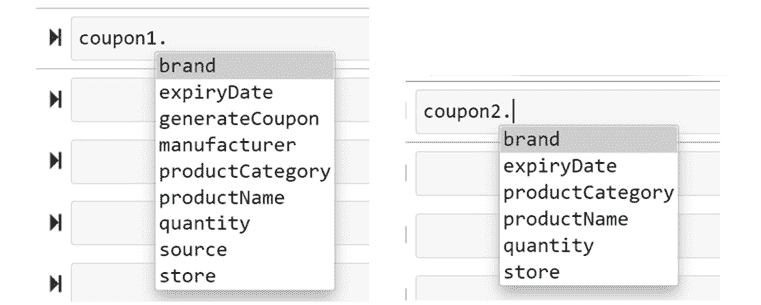

# 第六章：*第六章*：在 Python 对象上实现反射

在本章中，我们将探讨 Python 3 中的反射，并了解它在元编程中的有用性。**反射**是内省的延续，或者可以将其视为一个概念，我们可以利用从 Python 对象的属性或属性的内省中学习到的信息来操纵对象，从而进行元编程。

为什么需要反射？正如我们从上一章所知，内省是 Python 对象的收集信息过程。反射是通过内省从对象中获取信息的过程，然后通过外部操作它们来执行通用操作，从而进行元编程。

在本章中，我们将查看使用每个在上一章帮助我们内省对象的函数来实现反射，并在我们的程序中使用的对象上进行元编程。

在本章中，我们将探讨以下主要主题：

+   介绍在反射中使用的内置函数

+   使用 id 删除重复项

+   使用 `callable` 动态检查和生成方法

+   使用 `hasattr` 设置值

+   使用 `isinstance` 修改一个对象

+   使用 `issubclass` 修改一个类

+   在优惠券上应用 `property`

到本章结束时，你应该能够应用内置函数来反射 Python 对象，将它们应用于示例，并使用它们来生成或修改代码。

# 技术要求

本章中分享的代码示例可在 GitHub 上找到：[`github.com/PacktPublishing/Metaprogramming-with-Python/tree/main/Chapter06`](https://github.com/PacktPublishing/Metaprogramming-with-Python/tree/main/Chapter06).

# 介绍在反射中使用的内置函数

为了理解反射以及使用 Python 的内置函数进行反射的使用，我们将继续在本章中使用我们的核心示例 *ABC Megamart*。我们将具体探讨本章中基于零售店优惠券的概念和示例。优惠券是零售店或制造商用来在消费者中推广其产品的技术。优惠券通过各种广告方式生成和发布，并用于吸引顾客到特定的商店或产品。

我们将使用与内省相同的内置函数集，以对 Python 对象进行反射：

+   `id()`

+   `eval()`

+   `callable()`

+   `hastattr()`

+   `getattr()`

+   `isinstance()`

+   `issubclass()`

+   `property()`

对 Python 对象的反射有助于使用内置函数进行元编程，这些函数可以内省 Python 对象，我们将在本章中查看一些示例。

# 使用 id 删除重复项

我们在上一章中回顾了 `id` 函数，它涵盖了内省。在 Python 3 中，`id` 用于通过对象的内存地址来识别对象。识别对象的 `id` 可以用来反思对象，并避免在使用对象时可能发生的冗余或错误。

为了进一步理解这一点，我们将创建一个名为 `Coupon` 的类，该类生成唯一的随机优惠券 ID，并打印出任何作为输入提供的产品优惠券。在下面的代码中，我们将从创建一个名为 `Coupon` 的类开始，并将添加优惠券详情作为属性。我们还将创建一个名为 `generate_coupon` 的方法，用于打印产品的五个优惠券及其唯一的随机优惠券 ID：

```py
class Coupon:
```

```py
    def __init__(self, product_name, product_category, \
```

```py
      brand,source, expiry_date, quantity):
```

```py
        self.product_name = product_name
```

```py
        self.product_category = product_category
```

```py
        self.brand = brand
```

```py
        self.source = source
```

```py
        self.expiry_date = expiry_date
```

```py
        self.quantity = quantity
```

```py
   def generate_coupon(self):
```

```py
        import random
```

```py
        couponId =  random.sample(range(1,9),5)
```

```py
        for i in couponId:
```

```py
            print('***********------------------**************')
```

```py
            print('Product:', self.product_name)
```

```py
            print('Product Category:', \
```

```py
              self.product_category)
```

```py
            print('Coupon ID:', i)
```

```py
            print('Brand:', self.brand)
```

```py
            print('Source:', self.source)
```

```py
            print('Expiry Date:', self.expiry_date)
```

```py
            print('Quantity:', self.quantity)
```

```py
            print('***********------------------**************')
```

现在让我们创建一个 `Coupon1` 变量并将 `Coupon` 类分配给它：

```py
Coupon1 = Coupon
```

在这种情况下，我们有意将 `Coupon` 类分配给一个变量以演示 `id` 函数的使用。理想情况下，这个函数将非常有用，用于调试并确保类实际上被无意中分配，从而在代码的后续部分导致问题。到目前为止，让我们假设将 `Coupon` 类分配给变量的操作是无意的。

让我们看看如何识别和解决这种无意中的类分配，并回顾如果 `Coupon` 是唯一应该可用于生成优惠券的类时，当调用 `Coupon1` 时优惠券生成结果。

在前面的 `Coupon` 类中，预期只为具有唯一随机优惠券标识符的产品生成五个优惠券。由于我们已经将类分配给了一个变量，类标识符也被分配给了该变量：

```py
id(Coupon)
```

```py
2175775727280
```

```py
id(Coupon1)
```

```py
2175775727280
```

现在让我们调用 `Coupon` 类的 `generate_coupon` 方法及其属性，并查看结果：

```py
Coupon("Potato Chips","Snacks","ABCBrand1","Manhattan Store","10/1/2021",2).generateCoupon()
```

优惠券 1 的输出如下：

```py
***********------------------**************
```

```py
Product: Potato Chips
```

```py
Product Category: Snacks
```

```py
Coupon ID: 5
```

```py
Brand: ABCBrand1
```

```py
Source: Manhattan Store
```

```py
Expiry Date: 10/1/2021
```

```py
Quantity: 2
```

```py
***********------------------**************
```

优惠券 2 的输出如下：

```py
***********------------------**************
```

```py
Product: Potato Chips
```

```py
Product Category: Snacks
```

```py
Coupon ID: 1
```

```py
Brand: ABCBrand1
```

```py
Source: Manhattan Store
```

```py
Expiry Date: 10/1/2021
```

```py
Quantity: 2
```

```py
***********------------------**************
```

优惠券 3 的输出如下：

```py
***********------------------**************
```

```py
Product: Potato Chips
```

```py
Product Category: Snacks
```

```py
Coupon ID: 4
```

```py
Brand: ABCBrand1
```

```py
Source: Manhattan Store
```

```py
Expiry Date: 10/1/2021
```

```py
Quantity: 2
```

```py
***********------------------**************
```

优惠券 4 的输出如下：

```py
***********------------------**************
```

```py
Product: Potato Chips
```

```py
Product Category: Snacks
```

```py
Coupon ID: 8
```

```py
Brand: ABCBrand1
```

```py
Source: Manhattan Store
```

```py
Expiry Date: 10/1/2021
```

```py
Quantity: 2
```

```py
***********------------------**************
```

优惠券 5 的输出如下：

```py
***********------------------**************
```

```py
Product: Potato Chips
```

```py
Product Category: Snacks
```

```py
Coupon ID: 3
```

```py
Brand: ABCBrand1
```

```py
Source: Manhattan Store
```

```py
Expiry Date: 10/1/2021
```

```py
Quantity: 2
```

```py
***********------------------**************
```

调用前面的方法生成了薯片产品的五个独特优惠券。优惠券标识符是唯一的，未来代码的任何其他部分都不应重新生成；因此，前面的方法在代码中只调用一次。由于我们已经将 `Coupon` 类分配给另一个名为 `Coupon1` 的变量，让我们看看如果无意中在代码的其他部分调用 `Coupon1` 会发生什么：

```py
Coupon1("Potato Chips","Snacks","ABCBrand1","Manhattan Store","10/1/2021",2).generate_coupon()
```

优惠券 1 的输出如下：

```py
***********------------------**************
```

```py
Product: Potato Chips
```

```py
Product Category: Snacks
```

```py
Coupon ID: 7
```

```py
Brand: ABCBrand1
```

```py
Source: Manhattan Store
```

```py
Expiry Date: 10/1/2021
```

```py
Quantity: 2
```

```py
***********------------------**************
```

优惠券 2 的输出如下：

```py
***********------------------**************
```

```py
Product: Potato Chips
```

```py
Product Category: Snacks
```

```py
Coupon ID: 8
```

```py
Brand: ABCBrand1
```

```py
Source: Manhattan Store
```

```py
Expiry Date: 10/1/2021
```

```py
Quantity: 2
```

```py
***********------------------**************
```

优惠券 3 的输出如下：

```py
***********------------------**************
```

```py
Product: Potato Chips
```

```py
Product Category: Snacks
```

```py
Coupon ID: 1
```

```py
Brand: ABCBrand1
```

```py
Source: Manhattan Store
```

```py
Expiry Date: 10/1/2021
```

```py
Quantity: 2
```

```py
***********------------------**************
```

优惠券 4 的输出如下：

```py
***********------------------**************
```

```py
Product: Potato Chips
```

```py
Product Category: Snacks
```

```py
Coupon ID: 6
```

```py
Brand: ABCBrand1
```

```py
Source: Manhattan Store
```

```py
Expiry Date: 10/1/2021
```

```py
Quantity: 2
```

```py
***********------------------**************
```

优惠券 5 的输出如下：

```py
***********------------------**************
```

```py
Product: Potato Chips
```

```py
Product Category: Snacks
```

```py
Coupon ID: 2
```

```py
Brand: ABCBrand1
```

```py
Source: Manhattan Store
```

```py
Expiry Date: 10/1/2021
```

```py
Quantity: 2
```

```py
***********------------------**************
```

在本例中，代码中不应调用`Coupon1`，因为调用它将生成重复的优惠券，可能具有相同的 ID。这可能导致为同一产品创建五个额外的优惠券，这是不必要的；在这些优惠券中，有两个将是重复的，具有优惠券标识符`1`和`8`。这导致在分发给消费者时使优惠券`1`和`8`失效，因为每个优惠券都应有一个唯一的标识符以供兑换。

现在我们来看看如何通过开发一个名为`delete_duplicates`的函数来解决这个问题，该函数检查并删除此类重复分配。该函数查看目录中具有重复项的 Python 对象列表，并删除类的重复项。请参考以下代码：

```py
def delete_duplicates(directory = dir()):
```

```py
    class_id_count = {}
```

```py
    duplicates = []
```

```py
    ids = []
```

```py
    classes = []
```

```py
    classnames = []
```

```py
    for obj in directory:
```

```py
        if type(eval(obj)) == type:
```

```py
            ids.append(id(eval(obj)))
```

```py
            classes.append(eval(obj))
```

```py
            classnames.append(obj)
```

```py
    for i in ids:
```

```py
        if i not in class_id_count:
```

```py
            class_id_count[i] = 1
```

```py
        elif (class_id_count[i] == 1):
```

```py
            duplicates.append(i)
```

```py
            class_id_count[i] += 1
```

```py
    dupe_set = {}
```

```py
    for cls,clsname in zip(classes,classnames):
```

```py
        for clsid in duplicates:
```

```py
            if (id(cls)==clsid):
```

```py
                print(clsname,cls)
```

```py
                dupe_set[clsname] = \
```

```py
                  str(cls).split('.')[1].rstrip("'>'")
```

```py
    for key,value in dupe_set.items():
```

```py
        if (key!=value):
```

```py
            del globals()[key]
```

上述代码中的前三个`for`循环在上一章的*使用 id 调试意外分配*部分已有讨论，该部分涵盖了内省。最后一个`for`循环检查名为`dupe_set`的字典中是否存在重复项，并且只删除重复变量，而不是实际的类。

调用前面的函数会导致删除重复的`Coupon1`变量：

```py
delete_duplicates(directory = dir())
```

```py
Coupon <class '__main__.Coupon'>
```

```py
Coupon1 <class '__main__.Coupon'>
```

```py
Coupon
```

```py
__main__.Coupon
```

```py
Coupon1
```

检查`Coupon1`是否仍然存在会导致以下错误：


图 6.1 – 删除`Coupon1`后调用错误

前面的错误确认了重复变量已被`delete_duplicates`函数删除。在下一节中，我们将探讨使用名为`callable`的函数应用反射。

# 使用`callable`动态检查和生成方法

我们现在将探讨另一个熟悉的功能`callable`，看看它如何被用来对一个对象进行反射。

注意

在 Python 中，类、方法或函数是可调用的，而类对象或变量不是可调用的。

在本例中，我们将检查一个类是否可调用，如果返回`true`，我们将动态地向该类添加一个方法。为了测试`callable`函数的用法，我们将首先创建一个优惠券类，并将其命名为`SimpleCoupon`：

```py
class SimpleCoupon:
```

```py
    pass
```

让我们检查前面的类是否可调用：

```py
callable(SimpleCoupon)
```

```py
True
```

在以下代码中，我们将创建一个函数，如果被调用，将生成另一个函数。我们将创建一个`create_coupon`函数，当被调用时，它将创建一个`generate_coupon`函数或方法：

```py
def create_coupon( product, product_category, brand, source, expiry_date, quantity:
```

```py
    def generate_coupon(product, product_category, brand, \
```

```py
      source, expiry_date, quantity):
```

```py
        import random
```

```py
        couponId =  random.sample(range(100000000000,900000000000),3)
```

```py
        for i in couponId:
```

```py
            print(\
```

```py
             '***********------------------**************')
```

```py
            print('Product:',product)
```

```py
            print('Product Category:', product_category)
```

```py
            print('Coupon ID:', i)
```

```py
            print('Brand:', brand)
```

```py
            print('Source:',  source)
```

```py
            print('Expiry Date:',  expiry_date)
```

```py
            print('Quantity:',  quantity)
```

```py
            print(\
```

```py
             '***********------------------**************')
```

```py
    return generate_coupon
```

让我们现在检查`SimpleCoupon`类是否可调用，如果它是可调用的，我们将添加一个`coupon_details`变量，以提供所有必要的输入参数来初始化调用：

```py
if callable(SimpleCoupon):
```

```py
    SimpleCoupon.coupon_details = {
```

```py
                          "product": "Honey Mustard Sauce",
```

```py
                          "product_category": "Condiments",
```

```py
                          "brand": "ABCBrand3",
```

```py
                          "source": "Pasadena Store",
```

```py
                          "expiry_date": "10/1/2021",
```

```py
                          "quantity": 2}
```

在下一步中，让我们检查如何动态创建一个方法并将其添加到类中，如果该类是可调用的。为了将`generate_coupon`方法添加到`SimpleCoupon`类中，让我们调用`create_coupon`函数：

```py
if callable(SimpleCoupon):
```

```py
    SimpleCoupon.generate_coupon = create_coupon(SimpleCoupon.coupon_details['product'], SimpleCoupon.coupon_details['product_category'],                                                SimpleCoupon.coupon_details['brand'], SimpleCoupon.coupon_details['source'],                                                SimpleCoupon.coupon_details['expiry_date'],SimpleCoupon.coupon_details['quantity'])
```

在添加了`generate_coupon`方法之后，我们可以按照以下方式运行该方法并检查结果：

```py
SimpleCoupon.generate_coupon(SimpleCoupon.coupon_details['product'], SimpleCoupon.coupon_details['product_category'],                              SimpleCoupon.coupon_details['brand'], SimpleCoupon.coupon_details['source'],                             SimpleCoupon.coupon_details['expiry_date'], SimpleCoupon.coupon_details['quantity'])
```

优惠券 1 的输出如下：

```py
***********------------------**************
```

```py
Product: Honey Mustard Sauce
```

```py
Product Category: Condiments
```

```py
Coupon ID: 579494488135
```

```py
Brand: ABCBrand3
```

```py
Source: Pasadena Store
```

```py
Expiry Date: 10/1/2021
```

```py
Quantity: 2
```

```py
***********------------------**************
```

优惠券 2 的输出如下：

```py
***********------------------**************
```

```py
Product: Honey Mustard Sauce
```

```py
Product Category: Condiments
```

```py
Coupon ID: 657317674875
```

```py
Brand: ABCBrand3
```

```py
Source: Pasadena Store
```

```py
Expiry Date: 10/1/2021
```

```py
Quantity: 2
```

```py
***********------------------**************
```

优惠券 3 的输出如下：

```py
***********------------------**************
```

```py
Product: Honey Mustard Sauce
```

```py
Product Category: Condiments
```

```py
Coupon ID: 689256610872
```

```py
Brand: ABCBrand3
```

```py
Source: Pasadena Store
```

```py
Expiry Date: 10/1/2021
```

```py
Quantity: 2
```

```py
***********------------------**************
```

在本节中，我们探讨了如何使用`callable`来修改一个类，并通过外部验证类是否可调用来向类添加属性和方法。我们已经成功验证了`SimpleCoupon`类是否可调用的，并且我们还向该类添加了一个`coupon_details`列表和一个`generate_coupon`方法。这解释了`callable`作为处理 Python 对象反射的内置函数的使用。

通过这种理解，我们将探讨`hasattr`函数如何帮助在 Python 对象上应用反射。

# 使用`hasattr`设置值

现在，我们将深入研究`hasattr`函数，该函数可以用来检查 Python 对象是否具有属性。使用这个函数作为条件来测试对象，我们可以对外部应用反射。

在这个例子中，我们将通过使用`hasattr`函数更改其中一个变量来创建自定义优惠券。本章中的类和方法用于通过相关示例来理解反射。现在我们将创建另一个名为`CustomCoupon`的类。我们将在类内部添加并定义这个类的属性，并且我们将添加一个生成优惠券的方法：

```py
class CustomCoupon:
```

```py
    product_name = "Honey Mustard Sauce"
```

```py
    product_category = "Condiments"
```

```py
    brand = "ABCBrand3"
```

```py
    source = "Store"
```

```py
    expiry_date = "10/1/2021"
```

```py
    quantity = 10
```

```py
    manufacturer = None
```

```py
    store = None
```

```py
    def generate_coupon(self):
```

```py
        import random
```

```py
        couponId =  random.sample(
```

```py
          range(100000000000,900000000000),1)
```

```py
        for i in couponId:
```

```py
            print('***********------------------**************')
```

```py
            print('Product:', self.product_name)
```

```py
            print('Product Category:', 
```

```py
              self.product_category)
```

```py
            print('Coupon ID:', i)
```

```py
            print('Brand:', self.brand)
```

```py
            print('Source:', self.source)
```

```py
            print('Expiry Date:', self.expiry_date)
```

```py
            print('Quantity:', self.quantity)
```

```py
            if(self.manufacturer is not None):
```

```py
                print('Manufacturer:', self.manufacturer)
```

```py
            elif(self.store is not None):
```

```py
                print('Store:', self.store)
```

```py
            print('***********------------------**************')
```

看一下前面类中的三个属性——`source`、`manufacturer`和`store`。如果我们想从类外部改变这些属性的行为，我们可以通过首先检查类是否具有这些属性来实现，当属性存在时，我们可以修改这些属性的行为。让我们看看如何使用`hasattr`函数来完成这个操作。我们首先为这个类创建一个对象：

```py
coupon = CustomCoupon()
```

让我们检查对象优惠券是否有一个名为`source`的属性，如果存在，我们将获取该属性的值：

```py
if hasattr(coupon, 'source'):
```

```py
    print(getattr(coupon, 'source'))
Store
```

现在我们继续调用生成优惠券的方法：

```py
coupon.generate_coupon()
***********------------------**************
Product: Honey Mustard Sauce
Product Category: Condiments
Coupon ID: 728417424745
Brand: ABCBrand3
Source: Store
Expiry Date: 10/1/2021
Quantity: 10
***********------------------**************
```

对象优惠券的反射实现将从以下代码开始。我们将创建一个名为`check_attribute`的函数，它接受三个参数。第一个参数是类对象的名称，然后是`store`属性和`manufacturer`属性。这个函数检查给定的输入对象是否具有名为`source`的属性，并且当它返回`true`时，为属性`store`设置一个值，当它返回`false`时，为属性`store`设置`None`作为值。同样，当`source`属性具有`Manufacturer`值时，则将值设置为另一个属性`manufacturer`，如下所示：

```py
def check_attribute(couponobj, store, manufacturer):
```

```py
    if hasattr(couponobj, 'source'):
```

```py
        if(str(getattr(couponobj, 'source')) == 'Store'):
```

```py
            setattr(couponobj, 'store', store)
```

```py
        else:
```

```py
            setattr(couponobj, 'store', None)
```

```py
        if(str(getattr(couponobj,'source')) == 
```

```py
          'Manufacturer'):
```

```py
            setattr(couponobj, 'manufacturer', 
```

```py
              manufacturer)
```

```py
        else:
```

```py
            setattr(couponobj, 'manufacturer', None)    
```

现在我们检查`source`属性的值：

```py
coupon.source
'Store'
```

我们现在可以调用`check_attribute`来添加一个商店，并也添加一个制造商。由于`source`已被设置为`Store`，函数应该设置`store`变量的值，而不是`manufacturer`变量的值：

```py
check_attribute(coupon,"Brooklyn Store", "XYZ Manufacturer")
```

```py
coupon.generate_coupon()
***********------------------**************
Product: Honey Mustard Sauce
Product Category: Condiments
Coupon ID: 220498341601
Brand: ABCBrand3
Source: Store
Expiry Date: 10/1/2021
Quantity: 10
Store: Brooklyn Store
***********------------------**************
```

现在我们将`source`值重置为`Manufacturer`并再次运行`check_attribute`：

```py
coupon.source = 'Manufacturer'
```

```py
check_attribute(coupon,"Brooklyn Store", "XYZ Manufacturer")
```

```py
coupon.manufacturer
'XYZ Manufacturer'
```

现在我们检查`store`变量发生了什么：

```py
coupon.store
```

它不返回任何值。再次将源重置为`Store`将设置`store`值并将`manufacturer`重置如下：

```py
coupon.source = 'Store'
```

```py
check_attribute(coupon,"Malibu Store", "XYZ Manufacturer")
```

```py
coupon.generate_coupon()
```

```py
***********------------------**************
```

```py
Product: Honey Mustard Sauce
```

```py
Product Category: Condiments
```

```py
Coupon ID: 498746188585
```

```py
Brand: ABCBrand3
```

```py
Source: Store
```

```py
Expiry Date: 10/1/2021
```

```py
Quantity: 10
```

```py
Store: Malibu Store
```

```py
***********------------------**************
```

在这个例子中，我们查看在*ABC Megamart*优惠券信息上实现`hasattr`函数。这个例子通过使用`hasattr`函数解释了反射。有了这个理解，让我们进一步看看`isinstance`。

# 使用`isinstance`修改对象

我们现在将查看另一个名为`isinstance`的内置函数。这个函数用于确定一个对象是否是类的实例。我们将通过检查它们是否是特定类的实例来实现对类对象的反射，并相应地定制类的对象。这个例子使用了与前面`hasattr`函数示例中相同的属性（`source`、`store`和`manufacturer`）。

首先，让我们为两个不同的类创建两个对象，并将`isinstance`函数应用于这些类的对象，以了解这个函数如何帮助改变 Python 对象的行为。我们将重用上一节中的`CustomCoupon`类，并创建另一个`SimpleCoupon`类。然后，我们将添加两个对象，`coupon1`和`coupon2`，如下所示：

```py
coupon1 = CustomCoupon()
```

```py
class SimpleCoupon:
```

```py
    product_name = "Strawberry Ice Cream"
```

```py
    product_category = "Desserts"
```

```py
    brand = "ABCBrand3"
```

```py
    store = "Los Angeles Store"
```

```py
    expiry_date = "10/1/2021"
```

```py
    quantity = 10
```

```py
coupon2 = SimpleCoupon()
```

在下面的图中，让我们看看每个对象的属性：



图 6.2 – coupon 1 和 coupon 2 对象的属性

现在我们使用`isinstance`函数检查对象是否是特定类的实例：

```py
isinstance(coupon1,CustomCoupon)
True
```

```py
isinstance(coupon2,SimpleCoupon)
True
```

我们现在定义一个名为`check_instance`的函数，该函数使用`isinstance`来实现外部定制的反射。这个函数接受一个对象、一个类名、一个`store`值和一个`manufacturer`值作为输入参数，并检查对象是否是特定优惠券类的实例，并检查它是否有名为`source`的属性，并相应地更新`store`或`manufacturer`值。如果没有满足这些条件之一，它将返回一个消息，表明对象无法被定制：

```py
def check_instance(couponobject, couponclass, store, manufacturer):
```

```py
    if isinstance(couponobject, couponclass):
```

```py
        if hasattr(couponobject, 'source'):
```

```py
            if(str(getattr(couponobject, 'source')) == 
```

```py
              'Store'):
```

```py
                setattr(couponobject, 'store', store)
```

```py
            else:
```

```py
                setattr(couponobject, 'store', None)
```

```py
            if(str(getattr(couponobject,'source')) == 
```

```py
              'Manufacturer'):
```

```py
                setattr(couponobject,'manufacturer', 
```

```py
                  manufacturer)
```

```py
            else:
```

```py
                setattr(couponobject,'manufacturer', None)
```

```py
    else:
```

```py
        print(couponobject,'cannot be customized')
```

现在我们调用`coupon1`对象上的`check_instance`并查看对象的`store`值是否已更新：

```py
check_instance(coupon1, CustomCoupon, 'Malibu Beach Store', 'XYZ Manufacturer')
```

```py
coupon1.store
```

```py
'Malibu Beach Store'
```

```py
coupon1.generate_coupon()
```

```py
***********------------------**************
```

```py
Product: Honey Mustard Sauce
```

```py
Product Category: Condiments
```

```py
Coupon ID: 535933905876
```

```py
Brand: ABCBrand3
```

```py
Source: Store
```

```py
Expiry Date: 10/1/2021
```

```py
Quantity: 10
```

```py
Store: Malibu Beach Store
```

```py
***********------------------**************
```

现在我们进一步在`coupon2`对象上调用`check_instance`并检查该对象是否被定制：

```py
check_instance(coupon2, CustomCoupon, 'Malibu Beach Store', 'XYZ Manufacturer')
```

```py
<__main__.SimpleCoupon object at 0x0000023B51AD2B88> cannot be customized
```

在前面的对象中，`check_instance`中指定的条件没有满足，因此对象无法被定制。

这个例子通过使用`isinstance`函数解释了反射。有了这个理解，让我们进一步看看`issubclass`。

# 使用`issubclass`修改类

在本节中，我们将探讨`issubclass`内置函数。此函数可用于对继承自一个或多个父类或超类的类进行反射。此函数用于验证一个类是否是特定父类的子类，然后相应地修改该类。

让我们从创建两个具有简单变量集的类开始。这些类将被命名为`StoreCoupon`和`ManufacturerCoupon`：

```py
class StoreCoupon:
```

```py
    product_name = "Strawberry Ice Cream"
```

```py
    product_category = "Desserts"
```

```py
    brand = "ABCBrand3"
```

```py
    store = "Los Angeles Store"
```

```py
    expiry_date = "10/1/2021"
```

```py
    quantity = 10
```

```py
class ManufacturerCoupon:
```

```py
    product_name = "Strawberry Ice Cream"
```

```py
    product_category = "Desserts"
```

```py
    brand = "ABCBrand3"
```

```py
    manufacturer = "ABC Manufacturer"
```

```py
    expiry_date = "10/1/2021"
```

```py
    quantity = 10
```

我们还将创建两个函数，这两个函数依次创建新的函数来生成`store coupon`和`manufacturer coupon`：

```py
def create_store_coupon(product_name, product_category, brand, store, expiry_date, quantity):
```

```py
    def generate_store_coupon(product_name, 
```

```py
      product_category, brand, store, expiry_date, 
```

```py
      quantity):
```

```py
        import random
```

```py
        couponId =  random.sample(
```

```py
          range(100000000000,900000000000),1)
```

```py
        for i in couponId:
```

```py
            print('***********------------------**************')
```

```py
            print('Product:', product_name)
```

```py
            print('Product Category:', product_category)
```

```py
            print('Coupon ID:', i)
```

```py
            print('Brand:', brand)
```

```py
            print('Store:', store)
```

```py
            print('Expiry Date:', expiry_date)
```

```py
            print('Quantity:', quantity)
```

```py
            print('***********------------------**************')
```

```py
    return generate_store_coupon
```

```py
def create_manufacturer_coupon(product_name, product_category, brand, manufacturer, expiry_date, quantity):
```

```py
    def generate_manufacturer_coupon(product_name, product_category, brand, manufacturer, expiry_date, quantity):
```

```py
        import random
```

```py
        couponId =  random.sample(
```

```py
          range(100000000000,900000000000),1)
```

```py
        for i in couponId:
```

```py
            print('***********------------------**************')
```

```py
            print('Product:', product_name)
```

```py
            print('Product Category:', product_category)
```

```py
            print('Coupon ID:', i)
```

```py
            print('Brand:', brand)
```

```py
            print('Manufacturer:', manufacturer)
```

```py
            print('Expiry Date:', expiry_date)
```

```py
            print('Quantity:', quantity)
```

```py
            print('***********------------------**************')
```

```py
    return generate_manufacturer_coupon
```

我们将进一步创建一个名为`IceCreamCoupon`的新类，将其作为`StoreCoupon`的父类：

```py
class IceCreamCoupon(StoreCoupon):
```

```py
    pass
```

现在让我们定义一个函数来检查一个特定类是否是`IceCreamCoupon`的父类。如果子类以`StoreCoupon`作为父类，则应创建一个生成`StoreCoupon`的函数；如果它以`ManufacturerCoupon`作为父类，则应创建一个生成`ManufacturerCoupon`的函数：

```py
 def check_parent():
```

```py
    if issubclass(IceCreamCoupon, StoreCoupon):
```

```py
        IceCreamCoupon.generate_store_coupon = create_store_coupon(IceCreamCoupon.product_name,                                                                    IceCreamCoupon.product_category,                                                                   IceCreamCoupon.brand, IceCreamCoupon.store,                                                                   IceCreamCoupon.expiry_date, IceCreamCoupon.quantity)
```

```py
    elif issubclass(IceCreamCoupon, ManufacturerCoupon):
```

```py
        IceCreamCoupon.generate_manufacturer_coupon = create_manufacturer_coupon(IceCreamCoupon.product_name,                                                                                  IceCreamCoupon.product_category,                                                                                 IceCreamCoupon.brand,                                                                                  IceCreamCoupon.manufacturer,                                                                                 IceCreamCoupon.expiry_date,                                                                                  IceCreamCoupon.quantity)
```

运行`check_parent`现在将`generate_store_coupon`添加到`IceCreamCoupon`类中，如下所示：

```py
check_parent()
```

```py
IceCreamCoupon.generate_store_coupon(IceCreamCoupon.product_name, IceCreamCoupon.product_category,                                     IceCreamCoupon.brand,IceCreamCoupon.store,                                     IceCreamCoupon.expiry_date,IceCreamCoupon.quantity)
```

```py
***********------------------**************
```

```py
Product: Strawberry Ice Cream
```

```py
Product Category: Desserts
```

```py
Coupon ID: 548296039957
```

```py
Brand: ABCBrand3
```

```py
Store: Los Angeles Store
```

```py
Expiry Date: 10/1/2021
```

```py
Quantity: 10
```

```py
***********------------------**************
```

```py
class IceCreamCoupon(ManufacturerCoupon):
```

```py
    pass
```

```py
check_parent()
```

```py
IceCreamCoupon.generate_manufacturer_coupon(IceCreamCoupon.product_name,IceCreamCoupon.product_category,                                            IceCreamCoupon.brand,IceCreamCoupon.manufacturer,                                            IceCreamCoupon.expiry_date,IceCreamCoupon.quantity)
```

```py
***********------------------**************
```

```py
Product: Strawberry Ice Cream
```

```py
Product Category: Desserts
```

```py
Coupon ID: 193600674937
```

```py
Brand: ABCBrand3
```

```py
Manufacturer: ABC Manufacturer
```

```py
Expiry Date: 10/1/2021
```

```py
Quantity: 10
```

```py
***********------------------**************
```

在本例中，我们探讨了如何利用`issubclass`函数来实现对 Python 类的反射，并通过元编程而不是直接更改函数定义来修改类。有了这个理解，我们将查看本章的最后一节，关于在类上实现属性的实现。

# 在类上应用属性

在本节中，我们将探讨`property`的用法，这是另一个可以作为类装饰器添加的内置函数，可以通过在类方法上实现`getter`、`setter`和`delete`方法来更新类的属性。在*第五章*中，我们探讨了`property`作为函数的用法。在本节中，我们将通过一个示例来实现`property`，以检查它在反射中的工作方式。我们将查看相同的优惠券示例来理解这一点。

现在让我们创建一个新的类，并将其命名为`CouponwithProperty`，用`_coupon_details`变量初始化该类，并将其设置为`none`。然后我们将添加`property`作为装饰器，并定义一个`coupon_details`方法，并添加`getter`、`setter`和`delete`来获取、设置和删除优惠券详情的值。在这个例子中，我们将定义`getter`来获取优惠券详情，`setter`来设置优惠券详情，但我们将`deleter`定义为`coupon_details`永远不会被删除。这是通过反射实现的：

```py
class CouponwithProperty:
```

```py
    def __init__(self):
```

```py
        self._coupon_details = None
```

```py
    @property
```

```py
    def coupon_details(self):
```

```py
        return self.coupon_details    
```

```py
    @coupon_details.getter
```

```py
    def coupon_details(self):
```

```py
        print("get coupon_details")
```

```py
        return self._coupon_details
```

```py
    @coupon_details.setter
```

```py
    def coupon_details(self, coupon):
```

```py
        print("set coupon_details")
```

```py
        self._coupon_details = coupon
```

```py
    @coupon_details.deleter
```

```py
    def coupon_details(self):
```

```py
        print("Sorry this attribute cannot be 
```

```py
          deleted")      
```

现在让我们为前面的类创建一个对象：

```py
fmcgCoupon = CouponwithProperty()
```

我们可以通过调用`coupon_details`属性来测试`getter`是否工作：

```py
fmcgCoupon.coupon_details
```

```py
get coupon_details
```

同样，我们可以通过为`coupon_details`属性设置一个值来测试`setter`是否工作：

```py
fmcgCoupon.coupon_details = {
```

```py
        'Product': 'Strawberry Ice Cream',
```

```py
        'Product Category': 'Desserts',
```

```py
        'Coupon ID': 190537749828,
```

```py
        'Brand': 'ABCBrand3',
```

```py
        'Manufacturer': 'ABCBrand3',
```

```py
        'Expiry Date': 'ABC Manufacturer',
```

```py
        'Quantity': '10/1/2021'
```

```py
        }
```

```py
set coupon_details
```

在设置值之后再次调用`getter`将导致以下结果：

```py
fmcgCoupon.coupon_details
```

```py
get coupon_details
```

```py
{'Product': 'Strawberry Ice Cream',
```

```py
 'Product Category': 'Desserts',
```

```py
 'Coupon ID': 190537749828,
```

```py
 'Brand': 'ABCBrand3',
```

```py
 'Manufacturer': 'ABCBrand3',
```

```py
 'Expiry Date': 'ABC Manufacturer',
```

```py
 'Quantity': '10/1/2021'}
```

我们在属性上所做的最重要的更改是，通过设置`deleter`来禁用`delete`操作。让我们检查它是否按预期工作：

```py
del fmcgCoupon.coupon_details
```

```py
Sorry this attribute cannot be deleted
```

```py
fmcgCoupon.coupon_details
```

```py
get coupon_details
```

```py
{'Product': 'Strawberry Ice Cream',
```

```py
 'Product Category': 'Desserts',
```

```py
 'Coupon ID': 190537749828,
```

```py
 'Brand': 'ABCBrand3',
```

```py
 'Manufacturer': 'ABCBrand3',
```

```py
 'Expiry Date': 'ABC Manufacturer',
```

```py
 'Quantity': '10/1/2021'}
```

当我们在属性上调用`del`时，它会删除该属性，但在这个情况下，`del`无法删除该属性，因为我们已经编程`deleter`来禁用删除。

这些是一些如何使用 Python 的内置函数将反射应用于 Python 对象的例子。

# 摘要

在本章中，我们学习了如何使用反射的概念及其相应应用来检查 Python 中的函数对象，其中我们看到了如何使用内置函数如`id`、`callable`、`hasattr`、`isinstance`、`issubclass`和`property`在各种 Python 对象上实现反射，我们还学习了如何将它们应用于我们的核心示例。从所有这些概念中，我们学习了如何检查 Python 对象，如类、方法和函数。从每个主题下的例子中，我们还学习了如何在实际用例中应用反射。

与本书中涵盖的其他章节类似，本章涵盖了反射的概念，也涵盖了使用元编程在外部更改 Python 对象的行为。

在下一章中，我们将通过一些有趣的例子来探讨*泛型*的概念。
