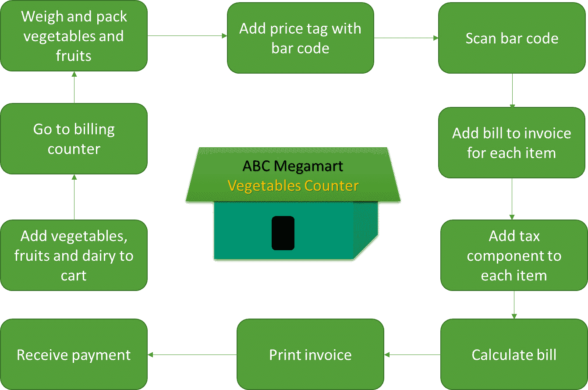
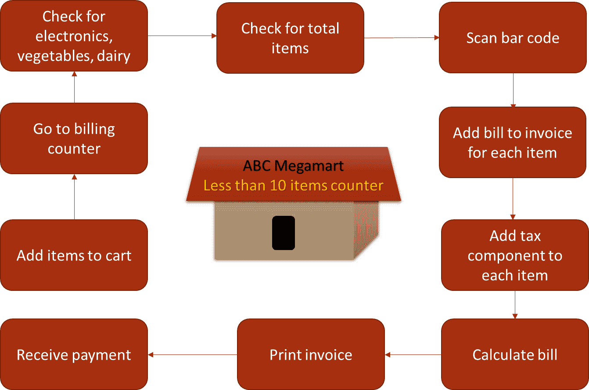
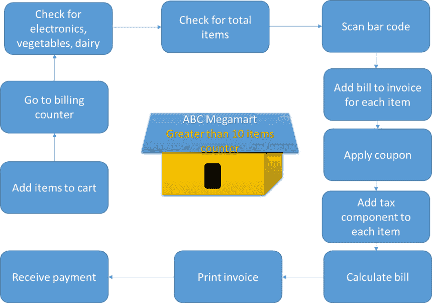
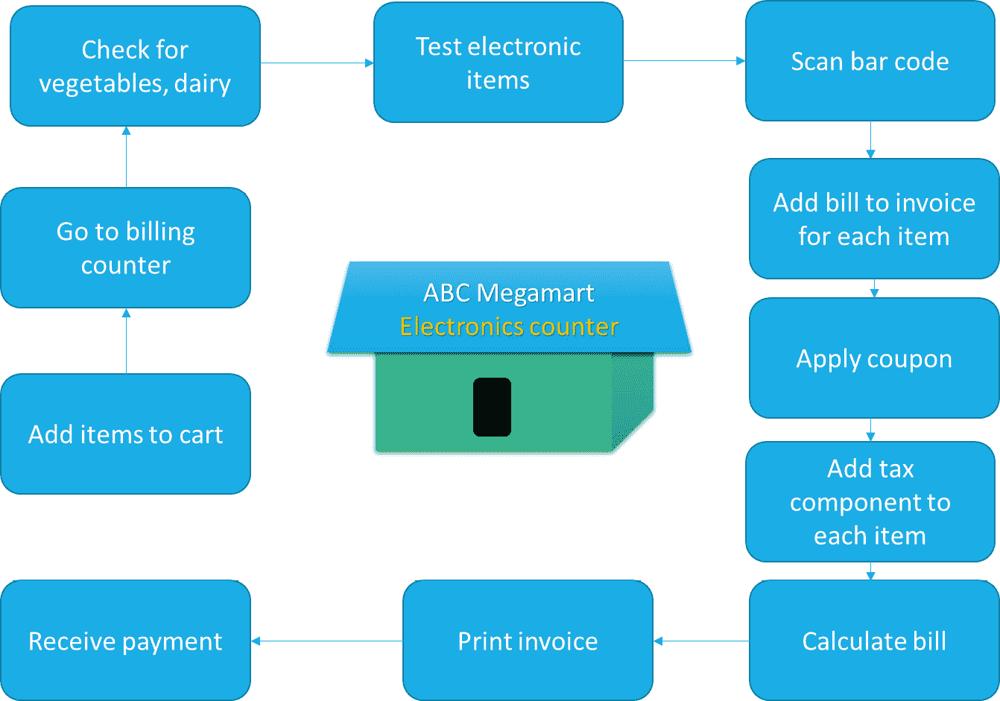
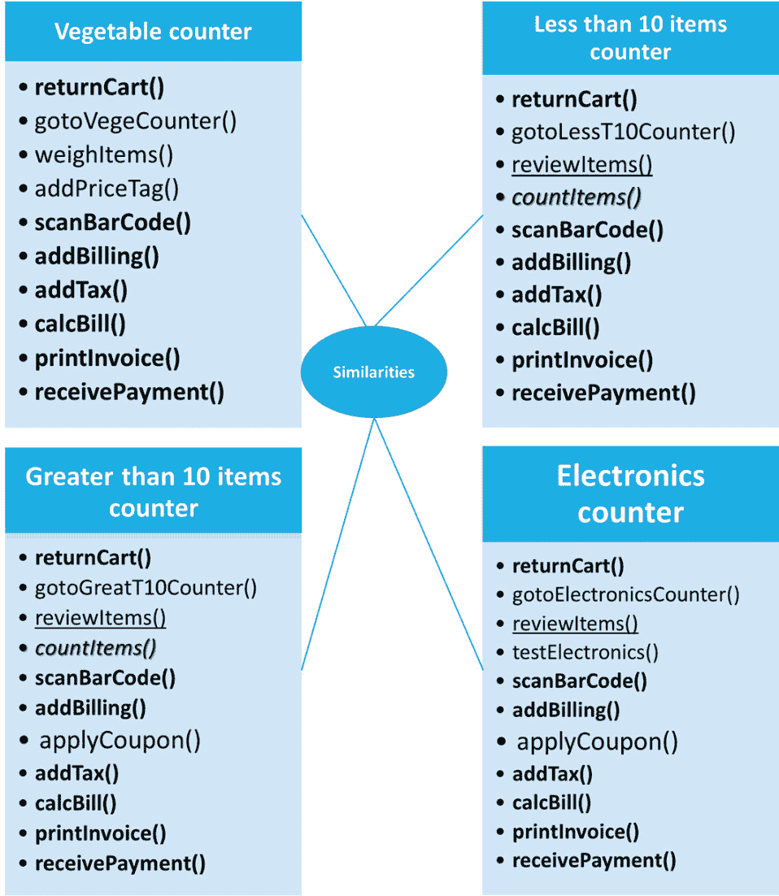

# *第八章*：定义算法模板

在本章中，我们将探讨模板是什么以及如何在 Python 中实现模板编程。

模板是什么？它们在哪里有用？在开发应用程序的过程中应用元编程概念的主要用途是设计一个可重用的框架，可以通过编程 Python 对象的元数据来操作，而不是修改对象本身。正如其名所示，模板可以作为模板、格式或模型，说明如何在 Python 对象上执行一系列操作。这些模板可以用来定义类内方法的共同功能，并通过应用面向对象编程的**继承**概念来重用它们。

在本章中，我们将探讨如何在 Python 中定义和使用模板，以及如何将一系列常见操作设计成适合框架的模板。说到设计，模板编程是 Python 设计模式中的主要概念之一。设计模式将在*第十二章*中详细讨论。

在本章中，我们将探讨以下主要主题：

+   解释操作序列

+   定义方法序列

+   识别共同功能

+   设计模板

到本章结束时，你应该能够对 Python 变量应用泛型和类型检查。你还应该能够创建自己的特定领域数据类型。

# 技术要求

本章中分享的代码示例可在 GitHub 上找到，地址为：[`github.com/PacktPublishing/Metaprogramming-with-Python/tree/main/Chapter08`](https://github.com/PacktPublishing/Metaprogramming-with-Python/tree/main/Chapter08)。

# 解释操作序列

开发算法总是很有趣，尤其是在像 Python 这样的语言中，与任何其他编程语言相比，完成一个动作所需的代码更少。**算法**是一系列简单的步骤，需要执行以完成任务。在开发任何算法时，最重要的方面是确保我们正在按照正确的顺序执行动作的步骤。本节涵盖了操作序列的示例以及如何在 Python 程序中定义它们。

## 回到我们的核心示例

在本章中，我们将继续使用我们的核心示例*ABC Megamart*，并特别关注计费柜台，在那里我们可以执行一系列操作。我们之所以关注操作序列，是为了特别了解**模板**如何被用来执行一系列任务，以及它们如何被重用来执行类似的其他任务。因此，让我们开始吧。

在*ABC Megamart*，我们有四个不同的结账柜台来检查购物车中的商品。各柜台详情如下：

+   第一个是检查包含蔬菜和乳制品的物品。

+   第二个是检查包含少于 10 种不同物品的物品，不包括电子产品、蔬菜和乳制品。

+   第三个是检查包含超过 10 种不同物品的物品，不包括电子产品、蔬菜和乳制品。

+   第四个是检查电子产品。

这些柜台中的每一个都在执行一系列操作，在这一点上，它们可能看起来像是一组独立的操作。本章的目标是创建模板并查看连接这些独立操作的一种通用方式。为了连接它们并创建模板，我们需要了解每个柜台中的操作顺序。

现在我们来看看每个柜台将处理什么。

## 蔬菜和乳制品柜台

顾客前往结账柜台的路程始于蔬菜区，在那里蔬菜被添加到购物车中，顾客然后站在相应的结账柜台队列中，蔬菜和水果被称重并包装，包装上添加了一个带有条形码的价格标签，条形码被扫描，并为每件物品添加账单，为每件物品添加一个税费组成部分，账单总计，打印并交给顾客，然后顾客支付账单。

步骤的图形表示如下：



图 8.1 – 蔬菜柜台

将定义以下功能来执行这些操作：

```py
return_cart()
```

```py
goto_vege_counter()
```

```py
weigh_items()
```

```py
add_price_tag()
```

```py
scan_bar_code()
```

```py
add_billing()
```

```py
add_tax()
```

```py
calc_bill()
```

```py
print_invoice()
```

```py
receive_payment()
```

让我们进一步看看下一个计数器，它处理少于 10 件物品。

## 少于 10 件物品柜台

当顾客将少于 10 件物品添加到购物车，并且这些物品不包含蔬菜、水果、乳制品或电子产品时，顾客将前往少于 10 件物品的柜台，在那里每件物品的条形码被扫描，并为每件物品添加账单，为每件物品添加一个税费组成部分，账单总计，打印并交给顾客，然后顾客支付账单。

步骤的图形表示如下：



图 8.2 – 少于 10 件物品柜台

将定义以下功能来执行这些操作：

```py
return_cart()
```

```py
goto_less_t10_counter()
```

```py
review_items()
```

```py
count_items()
```

```py
scan_bar_code()
```

```py
add_billing()
```

```py
add_tax()
```

```py
calc_bill()
```

```py
print_invoice()
```

```py
receive_payment()
```

让我们进一步看看下一个计数器，它处理超过 10 件物品。

## 超过 10 件物品的计数器

当顾客将超过 10 个物品添加到购物车，并且这些物品不包含蔬菜、水果、乳制品或电子产品时，顾客将前往超过 10 个物品的计数器，在那里扫描每个物品的条形码，并为每个物品添加账单，应用优惠券，为每个物品添加一个税费组成部分，然后计算总账单，打印并交给顾客，顾客随后支付账单。

步骤的图形表示如下：



图 8.3 – 超过 10 个物品计数器

以下函数将被定义以执行这些操作中的每一个：

```py
return_cart()
```

```py
gotoGreatT10Counter()
```

```py
review_items()
```

```py
count_items()
```

```py
scan_bar_code()
```

```py
add_billing()
```

```py
apply_coupon()
```

```py
add_tax()
```

```py
calc_bill()
```

```py
print_invoice()
```

```py
receive_payment()
```

让我们进一步查看下一个计数器，该计数器处理电子产品。

## 电子产品计数器

最后一个计数器是电子产品计数器，顾客前往该计数器，对电子产品进行测试，扫描物品，并为每个物品添加账单。为每个物品添加一个税费组成部分，然后计算总账单，打印并交给顾客，顾客随后支付账单。

步骤的图形表示如下：



图 8.4 – 电子产品计数器

以下函数将被定义以执行这些操作中的每一个：

```py
return_cart()
```

```py
goto_electronics_counter()
```

```py
review_items()
```

```py
test_electronics()
```

```py
scan_bar_code()
```

```py
add_billing()
```

```py
apply_coupon()
```

```py
add_tax()
```

```py
calc_bill()
```

```py
print_invoice()
```

```py
receive_payment()
```

在前面的每个计费计数器中，我们查看了一个销售完成时发生的操作序列。

基于这种理解，让我们在下一节中定义每个操作为方法。

# 定义方法的序列

定义方法有助于我们详细了解每个计数器上执行的每个操作。让我们定义执行每个操作所需的类和方法。在本节中，我们将涵盖以下计数器：

+   蔬菜计数器

+   少于 10 个物品计数器

+   超过 10 个物品计数器

+   电子产品计数器

让我们从蔬菜计数器开始。

## 蔬菜计数器

以下是这个计数器操作的步骤：

1.  我们首先创建以下`VegCounter`类：

    ```py
    class VegCounter():
    ```

1.  在以下代码中，我们将定义`return_cart`方法，该方法返回添加到购物车中的物品列表：

    ```py
        def return_cart(self,*items):
            cart_items = list(items)
            return cart_items
    ```

1.  现在让我们返回要包含在账单中的计数器名称。在这个例子中，计数器名称是`Vegetables & Dairy`：

    ```py
        def goto_vege_counter(self):
            return 'Vegetables & Dairy'
    ```

1.  在以下代码中，让我们定义一个方法来称量购物车中的物品，并返回一个包含物品及其对应重量的字典：

    ```py
        def weigh_items(self,*weights,cart_items = None):
            weight = list(weights)
            item_weight = dict(zip(cart_items, weight))
            return item_weight
    ```

1.  接下来，让我们定义一个方法，以单价和重量作为输入，通过乘以重量和单价来计算每个物品的价格：

    ```py
        def add_price_tag(self,*units,weights = None):
            pricetag = []
            for item,price in zip(weights.items(),list(units)):
                pricetag.append(item[1]*price)
            return pricetag        
    ```

1.  在以下方法中，让我们输入购物车中每个物品的条形码，并返回一个条形码列表：

    ```py
        def scan_bar_code(self,*scan):
            codes = list(scan)
            return codes
    ```

1.  接下来，让我们添加一个方法，通过创建一个字典对象并添加代码及其对应的价格标签作为键值对，为条形码添加价格标签：

    ```py
        def add_billing(self,codes=None,pricetag=None):
            self.codes = codes
            self.pricetag = pricetag
            bill = dict(zip(self.codes, self.pricetag))
            return bill
    ```

1.  然后，让我们为每个物品添加税率并返回税率列表：

    ```py
        def add_tax(self,*tax):
            taxed = list(tax)
            return taxed
    ```

1.  让我们进一步使用价格标签和税率，计算购物车中每个物品的账单，并创建一个字典来添加物品及其相应的账单金额：

    ```py
        def calc_bill(self,bill,taxes,cart_items):
            items = []
            calc_bill = []
            for item,tax in zip(bill.items(),taxes):
                items.append(item[1])
                calc_bill.append(item[1] + item[1]*tax)
            finalbill = dict(zip(cart_items, calc_bill))
            return finalbill
    ```

1.  在以下方法中，让我们打印带有计数器名称、购物车中的物品、价格和总账单金额的发票：

    ```py
        def print_invoice(self,finalbill):
            final_total = sum(finalbill.values())
            print('**************ABC Megamart*****************')
            print('***********------------------**************')
            print('Counter Name: ', self.goto_vege_counter())
            for item,price in finalbill.items():
                print(item,": ", price)
            print('Total:',final_total)
            print('***********------------------**************')
    ```

1.  然后，让我们打印带有声明发票已付款的发票：

    ```py
        def receive_payment(self,finalbill):
            final_total = sum(finalbill.values())
            print('**************ABC Megamart*****************')
            print('***********------------------**************')
            print('Counter Name: ', self.goto_vege_counter())
            for item,price in finalbill.items():
                print(item,": ", price)
            print('Total:',final_total)
            print('***********------------------**************')
            print('***************PAID************************')
    ```

1.  执行前面的代码会产生以下结果。方法按顺序调用，以便一个方法的结果作为下一个步骤的输入：

    ```py
    veg = VegCounter()
    cart = veg.return_cart('onions','tomatoes','carrots','lettuce')
    item_weight = veg.weigh_items(1,2,1.5,2.5,cart_items = cart)
    pricetag = veg.add_price_tag(7,2,3,5,weights = item_weight)
    codes = veg.scan_bar_code(113323,3434332,2131243,2332783)
    bill = veg.add_billing(codes,pricetag)
    taxes = veg.add_tax(0.04,0.03,0.035,0.025)
    finalbill = veg.calc_bill(bill,taxes,cart)
    veg.print_invoice(finalbill)
    ```

打印的发票输出如下：

```py
**************ABC Megamart*****************
***********------------------**************
Counter Name:  Vegetables & Dairy
onions :  7.28
tomatoes :  4.12
carrots :  4.6575
lettuce :  12.8125
Total: 28.87
***********------------------**************
```

1.  接下来，让我们打印顾客已支付的发票，`veg.receive_payment(finalbill)`。

已付款发票的输出如下：

```py
**************ABC Megamart*****************
***********------------------**************
Counter Name:  Vegetables & Dairy
onions :  7.28
tomatoes :  4.12
carrots :  4.6575
lettuce :  12.8125
Total: 28.87
***********------------------**************
***************PAID************************
```

## 10 件以下物品计数器

与为蔬菜计数器定义的类类似，我们也可以为剩余的三个计数器定义方法。剩余计数器的详细代码可在[`github.com/PacktPublishing/Metaprogramming-with-Python/tree/main/Chapter08`](https://github.com/PacktPublishing/Metaprogramming-with-Python/tree/main/Chapter08)找到。

对于这个计数器的代码，让我们创建`LessThan10Counter`类并添加所有方法，包括`return_cart`、`goto_less_t10_counter`、`review_items`、`count_items`、`scan_bar_code`、`add_billing`、`add_tax`、`calc_bill`、`print_invoice`和`receive_payment`。为了简单起见，让我们看看每个计数器中我们拥有的额外方法，而不是重复所有方法：

1.  让我们先创建`LessThan10Counter`类：

    ```py
    class LessThan10Counter():
    …    
    ```

1.  在这个类中，我们有一个`goto_less_t10_counter`方法，它返回计数器的名称：

    ```py
        def goto_less_t10_counter(self):
              return 'Less than 10 counter'
    ```

1.  我们还有一个以下方法来检查购物车中的物品，确保它们不是电子产品、蔬菜、水果或乳制品：

    ```py
         def review_items(self,item_type = None):
            veg_cart = ['Vegetables', 'Dairy', 'Fruits']
            if (item_type == 'Electronics'):
                print("Move to Electronics Counter")
            elif (item_type in veg_cart):        
                print("Move to Vege Counter")
    ```

1.  在以下方法中，让我们计数以确保购物车中的物品总数少于`10`：

    ```py
        def count_items(self,cart_items = None):
            if len(cart_items)<=10:
                print("Move to Less than 10 items counter")
            else:
                print("Move to Greater than 10 items counter")
        …
    ```

1.  按顺序执行本类的所有方法，结果如下：

    ```py
    less10 = LessThan10Counter()
    cart = less10.return_cart('paperclips','blue pens','stapler','pencils')
    less10.review_items(item_type = ['stationary'])
    less10.count_items(cart)
    codes = less10.scan_bar_code(113323,3434332,2131243,2332783)
    bill = less10.add_billing(10,15,12,14,codes = codes)
    taxes = less10.add_tax(0.04,0.03,0.035,0.025)
    finalbill = less10.calc_bill(bill,taxes,cart)
    less10.print_invoice(finalbill)
    less10.receive_payment(finalbill)
    ```

已付款发票的输出如下：

```py
**************ABC Megamart*****************
***********------------------**************
Counter Name:  Less than 10 counter
paperclips :  10.4
blue pens :  15.45
stapler :  12.42
pencils :  14.35
Total: 52.620000000000005
***********------------------**************
***************PAID************************
```

## 大于 10 件物品计数器

在本节中，让我们定义大于 10 件物品的计数器类和方法。

对于这里的代码，让我们创建`GreaterThan10Counter`类并添加所有方法，包括`return_cart`、`goto_greater_t10_counter`、`review_items`、`count_items`、`scan_bar_code`、`add_billing`、`add_tax`、`apply_coupon`、`calc_bill`、`print_invoice`和`receive_payment`。为了简单起见，让我们看看每个计数器中我们拥有的额外方法，而不是重复所有方法：

1.  我们将首先创建`GreaterThan10Counter`类：

    ```py
    class GreaterThan10Counter():
    …
    ```

1.  在这个类中，我们有一个`goto_greater_t10_counter`方法计数器，它返回计数器的名称：

    ```py
        def goto_greater_t10_counter(self):
            return 'Greater than 10 counter'
     …   
    ```

1.  接下来，让我们添加一个方法来应用折扣券到所购买的物品上：

    ```py
        def apply_coupon(self):
            coupon_discount = 0.1
            return coupon_discount        
       …     
    ```

1.  按顺序执行这个类的所有方法会产生以下结果：

    ```py
    greater = GreaterThan10Counter()
    cart = greater.return_cart('paper clips','blue pens','stapler','pencils','a4paper','a3paper','chart',
                              'sketch pens','canvas','water color','acrylic colors')
    greater.review_items(item_type = ['stationary'])
    greater.count_items(cart)
    codes = greater.scan_bar_code(113323,3434332,2131243,2332783)
    bill = greater.add_billing(10,15,12,14,codes = codes)
    taxes = greater.add_tax(0.04,0.03,0.035,0.025)
    greater.apply_coupon()
    finalbill = greater.calc_bill(bill,taxes,cart)
    greater.print_invoice(finalbill)
    greater.receive_payment(finalbill)
    ```

已支付发票的输出如下：

```py
**************ABC Megamart*****************
***********------------------**************
Counter Name:  Greater than 10 counter
paper clips :  10.4
blue pens :  15.45
stapler :  12.42
pencils :  14.35
Total: 47.358000000000004
***********------------------**************
***************PAID************************
```

在这个类中，我们为`goto_greater_t10_counter`定义了不同的方法，并添加了新的`apply_coupon`方法。

## 电子计数器

在本节中，让我们定义电子物品计数器的类和方法。在下面的代码中，让我们创建`ElectronicsCounter`类并添加其所有方法，包括`return_cart`、`goto_electronics_counter`、`review_items`、`test_electronics`、`scan_bar_code`、`add_billing`、`add_tax`、`apply_coupon`、`calc_bill`、`print_invoice`和`receive_payment`。为了简单起见，让我们看看每个计数器中都有哪些额外的方法，而不是重复所有的方法：

1.  我们将首先为电子计数器创建一个类：

    ```py
    class ElectronicsCounter():
    …
    ```

1.  在这个类中，我们有一个方法可以转到电子计数器，并返回计数器的名称：

    ```py
        def goto_electronics_counter(self):
            return 'Electronics counter'
    ```

1.  接下来，让我们定义一个方法，它提供电子商品的状态并检查它们是否正常工作：

    ```py
          def test_electronics(self,*status):
            teststatus = list(status)
            return teststatus            
    ```

1.  按顺序执行这个类的所有方法会产生以下结果：

    ```py
    electronics = ElectronicsCounter()
    cart = electronics.return_cart('television','keyboard','mouse')
    electronics.review_items(item_type = ['Electronics'])
    electronics.test_electronics('pass','pass','pass')
    codes = electronics.scan_bar_code(113323,3434332,2131243)
    bill = electronics.add_billing(100,16,14,codes = codes)
    taxes = electronics.add_tax(0.04,0.03,0.035)
    electronics.apply_coupon()
    finalbill = electronics.calc_bill(bill,taxes,cart)
    electronics.print_invoice(finalbill)
    electronics.receive_payment(finalbill)
    ```

已支付发票的输出如下：

```py
**************ABC Megamart*****************
***********------------------**************
Counter Name:  Greater than 10 counter
television :  104.0
keyboard :  16.48
mouse :  14.49
Total: 134.97
***********------------------**************
***************PAID************************
```

在这个课程中，我们为`goto_electronics_counter`和新的`test_electronics`方法定义了不同的方法。

定义了序列后，让我们进一步看看这些计数器的共同功能。

# 识别共同功能

在本节中，让我们看看一个图形表示，它显示了在每个计数器上要执行的功能列表以及所有四个计数器之间的共同功能，如下所示。以下图中的共同功能以粗体字突出显示：



图 8.5 – 在每个计数器上执行的操作

从*图 8.5*中，所有以粗体字突出显示的功能在所有四个计数器中都是共同的。`review_items`函数在少于 10 个物品的计数器、多于 10 个物品的计数器和电子计数器中是共同的。`count_items`函数在少于 10 个物品的计数器和多于 10 个物品的计数器中是共同的。`apply_coupon`函数在多于 10 个物品的计数器和电子计数器中是共同的。由于所有计数器都执行了共同的功能或操作，我们可以考虑创建一个共同的方式来设计它们。这就是我们可以引入模板概念的地方。

# 设计模板

正如其名所示，**模板**定义了一个通用的模板或格式，我们可以在这个格式中设计算法流程，并在执行类似活动时重用它们。模板是 Python 中设计模式的方法之一，在开发框架或库时可以有效地使用。模板强调了编程中的可重用性概念。

在本节中，我们将查看创建一个处理本章中讨论的所有四个计数器共同功能的类，并创建一个处理所有计数器中要执行的步骤序列或管道的模板的方法：

1.  首先，让我们创建一个名为`CommonCounter`的抽象类，并用所有四个计数器将使用的所有变量初始化类。参考以下代码：

    ```py
    from abc import ABC, abstractmethod 
    class CommonCounter(ABC):
        def __init__(self,items,name,scan,units,tax,item_type = None, weights = None, status = None):
            self.items = items
            self.name = name
            self.scan = scan
            self.units = units
            self.tax = tax
            self.item_type = item_type
            self.weights = weights
            self.status = status
    ```

1.  接下来，我们将定义`return_cart`、`goto_counter`和`scan_bar_code`方法，以获取在类中初始化的输入变量：

    ```py
        def return_cart(self):
            cart_items = []
            for i in self.items:
                cart_items.append(i)
            return cart_items
        def goto_counter(self):
            countername = self.name
            return countername
        def scan_bar_code(self):
            codes = []
            for i in self.scan:
                codes.append(i)
            return codes
    ```

1.  然后，我们将定义`add_billing`、`add_tax`和`calc_bill`方法，以获取在类中初始化的输入变量：

    ```py
    def add_billing(self):
            self.codes = self.scan_bar_code()
            pricetag = []
            for i in self.units:
                pricetag.append(i)
            bill = dict(zip(self.codes, pricetag))
            return bill
         def add_tax(self):
            taxed = []
            for i in self.tax:
                taxed.append(i)
            return taxed
         def calc_bill(self):
            bill = self.add_billing()
            items = []
            cart_items = self.return_cart()
            calc_bill = []
            taxes = self.add_tax()
            for item,tax in zip(bill.items(),taxes):
                items.append(item[1])
                calc_bill.append(item[1] + item[1]*tax)
            finalbill = dict(zip(cart_items, calc_bill))
            return finalbill
    ```

1.  为了简单起见，我们不会定义打印发票方法，而是定义包含打印发票方法定义的`receive_payment`方法，以下代码中包含：

    ```py
    def receive_payment(self):
            finalbill = self.calc_bill()
            final_total = sum(finalbill.values())
            print('**************ABC Megamart*****************')
            print('***********------------------**************')
            print('Counter Name: ', self.goto_counter())
            for item,price in finalbill.items():
                print(item,": ", price)
            print('Total:',final_total)
            print('***********------------------**************')
            print('***************PAID************************')
    ```

1.  接下来，我们将定义`apply_coupon`方法，它返回`0`值。如果需要，此方法可以在子类中重新定义：

    ```py
    def apply_coupon(self):
            return 0
    ```

1.  在前面的代码片段中，我们定义了所有四个计数器中通用的方法，而在以下代码中，我们将定义不带语句的方法，以便可以在子类中按需重新定义：

    ```py
    def weigh_items(self):
            pass
    def add_price_tag(self):
            pass
    def count_items(self):
            pass
    def test_electronics(self):
            pass
    ```

1.  然后，让我们创建一个作为需要子类中定义的抽象方法的`review_items`：

    ```py
    @abstractmethod
        def review_items(self):
            pass
    ```

现在，模板最重要的概念定义在下一行代码中。

1.  让我们定义一个处理计费计数器操作序列的方法，并使用此方法作为为每个计费计数器创建的子类模板：

    ```py
    def pipeline_template(self):
            self.return_cart()
            self.goto_counter()
            self.review_items()
            self.count_items()
            self.test_electronics()
            self.weigh_items()
            self.add_price_tag()
            self.scan_bar_code()
            self.add_billing()
            self.add_tax()
            self.apply_coupon()
            self.calc_bill()
            self.receive_payment()
    ```

1.  我们已定义了所有计数器的通用类及其模板方法，这些方法可以用于每个单独的计费计数器。

1.  在以下代码中，我们将为`VegeCounter`创建一个子类，以`CommonCounter`为父类：

    ```py
    class VegeCounter(CommonCounter):
        def review_items(self):
            if ('Vegetables' in self.item_type):
                print("Move to Vege Counter")
            if ('Dairy' in self.item_type):
                print("Move to Vege Counter")
            if ('Fruits' in self.item_type):
                print("Move to Vege Counter")
        def weigh_items(self):
            item_weight = dict(zip(self.items, self.weights))
            return item_weight
        def add_price_tag(self):
            pricetag = []
            item_weight = self.weigh_items()
            for item,price in zip(item_weight.items(),self.units):
                pricetag.append(item[1]*price)
            return pricetag        
    ```

1.  在前面的代码中，我们已定义了`review_items`抽象方法，并在`weight_items`和`add_price_tag`方法的定义中添加了语句。

1.  类似地，在以下代码中，让我们为`ElectronicsCounter`创建一个子类，并定义`review_items`（这是一个抽象方法），然后重新定义`test_electronics`（在`CommonCounter`基类中没有定义）：

    ```py
    class ElectronicsCounter(CommonCounter):
        def review_items(self):
            if ('Electronics' in self.item_type):
                print("Move to Electronics Counter")
          def test_electronics(self):
            teststatus = []
            for i in self.status:
                teststatus.append(i)
            return teststatus
    ```

1.  让我们现在创建一个函数来为每个子类运行`pipeline_template`方法：

    ```py
    def run_pipeline(counter = CommonCounter):
        counter.pipeline_template()
    ```

1.  对每个子类执行`run_pipeline`方法会导致根据每个计费计数器执行一系列步骤。让我们为蔬菜计数器执行`pipeline`方法：

    ```py
    run_pipeline(VegeCounter(items = ['onions', 'lettuce', 'apples', 'oranges'],
                             name = ['Vegetable Counter'],
                             scan = [113323,3434332,2131243,2332783],
                             units = [10,15,12,14],
                             tax = [0.04,0.03,0.035,0.025],
                             item_type = ['Vegetables'],
                             weights = [1,2,1.5,2.5]))
    ```

执行`VegeCounter`的`pipeline`方法后的输出如下：

```py
Move to Vege Counter
**************ABC Megamart*****************
***********------------------**************
Counter Name:  ['Vegetable Counter']
paperclips :  10.4
blue pens :  15.45
stapler :  12.42
pencils :  14.35
Total: 52.620000000000005
***********------------------**************
***************PAID************************
```

1.  让我们现在为`ElectronicsCounter`执行`pipeline`方法：

    ```py
    run_pipeline(ElectronicsCounter(items = ['television','keyboard','mouse'],
                                    name = ['Electronics Counter'],
                                    scan = [113323,3434332,2131243],
                                    units = [100,16,14],
                                    tax = [0.04,0.03,0.035],
                                    item_type = ['Electronics'],
                                    status = ['pass','pass','pass']))
    ```

执行`ElectronicsCounter`的`pipeline`方法后的输出如下：

```py
Move to Electronics Counter
**************ABC Megamart*****************
***********------------------**************
Counter Name:  ['Electronics Counter']
television :  104.0
keyboard :  16.48
mouse :  14.49
Total: 134.97
***********------------------**************
***************PAID************************
```

在本节中，我们创建了一个模板，但我们没有在多个类定义中重复相同的方法。相同的`CommonCounter`抽象类也可以用于小于 10 个项目的计数器和大于 10 个项目的计数器的定义。我们学习了如何创建模板并实现模板编程，这强调了在 Python 应用程序开发中的可重用性。我们创建了一个覆盖多组操作的所有常见功能的模板，并且多次重用了该模板。

# 摘要

在本章中，我们学习了为遵循算法的一系列操作定义方法的概念。我们还定义了遵循从我们的核心示例中一系列操作的类。我们创建了一个抽象类，它定义了我们的核心示例的所有常见功能，并且我们通过使用我们的核心示例中的序列来应用模板设计模式，以理解模板的概念。

与本书中其他章节类似，本章也涵盖了模板，这是一种在元编程中应用的设计模式，用于外部改变 Python 对象的行为。

在下一章中，我们将通过一些有趣的例子来探讨抽象语法树的概念。
