# 第九章：*第九章*：通过抽象语法树理解代码

在本章中，我们将探讨抽象语法树是什么，以及如何理解我们编写的 Python 代码中每个单元的语法树。

任何编程语言都是设计有其自己的语法，开发者在使用该语言编码时遵循特定的语法。编程语言的解释器或编译器解释语言的语法，编译或解释代码并执行它以实现预期的结果。

在 Python 中，`ast` 可以用来理解我们开发的代码的抽象语法。

在本章中，我们将探讨理解我们在前几章中开发的一些重要代码片段的语法树，同时我们还将通过几个示例来查看修改或添加更多信息的代码。我们将在本章中使用抽象语法树来对代码进行分析。

在本章中，我们将探讨以下主要主题：

+   探索 `ast` 库

+   使用抽象语法树检查 Python 代码

+   通过应用理解抽象语法树

到本章结束时，你应该能够理解 Python 代码的抽象语法树。你还应该能够通过元编程检查、解析和修改源代码的抽象语法树。

# 技术要求

本章中分享的代码示例可在 GitHub 上找到，地址为：[`github.com/PacktPublishing/Metaprogramming-with-Python/tree/main/Chapter9`](https://github.com/PacktPublishing/Metaprogramming-with-Python/tree/main/Chapter9)。

# 探索 `ast` 库

在本节中，我们将探索 `ast` Python 库，该库可以从 Python 3 中导入以分析开发者编写的 Python 代码。我们还可以通过其抽象语法树在元编程级别上修改代码，而不是修改代码本身的语法。这有助于理解代码是如何在语法上表示的，以及代码的语法树如何被用来修改其行为而不修改原始源代码。我们将查看 `ast` 库的一些重要功能，因为这些功能将在本章中用于理解我们的核心示例。

让我们从导入 `ast` 库开始：

```py
import ast
```

一旦我们导入库，我们就可以使用这个库来分析一段代码。现在我们将创建一个名为 `assignment` 的变量，并将代码的字符串格式赋值给它：

```py
assignment = "product_name = 'Iphone X'"
```

`assignment` 变量的输出如下所示：

```py
assignment
"product_name = 'Iphone X'"
```

前面的代码可以使用 `ast` 库的 `parse` 方法解析为其对应的节点。现在我们将创建一个名为 `assign_tree` 的变量，并将存储在 `assignment` 下的代码行的解析节点存储到它中：

```py
assign_tree = ast.parse(assignment)
```

```py
assign_tree
```

解析节点的输出如下所示：

```py
<ast.Module at 0x1b92b3f6520>
```

现在，我们可以使用另一个名为`dump`的方法来打印节点的树结构，包括其每个值和字段。这有助于调试代码：

```py
print(ast.dump(assign_tree,indent = 4))
```

代码的输出如下：

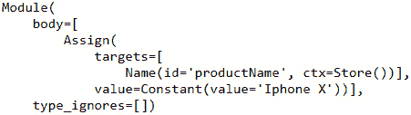

图 9.1 – 抽象语法树示例

`"product_name = 'Iphone X'"`代码被分解成多个部分。任何 Python 代码的语法都是语法嵌入到`Module`后面跟着`body`。我们将`Iphone X`的值赋给`product_name`变量，因此执行值赋值的代码被识别为`Assign`分支，该分支具有与相应 ID、上下文和值映射的属性。这是一个简单节点表示的例子。对于多行代码和多种其他操作，节点将在树中有多个其他分支。

让我们从以下部分开始检查使用抽象语法树的 Python 代码的几个示例。

# 使用抽象语法树检查 Python 代码

在本节中，我们将回顾和理解简单算术加法示例的代码，并且将进一步探讨使用抽象语法树解析和修改代码。

## 使用 ast 回顾简单代码

在本节中，让我们回顾一下简单的加法代码，并查看节点中的所有元素，以及这些元素在树中的组织方式。让我们先编写代码来赋值两个变量`a`和`b`的数值，以及`c`作为`a`和`b`的和。最后，让我们打印`c`的值。这在上面的代码中显示如下：

```py
addfunc = """
```

```py
a = 1098
```

```py
b = 2032
```

```py
c = a + b
```

```py
print(c)
```

```py
"""
```

我们现在将解析前面的`addfunc`并将节点存储在另一个名为`add_tree`的变量中：

```py
add_tree = ast.parse(addfunc)
```

```py
add_tree
```

解析后的节点输出如下：

```py
<ast.Module at 0x19c9b2bf2e0>
```

节点的基元素是`Module`，所有其他代码行都被分割成存储在节点模块中的语义。

让我们通过在树上调用`dump`方法来查看以下代码中的详细树表示：

```py
print(ast.dump(add_tree, indent=4))
```

树以`Module`作为其基本元素，或者说是树干，随后是多个分支。`Module`后面跟着一个`body`作为列表项，列出了代码的所有其他元素。

在`body`中，将有四个列表项描述`addfunc`的操作。第一个，也是`addfunc`的第一行，是将`Constant`值`1098`赋给一个名为 id 的变量，其值为`a`，上下文为`Store`，因为我们正在将值存储在变量中。它看起来是这样的：

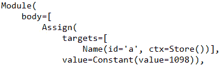

图 9.2 – 代码片段输出

同样，`addfunc`的第二行是将`2032`值存储在`b`变量中，这在以下列表项中以语法形式表示：

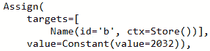

图 9.3 – 代码片段输出

`addfunc`中的第三行代码执行了将存储在`a`和`b`中的两个值相加的算术操作：

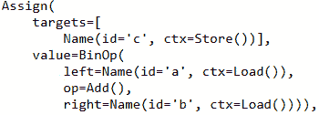

图 9.4 – 代码片段输出

前面的代码有一个额外的元素`BinOp`，后面跟着`left`、`op`和`right`变量，分别表示左数值、加法操作和右数值。

`addfunc`中的最后一行代码是`Expr`表达式元素，它表示以`Load`上下文值打印`c`变量：

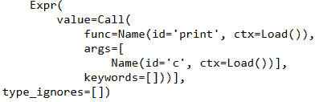

图 9.5 – 代码片段输出

要执行`addfunc`，我们需要首先按照以下方式编译解析树：

```py
add_code = compile(add_tree, 'add_tree', 'exec')
```

编译后，我们应该能够执行编译后的树，这将导致`a`和`b`的相加：

```py
exec(add_code)
```

以下为代码的输出：

```py
3130
```

在本节中，我们回顾了简单算术`add`函数的抽象语法树。在下一节中，让我们看看如何使用元编程修改`add`函数的代码。

## 使用 ast 修改简单代码

在本节中，让我们考虑上一节中的`addfunc`示例，并看看如何通过元编程修改示例中的代码，而不修改实际代码。`addfunc`中代码执行的操作是算术加法。如果我们想执行算术乘法而不是加法，并且不想修改实际代码，会怎样？如果我们想在多个位置将算术加法替换为算术乘法，而浏览数千行代码并修改它们不是一个可行的选项，因为它可能会影响或破坏代码中的其他部分，会怎样？在这种情况下，我们可以通过修改代码的节点而不是修改实际代码本身来修改代码的节点。为了实现这一点，让我们利用代码的抽象语法树。

让我们重用前面代码中的`add_tree`解析树变量：

```py
add_tree
```

```py
<ast.Module at 0x19c9b2bf2e0>
```

要了解哪些字段需要修改，让我们看看以下节点的表示，并查看节点中由标识符标记的每个部分。本例中感兴趣的元素在以下图中用方框表示：


图 9.6 – `addfunc`的解析节点

要将加法操作修改为乘法操作，此节点的树遍历`body`，然后是其列表项`2`，然后是项的`value`字段，然后是`op`字段。`op`字段的`Add()`操作必须修改为乘法操作，以实现本节的目标。以下是方法：

```py
add_tree.body[2].value.op=ast.Mult()
```

执行前面的代码会导致树的变化：

```py
print(ast.dump(add_tree, indent=4))
```

更新后的树结构图如下所示，其中`Add()`操作被`Mult()`操作所替代：

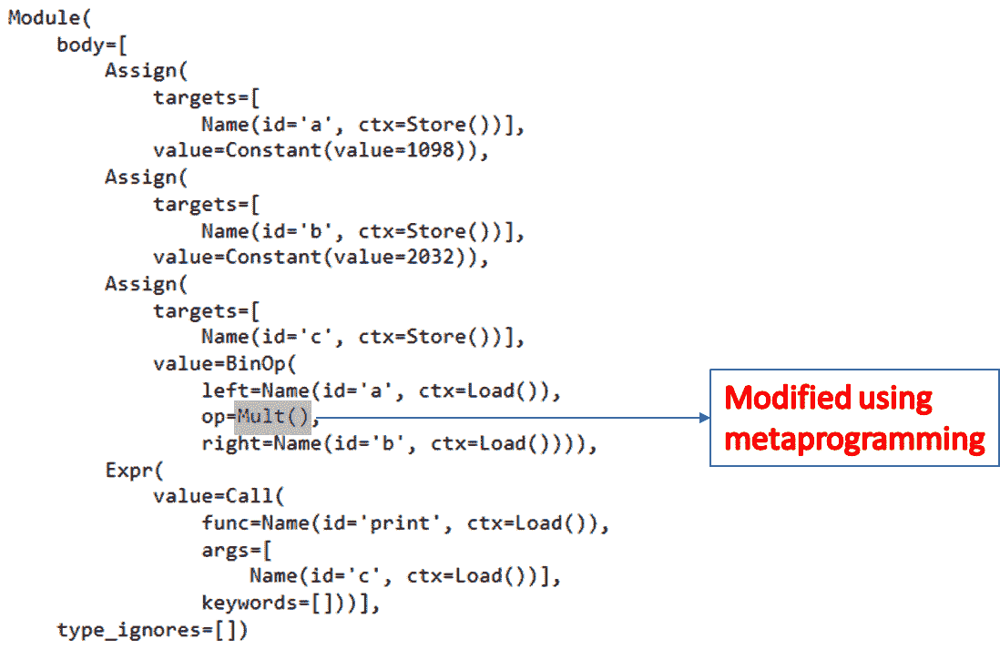

图 9.7 – 修改后的树以执行乘法

为了验证前面在树节点上的修改是否有效，让我们编译树并执行它以检查结果：

```py
add_code = compile(add_tree, 'add_tree', 'exec')
```

```py
exec(add_code)
```

执行前面的代码理想情况下应该提供输出 `3130`，这是两个数字 `1098` 和 `2032` 的和。但我们已经修改了 `ast` 以执行乘法，因此它将得到的结果是两个数字的乘积：

```py
2231136
```

因此，树现在已经被修改，可以编译以实现所需的结果，而无需修改实际代码。

通过这种理解，让我们进一步探讨如何解析和理解 Python 中的类。

# 理解抽象语法树及其应用

在本节中，我们将探讨将抽象语法树的概念应用于我们的核心示例 *ABC Megamart*，并探索 `ast` 在类中的定义，例如 *ABC Megamart* 的 `Branch` 类和 `VegCounter` 类。我们还将探讨如何使用 `ast` 在元编程级别上修改这些类的行为，而不是修改类的实际源代码。

## 理解类的 ast

在本节中，我们将探讨理解类的抽象语法树，这将帮助我们探索如何通过元编程修改类的元素。我们可以尝试如下：

1.  让我们从创建一个具有空定义的类开始，并查看其抽象语法树：

    ```py
    branch_code = """
    class Branch:
        '''attributes...'''
        '''methods...'''
    """ 
    ```

1.  接下来，让我们解析代码：

    ```py
    branch_tree = ast.parse(branch_code)
    branch_tree
    <ast.Module at 0x216ed8b5850>
    ```

1.  让我们进一步查看节点元素，并了解类是如何在语法上定义的：

    ```py
    print(ast.dump(branch_tree, indent=4))
    ```

节点的结构如下：

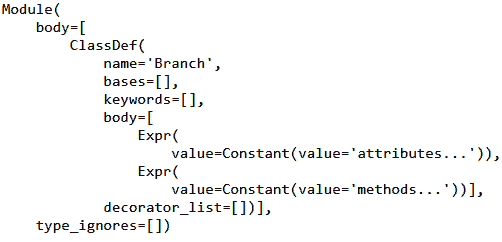

图 9.8 – 代码片段输出

在前面的输出中，我们有 `Module` 后跟 `body`，在 `body` 元素内部有 `ClassDef`。这个 `ClassDef` 有一个 `name` 元素，后面跟着两个表达式。

1.  让我们重新定义这个空类定义，并添加一个属性和一个方法，以及一个装饰器，然后重新检查节点的结构：

    ```py
    branch_code = """class Branch:
        branch_id = 1001
        @staticmethod
        def get_product(self):
            return 'product'
            """
    ```

1.  我们将在以下步骤中解析 `branch_code`：

    ```py
    branch_tree = ast.parse(branch_code)
    print(ast.dump(branch_tree, indent=4))
    ```

`Branch` 类的抽象语法树结构如下。我们可以看到节点从 `Module` 元素开始，后面跟着 `body`。

在 `body` 中，我们有一个包含类名及其属性的 `ClassDef` 元素，这些属性包括存储为常量的 `branch_id`，后面跟着带有其参数的 `get_product` 方法。请参阅以下输出：

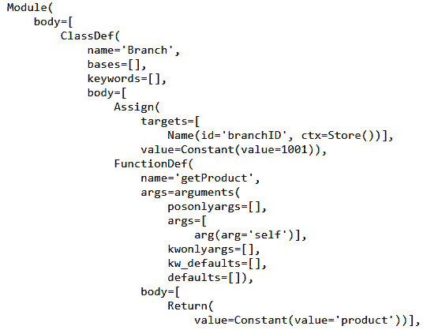

图 9.9 – 代码片段输出

1.  我们还在 `decorator_list` 下加载了一个 `decorator` 方法，如下所示：

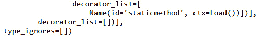

图 9.10 – 代码片段输出

1.  如果我们为该类创建一个对象，该对象的代码也可以像前面的类示例一样进行解析：

    ```py
    branch_code = """
    branch_albany = Branch()
    """
    branch_tree = ast.parse(branch_code)
    print(ast.dump(branch_tree, indent=4))
    ```

1.  对象的节点将具有以下结构：

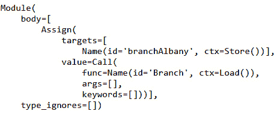

图 9.11 代码片段输出

在本节中，我们回顾了类的抽象语法树，以了解其语法的各种元素。有了这种理解，让我们进一步探讨从我们的核心示例 *ABC Megamart* 中修改类的抽象语法树。

## 通过解析修改代码块的 ast

在本节中，让我们看看如何通过使用类的抽象语法树来修改代码中的属性，而不是直接修改类本身。

让我们考虑已经开发了一个具有多个类和方法的健壮库。健壮的库定义可能太大，无法被打扰或修改。而不是修改源代码，我们可以通过元编程在库中的一些特定属性上进行更改，而不影响实际的代码。在这种情况下，修改库的 `ast` 将是比影响库的源代码更好的更改方式。

在本例中，我们将遵循以下步骤：

1.  我们将创建一个 `vegCounter` 类，并添加一个 `return_cart` 方法来返回购物车中的项目。我们还将创建类的对象，并在对象上调用 `return_cart` 方法。请参考以下代码：

    ```py
    vegctr = """
    class VegCounter():
        def return_cart(self,*items):
            cart_items = list(items)
            return cart_items
    veg = VegCounter()
    print(veg.return_cart('onions','tomatoes','carrots','lettuce'))
    """
    ```

1.  接下来，让我们解析 `vegCounter` 的代码，并查看节点的结构：

    ```py
    vegctr_tree = ast.parse(vegctr)
    print(ast.dump(vegctr_tree, indent=4))
    ```

节点的输出如下。在 `ast` 中，有一个类定义后跟一个函数定义：

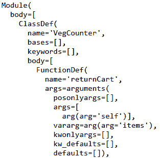

图 9.12 – 代码片段输出

1.  以下输出具有列表项和读取项目到列表的逻辑元素：

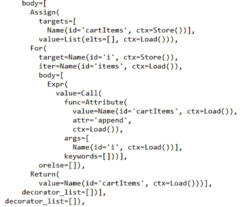

图 9.13 – 代码片段输出

1.  以下输出显示了创建 `VegCounter` 类对象的语法：

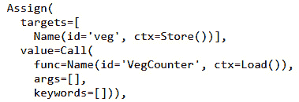

图 9.14 – 代码片段输出

1.  以下输出显示了通过在购物项列表上调用 `return_cart` 方法来打印购物项的元素：

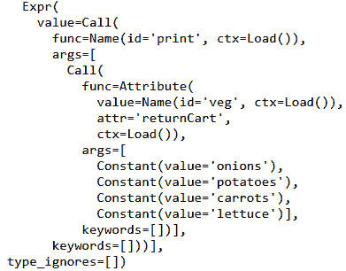

图 9.15 – 代码片段输出

1.  现在让我们编译抽象语法树并执行它以显示添加到购物车中的项目列表：

    ```py
    vegctr_code = compile(vegctr_tree, 'vegctr_tree', 'exec')
    exec(vegctr_code)
    ['onions', 'tomatoes', 'carrots', 'lettuce']
    ```

1.  接下来，让我们在购物项的值中导航，并查看 `return_cart` 方法输出中第二个值的路径：

    ```py
    vegctr_tree.body[2].value.args[0].args[1].n
    'tomatoes'
    ```

1.  现在让我们通过逐级解析节点元素，将购物项的第二个值从 `tomatoes` 更改为 `potatoes`：

    ```py
    vegctr_tree.body[2].value.args[0].args[1].n = 'potatoes'
    print(ast.dump(vegctr_tree, indent=4))
    ```

1.  在以下输出中，让我们看看购物车中第二个项目的更新值，该值在未更改源代码的情况下进行了修改：

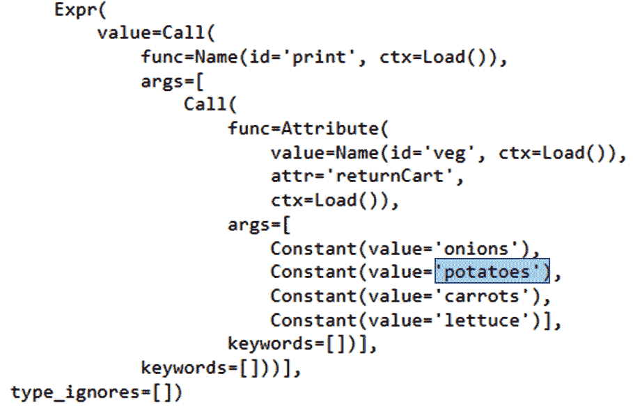

图 9.16 – 在 ast 中修改值

1.  我们现在可以使用 `ast` 库中的 `unparse` 方法来解析节点，如下所示：

    ```py
    print(ast.unparse(vegctr_tree))
    ```

1.  修改后的源代码现在看起来如下所示：

    ```py
    class VegCounter:
        def return_cart(self, *items):
            cart_items = list(items)
            return cart_items
    veg = VegCounter()
    print(veg.return_cart('onions', 'potatoes', 'carrots', 'lettuce'))
    ```

这是一种使用抽象语法树修改 Python 源代码的方法。

基于这种理解，让我们继续探讨下一个方法，即我们将转换抽象语法树的节点。

## 通过转换节点修改代码块的 ast

在本节中，我们将探讨另一种通过修改抽象语法树而不是实际代码来修改类源代码的方法：

1.  让我们现在创建一个名为 `VegCounter` 的类，如下所示：

    ```py
    class VegCounter():
        def return_cart(self,*items):
            cart_items = []
            for i in items:
                cart_items.append(i)
            return cart_items
    veg = VegCounter()
    ```

1.  接下来，让我们创建一个名为 `cart` 的变量，并将对象上的函数调用作为一个字符串添加：

    ```py
    cart = """veg.return_cart('onions','tomatoes','carrots','lettuce')"""
    cart_tree = ast.parse(cart)
    print(ast.dump(cart_tree, indent = 4))
    ```

1.  解析前面的代码提供了以下输出：

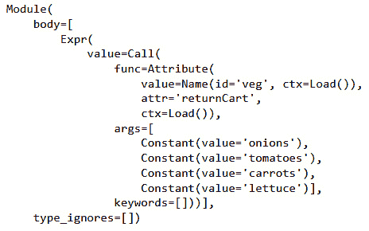

图 9.17 – 对象变量的 AST

在本节中，我们不会遍历节点的结构，而是将使用 `ast` 库的 `NodeTransformer` 来执行代码转换：

```py
from ast import NodeTransformer
```

1.  `NodeTransformer` 的属性如下：

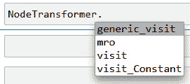

图 9.18 – NodeTransformer 的属性

1.  接下来，让我们创建一个名为 `ModifyVegCounter` 的类，它继承自 `NodeTransfomer` 类。我们将重新定义 `visit_Constant` 方法，以便在代码中常数值出现时添加一个字符串前缀来修改购物项的常数值：

    ```py
    class ModifyVegCounter(NodeTransformer):
        def visit_Constant(self, node):
            modifiedValue = ast.Constant('item:' + str(node.value))
            return modifiedValue
    ```

1.  我们可以利用 `visit` 方法来访问节点，并使用 `dump` 方法来打印树：

    ```py
    ModifyVegCounter().visit(cart_tree)
    print(ast.dump(cart_tree, indent = 4))
    ```

转换后的节点如下所示：

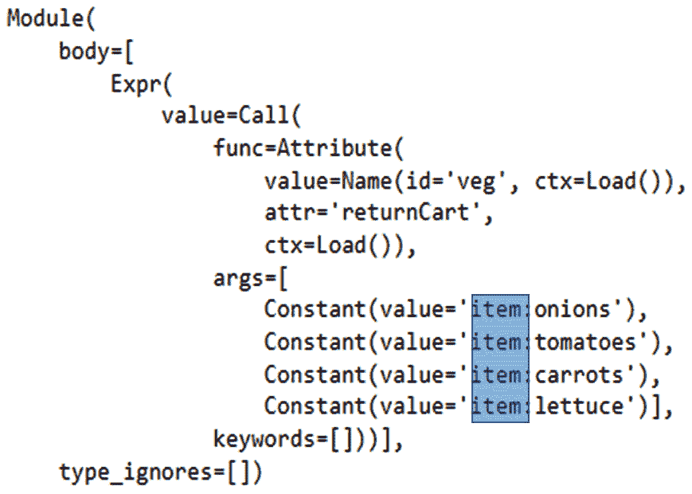

图 9.19 – 使用 NodeTransformer 转换的源代码

1.  我们可以使用 `ast` 库的 `unparse` 方法进一步将代码反解析：

    ```py
    print(ast.unparse(cart_tree))
    ```

代码的输出如下所示：

```py
veg.return_cart('item:onions', 'item:tomatoes', 'item:carrots', 'item:lettuce')
```

这又是抽象语法树在元编程中应用的另一个例子。

在本节中，我们介绍了使用 `ast` 库的 `NodeTransformer` 方法来转换抽象语法树节点的技术。

# 摘要

在本章中，我们通过探索 Python 3 中的 `ast` 库来了解抽象语法树的概念。我们还使用抽象语法树检查了 Python 代码。通过使用我们的核心示例中的源代码在节点级别修改代码，我们理解了抽象语法树的应用。

与本书中的其他章节类似，本章介绍了元编程中的抽象语法树的概念。这也有助于理解如何在不修改源代码的情况下，从外部修改 Python 对象的行为。通过修改代码中的实际方法和属性，而不是抽象语法树，可以方便地将源代码从不同的 Python 版本或应用程序开发平台迁移，而不会影响代码的实际逻辑。

在下一章中，我们将探讨**方法解析顺序**的概念，并伴随一些有趣的示例。
