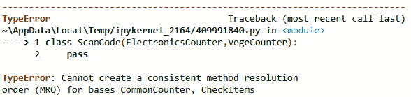

# *第十章*：理解继承的方法解析顺序

在本章中，我们将探讨 Python 3 中**方法解析顺序**（**MRO**）的概念以及它在继承中的工作方式。

如其名所示，MRO 是类在程序中调用方法时解析方法的顺序。

在本章中，我们将通过几个示例来了解 MRO，了解方法解析可能出错的情况，以及当前 Python 3 实现如何处理在类中定义的方法。我们将在本章中使用 MRO 来理解在 Python 3 中实现继承时的代码行为。

为什么我们应该理解 MRO？在 Python 代码中使用多个类的情况下，我们需要从多个父类或超类继承方法。了解方法从现有类到其父类解析的顺序有助于避免错误的调用方法。这反过来又有助于避免 Python 代码算法中的错误结果。

本章将探讨以下主要主题：

+   理解类的 MRO

+   理解修改继承顺序的影响

+   不当改变继承顺序的影响

到本章结束时，你应该能够理解 Python 类层次结构中方法的解析方式，了解在多继承中方法是如何处理的，并根据自己的知识编写方法。

# 技术要求

本章中分享的代码示例可在 GitHub 上找到，位于本章代码的以下位置：[`github.com/PacktPublishing/Metaprogramming-with-Python/tree/main/Chapter10`](https://github.com/PacktPublishing/Metaprogramming-with-Python/tree/main/Chapter10).

# 理解类的 MRO

在本节中，让我们探索在代码中没有指定继承的类中方法是如何解析的。在 Python 3 中，类默认继承自`object`。为了理解 MRO 在没有父类的类上的工作方式，以最简单的方式查看它是最容易的方法。然后我们将看到 MRO 在单继承、多继承和多级继承中的工作方式。

在这个例子中，让我们创建一个代表*ABC Megamart*分支的类，如下所示：

1.  在`Branch`类中，让我们为分支 ID、街道、城市、州和邮政编码、产品、销售额和发票创建属性。让我们还创建一些方法，如`get_product`（返回产品）、`get_sales`（返回销售额）和`get_invoice`（返回发票）。以下代码表示`Branch`类：

    ```py
    class Branch:
        def __init__(self, branch_id, branch_street, 
                     branch_city, branch_state, 
                     branch_zip, product, sales, invoice):
            self.branch_id = branch_id
            self.branch_street = branch_street
            self.branch_city = branch_city
            self.branch_state = branch_state
            self.branch_zip = branch_zip
            self.product = product
            self.sales = sales
            self.invoice = invoice        
        def get_product(self):
            return self.product
        def get_sales(self):
            return self.sales
        def get_invoice(self):
            return self.invoice
    ```

在前面的类中，有五个属性和三个方法。可以通过在类上调用一个内置方法来查看前面类的 MRO，该方法称为`mro`。

1.  接下来，让我们调用`Branch`类的`mro`方法：

    ```py
    Branch.mro()
    ```

`Branch`类的`mro`表示如下：

```py
[__main__.Branch, object]
```

在前面的输出中，我们可以看到`Branch`类没有对超类或父类进行任何显式定义，因此它默认继承自`object`。

在本节中，我们了解了 MRO 的概念，并通过一个例子展示了如何查看类的 MRO。现在，让我们进一步看看 MRO 在只有一个父类或超类的类上是如何工作的。

## 理解单一继承中的 MRO

当一个类继承一个父类或超类时，这是单一继承。让我们看看在`Branch`类成为父类时，方法是如何解决的。

1.  在创建子类之前，让我们重新定义`Branch`类，并添加适合测试这个概念的方法：

    ```py
    class Branch:
        def __init__(self, branch, sales, product):
            self.branch = branch
            self.sales = sales
            self.product = product
        def set_branch(self, value):
            self.branch = value          

        def set_sales(self, value):
            self.sales = value            
        def set_product(self, value):
            self.product = value        
        def calc_tax(self):
            branch = self.branch
            product = self.product
            sales = self.sales
            pricebeforetax = sales['purchase_price'] + 
                             sales['purchase_price'] * 
                             sales['profit_margin']
            finalselling_price = pricebeforetax + 
                (pricebeforetax * sales['tax_rate'])
            sales['selling_price'] = finalselling_price
            return branch, product, sales
    ```

1.  对于这个例子，让我们创建另一个类，命名为`NYC`，它继承自`Branch`类：

    ```py
    class NYC(Branch):
        def __init__(self, intercitybranch):
            self.intercitybranch = intercitybranch

        def set_management(self, value):
            self.intercitybranch = value

        def calc_tax_nyc(self):
            branch = self.branch
            intercitybranch = self.intercitybranch
            product = self.product
            sales = self.sales
            pricebeforetax = sales['purchase_price'] + 
                             sales['purchase_price'] * 
                             sales['profit_margin']
            finalselling_price = pricebeforetax + 
                (pricebeforetax * (sales['tax_rate'] + 
                 sales['local_rate']))  
            sales['selling_price'] = finalselling_price
            return branch, intercitybranch, product, 
                   sales    
    NYC.mro()
    ```

在前面的代码中，我们有从`Branch`类继承的`NYC`类，`NYC`类定义了两个方法。`set_management`方法返回存储在`intercitybranch`中的值，而`calc_tax_nyc`方法计算`NYC`的税费。

`NYC`类的 MRO 在以下输出中表示：

```py
[__main__.NYC, __main__.Branch, object]
```

`NYC`类中存在的方法将首先被解决，然后是`Branch`类的方法，最后是`object`类的方法。

1.  让我们看看当`NYC`需要的方法不在`NYC`中定义，而是在其父类中定义时会发生什么。在`NYC`类中，`calc_tax_nyc`是计算`NYC`分支税费的函数，这个函数需要`branch`、`intercitybranch`、`product`和`sales`等属性的值。`intercitybranch`属性的值可以在`NYC`类中使用`set_management`方法单独设置，而其他属性，如`branch`、`product`和`sales`，在`NYC`中没有设置方法。

1.  让我们从创建一个名为`intercitybranch`的变量并定义`NYC`的实例开始：

    ```py
    intercitybranch = {
        }
    branch_manhattan = NYC(intercitybranch)
    ```

1.  让我们先设置`intercitybranch`的值，然后看看如何处理剩余属性的设置方法：

    ```py
    branch_manhattan.set_management({'regionalManager' : 'John M',
        'branchManager' : 'Tom H',
        'subbranch_id' : '2021-01' })
    ```

1.  设置`branch`、`product`和`sales`所需的设置方法在`Branch`类的父类中可用。由于`NYC`类的 MRO 是先从`NYC`开始，然后是`Branch`，最后是`object`，因此`NYC`现在可以调用`Branch`的设置方法来设置`branch`、`product`和`sales`的值，如下所示：

    ```py
    branch = {'branch_id' : 2021,
    'branch_street' : '40097 5th Main Street',
    'branchBorough' : 'Manhattan',
    'branch_city' : 'New York City',
    'branch_state' : 'New York',
    'branch_zip' : 11007}
    product = {'productId' : 100002,
        'productName' : 'WashingMachine',
        'productBrand' : 'Whirlpool'  
    }
    sales = {
        'purchase_price' : 450,
        'profit_margin' : 0.19,
        'tax_rate' : 0.4,
        'local_rate' : 0.055      
    }
    branch_manhattan.set_branch(branch)
    branch_manhattan.set_product(product)
    branch_manhattan.set_sales(sales)
    ```

1.  现在所需的值都已设置，我们可以从继承自`Branch`类的`NYC`类中调用`calc_tax_nyc`方法：

    ```py
    branch_manhattan.calc_tax_nyc()
    ```

1.  使用税率和其他支持值（`branch`、`product`和`sales`）计算出的销售价格，这些值是通过父类设置的，在以下输出中表示：

    ```py
    ({'branch_id': 2021,
      'branch_street': '40097 5th Main Street',
      'branchBorough': 'Manhattan',
      'branch_city': 'New York City',
      'branch_state': 'New York',
      'branch_zip': 11007},
     {'regionalManager': 'John M',
      'branchManager': 'Tom H',
      'subbranch_id': '2021-01'},
     {'productId': 100002,
      'productName': 'WashingMachine',
      'productBrand': 'Whirlpool'},
     {'purchase_price': 450,
      'profit_margin': 0.19,
      'tax_rate': 0.4,
      'local_rate': 0.055,
      'selling_price': 779.1525})
    ```

在本节中，我们探讨了具有单一继承的类中 MRO 的工作方式。现在，让我们看看当一个类从两个类继承时会发生什么。

## 理解多重继承中的 MRO

在本节中，我们将探讨从多个超类或父类继承及其相应的 MRO。

对于这个例子，让我们创建两个父类，`Product`和`Branch`，如下所示：

1.  `Product`类将有一组属性，后面跟着一个名为`get_product`的方法：

    ```py
    class Product:
        _product_id = 100902
        _product_name = 'Iphone X'
        _product_category = 'Electronics'
        _unit_price = 700

        def get_product(self):
            return self._product_id, self._productName, self._product_category, self._unit_price
    ```

1.  `Branch`类将有一组属性，后面跟着一个名为`get_branch`的方法：

    ```py
    class Branch:
        _branch_id = 2021
        _branch_street = '40097 5th Main Street'
        _branch_borough = 'Manhattan'
        _branch_city = 'New York City'
        _branch_state = 'New York'
        _branch_zip = 11007

        def get_branch(self):
            return self._branch_id, self._branch_street, 
                self._branch_borough, self._branch_city, 
                self._branch_state, self._branch_zip
    ```

1.  接下来，让我们创建一个名为`Sales`的子类或子类，并从`Product`和`Branch`类继承。`Sales`将有一个属性`date`和一个`get_sales`方法：

    ```py
    class Sales(Product, Branch):
        date = '08/02/2021'
        def get_sales(self):
            return self.date, Product.get_product(self), 
                   Branch.get_branch(self)
    ```

1.  `Sales`类继承自`Product`，然后是`Branch`：

    ```py
    Sales.mro()
    ```

1.  让我们看看其方法解析的顺序：

    ```py
    [__main__.Sales, __main__.Product, __main__.Branch, object]
    ```

在前面的输出中，方法的解析顺序是按照`Sales`、`Product`、`Branch`、`object`的顺序进行的。如果一个由`Sales`类的对象调用的方法不在`Sales`中，MRO 算法将在`Product`类中搜索它，然后是`Branch`类。

1.  让我们创建另一个类（命名为`Invoice`），并以与`Sales`类继承不同的顺序继承`Branch`和`Product`：

    ```py
    class Invoice(Branch, Product):
        date = '08/02/2021'
        def get_invoice(self):
            return self.date, Branch.get_branch(self), 
                   Product.get_product(self)
    ```

1.  让我们检查`Invoice`类的`mro`：

    ```py
    Invoice.mro()
    ```

1.  `Invoice`类的`mro`（方法解析顺序）在以下输出中表示：

    ```py
    [__main__.Invoice, __main__.Branch, __main__.Product, object]
    ```

在前面的输出中，方法的解析顺序是按照`Invoice`、`Branch`、`Product`、`object`的顺序进行的。如果一个由`Invoice`类的对象调用的方法不在`Invoice`中，MRO 算法将在`Branch`类中搜索它，然后是`Product`类。

在多重继承的情况下，我们回顾了在 Python 3 中，当继承超类或父类的顺序改变时，方法解析顺序如何变化。

现在，让我们看看在多层继承的情况下 MRO（Method Resolution Order，方法解析顺序）会发生什么。

## 复习多层继承中的 MRO

Python 中的类也可以在多个级别上从超类继承，随着超类或父类数量的增加，MRO 变得更加复杂。在本节中，我们将通过一些额外的示例来查看这种多重继承的方法解析顺序。

在这个例子中，我们将执行以下步骤：

1.  让我们首先创建一个名为`StoreCoupon`的类，我们将在这个类中定义商店的属性，例如产品名称、产品类别、产品的品牌、销售产品的商店名称、产品的过期日期以及购买以获得优惠券的数量：

1.  然后，我们将定义一个名为`generate_coupon`的方法，我们将在这个方法中为产品生成两个具有随机优惠券 ID 值和产品及其商店的所有详细信息的优惠券：

    ```py
    class StoreCoupon:
        productName = "Strawberry Ice Cream"
        product_category = "Desserts"
        brand = "ABCBrand3"
        store = "Los Angeles Store"
        expiry_date = "10/1/2021"
        quantity = 10

        def generate_coupon(self):
            import random
            coupon_id =  random.sample(range(
                         100000000000,900000000000),2)
            for i in coupon_id:
                print('***********------------------**************')
                print('Product:', self.productName)
                print('Product Category:', 
                       self.product_category)
                print('Coupon ID:', i)
                print('Brand:', self.brand)
                print('Store:', self.store)
                print('Expiry Date:', self.expiry_date)
                print('Quantity:', self.quantity)
                print('***********------------------
                       **************')
    ```

1.  现在，让我们定义一个类`SendStoreCoupon`，它继承自`StoreCoupon`，并且不对它添加任何方法或属性：

    ```py
    class SendStoreCoupon(StoreCoupon):
        pass
    SendStoreCoupon.mro()
    ```

1.  这个类的 MRO 在以下输出中表示：

    ```py
    [__main__.SendStoreCoupon, __main__.StoreCoupon, object]
    ```

1.  `SendStoreCoupon`中的方法首先解析，然后是`StoreCoupon`类中的方法，最后是`object`。

1.  让我们通过定义另一个名为`SendCoupon`的类并从`SendStoreCoupon`类继承它来添加一个继承级别：

    ```py
    class SendCoupon(SendStoreCoupon):
        pass
    SendCoupon.mro()
    ```

1.  该类的 MRO（Method Resolution Order，方法解析顺序）在以下输出中展示：

    ```py
    [__main__.SendCoupon,
      __main__.SendStoreCoupon,
     __main__.StoreCoupon,
     object]
    ```

1.  在前面的输出中，方法是从`SendCoupon`解析到`SendStoreCoupon`，然后是`StoreCoupon`，最后是`object`。

1.  让我们为`SendCoupon`类创建一个对象并调用`generate_coupon`方法：

    ```py
    coupon = SendCoupon()
    coupon.generate_coupon()
    ```

1.  `SendCoupon`类没有为`generate_coupon`方法定义，因此，根据 MRO，将调用父类或超类的`SendStoreCoupon`方法，如下所示输出：

    ```py
    ***********------------------**************
    Product: Strawberry Ice Cream
    Product Category: Desserts
    Coupon ID: 532129664296
    Brand: ABCBrand3
    Store: Los Angeles Store
    Expiry Date: 10/1/2021
    Quantity: 10
    ***********------------------**************
    ***********------------------**************
    Product: Strawberry Ice Cream
    Product Category: Desserts
    Coupon ID: 183336814176
    Brand: ABCBrand3
    Store: Los Angeles Store
    Expiry Date: 10/1/2021
    Quantity: 10
    ***********------------------**************
    ```

在这个例子中，我们探讨了方法是如何从继承的一个级别解析到另一个级别的。

现在，让我们进一步探讨修改继承顺序的影响。

# 理解修改继承顺序的重要性

在本节中，我们将探讨从多个父类继承的情况。我们将看到当父类顺序改变时，除了上一节中创建的`SendStoreCoupon`类之外，方法解析会发生什么变化：

1.  首先，我们将创建另一个名为`ManufacturerCoupon`的类，在该类中我们将定义制造商的属性，例如产品名称、产品类别、产品品牌、产品销售制造商名称、产品有效期以及购买以获得优惠券的数量。

1.  我们将定义一个名为`generate_coupon`的方法，在该方法中我们将为产品生成两个优惠券，具有随机的优惠券 ID 值以及产品及其制造商的所有详细信息：

    ```py
    class ManufacturerCoupon:
        productName = "Strawberry Ice Cream"
        product_category = "Desserts"
        brand = "ABCBrand3"
        manufacturer = "ABC Manufacturer"
        expiry_date = "10/1/2021"
        quantity = 10

        def generate_coupon(self):
            import random
            coupon_id =  random.sample(range(
                         100000000000,900000000000),2)
            for i in coupon_id:
                print('***********------------------**************')
                print('Product:', self.productName)
                print('Product Category:', 
                       self.product_category)
                print('Coupon ID:', i)
                print('Brand:', self.brand)
                print('Manufacturer:', self.manufacturer)
                print('Expiry Date:', self.expiry_date)
                print('Quantity:', self.quantity)
                print('***********------------------
                       **************')
    ```

1.  让我们也定义具有两个父类——`ManufacturerCoupon`和`SendStoreCoupon`的`SendCoupon`类：

    ```py
    class SendCoupon(ManufacturerCoupon,SendStoreCoupon):
        pass
    SendCoupon.mro()
    ```

1.  该类的 MRO 在以下输出中展示：

    ```py
    [__main__.SendCoupon,
     __main__.ManufacturerCoupon,
     __main__.SendStoreCoupon,
     __main__.StoreCoupon,
     object]
    ```

1.  让我们进一步为该类创建一个对象并调用`generate_coupon`方法：

    ```py
    coupon = SendCoupon()
    coupon.generate_coupon()
    ```

1.  在这个例子中，`generate_coupon`方法为制造商生成了优惠券，因为第一个具有`generate_coupon`方法定义的父类是`ManufacturerCoupon`。以下是从`generate_coupon`方法生成的优惠券：

    ```py
    ***********------------------**************
    Product: Strawberry Ice Cream
    Product Category: Desserts
    Coupon ID: 262335232934
    Brand: ABCBrand3
    Manufacturer: ABC Manufacturer
    Expiry Date: 10/1/2021
    Quantity: 10
    ***********------------------**************
    ***********------------------**************
    Product: Strawberry Ice Cream
    Product Category: Desserts
    Coupon ID: 752333180295
    Brand: ABCBrand3
    Manufacturer: ABC Manufacturer
    Expiry Date: 10/1/2021
    Quantity: 10
    ***********------------------**************
    ```

1.  让我们在`SendCoupon`类中进一步改变继承顺序，并查看方法是如何解析的：

    ```py
    class SendCoupon(SendStoreCoupon,ManufacturerCoupon):
        pass
    SendCoupon.mro()
    ```

1.  该类的 MRO 在以下输出中展示：

    ```py
    [__main__.SendCoupon,
     __main__.SendStoreCoupon,
     __main__.StoreCoupon,
     __main__.ManufacturerCoupon,
     object]
    ```

1.  让我们进一步为该类创建一个对象并调用`generate_coupon`方法：

    ```py
    coupon = SendCoupon()
    coupon.generate_coupon()
    ```

1.  在这个例子中，`generate_coupon`方法为商店生成了优惠券，因为第一个具有`generate_coupon`方法定义的父类是`SendStoreCoupon`，它反过来又从其`StoreCoupon`父类继承了这个方法，如下所示输出：

    ```py
    ***********------------------**************
    Product: Strawberry Ice Cream
    Product Category: Desserts
    Coupon ID: 167466225705
    Brand: ABCBrand3
    Store: Los Angeles Store
    Expiry Date: 10/1/2021
    Quantity: 10
    ***********------------------**************
    ***********------------------**************
    Product: Strawberry Ice Cream
    Product Category: Desserts
    Coupon ID: 450583881080
    Brand: ABCBrand3
    Store: Los Angeles Store
    Expiry Date: 10/1/2021
    Quantity: 10
    ***********------------------**************
    ```

在本节中，我们了解了子类解决父类或超类顺序的影响。

通过这种理解，让我们看看当继承变得更加复杂时会发生什么，以及它可能导致错误的地方。

# 继承顺序无意改变的 影响

在本节中，我们将通过示例来展示在多层继承的情况下，方法的解析顺序是多么重要，以及当父类或超类中顺序无意中改变时会发生什么。

这就是它的工作原理：

1.  首先，我们创建一个名为 `CommonCounter` 的类，该类初始化时包含两个属性，`items` 和 `name`。同时，我们还要为这个类添加两个方法，`return_cart`（返回购物车中的商品）和 `goto_counter`（返回计数器的名称）。代码如下所示：

    ```py
    class CommonCounter():
        def __init__(self,items,name):
            self.items = items
            self.name = name
        def return_cart(self):
            cartItems = []
            for i in self.items:
                cartItems.append(i)
            return cartItems
        def goto_counter(self):
            countername = self.name
            return countername
    CommonCounter.mro()
    ```

1.  类的 MRO 如下所示：

    ```py
    [__main__.CommonCounter, object]
    ```

1.  现在，让我们创建另一个类，命名为 `CheckItems`，它也将成为本节多层继承中的一个父类。这个类将有一个名为 `item_type` 的属性和一个名为 `review_items` 的方法，该方法根据购物车中物品的类型返回计数器的名称：

    ```py
    class CheckItems():
        def __init__(self, item_type = None):
            self.item_type = item_type

        def review_items(self, item_type = None):
            veg_cart = ['Vegetables', 'Dairy', 'Fruits']
            if (item_type == 'Electronics'):
                print("Move to Electronics Counter")
            elif (item_type in veg_cart):        
                print("Move to Vege Counter") 
    CheckItems.mro()
    ```

1.  类的 MRO 如下所示：

    ```py
    [__main__.CheckItems, object]
    ```

1.  在继承的第二层，我们创建一个名为 `ElectronicsCounter` 的类，它按顺序继承自 `CommonCounter` 和 `CheckItems` 类：

    ```py
    class ElectronicsCounter(CommonCounter,CheckItems):
        def __init__(status = None):
            self.status = status
        def test_electronics(self):
            teststatus = []
            for i in self.status:
                teststatus.append(i)
            return teststatus
    ElectronicsCounter.mro()
    ```

1.  类的 MRO 如下所示：

    ```py
    [__main__.ElectronicsCounter,
     __main__.CommonCounter,
     __main__.CheckItems,
     object]
    ```

1.  在继承的第二层，我们还要创建一个名为 `VegeCounter` 的类，它按顺序继承自 `CheckItems` 和 `CommonCounter` 类：

    ```py
    class VegeCounter(CheckItems,CommonCounter):
        def __init__(weights = None):
            self.weights = weights
        def weigh_items(self):
            item_weight = dict(zip(self.items, 
                                   self.weights))
            return item_weight
    VegeCounter.mro()
    ```

1.  类的 MRO 如下所示：

    ```py
    [__main__.VegeCounter, 
    __main__.CheckItems, 
    __main__.CommonCounter, 
    object]
    ```

1.  现在，让我们创建另一个类，命名为 `ScanCode`，它继承自 `ElectronicsCounter` 和 `VegCounter` 类：

    ```py
    class ScanCode(ElectronicsCounter,VegeCounter):
        pass
    ```

上述代码导致以下错误信息：



图 10.1 – MRO 错误

1.  尽管类的 MRO 是 `ScanCode` 后跟 `ElectronicsCounter`，然后是 `VegeCounter`，接着是 `CommonCounter`，然后是 `CheckItems`，最后是 `object`，但 `CommonCounter` 和 `CheckItems` 基类的 MRO 是相反的。因此，在这种情况下，整体类定义会抛出错误。

此示例演示了继承顺序无意中改变的影响。在 Python 中定义具有多层继承的类时，确保类顺序正确非常重要，以确保基类的 MRO 一致。

# 摘要

在本章中，我们通过探索 Python 3 中的 MRO 方法来了解方法解析的概念。我们还通过实现不同类型的继承来检查 Python 代码的 MRO。我们通过修改多个类在各个继承层次上的顺序来理解 MRO 的影响。

与本书中涵盖的其他章节类似，本章解释了 MRO 也关注元编程及其对 Python 代码的影响。

在下一章中，我们将探讨动态对象的概念，并给出一些有趣的示例。
