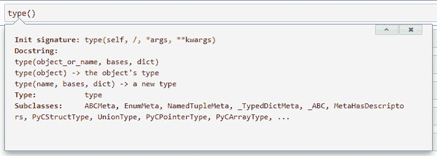
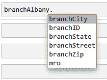
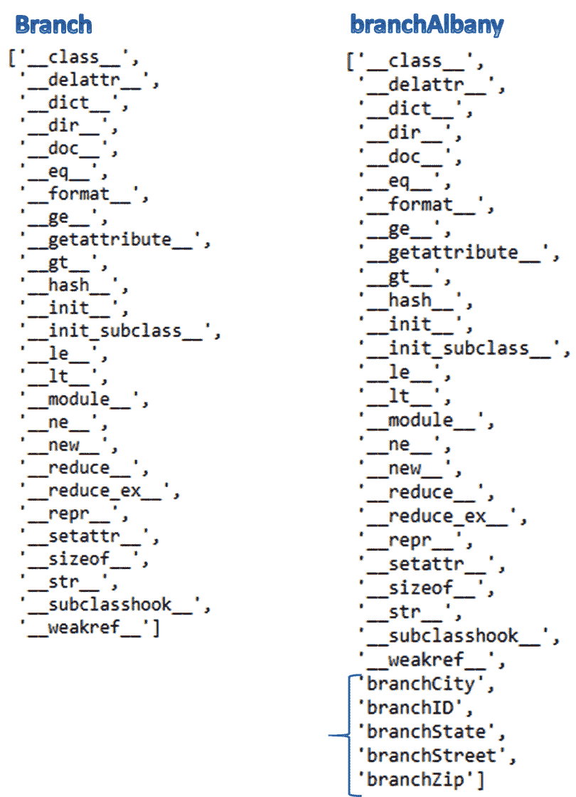
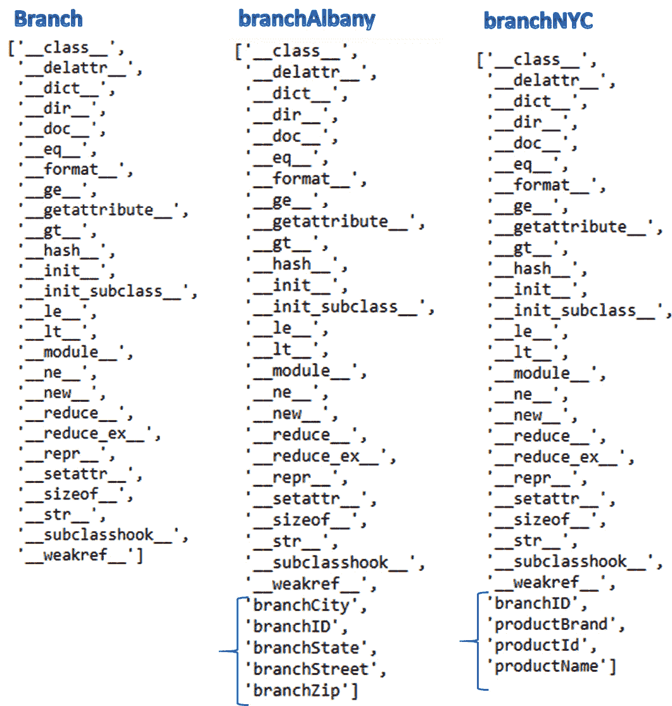
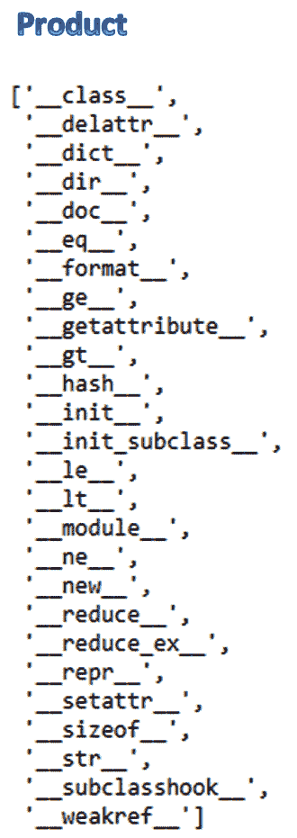
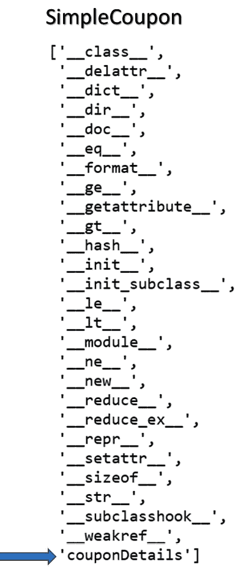
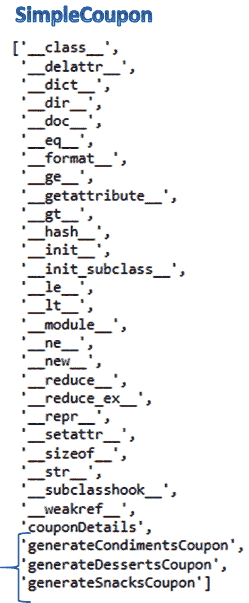

# 第十一章：*第十一章*：创建动态对象

在本章中，我们将探讨 Python 3 中的动态对象概念以及创建任何动态 Python 对象（包括类、类的实例、方法和属性）的过程。

正如其名所示，动态对象是在满足一定条件时在运行时或执行时创建的对象，而不是在编码时创建。

在本章中，我们将通过我们的核心示例*ABC Megamart*来探讨如何动态创建类、类实例、函数、方法和属性。

为什么我们应该理解动态对象的创建？在需要构建能够在运行时生成代码的应用程序的场景中，Python 代码的基本构建块是在运行时创建的对象。对象的动态创建提供了灵活性，可以选择仅在需要时创建对象。任何定义的对象都将占用一定量的内存。当在编码时创建的对象不再被其他代码或应用程序需要时，它将占用本可以更有效地使用的内存。

在本章中，我们将探讨以下主要主题：

+   探索用于动态对象的 type

+   动态创建类的多个实例

+   创建动态类

+   创建动态属性和方法

到本章结束时，你应该了解 Python 对象如何在运行时创建，以及它们如何在各种应用中实现。

# 技术要求

本章中分享的代码示例可在 GitHub 上找到，具体位置为[`github.com/PacktPublishing/Metaprogramming-with-Python/tree/main/Chapter11`](https://github.com/PacktPublishing/Metaprogramming-with-Python/tree/main/Chapter11)。

# 探索用于动态对象的 type

在本节中，让我们从动态对象创建的角度来探讨名为`type`的函数。为什么我们需要动态创建对象呢？让我们考虑以下场景：我们只想为特定实例/对象更改类的属性，而不是整个原始类。在这种情况下，我们可以为该类创建动态对象，并在特定的动态对象内动态定义类的属性，而不是整个类本身。

在本书的多个章节中，我们探讨了`type`函数的各种用法。在本章中，我们将探讨如何使用`type`动态创建 Python 对象。

让我们看一下以下屏幕截图中的 Python 中`type`函数签名的图形表示：



图 11.1 – type 函数的签名

类型函数接受一个 self 对象，后跟一个元组和参数字典作为输入。当我们向 `type` 函数提供对象作为输入时，它返回对象的类型，如下例所示：

```py
type(object)
```

对象类型的输出是 `type` 本身：

```py
type
```

从 *图 11.1* 我们还可以看到，`type` 的另一种变体接受一个对象后跟 `bases` 和 `dict`。`bases` 的参数值表示基类，而 `dict` 的参数值表示类的各种属性。

为了检查用于创建动态对象的 `type` 函数，让我们定义一个名为 `Branch` 的类：

```py
class Branch:
```

```py
    '''attributes...'''
```

```py
    '''methods...'''
```

```py
    pass
```

让我们进一步使用以下代码中的 `type` 函数动态创建一个对象：

```py
branchAlbany = type('Branch', (object,), {'branchID' : 123, 
```

```py
                        'branchStreet' : '123 Main Street',
```

```py
                        'branchCity' : 'Albany',
```

```py
                        'branchState' : 'New York',
```

```py
                        '  'branch'ip' : 12084})
```

在前面的代码中，`branchAlbany` 变量是要定义的对象，第一个参数是需要创建对象的类名，第二个参数是类参数的基类元组的集合，第三个参数是要添加到对象中的属性或方法列表。

我们可以在以下代码和输出中查看 `branchAlbany` 对象的定义：

```py
branchAlbany
__main__.Branch
```

以下截图是在执行前面的代码后添加到 `branchAlbany` 的属性表示：



图 11.2 – branchAlbany 的属性

动态类实例的方法解析顺序与 `Branch` 类相同：

```py
branchAlbany.mro
<function Branch.mro()>
```

现在添加到类实例的所有动态属性现在都是 `branchAlbany` 类实例的一部分：

```py
branchAlbany.branchID
```

```py
123
```

```py
branchAlbany.branchStreet
```

```py
'123 Main Street'
```

```py
branchAlbany.branchCity
```

```py
'Albany'
```

```py
branchAlbany.branchState
```

```py
'New York'
```

```py
branchAlbany.branchZip
```

```py
12084
```

为了更深入地理解这一点，让我们看看 `branchAlbany` 的属性，并将其与创建 `branchAlbany` 实例的 `Branch` 类的属性进行比较。比较的图形表示如图 *11.3* 所示：



图 11.3 – Branch 与 branchAlbany 的属性比较

前面的图明确指出，作为 `Branch` 类动态对象创建的一部分定义的属性没有包含在 `Branch` 类本身中。在这种情况下，`Branch` 类的定义保持不变，只有动态对象的定义发生了变化。

为了进一步探索，我们可以使用不同的属性集创建 `Branch` 类的另一个动态实例：

```py
branchNYC = type('Branch', (object,), {'branchID' : 202, 
```

```py
                             'productId': 100001,
```

```py
                           'productName': 'Refrigerator',
```

```py
                             'productBrand': 'Whirlpool'})
```

`branchNYC` 实例现在有自己的动态属性集，这些属性既不是 `Branch` 类的一部分，也不是 `branchAlbany` 实例的一部分。三个实例的比较如图 *11.4* 所示：



图 11.4 – Branch、branchAlbany 和 branchNYC 的属性

通过这种理解，让我们进一步探讨动态创建一个类的多个实例或对象。

# 动态创建类的多个实例

在本节中，让我们看看如何动态地创建一个类的多个实例。为此，我们将使用内置的 Python 函数 `globals` 来创建动态对象名称，以及我们用来创建动态对象的 `type` 函数。参考以下步骤：

1.  让我们创建一个名为 `Product` 的新类，该类没有任何属性或方法。而不是在类中定义属性并创建类的实例，让我们创建多个具有自己属性的实例：

    ```py
    class Product():
        '''attributes...'''
        '''methods...'''
        pass 
    ```

1.  接下来，我们将在名为 `details` 的列表中创建三个字典项：

    ```py
    details = [{'branchID' : 202, 
                'ProductID' : 100002, 
                'ProductName' : 'Washing Machine',
                'ProductBrand' : 'Whirlpool', 
                'PurchasePrice' : 450, 
                'ProfitMargin' : 0.19},
               {
                'productID' : 100902,
                'productName' : 'Iphone X',
                'productCategory' : 'Electronics',
                'unitPrice' : 700
               },
               {
                'branchID' : 2021,
                'branchStreet' : '40097 5th Main Street',
                'branchBorough' : 'Manhattan',
                'branchCity' : 'New York City',
                'Product ID': 100003, 
                'Product Name': 'Washing Machine', 
                'Product Brand': 'Samsung', 
                'Purchase Price': 430, 
                'Profit Margin': 0.18
               },
              ]
    ```

1.  这些字典项将被提供给我们将使用 `globals` 和 `type` 创建的多个对象实例的属性：

    ```py
    for obj,var in zip(['product1','product2','product3'],details):
        globals()[obj] = type('Product', (object,), var)
    ```

1.  在前面的代码中，我们创建了三个对象 `product1`、`product2` 和 `product3`，这些对象使用 `details` 列表中的变量定义。每个对象都是动态创建的，并且将拥有自己的属性集。

由于我们没有在类中定义任何自定义属性，`Product` 类有其默认的属性集。这些属性在 *图 11.5* 中展示：



图 11.5 – Product 的属性

1.  我们在这个例子中创建的三个对象的属性都有自己定义的动态属性集。动态对象的动态属性如下图所示：


图 11.6 – `product1`、`product2` 和 `product3` 的属性

在本节中，我们学习了如何动态地创建一个类的多个实例，每个实例都有其自己的动态属性集。有了这个理解，让我们进一步探讨如何动态地创建多个类。

# 创建动态类

在本节中，我们将探讨如何利用 `type` 和 `globals` 的内置函数动态地创建具有不同名称和不同属性的类。为了进一步探索这个概念，我们将首先使用 `type` 函数创建一个动态类：

```py
Product = type('Product', (object,), {'branchID' : 202, 
```

```py
                             'productId': 100001,
```

```py
                             'productName': 'Refrigerator',
```

```py
                             'productBrand': 'Whirlpool'})
```

在前面的代码中，我们创建了一个名为 `Product` 的类，并提供了类名，后面跟着基类及其相应的属性。

让我们用以下代码测试创建的类：

```py
Product
```

```py
__main__.Product
```

```py
type(Product)
```

```py
type
```

```py
Product.branchID
```

```py
202
```

有了这个理解，现在让我们进一步创建多个动态类。

## 创建多个动态类

在本节中，我们将使用 `type` 和 `globals` 创建多个动态类：

1.  让我们定义三个函数，在创建多个动态类时将其作为动态方法添加，如下所示：

    ```py
    def setBranch(branch):
            return branch
    def setSales(sales):
            return sales

    def setProduct(product):
            return product 
    ```

1.  接下来，让我们创建一个属性字典：

    ```py
    details = [{'branch': 202,
                'setBranch' : setBranch
      },
     {'purchasePrice': 430,
      'setSales' : setSales
      },
     {'product': 100902,
      'setProduct' : setProduct
      }]
    ```

1.  在下一步中，我们将使用 `type` 和 `globals` 在循环中动态地创建多个类：

    ```py
    for cls,var in zip(['productcls1','productcls2','productcls3'],details):
        globals()[cls] = type(cls, (object,), var)
    ```

1.  前面的代码创建了三个名为 `productcls1`、`productcls2` 和 `productcls3` 的类，并创建了可以进一步审查其使用在以下代码中及其对应输出的动态变量和方法：

    ```py
    productcls1.setBranch(productcls1.branch)
    202
    productcls2.setSales(productcls2.purchasePrice)
    430
    productcls3.setProduct(productcls3.product)
    100902
    ```

在前面的代码中，我们已经成功执行了在动态类中创建的方法。

在本节中，我们学习了如何动态创建多个类。有了这个理解，让我们进一步通过在类中创建动态方法来继续前进。

# 创建动态属性和方法

在本节中，让我们探讨如何在类中创建动态方法。动态方法是在运行时为类创建的方法，与我们在类定义本身内编码时创建的常规类方法不同。

动态方法被创建出来，以避免在定义之后修改结构或原始类定义。而不是修改类定义，我们可以定义并调用一个运行时模板方法，该方法反过来将为该类创建一个动态方法。

让我们从为管理 *ABC Megamart* 的优惠券并命名为 `SimpleCoupon` 的简单类定义开始：

```py
class SimpleCoupon:
```

```py
    '''attributes''''''
```

```py
 ''''''methods''''''
```

```py
    pass
```

我们没有为这个类定义任何属性或方法，但在接下来的章节中我们将更清晰地定义它们。

## 动态定义属性

现在，让我们使用 Python 内置的 `setattr` 函数在运行时为 `SimpleCoupon` 类定义一组优惠券属性。此函数接受一个 Python 对象、属性的名称及其对应值：

```py
setattr(SimpleCoupon,'couponDetails',
```

```py
[["Honey Mustard Sauce","Condiments","ABCBrand3","Pasadena Store","10/1/2021",2],
```

```py
["Potato Chips","Snacks","ABCBrand1","Manhattan Store","10/1/2021",2],
```

```py
["Strawberry Ice Cream","Desserts","ABCBrand3","ABC Manufacturer","10/1/2021",2]])
```

在前面的代码中，我们提供了类名 `SimpleCoupon` 作为输入对象，随后是属性名 `couponDetails`，以及其对应值，即三个产品详情列表，每个列表对应一种优惠券类型：`Condiments`、`Snacks` 和 `Desserts`。

现在我们已经动态创建了属性，让我们检查它是否已添加到 `SimpleCoupon` 类中，并且可以通过查看类中可用的属性和方法列表来使用它，如 *图 11.7* 所示：



图 11.7 – 将 couponDetails 添加到 SimpleCoupon

基于这个理解，让我们进一步在 `SimpleCoupon` 类中动态创建方法。

## 动态定义方法

在本节中，让我们创建一个新的函数，它作为一个模板函数，用于在 `SimpleCoupon` 类中动态生成方法。我们现在创建一个名为 `createCoupon` 的函数，它接受一个类对象、方法名和优惠券详情作为输入。

在函数定义中，我们还要定义一个 `generateCoupon` 函数，它将被生成为一个动态方法：

```py
def createCoupon(classname,methodname,couponDetails):
```

```py
    def generateCoupon(couponDetails):
```

```py
        import random
```

```py
        couponId =  random.sample(range(
```

```py
      100000000000,900000000000),1)
```

```py
        for i in couponId:
```

```py
            print('***********------------------
```

```py
           **************')
```

```py
            print('Product:', couponDetails[0])
```

```py
            print('Product Category:', couponDetails[1])
```

```py
            print('Coupon ID:', i)
```

```py
            print('Brand:', couponDetails[2])
```

```py
            print('Source:', couponDetails[3])
```

```py
            print('Expiry Date:', couponDetails[4])
```

```py
            print('Quantity:', couponDetails[5])
```

```py
            print('***********------------------
```

```py
           **************')
```

```py
    setattr(classname,methodname,generateCoupon)
```

在前面的代码中，我们调用 `setattr` 函数来在作为 `setattr` 输入的类对象中动态定义方法。

在下一步中，让我们使用相同的方法定义动态地生成三个`generateCoupon`方法，分别命名为三个不同的名称，并使用三组不同的属性进行测试。

```py
for method,var in zip(['generateCondimentsCoupon','generateSnacksCoupon','generateDessertsCoupon'],SimpleCoupon.couponDetails):
```

```py
    createCoupon(SimpleCoupon, method,var) 
```

现在，`SimpleCoupon`类已添加了三个不同的方法，分别命名为`generateCondimentsCoupon`、`generateSnacksCoupon`和`generateDessertsCoupon`。添加到`SimpleCoupon`类的动态方法如下所示：



图 11.8 – 添加到 SimpleCoupon 的动态方法

让我们从`SimpleCoupon`类中调用它们来运行每个方法。以下代码中调用了`generateCondimentsCoupon`方法：

```py
SimpleCoupon.generateCondimentsCoupon(SimpleCoupon.couponDetails[0])
```

输出生成如下：

```py
***********------------------**************
```

```py
Product: Honey Mustard Sauce
```

```py
Product Category: Condiments
```

```py
Coupon ID: 666849488635
```

```py
Brand: ABCBrand3
```

```py
Source: Pasadena Store
```

```py
Expiry Date: 10/1/2021
```

```py
Quantity: 2
```

```py
***********------------------**************
```

```py
generateSnacksCoupon is called in the following code:
```

```py
SimpleCoupon.generateSnacksCoupon(SimpleCoupon.couponDetails[1])
```

此输出的结果如下：

```py
***********------------------**************
```

```py
Product: Potato Chips
```

```py
Product Category: Snacks
```

```py
Coupon ID: 394693383743
```

```py
Brand: ABCBrand1
```

```py
Source: Manhattan Store
```

```py
Expiry Date: 10/1/2021
```

```py
Quantity: 2
```

```py
***********------------------**************
```

以下代码中调用了`generateDessertsCoupon`方法：

```py
SimpleCoupon.generateDessertsCoupon(SimpleCoupon.couponDetails[2])
```

输出生成如下：

```py
***********------------------**************
```

```py
Product: Strawberry Ice Cream
```

```py
Product Category: Desserts
```

```py
Coupon ID: 813638596228
```

```py
Brand: ABCBrand3
```

```py
Source: ABC Manufacturer
```

```py
Expiry Date: 10/1/2021
```

```py
Quantity: 2
```

```py
***********------------------**************
```

在本节中，我们已经理解了在 Python 类中动态生成方法的概念，并附带了示例。这个概念在设计和具有自动化代码生成功能的应用程序时将有所帮助。

# 摘要

在本章中，我们通过探索 Python 3 中创建各种动态对象的方法，学习了动态对象的概念。我们还涵盖了动态创建类多个实例的概念。我们探讨了创建动态类的概念。此外，我们还研究了在类中动态创建属性和方法的概念。

与本书中其他章节类似，虽然本章解释了动态对象的概念，但也提供了一些关于元编程及其对 Python 代码影响的重点。

在下一章中，我们将通过一些有趣的示例来探讨设计模式的概念。
