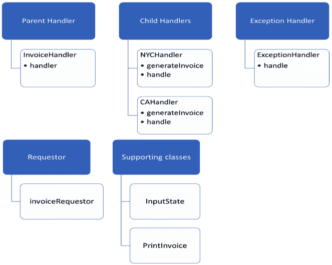
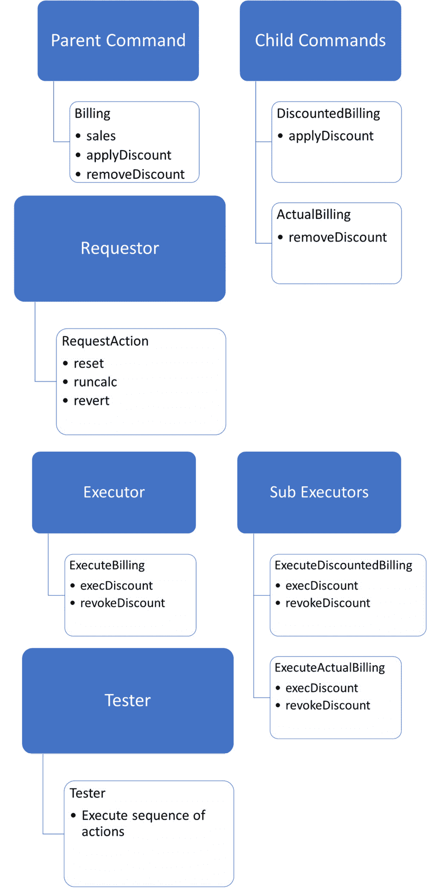
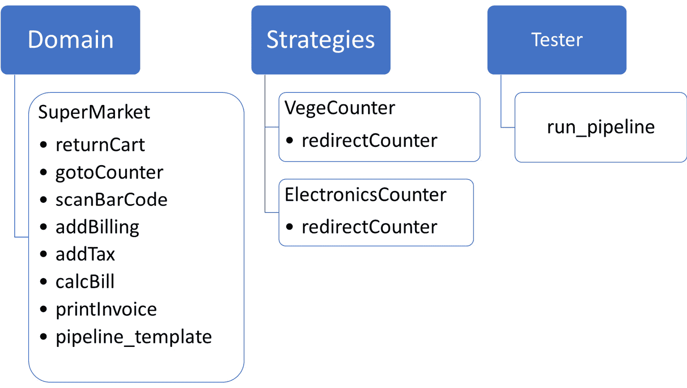

# *第十二章*：应用 GOF 设计模式——第一部分

在本章中，我们将探讨 Python 3 中设计模式的概念及其各种类别，以及它们在用 Python 开发软件时如何应用的示例。

设计模式的概念起源于 Erich Gamma、Richard Helm、Ralph Johnson 和 John Vlissides 所著的《设计模式：可复用面向对象软件元素》一书，该书由 Addison-Wesley 出版，用 C++编写。这个概念后来扩展到了其他面向对象编程（**OOP**）语言。

在本章中，我们将探讨如何使用我们的核心示例*ABC Megamart*将这些设计模式应用于 Python。

我们将涵盖以下主要主题：

+   设计模式概述

+   探索行为设计模式

到本章结束时，你应该理解一些重要的行为设计模式以及它们如何在各种应用程序中实现。

# 技术要求

本章中的代码示例可在本书的 GitHub 仓库中找到：[`github.com/PacktPublishing/Metaprogramming-with-Python/tree/main/Chapter12`](https://github.com/PacktPublishing/Metaprogramming-with-Python/tree/main/Chapter12)。

# 设计模式概述

每种编程语言都有其独特设计和传达给他人的元素。设计模式为在 Python 中开发软件或应用程序提供了一种结构化和精心设计的方法。在 Python 中，每个元素都是一个对象。设计模式表达了我们将如何对这些对象进行排序或结构化以执行各种操作。这使得它们变得可重用。

设计模式分为三个类别——行为、结构和创建。在本章中，我们将介绍行为设计模式，并特别关注以下三个：

+   责任链

+   命令

+   策略

Python 中有超过 20 种不同的设计模式，涵盖所有这些需要一本自己的书。因此，我们将只关注本章和下一章中一些最有趣的设计模式。有了这个，让我们来探索一些行为设计模式。

# 探索行为设计模式

正如其名所示，行为设计模式处理对象的行为以及它们如何相互交流。在本节中，我们将学习责任链、命令和策略设计模式的元素，这些模式属于行为设计模式类别，并通过将它们应用于*ABC Megamart*来理解它们。

## 理解责任链

责任链是一种设计模式，其中可以由对象执行的动作的责任从一个对象传递到另一个对象，类似于一系列事件或动作。为了进一步解释这一点并实现这种设计模式，我们需要在我们的代码中开发以下元素：

+   **父处理器**：一个基类，它定义了一个基础函数，指定如何处理一系列动作。

+   **子处理器**：一个或多个子类，它们覆盖基类中的基础函数以执行相应的动作。

+   **异常处理器**：一个默认处理器，在发生异常时执行特定操作。它还会覆盖基类中的基础函数。

+   **请求者**：一个函数或方法，它调用子处理器来启动责任链。

让我们通过一个例子来看看责任链。

在这个例子中，我们将根据州计算税费并为*ABC Megamart*的纽约和加利福尼亚分支机构生成发票。请按照以下步骤操作：

1.  为了进一步说明设计模式，让我们创建一个名为`InvoiceHandler`的父处理器类。在这个类中，我们将初始化一个`next_action`变量来处理链中的下一个动作，并定义一个`handle`方法来处理请求的动作：

    ```py
    class InvoiceHandler(object):
        def __init__(self):
            self.next_action = None
        def handle(self,calctax):
            self.next_action.handle(calctax)
    ```

1.  接下来，我们将创建一个支持类来支持我们在本例中将要执行的操作。在这里，我们希望根据请求计算州的税费并生成发票：

    ```py
    class InputState(object):
        state_ny = ['NYC','NY','New York','new york']
        state_ca = ['CA', 'California', 'california']
    ```

`InputState`类有两个属性，用于列出纽约州和加利福尼亚州的接受值。

1.  现在，让我们创建另一个类，为发票添加一个标题，如下所示：

    ```py
    class Print_invoice(object):
        def __init__(self,state):
            self.state = state
            self.header = 'State specific Sales tax is applicable 
                           for the state of ' + self.state
    ```

1.  接下来，我们将创建一个子处理器类，该类具有生成发票、计算产品在纽约州的具体税费以及覆盖来自`InvoiceHandler`类的`handle`方法的方法：

    ```py
    class NYCHandler(InvoiceHandler):
        def generate_invoice(self, header, state):
            product = 'WashingMachine'
            pricebeforetax = 450 + (450 * 0.19)
            tax_rate = 0.4
            local_rate = 0.055
            tax = pricebeforetax * (tax_rate + local_rate)
            finalsellingprice = pricebeforetax + tax
            print('**************ABC Megamart*****************')
            print('***********------------------**************')
            print(header)
            print('Product: ', product)
            print('Tax: ', tax)
            print('Total Price: ', finalsellingprice)
            print('***********------------------**************') 

        def handle(self,print_invoice):
            if print_invoice.state in InputState.state_ny:
                self.generate_invoice(print_invoice.header, 
                                      print_invoice.state)
            else:
                super(NYCHandler, self).handle(print_invoice)
    ```

1.  然后，我们将创建一个子处理器类，该类具有生成发票、计算产品在加利福尼亚州的具体税费以及覆盖来自`InvoiceHandler`类的`handle`方法的方法：

    ```py
    class CAHandler(InvoiceHandler):
        def generate_invoice(self, header, state):
            product = 'WashingMachine'
            pricebeforetax = 480 + (480 * 0.14)
            tax_rate = 0.35
            local_rate = 0.077
            tax = pricebeforetax * (tax_rate + local_rate)
            finalsellingprice = pricebeforetax + tax
            print('**************ABC Megamart*****************')
            print('***********------------------**************')
            print(header)
            print('Product: ', product)
            print('Tax: ', tax)
            print('Total Price: ', finalsellingprice)
            print('***********------------------**************') 

        def handle(self,print_invoice):
            if print_invoice.state in InputState.state_ca:
                self.generate_invoice(print_invoice.header, 
                                      print_invoice.state)
            else:
                super(CAHandler, self).handle(print_invoice)
    ```

1.  现在，让我们定义一个类来处理异常，例如请求未调用子处理器方法之一的场景：

    ```py
    class ExceptionHandler(InvoiceHandler):
        def handle(self,print_invoice):
            print("No branches in the state")  
    ```

1.  现在，让我们创建一个请求函数，该函数实例化一个子处理器子类，并启动一个责任链，将一个动作传递到另一个动作：

    ```py
    def invoice_requestor(state):
        invoice = Print_invoice(state)
        nychandler = NYCHandler()
        cahandler = CAHandler()
        nychandler.next_action = cahandler
        cahandler.next_action = ExceptionHandler()
        nychandler.handle(invoice)
    ```

在前面的代码中，我们定义了请求者来设置`NYCHandler`的下一个动作是`CAHandler`，以及`CAHandler`的下一个动作是异常处理器。让我们通过调用`invoice_requestor`函数并传入输入州名来测试这个设计模式；即`CA`：

```py
invoice_requestor('CA')
```

前面的代码返回了加利福尼亚州的发票，因为我们提供的输入是`CC`而不是`NY`。如果提供的是`NY`作为输入，设计模式将调用`NYHandler`。然而，由于提供了 CA，因此调用链中的下一个相关`CAHandler`如下：

```py
**************ABC Megamart*****************
```

```py
***********------------------**************
```

```py
State specific Sales tax is applicable for the state of CA
```

```py
Product:  WashingMachine
```

```py
Tax:  233.6544
```

```py
Total Price:  780.8544
```

```py
***********------------------**************
```

如果`invoice_requestor`提供的输入州名是`NY`，它应该调用`NYHandler`，而不是`CAHandler`：

```py
invoice_requestor('NYC')
```

前面的代码返回了`NYHandler`类的发票，而不是预期的`CAHandler`类的发票：

```py
**************ABC Megamart*****************
```

```py
***********------------------**************
```

```py
State specific Sales tax is applicable for the state of NYC
```

```py
Product:  WashingMachine
```

```py
Tax:  243.6525
```

```py
Total Price:  779.1525
```

```py
***********------------------**************
```

作为请求的最后部分，让我们通过提供一个既不是`NY`也不是`CA`的输入状态来调用`ExceptionHandler`：

```py
invoice_requestor('TEXAS')
```

以下代码通过从`ExceptionHandler`调用动作返回以下输出：

```py
No branches in the state
```

让我们将这个设计模式的元素与其对应的对象连接起来：



图 12.1 – 责任链类

在本节中，我们探讨了责任链设计模式。现在，让我们看看命令设计模式。

## 了解命令设计模式

在本节中，我们将探讨下一个感兴趣的设计模式：命令设计模式。命令设计模式可以用来创建执行命令的序列，并在执行命令出错时回滚到之前的状态。类似于责任链模式，命令设计模式也是通过定义多个可以执行动作并撤销对象执行的动作的元素来创建的。

为了进一步解释并实现这个设计模式，我们需要在我们的代码中开发以下元素：

+   **父命令**：这是一个基类，定义了需要执行的一个或多个命令的基本功能。

+   **子命令**：子命令指定从父命令类继承的一个或多个动作，并在单个子命令级别上覆盖。

+   **执行者**：这是一个执行子命令的基类。它提供了一个执行动作的方法和一个撤销动作的方法。

+   **子执行者**：这些继承自执行者并覆盖了执行方法，同时撤销子命令执行的动作。

+   **请求者**：请求者是请求执行者执行命令并回滚到之前状态的类。

+   **测试者**：这个类测试设计模式是否按预期工作。

现在，让我们看看这个设计模式在实际中的应用。为了理解这个设计模式，我们将回到*ABC Megamart*并计算产品的销售价格，以及应用折扣。命令模式可以帮助我们设计账单，以便我们可以以实际销售价格出售或应用折扣。每当错误地应用折扣时，我们可以撤销它。同样，每当没有应用折扣时，我们可以重新应用它。按照以下步骤进行：

1.  让我们先创建`Billing`类。这将是一个父命令，它将有一个名为`sales`的属性。这是一个字典对象。将有两个抽象方法——一个用于应用折扣，另一个用于移除折扣：

    ```py
    from abc import ABC, abstractmethod
    class Billing:
        sales = {'purchase_price': 450,
                  'profit_margin': 0.19,
                  'tax_rate': 0.4,
                  'discount_rate': 0.10
                  }        
        @abstractmethod
        def apply_discount(self):
            pass
        @abstractmethod
        def remove_discount(self):
            pass
    ```

1.  现在，让我们创建第一个子命令类`DiscountedBilling`，它将覆盖其父类`Billing`中的`apply_discount`方法。应用`Discount`方法将接受来自`Billing`类的销售字典对象并计算折扣后的价格，如下所示：

    ```py
    class DiscountedBilling(Billing):
        def apply_discount(self):
            sales = self.sales
            pricebeforetax = sales['purchase_price'] + 
                 sales['purchase_price'] * sales['profit_margin']
            finalsellingprice = pricebeforetax + (pricebeforetax * 
            sales['tax_rate'])
            sales['sellingPrice'] = finalsellingprice
            discountedPrice = sales['sellingPrice'] * (1 – 
                              sales['discount_rate'])
            return discountedPrice
    ```

1.  接下来，我们将创建下一个子命令类，`ActualBilling`，它将移除折扣。也就是说，它将计算不带折扣的销售价格：

    ```py
    class ActualBilling(Billing):
        def remove_discount(self):
            sales = self.sales
            pricebeforetax = sales['purchase_price'] + 
                 sales['purchase_price'] * sales['profit_margin']
            actualprice = pricebeforetax + (pricebeforetax * 
                          sales['tax_rate'])
            return actualprice
    ```

1.  现在，让我们创建执行器的基类。这将有两个方法：`exec_discount` 和 `revoke_discount`。第一个是一个抽象方法，用于执行应用折扣的命令。第二个是一个抽象方法，用于执行撤销折扣的命令：

    ```py
    class ExecuteBilling:
        @abstractmethod
        def exec_discount(self):
            pass
        @abstractmethod
        def revoke_discount(self):
            pass
    ```

1.  现在，让我们定义一个名为 `ExecuteDiscountedBilling` 的子类，它继承自 `ExecuteBilling` 类。这将覆盖其超类中的 `exec_discount` 和 `revoke_discount` 方法。我们将在子类的 `exec_discount` 方法中调用 `DiscountedBilling` 类的 `apply_discount` 方法。我们还将设置 `ActualBilling` 命令类，从 `ExecuteActualBilling` 类中在 `revoke_discount` 方法内：

    ```py
    class ExecuteDiscountedBilling(ExecuteBilling):
        def __init__(self, instance):
            self.instance = instance        
        def exec_discount(self):
            print('Discount applied...')
            return self.instance.apply_discount()        
        def revoke_discount(self, revokeInstance):
            revokeInstance.reset(ExecuteActualBilling(
                                 ActualBilling()))
            return revokeInstance.runcalc()
    ```

1.  现在，让我们定义一个名为 `ExecuteActualBilling` 的子类，它继承自 `ExecuteBilling` 类。这将覆盖其超类中的 `exec_discount` 和 `revoke_discount` 方法。我们将在子类的 `exec_discount` 方法中调用 `ActualBilling` 类的 `remove_discount` 方法。我们还将设置 `DiscountedBilling` 命令类，从 `ExecuteDiscountedBilling` 类中在 `revoke_discount` 方法内：

    ```py
    class ExecuteActualBilling(ExecuteBilling):
        def __init__(self, instance):
            self.instance = instance

        def exec_discount(self):
            print('Discount removed...')
            return self.instance.remove_discount()

        def revoke_discount(self, revokeInstance):
            revokeInstance.reset(ExecuteDiscountedBilling(
                                 DiscountedBilling()))
            return revokeInstance.runcalc()
    ```

1.  接下来，我们将定义请求者类，`RequestAction`，它将请求执行和撤销所需的命令。我们还将定义三个方法：

    +   `reset` 方法，它将设置或重置命令

    +   `runcalc` 方法，它将执行折扣计算

    +   `revert` 方法，它将通过撤销折扣计算来恢复到之前的操作：

在代码块中：

```py
class RequestAction:
    def __init__(self, action):
        self.action = action
    def reset(self, action):
        print("Resetting command...")
        self.action = action
    def runcalc(self):
        return self.action.exec_discount()
    def revert(self):
        print("Reverting the previous action...")
        return self.action.revoke_discount(self)
```

1.  最后，我们必须创建这个设计模式中的最后一个类来测试命令设计模式是否按预期工作：

    ```py
    class Tester:
        def __init__(self):
            billing = Billing()
            discount = 
                     ExecuteDiscountedBilling (DiscountedBilling())
            actual = ExecuteActualBilling(ActualBilling())
            requestor = RequestAction(discount)  
            print(requestor.runcalc())
            requestor.reset(actual)
            print(requestor.runcalc())
            print(requestor.revert())
            print(requestor.revert())
    ```

在前面的代码中，我们定义了 `Billing` 类的对象实例，然后是可折扣的实例和实际的 `ExecuteBilling` 子类。我们还创建了一个 `RequestAction` 请求者类的实例。之后，我们按顺序执行了一系列操作以运行折扣计算，然后是 `reset` 命令，接着重新运行计算以移除折扣。这将撤销之前的命令，从而在撤销之前的命令之前重新应用折扣，这将反过来移除折扣。

让我们称 `Tester` 类如下：

```py
Tester()
```

上述代码的输出如下：

```py
Discount applied...
674.73
Resetting command...
Discount removed...
749.7
Reverting the previous action...
Resetting command...
Discount applied...
674.73
Reverting the previous action...
Resetting command...
Discount removed...
749.7
<__main__.Tester at 0x261f09e3b20>
```

现在，让我们将这个设计模式的元素与其对应对象连接起来：



图 12.2 – 命令设计模式类

在本节中，我们探讨了命令设计模式的概念。现在，让我们看看策略设计模式。

## 策略设计模式

在本节中，我们将查看本章将要介绍的行为设计模式类别下的最后一个设计模式。让我们查看策略模式的元素，如下所示：

+   **领域**：领域或基类定义了 Python 对象执行一系列操作所需的所有基方法和属性。此类还根据策略类中定义的策略方法在类内做出操作决策。

+   **策略**：这些是一个或多个独立的类，它们在其策略方法中定义了一个特定的策略。每个策略类都将使用相同的策略方法名称。

+   **测试者**：测试函数调用领域类并执行策略。

为了理解策略设计模式的实现，我们将查看我们在*第八章*中提到的各种计费计数器。在*ABC Megamart*中，有各种计费计数器，包括蔬菜计数器、少于 10 件物品的计数器、电子计数器等。

在这个例子中，我们将定义一个蔬菜计数器和电子计数器作为策略类。按照以下步骤进行：

1.  首先，我们将定义一个名为`SuperMarket`的领域类，其中包含以下方法：

    1.  初始化属性

    1.  显示购物车中物品的详细信息

    1.  前往特定的计数器

下面是这个代码的样子：

```py
class SuperMarket():

    def __init__(self,STRATEGY, items, name, scan, units, tax, 
                 itemtype = None):
        self.STRATEGY = STRATEGY
        self.items = items
        self.name = name
        self.scan = scan
        self.units = units
        self.tax = tax
        self.itemtype = itemtype

    def return_cart(self):
        cartItems = []
        for i in self.items:
            cartItems.append(i)
        return cartItems

    def goto_counter(self):
        countername = self.name
        return countername
```

1.  接下来，我们将定义以下方法：

    +   扫描条形码

    +   添加账单详情

    +   添加税费详情

下面是这个代码：

```py
    def scan_bar_code(self):
        codes = []
        for i in self.scan:
            codes.append(i)
        return codes

    def add_billing(self):
        self.codes = self.scan_bar_code()
        pricetag = []
        for i in self.units:
            pricetag.append(i)
        bill = dict(zip(self.codes, pricetag))
        return bill

    def add_tax(self):
        taxed = []
        for i in self.tax:
            taxed.append(i)
        return taxed
```

1.  计算账单和打印发票的操作也定义在`SuperMarket`类中。请参考以下代码：

    ```py
        def calc_bill(self):
            bill = self.add_billing()
            items = []
            cartItems = self.return_cart()
            calc_bill = []
            taxes = self.add_tax()
            for item,tax in zip(bill.items(),taxes):
                items.append(item[1])
                calc_bill.append(item[1] + item[1]*tax)
            finalbill = dict(zip(cartItems, calc_bill))
            return finalbill

        def print_invoice(self):
            finalbill = self.calc_bill()
            final_total = sum(finalbill.values())
            print('**************ABC Megamart*****************')
            print('***********------------------**************')
            print('Counter Name: ', self.goto_counter())
            for item,price in finalbill.items():
                print(item,": ", price)
            print('Total:',final_total)
            print('***********------------------**************')
            print('***************PAID************************')
    ```

1.  `SuperMarket`类中的最后一个方法是`pipeline_template`方法，它创建一个用于运行方法序列的管道：

    ```py
        def pipeline_template(self):
            self.return_cart()
            self.goto_counter()
            self.STRATEGY.redirect_counter()
            self.scan_bar_code()
            self.add_billing()
            self.add_tax()
            self.calc_bill()
            self.print_invoice()
    ```

在这个方法中，我们将改变`SuperMarket`类执行的策略称为策略方法。

1.  现在，让我们定义一个简单的蔬菜计数器策略类，如下所示：

    ```py
    class VegeCounter():
        def redirect_counter():
            print("**************Move to Vege Counter**************")
    ```

1.  让我们也创建一个简单的电子计数器策略类，如下所示：

    ```py
    class ElectronicsCounter():
        def redirect_counter():
            print("**************Move to Electronics 
                  Counter**************")
    ```

1.  现在，我们必须定义一个测试函数来测试策略：

    ```py
    def run_pipeline(domain = SuperMarket):
        domain.pipeline_template()
    ```

1.  让我们通过运行管道并提供`VegeCounter`作为策略值来测试蔬菜计数器的策略：

    ```py
    run_pipeline(SuperMarket(STRATEGY = VegeCounter,
               items = ['Onions','Tomatoes','Cabbage','Beetroot'],
               name = ['Vegetable Counter'],
               scan = [113323,3434332,2131243,2332783],
               units = [10,15,12,14],
               tax = [0.04,0.03,0.035,0.025],
               itemtype = ['Vegetables'],
               ))
    ```

1.  `VegeCounter`策略的输出如下：

    ```py
    **************Move to Vege Counter**************
    **************ABC Megamart*****************
    ***********------------------**************
    Counter Name:['Vegetable Counter']
    Onions :10.4
    Tomatoes :15.45
    Cabbage :12.42
    Beetroot :14.35
    Total: 52.620000000000005
    ***********------------------**************
    ***************PAID************************
    ```

1.  现在，让我们通过运行管道并提供`ElectronicsCounter`作为策略值来测试电子计数器的策略：

    ```py
    run_pipeline(SuperMarket(STRATEGY = ElectronicsCounter,
                        items = ['television','keyboard','mouse'],
                        name = ['Electronics Counter'],
                        scan = [113323,3434332,2131243],
                        units = [100,16,14],
                        tax = [0.04,0.03,0.035],
                        itemtype = ['Electronics'],
                        ))
    ```

`ElectronicsCounter`策略的输出如下：

```py
**************Move to Electronics Counter**************
**************ABC Megamart*****************
***********------------------**************
Counter Name:  ['Electronics Counter']
television :  104.0
keyboard :  16.48
mouse :  14.49
Total: 134.97
***********------------------**************
***************PAID************************
```

现在，让我们将这个设计模式的元素与其相应的对象连接起来：



图 12.3 – 使用类的策略模式

通过这样，我们已经了解了策略设计模式。现在，让我们总结本章内容。

# 概述

在本章中，我们通过在 Python 3 中应用其中一些模式，学习了行为设计模式。特别是，我们实现了责任链、命令和策略模式，并理解了它们各自的元素。

与本书中的其他章节类似，本章也被分成了两部分——这一部分解释了设计模式，并专注于元编程及其对 Python 代码的影响。

在下一章中，我们将继续探讨设计模式的概念，通过涵盖结构性和创建性设计模式的例子来展开。
