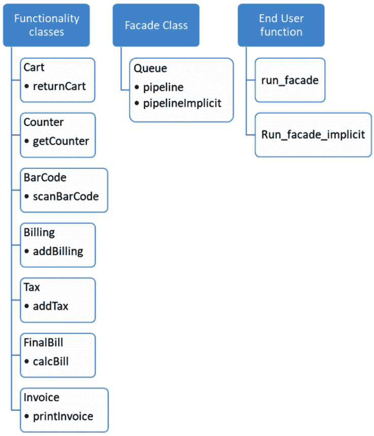
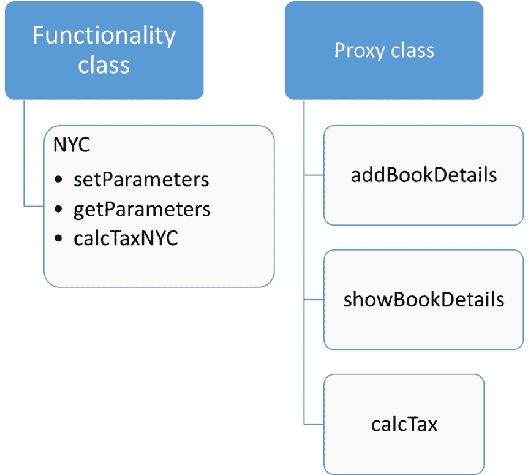
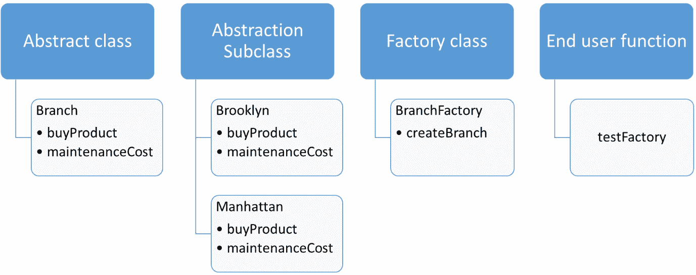

# 第十三章：*第十三章*：应用 GOF 设计模式——第二部分

本章，我们将继续探讨 Python 3 中的设计模式概念及其各种类别及其在软件开发中的实现。

在上一章中，我们学习了如何通过示例应用行为型设计模式。在本章中，我们将继续探讨剩余的两个类别——结构型和创建型设计模式。我们将看到它们如何通过我们的核心示例 *ABC Megamart* 在 Python 中应用。

本章，我们将探讨以下主要主题：

+   理解结构型设计模式

+   理解创建型设计模式

到本章结束时，你应该能够理解一些重要的结构和创建型设计模式的例子，并学习它们如何在各种应用中实现。

# 技术要求

本章中分享的代码示例可在 GitHub 上找到，地址为[`github.com/PacktPublishing/Metaprogramming-with-Python/tree/main/Chapter13`](https://github.com/PacktPublishing/Metaprogramming-with-Python/tree/main/Chapter13)。

# 探索结构型设计模式

如其名所示，结构型设计模式用于设计类及其实现的结构，以便类和对象可以有效地扩展或重用。在本节中，我们将介绍三种这样的结构型设计模式——桥接模式、外观模式和代理模式。我们考虑这三种设计模式是因为它们是独特的，并且代表了结构型设计模式可以使用的三个不同方面。

## 理解桥接模式

桥接设计模式通过抽象或抽象方法的概念应用于桥接多个实现元素或操作。为了进一步解释这一点并实现这个设计模式，我们的代码应该包含以下元素：

+   **抽象超类**：具有执行特定操作的抽象方法的基础类，以及桥接任何额外实现的方法

+   **抽象子类**：一个或多个子类，它们从抽象超类实现抽象方法以执行它们各自的操作

+   **实现超类**：一个基础类，它添加了额外的实现或设计在抽象之上

+   **实现子类**：继承实现超类的子类

让我们通过一个例子来了解桥接模式。在这个例子中，我们将查看打印属于两个不同超市——*ABC Megamart* 和 *XYZ Megamart* 的分支经理的商务名片。让我们看看如何：

1.  为了进一步说明设计模式，让我们创建一个名为 `PrintCard` 的抽象超类，并添加三个方法。`add_name` 方法添加超市的名称，`add_manager` 方法添加特定于管理员的格式。`add_manager` 方法从实现子类获取格式输入，我们将在本节后面讨论。第三个方法是 `printcard` 方法，它是一个抽象方法，将在子类中定义：

    ```py
    from abc import abstractmethod, ABC
    class PrintCard(ABC):    
        def add_name(self, name):
            self.name = name        
        def add_manager(self, branch):
            self.branch = branch.FORMATTING        
        @abstractmethod
        def printcard(self):
            pass
    ```

1.  让我们进一步创建一个名为 `CardABC` 的抽象子类。这个类将从超类初始化标志、名称和管理员。`printcard` 方法将打印标志、超市的名称和分店的地址：

    ```py
    class CardABC(PrintCard):
        def __init__(self, logo, name, branch):
            self.logo = logo
            super().add_name(name)
            super().add_manager(branch)

        def printcard(self, *args):
            print(self.logo + self.name)
            for arg in args:
                print(self.branch + str(arg))
    ```

1.  接下来，创建一个名为 `CardXYZ` 的抽象子类。它将初始化以下变量 – 风格、标志、从超类继承的名称和管理员。`printcard` 方法将打印标志、卡片的风格、超市的名称和分店的地址：

    ```py
    class CardXYZ(PrintCard):
        def __init__(self, style, logo, name, branch):
            self.style = style
            self.logo = logo
            super().add_name(name)
            super().add_manager(branch)

        def printcard(self, *args):
            print(self.logo + self.style + self.name)
            for arg in args:
                print(self.branch + str(arg))
    ```

1.  现在，让我们创建一个名为 `Manager` 的实现超类，其中包含一个名为 `formatting` 的方法：

    ```py
    class Manager:
        def formatting(self):
            pass
    ```

1.  接下来，创建一个名为 `Manager_manhattan` 的实现子类，以添加针对曼哈顿分店经理的商务卡的格式：

    ```py
    class Manager_manhattan(Manager):
        def __init__(self):
            self.formatting()

        def formatting(self):
            self.FORMATTING = '\337m'
    ```

1.  现在，让我们创建一个名为 `Manager_albany` 的实现子类，以添加针对阿尔巴尼分店经理的商务卡的特定格式：

    ```py
    class Manager_albany(Manager):
        def __init__(self):
            self.formatting()

        def formatting(self):
            self.FORMATTING = '\033[94m'
    ```

1.  接下来，实例化 `CardABC`，这是一个抽象子类。此类的三个输入参数是标志的格式、超市的名称以及添加格式的分店：

    ```py
    manager_manhattan = CardABC(logo = '\33[43m', name = 'ABC Megamart', branch = Manager_manhattan())
    ```

1.  现在我们将打印这张卡片：

    ```py
    manager_manhattan.printcard('John M',
                  'john.m@abcmegamart.com',
      '40097 5th Main Street',
      'Manhattan',
      'New York City',
      'New York',
      11007)
    ```

输出如下所示，格式与类实例化时提供的一致：

```py
ABC Megamart
John M
john.m@abcmegamart.com
40097 5th Main Street
Manhattan
New York City
New York
11007
```

1.  现在，让我们实例化 `CardXYZ`，这是一个抽象子类。此类的四个输入参数是风格、标志的格式、超市的名称以及添加格式的分店：

    ```py
    manager_albany = CardXYZ(style = '\33[43m',logo = '\33[5m', name = 'XYZ Megamart', branch = Manager_albany())
    ```

1.  现在，让我们打印这张卡片。

    ```py
    manager_albany.printcard('Ron D','ron.d@abcmegamart.com','123 Main Street','Albany','New York', 12084)
    ```

输出如下所示，风格和格式与类实例化时提供的一致：

```py
XYZ Megamart
Ron D
ron.d@abcmegamart.com
123 Main Street
Albany
New York
12084
```

让我们用以下图形表示法将此设计模式的元素与示例中的相应对象联系起来：

![图 13.1 – 桥接模式类

图 13.1 – 桥接模式类

因此，通过在抽象类和实现类之间创建桥梁，已经实现了桥接模式。有了这个理解，让我们来看看外观模式。

## 理解外观模式

在本节中，我们将探讨外观模式，我们将设计一种类似黑盒的实现，以隐藏处理多个子系统的系统的复杂性，从而保护最终用户或客户端。为了进一步解释并实现这个设计/核心模式，我们的代码需要以下元素：

+   **功能**：需要为系统实现的核心功能定义在这些功能类中。

+   **外观**：这是一个封装核心功能和其实现的类，供最终用户使用。

+   **最终用户**：使用外观类访问系统核心功能的功能、方法或类。

为了进一步理解外观模式，让我们创建一系列功能，从添加购物车中的商品开始，到结账，扫描条形码，开账单，最后打印发票：

1.  这个系列中的第一个功能类是 `Cart`，其中将在 `return_cart` 方法中将商品添加到购物车中：

    ```py
    class Cart:
        def __init__(self, items):
            self.items = items
        def return_cart(self):
            cart_items = []
            for i in self.items:
                cart_items.append(i)
            print("Running return_cart...")
            return cart_items
    ```

1.  第二个功能类是 `Counter` 类，其中 `goto_counter` 方法返回收银台的名字：

    ```py
    class Counter:
        def __init__(self, name):
            self.name = name
        def goto_counter(self):
            countername = self.name
            print("Running goto_counter...")
            return countername
    ```

1.  第三个功能类是 `BarCode` 类，其中 `scan_bar_code` 方法返回扫描的条形码：

    ```py
    class BarCode:
        def __init__(self, scan):
            self.scan = scan
        def scan_bar_code(self):
            codes = []
            for i in self.scan:
                codes.append(i)
            print("Running scan_bar_code...")
            return codes
    ```

1.  第四个功能是 `Billing` 类，其中在 `add_billing` 方法中将价格标记到条形码上，并作为字典对象返回：

    ```py
    class Billing:
        def __init__(self, codes, units ):
            self.codes = codes
            self.units = units
        def add_billing(self):
            codes = self.codes.scan_bar_code()
            pricetag = []
            for i in self.units:
                pricetag.append(i)
            bill = dict(zip(codes, pricetag))
            print("Running add_billing...")
            return bill
    ```

1.  下一个功能类是 `Tax` 类，其中使用类中的 `add_tax` 方法返回税率：

    ```py
    class Tax:
        def __init__(self, tax):
            self.tax = tax
        def add_tax(self):
            taxed = []
            for i in self.tax:
                taxed.append(i)
            print("Running add_tax...")
            return taxed
    ```

1.  此后的功能是 `FinalBill` 类，我们将使用 `calc_bill` 方法计算最终账单：

    ```py
    class FinalBill:
        def __init__(self, billing, cart, tax):
            self.billing = billing
            self.cart = cart
            self.tax = tax    
        def calc_bill(self):
            bill = self.billing.add_billing()
            items = []
            cart_items = self.cart.return_cart()
            calc_bill = []
            taxes = self.tax.add_tax()
            for item,tax in zip(bill.items(),taxes):
                items.append(item[1])
                calc_bill.append(item[1] + item[1]*tax)
            finalbill = dict(zip(cart_items, calc_bill))
            print("Running calc_bill...")
            return finalbill
    ```

1.  外观模式中的最后一个功能类是 `Invoice` 类，我们将创建一个 `print_invoice` 方法来打印最终的发票：

    ```py
    class Invoice:
        def __init__(self, finalbill, counter):
            self.finalbill = finalbill
            self.counter = counter
        def print_invoice(self):
            finalbill = self.finalbill.calc_bill()
            final_total = sum(finalbill.values())
            print("Running print_invoice...")
            print('**************ABC 
                   Megamart*****************')
            print('***********------------------
                   **************')
            print('Counter Name: ', 
                   self.counter.goto_counter())
            for item,price in finalbill.items():
                print(item,": ", price)
            print('Total:',final_total)
            print('***********------------------
                   **************')
            print('***************PAID********************
                   ****')
    ```

1.  现在，让我们创建名为 `Queue` 的 `Facade` 类。它有两个功能 – `pipeline` 方法用于显式运行功能类中的某些方法，以及 `pipeline_implicit` 方法用于从 `Invoice` 类运行 `print_invoice` 方法，这将反过来调用其他功能类中的所有其他方法：

    ```py
    class Queue:
        def __init__(self, items, name, scan, units, tax):
            self.cart = Cart(items)
            self.counter = Counter(name)
            self.barcode = BarCode(scan)
            self.billing = Billing(self.barcode, units)
            self.tax = Tax(tax)
            self.finalbill = FinalBill(self.billing, 
                             self.cart, self.tax)
            self.invoice = Invoice(self.finalbill, 
                                   self.counter)
        def pipeline(self):
            self.cart.return_cart()
            self.counter.goto_counter()
            self.barcode.scan_bar_code()
            self.tax.add_tax()
        def pipeline_implicit(self):
            self.invoice.print_invoice()
    ```

1.  让我们创建一个最终用户功能，通过为 `Queue` 创建一个实例并调用 `pipeline` 方法，使用 `Facade` 类来运行功能类中的方法：

    ```py
    def run_facade():
        queue = Queue(items = ['paperclips','blue 
                        pens','stapler','pencils'],
                 name = ['Regular Counter'],
                 scan = [113323,3434332,2131243,2332783],
                 units = [10,15,12,14],
                 tax = [0.04,0.03,0.035,0.025],
                 )
        queue.pipeline()
    ```

1.  现在，让我们调用 `run_facade` 方法来测试设计模式：

    ```py
    run_facade()
    ```

前面测试的输出如下：

```py
Running return_cart...
Running goto_counter...
Running scan_bar_code...
Running add_tax...
```

1.  最后，让我们创建另一个最终用户功能，通过为 `Queue` 创建一个实例并调用 `pipeline_implicit` 方法，使用 `Facade` 类来运行功能类中的方法：

    ```py
    def run_facade_implicit():
        queue = Queue(items = ['paperclips','blue 
                         pens','stapler','pencils'],
                 name = ['Regular Counter'],
                 scan = [113323,3434332,2131243,2332783],
                 units = [10,15,12,14],
                 tax = [0.04,0.03,0.035,0.025],
                 )
        queue.pipeline_implicit()
    ```

1.  然后，让我们调用 `run_facade_implicit` 方法来测试设计模式：

    ```py
    run_facade_implicit()
    ```

前面测试的输出如下：

```py
Running scan_bar_code...
Running add_billing...
Running return_cart...
Running add_tax...
Running calc_bill...
Running print_invoice...
**************ABC Megamart*****************
***********------------------**************
Running goto_counter...
Counter Name:  ['Regular Counter']
paperclips :  10.4
blue pens :  15.45
stapler :  12.42
pencils :  14.35
Total: 52.620000000000005
***********------------------**************
***************PAID************************
```

让我们在以下图形表示中连接这个设计模式的元素及其对应的对象：



图 13.2 – 外观模式类

因此，外观模式是通过创建一个黑盒来实现的，它为最终用户提供了一个接口，以便在不担心实现细节的情况下访问复杂系统的功能。现在，让我们看看代理模式。

## 理解代理模式

在本节中，我们将探讨代理设计模式。正如其名所示，代理模式用于在真实功能周围创建一个代理，以便只有在代理根据某些先决条件允许时，才会执行实际功能。为了进一步解释这一点并实现此设计模式，我们的代码需要以下元素：

+   **功能类**：系统的基本功能设计在这个类中，作为方法。

+   `functionality` 类，并提供在何时从 `functionality` 类执行基本功能的限制。

在这个例子中，让我们考虑 *ABC Megamart* 的纽约分公司，并创建一个名为 `NYC` 的类：

1.  `NYC` 类使用四个名为 `manager`、`branch`、`product` 和 `sales` 的空字典参数进行初始化。让我们也添加三个方法，分别命名为 `set_parameters`（用于设置四个字典参数）、`get_parameters`（用于返回参数）和 `calc_tax_nyc`（用于计算税费并返回参数以及销售价格数据）：

    ```py
    class NYC:
        def __init__(self):
            self.manager = {}
            self.branch = {}
            self.product = {}
            self.sales = {}        
        def set_parameters(self, manager, branch, product,
                           sales):
            self.manager = manager
            self.branch = branch
            self.product = product
            self.sales = sales        
        def get_parameters(self):
            return self.manager, self.branch, 
                   self.product, self.sales    
        def calc_tax_nyc(self):
            branch = self.branch
            manager = self.manager
            product = self.product
            sales = self.sales
            pricebeforetax = sales['purchase_price'] + 
                             sales['purchase_price'] * 
                             sales['profit_margin']
            finalselling_price = pricebeforetax + 
                (pricebeforetax * (sales['tax_rate'] + 
                 sales['local_rate']))  
            sales['selling_price'] = finalselling_price
            return branch, manager, product, sales   
    ```

1.  实现的下一步是创建一个代理 `ReturnBook` 类，以调用 `NYC` 类的方法来设置参数、获取参数和计算税费：

    ```py
    class ReturnBook(NYC):
        def __init__(self, nyc):
            self.nyc = nyc
        def add_book_details(self, state, manager, branch, 
                             product, sales):
            if state in ['NY', 'NYC', 'New York']:
                self.nyc.set_parameters(manager, branch, 
                                        product, sales)
            else:
                print("There is no branch in the state:", 
                      state)
        def show_book_details(self, state):
            if state in ['NY', 'NYC', 'New York']:
                return self.nyc.get_parameters()
            else:
                print(state, "has no data")
        def calc_tax(self, state):
            if state in ['NY', 'NYC', 'New York']:
                return self.nyc.calc_tax_nyc()
            else:
                print("The state", state, "is not 
                       supported") 
    ```

1.  现在，让我们实例化代理 `ReturnBook` 类，并将 `NYC` 功能类作为输入参数提供：

    ```py
    branch_manhattan = ReturnBook(NYC())
    ```

1.  要从 `NYC` 类设置参数，我们将从代理类调用 `add_book_details` 方法。只有当输入状态参数成功满足 `add_book_details` 中提供的条件时，参数才会设置在 `NYC` 类中：

    ```py
    branch_manhattan.add_book_details(state = 'NY', manager = {'regional_manager': 'John M',
      'branch_manager': 'Tom H',
      'sub_branch_id': '2021-01'},
       branch = {'branchID': 2021,
      'branch_street': '40097 5th Main Street',
      'branch_borough': 'Manhattan',
      'branch_city': 'New York City',
      'branch_state': 'New York',
      'branch_zip': 11007},
       product = {'productId': 100002,
      'product_name': 'WashingMachine',
      'product_brand': 'Whirlpool'},
       sales = {'purchase_price': 450,
      'profit_margin': 0.19,
      'tax_rate': 0.4,
      'local_rate': 0.055})
    ```

1.  让我们进一步调用 `show_book_details` 方法来获取 `NYC` 类的参数，前提是输入的状态参数为 `NY`、`NYC` 或 `New York`：

    ```py
    branch_manhattan.show_book_details('NY')
    ```

上述代码的输出如下：

```py
({'regional_manager': 'John M',
  'branch_manager': 'Tom H',
  'sub_branch_id': '2021-01'},
 {'branchID': 2021,
  'branch_street': '40097 5th Main Street',
  'branch_borough': 'Manhattan',
  'branch_city': 'New York City',
  'branch_state': 'New York',
  'branch_zip': 11007},
 {'productId': 100002,
  'product_name': 'WashingMachine',
  'product_brand': 'Whirlpool'},
 {'purchase_price': 450,
  'profit_margin': 0.19,
  'tax_rate': 0.4,
  'local_rate': 0.055})
```

1.  让我们进一步从代理类调用 `calc_tax` 方法来计算销售价格，前提是状态参数成功：

    ```py
    branch_manhattan.calc_tax('NY')
    ```

1.  让我们通过向状态参数提供错误输入来测试代理方法中的限制：

    ```py
    branch_manhattan.add_book_details(state = 'LA', manager = {'regional_manager': 'John M',
      'branch_manager': 'Tom H',
      'sub_branch_id': '2021-01'},
       branch = {'branchID': 2021,
      'branch_street': '40097 5th Main Street',
      'branch_borough': 'Manhattan',
      'branch_city': 'New York City',
      'branch_state': 'New York',
      'branch_zip': 11007},
       product = {'productId': 100002,
      'product_name': 'WashingMachine',
      'product_brand': 'Whirlpool'},
       sales = {'purchase_price': 450,
      'profit_margin': 0.19,
      'tax_rate': 0.4,
      'local_rate': 0.055})
    ```

上述代码的输出如下：

```py
There is no branch in the state: LA
```

1.  同样，让我们也测试 `show_book_details` 方法：

    ```py
    branch_manhattan.show_book_details('LA')
    ```

上述代码的输出如下：

```py
LA has no data
```

1.  最后，让我们测试代理中的 `calc_tax` 方法：

    ```py
    branch_manhattan.calc_tax('LA')
    ```

输出如下：

```py
The state LA is not supported
```

让我们将此设计模式的元素与以下图形表示中的相应对象相连接：



图 13.3 – 代理设计模式类

因此，代理模式是通过创建一个代理类来实现的，该代理类添加了执行实际功能所需的条件。接下来，我们将继续探索创建型设计模式。

# 探索创建型设计模式

创建型设计模式是添加对象创建过程中的抽象的各种方法。在本节中，我们将探讨三种这样的设计模式，即工厂方法、原型模式和单例模式。

## 理解工厂方法

工厂设计模式是一种抽象方法，其中创建一个工厂类来创建工厂类中的对象，而不是直接实例化对象。为了进一步解释这一点并实现此设计模式，我们的代码需要以下元素：

+   **抽象类**：具有在子类中定义的功能的抽象方法的抽象类。

+   **抽象子类**：子类继承自抽象类并覆盖了抽象方法。

+   **工厂类**：用于为抽象子类创建对象的类。

+   **终端用户方法**：用于测试或调用工厂方法的类或方法。

对于这个例子，让我们使用来自 *ABC Megamart* 的另一个场景来实现：

1.  让我们创建一个具有两个方法 `buy_product` 和 `maintenance_cost` 的抽象类：

    ```py
    from abc import abstractmethod
    class Branch:
        @abstractmethod
        def buy_product(self):
            pass
        @abstractmethod
        def maintenance_cost(self):
            pass
    ```

1.  现在，让我们为 `Branch` 类创建一个名为 `Brooklyn` 的子类，并实现 `buy_product` 和 `maintenance_cost` 方法：

    ```py
    class Brooklyn(Branch):
        def __init__(self,product,unit_price,quantity,
                     product_type):
            self.product = product
            self.unit_price = unit_price
            self.quantity = quantity
            self.product_type = product_type        
        def buy_product(self):
            if (self.product_type == 'FMCG'):
                self.statetax_rate = 0.035
                self.promotiontype = 'Discount'
                self.discount = 0.10
                self.initialprice = 
                    self.unit_price*self.quantity 
                self.salesprice = self.initialprice + 
                    self.initialprice*self.statetax_rate
                self.finalprice = self.salesprice * 
                    (1-self.discount)
                return self.salesprice, 
                    self.product,self.promotiontype
            else:
                return "We don't stock this product"
         def maintenance_cost(self):
            self.coldstorageCost = 100
            if (self.product_type == 'FMCG'):
                self.maintenance_cost = self.quantity * 
                    0.25 + self.coldstorageCost    
                return self.maintenance_cost
            else:
                return "We don't stock this product"
    ```

1.  类似地，让我们创建另一个名为 `Manhattan` 的子类，它继承自 `Branch` 类，如下所示：

    ```py
    class Manhattan(Branch):
        def __init__(self,product,unit_price,quantity,
                     product_type):
            self.product = product
            self.unit_price = unit_price
            self.quantity = quantity
            self.product_type = product_type
    ```

1.  让我们进一步定义一个名为 `buy_product` 的方法，在产品是电子产品的场合返回产品价格、产品名称和促销信息：

    ```py
        def buy_product(self):
            if (self.product_type == 'Electronics'):
                self.statetax_rate = 0.05        
                self.promotiontype = 'Buy 1 Get 1'
                self.discount = 0.50
                self.initialprice = 
                    self.unit_price*self.quantity 
                self.salesprice = self.initialprice + 
                    self.initialprice*self.statetax_rate
                self.finalprice = self.salesprice * 
                    (1-self.discount)
                return self.finalprice, 
                    self.product,self.promotiontype
            else:
                return "We don't stock this product"
    ```

1.  现在，让我们定义另一个方法来计算维护成本：

    ```py
        def maintenance_cost(self):
            if (self.product_type == 'Electronics'):
              self.maintenance_cost = self.quantity * 0.05
                return self.maintenance_cost
            else:
                return "We don't stock this product"
    ```

1.  在下一步中，让我们创建一个名为 `BranchFactory` 的工厂类，它为分支子类 `Brooklyn` 或 `Manhattan` 创建实例：

    ```py
    Class BranchFactory:
        def create_branch(self,branch,product,unit_price,
                          quantity,product_type):
            if str.upper(branch) == 'BROOKLYN':
                return Brooklyn(product,unit_price,
                                quantity,product_type)

            elif str.upper(branch) == 'MANHATTAN':
                return Manhattan(product,unit_price,
                                 quantity,product_type)
    ```

1.  现在，让我们通过创建一个名为 `test_factory` 的函数来测试工厂方法：

    ```py
    def test_factory(branch,product,unit_price,quantity,product_type):
        branchfactory = BranchFactory()
        branchobject = branchfactory.create_branch(branch,
                product,unit_price,quantity,product_type) 
        print(branchobject)
        print(branchobject.buy_product())
        print(branchobject.maintenance_cost())
    ```

1.  现在，使用以下输入调用 `test_factory` 函数：`Brooklyn`、`Milk`、`10.5` 和 `FMCG`：

    ```py
    test_factory('Brooklyn','Milk', 10,5,'FMCG')
    ```

上述代码的输出如下：

```py
<__main__.Brooklyn object at 0x000002101D4569A0>
(51.75, 'Milk', 'Discount')
101.25
```

1.  现在，使用以下输入调用 `test_factory` 函数：`manhattan`、`iPhone`、`1000`、`1` 和 `Electronics`：

    ```py
    test_factory('manhattan','iPhone', 1000,1,'Electronics')
    ```

上述代码的输出如下：

```py
<__main__.Manhattan object at 0x000002101D456310>
(525.0, 'iPhone', 'Buy 1 Get 1')
0.05
```

让我们用以下图形表示法将此设计模式的元素与示例中的相应对象联系起来：



图 13.4 – 工厂模式类

因此，通过创建一个工厂类来实例化 `Abstraction` 子类，我们已经通过一个示例学习了创建型设计模式。

## 理解原型方法

原型设计模式也用于在创建 Python 对象时实现抽象。终端用户可以使用原型来创建类的对象的副本，而不需要理解其背后的详细实现。为了进一步解释这一点并实现此设计模式，我们的代码需要以下元素：

+   **原型类**：这个类有一个方法可以克隆或复制具有实现的另一个 Python 对象。

+   **实现类**：这个类具有作为属性和方法的实际功能实现。

对于这个例子，让我们使用来自 *ABC Megamart* 的另一个场景来实现：

1.  让我们创建一个名为 `Prototype` 的类，并定义一个名为 `clone` 的方法来复制作为方法输入提供的 Python 对象：

    ```py
    class Prototype:
        def __init__(self):
            self.cp = __import__('copy')

        def clone(self, objname):
            return self.cp.deepcopy(objname)
    ```

1.  现在让我们创建一个名为 `FMCG` 的实现类，并初始化一组与供应商详情相关的变量，并添加一个获取供应商详情的方法：

    ```py
    class FMCG:
        def __init__(self,supplier_name,supplier_code,
        supplier_address,supplier_contract_start_date,\
        supplier_contract_end_date,supplier_quality_code):
            self.supplier_name = supplier_name
            self.supplier_code = supplier_code
            self.supplier_address = supplier_address
            self.supplier_contract_start_date = 
                 supplier_contract_start_date
            self.supplier_contract_end_date = 
                 supplier_contract_end_date
            self.supplier_quality_code = 
                 supplier_quality_code

        def get_supplier_details(self):
            supplierDetails = {
               'Supplier_name': self.supplier_name, 
                'Supplier_code': self.supplier_code,
                'Supplier_address': self.supplier_address,
                'ContractStartDate': 
                     self.supplier_contract_start_date,
                'ContractEndDate': 
                     self.supplier_contract_end_date, 
                'QualityCode': self.supplier_quality_code
            }
            return supplierDetails
    ```

1.  在下一步中，让我们为 `FMCG` 类创建一个名为 `fmcg_supplier` 的对象：

    ```py
    fmcg_supplier = FMCG('Test Supplier','a0015','5093 9th Main Street, Pasadena,California, 91001', '05/04/2020', '05/04/2025',1)
    ```

1.  让我们也为 `Prototype` 类创建一个名为 `proto` 的对象：

    ```py
    proto = Prototype()
    ```

1.  现在，我们可以直接克隆 `fmcg_supplier` 对象，而无需传递 `FMCG` 类的所有属性作为输入。为此，我们将使用 `Prototype` 类中的 `clone` 方法：

    ```py
    fmcg_supplier_reuse = proto.clone(fmcg_supplier)
    ```

1.  `fmcg_supplier_reuse` 对象是 `fmcg_supplier` 对象的克隆，并且它本身不是同一个对象。这可以通过查看这两个对象的 ID 来验证：

    ```py
    id(fmcg_supplier)
    ```

输出如下：

```py
2268233820528
```

1.  同样，我们也可以查看克隆对象的 ID：

    ```py
    id(fmcg_supplier_reuse)
    ```

输出如下：

```py
2268233819616
```

1.  让我们也验证一下克隆的对象可以被修改而不会影响实际对象：

    ```py
    fmcg_supplier_reuse.supplier_name = 'ABC Supplier'
    fmcg_supplier_reuse.get_supplier_details()
    ```

输出如下：

```py
{'Supplier_name': 'ABC Supplier',
 'Supplier_code': 'a0015',
 'Supplier_address': '5093 9th Main Street, Pasadena,California, 91001',
 'ContractStartDate': '05/04/2020',
 'ContractEndDate': '05/04/2025',
 'QualityCode': 1}
```

1.  在前面的输出中，我们已经修改了克隆的对象，这不应该影响原始对象。让我们验证原始对象：

    ```py
    fmcg_supplier.get_supplier_details()
    ```

输出如下：

```py
{'Supplier_name': 'Test Supplier',
 'Supplier_code': 'a0015',
 'Supplier_address': '5093 9th Main Street, Pasadena,California, 91001',
 'ContractStartDate': '05/04/2020',
 'ContractEndDate': '05/04/2025',
 'QualityCode': 1}
```

因此，通过创建一个 `Prototype` 类来复制实现类的对象，我们已经实现了原型模式。现在你已经理解了这个，让我们看看单例设计模式。

## 理解单例模式

如其名所示，单例模式是一种设计模式，其中我们可以在初始化类本身的同时限制为该类创建的实例数量。为了进一步解释并实现这个设计模式，我们需要在我们的代码中开发 **单例类** 的元素。

与其他模式不同，这个模式只有一个元素——单例类。单例类将在其 `init` 方法中设置一个约束，以限制实例数量为一个是。

对于这个例子，让我们使用来自 *ABC Megamart* 的另一个场景来实现：

1.  让我们定义一个名为 `SingletonBilling` 的类。这个类将包含生成产品账单所需的属性：

    ```py
    class SingletonBilling:
        billing_instance = None
        product_name = 'Dark Chocolate'
        unit_price = 6
        quantity = 4
        tax = 0.054
    ```

1.  让我们在该类的 `init` 方法中添加一个约束来限制类实例的数量为一个是：

    ```py
        def __init__(self):
            if SingletonBilling.billing_instance == None:
                SingletonBilling.billing_instance = self
            else:
                print("Billing can have only one 
                       instance")
    ```

1.  在下一步中，让我们也添加一个 `generate_bill` 方法来根据类的属性生成产品的账单：

    ```py
        def generate_bill(self):
            total = self.unit_price * self.quantity 
            final_total = total + total*self.tax
            print('***********------------------
                   **************')
            print('Product:', self.product_name)
            print('Total:',final_total)
            print('***********------------------
                   **************')
    ```

1.  在下一步中，我们可以首次实例化类对象并调用其 `generate_bill` 方法：

    ```py
    invoice1 = SingletonBilling()
    invoice1.generate_bill()
    ```

输出如下：

```py
***********------------------**************
Product: Dark Chocolate
Total: 25.296
***********------------------**************
```

1.  现在让我们通过为类实例化另一个实例来测试单例模式：

    ```py
    invoice2 = SingletonBilling()
    ```

由于其单例属性，无法为该类创建第二个实例。输出符合预期：

```py
Billing can have only one instance
```

因此，单例模式是通过限制单例类不能创建超过一个实例来实现的。通过这个例子，我们已经涵盖了三种类型的创建型设计模式及其实现。

# 摘要

在本章中，我们通过在 Python 3 中应用一些这些设计模式，学习了结构型和创建型设计模式的概念。我们实现了桥接设计模式并理解了其各个元素。我们还理解了外观设计模式及其各种元素。此外，我们还通过一个示例实现了代理设计模式。我们还涵盖了创建型设计模式，如工厂方法、原型和单例模式及其相应的示例。

与本书中涵盖的其他章节类似，本章解释设计模式的第二部分，也专注于元编程及其对 Python 代码的影响。

在下一章中，我们将通过一些示例继续进行代码生成。
