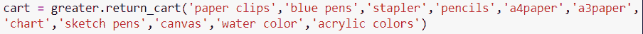
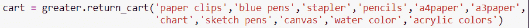
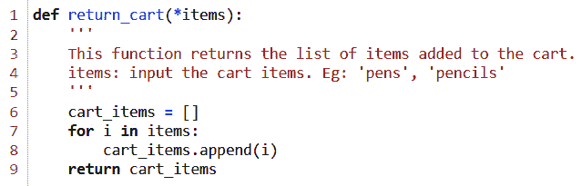
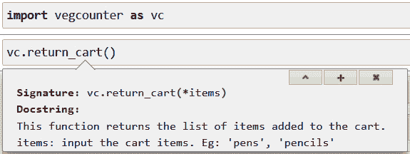
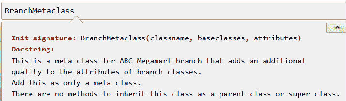

# *第十六章*：遵循最佳实践

在本章中，我们将学习一些 Python 编程的最佳实践，这些实践我们可以遵循并将其应用于元编程。Python 增强提案 8（PEP 8）中建议的实践，即 Python 代码的风格指南，也适用于元编程。

PEP 8 背后的概念起源于 Guido van Rossum、Barry Warsaw 和 Nick Coghlan 的文档，并在[`peps.python.org/pep-0008/`](https://peps.python.org/pep-0008/)中进行了详细解释。本章将涵盖 PEP 8 的一些重要概念，并通过使用*ABC Megamart*的示例来展示它们如何在元编程以及一般的 Python 编程中实现。

在本章中，我们将探讨以下主要主题：

+   遵循 PEP 8 标准

+   编写清晰的注释以供调试和重用

+   添加文档字符串

+   命名约定

+   避免重用名称

+   避免不必要的元编程

到本章结束时，你将了解执行 Python 元编程的最佳实践。

# 技术要求

本章中分享的代码示例可在 GitHub 上找到，地址为[`github.com/PacktPublishing/Metaprogramming-with-Python/tree/main/Chapter16`](https://github.com/PacktPublishing/Metaprogramming-with-Python/tree/main/Chapter16)。

# 遵循 PEP 8 标准

在本节中，我们将探讨在用 Python 元编程编写应用程序时应遵循的 PEP 8 标准。我们将使用*ABC Megamart*的示例来应用 PEP 8 文档中的这些标准。

在本节中，我们不会考虑我们遵循的编码标准是否正确，而是将考虑易于维护的编码标准与不易维护的编码标准之间的区别。

## 缩进

Python 是一种对缩进非常敏感的语言，如果缩进不正确，可能会抛出许多错误。对代码的整体缩进保持纪律有助于避免错误，并使代码更易于阅读。在这个例子中，让我们看看我们如何保持正确的缩进。

要开始查看缩进，让我们从一个大于 10 项的计数器示例开始。我们首先定义一个名为`GreaterThan10Counter`的类，并包含一个`return_cart`方法来返回购物车中的商品：

```py
class GreaterThan10Counter():
```

```py
    def return_cart(self, *items):
```

```py
        cart_items = []
```

```py
        for I in items:
```

```py
            cart_items.append(i)
```

```py
        return cart_items
```

让我们再为这个类创建一个对象实例：

```py
greater = GreaterThan10Counter()
```

接下来，我们创建一个名为`cart`的变量，它将存储`return_cart`方法返回的值。鉴于这个类是用于大于 10 项的计数器，购物车返回的商品数量将超过 10，因此代码将不易阅读。

以下截图显示了代码在代码编辑器中的样子：


图 16.1 – 购物车变量赋值

### 难以维护

如果我们将代码的无形部分移到下一行，*图 16.1* 中 `cart` 变量的代码将如下所示：



图 16.2 – 未对齐调整的 cart 变量

上述代码本身并没有错误，因为我们运行它时它仍然会执行而不会出错。唯一的问题是它将很难维护。

### 易于维护

现在让我们通过将代码与符号对齐来改变缩进，使其易于阅读和维护，如果其他开发者需要接管编辑，代码看起来如下：



图 16.3 – 调整后的 cart 变量

现在我们已经理解了这一点，让我们看看下一个最佳实践，即以整洁的方式展示代码。

## 整洁的表示

现在让我们看看在编写代码时如何以及在哪里添加空格。

### 难以维护

让我们看看以下示例，我们将定义一个名为 `signature` 的 `decorator` 函数，操作符和它们对应的变量之间没有空格：

```py
def signature(branch):
```

```py
    def footnote(*args):
```

```py
        LOGO='\33[43m'
```

```py
        print(LOGO+'ABC Mega Mart')
```

```py
        return branch(*args)
```

```py
    return footnote
```

让我们进一步在另一个名为 `manager_manhattan` 的函数上调用 `decorator`，操作符和变量之间没有空格：

```py
@signature
```

```py
def manager_manhattan(*args):
```

```py
    GREEN='\033[92m'
```

```py
    SELECT='\33[7m'
```

```py
    for arg in args:
```

```py
        print(SELECT+GREEN+str(arg))
```

接下来，让我们按照以下方式调用函数：

```py
manager_manhattan('John M','john.m@abcmegamart.com','40097 5th Main Street','Manhattan','New York City','New York',11007)
```

上述代码仍然可以正常运行而不会出错，但代码的展示并不整洁，也不容易维护，因为很难区分变量和它的操作符：

```py
ABC Mega Mart
```

```py
John M
```

```py
john.m@abcmegamart.com
```

```py
40097 5th Main Street
```

```py
Manhattan
```

```py
New York City
```

```py
New York
```

```py
11007
```

让我们在代码中添加空格。

### 易于维护

让我们在 `signature` 函数中添加空格：

```py
def signature(branch):
```

```py
    def footnote(*args):
```

```py
        LOGO = '\33[43m'
```

```py
        print(LOGO + 'ABC Mega Mart')
```

```py
        return branch(*args)
```

```py
    return footnote
```

同样，让我们也在 `manager_manhattan` 函数中添加空格：

```py
@signature
```

```py
def manager_manhattan(*args):
```

```py
    GREEN = '\033[92m'
```

```py
    SELECT = '\33[7m'
```

```py
    for arg in args:
```

```py
        print(SELECT + GREEN + str(arg))
```

现在让我们调用这个函数：

```py
manager_manhattan('John M', 'john.m@abcmegamart.com', 
```

```py
                  '40097 5th Main Street', 'Manhattan', 'New York City', 'New York',11007)
```

运行上述代码会产生以下输出：

```py
ABC Mega Mart
```

```py
John M
```

```py
john.m@abcmegamart.com
```

```py
40097 5th Main Street
```

```py
Manhattan
```

```py
New York City
```

```py
New York
```

```py
11007
```

由于添加了空格，上述代码使得区分变量和它们对应的操作符变得更加容易。

通过这个理解，让我们看看下一个最佳实践，即在代码中添加注释。

# 为调试和重用编写清晰的注释

编写内联注释有助于我们理解为什么编写特定的代码块，并且我们可以随着代码的变化更新注释。我们建议编写注释，以便将来更容易调试代码。然而，请确保注释与代码相关。让我们看看几个内联注释的例子。

### 冗余注释

让我们看看以下示例，其中我们创建一个元类并从另一个类中调用元类：

```py
class ExampleMetaClass1(type):
```

```py
    def __new__(classitself, *args):
```

```py
        print("class itself: ", classitself)
```

```py
        print("Others: ", args)
```

```py
        return type.__new__(classitself, *args)
```

```py
class ExampleClass1(metaclass = ExampleMetaClass1):    
```

```py
    int1 = 123             # int1 is assigned a value of 123
```

```py
    str1 = 'test'
```

```py
    def test():
```

```py
        print('test')
```

在前面的代码中，注释清楚地解释了代码所执行的内容，这可以通过简单地查看代码来理解。当我们想要将来调试或修改代码时，这不会很有帮助。

### 相关注释

让我们看看 Singleton 设计模式并添加相关注释：

```py
class SingletonBilling:         # This code covers an example of Singleton design pattern
```

```py
    billing_instance = None
```

```py
    product_name = 'Dark Chocolate'
```

```py
    unit_price = 6
```

```py
    quantity = 4
```

```py
    tax = 0.054    
```

```py
    def __init__(self):
```

```py
        if SingletonBilling.billing_instance == None:
```

```py
            SingletonBilling.billing_instance = self
```

```py
        else:
```

```py
            print("Billing can have only one instance")
```

```py
    def generate_bill(self):
```

```py
        total = self.unit_price * self.quantity 
```

```py
        final_total = total + total*self.tax
```

```py
        print('***********------------------**************')
```

```py
        print('Product:', self.product_name)
```

```py
        print('Total:',final_total)
```

```py
        print('***********------------------**************')
```

在前面的代码中，注释指定了 `SingletonBilling` 的用途，而不是提及代码执行的明显任务。

通过这个理解，让我们看看下一个最佳实践，即添加文档字符串。

# 添加文档字符串

添加文档字符串是为了提供更多关于打算在其他程序或应用中导入和使用的代码的信息。文档字符串将为最终用户提供有关他们将要从程序中调用的代码的信息。这对于最终用户不是库的开发者，而是一个用户来说特别有帮助。让我们看看文档字符串应该在哪里使用的一个例子。

让我们首先创建一个名为 `vegcounter.py` 的 Python 文件，并添加以下代码：

```py
def return_cart(*items):
```

```py
    '''
```

```py
    This function returns the list of items added to the cart.    
```

```py
    items: input the cart items. Eg: 'pens', 'pencils'
```

```py
    '''
```

```py
    cart_items = []
```

```py
    for i in items:
```

```py
        cart_items.append(i)
```

```py
    return cart_items
```

在前面的代码中，我们通过提供函数及其参数的描述来定义了文档字符串。

Python 文件看起来如下所示：



图 16.4 – 添加到 vegcounter.py 的文档字符串

现在让我们按照以下方式将 `vegcounter.py` 导入到另一个程序中：

```py
import vegcounter as vc
```

注意，在这个程序中，`vegcounter` 内部的函数代码对最终用户不可访问，但 `vegcounter` 中的函数可以被最终用户的程序调用。

下面的截图演示了文档字符串如何提供本例中所需的信息：



图 16.5 – 文档字符串示例

在这个例子中，我们在 Python 文件中添加的文档字符串为最终用户提供有关函数及其相应参数以及示例的信息。

## 元编程的文档字符串

在这个例子中，让我们定义一个名为 `BranchMetaClass` 的元类，并添加一个文档字符串，说明这是一个元类，不应作为超类或父类继承。将此代码保存到 `branch.py`：

```py
class BranchMetaclass(type):
```

```py
    '''
```

```py
    This is a meta class for ABC Megamart branch that adds an additional 
```

```py
    quality to the attributes of branch classes. 
```

```py
    Add this as only a meta class.
```

```py
    There are no methods to inherit this class as a parent class or super class.    
```

```py
    '''
```

```py
    def __new__(classitself, classname, baseclasses, attributes):
```

```py
        import inspect
```

```py
        newattributes = {}
```

```py
        for attribute, value in attributes.items():
```

```py
            if attribute.startswith("__"):
```

```py
                newattributes[attribute] = value
```

```py
            elif inspect.isfunction(value):
```

```py
                newattributes['branch' + attribute.title()] = value
```

```py
            else:
```

```py
                newattributes[attribute] = value
```

```py
        return type.__new__(classitself, classname, baseclasses, newattributes)
```

现在让我们按照以下方式导入分支及其相应的元类：

```py
from branch import BranchMetaclass
```

现在让我们调用 `BranchMetaclass` 来检查文档字符串：

```py
BranchMetaclass
```

文档字符串在以下屏幕截图中显示：



图 16.6 – BranchMetaclass 的文档字符串

这是一个关于如何将文档字符串作为最佳实践包含在内的例子。在类定义中添加文档字符串为最终用户提供正确应用方法或类所需的信息。

通过这个理解，让我们进一步看看在 Python 代码中应遵循的命名约定。

# 命名约定

Python 中的命名约定是关于如何在 Python 程序中命名各种元素的建议，以确保易于导航和一致性。遵循代码中的统一命名约定可以简化代码导航、连接点和理解流程。这是另一个重要的标准，有助于开发可维护的应用程序。

在本节中，我们将了解如何理想地命名类、变量、函数和方法。

## 类名

在创建一个新类时，建议以大写字母开头，后面跟小写字母，并在类名中需要区分单词时进行大写。

例如，让我们定义一个用于计费计数器的类。

以下风格不是首选的命名约定：

```py
class billing_counter:
```

```py
    def __init__(self, productname, unitprice, quantity, tax):
```

```py
        self.productname = productname
```

```py
        self.unitprice = unitprice
```

```py
        self.quantity = quantity
```

```py
        self.tax = tax
```

使用前面的命名约定，我们仍然能够执行代码，并且它将按预期工作。但是，使用一个定义良好的命名风格来维护类名将使未来库的管理更容易。首选的类命名风格如下：

```py
class BillingCounter:
```

```py
    def __init__(self, productname, unitprice, quantity, tax):
```

```py
        self.productname = productname
```

```py
        self.unitprice = unitprice
```

```py
        self.quantity = quantity
```

```py
        self.tax = tax
```

驼峰式命名法用于命名类，以便它们可以与变量、方法和函数区分开来。接下来将解释变量的命名约定，然后是方法和函数。

## 变量

在创建新变量时，建议使用全部小写字母作为变量名，如果相关，后面跟数字。当变量名中有多个单词时，使用下划线操作符分隔它们是一种好习惯。这也帮助我们区分变量和类，因为它们遵循驼峰式命名约定。

让我们看看一个变量不应该如何命名的例子：

```py
class BillingCounter:
```

```py
    def __init__(self, PRODUCTNAME, UnitPrice, Quantity, TaX):
```

```py
        self.PRODUCTNAME = PRODUCTNAME
```

```py
        self.UnitPrice = UnitPrice
```

```py
        self.Quantity = Quantity
```

```py
        self.TaX = TaX
```

现在我们来看一个变量命名首选方法的例子：

```py
class BillingCounter:
```

```py
    def __init__(self, product, price, quantity, tax):
```

```py
        self.product = product
```

```py
        self.price = price
```

```py
        self.quantity = quantity
```

```py
        self.tax = tax
```

让我们进一步看看另一个变量命名的首选方法：

```py
class BillingCounter:
```

```py
    def __init__(self, product_name, unit_price, quantity, tax):
```

```py
        self.product_name = product_name
```

```py
        self.unit_price = unit_price
```

```py
        self.quantity = quantity
```

```py
        self.tax = tax
```

## 函数和方法

与变量类似，对于函数和方法名称使用小写字母是最佳实践偏好。当变量名中有多个单词时，使用下划线操作符分隔它们是一种好习惯。

让我们看看一个函数或方法不应该如何命名的例子：

```py
class TypeCheck:
```

```py
    def Intcheck(self,inputvalue):
```

```py
        if (type(inputvalue) != int) or (len(str(inputvalue)) > 2):
```

```py
            return False
```

```py
        else:
```

```py
            return True
```

```py
    def STRINGCHECK(self,inputvalue):
```

```py
        if (type(inputvalue) != str) or (len(str(inputvalue)) > 10):
```

```py
            return False
```

```py
        else:
```

```py
            return True
```

现在我们来看一个命名方法或函数的首选方法的例子：

```py
class TypeCheck:
```

```py
    def int_check(self,input_value):
```

```py
        if (type(input_value) != int) or (len(str(input_value)) > 2):
```

```py
            return False
```

```py
        else:
```

```py
            return True
```

```py
    def string_check(self,input_value):
```

```py
        if (type(input_value) != str) or (len(str(input_value)) > 10):
```

```py
            return False
```

```py
        else:
```

```py
            return True
```

这些命名约定是在从头开发新代码或库时可以遵循的建议。然而，如果代码已经开发并且正在积极维护，建议遵循代码中使用的命名约定。

# 避免名称重复

在这个例子中，让我们看看如何使用变量或类名以保持代码的可重用性的另一个最佳实践。有时在按顺序编写代码时，可能会觉得重用相同的类或变量名很容易。重用名称将使重用代码中的类、变量、方法或函数变得困难，因为在多个场景中调用它们时，相同的名称被用于不同的元素。

让我们通过一个例子来了解不推荐使用的方法。让我们定义两个名为 `Branch` 的类，并分别给它们定义一个名为 `maintenance_cost` 的方法。

第一个 `Branch` 类的定义如下：

```py
class Branch:
```

```py
    def maintenance_cost(self, product_type, quantity):
```

```py
        self.product_type = product_type
```

```py
        self.quantity = quantity
```

```py
        cold_storage_cost = 100
```

```py
        if (product_type == 'FMCG'):
```

```py
            maintenance_cost = self.quantity * 0.25 + cold_storage_cost    
```

```py
            return maintenance_cost
```

```py
        else:
```

```py
            return "We don't stock this product"
```

第二个 `Branch` 类的定义如下：

```py
class Branch:
```

```py
    def maintenance_cost(self, product_type, quantity):
```

```py
        self.product_type = product_type
```

```py
        self.quantity = quantity
```

```py
        if (product_type == 'Electronics'):
```

```py
            maintenance_cost = self.quantity * 0.05
```

```py
            return maintenance_cost
```

```py
        else:
```

```py
            return "We don't stock this product"
```

在前面的代码中，我们有两个执行不同任务的 `Branch` 类。现在让我们实例化 `Branch` 类，假设第一个 `Branch` 类需要在代码的稍后位置执行：

```py
branch = Branch()
```

```py
branch.maintenance_cost('FMCG', 1)
```

前面的代码调用了最后定义的 `Branch` 类，因此最终丢失了第一个 `Branch` 类的定义：

```py
"We don't stock this product"
```

为了避免这种混淆，始终为代码中的不同元素提供不同的名称是首选的。

现在我们来看一下推荐的方法。我们将定义一个名为 `Brooklyn` 的类，其中 FMCG 产品按以下方式存储：

```py
class Brooklyn:
```

```py
    def maintenance_cost(self, product_type, quantity):
```

```py
        self.product_type = product_type
```

```py
        self.quantity = quantity
```

```py
        cold_storage_cost = 100
```

```py
        if (product_type == 'FMCG'):
```

```py
            maintenance_cost = self.quantity * 0.25 + cold_storage_cost    
```

```py
            return maintenance_cost
```

```py
        else:
```

```py
            return "We don't stock this product"
```

我们将定义另一个名为 `Queens` 的类，其中电子产品按以下方式存储：

```py
class Queens:
```

```py
    def maintenance_cost(self, product_type, quantity):
```

```py
        self.product_type = product_type
```

```py
        self.quantity = quantity
```

```py
        if (product_type == 'Electronics'):
```

```py
            maintenance_cost = self.quantity * 0.05
```

```py
            return maintenance_cost
```

```py
        else:
```

```py
            return "We don't stock this product"
```

我们现在可以无任何问题地调用这两个类及其方法：

```py
brooklyn = Brooklyn()
```

```py
brooklyn.maintenance_cost('FMCG', 1)
```

`Brooklyn` 的输出如下：

```py
100.25
```

同样，我们可以单独实例化 `Queens` 类：

```py
queens = Queens()
```

```py
queens.maintenance_cost('Electronics', 1)
```

`Queens` 的输出如下：

```py
0.05
```

在了解了为什么我们应该避免重用名称之后，我们可以进一步了解在哪里避免元编程。

# 避免在不必要的地方使用元编程

仅因为 Python 中有这个特性就写太多的元编程会使整体代码非常复杂且难以处理。在选择为你的应用程序编写元编程时，以下方面应予以考虑：

+   确定你的用例，并根据你需要修改代码的频率来确定是否需要元编程。

+   理解你需要多频繁地操作代码的核心元素（如类、方法、变量）之外的部分。

+   检查你的解决方案是否仅使用面向对象编程即可开发，或者它是否依赖于元类、装饰器和代码生成等元素。

+   检查你的团队在开发后是否具备维护元编程特性的相关技能。

+   确认你没有依赖于不支持某些元编程特性的早期版本的 Python。

在应用设计阶段计划应用元编程技术时，以下是一些需要考虑的点。

# 摘要

在本章中，我们通过各种示例了解了 PEP 8 标准推荐的 Python 最佳实践。我们探讨了缩进的推荐方法和正确使用空白字符。我们还探讨了如何编写有用的注释以及在哪里包含文档字符串。

我们通过一些示例学习了推荐的命名约定。我们还探讨了为什么需要避免重用名称以及在哪里避免元编程。

虽然元编程的概念是高级且复杂的，但我们试图通过本书中的简单、直接的示例来解释它们，以保持内容的趣味性和吸引力。学习 Python 及其特性是一个持续的过程。继续关注 Python 的未来版本，并探索它为元编程提供的新功能。
